# 二、创建我们的第一个 Qt 和 OpenCV 项目

自从 Qt 和 OpenCV 框架引入开源社区和世界以来已经有很长时间了，但是直到最近人们才开始意识到将两者结合使用的好处，并且这种结合在计算机视觉专家中很受欢迎。 。 我们很幸运，因为我们处于这两个框架的发展历史的一个阶段，在这两个框架中，它们都已经足够成长，可以很容易地组合在一起，而几乎不需要付出任何努力。 这些框架的稳定性也不再是问题，它们有时被用来构建在非常敏感的硬件上运行的应用。 即使在互联网上进行简短搜索也可以证明这一点。 正如我们将在本章中了解到的那样，Qt Creator 已成为几乎完全成熟的 IDE，它提供了非常简单的机制来使用 OpenCV 集成和构建计算机视觉应用。 现在，我们已经了解了第 1 章，“OpenCV 和 Qt 简介”中遇到的所有安装和配置，我们将仅专注于使用 Qt 和 OpenCV 构建应用。

在本章中，我们将通过学习有关 Qt Creator IDE 以及如何使用它来创建项目的方式开始动手工作，因为在本书的其余部分和所构建的任何内容中，我们实际上都使用 Qt Creator。 您将了解它提供的所有好处，并了解为什么它在其简单性，外观和感觉上都是非常强大的 IDE。 您将了解 Qt Creator 的设置和详细信息，以及如何更改它们以满足您的需求。 您还将了解 Qt 项目文件，源代码，用户界面等。 在下一章第 3 章，“创建综合的 Qt + OpenCV 项目”时，我们将在下一章中使用 Qt Creator 构建应用时的所有幕后细节。 ，但在本章中，我们还将介绍一些有用的细节，以使您对真实项目的结构有清晰的了解。 在创建应用的上下文中将涵盖所有这些主题，以便您通过重复本章在此处学习的相同任务来更好地理解。

您应该注意，本章将学到的内容将帮助您节省大量时间，但是只有当您在计算机上真正地重复了所有这些并且实际上总是尝试使用它时，才会如此。 您可以使用 Qt Creator 进行 C++ 编程，甚至适用于非 Qt 应用。

最后，我们将通过创建一个实际的计算机视觉应用并将一些基本的图像处理算法应用于图像来结束本章。 本章的目的是使您为本书的其余部分做好准备，并使您熟悉本书中将要遇到的一些关键字，例如信号，插槽，小部件等。

在本章中，我们将介绍以下主题：

*   配置和使用 Qt Creator IDE
*   创建 Qt 项目
*   Qt Creator 中的小部件
*   创建跨平台的 Qt + OpenCV 项目文件
*   使用 Qt Creator 设计用户界面
*   使用 Qt Creator 编写用户界面代码

# 什么是 Qt Creator？

Qt Creator 与 Qt 框架不是一回事。 是的，这是对的; 它只是由 Qt 框架创建的 IDE。 这使许多对这些术语有些陌生的人感到困惑。 那么，这到底意味着什么？ 在一个非常基本的定义中，这意味着您可以使用 Qt Creator 或任何其他 IDE 来创建 Qt 应用。 在某个时刻，当 Qt 框架充斥着类和函数时，负责 Qt 的人们决定使用出色的 Qt 框架本身来创建 IDE，瞧！ 一个没有操作系统和 C++ 编译器类型的 IDE 诞生了。 Qt Creator 是一个 IDE，它支持与 Qt 框架更好地集成，它是开源的（基本上意味着您可以免费使用它），它是跨平台的，并且几乎包含了 IDE 所需的所有工具。 这是 Qt Creator 中的欢迎模式的屏幕截图：

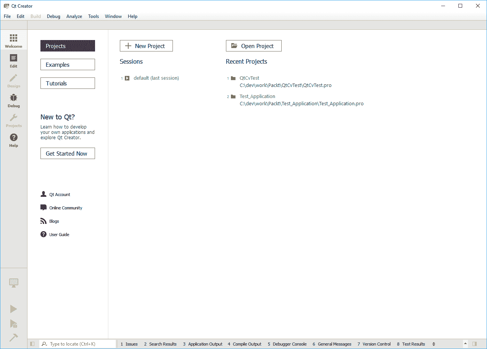

请注意，我们一定会使用所有 Qt Creator 功能，但是在深入研究之前先知道它的功能是一个好主意。 以下是 Qt Creator 的一些最重要的功能：

*   使用会话管理多个 IDE 状态
*   管理多个 Qt 项目
*   设计用户界面
*   编辑代码
*   在所有 Qt 支持的平台上构建和运行应用
*   调试应用
*   上下文相关帮助

根据您认为重要的内容，您可能可以在列表中添加更多项，但是前面的列表中提到的本质上是 IDE（集成开发环境）的定义，它应该是提供应用开发所需的和绝对必要的所有功能的工具。 另外，您始终可以查阅 Qt 文档以了解 Qt Creator 的其他功能。

# IDE 概览

在本节中，我们将漫步 Qt Creator 的不同部分。 搬到新地方时，最好先了解周围的环境和周围环境。 您一开始可能不会注意到这些差异，但是实际上，这是非常相似的情况，您将逐渐意识到。 您将在整本书中使用 Qt Creator 环境，并且在阅读本书的整个过程中，基本上都将使用它，并且以后希望在您的职业生涯中长期从事个人项目， 或研究。 因此，让我们开始散步，开始接触事物，看看真正发生了什么。

让我们回到本章的第一张图片。 您在此处看到的是 Qt Creator 的初始屏幕，或者稍后将看到，它是 Qt Creator 的欢迎模式。 您可能会注意到，即使您安装了相同版本的 Qt，此处的图标和颜色还是与计算机上的略有不同。 不用担心，正如您稍后将看到的那样，它只是一个主题，您将学习如何根据自己的样式和喜好对其进行更改。 实际上，您会在整本书中看到来自 Qt 不同主题的屏幕截图，但请记住，这只是外观和感觉，与功能无关。 Qt Creator 的设计使其可以在其中的不同模式之间极其快速和轻松地进行切换。 切换到每种模式几乎完全改变了 Qt GUI 主要区域中的内容，并且完全达到了自己独特的目的。 让我们看看 Qt 支持哪些模式以及它们的用途。

# Qt Creator 模式

Qt Creator 具有六种不同的模式，可以帮助您打开项目，编辑代码，设计用户界面等。 让我们浏览以下列表，然后尝试查看它们的确切含义：

*   欢迎
*   编辑
*   设计
*   调试
*   项目
*   帮助

我相信您已经注意到，在我们进一步详细介绍它们之前，您可以使用 Qt Creator 屏幕左侧的按钮在不同模式之间进行切换，如以下屏幕截图所示：


对于 Qt Creator 所做的几乎所有事情，都有专用的键盘快捷键，并且在不同模式之间进行切换也是这种情况。 您可以通过简单地将鼠标悬停在屏幕上而不用花一会儿时间来了解屏幕上所有内容的快捷键，然后会弹出一个提示框，告诉您有关此内容的更多信息，因此我们不会涵盖快捷键序列的完整列表，因为您可以使用上述方法轻松找到最新的热键。 如下面的屏幕截图所示，我将鼠标光标停留在“设计模式”按钮上，它确实告诉了我按钮的用途（即切换到设计模式）和键盘快捷键，即`Ctrl + 3`：


现在，我们将了解有关 Qt Creator 中不同模式及其用途的更多信息。 您应该注意，仅列出并遍历 Qt Creator 中每个功能的细节不在本书的讨论范围之内，但是我们肯定会涵盖本书中使用的 Qt Creator 的所有方面。 Qt Creator 和有关 Qt 的几乎所有内容都在迅速发展，最好始终关注文档页面并亲自尝试新功能或更改的功能。

# 欢迎模式

这是打开 Qt Creator 时的初始模式，可以始终使用左侧的`Welcome`按钮将其切换为：


关于此模式，最重要的注意事项是它实际上具有三种不同的子模式，分别提到如下：

*   项目
*   示例
*   指南

# 项目

此屏幕（或“欢迎”模式的子模式）可用于使用“新建项目”按钮创建新的 Qt 项目。 在第 1 章，“OpenCV 和 Qt 简介”中，您已经非常简短地体验了它的完成方式。 如果单击“打开项目”按钮，也可以打开计算机上保存的所有项目。 还有一个包含“最近的项目”的列表，该列表非常有用，既可以提醒您正在处理的内容，又可以作为访问它们的快捷方式。 在此模式下也有可见的会话，这是 Qt Creator 的一些最有趣的功能。 会话用于存储 IDE 的状态，并在以后需要时恢复该状态。 在本书中，我们不会理会会话，但是如果正确使用它们，它们将非常方便，并且可以在开发过程中节省大量时间。

借助示例，在 Qt Creator 中了解会话将非常简单。 假设您正在某个项目上，并且在 Qt Creator 中打开了一些项目，或者在代码中设置了一些断点，依此类推。 诸如此类的所有信息都存储在所谓的会话中，并且可以通过在会话之间进行切换来轻松地恢复。

如果单击“新建项目”按钮，将显示“新建项目”窗口，该窗口允许您根据要开发的内容选择项目类型（或模板）。 稍后您将看到，我们将仅使用`Applications/Qt Widgets Application`和`Library/C++  Library`选项，因为遍历所有可能的 Qt 项目模板不在本书的范围之内。 但是，如下面的屏幕快照所示，“新建项目”窗口包含三个部分，您只需选择它们，就可以对每种项目类型获得非常有用的描述。 使用第一个列表和第二个列表单击任何项​​目类型后（在下面的屏幕截图中），它们的描述将出现在第三个窗格中。 这是选择`Qt Widgets Application`项目类型时出现的描述（请参见下图，尤其是 3 号窗格）：

*   为桌面创建 Qt 应用，包括基于 Qt Designer 的主窗口
*   预选用于构建应用的桌面 Qt（如果有）
*   支持平台：台式机

如您所见，它包含了非常有用的洞察力，有助于您了解此类型的模板适用于哪种项目。 尝试遍历所有各种选项以熟悉项目类型。 知道可能的项目类型是一个好主意，即使您不会立即使用它们。 以下是“新建项目”窗口的屏幕截图：


# 示例

这是我在 Qt Creator 中最喜欢的部分之一，毫无疑问，这是了解 Qt 并了解如何使用它的最重要的地方之一。 这里有很多带有解释的示例，只需单击一下即可进行构建。 示例中还有一个搜索栏，可用于使用搜索关键字搜索不同的示例。

# 指南

当前，这部分内容与示例非常相似，因为它旨在训练 Qt 开发人员，但主要区别在于它包含视频演示和示例。 确保您不时浏览它们，以获取有关新功能以及如何使用它们的最新信息。

在进入下一个 Qt Creator 模式（即编辑模式）之前，我们需要创建一个新项目。 在本章的其余部分中，我们将使用此示例，因为其余模式需要一个项目供我们使用。 现在您已经熟悉了欢迎模式，您可以继续创建一个新的 Qt Widgets 应用。 当我们测试 Qt 和 OpenCV 安装时，您已经在第 1 章，“OpenCV 和 Qt 简介”中创建了一个项目。 您需要重复完全相同的步骤。 这次，只需确保将项目命名为`Hello_Qt_OpenCV`即可。 这是您需要采取的步骤：

*   在“欢迎”模式中单击“新建项目”按钮，或按 `Ctrl + N`。
*   选择“应用”，然后在“新建项目”窗口中选择“Qt Widgets 应用”。
*   将项目名称设置为`Hello_Qt_OpenCV`，然后选择要在其中创建文件夹。如果您之前已做过此操作，并且选中了“用作默认项目位置”复选框，则无需在此处更改任何有关“在其中创建”的内容。 然后，单击“下一步”。
*   选择唯一的桌面工具包选项，具体取决于您的操作系统。 然后，单击“下一步”。
*   保持类信息不变。 默认情况下，它应该是`MainWindow`，这是确定的，然后单击“下一步”。
*   在项目管理页面上时，只需单击完成。 现在，您的项目已经准备就绪，您可以按照本章的其余示例和主题进行操作。

# 编辑模式

使用 Qt Creator 时，编辑模式可能是您将花费大部分时间的模式。 它主要用于代码编辑以及有关 Qt 项目基于文本的源文件的所有内容。 您始终可以使用屏幕右侧的“编辑”按钮切换到“编辑”模式，如下所示：


首先，让我们看一下下面的屏幕快照，该屏幕快照涉及在编辑模式下可见的不同窗格。 如您所见，共有三个部分。 以`1`突出显示的部分是主编码区域，`2`是左侧边栏，`3`是右侧边栏。 默认情况下，只有左侧边栏是可见的，但是您可以使用屏幕底部每一侧箭头所指向的小按钮来打开或关闭每个边栏。 关于每个窗格（侧边栏和中心的主要编码区域）要注意的最重要事实是，可以使用每个窗格顶部的箭头指出的按钮来拆分，复制或更改它们的模式。 侧：


主代码编辑区是一个轻量级的代码编辑器，它允许代码完成，代码突出显示和上下文相关帮助，这些基本上就是您将要使用的最重要的内容。 稍后将看到，您可以使用首选的颜色，字体等进行配置。 您也可以使用顶部的“拆分”按钮拆分代码编辑器区域，并同时处理多个文件。 尝试键入一些您知道的代码，类或任何 C++ 代码，并随代码完成一起玩，还可以尝试通过在代码编辑器中的鼠标光标位于 Qt 类上时按`F1`来使用上下文相关帮助。 这些工具将在很长一段时间内成为您最好的朋友，尤其是当您将来开始处理自己的项目时。

您可以为左右两侧的侧栏中的每个窗格选择以下不同的模式：

*   项目：这包含打开的项目及其包含文件的列表。
*   打开：这些文档仅显示您已经打开的文件。 您可以通过单击每个按钮旁边的`X`按钮将其关闭。
*   书签：显示您在代码中创建的所有书签。 使用此窗格和功能可以在编程期间以及以后在测试和调试代码时节省大量时间。
*   文件系统：这基本上是文件浏览器窗格。 请注意，此窗格显示项目文件夹中的所有文件（如果您选中窗格中的相关复选框，甚至会显示隐藏文件），还可以用于浏览计算机上的其他文件夹，而不仅仅是当前项目。
*   类视图：可用于查看当前项目中类的层次结构。
*   大纲：与“类视图”不同，它显示了当前开源文件中所有方法和符号的层次结构，而不是整个项目。 在前面的屏幕截图中，该窗格是右侧栏上激活的窗格。
*   测试：这将显示项目中所有可用的测试。
*   类型和包含层次结构：从其标题可以猜到，它可以用于查看类的层次结构和包含的标头的层次结构。

重要的是要注意，根据您的编程习惯，您可能会经常使用某些窗格，而很少使用某些其他窗格，因此请确保将其设置为适合您自己的样式和需求，并在编程时节省大量时间。

# 设计模式

这是您进行所有用户界面设计的方式。 您可以使用 Qt Creator 屏幕左侧的“设计”按钮切换到“设计”模式。 请注意，如果此按钮显示为灰色（表示该按钮处于非活动状态），则需要首先选择一个用户界面文件（`*.ui`），因为使用设计器只能打开`ui`文件。 为此，您可以双击左窗格（“项目”窗格）中的`mainwindow.ui`文件：


设计模式包含功能强大的 GUI 设计器所需的所有工具。 它具有 **WYSIWYG**（**所见即所得**）类型的 GUI 编辑器，允许添加，删除，编辑或编写可从中添加或删除的 Qt 窗口小部件的代码。 用户界面。

Qt 小部件是 Qt 用户界面上最基本的组件类型。 基本上，用户界面上的所有内容（包括整个窗口本身），例如按钮，标签，文本框，都是 Qt 窗口小部件。 Qt 窗口小部件都是`QWidget`类的所有子类，这使它们可以接收用户输入事件（例如，鼠标和键盘事件），并在用户界面上自行绘制（或绘制）。 因此，必须从`QWidget`类中子类化任何具有可视外观并打算放在用户界面上的 Qt 类。 在整本书中，您将学习许多 Qt 小部件类，但是一些示例将是`QPushButton`，`QProgressBar`，`QLineEdit`等。 他们的目的几乎可以从他们的名字中立即辨认出来。
请注意，所有 Qt 类（没有任何明显的例外）的名称都以`Q`（大写）开头。

在设计模式下有一个 Qt Creator 的屏幕截图（如下所示）。 如此处所示，它与我们在“编辑”模式下看到的内容非常相似，屏幕分为三个主要部分。 您可以在中间的主要区域以任何方式拖放，调整大小，删除或直观地编辑用户界面。 在屏幕的左侧，有可以添加到用户界面的小部件列表。 您应该尝试拖放其中的一些（基本上是其中的任何一个），只是为了使设计师大致上满意并更好地了解其工作原理。 在本书的后面，我们将设计很多不同的用户界面，并逐步为您介绍许多功能，但是最好自己尝试一些设计并至少熟悉一些功能，这是一个很好的主意。 这一切的感觉。 在屏幕右侧，您可以在用户界面上查看小部件的分层视图，并修改每个小部件的属性。 因此，如果继续进行操作，并在用户界面中添加了一些小部件，您会注意到，无论何时选择其他小部件，属性及其值都会根据该特定小部件而变化。 在这里，您可以编辑设计者可用的小部件的所有属性：

与大多数其他 IDE 一样，您通常可以通过许多不同的途径来实现相同的目标。 例如，您可以使用编辑器从代码中设置窗口小部件的大小，甚至可以采用不推荐的方式在文本编辑器中修改其 UI 文件。 您应该能够根据自己的特定需求做出决定，因为没有一种方法是最好的，而且它们都只是在不同情况下适用。 通常，最好在用户界面编辑器中设置初始属性，并根据需要在整个代码中更新它们的值。 您将在本章的后面部分中对此进行了解。


在用户界面设计器中央部分的底部，您可以看到“动作编辑器”和“信号与插槽编辑器”。 要了解它们的工作原理，以及实际上 Qt 的工作原理，我们需要首先了解 Qt 中的信号和插槽。 因此，从定义信号和插槽的概念开始我们的第一次相遇开始，然后再通过一个真实的示例进行体验，这是一个非常好的主意。

Qt 框架对标准 C++ 编程的最重要添加是信号和插槽机制，这也是使 Qt 如此易于学习且功能强大的原因。 这绝对也是 Qt 与其他框架之间最重要的区别。 可以将它视为 Qt 对象和类之间的消息传递方法（或顾名思义，只是发出信号）。 每个 Qt 对象都可以发出可以连接到另一个（或相同）对象中的插槽的信号。 让我们通过一个简单的例子进一步分解它。 `QPushButton`是一个 Qt 小部件类，您可以将其添加到 Qt 用户界面中以创建按钮。 它包含许多信号，包括明显的按下信号。 另一方面，在我们创建`Hello_Qt_OpenCV`项目时自动创建的`MainWindow`（以及所有 Qt 窗口）包含一个名为`close`的插槽，可用于简单地关闭项目的主窗口 。 我相信您可以想象如果将按钮的按下信号连接到窗口的关闭插槽会发生什么。 有很多方法可以将信号连接到插槽，因此，从现在开始，在本书的其余部分中，只要需要在示例中使用它们，我们就会学习它们的每一种。

# 设计用户界面

从这里开始学习如何将 Qt 小部件添加到用户界面，并使它们对用户输入和其他事件做出反应。 Qt Creator 提供了非常简单的工具来设计用户界面并为其编写代码。 您已经看到了设计模式下可用的不同窗格和工具，因此我们可以从示例开始。 通过选择`mainwindow.ui`文件（这是我们从编辑模式进入主窗口的用户界面文件），确保首先切换到设计模式（如果尚未进入设计模式）。

在设计模式下，您可以在用户界面上查看可使用的 Qt 小部件列表。 从这些图标和名称可以立即识别出大多数这些小部件的用途，但是仍然有一些特定于 Qt 的小部件。 这是默认情况下 Qt Creator 中代表所有可用布局和小部件的屏幕截图：


以下是对 Qt Creator 设计模式（或从现在开始简称为 Designer）中可用小部件的简要说明，如前面的屏幕快照所示。 在设计器模式下，小部件基于其行为的相似性进行分组。 在继续进行列表操作时，请自己亲自尝试设计器中的每个功能，以感觉到将它们放置在用户界面上时的外观。 为此，您可以使用设计器模式将每个窗口小部件拖放到窗口上：

*   **布局**：这些布局用于管理窗口小部件的显示方式。 在外观上，它们是不可见的（因为它们不是`QWidget`子类），并且它们仅影响添加到它们的小部件。 请注意，布局根本不是小部件，它们是用来管理小部件的显示方式的逻辑类。 尝试在用户界面上放置任何布局小部件，然后在其中添加一些按钮或显示小部件，以查看其布局如何根据布局类型进行更改。 查看每个示例图片以了解它们的行为。
    *   **垂直布局**：它们用于具有垂直布局，即一列小部件。 （此布局的等效 Qt 类称为`QVBoxLayout`）。 以下是它的屏幕截图：


*   **分隔符**：类似于布局，它们在视觉上不可见，但会影响将其他窗口小部件添加到布局时的显示方式。 请参阅示例图像，并确保自己尝试在小部件之间尝试使用两个垫片。 间隔符的类型为`QSpacerItem`，但是通常，它们绝不能直接在代码中使用。
    *   **水平分隔符**：这些可用于在一行中的两个小部件之间插入一个空格：

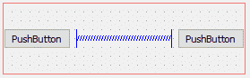


*   **按钮**：这些只是按钮。 它们用于提示操作。 您可能会注意到，单选按钮和复选框也在该组中，这是因为它们都继承自`QAbstractButton`类，该类是一个抽象类，提供了类按钮小部件所需的所有接口。
*   **按钮**：这些按钮可用于在用户界面上添加带有文本和/或图标的简单按钮（此小部件的等效 Qt 类称为`QPushButton`）。
*   **工具按钮**：这些按钮与按钮非常相似，但通常添加到工具栏中

Qt 窗口共有 3 种不同类型的条（实际上，一般来说是 Windows），它们在小部件工具箱中不可用，但是可以通过右键单击 Windows 中的窗口来创建，添加或删除它们。 设计器模式，然后从右键菜单中选择相关项目。 它们是：

1.菜单栏（`QMenuBar`）
2.工具栏（`QToolBar`）
3.状态栏（`QStatusBar`）

菜单栏是显示在窗口顶部的典型水平主菜单栏。 菜单中可以有任意数量的项目和子项目，每个项目和子项目都可以触发一个动作（`QAction`）。 您将在接下来的章节中了解有关操作的更多信息。 以下是菜单栏示例：


工具栏是一个可移动面板，其中可以包含与特定任务相对应的工具按钮。 这是一个示例工具栏。 请注意，它们可以在 Qt 窗口内移动甚至移出：

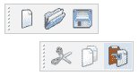

状态栏是底部的一个简单的水平信息栏，对于大多数基于窗口的应用是通用的。 每当在 Qt 中创建一个新的主窗口时，这三种类型的条形都将添加到该窗口中。 请注意，一个窗口上只能有一个菜单栏和一个状态栏，但是可以有任意数量的状态栏。 如果不需要它们，则需要将它们从“设计器”窗口右侧的对象层次结构中删除。 现在您已经熟悉了 Qt 中的三个不同的条形，可以从“Qt 欢迎”模式中的示例中搜索`Application Example`，以进一步了解它们，以及是否可以进一步自定义它们。

*   **命令链接按钮**：这是 Windows Vista 风格的命令链接按钮。 它们基本上是用于在向导中代替单选按钮的按钮，因此，当按下命令链接按钮时，这类似于使用单选框选择一个选项，然后在向导对话框中单击“下一步”。 （此小部件的等效 Qt 类称为`QCommandLinkButton`）。
*   **对话框按钮框**：如果您希望按钮适应对话框中的操作系统样式，这将非常有用。 它有助于以一种更适合系统当前样式的方式在对话框上显示按钮（此小部件的等效 Qt 类称为`QDialogButtonBox`）。

*   **项目视图（基于模型）**：这基于模型视图控制器（MVC）设计模式； 它们可用于表示不同类型容器中的模型数据。

如果您完全不熟悉 MVC 设计模式，那么我建议您在这里停顿一下，首先通读一本综合性的文章，以确保至少对它是什么以及如何使用 MVC（尤其是 Qt）有一个基本的了解。 Qt 文档中名为“模型/视图编程”的文章，您可以从 Qt Creator 中的“帮助”模式访问该文章。 出于本书的目的，我们不需要非常详细的信息和对 MVC 模式的理解。 但是，由于它是非常重要的架构，您肯定会在以后的项目中遇到它，因此我建议您花一些时间来学习它。 不过，在第 3 章，“创建全面的 Qt + OpenCV 项目”中，我们将介绍 Qt 和 OpenCV 中使用的不同设计模式，但我们将主要关注本书的目的，因为它是一个非常全面的主题，并且遍历本书中所有可能的设计模式将完全没有用。

*   **项目小部件（基于项目）**：这类似于基于模型的项目视图，不同之处在于它们不是基于 MVC 设计模式，并且它们提供了简单的 API 来添加，删除或修改他们的项目
    *   **列表小部件**：类似于列表视图，但是具有基于项目的 API，可以添加，删除和修改其项目（此小部件的等效 Qt 类称为`QListWidget`）
    *   **树形小部件**：这类似于树形视图，但具有基于项目的 API，可以添加，删除和修改其项目（此小部件的等效 Qt 类称为`QTreeWidget`）
    *   **表格小部件**：这类似于表视图，但是具有基于项目的 API，用于添加，删除和修改其项目（此窗口小部件的等效 Qt 类称为`QTableWidget`）
*   **容器**：这些容器用于在用户界面上对小部件进行分组。 容器可以包含小部件，因为可以从其标题中猜测
    *   **分组框**：这是一个带有标题和边框的简单分组框（此小部件的等效 Qt 类称为`QGroupBox`）。
    *   **滚动区域**：这提供了一个可滚动区域，非常适合显示由于屏幕尺寸小或可见数据量大而无法完全看到的内容（此小部件的等效 Qt 类称为`QScrollArea`） 。
    *   **工具箱**：可用于将小部件分组在不同选项卡的列中。 选择每个选项卡将显示（扩展）其包含的小部件，并隐藏（折叠）其他选项卡的内容。 （此小部件的等效 Qt 类称为`QToolBox`）。
    *   **选项卡小部件**：可用于在选项卡式页面中显示不同组的小部件。 通过单击每个页面（或一组窗口小部件）的相关选项卡（此窗口小部件的等效 Qt 类称为`QTabWidget`），可以切换到该页面。
    *   **堆叠式窗口小部件**：与“标签”窗口小部件类似，但是始终只有一页（或窗口小部件组）可见。 当您希望将不同的用户界面设计到一个文件中并根据用户操作在它们之间进行切换（使用代码）时，此功能特别有用（此小部件的等效 Qt 类称为`QStackedWidget`）。
    *   **框架**：可用作我们要为其构建框架的小部件的占位符。 此窗口小部件也是具有框架的所有窗口小部件的基类（此窗口小部件的等效 Qt 类称为`QFrame`）。
    *   **小部件**：与`QWidget`类相同，它是所有 Qt 小部件的基本类型。 这个小部件几乎不包含任何内容，当我们要创建自己的小部件类型（除了现有的 Qt 小部件）时，它很有用。
    *   **MDI 区域**：可用于在窗口或 Qt 小部件（此小部件的等效 Qt 类称为`QMdiArea`）内创建所谓的“多文档接口”。

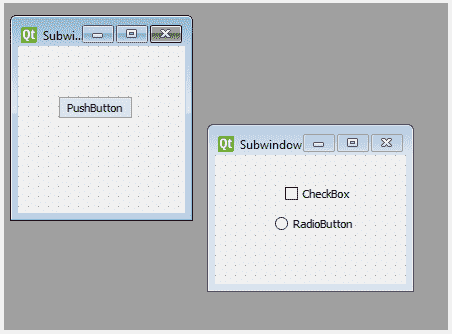

要使用 Designer 在 MDI 区域内创建新窗口，只需在空白处单击鼠标右键，然后从菜单中选择“添加子窗口”。 同样，“下一个子窗口”，“上一个子窗口”，“级联”，“平铺”和“子窗口/删除”都是仅在右键单击“MDI 区域”小部件时才有效的选项。

`QAxWidget`仅适用于 Windows OS 上的用户。 但是，即使在 Windows 上，仅将`QAxWidget`添加到窗口中也无法使它正常工作，因为它依赖于称为`axcontainer`的 Qt 模块。 目前，您可以跳过将此小部件添加到窗口的操作，但是在本章稍后介绍了如何向您的 Qt 项目中添加不同的 Qt 模块之后，您可以稍后再次尝试。

*   **输入小部件**：听起来完全一样。 您可以使用以下小部件获取用户输入数据。
    *   **组合框**：有时称为下拉列表； 它可以用来选择列表中的选项，而屏幕上的空间却很少。 任何时候，只有选定的选项可见。 用户甚至可以输入自己的输入值，具体取决于其配置。 （此小部件的等效 Qt 类称为`QComboBox`）：
    *   **字体组合框**：类似于组合框，但可用于选择字体系列。 字体列表是使用计算机上的可用字体创建的。
    *   **行编辑**：可用于输入和显示单行文本（此小部件的等效 Qt 类称为`QLineEdit`）。
    *   **文本编辑**：可用于输入和显示多行富文本格式。 重要的是要注意，这个小部件实际上是成熟的 WYIWYG 富文本编辑器（此小部件的等效 Qt 类称为`QTextEdit`）。
    *   **纯文本编辑**：可用于查看和编辑多行文本。 可以将其视为类似于记事本的简单小部件（此小部件的等效 Qt 类称为`QPlainTextEdit`）。
    *   **旋转框**：用于输入整数或离散的值集，例如月份名称（此小部件的等效 Qt 类称为`QSpinBox`）。
    *   **双重旋转框**：类似于旋转框，但是它接受双精度值（此小部件的等效 Qt 类称为`QDoubleSpinBox`）。
    *   **时间编辑**：可用于输入时间值。（此小部件的等效 Qt 类称为`QTimeEdit`）。
    *   **日期编辑**：可用于输入日期值（此小部件的等效 Qt 类称为`QDateEdit`）。
    *   **日期/时间编辑**：可用于输入日期和时间值（此小部件的等效 Qt 类称为`QDateTimeEdit`）。
    *   **拨盘**：类似于滑块，但具有圆形和类似拨盘的形状。 它可用于输入指定范围内的整数值（此小部件的等效 Qt 类称为`QDial`）。
    *   **水平/垂直条**：可用于添加水平和垂直滚动功能（此小部件的等效 Qt 类称为`QScrollBar`）。
    *   **水平/垂直滑块**：可用于输入指定范围内的整数值（此小部件的等效 Qt 类称为`QSlider`）。
    *   **按键序列编辑**：可用于输入键盘快捷键（此小部件的等效 Qt 类称为`QKeySequenceEdit`）。

不应将此与`QKeySequence`类混淆，该类根本不是小部件。 `QKeySequenceEdit`用于从用户那里获取`QKeySequence`。 在拥有`QKeySequence`之后，我们可以将其与`QShortcut`或`QAction`类结合使用以触发不同的函数/插槽。 本章稍后将介绍信号/插槽的介绍。

*   **显示小部件**：可用于显示输出数据，例如数字，文本，图像，日期等：
    *   **标签**：可用于显示数字，文本，图像或电影（此小部件的等效 Qt 类称为`QLabel`）。
    *   **文本浏览器**：它与`Text Edit`小部件几乎相同，但是具有在链接之间导航的附加功能（此小部件的等效 Qt 类称为`QTextBrowser`）。
    *   **图形视图**：可用于显示图形场景的内容（此小部件的等效 Qt 类称为`QGraphicsView`）。

我们整本书中将使用的最重要的小部件可能是图形场景（或`QGraphicsScene`），它将在第 5 章，“图形视图框架”中进行介绍。

请注意，OpenGL 是计算机图形学中一个完全独立且高级的主题，它完全不在本书的讨论范围内。 但是，如前所述，最好了解 Qt 中存在的工具和小部件，以便您进行进一步的研究。

QML 的简介将在第 12 章， “Qt Quick 应用”中介绍。 现在，请确保我们没有在用户界面中添加任何`QQuickWidget`小部件，因为我们需要向项目中添加其他模块才能使其正常工作。 本章将介绍如何向 Qt 项目添加模块。

# `Hello_Qt_OpenCV`

现在，我们可以开始为`Hello_Qt_OpenCV`项目设计用户界面。 明确项目规格清单，然后根据需求设计用户友好的 UI，然后在纸上画出用户界面（或者如果不是大项目，请牢记在心）始终是一个好主意。 ，最后开始使用 Designer 创建它。 当然，此过程需要使用现有 Qt 小部件的经验以及创建自己的小部件的足够经验，但这最终会发生，您只需要继续练习即可。

因此，首先，让我们回顾一下我们需要开发的应用的规范。 比方说：

*   此应用必须能够将图像作为输入（接受的图像类型必须至少包括`*.jpg`，`*.png`和`*.bmp`文件）。
*   此应用必须能够应用模糊过滤器。 用户必须能够选择中值模糊或高斯模糊类型来过滤输入图像（使用默认的一组参数）。
*   此应用必须能够保存输出图像和输出图像的文件类型（或扩展名，换句话说），并且它必须可由用户选择（`*.jpg`，`*.png`或`*.bmp`）。
*   用户应该能够选择在保存时查看输出图像。
*   重新启动应用时，应保留并重新加载用户界面上设置的所有选项，包括模糊过滤器类型以及最后打开和保存的图像文件。
*   当用户要关闭应用时，应提示他们。

对于我们的情况，这应该足够了。 通常，您不应超额交付或交付不足。 这是设计用户界面时的重要规则。 这意味着您应确保所有要求均已成功满足，同时，您还没有在要求列表中添加不需要（或不需要）的任何内容。

对于这样的需求（或规格）列表，可能有无数的用户界面设计； 但是，这是我们将创建的一个。 请注意，这是我们的程序在执行时的外观。 显然，标题栏和样式可能会有所不同，具体取决于操作系统，但这基本上就是：


它看起来很简单，它包含了该任务所需的所有组件，并且界面几乎是不言自明的。 因此，将要使用此应用的人实际上并不需要了解很多功能，他们只需猜测所有输入框，单选按钮，复选框等的用途。

在 Designer 上查看时，这是相同的 UI：

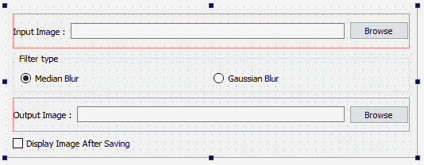

现在该为我们的项目创建用户界面了：

1.  要创建此用户界面，首先需要从主窗口中删除菜单栏，状态栏和工具栏，因为我们不需要它们。 右键单击顶部的菜单栏，然后​​选择“删除菜单栏”。 接下来，右键单击窗口上的任意位置，然后选择“删除状态栏”。 最后，右键单击顶部的工具栏，然后单击“删除工具栏”。
2.  现在，在您的窗口中添加一个水平布局； 这是上一图像顶部可见的布局。 然后，在其中添加标签，行编辑和按钮，如上图所示。

3.  通过双击标签并输入`Input Image :`来更改标签的文本。 （这与选择标签并使用屏幕右侧的属性编辑器将文本属性值设置为`Input Image :`相同。）

几乎所有具有`text`属性的 Qt 小部件都允许使用其文本进行这种类型的编辑。 因此，从现在开始，当我们说`Change the text of the widget X to Y`时，这意味着双击并设置文本或使用设计器中的属性编辑器。 我们可以很容易地将此​​规则扩展到属性编辑器中可见的窗口小部件的所有属性，并说`Change the W of X to Y`。 在这里，显然，`W`是设计者的属性编辑器中的属性名称，`X`是小部件名称，`Y`是需要设置的值。 这将在设计 UI 时为我们节省大量时间。

4.  添加一个组框，然后添加两个单选按钮，类似于上图所示。
5.  接下来，添加另一个水平布局，然后在其中添加`Label`，`Line Edit`和`Push Button`。 这将是在复选框正上方的底部看到的布局。
6.  最后，在窗口中添加一个复选框。 这是底部的复选框。
7.  现在，根据前面的图像，更改窗口上所有小部件的文本。 您的 UI 即将准备就绪。 现在，您可以通过单击屏幕左下方的“运行”按钮来尝试运行它。 确保您没有按下带有错误的“运行”按钮。 这是一个：


这将产生与您之前看到的相同的用户界面。 现在，如果您尝试调整窗口的大小，您会注意到在调整窗口大小或最大化窗口时，所有内容都保持原样，并且它不会响应应用大小的更改。 要使您的应用窗口响应大小更改，您需要为`centralWidget`设置布局。 还需要对屏幕上的分组框执行此操作。

Qt 小部件均具有`centralWidget`属性。 这是 Qt 设计器中特别用于 Windows 和容器小部件的东西。 使用它，您可以设置容器或窗口的布局，而无需在中央窗口小部件上拖放布局窗口小部件，只需使用设计器顶部的工具栏即可：


您可能已经注意到工具栏中的四个小按钮（如前面的屏幕快照所示），它们看起来与左侧小部件工具箱中的布局完全一样（如下所示）：


因此，让我们就整本书中的简单快速解释达成另一条规则。 每当我们说`Set the Layout of X to Y`时，我们的意思是首先选择小部件（实际上是容器小部件或窗口），然后使用顶部工具栏上的布局按钮选择正确的布局类型。

8.  根据前面信息框中的描述，选择窗口（这意味着，单击窗口上的空白而不是任何小部件上的空白）并将其布局设置为`Vertical`。
9.  对组框执行相同操作； 但是，这一次，将布局设置为水平。 现在，您可以尝试再次运行程序。 如您现在所见，它会调整其所有小部件的大小，并在需要时移动它们，以防更改窗口大小。 窗口内的组框也发生了同样的情况。

10.  接下来需要更改的是小部件的`objectName`属性。 这些名称非常重要，因为在 C++ 代码中使用它们来访问窗口上的小部件并与其进行交互。 对于每个小部件，请使用以下屏幕截图中显示的名称。 请注意，该图像显示了对象层次结构。 您还可以通过双击对象层次结构窗格中的小部件来更改`objectName`属性：

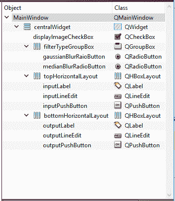

从理论上讲，您可以为`objectName`属性使用任何 C++ 有效的变量名，但实际上，最好始终使用有意义的名称。 考虑对本书中使用的变量或小部件名称遵循相同或相似的命名约定。 它基本上是 Qt 开发人员遵循的命名约定，它还有助于提高代码的可读性。

# 编写 Qt 项目的代码

现在，我们的用户界面已经完全设计好了，我们可以从为应用编写代码开始。 现在，我们的应用基本上只不过是一个用户界面，它实际上什么也不做。 我们首先需要将 OpenCV 添加到我们的项目中。 在第 1 章，“OpenCV 和 Qt 简介”中，您已经看到了将 OpenCV 添加到 Qt 项目的简短介绍。 现在，我们将采取进一步的措施，并确保可以按照第 1 章中的说明正确安装和配置 OpenCV，并且可以在所有三个主要操作系统上编译和构建我们的项目，而无需进行任何更改。“OpenCV 和 Qt 简介”。

因此，首先在代码编辑器中打开项目的 PRO 文件，这将是 Qt Creator 中的“编辑”模式。 您可能已经注意到，它称为`Hello_Qt_OpenCV.pro`。 您需要在该文件的末尾添加以下代码：

```cpp
   win32: { 
      include("c:/dev/opencv/opencv.pri") 
   } 

   unix: !macx { 
      CONFIG += link_pkgconfig 
      PKGCONFIG += opencv 
   } 

   unix: macx { 
     INCLUDEPATH += "/usr/local/include" 
     LIBS += -L"/usr/local/lib" \ 
      -lopencv_world 
   } 
```

注意右括号前的代码； `win32`表示 Windows 操作系统（仅适用于桌面应用，不适用于 Windows 8、8.1 或 10 特定应用），`unix: !macx`表示 Linux 操作系统，`unix: macx`表示 MacOS 操作系统。

您的`PRO`文件中的这段代码允许 OpenCV 包含在内并在您的 Qt 项目中可用。 还记得我们在第 1 章，“OpenCV 和 Qt 简介”中创建了一个`PRI`文件吗？ Linux 和 MacOS 用户可以将其删除，因为在那些操作系统中不再需要该文件。 只有 Windows 用户可以保留它。

请注意，在 Windows OS 中，您可以将前面的`include`行替换为 PRO 文件的内容，但这在实践中并不常见。 另外，值得提醒的是，您需要在`PATH`中包含 OpenCV DLLs 文件夹，否则当您尝试运行它时，应用将崩溃。 但是，它仍然可以正确编译和构建。 要更加熟悉 Qt PRO 文件的内容，可以在 Qt 文档中搜索`qmake`并阅读有关内容。 不过，我们还将在第 3 章，“创建综合的 Qt + OpenCV 项目”中进行简要介绍。

我们不会讨论这些代码行在每个操作系统上的确切含义，因为这不在本书的讨论范围之内，但是值得注意并足以知道何时构建应用（换句话说，编译和编译）。 链接），这些行将转换为所有 OpenCV 头文件，库和二进制文件，并包含在您的项目中，以便您可以轻松地在代码中使用 OpenCV 函数。

现在我们已经完成了配置工作，让我们开始为用户界面上的每个需求及其相关的小部件编写代码。 让我们从`inputPushButton`开始。

从现在开始，我们将使用其唯一的`objectName`属性值引用用户界面上的任何窗口小部件。 将它们视为可以在代码中使用以访问这些小部件的变量名。

这是我们项目的编码部分所需的步骤：

1.  再次切换到设计器，然后右键单击`inputPushButton`。 然后，从出现的菜单中选择“转到插槽...”。 将显示的窗口包括此小部件发出的所有信号。 选择`pressed()`，然后单击确定：


2.  您会注意到，您是从设计器自动转到代码编辑器的。 另外，现在`mainwindow.h`文件中添加了新函数。
3.  在`mainwindow.h`中，添加了以下内容：

```cpp
        private slots: 
          void on_inputPushButton_pressed(); 
```

这是自动添加到`mainwindow.cpp`的代码：

```cpp
    void MainWindow::on_inputPushButton_pressed() 
    { 

    } 
```

因此，显然需要在刚刚创建的`on_inputPushButton_pressed()`函数中编写负责`inputPushButton`的代码。 如本章前面所述，这是将信号从小部件连接到另一个小部件上的插槽的多种方法之一。 让我们退后一步，看看发生了什么。 同时，请注意刚刚创建的函数的名称。 `inputPushButton`小部件具有一个称为被按下的信号（因为它是一个按钮），该信号仅在被按下时才发出。 在我们的单个窗口小部件（`MainWindow`）中创建了一个新插槽，称为`on_inputPushButton_pressed`。 很方便，想到的第一个问题是，如果我自己在`mainwindow.h`和`mainwindow.cpp`中编写了这些代码行，而不是右键单击小部件并选择“转到插槽”，将会发生什么情况？ ，答案是，这是完全一样的。 因此，总而言之，每当`inputPushButton`小部件发出按下信号时，Qt 都会自动理解它需要在`on_inputPushButton_pressed()`中执行代码。 在 Qt 开发中，这被称为**按名称**连接插槽，它仅遵循以下约定自动将信号连接至插槽`on_objectName_signal(parameters)`。

在此，`objectName`应该替换为发送信号的小部件的`objectName`属性的值，`signal`替换为信号名称，`parameters`替换为确切的信号编号和参数类型。

现在我们知道如何将窗口上的窗口小部件的信号连接到窗口本身的插槽，或者换句话说，既然我们知道必须添加一个函数并为窗口小部件的信号编写代码，我们可以节省一些时间，并避免使用诸如`The code for the signal X of the widget Y`之类的句子进行重复说明，这意味着要使用我们刚刚学习的方法添加一个负责信号的时隙。 因此，在本例中，作为第一个示例，让我们为`inputPushButton`小部件的`pressed`信号编写代码。

根据应用的要求，我们需要确保用户可以打开图像文件。 成功打开图像文件后，我们会将路径写入`inputLineEdit`小部件的`text`属性，以便用户可以看到他们选择的完整文件名和路径。 首先让我们看一下代码的外观，然后逐步介绍它：

```cpp
    void MainWindow::on_inputPushButton_pressed() 
    { 
      QString fileName = QFileDialog::getOpenFileName(this, 
        "Open Input Image", 
        QDir::currentPath(), 
        "Images (*.jpg *.png *.bmp)"); 
       if(QFile::exists(fileName)) 
       { 
         ui->->setText(fileName); 
       } 
    } 
```

要访问用户界面上的小部件或其他元素，只需使用`ui`对象。 例如，可以通过`ui`类并通过编写以下行来简单地访问用户界面中的`inputLineEdit`小部件：

`ui-> inputLineEdit`

第一行实际上是大代码的简化版本。 正如您将在本书中学习的那样，Qt 提供了许多方便的函数和类来满足日常编程需求，例如将它们打包成非常短的函数。 首先让我们看看我们刚刚使用了哪些 Qt 类：

*   `QString`：这可能是 Qt 最重要和广泛使用的类别之一。 它代表 Unicode 字符串。 您可以使用它来存储，转换，修改字符串以及对字符串进行无数其他操作。 在此示例中，我们仅使用它来存储`QFileDialog`类读取的文件名。
*   `QFileDialog`：可以用来选择计算机上的文件或文件夹。 它使用底层操作系统 API，因此对话框的外观可能有所不同，具体取决于操作系统。
*   `QDir`：此类可用于访问计算机上的文件夹并获取有关它们的各种信息。
*   `QFile`：可用于访问文件以及从文件中读取或写入文件。

前面提到的将是对每个类的非常简短的描述，并且如您从前面的代码中所见，它们每个都提供了更多的功能。 例如，我们仅在`QFile`中使用了静态函数来检查文件是否存在。 我们还使用了`QDir`类来获取当前路径（通常是应用从中运行的路径）。 代码中唯一需要更多说明的是`getOpenFileName`函数。 第一个参数应该是`parent`小部件。 这在 Qt 中非常重要，它用于自动清除内存，如果出现对话框和窗口，则要确定父窗口。 这意味着每个对象在销毁子对象时也应负责清理其子对象，如果是窗户，则由其父窗口打开它们。 因此，通过将`this`设置为第一个参数，我们告诉编译器（当然还有 Qt）此类负责`QFileDialog`类实例。 `getOpenFileName`函数的第二个参数显然是文件选择对话框窗口的标题，下一个参数是当前路径。 我们提供的最后一个参数可确保仅显示应用需求中的三种文件类型：`*.jpg`，`*.png`和`*.bmp`文件。

仅当首先将其模块添加到您的项目中，然后将其头文件包含在您的源文件中时，才可以使用任何 Qt 类。 要将 Qt 模块添加到 Qt 项目，您需要在项目的`PRO`文件中添加类似于以下内容的行：

`QT += module_name1 module_name2 module_name3 ...`

`module_name1`等可以替换为可以在 Qt 文档中找到的每个类的实际 Qt 模块名称。
您可能已经注意到项目的 PRO 文件中已经存在以下代码行：

`QT += core gui`
`greaterThan(QT_MAJOR_VERSION, 4): QT += widgets`

这仅表示`core`和`gui`模块应包含在您的项目中。 它们是两个最基本的 Qt 模块，包括许多 Qt 基础类。 第二行表示，如果您使用的 Qt 框架的主要版本号高于四个，则还应包含`widgets`模块。 这是因为以下事实：在 Qt 5 之前，`widgets`模块是`gui`模块的一部分，因此无需将其包含在`PRO`文件中。
至于包含文件，它始终与类名本身相同。 因此，在我们的情况下，我们需要在源代码中添加以下类，以使前面的代码起作用。 最好的位置通常是头文件的顶部，因此在我们的例子中就是`mainwindow.h`文件。 确保在顶部具有以下类别：

`#include <QMainWindow>`
`#include <QFileDialog>`
`#include <QDir>`
`#include <QFile>`

尝试一下，然后运行程序以查看结果。 然后，将其关闭并再次返回到设计器。 现在，我们需要将代码添加到`outputPushButton`小部件。 只需重复与`inputPushButton`相同的过程，但是这次，在`outputPushButton`上进行此操作，并为其编写以下代码：

```cpp
    void MainWindow::on_outputPushButton_pressed() 
    { 
      QString fileName = QFileDialog::getSaveFileName(this, 
       "Select Output Image", 
       QDir::currentPath(), 
       "*.jpg;;*.png;;*.bmp"); 
       if(!fileName.isEmpty()) 
       { 
         ui->outputLineEdit->setText(fileName); 
         using namespace cv; 
         Mat inpImg, outImg; 
         inpImg = imread(ui->inputLineEdit->text().toStdString()); 
         if(ui->medianBlurRadioButton->isChecked()) 
            cv::medianBlur(inpImg, outImg, 5); 
         else if(ui->gaussianBlurRadioButton->isChecked()) 
            cv::GaussianBlur(inpImg, outImg, Size(5, 5), 1.25); 
         imwrite(fileName.toStdString(), outImg); 
         if(ui->displayImageCheckBox->isChecked()) 
            imshow("Output Image", outImg); 
       } 
    } 
```

您还需要向项目添加`OpenCV`标头。 将它们添加到`mainwindow.h`文件顶部的添加 Qt 类头的位置，如下所示：

```cpp
    #include "opencv2/opencv.hpp"  
```

现在，让我们回顾一下我们刚刚编写的代码，看看它的真正作用。 如您所见，这一次，我们在`QFileDialog`类和标题中使用了`getSaveFileName`函数，并且过滤器也有所不同。 这是必需的，以便用户在要保存输出图像时分别选择每种图像类型，而不是在打开它们时看到所有图像。 这次，我们也没有检查文件的存在，因为这将由`QFileDialog`自动完成，因此仅检查用户是否确实选择了某项就足够了。 在以下几行中，我们编写了一些特定于 OpenCV 的代码，在接下来的章节中，我们将越来越多地了解这些功能。 在第 1 章，“OpenCV 和 Qt 简介”中，您还以很小的剂量使用了它，因此，它们到现在为止还不完全陌生。 但是，我们将再次简短地讨论它们，并继续介绍 IDE 和`Hello_Qt_OpenCV`应用。

所有`OpenCV`函数都包含在`cv`名称空间中，因此我们确保我们是 OpenCV `namespace cv`的`using`。 然后，为了读取输入图像，我们使用了`imread`函数。 这里要注意的重要一点是 OpenCV 使用 C++  `std::string`类，而 Qt 的`QString`应该转换为该格式，否则，当您尝试运行该程序时会遇到错误。 只需使用`QString`的`toStdString`函数即可完成。 注意，在这种情况下，`QString`是`inputLineEdit`小部件的`text()`函数返回的值。

接下来，根据选择的过滤器类型，我们使用`medianBlur`或`gaussianBlur`函数进行简单的 OpenCV 过滤。

请注意，在这种情况下，我们为这些 OpenCV 函数使用了一些默认参数，但是如果我们使用旋转小部件从用户那里获得它们，那就更好了。 还是滑块部件？ 也许是一个不错的拨盘小部件？ 完成本章后，请尝试一下。 这个想法很简单，它旨在帮助您学习如何在这些框架中自己发现新的可能性。 尽管如此，您将在第 3 章，“创建全面的 Qt + OpenCV 项目”中学习如何使用许多小部件，甚至创建自己的小部件。

最后，已过滤的输出图像`outImg`被写入所选文件。 根据`displayImageCheckBox`小部件设置的条件也会显示它。

到这个时候，我们还有两个要求。 首先是，在关闭程序时将所有小部件的状态保存在窗口中，并在重新打开程序时将其重新加载。 另一个要求（最后一个要求）是在用户想要关闭程序时提示他们。 让我们从最后一个开始，因为这意味着我们需要知道如何编写在关闭窗口时需要执行的代码。 这非常简单，因为 Qt 的`QMainWindow`类（我们的窗口所基于的类）是`QWidget`，并且它已经具有一个虚拟 C++ 函数，我们可以覆盖和使用它。 只需将以下代码行添加到您的`MainWindow`类中：

```cpp
    protected: 
      void closeEvent(QCloseEvent *event); 
```

这应该进入`mainwindow.h`文件中的类定义。 专用插槽前的线路似乎是个好地方。 现在，切换到`mainwindow.cpp`并将以下代码段添加到文件末尾：

```cpp
    void MainWindow::closeEvent(QCloseEvent *event) 
    { 
      int result = QMessageBox::warning(this, 
        "Exit", 
        "Are you sure you want to close this program?", 
        QMessageBox::Yes, 
        QMessageBox::No); 
        if(result == QMessageBox::Yes) 
        { 
          event->accept(); 
        } 
        else 
        { 
         event->ignore(); 
        } 
    } 
```

我想您已经注意到我们现在又引入了两个 Qt 类，这意味着我们也需要将它们的包含标头添加到`mainwindow.h`。 考虑以下：

*   `QMessageBox`：根据消息的目的，它可以用于显示带有简单图标，文本和按钮的消息
*   `QCloseEvent`：这是许多 Qt 事件（`QEvent`）类之一，其目的是传递有关窗口关闭事件的参数

该代码几乎是不言自明的，因为您已经知道警告函数的第一个参数是什么。 这是用来告诉 Qt 我们的`MainWindow`类负责此消息框。 记录用户选择的结果，然后，基于此结果，关闭事件被接受或忽略，非常简单。 除此之外，我们仍然需要保存设置（小部件上的文本以及复选框和单选框的状态）并加载它们。 如您所知，保存设置的最佳位置是`closeEvent`函数。 在代码的`event->accept();`行之前怎么样？ 让我们向`MainWindow`类添加两个私有函数，一个私有函数加载名为`loadSettings`的设置，另一个私有函数保存名为`saveSettings`的设置。 在本章中，我们将学习最后一个 Qt 类，它称为`QSettings`。 因此，首先将其包含行添加到`mainwindow.h`中，然后将以下两个函数定义添加到`MainWindow`类中，再次在`Ui::MainWindow *ui;`行正下方的`mainwindow.h`中，在私有成员中：

```cpp
    void loadSettings(); 
    void saveSettings(); 
```

这是`loadSettings`函数所需的代码：

```cpp
    void MainWindow::loadSettings() 
    { 
      QSettings settings("Packt", 
        "Hello_OpenCV_Qt", 
         this); 
      ui->inputLineEdit->setText(settings.value("inputLineEdit", 
        "").toString()); 
      ui->outputLineEdit->setText(settings.value("outputLineEdit", 
        "").toString()); 
      ui->medianBlurRadioButton 
        ->setChecked(settings.value("medianBlurRadioButton", 
        true).toBool()); 
      ui->gaussianBlurRadioButton 
        ->setChecked(settings.value("gaussianBlurRadioButton", 
        false).toBool()); 
      ui->displayImageCheckBox 
        ->setChecked(settings.value("displayImageCheckBox", 
        false).toBool()); 
    } 
```

这是给`saveSettings`的：

```cpp
    void MainWindow::saveSettings() 
    { 
      QSettings settings("Packt", 
        "Hello_OpenCV_Qt", 
        this); 
      settings.setValue("inputLineEdit", 
        ui->inputLineEdit->text()); 
      settings.setValue("outputLineEdit", 
        ui->outputLineEdit->text()); 
      settings.setValue("medianBlurRadioButton", 
        ui->medianBlurRadioButton->isChecked()); 
      settings.setValue("gaussianBlurRadioButton", 
        ui->gaussianBlurRadioButton->isChecked()); 
      settings.setValue("displayImageCheckBox", 
        ui->displayImageCheckBox->isChecked()); 
    } 
```

在构造它时，需要为`QSettings`类提供组织名称（仅作为示例，我们使用`"Packt"`）和应用名称（在我们的情况下为`"Hello_Qt_OpenCV"`）。 然后，它只记录您传递给`setValue`函数的所有内容，并使用`value`函数将其返回。 我们所做的只是将要保存的所有内容传递给`setValue`函数，例如单行编辑小部件中的文本等，然后在需要时重新加载它。 请注意，`QSettings`像这样使用时，会自己照顾存储位置，并使用每个操作系统的默认位置来保留特定于应用的配置。

现在，只需将`loadSettings`函数添加到`MainWindow`类的构造器中。 您应该具有一个如下所示的构造器：

```cpp
    ui->setupUi(this); 
    loadSettings(); 
```

在`event->accept()`之前，将`saveSettings`函数添加到`closeEvent`即可。 现在，我们可以尝试第一个应用。 让我们尝试运行和过滤图像。 选择两个过滤器中的每一个，看看它们的区别是什么。 尝试使用该应用并查找其问题。 尝试通过向其添加更多参数来对其进行改进，依此类推。 以下是该应用运行时的屏幕截图：

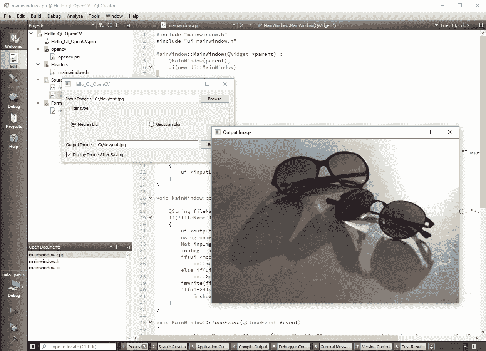

尝试关闭它，并使用我们的退出确认代码查看一切是否正常。


我们编写的程序显然并不完美，但是它列出了您从 Qt Creator IDE 入门到本书各章所需要了解的几乎所有内容。 Qt Creator 中还有另外三个`Modes`尚未见过，我们将把调试模式和项目模式留给第 12 章，“Qt Quick 应用”，其中我们将深入研究构建，测试和调试计算机视觉应用的概念。 因此，让我们简要地通过 Qt Creator 的非常重要的“帮助”模式以及`Options`之后，结束我们的 IDE 之旅。

# 帮助模式

使用左侧的帮助按钮切换到 Qt Creator 的帮助模式：


关于 Qt Creator 帮助模式的最重要的事情是，您可以使用它来找出正确的事实，除了可以从字面上搜索与 Qt 相关的所有内容并查看每个类和模块的无数示例之外， 每个类都需要的模块。 为此，只需切换到索引模式并搜索要在应用中使用的 Qt 类。 这是一个例子：

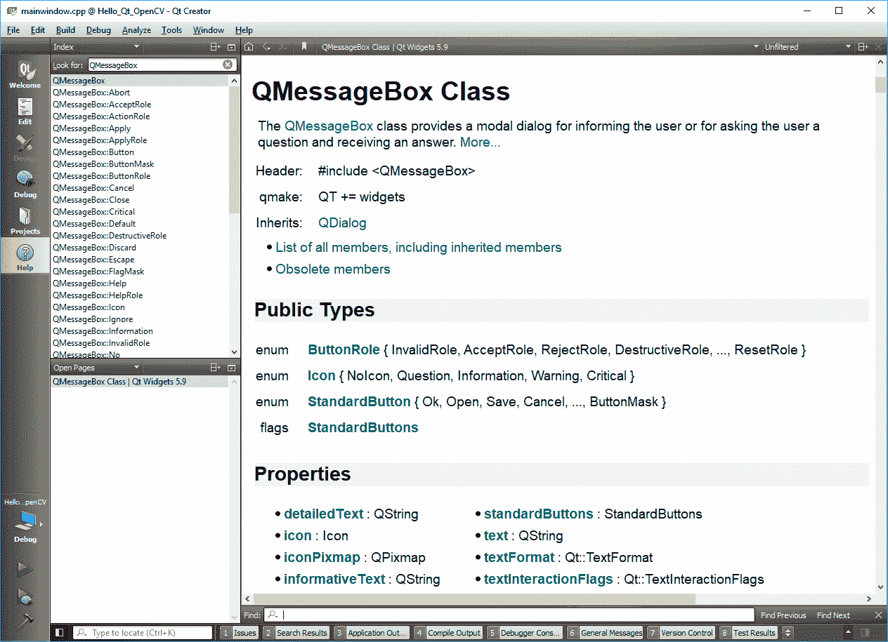

如您所见，可以使用索引并搜索`QMessageBox`类的文档页面。 注意描述之后的前两行：

```cpp
    #include <QMessageBox> 
    QT += widgets 
```

这基本上意味着，为了在项目中使用`QMessageBox`，必须在源文件中包含`QMessageBox`标头，并将小部件模块添加到`PRO`文件中。 尝试搜索本章中使用的所有类，然后在文档中查看其示例。 Qt Creator 还提供了非常强大的上下文相关帮助。 您只需在任何 Qt 类上用鼠标单击`F1`，它的文档页面都将在编辑模式下的代码编辑器中获取：

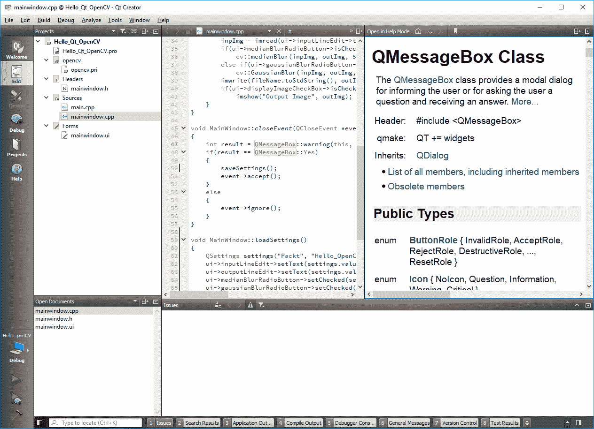

# Qt Creator 选项窗口

您可以通过单击工具，然后单击选项，从其主菜单访问 Qt Creator 选项。 Qt Creator 允许非常高级别的自定义，因此您会发现 Qt Creator 的“选项”页面和选项卡具有很多要配置的参数。 对于大多数人（包括我自己）来说，Qt Creator 的默认选项几乎可以满足他们需要做的所有事情，但是有些任务在不知道如何配置 IDE 的情况下将无法完成。 考虑以下屏幕截图：

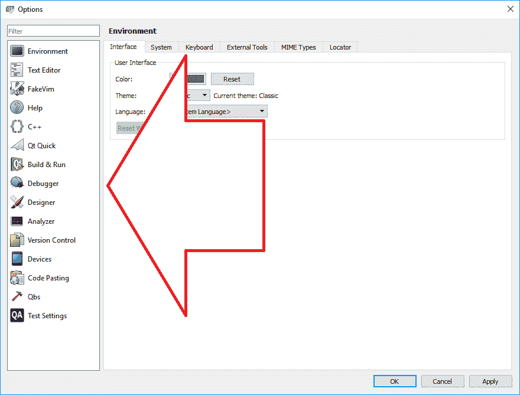

您可以使用左侧的按钮在页面之间切换。 每个页面包含许多选项卡，但它们都与同一组相关。 以下是每组选项的主要用途：

*   环境：该设置通常包含与 Qt Creator 外观有关的设置。 您可以在此处更改主题（在本章开头提到），字体和文本大小，语言以及所有设置。
*   文本编辑器：这组设置包括与代码编辑器相关的所有内容。 在这里，您可以更改设置，例如代码突出显示，代码完成等。
*   FakeVim：适用于熟悉 Vim 编辑器的人。 在这里，他们可以在 Qt Creator 中启用 Vim 样式的代码编辑并进行配置。
*   帮助：可以猜到，它包含与 Qt Creator 的帮助模式和上下文相关帮助功能有关的所有选项。
*   C++：在这里，您可以找到与 C++ 编码和代码编辑相关的设置。
*   Qt Quick：可在此处找到影响 Qt Quick 设计器和 QML 代码编辑的选项。 我们将在第 12 章，“Qt Quick 应用”中学习有关 QML 的更多信息。
*   生成并运行：这可能是 Qt Creator 中最重要的选项页面。 此处的设置直接影响您的应用构建和运行体验。 我们将在，“链接和部署”中配置一些设置，在这里您将了解有关 Qt 中的静态链接的信息。
*   调试器：包含与 Qt Creator 中的调试模式相关的设置。 您将在第 10 章，“调试和测试”中了解更多信息。
*   设计器：可用于配置 Qt Creator 模板项目和其他与“设计”模式相关的设置。
*   分析器：包括与 Clang 代码分析器，QML 分析器等相关的设置。 涵盖它们超出了本书的范围。
*   版本控制：Qt 与许多版本控制系统（例如 Git 和 SVN）提供了非常可靠的集成。 在这里，您可以配置 Qt Creator 中与版本控制相关的所有设置。
*   设备：如您在第 12 章，“Qt Quick 应用”中所看到的，将在其中使用它来配置 Qt Creator 进行 Android 开发，包括与设备相关的所有设置。
*   代码粘贴：这可以用于配置 Qt Creator 可以用于诸如代码共享之类的任务的某些第三方服务。

*   Qbs：涵盖 Qbs 完全超出了本书的范围，我们将不需要它。
*   测试设置：包含与 Qt 测试相关的设置，等等。 我们将在第 10 章（调试和测试）中介绍 Qt 测试，您将在其中学习如何为 Qt 应用编写单元测试。

除此之外，您始终可以使用 Qt Creator 的过滤器工具立即在“选项”窗口中找到所需的设置：

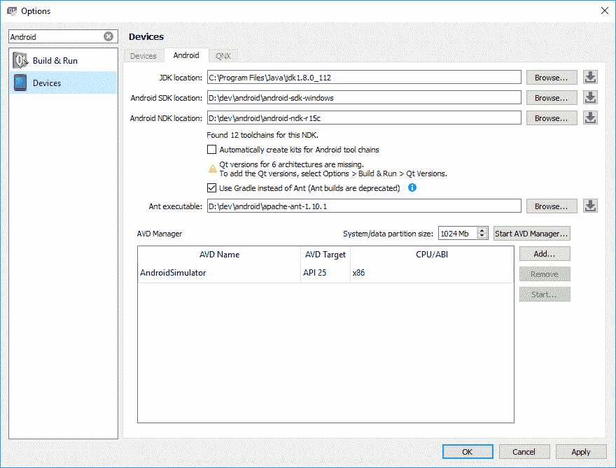

# 总结

本章不仅仅介绍 Qt Creator，而且正是我们所需要的，以便轻松地继续下一章，专注于构建内容，而不是重复的说明和配置技巧。 我们学习了如何使用 Qt Creator 来设计用户界面并为用户界面编写代码。 我们介绍了一些使用最广泛的 Qt 类，以及它们如何包装在不同的模块中。 通过了解不同的 Qt Creator 模式并同时构建应用，我们现在可以自己练习更多，甚至可以改善编写的应用。 下一章将是我们在其中构建可扩展的基于插件的计算机视觉应用框架的一章，该书将在本书的其余部分中继续进行，直到最后一章为止。 在下一章中，我们将学习 Qt 和 OpenCV 中的不同设计模式，以及如何使用类似的模式来构建易于维护和扩展的应用。