# 九、视频分析

除了本书到目前为止所看到的所有内容之外，计算机视觉的故事还有另一面，它涉及视频，摄像机以及输入帧的实时处理。 它是最受欢迎的计算机视觉主题之一，并且有充分的理由，因为它可以为有生命的机器或设备供电，这些机器或设备可以监视周围环境中是否存在感兴趣的对象，运动，图案，颜色等。 我们已经了解的所有算法和类，尤其是在第 6 章，“OpenCV 中的图像处理”和第 7 章，“特征和描述符”只能用于单个图像，因此，由于相同的原因，它们可以以完全相同的方式轻松地应用于单个视频帧。 我们只需要确保将单个帧正确地读取（例如，使用`cv::VideoCapture`类）到`cv::Mat`类实例中，然后作为单个图像传递到这些函数中即可。 但是，在处理视频以及视频时，我们指的是来自网络的视频，摄像机，视频文件等，有时我们需要通过处理特定时间段内的连续视频帧获得的结果。 这意味着结果不仅取决于当前从视频中获取的图像，还取决于之前获取的帧。

在本章中，我们将学习 OpenCV 中一些最重要的算法和类，这些算法和类可用于连续帧。 因此，视频。 我们将从学习这些算法使用的一些概念开始，例如直方图和反投影图像，然后通过使用示例并获得动手经验来更深入地研究每种算法。 我们将学习如何使用臭名昭著的 MeanShift 和 CamShift 算法进行实时对象跟踪，并且将继续进行视频中的运动分析。 我们将在本章中学到的大多数内容都与 OpenCV 框架中的视频分析模块（简称为`video`）有关，但我们还将确保遍历该模块所需的其他模块中的任何相关主题。 为了有效地遵循本章中的主题，尤其是直方图和反投影图像，这对于理解本章中涉及的视频分析主题至关重要。 背景/前景检测也是我们将在本章中学习的最重要主题之一。 通过结合使用这些方法，您将能够有效地处理视频以检测和分析运动，基于视频的颜色隔离视频帧中的零件或片段，或者使用现有的 OpenCV 算法以一种或另一种方式处理它们以进行图像处理。

同样，基于我们从第 8 章，“多线程”中学到的知识，我们将使用线程来实现在本章中学习的算法。 这些线程将独立于任何项目类型。 无论它是独立的应用，库，插件等，您都可以简单地包含和使用它们。

本章将涵盖以下主题：

*   直方图以及如何提取，使用或可视化它们
*   图像反投影
*   MeanShift 和 CamShift 算法
*   背景/前景检测和运动分析

# 了解直方图

如本章介绍部分所述，计算机视觉中的一些概念在处理视频处理以及我们将在本章稍后讨论的算法时特别重要。 这些概念之一是直方图。 由于了解直方图对于理解大多数视频分析主题至关重要，因此在继续下一个主题之前，我们将在本节中详细了解它们。 直方图通常被称为表示数据分布的一种方式。 这是一个非常简单和完整的描述，但让我们也描述它在计算机视觉方面的含义。 在计算机视觉中，直方图是图像中像素值分布的图形表示。 例如，在灰度图像中，直方图将是表示包含灰度中每个可能强度（0 到 255 之间的值）的像素数的图表。 在 RGB 彩色图像中，它将是三个图形，每个图形代表包含所有可能的红色，绿色或蓝色强度的像素数。 请注意，像素值不一定表示颜色或强度值。 例如，在转换为 HSV 色彩空间的彩色图像中，其直方图将包含色相，饱和度和值数据。

OpenCV 中的直方图是使用`calcHist`函数计算的，并存储在`Mat`类中，因为它们可以存储为数字数组，可能具有多个通道。 `calcHist`函数需要以下参数来计算直方图：

*   `images`或输入图像是我们要为其计算直方图的图像。 它应该是`cv::Mat`类的数组。
*   `nimages`是第一个参数中的图像数量。 请注意，您还可以为第一个参数传递`cv::Mat`类的`std::vector`，在这种情况下，您可以省略此参数。
*   `channels`是一个数组，其中包含将用于计算直方图的通道的索引号。
*   `mask`可用于遮盖图像，以便仅使用部分输入图像来计算直方图。 如果不需要遮罩，则可以传递一个空的`Mat`类，否则，我们需要提供一个单通道`Mat`类，对于应遮罩的所有像素，该类包含零，对于计算直方图时应考虑的所有像素，包含非零值。
*   `hist`是输出直方图。 这应该是`Mat`类，并且在函数返回时将用计算出的直方图填充。
*   `dims`是直方图的维数。 它可以包含一个介于 1 到 32 之间的值（在当前的 OpenCV 3 实现中）。 我们需要根据用于计算直方图的通道数进行设置。
*   `histSize`是一个数组，其中包含每个维度中直方图的大小，即所谓的*箱子*大小。 直方图中的合并是指在计算直方图时将相似值视为相同值。 我们将在后面的示例中看到它的确切含义，但现在，我们只需提及直方图的大小与其箱数相同的事实就足够了。
*   `ranges`是一个数组数组，其中包含每个通道的值范围。 简而言之，它应该是一个数组，其中包含一对值，用于通道的最小和最大可能值。
*   `uniform`是一个布尔值标志，它决定直方图是否应该统一。
*   `accumulate`是布尔值标志，它决定在计算直方图之前是否应清除该直方图。 如果我们要更新先前计算的直方图，这可能非常有用。

现在，让我们来看几个示例如何使用此函数。 首先，为了方便使用，我们将计算灰度图像的直方图：

```cpp
    int bins = 256; 
    int channels[] = {0}; // the first and the only channel 
    int histSize[] = { bins }; // number of bins 

    float rangeGray[] = {0,255}; // range of grayscale 
    const float* ranges[] = { rangeGray }; 

    Mat histogram; 

    calcHist(&grayImg, 
       1, // number of images 
       channels, 
       Mat(), // no masks, an empty Mat 
       histogram, 
       1, // dimensionality 
       histSize, 
       ranges, 
       true, // uniform 
       false // not accumulate 
    ); 
```

在前面的代码中，`grayImg`是`Mat`类中的灰度图像。 图像数量仅为一个，并且`channels`索引数组参数仅包含一个值（对于第一个通道为零），因为我们的输入图像是单通道和灰度。 `dimensionality`也是一个，其余参数与它们的默认值相同（如果省略）。

执行完前面的代码后，我们将在`histogram`变量内获取生成的灰度图像直方图。 它是具有`256`行的单通道单列`Mat`类，每行代表像素值与行号相同的像素数。 我们可以使用以下代码将`Mat`类中存储的每个值绘制为图形，并且输出将以条形图的形式显示我们的直方图：

```cpp
    double maxVal = 0; 
    minMaxLoc(histogram, 
      Q_NULLPTR, // don't need min 
      &maxVal, 
      Q_NULLPTR, // don't need index min 
      Q_NULLPTR // don't need index max 
    ); 

    outputImage.create(640, // any image width 
      360, // any image height 
      CV_8UC(3)); 

    outputImage = Scalar::all(128); // empty grayish image 

    Point p1(0,0), p2(0,outputImage.rows-1); 
    for(int i=0; i<bins; i++) 
    { 
      float value = histogram.at<float>(i,0); 
      value = maxVal - value; // invert 
      value = value / maxVal * outputImage.rows; // scale 
      p1.y = value; 
      p2.x = float(i+1) * float(outputImage.cols) / float(bins); 
      rectangle(outputImage, 
        p1, 
        p2, 
        Scalar::all(0), 
        CV_FILLED); 
      p1.x = p2.x; 
    } 
```

这段代码起初可能看起来有些棘手，但实际上它很简单，它基于以下事实：直方图中的每个值都需要绘制为矩形。 对于每个矩形，使用`value`变量和图像宽度除以箱数（即`histSize`）来计算左上角的点。 在示例代码中，我们简单地将最大可能值分配给了箱子（即 256），这导致了直方图的高分辨率可视化，因为条形图图中的每个条形图都会代表灰度级的一个像素强度 。

请注意，从这个意义上说，分辨率不是指图像的分辨率或质量，而是指构成条形图的最小块数的分辨率。

我们还假定输出可视化高度将与直方图的峰值（最高点）相同。 如果我们在下图左侧所示的灰度图像上运行这些代码，则所得的直方图将是右侧所示的直方图：

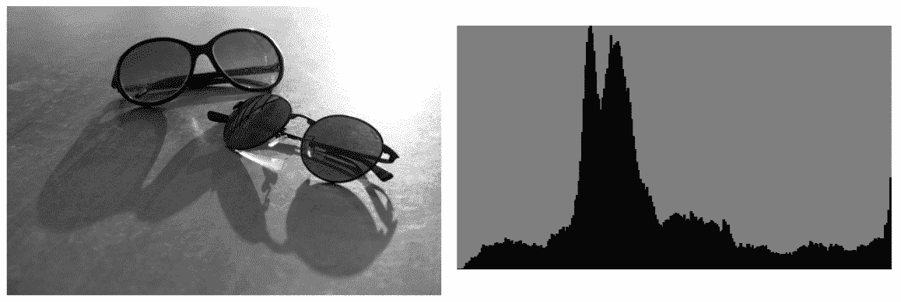

让我们解释输出直方图的可视化，并进一步说明我们在代码中使用的参数通常具有什么作用。 首先，每个条形从左到右是指具有特定灰度强度值的像素数。 最左边的条（非常低）指的是绝对黑色（强度值为零），最右边的条指的是绝对白色（255），中间的所有条指的是不同的灰色阴影。 注意最右边的小跳。 这实际上是由于输入图像的最亮部分（左上角）而形成的。 每个条形的高度除以最大条形值，然后缩放以适合图像高度。

我们还要看看`bins`变量的作用。 降低`bins`将导致强度分组在一起，从而导致较低分辨率的直方图被计算和可视化。 如果运行`bins`值为`20`的相同代码，则将得到以下直方图：

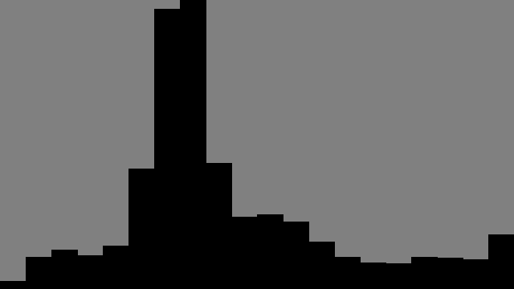

如果我们需要一个简单的图形而不是条形图视图，则可以在上一个代码末尾的绘图循环中使用以下代码：

```cpp
    Point p1(0,0), p2(0,0); 
    for(int i=0; i<bins; i++) 
    { 
      float value = histogram.at<float>(i,0); 
      value = maxVal - value; // invert 
      value = value / maxVal * outputImage.rows; // scale 
      line(outputImage, 
         p1, 
         Point(p1.x,value), 
         Scalar(0,0,0)); 
      p1.y = p2.y = value; 
      p2.x = float(i+1) * float(outputImage.cols) / float(bins); 
      line(outputImage, 
         p1, p2, 
         Scalar(0,0,0)); 
      p1.x = p2.x; 
    } 
```

如果再次使用`256`的`bins`值，将导致以下输出：

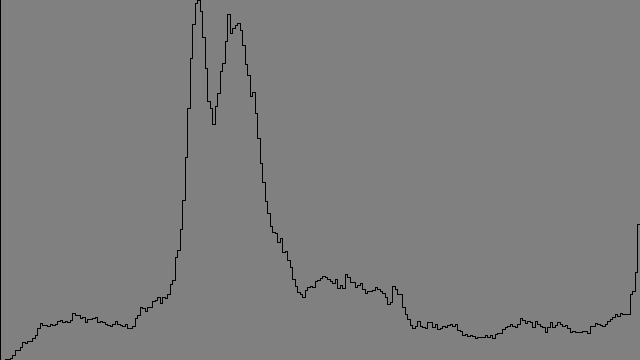

同样，我们可以计算和可视化彩色（RGB）图像的直方图。 我们只需要为三个单独的通道修改相同的代码即可。 为了做到这一点，首先我们需要将输入图像划分为其基础通道，然后为每个图像计算直方图，就好像它是单通道图像一样。 这是如何拆分图像以获取三个`Mat`类，每个类代表一个通道：

```cpp
    vector<Mat> planes; 
    split(inputImage, planes); 
```

现在，您可以在循环中使用`planes[i]`或类似的东西，并将每个通道视为图像，然后使用前面的代码示例来计算和可视化其直方图。 如果我们使用其自己的颜色可视化每个直方图，结果将是类似的结果（生成此直方图的图像是我们在整本书中使用的上一个示例的彩色图像）：

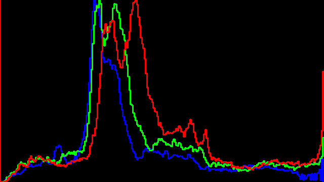

同样，结果的内容几乎可以像以前一样解释。 前面的直方图图像显示了颜色如何分布在 RGB 图像的不同通道中。 但是，除了获取像素值分布的信息以外，我们如何真正使用直方图？ 下一节将介绍直方图可用于修改图像的方式。

# 了解图像反投影

除了直方图中的视觉信息外，它还有更重要的用途。 这称为直方图的反投影，可用于使用其直方图来修改图像，或者正如我们将在本章稍后看到的那样，在图像中定位感兴趣的对象。 让我们进一步分解。 正如我们在上一节中了解到的，直方图是图像上像素数据的分布，因此如果我们以某种方式修改所得的直方图，然后将其重新应用于源图像（就好像它是像素值的查找表） ，则生成的图像将被视为反投影图像。 重要的是要注意，反投影图像始终是单通道图像，其中每个像素的值都是从直方图中的相应像素中提取的。

让我们将其视为另一个示例。 首先，这是在 OpenCV 中如何计算反投影：

```cpp
    calcBackProject(&image, 
      1, 
      channels, 
      histogram, 
      backprojection, 
      ranges); 
```

`calcBackProject`函数的使用方式与`calcHist`函数非常相似。 您只需要确保传递一个附加的`Mat`类实例即可获得图像的反投影。 由于在背投图像中，像素值是从直方图中获取的，因此它们很容易超出标准灰度范围，该范围在`0`和`255`（含）之间。 这就是为什么我们需要在计算反投影之前相应地标准化直方图的结果。 方法如下：

```cpp
    normalize(histogram, 
      histogram, 
      0, 
      255, 
      NORM_MINMAX); 
```

`normalize`函数将缩放直方图中的所有值以适合提供的最小值和最大值，分别为`0`和`255`。 只是重复一次，必须在`calcBackProject`之前调用此函数，否则，您将在反投影图像中产生溢出的数据，如果您尝试使用[[ `imshow`函数。

如果我们在查看反投影图像时未对生成它的直方图进行任何修改，那么在我们的示例情况下，我们将获得以下输出图像：

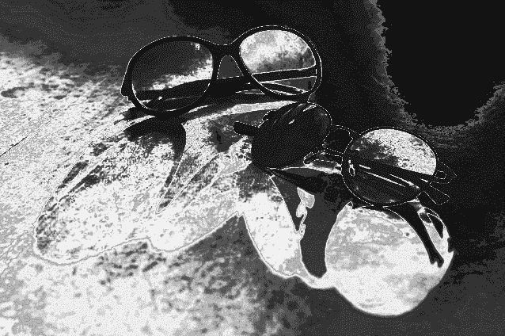

先前图像中每个像素的强度与包含该特定值的图像中像素的数量有关。 例如，请注意反投影图像的右上最暗部分。 与较亮的区域相比，该区域包含的像素值很少。 换句话说，明亮的区域包含的像素值在图像中以及图像的各个区域中都存在得多。 再说一遍，在处理图像和视频帧时如何使用呢？

本质上，反投影图像可用于为计算机视觉操作获取有用的遮罩图像。 到目前为止，我们还没有在 OpenCV 函数中真正使用掩码参数（并且它们存在于大多数函数中）。 让我们从使用前面的反投影图像的示例开始。 我们可以使用简单的阈值修改直方图，以获得用于过滤掉不需要的图像部分的遮罩。 假设我们想要一个可用于获取包含最暗值（例如，从`0`到`39`像素值）的像素的遮罩。 为此，首先我们可以通过将第一个`40`元素（只是最暗值的阈值，可以将其设置为任何其他值或范围）设置为灰度范围内的最大可能值来修改直方图（255），然后将其余的取到最小可能值（零），然后计算反投影图像。 这是一个例子：

```cpp
    calcHist(&grayImg, 
       1, // number of images 
       channels, 
       Mat(), // no masks, an empty Mat 
       histogram, 
       1, // dimensionality 
       histSize, 
       ranges); 

    for(int i=0; i<histogram.rows; i++) 
    { 
      if(i < 40) // threshold 
        histogram.at<float>(i,0) = 255; 
      else 
        histogram.at<float>(i,0) = 0; 
    } 

    Mat backprojection; 
    calcBackProject(&grayImg, 
       1, 
       channels, 
       histogram, 
       backprojection, 
       ranges); 
```

通过运行前面的示例代码，我们将在`backprojection`变量内获得以下输出图像。 实际上，这是一种阈值技术，可为使用 OpenCV 的任何计算机视觉处理获得合适的遮罩，以隔离图像中最暗的区域。 我们使用此示例代码获得的遮罩可以传递到任何接受遮罩的 OpenCV 函数中，这些遮罩用于对与遮罩中白色位置对应的像素执行操作，而忽略与黑位置对应的像素：


类似于我们刚刚学习的阈值化方法的另一种技术可以用于遮盖图像中包含特定颜色的区域，因此可以将其仅用于处理（例如修改颜色）图像的某些部分，甚至跟踪图像的某些部分。 具有特定颜色的对象，我们将在本章稍后学习。 但是在此之前，让我们首先了解 HSV 颜色空间的直方图（使用色相通道）以及如何隔离具有特定颜色的图像部分。 让我们通过一个例子来进行研究。 假设您需要查找图像中包含特定颜色的部分，例如下图中的红玫瑰：

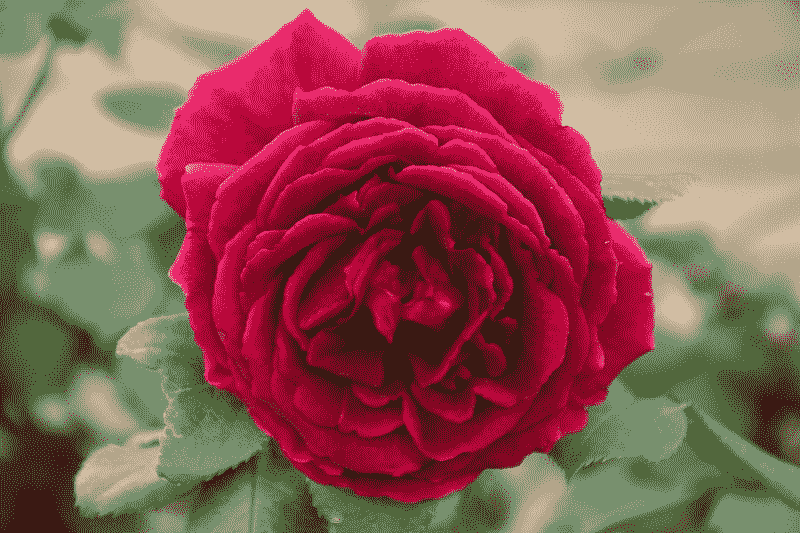

您不能根据阈值简单地滤除红色通道（在 RGB 图像中），因为它可能太亮或太暗，但仍然可以是红色的其他阴影。 另外，您可能需要考虑与红色过于相似的颜色，以确保您尽可能准确地获得玫瑰。 使用**色调**，**饱和度**，**值**（**HSV**）颜色空间，其中颜色保留在单个通道（色相或 H 通道）中，可以最好地处理这种情况以及需要处理颜色的类似情况。 这可以通过使用 OpenCV 进行示例实验来证明。 只需尝试在新应用中运行以下代码段即可。 它可以是控制台应用或小部件，没关系：

```cpp
    Mat image(25, 180, CV_8UC3); 
    for(int i=0; i<image.rows; i++) 
    { 
      for(int j=0; j<image.cols; j++) 
      { 
        image.at<Vec3b>(i,j)[0] = j; 
        image.at<Vec3b>(i,j)[1] = 255; 
        image.at<Vec3b>(i,j)[2] = 255; 
      } 
    } 
    cvtColor(image,image,CV_HSV2BGR); 
    imshow("Hue", image); 
```

请注意，我们仅更改了三通道图像中的第一个通道，其值从`0`更改为`179`。 这将导致以下输出：

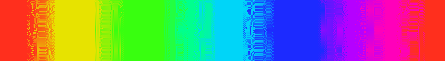

如前所述，其原因是这样的事实，即色调是造成每个像素颜色的原因。 另一方面，饱和度和值通道可用于获得相同颜色的较亮（使用饱和度通道）和较暗（使用值通道）变化。 请注意，在 HSV 颜色空间中，与 RGB 不同，色相是介于 0 到 360 之间的值。这是因为色相被建模为圆形，因此，每当其值溢出时，颜色就会回到起点。 如果查看上一张图像的开始和结尾，这两个都是红色，则很明显，因此 0 或 360 附近的色相值必须是带红色的颜色。

但是，在 OpenCV 中，色相通常会除以 2 以容纳 8 位（除非我们为像素数据使用 16 位或更多位），因此色相的值可以在`0`和`180`之间变化。 如果返回上一个代码示例，您会注意到在`Mat`类的列上，色相值从`0`设置为`180`，这将导致我们的色谱输出图像。

现在，让我们使用我们刚刚学到的东西创建一个颜色直方图，并使用它来获取背投图像以隔离我们的红玫瑰。 为了达到这个目的，我们甚至可以使用一段简单的代码将其变成蓝玫瑰，但是正如我们将在本章稍后学习的那样，该方法与 MeanShift 和 CamShift 算法结合使用来跟踪对象， 有特定的颜色。 我们的直方图将基于图像的 HSV 版本中的颜色分布或色相通道。 因此，我们需要首先使用以下代码将其转换为 HSV 颜色空间：

```cpp
    Mat hsvImg; 
    cvtColor(inputImage, hsvImg, CV_BGR2HSV); 
```

然后，使用与上一个示例完全相同的方法来计算直方图。 这次（在可视化方面）的主要区别在于，由于直方图是颜色分布，因此直方图还需要显示每个垃圾箱的颜色，否则输出将难以解释。 为了获得正确的输出，这次我们将使用 HSV 到 BGR 的转换来创建一个包含所有箱子的颜色值的缓冲区，然后相应地填充输出条形图中的每个条形。 这是用于在计算出色相通道直方图（或换句话说就是颜色分布图）之后将其正确可视化的源代码：

```cpp
    Mat colors(1, bins, CV_8UC3); 
    for(int i=0; i<bins; i++) 
    { 
      colors.at<Vec3b>(i) =  
      Vec3b(saturate_cast<uchar>( 
        (i+1)*180.0/bins), 255, 255); 
    } 
    cvtColor(colors, colors, COLOR_HSV2BGR); 

    Point p1(0,0), p2(0,outputImage.rows-1); 
    for(int i=0; i<ui->binsSpin->value(); i++) 
    { 
      float value = histogram.at<float>(i,0); 
      value = maxVal - value; // invert 
      value = value / maxVal * outputImage.rows; // scale 
      p1.y = value; 
      p2.x = float(i+1) * float(outputImage.cols) / float(bins); 
      rectangle(outputImage, 
       p1, 
       p2, 
       Scalar(colors.at<Vec3b>(i)), 
       CV_FILLED); 
      p1.x = p2.x; 
    } 
```

正如我们在前面的代码示例中看到的，`maxVal`是使用`minMaxLoc`函数从直方图数据中计算出来的。 `bins`只是箱子的数量（或直方图大小），在这种情况下不能高于`180`； 众所周知，色相只能在`0`和`179`之间变化。 其余部分几乎相同，除了设置图形中每个条形的填充颜色值。 如果我们在示例玫瑰图像中使用最大箱子大小（即`180`）执行上述代码，则将获得以下输出：


在此直方图中，基本上所有具有色相精度（八位）的可能颜色都在直方图中考虑，但是我们可以通过减小箱子大小来进一步简化此操作。 `24`的箱子大小足够小，可以简化并将相似的颜色分组在一起，同时提供足够的精度。 如果将箱子大小更改为`24`，则会得到以下输出：


通过查看直方图，可以明显看出直方图中`24`条的前两个（左起）和后两个条是最带红色的颜色。 就像以前一样，我们将简单地限制其他所有内容。 这是如何做：

```cpp
    for(int i=0; i<histogram.rows; i++) 
    { 
      if((i==0) || (i==22) || (i==23)) // filter 
        histogram.at<float>(i,0) = 255; 
      else 
        histogram.at<float>(i,0) = 0; 
    } 
```

一个好的实践案例是创建一个用户界面，该界面允许选择直方图中的箱子并将其过滤掉。 您可以根据自己到目前为止所学的知识，通过使用`QGraphicsScene`和`QGraphicsRectItem`绘制条形图和直方图来进行此操作。 然后，您可以启用项目选择，并确保在按下`Delete`按钮时，条被删除并因此被滤除。

在简单阈值之后，我们可以使用以下代码来计算反投影。 请注意，由于我们的直方图是一维直方图，因此仅当输入图像也是单通道时，才可以使用反向投影重新应用它。 这就是为什么我们首先需要从图像中提取色相通道的原因。 `mixChannels`函数可用于将通道从一个`Mat`类复制到另一个。 因此，我们可以使用相同的函数将色相通道从 HSV 图像复制到单通道`Mat`类中。 仅需要为`mixChannels`函数提供源和目标`Mat`类（仅具有相同的深度，不一定是通道），源和目标图像的数量以及一对整数（在以下代码的`fromto`数组中），用于确定源通道索引和目标通道索引：

```cpp
    Mat hue; 
    int fromto[] = {0, 0}; 
    hue.create(hsvImg.size(), hsvImg.depth()); 
    mixChannels(&hsvImg, 1, &hue, 1, fromto, 1); 
    Mat backprojection; 
    calcBackProject(&hue, 
       1, 
       channels, 
       histogram, 
       backprojection, 
       ranges); 
```

在将其转换为 RGB 颜色空间后，使用`imshow`或 Qt Widget 在输出中直接显示背投图像，您将在玫瑰图像示例中看到我们的红色微调完美遮罩：


现在，如果我们将色相通道中的值偏移正确的数量，则可以从红色玫瑰中得到蓝色玫瑰； 不仅是相同的静态蓝色，而且在所有相应像素中具有正确的阴影和亮度值。 如果返回本章前面创建的色谱图像输出，您会注意到红色，绿色，蓝色和红色再次与色相值`0`，`120`，`240`和`360`完全一致。 当然，再次，如果我们考虑除以二（因为`360`不能适合一个字节，但是`180`可以适合），它们实际上是`0`，`60`，`120`和`180`。 这意味着，如果我们要在色调通道中移动红色以获得蓝色，则必须将其偏移`120`，并且类似地要转换以获得其他颜色。 因此，我们可以使用类似的方法正确地改变颜色，并且只能在之前的背投图像突出显示的像素中进行。 请注意，我们还需要注意溢出问题，因为最高的色相值应为`179`，且不能大于：

```cpp
    for(int i=0; i<hsvImg.rows; i++) 
    { 
      for(int j=0; j<hsvImg.cols; j++) 
      { 
        if(backprojection.at<uchar>(i, j)) 
        { 
            if(hsvImg.at<Vec3b>(i,j)[0] < 60) 
                hsvImg.at<Vec3b>(i,j)[0] += 120; 
            else if(hsvImg.at<Vec3b>(i,j)[0] > 120) 
                hsvImg.at<Vec3b>(i,j)[0] -= 60; 
        } 
      } 
   } 

   Mat imgHueShift; 
   cvtColor(hsvImg, imgHueShift, CV_HSV2BGR); 
```

通过执行前面的代码，我们将获得下面的结果图像，它是从红色像素变为蓝色的图像转换回的 RGB 图像：


对于不同的柱状图大小，请尝试相同的操作。 另外，作为练习，您可以尝试构建适当的 GUI 以进行色移。 您甚至可以尝试编写一个程序，该程序可以将图像中具有特定颜色（精确的颜色直方图）的对象更改为其他颜色。 电影和照片编辑程序中广泛使用了一种非常相似的技术来改变图像或连续视频帧中特定区域的颜色（色相）。

# 直方图比较

使用`calcHist`函数计算出的两个直方图，或者从磁盘加载并填充到`Mat`类中的直方图，或者使用任何方法按字面意义创建的两个直方图，都可以相互比较以找出它们之间的距离或差异（或差异）， 通过使用`compareHist`方法。 请注意，只要直方图的`Mat`结构与我们之前看到的一致（即列数，深度和通道），就可以实现。

`compareHist`函数采用存储在`Mat`类中的两个直方图和`comparison`方法，它们可以是以下常量之一：

*   `HISTCMP_CORREL`
*   `HISTCMP_CHISQR`
*   `HISTCMP_INTERSECT`
*   `HISTCMP_BHATTACHARYYA`
*   `HISTCMP_HELLINGER`
*   `HISTCMP_CHISQR_ALT`
*   `HISTCMP_KL_DIV`

请注意，`compareHist`函数的返回值以及应如何解释完全取决于`comparison`方法，它们的变化很大，因此请务必查看 OpenCV 文档页面以获取详细的列表。 每种方法中使用的基础比较方程。 这是示例代码，可使用所有现有方法来计算两个图像（或两个视频帧）之间的差异：

```cpp
    Mat img1 = imread("d:/dev/Packt/testbw1.jpg", IMREAD_GRAYSCALE); 
    Mat img2 = imread("d:/dev/Packt/testbw2.jpg", IMREAD_GRAYSCALE); 

    float range[] = {0, 255}; 
    const float* ranges[] = {range}; 
    int bins[] = {100}; 

    Mat hist1, hist2; 
    calcHist(&img1, 1, 0, Mat(), hist1, 1, bins, ranges); 
    calcHist(&img2, 1, 0, Mat(), hist2, 1, bins, ranges); 

    qDebug() << compareHist(hist1, hist2, HISTCMP_CORREL); 

    qDebug() << compareHist(hist1, hist2, HISTCMP_CHISQR); 

    qDebug() << compareHist(hist1, hist2, HISTCMP_INTERSECT); 

    // Same as HISTCMP_HELLINGER 
    qDebug() << compareHist(hist1, hist2, HISTCMP_BHATTACHARYYA); 

    qDebug() << compareHist(hist1, hist2, HISTCMP_CHISQR_ALT); 

    qDebug() << compareHist(hist1, hist2, HISTCMP_KL_DIV); 
```

我们可以在以下两个图像上尝试前面的代码：

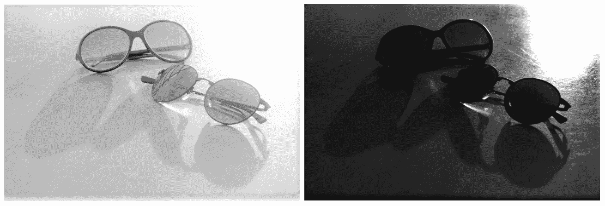

比较的结果可以在 Qt Creator 输出中查看，如下所示：

```cpp
-0.296291 
1.07533e+08 
19811 
0.846377 
878302 
834340 
```

通常，通常使用直方图差异来比较图像。 还可以在视频帧中使用类似的技术来检测与场景或场景中存在的对象的差异。 因此，应该存在一个预先准备好的直方图，然后将其与每个传入视频帧的直方图进行比较。

# 直方图均衡

图像的直方图可用于调整图像的亮度和对比度。 OpenCV 提供了一个称为`equalizeHist`的函数，该函数在内部计算给定图像的直方图，对直方图进行归一化，计算直方图的积分（所有仓位的总和），然后使用更新后的直方图作为查找表来更新输入图像的像素，导致输入图像中的亮度和对比度标准化。 使用此函数的方法如下：

```cpp
    equalizeHist(image, equalizedImg); 
```

如果您在亮度不适当或收缩的图像上尝试使用此函数，则将在亮度和对比度方面将它们自动调整到视觉上更好的水平。 此过程称为**直方图均衡**。 以下示例显示两个亮度级别太低或太高的图像及其直方图，它们显示相应的像素值分布。 左侧的图像是使用`equalizeHist`函数生成的，对于左侧的两个图像，它看起来或多或少都是相同的。 注意输出图像的直方图中的变化，这反过来会导致图像更具视觉吸引力：


大多数数码相机使用类似的技术来根据像素在整个图像中的分布量来调整像素的暗度和亮度。 您也可以在任何常见的智能手机上尝试此操作。 只需将相机对准明亮的区域，智能手机上的软件就会开始降低亮度，反之亦然。

# MeanShift 和 CamShift

到目前为止，我们在本章中学到的知识除了已经看到的用例之外，还旨在为我们正确使用 MeanShift 和 CamShift 算法做准备，因为它们从直方图和反投影图像中受益匪浅。 但是，MeanShift 和 CAMShift 算法是什么？

让我们从 MeanShift 开始，然后继续进行 CamShift，它基本上是同一算法的增强版本。 因此，MeanShift 的一个非常实用的定义（如当前 OpenCV 文档中所述）如下：

在反投影图像上找到对象

这是对 MeanShift 算法的一个非常简单但实用的定义，并且在使用它时我们将或多或少地坚持下去。 但是，值得注意的是底层算法，因为它有助于轻松，高效地使用它。 为了开始描述 MeanShift 的工作原理，首先，我们需要将反投影图像（或通常为二进制图像）中的白色像素视为二维平面上的分散点。 那应该很容易。 以此为借口，我们可以说，MeanShift 实际上是一种迭代方法，用于查找点在分布点的平面上最密集的位置。 该算法具有一个初始窗口（指定整个图像一部分的矩形），该窗口用于搜索质心，然后将窗口中心移动到新找到的质心。 重复查找质量中心并使窗口中心偏移的过程，直到所需的偏移小于提供的阈值（ε）或达到最大迭代次数为止。 下图显示了在 MeanShift 算法中每次迭代之后窗口移动到最密集的位置（或者甚至在达到迭代计数之前，甚至之前）移动窗口的方式：


基于此，通过确保在每个帧的反投影中区分对象，MeanShift 算法可用于跟踪视频中的对象。 当然，为此，我们需要使用与之前相似的阈值方法。 最常见的方法是应用已经准备好的直方图，并使用它来计算反投影（在我们之前的示例中，我们只是修改了输入直方图）。 让我们通过一个示例逐步进行此操作。 因此，我们将创建一个`QThread`子类，可以在任何独立的 Qt 应用中创建该子类，也可以在 DLL 或插件中使用该子类，这将用于`computer_vision`项目。 无论如何，对于所有项目类型，此线程将保持完全相同。

如第 8 章，“多线程处理”中所讨论的，处理视频应在单独的线程中完成（如果我们不希望找到任何丑陋的解决方法），以使它不会阻塞 GUI 线程，并且可以自由地响应用户的操作。 请注意，该相同线程也可以用作创建任何其他（相似）视频处理线程的模板。 因此，让我们开始：

1.  我们将创建一个 Qt 窗口小部件应用，该应用可以跟踪一个对象（具有任何颜色，但在这种情况下不是完全白色或黑色），该对象最初将使用鼠标，相机的实时供稿并使用 MeanShift 算法进行选择。 在初始选择之后的任何时候，我们都可以再次从摄像机的实时供稿中更改到场景中的另一个对象。 第一次选择对象时，然后每次更改选择时，将提取视频帧的色相通道，并使用直方图和反投影图像计算并提供给 MeanShift 算法，并且该对象将被跟踪。 因此，我们需要首先创建一个 Qt Widgets 应用并为其命名，例如`MeanShiftTracker`，然后继续实际的跟踪器实现。
2.  正如我们在第 8 章，“多线程”中了解的那样，创建一个`QThread`子类。 将其命名为`QCvMeanShiftThread`，并确保相应地在私有和公共成员区域中包括以下内容。 我们将使用`setTrackRect`函数通过此函数设置初始`MeanShift`跟踪窗口，但还将使用此函数提供将跟踪更改为另一个对象的方法。 `newFrame`非常明显，它将在处理完每帧后发出，以便 GUI 可以显示它。 使用私有区域和 GUI 的成员将在后面的步骤中进行描述，但是它们包含了到目前为止我们已经了解的一些最重要的主题：

```cpp
        public slots: 
          void setTrackRect(QRect rect); 

        signals: 
          void newFrame(QPixmap pix); 

        private: 
          void run() override; 
          cv::Rect trackRect; 
          QMutex rectMutex; 
          bool updateHistogram;
```

3.  `setTrackRect`函数只是用于更新我们希望 MeanShift 算法跟踪的矩形（初始窗口）的`setter`函数。 这是应如何实现：

```cpp
        void QCvMeanShiftThread::setTrackRect(QRect rect) 
        { 
          QMutexLocker locker(&rectMutex); 
          if((rect.width()>2) && (rect.height()>2)) 
          { 
             trackRect.x = rect.left(); 
             trackRect.y = rect.top(); 
             trackRect.width = rect.width(); 
             trackRect.height = rect.height(); 
             updateHistogram = true; 
          } 
        } 
```

`QMutexLocker`与`rectMutex`一起用于为我们的`trackRect`提供访问序列化。 由于我们还将以一种实时工作的方式实现跟踪方法，因此我们需要确保在处理`trackRect`时不会对其进行更新。 我们还确保其大小合理，否则将被忽略。

4.  至于我们的跟踪器线程的`run`函数，我们需要使用`VideoCapture`打开计算机上的默认相机并向我们发送帧。 请注意，如果框架为空（损坏），相机关闭或从线程外部请求线程中断，则循环将退出：

```cpp
        VideoCapture video; 
        video.open(0); 
        while(video.isOpened() && !this->isInterruptionRequested()) 
        { 
          Mat frame; 
          video >> frame; 
          if(frame.empty()) 
          break; 

          // rest of the process ... 
          .... 
         }
```

在循环内，将其标记为`rest of the process ...`，首先，我们将使用`cv::Rect`类的`area`函数来查看`trackRect`是否已设置。 如果是，那么我们将锁定访问权限并继续进行跟踪操作：

```cpp
        if(trackRect.size().area() > 0) 
        { 
          QMutexLocker locker(&rectMutex); 
          // tracking code 
         }
```

至于 MeanShift 算法和真实跟踪，我们可以使用以下源代码：

```cpp
        Mat hsv, hue, hist; 
        cvtColor(frame, hsv, CV_BGR2HSV); 
        hue.create(hsv.size(), hsv.depth()); 
        float hrange[] = {0, 179}; 
        const float* ranges[] = {hrange}; 
        int bins[] = {24}; 
        int fromto[] = {0, 0}; 
        mixChannels(&hsv, 1, &hue, 1, fromto, 1); 

        if(updateHistogram) 
        { 
          Mat roi(hue, trackRect); 
          calcHist(&roi, 1, 0, Mat(), hist, 1, bins, ranges); 

          normalize(hist, 
              hist, 
              0, 
              255, 
              NORM_MINMAX); 

          updateHistogram = false; 
        } 

        Mat backProj; 
        calcBackProject(&hue, 
          1, 
          0, 
          hist, 
          backProj, 
          ranges); 

        TermCriteria criteria; 
        criteria.maxCount = 5; 
        criteria.epsilon = 3; 
        criteria.type = TermCriteria::EPS; 
        meanShift(backProj, trackRect, criteria); 

        rectangle(frame, trackRect, Scalar(0,0,255), 2); 
```

上面的代码按照以下顺序执行以下操作：

*   使用`cvtColor`函数将输入帧从 BGR 转换为 HSV 色彩空间。
*   使用`mixChannels`函数仅提取色调通道。
*   如果需要，可以使用`calcHist`和`normalize`函数计算并归一化直方图。
*   使用`calcBackproject`函数计算反投影图像。
*   通过提供迭代标准，在背投图像上运行 MeanShift 算法。 这是通过`TermCriteria`类和`meanShift`函数完成的。 `meanShift`会简单地更新提供的矩形（`trackRect`每帧有一个新矩形）。
*   在原始图像上绘制检索到的矩形。

除了`TermCriteria`类和`meanShift`函数本身之外，您刚刚看到的任何代码中都没有新内容。 如前所述，MeanShift 算法是一种迭代方法，需要根据移位量（`ε`）和迭代次数来确定一些停止条件。 简而言之，增加迭代次数可以减慢算法的速度，但也可以使其更加准确。 另一方面，提供较小的ε值将意味着更加敏感的行为。

在处理完每个帧之后，线程仍需要使用专用信号将其发送到另一个类。 方法如下：

```cpp
    emit newFrame( 
      QPixmap::fromImage( 
         QImage( 
           frame.data, 
           frame.cols, 
           frame.rows, 
           frame.step, 
           QImage::Format_RGB888) 
           .rgbSwapped()));
```

请注意，除了发送`QPixmap`或`QImage`等，我们还可以发送不是`QObject`子类的类。 为了能够通过 Qt 信号发送非 Qt 类，它必须具有公共默认构造器，公共副本构造器和公共析构器。 还需要先注册。 例如，`Mat`类包含必需的方法，但不是已注册的类型，因此可以按如下所示进行注册：`qRegisterMetaType<Mat>("Mat");`。 之后，您可以在 Qt 信号和插槽中使用`Mat`类。

5.  除非我们完成此线程所需的用户界面，否则仍然看不到任何结果。 让我们用`QGraphicsView`来做。 只需使用设计器将一个拖放到`mainwindow.ui`上，然后将以下内容添加到`mainwindow.h`中。 我们将使用`QGraphicsView`类的橡皮筋功能轻松实现对象选择：

```cpp
        private: 
          QCvMeanShiftThread *meanshift; 
          QGraphicsPixmapItem pixmap; 

        private slots: 
         void onRubberBandChanged(QRect rect, 
         QPointF frScn, QPointF toScn); 
         void onNewFrame(QPixmap newFrm); 
```

6.  在`mainwindow.cpp`文件和`MainWindow`类的构造器中，确保添加以下内容：

```cpp
        ui->graphicsView->setScene(new QGraphicsScene(this)); 
        ui->graphicsView->setDragMode(QGraphicsView::RubberBandDrag); 
        connect(ui->graphicsView, 
        SIGNAL(rubberBandChanged(QRect,QPointF,QPointF)), 
        this, 
        SLOT(onRubberBandChanged(QRect,QPointF,QPointF))); 

        meanshift = new QCvMeanShiftThread(); 
        connect(meanshift, 
          SIGNAL(newFrame(QPixmap)), 
          this, 
          SLOT(onNewFrame(QPixmap))); 
          meanshift->start(); 

        ui->graphicsView->scene()->addItem(&pixmap);
```

在第 5 章，“图形视图框架”中详细讨论了如何使用 Qt 图形视图框架。

7.  还应确保在关闭应用时注意线程，如下所示：

```cpp
        meanshift->requestInterruption(); 
        meanshift->wait(); 
        delete meanshift; 
```

8.  剩下的唯一事情就是在 GUI 本身上设置传入的`QPixmap`，并且还传递更新被跟踪对象所需的矩形：

```cpp
        void MainWindow::onRubberBandChanged(QRect rect, 
          QPointF frScn, 
          QPointF toScn) 
          { 
            meanshift->setTrackRect(rect); 
          } 

       void MainWindow::onNewFrame(QPixmap newFrm) 
       { 
         pixmap.setPixmap(newFrm); 
       } 
```

尝试运行该应用并选择一个在相机上可见的对象。 使用鼠标在图形视图上绘制的矩形将跟随您选择的对象，无论它在屏幕上的任何位置。 这是从视图中选择 Qt 徽标后对其进行跟踪的一些屏幕截图：

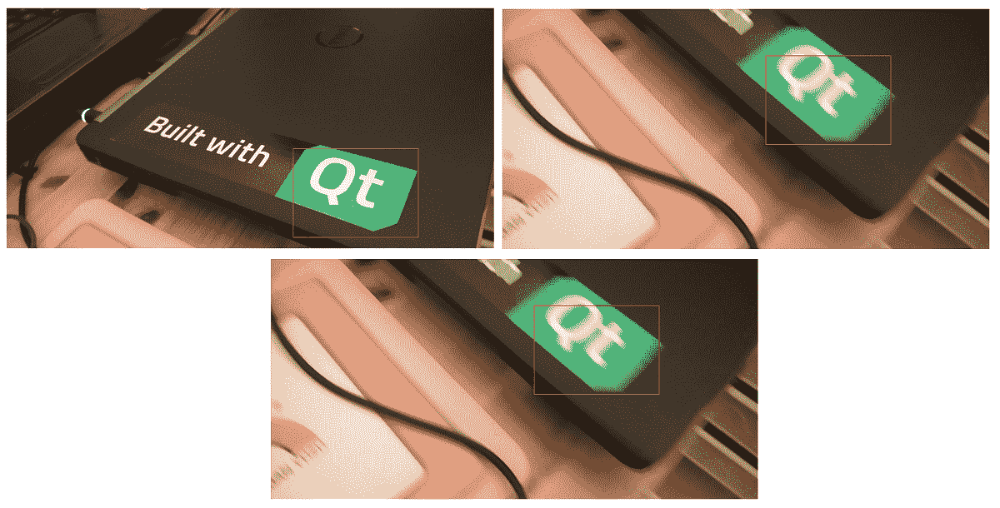

可视化反投影图像并查看幕后发生的魔术也是一个好主意。 请记住，如前所述，MeanShift 算法正在搜索质心，当在反投影图像中观察时，这很容易感知。 只需用以下代码替换我们用于可视化线程内图像的最后几行：

```cpp
    cvtColor(backProj, backProj, CV_GRAY2BGR); 
    frame = backProj; 
    rectangle(frame, trackRect, Scalar(0,0,255), 2); 
```

现在再试一次。 您应该在图形视图中具有反投影图像：


从结果可以看出，MeanShift 算法或精确的`meanShift`函数非常易于使用，只要为其提供灰度图像即可，该图像可以使用任何阈值方法隔离感兴趣的对象。 是的，反投影也类似于阈值设置，在该阈值设置中，您可以基于颜色，强度或其他条件让某些像素通过或某些其他像素不通过。 现在，如果我们回到 MeanShift 算法的初始描述，完全可以说它可以基于反投影图像找到并跟踪对象。

尽管`meanShift`函数易于使用，但它仍然缺少几个非常重要的功能。 这些是对被跟踪对象的比例和方向更改的容限。 无论对象的大小或其方向如何，`camShift`函数都将提供一个大小和旋转度完全相同的窗口，而该窗口只是试图以目标对象为中心。 这些问题在 MeanShift 算法的增强版本中得以解决，该增强版本称为**连续自适应 MeanShift** 算法，或简称为 CamShift。

`CamShift`函数是 OpenCV 中 CamShift 算法的实现，与 MeanShift 算法有很多共同之处，并且出于同样的原因，它的使用方式几乎相同。 为了证明这一点，只需将前面代码中对`meanShift`算法的调用替换为`CamShift`即可，如下所示：

```cpp
    CamShift(backProj, trackRect, criteria); 
```

如果再次运行该程序，您会发现什么都没有真正改变。 但是，此函数还提供`RotatedRect`类型的返回值，该返回值基本上是矩形，但具有中心，大小和角度属性。 您可以保存返回的`RotatedRect`并将其绘制在原始图像上，如下所示：

```cpp
    RotatedRect rotRec = CamShift(backProj, trackRect, criteria); 
    rectangle(frame, trackRect, Scalar(0,0,255), 2); 
    ellipse(frame, rotRec, Scalar(0,255,0), 2); 
```

请注意，我们实际上在这段代码中绘制了一个适合`RotatedRect`类属性的椭圆。 我们还绘制了先前存在的矩形，以便与旋转的矩形进行比较。 如果您尝试再次运行该程序，则结果如下：


请注意，绿色椭圆相对于红色矩形的旋转是`CamShift`函数的结果。 尝试将要跟踪的彩色物体移离相机或靠近相机，然后查看`CamShift`如何尝试适应这些变化。 另外，尝试使用非正方形物体观察`CamShift`提供的旋转不变跟踪。

`CamShift`函数还可以用于根据物体的颜色检测物体。 当然，如果可以与周围环境区分开。 因此，您需要设置一个预先准备好的直方图，而不是像我们的示例那样在运行时设置它。 您还需要将初始窗口大小设置为很大的窗口大小，例如整个图像的大小，或图像中预期将出现对象的最大区域。 通过运行相同的代码，您会注意到，在每一帧之后，窗口将变得越来越小，直到仅覆盖我们为其提供直方图的目标对象为止。

# 背景/前景检测

背景/前景检测或分割（由于很好的原因通常也称为背景减法）是一种区分图像（前景）中移动区域或变化区域的方法，而不是或多或少的恒定或静态区域（背景）。 该方法在检测图像中的运动时也非常有效。 OpenCV 包括许多不同的背景扣除方法，默认情况下，当前的 OpenCV 安装中提供了两种方法，即`BackgroundSubtractorKNN`和`BackgroundSubtractorMOG2`。 与我们在第 7 章，“特征和描述符”中了解到的特征检测器类相似，这些类也源自`cv::Algorithm`类，并且它们都非常容易且相似地使用，因为它们的用法或结果不同，而在类的实现方面不同。

`BackgroundSubtractorMOG2`可以通过使用高斯混合模型来检测背景/前景。 另一方面，通过使用 **KNN** 或 **K 最近邻**方法，`BackgroundSubtractorKNN`也可以用于实现相同的目标。

如果您对这些算法的内部细节或如何实现感兴趣，可以参考以下文章以获取更多信息：

```cpp
Zoran Zivkovic and Ferdinand van der Heijden. Efficient adaptive density estimation per image pixel for the task of background subtraction. Pattern recognition letters, 27(7):773-780, 2006.

Zoran Zivkovic. Improved adaptive gaussian mixture model for background subtraction. In Pattern Recognition, 2004. ICPR 2004. Proceedings of the 17th International Conference on, volume 2, pages 28-31. IEEE, 2004.
```

首先让我们看看它们是如何使用的，然后再介绍它们的一些重要功能。 与上一节中创建的`QCvMeanShiftThread`类相似，我们可以通过将`QThread`子类化来创建新线程。 将其命名为`QCvBackSubThread`或您认为合适的任何名称。 唯一有区别的部分是覆盖的`run`函数，它看起来如下所示：

```cpp
    void QCvBackgroundDetect::run() 
    { 
      using namespace cv; 

      Mat foreground; 
      VideoCapture video; 
      video.open(0); 

      Ptr<BackgroundSubtractorMOG2> subtractor = 
            createBackgroundSubtractorMOG2(); 

      while(video.isOpened() && !this->isInterruptionRequested()) 
      { 
        Mat frame; 
        video >> frame; 
        if(frame.empty()) 
            break; // or continue if this should be tolerated 

        subtractor->apply(frame, foreground); 

        Mat foregroundBgr; 
        cvtColor(foreground, foregroundBgr, CV_GRAY2BGR); 

        emit newFrame( 
           QPixmap::fromImage( 
               QImage( 
                 foregroundBgr.data, 
                 foregroundBgr.cols, 
                 foregroundBgr.rows, 
                 foregroundBgr.step, 
                 QImage::Format_RGB888) 
                .rgbSwapped())); 

         } 
      } 
```

请注意，背景减法所需的唯一调用是`BackgroundSubtractorMOG2`类的构造并调用`apply`函数。 就使用它们而言，仅此而已，这使它们非常简单易用。 在每帧，根据图像所有区域的变化历史更新前景，即`Mat`类。 由于我们只是通过调用`createBackgroundSubtractorMOG2`函数使用了默认参数，因此我们没有更改任何参数，而是继续使用默认值，但是如果要更改算法的行为，我们需要为此提供以下参数：

*   `history`（默认设置为 500）是影响背景减法算法的最后一帧的数量。 在我们的示例中，我们还在 30 FPS 摄像机或视频上使用了大约 15 秒的默认值。 这意味着，如果一个区域在过去 15 秒钟内完全未变，则它将完全变黑。
*   `varThreshold`（默认设置为 16）是算法的差异阈值。
*   `detectShadows`（默认设置为`true`）可用于忽略或计数检测阴影变化。

尝试运行前面的示例程序，该程序使用默认参数并观察结果。 如果镜头前没有任何动作，您应该会看到一个全黑的屏幕，但是即使很小的移动也可以被视为输出上的白色区域。 您应该会看到以下内容：

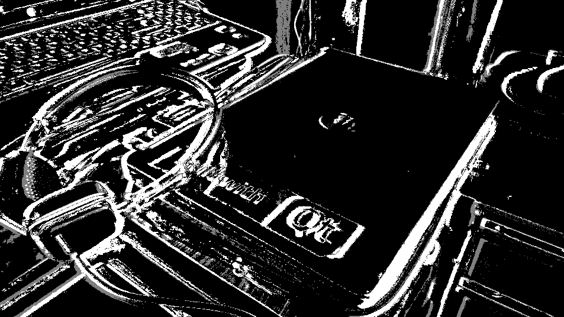

切换到`BackgroundSubtractorKNN`类非常容易，您只需要用以下内容替换构造线：

```cpp
    Ptr<BackgroundSubtractorKNN> subtractor =  
       createBackgroundSubtractorKNN(); 
```

没什么需要改变的。 但是，要修改此算法的行为，可以使用以下参数，其中一些参数也与`BackgroundSubtractorMOG2`类共享：

*   `history`与之前的算法完全相同。
*   `detectShadows`，也与先前的算法相同。
*   `dist2Threshold`默认情况下设置为`400.0`，并且是像素与样本之间平方距离的阈值。 为了更好地理解这一点，最好在线查看 K 最近邻算法。 当然，您可以简单地使用默认值并使用算法，而无需提供任何参数。

试用各种参数并观察结果，没有什么可以帮助您提高使用这些算法的效率。 例如，您会注意到增加历史值将有助于检测甚至更小的运动。 尝试更改其余参数，以自己观察和比较结果。

在前面的示例中，我们尝试输出通过使用背景减法类提取的前景遮罩图像。 您还可以在`copyTo`函数中使用相同的前景遮罩，以输出前景的实际像素。 这是如何做：

```cpp
    frame.copyTo(outputImage, foreground); 
```

其中`frame`是相机输入的帧，`foreground`是通过背景减法算法获得的，与前面的示例相同。 如果尝试显示输出图像，则将具有以下类似内容：

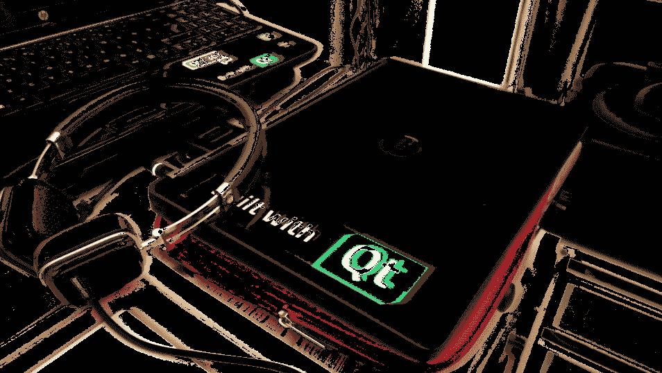

请注意，此处看到的输出是移动摄像机的结果，与移动视频中的对象基本相同。 但是，如果您在视频中尝试在静态背景上四处移动其他任何彩色对象的视频中使用同一示例，则可以使用 CamShift 算法在移动对象周围获取一个边界框以提取该对象，或由于任何原因对其进行进一步处理。

使用 OpenCV 中的现有视频分析类编写应用的机会是巨大的，这仅取决于您对使用它们的熟悉程度。 例如，通过使用背景减除算法，您可以尝试编写运行警报的应用，或者在检测到运动时执行另一个过程。 可以通过测量在前面的示例中看到的提取的前景图像中像素的总和或平均值，然后检测超过某些阈值的突然增加，来轻松地完成类似的操作。 我们甚至无法开始列举所有可能性，但可以肯定的是，您是混合使用这些算法来解决特定任务的大师，并且包括该书在内的任何指南都只是您如何操作的路标集合。 使用现有算法。

# 总结

编写执行实时图像处理的计算机视觉应用是当今的热门话题，并且 OpenCV 包含许多类和函数来帮助简化此类应用的开发。 在本章中，我们试图介绍 OpenCV 提供的一些最重要的类和函数，这些类和函数用于实时处理视频和图像。 我们了解了 OpenCV 中的 MeanShift，CamShift 和背景减法算法，这些算法打包在快速高效的类中，同时，它们非常易于使用，前提是您熟悉大多数语言中使用的基本概念 ，例如直方图和反投影图像。 这就是为什么我们首先要学习所有有关直方图的知识，以及如何进行计算，可视化和相互比较。 我们还学习了如何计算反投影图像并将其用作查找表以更新图像。 我们在 MeanShift/CamShift 算法中也使用了相同的算法来跟踪特定颜色的对象。 到现在为止，我们应该能够高效地编写基于其中的零件和零件运动来处理视频和图像的应用。

本章是最后一章，我们将介绍 OpenCV 和 Qt 框架的详细信息。 一本书，甚至一本书，永远都不足以覆盖 OpenCV 和 Qt 框架中的所有现有材料，但是我们试图以一种可以跟进其余部分的方式来呈现整个情况的概述。 现有的类和函数可以自己开发有趣的计算机视觉应用。 确保与 OpenCV 和 Qt 框架的新开发保持同步，因为它们正在开展并吸引着正在进行中的项目，并且进展似乎不会很快停止。

本书的下一章将专门介绍如何调试，测试和部署 Qt 和 OpenCV 应用并将其部署给用户。 我们将首先了解 Qt Creator 的调试功能，然后继续使用 Qt Test 命名空间及其基础功能，这些功能可用于轻松进行 Qt 应用的单元测试。 在下一章中，我们还将介绍 Qt 安装程序框架，甚至为应用创建一个简单的安装程序。