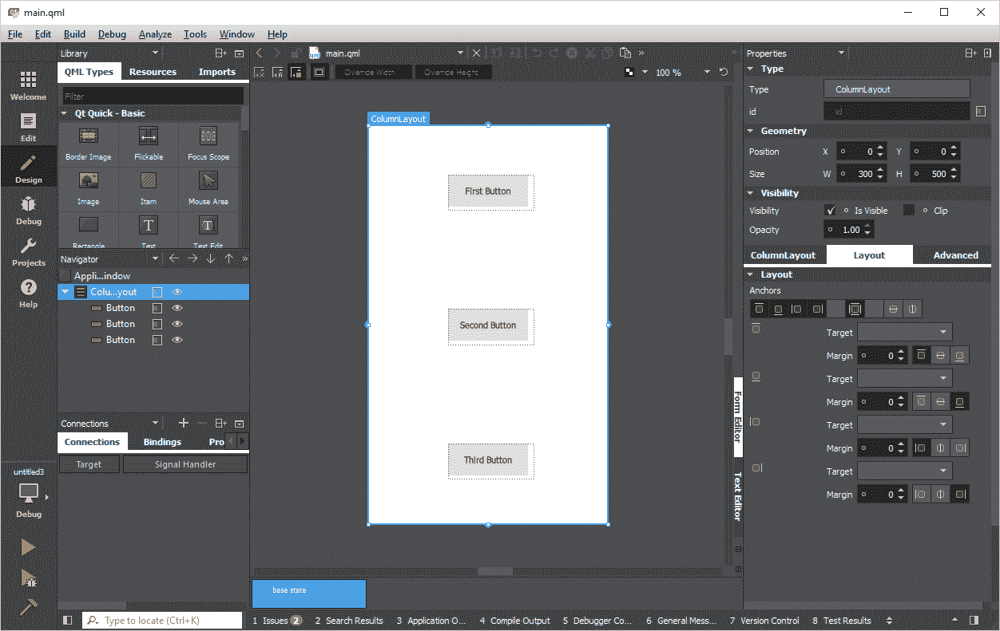
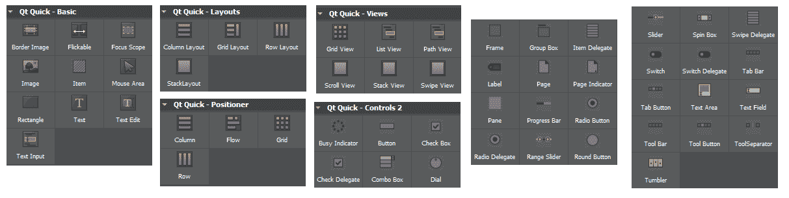
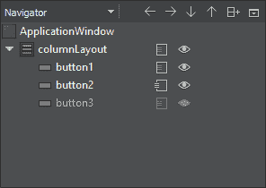
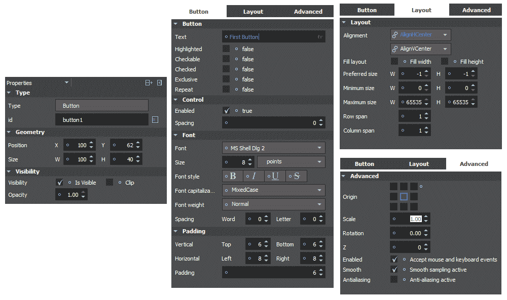
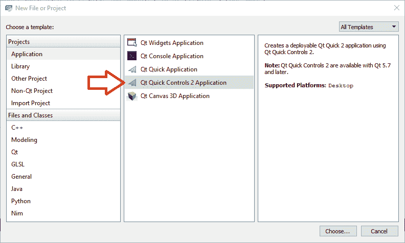
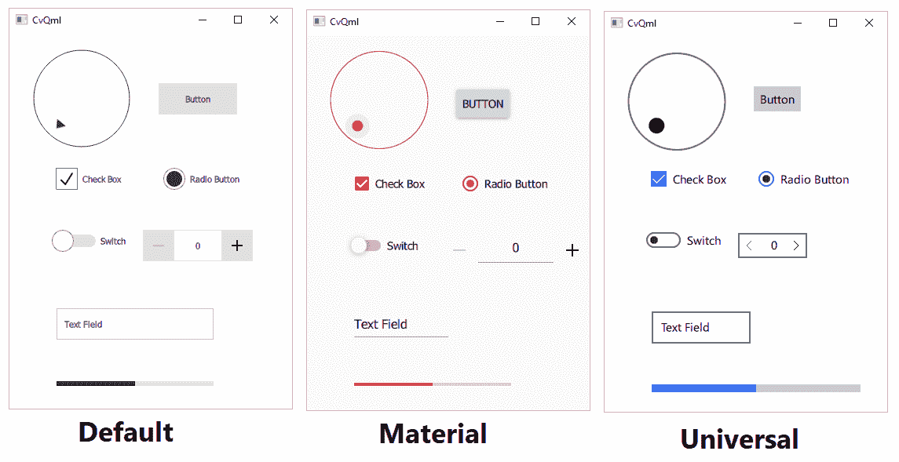
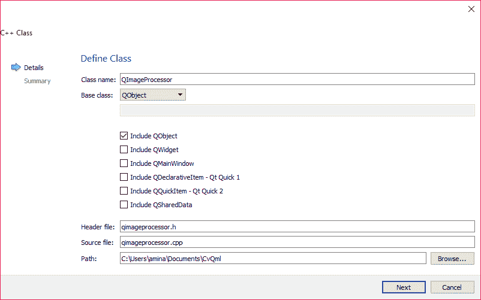

# 十二、Qt Quick 应用

使用 Qt 窗口小部件应用项目允许通过使用 Qt Creator 设计模式创建灵活而强大的 GUI，或者在文本编辑器中手动修改 GUI 文件（`*.ui`）。 到目前为止，在本书的所有章节中，我们都基于 **Qt Widgets 应用**作为创建的 GUI 的基础，并且我们在第 3 章，“创建一个全面的 Qt + OpenCV 项目”中了解到，我们可以使用样式表来有效地更改 Qt 应用的外观。 但是，除了 Qt Widgets 应用并使用`QtWidgets`和`QtGui`模块之外，Qt 框架还提供了另一种创建 GUI 的方法。 这种方法基于`QtQuick`模块和 QML 语言，并且允许创建更加灵活的 GUI（在外观，感觉，动画，效果等方面），并且更加轻松。 使用这种方法创建的应用称为 Qt Quick 应用。 请注意，在较新的 Qt 版本（5.7 和更高版本）中，您还可以创建 Qt Quick Controls 2 应用，它为创建 Qt Quick 应用提供了更多改进的类型，我们还将重点关注这一点。

`QtQuick`模块和`QtQml`模块是包含所有必需类的模块，以便在 C++ 应用中使用 Qt Quick 和 QML 编程。 另一方面，QML 本身是一种高度可读的声明性语言，它使用类似于 JSON 的语法（与脚本结合）来描述用户界面的各种组件以及它们之间的交互方式。 在本章中，我们将向您介绍 QML 语言以及如何使用它简化创建 GUI 应用的过程。 通过创建示例基于 QML 的 GUI 应用（或更确切地说是 Qt Quick Controls 2 应用），我们将了解其简单易读的语法以及如何在实践中使用它。 尽管使用 QML 语言不一定需要对 C++ 语言有深入的了解，但了解 Qt Quick 项目的结构仍然非常有用，因此我们将简要介绍最基本的 Qt Quick 应用的结构。 通过研究一些最重要的 QML 库，我们将了解现有的可视和非可视 QML 类型，这些类型可用于创建用户界面，向其中添加动画，访问硬件等。 我们将学习如何使用集成到 Qt Creator 中的 Qt Quick Designer 通过图形设计器修改 QML 文件。 稍后，通过学习 C++ 和 QML 的集成，我们将填补它们之间的空白，并学习如何在 Qt Quick 应用中使用 OpenCV 框架。 在最后一章中，我们还将学习如何使用与 Qt 和 OpenCV 相同的桌面项目来创建移动计算机视觉应用，并将我们的跨平台范围扩展到桌面平台之外，并扩展到移动世界。

本章涵盖的主题包括：

*   QML 简介
*   Qt Quick 应用项目的结构
*   创建 Qt Quick Controls 2 应用
*   使用 Qt Quick Designer
*   集成 C++ 和 QML
*   在 Android 和 iOS 上运行 Qt 和 OpenCV 应用

# QML 简介

如引言中所述，QML 具有类似于 JSON 的结构，可用于描述用户界面上的元素。 QML 代码导入一个或多个库，并且具有一个包含所有其他可视和非可视元素的根元素。 以下是 QML 代码的示例，该代码导致创建具有指定宽度，高度和标题的空窗口（`ApplicationWindow`类型）：

```cpp
    import QtQuick 2.7 
    import QtQuick.Controls 2.2 

    ApplicationWindow 
    { 
      visible: true 
      width: 300 
      height: 500 
      title: "Hello QML" 
    } 
```

每个`import`语句后都必须带有 QML 库名称和版本。 在前面的代码中，导入了包含大多数默认类型的两个主要 QML 库。 例如，在`QtQuick.Controls 2.2`库中定义了`ApplicationWindow`。 现有 QML 库及其正确版本的唯一真实来源是 Qt 文档，因此请确保始终引用它，以防需要使用其他任何类。 如果使用 Qt Creator 帮助模式搜索`ApplicationWindow`，您将发现所需的`import`语句就是我们刚刚使用的。 值得一提的另一件事是，先前代码中的`ApplicationWindow`是单个根元素，并且所有其他 UI 元素都必须在其中创建。 让我们通过添加显示一些文本的`Label`元素来进一步扩展代码：

```cpp
    ApplicationWindow 
    { 
      visible: true 
      width: 300 
      height: 500 
      title: "Hello QML" 

      Label 
      { 
        x: 25 
        y: 25 
        text: "This is a label<br>that contains<br>multiple lines!" 
      } 
    } 
```

由于它们与以前的代码相同，因此我们跳过了前面的代码中的`import`语句。 请注意，新添加的`Label`具有`text`属性，该属性是标签上显示的文本。 `x`和`y`只是指`Label`在`ApplicationWindow`内部的位置。 可以使用非常类似的方式添加诸如组框之类的容器项。 让我们添加一个，看看它是如何完成的：

```cpp
    ApplicationWindow 
    { 
      visible: true 
      width: 300 
      height: 500 
     title: "Hello QML" 
      GroupBox 
      { 
        x: 50 
        y: 50 
        width: 150 
        height: 150 
        Label 
        { 
          x: 25 
          y: 25 
          text: "This is a label<br>that contains<br>multiple lines!" 
        } 
      } 
    } 
```

此 QML 代码将导致一个类似于以下所示的窗口：


请注意，每个元素的位置都是与其父元素的偏移量。 例如，将`GroupBox`内提供给`Label`的`x`和`y`值添加到`GroupBox`本身的`x`和`y`属性中，这就是在根元素（在本例中为`ApplicationWindow`）中确定 UI 元素的最终位置。

与 Qt 窗口小部件类似，您也可以在 QML 代码中使用布局来控制和组织 UI 元素。 为此，可以使用`GridLayout`，`ColumnLayout`和`RowLayout` QML 类型，但首先，需要使用以下语句导入它们：

```cpp
    import QtQuick.Layouts 1.3 
```

现在，您可以将 QML 用户界面元素作为子项添加到布局中，并由其自动管理。 让我们在`ColumnLayout`中添加一些按钮，看看如何完成此操作：

```cpp
    ApplicationWindow 
    { 
      visible: true 
      width: 300 
      height: 500 
      title: "Hello QML" 

      ColumnLayout 
      { 
        anchors.fill: parent 
        Button 
        { 
          text: "First Button" 
          Layout.alignment: Qt.AlignHCenter | Qt.AlignVCenter 
        } 
        Button 
        { 
          text: "Second Button" 
          Layout.alignment: Qt.AlignHCenter | Qt.AlignVCenter 
        } 
        Button 
        { 
          text: "Third Button" 
          Layout.alignment: Qt.AlignHCenter | Qt.AlignVCenter 
        } 
      } 
    } 
```

这将导致类似于以下的窗口：


在前面的代码中，`ColumnLayout`的行为类似于我们在 Qt Widgets 应用中使用的垂直布局。 从上到下，作为子元素添加到`ColumnLayout`的每个元素都会显示在前一个元素之后，无论`ColumnLayout`的大小如何，始终调整其大小和位置以保持垂直布局视图。 关于上述内容，还有两点需要注意。 首先，使用以下代码将`ColumnLayout`本身的大小设置为父大小：

```cpp
    anchors.fill: parent
```

`anchors`是 QML 视觉元素的最重要属性之一，它照顾元素的大小和位置。 在这种情况下，通过将`anchors`的`fill`值设置为另一个对象（`parent`对象），我们将`ColumnLayout`的大小和位置描述为与`ApplicationWindow`相同。 通过正确使用锚点，我们可以以更大的功能和灵活性处理对象的大小和位置。 作为另一个示例，将代码中的`anchors.fill`行替换为以下内容，然后看看会发生什么：

```cpp
    width: 100 
    height: 100 
    anchors.centerIn: parent 
```

显然，我们的`ColumnLayout`现在具有恒定的大小，并且当`ApplicationWindow`调整大小时它不会改变； 但是，布局始终保持在`ApplicationWindow`的中心。 关于上述代码的最后一点是：

```cpp
    Layout.alignment: Qt.AlignHCenter | Qt.AlignVCenter 
```

添加到`ColumnLayout`的每个项目内的该行使该项目将自身垂直和水平定位在其单元格的中心。 请注意，这种意义上的单元格不包含任何可视边界，并且与布局本身一样，布局内的单元格也是在其中组织项目的非可视方式。

QML 代码的扩展遵循相同的模式，无论添加或需要多少项。 但是，随着 UI 元素的数量越来越大，最好将用户界面分成单独的文件。 可以将同一文件夹中的 QML 文件用作预定义的重要项目。 假设我们有一个名为`MyRadios.qml`的 QML 文件，其中包含以下代码：

```cpp
    import QtQuick 2.7 
    import QtQuick.Controls 2.2 
    import QtQuick.Layouts 1.3 

    Item 
    { 
      ColumnLayout 
      { 
        anchors.centerIn: parent 

        RadioButton 
        { 
            text: "Video" 
        } 
        RadioButton 
        { 
            text: "Image" 
        } 
      } 
    } 
```

您可以在同一文件夹的另一个 QML 文件中使用此 QML 文件及其`Item`。 假设我们在`MyRadios.qml`所在的文件夹中有一个`main.qml`文件。 然后，您可以像这样使用它：

```cpp
    import QtQuick 2.7 
    import QtQuick.Controls 2.2 
    import QtQuick.Layouts 1.3 

    ApplicationWindow 
    { 
      visible: true 
      width: 300 
      height: 500 
      title: "Hello QML" 

      ColumnLayout 
      { 
        anchors.fill: parent 

        MyRadios 
        { 
            width: 100 
            height: 200 
        } 
      } 
    } 
```

请注意，只要 QML 文件都在同一文件夹中，就不需要导入语句。 如果要在代码中使用的 QML 文件位于单独的文件夹（同一文件夹中的子文件夹）中，则必须使用以下语句将其导入：

```cpp
    import "other_qml_path" 
```

显然，在前面的代码中，`other_qml_path`是我们的 QML 文件的相对路径。

# QML 中的用户交互和脚本编写

对 QML 代码中的用户操作和事件的响应是通过将脚本添加到项目的插槽中来完成的，这与 Qt 窗口小部件非常相似。 此处的主要区别在于，在 QML 类型内部定义的每个信号还具有为其自动生成的对应插槽，并且可以填充脚本以在发出相关信号时执行操作。 好吧，让我们看另一个例子。 QML `Button`类型具有按下信号。 这自动意味着有一个`onPressed`插槽，可用于编码特定按钮的所需操作。 这是一个示例代码：

```cpp
    Button 
    { 
      onPressed:  
      { 
        // code goes here 
      } 
    } 
```

有关 QML 类型的可用插槽的列表，请参阅 Qt 文档。 如前所述，您可以通过大写信号名称的第一个字母并在其前面加上`on`来轻松猜测每个信号的插槽名称。 因此，对于`pressed`信号，您将有一个`onPressed`插槽，对于`released`信号，您将有一个`onReleased`插槽，依此类推。

为了能够从脚本或插槽中访问其他 QML 项目，首先，您必须为其分配唯一的标识符。 请注意，这仅是您要访问和修改或与之交互的项目所必需的。 在本章的所有先前示例中，我们仅创建了项目，而没有为其分配任何标识符。 通过为项目的`id`属性分配唯一标识符，可以轻松完成此操作。 `id`属性的值遵循变量命名约定，这意味着它区分大小写，不能以数字开头，依此类推。 这是一个示例代码，演示如何在 QML 代码中分配和使用`id`：

```cpp
    ApplicationWindow 
    { 
      id: mainWindow 
      visible: true 
      width: 300 
      height: 500 
      title: "Hello QML" 

      ColumnLayout 
      { 
        anchors.fill: parent 
        Button 
        { 
          text: "Close" 
          Layout.alignment: Qt.AlignVCenter | Qt.AlignHCenter 

          onPressed: 
          { 
            mainWindow.close() 
          } 
        } 
      } 
    } 
```

在前面的代码中，`ApplicationWindow`分配有一个 ID； 也就是`mainWindow`，它在`Button`的`onPressed`插槽内用于访问它。 您可以猜测，按前面代码中的“关闭”按钮将导致`mainWindow`被关闭。 无论在 QML 文件中的哪个位置定义 ID，都可以在该特定 QML 文件中的任何位置访问它。 这意味着 ID 的范围不限于相同的项目组或项目的子级，依此类推。 简而言之，任何 ID 对 QML 文件中的所有项目都是可见的。 但是，单独的 QML 文件中某项的`id`呢？ 为了能够访问单独的 QML 文件中的项目，我们需要通过将其分配给`property alias`来导出它，如以下示例所示：

```cpp
    Item 
    { 
      property alias videoRadio: videoRadio 
      property alias imageRadio: imageRadio 
      ColumnLayout 
      { 
        anchors.centerIn: parent 
        RadioButton 
        { 
          id: videoRadio 
          text: "Video" 
        } 
        RadioButton 
        { 
          id: imageRadio 
          text: "Image" 
        } 
      } 
    }
```

前面的代码是相同的`MyRadios.qml`文件，但是这次，我们使用根项的别名属性导出了其中的两个`RadioButton`项。 这样，我们可以在使用`MyRadios`的单独 QML 文件中访问这些项目。 除了导出项目中的项目外，属性还可用于包含特定项目所需的任何其他值。 因此，这是在 QML 项中定义附加属性的一般语法：

```cpp
    property TYPE NAME: VALUE 
```

在`TYPE`可以包含任何 QML 类型的情况下，`NAME`是属性的给定名称，`VALUE`是属性的值，必须与提供的类型兼容。

# 使用 Qt Quick Designer

由于 QML 文件的语法简单易读，因此可以使用任何代码编辑器轻松对其进行修改和扩展。 但是，您也可以使用 Qt Creator 中集成的快速设计器来简化 QML 文件的设计和修改。 如果您尝试在 Qt Creator 中打开 QML 文件并切换到“设计”模式，则会看到以下“设计”模式，它与标准 Qt Widgets 设计器（用于`*.ui`文件）有很大不同， 包含使用 QML 文件快速设计用户界面所需的大部分内容：



在“Qt Quick 设计器”屏幕的左侧，您可以在“库”窗格中看到可以添加到用户界面的 QML 类型的库。 它与 Qt Widgets 工具箱类似，但肯定有更多组件可用于设计应用的用户界面。 您只需在用户界面上拖放它们中的每一个，它们就会自动添加到您的 QML 文件中：



“库”窗格的正下方是“导航器”窗格，它在用户界面上显示组件的层次结构视图。 您可以使用“导航器”窗格，只需双击它们即可快速设置 QML 文件中的项目 ID。 此外，您可以将项目导出为别名，以便可以在其他 QML 文件中使用它，也可以在设计时将其隐藏（以便查看重叠的 QML 项目）。 在“导航器”窗格上的以下屏幕快照中，请注意在将`button2`导出为别名并将`button3`在设计期间隐藏之后，组件旁边的小图标是如何变化的：



在 Qt Quick 设计器的右侧，您可以找到“属性”窗格。 与标准 Qt 设计模式下的“属性”窗格相似，此窗格可用于详细操作和修改 QML 项的属性。 该窗格的内容根据用户界面上的选定项目而变化。 除了 QML 项目的标准属性外，此窗格还允许修改与单个项目的布局有关的属性。 以下屏幕快照描绘了在用户界面上选择“按钮”项时“属性”窗格的不同视图：



除了用于设计 QML 用户界面的辅助工具外，Qt Quick Designer 可以帮助您了解 QML 语言本身，因为在设计器中完成的所有修改都将转换为 QML 代码并存储在同一 QML 文件中。 通过使用它来设计用户界面，以确保熟悉它的用法。 例如，您可以尝试设计一些与创建 Qt Widgets 应用时相同的用户界面，但是这次使用 Qt Quick Designer 和 QML 文件。

# Qt Quick 应用的结构

在本节中，我们将学习 Qt Quick 应用项目的结构。 与 Qt Widgets 应用项目类似，使用 Qt Creator 创建新项目时，会自动创建 Qt Quick 应用项目所需的大多数文件，因此您实际上并不需要记住所有的最低要求，但是仍然重要的是要理解如何处理 Qt Quick 应用的一些基本概念，以便能够进一步扩展它，或者，如我们将在本章后面的部分中了解的那样，在 QML 文件中集成和使用 C++ 代码。

让我们通过创建一个示例应用来解决这个问题。 首先打开 Qt Creator，然后在欢迎屏幕上按“新建项目”按钮，或者从“文件”菜单中选择“新建文件”或“项目”。 选择“Qt Quick Controls 2 应用”作为模板类型，然后按“选择”，如以下屏幕截图所示：



将项目名称设置为`CvQml`，然后按`Next`。 在“定义构建系统”页面中，将“构建系统”保留为`qmake`，默认情况下应将其选中。 在“定义项目详细信息”页面中，可以为 Qt Quick Controls 2 样式选择以下选项之一：

*   默认
*   材料
*   通用

您在此屏幕中选择的选项会影响应用的整体样式。 “默认”选项会导致使用默认样式，从而使 Qt Quick Controls 2 以及我们的 Qt Quick 应用具有最高性能。 Material 样式可用于根据 Google Material Design 准则创建应用。 它提供了更具吸引力的组件，但也需要更多资源。 最后，通用样式可用于基于 Microsoft 通用设计准则创建应用。 与 Material 风格相似，这也需要更多资源，但提供了另一套引人注目的用户界面组件。

您可以参考以下链接，以获得有关用于创建“材质”和“通用”样式的准则的更多信息：

<https://goo.gl/TiQEYB>

<https://dev.windows.com/design>

下面的截图描述了一些常见的组件之间的差异，在选择的三种可能的风格每一个选项如何看您的应用：



无论您选择什么，以后都可以在名为`qtquickcontrols2.conf`的专用设置文件中轻松更改此设置，该文件会自动包含在新项目中。 甚至可以在以后更改颜色以匹配深色或浅色主题或任何其他颜色。 无论如何，请选择所需的一个（或将其保留为默认），然后继续按`Next`，直到最终进入 Qt 代码编辑器。 现在，您的项目几乎包含 Qt Quick 应用所需的最少文件。

请注意，每当我们在本章中提到 Qt Quick 应用时，我们实际上是指 Qt Quick Controls 2 应用，它是我们刚刚创建并将扩展到的新的增强型 Qt Quick 应用（在 Qt 5.7 和更高版本中可用）。 完整，美观的跨平台计算机视觉应用。

首先，让我们看一下项目（`*.pro`）文件中的区别。 在与 Qt Widgets 应用相对的 Qt Quick 应用中，默认情况下使用`QtQml`和`QtQuick`模块代替`QtCore`，`QtGui`和`QtWidgets`模块。 您可以通过打开`CvQml.pro`文件来进行检查，该文件的顶部具有以下行：

```cpp
    QT += qml quick 
```

您可以在 Qt 项目中期望的两个文件，无论是 Qt Widgets 应用还是 Qt Quick 应用，都是一个项目和一个包含`main`函数的 C++ 源文件。 因此，除了`CvQml.pro`文件之外，还有一个`main.cpp`文件，其中包含以下内容：

```cpp
    #include <QGuiApplication> 
    #include <QQmlApplicationEngine> 

    int main(int argc, char *argv[]) 
    { 
      QCoreApplication::setAttribute(Qt::AA_EnableHighDpiScaling); 
      QGuiApplication app(argc, argv); 

      QQmlApplicationEngine engine; 
      engine.load(QUrl(QLatin1String("qrc:/main.qml"))); 
      if (engine.rootObjects().isEmpty()) 
        return -1; 

      return app.exec(); 
    }
```

该`main.cpp`与创建 Qt Widgets 应用时所看到的完全不同。 记住，在 Qt Widgets 应用的`main.cpp`内部和主函数中，创建了`QApplication`，然后显示主窗口，程序进入事件循环，以便该窗口保持活动状态，并且所有事件已处理，如下所示：

```cpp
    #include "mainwindow.h" 
    #include <QApplication> 

    int main(int argc, char *argv[]) 
    { 
      QApplication a(argc, argv); 
      MainWindow w; 
      w.show(); 

      return a.exec(); 
    } 
```

类似地，在 Qt Quick 应用中，创建了`QGuiApplication`，但是这次没有加载任何窗口，而是使用`QQmlApplicationEngine`加载了 QML 文件，如下所示：

```cpp
    QQmlApplicationEngine engine; 
    engine.load(QUrl(QLatin1String("qrc:/main.qml"))); 
    if (engine.rootObjects().isEmpty()) 
      return -1; 
```

这清楚地表明 QML 文件实际上是在运行时加载的，因此您可以从磁盘加载它们，或者在我们的示例中，可以从作为资源存储在`qml.qrc`文件中并嵌入到可执行文件中的`main.qml`文件加载它们。 实际上，这是开发 Qt Quick 应用的常用方法，如果您检查新创建的`CvQml`项目，则会注意到它包含一个名为`qml.qrc`的 Qt 资源文件，其中包含该项目的所有 QML 文件 。 `qml.qrc`文件包含以下文件：

*   `main.qml`，它是`main.cpp`文件中加载的 QML 文件，它是我们 QML 代码的入口点。
*   `Page1.qml`包含`Page1Form` QML 类型的交互和脚本。
*   `Page1Form.ui.qml`包含`Page1Form`类型内的用户界面和 QML 项目。 请注意，成对的`Page1.qml`和`Page1Form.ui.qml`是分离用户界面及其底层代码的常用方法，类似于在开发 Qt Widgets 应用时使用`mainwindow.ui`，`mainwindow.h`和`mainwindow.cpp`文件的方法。 。
*   `qtquickcontrols2.conf`文件是可用于更改 Qt Quick 应用样式的配置文件。 它包含以下内容：

```cpp
        ; This file can be edited to change the style of the application 
        ; See Styling Qt Quick Controls 2 in the documentation ...  
        ; http://doc.qt.io/qt-5/qtquickcontrols2-styles.html 

        [Controls] 
        Style=Default 

        [Universal] 
        Theme=Light 
        ;Accent=Steel 

        [Material] 
        Theme=Light 
        ;Accent=BlueGrey 
        ;Primary=BlueGray 
```

行首的分号`;`表示仅是注释。 您可以将前面代码中的`Style`变量的值更改为`Material`和`Universal`，以更改应用的整体样式。 根据所设置的样式，可以在前面的代码中使用`Theme`，`Accent`或`Primary`值来更改应用中使用的主题。

有关主题和颜色的完整列表，以及有关如何在每个主题中使用各种可用的自定义设置的其他信息，您可以参考以下链接：

<https://goo.gl/jDZGPm>（用于默认样式）

<https://goo.gl/Um9qJ4>（用于材料样式）

<https://goo.gl/U6uxrh>（用于通用样式）

关于 Qt Quick 应用的一般结构。 这种结构可立即用于任何平台的任何类型的应用。 请注意，您没有义务使用自动创建的文件，并且可以简单地从一个空项目开始或删除不必要的默认文件并从头开始。 例如，在我们的示例 Qt Quick 应用（标题为`CvQml`）中，我们不需要`Page1.qml`和`Page1Form.ui.qml`文件，因此只需从`qml.qrc`文件中选择它们并通过右键单击将其删除。 然后选择删除文件。 当然，这将导致`main.qml`文件中缺少代码。 因此，在继续下一部分之前，请确保将其更新为以下内容：

```cpp
    import QtQuick 2.7 
    import QtQuick.Controls 2.0 
    import QtQuick.Layouts 1.3 

    ApplicationWindow 
    { 
      visible: true 
      width: 300 
      height: 500 
      title: qsTr("CvQml") 
    } 
```

# 集成 C++ 和 QML 代码

即使 QML 库已经成长为可以处理视觉，网络，摄像机等的完整类型集合，但仍然可以使用 C++ 类的功能对其进行扩展仍然很重要。 幸运的是，QML 和 Qt 框架提供了足够的规定以能够轻松地处理此问题。 在本节中，我们将学习如何创建一个非可视的 C++ 类，该类可以在 QML 代码内使用 OpenCV 处理图像。 然后，我们将创建一个 C++ 类，该类可用作 QML 代码中的可视项以显示图像。

请注意，默认情况下，QML 中有一个图像类型，可通过将其 URL 提供给“图像”项来显示保存在磁盘上的图像。 但是，我们将创建一个可用于显示`QImage`对象的图像查看器 QML 类型，并利用此机会来学习 CML 类（可视化）在 QML 代码中的集成。

首先将 OpenCV 框架添加到上一节中创建的项目中。 这与创建 Qt Widgets 应用时完全相同，并且在`*.pro`文件中包含必需的行。 然后，通过在项目窗格中右键单击新的 C++ 类并将其添加到项目中，然后选择“添加新的”。 确保类名称为`QImageProcessor`且其基类为`QObject`，如以下屏幕截图所示：



将以下`#include`指令添加到`qimageprocessor.h`文件中：

```cpp
    #include <QImage> 
    #include "opencv2/opencv.hpp" 
```

然后将以下函数添加到`QImageProcessor`类的公共成员区域：

```cpp
    Q_INVOKABLE void processImage(const QString &path);
```

`Q_INVOKABLE`是 Qt 宏，它允许使用 Qt 元对象系统调用（调用）函数。 由于 QML 使用相同的 Qt 元对象作为对象之间的基础通信机制，因此用`Q_INVOKABLE`宏标记函数就足够了，以便可以从 QML 代码中调用它。 另外，将以下信号添加到`QImageProcessor`类：

```cpp
    signals: 
        void imageProcessed(const QImage &image); 
```

我们将使用此信号将经过处理的图像传递给稍后将创建的图像查看器类。 最后，为了实现`processImage`函数，请将以下内容添加到`qimageprocessor.cpp`文件中：

```cpp
    void QImageProcessor::processImage(const QString &path) 
    { 
      using namespace cv; 
      Mat imageM = imread(path.toStdString()); 
      if(!imageM.empty()) 
      { 
        bitwise_not(imageM, imageM); // or any OpenCV code 
        QImage imageQ(imageM.data, 
                      imageM.cols, 
                      imageM.rows, 
                      imageM.step, 
                      QImage::Format_RGB888); 
        emit imageProcessed(imageQ.rgbSwapped()); 
      } 
      else 
      { 
        qDebug() << path << "does not exist!"; 
      } 
    } 
```

这里没有我们没有看到或使用过的新东西。 此函数仅获取图像的路径，从磁盘读取图像，执行图像处理，但为了简单起见，我们可以使用`bitwise_not`函数将所有通道中的像素值取反，最后使用我们定义的信号的图像产生结果。

我们的图像处理器现已完成。 现在，我们需要创建一个 Visual C++ 类型，该类型可在 QML 中用于显示`QImage`对象。 因此，创建另一个类并将其命名为`QImageViewer`，但这一次请确保它是`QQuickItem`子类，如以下新类向导屏幕截图所示：


修改`qimageviewer.h`文件，如下所示：

```cpp
    #include <QQuickItem> 
    #include <QQuickPaintedItem> 
    #include <QImage> 
    #include <QPainter> 

    class QImageViewer : public QQuickPaintedItem 
    { 
      Q_OBJECT 
      public: 
        QImageViewer(QQuickItem *parent = Q_NULLPTR); 
        Q_INVOKABLE void setImage(const QImage &img); 

      private: 
        QImage currentImage; 
        void paint(QPainter *painter); 

    }; 
```

我们已经将`QImageViewer`类设为`QQuickPaintedItem`的子类。 同样，构造器也会进行更新以匹配此修改。 我们在此类中使用`Q_INVOKABLE`宏定义了另一个函数，该函数将用于设置要在此类实例上显示的`QImage`，或者确切地说，将设置使用该类型创建的 QML 项。 `QQuickPaintedItem`提供了一种创建新的可视 QML 类型的简单方法； 也就是说，通过对其进行子类化并重新实现`paint`函数，如前面的代码所示。 传递给此类中的`paint`函数的`painter`指针可用于绘制我们需要的任何内容。 在这种情况下，我们只想在其上绘制图像； 也就是说，我们已经定义了`currentImage`，它是`QImage`，它将保存要在`QImageViewer`类上绘制的图像。

现在，我们需要添加`setImage`的实现并绘制函数，并根据在头文件中所做的更改来更新构造器。 因此，请确保`qimageviewer.cpp`文件如下所示：

```cpp
    #include "qimageviewer.h" 

    QImageViewer::QImageViewer(QQuickItem *parent) 
      : QQuickPaintedItem(parent) 
    { 
    } 

    void QImageViewer::setImage(const QImage &img) 
    { 
      currentImage = img.copy(); // perform a copy 
      update(); 
    } 

    void QImageViewer::paint(QPainter *painter) 
    { 
      QSizeF scaled = QSizeF(currentImage.width(), 
                           currentImage.height()) 
            .scaled(boundingRect().size(), Qt::KeepAspectRatio); 
      QRect centerRect(qAbs(scaled.width() - width()) / 2.0f, 
                     qAbs(scaled.height() - height()) / 2.0f, 
                     scaled.width(), 
                     scaled.height()); 
      painter->drawImage(centerRect, currentImage); 
    } 
```

在前面的代码中，`setImage`函数非常简单； 它会复制图像并将其保存，然后调用`QImageViwer`类的更新函数。 在`QQuickPaintedItem`（类似于`QWidget`）内部调用`update`时，将导致重新绘制，因此将调用我们的绘制函数。 如果我们想在`QImageViewer`的整个可显示区域上拉伸图像，则此函数仅需要最后一行（`centerRect`替换为`boundingRect`）； 但是，我们希望结果图像适合屏幕并保留宽高比。 因此，我们进行了比例转换，然后确保图像始终位于可显示区域的中心。

我们快到了，我们的两个新 C++ 类（`QImageProcessor`和`QImageViewer`）都可以在 QML 代码中使用。 剩下要做的唯一事情就是确保它们对我们的 QML 代码可见。 因此，我们需要确保使用`qmlRegisterType`函数注册了它们。 必须在我们的`main.cpp`文件中调用此函数，如下所示：

```cpp
    qmlRegisterType<QImageProcessor>("com.amin.classes", 
      1, 0, "ImageProcessor"); 
    qmlRegisterType<QImageViewer>("com.amin.classes", 
      1, 0, "ImageViewer"); 
```

然后将其放在`main.cpp`文件中定义`QQmlApplicationEngine`的位置之前。 不用说，您必须通过使用以下`#include`指令在`main.cpp`文件中包括我们两个新类：

```cpp
    #include "qimageprocessor.h" 
    #include "qimageviewer.h" 
```

请注意，`qmlRegisterType`函数调用中的`com.amin.classes`可以用您自己的类似域的标识符替换，这是我们为包含`QImageProcessor`和`QImageViewer`类的库提供的名称。 以下`1`和`0`引用该库的版本 1.0，最后一个文字字符串是可在我们的 QML 类型内部使用的类型标识符，以访问和使用这些新类。

最后，我们可以开始使用`main.qml`文件中的 C++ 类。 首先，确保您的`import`语句符合以下条件：

```cpp
    import QtQuick 2.7 
    import QtQuick.Controls 2.0 
    import QtQuick.Layouts 1.3 
    import QtMultimedia 5.8 
    import com.amin.classes 1.0 
```

最后一行包括我们刚刚创建的`ImageProcessor`和`ImageViewer` QML 类型。 我们将使用 QML 摄像机类型访问摄像机并使用它捕获图像。 因此，将以下内容添加为`main.qml`文件中`ApplicationWindow`项目的直接子代：

```cpp
    Camera 
    { 
      id: camera 
      imageCapture 
      { 
        onImageSaved: 
        { 
          imgProcessor.processImage(path) 
        } 
      } 
    } 
```

在前面的代码中，`imgProcessor`是我们的`ImageProcessor`类型的`id`，还需要将其定义为`ApplicationWindow`的子项，如下所示：

```cpp
    ImageProcessor 
    { 
      id: imgProcessor 
      onImageProcessed: 
      { 
        imgViewer.setImage(image); 
        imageDrawer.open() 
      } 
    } 
```

请注意，由于我们在`QImageProcessor`类内部创建了`imageProcessed`信号，因此自动生成了前面代码中的`onImageProcessed`插槽。 您可以猜测`imgViewer`是我们之前创建的`QImageViewer`类，并且将其图像设置在`onImageProcessed`插槽内。 在此示例中，我们还使用了 QML `Drawer`，该 QML `Drawer`在调用其打开函数时在另一个窗口上滑动，并且我们已嵌入`imgViewer`作为此`Drawer`的子项。 `Drawer`和`ImageViewer`的定义如下：

```cpp
    Drawer 
    { 
      id: imageDrawer 
      width: parent.width 
      height: parent.height 
      ImageViewer 
      { 
        id: imgViewer 
        anchors.fill: parent 
        Label 
        { 
          text: "Swipe from right to left<br>to return to capture mode!" 
          color: "red" 
        } 
      } 
    } 
```

就是这样，剩下要做的唯一一件事情就是添加一个 QML `VideoOutput`，它可以预览摄像机。 我们将使用此`VideoOutput`捕获图像，从而调用 QML `Camera`类型的`imageCapture.onImageSaved`插槽，如下所示：

```cpp
    VideoOutput 
    { 
      source: camera 
      anchors.fill: parent 
      MouseArea 
      { 
        anchors.fill: parent 
        onClicked: 
        { 
          camera.imageCapture.capture() 
        } 
      } 
      Label 
      { 
        text: "Touch the screen to take a photo<br>and process it using OpenCV!" 
        color: "red" 
      } 
    } 
```

如果立即启动该应用，您将立即面对计算机上默认照相机的输出。 如果单击视频输出内部，将捕获并处理图像，然后将其显示在`Drawer`上，该`Drawer`在当前页面上从左到右滑动。 以下是该应用执行时的屏幕截图：


# Android 和 iOS 上的 Qt 和 OpenCV 应用

理想情况下，您可以在台式机和移动平台上构建并运行通过使用 Qt 和 OpenCV 框架创建的应用，而无需编写任何特定于平台的代码。 但是，实际上，这并不像看起来那样容易，因为 Qt 和 OpenCV 之类的框架充当操作系统本身功能的包装器（在某些情况下），并且由于它们仍在进行广泛的开发，因此可能会有一些尚未在特定操作系统（例如 Android 或 iOS）中完全实现的案例。 好消息是，随着新版本的 Qt 和 OpenCV 框架的发布，这些情况变得越来越罕见，即使现在（Qt 5.9 和 OpenCV 3.3），这两个框架中的大多数类和函数都可以在 Windows 中轻松使用。 ，Linux，macOS，Android 和 iOS 操作系统。

因此，首先，请牢记我们刚才提到的内容，可以说（实际上是相对于理想情况而言），要能够在 Android 和 iOS 上构建和运行使用 Qt 和 OpenCV 编写的应用，我们需要确保以下东西：

*   必须安装适用于 Android 和 iOS 的相应 Qt 套件。 这可以在 Qt 框架的初始安装过程中完成（有关此信息，请参阅第 1 章，“OpenCV 和 Qt 简介”）。

请注意，Android 套件可在 Windows，Linux 和 MacOS 上使用，而 iOS 套件仅适用于 macOS，因为使用 Qt 的 iOS 应用开发仅限于 macOS（目前）。

*   必须从 OpenCV 网站上下载适用于 Android 和 iOS 的预构建 OpenCV 库（目前，它们是从 [opencv.org](https://opencv.org/) 提供）并提取到您的计算机中。 必须按照在 Windows 或任何其他桌面平台中添加的方式将它们添加到 Qt 项目文件中。
*   对于 iOS，在您的 MacOS 操作系统上拥有最新版本的 Xcode 就足够了。
*   对于 Android，您必须确保在计算机上安装 JDK，Android SDK，Android NDK 和 Apache Ant。 如果使用 Qt Creator 选项内“设备”页面中的 Android 选项卡，将所需的程序下载并安装到计算机上，则 Qt Creator 可以简化 Android 开发环境的配置（请参见以下屏幕截图）：


请注意上图中“浏览”按钮旁边的按钮。 它们提供了下载页面的链接以及在线链接，您可以从中获得所有必需依赖项的副本。

如果要为 Android 和 iOS 操作系统构建应用，这就是您需要照顾的所有事情。 使用 Qt 和 OpenCV 构建的应用也可以在 Windows，macOS，Android 和 iOS 的应用商店中发布。 此过程通常涉及与这些操作系统的提供者注册为开发人员。 您可以在上述应用商店中找到在线和在全球范围内发布应用的准则和要求。

# 总结

在本章中，我们了解了 Qt Quick 应用开发和 QML 语言。 我们从这种高度可读且易于使用的语言的裸露语法开始，然后转向开发包含可以相互交互以实现一个共同目标的组件的应用。 我们学习了如何填补 QML 和 C++ 代码之间的空白，然后建立了可视类和非可视类来处理和显示使用 OpenCV 处理的图像。 我们还简要介绍了在 Android 和 iOS 平台上构建和运行相同应用所需的工具。 本书的最后一章旨在通过开始使用新的 Qt Quick Controls 2 模块开发快速，美观的应用，并将 C++ 代码和 OpenCV 等第三方框架的功能结合起来，来帮助您站起来。 在开发移动和桌面应用时获得最大的功能和灵活性。

构建跨平台和吸引人的应用从未如此简单。 通过使用 Qt 和 OpenCV 框架，尤其是 QML 的功能，可以快速轻松地构建应用，您可以立即开始实现所有计算机视觉创意。 我们在本章中学到的只是对 Qt Quick 和 QML 语言必须提供的所有可能性的介绍。 但是，您是需要将这些部分放在一起以构建可解决该领域中现有问题的应用的人。