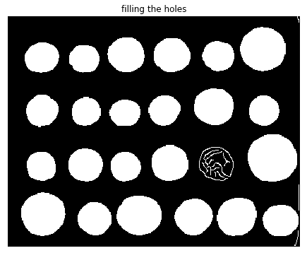
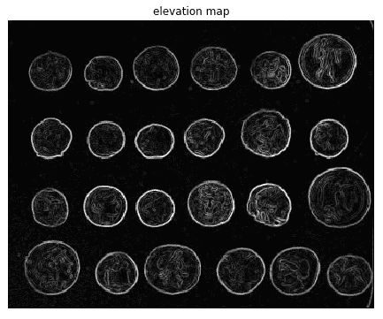
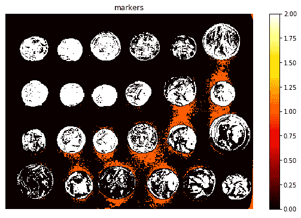
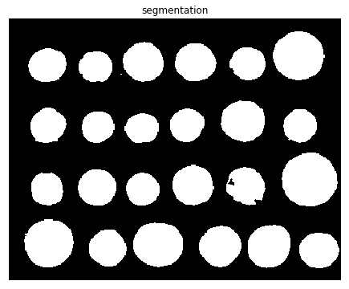
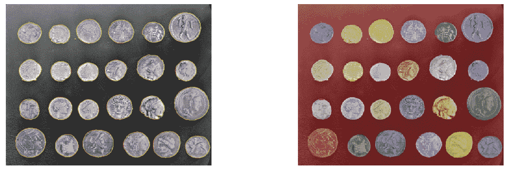
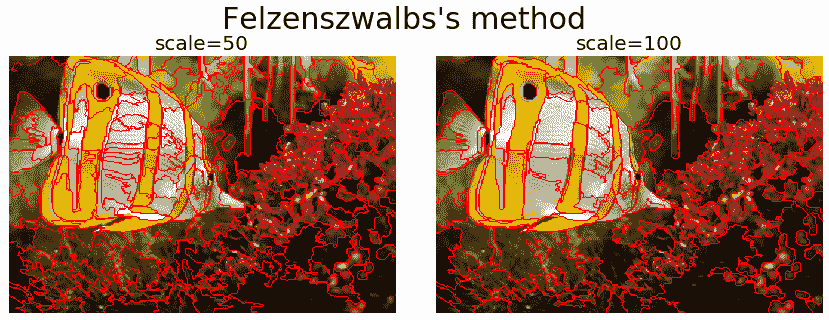
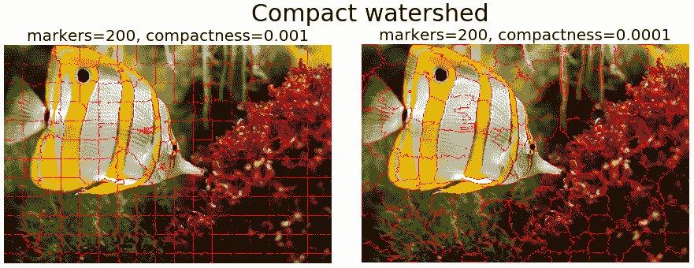
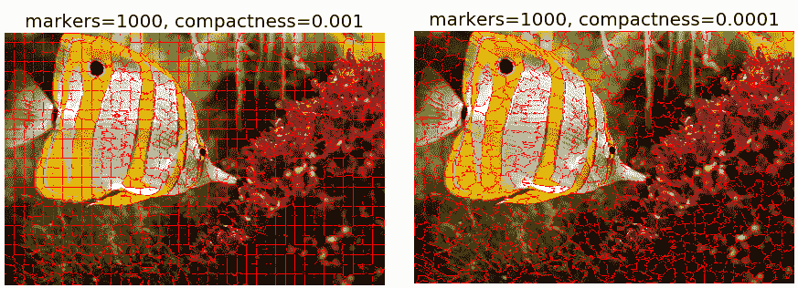

# 八、图像分割

在本章中，我们将讨论图像处理中的一个关键概念，即*分割*。我们将首先介绍图像分割的基本概念以及为什么它如此重要。我们将继续讨论许多不同的图像分割技术及其在`scikit-image`和`python-opencv`*（*`cv2`*库函数中的实现。*

 *本章涉及的主题如下：

*   图像中的 Hough 变换圆和线检测（带`scikit-image`
*   阈值化和大津分割（带`scikit-image`
*   基于边缘/基于区域的分割技术（带`scikit-image`）
*   Felzenszwalb、SLIC、QuickShift 和紧凑分水岭算法（带`scikit-image`）
*   活动轮廓。。。

# 什么是图像分割？

**图像分割**是将图像划分为不同的区域或类别，对应于不同的对象或对象的部分。每个区域包含具有相似属性的像素，并且图像中的每个像素被分配到这些类别之一。好的分割通常是指同一类别中的像素具有相似的强度值并形成一个连接区域，而不同类别中的相邻像素具有不同的值。其目的是简化/更改图像的表示，使其更具意义且更易于分析

如果分割做得好，那么图像分析的所有其他阶段都会变得更简单。因此，分割的质量和可靠性决定了图像分析是否成功。但是将图像分割成正确的片段通常是一个非常具有挑战性的问题。

分割技术可以是非上下文的（不考虑图像中的特征之间的空间关系，而只考虑一些全局属性，例如颜色/灰度级）或上下文（另外利用空间关系；例如，在空间上相近的像素具有相似的灰度级）。。在本章中，我们将讨论不同的分段技术，并使用`scikit-image`、`python-opencv`（`cv2`）和`SimpleITK`库函数演示它们基于 Python 的实现。让我们从导入本章所需的库开始：

```py
import numpy as np
from skimage.transform import (hough_line, hough_line_peaks, hough_circle, hough_circle_peaks)
from skimage.draw import circle_perimeter
from skimage.feature import canny
from skimage.data import astronaut
from skimage.io import imread, imsave
from skimage.color import rgb2gray, gray2rgb, label2rgb
from skimage import img_as_float
from skimage.morphology import skeletonize
from skimage import data, img_as_float
import matplotlib.pyplot as pylab
from matplotlib import cm
from skimage.filters import sobel, threshold_otsu
from skimage.feature import canny
from skimage.segmentation import felzenszwalb, slic, quickshift, watershed
from skimage.segmentation import mark_boundaries, find_boundaries
```

# Hough 变换-检测直线和圆

在图像处理中，**Hough 变换**是一种特征提取技术，旨在使用在参数空间中执行的*投票*过程来查找特定形状对象的实例。在其最简单的形式中，经典的 Hough 变换可用于检测图像中的*直线*。我们可以用极参数（ρ，θ）表示一条直线，其中ρ是线段的长度，θ是直线与*x*轴之间的角度。为了探索（ρ，θ）参数空间，它首先创建一个二维直方图。然后，对于ρ和θ的每个值，它计算输入图像中靠近对应线的非零像素数，并相应地增加位置（ρ，θ）处的数组。。。

# 阈值化与大津分割

**阈值化**是指使用像素值作为阈值，从灰度图像创建二值图像（只有黑白像素的图像）的一系列算法。它提供了从图像背景中分割对象的最简单方法。可以手动（通过查看像素值的直方图）或使用算法自动选择阈值。在`scikit-image`中，有两类阈值算法实现，即基于直方图（使用像素强度直方图，并对该直方图的属性进行一些假设，例如双峰）和局部（仅使用相邻像素处理像素；这使得这些算法的计算成本更高）。

在本节中，我们将只讨论一种流行的基于直方图的阈值方法，称为**Otsu 方法**（假设为双峰直方图）。该方法通过同时最大化类间方差和最小化两类像素之间的类内方差来计算最佳阈值（由该阈值分隔）。下一个代码块演示了大津对马输入图像进行分割的实现，并计算最佳阈值以将前景与背景分开：

```py
image = rgb2gray(imread('../images/horse.jpg')) 
thresh = threshold_otsu(image)
binary = image > thresh

fig, axes = pylab.subplots(nrows=2, ncols=2, figsize=(20, 15))
axes = axes.ravel()
axes[0], axes[1] = pylab.subplot(2, 2, 1), pylab.subplot(2, 2, 2)
axes[2] = pylab.subplot(2, 2, 3, sharex=axes[0], sharey=axes[0])
axes[3] = pylab.subplot(2, 2, 4, sharex=axes[0], sharey=axes[0])
axes[0].imshow(image, cmap=pylab.cm.gray)
axes[0].set_title('Original', size=20), axes[0].axis('off')
axes[1].hist(image.ravel(), bins=256, normed=True)
axes[1].set_title('Histogram', size=20), axes[1].axvline(thresh, color='r')
axes[2].imshow(binary, cmap=pylab.cm.gray)
axes[2].set_title('Thresholded (Otsu)', size=20), axes[2].axis('off')
axes[3].axis('off'), pylab.tight_layout(), pylab.show()
```

下一个屏幕截图显示上一个代码块的输出；通过大津方法计算的最佳阈值由直方图中的红线标记，如下所示：


# 基于边缘/基于区域的分割

此示例取自`scikit-image`文档中的示例，演示了如何首先使用基于边缘的分割算法，然后使用基于区域的分割算法，从背景中分割对象。`skimage.data`中的硬币图像用作输入图像，显示了在较暗背景下勾勒出的几个硬币。下一个代码块显示灰度图像及其强度直方图：

```py
coins = data.coins()hist = np.histogram(coins, bins=np.arange(0, 256), normed=True)fig, axes = pylab.subplots(1, 2, figsize=(20, 10))axes[0].imshow(coins, cmap=pylab.cm.gray, interpolation='nearest')axes[0].axis('off'), axes[1].plot(hist[1][:-1], hist[0], lw=2)axes[1].set_title('histogram of gray values') ...
```

# 基于边缘的分割

在本例中，我们将尝试使用基于*边缘的分割*来描绘硬币的轮廓。为此，第一步是使用 Canny 边缘检测器获取特征的边缘，如下代码块所示：

```py
edges = canny(coins, sigma=2)
fig, axes = pylab.subplots(figsize=(10, 6))
axes.imshow(edges, cmap=pylab.cm.gray, interpolation='nearest')
axes.set_title('Canny detector'), axes.axis('off'), pylab.show()
```

下一个屏幕截图显示了早期代码的输出，即使用 Canny 边缘检测器获得的硬币轮廓：


下一步是使用`scipy ndimage`模块的`morphological`功能`binary_fill_holes()`填充这些轮廓，如下一个代码块所示：

```py
from scipy import ndimage as ndi
fill_coins = ndi.binary_fill_holes(edges)
fig, axes = pylab.subplots(figsize=(10, 6))
axes.imshow(fill_coins, cmap=pylab.cm.gray, interpolation='nearest')
axes.set_title('filling the holes'), axes.axis('off'), pylab.show()
```

下一个屏幕截图显示了早期代码块的输出，即硬币的填充轮廓：



从屏幕截图可以看出，有一枚硬币的轮廓没有被操作填满。在下一步中，通过设置有效对象的最小尺寸，并再次使用`morphological`功能，这一次使用`scikit-image`形态学模块中的`remove_small_objects()`功能，移除像这样的小伪对象：

```py
from skimage import morphology
coins_cleaned = morphology.remove_small_objects(fill_coins, 21)
fig, axes = pylab.subplots(figsize=(10, 6))
axes.imshow(coins_cleaned, cmap=pylab.cm.gray, interpolation='nearest')
axes.set_title('removing small objects'), axes.axis('off'), pylab.show()
```

下一个屏幕截图显示了前面代码块的输出：


然而，这种方法不是很稳健，因为没有完全闭合的轮廓没有正确填充，就像一枚未填充硬币的情况一样，正如前面的屏幕截图所示。

# 基于区域的分割

在本节中，我们将使用形态学分水岭算法对同一图像应用基于区域的分割方法。首先，让我们直观地讨论分水岭算法的基本步骤。

# 形态分水岭算法

任何灰度图像都可以视为地形表面。如果该曲面从其最小值淹没，并且阻止来自不同来源的水合并，则图像将被分割为两个不同的集合，即集水区和集水区线。如果将此变换应用于图像渐变，则汇水盆地理论上应与此图像的均匀灰度区域（分段）相对应。

然而，在实际应用中，由于梯度图像中存在噪声或局部不规则性，使用该变换对图像进行过度分割。为了防止过度分割，使用一组预定义的标记，曲面的泛洪从这些标记开始。因此，以下是通过分水岭变换分割图像的步骤：

*   找到标记和分割标准（用于分割区域的函数，通常是对比度/梯度）
*   使用这两个元素运行标记控制的分水岭算法

现在，让我们使用形态学分水岭算法的`scikit-image`实现将前景硬币与背景分开。第一步是使用图像的`sobel`梯度查找高程地图，如以下代码块所示：

```py
elevation_map = sobel(coins)
fig, axes = pylab.subplots(figsize=(10, 6))
axes.imshow(elevation_map, cmap=pylab.cm.gray, interpolation='nearest')
axes.set_title('elevation map'), axes.axis('off'), pylab.show()
```



接下来，根据灰度值直方图的极端部分，计算背景和硬币的标记，如以下代码块所示：

```py
markers = np.zeros_like(coins)
markers[coins < 30] = 1
markers[coins > 150] = 2
print(np.max(markers), np.min(markers))
fig, axes = pylab.subplots(figsize=(10, 6))
a = axes.imshow(markers, cmap=plt.cm.hot, interpolation='nearest')
plt.colorbar(a)
axes.set_title('markers'), axes.axis('off'), pylab.show()
```

下一个屏幕截图显示先前代码块的输出，即 markers 数组的热图：



最后，使用分水岭变换从确定的标记开始填充高程地图的区域，如下一个代码块中所示：

```py
segmentation = morphology.watershed(elevation_map, markers)
fig, axes = pylab.subplots(figsize=(10, 6))
axes.imshow(segmentation, cmap=pylab.cm.gray, interpolation='nearest')
axes.set_title('segmentation'), axes.axis('off'), pylab.show()
```

下图显示了代码块的输出，即使用形态学分水岭算法生成的分割二值图像：



最后一种方法效果更好，硬币可以单独分割和标记，如以下代码块所示：

```py
segmentation = ndi.binary_fill_holes(segmentation - 1)
labeled_coins, _ = ndi.label(segmentation)
image_label_overlay = label2rgb(labeled_coins, image=coins)
fig, axes = pylab.subplots(1, 2, figsize=(20, 6), sharey=True)
axes[0].imshow(coins, cmap=pylab.cm.gray, interpolation='nearest')
axes[0].contour(segmentation, [0.5], linewidths=1.2, colors='y')
axes[1].imshow(image_label_overlay, interpolation='nearest')
for a in axes:
 a.axis('off')
pylab.tight_layout(), pylab.show()
```

下一个屏幕截图分别显示了此代码块的输出、带分水岭线（等高线）的分段硬币和带标签的硬币：



# Felzenszwalb、SLIC、QuickShift 和紧凑分水岭算法

在本节中，我们将讨论四种流行的低级图像分割方法，然后将这些方法获得的结果与输入图像进行比较。好分割的定义往往取决于应用，因此很难获得好分割。这些方法通常用于获得过分割，也称为**超像素**。这些超像素然后作为更复杂算法的基础，例如与区域邻接图或条件随机场合并。

# Felzenszwalb 基于图的高效图像分割

Felzenszwalb 的算法采用基于图形的分割方法。它首先构造一个无向图，其中图像像素作为顶点（要分割的集合），两个顶点之间的边的权重是相异性的某种度量（例如，强度的差异）。在基于图的方法中，将图像划分为多个部分的问题转化为在构造的图中查找连接的组件。同一组件中两个顶点之间的边应具有相对较低的权重，而不同组件中顶点之间的边应具有较高的权重。

该算法在时间上运行，在图的边数上几乎是线性的，在实践中也很快。该技术保留了低变率图像区域的细节，而忽略了高变率图像区域的细节。该算法有一个影响分段大小的单一比例参数。根据局部对比度的不同，分段的实际大小和数量可能会有很大差异。下面的代码块演示了如何使用`scikit-image`分割模块对该算法的实现以及使用少量输入图像获得的输出分割图像：

```py
from matplotlib.colors import LinearSegmentedColormap
for imfile in ['../images/eagle.png', '../images/horses.png', '../images/flowers.png', '../images/bisons.png']:
 img = img_as_float(imread(imfile)[::2, ::2, :3])
 pylab.figure(figsize=(20,10))
 segments_fz = felzenszwalb(img, scale=100, sigma=0.5, min_size=400)
 borders = find_boundaries(segments_fz)
 unique_colors = np.unique(segments_fz.ravel())
 segments_fz[borders] = -1 
 colors = [np.zeros(3)]
 for color in unique_colors:
   colors.append(np.mean(img[segments_fz == color], axis=0)) 
 cm = LinearSegmentedColormap.from_list('pallete', colors, N=len(colors))
 pylab.subplot(121), pylab.imshow(img), pylab.title('Original', size=20), pylab.axis('off') 
 pylab.subplot(122), pylab.imshow(segments_fz, cmap=cm), 
 pylab.title('Segmented with Felzenszwalbs\'s method', size=20), pylab.axis('off') 
 pylab.show()
```

下一个屏幕截图显示了代码块的输出、输入图像以及使用算法的相应分段输出图像：


下面的代码块演示了当比例参数发生变化时，算法的结果是如何变化的：

```py
def plot_image(img, title):
 pylab.imshow(img), pylab.title(title, size=20),  pylab.axis('off') 

img = imread('../images/fish.jpg')[::2, ::2, :3] 
pylab.figure(figsize=(15,10))
i = 1
for scale in [50, 100, 200, 400]:
  plt.subplot(2,2,i)
  segments_fz = felzenszwalb(img, scale=scale, sigma=0.5, min_size=200)
  plot_image(mark_boundaries(img, segments_fz, color=(1,0,0)), 'scale=' + str(scale))
  i += 1
pylab.suptitle('Felzenszwalbs\'s method', size=30), pylab.tight_layout(rect=[0, 0.03, 1, 0.95])
pylab.show()
```

下一个屏幕截图显示了用于分割的输入鱼图像：


下一个屏幕截图显示了前面代码块的输出。可以看出，输出图像中的分段数随着`scale`参数值的增加而减少：




# SLIC

SLIC 算法只是在颜色空间（RGB 或 Lab）和图像位置（即像素坐标：*x*的五维空间中进行 k 均值聚类（我们将在[第 9 章](09.html)、*图像处理中的经典机器学习方法*中对该聚类算法进行更多探讨），*y*。该算法非常有效，因为聚类方法更简单。要使用该算法获得良好的结果，必须在实验室颜色空间中工作。该算法已迅速获得势头，目前已被广泛使用。紧致度参数权衡颜色相似性和接近性，而`n_segments`参数选择 k-means 的中心数。下一个代码块演示如何使用`scikit-image ...`实现该算法

# 碎布合并

在本节中，我们将讨论如何使用**区域邻接图**（**RAG**）组合图像的过分割区域，以获得更好的分割。它使用 SLIC 算法首先分割输入图像并获得区域标签。然后，它构造一个 RAG 并逐步合并颜色相似的过度分割区域。合并两个相邻区域产生一个新区域，其中包含合并区域中的所有像素。合并区域，直到不再保留高度相似的区域对：

```py
from skimage import segmentation
from skimage.future import graph

def _weight_mean_color(graph, src, dst, n):
 diff = graph.node[dst]['mean color'] - graph.node[n]['mean color']
 diff = np.linalg.norm(diff)
 return {'weight': diff}

def merge_mean_color(graph, src, dst):
 graph.node[dst]['total color'] += graph.node[src]['total color']
 graph.node[dst]['pixel count'] += graph.node[src]['pixel count']
 graph.node[dst]['mean color'] = (graph.node[dst]['total color'] /  graph.node[dst]['pixel count'])

img = imread('../images/me12.jpg') 
labels = segmentation.slic(img, compactness=30, n_segments=400)
g = graph.rag_mean_color(img, labels)
labels2 = graph.merge_hierarchical(labels, g, thresh=35, rag_copy=False,
 in_place_merge=True,
 merge_func=merge_mean_color,
 weight_func=_weight_mean_color)
out = label2rgb(labels2, img, kind='avg')
out = segmentation.mark_boundaries(out, labels2, (0, 0, 0))
pylab.figure(figsize=(20,10))
pylab.subplot(121), pylab.imshow(img), pylab.axis('off')
pylab.subplot(122), pylab.imshow(out), pylab.axis('off')
pylab.tight_layout(), pylab.show()
```

下一个屏幕截图显示代码的输出、输入图像和使用 RAG 获得的输出图像，合并 SLIC 段：


# 快速换档

**QuickShift**是一种二维图像分割算法，基于核化均值漂移算法的近似值，相对较新。它属于局部（非参数）模式搜索算法家族（基于将每个数据点关联到潜在概率密度函数模式的思想），并应用于由颜色空间和图像位置组成的 5D 空间。

QuickShift 实际上同时计算多个尺度的分层分割，这是该算法的优点之一。QuickShift 有两个主要参数：参数 sigma 控制局部密度近似的比例，其中参数`max_dist`选择分层分割中的一个级别。。。

# 紧凑流域

如前所述，分水岭算法计算从给定标记淹没的图像中的分水岭流域，将像素分配到标记流域中。该算法需要灰度梯度图像作为输入（将图像视为风景），其中明亮的像素表示区域之间的边界（形成高峰）。根据给定的标记，该景观随后被淹没，直到不同的洪水流域在山峰处汇合。每个不同的盆地形成不同的图像段。正如我们在 SLIC 中所做的那样，还有一个额外的紧凑性论证，使得标记更难淹没远处的像素。紧凑度值越高，流域区域的形状越规则。下一个代码块演示如何使用该算法的`scikit-image`实现。它还显示了更改标记和紧致度参数对分割结果的影响：

```py
from skimage.segmentation import watershed
gradient = sobel(rgb2gray(img))
pylab.figure(figsize=(15,10))
i = 1
for markers in [200, 1000]:
 for compactness in [0.001, 0.0001]:
   pylab.subplot(2,2,i)
   segments_watershed = watershed(gradient, markers=markers, compactness=compactness)
   plot_image(mark_boundaries(img, segments_watershed, color=(1,0,0), 'markers=' + str(markers) + '.compactness=' + str(compactness))
   i += 1
pylab.suptitle('Compact watershed', size=30), pylab.tight_layout(rect=[0, 0.03, 1, 0.95]), pylab.show()
```

下一个屏幕截图显示了代码块的输出。可以看出，紧凑度值越高，流域形状越规则，而`markers`参数值越高，则会导致过度分割：





# 用 simpletk 进行区域生长

区域增长指的是一类分割算法，其中，如果像素的邻域强度与当前像素相似，则将其视为在同一段中。相似性的定义因算法而异。初始像素集称为**种子点**，通常是手动选择的。下一个代码块演示如何使用`SimpleITK`库实现`ConnectedThreshold`（在区域增长分割算法的变体上）。使用颅骨 MRI 扫描（`T1`医学图像作为输入图像。在`ConnectedThreshold`算法的情况下，如果相邻体素的强度在。。。

# 活动轮廓、形态蛇和 GrabCut 算法

在本节中，我们将讨论一些更复杂的分割算法，并用`scikit-image`或`python-opencv`（`cv2`）库函数演示它们。我们将从使用活动轮廓进行分割开始

# 活动等高线

**活动轮廓模型**（也称为**蛇**）是一种将开放或闭合样条曲线与图像中的线条或边缘相匹配的框架。蛇是一种能量最小化、可变形的样条曲线，受约束、图像和内力的影响。因此，它通过最小化部分由图像定义，部分由样条曲线的形状、长度和平滑度定义的能量来工作。约束力和图像力将蛇拉向对象轮廓，内力抵抗变形。该算法接受一条初始蛇（围绕感兴趣的对象），为了使闭合轮廓适合感兴趣的对象，它会收缩/扩展。最小化显式地在图像能量中进行，隐式地在形状能量中进行。作为。。。

# 形态蛇

*形态学蛇*是指一系列用于图像分割的方法（类似于活动轮廓）。然而，形态蛇比活动轮廓更快，数值更稳定，因为它们在二进制数组上使用形态算子（例如，膨胀/侵蚀），而活动轮廓在浮点数组上解决偏微分方程。在`scikit-image`实现中有两种形态蛇方法可用，即**形态测地活动轮廓***（***形态 GAC**带`morphological_geodesic_active_contour()`和**形态活动轮廓无边缘***（***形态蛇**带`morphological_chan_vese()`*MorphGAC 适用于轮廓可见（可能有噪声、杂乱或部分不清晰）的图像，需要对图像进行预处理以突出轮廓。此预处理可通过`inverse_gaussian_gradient()`*功能完成。*这个预处理步骤对 Morphac 分割的质量有很大的影响。相反，当要分割的对象的内部和外部区域的像素值具有不同的平均值时，MorphACWE 工作得很好。它与原始图像一起工作，不需要任何预处理，也不需要对对象的轮廓进行测量定义。因此，MorphACWE 比 MorphacGac 更易于使用和调整。下一个代码块演示了如何使用这些函数实现形态蛇。它还显示了算法的演变以及在不同迭代中获得的分段：*

```py
from skimage.segmentation import (morphological_chan_vese, morphological_geodesic_active_contour,
 inverse_gaussian_gradient, checkerboard_level_set)

def store_evolution_in(lst):
 """Returns a callback function to store the evolution of the level sets in
 the given list.
 """

def _store(x):
 lst.append(np.copy(x))
 return _store

# Morphological ACWE
image = imread('../images/me14.jpg') 
image_gray = rgb2gray(image)
# initial level set
init_lvl_set = checkerboard_level_set(image_gray.shape, 6)
# list with intermediate results for plotting the evolution
evolution = []
callback = store_evolution_in(evolution)
lvl_set = morphological_chan_vese(image_gray, 30, init_level_set=init_lvl_set, smoothing=3, iter_callback=callback)
fig, axes = pylab.subplots(2, 2, figsize=(8, 6))
axes = axes.flatten()
axes[0].imshow(image, cmap="gray"), axes[0].set_axis_off(), axes[0].contour(lvl_set, [0.5], colors='r')
axes[0].set_title("Morphological ACWE segmentation", fontsize=12)
axes[1].imshow(lvl_set, cmap="gray"), axes[1].set_axis_off()
contour = axes[1].contour(evolution[5], [0.5], colors='g')
contour.collections[0].set_label("Iteration 5")
contour = axes[1].contour(evolution[10], [0.5], colors='y')
contour.collections[0].set_label("Iteration 10")
contour = axes[1].contour(evolution[-1], [0.5], colors='r')
contour.collections[0].set_label("Iteration " + str(len(evolution)-1))
axes[1].legend(loc="upper right"), axes[1].set_title("Morphological ACWE evolution", fontsize=12)

# Morphological GAC
image = imread('images/fishes4.jpg') 
image_gray = rgb2gray(image)
gimage = inverse_gaussian_gradient(image_gray)
# initial level set
init_lvl_set = np.zeros(image_gray.shape, dtype=np.int8)
init_lvl_set[10:-10, 10:-10] = 1
# list with intermediate results for plotting the evolution
evolution = []
callback = store_evolution_in(evolution)
lvl_set = morphological_geodesic_active_contour(gimage, 400, init_lvl_set, smoothing=1, balloon=-1,
 threshold=0.7, iter_callback=callback)
axes[2].imshow(image, cmap="gray"), axes[2].set_axis_off(), axes[2].contour(lvl_set, [0.5], colors='r')
axes[2].set_title("Morphological GAC segmentation", fontsize=12)
axes[3].imshow(lvl_set, cmap="gray"), axes[3].set_axis_off()
contour = axes[3].contour(evolution[100], [0.5], colors='g')
contour.collections[0].set_label("Iteration 100")
contour = axes[3].contour(evolution[200], [0.5], colors='y')
contour.collections[0].set_label("Iteration 200")
contour = axes[3].contour(evolution[-1], [0.5], colors='r')
contour.collections[0].set_label("Iteration " + str(len(evolution)-1))
axes[3].legend(loc="upper right"), axes[3].set_title("Morphological GAC evolution", fontsize=12)
fig.tight_layout(), pylab.show()
```

下一个屏幕截图显示了代码的输出：


# 带 OpenCV 的 grabbut

**GrabCut**是一种交互式分割方法，使用图论最大流/最小割算法从图像背景中提取前景。在算法开始之前，用户首先需要提供一些提示，在输入图像中大致指定前景区域，尽可能减少交互（例如，在前景区域周围绘制一个矩形）。然后，该算法迭代分割图像以获得最佳结果。在某些情况下，分割可能不是期望的（例如，算法可能已将某些前景区域标记为背景，反之亦然）。

在这种情况下，用户需要通过在图像上进行一些笔划来再次进行精细润色。。。

# 总结

在本章中，我们讨论了图像分割，并用 Python 库演示了不同的算法，如`scikit-image`、`opencv (cv2)`和`SimpleITK`。我们从使用 Hough 变换的图像中的直线和圆检测开始，并展示了如何将其用于图像分割的示例。接下来，我们讨论了 Otsu 的阈值算法，以找到分割的最佳阈值。然后介绍了基于边缘和基于区域的分割算法以及用于图像分割的形态学分水岭算法。在下一节中，将讨论更多的分割算法，如 Felzenszwalb 的基于图的算法、区域增长、SLIC 和 QuickShift，以及使用`scikit-image`的实现。最后，我们讨论了一些更复杂的分割算法，如 GrabCut、活动轮廓和形态蛇

在下一章中，我们将讨论图像处理中的机器学习技术，并将更多地讨论使用 k-means 聚类和 meanshift 算法作为无监督机器学习算法的图像分割。我们还将在后面的深入学习章节中讨论语义分割技术。

# 问题

1.  使用 Hough 变换从带有`scikit-image`椭圆的图像中检测*椭圆*。
2.  使用`scikit-image`转换模块的`probabilistic_hough_line()`功能从图像中检测线条。它与`hough_line()`有何不同？
3.  使用`scikit-image`过滤器模块的`try_all_threshold()`功能比较不同类型的局部阈值技术，将灰度图像分割为二值图像。
4.  使用`ConfidenceConnected`和`VectorConfidenceConnected`算法对使用`SimpleITK`的 MRI 扫描图像进行分割。
5.  在前景对象周围使用正确的边框，使用 GrabCut 算法分割鲸鱼图像。
6.  使用`scikit-image`分割模块的`random_walker()`功能分割图像开始。。。

# 进一步阅读

*   [http://scikit-image.org/docs/dev/user_guide/tutorial_segmentation.html](http://scikit-image.org/docs/dev/user_guide/tutorial_segmentation.html)
*   [https://www.scipy-lectures.org/packages/scikit-image/index.html](https://www.scipy-lectures.org/packages/scikit-image/index.html)
*   [http://scikit-image.org/docs/dev/auto_examples/](http://scikit-image.org/docs/dev/auto_examples/)
*   [https://web.stanford.edu/class/ee368/Handouts/Lectures/2014_Spring/Combined_Slides/6-Image-Segmentation-Combined.pdf](https://web.stanford.edu/class/ee368/Handouts/Lectures/2014_Spring/Combined_Slides/6-Image-Segmentation-Combined.pdf)
*   [https://courses.csail.mit.edu/6.869/lectnotes/lect19/lect19-slides-6up.pdf](https://courses.csail.mit.edu/6.869/lectnotes/lect19/lect19-slides-6up.pdf)
*   [http://cmm.ensmp.fr/~beucher/publi/WTS_.pdf](http://cmm.ensmp.fr/~beucher/publi/WTS_residues.pdf)
*   [http://cmm.ensmp.fr/~beucher/wtshed.html](http://cmm.ensmp.fr/~beucher/wtshed.html)
*   [https://sandipanweb.wordpress.com/2018/02/25/graph-based-image-segmentation-in-python/](https://sandipanweb.wordpress.com/2018/02/25/graph-based-image-segmentation-in-python/)
*   [https://sandipanweb.wordpress.com/2018/02/11/interactive-image-segmentation-with-graph-cut/](https://sandipanweb.wordpress.com/2018/02/11/interactive-image-segmentation-with-graph-cut/)
*   [http://people.cs.uchicago.edu/~pff/papers/seg-ijcv.pdf](http://people.cs.uchicago.edu/~pff/papers/seg-ijcv.pdf)
*   [http://www.kev-smith.com/papers/SMITH_TPAMI12.pdf](http://www.kev-smith.com/papers/SMITH_TPAMI12.pdf)**