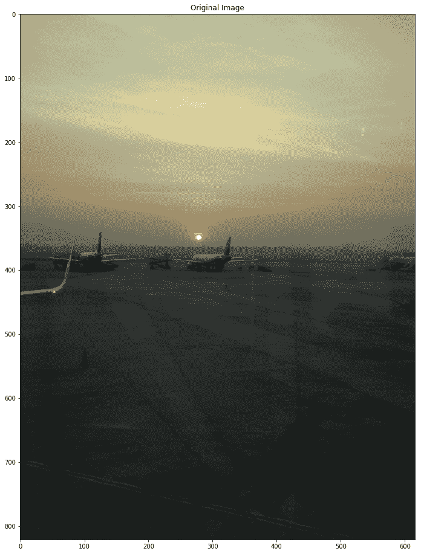
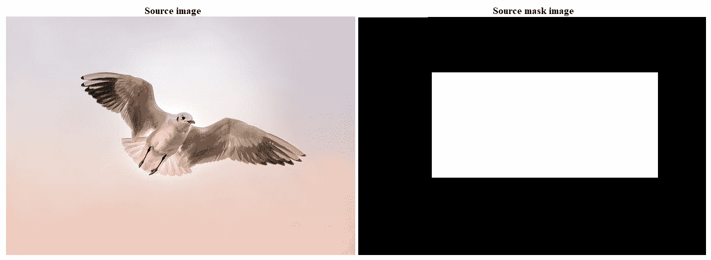
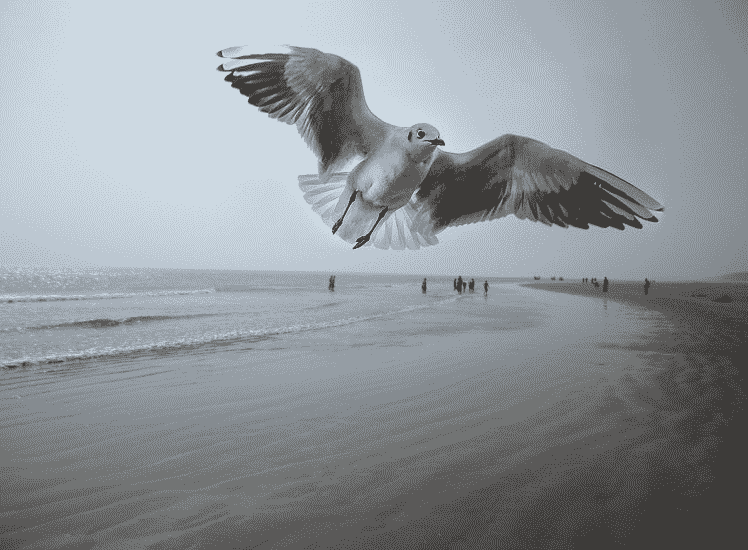
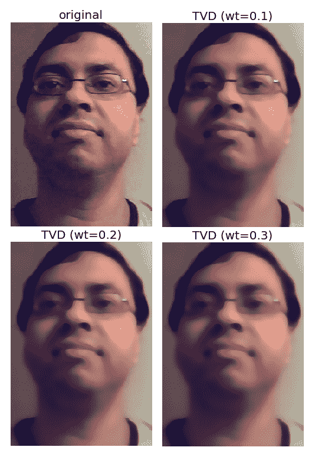
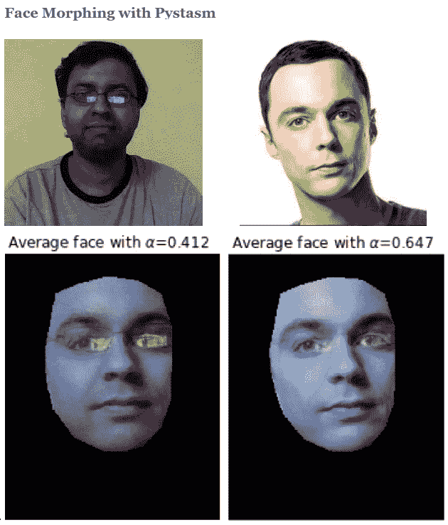

# 十二、图像处理中的附加问题

在本章中，我们将讨论图像处理中的几个更高级的问题。我们将从接缝雕刻问题开始，并演示两个应用程序，第一个是内容感知图像大小调整，第二个是从图像中删除对象。接下来，我们将讨论无缝克隆，可用于将一个对象从一个图像无缝复制到另一个图像。然后，我们将讨论一种修复算法，该算法可用于恢复图像中受损的像素。之后，我们将研究图像处理中的变分方法及其在图像去噪中的应用。接下来，我们将讨论图像绗缝算法及其在纹理合成和图像传输中的应用。我们将以一个复杂的人脸变形算法结束我们的讨论。

本章涉及的主题如下：

*   缝雕
*   无缝克隆和泊松图像编辑
*   图像修复
*   变分图像处理
*   图像绗缝
*   面变形

# 缝雕

接缝雕刻是一种内容感知图像大小调整技术，其中图像的大小在高度（或宽度）上减少一个像素一次。图像中的垂直接缝是一条从上到下连接的像素路径，每行一个像素。水平接缝是一条从左到右连接的像素路径，每列一个像素。尽管底层算法简单而优雅，但直到 2007 年才被发现。

现在它是 Adobe Photoshop 和其他计算机图形应用程序的核心功能。与标准的内容无关的大小调整技术（如裁剪和缩放）不同，接缝雕刻保留了图像最有趣的功能，如纵横比、显示的对象集等。。。

# 使用接缝雕刻调整内容感知图像大小

下面的代码演示了如何使用`scikit-image`库的`transform`模块的`seam_curve()`函数来调整内容感知图像的大小。让我们首先导入所需的包，加载原始输入飞机图像，并使用以下代码块显示图像：

```py
# for jupyter notebook uncomment the next line of code
# % matplotlib inline 
from skimage import data, draw
from skimage import transform, util
import numpy as np
from skimage import filters, color
from matplotlib import pyplot as pylab
image = imread('../images/aero.jpg')
print(image.shape)
# (821, 616, 3)
image = util.img_as_float(image)
energy_image = filters.sobel(color.rgb2gray(image))
pylab.figure(figsize=(20,16)), pylab.title('Original Image'), pylab.imshow(image), pylab.show()
```

下面显示前面代码块的输出：



让我们使用`resize()`函数缩小此图像，使用通常的下采样缩小图像的宽度，如以下代码片段所示：

```py
resized = transform.resize(image, (image.shape[0], image.shape[1] - 200), mode='reflect')
print(resized.shape)
# (821, 416, 3)
pylab.figure(figsize=(20,11)), pylab.title('Resized Image'), pylab.imshow(resized), pylab.show()
```

下面显示前面代码块的输出。从以下输出中可以看出，飞机的尺寸大幅减小，但它们也被扭曲了，因为简单地将尺寸调整为新的纵横比会扭曲图像内容：


现在让我们用`seam_carve()`函数调整图像的大小。这里，`sobel`过滤器用作`energy`函数，表示每个像素的重要性：

```py
image = util.img_as_float(image)
energy_image = filters.sobel(color.rgb2gray(image))
out = transform.seam_carve(image, energy_image, 'vertical', 200)
pylab.figure(figsize=(20,11)), pylab.title('Resized using Seam Carving'), pylab.imshow(out)
```

下面显示了前面代码块的输出。可以看出，seam carving 试图通过删除其认为不太重要的图像区域（即能量较低的区域），在不失真的情况下调整大小。因此，飞机没有任何可见的变形：


# 用缝线雕刻去除物体

您也可以使用接缝雕刻从图像中删除对象或瑕疵。这需要使用较低的值对对象区域进行加权，因为在接缝雕刻中优先移除较低的权重。以下代码块使用与原始输入照片形状相同的遮罩图像，遮罩包含体重较轻的狗的照片区域，表示应将其移除：

```py
image = imread('man.jpg')mask_img = rgb2gray(imread('man_mask.jpg'))print(image.shape)pylab.figure(figsize=(15,10))pylab.subplot(121), pylab.imshow(image), pylab.title('Original Image')pylab.subplot(122), pylab.imshow(mask_img), pylab.title('Mask for the object to be removed (the dog)') pylab.show()
```

以下是。。。

# 无缝克隆和泊松图像编辑

泊松图像编辑的目标是从源图像（由遮罩图像捕获）到目标图像执行对象或纹理的**无缝混合**（克隆）。我们希望通过使用泊松图像编辑将图像区域粘贴到新背景上来创建一个 photomontage。这一想法来源于佩雷斯等人发表的 SIGGRAPH2003 论文*泊松图像编辑*。该问题首先在连续域中表示为约束变分优化问题（使用 Euler-Lagrange 方程求解），然后可以使用离散 Poisson 解算器求解。离散泊松解算器的主要任务是求解一个庞大的线性系统。本文的中心观点是，使用图像梯度，而不是图像强度，可以产生更真实的结果。无缝克隆后，遮罩区域中输出图像的梯度与遮罩区域中源区域的梯度相同。另外，在遮罩区域的边界处的输出图像的强度与目的地图像的强度相同。

在本节中，我们将演示 Python 和 OpenCV 的无缝克隆（OpenCV 3.0 中引入了`seamlessClone()`函数）。让我们使用此函数将源图像中的天空中的鸟复制到目标`sea-bird`图像中的天空中。以下是我们将使用的照片：



目的地图像：


下一个代码块显示了如何通过调用具有正确参数的函数来实现无缝克隆。在本例中，使用的克隆类型标志为`NORMAL_CLONE`，其中源图像的纹理（渐变）保留在克隆区域中：

```py
import cv2
print(cv2.__version__) # make sure the major version of OpenCV is 3
# 3.4.3
import numpy as np 

# read source and destination images
src = cv2.imread("bird.jpg")
dst = cv2.imread("sea.jpg")

# read the mask image
src_mask = cv2.imread("birds_mask.jpg") 
print(src.shape, dst.shape, src_mask.shape)
# (480, 698, 3) (576, 768, 3) (480, 698, 3)

# this is where the CENTER of the airplane will be placed
center = (450,150)

# clone seamlessly.
output = cv2.seamlessClone(src, dst, src_mask, center, cv2.NORMAL_CLONE)

# save result
cv2.imwrite("sea_bird.jpg", output)
```

下面显示了前面代码块的输出，源映像中的 bird 已无缝克隆到目标映像：



# 图像修复

**修复**是修复图像受损或缺失部分的过程。假设我们有一个二元掩码*D*，它指定了输入图像*f*中受损像素的位置，如下所示：


一旦用掩模定位图像中的受损区域，丢失/受损像素必须用某种算法重建（例如，**全变修复**。通过利用非损伤区域的信息，可以完全自动地进行重建

在本例中，我们将演示使用`scikit-image``restoration`模块`inpaint_biharmonic() ...`的图像修复实现

# 变分图像处理

在本节中，我们将非常简要地讨论图像处理中的变分方法，并举例说明在去噪中的应用。图像处理任务可以看作是函数估计（例如，分割可以看作是在对象和背景之间找到一条平滑的闭合曲线）。对于特定的图像处理任务，可以使用变分法最小化适当定义的能量泛函（使用 Euler-Langrange 方法），并使用梯度下降法向解决方案方向发展。

下图描述了图像处理任务的基本步骤，表示为变分优化问题。首先，我们需要创建一个能量泛函*E*，用于描述输入图像*u*的质量。然后，使用 Euler-Lagrange 方程，我们需要计算第一个变量。接下来，我们需要建立一个用于最速下降最小化的**偏微分方程**（**PDE**），并将其离散化并向最小值演化：


# 全变差去噪

下面展示了线性和非线性**全变差去噪**算法。从下面可以看出，能量泛函是唯一的区别：


让我们演示一个使用`scikit-image`库的`restoration`模块实现的全变差去噪。全变差去噪的原理是最小化图像的总变差，它可以粗略地描述为图像梯度范数的积分。首先，让我们通过将随机高斯噪声与原始输入图像相加来创建带噪的输入图像。接下来，让我们使用`denoise_tv_chambolle()`函数来执行。。。

# 使用全变差去噪创建平面纹理卡通图像

全变差去噪可用于产生卡通图像；也就是说，分段恒定图像，如所示。我们增加的权重越多，纹理就越平坦（以牺牲对输入图像的逼真度为代价）：

```py
image = io.imread('../images/me18.jpg')
pylab.figure(figsize=(10,14))
pylab.subplot(221), pylab.imshow(image), pylab.axis('off'), pylab.title('original', size=20)
denoised_img = denoise_tv_chambolle(image, weight=0.1, multichannel=True)
pylab.subplot(222), pylab.imshow(denoised_img), pylab.axis('off'), pylab.title('TVD (wt=0.1)', size=20)
denoised_img = denoise_tv_chambolle(image, weight=0.2, multichannel=True)
pylab.subplot(223), pylab.imshow(denoised_img), pylab.axis('off'), pylab.title('TVD (wt=0.2)', size=20)
denoised_img = denoise_tv_chambolle(image, weight=0.3, multichannel=True)
pylab.subplot(224), pylab.imshow(denoised_img), pylab.axis('off'), pylab.title('TVD (wt=0.3)', size=20)
pylab.show()
```

下图显示了前一个代码块的输出，使用不同的权重，通过全变差去噪获得平坦纹理图像。权重越大，纹理越平坦：



# 图像绗缝

图像绗缝算法是一种用于图像纹理合成和传输的算法，Efros 和 Freeman 在*SIGGRAPH 2001*论文中对此进行了描述。在本节中，我们将讨论用于实现纹理合成和传输的绗缝算法背后的主要思想，并展示通过实现该算法获得的两个结果。代码留给读者执行（参见[https://sandipanweb.wordpress.com/2017/10/24/some-computational-photography-image-quilting-texture-synthesis-with-dynamic-programming-and-texture-transfer-in-python/](https://sandipanweb.wordpress.com/2017/10/24/some-computational-photography-image-quilting-texture-synthesis-with-dynamic-programming-and-texture-transfer-in-python/) 了解更多信息）。

# 纹理合成

**纹理合成**是指从小样本中创建较大的纹理图像。对于纹理合成，主要思想是采样面片并将其以重叠模式放置，以便重叠区域相似。重叠区域可能不完全匹配，这将导致边缘周围出现明显的瑕疵。为了解决这个问题，我们需要计算一条路径，沿着重叠区域中具有类似强度的像素，并使用该路径选择在哪个重叠面片上绘制每个像素。下面显示了纹理合成算法生成的输出：


# 纹理转移

**纹理转移**是指在保持物体基本形状的同时，赋予物体与样本具有相同纹理的外观。纹理转移是通过鼓励采样的面片与给定的目标图像具有相似的外观来实现的，以及匹配已采样面片的重叠区域。以下屏幕截图显示了纹理传输算法生成的输出：


# 面变形

在[第一章](01.html)*图像处理入门*中，我们讨论了一种基于简单α-混合的天真人脸变形技术，如果要变形的人脸没有对齐，这看起来很糟糕。

最后一章，我们将讨论一种复杂的人脸变形技术，即**Beier-Neely 变形**，它在视觉上比未对齐人脸的α-混合更平滑、更好。以下是算法：

1.  读入两个图像文件，A 和 B。
2.  使用一组线段对以交互方式指定源图像和目标图像之间的对应关系（通过使用 PyStasm 计算面部关键点）。将线段对保存到“线”文件中。
3.  读取行文件。线条文件包含线段对 S<sub>i</sub><sup>A</sup>、S<sub>i</sub><sup>B</sup>
4.  通过在 S<sub>i</sub><sup>A</sup>和 S<sub>i</sub><sup>B</sup>之间通过翘曲分数线性插值计算目的线段。这些线段定义了目标形状。
5.  将图像 A 扭曲到其目标形状，计算新图像 A'
6.  将图片 B 扭曲到其目标形状，计算新的图像 B'。
7.  通过溶解分数α在 A'和 B'之间交叉溶解。
8.  将生成的图像保存到文件中。

这个算法的实现留给读者。下图显示了使用 PyStasm 库的面变形实现。第一行中的图像是源图像和目标图像，最后一行显示两个中间平均人脸图像。可以看出，使用此实现，变形非常平滑且视觉上令人愉悦：



# 总结

在本章中，我们讨论了一些高级图像处理问题。我们从接缝雕刻算法开始，并通过`scikit-image`库演示了该算法在上下文感知图像大小调整和从图像中去除对象或伪影方面的应用。

接下来，我们讨论了使用 Python 和 OpenCV 将一个对象从一个图像复制到另一个图像的应用程序的无缝克隆。然后，我们讨论了双谐波修复算法，并利用`scikit-image`库将其应用于图像中受损像素的恢复。然后，我们讨论了变分方法在图像处理中的应用，并用`scikit-image`对图像进行去噪。接下来，我们讨论了图像绗缝算法及其应用。。。

# 问题

1.  使用`MIXED_CLONE`作为与`python-opencv`无缝克隆的克隆类型参数。输出与使用`NORMAL_CLONE`获得的输出有何区别
2.  使用梯度下降的变分优化实现全变分修复（提示：参考[https://sandipanweb.wordpress.com/2017/10/08/some-more-variational-image-processing-diffusiontv-denoising-image-inpainting/](https://sandipanweb.wordpress.com/2017/10/08/some-more-variational-image-processing-diffusiontv-denoising-image-inpainting/) ）。
3.  对 RGB 图像应用全变差去噪。

# 进一步阅读

*   Shai Avidan 和 Ariel Shamir:*用于内容感知图像大小调整的接缝雕刻*-[http://www.cs.jhu.edu/~misha/ReadingSeminar/Papers/Avidan07.pdf](http://www.cs.jhu.edu/~misha/ReadingSeminar/Papers/Avidan07.pdf)
*   帕特里克·佩雷斯、米歇尔·甘内特和安德鲁·布莱克：*泊松图像编辑*-[http://www.irisa.fr/vista/Papers/2003_siggraph_perez.pdf](http://www.irisa.fr/vista/Papers/2003_siggraph_perez.pdf)
*   *用于纹理合成和转移的绗缝*：[http://www.merl.com/publications/docs/TR2001-17.pdf](http://www.merl.com/publications/docs/TR2001-17.pdf)
*   *双调和函数图像修复*：[https://arxiv.org/pdf/1707.06567.pdf](https://arxiv.org/pdf/1707.06567.pdf)
*   *基于特征的图像变形*：[https://www.cs.toronto.edu/~mangas/teaching/320/assignments/a4/Beier-SIG92.pdf](https://www.cs.toronto.edu/~mangas/teaching/320/assignments/a4/Beier-SIG92.pdf)
*   [https://sandipanweb.wordpress.com/2017/10/14/seam-carving-using-dynamic-programming-to-implement-context-aware-image-resizing-in-python/](https://sandipanweb.wordpress.com/2017/10/14/seam-carving-using-dynamic-programming-to-implement-context-aware-image-resizing-in-python/)
*   [https://sandipanweb.wordpress.com/2017/10/03/some-variational-image-processing-possion-image-editing-and-its-applications/ ...](https://sandipanweb.wordpress.com/2017/10/03/some-variational-image-processing-possion-image-editing-and-its-applications/)