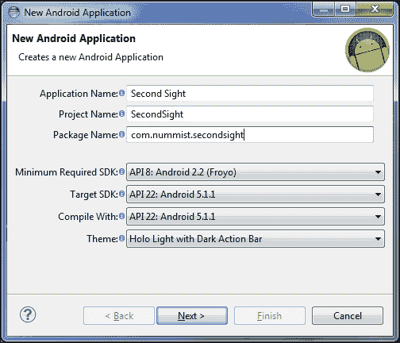
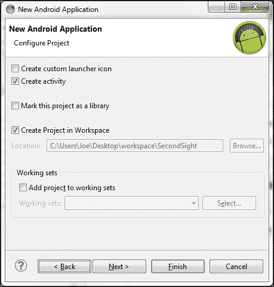
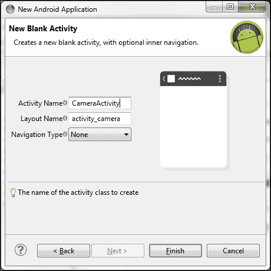
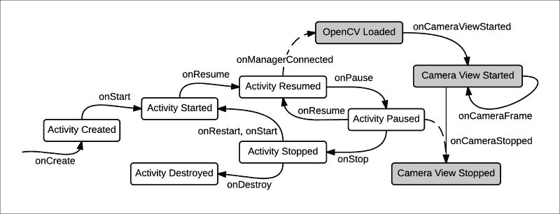

# 第 2 章。使用相机框架

在本章中，我们将重点构建一个基本的照片捕获应用程序，该应用程序使用 OpenCV 捕获摄像机输入的帧。 我们的应用程序将使用户能够预览，保存，编辑和共享照片。 它将通过 Android 的`MediaStore`和`Intent`类与设备上的其他应用交互。 因此，我们将学习如何在 OpenCV 和标准 Android 之间建立桥梁。 在随后的章节中，我们将使用 OpenCV 的更多功能来扩展我们的应用程序。

### 注意

可以从作者的网站下载本章的完整 Eclipse 项目。 该项目有两个版本：

OpenCV 3.x 的版本位于 [http://nummist.com/opencv/4598_02.zip](http://nummist.com/opencv/4598_02.zip) 。

OpenCV 2.x 的版本位于 [http://nummist.com/opencv/5206_02.zip](http://nummist.com/opencv/5206_02.zip) 。

# 设计我们的应用程序– Second Sight

让我们制作一个应用程序，该应用程序使人们可以查看新的视觉样式，为这些样式设置动画并与之交互，并以图片形式共享它们。 这个想法是简单而通用的。 从儿童到计算机视觉专家的任何人都可以欣赏视觉模式。 通过移动设备上的计算机视觉魔力，任何用户都可以更轻松地查看，更改和共享任何场景中的隐藏图案。

在这个应用程序中，我选择了“第二视线”这个名字，这个词在神话中有时被用来指代超自然的和象征性的视觉。

Second Sight 的核心是相机应用程序。 它将使用户能够预览，保存和共享照片。 像许多其他相机应用程序一样，它也使用户可以将滤镜应用于预览和保存的照片。 但是，许多滤镜将不是传统的摄影效果。 例如，更复杂的滤镜将使用户能够看到风格化的边缘，甚至可以看到与真实场景（**增强现实**）融合的渲染对象。

在本章中，我们将构建 Second Sight 的基本相机和共享功能，而无需任何过滤器。 我们的应用程序的第一个版本将包含两个名为`CameraActivity`和`LabActivity`的活动类。 `CameraActivity`类将显示预览并提供菜单操作，以便用户可以选择摄像机（如果设备具有多个摄像机），图像大小（在菜单的**…**部分下），如果 相机支持多种图像尺寸），然后拍照。 然后，`LabActivity`类将打开以显示保存的照片并提供菜单操作，以便用户可以删除照片或将其发送到另一个应用程序进行编辑或共享。

为了更好地了解我们的目标，让我们看一些屏幕截图。 我们的`CameraActivity`的第一个版本如下所示：


当用户单击**拍照**菜单项时，将打开`LabActivity`类。 它看起来像以下屏幕截图：


当用户按下， **Share** 菜单项时，意图选择器（用于选择目标应用程序的对话框）将显示在照片的顶部，如以下屏幕截图所示：


例如，通过按下 **Google+** 磁贴，用户可以在 Google+应用中打开照片，以便在社交网络上共享。 因此，我们有一个完整的典型用法示例。 通过几次触摸交互，用户可以拍摄并共享照片。

# 创建 Eclipse 项目

我们需要为我们的应用程序创建一个新的 Eclipse 项目。 我们可以在与 OpenCV 库项目和示例相同的工作空间中执行此操作。 另外，如果我们使用另一个工作空间，我们也必须将 OpenCV 库项目导入该工作空间。 （有关设置工作区和导入库项目的说明，请参阅第 1 章和“设置 OpenCV”的*使用 Eclipse 构建 OpenCV 示例*部分。）

在包含库项目的工作区中打开 Eclipse。 然后，从菜单系统导航至**文件** | **新增** | **Android 应用程序项目**。 **新的 Android 应用程序**窗口应出现。 输入以下屏幕快照中显示的选项：



使用编译的**目标 SDK** 和**字段应设置为 **API 11：Android 3.0** 或更高版本。 选择最新的 API 版本是安全的，在撰写本文时，该版本为 **API 22：Android 5.1.1** 。 **最低要求的 SDK** 字段应保留为默认值，即 **API 8：Android 2.2（Froyo）**，因为我们将编写后备代码以使我们的代码能够在该版本上运行 。**

单击**下一个**按钮。 应显示一个清单。 确保仅选中**创建活动**和**在工作区**中创建项目的选项，如以下屏幕截图所示：



单击**下一个**按钮。 活动模板列表应出现。 选择 **BlankActivity** ，如以下屏幕截图所示：


单击**下一个**按钮。 应显示有关活动的更多选项。 在**活动名称**字段中输入 **CameraActivity** ，如以下屏幕截图所示：



单击**完成**按钮。 我们的项目已创建。 另外，您还将在 Package Explorer 窗格中看到另一个新项目 **appcompat_v7** 。 **v7 appcompat** 库是[SDG8] **Android 支持库**的一部分，后者随 Android SDK 一起提供。 支持库提供向后兼容性，因此即使用户设备运行的是旧版操作系统，应用程序也可以使用 Android 的许多新功能。

### 注意

请记住，工作空间还必须包含 OpenCV 库项目。 如果尚不存在，请按照第 1 章和“设置 OpenCV”的*使用 Eclipse 构建 OpenCV 示例*部分中的描述进行导入。 同样，有关与设置环境，使用 Eclipse 或对项目进行配置和故障排除有关的任何其他问题，请参考第 1 章。

我们必须指定我们的应用程序依赖于 OpenCV。 右键单击 **Package Explorer** 中的 **SecondSight** 项目，然后从上下文菜单中选择**属性**。 **属性**窗口应出现。 转到其 **Android** 标签，然后使用 **Add…**按钮添加对 OpenCV 库项目的引用。 确认 v7 appcompat 库也已作为依赖项列出。 添加引用后，该窗口应类似于以下屏幕截图：


单击**，然后单击**至应用新的首选项。

我们应该能够在 **Package Explorer** 窗格中浏览`SecondSight`项目的内容。 让我们删除并添加一些文件。 执行以下步骤：

1.  删除`res/layout/activity_camera.xml`。 （右键单击它，从上下文菜单中选择**删除**，然后单击 **OK** 。）我们的界面布局非常简单，因此创建起来会更加方便 用 Java 代码代替此单独的 XML 文件。 但是，如果您确实希望使用在 XML 布局中使用 OpenCV 的示例，则可以参考该库随附的示例应用程序。 请参阅第 1 章和“设置 OpenCV”中的*使用 Eclipse 构建 OpenCV 示例*部分。
2.  删除`res/values-v11`和`res/values-v14`文件夹。 它们包含为某些 Android API 级别定义替代 GUI 样式的文件。 但是，由于有了 v7 appcompat 库，我们可以为所有受支持的 API 级别使用单个样式文件`res/values/styles.xml`。
3.  创建`src/com/nummist/secondsight/LabActivity.java`。 （右键单击 **com.nummist.secondsight** ，从上下文菜单中导航至**新建** | **类**，在**名称中输入`LabActivity`** 字段，然后单击**完成**。）
4.  创建`res/menu/activity_lab.xml`。 （右键单击父文件夹，从上下文菜单中导航到**新建** | **Android XML 文件**，在**文件**字段中输入`activity_lab`，然后单击 在**上完成**。）

现在，我们有了项目的框架。 在本章的其余部分中，我们将编辑几个文件以提供适当的功能和内容。

## 在清单中启用相机和磁盘访问

`AndroidManifest.xml`文件（**清单**）指定了 Android 应用的要求和组件。 与默认清单相比，Second Sight 中的清单需要执行以下附加工作：

*   确保，设备至少具有一台摄像机。
*   获得使用相机的许可。
*   获得将文件写入永久存储的权限。
*   将屏幕方向限制为横向模式，因为 OpenCV 的摄像机预览不能很好地处理纵向模式（至少在 OpenCV 2.x 和 OpenCV 3.0 中）。 请参阅以下错误报告，其中描述了该问题，并暗示了在 OpenCV 3.x 的将来版本中进行修复的可能性： [http://code.opencv.org/issues/3565](http://code.opencv.org/issues/3565) 。
*   注册第二个活动。

我们可以通过编辑清单中的`uses-permission`，`uses-feature`和`activity`标签来完成这些任务。

### 注意

有关 Android 清单的详细信息，请参见 [http://developer.android.com/guide/topics/manifest/manifest-intro.html](http://developer.android.com/guide/topics/manifest/manifest-intro.html) 上的官方文档。

打开`AndroidManifest.xml`，它位于项目的根目录下。 单击，在标有 **AndroidManifest.xml** 的标签上，以源代码模式查看它。 在片段之后，通过在中添加突出显示的代码来编辑文件：

```java
<?xml version="1.0" encoding="utf-8"?>
<manifest xmlns:android=
  "http://schemas.android.com/apk/res/android"
  package="com.nummist.secondsight"
  android:versionCode="1"
  android:versionName="1.0">

  <uses-sdk
    android:minSdkVersion="8"
    android:targetSdkVersion="22" />

  <uses-permission android:name="android.permission.CAMERA" />
  <uses-permission android:name=
    "android.permission.WRITE_EXTERNAL_STORAGE" />

  <uses-feature android:name="android.hardware.camera" />

  <uses-feature android:name="android.hardware.camera.autofocus"
    android:required="false" />
  <uses-feature android:name="android.hardware.camera.flash"
    android:required="false" />

  <application
    android:allowBackup="true"
    android:icon="@drawable/ic_launcher"
    android:label="@string/app_name"
    android:theme="@style/AppTheme">
    <activity
      android:name="com.nummist.secondsight.CameraActivity"
      android:label="@string/app_name"
      android:screenOrientation="landscape">
      <intent-filter>
        <action android:name="android.intent.action.MAIN" />
        <category android:name=
          "android.intent.category.LAUNCHER" />
      </intent-filter>
    </activity>
    <activity
      android:name="com.nummist.secondsight.LabActivity"
      android:label="@string/app_name"
      android:screenOrientation="landscape">
    </activity>
  </application>
</manifest>
```

### 提示

**使代码适应 OpenCV 2.x**

将`android:targetSdkVersion="22"`替换为`android:targetSdkVersion="19"`。 此更改启用了向后兼容模式，从而避免了 Android 5.x（Lollipop）上 OpenCV 2.x 的加载程序中的严重问题。 以下堆栈溢出线程描述了问题： [http://stackoverflow.com/questions/27470313/opencv-service-intent-must-be-explicit-android-5-0-lolipop](http://stackoverflow.com/questions/27470313/opencv-service-intent-must-be-explicit-android-5-0-lolipop) 。 （对于 OpenCV 3.x，此问题已得到解决。）

通过要求功能`android.hardware.camera`，我们指定 Google Play 仅应将我们的应用分发到具有后置摄像头的设备。 由于的历史原因，前置摄像头无法满足和`android.hardware.camera`的要求。 如果需要前置摄像头，则可以指定`android.hardware.camera.front`功能。 相反，如果我们需要任何（前置或后置）摄像头，则原则上可以指定`android.hardware.camera.any`功能。 但是，实际上，Google Play 在大多数设备上均无法正确识别此功能。 因此，最实用的滤波器是`android.hardware.camera`。 另一种选择是完全省略`uses-feature`标签，而在运行时测试设备的硬件功能。 在本章后面的*部分中，在 CameraActivity* 中预览和保存照片，我们将看到如何查询相机的数量及其功能。

## 创建菜单和字符串资源

我们的应用程序菜单和可本地化的文本在 XML 文件中进行了描述。 这些资源文件中的标识符由 Java 代码引用，我们将在后面看到。

### 注意

有关 Android 应用程序资源的详细信息，请参见 [http://developer.android.com/guide/topics/resources/index.html](http://developer.android.com/guide/topics/resources/index.html) 上的官方文档。

首先，让我们编辑`res/menu/activity_camera.xml`，使其具有以下实现，描述`CameraActivity`的菜单项：

```java
<menu xmlns:android="http://schemas.android.com/apk/res/android"
  xmlns:app="http://schemas.android.com/apk/res-auto">
  <item
    android:id="@+id/menu_next_camera"
    app:showAsAction="ifRoom|withText"    android:title="@string/menu_next_camera"{ }/>
  <item
    android:id="@+id/menu_take_photo"
    app:showAsAction="always|withText"
    android:title="@string/menu_take_photo"{ }/>
</menu>
```

请注意，我们使用`app:showAsAction`属性使菜单项出现在应用程序的顶部栏中，如先前的屏幕截图所示。 为了向后兼容，此属性在 v7 appcompat 库的资源中定义。 通过引用 v7 appcompat 库，我们的项目将库的资源合并到应用程序的资源中，并在前面的代码块中使用属性`xmlns:app="http://schemas.android.com/apk/res-auto"`将`app`定义为这些资源的 XML 命名空间。

另请注意，在前面的代码块中未定义图像尺寸的菜单项。 我们将根据在运行时查询的摄像机功能以编程方式创建这些菜单项。

类似地，`res/menu/activity_lab.xml`中描述了`LabActivity`的菜单项，如下所示：

```java
<menu xmlns:android="http://schemas.android.com/apk/res/android"
  xmlns:app="http://schemas.android.com/apk/res-auto">>>
  <item
    android:id="@+id/menu_delete"
    app:showAsAction="ifRoom|withText"
    android:title="@string/delete" />
  <item
    android:id="@+id/menu_edit"
    app:showAsAction="ifRoom|withText"
    android:title="@string/edit" />
  <item
    android:id="@+id/menu_share"
    app:showAsAction="ifRoom|withText"
    android:title="@string/share" />
</menu>
```

要支持操作条，我们必须更改应用程序的 GUI 样式。 编辑应用程序的默认样式文件`res/values/styles.xml`，然后更改`AppBaseTheme`的声明以匹配以下内容：

```java
    <style name="AppBaseTheme"
        parent="Theme.AppCompat.Light.DarkActionBar">
```

如果尚未这样做，请删除`res/values-v11`和`res/values-v14`文件夹，它们包含某些 API 级别不需要的替代样式。 多亏了 v7 appcompat 库，我们可以为所有受支持的 API 级别使用默认样式文件。

`res/values/strings.xml`中描述了在应用程序的各个位置使用的用户可读文本的字符串，如下所示：

```java
<?xml version="1.0" encoding="utf-8"?>
<resources>
  <string name="app_name">Second Sight</string>
  <string name="delete">Delete</string>
  <string name="edit">Edit</string>
  <string name="menu_next_camera">Next Cam</string>
  <string name="menu_take_photo">Take Photo</string>
  <string name="menu_image_size">Size</string>
  <string name="photo_delete_prompt_message">This photo is saved
    in your Gallery. Do you want to delete it?</string>
  <string name="photo_delete_prompt_title">Delete photo?</string>
  <string name="photo_error_message">Failed to save photo</string>
  <string name="photo_edit_chooser_title">Edit photo
    with&#8230;</string>
  <string name="photo_send_chooser_title">Share photo
    with&#8230;</string>
  <string name="photo_send_extra_subject">My photo from Second
    Sight</string>
  <string name="photo_send_extra_text">Check out my photo from the Second Sight app! http://nummist.com/opencv/</string>
  <string name="share">Share</string>
</resources>
```

在定义了这些样板资源后，我们可以继续在 Java 中实现我们应用的功能。

## 在 CameraActivity 中预览和保存照片

我们的主要活动`CameraActivity`需要执行以下操作：

*   启动时，使用 OpenCV Manager 3 确保适当的 OpenCV 共享库可用。 （有关 OpenCV Manager 3 和早期版本的更多信息，请参考第 1 章和“设置 OpenCV”中的*使用 Eclipse 构建 OpenCV 示例*部分。）
*   显示实时摄像机供稿。
*   提供以下菜单操作：
    *   切换活动摄像机（对于具有多个摄像机的设备）
    *   更改图像尺寸（对于支持多种图像尺寸的相机）
*   保存照片并将其插入`MediaStore`，以便诸如 Gallery 之类的应用程序可以使用。 立即在`LabActivity`中打开照片。

即使我们可以仅使用标准的 Android 库来显示实时摄像机供稿，保存照​​片等，我们仍将在可行的地方使用 OpenCV 功能。 要获取有关设备相机功能的信息，我们将依赖于名为`Camera`的标准 Android 类。

### 注意

从 API 级别 21（Lollipop）开始，不推荐使用`Camera`类，而推荐使用新的程序包`android.hardware.camera2`。 （请参见[的官方文档，网址为 https://developer.android.com/reference/android/hardware/camera2/package-summary.html](https://developer.android.com/reference/android/hardware/camera2/package-summary.html) 。）但是，到目前为止，[ API 级别 21 之前的 HTG2]包。因此，为了支持更多设备，我们将使用不推荐使用的`Camera`类。

OpenCV 为提供了一个名为`CameraBridgeViewBase`的抽象类，其中代表实时摄像机供稿。 此类扩展了 Android 的`SurfaceView`类，因此其实例可以成为视图层次结构的一部分。 此外，`CameraBridgeViewBase`实例可以将事件调度到实现`CvCameraViewListener`或`CvCameraViewListener2`两个接口之一的任何侦听器。 通常，`CameraActivity`的监听器将是一个活动。

`CvCameraViewListener`和`CvCameraViewListener2`接口提供回调，以处理摄像机输入流的开始和停止并处理每个帧的捕获。 这两个界面在图像格式方面有所不同。 `CvCameraViewListener`始终接收 RGBA 彩色帧，该帧作为 OpenCV 的`Mat`类的实例传递。 从概念上讲，`Mat`是可以存储像素数据的多维阵列。 `CvCameraViewListener2`接收每个帧作为 OpenCV 的`CvCameraViewFrame`类的实例。 从传递的`CvCameraViewFrame`中，我们可以获取 RGBA 彩色或灰度格式的`Mat`图像。 因此，`CvCameraViewListener2`是更灵活的接口，它是我们在`CameraActivity`中实现的接口。

由于`CameraBridgeViewBase`是抽象类，因此我们需要一个实现。 OpenCV 提供了两种实现：`JavaCameraView` 和`NativeCameraView`。 它们都是 Java 类，但是`NativeCameraView`是围绕本机 C ++类的 Java 包装器。 `NativeCameraView`可能会产生更高的帧速率，但是它容易出现设备特定的错误，并且在新的 Android OS 版本问世时也容易出错。 因此，为了提高可靠性，我们在应用中使用了`JavaCameraView`。

为了支持 OpenCV Manager 和客户端应用程序之间的交互，OpenCV 提供了一个名为`BaseLoaderCallback`的抽象类。 此类声明一个回调方法，该方法在 OpenCV Manager 确保库可用之后执行。 通常，此回调是启用摄像机视图并创建任何其他 OpenCV 对象的适当位置。

现在，我们了解了有关 OpenCV 类型的信息，让我们打开`CameraActivity.java`并添加以下关于活动类及其成员变量的声明：

### 注意

为简便起见，本书中的代码清单省略了`package` 和`import` 语句。 Eclipse 在创建文件时应自动生成`package`语句，在声明变量时应自动生成`import`语句。

```java
// Use the deprecated Camera class.
@SuppressWarnings("deprecation")
public class CameraActivity extends ActionBarActivity
    implements CvCameraViewListener2 {

  // A tag for log output.
  private static final String TAG =
    CameraActivity.class.getSimpleName();

  // A key for storing the index of the active camera.
  private static final String STATE_CAMERA_INDEX = "cameraIndex";

  // A key for storing the index of the active image size.
  private static final String STATE_IMAGE_SIZE_INDEX =
    "imageSizeIndex";

  // An ID for items in the image size submenu.
  private static final int MENU_GROUP_ID_SIZE = 2;

  // The index of the active camera.
  private int mCameraIndex;

  // The index of the active image size.
  private int mImageSizeIndex;

  // Whether the active camera is front-facing.
  // If so, the camera view should be mirrored.
  private boolean mIsCameraFrontFacing;

  // The number of cameras on the device.
  private int mNumCameras;

  // The camera view.
  private CameraBridgeViewBase mCameraView;

  // The image sizes supported by the active camera.
  private List<Size> mSupportedImageSizes;

  // Whether the next camera frame should be saved as a photo.
  private boolean mIsPhotoPending;

  // A matrix that is used when saving photos.
  private Mat mBgr;

  // Whether an asynchronous menu action is in progress.
  // If so, menu interaction should be disabled.
  private boolean mIsMenuLocked;

  // The OpenCV loader callback.
  private BaseLoaderCallback mLoaderCallback =
    new BaseLoaderCallback(this) {
@Override
public void onManagerConnected(final int status) {
  switch (status) {
  case LoaderCallbackInterface.SUCCESS:
    Log.d(TAG, "OpenCV loaded successfully");
    mCameraView.enableView();
    mBgr = new Mat();
    break;
  default:
    super.onManagerConnected(status);
    break;
  }
}
```

状态（各种操作模式）的概念是 Android 活动的中心，`CameraActivity`也不是例外。 当用户选择菜单操作来打开相机或拍照时，效果不是瞬间的。 动作会影响后续框架中必须完成的工作。 某些工作甚至是异步完成的。 因此，`CameraActivity`的许多成员变量专用于跟踪活动的逻辑状态。

### 提示

**了解 Android 中的异步事件冲突**

许多 Android 库方法（例如`startActivity`）都是异步执行的，这意味着它们在后台线程上运行，以允许主（用户界面）线程继续处理事件。 也就是说，在执行工作的同时，用户可以继续使用界面，从而有可能启动其他与第一工作在逻辑上不一致的工作。

例如，假设单击某个按钮时调用了`startActivity`。 如果用户快速多次按下按钮，则可能将一个以上的新活动推入活动堆栈。 此行为可能不是开发人员或用户想要的。 一种解决方案是禁用单击的按钮，直到其活动恢复。 类似的考虑因素也会影响`CameraActivity`中的菜单系统。

与任何 Android 活动类似，`CameraActivity`也实现了几个在中执行的对标准状态变化（即活动生命周期中的变化）的响应的回调。 让我们从开始查看`onCreate`和`onSaveInstanceState`回调。 在活动生命周期的开始和结尾分别调用这些方法。 `onCreate`回调通常设置活动的视图层次结构，初始化数据，并读取上次调用`onSaveInstanceState`时可能已写入的所有已保存数据。

### 注意

有关 Android 活动生命周期的详细信息，请参阅 [http://developer.android.com/reference/android/app/Activity.html#ActivityLifecycle](http://developer.android.com/reference/android/app/Activity.html#ActivityLifecycle) 上的官方文档。

下图总结了 Android 活动生命周期中的各种状态以及状态转换期间调用的回调。 （其中一些回调，例如`onStart`并未在`CameraActivity`中实现；相反，我们使用默认实现。）此外，图中的灰色框表示 OpenCV 库和摄像机视图的生命周期中的状态。 虚线表示活动生命周期和 OpenCV 生命周期中的状态之间的关系。



在`CameraActivity`中，`onCreate`回调设置摄像机视图并初始化有关摄像机的数据。 它还读取可能由`onSaveInstanceState`写入的有关活动摄像机的所有先前数据。 这里是两种方法的实现：

```java
  // Suppress backward incompatibility errors because we provide
  // backward-compatible fallbacks.
  @SuppressLint("NewApi")
  @Override
  protected void onCreate(final Bundle savedInstanceState) {
    super.onCreate(savedInstanceState);

    final Window window = getWindow();
    window.addFlags(
      WindowManager.LayoutParams.FLAG_KEEP_SCREEN_ON);

    if (savedInstanceState != null) {
      mCameraIndex = savedInstanceState.getInt(
        STATE_CAMERA_INDEX, 0);
      mImageSizeIndex = savedInstanceState.getInt(
        STATE_IMAGE_SIZE_INDEX, 0);
    } else {
      mCameraIndex = 0;
      mImageSizeIndex = 0;
    }

    final Camera camera;
    if (Build.VERSION.SDK_INT >=
      Build.VERSION_CODES.GINGERBREAD) {
      CameraInfo cameraInfo = new CameraInfo();
      Camera.getCameraInfo(mCameraIndex, cameraInfo);
      mIsCameraFrontFacing =
        (cameraInfo.facing ==
          CameraInfo.CAMERA_FACING_FRONT);
      mNumCameras = Camera.getNumberOfCameras();
      camera = Camera.open(mCameraIndex);
    } else { // pre-Gingerbread
      // Assume there is only 1 camera and it is rear-facing.
      mIsCameraFrontFacing = false;
      mNumCameras = 1;
      camera = Camera.open();
    }
    final Parameters parameters = camera.getParameters();
    camera.release();
    mSupportedImageSizes =
      parameters.getSupportedPreviewSizes();
    final Size size = mSupportedImageSizes.get(mImageSizeIndex);

    mCameraView = new JavaCameraView(this, mCameraIndex);
    mCameraView.setMaxFrameSize(size.width, size.height);
    mCameraView.setCvCameraViewListener(this);
    setContentView(mCameraView);
  }

  public void onSaveInstanceState(Bundle savedInstanceState) {
    // Save the current camera index.
    savedInstanceState.putInt(STATE_CAMERA_INDEX, mCameraIndex);

    // Save the current image size index.
    savedInstanceState.putInt(STATE_IMAGE_SIZE_INDEX,
      mImageSizeIndex);

    super.onSaveInstanceState(savedInstanceState);
  }
```

请注意，关于设备的相机的某些数据在 Froyo（我们支持的最旧的 Android 版本）上不可用。 为了避免运行时错误，我们在使用新的 API 之前先检查`Build.VERSION.SDK_INT`。 此外，为避免在静态分析期间（即在编译之前）看到错误，我们将`@SuppressLint("NewApi")`批注添加到`onCreate`的声明中。

还要注意，每次对`Camera.open`的调用都必须与对`Camera`实例的`release`方法的调用配对，以便以后使摄像机可用。 否则，我们的应用和其他应用随后可能会在调用`Camera.open`时遇到`RuntimeException`。

### 注意

有关类`Camera`的更多详细信息，请参见 [http://developer.android.com/reference/android/hardware/Camera.html](http://developer.android.com/reference/android/hardware/Camera.html) 上的官方文档。

当我们切换到不同的摄像机或图像尺寸时，最方便的是重新创建活动，以便 `onCreate`将再次运行。 在 Honeycomb 和更新的 Android 版本上，可以使用`recreate`方法，但为了向后兼容，我们应该编写自己的替代实现，如下所示：

```java
  // Suppress backward incompatibility errors because we provide
  // backward-compatible fallbacks.
  @SuppressLint("NewApi")
  @Override
  public void recreate() {
    if (Build.VERSION.SDK_INT >=
      Build.VERSION_CODES.HONEYCOMB) {
      super.recreate();
    } else {
      finish();
      startActivity(getIntent());
    }
  }
```

`Intent`（例如`startActivity`自变量）是一个活动创建或与另一个活动进行通信的方法。 `getIntent`方法仅获得首先用于启动当前活动的`Intent`。 因此，此`Intent`适用于重新创建活动。 我们将在本章后面的*在 LabActivity* 中删除，编辑和共享照片一节中全面讨论意图。

其他几个活动生命周期回调也与 OpenCV 有关。 当活动进入后台（`onPause`回调）或结束（`onDestroy`回调）时，应禁用摄影机视图。 当活动进入前台（`onResume`回调）时，`OpenCVLoader`应该尝试初始化库。 （请记住，一旦库成功初始化，便启用了相机视图。）以下是相关回调的实现：

```java
  @Override
  public void onPause() {
    if (mCameraView != null) {
      mCameraView.disableView();
    }
    super.onPause();
  }

  @Override
  public void onResume() {
    super.onResume();
    OpenCVLoader.initAsync(OpenCVLoader.OPENCV_VERSION_3_0_0,
      this, mLoaderCallback);
    mIsMenuLocked = false;
  }

  @Override
  public void onDestroy() {
    if (mCameraView != null) {
      mCameraView.disableView();
    }
    super.onDestroy();
  }
```

### 提示

**使代码适应 OpenCV 2.x**

将`OpenCVLoader.OPENCV_VERSION_3_0_0`替换为较早的版本，例如`OpenCVLoader.OPENCV_VERSION_2_4_9`。

请注意，在`onResume`中，我们重新启用了菜单交互。 如果以前在将子活动推入堆栈时禁用了，则可以这样做。

至此，我们的活动具有必要的代码来设置摄像机视图并获取有关设备摄像机的数据。 接下来，我们应该执行菜单操作，以使用户能够打开相机，更改图像尺寸并请求拍照。 同样，存在相关的活动生命周期回调，例如`onCreateOptionsMenu`和`onOptionsItemSelected`。 在`onCreateOptionsMenu`中，我们从菜单的资源文件中加载菜单。 然后，如果设备只有一个摄像头，则删除 **Next Cam** 菜单项。 如果活动摄像机支持多个图像尺寸，我们将为所有支持的尺寸创建一组菜单选项。 在`onOptionsItemSelected`中，我们将通过使用指定的图像尺寸重新创建活动来处理任何图像尺寸菜单项。 （请记住，图像尺寸索引已保存在`onSaveInstanceState`中，并已还原到`onCreate`中，用于构建摄像机视图。）类似地，我们通过循环切换到 **Next Cam** 菜单项来处理 下一个摄像机索引，然后重新创建活动。 （请记住，相机索引已保存在`onSaveInstanceState`中，并已在`onCreate`中还原，用于构建相机视图。）我们处理**拍摄** **照片**菜单项，方法是设置一个布尔值值，我们稍后会在 OpenCV 回调中检入该值。 无论哪种情况，我们都将阻止菜单选项的任何进一步处理，直到完成当前的处理（例如，直到`onResume`为止）。 这是两个与菜单相关的回调的实现：

```java
  @Override
  public boolean onCreateOptionsMenu(final Menu menu) {
    getMenuInflater().inflate(R.menu.activity_camera, menu);
    if (mNumCameras < 2) {
      // Remove the option to switch cameras, since there is
      // only 1.
      menu.removeItem(R.id.menu_next_camera);
    }
    int numSupportedImageSizes = mSupportedImageSizes.size();
    if (numSupportedImageSizes > 1) {
      final SubMenu sizeSubMenu = menu.addSubMenu(
        R.string.menu_image_size);
      for (int i = 0; i < numSupportedImageSizes; i++) {
        final Size size = mSupportedImageSizes.get(i);
        sizeSubMenu.add(MENU_GROUP_ID_SIZE, i, Menu.NONE,
          String.format("%dx%d", size.width, size.height));
      }
    }
    return true;
  }

  // Suppress backward incompatibility errors because we provide
  // backward-compatible fallbacks (for recreate).
  @SuppressLint("NewApi")
  @Override
  public boolean onOptionsItemSelected(final MenuItem item) {
    if (mIsMenuLocked) {
      return true;
    }
    if (item.getGroupId() == MENU_GROUP_ID_SIZE) {
      mImageSizeIndex = item.getItemId();
      recreate();

      return true;
    }
    switch (item.getItemId()) {
    case R.id.menu_next_camera:
      mIsMenuLocked = true;

      // With another camera index, recreate the activity.
      mCameraIndex++;
      if (mCameraIndex == mNumCameras) {
        mCameraIndex = 0;
      }
      mImageSizeIndex = 0;
      recreate();

      return true;
    case R.id.menu_take_photo:
      mIsMenuLocked = true;

      // Next frame, take the photo.
      mIsPhotoPending = true;

      return true;
    default:
      return super.onOptionsItemSelected(item);
    }
  }
```

接下来，让我们看一下`CvCameraViewListener2`接口所需的回调。 摄像头供稿启动（`onCameraViewStarted`回调）或停止（`onCameraViewStopped`回调）时，`CameraActivity`不需要执行任何操作，但可能需要执行一些 每当有新帧到达时都会执行操作（`onCameraFrame`回调）。 首先，如果用户已请求照片，则应拍照。 （照片捕获功能实际上非常复杂，因此我们将其放在辅助方法`takePhoto`中，我们将在本节稍后部分对其进行研究。）

其次，如果活动摄像机是正面的（即面向用户的），则应该将摄像机的视图镜像（水平翻转），因为人们习惯于从镜子中看自己，而不是从摄像机的真实角度看。 OpenCV 的`Core.flip`方法可用于镜像图像。 `Core.flip`的参数是源`Mat`，目标`Mat`（可能与源相同），以及指示翻转是否应为垂直（`0`），水平（`1` ）或两者（`-1`）。 这是`CvCameraViewListener2`回调的实现：

```java
  @Override
  public void onCameraViewStarted(final int width,
    final int height) {
  }

  @Override
  public void onCameraViewStopped() {
  }

  @Override
  public Mat onCameraFrame(final CvCameraViewFrame inputFrame) {
    final Mat rgba = inputFrame.rgba();

    if (mIsPhotoPending) {
      mIsPhotoPending = false;
      takePhoto(rgba);
    }

    if (mIsCameraFrontFacing) {
      // Mirror (horizontally flip) the preview.
      Core.flip(rgba, rgba, 1);
    }

    return rgba;
  }
```

现在，终于，实现了可以捕获用户的心和思想，或者至少是他们的照片的功能。 作为参数，`takePhoto`接收从相机读取的 RGBA 颜色`Mat`。 我们希望使用称为`Imgcodecs.imwrite`的 OpenCV 方法将此映像写入磁盘。 此方法需要 BGR 或 BGRA 颜色格式的图像，因此首先我们必须使用`Imgproc.cvtColor`方法转换 RGBA 图像。 除了将图像保存到磁盘之外，我们还希望使其他应用程序能够通过 Android 的`MediaStore`找到它。 为此，我们生成有关照片的一些元数据，然后使用`ContentResolver`对象将此元数据插入`MediaStore`，并获取 URI。

如果我们在保存或插入照片时遇到失败，我们将放弃并调用一个辅助方法`onTakePhotoFailed`，该方法将解锁菜单交互并向用户显示错误消息。 （例如，如果我们从`AndroidManifest.xml`中省略了`WRITE_EXTERNAL_STORAGE`，或者用户用完了磁盘空间，或者文件名与`MediaStore`中的上一个条目冲突，则会导致失败。）另一方面，如果一切 成功后，我们启动`LabActivity`并将所需的数据传递给它，以找到保存的照片。 这是`takePhoto`和`onTakePhotoFailed`的实现：

```java
  private void takePhoto(final Mat rgba) {

    // Determine the path and metadata for the photo.
    final long currentTimeMillis = System.currentTimeMillis();
    final String appName = getString(R.string.app_name);
    final String galleryPath =
      Environment.getExternalStoragePublicDirectory(
        Environment.DIRECTORY_PICTURES).toString();
    final String albumPath = galleryPath + File.separator +
      appName;
    final String photoPath = albumPath + File.separator +
      currentTimeMillis + LabActivity.PHOTO_FILE_EXTENSION;
    final ContentValues values = new ContentValues();
    values.put(MediaStore.MediaColumns.DATA, photoPath);
    values.put(Images.Media.MIME_TYPE,
      LabActivity.PHOTO_MIME_TYPE);
    values.put(Images.Media.TITLE, appName);
    values.put(Images.Media.DESCRIPTION, appName);
    values.put(Images.Media.DATE_TAKEN, currentTimeMillis);

    // Ensure that the album directory exists.
    File album = new File(albumPath);
    if (!album.isDirectory() && !album.mkdirs()) {
      Log.e(TAG, "Failed to create album directory at " +
        albumPath);
      onTakePhotoFailed();
      return;
    }

    // Try to create the photo.
    Imgproc.cvtColor(rgba, mBgr, Imgproc.COLOR_RGBA2BGR, 3);
    if (!Imgcodecs.imwrite(photoPath, mBgr)) {
      Log.e(TAG, "Failed to save photo to " + photoPath);
      onTakePhotoFailed();
    }
    Log.d(TAG, "Photo saved successfully to " + photoPath);

    // Try to insert the photo into the MediaStore.
    Uri uri;
    try {
      uri = getContentResolver().insert(
        Images.Media.EXTERNAL_CONTENT_URI, values);
    } catch (final Exception e) {
      Log.e(TAG, "Failed to insert photo into MediaStore");
      e.printStackTrace();

      // Since the insertion failed, delete the photo.
      File photo = new File(photoPath);
      if (!photo.delete()) {
        Log.e(TAG, "Failed to delete non-inserted photo");
      }

      onTakePhotoFailed();
      return;
    }

    // Open the photo in LabActivity.
    final Intent intent = new Intent(this, LabActivity.class);
    intent.putExtra(LabActivity.EXTRA_PHOTO_URI, uri);
    intent.putExtra(LabActivity.EXTRA_PHOTO_DATA_PATH,
      photoPath);
    startActivity(intent);
  }

  private void onTakePhotoFailed() {
    mIsMenuLocked = false;

    // Show an error message.
    final String errorMessage =
      getString(R.string.photo_error_message);
    runOnUiThread(new Runnable() {
      @Override
      public void run() {
        Toast.makeText(CameraActivity.this, errorMessage,
          Toast.LENGTH_SHORT).show();
      }
    });
  }
}
```

### 提示

**使代码适应 OpenCV 2.x**

将`Imgcodecs.imwrite`替换为`Highgui.imwrite`。

目前，这是我们要`CameraActivity`做的所有事情。 通过在`onCameraFrame`回调中添加更多菜单操作并对其进行处理，我们将在以下章节中将扩展此类。

## 在 LabActivity 中删除，编辑和共享照片

我们的第二活动`LabActivity`需要执行以下操作：

*   从先前的活动中，接收 PNG 文件的 URI 和文件路径。
*   显示 PNG 文件中包含的图像。
*   提供以下菜单操作：
    *   **删除**：显示确认对话框。 确认后，删除 PNG 文件并完成活动。
    *   **编辑**：显示一个意图选择器，以便用户可以选择一个应用程序来编辑 PNG 文件。 （以`EDIT`意图传递 URI。）
    *   **共享**：显示选择器，以便用户可以选择要共享或发送 PNG 文件的应用。 （以`SEND`意图传递 URI。）

所有这些功能都依赖于标准的 Android 库类，尤其是`Intent`类。 **目的**是活动相互交流的手段。 一个活动从其父（创建该活动的活动）接收意图，并在其完成时从其子（创建的活动）接收意图。 通信活动可能在不同的应用程序中。 一个意图可能包含称为 **extras** 的键值对。

### 注意

有关目的的详细信息，请参见 [http://developer.android.com/guide/components/intents-filters.html](http://developer.android.com/guide/components/intents-filters.html) 上的官方文档。

`LabActivity`声明了它和`CameraActivity`使用的几个公共常量。 这些常数与图像的文件类型以及`CameraActivity`和`LabActivity`通过意图进行通信时使用的额外键有关。 `LabActivity`还具有用于存储 URI 和路径值的成员变量，这些变量是从 Extras 中提取的。 `onCreate`方法负责提取这些值并设置显示 PNG 文件的图像视图。 实现如下：

```java
public class LabActivity extends ActionBarActivityActionBarActivity {

  public static final String PHOTO_FILE_EXTENSION = ".png";
  public static final String PHOTO_MIME_TYPE = "image/png";

  public static final String EXTRA_PHOTO_URI =
    "com.nummist.secondsight.LabActivity.extra.PHOTO_URI";
  public static final String EXTRA_PHOTO_DATA_PATH =
    "com.nummist.secondsight.LabActivity.extra.PHOTO_DATA_PATH";

  private Uri mUri;
  private String mDataPath;

  @Override
  protected void onCreate(final Bundle savedInstanceState) {
    super.onCreate(savedInstanceState);

    final Intent intent = getIntent();
    mUri = intent.getParcelableExtra(EXTRA_PHOTO_URI);
    mDataPath = intent.getStringExtra(EXTRA_PHOTO_DATA_PATH);

    final ImageView imageView = new ImageView(this);
    imageView.setImageURI(mUri);

    setContentView(imageView);
  }
```

同样，我们正在用 Java 代码创建活动的布局（而不是加载 XML 布局的替代方法）。 我们的布局很简单，但是我们需要基于图像 URI 动态配置它，因此在这种情况下仅使用 Java 是明智的。

`LabActivity`中的菜单逻辑比`CameraActivity`中的菜单逻辑更简单。 `LabActivity`的所有菜单操作都会显示一个对话框或选择器，并且由于对话框或选择器会阻止其余的用户界面，因此我们不必担心自己会阻止冲突的输入。 我们只需将菜单的资源文件加载到`onCreateOptionsMenu`中，然后为`onOptionsItemSelected`中的每个可能的操作调用一个辅助方法。 实现如下：

```java
  @Override
  public boolean onCreateOptionsMenu(final Menu menu) {
    getMenuInflater().inflate(R.menu.activity_lab, menu);
    return true;
  }

  @Override
  public boolean onOptionsItemSelected(final MenuItem item) {
    switch (item.getItemId()) {
    case R.id.menu_delete:
      deletePhoto();
      return true;
    case R.id.menu_edit:
      editPhoto();
      return true;
    case R.id.menu_share:
      sharePhoto();
      return true;
    default:
      return super.onOptionsItemSelected(item);
    }
  }
}
```

让我们逐一检查菜单操作助手方法，从`deletePhoto`开始。 该方法的大多数实现都是样板代码，用于设置确认对话框。 对话框的确认按钮具有`onClick`回调，该回调将从和`MediaStore`中删除图像并完成活动。 `deletePhoto`的实现如下：

```java
  /*
   * Show a confirmation dialog. On confirmation, the photo is
   * deleted and the activity finishes.
   */
  private void deletePhoto() {
    final AlertDialog.Builder alert = new AlertDialog.Builder(
      LabActivity.this);
    alert.setTitle(R.string.photo_delete_prompt_title);
    alert.setMessage(R.string.photo_delete_prompt_message);
    alert.setCancelable(false);
    alert.setPositiveButton(R.string.delete,
  new DialogInterface.OnClickListener() {
  @Override
  public void onClick(final DialogInterface dialog,
    final int which) {
    getContentResolver().delete(
      Images.Media.EXTERNAL_CONTENT_URI,
      MediaStore.MediaColumns.DATA + "=?",
      new String[] { mDataPath });
    finish();
  }
});
    alert.setNegativeButton(android.R.string.cancel, null);
    alert.show();
  }
```

下一个辅助方法`editPhoto`会使用`Intent.createChooser`方法设置意图并为此意图启动选择器。 用户可以取消此选择器或使用它来选择活动。 如果选择了活动，则`editPhoto`将其启动。 实现如下：

```java
  /*
   * Show a chooser so that the user may pick an app for editing
   * the photo.
   */
  private void editPhoto() {
    final Intent intent = new Intent(Intent.ACTION_EDIT);
    intent.setDataAndType(mUri, PHOTO_MIME_TYPE);
    startActivity(Intent.createChooser(intent,
      getString(R.string.photo_edit_chooser_title)));
  }
```

最后一个助手方法`sharePhoto`与`editPhoto`的类似，尽管意图配置不同。 实现如下：

```java
  /*
   * Show a chooser so that the user may pick an app for sending
   * the photo.
   */
  private void sharePhoto() {
    final Intent intent = new Intent(Intent.ACTION_SEND);
    intent.setType(PHOTO_MIME_TYPE);
    intent.putExtra(Intent.EXTRA_STREAM, mUri);
    intent.putExtra(Intent.EXTRA_SUBJECT,
      getString(R.string.photo_send_extra_subject));
    intent.putExtra(Intent.EXTRA_TEXT,
      getString(R.string.photo_send_extra_text));
    startActivity(Intent.createChooser(intent,
      getString(R.string.photo_send_chooser_title)));
  }
}
```

这是，最后的功能，我们需要才能捕获基本照片并共享应用程序。 现在，我们应该能够构建和运行 Second Sight。 （请记住要在 **LogCat** 窗格中注意任何运行时错误！）

# 摘要

我们使用 OpenCV 来创建和显示实时摄像机 Feed，并保存该 Feed 中的静止图像。 我们还看到了如何将相机供稿的生命周期集成到 Android 活动生命周期中，以及如何跨活动和应用程序边界共享保存的图像。

下一章将通过在`CameraActivity`和`LabActivity`菜单中添加各种图像过滤选项来扩展我们的 Second Sight 应用程序。