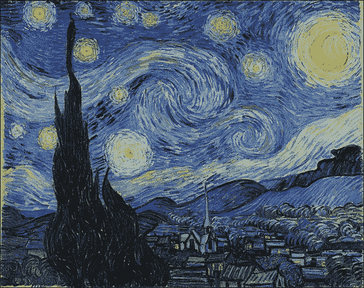
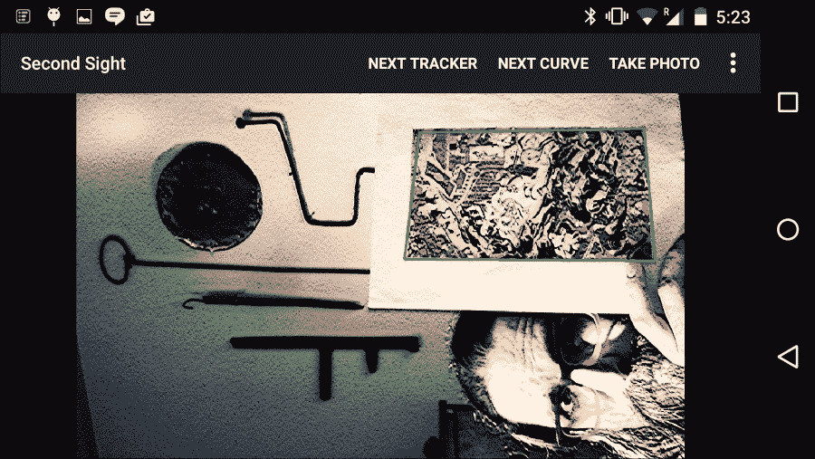

# 第 4 章。识别和跟踪图像

本章的目标是将图像跟踪添加到 Second Sight。 我们将训练该应用以识别某些任意的矩形图像（例如绘画），并确定它们在 2D 投影中的姿势。 当该应用出现在相机源中时，它将在跟踪的图像周围绘制轮廓。 所有的跟踪和绘制都是使用 OpenCV 而不是其他 Android 库完成的。

### 注意

可以从作者的网站下载本章的完整 Eclipse 项目。 该项目有两个版本：

OpenCV 3.x 的版本位于[这个页面](http://nummist.com/opencv/4598_04.zip)。

位于[这个页面](http://nummist.com/opencv/5206_04.zip)的 OpenCV 2.x 版本。

# 将文件添加到项目

对于本章，我们需要添加一个新类`com.nummist.secondsight.filters.ar.ImageDetectionFilter`。 我们还需要添加一些资源文件，即我们要跟踪的图像。 从[这个页面](http://nummist.com/opencv/5206_04_images.zip)下载图像，将其解压缩，并将其放入项目的`res/drawable-nodpi`文件夹中。

这些图像是 19 世纪荷兰画家[文森特·梵高](http://en.wikipedia.org/wiki/Vincent_van_Gogh)和 16 世纪印度画家 [Basawan](http://en.wikipedia.org/wiki/Basawan)。 我们的跟踪器可以很好地处理这些图像，因为它们包含许多高对比度的细节，而无需重复很多图案。 因此，是，可以在每个图像的大多数部分中进行跟踪。 例如，这是巴沙旺（Basawan）的一幅画作《阿克巴猎豹》：


这是文森特·梵高的画作之一《星空》：



# 了解图像跟踪

想象下面的对话：

A：我找不到《星空》的印刷品。 你知道在哪里吗？

B：看起来像什么？

对于计算机或对于西方艺术无知的人，B 的问题是很合理的。 在我们可以使用视感（或其他感官）来追踪某物之前，我们需要先感知到该物。 否则，我们至少需要对我们将要感知到的东西有一个很好的描述。 对于计算机视觉，我们必须提供**参考图像**，它将与实时摄像机图像或**场景**进行比较。 如果目标具有复杂的几何形状或运动部件，我们可能需要提供许多参考图像以说明不同的视角和姿势。 但是，对于使用著名绘画的示例，我们将假定目标是矩形且刚性的。

### 注意

Google 的**按图像搜索**是流行工具的示例，该工具要求用户提供参考图像。 如果您以前从未使用过它，请转到[这个页面](https://images.google.com/)，单击相机图标，然后通过输入 URL 或上传文件来提供参考图像。 搜索结果应包括匹配或相似的图像。 该工具可以帮助想要验证图像原始来源的研究人员。

出于本章的目的，我们说跟踪的目的是确定如何在 3D 中放置矩形目标。 有了这些信息，我们就可以围绕目标绘制轮廓。 在最终的 2D 图像中，轮廓将为四边形。 （它不一定是矩形，因为目标可能会偏离相机。）

这种跟踪涉及四个主要步骤：

1.  在参考图像和场景中找到**特征**。 从不同的距离或角度观察时，特征是可能保持相似外观的点。 例如，拐角经常具有这种特性。 请参阅[这个页面](http://en.wikipedia.org/wiki/Feature_%28computer_vision%29)和[这个页面](http://en.wikipedia.org/wiki/Feature_extraction)。
2.  为每组特征（参考和场景特征）找到**描述符**。 描述符是有关要素的数据向量。 某些功能不适合生成描述符，因此图像比功能具有更少的描述符。 参见[这个页面](http://en.wikipedia.org/wiki/Visual_descriptors)。
3.  查找两组描述符（参考和场景描述符）之间的**匹配项**。 如果我们将描述符想象为多维空间中的点，则根据点之间的距离度量来定义匹配。 彼此距离足够近的描述符被视为匹配项。 当一对描述符是匹配项时，我们也可以说基础要素对是匹配项。
4.  在场景中的参考图像和匹配图像之间找到**单应性**。 单应性是一种 3D 变换，需要将两个投影的 2D 图像对齐（或尽可能靠近以对齐它们）。 它是基于两个图像的匹配特征点计算的。 通过将单应性应用于矩形，我们可以获得跟踪对象的轮廓。 参见[这个页面](http://en.wikipedia.org/wiki/Homography_%28computer_vision%29)。

有很多不同的技术可以执行前三个步骤。 OpenCV 提供了称为[`FeatureDetector`](http://docs.opencv.org/java/org/opencv/features2d/FeatureDetector.html)，[`DescriptorExtractor`](http://docs.opencv.org/java/org/opencv/features2d/DescriptorExtractor.html)和[`DescriptorMatcher`](http://docs.opencv.org/java/org/opencv/features2d/DescriptorMatcher.html)分别支持几种技术。 我们将使用 OpenCV 称为`FeatureDetector.ORB`，`DescriptorExtractor.ORB`和`DescriptorMatcher.BRUTEFORCE_HAMMINGLUT`的技术组合。 这种组合是相对快速且鲁棒的。 与某些替代方案不同，它是**缩放不变的**和**旋转不变的**，这意味着可以在各种放大倍率，分辨率或距离下跟踪目标，并且从各个角度来看。 另外，与其他替代方案不同，它没有专利权，因此即使在商业应用中也可以免费使用。

### 注意

有关 **ORB** 的描述，其他技术及其相对优点，请参阅 Gil Levi 博客上[二进制描述符的多部分教程](https://gilscvblog.wordpress.com/2013/08/26/tutorial-on-binary-descriptors-part-1/)。 作为该主题的先驱，另请参见[描述符简介](https://gilscvblog.wordpress.com/2013/08/18/a-short-introduction-to-descriptors/)。

BahinIşık 和 KemalÖzkan 撰写的《对知名特征检测器和描述符的比较评估》是 ORB 及其替代品的另一个很好的来源。 可在[这个页面](http://www.atscience.org/IJAMEC/article/download/135/83)上获得本文的电子版本。

最后，有关 OpenCV 中实现的 ORB 和替代方案的基准，请参阅 Ievgen Khvedchenya 的[特征检测器](http://computer-vision-talks.com/articles/2011-07-13-comparison-of-the-opencv-feature-detection-algorithms/)和[描述符提取器](http://computer-vision-talks.com/articles/2011-01-28-comparison-of-feature-descriptors/)的博客文章。

在撰写本文时，OpenCV 的特征检测器仅支持灰度图像。 就我们的目的而言，此限制并不是很糟糕，因为用于灰度特征检测的算法比用于颜色特征检测的算法要快。 在移动设备上，我们必须进行节能以保持实时视频的合理速度，并且在每帧的灰度版本上运行计算机视觉功能是一种节能的方法。 但是，为了获得最佳结果，我们应确保选择的目标图像在转换为灰度时仍具有很强的对比度。

以下伪代码表示 OpenCV 中使用的标准灰度转换公式：

```java
grayValue(r, g, b) = (0.299 * r) + (0.587 * g) + (0.114 * b)
```

前面的公式在保留蓝黄色对比度（其中黄色是红色加绿色）以及当然在黑白对比度方面最有效。 例如，此标准灰度转换在《星空》中保持对比度方面做得很好，该调色板具有主要由蓝色，黄色，黑色和白色组成的调色板。

# 编写图像跟踪过滤器

我们将把我们的跟踪器编写为在上一章中创建的`Filter`接口的实现。 追踪器的类别名称将为`ImageDetectionFilter`。 作为成员变量，此类具有`FeatureDetector`，`DescriptorExtractor`和`DescriptorMatcher`的实例，以及几个`Mat`实例，这些实例存储图像数据以及跟踪计算的中间或最终结果。 之所以存储其中一些结果，是因为它们在不同的帧之间不会改变。 之所以存储其他文件，是因为它比为每个帧重新创建`Mat`实例更有效。 类和成员变量的声明如下：

```java
public class ImageDetectionFilter implements Filter {

  // The reference image (this detector's target).
  private final Mat mReferenceImage;
  // Features of the reference image.
  private final MatOfKeyPoint mReferenceKeypoints =
    new MatOfKeyPoint();
  // Descriptors of the reference image's features.
  private final Mat mReferenceDescriptors = new Mat();
  // The corner coordinates of the reference image, in pixels.
  // CvType defines the color depth, number of channels, and
  // channel layout in the image. Here, each point is represented
  // by two 32-bit floats.
  private final Mat mReferenceCorners =
    new Mat(4, 1, CvType.CV_32FC2);

  // Features of the scene (the current frame).
  private final MatOfKeyPoint mSceneKeypoints =
    new MatOfKeyPoint();
  // Descriptors of the scene's features.
  private final Mat mSceneDescriptors = new Mat();
  // Tentative corner coordinates detected in the scene, in
  // pixels.
  private final Mat mCandidateSceneCorners =
    new Mat(4, 1, CvType.CV_32FC2);
  // Good corner coordinates detected in the scene, in pixels.
  private final Mat mSceneCorners = new Mat(4, 1,
    CvType.CV_32FC2);
  // The good detected corner coordinates, in pixels, as integers.
  private final MatOfPoint mIntSceneCorners = new MatOfPoint();

  // A grayscale version of the scene.
  private final Mat mGraySrc = new Mat();
  // Tentative matches of scene features and reference features.
  private final MatOfDMatch mMatches = new MatOfDMatch();

  // A feature detector, which finds features in images.
  private final FeatureDetector mFeatureDetector =
    FeatureDetector.create(FeatureDetector.ORB);
  // A descriptor extractor, which creates descriptors of
  // features.
  private final DescriptorExtractor mDescriptorExtractor =
    DescriptorExtractor.create(DescriptorExtractor.ORB);
  // A descriptor matcher, which matches features based on their
  // descriptors.
  private final DescriptorMatcher mDescriptorMatcher =
    DescriptorMatcher.create(
      DescriptorMatcher.BRUTEFORCE_HAMMINGLUT);

  // The color of the outline drawn around the detected image.
  private final Scalar mLineColor = new Scalar(0, 255, 0);
```

我们想要一种方便的方法来制作任意图像的图像跟踪器。 我们可以使用我们的应用将图像打包为**可绘制**资源，这些资源可以由任何 Android `Context`子类（例如`Activity`）加载。 因此，我们提供了一个构造器`ImageDetectionFilter(final Context context, final int referenceImageResourceID)`，该构造器使用给定的`Context`和资源标识符加载参考图像。 图像的 RGBA 和灰度版本存储在成员变量中。 图像的角点也将被存储，其特征和描述符也将被存储。 构造器的代码如下：

```java
  public ImageDetectionFilter(final Context context,
    final int referenceImageResourceID) throws IOException {

    // Load the reference image from the app's resources.
    // It is loaded in BGR (blue, green, red) format.
    mReferenceImage = Utils.loadResource(context,
      referenceImageResourceID,
      Imgcodecs.CV_LOAD_IMAGE_COLOR);

    // Create grayscale and RGBA versions of the reference image.
    final Mat referenceImageGray = new Mat();
    Imgproc.cvtColor(mReferenceImage, referenceImageGray,
      Imgproc.COLOR_BGR2GRAY);
    Imgproc.cvtColor(mReferenceImage, mReferenceImage,
      Imgproc.COLOR_BGR2RGBA);

    // Store the reference image's corner coordinates, in pixels.
    mReferenceCorners.put(0, 0,
      new double[] {0.0, 0.0});
    mReferenceCorners.put(1, 0,
      new double[] {referenceImageGray.cols(), 0.0});
    mReferenceCorners.put(2, 0,
      new double[] {referenceImageGray.cols(),
      referenceImageGray.rows()});
    mReferenceCorners.put(3, 0,
      new double[] {0.0, referenceImageGray.rows()});

    // Detect the reference features and compute their
    // descriptors.
    mFeatureDetector.detect(referenceImageGray,
      mReferenceKeypoints);
    mDescriptorExtractor.compute(referenceImageGray,
      mReferenceKeypoints, mReferenceDescriptors);
  }
```

### 提示

**使代码适配 OpenCV 2.x**

将`Imgcodecs.CV_LOAD_IMAGE_COLOR`替换为`Highgui.CV_LOAD_IMAGE_COLOR`。

回想一下`Filter`接口声明了一种方法`apply(final Mat src, final Mat dst)`。 我们对这种方法的实现将特征检测器，描述符提取器和描述符匹配器应用于源图像的灰度版本。 然后，我们调用帮助程序函数，该函数查找被跟踪目标的四个角（如果有），并绘制四边形轮廓。 代码如下：

```java
  @Override
  public void apply(final Mat src, final Mat dst) {

    // Convert the scene to grayscale.
    Imgproc.cvtColor(src, mGraySrc, Imgproc.COLOR_RGBA2GRAY);

    // Detect the scene features, compute their descriptors,
    // and match the scene descriptors to reference descriptors.
    mFeatureDetector.detect(mGraySrc, mSceneKeypoints);
    mDescriptorExtractor.compute(mGraySrc, mSceneKeypoints,
      mSceneDescriptors);
    mDescriptorMatcher.match(mSceneDescriptors,
      mReferenceDescriptors, mMatches);

    // Attempt to find the target image's corners in the scene.
    findSceneCorners();

    // If the corners have been found, draw an outline around the
    // target image.
    // Else, draw a thumbnail of the target image.    draw(src, dst);
  }
```

`findSceneCorners()`辅助方法是一个更大的代码块，但是很多方法只是简单地遍历匹配项以汇编最佳列表。 如果所有匹配都非常差（如较大的距离值所示），则假定目标不在场景中，并且清除之前对其拐角位置的任何估计。 如果比赛既不好也不好，我们假定目标在场景中的某个地方，但是我们保留其先前估计的拐角位置。 此政策有助于我们稳定对拐角位置的估计。 最后，如果匹配良好且至少有四个匹配项，我们找到单应性并使用它来更新估计的角点位置。

### 注意

有关查找单应性的数学描述，请参见[官方 OpenCV 文档](http://docs.opencv.org/modules/calib3d/doc/camera_calibration_and_3d_reconstruction.html#findhomography)。

`findSceneCorners()`的实现如下：

```java
  private void findSceneCorners() {

    List<DMatch> matchesList = mMatches.toList();
    if (matchesList.size() < 4) {
      // There are too few matches to find the homography.
      return;
    }

    List<KeyPoint> referenceKeypointsList =
      mReferenceKeypoints.toList();
    List<KeyPoint> sceneKeypointsList =
      mSceneKeypoints.toList();

    // Calculate the max and min distances between keypoints.
    double maxDist = 0.0;
    double minDist = Double.MAX_VALUE;
    for(DMatch match : matchesList) {
      double dist = match.distance;
      if (dist < minDist) {
        minDist = dist;
      }
      if (dist > maxDist) {
        maxDist = dist;
      }
    }

    // The thresholds for minDist are chosen subjectively
    // based on testing. The unit is not related to pixel
    // distances; it is related to the number of failed tests
    // for similarity between the matched descriptors.
    if (minDist > 50.0) {
      // The target is completely lost.
      // Discard any previously found corners.
      mSceneCorners.create(0, 0, mSceneCorners.type());
      return;
    } else if (minDist > 25.0) {
      // The target is lost but maybe it is still close.
      // Keep any previously found corners.
      return;
    }

    // Identify "good" keypoints based on match distance.
    ArrayList<Point> goodReferencePointsList =
      new ArrayList<Point>();
    ArrayList<Point> goodScenePointsList =
      new ArrayList<Point>();
    double maxGoodMatchDist = 1.75 * minDist;
    for(DMatch match : matchesList) {
      if (match.distance < maxGoodMatchDist) {
        goodReferencePointsList.add(
          referenceKeypointsList.get(match.trainIdx).pt);
        goodScenePointsList.add(
          sceneKeypointsList.get(match.queryIdx).pt);
      }
    }

    if (goodReferencePointsList.size() < 4 ||
        goodScenePointsList.size() < 4) {
      // There are too few good points to find the homography.
      return;
    }

    // There are enough good points to find the homography.
    // (Otherwise, the method would have already returned.)

    // Convert the matched points to MatOfPoint2f format, as
    // required by the Calib3d.findHomography function.
    MatOfPoint2f goodReferencePoints = new MatOfPoint2f();
    goodReferencePoints.fromList(goodReferencePointsList);
    MatOfPoint2f goodScenePoints = new MatOfPoint2f();
    goodScenePoints.fromList(goodScenePointsList);

    // Find the homography.
    Mat homography = Calib3d.findHomography(
      goodReferencePoints, goodScenePoints);

    // Use the homography to project the reference corner
    // coordinates into scene coordinates.
    Core.perspectiveTransform(mReferenceCorners,
      mCandidateSceneCorners, homography);

    // Convert the scene corners to integer format, as required
    // by the Imgproc.isContourConvex function.
    mCandidateSceneCorners.convertTo(mIntSceneCorners,
      CvType.CV_32S);

    // Check whether the corners form a convex polygon. If not,
    // (that is, if the corners form a concave polygon), the
    // detection result is invalid because no real perspective can
    // make the corners of a rectangular image look like a concave
    // polygon!
    if (Imgproc.isContourConvex(mIntSceneCorners)) {
      // The corners form a convex polygon, so record them as
      // valid scene corners.
      mCandidateSceneCorners.copyTo(mSceneCorners);
    }
  }
```

我们的另一个帮助器方法`draw(Mat src, Mat dst)`首先将源图像复制到目标位置。 然后，如果未跟踪目标，则在图像的一角绘制一个缩略图，以便用户知道要查找的内容。 如果正在追踪目标，我们会在其周围绘制轮廓。 以下一对屏幕快照显示了`draw`方法的结果，当未跟踪目标（左侧）时和在跟踪目标（右侧）时：


以下代码实现`draw`帮助器方法：

```java
  protected void draw(Mat src, Mat dst) {

    if (dst != src) {
      src.copyTo(dst);
    }

    if (mSceneCorners.height() < 4) {
      // The target has not been found.

      // Draw a thumbnail of the target in the upper-left
      // corner so that the user knows what it is.

      // Compute the thumbnail's larger dimension as half the
      // video frame's smaller dimension.
      int height = mReferenceImage.height();
      int width = mReferenceImage.width();
      int maxDimension = Math.min(dst.width(),
        dst.height()) / 2;
      double aspectRatio = width / (double)height;
      if (height > width) {
        height = maxDimension;
        width = (int)(height * aspectRatio);
      } else {
        width = maxDimension;
        height = (int)(width / aspectRatio);
      }

      // Select the region of interest (ROI) where the thumbnail
      // will be drawn.
      Mat dstROI = dst.submat(0, height, 0, width);
      // Copy a resized reference image into the ROI.
      Imgproc.resize(mReferenceImage, dstROI, dstROI.size(),
        0.0, 0.0, Imgproc.INTER_AREA);

      return;
    }

    // Outline the found target in green.
    Imgproc.line(dst, new Point(mSceneCorners.get(0, 0)),
      new Point(mSceneCorners.get(1, 0)), mLineColor, 4);
    Imgproc.line(dst, new Point(mSceneCorners.get(1, 0)),
      new Point(mSceneCorners.get(2, 0)), mLineColor, 4);
    Imgproc.line(dst, new Point(mSceneCorners.get(2, 0)),
      new Point(mSceneCorners.get(3, 0)), mLineColor, 4);
    Imgproc.line(dst, new Point(mSceneCorners.get(3,0)),
      new Point(mSceneCorners.get(0, 0)), mLineColor, 4);
  }
}
```

### 提示

**使代码适配 OpenCV 2.x**

将`Imgproc.line`替换为`Core.line`。

尽管`ImageDetectionFilter`的实现比我们以前的过滤器更复杂，但它仍然具有简单的接口。 您必须使用可绘制资源实例化它，然后根据需要将过滤器应用于源图像和目标图像。

# 将跟踪器过滤器添加到`CameraActivity`

为了使用`ImageDetectionFilter`的实例，我们对`CameraActivity`进行了与上一章中其他过滤器相同的修改。 回想一下，我们所有的过滤器类都实现了`Filter`接口，以便`CameraActivity`可以类似的方式使用它们。

首先，我们需要在`res/values/strings.xml`中定义一些文本（用于菜单按钮）：

```java
  <string name="menu_next_image_detection_filter">Next
    Tracker</string>
```

接下来，我们需要在`res/menu/activity_camera.xml`中定义菜单按钮本身：

```java
<menu xmlns:android="http://schemas.android.com/apk/res/android"
  xmlns:app="http://schemas.android.com/apk/res-auto">
  <item
    android:id="@+id/menu_next_image_detection_filter"
    app:showAsAction="ifRoom|withText"
    android:title="@string/menu_next_image_detection_filter" />
  <!-- ... -->
</menu>
```

我们的其余修改都与`CameraActivity.java`有关。 我们需要添加新的成员变量来跟踪所选的图像检测过滤器：

```java
  // Keys for storing the indices of the active filters.
  private static final String STATE_IMAGE_DETECTION_FILTER_INDEX =
    "imageDetectionFilterIndex";
  private static final String STATE_CURVE_FILTER_INDEX =
    "curveFilterIndex";
  private static final String STATE_MIXER_FILTER_INDEX =
    "mixerFilterIndex";
  private static final String STATE_CONVOLUTION_FILTER_INDEX =
    "convolutionFilterIndex";

  // The filters.
  private Filter[] mImageDetectionFilters;
  private Filter[] mCurveFilters;
  private Filter[] mMixerFilters;
  private Filter[] mConvolutionFilters;

  // The indices of the active filters.
  private int mImageDetectionFilterIndex;
  private int mCurveFilterIndex;
  private int mMixerFilterIndex;
  private int mConvolutionFilterIndex;
```

初始化 OpenCV 之后，我们需要实例化所有图像检测过滤器并将它们放置在数组中。 为简便起见，我添加了两个图像检测过滤器作为示例，但您可以轻松修改以下代码以支持跟踪更多图像或不同图像：

```java
    public void onManagerConnected(final int status) {
      switch (status) {
        case LoaderCallbackInterface.SUCCESS:
          Log.d(TAG, "OpenCV loaded successfully");
          mCameraView.enableView();
          mBgr = new Mat();

          final Filter starryNight;
          try {
            starryNight = new ImageDetectionFilter(
              CameraActivity.this,
              R.drawable.starry_night);
          } catch (IOException e) {
            Log.e(TAG, "Failed to load drawable: " +
              "starry_night");
            e.printStackTrace();
            break;
          }

         final Filter akbarHunting;
         try {
           akbarHunting = new ImageDetectionFilter(
             CameraActivity.this,
             R.drawable.akbar_hunting_with_cheetahs);
         } catch (IOException e) {
           Log.e(TAG, "Failed to load drawable: " +
             "akbar_hunting_with_cheetahs");
           e.printStackTrace();
           break;
         }

          mImageDetectionFilters = new Filter[] {
            new NoneFilter(),
            starryNight,
            akbarHunting
          };

          // ...
      }
    }
  };
```

创建活动后，我们需要加载有关所选图像检测过滤器的所有已保存数据：

```java
  protected void onCreate(final Bundle savedInstanceState) {
    super.onCreate(savedInstanceState);

    final Window window = getWindow();
    window.addFlags(
      WindowManager.LayoutParams.FLAG_KEEP_SCREEN_ON);

    if (savedInstanceState != null) {
      mCameraIndex = savedInstanceState.getInt(
        STATE_CAMERA_INDEX, 0);
      mImageSizeIndex = savedInstanceState.getInt(
        STATE_IMAGE_SIZE_INDEX, 0);
 mImageDetectionFilterIndex =
 savedInstanceState.getInt(
 STATE_IMAGE_DETECTION_FILTER_INDEX, 0);
      mCurveFilterIndex = savedInstanceState.getInt(
        STATE_CURVE_FILTER_INDEX, 0);
      mMixerFilterIndex = savedInstanceState.getInt(
        STATE_MIXER_FILTER_INDEX, 0);
      mConvolutionFilterIndex = savedInstanceState.getInt(
        STATE_CONVOLUTION_FILTER_INDEX, 0);
    } else {
      mCameraIndex = 0;
      mImageSizeIndex = 0;
      mImageDetectionFilterIndex = 0;
      mCurveFilterIndex = 0;
      mMixerFilterIndex = 0;
      mConvolutionFilterIndex = 0;
    }

    // ...
  }
```

相反，在活动被销毁之前，我们需要保存有关所选图像检测过滤器的数据：

```java
  public void onSaveInstanceState(Bundle savedInstanceState) {
    // Save the current camera index.
    savedInstanceState.putInt(STATE_CAMERA_INDEX, mCameraIndex);

    // Save the current image size index.
    savedInstanceState.putInt(STATE_IMAGE_SIZE_INDEX,
      mImageSizeIndex);

    // Save the current filter indices.
    savedInstanceState.putInt(STATE_IMAGE_DETECTION_FILTER_INDEX,
      mImageDetectionFilterIndex);
    savedInstanceState.putInt(STATE_CURVE_FILTER_INDEX,
      mCurveFilterIndex);
    savedInstanceState.putInt(STATE_MIXER_FILTER_INDEX,
      mMixerFilterIndex);
    savedInstanceState.putInt(STATE_CONVOLUTION_FILTER_INDEX,
      mConvolutionFilterIndex);

    super.onSaveInstanceState(savedInstanceState);
  }
```

当按下**下个跟踪器**菜单按钮时，需要更新所选图像检测过滤器：

```java
  public boolean onOptionsItemSelected(final MenuItem item) {
    if (mIsMenuLocked) {
      return true;
    }
    if (item.getGroupId() == MENU_GROUP_ID_SIZE) {
      mImageSizeIndex = item.getItemId();
      recreate();
      return true;
    }
    switch (item.getItemId()) {
    case R.id.menu_next_image_detection_filter:
      mImageDetectionFilterIndex++;
      if (mImageDetectionFilterIndex ==
        mImageDetectionFilters.length) {
        mImageDetectionFilterIndex = 0;
      }
      return true;
    // ...
    default:
      return super.onOptionsItemSelected(item);
    }
  }
```

最后，当相机捕获一帧时，需要将选定的图像检测过滤器应用于该帧。 为了确保其他过滤器不会干扰图像检测，重要的是首先应用图像检测过滤器：

```java
  public Mat onCameraFrame(final CvCameraViewFrame inputFrame) {
    final Mat rgba = inputFrame.rgba();

    // Apply the active filters.
    if (mImageDetectionFilters != null) {
      mImageDetectionFilters[mImageDetectionFilterIndex].apply(
        rgba, rgba);
    }
    if (mCurveFilters != null) {
      mCurveFilters[mCurveFilterIndex].apply(rgba, rgba);
    }
    if (mMixerFilters != null) {
      mMixerFilters[mMixerFilterIndex].apply(rgba, rgba);
    }
    if (mConvolutionFilters != null) {
      mConvolutionFilters[mConvolutionFilterIndex].apply(
        rgba, rgba);
    }

    if (mIsPhotoPending) {
      mIsPhotoPending = false;
      takePhoto(rgba);
    }

    if (mIsCameraFrontFacing) {
      // Mirror (horizontally flip) the preview.
      Core.flip(rgba, rgba, 1);
    }

    return rgba;
  }
```

就这样！ 打印目标图像或在屏幕上显示它们。 然后，运行应用，选择合适的图像检测过滤器，然后将相机对准目标。 如果视频太不稳定（由于图像处理缓慢），请选择较低的相机分辨率，然后重试。 另外，您可能需要将 Android 设备保持一两秒钟的静止不动，以使相机自动对焦在目标上。 然后，您应该看到目标以绿色概述。 例如，请参见以下屏幕快照中的《星空》周围的轮廓：


请注意，即使目标图像旋转或倾斜，图像检测过滤器也可以工作。 现在，尝试将图像检测过滤器与其他过滤器组合使用。 因为我们在其他过滤之前执行图像检测，所以目标图像在检测器中看起来仍然相同，应该被检测到。 例如，在以下屏幕截图中，请注意，即使`RecolorRGVFilter`，`CrossProcessCurveFilter`和`StrokeEdgesFilter`也正在运行时，也会检测到《阿克巴猎豹》（并用绿色框出）：



# 总结

Second Sight 应用现在可以看到！ 至少，它可以识别预定义集中的任何图像，并在该图像周围绘制四边形。 在某种程度上，此功能在缩放，旋转和倾斜方面都非常强大。 例如，可以在各种放大率，分辨率，距离和视角下跟踪图像。

尽管在本章中仅添加了一个类，但我们介绍了许多 OpenCV 功能。 接下来，我们将退后一步，考虑如何将该 OpenCV 功能与其他类型的图形进行集成，这些图形将实时响应摄像机的输入。 我们将在 Second Sight 的图像识别过滤器上构建一个小的 3D 渲染场景。