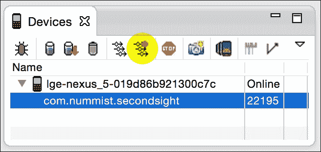
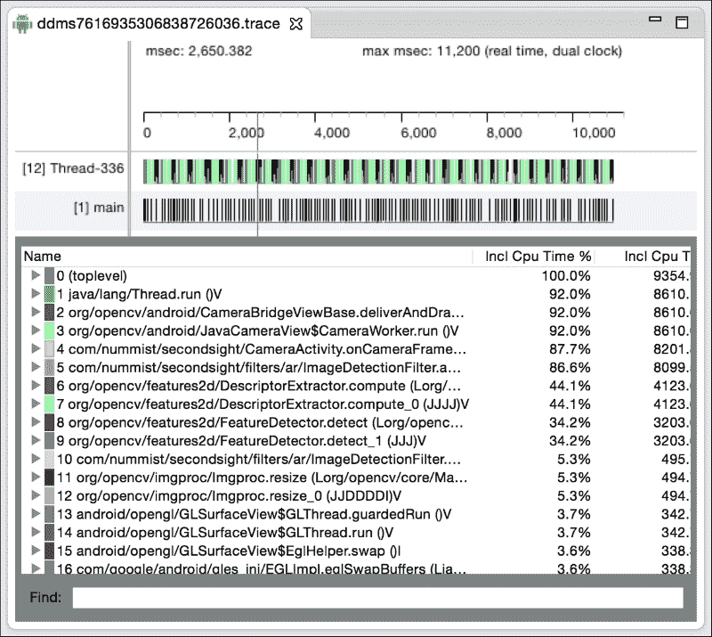

# 第 6 章。通过 JNI 混合 Java 和 C++

本章的目标是重写一些 Java 类，以使它们成为围绕 C++ 类的精简包装。 我们将使用一个中介框架 **Java 本机接口**（**JNI**），该框架可以彼此公开 Java 和 C++ 代码。 在此过程中，我们将对 OpenCV 的 Java 和 C++ 接口有更深入的了解。

### 注意

可以从作者的网站下载本章的完整 Eclipse 项目。 该项目具有以下两个版本：

OpenCV 3.x 的版本位于[这个页面](http://nummist.com/opencv/4598_06.zip)。

OpenCV 2.x 的版本位于[这个页面](http://nummist.com/opencv/5206_06.zip)。

# 了解 JNI 的作用

JNI 使 Java 代码可以调用 C 或 C++ 代码（反之亦然）。 OpenCV4Android，Android SDK 和 Java 标准库均依赖 JNI。 也就是说，这些主要的 Java 库部分构建在 C++ 或 C 库之上。

OpenCV 主要用 C++ 编写。 尽管该库还提供了 Java 接口（OpenCV4Android）和 Python 接口，但是这些接口的大部分都是 C++ 实现之上的薄层。 例如，`org.opencv.core.Mat`对象（在 Java 接口中）或 NumPy 数组（在 Python 接口中）由`cv::Mat`对象（在 C++ 实现中）支持，并且它们共享对相同数据的引用。 没有数据重复。

当 OpenCV 的 Java 或 Python 接口将函数调用转发到 C++ 实现时，确实会产生少量开销。 如果我们的代码每帧进行数千次 OpenCV 函数调用（例如，每帧每像素一个或多个调用），我们可能会开始担心这种开销。 但是，通常，节俭的程序员不会每帧进行数千次 OpenCV 函数调用，并且选择 OpenCV 接口（Java，Python 或 C++）对帧速率没有明显影响！ 为了进行比较，请考虑以下有关使用 Android NDK（C++ 接口）与 Android SDK（Java 接口）的评论：

> *在下载 NDK 之前，您应该了解 NDK 不会使大多数应用受益。 作为开发人员，您需要在其优点与缺点之间取得平衡。 值得注意的是，在 Android 上使用本机代码通常不会带来明显的性能改进，但始终会增加应用程序的复杂性。 通常，仅应在对您的应用程序至关重要的情况下使用 NDK，因为绝对不喜欢使用 C/C++ 进行编程，因此绝对不要。*

另一方面，OpenCV 的 C++ 接口确实提供了 Java 接口中缺少的几个功能：

*   **手动内存管理**：OpenCV 的 Java 接口按垃圾回收器的时间表释放内存，而 OpenCV 的 C++ 接口按命令释放内存。 在我们面临资源的严格限制（内存或分配和释放内存所需的 CPU 周期）的情况下，此手动控制可能会很有用。
*   **与其他库的互操作性**：OpenCV 的 C++ 接口提供对图像数据的原始字节访问，可以直接由许多其他 C++ 或 C 库解释和使用它们，而无需复制或修改。
*   **不具有 Java 的跨平台兼容性**：OpenCV 的 C++ 接口可以在 Java 运行时不可用或未安装的平台上使用。 我们可以在 Windows，Mac，Linux，Android，iOS，WinRT 和 Windows Phone 8 中重用单个 C++ 代码库。

这些功能使 C++ 接口成为我们的 OpenCV 之旅中的重要主题。 通过利用 JNI 并编写我们自己的 C++ 代码，我们将学习使用 OpenCV 的另一种通用方法。

# 测量效果

为了使自己确信 OpenCV 的 Java 和 C++ 接口提供相似的速度，您可能希望在我们在本章中进行修改之前和之后评估应用程序的性能。 较好的整体性能衡量标准是`onCameraFrame`回调处理的每秒帧数（**FPS**）。 （可选）OpenCV 的`CameraView`类可以计算并显示此 FPS 指标。 当启用`CameraView`（在`onManagerConnected`回调中）时，我们还可以启用 FPS 仪表，如以下代码所示：

```java
    @Override
    public void onManagerConnected(final int status) {
      switch (status) {
      case LoaderCallbackInterface.SUCCESS:
        Log.d(TAG, "OpenCV loaded successfully");
        mCameraView.enableView();
        mCameraView.enableFpsMeter();
        //...
```

尽管 FPS 是一项重要的统计数据，但它无法准确告诉我们该应用程序如何使用系统资源。 例如，我们可能想知道应用程序在每种方法上花费了多少 CPU 时间。 为了确定，我们可以使用 **Dalvik 调试监视器服务器**（**DDMS**），这是一个集成到 Eclipse 中的 Android 调试工具。 以下是通过 DDMS 分析 CPU 使用情况的步骤：

1.  打开 Eclipse。 通过单击 **DDMS** 按钮（通常在窗口的右上角）或导航至菜单选项**开放视野 | 其他… | DDMS**，打开 DDMS 透视图。 。
2.  确保您的 Android 设备通过 USB 连接，并且在设备上已打开 Second Sight 应用程序。
3.  在 DDMS 透视图的**设备**窗格中，您应该看到您的 Android 设备。 展开它。 选择`com.nummist.sightsight`进程，该进程应在​​设备下方列出。
4.  在 Android 设备上，将 Second Sight 配置为使用要配置的任何过滤器和相机设置。
5.  要开始分析应用程序的 CPU 使用情况，请单击**设备**窗格顶部的**启动方法分析**按钮。 该按钮看起来像三个带有红点的箭头。 （下一个屏幕截图用突出显示的半透明圆圈标记了按钮的位置。）即使单击该按钮，也不会看到有关 CPU 使用率的报告。 该报告是在步骤 7 之后生成的。

    
6.  继续使用该应用程序，直到完成您要分析的所有操作（例如图像识别）。
7.  要停止分析应用程序的 CPU 使用情况，请单击**停止方法分析**按钮。 它看起来像三个带有黑色正方形的箭头，位于**启动方法分析**按钮所在的位置。 现在，您应该看到有关每种方法的 CPU 使用率的报告。 列出了每个方法名称及其在应用程序总 CPU 使用率中所占的百分比。 请参见以下屏幕截图：
    
    

**设备**窗格中的其他一些按钮还提供对性能分析报告的访问，例如内存使用和 OpenGL 调用的分类。 收集尽可能多的报告！ 在您配置了现有应用程序后，我们将继续进行修改。

# 将文件添加到项目

Android 项目的 C++ 文件应该始终位于名为`jni`的子目录中。 此子目录还应该包含 C++ 代码的依赖项以及一种名为 **Makefiles** 的编译指令。 具体来说，我们需要在 Second Sight 项目文件夹中创建以下新文件夹和文件：

*   `jni/include/opencv2/`：此文件夹包含 OpenCV 的 C++ 接口的**头文件**（类型和功能的定义）。 将`<opencv>/sdk/native/jni/include/opencv2/`的内容复制到此文件夹中。 （用系统上的 OpenCV4Android 路径替换`<opencv>`。）
*   `jni/libs/`：此文件夹包含 OpenCV 的 C++ 接口和 OpenCV 的依赖项的库文件（编译的实现）。 将`<opencv>/sdk/native/libs/`和`<opencv>/sdk/native/3rdparty/libs/`的内容复制到此文件夹中。
*   `jni/Application.mk`：此 Makefile 描述将使用 C++ 库的环境类型。 环境的功能包括硬件体系结构，Android 版本以及应用程序对 C++ 语言功能和标准库的使用。
*   `jni/Android.mk`：此 Makefile 描述了我们的 C++ 库对其他库（如 OpenCV）的依赖关系。
*   `ImageDetectionFilter.hpp`：此 C++ 头文件包含`ImageDetectionFilter`类的定义。
*   `ImageDetectionFilter.cpp`：此 C++ **源文件**包含`ImageDetectionFilter`类的实现详细信息。
*   `RecolorCMVFilter.hpp`：这是`RecolorCMVFilter`类的头文件。
*   `RecolorCMVFilter.cpp`：这是`RecolorCMVFilter`类的源文件。
*   `RecolorRCFilter.hpp`：这是`RecolorRCFilter`类的头文件。
*   `RecolorRCFilter.cpp`：这是`RecolorRCFilter`类的源文件。
*   `RecolorRGVFilter.hpp`：这是`RecolorRGVFilter`类的头文件。
*   `RecolorRGVFilter.cpp`：这是`RecolorRGVFilter`类的源文件。
*   `StrokeEdgesFilter.hpp`：这是`StrokeEdgesFilter`类的头文件。
*   `StrokeEdgesFilter.cpp`：这是`StrokeEdgesFilter`类的源文件。
*   `SecondSightJNI.cpp`：此文件定义和实现 JNI 函数，它们是可从 Java 调用的 C++ 函数。 我们的 JNI 函数包装了 C++ 类的公共方法。

如前面列表中所述，我们必须将 OpenCV 头文件和库文件复制到我们的项目中。 所有其他文件将包含我们自己的代码，我们将在本章其余部分中详细讨论。 首先，让我们将注意力转向 Makefile，这将使我们能够构建 C++ 库。

# 建立本机库

C++ 是编译语言。 这意味着 C++ 代码不能用作机器（例如 ARMv7-A 芯片）或虚拟机（例如 **Java 虚拟机**或 **JVM**）的指令集。 。 相反，我们使用名为**编译器**的工具将 C++ 代码转换为给定平台可以理解的指令。 编译每个 C++ 源文件以生成一个**对象文件**（不要与面向对象编程中的“对象”一词相混淆）。 然后，我们使用一个名为**链接器**的工具将多个目标文件组合成一个库或一个可执行文件。 链接器还可以组合库以产生其他库或可执行文件。 库的链接可以是静态的（意味着将给定版本的输入库“烘焙”到输出中），也可以是动态的（意味着可以在运行时加载库的任何可用版本）。 Android NDK 提供了一个名为`ndk-build`的工具，该工具抽象了编译器和链接器的使用，但是我们仍然必须在 Makefiles 中指定某些编译器标志和链接器标志。 我们的库将静态链接到 OpenCV（因为在 OpenCV 情况下动态链接更加复杂）。 因此，我们的编译器和链接器标志必须满足 OpenCV 的需求以及我们自己的代码的需求。

OpenCV 依赖于 C++ 语言的高级功能。 特别是**运行时类型信息**（**RTTI**）和运行时异常是使 OpenCV 能够可靠地处理各种（有效或无效）数据类型的语言功能，用户可能会尝试处理它们。 OpenCV 还依赖于 C++ **标准模板库**（**STL**），该库提供了用于存储和处理数据的模式。 一些 STL 实现不支持 RTTI。 一个安全的选择是 GNU STL 实现，它确实支持 RTTI。 我们的`Application.mk`文件必须告诉编译器使用 RTTI，异常和 GNU STL。 此外，此 Makefile 必须指定我们针对的硬件体系结构和 Android 版本。 要规定这些要求，请打开`Application.mk`并编写以下代码：

```java
APP_STL := gnustl_static # GNU STL
APP_CPPFLAGS := -frtti –fexceptions # RTTI, exceptions
APP_ABI := arm64-v8a armeabi armeabi-v7a mips mips64 x86 x86_64
APP_PLATFORM := android-8
```

将更改保存到`Application.mk`。 这些更改会影响所有应用程序 C++ 模块的构建方式。 接下来，在`Android.mk`中，我们需要提供说明以构建将在本章中编写的特定 C++ 模块。 此 Makefile 首先指定模块的名称，其对其他库的依赖关系及其源文件，如以下代码所示：

```java
LOCAL_PATH := $(call my-dir)

include $(CLEAR_VARS)
LOCAL_MODULE := SecondSight
LOCAL_C_INCLUDES += $(LOCAL_PATH)/include
LOCAL_LDLIBS := -lstdc++ # C++ standard library
LOCAL_LDLIBS += -llog # Android logging
LOCAL_LDLIBS += -lz # zlib
LOCAL_STATIC_LIBRARIES += opencv_calib3d
LOCAL_STATIC_LIBRARIES += opencv_features2d
LOCAL_STATIC_LIBRARIES += opencv_flann
LOCAL_STATIC_LIBRARIES += opencv_imgproc
LOCAL_STATIC_LIBRARIES += opencv_core
LOCAL_STATIC_LIBRARIES += opencv_hal
ifneq ($(TARGET_ARCH_ABI), arm64-v8a)
  ifneq ($(TARGET_ARCH_ABI), armeabi)
    LOCAL_STATIC_LIBRARIES += tbb
  endif
endif
LOCAL_SRC_FILES := SecondSightJNI.cpp
LOCAL_SRC_FILES += RecolorCMVFilter.cpp
LOCAL_SRC_FILES += RecolorRCFilter.cpp
LOCAL_SRC_FILES += RecolorRGVFilter.cpp
LOCAL_SRC_FILES += StrokeEdgesFilter.cpp
LOCAL_SRC_FILES += ImageDetectionFilter.cpp
include $(BUILD_SHARED_LIBRARY)
```

### 提示

**使代码适配 OpenCV 2.x**

删除行`LOCAL_STATIC_LIBRARIES += opencv_hal`，因为 OpenCV 2.x 没有`hal`（硬件抽象层）模块。

让我们进一步思考前面的代码块。 `LOCAL_MODULE`变量是我们模块的名称。 `LOCAL_C_INCLUDES`变量是编译器将搜索头文件的路径。 `LOCAL_LDLIBS`变量是动态库的列表，可在 Android 上使用它们在运行时加载，而`LOCAL_STATIC_LIBRARIES`变量是静态库的列表，这些库将内置在我们的模块中。 后者包括六个 OpenCV 模块（`calib3d`，`features2d`，`flann`，`imgproc`，`core`和`hal`），以及 OpenCV 的一个可选依赖项，**Intel 线程构建块**（**TBB**）。 最后，`LOCAL_SRC_FILES`是我们的源文件的列表。

### 注意

TBB 是一个多处理库，它使 OpenCV 可以优化许多操作。 但是，TBB 与 armeabi 架构（即 ARMv5 和 ARMv6）无关，因为该架构仅使用单核处理器。 TBB 尚不适用于相对较新的体系结构 arm64-v8a（即 64 位 ARMv8-A）。

要完成`Android.mk`，我们必须指定在`LOCAL_STATIC_LIBRARIES`中命名的每个库的路径。 以下是相关代码：

```java
include $(CLEAR_VARS)
LOCAL_MODULE := opencv_calib3d
LOCAL_SRC_FILES := libs/$(TARGET_ARCH_ABI)/libopencv_calib3d.a
include $(PREBUILT_STATIC_LIBRARY)

include $(CLEAR_VARS)
LOCAL_MODULE := opencv_features2d
LOCAL_SRC_FILES := libs/$(TARGET_ARCH_ABI)/libopencv_features2d.a
include $(PREBUILT_STATIC_LIBRARY)

include $(CLEAR_VARS)
LOCAL_MODULE := opencv_flann
LOCAL_SRC_FILES := libs/$(TARGET_ARCH_ABI)/libopencv_flann.a
include $(PREBUILT_STATIC_LIBRARY)

include $(CLEAR_VARS)
LOCAL_MODULE := opencv_imgproc
LOCAL_SRC_FILES := libs/$(TARGET_ARCH_ABI)/libopencv_imgproc.a
include $(PREBUILT_STATIC_LIBRARY)

include $(CLEAR_VARS)
LOCAL_MODULE := opencv_core
LOCAL_SRC_FILES := libs/$(TARGET_ARCH_ABI)/libopencv_core.a
include $(PREBUILT_STATIC_LIBRARY)

include $(CLEAR_VARS)
LOCAL_MODULE := opencv_hal
LOCAL_SRC_FILES := libs/$(TARGET_ARCH_ABI)/libopencv_hal.a
include $(PREBUILT_STATIC_LIBRARY)

ifneq ($(TARGET_ARCH_ABI), arm64-v8a)
  ifneq ($(TARGET_ARCH_ABI), armeabi)
    include $(CLEAR_VARS)
    LOCAL_MODULE := tbb
    LOCAL_SRC_FILES := libs/$(TARGET_ARCH_ABI)/libtbb.a
    include $(PREBUILT_STATIC_LIBRARY)
  endif
endif
```

### 提示

**使代码适配 OpenCV 2.x**

删除以下几行，因为 OpenCV 2.x 没有`hal`（硬件抽象层）模块：

```java
include $(CLEAR_VARS)
LOCAL_MODULE := opencv_hal
LOCAL_SRC_FILES := libs/$(TARGET_ARCH_ABI)/libopencv_hal.a
include $(PREBUILT_STATIC_LIBRARY)
```

### 注意

请注意，我们并未使用 OpenCV 随附的所有库文件。 （可选）我们可以从项目中删除未使用的库文件（和相关的头文件）。 但是，当我们构建 Second Sight 时，应用程序的大小最终将不受项目`jni`文件夹中未使用的库和标头的影响。

将更改保存到`Android.mk`。 我们已经完成了 Makefile 的编写。 现在，让我们对构建过程进行简单测试。 打开终端（在 Mac 或 Linux 中）或命令提示符（在 Windows 中），然后运行以下命令：

```java
$ cd <secondsight_project_path>
$ ndk-build
```

### 注意

请注意，`<secondsight_project_path>`是指项目的根文件夹，而不是`jni`子文件夹。 如果找不到`ndk-build`命令，请参考第 1 章，“设置 OpenCV”，并确保将 Android NDK 目录正确添加到系统的`PATH`变量中（在 Unix）或`Path`变量（在 Windows 中）。

`ndk-build`命令应打印尝试生成的结果（包括任何警告和错误）。 如果构建成功，则应该在 Second Sight 项目文件夹中创建以下库文件：

*   `libs/arm64-v8a/libSecondSight.so`
*   `libs/armeabi/libSecondSight.so`
*   `libs/armeabi-v7a/libSecondSight.so`
*   `libs/mips/libSecondSight.so`
*   `libs/mips64/libSecondSight.so`
*   `libs/x86/libSecondSight.so`
*   `libs/x86_64/libSecondSight.so`

    ### 注意

    `.so`扩展名表示**共享库**，它是已编译库的标准名称（在 Unix 系统中，例如 Android），可以在运行时由一个或多个应用程序加载。 这类似于动态链接库或`.dll`（在 Windows 系统中）。

请注意，这四个编译库对应于`Application.mk`中指定的四个目标体系结构。 到目前为止，由于尚未在头文件和源文件中编写任何代码，因此我们尚未将任何有用的内容编译到这些库文件中！ 让我们继续修改`Filter`接口，然后编写我们的第一个 C++ 类，其 JNI 绑定以及使用它的 Java 代码。

# 修改过滤器界面

正如我们在“了解 JNI 的作用”中讨论一样，C++ 是为手动内存管理而设计的。 它根据命令释放内存，而不是按照垃圾收集器的时间表释放内存。 如果我们也想为 Java 用户提供一定程度的手动内存管理，则可以编写一个公共方法，该方法负责释放与 Java 类关联的任何 C++ 资源（或其他非托管资源）。 通常，这种方法被命名为`dispose`。 由于我们的几个`Filter`实现都将拥有 C++ 资源，因此我们将`dispose`方法添加到`Filter.java`中：

```java
public interface Filter {
  public abstract void dispose();
  public abstract void apply(final Mat src, final Mat dst);
}
```

让我们修改`NoneFilter.java`以提供`dispose`的空实现，如以下代码所示：

```java
public class NoneFilter implements Filter {

  @Override
  public void dispose() {
    // Do nothing.
  }

  @Override
  public void apply(final Mat src, final Mat dst) {
    // Do nothing.
  }
}
```

类似地，作为占位符，我们可以向`Filter`的所有其他具体实现中添加一个空的`dispose`方法。 稍后，在使用 JNI 的类中，我们将向`dispose`的实现中添加更多代码。

### 提示

OpenCV4Android 不提供`dispose`方法，但在关联的 Java 对象被垃圾收集时，它会覆盖`finalize`方法以释放 C++ 资源。 （`finalize`方法是从`java.lang.Object`继承的，并在对象被垃圾回收时被调用。）当我们编写`dispose`的非空实现时，我们还将覆盖`finalize`来调用`dispose`。 因此，如果没有手动调用`dispose`，我们的类将提供自动内存管理作为后备。

活动的`onDestroy`方法是释放资源的好地方。 让我们修改`CameraActivity.java`中的`onDestroy`方法，以确保每个`Filter`对象的`dispose`方法都被调用：

```java
  @Override
  public void onDestroy() {
    if (mCameraView != null) {
      mCameraView.disableView();
    }
    // Dispose of native resources.
    disposeFilters(mImageDetectionFilters);
    disposeFilters(mCurveFilters);
    disposeFilters(mMixerFilters);
    disposeFilters(mConvolutionFilters);
    super.onDestroy();
  }

  private void disposeFilters(Filter[] filters) {
    if (filters != null) {
      for (Filter filter : filters) {
        filter.dispose();
      }
    }
  }

```

请注意，我们正在使用辅助方法`disposeFilters`来遍历`Filter[]`数组并在每个成员上调用`dispose`。

### 注意

要查找有关各种系统和语言的内存管理和垃圾回收的大量信息，请浏览[内存管理参考](http://www.memorymanagement.org/)。

在使重新定义了`Filter`接口之后，接下来让我们研究一个在 C++ 类之上构建的实现。

# 将通道混合滤波器移植到 C++

C++（与其祖先 C 一样）将定义与实现分开。 Java 类是在一个文件中定义和实现的，而 C++ 类或函数通常是在头文件（扩展名为`.h`或`.hpp`）中定义的，并在源文件（扩展名为`.cpp`）。 标头包含其他标头和源文件可能需要的完整接口规范，以实现或使用该类。 通常，多个文件取决于给定的标头，因此，标头将从多个文件中多次导入。 我们必须手动确保仅一次定义了该类，而不管其标题被导入了多少次。 为了实现这一点，我们将类定义（或其他定义）包装在名为**守卫**的一组编译时指令中，如下所示：

```java
#ifndef MY_CLASS
#define MY_CLASS

// ... TODO: Define MyClass here.

#endif
```

Java 用户应该熟悉与 C++ 头文件相关的其他概念，例如导入，名称空间，类，方法，实例变量和保护级别。 C++ 名称空间是可选的，但与 Java 名称空间一样，它们具有限定一组类（和函数）名称的重要目的。 因此，如果我们碰巧导入两个相同名称的类，则只要它们属于不同的名称空间，就可以在它们之间进行歧义消除。 C++ 保护级别与 Java 保护级别一样，包括`public`（使方法或变量甚至在其类之外可见），`protected`（在类及其子类内部可见）和`private`（仅在类内部可见） ）。 C++ 保护级别还可以具有修饰符`friend`（对于指定的其他类或函数可见）。 这在某种程度上可以与 Java 的保护级别`internal`（对于同一名称空间中的其他类可见）进行比较。

让我们继续一个例子。 我们将把`RecolorRCFilter`类从 Java 移植到 C++。 请记住，此类具有`apply`方法，并且作为实例变量，它具有矩阵的集合（用于存储颜色通道操纵的中间结果）。 这些矩阵的 C++ 类型为`cv::Mat`（`cv`名称空间中的`Mat`类）。 此类型在 OpenCV 的核心模块中定义，我们将导入其头文件。 让我们打开`RecolorRCFilter.hpp`并为`RecolorRCFilter`类编写以下标头：

```java
#ifndef RECOLOR_RC_FILTER
#define RECOLOR_RC_FILTER

#include <opencv2/core/core.hpp>

namespace secondsight {

class RecolorRCFilter
{
public: // All subsequent methods or variables are public.
  void apply(cv::Mat &src, cv::Mat &dst);

private: // All subsequent methods or variables are private.
  cv::Mat mChannels[4];
};

} // namespace secondsight

#endif // RECOLOR_RC_FILTER
```

请注意，`apply`方法的自变量名称前面带有和号（`&`），这意味着这些自变量是通过引用（而不是通过值）传递的。 但是，即使我们确实按值传递了`cv::Mat`对象，底层的图像数据也将在`cv::Mat`的调用方和被调用方的副本之间共享（除非我们执行某些操作，导致任何副本重新分配或重新创建其数据） 缓冲）。 这是`cv::Mat`设计的显着特征：`cv::Mat`不是其数据的专有所有者，而是`cv::Mat`仅持有**指针**指向（地址为 ） 数据。

### 注意

有关`cv::Mat`的更多信息，请参见位于[这个页面](http://docs.opencv.org/modules/core/doc/basic_structures.html#mat)的官方文档。 另外，请注意 Packt Publishing 即将出版的书《OpenCV 蓝图》。 本书除其他主题外，还介绍了在图像处理管道的不同阶段（以及潜在的不同库）之间共享数据的陷阱和最佳实践。 这样的讨论促进了对 OpenCV（尤其是`cv::Mat`）如何以及为什么查看原始图像数据的更深入的了解。

现在，让我们编写相应的源文件`RecolorRCFilter.cpp`。 在这里，我们必须实现标头中声明的所有方法的主体，在这种情况下，仅是`apply`方法。 该实现必须使用完全限定的名称来引用方法，例如`secondsight::RecolorRCFilter::apply`（`secondsight`命名空间中`RecolorRCFilter`类的`apply`方法），但如果我们先前已经做了一个语句，例如`using namespace secondsight;`。 这是完整的实现：

```java
#include "RecolorRCFilter.hpp"

using namespace secondsight;

void RecolorRCFilter::apply(cv::Mat &src, cv::Mat &dst)
{
  cv::split(src, mChannels);

  cv::Mat g = mChannels[1];
  cv::Mat b = mChannels[2];

  // dst.g = 0.5 * src.g + 0.5 * src.b
  cv::addWeighted(g, 0.5, b,  0.5, 0.0, g);

  // dst.b = dst.g
  g.copyTo(b);

  cv::merge(mChannels, 4, dst);
}
```

请注意，相关的 OpenCV 函数在 Java 和 C++ 版本中具有相同的名称，并且参数几乎相同。 通常是这种情况。

我们的下一个任务是编写 JNI 函数，以向 Java 调用者公开 C++ 类的功能。 JNI 函数必须包装在如下所示的块中：

```java
extern "C" {
  // TODO: Put JNI functions here.
}
```

当 C++ 编译器遇到`extern "C"`块时，它将以 C 或 C++ 链接器将能够理解它们的方式编译内容。 这是至关重要的，因为 JNI（像许多其他互操作性层一样）理解 C，但不能理解 C++。 因此，`SecondSightJNI.cpp`的实现从`extern "C"`块开始，如以下代码所示：

```java
#include <jni.h>

#include "RecolorRCFilter.hpp"

using namespace secondsight;

extern "C" {
```

JNI 函数倾向于使用长名称，因为函数名称与标准 Java 方法名称相对应。 此外，JNI 定义了许多特殊类型，它们表示 Java 原语，类和对象。 考虑以下 JNI 函数的签名和主体，其标准 Java 名称为`com.nummist.secondsight.filters.mixer.RecolorRCFilter.newSelf`（在`com.nummist.secondsight.filters.mixer`名称空间的`RecolorRCFilter`类中称为`newSelf`的方法）：

```java
JNIEXPORT jlong JNICALL
Java_com_nummist_secondsight_filters_mixer_RecolorRCFilter_newSelf(
    JNIEnv *env, jclass clazz)
{
  RecolorRCFilter *self = new RecolorRCFilter();
  return (jlong)self;
}
```

前两个参数表示拥有该方法的 Java 环境和 Java 类。 （在这种情况下，Java 类为`RecolorRCFilter`。）每当我们从 Java 端进行 JNI 函数调用时，都会隐式传递这两个参数。 我们的`newSelf`函数的作用是创建一个 C++ 对象，并为 Java 端提供对该对象的引用。 返回类型`jlong`是 Java `long`，我们可以使用它来表示 C++ 对象的内存地址。 请注意，我们使用 C++ 的`new`运算符创建一个对象并获取其内存地址。 C++ 知道此地址存储特定类型的实例（在本例中为`RecolorRCFilter`），并且我们说该地址是`RecolorRCFilter`指针或`RecolorRCFilter *`（其中`*`表示指针）。 Java 不了解此 C++ 类型信息，因此我们只是将指针转换为`jlong`，然后再将其返回给 Java 端。 我们的其他 JNI 函数将接受`selfAddr`参数，这将使 Java 端可以指定`RecolorRCFilter`类的实例。 因此，该地址成为将 Java 对象映射到对应的 C++ 对象的键。

每当我们使用`new`运算符创建 C++ 对象时，我们就要负责该对象的生命周期。 具体来说，当不再需要该对象时，我们必须使用`delete`运算符销毁它（从而释放其内存）。 释放地址处的内存后，将指针的值设置为 0（在 C++ 中也称为`NULL`）是一个很好的策略，这意味着指针不再指向任何东西。 以下 JNI 函数允许 Java 调用程序删除给定地址处的`RecolorRCFilter` C++ 对象（如果该地址尚未为 0 或`NULL`）：

```java
JNIEXPORT void JNICALL
Java_com_nummist_secondsight_filters_mixer_RecolorRCFilter_deleteSelf(
    JNIEnv *env, jclass clazz, jlong selfAddr)
{
  if (selfAddr != 0)
  {
    RecolorRCFilter *self = (RecolorRCFilter *)selfAddr;
    delete self;
  }
}
```

请注意，我们将地址强制转换为`RecolorRCFilter *`。 此步骤至关重要。 `delete`操作符需要指针的类型信息。

为了向 Java 调用者公开`apply` 方法，我们将再次使用对象的地址作为 JNI 参数。 这次，我们不仅需要`RecolorRCFilter`对象的地址，还需要源矩阵和目标矩阵。 考虑以下实现：

```java
JNIEXPORT void JNICALL
Java_com_nummist_secondsight_filters_mixer_RecolorRCFilter_apply(
    JNIEnv *env, jclass clazz, jlong selfAddr, jlong srcAddr,
    jlong dstAddr)
{
  if (selfAddr != 0)
  {
    RecolorRCFilter *self = (RecolorRCFilter *)selfAddr;
    cv::Mat &src = *(cv::Mat *)srcAddr;
    cv::Mat &dst = *(cv::Mat *)dstAddr;
    self->apply(src, dst);
  }
}

} // extern "C"
```

即使您以前使用过 C++，诸如`cv::Mat &src = *(cv::Mat *)srcAddr;`之类的行的语法也可能有点令人困惑。 让我们从右到左阅读声明。 这意味着：将地址转换为矩阵指针，将其**解引用**（在地址处获取矩阵），然后存储对矩阵的引用（而不是按值复制）。 左星号（`*`）是解除引用运算符，而右星号是强制转换运算符的一部分。 同时，`self->apply(src, dst);`行使用箭头（`->`）运算符，这意味着我们要解引用左侧，然后访问其方法或字段之一。 等效但更冗长的表达是`(*self).apply(src, dst);`。

我们在 C++ 中的工作已针对此过滤器完成。 现在，我们将从头开始重写`RecolorRCFilter.java`的内容，以便我们的 Java 类成为围绕 C++ 类的精简包装。 包装器类将只有一个实例变量`long mSelfAddr`，它将存储相应 C++ 对象的内存地址。 `RecolorRCFilter`的 Java 实现如下所示：

```java
public final class RecolorRCFilter implements Filter {

  private long mSelfAddr;
```

在使用`libSecondSight.so`（我们内置的 C++ 库）中的任何功能之前，我们必须调用静态方法`System.loadLibrary("SecondSight");`。 请注意，该参数是库文件名的简化版本，省略了`lib`和`.so`。 如下所示，`static`初始化块是加载库的好地方：

```java
  static {
    // Load the native library if it is not already loaded.
    System.loadLibrary("SecondSight");
  }
```

### 注意

我们可以安全地将`loadLibrary`调用放在多个类的静态初始化块中。 尽管有多次调用，但是给定的库仅加载一次，并在整个应用程序中共享。

Java 类的构造函数通过`newSelf` JNI 函数调用 C++ 类的构造函数。 此函数返回 C++ 对象的内存地址，该 Java 对象存储在`mSelfAddr`实例变量中。 该实现是单线的：

```java
  public RecolorRCFilter() {
    mSelfAddr = newSelf();
  }
```

相反，`dispose`方法（在 Java 端）通过`deleteSelf` JNI 函数调用（在 C++ 对象上）`delete`运算符。 然后，Java 对象将其`mSelfAddr`变量设置为 0（相当于 C++ `NULL`指针），以便我们不再尝试访问已删除的内存。 由于在`deleteSelf`的实现中进行了 NULL 检查，因此可以安全地多次调用`dispose`。 该实现有两个方面：

```java
  @Override
  public void dispose() {
    deleteSelf(mSelfAddr);
    mSelfAddr = 0;
  }
```

我们还重写了`finalize`方法，如下所示，以确保在对象被垃圾回收之前，我们的`dispose`方法始终至少被调用一次：

```java
  @Override
  protected void finalize() throws Throwable {
    dispose();
  }
```

Java 类的`apply`方法是 JNI 函数的另一个简单包装。 请记住，JNI 函数需要`cv::Mat`对象的内存地址，它们是源矩阵和目标矩阵。 方便地，`org.opencv.core.Mat`提供了一种方法`getNativeObjectAddr`，该方法返回关联的`cv::Mat`对象的内存地址。 因此，请注意，OpenCV4Android 提供了与我们使用的相同的包装器：Java 对象保存 C++ 对象的地址。 在以下`apply`的实现中，请注意`RecolorRCFilter`对象的地址（`mSelfAddr`）以及源矩阵和目标矩阵的地址的使用：

```java
  @Override
  public void apply(final Mat src, final Mat dst) {
    apply(mSelfAddr, src.getNativeObjAddr(),
        dst.getNativeObjAddr());
  }
```

最后，我们使用`native`关键字声明 JNI 函数。 函数名称，返回类型和参数类型必须与`SecondSightJNI.cpp`中的函数名称匹配。 （否则，我们将在运行时出现错误。）以下是相关代码：

```java
  private static native long newSelf();
  private static native void deleteSelf(long selfAddr);
  private static native void apply(long selfAddr, long srcAddr,
      long dstAddr);
}
```

现在我们准备测试我们的第一套 C++ 和 JNI 代码！ 确保已保存对所有 C++ 文件的更改，运行`ndk-build`，在 Eclipse 中重建项目，然后在您的 Android 设备上尝试重新构建 Second Sight。 红青色滤镜的行为应与我们之前的构建完全相同。

对于`RecolorCMVFilter`和`RecolorRGVFilter`的 C++ 和 JNI 版本，请下载本章的代码包。 由于这些类与`RecolorRCFilter`非常相似，因此我们将在此处省略其代码以节省时间。 接下来，让我们看一下`StrokeEdgesFilter`的移植，该移植使用卷积滤波器增强边缘。

# 将边缘增强过滤器移植到 C++

我们只有一个边缘增强过滤器类可移植到 C++。 让我们首先编写其标题。 `StrokeEdgesFilter.hpp`将是一个简单的头文件，该文件指定`StrokeEdgesFilter`类具有构造函数，`apply`方法和两个矩阵（用于存储边缘查找内核和中间计算）。 该类的定义只有一个依赖项，即 OpenCV 的`core`模块。 这是头文件的完整代码：

```java
#ifndef STROKE_EDGES_FILTER
#define STROKE_EDGES_FILTER

#include <opencv2/core/core.hpp>

namespace secondsight {

class StrokeEdgesFilter
{
public:
  StrokeEdgesFilter();
  void apply(cv::Mat &src, cv::Mat &dst);

private:
  cv::Mat mKernel;
  cv::Mat mEdges;
};

} // namespace secondsight

#endif // STROKE_EDGES_FILTER
```

继续实施，我们可以通过导入头文件和其他依赖项 OpenCV 的`imgproc`模块开始`StrokeEdgesFilter.cpp`：

```java
#include <opencv2/imgproc/imgproc.hpp>

#include "StrokeEdgesFilter.hpp"

using namespace secondsight;
```

现在，我们可以考虑方法的主体。 构造函数需要创建`5 x 5`内核矩阵并设置其值。 在这种情况下，我们需要显式创建指定大小和类型的矩阵。 （相比之下，许多 OpenCV 函数可能隐式创建或重新创建作为参数给出的矩阵，具体取决于函数所暗示的大小和类型。）内核包含可能为正数或为负数的小数，因此让我们使用 8 位无符号整数作为数据类型。 这是构造函数的实现，该实现说明如何使用`cv::Mat`的`create`方法设置大小和类型，以及`at`方法来设置元素的值：

```java
StrokeEdgesFilter::StrokeEdgesFilter()
{
  mKernel.create(5, 5, CV_8S);
  mKernel.at<char>(0, 0) = 0;
  mKernel.at<char>(0, 1) = 0;
  mKernel.at<char>(0, 2) = 1;
  mKernel.at<char>(0, 3) = 0;
  mKernel.at<char>(0, 4) = 0;
  mKernel.at<char>(1, 0) = 0;
  mKernel.at<char>(1, 1) = 1;
  mKernel.at<char>(1, 2) = 2;
  mKernel.at<char>(1, 3) = 1;
  mKernel.at<char>(1, 4) = 0;
  mKernel.at<char>(2, 0) = 1;
  mKernel.at<char>(2, 1) = 2;
  mKernel.at<char>(2, 2) = -16;
  mKernel.at<char>(2, 3) = 2;
  mKernel.at<char>(2, 4) = 1;
  mKernel.at<char>(3, 0) = 0;
  mKernel.at<char>(3, 1) = 1;
  mKernel.at<char>(3, 2) = 2;
  mKernel.at<char>(3, 3) = 1;
  mKernel.at<char>(3, 4) = 0;
  mKernel.at<char>(4, 0) = 0;
  mKernel.at<char>(4, 1) = 0;
  mKernel.at<char>(4, 2) = 1;
  mKernel.at<char>(4, 3) = 0;
  mKernel.at<char>(4, 4) = 0;
}
```

`apply`方法的 C++ 实现使用与旧 Java 实现相同的 OpenCV 函数序列。 通过使用过滤边缘查找内核并将结果反转，我们得到了白色背景上黑色边缘的图像。 然后，我们将此中间结果与源图像相乘，以生成目标图像，该图像在正常的彩色背景上具有黑色边缘。 以下是相关代码：

```java
void StrokeEdgesFilter::apply(cv::Mat &src, cv::Mat &dst)
{
  cv::filter2D(src, mEdges, -1, mKernel);
  cv::bitwise_not(mEdges, mEdges);
  cv::multiply(src, mEdges, dst, 1.0/255.0);
}
```

这样就完成了`StrokeEdgesFilter`类的 C++ 版本。 我们还需要修改`SecondSightJNI.cpp`和`StrokeEdgesFilter.java`。 这些修改与我们为`RecolorRC`类编写的代码（在上一节中）非常相似，因此为节省时间，此处将其省略。 您可以在本章的可下载代码包中找到它们。

进行必要的修改后，您可能想再次尝试构建并运行 Second Sight。 确保已保存对所有 C++ 文件的更改，运行`ndk-build`，在 Eclipse 中重建项目，然后在 Android 设备上测试该应用程序。 所有过滤器应起作用，就像它们在先前章节中一样。 如果遇到任何问题，请尝试运行`ndk-build clean && ndk-build`，以确保从头开始重建我们的 C++ 库。

我们最后（也是最大）的修改集与图像跟踪过滤器有关。 让我们看看这个复杂的类在 C++ 中的样子！

# 将`ARFilter`移植到 C++

我们将`ImageDetectionFilter`类移植到 C++。 但是，为了限制该项目的范围，我们将`CameraProjectionAdapter`和`ARCubeRenderer`保留为纯 Java 类。

再次让我们从头文件`ImageDetectionFilter.hpp`开始。 此标头使用来自 OpenCV 的`core`和`features2d`模块的类型，以及标准模板库的`std::vector`类。 （后一类类似于 Java 的`ArrayList`。）因此，我们可以从以下代码开始头文件：

```java
#ifndef IMAGE_DETECTION_FILTER
#define IMAGE_DETECTION_FILTER

#include <vector>

#include <opencv2/core/core.hpp>
#include <opencv2/features2d/features2d.hpp>

namespace secondsight {
```

C++ 版本的`ImageDetectionFilter`具有与 Java 版本相同的方法。 参数略有不同，因为我们仍然需要 Java 端提供参考图像（用于构造函数）和投影矩阵（用于`apply`方法）。 让我们声明如下的 C++ 方法：

```java
class ImageDetectionFilter
{
public:
  ImageDetectionFilter(cv::Mat &referenceImageBGR,
      double realSize);
  float *getGLPose();
  void apply(cv::Mat &src, cv::Mat &dst, cv::Mat &projection);

private:
  void findPose(cv::Mat &projection);
  void draw(cv::Mat &src, cv::Mat &dst);
```

`ImageDetectionFilter`的实例变量包括几个`cv::Mat`对象和`std::vector`对象。 我们对`ImageDetectionFilter`的 C++ 定义也有几个`cv::Ptr`（OpenCV 指针）对象，它们存储对特征检测器，描述符提取器和描述符匹配器的引用。 与我们以前在实现 JNI 函数时遇到的普通旧指针不同，`cv::Ptr`是**智能指针**，这意味着在不再引用任何对象之后，它会自动管理该引用对象的删除。 OpenCV 中智能指针的作用之一是提供一种延迟复杂对象创建的方法。 （指针可以只将引用到`NULL`，直到我们准备为其创建真实的对象为止。）以下是实例变量的声明：

```java
  // The reference image (this detector's target).
  cv::Mat mReferenceImage;
  // Features of the reference image.
  std::vector<cv::KeyPoint> mReferenceKeypoints;
  // Descriptors of the reference image's features.
  cv::Mat mReferenceDescriptors;
  // The corner coordinates of the reference image, in pixels.
  cv::Mat mReferenceCorners;
  // The reference image's corner coordinates, in 3D, in real
  // units.
  std::vector<cv::Point3f> mReferenceCorners3D;

  // Features of the scene (the current frame).
  std::vector<cv::KeyPoint> mSceneKeypoints;
  // Descriptors of the scene's features.
  cv::Mat mSceneDescriptors;
  // Tentative corner coordinates detected in the scene, in
  // pixels.
  cv::Mat mCandidateSceneCorners;

  // A grayscale version of the scene.
  cv::Mat mGraySrc;
  // Tentative matches of the scene features and reference features.
  std::vector<cv::DMatch> mMatches;

  // A feature detector, which finds features in images, and
  // descriptor extractor, which creates descriptors of features.
  cv::Ptr<cv::Feature2D> mFeatureDetectorAndDescriptorExtractor;
  // A descriptor matcher, which matches features based on their
  // descriptors.
  cv::Ptr<cv::DescriptorMatcher> mDescriptorMatcher;

  // Distortion coefficients of the camera's lens.
  cv::Mat mDistCoeffs;

  // The Euler angles of the detected target.
  cv::Mat mRVec;
  // The XYZ coordinates of the detected target.
  cv::Mat mTVec;
  // The rotation matrix of the detected target.
  cv::Mat mRotation;
  // The OpenGL pose matrix of the detected target.
  float mGLPose[16];

  // Whether the target is currently detected.
  bool mTargetFound;
};

} // namespace secondsight

#endif // IMAGE_DETECTION_FILTER
```

### 提示

**使代码适配 OpenCV 2.x**

OpenCV 3.x 的 C++ 接口使用一种类别`Feature2D`进行特征检测和描述符提取，而 OpenCV 2.x 使用两种类别的`FeatureDetector`和`DescriptorExtractor`。 因此，替换以下行：

```java
cv::Ptr<cv::Feature2D> mFeatureDetectorAndDescriptorExtractor;
```

请改用以下几行：

```java
cv::Ptr<cv::FeatureDetector> mFeatureDetector;
cv::Ptr<cv::DescriptorExtractor> mDescriptorExtractor;
```

完成标头后，我们打开`ImageDetectionFilter.cpp`编写实现。 除了 OpenCV 的`core`和`features2d`模块（我们已经在标头中导入）之外，我们还需要导入`imgproc`和`calib3d`模块。 另外，我们需要 C 标准库的`float`模块，因为我们需要将一些局部变量初始化为`float`的最大值。 这是导入语句和我们通常的`namespace`声明：

```java
#include <float.h>

#include <opencv2/imgproc/imgproc.hpp>
#include <opencv2/calib3d/calib3d.hpp>

#include "ImageDetectionFilter.hpp"

using namespace secondsight;
```

构造函数的实现需要处理参考图像，它作为参数（从 Java 端）接收。 第一步是将图像从 BGR 格式转换为我们将使用的两种格式，即灰度和 RGBA。 在以下代码中可以看到这些转换：

```java
ImageDetectionFilter::ImageDetectionFilter(
    cv::Mat &referenceImageBGR, double realSize)
{
  // Create grayscale and RGBA versions of the reference image.
  cv::Mat referenceImageGray;
  cv::cvtColor(referenceImageBGR, referenceImageGray,
      cv::COLOR_BGR2GRAY);
  cv::cvtColor(referenceImageBGR, mReferenceImage,
      cv::COLOR_BGR2RGBA);
```

接下来，构造函数需要定义 2D 和 3D 中参考图像角的坐标。 查看下面的代码，请注意使用`cv::Mat`的`at`方法设置矩阵元素，并使用`std::vector`的`push_back`方法追加元素：

```java
  int cols = referenceImageGray.cols;
  int rows = referenceImageGray.rows;

  // Store the reference image's corner coordinates, in pixels.
  mReferenceCorners.create(4, 1, CV_32FC2);
  mReferenceCorners.at<cv::Vec2f>(0, 0)[0] = 0.0f;
  mReferenceCorners.at<cv::Vec2f>(0, 0)[1] = 0.0f;
  mReferenceCorners.at<cv::Vec2f>(1, 0)[0] = cols;
  mReferenceCorners.at<cv::Vec2f>(1, 0)[1] = 0.0f;
  mReferenceCorners.at<cv::Vec2f>(2, 0)[0] = cols;
  mReferenceCorners.at<cv::Vec2f>(2, 0)[1] = rows;
  mReferenceCorners.at<cv::Vec2f>(3, 0)[0] = 0.0f;
  mReferenceCorners.at<cv::Vec2f>(3, 0)[1] = rows;

  // Compute the image's width and height in real units, based
  // on the specified real size of the image's smaller dimension.
  float aspectRatio = (float)cols /(float)rows;
  float halfRealWidth;
  float halfRealHeight;
  if (cols > rows) {
    halfRealHeight = 0.5f * realSize;
    halfRealWidth = halfRealHeight * aspectRatio;
  } else {
    halfRealWidth = 0.5f * realSize;
    halfRealHeight = halfRealWidth / aspectRatio;
  }

  // Define the real corner coordinates of the printed image
  // so that it normally lies in the xy plane (like a painting
  // or poster on a wall).
  // That is, +z normally points out of the page toward the
  // viewer.
  mReferenceCorners3D.push_back(
      cv::Point3f(-halfRealWidth, -halfRealHeight, 0.0f));
  mReferenceCorners3D.push_back(
      cv::Point3f( halfRealWidth, -halfRealHeight, 0.0f));
  mReferenceCorners3D.push_back(
      cv::Point3f( halfRealWidth,  halfRealHeight, 0.0f));
  mReferenceCorners3D.push_back(
      cv::Point3f(-halfRealWidth,  halfRealHeight, 0.0f));
```

为了完成构造函数的实现，我们将创建并使用特征检测器，描述符提取器和描述符匹配器。 请记住，我们的`ImageDetectionFilter`对象存储指向检测器，提取器和匹配器的智能指针（`cv::Ptr`对象）。 `cv::Ptr`类支持星号和箭头运算符，模仿了这些运算符应用于普通旧指针的方式。 因此，我们可以使用一种熟悉的语法来取消对 OpenCV 的智能指针的引用。 对于一个实际的示例，请考虑以下代码，该代码完成了构造函数：

```java
  // Create the feature detector, descriptor extractor, and
  // descriptor matcher.
  mFeatureDetector = cv::FeatureDetector::create("ORB");
  mDescriptorExtractor = cv::DescriptorExtractor::create("ORB");
  mDescriptorMatcher = cv::DescriptorMatcher::create(
      "BruteForce-HammingLUT");

  // Detect the reference features and compute their descriptors.
  mFeatureDetector->detect(referenceImageGray,
      mReferenceKeypoints);
  mDescriptorExtractor->compute(referenceImageGray,
      mReferenceKeypoints, mReferenceDescriptors);

  mCandidateSceneCorners.create(4, 1, CV_32FC2);

  // Assume no distortion.
  mDistCoeffs.zeros(4, 1, CV_64F);

  mTargetFound = false;
}
```

### 提示

**使代码适配 OpenCV 2.x**

OpenCV 3.x 的 C++ 接口使用`Feature2D`类进行特征检测和描述符提取，而 OpenCV 2.x 使用 2 种类，即`FeatureDetector`和`DescriptorExtractor`。 因此，替换以下行：

```java
mFeatureDetectorAndDescriptorExtractor =
     cv::ORB::create();
mDescriptorMatcher = cv::DescriptorMatcher::create(
    "BruteForce-HammingLUT");

mFeatureDetectorAndDescriptorExtractor->detect(
    referenceImageGray, mReferenceKeypoints);
mFeatureDetectorAndDescriptorExtractor->compute(
    referenceImageGray, mReferenceKeypoints,
    mReferenceDescriptors);
```

请改用以下几行：

```java
mFeatureDetector = cv::FeatureDetector::create("ORB");
mDescriptorExtractor =
    cv::DescriptorExtractor::create("ORB");
mDescriptorMatcher = cv::DescriptorMatcher::create(
    "BruteForce-HammingLUT");

mFeatureDetector->detect(referenceImageGray,
    mReferenceKeypoints);
mDescriptorExtractor->compute(referenceImageGray,
    mReferenceKeypoints, mReferenceDescriptors);
```

`getGLPose`方法仅返回 OpenGL 姿势矩阵（如果已找到目标）或`NULL`（如果未找到目标）：

```java
float *ImageDetectionFilter::getGLPose()
{
  return (mTargetFound ? mGLPose : NULL);
}
```

`apply`方法查找关键点，描述符和匹配项。 然后，它调用辅助方法以尝试找到目标的 3D 姿势并绘制目标的预览（以防用户尚未找到目标）。 C++ 实现类似于旧的 Java 实现，不同之处在于，投影矩阵现在是一个自变量（将从 Java 端传递到 C++ 端）。 这是 C++ 代码：

```java
void ImageDetectionFilter::apply(cv::Mat &src, cv::Mat &dst,
    cv::Mat &projection)
{
  // Convert the scene to grayscale.
  cv::cvtColor(src, mGraySrc, cv::COLOR_RGBA2GRAY);

  // Detect the scene features, compute their descriptors,
  // and match the scene descriptors to reference descriptors.
  mFeatureDetectorAndDescriptorExtractor->detect(
      referenceImageGray, mReferenceKeypoints);
  mFeatureDetectorAndDescriptorExtractor->compute(
      referenceImageGray, mReferenceKeypoints,
      mReferenceDescriptors);
  mDescriptorMatcher->match(mSceneDescriptors,
      mReferenceDescriptors, mMatches);

  // Attempt to find the target image's 3D pose in the scene.
  findPose(projection);

  // If the pose has not been found, draw a thumbnail of the
  // target image.
  draw(src, dst);
}
```

### 提示

**使代码适配 OpenCV 2.x**

OpenCV 3.x 的 C++ 接口使用一类`Feature2D`进行特征检测和描述符提取，而 OpenCV 2.x 使用两类`FeatureDetector`和`DescriptorExtractor`。 因此，请考虑以下几行：

```java
mFeatureDetectorAndDescriptorExtractor->detect(
    referenceImageGray, mReferenceKeypoints);
mFeatureDetectorAndDescriptorExtractor->compute(
    referenceImageGray, mReferenceKeypoints,
    mReferenceDescriptors);
```

我们必须将它们替换为：

```java
mFeatureDetector->detect(mGraySrc, mSceneKeypoints);
mDescriptorExtractor->compute(mGraySrc, mSceneKeypoints,
    mSceneDescriptors);
```

`findPose` helper 方法的实现很长，我们将分几个部分来考虑。 首先，如果我们有足够的匹配项来找到姿势，我们将继续查找匹配项之间的最小和最大（最佳和最差）距离。 这是机会，可以编写循环遍历`std::vector`的元素的循环，如以下代码所示：

```java
void ImageDetectionFilter::findPose(cv::Mat &projection)
{
  if (mMatches.size() < 4) {
    // There are too few matches to find the pose.
    return;
  }

  // Calculate the max and min distances between keypoints.
  float maxDist = 0.0f;
  float minDist = FLT_MAX;
  for (int i = 0; i < mMatches.size(); i++) {
    cv::DMatch match = mMatches[i];
    float dist = match.distance;
    if (dist < minDist) {
      minDist = dist;
    }
    if (dist > maxDist) {
      maxDist = dist;
    }
  }
```

如果总体上看似合理（基于最小距离），我们将继续在`std::vector<cv::Point2f>>`对象中收集良好的匹配关键点。 （这些类似于我们在 Java 实现中使用的`List<Point>`对象。）这是相关的 C++ 代码：

```java
  // The thresholds for minDist are chosen subjectively
  // based on testing. The unit is not related to pixel
  // distances; it is related to the number of failed tests
  // for similarity between the matched descriptors.
  if (minDist > 50.0) {
    // The target is completely lost.
    mTargetFound = false;
    return;
  } else if (minDist > 25.0) {
    // The target is lost but maybe it is still close.
    // Keep using any previously found pose.
    return;
  }

  // Identify "good" keypoints based on match distance.
  std::vector<cv::Point2f> goodReferencePoints;
  std::vector<cv::Point2f> goodScenePoints;
  double maxGoodMatchDist = 1.75 * minDist;
  for(int i = 0; i < mMatches.size(); i++) {
    cv::DMatch match = mMatches[i];
    if (match.distance < maxGoodMatchDist) {
      goodReferencePoints.push_back(
          mReferenceKeypoints[match.trainIdx].pt);
      goodScenePoints.push_back(
          mSceneKeypoints[match.queryIdx].pt);
    }
  }
```

如果我们至少有四个匹配良好的关键点对，则可以找到单应性，估计 3D 中的角位置，并验证投影的角是否形成凸形。 为了符合相关 OpenCV 函数的参数类型，我们的旧 Java 实现需要将`List<Point>`对象转换为`MatOfPoint2f`对象。 OpenCV 的 C++ 接口对参数类型的限制较少。 大多数参数可以是`cv::Mat`或`std::vector`对象。 为了使这两种类型可以互换，OpenCV 的作者编写了一个名为`InputArray`的**代理类**（提供公共接口的替代品）。 它可以从`cv::Mat`或`std::vector`隐式构造自己。 因此，只要您在 OpenCV 的 C++ API 文档中看到`InputArray`，便会知道可以提供`cv::Mat`或`std::vector`。

`InputArray`的隐式构造很便宜，并且不复制图像数据。 以下代码块显示了我们在没有显式转换的情况下继续使用`std::vector`对象的情况：

```java
  if (goodReferencePoints.size() < 4 ||
      goodScenePoints.size() < 4) {
    // There are too few good points to find the pose.
    return;
  }

  // There are enough good points to find the pose.
  // (Otherwise, the method would have already returned.)

  // Find the homography.
  cv::Mat homography = cv::findHomography(
      goodReferencePoints, goodScenePoints);

  // Use the homography to project the reference corner
  // coordinates into scene coordinates.
  cv::perspectiveTransform(mReferenceCorners,
      mCandidateSceneCorners, homography);

  // Check whether the corners form a convex polygon. If not,
  // (that is, if the corners form a concave polygon), the
  // detection result is invalid because no real perspective can
  // make the corners of a rectangular image look like a concave
  // polygon!
  if (!cv::isContourConvex(mCandidateSceneCorners)) {
    return;
  }
```

方法实现的其余部分负责查找目标的 3D 姿势（基于拐角）并将此姿势转换为 OpenGL 的格式。 请注意，使用`cv::Mat`的`at`方法来获取和设置矩阵的元素：

```java
  // Find the target's Euler angles and XYZ coordinates.
  cv::solvePnP(mReferenceCorners3D, mCandidateSceneCorners,
      projection, mDistCoeffs, mRVec, mTVec);

  // Positive y is up in OpenGL, down in OpenCV.
  // Positive z is backward in OpenGL, forward in OpenCV.
  // Positive angles are counter-clockwise in OpenGL,
  // clockwise in OpenCV.
  // Thus, x angles are negated but y and z angles are
  // double-negated (that is, unchanged).
  // Meanwhile, y and z positions are negated.

  mRVec.at<double>(0, 0) *= -1.0; // negate x angle

  // Convert the Euler angles to a 3x3 rotation matrix.
  cv::Rodrigues(mRVec, mRotation);

  // OpenCV's matrix format is transposed, relative to
  // OpenGL's matrix format.
  mGLPose[0]  =  (float)mRotation.at<double>(0, 0);
  mGLPose[1]  =  (float)mRotation.at<double>(0, 1);
  mGLPose[2]  =  (float)mRotation.at<double>(0, 2);
  mGLPose[3]  =  0.0f;
  mGLPose[4]  =  (float)mRotation.at<double>(1, 0);
  mGLPose[5]  =  (float)mRotation.at<double>(1, 1);
  mGLPose[6]  =  (float)mRotation.at<double>(1, 2);
  mGLPose[7]  =  0.0f;
  mGLPose[8]  =  (float)mRotation.at<double>(2, 0);
  mGLPose[9]  =  (float)mRotation.at<double>(2, 1);
  mGLPose[10] =  (float)mRotation.at<double>(2, 2);
  mGLPose[11] =  0.0f;
  mGLPose[12] =  (float)mTVec.at<double>(0, 0);
  mGLPose[13] = -(float)mTVec.at<double>(1, 0); // negate y position
  mGLPose[14] = -(float)mTVec.at<double>(2, 0); // negate z position
  mGLPose[15] =  1.0f;

  mTargetFound = true;
}
```

对于`draw`助手方法，C++ 实现看上去与旧 Java 实现有点相似。 但是，`cv::Mat`（与 Java 界面中的`org.opencv.core.Mat`不同）没有`submat`方法。 相反，它具有`adjustROI`方法，其参数是`cv::Mat`的顶部，底部，左侧和右侧边缘的偏移量。 在我们的情况下，偏移量为负，因为我们正在缩小关注区域（ROI）。 之后，我们需要将 ROI 恢复到其原始状态，因此我们使用正偏移量。 这是`draw`方法的实现，突出显示了`adjustROI`的使用：

```java
void ImageDetectionFilter::draw(cv::Mat &src, cv::Mat &dst)
{
  if (&src != &dst) {
    src.copyTo(dst);
  }

  if (!mTargetFound) {
    // The target has not been found.

    // Draw a thumbnail of the target in the upper-left
    // corner so that the user knows what it is.

    // Compute the thumbnail's larger dimension as half the
    // video frame's smaller dimension.
    int height = mReferenceImage.rows;
    int width = mReferenceImage.cols;
    int maxDimension = MIN(dst.rows, dst.cols) / 2;
    double aspectRatio = width / (double)height;
    if (height > width) {
      height = maxDimension;
      width = (int)(height * aspectRatio);
    } else {
      width = maxDimension;
      height = (int)(width / aspectRatio);
    }

    // Select the region of interest (ROI) where the thumbnail
    // will be drawn.
    int offsetY = height - dst.rows;
    int offsetX = width - dst.cols;
    dst.adjustROI(0, offsetY, 0, offsetX);

    // Copy a resized reference image into the ROI.
    cv::resize(mReferenceImage, dst, dst.size(), 0.0, 0.0,
        cv::INTER_AREA);

    // Deselect the ROI.
    dst.adjustROI(0, -offsetY, 0, -offsetX);
  }
}
```

尽管`ImageDetectionFilter` C++ 类的实现很长，但关联的 JNI 函数仅比先前编写的函数稍微复杂。 首先，我们必须修改`SecondSightJNI.cpp`以导入新的头文件，如以下代码片段所示：

```java
#include <jni.h>

// ...
#include "ImageDetectionFilter.hpp"

using namespace secondsight;

extern "C" {

// ...
```

在同一文件的后面，我们将添加新的 JNI 函数，以从其构造函数开始公开所有`ImageDetectionFilter`的公共方法。 Java 端负责以任意单位提供参考图像的地址及其实际（打印的）尺寸：

```java
JNIEXPORT jlong JNICALL
Java_com_nummist_secondsight_filters_ar_ImageDetectionFilter_newSelf(
    JNIEnv *env, jclass clazz, jlong referenceImageBGRAddr,
    jdouble realSize)
{
  cv::Mat &referenceImageBGR =  *(cv::Mat *)referenceImageBGRAddr;
  ImageDetectionFilter *self = new ImageDetectionFilter(
      referenceImageBGR, realSize);
  return (jlong)self;
}
```

与往常一样，我们通过以下方式公开`delete`操作：

```java
JNIEXPORT void JNICALL
Java_com_nummist_secondsight_filters_ar_ImageDetectionFilter_deleteSelf(
    JNIEnv *env, jclass clazz, jlong selfAddr)
{
  if (selfAddr != 0)
  {
    ImageDetectionFilter *self = (ImageDetectionFilter *)selfAddr;
    delete self;
  }
}
```

要公开`getGLPose`方法，我们必须创建一个新的 Java 数组，该数组引用与 C++ 数组相同的数据，如以下代码所示：

```java
JNIEXPORT jfloatArray JNICALL
Java_com_nummist_secondsight_filters_ar_ImageDetectionFilter_getGLPose(
    JNIEnv *env, jclass clazz, jlong selfAddr)
{
  if (selfAddr == 0)
  {
    return NULL;
  }

  ImageDetectionFilter *self = (ImageDetectionFilter *)selfAddr;
  float *glPoseNative = self->getGLPose();
  if (glPoseNative == NULL)
  {
    return NULL;
  }

  jfloatArray glPoseJava = env->NewFloatArray(16);
  if (glPoseJava != NULL)
  {
    env->SetFloatArrayRegion(glPoseJava, 0, 16, glPoseNative);
  }
  return glPoseJava;
}
```

要公开`apply`方法，我们只需将源，目标和投影矩阵的地址重新解释，这些地址来自 Java 端为`long`整数：

```java
JNIEXPORT void JNICALL
Java_com_nummist_secondsight_filters_ar_ImageDetectionFilter_apply(
    JNIEnv *env, jclass clazz, jlong selfAddr, jlong srcAddr,
    jlong dstAddr, jlong projectionAddr)
{
  if (selfAddr != 0)
  {
    ImageDetectionFilter *self = (ImageDetectionFilter *)selfAddr;
    cv::Mat &src = *(cv::Mat *)srcAddr;
    cv::Mat &dst = *(cv::Mat *)dstAddr;
    cv::Mat &projection = *(cv::Mat *)projectionAddr;
    self->apply(src, dst, projection);
  }
}

} // extern "C"
```

现在，让我们将的注意力转向 Java 包装器。 与往常一样，它存储 C++ 对象的地址。 它还有一个`CameraProjectionAdapter`的实例，它是一个纯 Java 类，在上一章中我们没有进行过修改。 我们修改后的`ImageDetectionFilter.java`文件将开始如下：

```java
public final class ImageDetectionFilter implements ARFilter {

  private long mSelfAddr;
  private final CameraProjectionAdapter mCameraProjectionAdapter;

  static {
    // Load the native library if it is not already loaded.
    System.loadLibrary("SecondSight");
  }
```

构造函数的参数与以前的版本相同。 它从应用程序的资源中加载参考图像，然后将该图像以及图像的实际（打印的）大小（以任意单位）传递给 C++ 类的构造函数。 这是 Java 类的构造函数的修改后的实现：

```java
  public ImageDetectionFilter(final Context context,
      final int referenceImageResourceID,
      final CameraProjectionAdapter cameraProjectionAdapter,
      final double realSize)
          throws IOException {
    final Mat referenceImageBGR = Utils.loadResource(context,
        referenceImageResourceID,
        Imgcodecs.CV_LOAD_IMAGE_COLOR);
    mSelfAddr = newSelf(referenceImageBGR.getNativeObjAddr(),
        realSize);
    mCameraProjectionAdapter = cameraProjectionAdapter;
  }
```

### 提示

**使代码适配 OpenCV 2.x**

将`Imgcodecs.CV_LOAD_IMAGE_COLOR`替换为`Highgui.CV_LOAD_IMAGE_COLOR`。

与其他包装器类一样，我们需要通过以下实现添加`dispose`和`finalize`方法：

```java
  @Override
  public void dispose() {
    deleteSelf(mSelfAddr);
    mSelfAddr = 0;
  }

  @Override
  protected void finalize() throws Throwable {
    dispose();
  }
```

需要修改`getGLPose`方法，以便仅返回等效 C++ 方法的结果：

```java
  @Override
  public float[] getGLPose() {
    return getGLPose(mSelfAddr);
  }
```

同样，我们对`apply`方法的新实现将简单地将源，目标和投影矩阵传递给 C++ `apply`方法。 投影矩阵来自`CameraProjectionAdapter`对象，如以下代码所示：

```java
  @Override
  public void apply(final Mat src, final Mat dst) {
    final Mat projection =
        mCameraProjectionAdapter.getProjectionCV();
    apply(mSelfAddr, src.getNativeObjAddr(),
        dst.getNativeObjAddr(),
        projection.getNativeObjAddr());
  }
```

为了完成包装，我们将对 JNI 方法进行以下声明：

```java
  private static native long newSelf(long referenceImageBGRAddr,
      double realSize);
  private static native void deleteSelf(long selfAddr);
  private static native float[] getGLPose(long selfAddr);
  private static native void apply(long selfAddr, long srcAddr,
      long dstAddr, long projectionAddr);
}
```

就这样！ 确保已保存对所有 C++ 文件的更改，运行`ndk-build`，在 Eclipse 中重建项目，然后在您的 Android 设备上测试 Second Sight。 该应用程序的行为应与我们在上一章中完成的纯 Java 版本相同。 我们已经学习了如何使用 OpenCV 的 Java 接口或其 C++ 接口以及 JNI 来获得相同的结果！

# 了解有关 OpenCV 和 C++ 的更多信息

Packt Publishing 提供了大大量 OpenCV 书籍，其中许多书籍都集中在库的 C++ 接口上。 这里有一些很好的例子：

*   《OpenCV 本质》，由多位作者撰写：这是对带有 C++ 的 OpenCV 的简要介绍。
*   《通过 OpenCV 学习图像处理》，由多位作者撰写：这本书着重从开始到高级的照片和视频增强技术。
*   《OpenCV 计算机视觉应用程序编程手册》，作者：RobertLaganière：这是一本食谱书，展示了如何使用 OpenCV 有效解决常见的计算机视觉问题。
*   《精通 OpenCV 和实用的计算机视觉项目》由多个作者编写，这是一组高级项目。 每个都结合了 OpenCV 的多种功能来解决问题。
*   《OpenCV 蓝图》（即将出版），由多位作者撰写：这是高级教程和文章的集合，旨在消除有关使用 OpenCV 构建鲁棒应用程序的谜团。 涵盖了理论，实施和基准测试的组合。

相反，如果您正在寻找有关 C++ 的一般参考指南，请查看 Bjarne Stroustrup 的书，例如《C++ 之旅》（由 Addison-Wesley 出版）。 Stroustrup 是 C++ 的设计者和原始实现者。

# 总结

我们弥合了 Java 和 C++ 之间的鸿沟！ 更具体地说，我们已经将几个 Java 类移植到 C++，并编译了这些 C++ 类以及可从 Java 调用的 JNI 函数。 另外，通过跨 JNI 边界传递 C++ 对象的地址，我们探索了一种创建 Java 类的技术，该 Java 类将 C++ 类包装得很薄。 该技术是 OpenCV Java 接口（包装 C++ 接口）的基础。 因此，在不知道的情况下，我们在先前的章节中已经依赖于 JNI 和 C++ 库（OpenCV）！ 利用我们的新知识，我们可以更好地控制应用程序利用 C++ 库的方式。 我们也可以更好地学习如何在其他平台和其他库上使用 OpenCV。

通过从 Java 到 C++ 的“转义”，我们还完成了 Android 和 OpenCV 的快速浏览。 恭喜，您学到了所有知识，并感谢您通过 OpenCV Android 应用程序编程第二版的成功！ 如果您对此书有任何疑问，或者想告诉我有关您其他 OpenCV 的工作，请写信给`josephhowse@nummist.com`保持联系。 另外，请记住检查[这个页面](http://nummist.com/opencv)以获取更新和勘误。

在我们再次见面之前，希望您享有清晰的视野和启发性的发现！