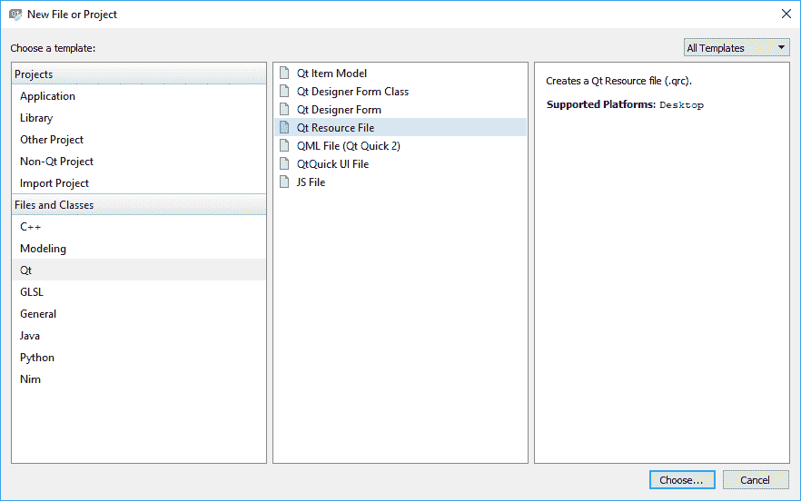
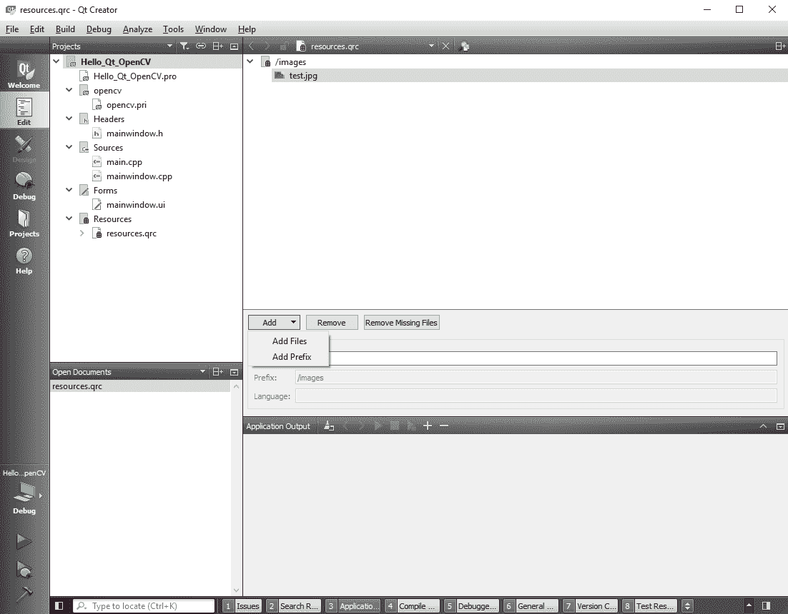
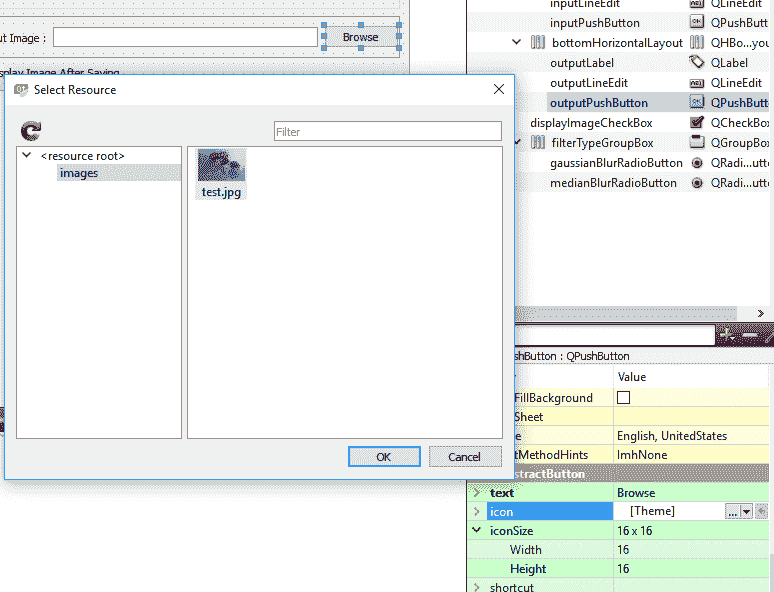
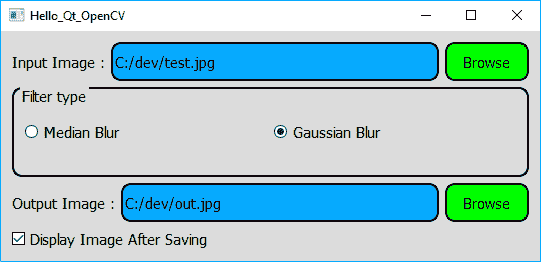
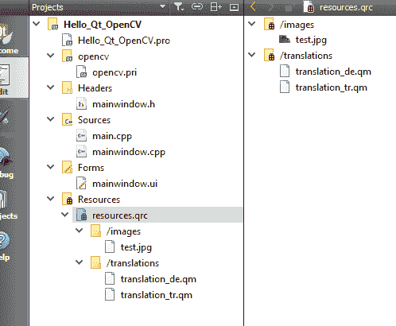
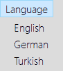
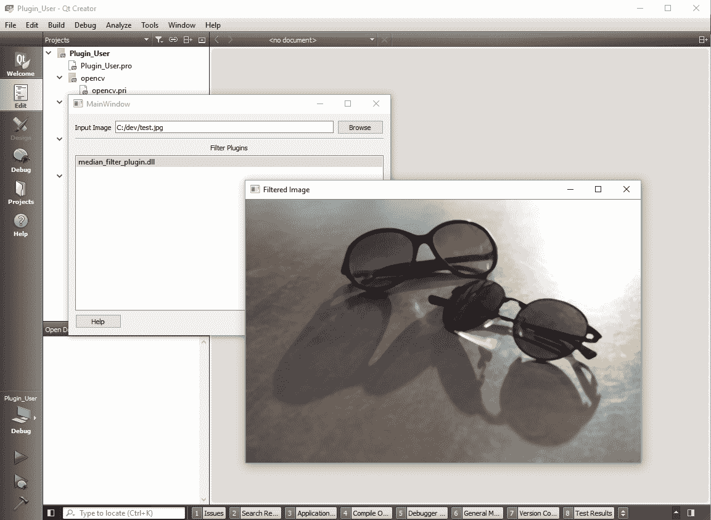

# 三、创建一个全面的 Qt + OpenCV 项目

由于某些随机情况，专业应用永远不会成为专业。 它们从一开始就是这样设计的。 当然，说起来容易做起来难，但是如果您已经知道如何创建可以轻松扩展，维护，扩展和定制的应用的黄金法则，这仍然很容易。 黄金法则只是一个简单的概念，幸运的是 Qt 框架已经具有实现的手段，并且正在以模块化方式构建应用。 请注意，从这个意义上讲，模块化不仅意味着库或不同的源代码模块，而且在意义上说模块化是指应用的每个职责和功能都是独立于其他职责创建和构建的。 实际上，这正是 Qt 和 OpenCV 本身创建的方式。 即使来自不同背景的不同开发人员也可以很容易地扩展模块化的应用。 模块化的应用可以扩展为支持许多不同的语言，主题（样式或外观），或者更好的是，许多不同的功能。

在本章中，我们将承担一项非常重要且至关重要的任务，即为使用 Qt 和 OpenCV 框架的综合计算机视觉应用构建基础结构（或架构）。 您将学习如何创建 Qt 应用，这些应用即使在部署（交付给用户）后也可以扩展。 这实际上意味着很多事情，包括如何向应用添加新语言，如何向应用添加新样式，以及最重要的是如何构建基于插件的 Qt 应用，可以通过向其添加新插件来对其进行扩展。

我们将通过遍历 Qt 项目的结构和包含的文件，来了解构建 Qt 应用时通常会发生什么情况。 然后，我们将了解 Qt 和 OpenCV 中一些使用最广泛的设计模式，以及这两个框架如何享受使用这些设计模式的优势。 然后，我们将学习如何创建可以使用插件扩展的应用。 我们还将学习有关在应用中添加新样式和新语言的信息。 在本章结束时，我们将能够创建一个全面的计算机视觉应用的基础，该应用是跨平台，多语言，基于插件的，并且具有可自定义的外观。 此基础应用将在接下来的两章中扩展：第 4 章，“`Mat`和`QImage`”和第 5 章，“图形视图框架”，然后在本书的其余部分中使用插件，尤其是在第 6 章，“OpenCV 中的图像处理”之后，我们将开始深入研究计算机视觉主题和 OpenCV 库。

在本章中，我们将介绍以下主题：

*   Qt 项目的结构和 Qt 构建过程
*   Qt 和 OpenCV 中的设计模式
*   Qt 应用中的样式
*   Qt 应用中的语言
*   如何使用 Qt Linguist 工具
*   如何在 Qt 中创建和使用插件

# 背景

在第 2 章，“创建我们的第一个 Qt 和 OpenCV 项目”中，您学习了如何创建一个简单的 Qt + OpenCV 应用`Hello_Qt_OpenCV`。 该项目几乎包括 Qt 提供的所有基本功能，尽管我们没有过多地讨论如何将项目构建到具有用户界面和（几乎可以接受）行为的应用中。 在本节中，您将了解单击“运行”按钮时幕后发生的情况。 这将帮助我们更好地了解 Qt 项目的结构以及项目文件夹中每个文件的用途。 首先，打开项目文件夹，并逐个浏览几个文件。 因此，我们在`Hello_Qt_OpenCV`文件夹中包含以下内容：

```cpp
    Hello_Qt_OpenCV.pro 
    Hello_Qt_OpenCV.pro.user 
    main.cpp 
    mainwindow.cpp 
    mainwindow.h 
    mainwindow.ui 
```

`Hello_Qt_OpenCV.pro`列表中的第一个文件基本上是构建项目时 Qt 处理的第一个文件。 这称为 **Qt 工程文件**，内部的 Qt 程序`qmake`负责处理该文件。 让我们看看它是什么。

#`qmake`工具

`qmake`工具是一个程序，可使用`*.pro`文件中的信息来帮助创建 makefile。 这仅意味着，`qmake`使用非常简单的语法（相对于其他`make`系统中更复杂的语法），生成了正确编译和构建应用所需的所有命令，并将所有生成的文件放入`Build`文件夹中 。

生成 Qt 项目时，它将首先创建一个新的生成文件夹，默认情况下，该文件夹与项目文件夹位于同一级别。 在我们的情况下，此文件夹应具有类似于`build-Hello_Qt_OpenCV-Desktop_Qt_5_9_1_*-Debug`的名称，其中`*`可以不同，具体取决于平台，您可以在项目文件夹所在的同一文件夹中找到它。 Qt（使用`qmake`和其他一些您将在本章中学习的工具）和 C++ 编译器生成的所有文件都位于此文件夹及其子文件夹中。 这称为项目的`Build`文件夹。 这也是创建和执行应用的地方。 例如，如果您使用的是 Windows，则可以在`Build`文件夹的`debug`或`release`子文件夹中找到`Hello_Qt_OpenCV.exe`文件（在许多其他文件中）。 因此，从现在开始，我们将该文件夹（及其子文件夹）称为`Build`文件夹。

例如，我们已经知道在 Qt PRO 文件中包含以下行会导致在我们的应用中添加 Qt 的`core`和`gui`模块：

```cpp
    QT += core gui 
```

让我们在`Hello_Qt_OpenCV.pro`文件中进一步浏览； 以下几行立即引起注意：

```cpp
    TARGET = Hello_Qt_OpenCV 
    TEMPLATE = app 
```

这些行仅表示`TARGET`名称为`Hello_Qt_OpenCV`，这是我们项目的名称，`TEMPLATE`类型`app`表示我们的项目是一个应用。 我们还有以下内容：

```cpp
    SOURCES += \ 
        main.cpp \ 
        mainwindow.cpp 
    HEADERS += \ 
        mainwindow.h 
    FORMS += \ 
        mainwindow.ui 
```

很明显，这就是在项目中包含头文件，源文件和用户界面文件（窗体）的方式。 我们甚至将自己的代码添加到 PRO 文件中，如下所示：

```cpp
    win32: { 
      include("c:/dev/opencv/opencv.pri") 
    } 
    unix: !macx{ 
      CONFIG += link_pkgconfig 
      PKGCONFIG += opencv 
    } 
    unix: macx{ 
      INCLUDEPATH += "/usr/local/include" 
      LIBS += -L"/usr/local/lib" \ 
    -lopencv_world 
   } 
```

您已经了解到，这就是 Qt 如何查看 OpenCV 并将其用于 Qt 项目中。 在 Qt 帮助索引中搜索`qmake Manual`，以获取有关`qmake`中所有可能的命令和功能的更多信息，以及有关其工作方式的更多详细信息。

`qmake`处理完我们的 Qt 项目文件后，它开始寻找项目中提到的源文件。 自然地，每个 C++ 程序在其源文件之一（不在头文件中）中都具有`main`函数（单个且唯一的`main`函数），我们的应用也不例外。 我们的应用的`main`函数是由 Qt Creator 自动生成的，它位于`main.cpp`文件中。 让我们打开`main.cpp`文件，看看其中包含什么：

```cpp
    #include "mainwindow.h" 
    #include <QApplication> 
    int main(int argc, char *argv[]) 
    { 
      QApplication a(argc, argv); 
      MainWindow w; 
      w.show(); 
      return a.exec(); 
    } 
```

前两行用于包含我们当前的`mainwindow.h`标头和`QApplication`标头文件。 `QApplication`类是负责控制应用的控制流，设置等的主要类。 在`main`函数内，您在此处看到的是 Qt 如何创建`Event Loop`以及其底层信号/时隙机制和事件处理系统如何工作的基础：

```cpp
    QApplication a(argc, argv); 
    MainWindow w; 
    w.show(); 
    return a.exec(); 
```

为了最简单地描述它，创建了`QApplication`类的实例，并将应用参数（通常通过命令行或终端传递）传递给名为`a`的新实例。 然后，创建我们的`MainWindow`类的实例，然后将其显示出来。 最后，调用`QApplication`类的`exec()`函数，以便应用进入主循环，并保持打开状态直到关闭窗口。

要了解事件循环的工作原理，请尝试删除最后一行，看看会发生什么。 当您运行应用时，您可能会注意到该窗口实际上只显示了很短的时间，然后立即关闭。 这是因为我们的应用不再具有事件循环，它立即到达应用的末尾，并且所有内容都从内存中清除，因此该窗口被关闭。 现在，将那行写回去，正如您所期望的，窗口保持打开状态，因为仅当在代码中的某个地方（任何地方）调用了`exit()`函数时，`exec()`函数才返回，并且它返回由`exit()`设置的值 ]。

现在，让我们继续下三个文件，它们具有相同的名称，但扩展名不同。 它们是`mainwindow`标头，源和用户界面文件。 现在，您将在第 2 章，“创建我们的第一个 Qt 和 OpenCV 项目”中了解负责代码和应用程​​序用户界面的实际文件。 这给我们带来了另外两个 Qt 内部工具，称为**元对象编译器**和**用户界面编译器**。

# 元对象编译器（MOC）

我们已经知道，标准 C++ 代码中没有信号和插槽之类的东西。 那么，如何通过使用 Qt 在 C++ 代码中拥有这些附加功能呢？ 这还不是全部。 稍后您将学习到，您甚至可以向 Qt 对象添加新属性（称为**动态属性**），并执行类似的许多其他操作，这不是标准 C++ 编程的功能。 好了，这些可以通过使用名为`moc`的 Qt 内部编译器来使用。 在将 Qt 代码实际传递给真正的 C++ 编译器之前，`moc`工具会处理您的类头文件（在我们的示例中为`mainwindow.h`文件），以生成启用上述 Qt 特定功能所需的代码。 您可以在`Build`文件夹中找到这些生成的源文件。 他们的名字以`moc_`开头。

您可以在 Qt 文档中阅读有关`moc`工具的全部信息，但是这里值得一提的是`moc`搜索具有 Qt 类定义且包含`Q_OBJECT`宏的所有头文件。 该宏必须始终包含在想要支持信号，插槽和其他 Qt 支持功能的 Qt 类中。

这是我们在`mainwindow.h`文件中所包含的内容：

```cpp
    ... 
    class MainWindow : public QMainWindow 
    { 
      Q_OBJECT 
      public: 
       explicit MainWindow(QWidget *parent = 0); 
     ~MainWindow(); 
    ... 
```

如您所见，我们的自动生成的类头文件在其私有部分中已经具有`Q_OBJECT`宏。 因此，这基本上是创建作为`QObject`（或任何其他 Qt 对象）的子类的类（不仅是窗口类，而且一般是任何 Qt 类）的标准方法，该类将支持 Qt 支持的功能，例如信号和插槽。

现在，让我们继续看看如何通过 C++ 代码访问 Qt 用户界面文件中的小部件。 如果您尝试以`Edit`模式或任何其他文本编辑器查看`mainwindow.ui`文件，则实际上它们是仅包含属性和一些其他信息的 XML 文件，这些信息仅与小部件的显示方式有关。 答案在于最终的 Qt 内部编译器，您将在本章中对其进行了解。

# 用户界面编译器（UIC）

每当构建带有用户界面的 Qt 应用时，就会执行称为`uic`的 Qt 内部工具来处理`*.ui`文件并将其转换为可在 C++ 代码中使用的类和源代码。 在我们的情况下，`mainwindow.h`被转换为`ui_mainwindow.h`文件，您可以再次在`Build`文件夹中找到该文件。 您可能已经注意到了这一点，但是让我们提到您的`mainwindow.cpp`文件已经包含了此头文件。 检查文件的最顶部，您会发现以下两个包含行：

```cpp
    #include "mainwindow.h" 
    #include "ui_mainwindow.h" 
```

您已经知道`mainwindow.h`文件的位置和位置（在`Project`文件夹中），并且刚刚了解到`ui_mainwindow.h`实际上是位于`Build`文件夹内的生成的源文件。

如果查看`ui_mainwindow.h`文件的内容，您会注意到一个名为`Ui_MainWindow`的类，它具有两个函数：`setupUi`和`retranslateUi`。 `setupUi`函数已自动添加到`mainwindow.h`函数中的`MainWindow`类构造器中。 该函数仅负责根据`mainwindow.ui`文件中的设置在用户界面上进行所有设置。 您将在本章稍后的内容中了解`retranslateUi`函数以及在制作多语言 Qt 应用时如何使用它。

将所有 Qt 生成的文件都保存在`Build`文件夹中之后，将它们传递给 C++ 编译器，就像其他任何 C++ 程序一样，进行编译，然后链接到`Build`文件夹中以创建我们的应用。 Windows 用户应注意，使用 Qt Creator 运行应用时，所有 DLL 文件路径均由 Qt Creator 解析，但是如果尝试从`Build`文件夹中运行程序，则会遇到多个错误消息，并且您的应用会崩溃或根本就不会启动。 您将在第 10 章，“调试和测试”中学习如何解决此问题，在这里您将学习如何正确地将应用交付给用户。

# 设计模式

即使我们假设本书的读者不是“设计模式丹尼尔”，但提醒自己为什么存在设计模式以及为什么成功的框架（例如 Qt）广泛使用不同的设计模式仍然是一个很好的主意。 好吧，首先，设计模式只是软件开发任务的许多解决方案之一，它不是唯一的解决方案； 实际上，在大多数情况下，它甚至不是最快的解决方案。 但是，设计模式绝对是解决软件开发问题的最结构化的方式，它有助于确保对添加到程序中的所有内容都使用一些预定义的类似于模板的结构。

设计模式具有用于各种问题的名称，例如创建对象，它们如何运行，如何处理数据等等。 埃里克·伽玛（Eric Gamma），理查德·赫尔姆（Richard Helm），拉尔夫·E·约翰逊（Ralph E. Johnson）和约翰·弗利斯赛德（John Vlissides）（称为*四人帮*）在其名为《设计模式：可重用的面向对象软件基础》的书中描述了许多最广泛使用的设计模式。 被认为是计算机科学中设计模式的实际参考书。 如果您不熟悉设计模式，那么在继续本章之前，您应该花一些时间来学习该主题。 了解软件开发中的反模式也是一个好主意。 如果您是本主题的新手，可能会因发现某些反模式的普遍性而感到惊讶，并且确保始终避免使用反模式至关重要。

以下是 Qt 和 OpenCV 框架中使用的一些最重要的设计模式（按字母顺序排列），以及实现这些设计模式的类或函数的简要说明和一些示例。 请密切注意下表中的“示例案例”列，以概述与每个设计模式相关的某些类或函数。 尽管如此，在本书的学习过程中以及各种示例中，您将学习动手实践中使用的类：

由于 OpenCV 框架的性质以及它不是用于构建日常生活应用，复杂的用户界面等的通用框架，因此它无法实现 Qt 使用的所有设计模式， 而且，相比之下，OpenCV 仅实现了这些模式的一小部分。 尤其是由于 OpenCV 追求速度和效率的目标，在大多数情况下，首选全局函数和类似底层的实现。 然而，只要速度和效率不是目标，就有一些 OpenCV 类可以实现设计模式，例如抽象工厂。 有关示例，请参见“示例案例”列。

| **设计模式** | **说明** | **示例案例** |
|  --- | --- | --- |
| 抽象工厂 | 这可用于创建所谓的工厂类，该工厂类能够以各种可能的方式创建对象并控制新对象的创建，例如防止对象具有超过定义数量的实例。 | 在本章中，我们将学习如何使用这种设计模式来编写基于插件的 Qt 应用。`DescriptorMatcher`抽象类中的`create()`函数是 OpenCV 中此设计模式的示例。 |
| 命令 | 使用此设计模式，可以用对象表示动作。 这允许诸如组织动作顺序，记录动作，还原动作等功能。 | `QAction`：此类允许创建特定的动作并将其分配给小部件。例如，可以使用`QAction`类创建带有图标和文本的`Open File`操作，然后可以将其分配给主菜单项和键盘快捷键（例如`Ctrl + O`），依此类推。 |
| 组合 | 这用于创建由子对象组成的对象。 当制作可以由许多简单对象组成的复杂对象时，这特别有用。 | `QObject`：这是所有 Qt 类的基础。`QWidget`：这是所有 Qt 小部件的基础。任何具有树状设计架构的 Qt 类都是组合模式的示例。 |
| 外观（或外观） | 通过提供更简单的接口，可以将其用于封装操作系统（或与此相关的任何系统）的低级功能。 包装器和适配器设计模式的定义非常相似。 | `QFile`：这些可用于读取/写入文件。基本上，所有 Qt 类都是围绕操作系统的低级 API 的包装，它们都是外观设计模式的示例。 |
| 蝇量（或桥接或私有实现） | 此设计模式的目标是避免数据复制并在相关对象之间使用共享数据（除非另有需要）。 | `QString`：可用于存储和操作 Unicode 字符串。实际上，许多 Qt 类都喜欢这些设计模式，这些设计模式有助于在需要对象副本时将指针传递到共享数据空间，从而导致更快的对象复制和更少的内存空间使用。 当然，具有更复杂的代码。 |
| 备忘 | 这可用于保存和（以后）加载对象的状态。 | 这种设计模式等同于编写一个能够存储 Qt 对象的所有属性并还原它们以创建新属性的类。 |
| 元对象（或反射） | 在此设计模式中，所谓的元对象用于描述对象的详细信息，以便更健壮地访问该对象。 | `QMetaObject`：这仅包含有关 Qt 类的元信息。涵盖 Qt 的元对象系统的细节不在本书的讨论范围之内，但是简单地说，每个 Qt 程序都首先使用 Qt 元对象编译器（`MOC`）进行编译以生成所需的元对象，然后再由实际的对象进行编译。 C++ 编译器。 |
| 单态 | 这允许同一类的多个实例以相同的方式行为。 （通常，通过访问相同的数据或执行相同的功能。） | `QSettings`：用于提供应用设置的保存/加载。我们已经在第 2 章，“创建我们的第一个 Qt 和 OpenCV 项目”中使用了`QSettings`类，以加载和保存相同类的两个不同实例。 |
| MVC（模型视图控制器） | 这是一种广泛使用的设计模式，用于将应用或数据存储机制（模型）的实现与用户界面或数据表示形式（视图）和数据操作（控制器）分开。 | `QTreeView`：这是模型视图的树状实现。`QFileSystemModel`：用于基于本地文件系统的内容获取数据模型。`QFileSystemModel`（或任何其他`QAbstractItemModel`）与`QTreeView`（或任何其他`QAbstractItemView`）的组合可以导致 MVC 设计模式的实现。 |
| 观察者（或发布/订阅） | 此设计模式用于使对象可以监听（或观察）其他对象的变化并做出相应的响应。 | `QEvent`：这是所有 Qt 事件类的基础。将`QEvent`（及其所有众多子类）视为观察者设计模式的低级实现。 另一方面，Qt 支持`signal`和`slot`机制，这是使用观察者设计模式的更方便，更高级的方法。我们已经在第 2 章，“创建第一个 Qt 和 OpenCV 项目”中使用了`QCloseEvent`（`QEvent`的子类）。 |
| 序列化器 | 在创建可用于读取或写入其他对象的类（或对象）时使用此模式。 | `QTextStream`：可用于在文件或其他 IO 设备中读取和写入文本。`QDataStream`：可用于从 IO 设备和文件读取或写入二进制数据。 |
| 单例 | 这可用于将类限制为仅单个实例。 | `QApplication`：可用于以各种方式处理 Qt 小部件应用。确切地说，`QApplication`中的`instance()`函数（或全局`qApp`指针）是单例设计模式的示例。OpenCV 中的`cv::theRNG()`函数（用于获取默认的**随机数生成器**（**RNG**））是单例实现的示例。 请注意，RNG 类本身不是单例。 |

参考文献：

```cpp
Design Patterns: Elements of Reusable Object-Oriented Software, by Eric Gamma, Richard Helm, Ralph E. Johnson and John Vlissides (referred to as the Gang of Four)

An Introduction to Design Patterns in C++ with Qt, second Edition, by Alan Ezust and Paul Ezust
```

通常，前面的列表不应该被视为设计模式的完整列表，因为它仅关注 Qt 和 OpenCV 设计模式，而仅针对本书而言就足够了。 如果您对该主题感兴趣，请考虑阅读提到的参考书，但是正如前面所提到的，就本书而言，您只需要上述清单即可。

检查上一个列表中提到的每个类的文档页面是一个很好的主意。 您可以为此使用 Qt Creator 帮助模式，并在索引中搜索每个类，查看每个类的代码示例，甚至尝试自己使用它们。 这不仅是学习 Qt 的最佳方法，而且是学习不同设计模式的实际实现和行为的最佳方法之一。

# Qt 资源系统

在下一部分中，您将学习如何向我们的应用添加样式和多语言支持，但是在此之前，我们必须熟悉 Qt 资源系统。 简而言之，这是 Qt 中将字体，图标，图像，翻译文件，样式表文件等资源文件添加到我们的应用（和库）中的方法。

Qt 支持使用`*.qrc`文件（资源收集文件）进行资源管理，这些文件只是 XML 文件，其中包含有关需要包含在我们的应用中的资源文件的信息。 让我们看一个简单的示例，并在我们的`Hello_Qt_openCV`应用中包含一个图标，以更好地了解 Qt 资源系统的工作方式：

1.  确保已在 Qt Creator 中打开了`Hello_Qt_OpenCV`项目。 选择文件，然后选择新建文件或项目。 在新文件窗口中，确保从左侧的第二个列表中选择 Qt，然后选择 Qt 资源文件。 考虑以下屏幕截图：



2.  单击“选择...”按钮，然后在下一个屏幕中，将名称设置为`resources`。 默认情况下，该路径应设置为您的项目文件夹，因此请保持原样。 单击下一步，然后单击完成。 最后，您将在项目中添加一个名为`resources.qrc`的新文件。 如果您在 Qt Creator 中打开此文件（通过右键单击并选择“在编辑器中打开”），将在 Qt Creator 中显示资源编辑器。
3.  在这里，您可以使用“添加”按钮打开以下两个选项：

新增档案

添加前缀

在这里，文件就是您要添加到项目中的任何文件。 但是，前缀基本上是一个伪文件夹（如果需要，则是一个容器），其中包含许多文件。 请注意，这不一定表示项目文件夹中的文件夹或子文件夹，而仅仅是表示形式和对资源文件进行分组的一种方式。

4.  首先单击“添加前缀”，然后在“前缀”字段中输入`images`。
5.  然后，单击“添加文件”，然后选择所需的图像文件（就我们的示例而言，您计算机上的任何`*.jpg`文件都可以）。



在此示例中，我们使用了与第 1 章，“Qt 和 OpenCV 简介”和第 2 章，“创建我们的第一个 Qt 和 OpenCV 项目”。 请注意，资源文件应位于项目文件夹中或其中的子文件夹中。 否则，您将得到确认，如以下屏幕截图所示； 如果是这种情况，请单击复制，然后将资源文件保存在项目文件夹中：


而已。 现在，当您构建并运行`Hello_Qt_OpenCV`应用时，图像文件将包含在应用中，并且可以像操作系统上存在的文件一样进行访问。 但是，该路径与常规文件路径有些不同。 在我们的示例中，`test.jpg`文件的路径如下：

```cpp
   img/test.jpg 
```

您可以在 Qt Creator 中展开`*.qrc`文件，然后右键单击每个资源文件，然后选择“复制路径”或“复制 URL”选项以复制每个文件的路径或 URL。 只要需要常规路径，就可以使用该路径；只要需要资源文件的 URL（Qt 中的`QUrl`类），URL 就会有用。 需要特别注意的是，由于 Qt 资源系统是 Qt 的内部功能，因此 OpenCV 可能无法使用这些路径并访问资源中的文件。 但是，这些文件仅供应用本身使用（通常用于与用户界面相关的任务），因此您可能永远都不需要将它们与 OpenCV 一起使用。

现在，您可以通过将新图像文件设置为按钮图标来尝试新图像文件。 尝试选择用户界面上的任何按钮，然后在属性编辑器中找到`icon`属性，然后通过按下旁边的小下拉按钮选择“选择资源”。 现在，您只需选择添加为按钮图标的图像即可：



这基本上是关于如何将图标设置为支持图标的 Qt 小部件的教程。 当您想在应用中包含任何其他类型的资源并在运行时使用它时，逻辑完全相同。 您只需要假设 Qt 资源系统是某种辅助文件系统，然后使用其中的文件，就像在文件系统上使用常规文件一样。

# 设置应用的样式

Qt 支持使用`QStyle`类和 Qt 样式表的应用中的样式。 `QStyle`是 Qt 中所有样式的基类，它封装了 Qt 用户界面的样式。 涵盖`QStyle`类不在本书的讨论范围内，但仍应注意，创建`QStyle`的子类并在其中实现不同的样式函数最终是更改外观的最有效方法。 Qt 应用。 但是，Qt 还提供样式表来样式应用。 Qt 样式表的语法几乎与 HTML **CSS**（**级联样式表**）相同，这是网页样式中不可分割的一部分。

CSS 是一种样式语言，可用于定义用户界面上对象的外观。 通常，使用 CSS 文件有助于将网页的样式与基础实现分开。 Qt 在其样式表中使用了一种非常相似的方法来描述小部件的外观。 如果您熟悉 CSS 文件，那么 Qt 样式表对您来说将是小菜一碟； 但是，即使您是第一次接触该概念，也请放心，这是一种易于，简单且快速学习的方法。

让我们通过一个简单的示例来确切地了解什么是样式表以及如何在 Qt 中使用它。 让我们再次回到我们的`Hello_Qt_OpenCV`项目。 打开项目并转到设计器。 选择窗口上的任何窗口小部件，或单击一个空的位置以选择窗口窗口小部件本身，然后可以找到一个名为`styleSheet`的属性。 基本上，每个 Qt 窗口小部件（或`QWidget`子类）都包含一个`styleSheet`属性，可以将其设置为定义每个窗口小部件的外观。

单击`inputPushButton`小部件，并将其`styleSheet`属性设置为以下内容：

```cpp
    border: 2px solid #222222; 
    border-radius: 10px; 
    background-color: #9999ff; 
    min-width: 80px; 
    min-height: 35px; 
```

用`outputPushButton`做同样的事情； 但是，这次，在`styleSheet`属性中使用以下命令：

```cpp
    border: 2px solid #222222; 
    border-radius: 10px; 
    background-color: #99ff99; 
    min-width: 80px; 
    min-height: 35px; 
```

在设计器中设置这些样式表时，您将看到两个按钮的新外观。 这就是 Qt 中简单的样式。 唯一需要做的就是知道可以将哪种样式更改应用于任何特定的窗口小部件类型。 在前面的示例中，我们可以更改边框的外观，背景色和`QPushButton`的最小可接受大小。 要大致了解可以将哪种样式应用于任何窗口小部件，可以在 Qt 帮助模式下阅读《Qt 样式表参考》。 它应该已经在您的计算机上，您可以随时从“帮助”索引中脱机访问它。 在那里，您将找到 Qt 小部件的所有可能样式，其中包含清晰的示例，您可以根据自己的需求进行复制和修改，以及想要在应用中拥有什么样的外观。 这是我们刚刚使用的两个简单样式表的结果。 如您所见，我们现在的浏览按钮外观有所不同：


在前面的示例中，我们还避免在样式表中设置适当的样式规则。 Qt 样式表中的样式规则由选择器和声明组成。 选择器指定将使用样式的小部件，而声明只是样式本身。 同样，在前面的示例中，我们仅使用了一个声明，并且选择器是（隐式地）获得样式表的小部件。 这是一个例子：

```cpp
    QPushButton 
    { 
      border: 2px solid #222222; 
      border-radius: 10px; 
      background-color: #99ff99; 
      min-width: 80px; 
      min-height: 35px; 
    } 
```

在这里，`QPushButton`（或者实际上是`{`之前的所有内容）是选择器，并且`{`和`}`之间的代码部分是声明。

现在，让我们看一下在 Qt 中设置样式表时的一些重要概念。

# 选择器类型

以下是可以在 Qt 样式表中使用的选择器类型。 明智而有效地使用它们可以极大地减少样式表所需的代码量，并改变 Qt 应用的外观：

| **选择器类型** | **范例** | **说明** |
| --- | --- | --- |
| 通用 | `*` | 这些都是小部件 |
| 类型 | `QPushButton` | 这些是指定类型及其子类的窗口小部件 |
| 属性 | `[text='Browse']` | 这些是具有指定属性设置为指定值的小部件 |
| 类 | `.QPushButton` | 这些是具有指定类型的小部件，但不是其子类 |
| ID | `#inputPushButton` | 这些是具有指定类型和`objectName`的小部件 |
| 后继 | `QDialog QPushButton` | 这些小部件是另一个小部件的后代（子代） |
| 子项 | `QDialog > QPushButton` | 这些小部件是另一个小部件的直接子代 |

# 子小部件

更好的是，子小部件是复杂小部件内的子小部件。 一个示例是`QPinBox`小部件上的向下和向上箭头按钮。 可以使用`::`运算符选择它们，如以下示例所示：

```cpp
    QSpinBox::down-button 
```

始终记得参考 Qt Creator 帮助模式下的“Qt 样式表参考”文章，以获取（或多或少）每个小部件的子控件的完整列表。 Qt 是一个不断发展的框架，并且会定期添加新功能，因此没有比它自己的文档更好的参考了。

# 伪状态

每个窗口小部件都可以具有某些伪状态，例如，悬停，按下等。 可以使用`:`运算符在样式表中选择它们，如以下示例所示：

```cpp
    QRadioButton:!hover { color: black } 
```

就像子控件一样，请始终参考 Qt Creator 帮助模式下的 Qt 样式表参考，以获取每个小部件的适用伪状态列表。

# 级联

您可以为整个应用，父窗口小部件或子窗口小部件设置样式表。 在前面的示例中，我们仅设置了两个子小部件的样式表。 每个窗口小部件的样式都将取决于级联规则，这意味着每个窗口小部件还将获得在父窗口小部件或应用中设置的样式规则（如果为其设置了样式表）。 我们可以利用这一事实来避免重复设置整个应用或每个小部件中特定窗口通用的样式规则。

现在，让我们尝试`MainWindow`中的以下样式表，它在一个简单的示例中结合了您学到的所有知识。 确保删除所有先前设置的样式表（对于两个“浏览”按钮），并在窗口小部件的`stylesheet`属性中简单地使用以下内容：

```cpp
    * 
    { 
      font: 75 11pt; 
      background-color: rgb(220, 220, 220); 
    } 
    QPushButton, QLineEdit, QGroupBox 
    { 
      border: 2px solid rgb(0, 0, 0); 
      border-radius: 10px; 
      min-width: 80px; 
      min-height: 35px; 
    } 
    QPushButton 
    { 
      background-color: rgb(0, 255, 0); 
    } 
    QLineEdit 
    { 
      background-color: rgb(0, 170, 255); 
    } 
      QPushButton:hover, QRadioButton:hover, QCheckBox:hover 
    { 
       color: red; 
    } 
    QPushButton:!hover, QRadioButton:!hover, QCheckBox:!hover 
    { 
      color: black; 
    } 
```

如果立即运行应用，则可以看到外观上的更改。 您还将注意到，即使“关闭确认”对话框小部件的样式也已更改，其原因仅仅是因为我们在其父窗口中设置了样式表。 这是屏幕截图：



不用说，您可以通过将样式表保存在文本文件中，然后在运行时加载并设置样式表来执行相同的操作，就像我们在本章后面为综合计算机视觉应用的基础构建时所做的那样。 如本章前面所述，您甚至可以在应用中存储默认样式表（请参阅 Qt 资源系统），并默认加载它，如果在自定义文件的特定位置存储了自定义文件，则可以跳过该样式表。 电脑。 这样，您可以轻松拥有可定制的应用。 您甚至可以拆分任务，并要求专业设计师为您提供样式表，以便您可以在应用中使用它。 这实质上就是 Qt 应用中样式的简单程度。

要获得更多特定于样式表的语法和帮助，最好始终关注 Qt Creator 帮助模式下的样式表语法文章，因为 Qt 样式表基本上是特定于 Qt 的，并且在某些情况下与标准 CSS 有所不同。

# 多国语言支持

在本节中，您将学习如何使用 Qt 框架创建支持多种语言的应用。 实际上，所有这些都归结为非常易于使用的单个类。 `QTranslator`类是主要的 Qt 类，负责处理输出（显示）文本的国际化。 您只需要确保以下几点：

1.  在构建项目时，请使用默认语言（例如英语）。 这意味着，只需对显示的所有内容使用默认语言的句子和单词即可。
2.  确保`tr()`函数中包含代码中的所有文字语句，或者具体来说，选择其他语言时需要翻译的所有文字语句。

例如，在代码中，如果您需要编写诸如`Open Input Image`之类的文字语句（就像在`Hello_Qt_OpenCV`示例中所做的那样），只需将其传递给`tr`函数并编写`tr("Open Input Image")`。 设计器不是这种情况，仅适用于代码内文字字符串。 在设计器中设置属性时，只需使用文字字符串即可。

3.  确保在项目文件中指定翻译文件。 为此，您需要使用`TRANSLATIONS`来指定它们，就像项目文件中的`SOURCES`和`HEADERS`一样。

例如，如果要在应用中使用德语和土耳其语翻译，请将以下内容添加到项目（`*.PRO`）文件中：

```cpp
        TRANSLATIONS = translation_de.ts translation_tr.ts 
```

确保对每个翻译文件始终使用清晰的名称。 即使您可以随意命名，也最好使用包含的语言代码来命名它们（`tr`表示土耳其语，`de`表示德语，等等），如前面的示例所示。 这也有助于 Qt Linguist 工具（您将在后面学习）了解翻译的目标语言。

4.  使用 Qt 的`lupdate`工具创建 TS 文件（如果已经存在，则更新它们）。 `lupdate`是 Qt 工具，可在所有源代码和 UI 文件中搜索可翻译的文本，然后创建或更新上一步中提到的 TS 文件。 负责翻译应用的人员可以使用 Qt Linguist 工具轻松打开 TS 文件，并专注于通过简单的用户界面来翻译应用。

`lupdate`位于 Qt 安装的`bin`文件夹内。 例如，在 Windows OS 上，它的路径类似于此：

```cpp
 C:\Qt\Qt5.9.1\5.9.1\msvc2015\bin 
```

您可以从 Qt Creator 中在项目中执行`lupdate`，只需在主菜单中单击“工具/外部/语言学家/更新翻译”（lupdate）。 Windows 用户的重要注意事项：如果在运行`lupdate`后遇到任何问题，则可能是由于 Qt 安装故障所致。 要解决此问题，只需使用开发环境的命令提示符运行`lupdate`。 如果按照本书中的说明进行操作，则可以从开始菜单执行`Developer Command Prompt for VS2015`，然后使用`cd`命令切换到项目文件夹，然后运行`lupdate`，如此处所示（示例案例为`Hello_Qt_OpenCV` 我们之前创建的项目）：

```cpp
        C:\Qt\Qt5.9.1\5.9.1\msvc2015\bin\lrelease.exe Hello_Qt_OpenCV.pro 
```

运行此命令后，如果进入项目文件夹，您会注意到现在已经创建了先前在项目文件中指定的 TS 文件。 随着您的应用越来越大，定期运行`lupdate`非常重要，它可以提取需要翻译的新字符串，并进一步扩展多语言支持。

5.  使用 Qt Linguist 工具翻译所有必需的字符串。 它已安装在您的计算机上，因为它是默认 Qt 安装的一部分。 只需选择文件/打开，然后从`Project`文件夹中选择所有 TS 文件（刚创建的）并打开它们。 如果到目前为止，您已经遵循了有关`Hello_Qt_OpenCV`项目的所有说明，那么在 Qt Linguist 中打开 TS 文件后，您应该看到以下屏幕：


Qt Linguist 允许快速，轻松地翻译项目中所有可翻译的元素。 只需使用显示的所有语言为每个项目编写翻译，然后使用顶部的工具栏将其标记为`Done`。 在退出 Qt Linguist 工具之前，请确保进行保存。

6.  使用转换后的 TS 文件创建压缩的 QM 文件和二进制 Qt 语言文件。 为此，您需要使用 Qt `lrelease`工具。

使用`lrelease`与`lupdate`相同，您在前面的步骤中了解到。 只需将所有`lupdate`命令替换为`lrelease`，就可以了。

7.  将 QM 文件（二进制语言文件）添加到您的应用资源中。

您已经学习了如何使用 Qt 资源系统。 只需创建一个称为`Translations`的新前缀，然后在该前缀下添加新创建的 QM 文件。 如果正确完成，则项目中应包含以下内容：



8.  现在，您可以开始使用`QTranslator`类在您的应用中使用多种语言，还可以在运行时在各种语言之间切换。 让我们再次回到示例项目`Hello_Qt_OpenCV`。 在应用中使用翻译器有多种方法，但是，现在，我们将从最简单的方法开始。 首先将`QTranslator`包含文件添加到`mainwindow.h`文件中，并在`MainWindow`类中定义两个私有`QTranslator`对象，如下所示：

```cpp
        QTranslator *turkishTranslator; 
        QTranslator *germanTranslator;  
```

9.  在调用`loadSettings`函数之后，将以下内容添加到`MainWindow`构造器代码中：

```cpp
        turkishTranslator = new QTranslator(this); 
        turkishTranslator 
          ->load(":/translations/translation_tr.qm"); 
        germanTranslator = new QTranslator(this); 
        germanTranslator 
          ->load(":/translations/translation_de.qm"); 

```

10.  现在，是时候向我们的`Hello_Qt_OpenCV`项目添加一个主菜单，并允许用户在这些语言之间进行切换了。 您只需在 Qt Creator 设计模式下右键单击窗口，然后选择“创建菜单栏”即可。 然后，在顶部菜单栏中添加一个名为`Language`的项目。 只需单击并键入以下内容，即可向其中添加三个子项目：

现在，您应该有一个类似于以下内容的主菜单：



在设计器的底部，您可以找到动作编辑器。 显然，您现在在此处有三个条目，这些条目是在创建主菜单时自动创建的。 它们每个都对应于您在主菜单中输入的每种语言名称。

11.  右键单击“土耳其语”，然后选择“转到插槽”，然后从列表中选择`trigger()`，然后单击“确定”。 换句话说（如您在第 2 章，“创建我们的第一个 Qt 和 OpenCV 项目”中所了解的），为`actionTurkish`对象的触发插槽编写以下代码行：

```cpp
        void MainWindow::on_actionTurkish_triggered() 
        { 
          qApp->installTranslator(turkishTranslator); 
        }      
```

12.  为`actionGerman`对象添加以下行。 基本上，重复说明，但将其适应于`actionTurkish`对象：

```cpp
        void MainWindow::on_actionGerman_triggered() 
       { 
         qApp->installTranslator(germanTranslator); 
       } 
```

13.  并对`actionEnglish`对象执行相同的操作。 这次，您需要从应用中删除翻译器，因为英语是我们应用的默认语言：

```cpp
        void MainWindow::on_actionEnglish_triggered() 
        { 
         qApp->removeTranslator(turkishTranslator); 
         qApp->removeTranslator(germanTranslator); 
       } 
```

14.  好了，我们现在就可以在我们的 Qt 应用中找到所有与翻译有关的内容，除了我们需要确保屏幕上的项目已重新翻译并基本上已重新加载。 为此，我们需要使用`QMainWindow`类的`changeEvent`。 每次使用前面的`installTranslator`和`removeTranslator`函数安装或移除翻译器时，`Language Change`事件都会发送到应用中的所有窗口。 要捕获此事件，并确保在语言更改时重新加载窗口，我们需要在程序中覆盖`changeEvent`函数。 只需将以下代码行添加到`mainwindow.h`文件中`MainWindow`类的受保护成员，就在您先前定义`closeEvent`的位置之后：

```cpp
        void changeEvent(QEvent *event); 
```

15.  现在，将以下代码片段添加到您的`mainwindow.cpp`文件中：

```cpp
        void MainWindow::changeEvent(QEvent *event) 
        { 
          if(event->type() == QEvent::LanguageChange) 
          { 
            ui->retranslateUi(this); 
          }  
          else 
          { 
            QMainWindow::changeEvent(event); 
          } 
        } 
```

前面的代码只是意味着，如果`change`事件是`Language Change`，则重新转换窗口，否则，一切都应照常进行。 `retranslateUi`函数是使用`UIC`生成的（请参阅本章的`UIC`部分），它只是根据应用中最新安装的`QTranslator`对象设置正确翻译的字符串。

而已。 现在，您可以运行您的应用，并尝试在两种语言之间切换。 我们已经完成了第一个真正的多语言应用。 重要的是要注意，您在本节中学到的内容基本上适用于每个 Qt 应用，并且是制作多语言应用的标准方法。 在应用中使用不同语言的更为定制的方式将遵循几乎相同的指令集，但是如果不使用资源文件将语言文件内置到应用中，则如果从磁盘上的某个位置加载语言会更好。 。 这具有更新翻译甚至添加新语言（具有更多代码）的优势，而不必重建应用本身。

# 创建和使用插件

在应用中使用插件是扩展应用的最强大方法之一，人们日常生活中使用的许多应用都受益于插件的功能。 插件只是一个库（Windows 上为`*.dll`，Linux 上为`*.so`等），可以在运行时加载并使用它来执行特定任务，但是当然，它不能像独立应用一样执行，这取决于使用它的应用。 在本书中，我们还将使用插件来扩展计算机视觉应用。

在本节中，我们将学习如何创建一个示例应用（称为`Image_Filter`），该应用简单地加载和使用计算机上指定文件夹中的插件。 但是，在此之前，我们将学习如何在 Qt 中创建同时使用 Qt 和 OpenCV 框架的插件，因为我们的插件很可能需要使用 OpenCV 库来做一些计算机视觉魔术。 所以，让我们开始吧。

首先，我们需要定义一组接口，以便我们的应用与插件对话。 与 C++ 中的接口等效的是带有纯虚函数的类。 因此，我们基本上需要一个接口，其中包含我们期望在插件中提供的所有功能。 通常，这就是创建插件的方式，这也是第三方开发人员可以为他人开发的应用编写插件的方式。 是的，他们知道插件的接口，只需要用实际执行某些功能的实际代码填充即可。

# 接口

该接口比乍看之下要重要得多。 是的，它基本上是一个什么都不做的类，但是，它列出了我们的应用在所有时间所需的所有插件的草图。 因此，我们需要确保从一开始就将所有必需的功能都包含在插件接口中，否则，以后几乎不可能添加，删除或修改功能。 由于目前我们正在处理一个示例项目，因此看上去可能并不那么严重，但是在实际项目中，这些通常是决定应用可扩展性的一些关键因素。 因此，既然我们知道了接口的重要性，就可以开始为示例项目创建一个接口。

打开 Qt Creator，并确保没有打开任何项目。 现在，从主菜单中选择“文件/新文件”或“项目”。 在出现的窗口中，从左侧列表（底部的列表）中选择 C++，然后选择`C++  Header File`。 输入`cvplugininterface`作为文件名，然后继续进行操作，直到进入代码编辑器模式。 将代码更改为以下内容：

```cpp
    #ifndef CVPLUGININTERFACE_H 
    #define CVPLUGININTERFACE_H 
    #include <QObject> 
    #include <QString> 
    #include "opencv2/opencv.hpp" 
    class CvPluginInterface 
    { 
      public: 
      virtual ~CvPluginInterface() {} 
      virtual QString description() = 0; 
      virtual void processImage(const cv::Mat &inputImage, 
         cv::Mat &outputImage) = 0; 
    }; 

   #define CVPLUGININTERFACE_IID "com.amin.cvplugininterface" 
   Q_DECLARE_INTERFACE(CvPluginInterface, CVPLUGININTERFACE_IID) 
   #endif // CVPLUGININTERFACE_H 
```

您可能已经注意到，类似于以下代码的行会自动添加到使用 Qt Creator 创建的任何头文件中：

```cpp
    #ifndef CVPLUGININTERFACE_H 
    #define CVPLUGININTERFACE_H 
    ... 
    #endif // CVPLUGININTERFACE_H 
```

这些只是确保在应用编译期间每个头文件仅被包含（并被处理）一次。 基本上，还有许多其他方法可以在 C++ 中实现相同的目标，但这是最广泛接受和使用的方法，尤其是 Qt 和 OpenCV 框架都获得了最高程度的跨平台支持。 与 Qt Creator 一起使用时，始终会自动将其添加到头文件中，而无需执行任何其他工作。

前面的代码基本上是 Qt 中插件接口所需的一切。 在示例接口中，我们只有两种简单类型的函数，我们需要插件来支持，但是正如我们稍后将要看到的那样，为了支持参数，语言等，我们需要的还不止这些。 但是，对于我们的示例，这应该足够了。

对于一般的 C++ 开发人员来说，一个非常重要的注意事项是前一个接口中的第一个公共成员，它在 C++ 中被称为虚拟析构器，它是许多人忘记包括而又不太注意的最重要方法之一， 因此，最好查看一下它的真实含义并记住它以避免内存泄漏，尤其是在使用 Qt 插件时：

```cpp
         virtual ~CvPluginInterface() {} 
```

基本上，任何具有虚拟方法并打算多态使用的 C++ 基类都必须包含虚拟析构器。 这有助于确保即使使用基类的指针访问子类中的析构器也可以调用它们（多态）。 不幸的是，对于大多数 C++ 编译器，在犯此常见 C++ 编程错误时，您甚至都不会收到警告。

因此，我们的插件接口包含一个名为`description()`的函数，该函数旨在返回任何插件的描述以及有关该插件的有用信息。 它还包含一个名为`processImage`的函数，该函数将`OpenCV Mat`类作为输入，并返回一个作为输出。 显然，在此函数中，我们希望每个插件执行某种图像处理，过滤等操作，然后将结果提供给我们。

之后，我们使用`Q_DECLARE_INTERFACE`宏将类定义为接口。 如果不包含此宏，Qt 将无法将我们的类识别为插件接口。 `CVPLUGININTERFACE_IID`应该是具有类似包名称格式的唯一字符串，但是您基本上可以根据自己的喜好进行更改。

确保将`cvplugininterface.h`文件保存到您选择的任何位置，然后将其关闭。 现在，我们将创建一个使用此接口的插件。 让我们使用先前在第 2 章，“创建我们的第一个 Qt 和 OpenCV 项目”时看到的 OpenCV 函数：`medianBlur`。

# 插件

现在，我们将创建一个名为`median_filter_plugin`的插件，该插件使用我们的`CvPluginInterface`接口类。 首先从主菜单中选择“文件”，然后选择“新建文件”或“项目”。 然后，选择“库”和“C++ 库”，如以下屏幕截图所示：


确保选择“共享库”作为“类型”，然后输入`median_filter_plugin`作为名称，然后单击“下一步”。 选择套件类型为桌面，然后单击前进。 在“选择所需的模块”页面中，确保仅选中`QtCore`，然后继续单击“下一步”（最后是“完成”），而不更改任何选项，直到最终进入 Qt Creator 的代码编辑器。

我们基本上创建了一个 Qt 插件项目，并且您可能已经注意到，插件项目的结构与到目前为止我们尝试过的所有应用项目非常相似（除了它没有 UI 文件），这是因为插件实际上不能与应用相同，只是它不能单独运行。

现在，将我们在上一步中创建的`cvplugininterface.h`文件复制到新创建的插件项目的文件夹中。 然后，只需在“项目”窗格中右键单击项目文件夹，然后从弹出菜单中选择“添加现有文件”，即可将其添加到项目中，如下所示：


我们需要告诉 Qt 这是一个插件，而不仅仅是任何库。 为此，我们需要将以下内容添加到我们的`*.PRO`文件中。 您可以将其添加到项目中的任何位置，但是将其添加到`TEMPLATE = lib`行是一个好习惯：

```cpp
    CONFIG += plugin 
```

现在，我们需要将 OpenCV 添加到我们的插件项目中。 到现在为止，这对您来说应该是小菜一碟。 只需将以下内容添加到插件的`*.PRO`文件中，就像之前使用`Hello_Qt_OpenCV`项目所做的那样：

```cpp
    win32: { 
      include("c:/dev/opencv/opencv.pri") 
    } 
    unix: !macx{ 
      CONFIG += link_pkgconfig 
      PKGCONFIG += opencv 
    } 
    unix: macx{ 
     INCLUDEPATH += "/usr/local/include" 
     LIBS += -L"/usr/local/lib" \ 
     -lopencv_world 
    } 
```

当您向`*.PRO`文件中添加一些代码，或者使用 Qt Creator 主菜单（和其他用户界面快捷方式）添加新的类或 Qt 资源文件时，手动运行`qmake`是一个很好的习惯。 如果您发现 Qt Creator 与项目内容不同步。 您可以通过从“项目”窗格的右键菜单中选择“运行`qmake`”来轻松完成此操作，如以下屏幕截图所示：


好了，场景已经设定好了，我们可以开始为第一个 Qt + OpenCV 插件编写代码了。 正如您将在接下来的章节中看到的那样，我们将使用插件向我们的应用添加类似的功能； 这样，我们将只关注开发插件，而不用为添加的每个功能修改整个应用。 因此，熟悉和熟悉此过程的这一步骤非常重要。

首先打开`median_filter_plugin.h`文件并进行如下修改：

```cpp
    #ifndef MEDIAN_FILTER_PLUGIN_H 
    #define MEDIAN_FILTER_PLUGIN_H 
    #include "median_filter_plugin_global.h" 
    #include "cvplugininterface.h" 
    class MEDIAN_FILTER_PLUGINSHARED_EXPORT Median_filter_plugin: 
      public QObject, public CvPluginInterface 
    { 
      Q_OBJECT 
      Q_PLUGIN_METADATA(IID "com.amin.cvplugininterface") 
      Q_INTERFACES(CvPluginInterface) 
      public: 
      Median_filter_plugin(); 
      ~Median_filter_plugin(); 
      QString description(); 
      void processImage(const cv::Mat &inputImage, 
         cv::Mat &outputImage); 
    }; 
    #endif // MEDIAN_FILTER_PLUGIN_H 
```

创建`median_filter_plugin`项目时，大多数上述代码是自动生成的。 这就是基本 Qt 库类定义的外观。 但是，正是我们的添加使它变成了一个有趣的插件。 让我们回顾一下前面的代码，看看真正添加到该类中的内容：

1.  首先，我们包含了`cvplugininterface.h`头文件。
2.  然后，我们确保`Median_filter_plugin`类继承了`QObject`和`CvPluginInterface`。

3.  之后，我们添加了 Qt 所需的宏，以便将我们的库识别为插件。 这仅表示以下三行代码，它们对应于您在本章之前学过的第一个`Q_OBJECT`宏，并且默认情况下应存在于任何 Qt 类中以允许 Qt 特定的功能（例如信号和插槽）。 下一个是`Q_PLUGIN_METADATA`，它需要在插件的源代码中恰好出现一次，用于添加有关插件的元数据； 最后一个`Q_INTERFACES`需要声明在插件中实现的接口。 这是必需的宏：

```cpp
        Q_OBJECT 
        Q_PLUGIN_METADATA 
        Q_INTERFACES 
```

4.  然后，我们在类中添加了`description`和`processImage`函数的定义。 在这里，我们将真正定义插件的功能，而不是仅拥有声明而不是实现的接口类。
5.  最后，我们可以将所需的更改和实际实现添加到`median_filter_plugin.cpp`文件中。 确保将以下三个函数添加到`median_filter_plugin.cpp`文件的底部：

```cpp
       Median_filter_plugin::~Median_filter_plugin() 
       {} 

       QString Median_filter_plugin::description() 
       { 
         return "This plugin applies median blur filters to any image." 
         " This plugin's goal is to make us more familiar with the" 
         " concept of plugins in general."; 
       } 
       void Median_filter_plugin::processImage(const cv::Mat &inputImage, 
         cv::Mat &outputImage) 
      { 
        cv::medianBlur(inputImage, outputImage, 5); 
      } 
```

我们刚刚添加了类析构器的实现：`description`和`processImage`函数。 如您所见，`description`函数返回有关插件的有用信息，在这种情况下，它没有复杂的帮助页面，而只是几句话。 `processImage`函数仅将`medianBlur`应用于图像，您已经（简要地）在第 2 章，“创建我们的第一个 Qt 和 OpenCV 项目”中使用了该图像。

现在，您可以在右键单击项目后或从主菜单上的“生成”条目中单击“重建”。 这将创建一个插件文件，我们将在下一节中使用它，通常在与项目处于同一级别的文件夹下。 这是`Build`文件夹，在第 2 章，“创建我们的第一个 Qt 和 OpenCV 项目”中引入了该文件夹。

取决于操作系统，插件文件的扩展名可以不同。 例如，在 Windows 上应为`.dll`，在 MacOS 和 Linux 上应为`.dylib`或`.so`，依此类推。

# 插件加载器和用户

现在，我们将使用在本书上一节中创建的插件。 让我们从创建一个新的 Qt Widgets 应用项目开始。 我们命名为`Plugin_User`。 创建项目后，首先将 OpenCV 框架添加到`*.PRO`文件中（您已经足够了解此内容），然后继续创建类似于以下内容的用户界面：

1.  显然，您需要修改`mainwindow.ui`文件，对其进行设计以使其看起来像这样，并设置所有对象名称，如以下屏幕快照所示：


确保使用与上图中相同的布局类型。

2.  接下来，将`cvplugininterface.h`文件添加到该项目的文件夹中，然后使用“添加现有文件”选项将其添加到项目中，就像创建插件时一样。

3.  现在，我们可以开始为用户界面编写代码，以及加载，检查和使用插件所需的代码。 首先，将所需的标头添加到`mainwindow.h`文件，如下所示：

```cpp
        #include <QDir> 
        #include <QFileDialog> 
        #include <QMessageBox> 
        #include <QPluginLoader> 
        #include <QFileInfoList> 
        #include "opencv2/opencv.hpp" 
        #include "cvplugininterface.h" 
```

4.  然后，在`};`之前，向`MainWindow`类的私有成员添加一个函数，这似乎是个好地方：

```cpp
        void getPluginsList();  
```

5.  现在，切换到`mainwindow.cpp`并将以下定义添加到文件顶部，紧接在任何现有`#include`行之后：

```cpp
        #define FILTERS_SUBFOLDER "/filter_plugins/" 
```

6.  然后，将以下函数添加到`mainwindow.cpp`，这基本上是`getPluginsList`函数的实现：

```cpp
        void MainWindow::getPluginsList() 
        { 
          QDir filtersDir(qApp->applicationDirPath() + 
            FILTERS_SUBFOLDER); 
          QFileInfoList filters = filtersDir.entryInfoList( 
          QDir::NoDotAndDotDot | 
          QDir::Files, QDir::Name); 
          foreach(QFileInfo filter, filters) 
          { 
            if(QLibrary::isLibrary(filter.absoluteFilePath())) 
          { 
            QPluginLoader pluginLoader( 
                filter.absoluteFilePath(), 
                this); 
            if(dynamic_cast<CvPluginInterface*>( 
                pluginLoader.instance())) 
            { 
                ui->filtersList->addItem( 
                    filter.fileName()); 
                pluginLoader 
                    .unload(); // we can unload for now 
            } 
            else 
            { 
                QMessageBox::warning( 
                    this, tr("Warning"), 
                    QString(tr("Make sure %1 is a correct" 
                    " plugin for this application<br>" 
                    "and it's not in use by some other" 
                    " application!")) 
                    .arg(filter.fileName())); 
            } 
          } 
          else 
          { 
            QMessageBox::warning(this, tr("Warning"), 
                QString(tr("Make sure only plugins" 
                    " exist in plugins folder.<br>" 
                    "%1 is not a plugin.")) 
                    .arg(filter.fileName())); 
          } 
          }   

          if(ui->filtersList->count() <= 0) 
          { 
            QMessageBox::critical(this, tr("No Plugins"), 
            tr("This application cannot work without plugins!" 
            "<br>Make sure that filter_plugins folder exists " 
            "in the same folder as the application<br>and that " 
            "there are some filter plugins inside it")); 
            this->setEnabled(false); 
          } 
        } 
```

首先让我们看看这个函数的作用。 前面的函数，我们将在`MainWindow`类的构造器中调用该函数：

*   首先，假设在名为`filter_plugins`的子文件夹中存在插件，并且该子文件夹与应用可执行文件位于同一文件夹中。 （稍后，我们需要在该项目的`build`文件夹内手动创建此文件夹，然后将在上一步中构建的插件复制到该新创建的文件夹中。）以下是用于获取过滤器插件的直接路径的信息。 子文件夹：

```cpp
          qApp->applicationDirPath() + FILTERS_SUBFOLDER
```

*   接下来，它使用`QDir`类的`entryInfoList`函数从文件夹中提取`QFileInfoList`。 `QFileInfoList`类本身基本上是一个`QList`类，其中包含`QFileInfo`项（`QList<QFileInfo>`），每个`QFileInfo`项都提供有关磁盘上文件的信息。 在这种情况下，每个文件都是一个插件。
*   之后，通过遍历`foreach`循环中的文件列表，它检查`plugins`文件夹中的每个文件，以确保仅接受插件（库）文件，请使用以下函数：

```cpp
             QLibrary::isLibrary 
```

*   然后检查通过上一步的每个库文件，以确保它与我们的插件接口兼容。 我们不仅会允许任何库文件作为插件被接受，因此我们将以下代码用于此目的。

```cpp
            dynamic_cast<CvPluginInterface*>(pluginLoader.instance())
```

*   如果库在上一步中通过了测试，则认为该库是正确的插件（与`CvPluginInterface`兼容），已添加到我们窗口的列表小部件中，然后被卸载。 我们可以在需要时简单地重新加载和使用它。
*   在每个步骤中，如果有问题，则使用`QMessageBox`向用户显示有用的信息。 同样，最后，如果列表为空，则意味着没有插件可使用，窗口上的窗口小部件被禁用，应用不可用。

7.  不要忘记在`setupUi`调用之后从`MainWindow`构造器调用此函数。
8.  我们还需要编写`inputImgButton`的代码，该代码用于打开图像文件。 这里是：

```cpp
        void MainWindow::on_inputImgButton_pressed() 
        { 
          QString fileName = 
             QFileDialog::getOpenFileName( 
             this, 
             tr("Open Input Image"), 
             QDir::currentPath(), 
             tr("Images") + " (*.jpg *.png *.bmp)"); 
             if(QFile::exists(fileName)) 
            { 
             ui->inputImgEdit->setText(fileName); 
            } 
        } 
```

我们之前已经看过这段代码，不需要解释。 它只是允许您打开图像文件并确保已正确选择它。

9.  现在，我们将为`helpButton`编写代码，该代码将在插件中显示`description`函数的结果：

```cpp
       void MainWindow::on_helpButton_pressed() 
       { 
         if(ui->filtersList->currentRow() >= 0)
        { 
         QPluginLoader pluginLoader( 
           qApp->applicationDirPath() +
           FILTERS_SUBFOLDER +
           ui->filtersList->currentItem()->text());
           CvPluginInterface *plugin = 
             dynamic_cast<CvPluginInterface*>(
           pluginLoader.instance()); 
           if(plugin) 
           { 
             QMessageBox::information(this, tr("Plugin Description"), 
                plugin->description()); 
           } 
           else 
           { 
            QMessageBox::warning(this, tr("Warning"),
            QString(tr("Make sure plugin %1" " exists and is usable.")) 
           .arg(ui->filtersList->currentItem()->text())); 
           }
        }
        else
        { 
          QMessageBox::warning(this, tr("Warning"), QString(tr("First 
            select a filter" " plugin from the list.")));
        } 
      }
```

我们使用`QPluginLoader`类从列表中正确加载插件，然后使用`instance`函数获取其实例，最后，我们将通过接口在插件中调用该函数。

10.  相同的逻辑也适用于`filterButton`。 唯一的区别是这一次，我们将调用实际的过滤函数，如下所示：

```cpp
      void MainWindow::on_filterButton_pressed() 
      {
        if(ui->filtersList->currentRow() >= 0 && 
          !ui->inputImgEdit->text().isEmpty()) 
        { 
          QPluginLoader pluginLoader(qApp->applicationDirPath() +
            FILTERS_SUBFOLDER + 
            ui->filtersList->currentItem()->text()); 
            CvPluginInterface *plugin = 
              dynamic_cast<CvPluginInterface*>(
                pluginLoader.instance()); 
              if(plugin)
              { 
               if(QFile::exists(ui->inputImgEdit->text()))
               { 
                using namespace cv;
                Mat inputImage, outputImage;
                inputImage = imread(ui->inputImgEdit->
                text().toStdString()); 
                plugin->processImage(inputImage, outputImage); 
                imshow(tr("Filtered Image").toStdString(),
                   outputImage); 
               } 
               else
               { 
                 QMessageBox::warning(this, 
                  tr("Warning"), 
                  QString(tr("Make sure %1 exists.")) 
                  .arg(ui->inputImgEdit->text()));
               }
              } 
              else
              { 
               QMessageBox::warning(this, tr("Warning"), 
               QString(tr(
               "Make sure plugin %1 exists and is usable." )) 
               .arg(ui->filtersList->currentItem()->text())); 
              }
             } 
           else
           {
            QMessageBox::warning(this, tr("Warning"), 
            QString(tr( "First select a filter plugin from the list." ))); 
        }
      }
```

使用`QMessageBox`或其他类型的信息提供功能，始终让用户了解正在发生的事情以及可能发生的问题，这一点很重要。 如您所见，它们通常甚至比正在执行的实际任务花费更多的代码，但这对于避免应用崩溃至关重要。 默认情况下，Qt 不支持异常处理，并相信开发人员将使用足够的`if`和`else`指令来处理所有可能的崩溃情况。 关于前面的代码示例的另一个重要说明是`tr`函数。 请记住，始终将其用于文字字符串。 这样，以后您可以轻松地使您的应用成为多语言。 即使您不打算支持多种语言，也要习惯于在文字字符串中添加`tr`函数，这是一个好习惯。 它不会造成任何伤害。

现在，我们准备运行我们的`Plugin_User`应用。 如果现在运行它，我们将看到一条错误消息（将其放置在自己的位置），并且将被警告没有适当的插件。 为了能够使用我们的`Plugin_User`应用，我们需要执行以下操作：

1.  在`Plugin_User`项目的生成文件夹中创建一个名为`filter_plugins`的文件夹。 这是创建项目可执行文件的文件夹。
2.  复制我们构建的插件文件（该文件将是`median_filter_plugin`项目的`build`文件夹内的库文件），然后将其粘贴到第一步中的`filter_plugins`文件夹中。 如前所述，取决于操作系统，诸如可执行程序之类的插件文件将具有扩展名。

现在，尝试运行`Plugin_User`，一切都会正常。 您应该能够在列表中看到单个插件，将其选中，单击帮助按钮以获取有关它的信息，然后单击过滤器按钮以将插件中的过滤器应用于图像。 如以下屏幕截图所示：



尝试创建另一个名为`gaussian_filter_plugin`的插件，并遵循与`median_filter_plugin`完全相同的指令集，仅这次，使用在第 2 章，“Qt 和 OpenCV 项目”中看到的`gaussianBlur`函数。 然后构建它并将其放在`filter_plugins`文件夹中，然后再次运行`Plugin_User`应用。 另外，请尝试放置一些随机库文件（和其他非库文件）以测试我们在这些情况下编写的应用。

这里要注意的一个非常重要的事情是，您必须确保不要将以调试模式构建的插件与以发布模式构建的应用一起使用，反之亦然。 还有其他重要规则适用于加载插件，例如，使用 Qt 较高版本构建的插件不能与使用 Qt 较低版本构建的应用一起使用。 使用较低的 Qt 主版本号构建的插件不能与使用较高的 Qt 主版本号构建的应用一起使用。 有关插件及其用法的更新信息，请始终参阅 Qt 文档或 Qt Creator 帮助模式下的“部署插件”文章。

# 建立基础

您在本章中学到的所有内容都旨在使您准备开始构建全面的计算机视觉应用，该应用将执行以下操作：

*   使用插件扩展其功能
*   使用 Qt 样式表自定义其外观
*   支持多种语言

因此，从现在开始，我们将考虑您在本章，前几章中学到的所有事实，为应用奠定基础，例如：

*   我们的应用将能够保存和加载所有用户首选项和设置。 我们将通过使用`QSettings`类来实现它，您已经学习了如何使用它。
*   最好有一个集中的单一 Qt 样式表来照顾我们应用的整体外观，并且更好的是从磁盘加载而不是将其嵌入应用本身。

为此，除非用户从应用的设置页面中手动选择主题，否则我们将简单地假定应用具有本机外观。 主题将是 Qt 样式表，保存在应用可执行文件所在的同一文件夹中的`themes`文件夹中，样式表文件的扩展名将为`thm`。 所选主题（或准确地说，样式表）将在运行时从磁盘加载。

*   支持多种语言至关重要。 我们将创建一个应用，该应用无需扩展应用即可扩展支持的语言。

这可以通过将 Qt 二进制语言文件放在应用可执行文件所在的文件夹中的`languages`文件夹中来完成。 我们可以使用系统默认语言并加载用户的语言（如果我们有其翻译和二进制语言文件）； 否则，我们可以加载默认语言，例如英语。 我们还可以允许用户在运行时通过从设置页面中选择应用来更改其语言。

*   我们将构建一个支持处理单个图像和视频帧的计算机视觉应用。

为了实现这一点，我们需要有一个与本章中所看到的非常相似的插件接口（`CvPluginInterface`），该接口将图像作为输入并产生输出。 然后，我们将需要以本章中所看到的确切方式加载和使用这些插件。 我们将假定插件位于名为`cvplugins`的文件夹中，该文件夹将存在于我们的应用可执行文件所在的文件夹中。

除此之外，我们需要考虑计算机视觉应用中即将出现的一些障碍。 在构建应用时始终遥遥领先，这一点很重要； 否则，您将陷入尴尬的境地而无路可走。 因此，它们是：

*   在我们的应用中，我们将不断处理图像和视频。 不仅来自文件，还来自摄像机或来自网络（例如互联网）的供稿通道的输入。 我们将在第 4 章，“`Mat`和`QImage`”中介绍所有内容。
*   没有适当的工具来查看和播放图像，涉及计算机视觉的应用将一无所获。 本主题和所有相关主题将在第 5 章，“图形视图框架”中介绍。
*   稍后，在第 9 章“视频分析”中，我们的计算机视觉应用将需要处理和处理视频，这不仅意味着单张图像，而且连续的一组图像（或帧）也会影响过程的结果。 这显然不能通过本章中看到的插件接口来实现，我们将需要创建在单独线程中工作的插件。 我们将在第 8 章，“多线程”中保留该主题，您将在这里学习 Qt 中的并行处理机制。 之后，我们将能够创建适合视频处理的新插件接口，然后在我们的应用中使用它。

现在，您可以使用 Qt Creator 创建一个 Qt Widgets 应用并将其命名为`Computer_Vision`。 我们将扩展此应用，直到第 9 章，“视频分析”结束，然后我们将逐步介绍所有新概念。 从本章，前几章中学到的知识中，您应该能够自己创建上述基础列表中的前三项（对主题，语言和插件的支持），强烈建议您至少尝试这样做; 但是，在接下来的两章中，我们将扩展此基础应用。 稍后，在第 5 章，“图形视图框架”结束时，将为您提供下载`Computer_Vision`的完整基础项目的链接。 。 该基础项目将包含一个`MainWindow`类，该类能够加载和显示其中包含 GUI 的插件。 在该项目中，您还将找到一个插件接口（类似于本章中看到的接口），但是具有更多的功能，可以实现以下功能：

*   获取插件标题
*   获取插件的描述（帮助）信息
*   获取插件特有的 GUI（Qt 容器小部件）
*   获取插件的类型，无论是处理并返回任何图像还是仅在其 GUI 中显示信息
*   将图像传递到插件并获得结果

该基础项目源代码将包含与您在本章中看到的功能类似的功能，以设置样式，更改语言等。

# 总结

在您作为开发人员的职业生涯或研究工作期间，您会经常遇到*可持续*这个词。 本章的目的是向您介绍一般创建可持续应用的基本概念，尤其是使用 Qt 和 OpenCV 创建计算机视觉应用的基本概念。 现在，您已经熟悉创建插件，这意味着您可以创建一个应用，该应用可以由第三方开发人员（当然，也可以是您自己）创建的可重用库进行扩展，而无需重建核心应用。 在本章中，您还学习了自定义 Qt 应用的外观和感觉以及如何创建多语言 Qt 应用。

这是一个漫长但充满希望的章节。 如果您已完成所有示例和分步说明，那么现在您应该已经熟悉使用 Qt 框架进行跨平台应用开发的一些最关键的技术。 在本章中，您了解了 Qt 中的样式表和样式表，以及它提供的一些重要功能来开发美观的应用。 然后，我们继续学习创建多语言应用。 在全球社区中，以及在我们的应用可访问世界每个角落（由于在线应用商店等）的时代，构建支持多种语言的应用是必须要做的，而不仅仅是在大多数情况下都是首选情况。 在学习了多语言应用开发之后，我们进入了插件主题，并通过动手实例和经验学习了其所有基础知识。 我们创建的项目看起来很简单，它包含构建插件以及使用它们的应用的所有重要方面。

在第 4 章，“`Mat`和`QImage`”中，您将了解 OpenCV `Mat`和 Qt `QImage`类（以及相关的类），这两个框架都可以处理图像数据。 您将了解所有不同的读取方法（从文件，照相机等）以及写入图像，将它们相互转换并最终在 Qt 应用中显示它们的方法。 到目前为止，我们使用 OpenCV 中的`imshow`函数仅在默认窗口中显示结果图像。 在第 4 章，“`Mat`和`QImage`”中，这将成为历史，因为您将学习如何将 OpenCV `Mat`转换为`QImage`类，然后将其正确显示在 Qt 小部件。