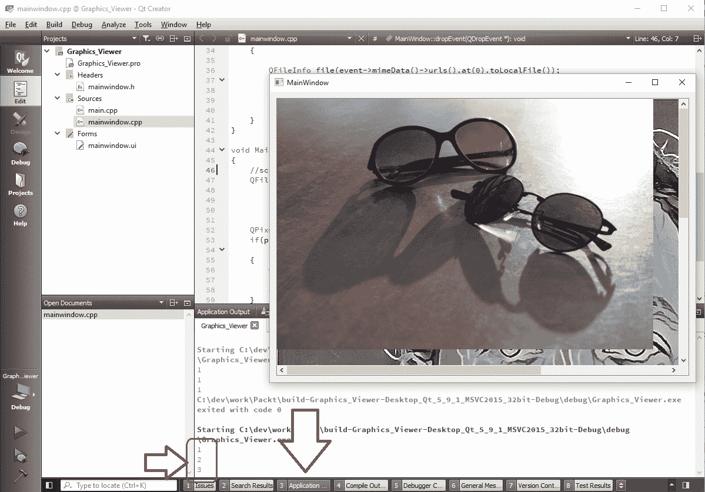
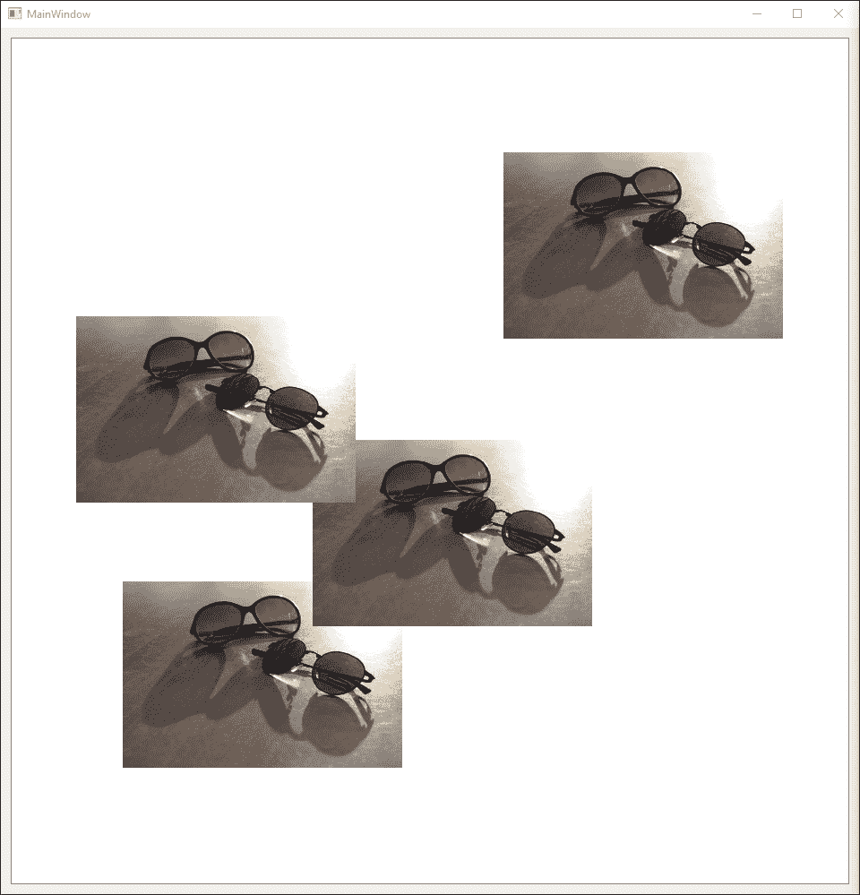
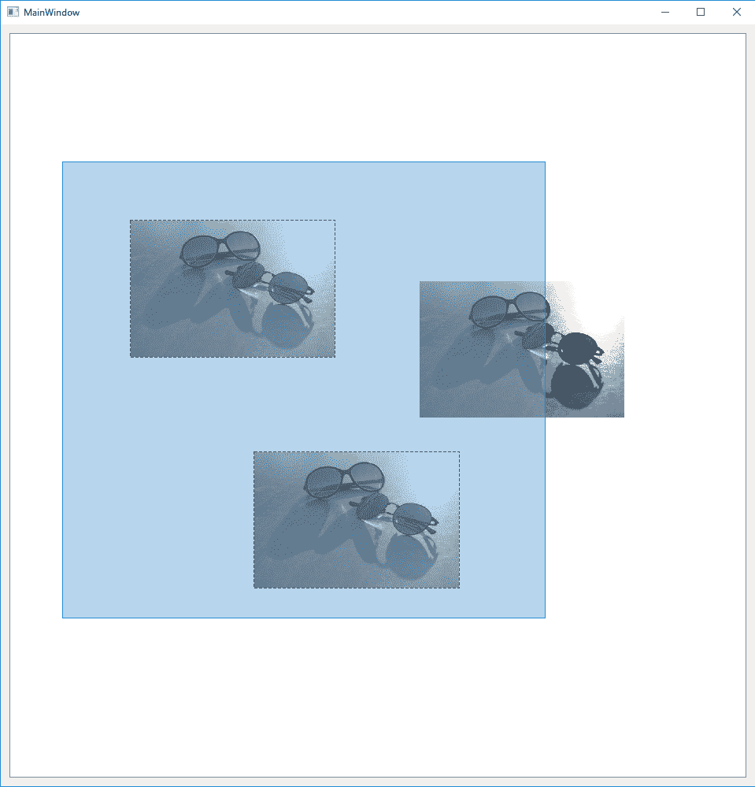
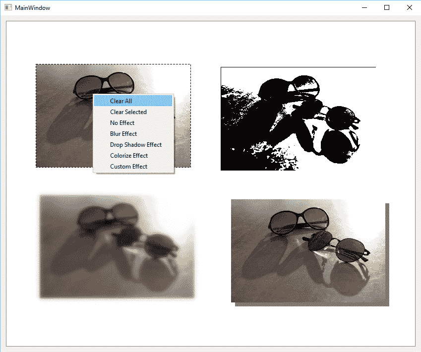

# 五、图形视图框架

既然我们已经熟悉了 Qt 和 OpenCV 框架中计算机视觉应用的基本构建模块，那么我们可以继续学习有关计算机视觉应用中可视化部分的开发的更多信息。 谈论计算机视觉，每个用户都会立即寻找一些预览图像或视频。 以您想要的任何图像编辑器为例，它们都在用户界面上包含一个区域，该区域可立即引起注意，并且可以通过 GUI 上的其他组件轻松地通过一些边框甚至简单的线条来识别。 关于视频编辑软件以及实际上需要与视觉概念和媒体输入源配合使用的所有内容，也可以这样说。 同样，对于我们将创建的计算机视觉应用，完全相同的推理也适用。 当然，在某些情况下，过程的结果只是简单地显示为数值或通过网络发送给与过程有关的其他各方。 但是，对我们来说幸运的是，我们将看到这两种情况，因此我们需要在应用中具有类似的功能，以便用户可以预览自己打开的文件或查看生成的转换（或过滤后的）图像。 屏幕。 甚至更好，请在实时视频输出预览面板中查看某些对象检测算法的结果。 该面板基本上是一个场景，或者甚至更好，它是一个图形场景，这是本书本章要讨论的主题。

在 Qt 框架内的许多模块，类和子框架下，有一块专门用于简化图形处理的工具，称为**图形视图框架**。 它包含许多类，几乎所有的类都以`QGraphics`开头，并且所有这些类都可用于处理构建计算机视觉应用时可能遇到的大多数图形任务。 图形视图框架将所有可能的对象简单地分为三个主要类别，随之而来的架构允许轻松地添加，删除，修改以及显示图形对象。

*   场景（`QGraphicsScene`类）
*   视图（`QGraphicsView`小部件）
*   图形项目（`QGraphicsItem`及其子类）

在之前的章节中，我们使用了最简单的方式同时使用 OpenCV（`imshow`函数）和 Qt 标签窗口小部件来可视化图像，这在处理显示的图像（例如选择它们，修改它们， 缩放它们，依此类推。 即使是最简单的任务，例如选择图形项目并将其拖动到其他位置，我们也必须编写大量代码并经历令人困惑的鼠标事件处理。 放大和缩小图像也是如此。 但是，通过使用图形视图框架中的类，可以更轻松地处理所有这些事情，并具有更高的性能，因为图形视图框架类旨在以高效的方式处理许多图形对象。

在本章中，我们将开始学习 Qt 的图形视图框架中最重要的类，并且重要的是，我们显然是指与构建全面的计算机视觉应用所需的类最相关的类。 本章学习的主题将完成`Computer_Vision`项目的基础，该项目是在第 3 章，“创建全面的 Qt + OpenCV 项目”的结尾创建的。 到本章末，您将能够创建一个与图像编辑软件中看到的场景相似的场景，在该场景中，您可以向场景中添加新图像，选择它们，删除它们，放大和缩小它们等等。 您还将在本章末找到`Computer_Vision`项目基础和基础版本的链接，我们将继续使用该链接，直到本书的最后几章。

在本章中，我们将介绍以下各章：

*   如何使用`QGraphicsScene`在场景上绘制图形
*   如何使用`QGraphicsItem`及其子类来管理图形项目
*   如何使用`QGraphicsView`查看`QGraphicsScene`
*   如何开发放大，缩小以及其他图像编辑和查看功能

# 场景-视图-项目架构

正如引言中提到的那样，Qt 中的图形视图框架（或从现在开始简称 Qt）将可能需要处理的与图形相关的对象分为三个主要类别，即场景，视图和项目。 Qt 包含名称非常醒目的类，以处理此架构的每个部分。 尽管从理论上讲，将它们彼此分开很容易，但在实践中，它们却是交织在一起的。 这意味着我们不能不提及其他人而真正深入研究其中之一。 清除架构的一部分，您将完全没有图形。 另外，再看一下架构，我们可以看到模型视图设计模式，其中模型（在本例中为场景）完全不知道如何显示或显示哪个部分。 正如在 Qt 中所说的，这是一种基于项目的模型-视图编程方法，我们将牢记这一点，同时还要简要介绍一下它们中的每一个在实践中的含义：

*   场景或`QGraphicsScene`管理项目或`QGraphicsItem`的实例（其子类），包含它们，并将事件（例如，鼠标单击等）传播到项目中。
*   视图或`QGraphicsView`小部件用于可视化和显示`QGraphicsScene`的内容。 它还负责将事件传播到`QGraphicsScene`。 这里要注意的重要一点是`QGraphicsScene`和`QGraphicsView`都具有不同的坐标系。 可以猜到，如果放大，缩小或进行不同的相似变换，则场景上的位置将不同。 `QGraphicsScene`和`QGraphicsView`都提供了转换彼此适合的位置值的功能。
*   这些项目或`QGraphicsItem`子类的实例是`QGraphicsScene`中包含的项目。 它们可以是线，矩形，图像，文本等。

让我们从一个简单的入门示例开始，然后继续详细讨论上述每个类：

1.  创建一个名为`Graphics_Viewer`的 Qt Widgets 应用，类似于在第 4 章，“`Mat`和`QImage`”中创建的项目，以了解有关在 Qt 中显示图像的信息。 但是，这一次只需向其中添加“图形视图”窗口小部件，而无需任何标签，菜单，状态栏等。 将其`objectName`属性保留为`graphicsView`。

2.  另外，添加与以前相同的拖放功能。 如前所述，您需要在`MainWindow`类中添加`dragEnterEvent`和`dropEvent`。 并且不要忘记将`setAcceptDrops`添加到`MainWindow`类的构造器中。 显然，这一次，您需要删除用于在`QLabel`上设置`QPixmap`的代码，因为该项目中没有任何标签。
3.  现在，将所需变量添加到`mainwindow.h`中`MainWindow`类的私有成员部分，如下所示：

```cpp
        QGraphicsScene scene; 
```

`scene`基本上是我们将使用并显示在添加到`MainWindow`类的`QGraphicsView`小部件中的场景。 最有可能的是，您需要为所使用的每个类添加一个`#include`语句，这是代码编辑器无法识别的。 您还将获得与此相关的编译器错误，通常可以很好地提醒我们忘记将其包含在源代码中的类。 因此，从现在开始，请确保为您使用的每个 Qt 类添加一个类似于以下内容的`#include`指令。 但是，如果要使某个类可用就需要采取任何特殊的措施，则将在书中明确说明：

```cpp
        #include <QGraphicsScene> 
```

4.  接下来，我们需要确保我们的`graphicsView`对象可以访问场景。 您可以通过在`MainWindow`构造器中添加以下行来实现。 （步骤 5 之后的行。）
5.  另外，您需要为`graphicsView`禁用`acceptDrops`，因为我们希望能够保留放置在窗口各处的图像。 因此，请确保您的`MainWindow`构造器仅包含以下函数调用：

```cpp
        ui->setupUi(this); 
        this->setAcceptDrops(true); 
        ui->graphicsView->setAcceptDrops(false); 
        ui->graphicsView->setScene(&scene); 
```

6.  接下来，在上一个示例项目的`dropEvent`函数中，我们设置标签的`pixmaps`属性，这一次，我们需要确保创建了`QGraphicsItem`并将其添加到场景中，或者准确地说是`QGraphicsPixmapItem`。 这可以通过两种方式完成，让我们来看第一种：

```cpp
        QFileInfo file(event 
               ->mimeData() 
               ->urls() 
               .at(0) 
               .toLocalFile()); 
        QPixmap pixmap; 
        if(pixmap.load(file 
               .absoluteFilePath())) 
        { 
          scene.addPixmap(pixmap); 
        } 
        else 
        { 
         // Display an error message 
        } 
```

在这种情况下，我们仅使用了`QGraphicsScene`的`addPixmap`函数。 另外，我们可以创建`QGraphicsPixmapItem`并使用`addItem`方法将其添加到场景中，如下所示：

```cpp
         QGraphicsPixmapItem *item =  
            new QGraphicsPixmapItem(pixmap); 
         scene.addItem(item); 
```

在这两种情况下，都不必担心项目指针，因为在调用`addItem`时场景将拥有它的所有权，并且场景会自动从内存中清除。 当然，如果我们要手动从场景和内存中完全删除该项目，我们可以编写一个简单的`delete`语句来删除该项目，如下所示：

```cpp
        delete item; 
```

我们的简单代码有一个大问题，乍看之下看不到，但是如果我们继续将图像拖放到窗口中，则每次将最新图像添加到先前图像的顶部并且不清除先前图像。 实际上，如果您亲自尝试一下，这是一个好主意。 但是，首先在写入`addItem`的行之后添加以下行：

```cpp
        qDebug() << scene.items().count(); 
```

您需要将以下头文件添加到`mainwindow.h`文件中，此文件才能起作用：

```cpp
        #include <QDebug>
```

现在，如果您运行该应用并尝试通过将其拖放到窗口中来添加图像，您会注意到，在 Qt Creator 代码编辑器屏幕底部的“应用输出”窗格中，每次放置图像时，所显示的数字增加，即`scene`中`items`的`count`：



如上例所示，使用`qDebug()`是许多 Qt 开发人员用来在开发过程中快速查看某些变量的值的技巧。 Qt 中的`qDebug()`是与`std::cout`类似的玩具，用于输出到控制台（或终端）。 我们将在第 10 章，“调试和测试”中了解更多有关测试和调试的信息，但现在，让我们记下`qDebug()`并使用它来快速解决以下问题。 我们使用 Qt 和 C++ 进行开发时的代码。

7.  因此，要解决前面示例中提到的问题，我们显然需要先对`clear`和`scene`进行添加。 因此，只需在调用任何`addItem`（或`addPixmap`等）之前添加以下内容：

```cpp
        scene.clear(); 
```

尝试再次运行您的应用，然后查看结果。 现在，将其放入我们的应用窗口后，应该只存在一个图像。 另外，记下应用的输出，您将看到显示的值始终为`1`，这是因为在任何时候`scene`中始终只保留一个图像。 在我们刚才看到的示例项目中，我们使用了 Qt 的图形视图框架中的所有现有主要部分，即场景，项目和视图。 现在，我们将详细了解这些类，同时，为我们全面的计算机视觉应用`Computer_Vision`项目创建强大的图形查看器和编辑器。

# 场景，`QGraphicsScene`

此类提供了处理多个图形项（`QGraphicsItem`）所需的几乎所有方法，即使在前面的示例中我们仅将其与单个`QGraphicxPixmapItem`一起使用。 在本节中，我们将回顾该类中一些最重要的函数。 如前所述，我们将主要关注用例所需的属性和方法，因为涵盖所有方法（尽管它们都很重要）对于本书而言都是徒劳的。 我们将跳过`QGraphicsScene`的构造器，因为它们仅用于获取场景的尺寸并相应地创建场景。 至于其余的方法和属性，就在这里，对于其中一些可能不太明显的示例，您可以找到一个简单的示例代码，可以使用本章前面创建的`Graphics_Viewer`项目进行尝试 ：

*   `addEllipse`，`addLine`，`addRect`和`addPolygon`函数可以从它们的名称中猜测出来，可以用来向场景添加通用的几何形状。 它们中的一些提供了重载函数，以便于输入参数。 创建并添加到场景时，上述每个函数都会返回其对应的`QGraphicsItem`子类实例（如下所示）。 返回的指针可以保留，以后可用于修改，删除或以其他方式使用该项目：
    *   `QGraphicsEllipseItem`
    *   `QGraphicsLineItem`
    *   `QGraphicsRectItem`
    *   `QGraphicsPolygonItem`

这是一个例子：

```cpp
        scene.addEllipse(-100.0, 100.0, 200.0, 100.0, 
                QPen(QBrush(Qt::SolidPattern), 2.0), 
                QBrush(Qt::Dense2Pattern)); 

        scene.addLine(-200.0, 200, +200, 200, 
              QPen(QBrush(Qt::SolidPattern), 5.0)); 

        scene.addRect(-150, 150, 300, 140); 

        QVector<QPoint> points; 
        points.append(QPoint(150, 250)); 
        points.append(QPoint(250, 250)); 
        points.append(QPoint(165, 280)); 
        points.append(QPoint(150, 250)); 
        scene.addPolygon(QPolygon(points)); 
```

这是前面代码的结果：


*   `addPath`函数可用于将`QPainterPath`与给定的`QPen`和`QBrush`添加到场景中。 `QPainterPath`类可用于记录绘画操作，类似于我们在`QPainter`中看到的操作，并在以后使用它们。 另一方面，`QPen`和`QBrush`类具有不言自明的标题，但在本章后面的示例中我们也将使用它们。 `addPath`函数返回一个指向新创建的`QGraphicsPathItem`实例的指针。
*   `addSimpleText`和`addText`函数可用于将纯文本和带格式的文本添加到场景中。 它们分别返回指向`QGraphicsSimpleTextItem`或`QGraphicsTextItem`的指针。

*   在上一示例中已经使用过的`addPixmap`函数可用于将图像添加到场景，并且它返回指向`QGraphicsPixmapItem`类的指针。
*   `addItem`函数仅接受任何`QGraphicsItem`子类并将其添加到场景中。 我们在前面的示例中也使用了此函数。
*   `addWidget`函数可用于将 Qt 小部件添加到场景。 除了某些特殊的小部件（即设置了`Qt::WA_PaintOnScreen`标志的小部件或使用外部库（例如`OpenGL`或`Active-X`绘制的小部件））之外，您还可以将其他任何小部件添加到场景中，就像将其添加到场景中一样。 一个窗口。 这为使用交互式图形项创建场景提供了巨大的力量。 您绝对可以使用它来创建简单的游戏，添加对图像执行某些操作的按钮以及许多其他功能。 我们将在`Computer_Vision`项目中大量使用此示例，并提供足够的示例来帮助您入门，但是现在这是一个简短的示例：

```cpp
        QPushButton *button = new QPushButton(Q_NULLPTR); 
        connect(button, SIGNAL(pressed()), this, SLOT(onAction())); 
        button->setText(tr("Do it!")); 
        QGraphicsProxyWidget* proxy = scene.addWidget(button); 
        proxy->setGeometry(QRectF(-200.0, -200, 400, 100.0)); 
```

前面的代码只是添加了一个标题为`Do it!`的按钮，并将其连接到名为`onAction`的插槽。 每当按下场景中的此按钮时，就会调用`onAction`函数。 与向窗口添加按钮时完全相同：

*   `setBackgroundBrush`，`backgroundBrush`，`setForegroundBrush`和`foregroundBrush`函数允许访问负责刷刷场景的`background`和`foreground`的`QBrush`类。
*   `font`和`setFont`函数可用于获取或设置`QFont`类，以确定场景中使用的字体。
*   当我们想要定义最小尺寸来决定某项是否适合绘制（渲染）时，`minimumRenderSize`和`setMinimumRenderSize`函数非常有用。

*   `sceneRect`和`setSceneRect`函数可用于指定场景的边界矩形。 这基本上意味着场景的宽度和高度，以及其在坐标系上的位置。 重要的是要注意，如果未调用`setSceneRect`或在`QGraphicsScene`的构造器中未设置矩形，则调用`sceneRect`将始终返回可以覆盖添加到场景的所有项目的最大矩形。 始终最好设置一个场景矩形，并根据需要在场景中进行任何更改等操作，基本上根据需要手动（使用`setSceneRect`）再次对其进行设置。
*   `stickyFocus`和`setStickyFocus`函数可用于启用或禁用场景的粘滞聚焦模式。 如果启用了粘滞聚焦，则单击场景中的空白区域不会对聚焦的项目产生任何影响； 否则，将仅清除焦点，并且不再选择选定的项目。
*   `collidingItems`是一个非常有趣的功能，可用于简单地确定某项是否与其他任何项共享其区域的某个部分（或发生碰撞）。 您需要将`QGraphicsItem`指针与`Qt::ItemSelectionMode`一起传递，您将获得与项目发生冲突的`QGraphicsItem`实例的`QList`。
*   `createItemGroup`和`destroyItemGroup`函数可用于创建和删除`QGraphicsItemGroup`类实例。 `QGraphicsItemGroup`基本上是另一个`QGraphicsItem`子类（如`QGraphicsLineItem`等），可用于将一组图形项分组并因此表示为单个项。
*   `hasFocus`，`setFocus`，`focusItem`和`setFocusItem`函数均用于处理图形场景中当前聚焦的项目。
*   返回与`sceneRect.width()`和`sceneRect.height()`相同值的`width`和`height`可用于获取场景的宽度和高度。 请务必注意，这些函数返回的值的类型为`qreal`（默认情况下与`double`相同），而不是`integer`，因为场景坐标在像素方面不起作用。 除非使用视图绘制场景，否则将其上的所有内容都视为逻辑和非视觉对象，而不是视觉对象，这是`QGraphicsView`类的领域。
*   在某些情况下，与`update()`相同的`invalidate`可用于请求全部或部分重绘场景。 类似于刷新函数。

*   `itemAt`函数可用于在场景中的某个位置找到指向`QGraphicItem`的指针。
*   `item`返回添加到场景的项目列表。 基本上是`QGraphicsItem`的`QList`。
*   `itemsBoundingRect`可用于获取`QRectF`类，或仅获取可包含场景中所有项目的最小矩形。 如果我们需要查看所有项目或执行类似操作，此函数特别有用。
*   `mouseGrabberItem`可用于获取当前单击的项目，而无需释放鼠标按钮。 此函数返回一个`QGraphicsItem`指针，使用它我们可以轻松地向场景添加“拖动和移动”或类似功能。
*   `removeItem`函数可用于从场景中删除项目。 此函数不会删除该项目，并且调用方负责任何必需的清理。
*   `render`可用于渲染`QPaintDevice`上的场景。 这只是意味着您可以使用`QPainter`类（如您在第 4 章，“`Mat`和`QImage`”中学习的）在`QImage`，`QPrinter`等类似对象上绘制场景，通过将`QPainter`类的指针传递给此函数。 （可选）您可以在`QPaintDevice`渲染目标类的一部分上渲染场景的一部分，并且还要注意宽高比的处理。
*   当`selectedItems`，`selectionArea`和`setSelectionArea`函数结合使用时，可以帮助处理一个或多个项目选择。 通过提供`Qt::ItemSelectionMode`枚举，我们可以基于完全选择一个框中的项目或仅对其一部分进行选择，等等。 我们还可以为该函数提供`Qt::ItemSelectionOperation`枚举条目，以增加选择或替换所有先前选择的项目。
*   `sendEvent`函数可用于将`QEvent`类（或子类）发送到场景中的项目。
*   `style`和`setStyle`函数用于设置和获取场景样式。
*   `update`函数可用于重绘部分或全部场景。 当场景的视觉部分发生变化时，最好将此函数与`QGraphicsScene`类发出的变化信号结合使用。
*   `views`函数可用于获取`QList`类，其中包含用于显示（或查看）此场景的`QGraphicsView`小部件。

除了先前的现有方法外，`QGraphicsScene`提供了许多虚拟函数，可用于进一步自定义和增强`QGraphicsScene`类的行为以及外观。 因此，与其他任何类似的 C++ 类一样，您需要创建`QGraphicsScene`的子类，并只需添加这些虚拟函数的实现即可。 实际上，这是使用`QGraphicsScene`类的最佳方法，它为新创建的子类提供了极大的灵活性：

*   可以覆盖`dragEnterEvent`，`dragLeaveEvent`，`dragMoveEvent`和`dropEvent`函数，以向场景添加拖放功能。 请注意，这与前面示例中将图像拖放到窗口中所做的非常相似。 这些事件中的每一个都提供足够的信息和参数来处理整个拖放过程。
*   如果我们需要在整个场景中添加自定义背景或前景，则应覆盖`drawBackground`和`drawForeground`函数。 当然，对于简单的背景或前景绘画或着色任务，我们可以简单地调用`setBackgroundBrush`和`setForegroundBrush`函数，而跳过这些函数。
*   `mouseDoubleClickEvent`，`mouseMoveEvent`，`mousePressEvent`，`mouseReleaseEvent`和`wheelEvent`函数可用于处理场景中的不同鼠标事件。 例如，当我们在`Computer_Vision`项目中为场景添加放大和缩小功能时，将在本章稍后使用`wheelEvent`。
*   可以覆盖`event`以处理场景接收到的所有事件。 此函数基本上负责将事件调度到其相应的处理器，但是它也可以用于处理自定义事件或不具有便捷功能的事件，例如前面提到的所有事件。

就像到目前为止您学过的所有类一样，无论是在 Qt 还是 OpenCV 中，本书中提供的方法，属性和函数的列表都不应被视为该类各个方面的完整列表。 最好总是使用框架的文档来学习新函数和属性。 但是，本书中的描述旨在更简单，尤其是从计算机视觉开发人员的角度出发。

# 项目，`QGraphicsItem`

这是场景中绘制的所有项目的基类。 它包含各种方法和属性来处理每个项目的绘制，碰撞检测（与其他项目），处理鼠标单击和其他事件，等等。 即使您可以将其子类化并创建自己的图形项，Qt 也会提供一组子类，这些子类可用于大多数（如果不是全部）日常图形任务。 以下是这些子类，在前面的示例中已经直接或间接使用了这些子类：

*   `QGraphicsEllipseItem`
*   `QGraphicsLineItem`
*   `QGraphicsPathItem`
*   `QGraphicsPixmapItem`
*   `QGraphicsPolygonItem`
*   `QGraphicsRectItem`
*   `QGraphicsSimpleTextItem`
*   `QGraphicsTextItem`

如前所述，`QGraphicsItem`提供了许多函数和属性来处理图形应用中的问题和任务。 在本节中，我们将介绍`QGraphicsItem`中一些最重要的成员，这些成员因此可以通过熟悉前面提到的子类来帮助我们：

*   `acceptDrops`和`setAcceptDrops`函数可用于使项目接受拖放事件。 请注意，这与我们在前面的示例中已经看到的拖放事件非常相似，但是这里的主要区别是项目本身可以识别拖放事件。
*   `acceptHoverEvents`，`setAcceptHoverEvents`，`acceptTouchEvents`，`setAcceptTouchEvents`，`acceptedMouseButtons`和`setAcceptedMouseButtons`函数均处理项目交互及其对鼠标单击的响应等。 这里要注意的重要一点是，一个项目可以根据`Qt::MouseButtons`枚举设置来响应或忽略不同的鼠标按钮。 这是一个简单的例子：

```cpp
        QGraphicsRectItem *item = 
           new QGraphicsRectItem(0, 
                                 0, 
                                 100, 
                                 100, 
                                 this); 
        item->setAcceptDrops(true); 
        item->setAcceptHoverEvents(true); 
        item->setAcceptedMouseButtons( 
                Qt::LeftButton | 
                Qt::RightButton | 
                Qt::MidButton); 
```

*   `boundingRegion`函数可用于获取描述图形项区域的`QRegion`类。 这是一项非常重要的函数，因为它可用于获取需要绘制（或重绘）项目的确切区域，并且与项目的边界矩形不同，因为简单地说，该项目可能仅覆盖其边界矩形的一部分，如直线等。 有关更多信息，请参见以下示例。
*   在计算项目的`boundingRegion`函数时，`boundingRegionGranularity`和`setBoundingRegionGranularity`函数可用于设置和获取粒度级别。 从这个意义上讲，粒度是`0`和`1`之间的实数，它对应于计算时的预期详细程度：

```cpp
        QGraphicsEllipseItem *item = 
            new QGraphicsEllipseItem(0, 
                                     0, 
                                     100, 
                                     100); 
        scene.addItem(item); 
        item->setBoundingRegionGranularity(g); // 0 , 0.1 , 0.75 and 1.0 
        QTransform transform; 
        QRegion region = item->boundingRegion(transform); 
        QPainterPath painterPath; 
        painterPath.addRegion(region); 
        QGraphicsPathItem *path = new QGraphicsPathItem(painterPath); 
        scene.addItem(path); 
```

在前面的代码中，如果将`g`替换为`0.0`，`0.1`，`0.75`和`1.0`，则会得到以下结果。 显然，`0`的值（默认粒度）导致单个矩形（边界矩形），这不是准确的估计。 随着级别的增加，我们得到了覆盖图形形状和项目的更准确的区域（基本上是矩形集）：


*   `childItems`函数可用于获取填充有`QGraphicsItem`类的`QList`，这些类是此项的子级。 将它们视为更复杂项目的子项目。
*   `childrenBoundingRect`，`boundingRect`和`sceneBoundingRect`函数可用于检索`QRectF`类，其中包含该项目的子项`bounding rect`，该项目本身和场景。
*   `clearFocus`，`setFocus`和`hasFocus`函数可用于删除，设置和获取该项目的聚焦状态。 具有焦点的项目接收键盘事件。
*   `collidesWithItem`，`collidesWithPath`和`collidingItems`函数可用于检查此项目是否与任何给定项目发生冲突，以及该项目与之碰撞的项目列表。
*   `contains`函数获取一个点的位置（准确地说是`QPointF`类），然后检查此项是否包含该点。
*   `cursor`，`setCursor`，`unsetCursor`和`hasCursor`函数对于设置，获取和取消设置此项的特定鼠标光标类型很有用。 您还可以在取消设置之前检查项目是否有任何设置的光标。 设置后，如果鼠标光标悬停在该项目上，则光标形状变为一组。
*   `hide`，`show`，`setVisible`，`isVisible`，`opacity`，`setOpacity`和`effectiveOpacity`函数均与商品的可见性（和不透明度）有关。 所有这些函数都具有不言自明的名称，唯一值得注意的是`effectiveOpacity`，它可能与此项的不透明度相同，因为它是基于该项及其父项的不透明度级别计算的。 最终，`effectiveOpacity`是用于在屏幕上绘制该项目的不透明度级别。

*   `flags`，`setFlags`和`setFlag`函数可用于获取或设置此项的标志。 通过标志，我们基本上是指`QGraphicsItem::GraphicsItemFlag`枚举中各项的组合。 这是一个示例代码：

```cpp
        item->setFlag(QGraphicsItem::ItemIsFocusable, true); 
        item->setFlag(QGraphicsItem::ItemIsMovable, false);
```

重要的是要注意，当我们使用`setFlag`函数时，所有以前的标志状态都会保留，并且此函数中只有一个标志会受到影响。 但是，当我们使用`setFlags`时，基本上所有标志都会根据给定的标志组合进行重置。

*   当我们想要更改从场景中获取鼠标和键盘事件的项目时，`grabMouse`，`grabKeyboard`，`ungrabMouse`和`ungrabKeyboard`方法很有用。 显然，使用默认实现时，一次只能抓取一个项目，除非另一个抓取项目或者项目本身不变形或被删除或隐藏，否则抓取器将保持不变。 正如本章前面所看到的，我们总是可以使用`QGraphicsScene`类中的`mouseGrabberItem`函数来获取抓取器项目。
*   `setGraphicsEffect`和`graphicsEffect`函数可用于设置和获取`QGraphicsEffect`类。 这是一个非常有趣且易于使用的函数，但功能强大，可用于向场景中的项目添加过滤器或效果。 `QGraphicsEffect`是 Qt 中所有图形效果的基类。 您可以将其子类化并创建自己的图形效果或过滤器，也可以仅使用提供的 Qt 图形效果之一。 目前，Qt 中有一些图形效果类，您可以自己尝试一下：
    *   `QGraphicsBlurEffect`
    *   `QGraphicsColorizeEffect`
    *   `QGraphicsDropShadowEffect`
    *   `QGraphicsOpacityEffect`

让我们看一个示例自定义图形效果，并使用 Qt 自己的图形效果使自己更加熟悉这个概念：

1.  您可以使用我们在本章前面创建的`Graphics_Viewer`项目。 只需在 Qt Creator 中打开它，然后使用主菜单中的`New File`或`Project`，选择 C++ 和 C++ 类，然后单击`Choose`按钮。
2.  接下来，确保输入`QCustomGraphicsEffect`作为类名。 选择`QObject`作为基类，最后选中`Include QObject`复选框（如果默认情况下未选中）。 单击下一步，然后单击完成按钮。

3.  然后，将以下`include`语句添加到新创建的`qcustomgraphicseffect.h`文件中：

```cpp
        #include <QGraphicsEffect> 
        #include <QPainter>
```

4.  之后，您需要确保我们的`QCustomGraphicsEffect`类继承了`QGraphicsEffect`而不是`QObject`。 确保首先更改`qcustomgraphicseffect.h`文件中的类定义行，如下所示：

```cpp
        class QCustomGraphicsEffect : public QGraphicsEffect
```

5.  我们还需要更新该类的构造器，并确保在我们的类构造器中调用了`QGraphicsEffect`构造器，否则将出现编译器错误。 因此，更改`qcustomgraphics.cpp`文件中的类构造器，如下所示：

```cpp
      QCustomGraphicsEffect::QCustomGraphicsEffect(QObject *parent) 
         : QGraphicsEffect(parent) 
```

6.  接下来，我们需要实现`draw`函数。 基本上，这是通过实现`draw`函数制作所有`QGraphicsEffect`类的方式。 因此，将以下代码行添加到`qcustomgraphicseffect.h`文件中的`QCustomGraphicsEffect`类定义中：

```cpp
        protected: 
          void draw(QPainter *painter); 
```

7.  然后，我们需要编写实际的效果代码。 在此示例中，我们将编写一个简单的阈值过滤器，根据像素的灰度值，将其设置为完全黑色或完全白色。 尽管起初代码看起来有些棘手，但它仅使用了我们在前几章中已经学到的经验。 而且，这也是使用`QGraphicsEffect`类编写新效果和过滤器的简单程度的简单示例。 如您所见，传递给`draw`函数的`QPainter`类的指针可用于在效果所需的更改之后简单地对其进行修改和绘制：

```cpp
        void QCustomGraphicsEffect::draw(QPainter *painter) 
        { 
          QImage image; 
          image = sourcePixmap().toImage(); 
          image = image.convertToFormat( 
                QImage::Format_Grayscale8); 
          for(int i=0; i<image.byteCount(); i++) 
          image.bits()[i] = 
                image.bits()[i] < 100 ? 
                    0 
                  : 
                    255; 
          painter->drawPixmap(0,0,QPixmap::fromImage(image)); 
        }
```

8.  最后，我们可以使用新的效果类。 只要确保它包含在`mainwindow.h`文件中：

```cpp
        #include "qcustomgraphicseffect.h" 
```

9.  然后，通过调用项目的`setGraphicsEffect`函数来使用它。 在我们的`Graphics_Viewer`项目中，我们实现了`dropEvent`。 您可以简单地将以下代码段添加到`dropEvent`函数中，因此将具有以下内容：

```cpp
        QGraphicsPixmapItem *item = new QGraphicsPixmapItem(pixmap); 
        item->setGraphicsEffect(new QCustomGraphicsEffect(this)); 
        scene.addItem(item); 
```

如果在运行应用并将其放置在其上的图像时所有操作均正确完成，您将注意到我们的阈值效果的结果：


在我们使用自定义图形效果的最后一步中，尝试用任何 Qt 提供的效果的类名替换`QCustomGraphicsEffect`，然后亲自检查结果。 如您所见，它们在图形效果和类似概念方面提供了极大的灵活性。

现在，让我们继续进行`QGraphicsItem`类中的其余函数和属性：

*   当我们想将一个项目添加到组中或获取包含该项目的组类时，`group`和`setGroup`函数非常有用，只要该项目属于任何组。 `QGraphicsItemGroup`是负责处理组的类，就像您在本章前面所学的那样。
*   `isAncestorOf`函数可用于检查该项目是否为任何给定其他项目的父项（或父项的父项，依此类推）。
*   可以设置`setParentItem`和`parentItem`并检索当前项目的父项目。 一个项目可能根本没有任何父项，在这种情况下，`parentItem`函数将返回零。
*   `isSelected`和`setSelected`函数可用于更改项目的所选模式。 这些函数与`setSelectionArea`和您在`QGraphicsScene`类中了解的类似函数密切相关。
*   `mapFromItem`，`mapToItem`，`mapFromParent`，`mapToParent`，`mapFromScene`，`mapToScene`，`mapRectFromItem`，`mapRectToScene`，`mapRectFromParent`，`mapRectToParent`，`mapRectFromScene`和`mapRectToScene`函数 ，所有这些函数甚至都具有更多方便的重载函数，构成了一长串函数，这些函数用于从或向其进行基本映射，或者换句话说，可用于从场景，另一项或父对象到场景的坐标转换。 。 实际上，如果您考虑到每个单独的项目和场景与其他项目无关的事实，那么这很容易掌握。 首先，请看下面的图，然后让我们对其进行更详细的讨论：


因为**场景**包含所有项目，所以我们假设主坐标系（或世界坐标系）是**场景**的坐标系。 实际上，这是一个正确的假设。 因此，**项目**在场景中的位置值为`(A, B)`。 同样，**父项**在场景中的位置为`(D, E)`。 现在，这有点棘手，**子项 1** 在**父项**中的位置值为`(F, G)`。 类似地，**子项 2** 在**父项**中的位置值为`(H, I)`。 显然，如果父项和子项的数量增加，我们将拥有不同坐标系的迷宫，在这里，提到的映射函数会很有用。 这是一些示例情况。 您可以使用以下代码段自己测试它，以创建一个场景，其中包含与前面提到的场景类似的项目：

```cpp
    QGraphicsRectItem *item = 
    new QGraphicsRectItem(0, 
                          0, 
                          100, 
                          100); 
    item->setPos(50,400); 
    scene.addItem(item); 
    QGraphicsRectItem *parentItem = 
        new QGraphicsRectItem(0, 
                              0, 
                              320, 
                              240); 
    parentItem->setPos(300, 50); 
    scene.addItem(parentItem); 

    QGraphicsRectItem *childItem1 = 
        new QGraphicsRectItem(0, 
                              0, 
                              50, 
                              50, 
                              parentItem); 
    childItem1->setPos(50,50); 
    QGraphicsRectItem *childItem2 = 
        new QGraphicsRectItem(0, 
                              0, 
                              75, 
                              75, 
                              parentItem); 
    childItem2->setPos(150,75); 

    qDebug() << item->mapFromItem(childItem1, 0,0); 
    qDebug() << item->mapToItem(childItem1, 0,0); 
    qDebug() << childItem1->mapFromScene(0,0); 
    qDebug() << childItem1->mapToScene(0,0); 
    qDebug() << childItem2->mapFromParent(0,0); 
    qDebug() << childItem2->mapToParent(0,0); 
    qDebug() << item->mapRectFromItem(childItem1, 
                                  childItem1->rect()); 
    qDebug() << item->mapRectToItem(childItem1, 
                                childItem1->rect()); 
    qDebug() << childItem1->mapRectFromScene(0,0, 25, 25); 
    qDebug() << childItem1->mapRectToScene(0,0, 25, 25); 
    qDebug() << childItem2->mapRectFromParent(0,0, 30, 30); 
    qDebug() << childItem2->mapRectToParent(0,0, 25, 25); 
```

尝试在 Qt Creator 和 Qt Widgets 项目中运行前面的代码，您将在 Qt Creator 的应用输出窗格中看到以下内容，这基本上是`qDebug()`语句的结果：

```cpp
    QPointF(300,-300) 
    QPointF(-300,300) 
    QPointF(-350,-100) 
    QPointF(350,100) 
    QPointF(-150,-75) 
    QPointF(150,75) 
    QRectF(300,-300 50x50) 
    QRectF(-300,300 50x50) 
    QRectF(-350,-100 25x25) 
    QRectF(350,100 25x25) 
    QRectF(-150,-75 30x30) 
    QRectF(150,75 25x25) 
```

让我们尝试看看产生第一个结果的指令：

```cpp
    item->mapFromItem(childItem1, 0,0); 
```

`item`在场景中的位置为`(50, 400)`，`childItem1`在场景中的`(50, 50)`位置。 该语句在`childItem1`坐标系中的位置`(0, 0)`并将其转换为项目的坐标系。 自己一个个地检查其他说明。 当我们要在场景中的项目周围移动或对场景中的项目进行类似的转换时，这非常简单但非常方便：

*   `moveBy`，`pos`，`setPos`，`x`，`setX`，`y`，`setY`，`rotation`，`setRotation`，`scale`和`setScale`函数可用于获取或设置项目的不同几何属性。 有趣的是，`pos`和`mapToParent(0,0)`返回相同的值。 检查前面的示例，然后通过将其添加到示例代码中来进行尝试。

*   `transform`，`setTransform`，`setTransformOriginPoint`和`resetTransform`函数可用于对项目应用或检索任何几何变换。 重要的是要注意，所有变换都假设一个原点（通常为`(0,0)`），可以使用`setTransformOriginPoint`对其进行更改。
*   `scenePos`函数可用于获取项目在场景中的位置。 与调用`mapToScene(0,0)`相同。 您可以自己在前面的示例中进行尝试并比较结果。
*   `data`和`setData`函数可用于设置和检索项目中的任何自定义数据。 例如，我们可以使用它来存储设置为`QGraphicsPixmapItem`的图像的路径，或者存储与特定项目相关的任何其他类型的信息。
*   `zValue`和`setZValue`函数可用于修改和检索项目的`Z`值。 `Z`值决定应在其他项目之前绘制哪些项目，依此类推。 具有较高`Z`值的项目将始终绘制在具有较低`Z`值的项目上。

与我们在`QGraphicsScene`类中看到的类似，`QGraphicsItem`类还包含许多受保护的虚函数，这些函数可以重新实现，主要用于处理传递到场景项上的各种事件。 以下是一些重要且非常有用的示例：

*   `contextMenuEvent`
*   `dragEnterEvent`，`dragLeaveEvent`，`dragMoveEvent`，`dropEvent`
*   `focusInEvent`，`focusOutEvent`
*   `hoverEnterEvent`，`hoverLeaveEvent`，`hoverMoveEvent`
*   `keyPressEvent`，`keyReleaseEvent`
*   `mouseDoubleClickEvent`，`mouseMoveEvent`，`mousePressEvent`，`mouseReleaseEvent`，`wheelEvent`

# 视图，`QGraphicsView`

我们到了 Qt 中的图形视图框架的最后一部分。 `QGraphicsView`类是 Qt 窗口小部件类，可以将其放置在窗口上以显示`QGraphicsScene`，该窗口本身包含许多`QGraphicsItem`子类和/或窗口小部件。 与`QGraphicsScene`类相似，该类还提供大量函数，方法和属性来处理图形的可视化部分。 我们将审核以下列表中的一些最重要的函数，然后我们将学习如何对`QGraphicsView`进行子类化并将其扩展为在我们全面的计算机视觉应用中具有若干重要功能，例如放大，缩小， 项目选择等。 因此，这是我们在计算机视觉项目中需要的`QGraphicsView`类的方法和成员：

*   `alignment`和`setAlignment`函数可用于设置场景在视图中的对齐方式。 重要的是要注意，只有当视图可以完全显示场景并且仍然有足够的空间并且视图不需要滚动条时，这才具有可见效果。
*   `dragMode`和`setDragMode`函数可用于获取和设置视图的拖动模式。 这是视图的最重要函数之一，它可以决定在视图上单击并拖动鼠标左键时会发生什么。 在下面的示例中，我们将使用它并对其进行全面了解。 我们将使用`QGraphicsView::DragMode`枚举设置不同的拖动模式。
*   `isInteractive`和`setInteractive`函数允许检索和修改视图的交互行为。 交互式视图会响应鼠标和键盘（如果已实现），否则，所有鼠标和键盘事件都将被忽略，并且该视图只能用于查看并且不能与场景中的项目进行交互。
*   `optimizationFlags`，`setOptimizationFlags`，`renderHints`，`setRenderHints`，`viewportUpdateMode`和`setViewportUpdateMode`函数分别用于获取和设置与视图的性能和渲染质量有关的参数。 在下面的示例项目中，我们将在实践中看到这些函数的用例。

*   在`dragMode`设置为`RubberBandDrag`模式的情况下，可以使用`rubberBandSelectionMode`和`setRubberBandSelectionMode`函数设置视图的项目选择模式。 可以设置以下内容，它们是`Qt::ItemSelectionMode`枚举中的条目：
    *   `Qt::ContainsItemShape`
    *   `Qt::IntersectsItemShape`
    *   `Qt::ContainsItemBoundingRect`
    *   `Qt::IntersectsItemBoundingRect`
*   `sceneRect`和`setSceneRect`函数可用于获取和设置视图中场景的可视化区域。 显然，该值不必与`QGraphicsScene`类的`sceneRect`相同。
*   `centerOn`函数可用于确保特定点或项目位于视图中心。
*   `ensureVisible`函数可用于将视图滚动到特定区域（具有给定的边距）以确保它在视图中。 此函数适用于点，矩形和图形项目。
*   `fitInView`函数与`centerOn`和`ensureVisible`非常相似，但主要区别在于，该函数还使用给定的宽高比处理参数缩放视图的内容以适合视图。 以下：
    *   `Qt::IgnoreAspectRatio`
    *   `Qt::KeepAspectRatio`
    *   `Qt::KeepAspectRatioByExpanding`
*   `itemAt`函数可用于在视图中的特定位置检索项目。

我们已经了解到场景中的每个项目和场景中的每个项目都有各自的坐标系，我们需要使用映射函数将位置从一个位置转换到另一个位置，反之亦然。 视图也是如此。 视图还具有自己的坐标系，主要区别在于视图中的位置和矩形等实际上是根据像素进行测量的，因此它们是整数，但是场景和项目的位置使用实数，等等。 这是由于以下事实：场景和项目在视图上被查看之前都是逻辑实体，因此所有实数都将转换为整数，而整个场景（或部分场景）准备在屏幕上显示。 。 下图可以帮助您更好地理解这一点：


在上图中，视图的中心点实际上是场景右上角的某个位置。 **视图**提供了类似的映射函数（与我们在项目中看到的函数相同），可以将场景坐标系中的位置转换为视图坐标系，反之亦然。 这里是它们，再加上其他一些函数和方法，在继续之前，我们需要学习以下**视图**：

*   `mapFromScene`和`mapToScene`函数可用于在场景坐标系之间转换位置。 与前面提到的一致，`mapFromScene`函数接受实数并返回整数值，而`mapToScene`函数接受整数并返回实数。 稍后我们将开发视图的缩放功能时，将使用这些函数。
*   `items`函数可用于获取场景中的项目列表。
*   `render`函数对于执行整个视图或其一部分的渲染很有用。 该函数的用法与`QGraphicsScene`中的`render`完全相同，只是此函数在视图上执行相同的功能。
*   `rubberBandRect`函数可用于获取橡皮筋选择的矩形。 如前所述，这仅在拖动模式设置为`rubberBandSelectionMode`时才有意义。
*   `setScene`和`scene`函数可用于设置和获取视图场景。
*   `setMatrix`，`setTransform`，`transform`，`rotate`，`scale`，`shear`和`translate`函数都可以用于修改或检索视图的几何特性。

与`QGraphicsScene`和`QGraphicsItem`类相同，`QGraphicsView`还提供了许多相同的受保护虚拟成员，可用于进一步扩展视图的功能。 现在，我们将扩展`Graphics_Viewer`示例项目，以支持更多项目，项目选择，项目删除以及放大和缩小功能，并且在此过程中，我们将概述以下项目的一些最重要用例： 我们在本章中学到的视图，场景和项目。 因此，让我们完成它：

1.  首先在 Qt Creator 中打开`Graphics_Viewer`项目； 然后，从主菜单中选择“新建文件”或“项目”，然后在“新建文件或项目”窗口中选择“C++ 和 C++ 类”，然后单击“选择”按钮。
2.  确保输入`QEnhancedGraphicsView`作为类名，然后选择`QWidget`作为基类。 另外，如果`Include QWidget`旁边的复选框尚未选中，请选中它。 然后，单击“下一步”，然后单击“完成”。
3.  添加以下内容以包含`qenhancedgraphicsview.h`头文件：

```cpp
        #include <QGraphicsView> 
```

4.  确保`QEnhancedGraphicsView`类继承了`qenhancedgraphicsview.h`文件中的`QGraphicsView`而不是`QWidget`，如下所示：

```cpp
        class QEnhancedGraphicsView : public QGraphicsView 
```

5.  您必须更正`QEnhancedGraphicsView`类的构造器实现，如此处所示。 显然，这是在`qenhancedgraphicsview.cpp`文件中完成的，如下所示：

```cpp
        QEnhancedGraphicsView::QEnhancedGraphicsView(QWidget
           *parent) 
         : QGraphicsView(parent) 
        { 
        } 
```

6.  现在，将以下受保护的成员添加到`qenhancedgraphicsview.h`文件中的增强型视图类定义中：

```cpp
        protected: 
          void wheelEvent(QWheelEvent *event);
```

7.  并将其实现添加到`qenhancedgraphicsview.cpp`文件，如以下代码块所述：

```cpp
        void QEnhancedGraphicsView::wheelEvent(QWheelEvent *event) 
        { 
          if (event->orientation() == Qt::Vertical) 
          { 
            double angleDeltaY = event->angleDelta().y(); 
            double zoomFactor = qPow(1.0015, angleDeltaY); 
            scale(zoomFactor, zoomFactor); 
            this->viewport()->update(); 
            event->accept(); 
          } 
          else 
          { 
            event->ignore(); 
          } 
        } 
```

您需要确保`QWheelEvent`和`QtMath`包含在我们的类源文件中，否则，您将获得`qPow`函数和`QWheelEvent`类的编译器错误。 前面的代码大部分是不言自明的-它首先检查鼠标滚轮事件的方向，然后根据滚轮中的移动量在 X 和 Y 轴上都应用一个比例。 然后，它更新视口，以确保根据需要重新绘制所有内容。

8.  现在，我们需要进入 Qt Creator 中的“设计”模式，以在窗口上提升`graphicsView`对象（如我们先前所见）。 我们需要右键单击并从上下文菜单中选择“升级为”。 然后，输入`QEnhancedGraphicsView`作为升级的类名称，然后单击“添加”按钮，最后单击“升级”按钮。 （您已经在前面的示例中学习了关于提升的知识，这也不例外。）由于`QGraphicsView`和`QEnhancedGraphicsView`类是兼容的（第一个是后者的父类），因此我们可以将父代提升为子代，和/ 或将其降级（如果我们不需要）。 升级就像将小部件转换为其子小部件以支持和添加更多功能一样。

9.  您需要在`mainwindow.cpp`的`dropEvent`函数顶部添加一小段代码，以确保在加载新图像时重置缩放级别（准确地说是比例转换）：

```cpp
        ui->graphicsView->resetTransform(); 
```

现在，您可以启动应用，并尝试使用鼠标滚轮滚动。 向上或向下旋转轮子时，您可以看到比例级别的变化。 这是放大和缩小图像时结果应用的屏幕截图：


如果再尝试一点，很快就会发现一件事，缩放功能总是朝着图像的中心起作用，这很奇怪而且不舒服。 为了能够解决此问题，我们需要利用在本章中学到的更多提示，技巧和功能：

1.  首先向我们的增强型视图类添加另一个私有受保护的函数。 除了先前使用的`wheelEvent`外，我们还将使用`mouseMoveEvent`。 因此，将以下代码行添加到`qenhancedgraphicsview.h`文件中的受保护成员部分：

```cpp
        void mouseMoveEvent(QMouseEvent *event); 
```

2.  另外，添加一个私有成员，如下所示：

```cpp
        private: 
          QPointF sceneMousePos; 
```

3.  现在，转到它的实现部分，并将以下代码行添加到`qenhancedgraphicsview.cpp`文件：

```cpp
        void QEnhancedGraphicsView::mouseMoveEvent(QMouseEvent
           *event) 
       { 
         sceneMousePos = this->mapToScene(event->pos()); 
       }
```

4.  您还需要稍微调整`wheelEvent`函数。 确保其外观如下：

```cpp
        if (event->orientation() == Qt::Vertical) 
        { 
          double angleDeltaY = event->angleDelta().y(); 
          double zoomFactor = qPow(1.0015, angleDeltaY); 
          scale(zoomFactor, zoomFactor); 
          if(angleDeltaY > 0) 
          { 
            this->centerOn(sceneMousePos); 
            sceneMousePos = this->mapToScene(event->pos()); 
          } 
          this->viewport()->update(); 
          event->accept(); 
        } 
        else 
        { 
          event->ignore(); 
        } 
```

您只需关注函数名称，就可以很容易地看到这里发生的事情。 我们实现了`mouseMoveEvent`来拾取鼠标的位置（在场景坐标中，这非常重要）； 然后我们确保在放大（而不是缩小）之后，该视图确保所采集的点位于屏幕的中心。 最后，它会更新位置，以获得更舒适的变焦体验。 重要的是要注意，有时诸如此类的小缺陷或功能可能意味着用户可以舒适地使用您的应用，最终这是应用增长（或最坏的情况是下降）的重要参数。

现在，我们将向`Graphics_Viewer`应用添加更多功能。 让我们首先确保我们的`Graphics_Viewer`应用能够处理无限数量的图像：

1.  首先，我们需要确保在将每个图像拖放到视图中（因此是场景）之后，不会清除场景，因此首先从`mainwindow.cpp`的`dropEvent`中删除以下行：

```cpp
        scene.clear(); 
```

2.  另外，从`dropEvent`中删除以下代码行，我们先前添加了以下代码行以重置缩放比例：

```cpp
        ui->graphicsView->resetTransform();
```

3.  现在，将以下两行代码添加到`mainwindow.cpp`文件中`dropEvent`的起点：

```cpp
        QPoint viewPos = ui->graphicsView->mapFromParent
          (event->pos()); 
        QPointF sceneDropPos = ui->graphicsView->mapToScene
          (viewPos); 
```

4.  然后，确保将项目的位置设置为`sceneDropPos`，如下所示：

```cpp
        item->setPos(sceneDropPos); 
```

就是这样，现在不需要其他任何东西。 启动`Graphics_Viewer`应用，然后尝试将图像放入其中。 在第一张图像之后，尝试缩小并添加更多图像。 （请不要通过夸大此测试来填充内存，因为如果您尝试添加大量图像，则您的应用将开始消耗过多的内存，从而导致操作系统出现问题。不用说，您的应用可能会崩溃 。）以下是在场景中各个位置拖放的一些图像的屏幕截图：



显然，该应用仍然遗漏了很多东西，但是在剩下的部分让您自己找出并发现之前，我们将在本章中介绍一些非常关键的功能。 一些非常重要的缺失功能是我们无法选择，删除项目或对其施加某些效果。 让我们一次完成一个简单但功能强大的`Graphics_Viewer`应用。 如您所知，稍后，我们将使用在综合计算机视觉应用（名为`Computer_Vision`项目）中学到的所有技术。 因此，让我们开始为`Graphics_Viewer`项目添加以下最终内容：

1.  首先向增强的图形视图类添加另一个受保护的成员，如下所示：

```cpp
        void mousePressEvent(QMouseEvent *event); 
```

2.  然后，将以下专用插槽添加到相同的类定义中：

```cpp
        private slots: 
          void clearAll(bool); 
          void clearSelected(bool); 
          void noEffect(bool); 
          void blurEffect(bool); 
          void dropShadowEffect(bool); 
          void colorizeEffect(bool); 
          void customEffect(bool); 
```

3.  现在，将所有必需的实现添加到视图类源文件，即`qenhancedgraphicsview.cpp`文件。 首先添加`mousePressEvent`的实现，如下所示：

```cpp
        void QEnhancedGraphicsView::mousePressEvent(QMouseEvent 
          *event) 
        { 
         if(event->button() == Qt::RightButton) 
         { 
          QMenu menu; 
          QAction *clearAllAction = menu.addAction("Clear All"); 
          connect(clearAllAction, 
                SIGNAL(triggered(bool)), 
                this, 
                SLOT(clearAll(bool))); 
          QAction *clearSelectedAction = menu.addAction("Clear Selected"); 
          connect(clearSelectedAction, 
                SIGNAL(triggered(bool)), 
                this, 
                SLOT(clearSelected(bool))); 
          QAction *noEffectAction = menu.addAction("No Effect"); 
          connect(noEffectAction, 
                SIGNAL(triggered(bool)), 
                this, 
                SLOT(noEffect(bool))); 
          QAction *blurEffectAction = menu.addAction("Blur Effect"); 
          connect(blurEffectAction, 
                SIGNAL(triggered(bool)), 
                this, 
                SLOT(blurEffect(bool))); 
          // *** 
          menu.exec(event->globalPos()); 
          event->accept(); 
         } 
         else 
         {  
           QGraphicsView::mousePressEvent(event); 
         } 
        } 
```

在前面的代码中，`//***`对于`dropShadowEffect`，`colorizeEffect`和`customEffect`函数插槽基本上以相同的模式重复。 在前面的代码中，我们所做的只是简单地创建并打开一个上下文（右键单击）菜单，然后将每个动作连接到将在下一步中添加的插槽。

4.  现在，添加插槽的实现，如下所示：

```cpp
        void QEnhancedGraphicsView::clearAll(bool) 
        { 
          scene()->clear(); 
        } 
        void QEnhancedGraphicsView::clearSelected(bool) 
        { 
          while(scene()->selectedItems().count() > 0) 
          { 
           delete scene()->selectedItems().at(0); 
           scene()->selectedItems().removeAt(0); 
          } 
        } 
        void QEnhancedGraphicsView::noEffect(bool) 
        { 
          foreach(QGraphicsItem *item, scene()->selectedItems()) 
          { 
           item->setGraphicsEffect(Q_NULLPTR); 
          } 
        } 

        void QEnhancedGraphicsView::blurEffect(bool) 
        { 
          foreach(QGraphicsItem *item, scene()->selectedItems()) 
          { 
            item->setGraphicsEffect(new QGraphicsBlurEffect(this)); 
          } 
        } 

       //*** 
```

与前面的代码相同，其余插槽遵循相同的模式。

5.  在我们的应用准备好进行测试运行之前，我们需要处理一些最后的事情。 首先，我们需要确保增强的图形视图类是交互式的，并允许通过单击和拖动来选择项目。 您可以通过将以下代码段添加到`mainwindow.cpp`文件中来实现。 设置场景后立即在初始化函数（构造器）中执行以下操作：

```cpp
        ui->graphicsView->setInteractive(true); 
        ui->graphicsView->setDragMode(QGraphicsView::RubberBandDrag); 
        ui->graphicsView->setRubberBandSelectionMode( 
           Qt::ContainsItemShape); 
```

6.  最后但并非最不重要的一点是，在`mainwindow.cpp`的`dropEvent`函数中添加以下代码行，以确保可以选择项目。 将它们添加到项目创建代码之后以及添加到场景的行之前：

```cpp
        item->setFlag(QGraphicsItem::ItemIsSelectable); 
        item->setAcceptedMouseButtons(Qt::LeftButton);
```

而已。 我们准备开始并测试我们的`Graphics_Viewer`应用，该应用现在还可以添加效果并具有更多功能。 这是显示所谓的橡皮筋选择模式行为的屏幕截图：



最后，下面是正在运行的`Graphics_Viewer`应用的屏幕快照，同时为场景中的图像添加了不同的效果：



而已。 现在，我们可以创建功能强大的图形查看器，并将其添加到`Computer_Vision`项目中，在学习新的以及更多的 OpenCV 和 Qt 技能和技术的同时，还将在接下来的章节中使用。 按照承诺，[您可以从以下链接下载`Computer_Vision`项目的完整版本](https://github.com/PacktPublishing/Computer-Vision-with-OpenCV-3-and-Qt5/tree/master/ch05/computer_vision)。

正如我们在前几章中反复提到的那样，该项目的目标是通过照顾每种所需的 GUI 功能，语言，主题等，帮助我们仅专注于计算机视觉主题。 。 该项目是到目前为止您学到的一切的完整示例。 该应用可以使用样式进行自定义，可以支持新语言，并且可以使用插件进行扩展。 它还将您在本章中学到的所有内容打包到一个漂亮而强大的图形查看器中，我们将在本书的其余部分中使用该图形查看器。 在继续以下各章之前，请确保下载了它。

`Computer_Vision`项目包含一个 Qt 多项目中的两个项目，或者更确切地说是`subdirs`项目类型。 第一个是`mainapp`，第二个是`template_plugin`项目。 您可以复制（克隆）并替换该项目中的代码和 GUI 文件，以创建与`Computer_Vision`项目兼容的新插件。 这正是我们在第 6 章，“OpenCV 中的图像处理”）中所做的工作，对于您学习的大多数 OpenCV 技能，我们将为`Computer_Vision`创建一个插件。 该项目还包含示例附加语言和示例附加主题，可以再次对其进行简单地复制和修改，以为应用创建新的语言和主题。 确保您查看了整个下载的源代码，并确保其中没有奥秘，并且您完全了解`Computer_Vision`项目源代码中的所有内容。 同样，这是为了总结您所学的所有知识并将其打包到一个单一的，全面的，可重用的示例项目中。

# 总结

自本书开始以来，我们已经走了很长一段路，到现在，我们已经完全掌握了许多有用的技术来承担计算机视觉应用开发的任务。 在前面的所有章节（包括我们刚刚完成的章节）中，您了解了更多有关创建强大而全面的应用所需的技能（通常，大部分情况），而不仅仅是专注于计算机视觉（准确来说是 OpenCV 技能）方面。 您学习了如何创建支持多种语言，主题和样式，插件的应用； 在本章中，您学习了如何在场景和视图中可视化图像和图形项目。 现在，我们已经拥有了深入研究计算机视觉应用开发世界所需的几乎所有东西。

在第 6 章，“OpenCV 中的图像处理”中，您将了解有关 OpenCV 以及其中可能的图像处理技术的更多信息。 对于每个学习的主题，我们仅假设我们正在创建与`Computer_Vision`项目兼容的插件。 这意味着我们将在`Computer_Vision`项目中使用模板插件，将其复制，然后简单地制作一个能够执行特定计算机视觉任务，转换过滤器或计算的新插件。 当然，这并不意味着您不能创建具有相同功能的独立应用，正如您将在接下来的章节中看到的那样，我们的插件具有 GUI，与创建应用或创建应用本质上没有什么不同。 准确地说，您在上一章中学到了所有的 Qt Widgets 应用。 但是，从现在开始，我们将继续学习更高级的主题，并且我们的重点将主要放在应用的计算机视觉方面。 您将学习如何在 OpenCV 中使用众多的过滤和其他图像处理功能，它支持的色彩空间，许多转换技术等等。