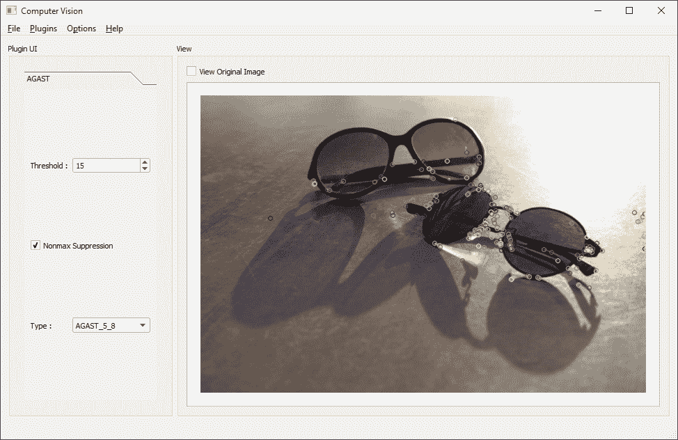
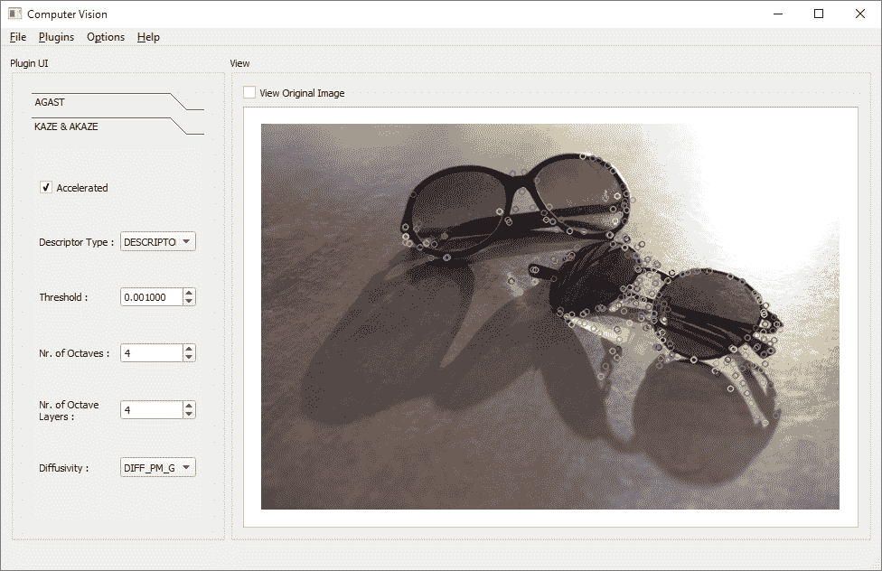
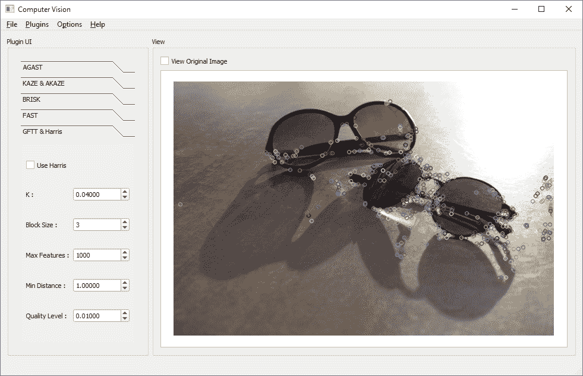
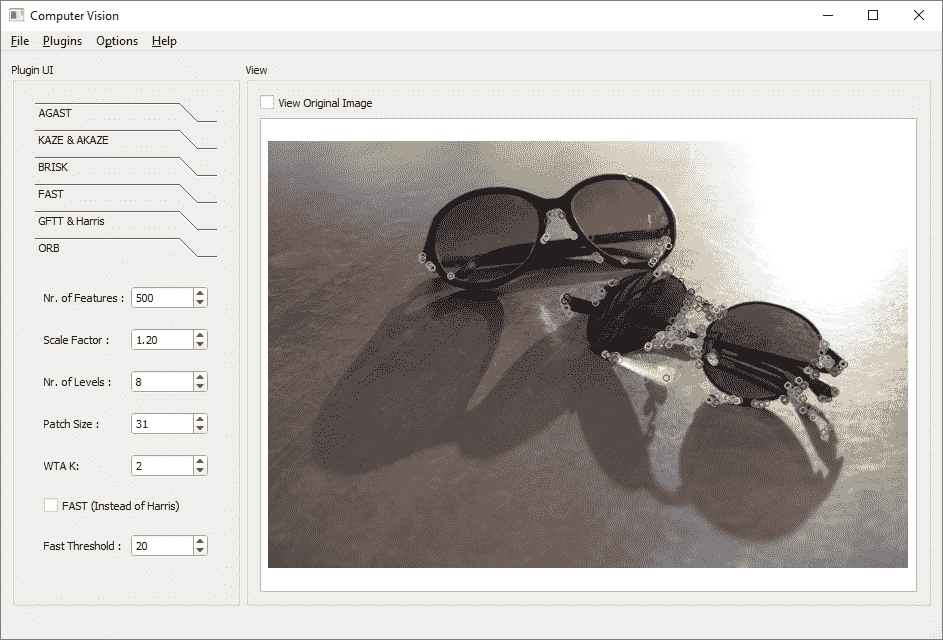
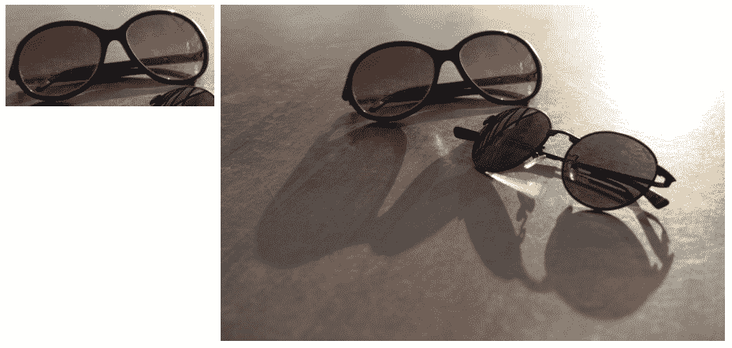
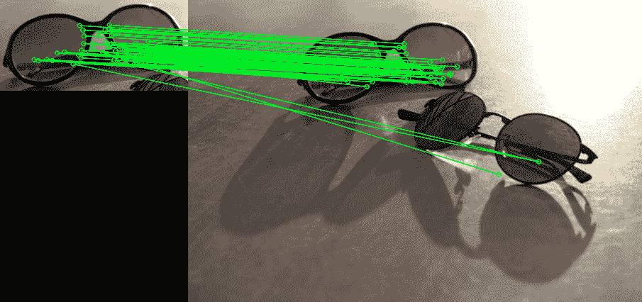
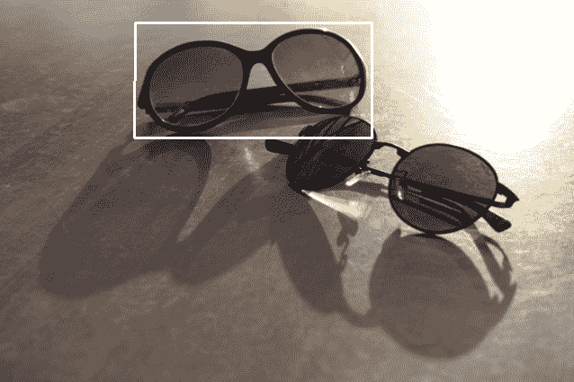

# 七、特征和描述符

在第 6 章，“OpenCV 中的图像处理”中，我们主要从图像内容和像素方面了解了图像处理。 我们学习了如何对它们进行过滤，转换或以一种或另一种方式处理像素值。 甚至为了匹配模板，我们仅使用原始像素内容来获取结果，并找出图像中是否存在对象。 但是，我们仍未了解使我们能够区分不同种类的对象的算法，这些算法不仅基于原始像素，而且还基于图像的特定特征来区分图像的总体含义。 识别和识别不同类型的人脸，汽车，文字以及几乎任何可见和视觉的对象，这对他们来说几乎是一件微不足道的任务，因为它们并不十分相似。 对于我们人类来说，这种情况在大多数情况下都是在我们根本没有考虑的情况下发生的。 我们甚至可以根据大脑几乎自动拾取的微小且独特的碎片来区分非常相似的人脸，并在再次看到这些人脸时再次使用它们来识别人脸。 或者，以不同汽车品牌为例。 大多数主要汽车制造商的徽标几乎都被我们的大脑所窃取。 我们的大脑很容易地使用该徽标来区分汽车模型（或制造商）。 简而言之，一直以来，我们在观察周围环境及其周围的一切时，我们的大脑在我们的眼睛的帮助下，在任何视觉对象中搜索可区分的部分（显然，在这种情况下，对象可以是任何东西） ，然后使用这些片段来识别相同或相似的视觉对象。 当然，即使是人的大脑和眼睛，也总是有出错的机会，而且事实是，我们可能会简单地忘记特定物体（或面部）的外观。

我们在引言段落中刚刚描述的内容也是创建许多用于相同目的的计算机视觉算法的基础。 在本章中，您将学习 OpenCV 框架中一些最重要的类和方法，这使我们能够在图像（或图像中的对象）中找到称为**特征**（或关键点）的可区分片段。 然后，我们将继续学习描述符，顾名思义，这些描述符是对找到的特征的描述。 因此，我们将学习如何检测图像中的特征，然后从特征中提取描述符。 这些描述符然后可以在计算机视觉应用中用于许多目的，包括两个图像的比较，单应性变化检测，在图像内部定位已知对象等等。 重要的是要注意，保存，处理图像的特征和描述符并基本上执行任何操作通常比尝试使用图像本身更快，更容易，因为特征和描述符只是一堆数值，尝试以一种或另一种方式描述图像，具体取决于用于检测特征和提取描述符的算法。

您可以从到目前为止所看到的内容中轻松猜出，尤其是在前几章的过程中，OpenCV 和 Qt 框架都是大量的工具，类，函数等等的集合，它们使您能够创建强大的计算机视觉应用或任何其他类型的应用。 因此，可以肯定地说的是，在一本书中涵盖所有这些框架都是不可能的，也是徒劳的。 相反，由于这两个框架都是以高度结构化的方式创建的，因此，只要我们对底层类的层次结构有清晰的了解，我们仍然可以了解我们第一次看到和使用的这些框架中的类或函数。 对于用于检测特征和提取描述符的类和方法，这几乎是完全正确的。 这就是为什么在本章中，我们将首先研究 OpenCV 中用于特征检测和描述符提取的类的层次结构，然后再深入探讨如何在实践中使用它们。

在本章中，我们将介绍以下主题：

*   OpenCV 中的算法是什么？
*   如何使用现有的 OpenCV 算法
*   使用`FeatureDetector`类检测特征（或关键点）
*   使用`DescriptorExtractor`类提取描述符
*   如何匹配描述符并将其用于检测
*   如何得出描述符匹配的结果
*   如何为我们的用例选择算法

# 所有算法的基础 – `Algorithm`类

OpenCV 中的所有算法或更好的算法，至少不是不太简短的算法，都被创建为`cv::Algorithm`类的子类。 与通常所期望的相反，该类不是抽象类，这意味着您可以创建它的实例，而该实例只是不执行任何操作。 即使将来可能会更改它，也不会真正影响我们访问和使用它的方式。 在 OpenCV 中使用`cv::Algorithm`类的方式，以及如果要创建自己的算法的推荐方法，是首先创建`cv::Algorithm`的子类，其中包含用于特定目的或目标的所有必需成员函数。 。 然后，可以再次对该新创建的子类进行子类化，以创建同一算法的不同实现。 为了更好地理解这一点，让我们首先详细了解`cv::Algorithm`类。 大致了解一下 OpenCV 源代码的外观：

```cpp
    class Algorithm 
    { 
      public: 
      Algorithm(); 
      virtual ~Algorithm(); 
      virtual void clear(); 
      virtual void write(FileStorage& fs) const; 
      virtual void read(const FileNode& fn); 
      virtual bool empty() const; 
      template<typename _Tp> 
        static Ptr<_Tp> read(const FileNode& fn); 
      template<typename _Tp> 
        static Ptr<_Tp> load(const String& filename, 
            const String& objname=String()); 
      template<typename _Tp> 
        static Ptr<_Tp> loadFromString(const String& strModel, 
            const String& objname=String()); 
      virtual void save(const String& filename) const; 
      virtual String getDefaultName() const; 
      protected: 
      void writeFormat(FileStorage& fs) const; 
    }; 
```

首先，让我们看看`cv::Algorithm`类中使用的`FileStorage`和`FileNode`类是什么（以及许多其他 OpenCV 类），然后介绍`cv::Algorithm`类中的方法：

*   `FileStorage`类可用于轻松地读写 XML，YAML 和 JSON 文件。 此类在 OpenCV 中广泛使用，以存储许多算法产生或需要的各种类型的信息。 此类几乎与任何其他文件读取器/写入器类一样工作，不同之处在于它可以与所提到的文件类型一起工作。
*   `FileNode`类本身是`Node`类的子类，用于表示`FileStorage`类中的单个元素。 `FileNode`类可以是`FileNode`元素集合中的单个叶子，也可以是其他`FileNode`元素的容器。

除了上一个列表中提到的两个类之外，OpenCV 还具有另一个名为`FileNodeIterator`的类，顾名思义，该类可用于遍历 STL 中的节点，例如循环。 让我们看一个小的示例，该示例描述在实践中如何使用上述类：

```cpp
    using namespace cv; 
    String str = "a random note"; 
    double d = 999.001; 
    Matx33d mat = {1,2,3,4,5,6,7,8,9}; 
    FileStorage fs; 
    fs.open("c:/dev/test.json", 
        FileStorage::WRITE | FileStorage::FORMAT_JSON); 
    fs.write("matvalue", mat); 
    fs.write("doublevalue", d); 
    fs.write("strvalue", str); 
    fs.release(); 
```

OpenCV 中的此类代码将导致创建 JSON 文件，如下所示：

```cpp
    { 
      "matvalue": { 
        "type_id": "opencv-matrix", 
        "rows": 3, 
        "cols": 3, 
        "dt": "d", 
        "data": [ 1.0, 2.0, 3.0, 4.0, 5.0, 6.0, 7.0, 8.0, 9.0 ] 
      }, 
      "doublevalue": 9.9900099999999998e+02, 
      "strvalue": "a random note" 
    } 
```

如您所见，`FileStorage`类几乎可以确保 JSON 文件的结构正确无误，并且以一种以后可以轻松检索的方式存储一切。 通常最好使用`isOpened`函数检查打开文件是否成功，为简单起见，我们跳过了该函数。 整个过程称为将类或数据结构序列化。 现在，要读回它，我们可以执行以下操作：

```cpp
    using namespace cv; 
    FileStorage fs; 
    fs.open("c:/dev/test.json", 
        FileStorage::READ | FileStorage::FORMAT_JSON); 
    FileNode sn = fs["strvalue"]; 
    FileNode dn = fs["doublevalue"]; 
    FileNode mn = fs["matvalue"]; 
    String str = sn; 
    Matx33d mat = mn; 
    double d = dn; 
    fs.release(); 
```

为了便于阅读，并演示`FileStorage`类实际上是在读取并创建`FileNode`类的实例，我们将每个值都分配给`FileNode`，然后再分配给变量本身，但是，很显然，您已经可以将读取节点的结果直接分配给适当类型的变量。 这两个类提供的功能远远超出此范围，它们绝对值得您亲自检查一下，但这对我们来说足够了，目的是解释`cv::Algorithm`类如何使用它们。 因此，现在我们了解到可以使用这些类轻松地存储和检索不同类型的类，甚至包括 OpenCV 特定的类型，我们可以更深入地研究`cv::Algorithm`本身。

如您先前所见，`cv::Algorithm`类在其声明以及其实现中都使用上述类来存储和检索算法的状态，即算法的基础参数，输入或输出值，等等。 为此，它提供了我们将简要介绍的方法。

现在，不必担心它们的详细用法，因为实际上它们是在子类中重新实现的，并且它们大多数的工作方式实际上取决于实现它的特定算法； 因此，我们仅关注 OpenCV 的结构及其组织方式。

这是`cv::Algorithm`类提供的方法：

*   `read`：这里有一些重载版本，可用于读取算法状态。
*   `write`：它类似于`read`，用于保存算法状态。
*   `clear`：可用于清除算法状态。
*   `empty`：可用于确定算法的状态是否为空。 例如，这意味着它是否正确加载（读取）。
*   `load`：与`read`几乎相同。
*   `loadFromString`：它与`load`和`read`非常相似，只是它从字符串读取并加载算法的状态。

看一下 OpenCV 网站上的`cv::Algorithm`文档页面（尤其是它的继承图），您会立即注意到 OpenCV 中大量实现它的类。 您可以猜测它们都具有前面提到的功能。 除此之外，它们中的每一个都提供特定于它们中每一个的方法和功能。 在重新实现`cv::Algorithm`的许多类中，有一个名为`Feature2D`的类，该类基本上是本章将要学习的类，它负责 OpenCV 中存在的所有特征检测和描述符提取算法。 此类及其子类在 OpenCV 中被称为 **2D 特征框架**（将其视为 OpenCV 框架的子框架），这是本章下一节的主题。

# 2D 特征框架

正如本章前面提到的，OpenCV 提供了类来执行由世界各地的计算机视觉研究人员创建的各种特征检测和描述符提取算法。 与 OpenCV 中实现的任何其他复杂算法一样，特征检测器和描述符提取器也通过将`cv::Algorithm`类子类化而创建。 该子类称为`Feature2D`，它包含所有特征检测和描述符提取类共有的各种函数。 基本上，任何可用于检测特征和提取描述符的类都应该是`Featured2D`的子类。 为此，OpenCV 使用以下两种类类型：

*   `FeatureDetector`
*   `DescriptorExtractor`

重要的是要注意，实际上这两个类都是`Feature2D`的不同名称，因为它们是使用以下`typedef`语句在 OpenCV 中创建的（我们将在本节后面讨论其原因） ）：

```cpp
    typedef Feature2D FeatureDetector; 
    typedef Feature2D DescriptorExtractor; 
```

看到`Feature2D`类的声明也是一个好主意：

```cpp
    class Feature2D : public virtual Algorithm 
    { 
      public: 
      virtual ~Feature2D(); 
      virtual void detect(InputArray image, 
        std::vector<KeyPoint>& keypoints, 
        InputArray mask=noArray() ); 
      virtual void detect(InputArrayOfArrays images, 
        std::vector<std::vector<KeyPoint> >& keypoints, 
        InputArrayOfArrays masks=noArray() ); 
        virtual void compute(InputArray image, 
          std::vector<KeyPoint>& keypoints, 
        OutputArray descriptors ); 
        virtual void compute( InputArrayOfArrays images, 
          std::vector<std::vector<KeyPoint> >& keypoints, 
          OutputArrayOfArrays descriptors ); 
        virtual void detectAndCompute(InputArray image, 
          InputArray mask, 
          std::vector<KeyPoint>& keypoints, 
          OutputArray descriptors, 
          bool useProvidedKeypoints=false ); 
          virtual int descriptorSize() const; 
          virtual int descriptorType() const; 
          virtual int defaultNorm() const;     
          void write( const String& fileName ) const; 
          void read( const String& fileName ); 
          virtual void write( FileStorage&) const; 
          virtual void read( const FileNode&); 
          virtual bool empty() const; 
    }; 
```

让我们快速回顾一下`Feature2D`类的声明中的内容。 首先，它是`cv::Algorithm`的子类，正如我们之前所学。 读，写和空函数只是`cv::Algorithm`中存在的简单重新实现的函数。 但是，以下函数是`cv::Algorithm`中的新增函数，不存在，它们基本上是特征检测器和描述符提取器所需的其他函数：

*   `detect`函数可用于从一个图像或一组图像中检测特征（或关键点）。
*   `compute`函数可用于从关键点提取（或计算）描述符。
*   `detectAndCompute`函数可用于执行单个特征的检测和计算。
*   `descriptorSize`，`descriptorType`和`defaultNorm`是算法相关的值，它们在每个能够提取描述符的`Feature2D`子类中重新实现。

看起来似乎很奇怪，但是有充分的理由以这种方式对特征检测器和描述符进行分类，并且只有一个类，这是因为某些算法（并非全部）都提供了特征检测和描述符提取函数。 随着我们继续为此目的创建许多算法，这将变得更加清晰。 因此，让我们从 OpenCV 2D 特征框架中现有的`Feature2D`类和算法开始。

# 检测特征

OpenCV 提供了许多类来处理图像中的特征（关键点）检测。 每个类都有自己的实现，具体取决于它实现的特定算法，并且可能需要一组不同的参数才能正确执行或具有最佳表现。 但是，它们所有的共同点就是前面提到的`detect`函数（因为它们都是`Feature2D`的子类），可用于检测图像中的一组关键点。 OpenCV 中的关键点或特征是`KeyPoint`类实例，其中包含为正确的关键点需要存储的大多数信息（这些术语，即关键点和特征，可以互换使用，并且很多，因此，请尝试习惯它）。 以下是`KeyPoint`类的成员及其定义：

*   `pt`或简单地指向：这包含关键点（`X`和`Y`）在图像中的位置。
*   `angle`：这是指关键点的顺时针旋转（0 到 360 度），即，检测到关键点的算法是否能够找到它； 否则，它将被设置为`-1`。
*   `response`：这是关键点的强度，可用于排序或过滤弱关键点，依此类推。
*   `size`：这是指指定可用于进一步处理的关键点邻域的直径。
*   `octave`：这是图像的八度（或金字塔音阶），从中可以检测到该特定关键点。 这是一个非常强大且实用的概念，在检测关键点或使用它们进一步检测图像上可能具有不同大小的对象时，已广泛用于实现与比例尺（比例尺不变）的独立性。 为此，可以使用相同的算法处理同一图像的不同缩放版本（仅较小版本）。 每个刻度基本上称为`octave`或金字塔中的一个等级。

为了方便起见，`KeyPoint`类提供了其他成员和方法，以便您可以自己检查一下，但是为了进一步使用它们，我们肯定经历了我们需要熟悉的所有重要属性。 现在，让我们看一下现有的 OpenCV 特征检测器类的列表，以及它们的简要说明以及如何使用它们的示例：

*   可以使用`AgastFeatureDetector`（包括 **AGAST**（**自适应和通用加速分段测试**）算法的实现）来检测图像中的角。 它需要三个参数（可以省略所有参数以使用默认值）来配置其行为。 这是一个例子：

```cpp
        Ptr<AgastFeatureDetector> agast = AgastFeatureDetector::create(); 
        vector<KeyPoint> keypoints; 
        agast->detect(inputImage, keypoints); 
```

如此简单，我们仅将`AgastFeatureDetector`与默认参数集一起使用。 在深入研究上述操作的结果之前，让我们首先看一下代码本身，因为其中使用了 OpenCV 中最重要和最实用的类之一（称为`Ptr`）。 如前面的代码所示，我们使用了`Ptr`类，它是 OpenCV 共享指针（也称为**智能指针**）的实现。 使用智能指针的优点之一是，您不必担心在使用完该类后释放为该类分配的内存。 另一个优点以及被称为共享指针的原因是，多个`Ptr`类可以使用（共享）单个指针，并且该指针（分配的内存）仅保留到`Ptr`指向的最后一个实例被摧毁为止。 在复杂的代码中，这可能意味着极大的简化。

接下来，请务必注意，您需要使用静态`create`函数来创建`AgastFeatureDetector`类的共享指针实例。 您将无法创建此类的实例，因为它是抽象类。 其余代码并不是新内容。 我们只需创建`KeyPoint`的`std::vector`，然后使用 AGAST 的基础算法检测输入`Mat`图像中的关键点。

编写相同代码的另一种方法（也许是更灵活的方法）是使用多态和`Feature2D`类。 因为`AgastFeatureDetector`实际上是`Feature2D`的子类，所以我们可以编写相同的代码，如下所示：

```cpp
    Ptr<Feature2D> fd = AgastFeatureDetector::create(); 
    vector<KeyPoint> keypoints; 
    fd->detect(inputImage, keypoints); 
```

当然，只有在我们希望在不同的特征检测算法之间切换而不创建和传递许多类的许多实例的情况下，这才证明是有用的。 这是一个示例，其中根据`alg`的值（可以是我们定义的枚举的条目，并且包括可能的算法的名称），可以使用 AGAST 或 AKAZE 算法来检测关键点 （我们将在本章后面看到）：

```cpp
    Ptr<Feature2D> fd; 
    switch(alg) 
    { 
      case AGAST_ALG: 
      fd = AgastFeatureDetector::create(); 
      break; 

      case AKAZE_ALG: 
       fd = AKAZE::create(); 
       break; 
    } 
    vector<KeyPoint> keypoints; 
    fd->detect(inputImage, keypoints); 
```

在讨论 AGAST 算法的参数之前，还有一个提示，即可以通过迭代检测到的关键点和绘制点（实际上是圆圈，但是它们与点一样小）来绘制检测到的关键点，如此处所示 ：

```cpp
    inputImage.copyTo(outputImage); 
    foreach(KeyPoint kp, keypoints) 
    circle(outputImage, kp.pt, 1, Scalar(0,0,255), 2); 
```

或者，甚至更好的是，使用 OpenCV 2D 特征框架中专用于此目的的`drawKeypoints`函数。 它的优点是您无需将图像复制到输出图像，并且还可以确保对关键点进行着色以使其更加可区分。 这是一个例子； 实际上，这是使用 OpenCV 中的 AGAST 算法检测和绘制关键点的完整代码：

```cpp
    Ptr<AgastFeatureDetector> agast = AgastFeatureDetector::create(); 
    vector<KeyPoint> keypoints; 
    agast->detect(inputImage, keypoints); 
    drawKeypoints(inputImage, keypoints, outputImage); 
```

我们将在示例中使用简单且非多态的方法，但是，如本章前面所述，使用多态并在适用于不同情况的不同算法之间进行切换始终更为实用。

假设左侧的图像是我们的原始测试图像，执行前面的代码将在右侧产生结果图像，如下所示：


这是结果图像的局部放大图：


如您所见，所有检测到的关键点都绘制在结果图像上。 同样，在运行任何特征检测功能之前运行某种模糊过滤器（如果图像太清晰）总是更好的选择。 这有助于减少不必要的（和不正确的）关键点。 其原因是，在清晰的图像中，即使是图像的最细微的点点也可以检测为边缘或拐​​角点。

在前面的示例中，我们仅使用了默认参数（省略了默认参数），但是为了更好地控制 AGAST 算法的行为，我们需要注意以下参数：

*   默认情况下设置为`10`的`threshold`值用于基于像素与围绕它的圆上的像素之间的强度差传递特征。 阈值越高意味着检测到的特征数量越少，反之亦然。
*   `NonmaxSuppression`可用于对检测到的关键点应用非最大抑制。 默认情况下，此参数设置为`true`，可用于进一步过滤掉不需要的关键点。
*   可以将`type`参数设置为以下值之一，并确定 AGAST 算法的类型：
    *   `AGAST_5_8`
    *   `AGAST_7_12d`
    *   `AGAST_7_12s`
    *   `OAST_9_16`（默认值）

您可以使用适当的 Qt 小部件从用户界面获取参数值。 这是 AGAST 算法的示例用户界面以及其底层代码。 另外，您可以下载本节末尾提供的完整`keypoint_plugin`源代码，其中包含该源代码以及以下特征检测示例，它们全部集成在一个插件中，与我们全面的`computer_vision`项目兼容：



请注意，当我们更改阈值并选择其他类型的 AGAST 算法时，检测到的关键点数量会发生变化。 在以下示例代码中，`agastThreshSpin`是旋转框小部件的`objectName`，`agastNonmaxCheck`是复选框的`objectName`，并且`agastTypeCombo`是用于选择类型的组合框的`objectName`：

```cpp
    Ptr<AgastFeatureDetector> agast =  
       AgastFeatureDetector::create(); 
    vector<KeyPoint> keypoints; 
    agast->setThreshold(ui->agastThreshSpin->value()); 
    agast->setNonmaxSuppression(ui->agastNonmaxCheck->isChecked()); 
    agast->setType(ui->agastTypeCombo->currentIndex()); 
    agast->detect(inputImage, 
                  keypoints); 
    drawKeypoints(inputImage, 
                  keypoints, 
                  outputImage); 
```

OpenCV 提供了一种便捷函数，可用于在不使用`AgastFeatureDetector`类的情况下直接在灰度图像上调用 AGAST 算法。 此函数称为`AGAST`（如果考虑名称空间，则称为`cv::AGAST`），并且通过使用它，我们可以编写相同的代码，如下所示：

```cpp
    vector<KeyPoint> keypoints; 
    AGAST(inputImage, 
          keypoints, 
          ui->agastThreshSpin->value(), 
          ui->agastNonmaxCheck->isChecked(), 
          ui->agastTypeCombo->currentIndex()); 
    drawKeypoints(inputImage, 
                  keypoints, 
                  outputImage); 
```

在本节中看到的算法以及在 OpenCV 中实现的几乎所有其他算法，通常都是基于研究研究和来自世界各地的已发表论文。 值得一看的是每种算法的相关论文，以清楚地了解其基本实现方式以及参数的确切效果以及如何有效使用它们。 因此，在每个示例的末尾，并且在研究了每种算法之后，如果您有兴趣，还将与您共享其参考文献（如果有）以供进一步研究。 第一个用于 AGAST 算法，出现在此信息框之后。

参考：`Elmar Mair, Gregory D. Hager, Darius Burschka, Michael Suppa, and Gerhard Hirzinger. Adaptive and generic corner detection based on the accelerated segment test. In European Conference on Computer Vision (ECCV'10), September 2010.`

让我们继续我们的特征检测算法列表。

# KAZE 和 AKAZE

`KAZE`和`AKAZE`（**加速 KAZE**）类可用于使用 KAZE 算法（其加速版本）检测特征。 有关 KAZE 和 AKAZE 算法的详细信息，请参考以下参考文献列表中提到的文件。 类似于我们在 AGAST 中看到的那样，我们可以使用默认参数集并简单地调用`detect`函数，或者我们可以使用适当的 Qt 小部件获取所需的参数并进一步控制算法的行为。 这是一个例子：



AKAZE 和 KAZE 中的主要参数如下：

*   `nOctaves`或八度的数量（默认为 4）可用于定义图像的最大八度。
*   `nOctaveLayers`或八度级别的数量（默认为 4）是每个八度（或每个比例级别）的子级别数。
*   扩散率可以采用下列项之一，它是 KAZE 和 AKAZE 算法使用的非线性扩散方法（如稍后在此算法的参考文献中所述）：
    *   `DIFF_PM_G1`
    *   `DIFF_PM_G2`
    *   `DIFF_WEICKERT`
    *   `DIFF_CHARBONNIER`
*   阈值是接受关键点的响应值（默认为 0.001000）。 阈值越低，检测到的（和接受的）关键点数量越多，反之亦然。
*   描述符类型参数可以是以下值之一。 请注意，此参数仅存在于 AKAZE 类中：
    *   `DESCRIPTOR_KAZE_UPRIGHT`
    *   `DESCRIPTOR_KAZE`
    *   `DESCRIPTOR_MLDB_UPRIGHT`
*   `descriptor_size`用于定义描述符的大小。 零值（也是默认值）表示完整尺寸的描述符。
*   `descriptor_channels`可用于设置描述符中的通道数。 默认情况下，此值设置为 3。

现在，不要理会与描述符相关的参数，例如描述符类型和大小以及通道数，我们将在后面看到。 这些相同的类也用于从特征中提取描述符，并且这些参数将在其中起作用，而不必检测关键点，尤其是`detect`函数。

这是前面示例用户界面的源代码，其中，根据我们前面示例用户界面中`Accelerated`复选框的状态，选择了 KAZE（未选中）或 AKAZE（加速）：

```cpp
    vector<KeyPoint> keypoints; 
    if(ui->kazeAcceleratedCheck->isChecked()) 
    { 
      Ptr<AKAZE> akaze = AKAZE::create(); 
      akaze->setDescriptorChannels(3); 
      akaze->setDescriptorSize(0); 
      akaze->setDescriptorType( 
        ui->akazeDescriptCombo->currentIndex() + 2); 
      akaze->setDiffusivity(ui->kazeDiffCombo->currentIndex()); 
      akaze->setNOctaves(ui->kazeOctaveSpin->value()); 
      akaze->setNOctaveLayers(ui->kazeLayerSpin->value()); 
      akaze->setThreshold(ui->kazeThreshSpin->value()); 
      akaze->detect(inputImage, keypoints); 
    } 
    else 
    { 
      Ptr<KAZE> kaze = KAZE::create(); 
      kaze->setUpright(ui->kazeUprightCheck->isChecked()); 
      kaze->setExtended(ui->kazeExtendCheck->isChecked()); 
      kaze->setDiffusivity(ui->kazeDiffCombo->currentIndex()); 
      kaze->setNOctaves(ui->kazeOctaveSpin->value()); 
      kaze->setNOctaveLayers(ui->kazeLayerSpin->value()); 
      kaze->setThreshold(ui->kazeThreshSpin->value()); 
      kaze->detect(inputImage, keypoints); 
    } 
    drawKeypoints(inputImage, keypoints, outputImage); 
```

参考文献：

```cpp
KAZE Features. Pablo F. Alcantarilla, Adrien Bartoli and Andrew J. Davison. In European Conference on Computer Vision (ECCV), Fiorenze, Italy, October 2012.

Fast Explicit Diffusion for Accelerated Features in Nonlinear Scale Spaces. Pablo F. Alcantarilla, Jesús Nuevo and Adrien Bartoli. In British Machine Vision Conference (BMVC), Bristol, UK, September 2013.
```
# `BRISK`类

`BRISK`类可用于使用 **BRISK**（**二进制鲁棒不变可缩放关键点**）算法检测图像中的特征。 请确保参考以下文章，以获取有关其工作方式以及 OpenCV 中基础实现的详细信息。 不过，用法与我们在 AGAST 和 KAZE 中看到的用法非常相似，其中使用`create`函数创建了类，然后设置了参数（如果我们不使用默认值），最后是`detect`函数被调用。 这是一个简单的例子：


以下是此类用户界面的源代码。 小部件名称很容易猜到，每个小部件名称对应 BRISK 算法所需的三个参数之一，它们是`thresh`（类似于`AGAST`类中的阈值，因为 BRISK 在内部使用了类似的方法），`octaves`（类似于 KAZE 和 AKAZE 类中的八度数）和`patternScale`（这是 BRISK 算法使用的可选模式缩放参数），默认情况下设置为 1：

```cpp
    vector<KeyPoint> keypoints; 
    Ptr<BRISK> brisk = 
        BRISK::create(ui->briskThreshSpin->value(), 
                      ui->briskOctaveSpin->value(), 
                      ui->briskScaleSpin->value()); 
    drawKeypoints(inputImage, keypoints, outputImage); 
```

参考文献：`Stefan Leutenegger, Margarita Chli, and Roland Yves Siegwart. Brisk: Binary robust invariant scalable keypoints. In Computer Vision (ICCV), 2011 IEEE International Conference on, pages 2548-2555. IEEE, 2011.`

# FAST

`FastFeatureDetector`类可用于使用`FAST`方法检测图像中的特征（“加速段测试中的特征”）。 FAST 和 AGAST 算法共享很多，因为它们都是使用加速段测试的方法，即使在 OpenCV 实现以及此类的使用方式中，这也是显而易见的。 确保参考该算法的文章以了解更多有关它的详细信息。 但是，我们将在另一个示例中重点介绍如何使用它：


并且，这是使用 FAST 算法从图像中检测关键点的此类用户界面的源代码。 所有三个参数的含义与 AGAST 算法的含义相同，不同之处在于类型可以是以下类型之一：

*   `TYPE_5_8`
*   `TYPE_7_12`
*   `TYPE_9_16`

参考文献：`Edward Rosten and Tom Drummond. Machine learning for high-speed corner detection. In Computer Vision-ECCV 2006, pages 430-443. Springer, 2006.`

# GFTT

GFTT（需要跟踪的良好特征）仅是特征检测器。 `GFTTDetector`可用于使用 Harris（以创建者命名）和 GFTT 角检测算法检测特征。 因此，是的，该类别实际上是将两种特征检测方法组合在一起的一个类别，原因是 GFTT 实际上是哈里斯算法的一种修改版本，使用的哪一种将由输入参数决定。 因此，让我们看看如何在示例案例中使用它，然后简要介绍一下参数：



这是此用户界面的相关源代码：

```cpp
    vector<KeyPoint> keypoints; 
    Ptr<GFTTDetector> gftt = GFTTDetector::create(); 
    gftt->setHarrisDetector(ui->harrisCheck->isChecked()); 
    gftt->setK(ui->harrisKSpin->value()); 
    gftt->setBlockSize(ui->gfttBlockSpin->value()); 
    gftt->setMaxFeatures(ui->gfttMaxSpin->value()); 
    gftt->setMinDistance(ui->gfttDistSpin->value()); 
    gftt->setQualityLevel(ui->gfttQualitySpin->value()); 
    gftt->detect(inputImage, keypoints); 
    drawKeypoints(inputImage, keypoints, outputImage); 
```

以下是`GFTTDetector`类的参数及其定义：

*   如果将`useHarrisDetector`设置为`true`，则将使用 Harris 算法，否则将使用 GFTT。 默认情况下，此参数设置为`false`。
*   `blockSize`可用于设置块大小，该块大小将用于计算像素附近的导数协方差矩阵。 默认为 3。
*   `K`是 Harris 算法使用的常数参数值。
*   可以设置`maxFeatures`或`maxCorners`来限制检测到的关键点数量。 默认情况下，它设置为 1000，但是如果关键点的数量超过该数量，则仅返回最强的响应。
*   `minDistance`是关键点之间的最小可接受值。 默认情况下，此值设置为 1，它不是像素距离，而是欧几里得距离。
*   `qualityLevel`是阈值级别的值，用于过滤质量指标低于特定级别的关键点。 请注意，实际阈值是通过将该值与图像中检测到的最佳关键点质量相乘得出的。

参考文献：

```cpp
Jianbo Shi and Carlo Tomasi. Good features to track. In Computer Vision and Pattern Recognition, 1994. Proceedings CVPR'94., 1994 IEEE Computer Society Conference on, pages 593-600. IEEE, 1994.

C. Harris and M. Stephens (1988). A combined corner and edge detector. Proceedings of the 4th Alvey Vision Conference. pp. 147-151.
```

# `ORB`

最后，ORB 算法，这是我们将在本节中介绍的最后一个特征检测算法。

`ORB`类可用于使用 ORB（**二进制鲁棒独立基本特征**）算法检测图像中的关键点。 此类封装了我们已经看到的一些方法（例如 FAST 或 Harris）来检测关键点。 因此，在类构造器中设置或使用设置器函数设置的某些参数与描述符提取有关，我们将在后面学习； 但是，ORB 类可用于检测关键点，如以下示例所示：



这是此类用户界面所需的源代码。 同样，小部件的`objectName`属性几乎是不言自明的，如上图所示，但让我们先看一下代码，然后详细查看参数：

```cpp
    vector<KeyPoint> keypoints; 
    Ptr<ORB> orb = ORB::create(); 
    orb->setMaxFeatures(ui->orbFeaturesSpin->value()); 
    orb->setScaleFactor(ui->orbScaleSpin->value()); 
    orb->setNLevels(ui->orbLevelsSpin->value()); 
    orb->setPatchSize(ui->orbPatchSpin->value()); 
    orb->setEdgeThreshold(ui->orbPatchSpin->value()); // = patch size 
    orb->setWTA_K(ui->orbWtaSpin->value()); 
    orb->setScoreType(ui->orbFastCheck->isChecked() ? 
                      ORB::HARRIS_SCORE 
                    : 
                      ORB::FAST_SCORE); 
    orb->setPatchSize(ui->orbPatchSpin->value()); 
    orb->setFastThreshold(ui->orbFastSpin->value()); 
    orb->detect(inputImage, keypoints); 
    drawKeypoints(inputImage, keypoints, outputImage); 
```

该序列与到目前为止我们看到的其他算法完全相同。 让我们看看设置了哪些参数：

*   `MaxFeatures`参数只是应该检索的最大关键点数。 请注意，检测到的关键点数量可能比此数量少很多，但永远不会更高。
*   `ScaleFactor`或金字塔抽取比率，与我们先前算法中看到的八度参数有些相似，用于确定金字塔每个级别的尺度值，这些尺度将用于检测关键点并从不同尺度提取同一张图片的描述符。 这就是在 ORB 中实现尺度不变性的方式。
*   `NLevels`是金字塔的等级数。
*   `PatchSize`是 ORB 算法使用的补丁的大小。 有关此内容的详细信息，请确保参考以下参考文献，但是对于简短说明，补丁大小决定了要提取描述的关键点周围的区域。 请注意，`PatchSize`和`EdgeThreshold`参数需要大约相同的值，在前面的示例中也将其设置为相同的值。
*   `EdgeThreshold`是在关键点检测期间将忽略的以像素为单位的边框。
*   `WTA_K`或 ORB 算法内部使用的 WTA 哈希的 K 值是一个参数，用于确定将用于在 ORB 描述符中创建每个元素的点数。 我们将在本章稍后看到更多有关此的内容。
*   可以设置为以下值之一的`ScoreType`决定 ORB 算法使用的关键点检测方法：
    *   `ORB::HARRIS_SCORE`用于哈里斯角点检测算法
    *   `ORB::FAST_SCORE`用于 FAST 关键点检测算法
*   `FastThreshold`只是 ORB 在关键点检测算法中使用的阈值。

参考文献：

```cpp
Ethan Rublee, Vincent Rabaud, Kurt Konolige, and Gary Bradski. Orb: an efficient alternative to sift or surf. In Computer Vision (ICCV), 2011 IEEE International Conference on, pages 2564-2571. IEEE, 2011.

Michael Calonder, Vincent Lepetit, Christoph Strecha, and Pascal Fua, BRIEF: Binary Robust Independent Elementary Features, 11th European Conference on Computer Vision (ECCV), Heraklion, Crete. LNCS Springer, September 2010.
```

而已。 现在，我们熟悉如何使用 OpenCV 3 中可用的各种算法检测关键点。当然，除非我们从这些关键点中提取描述符，否则这些关键点（或特征）几乎没有用； 因此，在下一节中，我们将学习从关键点提取描述符的方法，这将因此使我们获得 OpenCV 中的描述符匹配功能，在这里我们可以使用在本节中了解到的类来识别，检测，跟踪对象和对图像进行分类。 请注意，对于我们了解的每种算法，最好阅读本文以了解其所有细节，尤其是如果您打算构建自己的自定义关键点检测器，而只是按原样使用时，就像之前提到的，对它们的目的有一个清晰的认识就足够了。

# 提取和匹配描述符

计算机视觉中的描述符是一种描述关键点的方式，该关键点完全依赖于用于提取关键点的特定算法，并且与关键点（在`KeyPoint`类中定义的）不同，描述符没有共同的结构 ，除了每个描述符都代表一个关键点这一事实外。 OpenCV 中的描述符存储在`Mat`类中，其中生成的描述符`Mat`类中的每一行都引用关键点的描述符。 正如我们在上一节中了解到的，我们可以使用任何`FeatureDetector`子类的`detect`函数从图像上基本上检测出一组关键点。 同样，我们可以使用任何`DescriptorExtractor`子类的`compute`函数从关键点提取描述符。

由于特征检测器和描述符提取器在 OpenCV 中的组织方式（这都是`Feature2D`子类，正如我们在本章前面了解的那样），令人惊讶的是，将它们结合使用非常容易。 在本节中看到，我们将使用完全相同的类（或更确切地说，也提供描述符提取方法的类）从我们在上一节中使用各种类发现的关键点中提取特征描述符，以在场景图像中找到对象。 重要的是要注意，并非所有提取的关键点都与所有描述符兼容，并且并非所有算法（在这种情况下为`Feature2D`子类）都提供`detect`函数和`compute`函数。 不过，这样做的人还提供了`detectAndCompute`函数，可以一次性完成关键点检测和特征提取，并且比分别调用这两个函数要快。 让我们从第一个示例案例开始，以便使所有这些变得更加清晰。 这也是匹配两个单独图像的特征所需的所有步骤的示例，这些图像可用于检测，比较等：

1.  首先，我们将使用 AKAZE 算法（使用上一节中学习的`AKAZE`类）从以下图像中检测关键点：



我们可以使用以下代码从两个图像中提取关键点：

```cpp
      using namespace cv; 
      using namespace std; 
      Mat image1 = imread("image1.jpg"); 
      Mat image2 = imread("image2.jpg"); 
      Ptr<AKAZE> akaze = AKAZE::create(); 
      // set AKAZE params ... 
      vector<KeyPoint> keypoints1, keypoints2; 
      akaze->detect(image1, keypoints1); 
      akaze->detect(image2, keypoints2); 
```

2.  现在我们有了两个图像的特征（或关键点），我们可以使用相同的`AKAZE`类实例从这些关键点提取描述符。 这是完成的过程：

```cpp
        Mat descriptor1, descriptor2; 
        akaze->compute(image1, keypoints1, descriptor1); 
        akaze->compute(image2, keypoints2, descriptor2); 
```

3.  现在，我们需要匹配两个图像，这是两个图像中关键点的描述符。 为了能够执行描述符匹配操作，我们需要在 OpenCV 中使用一个名为`DescriptorMatcher`（非常方便）的类。 需要特别注意的是，此匹配器类需要设置为正确的类型，否则，将不会得到任何结果，或者甚至可能在运行时在应用中遇到错误。 如果在本示例中使用 AKAZE 算法来检测关键点并提取描述符，则可以在`DescriptorMatcher`中使用`FLANNBASED`类型。 这是完成的过程：

```cpp
        descMather = DescriptorMatcher::create( 
          DescriptorMatcher::FLANNBASED); 
```

请注意，您可以将以下值之一传递给`DescriptorMatcher`的创建函数，并且这完全取决于您用来提取描述符的算法，显然，因为将对描述符执行匹配。 您始终可以参考每种算法的文档，以了解可用于任何特定描述符类型的算法，例如`AKAZE`和`KAZE`之类的算法具有浮点类型描述符，因此可以将`FLANNBASED`与他们一起使用; 但是，具有`String`类型的描述符（例如`ORB`）将需要与描述符的汉明距离匹配的匹配方法。 以下是可用于匹配的现有方法：

+   `FLANNBASED`
+   `BRUTEFORCE`
+   `BRUTEFORCE_L1`
+   `BRUTEFORCE_HAMMING`
+   `BRUTEFORCE_HAMMINGLUT`
+   `BRUTEFORCE_SL2`

当然，最坏的情况是，当您不确定不确定时，尝试为每种特定的描述符类型找到正确的匹配算法时，只需简单地尝试每个。

4.  现在，我们需要调用`DescriptorMatcher`的`match`函数，以尝试将第一张图像（或需要检测的对象）中找到的关键点与第二张图像（或可能包含我们的对象的场景）中的关键点进行匹配。 `match`函数将需要一个`DMatch`向量，并将所有匹配结果填充其中。 这是完成的过程：

```cpp
        vector<DMatch> matches; 
        descMather->match(descriptor1, descriptor2, matches); 
```

`DMatch`类是简单类，仅用作保存匹配结果数据的结构：

5.  在深入研究如何解释匹配操作的结果之前，我们将学习如何使用`drawMatches`函数。 与`drawKeypoints`函数相似，`drawMatches`可用于自动创建适合显示的输出结果。 这是如何做：

```cpp
        drawMatches(image1, 
                    keypoints1, 
                    image2, 
                    keypoints2, 
                    matches, 
                    dispImg); 
```

在前面的代码中，`dispImg`显然是可以显示的`Mat`类。 这是结果图像：


如您所见，`drawMatches`函数将获取第一张和第二张图像及其关键点以及匹配结果，并会处理绘制适当结果所需的一切。 在此示例中，我们仅提供了必需的参数，这会导致颜色随机化并绘制所有关键点和匹配的关键点（使用将它们连接在一起的线）。 当然，还有一些其他参数可用于进一步修改其工作方式。 （可选）您可以设置关键点和线条的颜色，还可以决定忽略不匹配的关键点。 这是另一个例子：

```cpp
        drawMatches(image1, 
                    keypoints1, 
                    image2, 
                    keypoints2, 
                    matches, 
                    dispImg, 
                    Scalar(0, 255, 0), // green for matched 
                    Scalar::all(-1), // unmatched color (default) 
                    vector<char>(), // empty mask 
                    DrawMatchesFlags::NOT_DRAW_SINGLE_POINTS); 
```

这将产生以下结果：



现在，颜色更适合我们在这里使用的颜色。 还应注意一些很不正常的不正确匹配，可以通过修改 KAZE 算法的参数甚至使用其他算法来解决。 现在让我们看看如何解释匹配结果。

6.  解释匹配结果完全取决于用例。 例如，如果我们要匹配两个具有相同大小和相同内容类型的图像（例如人脸，相同类型的对象，指纹等），则我们可能需要考虑距离值高于某个阈值的，匹配的关键点数量。 或者，就像在当前示例中一样，我们可能希望使用匹配来检测场景中的对象。 这样做的一种常见方法是尝试找出匹配关键点之间的单应性变化。 为此，我们需要执行以下三个操作：
    *   首先，我们需要过滤出匹配结果，以消除较弱的匹配，换句话说，仅保留良好的匹配； 同样，这完全取决于您的场景和对象，但是通常，通过几次尝试和错误，您可以找到最佳阈值
    *   接下来，我们需要使用`findHomography`函数来获得好关键点之间的单应性变化
    *   最后，我们需要使用`perspectiveTransform`将对象边界框（矩形）转换为场景

您已了解`findHomography`和`perspectiveTransform`以及如何在第 6 章，“OpenCV 中的图像处理”中使用它们。

这是我们可以过滤掉不需要的匹配结果以获得良好匹配的方法。 请注意，匹配阈值的`0.1`值是通过反复试验得出的。 通常在匹配集中找到最小和最大距离，然后仅接受距离小于与最小距离相关的某个值的匹配，尽管这不是我们在此处所做的：

```cpp
    vector<DMatch> goodMatches; 
    double matchThresh = 0.1; 
    for(int i=0; i<descriptor1.rows; i++) 
    { 
      if(matches[i].distance < matchThresh) 
          goodMatches.push_back(matches[i]); 
    } 
```

在需要微调阈值的情况下，可以使用 Qt 框架和用户界面的功能。 例如，您可以使用 Qt 滑块小部件快速轻松地微调并找到所需的阈值。 只要确保将`matchThresh`替换为滑块小部件的值即可。

现在，我们可以使用良好的匹配找到单应性变化。 为此，我们首先需要根据匹配项过滤关键点，然后将这些过滤后的关键点（仅这些点）馈送到`findHomography`函数，以获得所需的变换矩阵或单应性更改。 这里是：

```cpp
    vector<Point2f> goodP1, goodP2; 
    for(int i=0; i<goodMatches.size(); i++) 
    { 
      goodP1.push_back(keypoints1[goodMatches[i].queryIdx].pt); 
      goodP2.push_back(keypoints2[goodMatches[i].trainIdx].pt); 
    } 
    Mat homoChange = findHomography(goodP1, goodP2); 
```

最后，我们可以使用刚刚发现的单应性变化矩阵将透视变换应用于匹配点。 为此，首先，我们需要构造与第一个图像的四个角相对应的四个点，然后应用变换，最后，简单地绘制连接四个结果点的四条线。 方法如下：

```cpp
    vector<Point2f> corners1(4), corners2(4); 
    corners1[0] = Point2f(0,0); 
    corners1[1] = Point2f(image1.cols-1, 0); 
    corners1[2] = Point2f(image1.cols-1, image1.rows-1); 
    corners1[3] = Point2f(0, image1.rows-1); 

    perspectiveTransform(corners1, corners2, homoChange); 

    image2.copyTo(dispImage); 

    line(dispImage, corners2[0], corners2[1], Scalar::all(255), 2); 
    line(dispImage, corners2[1], corners2[2], Scalar::all(255), 2); 
    line(dispImage, corners2[2], corners2[3], Scalar::all(255), 2); 
    line(dispImage, corners2[3], corners2[0], Scalar::all(255), 2); 
```

这是此操作的结果：



这实际上不是对这种方法功能强大程度的测试，因为对象基本上是从同一图像上剪切下来的。 这是运行相同过程的结果，但是这次第二张图像发生了旋转和透视图变化，甚至出现了一些噪点（这是使用智能手机从屏幕上拍摄的图像）。 即使第一张图片的一小部分在视图之外，结果也几乎是正确的：


出于参考目的，使用具有`DESCRIPTOR_KAZE`描述符类型，`0.0001`阈值，`4`八度，`4`八度和`DIFF_PM_G1`扩散率参数的 AKAZE 算法进行匹配和检测。 自己尝试具有不同照明条件和图像的不同参数。

我们还可以将`drawMatches`结果与检测结果结合起来，这意味着，我们可以在匹配结果图像上方绘制检测边界框，这可能会更有帮助，尤其是在微调参数或出于其他任何信息目的时 。 为此，您需要确保首先调用`drawMatches`函数以创建输出图像（在我们的示例中为`dispImg`变量），然后添加所有具有偏移值的点，因为`drawMatches`也将第一个图片在左侧输出。 此偏移量仅有助于将我们生成的边界框移到右侧，或者换句话说，将第一张图像的宽度添加到每个点的`X`成员。 这是完成的过程：

```cpp
    Point2f offset(image1.cols, 0); 

    line(dispImage, corners2[0] + offset, 
      corners2[1] + offset, Scalar::all(255), 2); 
    line(dispImage, corners2[1] + offset, 
      corners2[2] + offset, Scalar::all(255), 2); 
    line(dispImage, corners2[2] + offset, 
      corners2[3] + offset, Scalar::all(255), 2); 
    line(dispImage, corners2[3] + offset, 
      corners2[0] + offset, Scalar::all(255), 2); 
```

这是结果图像：


在前面的示例中，如您在结果中所看到的，图像以多种方式失真（例如比例，方向等），但是该算法仍然可以在一组正确的输入参数下表现良好。 从理论上讲，理想情况下，我们一直在寻找一种即用型算法，并且希望它在所有可能的情况下都能表现出色； 但是，不幸的是，在实践中，这种情况根本不会发生或很少发生。 在下一节中，我们将学习如何为用例选择最佳算法。

# 如何选择算法

如前所述，没有一种算法可以轻松地用于所有开箱即用的情况，其主要原因是与软件和硬件相关的因素种类繁多。 一个算法可能非常准确，但是同时，它可能需要大量资源（例如内存或 CPU 使用率）。

另一种算法可能需要较少的参数（几乎总是缓解），但同样，它可能无法达到其最高性能。 我们甚至无法开始列出影响选择最佳`Feature2D`（或特征检测器和描述符提取器）算法或最佳匹配算法的所有可能因素，但我们仍可以考虑一些主要且更知名的因素，这也是从结构上来讲，按原样创建 OpenCV 和大多数计算机视觉算法的原因。 以下是这些因素：

*   准确率
*   速度
*   资源使用情况（内存，磁盘空间等）
*   可用性

请注意，表现一词通常是指准确率，速度和资源使用情况的组合。 因此，我们所寻找的本质上是一种表现达到我们要求的算法，并且该算法可用于需要我们的应用进行工作的一个或多个平台。 值得一提的是，您作为工程师还可以影响这些参数，特别是通过将用例缩小到恰好需要的范围。 让我们通过刚才提到的因素来解释这一点。

# 准确率

首先，准确率非常容易引起误解，因为一旦看到准确率下降，我们通常会倾向于放弃算法，但是正确的方法是首先弄清楚用例的准确率要求。 查看由非常著名的公司生产的基于计算机视觉的机器的数据表，您会立即发现诸如 95% 以上的东西，依此类推。 这并不意味着机器不完美。 相反，这意味着机器的精度是明确定义的，用户可以期望达到一定的精度，同时，他们可以承受一定的低误差。 话虽这么说，它总是很好，建议目标是 100% 的准确率。

除了浏览该算法的论文和参考文献，还有更好的办法，亲自尝试一下，没有比这更好的方法来为您的用例选择一种准确的算法。 确保使用 Qt 中的适当小部件创建用户界面，以便您可以轻松地尝试现有（甚至可能是您自己的）算法。 创建基准并确保您完全了解更改阈值或其他参数时任何特定算法的行为。

另外，请确保根据比例和旋转独立性方面的需要选择算法。 例如，在 AKAZE 中，使用标准 AKAZE 描述符类型（非直立），该算法允许旋转独立，因此您的匹配甚至可以与旋转对象一起使用。 或者，使用较高的八度（或金字塔等级）数字，因为这可以帮助匹配不同大小的图像，从而实现比例独立。

# 速度

如果您正在开发实时应用，其中 **FPS**（**每秒帧**或帧速率）值必须尽可能高，则算法执行的速度尤为重要。 因此，与准确率一样，您也需要小心以澄清此要求。 如果您匹配两幅图像并向用户显示一些匹配结果，则即使半​​秒（500 毫秒）的延迟仍然可以接受，但是当使用高 FPS 值时，每帧的半秒延迟会非常高 。

您可以在 OpenCV 中使用`TickMeter`类或`getTickFrequency`和`getTickCount`函数来测量计算机视觉进程（或与此相关的任何进程）的执行时间。 首先，让我们看看旧方法的工作原理：

```cpp
    double freq = cv::getTickFrequency(); 
    double tick = cv::getTickCount(); 
    processImage(); // Any process 
    double dur = (cv::getTickCount() - tick) / freq; 
```

`getTickFrequency`函数可用于以秒（或频率）为单位获取 CPU 滴答计数。 同样，`getTickCount`可用于获取自启动以来传递的 CPU 滴答声数量。 因此，很明显，在前面的示例代码中，我们将获得执行`processImage`函数的持续时间（以秒为单位）。

但是`TickMeter`类提供了更大的灵活性，并且更易于使用。 您只需在任何过程之前启动它，然后在该过程之后停止它。 这是完成的过程：

```cpp
    cv::TickMeter meter; 
    meter.start(); 
    processImage(); // Any process 
    meter.stop(); 
    meter.getTimeMicro(); 
    meter.getTimeMilli(); 
    meter.getTimeSec(); 
    meter.getTimeTicks(); 
```

在满足您精度要求的不同算法之间进行切换，并使用此技术测量其速度，然后选择最适合您的算法。 尝试远离经验法则，例如 ORB 更快，或者 BRISK 更准确，等等。 即使具有`String`类型的描述符（例如 ORB）通常在匹配方面也更快（因为它们使用汉明距离）； 最新的算法（例如 AKAZE）可以使用 GPU 和 OpenCV `UMat`（请参阅第 4 章，“`Mat`和`QImage`”，以了解有关`UMat`类的更多信息） 。 因此，请尝试使用您的度量或任何受信任的度量参考作为经验法则的来源。

您也可以使用 Qt 的`QElapsedTimer`类，类似于 OpenCV 的`TickMeter`类，来测量任何进程的执行时间。

# 资源使用

尤其是对于较新的高端设备和计算机，这通常不是什么大问题，但是对于磁盘和内存空间有限的计算机（例如嵌入式计算机），这仍然可能是个问题。 为此，请尝试使用操作系统随附的资源监视器应用。 例如，在 Windows 上，您可以使用任务管理器应用查看已使用的资源，例如内存。 在 MacOS 上，您可以使用“活动监视器”应用甚至查看每个程序使用的电池电量（能量）以及内存和其他资源使用情况信息。 在 Linux 上，您可以使用多种工具（例如系统监视器）来实现完全相同的目的。

# 可用性

即使 OpenCV 和 Qt 都是跨平台框架，算法（甚至是类或函数）仍然可以依赖于平台特定的功能，尤其是出于性能方面的考虑。 重要且显而易见的是，您需要确保使用的算法在旨在发布您的应用的平台上可用。最好的来源通常是 OpenCV 和 Qt 框架中基础类的文档页面。 。

您可以从以下链接下载用于关键点检测，描述符提取和描述符匹配的完整源代码。 您可以使用同一插件在准确率和速度方面比较不同的算法。 不用说，[此插件与我们在整本书中一直构建的`computer_vision`项目兼容](https://github.com/PacktPublishing/Computer-Vision-with-OpenCV-3-and-Qt5/tree/master/ch07/keypoint_plugin)。

# 总结

特征检测，描述和匹配可能是计算机视觉中最重要和最热门的主题，仍在不断发展和改进中。 本章介绍的算法只是世界上现有算法的一小部分，我们之所以选择介绍它们，是因为它们或多或少都可供公众免费使用，以及它们默认包含在`feature2d`模块下的 OpenCV 中。 如果您有兴趣了解更多算法，还可以查看**额外 2D 特征框架**（**xfeature2d**），其中包含非自由算法，例如 SURF 和 SIFT，或其他仍处于实验状态的算法。 当然，在构建它们以将其功能包括在 OpenCV 安装中之前，您需要单独下载它们并将其添加到 OpenCV 源代码中。 也建议。 但是，还要确保使用不同的图像和各种参数来尝试使用本章中学习的算法，以熟悉它们。

通过完成本章，您现在可以使用与特征和描述符相关的算法来检测关键点并提取特征并进行匹配以检测对象或相互比较图像。 使用本章介绍的类，您现在可以正确显示匹配操作的结果，还可以测量每个过程的性能来确定哪个更快。

在第 8 章，“多线程”中，我们将了解 Qt 中的多线程和并行处理（及其在 OpenCV 中的应用）以及如何从应用的主线程中，有效创建和使用分别存在的线程和进程。 利用下一章的知识，我们将准备处理继续在视频文件或摄像机帧中的连续帧上执行的视频处理和计算机视觉任务。