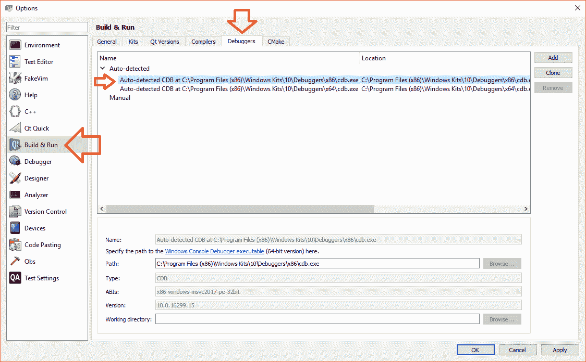
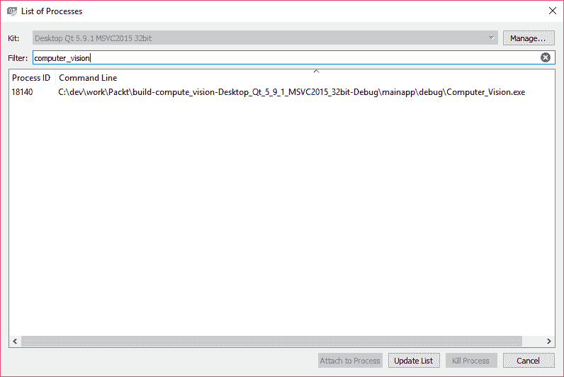
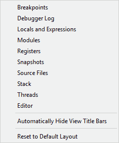
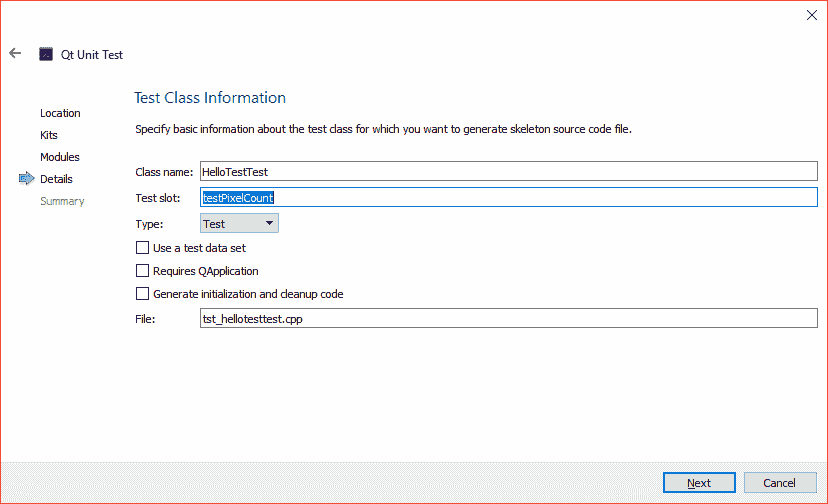
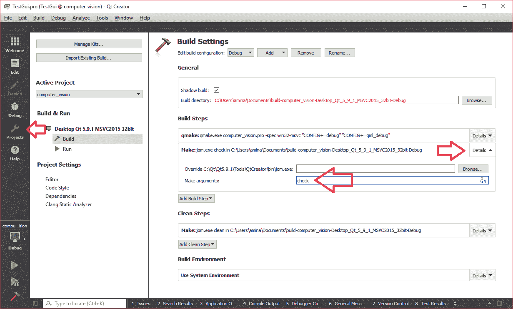

# 十、调试与测试

自从使用 OpenCV 3 和 Qt5 框架进行计算机视觉之旅以来，我们已经走了很长一段路。 现在，我们可以非常轻松地安装这些强大的框架，并配置运行 Windows，MacOS 或 Linux 操作系统的计算机，以便我们可以设计和构建计算机视觉应用。 在前几章中，我们学习了如何使用 Qt 插件系统来构建模块化和基于插件的应用。 我们学习了如何使用 Qt 样式表对应用进行样式设置，以及如何使用 Qt 中的国际化技术使其支持多种语言。 我们使用 Qt 图形视图框架构建了功能强大的图形查看器应用。 该框架中的类帮助我们更加有效地显示图形项目，并具有更大的灵活性。 我们能够构建可以放大和缩小图像的图形查看器，而不必处理源图像本身（这要归功于场景-视图-项目架构）。 后来，我们开始更深入地研究 OpenCV 框架，并且了解了许多类和函数，这些类和函数使我们能够以多种方式转换图像并对其进行处理，以实现特定的计算机视觉目标。 我们学习了用于检测场景中对象的特征检测和描述符提取。 我们浏览了 OpenCV 中的许多现有算法，这些算法旨在以更加智能的方式处理图像内容，而不仅仅是原始像素值。 在最近的章节中，我们了解了 Qt 提供的多线程和线程同步工具。 我们了解了 Qt 框架提供的用于处理应用中多线程的低级（`QThread`）和高级（`QtConcurrent`）技术，而与平台无关。 最后，在上一章中，我们学习了视频的实时图像处理以及可以跟踪具有特定颜色的对象的 OpenCV 算法。 到现在为止，我们应该以这样一种方式熟悉 Qt 和 OpenCV 框架的许多方面：我们自己可以跟进更高级的主题，并且仅依赖于文档。

除了前面提到的所有内容以及在前几章中我们取得的成就的一长串清单之外，我们仍然没有谈论软件开发的一个非常重要的方面以及在与 Qt 和 OpenCV 一起工作时如何处理软件，即测试过程。 在将计算机程序部署到该应用的用户之前，无论该程序是简单的小型二进制文件，大型计算机视觉应用还是任何其他应用，都必须经过测试。 测试是开发过程中一个永无止境的阶段，它是在开发应用后立即进行的，并且时不时地解决问题或添加新功能。 在本章中，我们将学习现有技术来测试使用 Qt 和 OpenCV 构建的应用。 我们将学习开发时间测试和调试。 我们还将学习如何使用 Qt 测试框架对应用进行单元测试。 在将应用交付给最终用户之前，这是最重要的过程。

我们将在本章中介绍的主题如下：

*   Qt Creator 的调试功能
*   如何使用 Qt 测试命名空间进行单元测试
*   数据驱动的测试
*   GUI 测试和重放 GUI 事件
*   创建测试用例项目

# 将 Qt Creator 用于调试

调试器是一种程序，在程序执行过程中突然崩溃或程序逻辑中发生意外行为时，可用于测试和调试其他程序。 在大多数情况下（如果不是总是），调试器用于开发环境中，并与 IDE 结合使用。 在我们的案例中，我们将学习如何在 Qt Creator 中使用调试器。 重要的是要注意，调试器不是 Qt 框架的一部分，并且像编译器一样，它们通常由操作系统 SDK 提供。 如果系统中存在调试器，则 Qt Creator 会自动检测并使用调试器。 可以通过依次通过主菜单“工具”和“选项”进入“Qt Creator 选项”页面进行检查。 确保从左侧列表中选择`Build&Run`，然后从顶部切换到`Debuggers`选项卡。 您应该能够在列表上看到一个或多个自动检测到的调试器。

**Windows 用户**：此信息框后，您应该会看到类似于屏幕截图的内容。 如果没有，则意味着您尚未安装任何调试器。 [您可以按照此处提供的说明轻松下载并安装它](https://docs.microsoft.com/en-us/windows-hardware/drivers/debugger/)。

或者，您可以独立地在线搜索以下主题：
Windows 调试工具（WinDbg，KD，CDB，NTSD）。

但是，在安装调试器之后（假定是 Microsoft Visual C++ 编译器的 CDB 或 Microsoft 控制台调试器，以及 GCC 编译器的 GDB），您可以重新启动 Qt Creator 并返回此页面。 您应该可以具有一个或多个类似于以下内容的条目。 由于我们已经安装了 32 位版本的 Qt 和 OpenCV 框架，因此选择名称中带有 x86 的条目以查看其路径，类型和其他属性。

**MacOS 和 Linux 用户**：
不需要执行任何操作，根据操作系统，您会看到 GDB，LLDB 或其他调试器中的条目。

这是“选项”页面上“构建和运行”选项卡的屏幕截图：



根据操作系统和已安装的调试器的不同，前面的屏幕快照可能会略有不同。 但是，您将需要一个调试器，以确保已正确设置为所用 Qt Kit 的调试器。 因此，记下调试器的路径和名称，并切换到 Kits 选项卡，然后在选择了所用的 Qt Kit 后，请确保正确设置了调试器，如以下屏幕快照所示：


不必担心选择错误的调试器或任何其他选项，因为在顶部选择的 Qt Kit 图标旁边会警告您相关的图标。 当工具包一切正常时，通常会显示下图所示的图标，左侧的第二个图标表示有问题的不正确，右侧的图标表示严重错误。 将鼠标移到该图标上时，可以查看有关解决该问题所需的详细操作的更多信息：


Qt 套件的关键问题可能是由许多不同的因素引起的，例如缺少编译器，这将使套件在解决问题之前完全无用。 Qt 套件中的警告消息示例可能是缺少调试器，这不会使套件无用，但您将无法将其与调试器一起使用，因此，与完全配置的 Qt 套件相比，它意味着功能更少。

正确设置调试器后，您可以采用以下几种方法之一开始调试应用，这些方法基本上具有相同的结果：最终进入 Qt Creator 的调试器视图：

*   在调试模式下启动应用
*   附加到正在运行的应用（或进程）

请注意，可以通过多种方式来启动调试过程，例如通过将其附加到在另一台计算机上运行的过程中来远程启动。 但是，上述方法在大多数情况下就足够了，尤其是与 Qt + OpenCV 应用开发以及我们在本书中学到的内容有关的情况。

# 调试模式入门

要在调试模式下启动应用，请在打开 Qt 项目后使用以下方法之一：

*   按下`F5`按钮
*   使用“开始调试”按钮，在通常的“运行”按钮下，带有类似图标，但上面有一个小错误
*   按以下顺序使用主菜单项：调试/开始调试/开始调试

要将调试器附加到正在运行的应用，可以按以下顺序使用主菜单项：调试/启动调试/附加到正在运行的应用。 这将打开“进程列表”窗口，从中可以使用其进程 ID 或可执行文件名选择应用或要调试的任何其他进程。 您还可以使用“过滤器”字段（如下图所示）来找到您的应用，因为很有可能进程列表很长。 选择正确的过程后，请确保按下“附加到过程”按钮。



无论使用哪种方法，都将最终进入 Qt Creator 调试模式，该模式与“编辑”模式非常相似，但是它还可以执行以下操作：

*   在代码中添加，启用，禁用和查看断点（断点只是我们希望调试器在过程中暂停的代码中的点或线，并允许我们对程序状态进行更详细的分析 ）
*   中断正在运行的程序和进程以查看和检查代码
*   查看和检查函数调用栈（调用栈是一个包含导致断点或中断状态的函数的层次结构列表的栈）
*   查看和检查变量
*   反汇编源代码（从这种意义上来说，反汇编意味着提取与我们程序中的函数调用和其他 C++ 代码相对应的确切指令）

在调试模式下启动应用时，您会注意到性能下降，这显然是因为调试器正在监视和跟踪代码。 这是 Qt Creator 调试模式的屏幕截图，其中前面提到的所有功能都可以在单个窗口中以及在 Qt Creator 的调试模式下看到：


您在本书中已经使用并且非常熟悉的代码编辑器中的上一个屏幕快照中用数字`1`指定的区域。 每行代码都有一个行号； 您可以单击其左侧以在代码中所需的任何位置切换断点。 您还可以右键单击行号以设置，删除，禁用或启用断点，方法是选择“在行 X 处设置断点”，“删除断点 X”，“禁用断点 X”或“启用断点 X”，其中所有提到的命令中的 X 这里需要用行号代替。 除了代码编辑器，您还可以使用前面的屏幕快照中编号为`4`的区域来添加，删除，编辑和进一步修改代码中的断点。

在代码中设置断点后，只要程序到达代码中的该行，它将被中断，并且您将被允许使用代码编辑器正下方的控件来执行以下任务：

*   **继续**：这意味着继续执行程序的其余流程（或再次按`F5`）。
*   **步过**：用于执行下一步（代码行），而无需进入函数调用或类似的代码，这些代码可能会更改调试光标的当前位置。 请注意，调试游标只是正在执行的当前代码行的指示器。 （这也可以通过按`F10`来完成。）
*   **单步执行**：与单步执行相反，它可以用于进一步深入函数调用，以更详细地分析代码和调试。 （与按`F11`相同。）
*   **退出**：可用于退出函数调用并在调试时返回到调用点。 （与按`Shift + F11`相同。）

您也可以右键单击包含调试器控件的代码编辑器下方的同一工具栏，以打开以下菜单，并添加或删除更多窗格以显示其他调试和分析信息。 我们将介绍默认的调试器视图，但请确保自行检查以下每个选项，以进一步熟悉调试器：



在前面的代码中用数字`2`指定的区域可用于查看调用栈。 无论您是通过按“中断”按钮还是在运行时从菜单中选择“调试/中断”来中断程序，设置断点并在特定代码行中停止程序，还是发生故障的代码都会导致程序陷入陷阱，并暂停该过程（因为调试器将捕获崩溃和异常），您始终可以查看导致中断状态的函数调用的层次结构，或者通过检查前面 Qt Creator 屏幕截图中的区域 2 来进一步分析它们。

最后，您可以使用上一个屏幕快照中的第三个区域在代码中被中断的位置查看程序的局部变量和全局变量。 您可以查看变量的内容，无论它们是标准数据类型（例如整数和浮点数还是结构和类），还可以进一步扩展和分析其内容以测试和分析代码中的任何可能问题。

有效地使用调试器可能意味着数小时的测试和解决您的代码中的问题。 就调试器的实际使用而言，实际上没有别的方法，只有尽可能多地使用它，并养成使用调试器的习惯，而且还要记下您在使用过程中发现的良好做法和技巧， 我们刚刚经历的那些。 如果您有兴趣，还可以在线阅读有关其他可能的调试方法的信息，例如远程调试，使用故障转储文件的调试（在 Windows 上）等。

# Qt 测试框架

在开发应用时进行调试和测试是完全不可避免的，但是许多开发人员往往会错过的一件事就是进行单元测试，这一点尤为重要，尤其是在大型项目和难以手动进行全面测试的应用中。 在构建它们的时间或在其代码中的某个位置修复了错误。 单元测试是一种测试应用中的零件（单元）以确保它们按预期工作的方法。 还值得注意的是，测试自动化是当今软件开发的热门话题之一，它是使用第三方软件或编程来自动化单元测试的过程。

在本节中，我们将学习精确使用 Qt 测试框架（即 Qt 测试命名空间）（以及一些其他与测试相关的类）的知识，这些知识可用于为使用 Qt 构建的应用开发单元测试。 与第三方测试框架相反，Qt 测试框架是内部（基于 Qt 框架本身）和轻量级测试框架，并且在其众多功能中，它提供基准测试，数据驱动的测试和 GUI。 测试：基准测试可用于衡量函数或特定代码段的性能，而数据驱动的测试可帮助运行使用不同数据集作为输入的单元测试。 另一方面，可以通过模拟鼠标和键盘的交互来进行 GUI 测试，这又是 Qt 测试框架涵盖的另一个方面。

# 创建单元测试

可以通过子类化`QObject`类并添加 Qt 测试框架所需的插槽以及一个或多个用于执行各种测试的插槽（测试函数）来创建单元测试。 下列插槽（专用插槽）可以存在于每个测试类中，并且除了测试函数外，还可以由 Qt Test 调用：

*   `initTestCase`：在调用第一个测试函数之前调用它。 如果此函数失败，则整个测试将失败，并且不会调用任何测试函数。
*   `cleanupTestCase`：在调用最后一个测试函数后调用。
*   `init`：在调用每个测试函数之前调用它。 如果此函数失败，将不会执行前面的测试函数。
*   `cleanup`：在调用每个测试函数后调用。

让我们用一个真实的例子创建我们的第一个单元测试，看看如何将刚才提到的函数添加到测试类中，以及如何编写测试函数。 为了确保我们的示例是现实的并且易于同时进行，我们将避免过多地担心要测试的类的实现细节，而主要关注于如何测试它们。 基本上，相同的方法可用于测试具有任何级别复杂性的任何类。

因此，作为第一个示例，我们假设我们有一个返回图像像素数量（宽度乘以图像高度）的类，并且我们想使用单元测试进行测试：

1.  可以使用 Qt Creator 创建单元测试，类似于创建 Qt 应用或库，也可以在“欢迎”模式下使用“新建项目”按钮，或者从“文件”菜单中选择“新建文件”或“项目”来创建单元测试。 确保选择以下内容作为项目模板：


2.  单击选择，然后输入`HelloTest`作为单元测试项目的名称，然后单击下一步。
3.  选择与 Qt 项目完全相同的工具包，然后再次单击“下一步”。

4.  在下一个屏幕截图中看到的“模块”页面中，您会注意到 QtCore 和 QtTest 模块是默认选择的，不能取消选择它们。 该页面只是一个帮助程序，或者是一个帮助您以交互方式选择所需模块的所谓向导。 如果忘记了添加类正常工作所需的模块，则以后也可以使用项目`*.pro`文件添加或删除模块。 这使得有必要再次重复一个重要的观点。 单元测试就像使用您的类和函数的应用一样。 唯一的区别是，您仅将其用于测试目的，并且仅用于确保事情按预期运行，并且没有回归：


5.  选择模块并单击下一步后，将显示“详细信息”页面或“测试类别信息”页面。 在以下屏幕截图中看到的“测试插槽”字段中输入`testPixelCount`，然后单击“下一步”。 其余选项（如前一个窗口）只是简单的帮助程序，可轻松地以交互方式添加所需的函数，并包括对测试单元的指令，如果缺少任何内容，也可以稍后在源文件中添加这些指令。 不过，本章稍后将了解它们的含义以及如何使用它们。



6.  确认所有对话框后，我们将进入 Qt Creator 编辑模式下的代码编辑器。 检查`HelloTest.pro`文件，您会注意到它与标准 Qt 项目（小部件或控制台应用）的`*.pro`文件非常相似，具有以下模块定义，可将 Qt 测试模块导入该项目。 这就是您可以在任何单元测试项目中使用 Qt Test 的方式。 但是，如果您不使用“新建文件”或“项目”向导，则该向导会自动添加：

```cpp
QT += testlib
```

在继续下一步之前，请确保像在 Qt Widgets 应用中一样将 OpenCV 库添加到 pro 文件。 （有关这方面的更多信息，请参阅本书的初始章节。）

7.  现在，添加您创建的类以将图像的像素计数到该项目中。 请注意，在这种情况下，添加和复制不是同一回事。 您可以在单独的文件夹中将属于另一个项目的类头文件和源文件添加到项目中，而无需将其复制到项目文件夹中。 您只需要确保它们包含在`*.pro`文件的`HEADERS`和`SOURCES`列表中，并且可以选择将类所在的文件夹添加到`INCLUDEPATH`变量中。

实际上，永远不要将要测试的类的源文件复制到测试项目中，正如我们将在本节中进一步讨论的那样，即使包含`subdirs`模板，也应始终使用`subdirs`模板制作单个项目，以便至少将一个单元测试添加到项目中，并在每次构建主项目时自动执行测试。 但是，严格来讲，无论您将类文件复制到其中还是将其简单地添加到它们中，单元测试都将以相同的方式工作。

8.  现在该编写我们的测试类了，因此在 Qt Creator 代码编辑器中打开`tst_hellotesttest.cpp`。 除了明显的`#include`指令外，这里还需要注意几件事：一个是`HelloTestTest`类，这是在“新建文件”或“项目”向导期间提供的类名称。 它不过是`QObject`子类，因此不要在此处查找任何隐藏内容。 它有一个称为`testPixelCount`的专用插槽，该插槽也是在向导期间设置的。 它的实现包括带有`QVERIFY2`宏的一行，我们将在后面的步骤中进行介绍。 但是，最后两行是新的：

```cpp
QTEST_APPLESS_MAIN(HelloTestTest) 
#include "tst_hellotesttest.moc"
```

`QTEST_APPLESS_MAIN`是由 C++ 编译器和`moc`扩展的宏（有关`moc`的更多信息，请参见第 3 章，“创建一个全面的 Qt + OpenCV 项目”），以创建适当的 C++  `main`函数来执行我们在`HelloTestTest`类中编写的测试函数。 它仅创建测试类的实例并调用`QTest::qExec`函数以启动测试过程。 测试过程将自动调用测试类中的所有专用插槽，并输出测试结果。 最后，如果我们在单个`cpp`源文件中创建测试类，而不是在单独的标头和源文件中创建 Qt 框架，则最后一行是必需的。 确保使用`include`指令将要测试的类添加到`tst_hellotesttest.cpp`文件中。 （为便于参考，我们假设其名为`PixelCounter`。）

9.  现在，您可以使用适当的测试宏之一来测试此类中负责计算图像像素的函数。 假设该函数采用文件名和路径（`QString`类型）并返回整数。 让我们使用`testPixelCount`插槽内已经存在的`VERIFY2`宏，如下所示：

```cpp
void HelloTestTest::testPixelCount() 
{ 
    int width = 640, height = 427; 
    QString fname = "c:/dev/test.jpg"; 
    PixelCounter c; 
    QVERIFY2(c.countPixels(fname) == width*height, "Failure"); 
} 
```

在此测试中，我们仅提供了一个图像文件，该图像文件的像素数已知（宽度乘以高度），以测试我们的函数是否正常工作。 然后，我们将创建`PixelCounter`类的实例，并最终执行`QVERIFY2`宏，该宏将执行`countPixels`函数（假设这是我们要测试的公共函数的名称），并根据比较失败或通过来进行测试。 如果测试失败，它也会输出`Failure`字符串。

我们刚刚建立了第一个单元测试项目。 单击运行按钮以运行此测试，并在 Qt Creator 输出窗格中查看结果。 如果测试通过，那么您将看到类似以下内容：

```cpp
********* Start testing of HelloTestTest ********* 
Config: Using QtTest library 5.9.1, Qt 5.9.1 (i386-little_endian-ilp32 shared (dynamic) debug build; by MSVC 2015) 
PASS   : HelloTestTest::initTestCase() 
PASS   : HelloTestTest::testPixelCount() 
PASS   : HelloTestTest::cleanupTestCase() 
Totals: 3 passed, 0 failed, 0 skipped, 0 blacklisted, 26ms 
********* Finished testing of HelloTestTest ********* 
```

如果发生故障，您将在输出中看到以下内容：

```cpp
********* Start testing of HelloTestTest ********* 
Config: Using QtTest library 5.9.1, Qt 5.9.1 (i386-little_endian-ilp32 shared (dynamic) debug build; by MSVC 2015) 
PASS   : HelloTestTest::initTestCase() 
FAIL!  : HelloTestTest::testPixelCount() 'c.countPixels(fname) == width*height' returned FALSE. (Failure) 
..HelloTesttst_hellotesttest.cpp(26) : failure location 
PASS   : HelloTestTest::cleanupTestCase() 
Totals: 2 passed, 1 failed, 0 skipped, 0 blacklisted, 26ms 
********* Finished testing of HelloTestTest ********* 
```

结果几乎是不言而喻的，但是我们可能需要注意一件事，那就是在所有测试函数之前调用`initTestCase`，在所有测试函数之后调用`cleanupTestCase`的事实， 正如我们前面提到的。 但是，由于这些函数实际上并不存在，因此它们被标记为`PASS`。 如果您实现这些函数并执行实际的初始化和完成任务，则可能会有所改变。

在前面的示例中，我们看到了单元测试的最简单形式，但现实情况是，编写一个高效且可靠的单元测试来解决所有可能的问题，这是一项艰巨的任务，并且与我们面对的情况相比要复杂得多。 为了能够编写适当的单元测试，您可以在每个测试函数中使用以下宏。 这些宏在`QTest`中定义如下：

*   `QVERIFY`：可用于检查是否满足条件。 条件只是一个布尔值或任何计算结果为布尔值的表达式。 如果不满足条件，则测试将停止，失败并记录在输出中；否则，测试将失败。 否则，它将继续。
*   `QTRY_VERIFY_WITH_TIMEOUT`：类似于`QVERIFY`，但是此功能尝试检查提供的条件，直到达到给定的超时时间（以毫秒为单位）或满足条件。
*   `QTRY_VERIFY`：类似于`QTRY_VERIFY_WITH_TIMEOUT`，但是超时设置为默认值 5 秒。
*   `QVERIFY2`，`QTRY_VERIFY2_WITH_TIMEOUT`和`QTRY_VERIFY2`：这些宏与名称非常相似的以前的宏非常相似，除了在测试失败的情况下函数还会输出给定消息之外，这些宏也是如此。
*   `QCOMPARE`：可用于将*实际*值与预期的值进行比较。 它非常类似于`QVERIFY`，不同之处在于此宏还输出实际值和期望值以供以后参考。
*   `QTRY_COMPARE_WITH_TIMEOUT`：类似于`QCOMPARE`，但是此函数尝试比较实际值和期望值，直到达到给定的超时时间（以毫秒为单位）或相等为止。
*   `QTRY_COMPARE`：类似于`QTRY_COMPARE_WITH_TIMEOUT`，但是超时设置为默认值 5 秒。

# 数据驱动的测试

除了与每个测试函数内部提供的输入数据进行简单比较外，`QTest`还提供了使用一组更有条理和结构化的输入数据执行单元测试的方法，以执行数据驱动的测试，或者换句话说，通过不同的输入数据集。 这是通过`QFETCH`宏以及`QTest::addColumn`和`QTest::newRow`函数来完成的。 `QFETCH`函数可在测试函数内使用，以获取所需的测试数据。 这需要为我们的测试函数创建一个数据函数。 数据函数还是另一个专用插槽，其名称与测试函数的名称完全相同，但名称后面附加了`_data`。 因此，如果我们回到前面的示例，要进行数据驱动的测试，我们需要在测试类中添加一个新的专用插槽，类似于以下内容：

```cpp
void HelloTestTest::testPixelCount_data() 
{ 
    QTest::addColumn<QString>("filename"); 
    QTest::addColumn<int>("pixelcount"); 

    QTest::newRow("huge image") << 
        "c:/dev/imagehd.jpg" << 2280000; 
    QTest::newRow("small image") << 
        "c:/dev/tiny.jpg" << 51200; 
} 
```

请注意，数据函数名称在其名称末尾附加了`_data`。 `QTest`中的测试数据被视为表格； 这就是为什么在数据函数中，`addColumn`函数用于创建新的列（或字段），而`addRow`函数用于向其中添加新的行（或记录）的原因。 前面的代码将产生类似于以下内容的测试数据表：

| **索引** | **名称（或标签）** | **文件名** | **像素计数** |
| --- | --- | --- | --- |
| 0 | 大图像 | `c:/dev/imagehd.jpg` | 2280000 |
| 1 | 小图像 | `c:/dev/tiny.jpg` | 51200 |

现在，我们可以修改测试函数`testPixelCount`以使用此测试数据，而不是在同一函数中使用提供的单个文件名。 我们新的`testPixelCount`看起来与此类似（同时，为了更好的测试日志输出，我们也将`QVERIFY`替换为`QCOMPARE`）：

```cpp
void HelloTestTest::testPixelCount() 
{ 
    PixelCounter c; 
    QFETCH(QString, filename); 
    QFETCH(int, pixelcount); 
    QCOMPARE(c.countPixels(filename), pixelcount); 
} 
```

重要的是要注意，必须为`QFETCH`提供在数据函数内部创建的测试数据中每一列的确切数据类型和元素名称。 如果我们再次执行测试，则测试框架将调用`testPixelCount`，与测试数据中的行一样多，每次它将通过获取并使用新行并记录输出来运行测试函数。 使用数据驱动的测试函数有助于保持实际的测试函数完整，并且不是从测试函数内部创建测试数据，而是从简单且结构化的数据函数中获取它们。 不用说，您可以扩展它以从磁盘上的文件或其他输入方法（例如网络位置）中获取测试数据。 无论数据来自何处，当数据函数存在时，数据都应完整存在并正确构造。

# 基准管理

`QTest`提供`QBENCHMARK`和`QBENCHMARK_ONCE`宏来测量函数调用或任何其他代码的性能（基准）。 这两个宏的区别仅在于它们重复一段代码以衡量其性能的次数，而后者显然只运行一次代码。 您可以通过以下方式使用这些宏：

```cpp
QBENCHMARK 
{ 
    // Piece of code to be benchmarked 
} 
```

同样，我们可以在前面的示例中使用它来衡量`PixelCounter`类的性能。 您可以简单地将以下行添加到`testPixelCount`函数的末尾：

```cpp
QBENCHMARK 
{ 
    c.countPixels(filename); 
} 
```

如果再次运行测试，您将在测试日志输出中看到类似于以下内容的输出。 请注意，这些数字仅是在随机测试 PC 上运行的示例，在各种系统上它们可能会有很大不同：

```cpp
23 msecs per iteration (total: 95, iterations: 4) 
```

前面的测试输出意味着每次使用特定的测试图像对函数进行测试都花费了 23 毫秒。 另一方面，迭代次数为`4`，用于基准测试的总时间约为 95 毫秒。

# GUI 测试

与执行特定任务的测试类相似，也可以创建用于测试 GUI 功能或小部件行为的单元测试。 在这种情况下，唯一的区别是需要为 GUI 提供鼠标单击，按键和类似的用户交互。 `QTest`支持通过模拟鼠标单击和其他用户交互来测试使用 Qt 创建的 GUI。 `QTest`命名空间中提供以下函数，以编写能够执行 GUI 测试的单元测试。 注意，几乎所有它们都依赖于以下事实：Qt 中的所有小部件和 GUI 组件都是`QWidget`的子类：

*   `keyClick`：可以用来模拟单击键盘上的按键。 为了方便起见，此函数有许多重载版本。 您可以选择提供修改键（`ALT`，`CTRL`等）和/或单击该键之前的延迟时间。 `keyClick`不应与`mouseClick`混淆，稍后我们将对其进行介绍，它指的是一次按键并释放，从而导致单击。
*   `keyClicks`：这与`keyClick`十分相似，但是它可以用于模拟序列中的按键单击，同样具有可选的修饰符或两者之间的延迟。
*   `keyPress`：这再次类似于`keyClick`，但是它仅模拟按键的按下，而不释放它们。 如果我们需要模拟按下一个键，这将非常有用。
*   `keyRelease`：这与`keyPress`相反，这意味着它仅模拟键的释放而没有按下键。 如果我们想使用`keyPress`模拟释放先前按下的键，这将很有用。
*   `keyEvent`：这是键盘模拟函数的更高级版本，带有一个附加的动作参数，该参数定义是否按下，释放，单击（按下并释放）键，或者它是快捷键。
*   `mouseClick`：类似于`keyClick`，但是它可以通过单击鼠标进行操作。 这就是为此函数提供的键是鼠标按钮（例如，左，右，中等）的原因。 键的值应该是`Qt::MouseButton`枚举的条目。 它还支持键盘修饰符和模拟点击之前的延迟时间。 此外，此函数和所有其他鼠标模拟函数还带有一个可选点（`QPoint`），其中包含要单击的小部件（或窗口）内的位置。 如果提供了一个空白点，或者如果省略了此参数，则模拟的点击将发生在小部件的中间。
*   `mouseDClick`：这是`mouseClick`函数的双击版本。
*   `mousePress`：这与`mouseClick`十分相似，但是仅模拟鼠标的按下，而不释放它。 如果要模拟按住鼠标按钮，这将很有用。
*   `mouseRelease`：与`mousePress`相反，这意味着它仅模拟鼠标按钮的释放而没有按下。 这可以用来模拟一段时间后释放鼠标按钮。
*   `mouseMove`：可以用来模拟在小部件上移动鼠标光标。 此函数必须提供点和延迟。 与其他鼠标交互函数类似，如果未设置任何点，则将鼠标移动到小部件的中间点。 与`mousePress`和`mouseRelease`结合使用时，此函数可用于模拟和测试拖放。

让我们创建一个简单的 GUI 测试以熟悉在实践中如何使用上述函数。 假设要测试已经创建的窗口或窗口小部件，则必须首先将其包含在 Qt 单元测试项目中。 因此，从创建单元测试项目开始，与在上一个示例以及我们的第一个测试项目中类似。 在项目创建期间，请确保还选择`QtWidgets`作为必需的模块之一。 然后，将窗口小部件类文件（可能是标头，源文件和 UI 文件）添加到测试项目。 在我们的示例中，我们假设我们有一个带有按钮和标签的简单 GUI。 每次按下该按钮，标签上的数字将乘以 2。 为了能够测试此功能或任何其他 GUI 功能，我们必须首先通过将其公开，确保表单，容器小部件或窗口上的小部件对测试类公开。 在实现此目的的许多方法中，最快，最简单的方法是在类声明中也以公共成员的身份定义相同的小部件。 然后，只需将`ui`变量（在使用“新建文件”或“项目”向导创建的所有 Qt 窗口小部件中找到的）变量中的类分配给整个类的成员。 假设我们窗口上的按钮和标签分别命名为`nextBtn`和`infoLabel`（使用设计器设计时），然后我们必须在类声明`public`成员中定义以下内容：

```cpp
QPushButton *nextBtn; 
QLabel *infoLabel; 
```

并且，我们必须在构造器中分配它们，如下所示：

```cpp
ui->setupUi(this); 
this->nextBtn = ui->nextBtn; 
this->infoLabel = ui->infoLabel; 
```

确保在调用`setupUi`之后始终分配使用设计器和 UI 文件创建的窗口小部件； 否则，您的应用肯定会崩溃，因为直到调用`setupUi`才真正创建任何小部件。 现在，假设我们的小部件类称为`TestableForm`，我们可以在测试类中拥有一个专用的`testGui`插槽。 请记住，每次按下`nextBtn`时，`infoLabel`上的数字都将乘以 2，因此`testGui`函数中可以有类似以下内容：

```cpp
void GuiTestTest::testGui() 
{ 
    TestableForm t; 

    QTest::mouseClick(t.nextBtn, Qt::LeftButton); 
    QCOMPARE(t.infoLabel->text(), QString::number(1)); 

    QTest::mouseClick(t.nextBtn, Qt::LeftButton); 
    QCOMPARE(t.infoLabel->text(), QString::number(2)); 

    QTest::mouseClick(t.nextBtn, Qt::LeftButton); 
    QCOMPARE(t.infoLabel->text(), QString::number(4)); 

 // repeated until necessary 
} 
```

替换以下行也非常重要：

```cpp
QTEST_APPLESS_MAIN(GuiTestTest) 
```

添加以下行：

```cpp
QTEST_MAIN(GuiTestTest) 
```

否则，不会在幕后创建`QApplication`，并且测试将完全失败。 使用 Qt 测试框架测试 GUI 时要记住这一点很重要。 现在，如果您尝试运行单元测试，则将单击`nextBtn`小部件 3 次，然后每次检查`infoLabel`显示的值是否正确。 如果发生故障，它将记录在输出中。 这很容易，但是问题是，如果所需交互的数量增加了怎么办？ 如果必须执行大量的 GUI 交互该怎么办？ 为了克服这个问题，您可以结合使用数据驱动的测试和 GUI 测试来轻松重放 GUI 交互（或事件，在 Qt 框架中称为事件）。 请记住，要在测试类中具有测试函数的数据函数，必须创建一个新函数，该函数的名称应与`_data`完全相同。 因此，我们可以创建一个名为`testGui_data`的新函数，该函数准备交互集和结果集，并使用`QFETCH`将其传递给测试函数，就像我们在前面的示例中使用的那样：

```cpp
void GuiTestTest::testGui_data() 
{ 
    QTest::addColumn<QTestEventList>("events"); 
    QTest::addColumn<QString>("result"); 

    QTestEventList mouseEvents; // three times 
    mouseEvents.addMouseClick(Qt::LeftButton); 
    mouseEvents.addMouseClick(Qt::LeftButton); 
    mouseEvents.addMouseClick(Qt::LeftButton); 
    QTest::newRow("mouse") << mouseEvents << "4"; 

    QTestEventList keybEvents; // four times 
    keybEvents.addKeyClick(Qt::Key_Space); 
    keybEvents.addDelay(250); 
    keybEvents.addKeyClick(Qt::Key_Space); 
    keybEvents.addDelay(250); 
    keybEvents.addKeyClick(Qt::Key_Space); 
    keybEvents.addDelay(250); 
    keybEvents.addKeyClick(Qt::Key_Space); 
    QTest::newRow("keyboard") << keybEvents << "8"; 
} 
```

`QTestEventList`类是 Qt 测试框架中的便捷类，可用于轻松创建 GUI 交互列表并对其进行仿真。 它包含添加所有我们之前提到的所有可能交互的功能，这些交互是可以使用 Qt Test 执行的可能事件的一部分。

要使用此数据函数，我们需要覆盖`testGui`函数，如下所示：

```cpp
void GuiTestTest::testGui() 
{ 
    TestableForm t; 
    QFETCH(QTestEventList, events); 
    QFETCH(QString, result); 
    events.simulate(t.nextBtn); 
    QCOMPARE(t.infoLabel->text(), result); 
} 
```

类似于任何数据驱动的测试，`QFETCH`获取由数据函数提供的数据。 但是，在这种情况下，存储的数据为`QEventList`，并填充了一系列必需的交互操作。 此测试方法在重放错误报告中的一系列事件以重现，修复和进一步测试特定问题方面非常有效。

# 测试用例项目

在前面的部分及其相应的示例中，我们看到了一些简单的测试用例，并使用 Qt Test 函数对其进行了解决。 我们了解了数据驱动和 GUI 测试，以及如何结合两者以重放 GUI 事件并执行更复杂的 GUI 测试。 我们在每种情况下学到的相同方法都可以进一步扩展，以应用于更复杂的测试用例。 在本节中我们将学习确保在构建项目时自动执行测试。 当然，根据测试所需的时间和我们的喜好，我们可能希望轻松地暂时跳过自动测试，但是最终，在构建项目时，我们将需要轻松执行测试。 为了能够自动运行您的 Qt 项目的测试单元（我们将其称为主项目），首先，我们需要确保始终使用`Subdirs`模板创建它们，然后将单元测试项目配置为测试案例项目。 这也可以通过已经存在但不在`Subdirs`模板中的项目来完成。 只需按照本节提供的步骤将现有项目添加到`Subdirs`模板，并为其创建一个单元测试（配置为测试用例），该单元测试在您构建主项目时将自动运行：

1.  首先使用 Qt Creator 中“欢迎”模式下的“新建项目”按钮创建一个新项目，或者从“文件”菜单中选择“新建文件”或“项目”项。

2.  确保选择`Subdirs`项目，如以下屏幕截图所示，然后单击“选择”：


3.  为您的项目选择一个名称。 该名称可以与您的主项目名称相同。 假设它称为`computer_vision`。 继续前进，然后在最后一个对话框中，单击“完成 & 添加子项目”按钮。 如果您是从头开始创建项目，则可以像整本书一样简单地创建项目。 否则，这意味着如果您想添加现有项目（假设在名为`src`的文件夹内），只需单击“取消”，然后将要为其构建测试的现有项目复制到此新创建的项目文件夹`subdirs`中。 然后，打开`computer_vision.pro`文件，并将其修改为类似于以下代码行：

```cpp
TEMPLATE = subdirs 
SUBDIRS += src
```

4.  现在，您可以创建一个单元测试项目，该项目也是`computer_vision`子目录项目的子项目，并对它进行编程以测试`src`文件夹中存在的类（您的主项目，它是实际的应用本身） ）。 因此，再次从项目窗格中右键单击`computer_vision`，然后通过选择“新建子项目”，开始使用在上一节中学到的所有内容来创建单元测试。
5.  创建测试后，无论使用哪个主项目查看测试结果，都应该能够单独运行它。 但是，要确保将其标记为测试用例项目，需要将以下代码行添加到单元测试项目的`*.pro`文件中：

```cpp
CONFIG += testcase 
```

6.  最后，您需要在 Qt Creator 中切换到项目模式，并将检查添加到`Make arguments`字段中，如以下屏幕截图所示。 确保首先使用“详细信息”扩展器按钮扩展“制作”部分； 否则，它将不可见：



现在，无论您是否专门运行单元测试项目都没有关系，并且每次运行主项目或尝试构建它时，测试都会自动执行。 这是一种非常有用的技术，可确保对一个库的更改不会对另一个库造成负面影响。 关于此技术要注意的重要一点是，测试结果实际上会影响构建结果。 意思是，您会在构建测试时注意到测试是否自动失败，并且测试结果将在 Qt Creator 的编译器输出窗格中可见，可以使用底部的栏或按`ALT + 4`键。

# 总结

在本章中，您学习了如何使用 Qt Creator 进行调试以及它提供的功能，以便进一步分析代码，发现问题并尝试使用断点，调用栈查看器等对其进行修复。 这只是使用调试器可以完成的工作的一点点尝试，它的目的是让您准备自己继续使用调试器，并养成自己的编码和调试习惯，从而可以帮助您克服更多编程问题。 缓解。 除了调试和开发人员级别的测试外，我们还了解了 Qt 中的单元测试，这对于使用 Qt 框架编写的越来越多的应用和项目尤其重要。 测试自动化是当今应用开发行业中的热门话题之一，对 Qt 测试框架有清晰的想法将有助于您开发更好和可靠的测试。 习惯于为项目编写单元测试非常重要，是的，即使是非常小的项目也是如此。 对于初学者或业余爱好者而言，测试应用和避免回归的成本并不容易理解，因此，为在开发生涯的后期肯定会遇到的事情做好准备是一个好主意。

在接近本书最后几章的同时，我们也越来越关注使用 Qt 和 OpenCV 进行应用开发的最后阶段。 因此，在下一章中，您将学习有关向最终用户部署应用的知识。 您还将了解应用的动态和静态链接，以及创建可以轻松安装在具有不同操作系统的计算机上的应用包。 下一章将是我们在台式机平台上使用 OpenCV 和 Qt 进行计算机视觉之旅的最后一章。