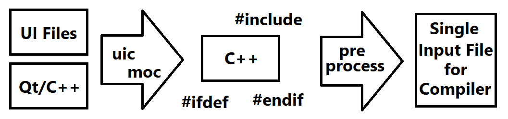
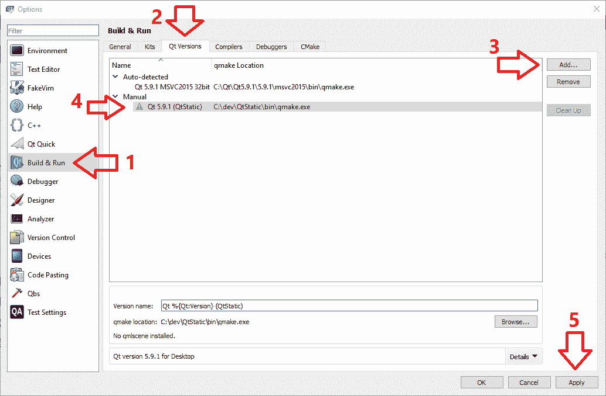
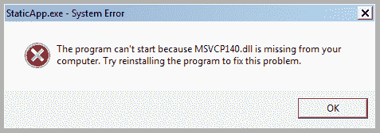

# 十一、链接与部署

在前几章中了解了使用 Qt Creator 和 Qt Test 框架调试和测试应用之后，我们进入了应用开发的最后阶段之一，即将应用部署到最终用户。 该过程本身具有多种变体，并且可以根据目标平台采取很多不同的形式，但是它们都有一个共同点，就是以一种可以在目标平台中简单地执行它的方式打包应用。 困扰应用的依赖项。 请记住，并非所有目标平台（无论是 Windows，MacOS 还是 Linux）都具有 Qt 和 OpenCV 库。 因此，如果继续进行操作，仅向应用的用户提供应用的可执行文件，它很可能甚至不会开始执行，更不用说正常工作了。

在本章中，我们将通过学习创建应用包（通常是包含所有必需文件的文件夹）的正确方法来解决这些问题，该应用包可以在我们自己的计算机以及开发环境以外的其他计算机上简单执行，而无需用户照顾任何必需的库。 为了能够理解本章中描述的一些概念，我们首先需要了解创建应用可执行文件时幕后发生情况的一些基础知识。 我们将讨论构建过程的三个主要阶段，即预处理，编译和链接应用可执行文件（或库）。 然后，我们将学习可以用两种不同的方式完成链接，即动态链接和静态链接。 我们将讨论它们之间的差异以及它们如何影响部署，以及如何在 Windows，MacOS 和 Linux 操作系统上动态或静态地构建 Qt 和 OpenCV 库。 之后，我们将为所有提到的平台创建并部署一个简单的应用。 我们将借此机会还了解 Qt Installer 框架，以及如何创建网站下载链接，闪存驱动器或任何其他媒体上交付给最终用户的安装程序。 到本章结束时，我们将仅向最终用户提供他们执行我们的应用所需的内容，仅此而已。

本章将讨论的主题包括：

*   Qt 和 OpenCV 框架的动态和静态链接
*   配置 Qt 项目来使用静态库
*   部署使用 Qt 和 OpenCV 编写的应用
*   使用 Qt Installer 框架创建跨平台安装程序

# 幕后制作过程

当我们通过编辑一些 C++ 头文件或源文件，在项目文件中添加一些模块并最后按下运行按钮来编写应用时，这似乎很自然。 但是，在幕后还有一些流程，这些流程通过按正确的顺序由 IDE（在我们的情况下为 Qt Creator）执行，从而使开发过程具有顺畅自然的感觉。 通常，当我们按 Qt Creator 或任何其他 IDE 的运行或构建按钮时，有三个主要过程可导致创建可执行文件（例如`*.exe`）。 这是这三个过程：

*   预处理
*   编译
*   链接

这是从源文件创建应用时所经过的过程和阶段的非常高级的分类。 这种分类允许对过程进行更简单的概述，并以更简单的方式大致了解其目的。 但是，这些过程包括许多子过程和阶段，不在本书的讨论范围之内，因为我们对以一种或另一种方式影响部署过程的过程最为感兴趣。 但是，您可以在线阅读它们，也可以阅读有关编译器和链接器的任何书籍。

# 预处理

此阶段是在将源代码传递到实际编译器之前将其转换为最终状态的过程。 为了进一步解释这一点，请考虑所有包含的文件，各种编译器指令，或更重要的是，对于 Qt 框架，请考虑不属于标准 C++ 语言的 Qt 特定的宏和代码。 在第 3 章，“创建全面的 Qt + OpenCV 项目”中，我们了解了`uic`和`moc`，它们可以转换使用 Qt 特定宏和准则编写的 UI 文件和 C++ 代码。 转换为标准 C++ 代码（确切地说，是在最新版本的 Qt 中，转换为 C++  11 或更高版本）。 即使这些不是对 C++ 源代码执行的标准预处理的一部分，但是当我们使用 Qt 框架或基于自己的规则集生成代码的框架时，它们仍处于大致相同的阶段。

下图描述了预处理阶段，该阶段与使用`uic`，`moc`等进行 Qt 特定的代码生成相结合：



该过程的输出在上一个图像中被标记为用于编译器的单个输入文件，显然是一个单个文件，其中包含用于编译源代码的所有必需标记和信息。 然后将该文件传递给编译器和编译阶段。

# 编译

在构建过程的第二个主要阶段，编译器获取预处理器的输出，或者在我们的示例中为预处理阶段，该输出还包括`uic`和`moc`生成的代码，并将其编译为机器代码。 。 可以在构建过程中保存并重复使用该机器代码，因为只要不更改源文件，生成的机器代码也将保持不变。 通过确保重复使用各个单独编译的对象（例如`*.obj`或`*.lib`文件），而不是在每次构建项目时都生成该对象，此过程有助于节省大量时间。 所有这一切的好处是，IDE 会照顾它，我们通常不需要理会它。 然后，由编译器生成的输出文件将传递到链接器，然后我们进入链接阶段。

# 链接

链接器是在构建过程链中被调用的最后一个程序，其目标是链接由编译器生成的对象以生成可执行文件或库。 这个过程对我们而言至关重要，因为它会对部署应用的方式，可执行文件的大小等产生巨大影响。 为了更好地理解这一点，首先我们需要讨论两种可能的链接类型之间的区别：

*   动态链接
*   静态链接

动态链接是链接编译器生成的对象的过程，方法是将函数的名称放在生成的可执行文件或库中，以使该特定函数的实际代码位于共享库（例如`*.dll`文件）中 ），并且库的实际链接和加载是在运行时完成的。 动态链接的最明显的优缺点是：

*   您的应用将在运行时需要共享库，因此您必须将它们与应用的可执行文件一起部署，并确保可以访问它们。 例如，在 Windows 上，可以通过将其复制到与应用可执行文件相同的文件夹中来完成，或者在 Linux 上，可以将它们放在默认库路径（例如`/lib/`）中来完成。
*   动态链接通过将应用的各个部分保留在单独的共享库文件中，提供了极大的灵活性。 这样，共享库可以单独更新，而无需重新编译应用的每个部分。

与动态链接相反，可以使用静态链接将所有必需的代码链接到生成的可执行文件中，从而创建静态库或可执行文件。 您可以猜测，使用静态库与使用共享库具有完全相反的优点和缺点，它们是：

*   您不需要部署用于构建应用的静态库，因为它们的所有代码实际上都已复制到生成的可执行文件中
*   应用可执行文件的大小将变大，这意味着更长的初始加载时间和更大的文件要部署
*   对库或应用任何部分的任何更改都需要对其所有组成部分进行完整的重建过程

在整本书中，特别是在为我们全面的计算机视觉应用开发插件时，我们使用了共享库和动态链接。 这是因为当我们使用所有默认的 CMake 设置构建 OpenCV，并使用第 1 章，“OpenCV 和 Qt 简介”中的官方安装程序安装 Qt 框架时， 动态链接和共享的库（Windows 上为`*.dll`，MacOS 上为`*.dylib`等）。 不过，在下一节中，我们将学习如何使用它们的源代码静态地构建 Qt 和 OpenCV 库。 通过使用静态链接库，我们可以创建不需要在目标系统上存在任何共享库的应用。 这可以极大地减少部署应用所需的工作量。 在 MacOS 和 Linux 操作系统中的 OpenCV 尤其如此，您的用户除了复制和运行您的应用外完全不需要执行任何操作，而他们将需要采取一些措施或必须执行一些脚本操作以确保执行您的应用时，所有必需的依赖项均已就绪。

# 构建 OpenCV 静态库

让我们从 OpenCV 开始，它遵循与构建动态库几乎相同的指令集来构建静态库。 您可以参考第 1 章，“OpenCV 和 Qt 简介”以获得更多信息。 只需下载源代码，解压缩并使用 CMake 来配置您的构建，如本章所述。 但是，这次，除了选中`BUILD_opencv_world`选项旁边的复选框外，还要取消选中每个选项旁边的复选框，以确保关闭了以下所有选项：

*   `BUILD_DOCS`
*   `BUILD_EXAMPLES`
*   `BUILD_PERF_TESTS`
*   `BUILD_TESTS`
*   `BUILD_SHARED_LIBS`
*   `BUILD_WITH_STATIC_CRT`（仅在 Windows 上可用）

关闭前四个参数仅是为了加快构建过程，并且是完全可选的。 禁用`BUILD_SHARED_LIBS`仅启用 OpenCV 库的静态（非共享）构建模式，而最后一个参数（在 Windows 上）有助于避免库文件不兼容。 现在，如果您使用第 1 章，“OpenCV 和 Qt 简介”中提供的相同说明开始构建过程，这次，而不是共享库（例如，在 Windows 上， `*.lib`和`*.dll`文件），您将在安装文件夹中得到静态链接的 OpenCV 库（同样，在 Windows 中，仅`*.lib`文件，没有任何`*.dll`文件）。 接下来需要做的是将项目配置为使用 OpenCV 静态库。 通过使用`*.pri`文件，或直接将它们添加到 Qt 项目`*.pro`文件中，您需要以下几行，以便您的项目可以使用 OpenCV 静态库：

```cpp
    win32: { 
      INCLUDEPATH += "C:/path_to_opencv_install/include" 
      Debug: { 
        LIBS += -L"C:/path_to_opencv_install/x86/vc14/staticlib"  
            -lopencv_world330d  
            -llibjpegd  
            -llibjasperd  
            -littnotifyd  
            -lIlmImfd  
            -llibwebpd  
            -llibtiffd  
            -llibprotobufd  
            -llibpngd  
            -lzlibd  
            -lipp_iw  
            -lippicvmt 
      } 
      Release: { 
        LIBS += -L"C:/path_to_opencv_install/x86/vc14/staticlib"  
            -lopencv_world330  
            -llibjpeg  
            -llibjasper  
            -littnotify  
            -lIlmImf  
            -llibwebp  
            -llibtiff  
            -llibprotobuf  
            -llibpng  
            -lzlib  
            -lipp_iw  
            -lippicvmt 
      } 
    } 
```

前面代码中库的顺序不是随机的。 这些库需要以其依赖关系的正确顺序包括在内。 您可以在 Visual Studio 2015 中自己检查一下，方法是从主菜单中选择`Project`，然后选择`Project Build Order…`。 对于 MacOS 用户，必须在前面的代码中将`win32`替换为`unix: macx`，并且库的路径必须与您的构建文件夹中的路径匹配。 对于 Linux，您可以使用与动态库相同的`pkgconfig`行，如下所示：

```cpp
    unix: !macx{ 
      CONFIG += link_pkgconfig 
      PKGCONFIG += opencv 
    } 
```

请注意，即使在 Windows OS 上以静态方式构建 OpenCV 时，输出文件夹中仍将有一个库作为动态库，即`opencv_ffmpeg330.dll`。 您无需将其包含在`*.pro`文件中； 但是，您仍然需要将其与应用可执行文件一起部署，因为 OpenCV 本身依赖于它才能支持某些众所周知的视频格式和编码。

# 构建 Qt 静态库

默认情况下，官方 Qt 安装程序仅提供动态 Qt 库。 在第 1 章，“OpenCV 和 Qt 简介”中也是如此，[当我们使用以下链接提供的安装程序在开发环境中安装 Qt 时](https://download.qt.io/official_releases/qt/5.9/5.9.1/)。

因此，简单来说，如果要使用静态 Qt 库，则必须使用其源代码自行构建它们。 您可以按照此处提供的步骤来配置，构建和使用静态 Qt 库：

1.  为了能够构建一组静态 Qt 库，您需要首先从 Qt 下载网站下载源代码。 通常将它们作为包含所有必需源代码的单个压缩文件（`*.zip`，`*.tar.xz`等）提供。 在我们的情况下（Qt 版本 5.9.1），[您可以使用以下链接下载 Qt 源代码](https://download.qt.io/official_releases/qt/5.9/5.9.1/single/)。

下载`qt-everywhere-opensource-src-5.9.1.zip`（或`*.tar.xz`），然后继续下一步。

2.  将源代码提取到您选择的文件夹中。 我们假定提取的文件夹名为`Qt_Src`，并且位于`c:/dev`文件夹中（在 Windows 操作系统上）。 因此，假设我们提取的 Qt 源代码的完整路径为`c:/dev/Qt_Src`。

对于 MacOS 和 Linux 用户，该路径可能类似于`Users/amin/dev/Qt_Src`，因此，如果您使用的是上述操作系统之一而不是 Windows，则需要在提供的所有引用它的说明中将其替换。 现在应该已经很明显了。

3.  现在，您需要先处理一些依赖关系，然后再继续下一步。 MacOS 和 Linux 用户通常不需要执行任何操作，因为默认情况下，所有必需的依赖项都存在于这些操作系统上。 但是，这不适用于 Windows 用户。 通常，在从源代码构建 Qt 之前，计算机上必须存在以下依赖项：
    *   [ActivePerl](https://www.activestate.com/activeperl/downloads)。
    *   [Python](https://www.python.org)，您需要版本 2.7.X，而 X 已被最新的现有版本替换，在撰写本书时为 14。
    *   为了方便 Windows 用户，在 Qt 源代码 ZIP 文件的`gnuwin32`子文件夹内提供了 Bison。 只需确保将`c:/dev/Qt_Src/gnuwin32/bin`添加到`PATH`环境变量即可。
    *   Flex 与 Bison 相同，位于`gnuwin32`子文件夹内，需要添加到`PATH`中。
    *   在`gnuwin32`子文件夹内提供了与 Bison 和 Flex 相同的 GNU `gperf`，需要将其添加到`PATH`中。

为确保一切正常，请尝试运行相关命令以执行我们刚刚提到的每个依赖项。 可能是您忘记将其中一个依赖项添加到`PATH`的情况，或者对于 MacOS 和 Linux 用户，由于任何可能的原因，它们已被删除并且不存在。 仅在命令提示符（或终端）中执行以下每个命令并确保您不会遇到无法识别或找不到的错误类型就足够了：
`perl`
`python bison`
`flex gperf`

4.  现在，在 Windows 上运行 VS2015 的开发人员命令提示符。 在 MacOS 或 Linux 上，运行终端。 您需要运行一组连续的命令，以根据源代码配置和构建 Qt。 该配置是此步骤中最关键的部分，是通过使用`configure`命令完成的。 `configure`命令位于 Qt 源文件夹的根目录中，接受以下参数（请注意，实际的参数集很长，因此我们可以满足使用最广泛的参数的要求）：

此处提供的参数列表应足以构建具有更多或更少默认设置的静态版本的 Qt 框架：

5.  现在是时候配置我们的 Qt 构建了。 首先，我们需要使用以下命令切换到 Qt 源代码文件夹：

```cpp
 cd c:/dev/Qt_Src"
```

6.  然后通过键入以下命令开始配置：

```cpp
 configure -opensource -confirm-license -static -skip webengine  
          -prefix "c:devQtStatic" -platform win32-msvc 
```

我们提供`-skip webengine`的原因是因为（编写本书时）目前尚不支持静态构建 Qt WebEngine 模块。 另请注意，我们提供了`-prefix`参数，这是我们要获取静态库的文件夹。您需要谨慎使用此参数，因为您不能稍后再复制它，并且由于您的构建配置， 静态库仅在它们保留在磁盘上的该位置时才起作用。 我们已经在参数列表中描述了其余参数。

您还可以将以下内容添加到`configure`命令中，以跳过可能不需要的部分并加快构建过程，因为这将花费很长时间：

```cpp
-nomake tests -nomake examples 
```

在 MacOS 和 Linux 上，必须从`configure`命令中省略以下部分。 这样做的原因仅仅是该平台将被自动检测的事实。 在 Windows 上当然也是如此，但是由于我们要强制 Qt 库的 32 位版本（以支持更大范围的 Windows 版本），因此我们将坚持使用此参数：

```cpp
-platform win32-msvc
```

根据您的计算机规格，配置过程不会花费太长时间。 配置完成后，您应该会看到类似以下的输出，否则，您需要再次仔细地执行上述步骤：

```cpp
Qt is now configured for building. Just run 'nmake'. 
Once everything is built, you must run 'nmake install'. 
Qt will be installed into 'c:devQtStatic'.

Prior to reconfiguration, make sure you remove any leftovers from 
the previous build. 
```

请注意，在 MacOS 和 Linux 上，上述输出中的`nmake`将替换为`make`。

7.  正如配置输出中提到的那样，您需要输入`build`和`install`命令。

在 Windows 上，使用以下命令：

```cpp
 nmake 
      nmake install 
```

在 MacOS 和 Linux 上，使用以下命令：

```cpp
 make 
      make install 
```

请注意，由于 Qt 框架包含许多需要构建的模块和库，因此第一个命令通常需要很长时间才能完成（取决于您的计算机规格），因此在此步骤中需要耐心等待。 无论如何，如果您到目前为止已经完全按照提供的所有步骤进行操作，则应该没有任何问题。

重要的是要注意，如果您使用计算机受限区域中的安装文件夹（`-prefix`参数），则必须确保使用管理员级别（如果使用 Windows）运行命令提示符实例（如果使用 Windows） 带有`sudo`前缀的`build`和`install`命令（如果您使用的是 MacOS 或 Linux）。

8.  运行`install`命令后，应该将静态 Qt 库放入配置过程中作为前缀参数提供的文件夹（即安装文件夹）中。 因此，在此步骤中，您需要在 Qt Creator 中将这组新建的 Qt 静态库添加为工具包。 为此，请打开 Qt Creator，然后从主菜单中选择“工具”，然后选择“选项”。 从左侧的列表中，选择`Build & Run`，然后选择`Qt Versions`选项卡。 现在，按“添加”按钮，然后浏览至`Qt build`安装文件夹，选择`qmake.exe`，在本例中，该文件应位于`C:devQtStaticbin`文件夹内。 以下屏幕截图显示了正确添加新的 Qt 构建后 Qt 版本标签中的状态：



9.  现在，切换到“套件”选项卡。 您应该能够看到整本书中用来构建 Qt 应用的工具包。 例如，在 Windows 上，它应该是 Desktop Qt 5.9.1 MSVC2015 32bit。 选择它并按“克隆”按钮，然后选择在上一步的“Qt 版本”选项卡中设置的 Qt 版本（如果您在那里看不到自己的版本，则可能需要按一次“应用”按钮，然后按“将显示在组合框中）。 另外，请确保从其名称中删除`Clone of`，并在其后附加`Static`一词，以便于区分。 以下屏幕快照表示“工具”选项卡的状态及其配置方式：


关于构建和配置静态 Qt 套件的问题。 现在，您可以使用与默认 Qt 套件（动态套件）完全相同的方式开始使用它创建 Qt 项目。 您唯一需要注意的就是在创建和配置 Qt 项目时将其选择为目标套件。 让我们用一个简单的例子来做到这一点。 首先创建一个 Qt Widgets 应用，并将其命名为`StaticApp`。 在“工具包选择”页面上，确保选择了新建的静态 Qt 工具包，然后继续按“下一步”，直到进入 Qt 代码编辑器。 以下屏幕快照描述了“工具包选择”页面及其外观（在 Window OS 上）：


无需进行太多更改或添加任何代码，只需按“运行”按钮即可构建并执行该项目。 现在，如果浏览到该项目的`build`文件夹，您会注意到可执行文件的大小比我们使用默认动态工具包进行构建时的大小要大得多。 为了进行比较，在 Windows 操作系统和调试模式下，动态构建的版本应小于 1 兆字节，而静态构建的版本应约为 30 兆字节，甚至更多。 如前所述，这样做的原因是所有必需的 Qt 代码现在都链接到可执行文件中。 尽管严格说来，从技术上讲它并不正确，但是您可以将其视为将库（`*.dll`文件等）嵌入可执行文件本身中。

现在，让我们尝试在示例项目中也使用静态 OpenCV 库。 只需将所需的附加内容添加到`StaticApp.pro`文件中，然后尝试使用几个简单的 OpenCV 函数（例如`imread`，`dilate`和`imshow`）来测试一组静态 OpenCV 库。 如果现在检查静态链接的可执行文件的大小，您会发现文件大小现在更大。 这样做的明显原因是所有必需的 OpenCV 代码都链接到可执行文件本身。

# 部署 Qt + OpenCV 应用

向最终用户提供应用包是非常重要的，该包包含它能够在目标平台上运行所需的一切，并且在照顾所需的依赖方面几乎不需要用户付出任何努力。 为应用实现这种*开箱即用*的条件主要取决于用于创建应用的链接的类型（动态或静态），以及目标操作系统。

# 使用静态链接的部署

静态部署应用意味着您的应用将独立运行，并且消除了几乎所有需要的依赖项，因为它们已经在可执行文件内部。 只需确保在构建应用时选择发布模式即可，如以下屏幕截图所示：


在发布模式下构建应用时，您只需选择生成的可执行文件并将其发送给用户。

如果尝试将应用部署到 Windows 用户，则在执行应用时可能会遇到类似于以下错误：



发生此错误的原因是，在 Windows 上，即使以静态方式构建 Qt 应用，您仍然需要确保目标系统上存在 Visual C++ 可再发行组件。 这是使用 Microsoft Visual C++ 生成的 C++ 应用所必需的，并且所需的可再发行版本与计算机上安装的 Microsoft Visual Studio 相对应。 在我们的案例中，这些库的安装程序的正式名称是 Visual Studio 2015 的 Visual C++ 可再发行组件，[可以从以下链接下载](https://www.microsoft.com/en-us/download/details.aspx?id=48145)。

通常的做法是在我们的应用的安装程序中包含可再发行文件的安装程序，如果尚未安装，请对其进行静默安装。 大多数情况下，您在 Windows PC 上使用的大多数应用都会执行此过程，而您甚至没有注意到它。

我们已经简要地讨论了静态链接的优点（要部署的文件较少）和缺点（可执行文件的大小较大）。 但是，当在部署环境中使用它时，还需要考虑更多的复杂性。 因此，当使用静态链接部署应用时，这是另一个（更完整的）缺点列表：

*   构建花费更多的时间，并且可执行文件的大小越来越大。
*   您不能混合使用静态和共享（动态）Qt 库，这意味着您不能使用插件的功能和扩展应用而无需从头开始构建所有内容。
*   从某种意义上说，静态链接意味着隐藏用于构建应用的库。 不幸的是，并非所有库都提供此选项，并且不遵守该选项可能导致应用出现许可问题。 之所以会出现这种复杂性，部分原因是 Qt 框架使用了一些第三方库，这些库没有提供与 Qt 本身相同的许可选项。 谈论许可问题不是适合本书的讨论，因此，当您计划使用 Qt 库的静态链接创建商业应用时，您*必须*一定要小心。 有关 Qt 内第三方库使用的许可证的详细列表，[您可以始终通过以下链接引用 Qt 网页中使用的*许可证*](http://doc.qt.io/qt-5/licenses-used-in-qt.html)。

有关 Qt 模块中使用的各种 LGPL 许可证及其版本（以及可在网上找到的许多其他开源软件）的完整参考，[请参考以下链接](https://www.gnu.org/licenses/)。

[您还可以使用以下链接完整讨论有关选择 Qt 开源许可证之前需要了解的知识](https://www.qt.io/qt-licensing-terms/)。

静态链接，即使有我们刚刚提到的所有缺点，仍然是一种选择，在某些情况下，如果您可以遵守 Qt 框架的许可选项，那么它还是一个很好的选择。 例如，在 Linux 操作系统中，为我们的应用创建安装程序需要额外的工作和精力，静态链接可以极大地减少部署应用所需的工作量（仅复制和粘贴）。 因此，是否使用静态链接的最终决定主要取决于您以及您打算如何部署应用。 当您对可能的链接和部署方法进行了概述时，到本章末尾，制定此重要决定将变得更加容易。

# 使用动态链接的部署

使用共享库（或动态链接）部署使用 Qt 和 OpenCV 构建的应用时，需要确保应用的可执行文件能够访问 Qt 和 OpenCV 的运行时库，以便加载和使用它们。 运行时库的这种可到达性或可见性取决于操作系统，可能具有不同的含义。 例如，在 Windows 上，您需要将运行时库复制到应用可执行文件所在的文件夹中，或将它们放在附加到`PATH`环境值的文件夹中。

Qt 框架提供了命令行工具，以简化 Windows 和 MacOS 上 Qt 应用的部署。 如前所述，您需要做的第一件事是确保您的应用是在“发布”模式而不是“调试”模式下构建的。 然后，如果您使用的是 Windows，请首先将可执行文件（假设我们将其称为`app.exe`）从构建文件夹复制到一个单独的文件夹（我们将其称为`deploy_path`），然后使用命令执行以下命令行实例：

```cpp
cd deploy_path 
QT_PATHbinwindeployqt app.exe
```

`windeployqt`工具是一个部署帮助工具，可简化将所需的 Qt 运行时库复制到与应用可执行文件相同的文件夹中的过程。 它只是将可执行文件作为参数，并在确定用于创建可执行文件的模块之后，复制所有必需的运行时库以及所有其他必需的依赖项，例如 Qt 插件，翻译等。 这将处理所有必需的 Qt 运行时库，但是我们仍然需要处理 OpenCV 运行时库。 如果您遵循第 1 章，“OpenCV 和 Qt 简介”中的所有步骤来动态构建 OpenCV 库，则只需手动复制`opencv_world330.dll`和`opencv_ffmpeg330.dll` 将文件从 OpenCV 安装文件夹（在`x86vc14bin`文件夹内）复制到应用可执行文件所在的文件夹中。

在本书的早期章节中构建 OpenCV 时，我们并没有真正受益于打开`BUILD_opencv_world`选项的好处。 但是，现在应该清楚的是，这通过以下方式简化了 OpenCV 库的部署和使用：在`*.pro`文件中只要求 LIBS 的单个条目，并且在以下情况下仅手动复制单个文件（不计算`ffmpeg`库）： 部署 OpenCV 应用。 还应注意的是，即使您在项目中不需要或不使用所有 OpenCV 代码的所有模块，此方法也存在沿应用复制所有 OpenCV 代码的缺点。

还请注意，在 Windows 上，如在“使用静态链接进行部署”一节中所述，您仍然需要类似地向应用的最终用户提供 Microsoft Visual C++ 重分发版。

在 MacOS 操作系统上，还可以轻松部署使用 Qt 框架编写的应用。 因此，可以使用 Qt 提供的`macdeployqt`命令行工具。 与`windeployqt`相似，该文件接受 Windows 可执行文件并用所需的库填充同一文件夹，`macdeployqt`接受 MacOS 应用捆绑包，并通过将所有必需的 Qt 运行时复制为捆绑包内部的私有框架，使其可部署。 这是一个例子：

```cpp
cd deploy_path 
QT_PATH/bin/macdeployqt my_app_bundle
```

（可选）您还可以提供一个附加的`-dmg`参数，该参数导致创建 macOS `*.dmg`（磁盘图像）文件。 至于使用动态链接时 OpenCV 库的部署，您可以使用 Qt Installer 框架（我们将在下一节中学习），第三方供应商或确保所需运行时库的脚本来创建安装程序。 复制到其所需的文件夹。 这是因为以下事实：仅将运行时库（无论是 OpenCV 还是其他文件）复制到与应用可执行文件相同的文件夹中，并不能使它们对 MacOS 上的应用可见。 这同样适用于 Linux 操作系统，不幸的是，该操作系统甚至还没有用于部署 Qt 运行时库的工具（至少目前是这样），因此除了 OpenCV 库，我们还需要照顾 Qt 库，方法是受信任的第三方供应商（您可以在线搜索）或通过使用 Qt 本身提供的跨平台安装程序，再结合一些脚本来确保执行我们的应用时所有内容都就位。

# Qt 安装程序框架

Qt 安装程序框架允许您为 Windows，MacOS 和 Linux 操作系统创建 Qt 应用的跨平台安装程序。 它允许创建标准的安装程序向导，在该向导中，用户会通过提供所有必要信息的连续对话框进入，并最终显示安装应用时的进度等，这与您可能遇到的大多数安装类似，尤其是安装 Qt 框架本身。 Qt 安装程序框架基于 Qt 框架本身，但以不同的包提供，并且不需要计算机上存在 Qt SDK（Qt 框架，Qt Creator 等）。 也可以使用 Qt Installer 框架来为任何应用（不仅仅是 Qt 应用）创建安装包。

在本节中，我们将学习如何使用 Qt Installer 框架创建基本的安装程序，该程序将在目标计算机上安装应用并复制所有必要的依赖项。 结果将是一个可执行的安装程序文件，您可以将其放在 Web 服务器上进行下载，或以 USB 记忆棒或 CD 或任何其他媒体类型提供。 该示例项目将帮助您自己着手解决 Qt Installer 框架的许多强大功能。

您可以使用以下链接下载并安装 Qt 安装程序框架。 使用此链接或其他任何下载源时，请确保仅下载最新版本。 目前，[最新版本是 3.0.2](https://download.qt.io/official_releases/qt-installer-framework)。

下载并安装 Qt Installer 框架之后，可以开始创建 Qt Installer 框架创建安装程序所需的必需文件。 您可以通过简单地浏览到 Qt Installer 框架并从`examples`文件夹复制`tutorial`文件夹来完成此操作，如果要快速重命名和重新编辑所有文件并创建自己的文件夹，这也是一个快速安装模板。 我们将采用另一种方式手动创建它们； 首先，因为我们想了解 Qt Installer 框架所需文件和文件夹的结构，其次，因为它仍然非常容易和简单。 以下是创建安装程序的必需步骤：

1.  假设您已经完成了 Qt 和 OpenCV 应用的开发，则可以从创建一个包含安装程序文件的新文件夹开始。 假设此文件夹名为`deploy`。
2.  在`deploy`文件夹中创建一个 XML 文件，并将其命名为`config.xml`。 此 XML 文件必须包含以下内容：

```cpp
        <?xml version="1.0" encoding="UTF-8"?> 
        <Installer> 
            <Name>Your application</Name> 
            <Version>1.0.0</Version> 
            <Title>Your application Installer</Title> 
            <Publisher>Your vendor</Publisher> 
            <StartMenuDir>Super App</StartMenuDir> 
            <TargetDir>@HomeDir@/InstallationDirectory</TargetDir> 
        </Installer> 
```

确保用与您的应用相关的信息替换前面代码中的必需 XML 字段，然后保存并关闭此文件：

1.  现在，在`deploy`文件夹内创建一个名为`packages`的文件夹。 该文件夹将包含您希望用户能够安装的单个包，或者使它们成为必需或可选的包，以便用户可以查看并决定要安装的包。

2.  对于使用 Qt 和 OpenCV 编写的更简单的 Windows 应用，通常仅包含一个包就可以运行您的应用，甚至可以静默安装 Microsoft Visual C++ 重分发版。 但是对于更复杂的情况，尤其是当您想更好地控制应用的各个可安装元素时，您还可以使用两个或多个包，甚至子包。 通过为每个包使用类似域的文件夹名称来完成此操作。 每个包文件夹都可以具有类似`com.vendor.product`的名称，其中，供应商和产品将被开发人员名称或公司及应用所代替。 可以通过在父包的名称后添加`.subproduct`来标识包的子包（或子组件）。 例如，您可以在`packages`文件夹中包含以下文件夹：

```cpp
        com.vendor.product 
        com.vendor.product.subproduct1 
        com.vendor.product.subproduct2 
        com.vendor.product.subproduct1.subsubproduct1 
        ... 
```

我们可以根据需要选择任意数量的产品（包装）和子产品（子包装）。 对于我们的示例案例，让我们创建一个包含可执行文件的文件夹，因为它描述了所有可执行文件，您可以通过将其他包简单地添加到`packages`文件夹中来创建其他包。 让我们将其命名为`com.amin.qtcvapp`。 现在，请执行以下必需步骤：

1.  现在，在我们创建的新包文件夹`com.amin.qtcvapp`文件夹中创建两个文件夹。 将它们重命名为`data`和`meta`。 这两个文件夹必须存在于所有包中。
2.  将您的应用文件复制到`data`文件夹中。 该文件夹将完全按原样提取到目标文件夹中（我们将在后面的步骤中讨论如何设置包的目标文件夹）。 如果您打算创建多个包，请确保以合理的方式正确分离其数据。 当然，如果不这样做，您将不会遇到任何错误，但是您的应用的用户可能会感到困惑，例如，通过跳过应始终安装的包并最终安装已安装的应用，这行不通。
3.  现在，切换到`meta`文件夹并在该文件夹中创建以下两个文件，并为每个文件提供的代码填充它们。

`package.xml`文件应包含以下内容。 无需提及，您必须使用与包相关的值填充 XML 内的字段：

```cpp
    <?xml version="1.0" encoding="UTF-8"?> 
    <Package> 
        <DisplayName>The component</DisplayName> 
        <Description>Install this component.</Description> 
        <Version>1.0.0</Version> 
        <ReleaseDate>1984-09-16</ReleaseDate> 
        <Default>script</Default> 
        <Script>installscript.qs</Script>  
    </Package> 
```

前一个 XML 文件中的脚本（可能是安装程序创建中最重要的部分）是指 Qt 安装程序脚本（`*.qs`文件），其名称为`installerscript.qs`，可用于进一步自定义包 ，其目标文件夹等。 因此，让我们在`meta`文件夹中创建一个具有相同名称（`installscript.qs`）的文件，并在其中使用以下代码：

```cpp
    function Component() 
    { 
      // initializations go here 
    } 

    Component.prototype.isDefault = function() 
    { 
      // select (true) or unselect (false) the component by default 
      return true; 
    } 

    Component.prototype.createOperations = function() 
    { 
      try { 
        // call the base create operations function 
        component.createOperations(); 
      } catch (e) { 
        console.log(e); 
        } 
    }
```

这是最基本的组件脚本，可自定义我们的包（很好，它仅执行默认操作），并且可以选择扩展它以更改目标文件夹，在“开始”菜单或桌面（在 Windows 上）中创建快捷方式，等等。 。 密切注意 Qt Installer 框架文档并了解其脚本，以便能够创建功能更强大的安装程序，这些程序可以自动将应用的所有必需依赖项放置到位，是一个好主意。 您还可以浏览 Qt Installer 框架`examples`文件夹内的所有示例，并了解如何处理不同的部署案例。 例如，您可以尝试为 Qt 和 OpenCV 依赖关系创建单独的包，并允许用户取消选择它们，前提是他们的计算机上已经具有 Qt 运行时库。

1.  最后一步是使用`binarycreator`工具来创建我们的单个和独立安装程序。 只需使用命令提示符（或终端）实例运行以下命令：

```cpp
 binarycreator -p packages -c config.xml myinstaller 
```

`binarycreator`位于 Qt Installer 框架`bin`文件夹内。 它需要我们已经准备好的两个参数。 `-p`之后必须是我们的`packages`文件夹，`-c`之后必须是配置文件（或`config.xml`）文件。 执行此命令后，您将获得`myinstaller`（在 Windows 上，可以在其后附加`*.exe`），可以执行该命令来安装应用。 该单个文件应包含运行您的应用所需的所有必需文件，其余部分将得到处理。 您只需要提供此文件的下载链接，或通过 CD 将其提供给您的用户。

以下是此默认和最基本的安装程序中将面对的对话框，其中包含安装应用时可能会遇到的大多数常见对话框：


如果转到安装文件夹，您会注意到其中包含的文件比放入包数据文件夹中的文件多。 安装程序需要这些文件来处理修改和卸载应用。 例如，您的应用用户可以通过执行`maintenancetool`可执行文件轻松卸载您的应用，这将产生另一个简单且用户友好的对话框来处理卸载过程：


# 总结

无论您是否可以在目标计算机上轻松安装*并在目标计算机上轻松使用*，这都意味着赢得或失去大量用户。 特别是对于非专业用户而言，必须确保创建和部署包含所有必需依赖项的安装程序，并且可以在目标平台上直接使用。 在本章中，我们对此进行了相当多的讨论。 我们了解了构建过程以及所选择的链接方法如何完全改变部署体验。 我们了解了现有的 Qt 工具，以简化 Windows 和 MacOS 上的部署过程。 请注意，这些工具包含的参数比我们在本章中看到的要多得多，因此值得您自己深入研究，并尝试各种参数以了解它们对自己的影响。 在本章的最后一部分，我们了解了 Qt Installer 框架，并通过使用它创建了一个简单的安装程序。 我们学习了如何创建使用安装程序在目标系统上提取的包。 可以使用此相同技能将所有依赖项放入其所需的文件夹中。 例如，可以将 OpenCV 库添加到包中，并在安装时将它们放在 Linux 操作系统的`/usr/lib/`或`/usr/local/lib/`中，以便您的应用可以毫无问题地访问它们。 有了这最后一组技能，我们现在已经熟悉了开发人员（尤其是计算机视觉开发人员）必须知道的开发周期的大多数现有阶段。

在本书的最后一章中，我们将向您介绍 Qt Quick 和 QML。 我们将学习如何使用 Qt 的功能和 QML 的简单性来创建漂亮的 UI。 我们还将学习如何组合 C++ 和 QML 代码，以编写使用第三方框架（例如 OpenCV）的类，这些类可从我们的 QML 代码中轻松使用。 本书的最后一章旨在帮助您结合使用 OpenCV 和极其易于使用且美观的 Qt Quick Controls，开始开发用于移动设备（Android 和 iOS）的计算机视觉应用。