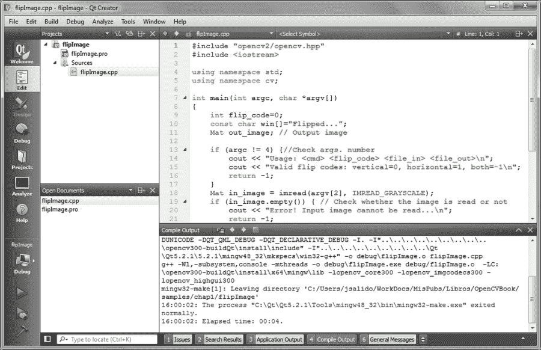
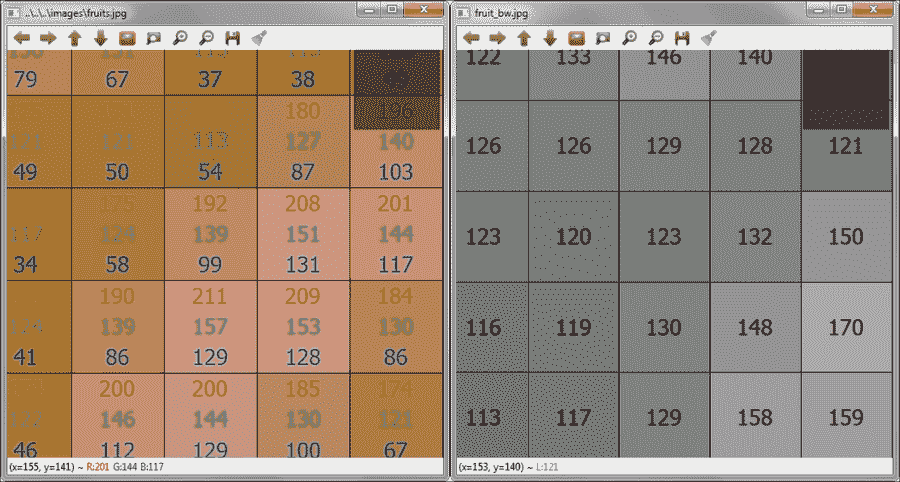
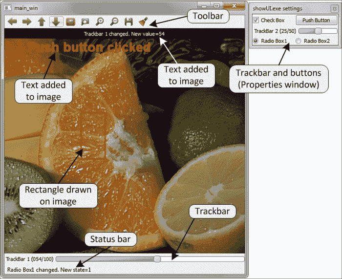

# 第 1.章处理图像和视频文件

本章旨在与 OpenCV，其安装和第一个基本程序进行首次接触。 我们将涵盖以下主题：

*   面向新手的 OpenCV 简介，然后是简单的分步安装库指南
*   在用户本地磁盘中安装后快速浏览 OpenCV 的结构
*   使用带有一些常见编程框架的库创建项目的快速配方
*   如何使用功能读取和写入图像和视频
*   最后，我们描述了用于向软件项目添加丰富的用户界面的库函数，包括鼠标交互，绘图基元和 Qt 支持

# OpenCV 简介

**OpenCV**（**开源计算机视觉**）最初是由英特尔开发的，它是一个免费跨平台库，用于实时图像处理，实际上已经成为 *[* 用于与计算机视觉相关的所有事物的标准工具。 第一个版本于 2000 年以 **BSD 许可证** 发行，此后，其功能得到了科学界的极大丰富。 2012 年，非营利组织 OpenCV.org 承担了为开发人员和用户维护支持网站的任务。

### 注意

在撰写本书时，OpenCV 的新主要版本（版本 3.0）可用，但仍处于 beta 状态。 在整本书中，我们将介绍此新版本带来的最相关的更改。

OpenCV 适用于最流行的操作系统，例如 GNU / Linux，OS X，Windows，Android，iOS 等。 第一个实现是在`C`编程语言中实现的； 但是，随着版本 2.0 的 C ++实现，它的受欢迎程度随之增加。 新功能使用 C ++编程。 但是，如今，该库具有其他编程语言（例如 Java，Python 和 MATLAB / Octave）的完整接口。 另外，还开发了用于其他语言（例如 C＃，Ruby 和 Perl）的包装程序，以鼓励程序员采用。

为了最大程度地提高计算密集型视觉任务的性能，OpenCV 包括对以下内容的支持：

*   使用 **线程构建模块**（**TBB**）在多核计算机上进行多线程处理-由 Intel 开发的模板库。
*   英特尔处理器上的 **集成性能基元**（**IPP**）的子集，以提高性能。 多亏了 Intel，这些原语可从 3.0 beta 版开始免费获得。
*   使用**计算统一设备架构**（**CUDA**）和[ **开放计算语言**（**OpenCL**）。

OpenCV 的应用程序涵盖以下领域：分段和识别，2D 和 3D 功能工具包，对象识别，面部识别，运动跟踪，手势识别，图像拼接，**高动态范围**（**HDR**）成像，增强现实等等。 此外，为了支持某些先前的应用领域，还包括具有统计机器学习功能的模块。

# 下载并安装 OpenCV

OpenCV 可从[这里](http://opencv.org)免费下载。 该站点提供了发行的最新版本（当前为 3.0 beta）和较旧的版本。

### 注意

如果下载的版本是不稳定版本，例如当前的 3.0 beta 版本，则应格外小心，以免出现错误。

在[这个页面](http://opencv.org/downloads.html)上，可以找到适用于每个平台的 OpenCV 版本。 可以根据最终目的从不同的存储库中获取代码和库信息：

*   主存储库（位于[这个页面](http://sourceforge.net/projects/opencvlibrary)），专用于最终用户。 它包含库的二进制版本和目标平台的可编译源。
*   测试数据存储库（位于[这个页面](https://github.com/itseez/opencv_extra)），其中包含用于测试某些库模块目的的数据集。
*   贡献者仓库位于[这个页面](http://github.com/itseez/opencv_contrib)）带有源代码，与贡献者提供的额外功能和最先进的功能相对应。 与主干相比，此代码更容易出错，并且测试较少。

    ### 提示

    在最新版本的 OpenCV 3.0 beta 中，额外的贡献模块未包含在主软件包中。 它们应单独下载，并通过适当的选项明确包含在编译过程中。 如果包括其中一些贡献的模块，请务必谨慎，因为其中一些模块依赖于 OpenCV 不附带的第三方软件。

*   每个模块的文档站点（位于[这个页面](http://docs.opencv.org/master/)），包括提供的模块。
*   开发库（位于[这个页面](https://github.com/Itseez/opencv)），带有库的当前开发版本。 它适用于库主要功能的开发人员以及希望在发布最新版本之前仍使用最新更新的“急躁”用户。

而不是 GNU / Linux 和 OS X **和**，其中 OpenCV 仅作为源代码分发，在 Windows 发行版中，可以找到预编译的（使用 Microsoft Visual C ++ v10，v11 和 v12 ）的版本。 每个预编译的版本都可以与 Microsoft 编译器一起使用。 但是，如果主要目的是使用不同的编译器框架开发项目，则需要为该特定编译器（例如 GNU GCC）编译库。

### 提示

使用 OpenCV 最快的方法是使用发行版随附的预编译版本之一。 然后，更好的选择是使用用于软件开发的本地平台的最佳设置来构建库的微调版本。 本章提供在 Windows 上构建和安装 OpenCV 的信息。 在[这个页面](http://docs.opencv.org/doc/tutorials/introduction/linux_install)和[这个页面](https://help.ubuntu.com/community/OpenCV)上可以找到在 Linux 上设置库的更多信息。

## 获取编译器并设置 CMake

使用 OpenCV 开发跨平台的一个不错的选择是使用 **GNU 工具包**（包括 gmake，g ++和 gdb）。 对于大多数流行的操作系统，可以轻松获得 GNU 工具包。 对于开发环境，我们的首选选择包括 GNU 工具包和跨平台 **Qt 框架**，其中包括 Qt 库和 Qt Creator **集成开发环境** **（IDE）**。 Qt 框架可从[这个页面](http://qt-project.org/)免费获得。

### 注意

在 Windows **和**上安装编译器之后，请记住正确设置`Path`环境变量，为编译器的可执行文件添加路径，例如 Qt 框架随附的 GNU /编译器的`C:\Qt\Qt5.2.1\5.2.1\mingw48_32\bin`。 在 Windows 上，免费的**快速环境编辑器**工具（可从[这个页面](http://www.rapidee.com)获得）提供了一种方便的方式来更改`Path`和其他环境变量 。

要以与编译器无关的方式管理 OpenCV 库的生成过程，推荐使用 CMake 工具。 CMake 是可从[这个页面](http://www.cmake.org/)上获得的免费且开源的跨平台工具。

## 使用 CMake 配置 OpenCV

将库的源代码下载到本地磁盘后，需要为该库的编译过程配置 makefile。 CMake 是轻松配置 OpenCV 安装过程的关键工具。 它可以从命令行使用，也可以通过**图形用户界面（GUI）** 版本以更加用户友好的方式使用。

使用 CMake 配置 OpenCV 的步骤总结如下：

1.  选择源目录（在下面将其命名为`OPENCV_SRC`）和目标目录[`OPENCV_BUILD`）。 目标目录是编译后的二进制文件所在的位置。
2.  选中**分组的**和**高级**复选框，然后单击**配置**按钮。
3.  选择所需的编译器（例如，GNU 默认编译器，MSVC 等）。
4.  设置首选选项，然后取消设置不需要的选项。
5.  单击**配置**按钮并重复步骤 4 和 5，直到没有错误为止。
6.  单击**生成**按钮并关闭 CMake。

以下屏幕截图显示了 CMake 的主窗口，其中包含源目录和目标目录以及将所有可用选项分组的复选框：


预先配置步骤后的 CMake 主窗口

### 注意

为简便起见，本文中使用`OPENCV_BUILD`和`OPENCV_SRC`分别表示 OpenCV 本地设置的目标目录和源目录。 请记住，所有目录都应与您当前的本地配置相匹配。

在预配置过程中，CMake 会检测到存在的编译器和许多其他本地属性，以设置 OpenCV 的生成过程。 上一个屏幕截图显示了预配置过程后的 **CMake** 主窗口，并以红色显示了分组的选项。

可以保留默认选项不变，然后继续配置过程。 但是，可以设置一些方便的选项：

*   `BUILD_EXAMPLES`：设置为使用 OpenCV 构建一些示例。
*   `BUILD_opencv_<module_name>`：设置为在构建过程中包括模块（`module_name`）。
*   `OPENCV_EXTRA_MODULES_PATH`：当您需要一些额外的模块时使用； 在此处设置附加模块的源代码的路径（例如`C:/opencv_contrib-master/modules`）。
*   `WITH_QT`：启用此功能可将 Qt 功能包括在库中。
*   `WITH_IPP`：此选项默认为打开。 当前的 OpenCV 3.0 版本包括**英特尔集成性能基元**（**IPP**）的子集，这些子集可加快库的执行时间。

### 提示

如果编译新的 OpenCV 3.0（测试版），请小心，因为已报告一些与 IPP 包含有关的意外错误（即，使用此选项的默认值）。 我们建议您取消设置`WITH_IPP`选项。

如果配置与 CMake 一起执行（循环执行步骤 4 和 5）没有产生任何其他错误，则可以为构建过程生成最终的 makefile。 以下屏幕截图显示了生成步骤后没有错误的 CMake 主窗口：


## 编译和安装库

使用 CMake 生成 makefile 的过程之后的下一步是使用适当的`make`工具进行的编译。 通常在目标目录（在 CMake 配置步骤中设置的目录）的命令行（控制台）上执行此工具。 例如，在 **Windows** 中，应从命令行启动编译，如下所示：

```cpp
OPENCV_BUILD>mingw32-make
```

此命令使用 CMake 生成的 makefile 启动构建过程。 整个编译通常需要几分钟。 如果编译没有错误结束，则安装将继续执行以下命令：

```cpp
OPENCV_BUILD>mingw32-make install
```

此命令将 OpenCV 二进制文件复制到`OPENCV_BUILD\install`目录。

如果在编译过程中出现问题，我们应该再次运行 CMake 来更改在配置过程中选择的选项。 然后，我们应该重新生成 makefile。

通过将库二进制文件的位置（例如，在 **Windows** 中，生成的 **DLL** 文件位于`OPENCV_BUILD\install\x64\mingw\bin`）添加到**路径**，结束安装 环境变量。 如果 **Path** 字段中没有此目录，则每个 OpenCV 可执行文件的执行都会出错，因为找不到库二进制文件。

要检查安装过程是否成功，可以运行随库一起编译的一些示例（如果使用 CMake 设置了`BUILD_EXAMPLES`选项）。 代码示例（用 C ++编写）可以在`OPENCV_BUILD\install\x64\mingw\samples\cpp`找到。

### 注意

安装 OpenCV 的简短说明适用于 **Windows** 。 可以在[这个页面](http://docs.opencv.org/doc/tutorials/introduction/linux_install/linux_install.html)上阅读有关 **Linux** 前提条件的详细说明。 尽管本教程适用于 OpenCV 2.0，但几乎所有信息对于版本 3.0 仍然有效。

# OpenCV 的结构

一旦安装 OpenCV ，`OPENCV_BUILD\install`目录将填充三种类型的文件：

*   **头文件**：它们位于`OPENCV_BUILD\install\include`子目录中的，用于通过 OpenCV 开发新项目。
*   **库二进制文件**：这些是静态或动态库（取决于 CMake 选择的选项），具有每个 OpenCV 模块的功能。 它们位于`bin`子目录中（例如，当使用 GNU 编译器时，为`x64\mingw\bin`）。
*   **示例二进制文件**：这些是可执行文件，并带有使用库的示例。 这些样本的来源可以在源包中找到（例如`OPENCV_SRC\sources\samples`）。

OpenCV 具有模块化的结构，这意味着该程序包为每个模块都包含一个静态或动态（DLL）库。 每个模块的正式文档可以在[这个页面](http://docs.opencv.org/master/)中找到。 软件包中包含的主要模块是：

*   `core`：这定义了所有其他模块使用的基本功能以及包括重要多维数组`Mat`在内的基本数据结构。
*   `highgui`：这提供了简单的**用户界面**（**UI**）功能。 使用 Qt 支持（`WITH_QT` CMake 选项）构建库可以使 UI 与此类框架兼容。
*   `imgproc`：这些是图像处理功能，包括滤波（线性和非线性），几何变换，颜色空间转换，直方图等。
*   `imgcodecs`: 这是一个易于使用的界面，用于读取和写入图像。

    ### 注意

    自从 OpenCV 3.0 以来，请注意模块中的更改，因为某些功能已移至新模块（例如，读取和写入图像功能已从`highgui`移至`imgcodecs`）。

*   `photo`：这包括计算摄影，包括修补，去噪，`High` **动态范围**（**HDR**）成像等。
*   `stitching`：用于图像拼接。
*   `videoio`：这是一个易于使用的界面，用于视频捕获和视频编解码器。
*   `video`：它为提供视频分析功能（运动估计，背景提取和对象跟踪）。
*   `features2d`：这些是功能，用于特征检测（角和平面对象），特征描述，特征匹配等。
*   `objdetect`：这些是功能，用于对象检测和预定义检测器实例（例如脸部，眼睛，微笑，人，汽车等）。

其他一些模块是`calib3d`（相机校准），`flann`（聚类和搜索），`ml`（机器学习），`shape`（形状距离和匹配），`superres`（超分辨率），`video` （视频分析）和`videostab`（视频稳定）。

### 注意

从 3.0 beta 版开始，新的贡献模块以单独的软件包（`opencv_contrib-master.zip`）分发，可以从[这个页面](https://github.com/itseez/opencv_contrib)下载。 这些模块提供了的附加功能，在使用它们之前，应充分了解它们。 有关新版 OpenCV（版本 3.0）中新功能的快速概述，请参考位于[这个页面](http://opencv.org/opencv-3-0-beta.html)的文档。

# 使用 OpenCV 创建用户项目

在本书中，我们假定 C ++是用于编程图像处理应用程序的主要语言，尽管实际上提供了其他编程语言的接口和包装器（例如 Python，Java，MATLAB / Octave 等） ）。

在本节中，我们将说明如何使用易于使用的跨平台框架使用 OpenCV 的 C ++ API 开发应用程序。

## 库的一般用法

要使用 **C ++，**开发 OpenCV 应用程序，我们需要我们的代码：

*   包括带有定义的 OpenCV 头文件
*   链接 OpenCV 库（二进制文件）以获取最终的可执行文件

OpenCV 标头文件位于`OPENCV_BUILD\install\include\opencv2`目录中，每个模块都有一个文件（`*.hpp`）。 头文件的包含是通过`#include`伪指令完成的，如下所示：

```cpp
#include <opencv2/<module_name>/<module_name>.hpp>
// Including the header file for each module used in the code
```

使用此伪指令，可以包含用户程序所需的每个头文件。 另一方面，如果包含`opencv.hpp`头文件，则将自动包括所有头文件，如下所示：

```cpp
#include <opencv2/opencv.hpp>
// Including all the OpenCV's header files in the code
```

### 注意

请记住，本地安装的所有模块都在`OPENCV_BUILD\install\include\opencv2\opencv_modules.hpp`头文件中定义，该头文件在 OpenCV 的构建过程中自动生成。

`#include`指令的使用并不总是保证正确包含头文件，因为有必要告诉编译器在哪里可以找到包含文件。 这可以通过在文件的位置传递一个特殊的参数来实现（例如，对于 GNU 编译器为`I\<location>`）。

链接过程要求您为链接器提供库（动态或静态），可以在其中找到所需的 OpenCV 功能。 通常使用链接器的两种类型的参数来完成：库的位置（例如，对于 GNU 编译器为`‑L<location>`）和库的名称（例如`-l<module_name>`）。

### 注意

您可以在[这个页面](https://gcc.gnu.org/onlinedocs/)和[这个页面](https://www.gnu.org/software/make/manual/)中找到 GNU GCC 和`make`可用在线文档的完整列表。

## 开发新项目的工具

开发我们自己的 OpenCV **C ++** 应用程序的主要先决条件是：

*   **OpenCV 头文件和库二进制文件**：当然，我们需要编译 OpenCV，辅助库是进行此类编译的前提条件。 该软件包应使用与生成用户应用程序相同的编译器进行编译。
*   **C ++编译器**：一些辅助工具可以方便地用作*代码编辑器*，*调试器*，*项目管理器*和 *流程管理器*（例如 CMake），*版本控制系统*（例如 Git，Mercurial，SVN 等）以及*类检查器*等。 通常，这些工具一起部署在所谓的 **集成开发环境**（**IDE**）中。
*   **任何其他辅助库**：可选地，将需要对最终应用程序进行编程的任何其他辅助库，例如图形，统计等。

用于编程 OpenCV C ++应用程序的最受欢迎的编译器套件是：

*   **Microsoft Visual C（MSVC）**：Windows 仅支持，它与 IDE Visual Studio 集成得很好，尽管它也可以与其他跨平台 IDE（例如 Qt）集成 创建者或 Eclipse。 当前与最新的 OpenCV 版本兼容的 MSVC 版本是 VC 10，VC 11 和 VC 12（Visual Studio 2010、2012 和 2013）。
*   **GNU 编译器集合 GNU GCC**：这是由 GNU 项目开发的跨平台编译器系统。 对于 Windows，此套件称为 **MinGW**（**最小 GNU GCC**）。 与当前 OpenCV 发行版兼容的版本是 GNU GCC 4.8。 该套件可与多个 IDE 一起使用，例如 Qt Creator，Code :: Blocks，Eclipse 等。

对于本书介绍的示例，我们使用了 Windows 的 MinGW 4.8 编译器套件以及 Qt 5.2.1 库和 Qt Creator IDE（3.0.1）。 跨平台 Qt 库需要使用此类库提供的新 UI 功能来编译 OpenCV。

### 注意

对于 Windows，可以从[这个页面](http://qt-project.org/)下载 Qt 捆绑包（包括 Qt 库，Qt Creator 和 MinGW 套件）。 捆绑包约为 700 MB。

Qt Creator 是用于 **C ++** 的跨平台 IDE，它集成了我们编码应用程序所需的工具。 在 Windows 中，它可以与 MinGW 或 MSVC 一起使用。 以下屏幕截图显示了 Qt Creator 主窗口，其中包含 OpenCV **C ++** 项目的不同面板和视图：



Qt Creator 的主窗口带有 OpenCV C ++项目的一些视图

## 使用 Qt Creator 创建 OpenCV C ++程序

接下来，我们说明如何使用 Qt Creator IDE 创建代码项目。 特别是，我们将此描述应用于 OpenCV 示例。

我们可以通过导航到**文件** | Qt Creator 为任何 OpenCV 应用程序创建一个项目。 **新的** **文件**或**文件** | **项目…**，然后导航到**非 Qt 项目** | **普通 C ++项目**。 然后，我们必须选择一个项目名称及其存储位置。 下一步是为项目（在我们的情况下为 **Desktop Qt 5.2.1 MinGW 32 bit**）选择一个工具包（即编译器），并确定生成二进制文件的位置。 通常，使用两种可能的构建配置（配置文件）：`debug`和`release`。 这些配置文件设置适当的标志来构建和运行二进制文件。

使用 Qt Creator 创建项目时，将生成两个特殊文件（扩展名为`.pro`和`.pro.user`）来配置生成和运行过程。 构建过程由在项目创建期间选择的工具包确定。 使用 **Desktop Qt 5.2.1 MinGW 32 位**套件，此过程依赖于 qmake 和 mingw32make 工具。 使用`*.pro`文件作为输入，qmake 生成用于驱动每个配置文件（即`release`和`debug`）构建过程的 makefile。 Qt Creator IDE 使用 qmake 工具作为 CMake 的替代品，以简化软件项目的构建过程。 它可以自动从几行信息中生成 makefile。

以下各行代表`*.pro`文件（例如`showImage.pro`）的示例：

```cpp
TARGET: showImage
TEMPLATE = app 
CONFIG += console 
CONFIG -= app_bundle
CONFIG -= qt
SOURCES += \
    showImage.cpp
INCLUDEPATH += C:/opencv300-buildQt/install/include
LIBS += -LC:/opencv300-buildQt/install/x64/mingw/lib \
    -lopencv_core300.dll \
    -lopencv_imgcodecs300.dll\
    -lopencv_highgui300.dll\
    -lopencv_imgproc300.dll 
```

上一个文件说明了 qmake 生成适当的 makefile 来构建项目二进制文件所需的选项。 每行以一个标记（表示`TARGET`，`CONFIG`，`SOURCES`，`INCLUDEPATH`和`LIBS`）的标签开头，后跟一个标记以添加（`+=`）或删除（`-=`） 期权的价值。 在此示例项目中，我们使用非 Qt 控制台应用程序。 可执行文件为`showImage.exe`（`TARGET`），源文件为`showImage.cpp`（`SOURCES`）。 由于此项目是基于 OpenCV 的应用程序，因此最后两个标签指示此特定项目（`core`，`imgcodecs`，`highgui`和`imgproc`）。 注意，在行末尾的反斜杠表示在下一行继续。

### 注意

有关在 Qt 项目中开发的工具（包括 Qt Creator 和 **qmake**）的详细说明，请访问[这个页面](http://doc.qt.io/)。

# 读写图像文件

图像处理依赖于获得图像（例如照片或视频名望）并通过在其上应用信号处理技术来“播放”图像以获得所需的结果。 在本节中，我们向您展示如何使用 OpenCV 提供的功能从文件读取图像。

## 基本 API 概念

`Mat`类是在 OpenCV 中存储和处理图像的主要数据结构。 此类在`core`模块中定义。 OpenCV 已实现了为这些数据结构自动分配和释放内存的机制。 但是，当数据结构共享相同的缓冲存储器时，程序员仍应格外小心。 例如，赋值运算符不将内存内容从对象（`Mat A`）复制到另一个对象（`Mat B`）； 它仅复制引用（内容的内存地址）。 然后，一个对象（`A`或`B`）的更改会影响两个对象。 要复制`Mat`对象的内存内容，应使用`Mat::clone()`成员函数。

### 注意

OpenCV 中的许多功能通常使用`Mat`类来处理密集的单通道或多通道阵列。 但是，在某些情况下，可以使用其他数据类型，例如`std::vector<>`，`Matx<>`，`Vec<>`或`Scalar`。 为此，OpenCV 提供了代理类`InputArray`和`OutputArray`，它们允许将任何先前的类型用作函数的参数。

`Mat`类用于密集的 n 维单通道或多通道阵列。 它实际上可以存储实数或复数值向量和矩阵，彩色或灰度图像，直方图，点云等。

创建`Mat`对象的方法有很多，最流行的是构造函数，其中指定数组的大小和类型如下：

```cpp
Mat(nrows, ncols, type, fillValue)
```

数组元素的初始值可以由`Scalar`类设置为典型的四元素向量（针对数组中存储的图像的每个 RGB 和透明度分量）。 接下来，我们向您展示`Mat`的用法示例，如下所示：

```cpp
Mat img_A(4, 4, CV_8U, Scalar(255));
// White image:
// 4 x 4 single-channel array with 8 bits of unsigned integers
// (up to 255 values, valid for a grayscale image, for example,
// 255=white)
```

`DataType`类定义了 OpenCV 的原始数据类型。 基本数据类型可以是`bool`，`unsigned char`，`signed char`，`unsigned short`，`signed short`，`int`，`float`，`double`或这些原始类型之一的值的元组。 任何原始类型都可以由标识符以以下形式定义：

```cpp
CV_<bit depth>{U|S|F}C(<number of channels>)
```

在前面的代码`U`中，`S`和`F`分别代表`unsigned`，`signed`和`float`。 对于单通道数组，将应用以下枚举，以描述数据类型：

```cpp
enum {CV_8U=0, CV_8S=1, CV_16U=2, CV_16S=3,CV_32S=4, CV_32F=5, CV_64F=6};
```

### 注意

在此，应注意，这三个声明是等效的：`CV_8U`，`CV_8UC1`和`CV_8UC(1)`。 单通道声明非常适合用于灰度图像的整数数组，而数组的三通道声明更适合具有三个分量（例如 RGB，BRG，HSV 等）的图像。 对于线性代数运算，可以使用`float`（F）类型的数组。

我们可以为多通道数组（最多 512 个通道）定义所有上述数据类型。 以下屏幕截图说明了一个通道（`CV_8U`，`grayscale`）的图像内部表示以及三个通道（`CV_8UC3`，`RGB`）表示的同一图像。 这些屏幕截图是通过放大 OpenCV 可执行文件窗口中显示的图像（**showImage** 示例）而获得的：



RGB 颜色和灰度的图像的 8 位表示

### 注意

的注意很重要，要使用 OpenCV 功能正确保存 RGB 图像，必须将图像存储在内存中，其通道按 BGR 顺序排列。 以相同的方式，当从文件中读取 RGB 图像时，它以 BGR 顺序以其通道存储在内存中。 而且，它需要一个辅助的第四通道（alpha）来操作具有 RGB 和透明性三个通道的图像。 对于 RGB 图像，较大的整数值表示 alpha 通道的像素更亮或更透明。

所有 OpenCV 类和函数都在`cv`命名空间中，因此，我们在源代码中将具有以下两个选项：

*   包括头文件之后，添加`using namespace cv`声明（这是本书所有代码示例中使用的选项）。
*   将`cv::`前缀附加到我们使用的所有 OpenCV 类，函数和数据结构。 如果 OpenCV 提供的外部名称与常用的**标准模板库**（**STL**）或其他库冲突，则建议使用此选项。

## 图像文件支持的格式

OpenCV 支持最常见的图像格式。 但是，其中一些需要（免费提供）第三方库。 OpenCV 支持的主要格式为：

*   Windows 位图（`*.bmp`和`*dib`）
*   便携式图像格式（`*.pbm`，`*.pgm`，`*.ppm`）
*   太阳栅格（`*.sr`，`*.ras`）

需要辅助库的格式为：

*   **JPEG**（`*.jpeg`，`*.jpg`，`*.jpe`）
*   **JPEG 2000**（`*.jp2`）
*   **便携式网络图形**（`*.png`）
*   **TI​​FF**（`*.tiff`，`*.tif`）
*   **WebP**（`*.webp`）。

除上述列出的格式外，对于 OpenCV 3.0 版本，它还包括支持以下格式的驱动程序（**NITF** ， **DTED** ， **SRTM [HTG14 等） 由**地理数据抽象库** **（GDAL）**设置，并带有 CMake 选项`WITH_GDAL`。 请注意，尚未在 Windows 操作系统上对 GDAL 支持进行广泛的测试。 在 Windows 和 OS X 中，默认情况下使用 OpenCV 附带的编解码器（`libjpeg`，`libjasper`，`libpng`和`libtiff`）。 然后，在这些 OS 中，可以读取 *JPEG* ， *PNG* 和 *TIFF* 格式。 Linux（和其他类似 Unix 的开源操作系统）正在寻找系统中安装的编解码器。 可以在 OpenCV 之前安装编解码器，也可以通过在 CMake 中设置适当的选项（例如`BUILD_JASPER`，`BUILD_JPEG`，`BUILD_PNG`和`BUILD_TIFF`）从 OpenCV 软件包中构建库。**

## 示例代码

为了说明如何使用 OpenCV 读取和写入图像文件，我们现在将描述 **showImage** 示例。 从命令行使用相应的输出窗口执行示例，如下所示：

```cpp
<bin_dir>\showImage.exe fruits.jpg fruits_bw.jpg
```


showImage 示例的输出窗口

在此示例中，给出了两个文件名作为参数。 第一个是要读取的输入图像文件。 第二个是要与输入图像的灰度副本一起写入的图像文件。 接下来，我们向您显示源代码及其说明：

```cpp
#include <opencv2/opencv.hpp>
#include <iostream>

using namespace std;
using namespace cv;

int main(int, char *argv[])
{
    Mat in_image, out_image;

    // Usage: <cmd> <file_in> <file_out>
    // Read original image
    in_image = imread(argv[1], IMREAD_UNCHANGED);
    if (in_image.empty()) { 
    // Check whether the image is read or not
    cout << "Error! Input image cannot be read...\n";
    return -1;
}
// Creates two windows with the names of the images
    namedWindow(argv[1], WINDOW_AUTOSIZE);
    namedWindow(argv[2], WINDOW_AUTOSIZE);
    // Shows the image into the previously created window
    imshow(argv[1], in_image);
    cvtColor(in_image, out_image, COLOR_BGR2GRAY);
    imshow(argv[2], in_image);
    cout << "Press any key to exit...\n";
    waitKey(); // Wait for key press
    // Writing image
    imwrite(argv[2], in_image);
    return 0;
}
```

在这里，我们将`#include`指令与`opencv.hpp`头文件一起使用，该头文件实际上包括所有 OpenCV 头文件。 通过包含此单个文件，无需再包含其他文件。 声明使用`cv`命名空间后，此命名空间内的所有变量和函数都不需要`cv::`前缀。 在 main 函数中要做的第一件事是检查在命令行中传递的参数数量。 然后，如果发生错误，将显示帮助消息。

### 读取图像文件

如果参数数量正确，则使用`imread(argv[1], IMREAD_UNCHANGED)`函数将图像文件读入`Mat in_image`对象，其中第一个参数是在命令行中传递的第一个参数（`argv[1]`） 参数是一个标志（`IMREAD_UNCHANGED`），这意味着存储在内存对象中的图像应保持不变。 `imread`功能根据文件内容而不是文件扩展名确定图像（编解码器）的类型。

`imread`函数的原型如下：

```cpp
Mat imread(const String& filename, 
int flags = IMREAD_COLOR )
```

该标志指定所读取图像的颜色，它们由`imgcodecs.hpp`头文件中的以下枚举定义和解释：

```cpp
enum { IMREAD_UNCHANGED = -1, // 8bit, color or not
  IMREAD_GRAYSCALE = 0, // 8bit, gray
  IMREAD_COLOR = 1, // unchanged depth, color
  IMREAD_ANYDEPTH = 2, // any depth, unchanged color
  IMREAD_ANYCOLOR = 4, // unchanged depth, any color
  IMREAD_LOAD_GDAL = 8 // Use gdal driver
};
```

### 注意

从 OpenCV 3.0 版开始，`imread`功能在`imgcodecs`模块中，而不在`highgui`中，就像在 OpenCV 2.x 中一样。

### 提示

随着几个函数和声明移入 OpenCV 3.0，由于链接器未找到一个或多个声明（符号和/或函数），可能会出现一些编译错误。 为了弄清楚符号的定义位置（`*.hpp`）和要链接的库，我们建议使用 Qt Creator IDE 进行以下技巧：

将`#include <opencv2/opencv.hpp>`声明添加到代码中。 用鼠标光标在符号或功能上按 *F2* 功能键； 这将打开`*.hpp`文件，在其中声明了符号或函数。

读取输入图像文件后，请检查操作是否成功。 此检查是通过`in_image.empty()`成员函数完成的。 如果读取图像文件时没有错误，则会创建两个窗口分别显示输入和输出图像。 使用以下功能执行窗口的创建：

```cpp
void namedWindow(const String& winname,int flags = WINDOW_AUTOSIZE )
```

OpenCV 窗口在程序中由明确的名称标识。 标志的定义及其说明由`highgui.hpp`头文件中的以下枚举给出：

```cpp
enum { WINDOW_NORMAL = 0x00000000, 
  // the user can resize the window (no constraint) 
  // also use to switch a fullscreen window to a normal size
  WINDOW_AUTOSIZE = 0x00000001, 
  // the user cannot resize the window,
  // the size is constrained by the image displayed
  WINDOW_OPENGL = 0x00001000, // window with opengl support
  WINDOW_FULLSCREEN = 1,
  WINDOW_FREERATIO = 0x00000100, 
  // the image expends as much as it can (no ratio constraint)
  WINDOW_KEEPRATIO = 0x00000000 
  // the ratio of the image is respected
};
```

窗口的创建不会在屏幕上显示任何内容。 在窗口中显示图像的功能（属于`highgui`模块）是：

```cpp
void imshow(const String& winname, InputArray mat)
```

如果使用`WINDOW_AUTOSIZE`标志创建了窗口（`winname`），则图像（`mat`）将以其原始尺寸显示为。

在 **showImage** 示例中，第二个窗口显示了输入图像的灰度副本。 要将彩色图像转换为灰度图像，请使用`imgproc`模块中的`cvtColor`功能。 该功能实际上可以用于更改图像颜色空间。

程序中创建的任何窗口均可调整大小并从其默认设置移动。 当不再需要任何窗口时，应将其销毁以释放其资源。 像示例中一样，这种资源释放是在程序结束时隐式完成的。

### 事件处理进入固有循环

如果我们在窗口上显示图像后没有做任何其他事情，令人惊讶的是，该图像将根本不会显示。 在窗口上显示图像后，我们应该开始循环以获取和处理与用户与窗口交互有关的事件。 该任务由以下功能（从`highgui`模块中）执行：

```cpp
int waitKey(int delay=0)
```

此功能会等待一个毫秒数的按键（`delay` > `0`），以返回按键的代码；如果延迟在没有按键的情况下结束，则将返回`-1`。 如果`delay`为`0`或负数，则该功能将一直等待直到按下某个键。

### 注意

请记住，`waitKey`功能仅在至少存在一个已创建且处于活动状态的窗口时才起作用。

### 写入图像文件

`imgcodecs`模块中的另一个重要功能是：

```cpp
bool imwrite(const String& filename, InputArray img, const vector<int>& params=vector<int>())
```

此函数将图像（`img`）保存到文件（`filename`）中，作为第三个可选参数，它是指定编解码器参数的属性值对的向量（将其保留为空以使用默认值）。 编解码器由文件扩展名确定。

### 注意

有关编解码器属性的详细列表，请查看[这个页面](http://docs.opencv.org/master/modules/refman.html)上的`imgcodecs.hpp`头文件和 OpenCV API 参考。 。

# 读写视频文件

视频处理的不是运动图像，而是静止图像。 视频源可以是专用摄像机，网络摄像机，视频文件或图像文件序列。 在 OpenCV 中，`VideoCapture`和`VideoWriter`类提供了易于使用的 C ++ API，用于捕获和记录视频处理中涉及的任务。

## 示例代码

**recVideo** 示例是一小段代码，您可以在其中看到如何使用默认相机作为捕获设备来抓取帧，对其进行边缘检测并将其保存为新的帧。 文件。 此外，还创建了两个窗口，以同时显示原始帧和已处理的帧。 示例代码为：

```cpp
#include <opencv2/opencv.hpp>
#include <iostream>

using namespace std;
using namespace cv;

int main(int, char **)
{
  Mat in_frame, out_frame;
  const char win1[]="Grabbing...", win2[]="Recording...";
  double fps=30; // Frames per second
  char file_out[]="recorded.avi";

 VideoCapture inVid(0); // Open default camera
  if (!inVid.isOpened()) { // Check error
    cout << "Error! Camera not ready...\n";
    return -1;
  }
  // Gets the width and height of the input video
  int width = (int)inVid.get(CAP_PROP_FRAME_WIDTH);
  int height = (int)inVid.get(CAP_PROP_FRAME_HEIGHT);
 VideoWriter recVid(file_out,
 VideoWriter::fourcc('M','S','V','C'),
 fps, Size(width, height));
  if (!recVid.isOpened()) {
    cout << "Error! Video file not opened...\n";
    return -1;
  }
  // Create two windows for orig. and final video
  namedWindow(win1);
  namedWindow(win2);
  while (true) {
    // Read frame from camera (grabbing and decoding)
 inVid >> in_frame;
    // Convert the frame to grayscale
    cvtColor(in_frame, out_frame, COLOR_BGR2GRAY);
    // Write frame to video file (encoding and saving)
 recVid << out_frame;
    imshow(win1, in_frame); // Show frame in window
    imshow(win2, out_frame); // Show frame in window
    if (waitKey(1000/fps) >= 0)
    break;
  }
 inVid.release(); // Close camera
  return 0;
}
```

在此示例中，以下功能值得快速回顾：

*   `double VideoCapture::get(int propId)`：这将返回`VideoCapture`对象的指定属性的值。 `videoio.hpp`头文件包含基于 DC1394（IEEE 1394 数码相机规格）的属性的完整列表。
*   `static int VideoWriter::fourcc(char c1, char c2, char c3, char c4)`：这会将四个字符连接到一个 **fourcc** 代码。 在示例中，MSVC 代表 Microsoft Video（仅适用于 Windows）。 有效的 fourcc 代码列表发布在[这个页面](http://www.fourcc.org/codecs.php)上。
*   `bool VideoWriter::isOpened()`：如果用于写入视频的对象已成功初始化，则返回`true`。 例如，使用不正确的编解码器会产生错误。

    ### 提示

    要小心; 系统中有效的 fourcc 代码取决于本地安装的编解码器。 要了解本地系统中已安装的 fourcc 编解码器，我们建议使用开源工具 MediaInfo，该工具可在[这个页面](http://mediaarea.net/en/MediaInfo)上的许多平台上使用。

*   `VideoCapture& VideoCapture::operator>>(Mat& image)`：抓取，解码并返回下一帧。 此方法具有等效的`bool VideoCapture::read(OutputArray image)`功能。 可以使用它而不是使用`VideoCapture::grab()`功能，然后使用`VideoCapture::retrieve()`。
*   `VideoWriter& VideoWriter::operator<<(const Mat& image)`：这将写入下一帧。 这种方法等效 `void VideoWriter::write(const Mat& image)`函数。

    在此示例中，存在一个读取/写入循环，其中窗口事件也被获取和处理。 `waitKey(1000/fps)`函数调用负责此工作； 但是，在这种情况下，`1000/fps`表示返回外部循环之前要等待的毫秒数。 尽管不精确，但可以为记录的视频获得每秒帧的近似量度。

*   `void VideoCapture::release()`：这会释放视频文件或捕获设备。 尽管在此示例中不是明确必需的，但我们将其包括在内以说明其用法。

# 用户交互工具

在前面的部分中，我们解释了如何创建（`namedWindow`）窗口以显示（`imshow`）图像和获取/处理事件（`waitKey`）。 我们提供的示例向您展示了一种非常简单的方法，用于用户通过键盘与 OpenCV 应用程序进行交互。 `waitKey`函数返回在超时之前按下的键的代码。

幸运的是，OpenCV 提供了更灵活的用户交互方式，例如轨迹栏和鼠标交互，可以与某些绘图功能结合使用，以提供更丰富的用户体验。 而且，如果 OpenCV 是在 Qt 支持下（CMake 的`WITH_QT`选项）在本地编译的，则可以使用一组新功能来编写更好的 UI。

在本节中，我们将快速回顾在具有 Qt 支持的 OpenCV 项目中对用户界面进行编程的可用功能。 我们使用下一个名为 **showUI** 的示例来说明有关 OpenCV UI 支持的内容。

该示例在窗口中向您显示了彩色图像，说明了如何使用一些基本元素来丰富用户交互。 以下屏幕快照显示了在示例中创建的 UI 元素：



showUI 示例的输出窗口

， **showUI** 示例的源代码（没有回调函数）如下：

```cpp
#include <opencv2/opencv.hpp>
#include <iostream>

using namespace std;
using namespace cv;

// Callback functions declarations
void cbMouse(int event, int x, int y, int flags, void*);
void tb1_Callback(int value, void *);
void tb2_Callback(int value, void *);
void checkboxCallBack(int state, void *);
void radioboxCallBack(int state, void *id);
void pushbuttonCallBack(int, void *font);

// Global definitions and variables
Mat orig_img, tmp_img;
const char main_win[]="main_win";
char msg[50];

int main(int, char* argv[]) {
  const char track1[]="TrackBar 1";
  const char track2[]="TrackBar 2";
  const char checkbox[]="Check Box";
  const char radiobox1[]="Radio Box1";
  const char radiobox2[]="Radio Box2";
  const char pushbutton[]="Push Button";
  int tb1_value = 50; // Initial value of trackbar 1
  int tb2_value = 25; // Initial value of trackbar 1

  orig_img = imread(argv[1]); // Open and read the image
  if (orig_img.empty()) {
    cout << "Error!!! Image cannot be loaded..." << endl;
    return -1;
  }
  namedWindow(main_win); // Creates main window
  // Creates a font for adding text to the image
 QtFont font = fontQt("Arial", 20, Scalar(255,0,0,0),
 QT_FONT_BLACK, QT_STYLE_NORMAL);
  // Creation of CallBack functions
    setMouseCallback(main_win, cbMouse, NULL);
    createTrackbar(track1, main_win, &tb1_value,
      100, tb1_Callback);
    createButton(checkbox, checkboxCallBack, 0, 
     QT_CHECKBOX);
    // Passing values (font) to the CallBack
    createButton(pushbutton, pushbuttonCallBack,
      (void *)&font, QT_PUSH_BUTTON);
    createTrackbar(track2, NULL, &tb2_value,
      50, tb2_Callback);
    // Passing values to the CallBack
    createButton(radiobox1, radioboxCallBack,
      (void *)radiobox1, QT_RADIOBOX);
    createButton(radiobox2, radioboxCallBack,
      (void *)radiobox2, QT_RADIOBOX);

  imshow(main_win, orig_img); // Shows original image
  cout << "Press any key to exit..." << endl;
  waitKey(); // Infinite loop with handle for events
  return 0;
}
```

使用 Qt 支持构建 OpenCV 时，每个通过`highgui`模块创建的窗口都会显示默认的**工具栏**（参见上图），并具有（从左到右）用于平移，缩放，保存， 并打开属性窗口。

除了上述工具栏（仅 Qt 可用）之外，在接下来的小节中，我们将注释示例中创建的不同 UI 元素以及实现它们的代码。

## 轨迹栏

轨迹栏是在指定窗口（`winname`）中使用`createTrackbar(const String& trackbarname, const String& winname, int* value, int count, TrackbarCallback onChange=0, void* userdata=0)`功能创建的，具有链接的整数值（`value`），最大值（`count`）和可选的 **滑块更改时将调用 callback** 函数（`onChange`），以及 callback 函数的参数（`userdata`）。 回调函数本身有两个参数：`value`（由滑块选择）和一个​​指向`userdata`的指针（可选）。在 Qt 支持下，如果未指定窗口，则会在 属性窗口。 在 **showUI** 示例中，我们创建了两个跟踪栏：第一个在主窗口中，第二个在属性窗口中。 跟踪栏回调的代码为：

```cpp
void tb1_Callback(int value, void *) {

  sprintf(msg, "Trackbar 1 changed. New value=%d", value);
 displayOverlay(main_win, msg);
  return;
}
void tb2_Callback(int value, void *) {

  sprintf(msg, "Trackbar 2 changed. New value=%d", value);
 displayStatusBar(main_win, msg, 1000);
  return;
}
```

## 鼠标交互

始终会生成鼠标事件，因此，用户会与进行鼠标交互（移动和单击）。 通过设置适当的处理程序或回调函数，可以实现诸如选择，拖放等操作。 回调函数（`onMouse`）通过指定窗口（`winname`）和可选参数（`userdata`）中的`setMouseCallback(const String& winname, MouseCallback onMouse, void* userdata=0 )`函数启用。

处理鼠标事件的回调函数的源代码为：

```cpp
void cbMouse(int event, int x, int y, int flags, void*) {
  // Static vars hold values between calls
 static Point p1, p2;
 static bool p2set = false;

  // Left mouse button pressed
  if (event == EVENT_LBUTTONDOWN) {
    p1 = Point(x, y); // Set orig. point
    p2set = false;
  } else if (event == EVENT_MOUSEMOVE &&
 flags == EVENT_FLAG_LBUTTON) {
    // Check moving mouse and left button down
    // Check out bounds
    if (x > orig_img.size().width)
      x = orig_img.size().width;
    else if (x < 0)
      x = 0;
    // Check out bounds
    if (y > orig_img.size().height)
      y = orig_img.size().height;
    else if (y < 0)
      y = 0;
    p2 = Point(x, y); // Set final point
    p2set = true;
    // Copy orig. to temp. image
 orig_img.copyTo(tmp_img);
    // Draws rectangle
 rectangle(tmp_img, p1, p2, Scalar(0, 0 ,255));
    // Draw temporal image with rect.
    imshow(main_win, tmp_img);
  } else if (event == EVENT_LBUTTONUP
  && p2set) {
    // Check if left button is released
    // and selected an area
    // Set subarray on orig. image
    // with selected rectangle
    Mat submat = orig_img(Rect(p1, p2));
    // Here some processing for the submatrix
    //...
    // Mark the boundaries of selected rectangle
    rectangle(orig_img, p1, p2, Scalar(0, 0, 255), 2);
    imshow("main_win", orig_img);
  }
  return;
}
```

在 **showUI** 示例中，鼠标事件用于通过回调函数（`cbMouse`）进行控制，即通过在矩形区域周围绘制矩形来选择矩形区域。 在示例中，此函数声明为`void cbMouse(int event, int x, int y, int flags, void*)`，参数是事件发生的指针的位置（`x`，`y`），事件发生的条件（`flags`），并且可选地， `userdata`。

### 注意

可用的事件，标志及其相应的定义符号可以在`highgui.hpp`头文件中找到。

## 按钮

OpenCV（仅具有 Qt 支持）允许创建三种类型的按钮：**复选框**（`QT_CHECKBOX`），**单选框**（`QT_RADIOBOX`）和[ **按钮**（`QT_PUSH_BUTTON`）。 这些类型的按钮可分别用于设置选项，设置排他选项以及在按下按钮时执行操作。 这三个属性是通过`createButton(const String& button_name, ButtonCallback on_change, void* userdata=0, int type=QT_PUSH_BUTTON, bool init_state=false )`功能在此窗口中最后一个跟踪栏之后的按钮栏中排列的属性窗口中创建的。 按钮的参数是其名称（`button_name`），在状态更改时调用的回调函数（`on_change`），还可以是回调的参数（`userdate`），按钮的类型（`type` ）以及按钮的初始状态（`init_state`）。

接下来，我们向您展示示例中与按钮对应的回调函数的源代码：

```cpp
void checkboxCallBack(int state, void *) {

  sprintf(msg, "Check box changed. New state=%d", state);
 displayStatusBar(main_win, msg);
  return;
}

void radioboxCallBack(int state, void *id) {

  // Id of the radio box passed to the callBack
  sprintf(msg, "%s changed. New state=%d",
    (char *)id, state);
 displayStatusBar(main_win, msg);
  return;
}

void pushbuttonCallBack(int, void *font) {

  // Add text to the image
 addText(orig_img, "Push button clicked",
 Point(50,50), *((QtFont *)font));
  imshow(main_win, orig_img); // Shows original image
  return;
}
```

按钮的回调函数获得两个参数：其状态和（可选）指向用户数据的指针。 在 **showUI** 示例中，我们向您展示如何传递一个整数（`radioboxCallBack(int state, void *id)`）来标识按钮和一个更复杂的对象（`pushbuttonCallBack(int, void *font)`）。

## 绘制和显示文本

将某些图像处理的结果传达给用户的一种非常有效的方法是通过在正在处理的图形上绘制形状或/和显示文本。 通过`imgproc`模块，OpenCV 提供了一些便捷的功能来完成诸如放置文本，绘图线，圆，椭圆，矩形，多边形等任务。 **showUI** 示例说明了如何在图像上选择矩形区域并绘制矩形以标记所选区域。 以下函数在图像上绘制（`img`），该图像由两个点（`p1`，`p2`）定义，并带有指定的颜色和其他可选参数作为厚度（对于填充形状为负）和线型：

```cpp
void rectangle(InputOutputArray img, Point pt1, Point pt2,const Scalar& color, int thickness=1,int lineType=LINE_8, int shift=0 )
```

除了形状的图形支持之外，`imgproc`模块还提供了一个功能，可以使用以下功能在图像上放置文本：

```cpp
void putText(InputOutputArray img, const String& text, Point org, int fontFace, double fontScale, Scalar color, int thickness=1, int lineType=LINE_8, bool bottomLeftOrigin=false )
```

### 注意

可以在`core.hpp`头文件中检查文本的可用字体。

在`highgui`模块中，对 Qt 的支持增加了一些其他方法来在 OpenCV 应用程序的主窗口上显示文本：

*   **图像上方的文本**：我们使用`addText(const Mat& img, const String& text, Point org, const QtFont& font)`功能获得此结果。 此功能允许您使用先前用`fontQt(const String& nameFont, int pointSize=-1, Scalar color=Scalar::all(0), int weight=QT_FONT_NORMAL, int style=QT_STYLE_NORMAL, int spacing=0)`功能创建的字体为显示的文本选择起点。 在 **showUI** 示例中，此函数用于在单击按钮时在图像上放置文本，从而在回调函数中调用`addText`函数。
*   **状态栏上的文本**：使用`displayStatusBar(const String& winname, const String& text, int delayms=0 )`功能，在状态栏上中显示由最后一个参数（`delayms`）给出的毫秒的文本。 在 **showUI** 示例中，当属性窗口的按钮和轨迹栏更改其状态时，此函数（在回调函数中）用于显示内容丰富的文本。
*   **覆盖在图像上的文本**：使用`displayOverlay(const String& winname, const String& text, int delayms=0)`函数，将显示在图像上的文本显示最后一个参数给出的毫秒数。 在 **showUI** 示例中，当主窗口跟踪栏更改其值时，此函数（在回调函数中）用于显示内容丰富的文本。

# 摘要

在本章中，您快速了解了 OpenCV 库及其模块的主要用途。 您了解了如何在本地系统中编译，安装和使用该库来开发具有 Qt 支持的 **C ++** OpenCV 应用程序的基础。 为了开发自己的软件，我们解释了如何从免费的 Qt Creator IDE 和 GNU 编译器工具包开始。

首先，本章提供了完整的代码示例。 这些示例向您展示了如何读写图像和视频。 最后，本章为您提供了一个示例，该示例在 OpenCV 程序中显示一些易于实现的用户界面功能，例如轨迹栏，按钮，在图像上放置文本，绘制形状等。

下一章将致力于建立主要的图像处理工具和任务，这些工具和任务将为其余各章奠定基础。