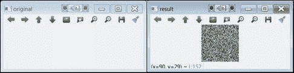
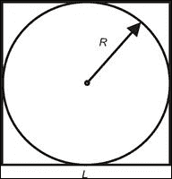
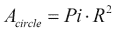
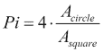
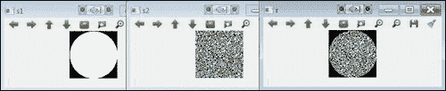
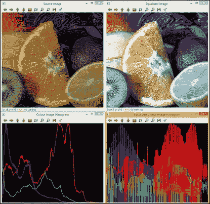

# 第 2 章。建立图像处理工具

本章介绍将在后续章节中使用的主要数据结构和基本过程：

*   图片类型
*   像素存取
*   图像的基本操作
*   直方图

这些是我们必须对图像执行的一些最常见的操作。 此处介绍的大多数功能都在库的*核心*模块中。

# 基本数据类型

OpenCV 中的基本数据类型为`Mat`，因为它用于存储图像。 基本上，图像存储为标题和包含像素数据的存储区。 图像具有多个通道。 灰度图像具有单个通道，而彩色图像通常具有三个用于红色，绿色和蓝色分量的通道（尽管 OpenCV 以相反的顺序存储它们，即蓝色，绿色和红色）。 也可以使用第四个透明度（alpha）通道。 可以使用`img.channels()`检索`img`图像的通道数。

图像中的每个像素都使用许多位存储。 这称为图像*深度*。 对于灰度图像，像素通常以 8 位存储，因此允许 256 个灰度级（整数值 0 到 255）。 对于彩色图像，每个像素存储在三个字节中，每个彩色通道存储一个字节。 在某些操作中，有必要以浮点格式存储像素。 可以使用`img.depth()`获得图像深度，并且返回的值为：

*   `CV_8U`，8 位无符号整数（`0..255`）
*   `CV_8S`，8 位有符号整数（`-128..127`）
*   `CV_16U`，16 位无符号整数（`0..65,535`）
*   `CV_16S`，16 位有符号整数（`-32,768..32,767`）
*   `CV_32S`，32 位有符号整数（`-2,147,483,648..2,147,483,647`）
*   `CV_32F`，32 位浮点数
*   `CV_64F`，64 位浮点数

请注意，对于灰度图像和彩色图像，最常见的图像深度均为`CV_8U`。 可以使用`convertTo`方法从一种深度转换为另一种深度：

```cpp
Mat img = imread("lena.png", IMREAD_GRAYSCALE);
Mat fp;
img.convertTo(fp,CV_32F);
```

在浮点图像上执行运算是很常见的（也就是说，像素值是数学运算的结果）。 如果使用`imshow()`显示该图像，则将看不到任何有意义的内容。 在这种情况下，我们必须将像素转换为`0..255`的整数范围。 `convertTo`函数实现了线性变换，并具有两个附加参数`alpha`和`beta`，分别代表比例因子和要添加的增量值。 这意味着每个像素`p`都将转换为：

```cpp
newp = alpha * p + beta
```

这可用于正确显示浮点图像。 假设`img`图像具有`m`和`M`最小值和最大值（请参阅下面的代码，以了解如何获得这些值），我们将使用此值：

```cpp
Mat m1 = Mat(100, 100, CV_32FC1);
randu(m1, 0, 1e6); // random values between 0 and 1e6
imshow("original", m1);
double minRange,MaxRange;
Point mLoc,MLoc;
minMaxLoc(m1,&minRange,&MaxRange,&mLoc,&MLoc);
Mat img1;
m1.convertTo(img1,CV_8U,255.0/(MaxRange-minRange),-255.0/minRange);
imshow("result", img1);
```

This code maps the range of the result image values to the range 0-255\. The following image shows you the result of running the code:



`convertTo`的结果（请注意，左侧图像显示为白色）

图像大小可以通过`row`和`cols`属性获得。 还有一个`size`属性可以检索这两个属性：

```cpp
MatSize s = img.size;
int r=l[0];
int c=l[1];
```

除了图像本身外，其他数据类型也很常见。 请参考下表：

<colgroup><col style="text-align: left"> <col style="text-align: left"> <col style="text-align: left"></colgroup> 
| 

类型

 | 

类型关键字

 | 

例

 |
| --- | --- | --- |
| （小）向量 | `VecAB`，其中`A`可以是 2、3、4、5 或 6，`B`可以是`b`，`s`，`i`，`f`或`d` | 

```cpp
Vec3b rgb;
rgb[0]=255;
```

 |
| （最多 4 个）标量 | `Scalar` | 

```cpp
Scalar a;
a[0]=0;
a[1]=0;
```

 |
| 点 | `PointAB`，其中`A`可以是`2`或`3`，而`B`可以是`i`，`f`或`d` | 

```cpp
Point3d p;
p.x=0;
p.y=0;
p.z=0;
```

 |
| 尺寸 | `Size` | 

```cpp
Size s;
s.width=30;
s.height=40;
```

 |
| 长方形 | `Rect` | 

```cpp
Rect r;
r.x=r.y=0;
r.width=r.height=100;
```

 |

其中一些类型具有其他操作。 例如，我们可以检查一个点是否位于矩形内：

```cpp
p.inside(r)
```

`p`和`r`自变量分别是（二维）点和矩形。 请注意，在任何情况下，上表都不是完整的。 OpenCV 提供了更多支持结构以及相关方法。

# 像素级访问

要处理图像，我们必须知道如何独立访问每个像素。 OpenCV 提供了许多方法来执行此操作。 在本节中，我们介绍两种方法； 第一个对于程序员来说很容易，而第二个效率更高。

第一种方法使用`at<>`模板功能。 为了使用它，我们必须指定矩阵像元的类型，例如下面的简短示例：

```cpp
Mat src1 = imread("lena.jpg", IMREAD_GRAYSCALE);
uchar pixel1=src1.at<uchar>(0,0);
cout << "Value of pixel (0,0): " << (unsigned int)pixel1 << endl;
Mat src2 = imread("lena.jpg", IMREAD_COLOR);
Vec3b pixel2 = src2.at<Vec3b>(0,0);
cout << "B component of pixel (0,0):" << (unsigned int)pixel2[0] << endl;
```

该示例读取灰度和彩色图像，并访问`(0, 0)`处的第一个像素。 在第一种情况下，像素类型为`unsigned char`（即`uchar`）。 在第二种情况下，当以全色读取图像时，我们必须使用`Vec3b`类型，它是指未签名字符的三元组。 当然，`at<>`功能也可以出现在分配的左侧，即更改像素的值。

以下是另一个简短示例，其中使用此方法将浮点矩阵初始化为 Pi 值：

```cpp
Mat M(200, 200, CV_64F);
for(int i = 0; i < M.rows; i++)
  for(int j = 0; j < M.cols; j++)
  M.at<double>(i,j)=CV_PI;
```

请注意，`at<>`方法不是很有效，因为它必须从像素行和列中计算出确切的存储位置。 当我们逐像素处理整个图像时，这可能会非常耗时。 第二种方法使用`ptr`函数，该函数返回指向特定图像行的指针。 以下代码段获取彩色图像中每个像素的像素值：

```cpp
  uchar R, G, B;
  for (int i = 0; i < src2.rows; i++)
  {
  Vec3b* pixrow = src2.ptr<Vec3b>(i); 
  for (int j = 0; j < src2.cols; j++)
  {
    B = pixrow[j][0];
    G = pixrow[j][1];
    R = pixrow[j][2];
  }
  }
```

在上面的示例中，`ptr`是，用于获取指向每一行中第一个像素的指针。 使用此指针，我们现在可以访问最内层循环中的每一列。

# 测量时间

处理图像需要花费时间（比处理 1D 数据要花费的时间要多得多）。 通常，处理时间是决定解决方案是否可行的关键因素。 OpenCV 提供了两个测量经过时间的功能：`getTickCount()`和`getTickFrequency()`。 您将像这样使用它们：

```cpp
double t0 = (double)getTickCount();
// your stuff here ...
elapsed = ((double)getTickCount() – t0)/getTickFrequency();
```

在这里，`elapsed`以秒为单位。

# 图像的常用操作

下表总结了最典型的图像操作：

<colgroup><col style="text-align: left"> <col style="text-align: left"></colgroup> 
| 

运作方式

 | 

代码示例

 |
| --- | --- |
| 设定矩阵值 | 

```cpp
img.setTo(0); // for 1-channel img
img.setTo(Scalar(B,G,R); // 3-channel img
```

 |
| MATLAB 样式的矩阵初始化 | 

```cpp
Mat m1 = Mat::eye(100, 100, CV_64F);
Mat m3 = Mat::zeros(100, 100, CV_8UC1);
Mat m2 = Mat::ones(100, 100, CV_8UC1)*255;
```

 |
| 随机初始化 | 

```cpp
Mat m1 = Mat(100, 100, CV_8UC1);
randu(m1, 0, 255);
```

 |
| 创建矩阵的副本 | 

```cpp
Mat img1 = img.clone();
```

 |
| 创建矩阵的副本（使用遮罩） | 

```cpp
img.copy(img1, mask);
```

 |
| 引用子矩阵（不复制数据） | 

```cpp
Mat img1 = img (Range(r1,r2),Range(c1,c2));
```

 |
| 图像裁剪 | 

```cpp
Rect roi(r1,c2, width, height);
Mat img1 = img(roi).clone(); // data copied
```

 |
| 调整图片大小 | 

```cpp
resize(img, imag1, Size(), 0.5, 0.5); // decimate by a factor of 2
```

 |
| 翻转图片 | 

```cpp
flip(imgsrc, imgdst, code);
// code=0 => vertical flipping
// code>0 => horizontal flipping
// code<0 => vertical & horizontal flipping  
```

 |
| 分割通道 | 

```cpp
Mat channel[3];
split(img, channel);
imshow("B", channel[0]); // show blue
```

 |
| 合并通道 | 

```cpp
merge(channel,img);
```

 |
| 计算非零像素 | 

```cpp
int nz = countNonZero(img);
```

 |
| 最小和最大 | 

```cpp
double m,M;
Point mLoc,MLoc;  minMaxLoc(img,&m,&M,&mLoc,&MLoc);
```

 |
| 平均像素值 | 

```cpp
Scalar m, stdd; 
meanStdDev(img, m, stdd);
uint mean_pxl = mean.val[0];
```

 |
| 检查图像数据是否为空 | 

```cpp
If (img.empty())
   cout << "couldn't load image";
```

 |

# 算术运算

算术运算符已重载。 这意味着我们可以像在此示例中一样对`Mat`图像进行操作：

```cpp
imgblend = 0.2*img1 + 0.8*img2;
```

在 OpenCV 中，运算的结果值受所谓的饱和算法的影响。 这意味着最终值实际上是`0..255`范围内最接近的整数。

使用掩码时，按位运算`bitwise_and()`，`bitwise_or()`，`bitwise_xor()`和`bitwise_not()`可能非常有用。 遮罩是二进制图像，指示要在其中执行操作的像素（而不是整个图像）。 以下`bitwise_and`示例向您展示了如何使用 AND 运算来裁剪图像的一部分：

```cpp
#include <opencv2/opencv.hpp>

using namespace cv;
using namespace std;

int main()
{
  Mat img1 = imread("lena.png", IMREAD_GRAYSCALE);
  if (img1.empty())
  {
  cout << "Cannot load image!" << endl;
  return -1;
  }

  imshow("Original", img1);  // Original

  // Create mask image
  Mat mask(img1.rows, img1.cols, CV_8UC1, Scalar(0,0,0));
  circle(mask, Point(img1.rows/2,img1.cols/2), 150, 255, -1);
  imshow("Mask",mask);

  // perform AND
  Mat r;
  bitwise_and(img1,mask,r);

  // fill outside with white
  const uchar white = 255;
  for(int i = 0; i < r.rows; i++)
  for(int j = 0; j < r.cols; j++)
    if (!mask.at<uchar>(i,j))
    r.at<uchar>(i,j)=white;

  imshow("Result",r);

  waitKey(0);
  return 0;
}
```

阅读并显示输入的图像后，我们通过绘制一个填充的白色圆圈来创建遮罩。 在 AND 操作中，使用此掩码。 逻辑运算仅适用于掩码值不为零的像素； 其他像素不受影响。 最后，在此示例中，我们用白色填充结果图像的外部（即，圆的外部）。 使用前面说明的像素访问方法之一完成此操作。 在以下屏幕截图中查看生成的图像：


`bitwise_and`示例的结果

接下来，显示另一个很酷的示例，其中我们估计 Pi 的值。 让我们考虑一个正方形及其封闭的圆：



它们的面积由下式给出：




由此，我们有：



假设我们的边长未知的正方形图像和一个封闭的圆。 我们可以通过在图像中的随机位置绘制许多像素并计算落入封闭圆内的像素来估计封闭圆的面积。 另一方面，正方形的面积估计为绘制的像素总数。 这样一来，您可以使用前面的公式估算 Pi 的值。

以下算法对此进行了模拟：

1.  在黑色正方形图像上，绘制一个实心白色封闭的圆圈。
2.  在另一个黑色正方形图像（相同尺寸）上，在随机位置上绘制大量像素。
3.  在两个图像之间执行“与”运算，并计算结果图像中的非零像素。
4.  使用等式估算 Pi。

以下是`EstimatePi`示例的代码：

```cpp
#include <opencv2/opencv.hpp>

using namespace cv;
using namespace std;

int main()
{
  const int side=100;
  const int npixels=8000;

  int i,j;
  Mat s1=Mat::zeros(side, side, CV_8UC1);
  Mat s2=s1.clone();
  circle(s1, Point(side/2, side/2), side/2, 255, -1);

  imshow("s1",s1);

  for (int k=0;k<npixels;k++)
  {
  i = rand()%side;
  j = rand()%side;
  s2.at<uchar>(i,j)=255;
  }

  Mat r;
  bitwise_and(s1,s2,r);

  imshow("s2", s2);
  imshow("r", r);

  int Acircle = countNonZero(r);
  int Asquare = countNonZero(s2);
 float Pi=4*(float)Acircle/Asquare;
  cout << "Estimated value of Pi: " << Pi << endl;

  waitKey();
  return 0;
}
```

程序完全遵循上述算法。 请注意，我们使用`countNonZero`函数对非零（在这种情况下为白色）像素进行计数。 对于`npixels=8000`，估计为 3.125。 `npixels`的值越大，估计越好。



`EstimatePi`示例的输出

# 数据持久化

在 OpenCV 中，除了读取和写入图像和视频的特定功能外，还有一种更通用的保存/加载数据的方法。 这称为数据持久性：可以将程序中对象和变量的值记录（序列化）在磁盘上。 这对于保存结果和加载配置数据非常有用。 主类的名称恰当地命名为`FileStorage`，它表示磁盘上的文件。 数据实际上以 XML 或 YAML 格式存储。

这些是写入数据时涉及的步骤：

1.  调用`FileStorage`构造函数，并传递文件名和带有`FileStorage::WRITE`值的标志。 数据格式由文件扩展名定义（即`.xml`，`.yml`或`.yaml`）。
2.  使用`<<`操作符将数据写入文件。 数据通常写为字符串值对。
3.  使用`release`方法关闭文件。

读取数据要求您执行以下步骤：

1.  调用`FileStorage`构造函数，并传递文件名和带有`FileStorage::READ`值的标志。
2.  使用`[]`或`>>`操作符从文件中读取数据。
3.  使用`release`方法关闭文件。

以下示例使用数据持久性来保存和加载跟踪栏值。

```cpp
#include <opencv2/opencv.hpp>

using namespace cv;
using namespace std;

Mat img1;

void tb1_Callback(int value, void *)
{
  Mat temp = img1 + value;
  imshow("main_win", temp);
}

int main()
{
  img1 = imread("lena.png", IMREAD_GRAYSCALE);
  if (img1.empty())
  {
  cout << "Cannot load image!" << endl;
  return -1;
  }

  int tb1_value = 0;

 // load trackbar value
 FileStorage fs1("config.xml", FileStorage::READ);
 tb1_value=fs1["tb1_value"];   // method 1
 fs1["tb1_value"] >> tb1_value; // method 2
 fs1.release();

  // create trackbar
  namedWindow("main_win");
  createTrackbar("brightness", "main_win", &tb1_value,
       255, tb1_Callback);
  tb1_Callback(tb1_value, NULL);

  waitKey();

 // save trackbar value upon exiting
 FileStorage fs2("config.xml", FileStorage::WRITE);
 fs2 << "tb1_value" << tb1_value;
 fs2.release();

  return 0;
}
```

### 提示

使用 Qt 支持编译 OpenCV 后，可以使用`saveWindowParameters()`功能保存窗口属性，包括轨迹栏值。

一旦跟踪栏用于控制整数值，就可以将其简单地添加到原始图像中，使其更明亮。 程序启动时读取该值（该值首次为 0），并在程序正常退出时保存。 注意，显示了两种等效的方法来读取`tb1_`值变量的值。 `config.xml`文件的内容是：

```cpp
<?xml version="1.0"?>
<opencv_storage>
<tb1_value>112</tb1_value>
</opencv_storage>
```

# 直方图

一旦使用数据类型定义了图像，并且我们能够访问其灰度值（即像素），我们可能希望获得不同灰度的概率密度函数，称为直方图 。 图像直方图表示图像中各种灰度等级的出现频率。 可以对直方图进行建模，以便图像可以更改其对比度级别。 这被称为**直方图均衡**。 直方图建模是一种通过对比度变化来增强图像的强大技术。 均衡允许较低对比度的图像区域获得较高的对比度。 下图显示了均衡图像及其直方图的示例：


均衡图像直方图的示例

在 OpenCV 中，可以通过`void calcHist`函数计算图像直方图，并通过`void equalizeHist`函数进行直方图均衡。

图像直方图计算由十个参数定义：`void calcHist(const Mat* images`，`int nimages`，`const int* channels`，`InputArray mask`，`OutputArray hist`，`int dims`，`const int* histSize`，`const float** ranges`，`bool uniform=true`和`bool accumulate=false)` 。

*   `const Mat* images`：第一个参数是来自集合的第一个图像的地址。 这可用于处理一批图像。
*   `int nimages`：第二个参数是源图像的数量。
*   `const int* channels`：第三个输入参数是用于计算直方图的通道列表。 通道数从 0 到 2。
*   `InputArray mask`：这是一个可选的遮罩，用于指示直方图中计数的图像像素。
*   `OutputArray hist`：第五个参数是输出直方图。
*   `int dims`：此参数允许您指示直方图的尺寸。
*   `const int* histSize`：此参数是每个维度中直方图大小的数组。
*   `const float** ranges`：此参数是每个维度中直方图箱子边界的维度数组。
*   `bool uniform=true`：默认情况下，布尔值为`true`。 它表示直方图是均匀的。
*   `bool accumulate=false`：默认情况下，布尔值为`false`。 它表明直方图是非累积的。

直方图均衡化仅需要两个参数`void equalizeHist(InputArray src, OutputArray dst)`。 第一个参数是输入图像，第二个参数是直方图均等的输出图像。

可以计算多个输入图像的直方图。 这使您可以比较图像直方图并计算多个图像的联合直方图。 可以使用`void compareHist(InputArray histImage1, InputArray histImage2, method)`功能对`histImage1`和`histImage2`这两个图像直方图进行比较。 `Method`度量用于计算两个直方图之间的匹配。 OpenCV 中实现了四个度量，即相关性（`CV_COMP_CORREL`），卡方（`CV_COMP_CHISQR`），交点或最小距离（`CV_COMP_INTERSECT`）和 Bhattacharyya 距离（`CV_COMP_BHATTACHARYYA`）。

可以计算同一彩色图像的一个以上通道的直方图。 这要归功于第三个参数。

以下各节向您展示和用于颜色直方图计算的两个示例代码（`ColourImageEqualizeHist`）和比较`ColourImageComparison`。 在`ColourImageComparison`示例中，在`ColourImageEqualizeHist`中，还显示了如何计算两个通道的直方图均衡以及 2D 直方图，即色调（H）和饱和度（S）。

## 示例代码

以下`ColourImageEqualizeHist`示例向您展示如何均衡彩色图像并同时显示每个通道的直方图。 RGB 图像中每个颜色通道的直方图计算均使用`histogramcalculation(InputArray Imagesrc, OutputArray histoImage)`功能完成。 为此，将彩色图像分为通道：R，G 和 B。直方图均衡化也应用于每个通道，然后合并以形成均衡的彩色图像：

```cpp
#include "opencv2/highgui/highgui.hpp"
#include "opencv2/imgproc/imgproc.hpp"
#include <iostream>
#include <stdio.h>

using namespace cv;
using namespace std;

void histogramcalculation(const Mat &Image, Mat &histoImage)
{
  int histSize = 255;

  // Set the ranges ( for B,G,R) )
  float range[] = { 0, 256 } ;
  const float* histRange = { range };

  bool uniform = true; bool accumulate = false;

  Mat b_hist, g_hist, r_hist;

  vector<Mat> bgr_planes;
  split(Image, bgr_planes );

  // Compute the histograms:
  calcHist( &bgr_planes[0], 1, 0, Mat(), b_hist, 1, &histSize, &histRange, uniform, accumulate );
 calcHist( &bgr_planes[1], 1, 0, Mat(), g_hist, 1, &histSize, &histRange, uniform, accumulate );
 calcHist( &bgr_planes[2], 1, 0, Mat(), r_hist, 1, &histSize, &histRange, uniform, accumulate );

  // Draw the histograms for B, G and R
  int hist_w = 512; int hist_h = 400;
  int bin_w = cvRound( (double) hist_w/histSize );

  Mat histImage( hist_h, hist_w, CV_8UC3, Scalar( 0,0,0) );

  // Normalize the result to [ 0, histImage.rows ]
  normalize(b_hist, b_hist, 0, histImage.rows, NORM_MINMAX, -1, Mat() );
  normalize(g_hist, g_hist, 0, histImage.rows, NORM_MINMAX, -1, Mat() );
  normalize(r_hist, r_hist, 0, histImage.rows, NORM_MINMAX, -1, Mat() );

  // Draw for each channel
  for( int i = 1; i < histSize; i++ ){
  line( histImage, Point( bin_w*(i-1), hist_h - cvRound(b_hist.at<float>(i-1)) ) , Point( bin_w*(i), hist_h - cvRound(b_hist.at<float>(i)) ), Scalar( 255, 0, 0), 2, 8, 0  );
  line( histImage, Point( bin_w*(i-1), hist_h - cvRound(g_hist.at<float>(i-1)) ) , Point( bin_w*(i), hist_h - cvRound(g_hist.at<float>(i)) ), Scalar( 0, 255, 0), 2, 8, 0  );
  line( histImage, Point( bin_w*(i-1), hist_h - cvRound(r_hist.at<float>(i-1)) ) , Point( bin_w*(i), hist_h - cvRound(r_hist.at<float>(i)) ), Scalar( 0, 0, 255), 2, 8, 0  );
  }

  histoImage= histImage;
}

int main( int,  char *argv[] )
{
  Mat src, imageq;
  Mat histImage;

  // Read original image
  src = imread( "fruits.jpg");
  if(! src.data )
   {  printf("Error imagen\n"); exit(1); }

  // Separate the image in 3 places ( B, G and R )
  vector<Mat> bgr_planes;
  split( src, bgr_planes );

  // Display results
  imshow( "Source image", src );

 // Calculate the histogram to each channel of the source image
  histogramcalculation(src, histImage);

  // Display the histogram for each colour channel
  imshow("Colour Image Histogram", histImage );

 // Equalized Image

 // Apply Histogram Equalization to each channel
 equalizeHist(bgr_planes[0], bgr_planes[0]);
 equalizeHist(bgr_planes[1], bgr_planes[1]);
 equalizeHist(bgr_planes[2], bgr_planes[2]);

  // Merge the equalized image channels into the equalized image
  merge(bgr_planes, imageq );

  // Display Equalized Image
  imshow( "Equalized Image ", imageq );

 // Calculate the histogram to each channel of the equalized image
  histogramcalculation(imageq, histImage);

  // Display the Histogram of the Equalized Image
  imshow("Equalized Colour Image Histogram", histImage );

  // Wait until user exits the program
  waitKey();
  return 0;
}
```

示例创建四个带有以下内容的窗口：

*   **源图像**：这是下图中左上角的。
*   **均匀彩色图像**：这是下图中右上角显示的。
*   **三个通道的直方图**：对于源图像，此处 R 为红色，G 为绿色，B 为蓝色。 下图的左下角显示了该内容。
*   **均衡图像的 RGB 通道的直方图**：在下图右下角中显示。 该图显示了由于均衡过程如何延长了 R，G 和 B 的最频繁强度值。

下图显示了该算法的结果：



## 示例代码

以下`ColourImageComparison`示例显示了如何从同一彩色图像计算由两个通道组成的 2D 直方图。 示例代码还通过直方图匹配在原始图像和均衡图像之间执行比较。 用于匹配的度量是前面已经提到的四个度量，即“相关”，“卡方”，“最小距离”和“Bhattacharyya 距离”。 H 和 S 颜色通道的 2D 直方图计算是通过`histogram2Dcalculation(InputArray Imagesrc, OutputArray histo2D)`功能完成的。 为了执行直方图比较，已经为 RGB 图像计算了标准化的 1D 直方图。 为了比较直方图，已将归一化。 这是在`histogramRGcalculation(InputArray Imagesrc, OutputArray histo)`中完成的：

```cpp
void histogram2Dcalculation(const Mat &src, Mat &histo2D)
{
  Mat hsv;

  cvtColor(src, hsv, CV_BGR2HSV);

  // Quantize the hue to 30 -255 levels
  // and the saturation to 32 - 255 levels
  int hbins = 255, sbins = 255;
  int histSize[] = {hbins, sbins};
  // hue varies from 0 to 179, see cvtColor
  float hranges[] = { 0, 180 };
  // saturation varies from 0 (black-gray-white) to
  // 255 (pure spectrum color)
  float sranges[] = { 0, 256 };
  const float* ranges[] = { hranges, sranges };
  MatND hist, hist2;
  // we compute the histogram from the 0-th and 1-st channels
  int channels[] = {0, 1};

   calcHist( &hsv, 1, channels, Mat(), hist, 1, histSize, ranges, true, false );
    double maxVal=0;
    minMaxLoc(hist, 0, &maxVal, 0, 0);

    int scale = 1;
    Mat histImg = Mat::zeros(sbins*scale, hbins*scale, CV_8UC3);

    for( int h = 0; h < hbins; h++ )
      for( int s = 0; s < sbins; s++ )
      {
        float binVal = hist.at<float>(h, s);
        int intensity = cvRound(binVal*255/maxVal);
        rectangle( histImg, Point(h*scale, s*scale),
              Point( (h+1)*scale - 1, (s+1)*scale - 1),
              Scalar::all(intensity),
              CV_FILLED );
      }
  histo2D=histImg;
}

void histogramRGcalculation(const Mat &src, Mat &histoRG)
{
    // Using 50 bins for red and 60 for green
    int r_bins = 50; int g_bins = 60;
    int histSize[] = { r_bins, g_bins };

    // red varies from 0 to 255, green from 0 to 255
    float r_ranges[] = { 0, 255 };
    float g_ranges[] = { 0, 255 };

    const float* ranges[] = { r_ranges, g_ranges };

    // Use the o-th and 1-st channels
    int channels[] = { 0, 1 };

    // Histograms
    MatND hist_base;

    // Calculate the histograms for the HSV images
    calcHist( &src, 1, channels, Mat(), hist_base, 2, histSize, ranges, true, false );
    normalize( hist_base, hist_base, 0, 1, NORM_MINMAX, -1, Mat() );

    histoRG=hist_base;

}

int main( int argc, char *argv[])
{
  Mat src, imageq;
  Mat histImg, histImgeq;
  Mat histHSorg, histHSeq;

  // Read original image
  src = imread( "fruits.jpg");
    if(! src.data )
     {  printf("Error imagen\n"); exit(1); }

  // Separate the image in 3 places ( B, G and R )
  vector<Mat> bgr_planes;
  split( src, bgr_planes );

  // Display results
  namedWindow("Source image", 0 );
  imshow( "Source image", src );

  // Calculate the histogram of the source image
  histogram2Dcalculation(src, histImg);

  // Display the histogram for each colour channel
  imshow("H-S Histogram", histImg );

  // Equalized Image

  // Apply Histogram Equalization to each channel
  equalizeHist(bgr_planes[0], bgr_planes[0] );
  equalizeHist(bgr_planes[1], bgr_planes[1] );
  equalizeHist(bgr_planes[2], bgr_planes[2] );

  // Merge the equalized image channels into the equalized image
  merge(bgr_planes, imageq );

  // Display Equalized Image
  namedWindow("Equalized Image", 0 );
  imshow("Equalized Image", imageq );

  // Calculate the 2D histogram for H and S channels
  histogram2Dcalculation(imageq, histImgeq);

  // Display the 2D Histogram
  imshow( "H-S Histogram Equalized", histImgeq );

  histogramRGcalculation(src, histHSorg);
  histogramRGcalculation(imageq, histHSeq);

  /// Apply the histogram comparison methods
   for( int i = 0; i < 4; i++ )
   {
     int compare_method = i;
     double orig_orig = compareHist( histHSorg, histHSorg, compare_method );
     double orig_equ = compareHist( histHSorg, histHSeq, compare_method );

     printf( " Method [%d] Original-Original, Original-Equalized : %f, %f \n", i, orig_orig, orig_equ );
   }

   printf( "Done \n" );

   waitKey();
}
```

示例使用源图像，均等的彩色图像以及 2 个原始图像和均化图像的 H 和 S 通道的 2D 直方图创建四个窗口。 该算法还显示从原始 RGB 图像直方图与其自身以及与均衡后的 RGB 图像进行比较所获得的四个数值匹配参数。 对于相关和相交方法，度量越高，匹配越精确。 对于卡方距离和 Bhattacharyya 距离，结果越少，匹配越好。 下图显示了`ColourImageComparison`算法的输出：


最后，您可以参考第 3 章，“校正和增强图像”以及其中的示例，以涵盖此广泛主题的基本方面，例如通过直方图建模来增强图像。

### 注意

有关更多信息，请参阅[`OpenCV Essentials, Deniz O., Fernández M.M., Vállez N., Bueno G., Serrano I., Patón .A., Salido J. by Packt Publishing`](https://www.packtpub.com/application-development/opencv-essentials)。

# 总结

本章涵盖并建立了应用计算机视觉中使用的图像处理方法的基础。 图像处理通常是进一步实现计算机视觉应用的第一步，因此，这里已涉及到：基本数据类型，像素级访问，图像的常规操作，算术运算，数据持久性和直方图。

您还可以参考 Packt Publishing 的《OpenCV Essentials》的第 3 章，“校正和增强图像”，以涵盖该广泛主题的其他重要方面，例如图像增强，通过滤波的图像恢复以及几何校正。

下一章将介绍通过平滑，锐化，图像分辨率分析，形态和几何变换，修复和去噪来校正和增强图像的图像处理的其他方面。