# 第 4 章。处理色彩

颜色是响应于我们的视觉系统的激发而产生的感知结果，入射光是在光谱的可见光区域中入射到视网膜上的。 图像的颜色可能包含大量信息，这些信息可用于简化图像分析，对象识别和基于颜色的提取。 通常在考虑定义其的色彩空间中的像素值的情况下执行这些过程。 本章将讨论以下主题：

*   OpenCV 中使用的色彩空间以及如何将图像从一种色彩模型转换为另一种色彩模型
*   考虑定义图片色彩空间的方式如何对图片进行分割的示例
*   如何使用颜色转移方法将图像的外观转移到另一个

# 色彩空间

人类的视觉系统能够分辨出数十万种颜色。 为了获得此信息，人类视网膜具有三种类型的彩色感光锥体细胞，它们对入射辐射作出响应。 因此，可以使用称为原色的三个数字分量生成大多数人的颜色感知。

为了根据三个或更多个特定特性来指定颜色，存在许多称为**颜色空间**或**颜色模型**的方法。 在它们之间代表图像进行选择取决于要执行的操作，因为根据所需的应用程序，某些操作更合适。 例如，在某些颜色空间（例如 RGB）中，亮度会影响三个通道，这对于某些图像处理操作可能是不利的。 下一节将说明 OpenCV 中使用的色彩空间，以及如何将图片从一种色彩模型转换为另一种色彩模型。

## 颜色空间之间的转换（cvtColor）

OpenCV 中有 150 多种颜色空间转换方法。 OpenCV 在`imgproc`模块中提供的功能是`void cvtColor(InputArray src, OutputArray dst, int code, int dstCn=0)`。 该函数的参数为​​：

*   `src`：这是 8 位无符号，16 位无符号（CV_16UC）或单精度浮点的输入图像。
*   `dst`：此是与`src`相同大小和深度的输出图像。
*   `code`：此是色彩空间转换代码。 该参数的结构为`COLOR_SPACEsrc2SPACEdst`。 一些示例值是`COLOR_BGR2GRAY`和`COLOR_YCrCb2BGR`。
*   `dstCn`：这是目标图像中的频道数。 如果此参数为 0 或省略，则通道数自动从`src`和`code`派生。

此功能的示例将在接下来的部分中进行介绍。

### 提示

`cvtColor`功能只能从 RGB 转换为另一个颜色空间，或从另一个颜色空间转换为 RGB，因此，如果读者想在 RGB 以外的两个颜色空间之间转换，则必须先进行到 RGB 的转换。

OpenCV 中的各种色彩空间将在接下来的部分中进行讨论。

### RGB

RGB 是可加模型，其中图像由三个独立图像平面或通道组成：红色，绿色和蓝色（以及可选的透明度的第四个通道，有时称为 alpha 通道）。 为了指定特定的颜色，每个值指示每个像素上存在的每种成分的数量，较高的值对应于较亮的像素。 由于该色彩空间对应于人眼的三个感光器，因此被广泛使用。

### 注意

OpenCV 中的默认颜色格式通常称为 RGB，但实际上将其存储为 BGR （通道相反）。

#### 示例代码

以下 **BGRsplit** 示例向您展示了如何加载 RGB 图像，如何以灰色和彩色分割并显示每个特定通道。 代码的第一部分用于加载和显示图片：

```cpp
#include <opencv2/opencv.hpp>
#include <opencv2/imgproc.hpp>

using namespace std;
using namespace cv;

vector<Mat> showSeparatedChannels(vector<Mat> channels);

int main(int argc, const char** argv)
{
    //Load the image
    Mat image = imread("BGR.png");
    imshow("Picture",image);
```

代码的下一部分将图片分成每个通道并显示：

```cpp
    vector<Mat> channels;

    split( image, channels );

    //show channels in gray scale
    namedWindow("Blue channel (gray)", WINDOW_AUTOSIZE );
    imshow("Blue channel (gray)",channels[0]);
    namedWindow("Green channel (gray)", WINDOW_AUTOSIZE );
    imshow("Green channel (gray)",channels[1]);
    namedWindow("Red channel (gray)", WINDOW_AUTOSIZE );
    imshow("Red channel (gray)",channels[2]);

    //show channels in BGR
    vector<Mat> separatedChannels=showSeparatedChannels(channels);

    namedWindow("Blue channel", WINDOW_AUTOSIZE );
    imshow("Blue channel",separatedChannels[0]);
    namedWindow("Green channel", WINDOW_AUTOSIZE );
    imshow("Green channel",separatedChannels[1]);
    namedWindow("Red channel", WINDOW_AUTOSIZE );
    imshow("Red channel",separatedChannels[2]);

    waitKey(0);

    return 0;
}
```

值得注意使用`void split(InputArray m, OutputArrayOfArrays mv)` OpenCV 函数将图像`m`分成三个通道，并将其保存在称为`mv`的矢量中。 相反，`void merge( InputArrayOfArrays mv, OutputArray dst)`功能用于将所有`mv`通道合并到一个`dst`图像中。 此外，命名为`showSeparatedChannels`的功能用于创建代表每个通道的三个彩色图像。 对于每个通道，该函数都会生成`vector<Mat> aux`，该`vector<Mat> aux`由通道本身和两个辅助通道组成，它们的所有值均设置为 0，表示颜色模型的其他两个通道。 最后，辅助图片被合并，生成仅满足一个通道的图像。 该功能代码将在本章的其他示例中使用，如下所示：

```cpp
vector<Mat> showSeparatedChannels(vector<Mat> channels){
    vector<Mat> separatedChannels;
    //create each image for each channel
    for ( int i = 0 ; i < 3 ; i++){
        Mat zer=Mat::zeros( channels[0].rows, channels[0].cols, channels[0].type());
        vector<Mat> aux;
        for (int j=0; j < 3 ; j++){
            if(j==i)
                aux.push_back(channels[i]);
            else
                aux.push_back(zer);
        }

        Mat chann;
        merge(aux,chann);

        separatedChannels.push_back(chann);
    }
    return separatedChannels;
}
```

下图显示了示例的输出：


原始 RGB 图像和通道分割

### 灰度

在灰度中，每个像素的值表示为仅包含强度信息的单个值，它构成了一个由不同灰度组成的图像。 使用`cvtColor`在 OpenCV 中在 RGB 和灰度（Y）之间转换的颜色空间转换代码是`COLOR_BGR2GRAY`，`COLOR_RGB2GRAY`，`COLOR_GRAY2BGR`和`COLOR_GRAY2RGB`。 这些转换的内部计算如下：

### 注意

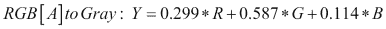

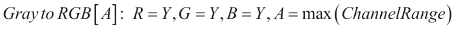

请注意，根据上式中的，不可能直接从灰度图像中检索颜色。

#### 示例代码

**Gray** 示例之后的显示了如何将 RGB 图像转换为灰度，并显示了两张图片。 示例代码为：

```cpp
#include <opencv2/opencv.hpp>
#include <opencv2/imgproc.hpp>

using namespace cv;

int main(int argc, const char** argv)
{
    //Load the image
    Mat image = imread("Lovebird.jpg");
    namedWindow("Picture", WINDOW_AUTOSIZE );
    imshow("Picture",image);

    Mat imageGray;
    cvtColor(image, imageGray, COLOR_BGR2GRAY);

    namedWindow( "Gray picture", WINDOW_AUTOSIZE );
    imshow("Gray picture",imageGray);

    waitKey(0);
    return 0;
}
```

下图显示了代码的输出：

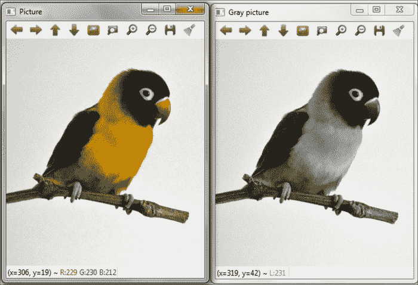

原始 RGB 图像和灰度转换

### 注意

从 RGB 转换为灰度的方法的缺点是失去了原始图像的对比度。 [本书的第 6 章](6.html "Chapter 6. Computational Photography")，“计算摄影”描述了脱色过程，该过程在克服此问题的同时进行了相同的转换。

### CIE XYZ

CIE XYZ 系统使用亮度分量 Y 来描述颜色，该亮度分量与人眼的亮度灵敏度有关，并且由**国际照明委员会**标准化了另外两个通道 X 和 Z。 HTG3]（**CIE**）使用来自几个人类观察者的实验统计数据。 此颜色空间用于报告测量仪器（例如比色计或分光光度计）的颜色，当需要跨不同设备进行一致的颜色表示时，该颜色空间将非常有用。 这种颜色空间的主要问题是颜色以不均匀的方式缩放。 这一事实导致 CIE 采用 CIE L * a * b *和 CIE L * u * v *颜色模型。****

使用`cvtColor`在 OpenCV 中在 RGB 和 CIE XYZ 之间转换的色彩空间转换代码是`COLOR_BGR2XYZ`，`COLOR_RGB2XYZ`， `COLOR_XYZ2BGR`和`COLOR_XYZ2RGB`。 这些转换的计算如下：


#### 示例代码

**CIExyz** 示例之后的显示了如何将 RGB 图像转换为 CIE XYZ 颜色空间，并分别以灰色和彩色显示并显示每个特定通道。 代码的第一部分用于加载和转换图片：

```cpp
#include <opencv2/opencv.hpp>
#include <opencv2/imgproc.hpp>
using namespace std;
using namespace cv;

vector<Mat> showSeparatedChannels(vector<Mat> channels);

int main(int argc, const char** argv)
{
    //Load the image
    Mat image = imread("Lovebird.jpg");
    imshow("Picture",image);

    //transform to CIEXYZ
    cvtColor(image,image,COLOR_BGR2XYZ);

```

代码的下一部分在每个 CIE XYZ 通道中拆分图片并显示它们：

```cpp
    vector<Mat> channels;

    split( image, channels );

    //show channels in gray scale
    namedWindow("X channel (gray)", WINDOW_AUTOSIZE );
    imshow("X channel (gray)",channels[0]);
    namedWindow("Y channel (gray)", WINDOW_AUTOSIZE );
    imshow("Y channel (gray)",channels[1]);
    namedWindow("Z channel (gray)", WINDOW_AUTOSIZE );
    imshow("Z channel (gray)",channels[2]);

    //show channels in BGR
    vector<Mat> separatedChannels=showSeparatedChannels(channels);

    for (int i=0;i<3;i++){      cvtColor(separatedChannels[i],separatedChannels[i],COLOR_XYZ2BGR);
    }
    namedWindow("X channel", WINDOW_AUTOSIZE );
    imshow("X channel",separatedChannels[0]);
    namedWindow("Y channel", WINDOW_AUTOSIZE );
    imshow("Y channel",separatedChannels[1]);
    namedWindow("Z channel", WINDOW_AUTOSIZE );
    imshow("Z channel",separatedChannels[2]);

    waitKey(0);

    return 0;
}
```

下图显示了代码的输出：


原始 RGB 图像和 CIE XYZ 通道分割

### YCrCb

此色彩空间广泛用于视频和图像压缩方案，它不是绝对的色彩空间，因为它是对 RGB 色彩空间进行编码的一种方式。 Y 通道表示亮度，而 Cr 和 Cb 表示红色差异（RGB 色彩空间中的 R 通道与 Y 之间的差异）和蓝色差异（RGB 色彩空间中的 B 通道与 Y 之间的差异）色度分量。 它广泛用于视频和图像压缩方案，例如 MPEG 和 JPEG。

使用`cvtColor`在 OpenCV 中在 RGB 和 YCrCb 之间进行转换的颜色空间转换代码是`COLOR_BGR2YCrCb`，`COLOR_RGB2YCrCb`，`COLOR_YCrCb2BGR`和`COLOR_YCrCb2RGB`。 这些转换的计算如下：


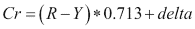


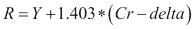

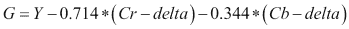


然后，以和来看以下内容：

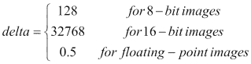

#### 示例代码

下面的 **YCrCb 颜色**示例向您展示如何将 RGB 图像转换为 YCrCb 颜色空间，并以灰色和一种颜色拆分并显示每个特定的通道。 代码的第一部分用于加载和转换图片：

```cpp
#include <opencv2/opencv.hpp>
#include <opencv2/imgproc.hpp>

using namespace std;
using namespace cv;

vector<Mat> showSeparatedChannels(vector<Mat> channels);

int main(int argc, const char** argv)
{
    //Load the image
    Mat image = imread("Lovebird.jpg");
    imshow("Picture",image);

    //transform to YCrCb
 cvtColor(image,image,COLOR_BGR2YCrCb);

```

代码的下一部分将图片分成每个 YCrCb 通道，并显示它们：

```cpp
    vector<Mat> channels;

 split( image, channels );

    //show channels in gray scale
    namedWindow("Y channel (gray)", WINDOW_AUTOSIZE );
    imshow("Y channel (gray)",channels[0]);
    namedWindow("Cr channel (gray)", WINDOW_AUTOSIZE );
    imshow("Cr channel (gray)",channels[1]);
    namedWindow("Cb channel (gray)", WINDOW_AUTOSIZE );
    imshow("Cb channel (gray)",channels[2]);

    //show channels in BGR
 vector<Mat> separatedChannels=showSeparatedChannels(channels);

    for (int i=0;i<3;i++){
        cvtColor(separatedChannels[i],separatedChannels[i],COLOR_YCrCb2BGR);
    }
    namedWindow("Y channel", WINDOW_AUTOSIZE );
    imshow("Y channel",separatedChannels[0]);
    namedWindow("Cr channel", WINDOW_AUTOSIZE );
    imshow("Cr channel",separatedChannels[1]);
    namedWindow("Cb channel", WINDOW_AUTOSIZE );
    imshow("Cb channel",separatedChannels[2]);

    waitKey(0);

    return 0;
}
```

下图显示了代码的输出：

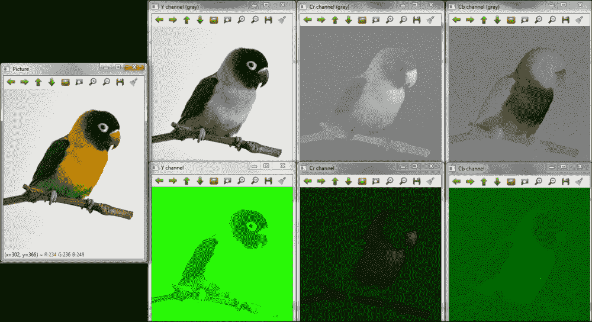

原始 RGB 图像和 YCrCb 通道分割

### HSV

HSV 颜色空间属于所谓的面向色相的颜色坐标系。 这种颜色模型与人类颜色感知模型非常相似。 在其他颜色模型（如 RGB）中，图像被视为三种基色的相加结果，而 **HSV** 的三个通道代表**色相**（H 给出了颜色的光谱组成的一个度量），**饱和度**（S 表示主波长的纯光比例，它表示颜色与相等亮度的灰色有多远）和**值**（V 给出相对于类似照亮的白色颜色的亮度的亮度），对应于色调，阴影和色调的直观吸引力。 HSV 被广泛用​​于进行颜色比较，因为 H 几乎是独立的光线变化。 下图显示了此颜色模型，该颜色模型将每个通道表示为圆柱体的一部分：


用于使用`cvtColor`在 OpenCV 中的 RGB 和 HSV 之间进行转换的颜色空间转换代码是`COLOR_BGR2HSV`，`COLOR_RGB2HSV`，`COLOR_HSV2BGR`和`COLOR_HSV2RGB`。 在这种情况下，值得注意的是，如果`src`图像格式为 8 位或 16 位，则`cvtColor`首先将其转换为浮点格式，并在 0 和 1 之间缩放值。 转换计算如下：

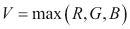


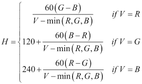

如果 *H < 0* ，则 *H = H + 360* 。 最后，值将转换为目标数据类型。

#### 示例代码

下面的 **HSVcolor** 示例向您展示如何将 RGB 图像转换为 HSV 色彩空间，并以灰度和 HSV 图像拆分和显示每个特定通道。 示例代码为：

```cpp
#include <opencv2/opencv.hpp>
#include <opencv2/imgproc.hpp>

using namespace std;
using namespace cv;

int main(int argc, const char** argv)
{
    //Load the image
    Mat image = imread("Lovebird.jpg");
    imshow("Picture",image);

    //transform to HSV
 cvtColor(image,image,COLOR_BGR2HSV);

    vector<Mat> channels;

 split( image, channels );

    //show channels in gray scale
    namedWindow("H channel (gray)", WINDOW_AUTOSIZE );
    imshow("H channel (gray)",channels[0]);
    namedWindow("S channel (gray)", WINDOW_AUTOSIZE );
    imshow("S channel (gray)",channels[1]);
    namedWindow("V channel (gray)", WINDOW_AUTOSIZE );
    imshow("V channel (gray)",channels[2]);

    namedWindow("HSV image (all channels)", WINDOW_AUTOSIZE );
    imshow("HSV image (all channels)",image);

    waitKey(0);

    return 0;
}
```

下图显示了代码的输出：

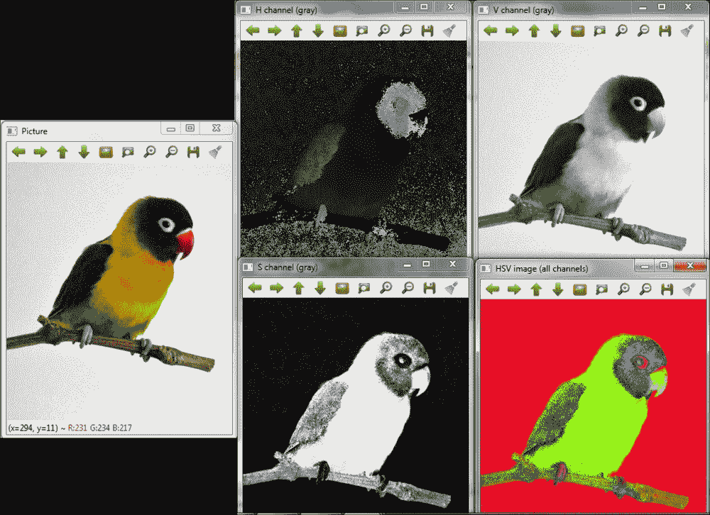

原始 RGB 图像，HSV 转换和通道分割

### 注意

OpenCV 的`imshow`功能假定要显示的图像颜色是 RGB，因此显示不正确。 如果您在其他颜色空间中有图像，并且想要正确显示，则首先必须将其转换回 RGB。

### HLS

HLS 颜色空间属于面向色相的颜色坐标系统，例如先前说明的 HSV 颜色模型。 开发该模型以指定每个通道中的色相，亮度和颜色饱和度的值。 HSV 颜色模型的区别在于，HLS 定义的纯色的亮度等于中等灰色的亮度，而 HSV 定义的纯色的亮度等于白色的亮度。

使用`cvtColor`在 OpenCV 中在 RGB 和 HLS 之间进行转换的颜色空间转换代码为`COLOR_BGR2HLS`，`COLOR_RGB2HLS`，`COLOR_HLS2BGR`和`COLOR_HLS2RGB`。 在这种情况下，与 HSV 一样，如果`src`图像格式为 8 位或 16 位，则`cvtColor`首先将其转换为浮点格式，将值缩放到 0 到 1 之间。然后，转换计算如下：


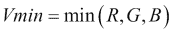

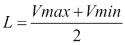

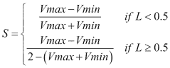

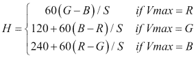

如果 *H < 0* ，则 *H = H + 360* 。 最后，将值重新转换为目标数据类型。

#### 示例代码

以下 **HLScolor** 示例向您展示如何将 RGB 图像转换为 HLS 色彩空间，如何拆分和显示灰度中的每个特定通道以及 HLS 图像。 示例代码为：

```cpp
#include <opencv2/opencv.hpp>
#include <opencv2/imgproc.hpp>

using namespace std;
using namespace cv;

int main(int argc, const char** argv)
{
    //Load the image
    Mat image = imread("Lovebird.jpg");
    imshow("Picture",image);

    //transform to HSV
 cvtColor(image,image,COLOR_BGR2HLS);

    vector<Mat> channels;

 split( image, channels );

    //show channels in gray scale
    namedWindow("H channel (gray)", WINDOW_AUTOSIZE );
    imshow("H channel (gray)",channels[0]);
    namedWindow("L channel (gray)", WINDOW_AUTOSIZE );
    imshow("L channel (gray)",channels[1]);
    namedWindow("S channel (gray)", WINDOW_AUTOSIZE );
    imshow("S channel (gray)",channels[2]);

    namedWindow("HLS image (all channels)", WINDOW_AUTOSIZE );
    imshow("HLS image (all channels)",image);

    waitKey(0);

    return 0;
}
```

下图显示了代码的输出：


原始 RGB 图像，HLS 转换和通道分割

### CIE L * a * b *

CIE L * a * b *颜色空间是在 CIE L * u * v *之后由 CIE 标准化的第二个均匀颜色空间，它是基于 CIE XYZ 空间和白色参考点得出的。 实际上，它是 CIE 指定的最完整的色彩空间，其创建是与设备无关的，例如 CYE XYZ 模型，并用作参考。 它能够描述人眼可见的颜色。 这三个通道代表颜色的亮度（L *），品红色和绿色之间的位置（a *），以及黄色和蓝色之间的位置（b *）。

使用`cvtColor`在 OpenCV 中在 RGB 和 CIE L * a * b *之间进行转换的色彩空间转换代码是`COLOR_BGR2Lab`，`COLOR_RGB2Lab`，`COLOR_Lab2BGR`和`COLOR_Lab2RGB`。 在[这个页面](http://docs-hoffmann.de/cielab03022003.pdf)中解释了用于计算这些转换的过程。

#### 示例代码

**CIElab** 示例之后的显示了如何将 RGB 图像转换为 CIE L * a * b *色彩空间，以灰度和 CIE L * a * b *分割并显示图片的每个特定通道。 示例代码为：

```cpp
#include <opencv2/opencv.hpp>
#include <opencv2/imgproc.hpp>

using namespace std;
using namespace cv;

int main(int argc, const char** argv)
{
    //Load the image
    Mat image = imread("Lovebird.jpg");
    imshow("Picture",image);

    //transform to CIE Lab
 cvtColor(image,image,COLOR_BGR2Lab);

    vector<Mat> channels;

 split( image, channels );

    //show channels in gray scale
    namedWindow("L channel (gray)", WINDOW_AUTOSIZE );
    imshow("L channel (gray)",channels[0]);
    namedWindow("a channel (gray)", WINDOW_AUTOSIZE );
    imshow("a channel (gray)",channels[1]);
    namedWindow("b channel (gray)", WINDOW_AUTOSIZE );
    imshow("b channel (gray)",channels[2]);

    namedWindow("CIE Lab image (all channels)", WINDOW_AUTOSIZE );
    imshow("CIE Lab image (all channels)",image);

    waitKey(0);

    return 0;
}
```

下图显示了代码的输出：


原始 RGB 图像，CIE L * a * b *转换和通道分割

### CIE L * u * v *

CIE L * u * v *颜色空间是 CIE 标准化的第一个统一颜色空间。 它是 CIE XYZ 空间和白色参考点的简单计算转换，尝试进行感知均匀性。 类似于 CIE L * a * b *颜色空间，它的创建与设备无关。 三个通道代表颜色的亮度（L *）及其在绿色和红色之间的位置（u *），最后一个通道主要代表蓝色和紫色类型的颜色（v *）。 该颜色模型具有线性加和特性，因此可用于灯光的添加剂混合物。

使用`cvtColor`在 OpenCV 中在 RGB 和 CIE L * u * v *之间进行转换的颜色空间转换代码是`COLOR_BGR2Luv`，`COLOR_RGB2Luv`，`COLOR_Luv2BGR`和`COLOR_Luv2RGB`。 可以在[这个页面](http://docs.opencv.org/trunk/modules/imgproc/doc/miscellaneous_transformations.html#cvtcolor)上看到用于计算这些转换的过程。

#### 示例代码

**CIELuvcolor** 示例之后的显示了如何将 RGB 图像转换为 CIE L * u * v *色彩空间，以灰度和 CIE L * u * v *分割并显示图片的每个特定通道。 示例代码为：

```cpp
#include <opencv2/opencv.hpp>
#include <opencv2/imgproc.hpp>

using namespace std;
using namespace cv;

int main(int argc, const char** argv)
{
    //Load the image
    Mat image = imread("Lovebird.jpg");
    imshow("Picture",image);

    //transform to CIE Luv
 cvtColor(image,image,COLOR_BGR2Luv);

    vector<Mat> channels;

 split( image, channels );

    //show channels in gray scale
    namedWindow("L channel (gray)", WINDOW_AUTOSIZE );
    imshow("L channel (gray)",channels[0]);
    namedWindow("u channel (gray)", WINDOW_AUTOSIZE );
    imshow("u channel (gray)",channels[1]);
    namedWindow("v channel (gray)", WINDOW_AUTOSIZE );
    imshow("v channel (gray)",channels[2]);

    namedWindow("CIE Luv image (all channels)", WINDOW_AUTOSIZE );
    imshow("CIE Luv image (all channels)",image);

    waitKey(0);

    return 0;
}
```

下图显示了代码的输出：


原始 RGB 图像，CIE L * u * v *转换和通道分割

### 拜耳

拜耳像素空间合成被广泛用于带有仅一个图像传感器的数码相机。 与具有三个传感器的相机（每个 RGB 通道一个传感器，可以获取特定组件的所有信息）不同，在一台传感器相机中，每个像素都被一个不同的滤色镜覆盖，因此每个像素仅以此颜色进行测量。 使用拜耳方法从其邻居中推断出丢失的颜色信息。 它使您可以从一个像素交错的单一平面中获取完整的彩色图片，如下所示：

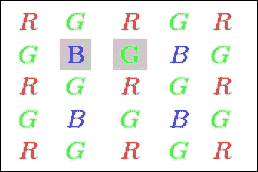

拜耳模式示例

### 注意

请注意，拜耳图案由比 R 和 B 多的 G 像素表示，因为人眼对绿色频率更敏感。

通过将图案在任何方向上移动一个像素，可以获得对所示图案的几种修改。 在 OpenCV 中将 Bayer 转换为 RGB 的色彩空间转换代码是将第二行的第二列和第三列（分别为`X`和`Y`）的组件定义为`COLOR_BayerXY2BGR`的。 例如，前一张图片的图案具有“ BG”类型，因此其转换代码为`COLOR_BayerBG2BGR`。

#### 示例代码

以下 **Bayer** 示例向您展示如何将由从图像传感器获得的 RG Bayer 模式定义的图片转换为 RGB 图像。 示例代码为：

```cpp
#include <opencv2/opencv.hpp>
#include <opencv2/imgproc.hpp>

using namespace cv;

int main(int argc, const char** argv)
{
    //Show bayered image in color
    Mat bayer_color = imread("Lovebird_bayer_color.jpg");
    namedWindow("Bayer picture in color", WINDOW_AUTOSIZE );
    imshow("Bayer picture in color",bayer_color);

    //Load bayered image
    Mat bayer = imread("Lovebird_bayer.jpg",CV_8UC3);
    namedWindow("Bayer picture ", WINDOW_AUTOSIZE );
    imshow("Bayer picture",bayer);

    Mat imageColor;
    cvtColor(bayer, imageColor, COLOR_BayerRG2BGR);

    namedWindow( "Color picture", WINDOW_AUTOSIZE );
    imshow("Color picture",imageColor);

    waitKey(0);
    return 0;
}
```

下图显示了代码的输出：

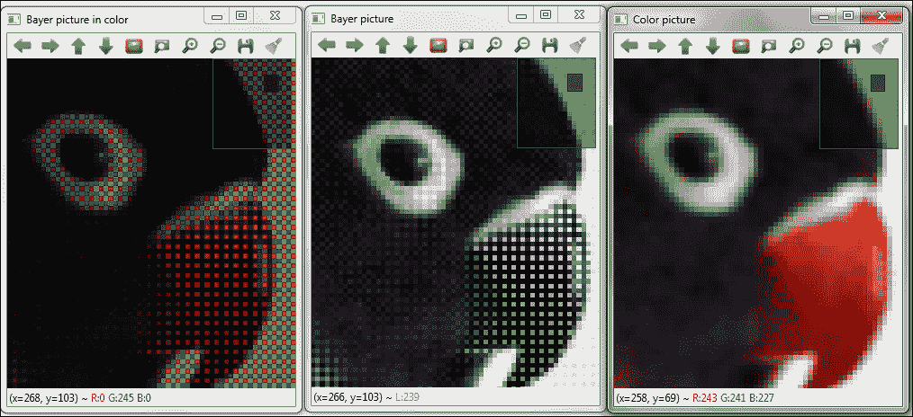

拜耳图案图像和 RGB 转换

# 基于颜色空间的分割

每个颜色空间代表一个图像，该图像指示每个像素上每个通道测得的特定特性的数值。 考虑到这些特性，可以使用线性边界（例如，三维空间中的平面和每个通道一个空间）对颜色空间进行分区，从而可以根据其所在的分区对每个像素进行分类，因此可以选择一组具有预定义特性的像素。 这个想法可以用来分割我们感兴趣的图像对象。

OpenCV 提供`void inRange(InputArray src, InputArray lowerb, InputArray upperb, OutputArray dst)`函数来检查元素数组是否位于其他两个数组的元素之间。 对于基于色彩空间的分割，此功能可让您获得`src`图像的像素集，其通道值位于`lowerb`下边界和`upperb`上边界之间，从而获得[ `dst`图片。

### 注意

`lowerb`和`upperb`边界通常定义为`Scalar(x, y, z)`，其中`x`，`y,`和`z`是定义为上下边界的每个通道的数值。

以下示例向您展示如何检测可以被认为是皮肤的像素。 已经观察到，肤色的强度比色度的差异更大，因此通常在皮肤检测中不考虑亮度成分。 由于该色彩空间对亮度的依赖性，这一事实使得难以检测以 RGB 表示的图像中的皮肤，因此使用 HSV 和 YCrCb 颜色模型。 值得注意的是，对于这种类型的分段，必须知道或获得每个通道的边界值。

## HSV 细分

如先前所述，HSV 被广泛用​​于进行颜色比较，因为 H 几乎与光的变化无关，因此在皮肤检测中很有用。 在该示例中，选择下边界（0、10、60）和上边界（20、150、255）以检测每个像素中的皮肤。 示例代码为：

```cpp
#include <opencv2/opencv.hpp>
#include <opencv2/imgproc.hpp>

using namespace std;
using namespace cv;

int main()
{
    //Load the image
    Mat image = imread("hand.jpg");
    namedWindow("Picture", WINDOW_AUTOSIZE );
    imshow("Picture",image);

    Mat hsv;
 cvtColor(image, hsv, COLOR_BGR2HSV);

    //select pixels
    Mat bw;
 inRange(hsv, Scalar(0, 10, 60), Scalar(20, 150, 255), bw);

    namedWindow("Selected pixels", WINDOW_AUTOSIZE );
    imshow("Selected pixels", bw);

    waitKey(0);
    return 0;
}
```

下图显示代码的输出：

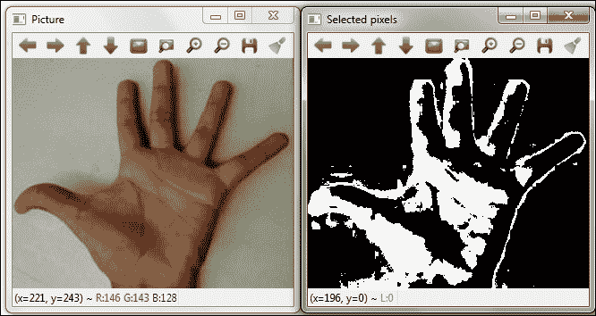

使用 HSV 颜色空间进行皮肤检测

## YCrCb 分割

YCrCb 颜色空间减少了 RGB 颜色通道的冗余，并以独立的组件表示颜色。 考虑到亮度和色度分量是分开的，此空间是皮肤检测的不错选择。

以下示例将 YCrCb 颜色空间用于皮肤检测，并使用每个像素中的下边界（0，133，77）和上边界（255，173，177）。 示例代码为：

```cpp
#include <opencv2/opencv.hpp>
#include <opencv2/imgproc.hpp>

using namespace std;
using namespace cv;

int main()
{
    //Load the image
    Mat image = imread("hand.jpg");
    namedWindow("Picture", WINDOW_AUTOSIZE );
    imshow("Picture",image);

    Mat ycrcb;
 cvtColor(image, ycrcb, COLOR_BGR2HSV);

    //select pixels
    Mat bw;
 inRange(ycrcb, Scalar(0, 133, 77), Scalar(255, 173, 177), bw);

    namedWindow("Selected pixels", WINDOW_AUTOSIZE );
    imshow("Selected pixels", bw);

    waitKey(0);
    return 0;
}
```

下图显示代码的输出：

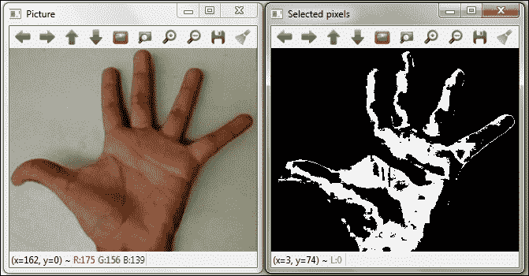

使用 YCrCb 颜色空间进行皮肤检测

### 注意

有关的更多图像分割方法，请参阅 Packt Publishing 的 *OpenCV Essentials* 的第 4 章。

# 颜色转移

图像处理中通常执行的另一项任务是修改图像的颜色，特别是在需要去除主要或不希望有的偏色的情况下。 这些方法中的一种称为颜色转移，该方法执行一组借用一个源图像的颜色特征的颜色校正，并将源图像的外观转移到目标图像。

## 示例代码

以下 **colorTransfer** 示例显示了如何将颜色从源图像传输到目标图像。 此方法首先将图像色彩空间转换为 CIE L * a * b *。 接下来，它为源图像和目标图像分割通道。 之后，使用均值和标准差拟合从一个图像到另一个图像的通道分布。 最后，通道合并回一起并转换为 RGB。

### 注意

有关示例中使用的转换的完整理论详细信息，请参见[上的*图像之间的颜色转移* http://www.cs.tau.ac.il/~turkel/imagepapers/ColorTransfer.pdf](http://www.cs.tau.ac.il/~turkel/imagepapers/ColorTransfer.pdf) 。

代码的第一部分将图像转换为 CIE L * a * b *颜色空间，同时还将图像类型更改为`CV_32FC1`：

```cpp
#include <opencv2/opencv.hpp>
#include <opencv2/imgproc.hpp>

using namespace std;
using namespace cv;

int main(int argc, const char** argv)
{
    //Load the images
    Mat src = imread("clock_tower.jpg");
    Mat tar = imread("big_ben.jpg");

    //Convert to Lab space and CV_32F1
    Mat src_lab, tar_lab;

 cvtColor(src, src_lab, COLOR_BGR2Lab );
 cvtColor(tar, tar_lab, COLOR_BGR2Lab );

    src_lab.convertTo(src_lab,CV_32FC1);
    tar_lab.convertTo(tar_lab,CV_32FC1);
```

代码的接下来的部分执行颜色转移，如前所述：

```cpp
    //Find mean and std of each channel for each image
    Mat mean_src, mean_tar, stdd_src, stdd_tar;
 meanStdDev(src_lab, mean_src, stdd_src);
 meanStdDev(tar_lab, mean_tar, stdd_src);

    // Split into individual channels
    vector<Mat> src_chan, tar_chan;

 split( src_lab, src_chan );
 split( tar_lab, tar_chan );

    // For each channel calculate the color distribution
    for( int i = 0; i < 3; i++ ) {
 tar_chan[i] -= mean_tar.at<double>(i);
 tar_chan[i] *= (stdd_src.at<double>(i) / stdd_src.at<double>(i));
 tar_chan[i] += mean_src.at<double>(i);
    }

    //Merge the channels, convert to CV_8UC1 each channel and convert to BGR
    Mat output;
 merge(tar_chan, output);
    output.convertTo(output,CV_8UC1);
    cvtColor(output, output, COLOR_Lab2BGR );

    //show pictures
    namedWindow("Source image", WINDOW_AUTOSIZE );
    imshow("Source image",src);
    namedWindow("Target image", WINDOW_AUTOSIZE );
    imshow("Target image",tar);
    namedWindow("Result image", WINDOW_AUTOSIZE );
    imshow("Result image",output);

    waitKey(0);

    return 0;
}
```

下图显示了代码的输出：


夜间外观颜色转移示例

# 摘要

在本章中，我们对 OpenCV 中使用的色彩空间进行了更深入的介绍，并向您展示了如何使用`cvtColor`函数在色彩空间之间进行转换。 此外，强调了使用不同颜色模型进行图像处理的可能性以及考虑到我们需要进行的操作选择正确的颜色空间的重要性。 为此，实现了基于颜色空间的分割和颜色转移方法。

下一章将介绍用于视频或一系列图像的图像处理技术。 我们将看到如何使用 OpenCV 实现视频稳定，超分辨率和拼接算法。