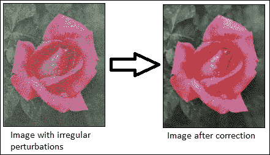
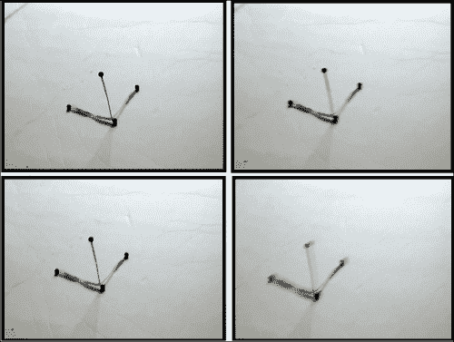
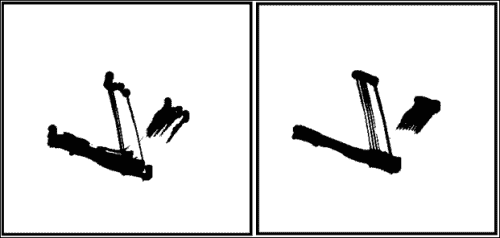
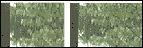
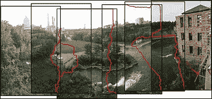
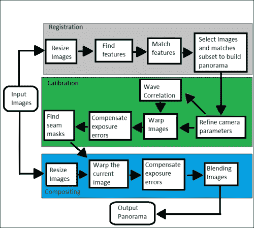

# 第 5 章。视频图像处理

本章介绍与视频图像处理有关的各种技术。 尽管大多数经典图像处理都是处理静态图像，但基于视频的处理正变得越来越流行且价格合理。

本章涵盖以下主题：

*   视频稳定
*   视频超分辨率过程
*   图像拼接

在本章中，我们将直接与视频序列或实时摄像机一起使用。 图像处理的输出可以是一组修改的图像或有用的高级信息。 大多数图像处理技术将图像视为二维数字信号，并对其应用不同的技术。 在本章中，将使用视频或实时摄像机的图像序列来使用不同的高级技术来制作或改进新的增强序列。 因此，获得了更多有用的信息，即，结合了第三时间维度。

# 视频稳定

视频稳定是指用于减少与摄像机运动相关的模糊的一系列方法。 换句话说，它补偿了任何角度移动，等效于摄像机的偏航，俯仰，横滚以及 x 和 y 平移。 最早的图像稳定器出现在 60 年代初期。 这些系统能够略微补偿相机抖动和非自愿移动。 它们由陀螺仪和加速计控制，其机制是通过改变镜头的位置来抵消或减少不必要的运动。 当前，这些方法广泛用于双筒望远镜，摄像机和望远镜。

有多种用于图像或视频稳定的方法，本章重点介绍最广泛的方法系列：

*   **机械稳定系统**：这些系统在摄像机镜头上使用机械系统，因此在移动摄像机时，加速度计和陀螺仪会检测到运动，并且系统会在运动时产生运动。 镜片。 这些系统将不在此处考虑。
*   **数字稳定系统**：这些通常是视频中使用的，它们直接作用于从摄像机获得的图像。 在这些系统中，稳定图像的表面略小于源图像的表面。 移动相机时，拍摄的图像也会移动以补偿该移动。 尽管这些技术通过减小运动传感器的可用面积有效地消除了运动，但是却牺牲了分辨率和图像清晰度。

视频稳定算法通常包括以下步骤：


视频稳定算法的一般步骤

本章将放在 OpenCV 3.0 Alpha 中的`videostab`模块上，该模块包含一组可用于解决视频稳定问题的函数和类。

让我们更详细地探讨一般过程。 视频稳定是通过使用 RANSAC 方法对连续帧之间的帧间运动进行第一估计来实现的。 在此步骤结束时，将获得 3 x 3 矩阵的数组，并且每个矩阵都描述了两对连续帧的运动。 全局运动估计对于此步骤非常重要，它会影响稳定的最终序列的准确性。

### 注意

您可以在[这个页面](http://en.wikipedia.org/wiki/RANSAC)上找到有关 RANSAC 方法的更多详细信息。

第二步基于估计的运动生成新的帧序列。 执行其他处理，例如平滑，去模糊，边界外推等，以提高稳定的质量。

第三步消除烦人的不规则扰动，请参见下图。 有一些方法假设了摄像机运动模型，当可以对摄像机的实际运动做出一些假设时，这些方法会很好地起作用。



消除不规则的扰动

在 OpenCV 示例（`[opencv_source_code]/samples/cpp/videostab.cpp`）中，可以找到视频稳定程序示例。 对于以下 videoStabilizer 示例，`videoStabilizer.pro`项目需要以下库：`lopencv_core300`，`lopencv_highgui300`，`lopencv_features2d300`，`lopencv_videoio300`和 `lopencv_videostab300`。

使用 OpenCV 3.0 Alpha 的`videostab`模块创建了以下 **videoStabilizer** 示例：

```cpp
#include <string>
#include <iostream>
#include <opencv2/opencv.hpp>
#include <opencv2/videostab.hpp>

using namespace std;
using namespace cv;
using namespace cv::videostab;

void processing(Ptr<IFrameSource> stabilizedFrames, string outputPath);

int main(int argc, const char **argv)
{
Ptr<IFrameSource> stabilizedFrames;
    try
    {

// 1-Prepare the input video and check it
        string inputPath;
       string outputPath;
        if (argc > 1)
            inputPath = argv[1];
        else
            inputPath = ".\\cube4.avi";

  if (argc > 2)
            outputPath = argv[2];
        else
            outputPath = ".\\cube4_stabilized.avi";

Ptr<VideoFileSource> source = makePtr<VideoFileSource>(inputPath);
        cout << "frame count (rough): " << source->count() << endl;

// 2-Prepare the motion estimator
// first, prepare the motion the estimation builder, RANSAC L2
        double min_inlier_ratio = 0.1;
Ptr<MotionEstimatorRansacL2> est = makePtr<MotionEstimatorRansacL2>(MM_AFFINE);
RansacParams ransac = est->ransacParams();
ransac.size = 3;
 ransac.thresh = 5;
 ransac.eps = 0.5;
        est->setRansacParams(ransac);
        est->setMinInlierRatio(min_inlier_ratio);

    // second, create a feature detector
int nkps = 1000;
Ptr<GoodFeaturesToTrackDetector> feature_detector = makePtr<GoodFeaturesToTrackDetector>(nkps);

// third, create the motion estimator
Ptr<KeypointBasedMotionEstimator> motionEstBuilder = makePtr<KeypointBasedMotionEstimator>(est);
        motionEstBuilder->setDetector(feature_detector);
Ptr<IOutlierRejector> outlierRejector = makePtr<NullOutlierRejector>();
        motionEstBuilder->setOutlierRejector(outlierRejector);

// 3-Prepare the stabilizer
StabilizerBase *stabilizer = 0;

// first, prepare the one or two pass stabilizer
        bool isTwoPass = 1;
        int radius_pass = 15;
        if (isTwoPass)
        {
            // with a two pass stabilizer
            bool est_trim = true;

TwoPassStabilizer *twoPassStabilizer = new TwoPassStabilizer();
            twoPassStabilizer->setEstimateTrimRatio(est_trim);
            twoPassStabilizer->setMotionStabilizer(makePtr<GaussianMotionFilter>(radius_pass));

            stabilizer = twoPassStabilizer;
        }
        else
        {
            // with an one pass stabilizer
OnePassStabilizer *onePassStabilizer = new OnePassStabilizer();
            onePassStabilizer->setMotionFilter(makePtr<GaussianMotionFilter>(radius_pass));

            stabilizer = onePassStabilizer;
        }

        // second, set up the parameters
        int radius = 15;
        double trim_ratio = 0.1;
        bool incl_constr = false;
stabilizer->setFrameSource(source);
stabilizer->setMotionEstimator(motionEstBuilder);
        stabilizer->setRadius(radius);
        stabilizer->setTrimRatio(trim_ratio);
        stabilizer->setCorrectionForInclusion(incl_constr);
        stabilizer->setBorderMode(BORDER_REPLICATE);

        // cast stabilizer to simple frame source interface to read stabilized frames
stabilizedFrames.reset(dynamic_cast<IFrameSource*>(stabilizer));

// 4-Processing the stabilized frames. The results are showed and saved.
processing(stabilizedFrames, outputPath);
    }
    catch (const exception &e)
    {
        cout << "error: " << e.what() << endl;
        stabilizedFrames.release();
        return -1;
    }
    stabilizedFrames.release();
    return 0;
}

void processing(Ptr<IFrameSource> stabilizedFrames, string outputPath)
{
    VideoWriter writer;
    Mat stabilizedFrame;
    int nframes = 0;
double outputFps = 25;

    // for each stabilized frame
while (!(stabilizedFrame = stabilizedFrames->nextFrame()).empty())
    {
        nframes++;

        // init writer (once) and save stabilized frame
        if (!outputPath.empty())
        {
            if (!writer.isOpened())                writer.open(outputPath,VideoWriter::fourcc('X','V','I','D'),
outputFps, stabilizedFrame.size());
writer << stabilizedFrame;
        }

imshow("stabilizedFrame", stabilizedFrame);
        char key = static_cast<char>(waitKey(3));
        if (key == 27) { cout << endl; break;}

    }
    cout << "processed frames: " << nframes << endl;
    cout << "finished " << endl;
}
```

本示例接受输入视频文件的名称作为默认视频文件名（`.\cube4.avi`）。 将显示结果视频，然后将其另存为`.\cube4_stabilized.avi`。 请注意如何包含`videostab.hpp`标头和使用`cv::videostab`名称空间。 该示例采取了四个重要步骤。 第一步准备输入视频路径，此示例使用标准命令行输入参数（`inputPath = argv[1]`）选择视频文件。 如果没有输入视频文件，则使用默认视频文件（`.\cube4.avi`）。

第二步建立运动估计器。 使用 OpenCV（`Ptr<MotionEstimatorRansacL2> est = makePtr <MotionEstimatorRansacL2> (MM_AFFINE)`）的智能指针（`Ptr<object>`）为运动估计器创建了基于 RANSAC 的鲁棒全局 2D 方法。 有不同的运动模型可以稳定视频：

*   MM_TRANSLATION = 0
*   MM_TRANSLATION_AND_SCALE = 1
*   MM_ROTATIO = 2
*   MM_RIGID = 3
*   MM_SIMILARITY = 4
*   MM_AFFINE = 5
*   MM_HOMOGRAPHY = 6
*   MM_UNKNOWN = 7

在稳定视频的精度和计算时间之间需要权衡。 基本运动模型越不准确，计算时间就越长。 但是，更复杂的模型具有更好的准确性和更差的计算时间。

现在创建 RANSAC 对象（`RansacParams ransac = est-> ransacParams()`），并设置它们的参数（`ransac.size`，`ransac.thresh`和`ransac.eps`）。 还需要一个特征检测器来估计稳定器将使用的每个连续帧之间的运动。 本示例使用`GoodFeaturesToTrackDetector`方法来检测（`nkps = 1000`）每帧中的显着特征。 然后，它使用健壮的 RANSAC 和特征检测器方法使用`Ptr<KeypointBasedMotionEstimator> motionEstBuilder = makePtr<KeypointBasedMotionEstimator>(est)`类创建运动估计器，并使用`motionEstBuilder->setDetector (feature_detector)`设置特征检测器。

<colgroup><col style="text-align: left"> <col style="text-align: left"></colgroup> 
| 

RANSAC 参数

 |
| --- |
| 尺寸 | 子集大小 |
| 脱粒 | 归类为 Inliers 的最大误差 |
| 每股收益 | 最大异常值比 |
| 概率 | 成功的可能性 |

第三步，创建需要先前运动估计器的稳定器。 您可以选择（`isTwoPass = 1`）一或两遍稳定器。 如果使用两遍稳定器（`TwoPassStabilizer *twoPassStabilizer = new TwoPassStabilizer()`），结果通常会更好。 但是，在此示例中，这在计算上较慢。 如果使用其他选项单程稳定器（`OnePassStabilizer *onePassStabilizer = new OnePassStabilizer()`），结果会更糟，但响应速度会更快。 稳定器需要设置其他选项才能正常工作，例如源视频文件（`stabilizer->setFrameSource(source)`）和运动估计器（`stabilizer->setMotionEstimator(motionEstBuilder)`）。 它还需要将稳定器转换为简单的帧源视频以读取稳定的帧（`stabilizedFrames.reset(dynamic_cast<IFrameSource*>(stabilizer))`）。

最后一步使用创建的稳定器稳定视频。 创建`processing(Ptr<IFrameSource> stabilizedFrames)`功能来处理和稳定每个帧。 此功能需要引入一条路径来保存生成的视频（`string outputPath = ".//stabilizedVideo.avi"`）和设置播放速度（`double outputFps = 25`）。 此后，此函数将计算每个稳定的帧，直到不再有帧（`stabilizedFrame = stabilizedFrames-> nextFrame().empty()`）。 在内部，稳定器首先估计每个帧的运动。 此功能创建一个视频编写器（`writer.open(outputPath,VideoWriter::fourcc('X','V','I','D'), outputFps, stabilizedFrame.size())`），以 **XVID** 格式存储每个帧。 最后，它保存并显示每个稳定的帧，直到用户按下 *Esc* 键。

为了演示如何使用 OpenCV 稳定视频，使用了先前的 **videoStabilizer** 示例。 该示例从命令行执行，如下所示：

```cpp
<bin_dir>\videoStabilizer.exe .\cube4.avi .\cube4_stabilized.avi

```

### 注意

该`cube4.avi`视频可在 OpenCV 示例文件夹中找到。 它还具有大量的相机移动，这对于此示例来说是完美的。

为了显示稳定结果，首先，请参见下图中的`cube4.avi`的四个帧。 这些帧之后的图显示了`cube4.avi`和`cube4_stabilized.avi`的前 10 个帧，没有（图的左侧）和（图的右侧）稳定叠加。



`cube4.avi`视频的四个连续帧是摄像机的移动



`cube4.avi`和`cube4_stabilizated`视频的 10 个叠加帧

通过右图查看上图，您可以看到由于稳定，减少了摄像机运动产生的振动。

# 超分辨率

**超分辨率**是指是指通常用于从较低分辨率的图像序列中提高图像或视频空间分辨率的技术或算法。 它与传统的图像缩放技术不同，传统的图像缩放技术使用单个图像来提高分辨率，同时保持锐利的边缘。 相反，超分辨率合并了来自同一场景的多个图像的信息，以表示最初在原始图像中未捕获的细节。

从真实场景捕获图像或视频的过程需要以下步骤：

*   **采样**：这是连续系统从理想离散系统场景开始的变换，没有混叠
*   **几何变换**：此是指根据摄像机的位置和镜头系统应用一组变换（例如平移或旋转）来理想地推断到达每个传感器的场景细节
*   **模糊**：这是由于镜头系统或积分期间场景中的现有运动造成的
*   **二次采样**：传感器仅对可使用的像素数（照片）进行积分

您可以在下图中看到此图像捕获过程：


从真实场景捕获图像的过程

在此捕获过程中，场景的细节由不同的传感器集成，因此每次捕获中的每个像素都包含不同的信息。 因此，超分辨率基于试图找到获得场景不同细节的不同捕获之间的关系，以便创建具有更多信息的新图像。 因此，超分辨率用于再生具有更高分辨率的离散场景。

可以通过各种技术来获得超分辨率，从空间领域中最直观的技术到基于频谱分析的技术。 技术基本上分为光学技术（使用镜头，变焦等）或基于图像处理的技术。 本章重点介绍基于图像处理的超分辨率。 这些方法使用低分辨率图像或其他无关图像的其他部分来推断高分辨率图像的外观。 这些算法也可以分为频域或空间域。 最初，超分辨率方法仅适用于灰度图像，但是已经开发出新方法来使它们适应彩色图像。

通常，由于低分辨率和高分辨率图像的尺寸很大，并且可能需要数百秒才能生成图像，因此在空间和时间上都需要超分辨率。 为了尝试减少计算时间，当前将预处理器用于负责使这些功能最小化的优化器。 另一种选择是使用 **GPU 处理**来改善计算时间，因为超分辨率过程固有地可并行化。

本章重点介绍 OpenCV 3.0 Alpha 中的 `superres`模块，其中包含一组可用于解决分辨率增强问题的函数和类。 该模块实现了多种基于图像处理超分辨率的方法。 本章重点介绍已实现的**双边 TV-L1（BTVL1）超分辨率方法**。 超分辨率过程的主要困难是估计扭曲函数以建立超分辨率图像。 双边 TV-L1 使用光流来估计翘曲函数。

### 注意

您可以在[这个页面](http://www.ipol.im/pub/art/2013/26/)和[这个页面](http://en.wikipedia.org/wiki/Optical_flow)找到双边 TV-L 方法的更多详细信息。

在 OpenCV 示例（`[opencv_source_code]/samples/gpu/super_resolution.cpp`）中，可以找到超分辨率的基本示例。

### 注意

您还可以从[这个页面](https://github.com/Itseez/opencv/blob/master/samples/gpu/super_resolution.cpp)的 OpenCV GitHub 存储库中下载此示例。

对于以下 **超分辨率**示例项目，`superresolution.pro`项目文件应包括以下库：`lopencv_core300`，`lopencv_imgproc300`，`lopencv_highgui300`，`lopencv_features2d300`，`lopencv_videoio300`和`lopencv_superres300`才能正常工作：

```cpp
#include <iostream>
#include <iomanip>
#include <string>

#include <opencv2/core.hpp>
#include <opencv2/core/utility.hpp>
#include <opencv2/highgui.hpp>
#include <opencv2/imgproc.hpp>
#include <opencv2/superres.hpp>
#include <opencv2/superres/optical_flow.hpp>
#include <opencv2/opencv_modules.hpp>

using namespace std;
using namespace cv;
using namespace cv::superres;

static Ptr<DenseOpticalFlowExt> createOptFlow(string name);

int main(int argc, char *argv[])
{
// 1-Initialize the initial parameters

// Input and output video
string inputVideoName;
 string outputVideoName;
    if (argc > 1)
        inputVideoName = argv[1];
    else
        inputVideoName = ".\\tree.avi";

    if (argc > 2)
        outputVideoName = argv[2];
    else
        outputVideoName = ".\\tree_superresolution.avi";

const int scale = 4;// Scale factor

const int iterations = 180;// Iterations count

const int temporalAreaRadius =4;// Radius of the temporal search area

string optFlow = "farneback";// Optical flow algorithm
       // optFlow = "farneback";
       // optFlow = "tvl1";
       // optFlow = "brox";
       // optFlow = "pyrlk";

double outputFps = 25.0;// Playback speed output

// 2- Create an optical flow method
Ptr<DenseOpticalFlowExt> optical_flow = createOptFlow(optFlow);

    if (optical_flow.empty()) return -1;

// 3- Create the superresolution method and set its parameters
Ptr<SuperResolution> superRes;
 superRes = createSuperResolution_BTVL1();

superRes->set("opticalFlow", optical_flow);
 superRes->set("scale", scale);
 superRes->set("iterations", iterations);
 superRes->set("temporalAreaRadius", temporalAreaRadius);

Ptr<FrameSource> frameSource;
 frameSource = createFrameSource_Video(inputVideoName);

superRes->setInput(frameSource);

    // Not use the first frame
    Mat frame;
    frameSource->nextFrame(frame);

// 4- Processing the input video with the superresolution
    // Show the initial options
    cout << "Input                  : " << inputVideoName << " " << frame.size() << endl;
    cout << "Output                 : " << outputVideoName << endl;
    cout << "Playback speed output  : " << outputFps << endl;
    cout << "Scale factor           : " << scale << endl;
    cout << "Iterations             : " << iterations << endl;
    cout << "Temporal radius        : " << temporalAreaRadius << endl;
    cout << "Optical Flow           : " << optFlow << endl;
    cout << endl;

    VideoWriter writer;
    double start_time,finish_time;

    for (int i = 0;; ++i)
    {
        cout << '[' << setw(3) << i << "] : ";
        Mat result;

        // Calculate the processing time
        start_time = getTickCount();
superRes->nextFrame(result);
        finish_time = getTickCount();
        cout << (finish_time - start_time)/getTickFrequency() << " secs, Size: " << result.size() << endl;

        if (result.empty()) break;

        // Show the result
imshow("Super Resolution", result);

        if (waitKey(1000) > 0) break;

        // Save the result on output file
        if (!outputVideoName.empty())
        {
if (!writer.isOpened())
 writer.open(outputVideoName, VideoWriter::fourcc('X', 'V', 'I', 'D'), outputFps, result.size());
 writer << result;
        }
    }
    writer.release();
    return 0;
}

static Ptr<DenseOpticalFlowExt> createOptFlow(string name)
{
    if (name == "farneback")
return createOptFlow_Farneback();

    else if (name == "tvl1")
return createOptFlow_DualTVL1();

    else if (name == "brox")
        return createOptFlow_Brox_CUDA();

    else if (name == "pyrlk")
        return createOptFlow_PyrLK_CUDA();

    else
        cerr << "Incorrect Optical Flow algorithm - " << name << endl;

    return Ptr<DenseOpticalFlowExt>();
}
```

本示例创建一个程序（**超分辨率**）以获取具有超分辨率的视频。 它采用输入视频的路径或使用默认视频路径（`.\tree.avi`）。 显示所得的视频并将其另存为`.\tree_superresolution.avi`。 首先，包含`superres.hpp`和`superres/optical_flow.hpp`标头，并使用`cv::superres`命名空间。 该示例遵循四个重要步骤。

第一步设置初始参数。 输入视频路径使用标准输入（`inputVideoName = argv[1]`）选择视频文件，如果没有输入视频文件，则使用默认视频文件。 输出视频路径还使用输入标准（`outputVideoName = argv[2]`）选择输出视频文件，如果它没有输出视频文件，则使用默认输出视频文件（`.\tree_superresolution`）和输出回放速度 也被设置（`double outputFps = 25.0`）。 `superresolution`方法的其他重要参数是比例因子（`const int scale = 4`），迭代`count(const int iterations = 100`，时间搜索区域的半径（`const int temporalAreaRadius = 4`）和光流算法（`string optFlow = "farneback"`）。 。

第二步创建光流方法以检测显着特征并针对每个视频帧跟踪它们。 已经创建了一种新方法（`static Ptr<DenseOpticalFlowExt> createOptFlow(string name)`），以便在不同的光流方法之间进行选择。 您可以在 **farneback** ， **tvl1** ， **brox** 和 **pyrlk** 光流方法之间进行选择。 编写了新的方法（`static Ptr<DenseOpticalFlowExt> createOptFlow(string name)`），以创建光学流动方法来跟踪特征。 两个最重要的方法是 Farneback（`createOptFlow_Farneback()`）和 TV-L1（`createOptFlow_DualTVL1()`）。 第一种方法基于 Gunner Farneback 的算法，该算法计算帧中所有点的光流。 第二种方法基于电视能量的双重公式计算两个图像帧之间的光流，并采用有效的逐点阈值化步骤。 此第二种方法在计算上更有效。

<colgroup><col style="text-align: left"> <col style="text-align: left"> <col style="text-align: left"></colgroup> 
| 

**不同光流方法之间的比较**

 |
| --- |
| **方法** | **复杂度** | **可并行化** |
| 法纳巴克 | 二次方的 | 没有 |
| 电视 L1 | 线性的 | 是 |
| 布罗克斯 | 线性的 | 是 |
| 吡咯 | 线性的 | 没有 |

### 注意

您还可以在[处了解有关 Farneback 光流方法的更多信息，网址为 http://www.diva-portal.org/smash/get/diva2:273847/FULLTEXT01.pdf](http://www.diva-portal.org/smash/get/diva2:273847/FULLTEXT01.pdf) 。

第三步创建并设置`superresolution`方法。 创建此方法的一个实例（`Ptr<SuperResolution> superRes`），该实例使用 **双边 TV-L1** 算法（`superRes = createSuperResolution_BTVL1()`）。 对于算法，此方法具有以下参数：

*   `scale`：这是比例因子
*   `iterations`：这是迭代计数
*   `tau`：这是最速下降法的渐近值
*   `lambda`：这是权重参数，用于平衡数据项和平滑度项
*   `alpha`：这是双边电视中空间分布的参数
*   `btvKernelSize`：这是双边电视滤波器的内核大小
*   `blurKernelSize`：这是高斯模糊内核大小
*   `blurSigma`：这是高斯模糊西格玛
*   `temporalAreaRadius`：这是时间搜索区域的半径
*   `opticalFlow`：这是一种密集光流算法

这些参数设置如下：

```cpp
superRes->set("parameter", value);
```

仅设置以下参数； 其他参数使用其默认值：

```cpp
superRes->set("opticalFlow", optical_flow);
superRes->set("scale", scale);
superRes->set("iterations", iterations);
superRes->set("temporalAreaRadius", temporalAreaRadius);
```

之后，选择输入视频帧（`superRes->setInput(frameSource)`）。

最后一步处理输入视频以计算超分辨率。 对于每个视频帧，计算超分辨率（`superRes->nextFrame(result)`）； 这种计算在计算上非常慢，因此估计处理时间可以显示进度。 最后，显示每个结果帧（`imshow("Super Resolution", result)`）并保存（`writer << result`）。

为了显示超分辨率的结果，比较了`tree.avi`和`tree_superresolution.avi`视频的第一帧的一小部分是否有超分辨率：



`tree.avi`和`tree_superresolution.avi`视频的第一帧的一部分，不包括超分辨率处理

在上图的右侧部分，由于超分辨率过程，您可以在树的叶子和树枝中观察到更多细节。

# 拼接

图像**拼接**或照片拼接可以发现具有一定程度重叠的图像之间的对应关系。 此过程将一组图像与重叠的视场组合在一起，以生成全景图像或高分辨率图像。 大多数用于图像拼接的技术需要在图像之间几乎完全重叠以产生无缝结果。 一些数码相机可以在内部拼接一组图像以构建全景图像。 下图显示了一个示例：



通过拼接创建的全景图像

### 注意

可以在[这个页面](http://en.wikipedia.org/wiki/Image_stitching)上找到前面的图像示例和有关图像拼接的更多信息。

拼接通常可以分为三个重要步骤：

*   **配准**（图像）表示一组图像中的匹配特征以搜索使重叠像素之间差异的绝对值之和最小的位移。 直接比对方法可用于获得更好的结果。 用户还可以添加全景图的粗略模型以帮助特征匹配阶段，在这种情况下，结果通常更准确且计算速度更快。
*   **校准**（图像）将重点放在最小化理想模型和相机镜头系统之间的差异：不同的相机位置和光学缺陷，例如失真，曝光，色差等。
*   **合成**（图像）使用上一步校准的结果，并将图像重新映射到输出投影。 图像之间的颜色也会进行调整，以补偿曝光差异。 将图像融合在一起，并进行接缝线调整以最小化图像之间接缝的可见性。

当从空间的同一点拍摄了图像片段时，可以使用各种地图投影之一进行拼接。 最重要的地图投影如下所示：

*   **直线投影**：在这里，在与全景球在一个点相交的二维平面上查看拼接图像。 无论图像上的方向如何，现实中笔直的线都显示类似。 当视野开阔（大约 120 度）时，图像在边框附近会变形。
*   **圆柱投影**：此处，拼接图像显示 360 度水平视场和有限的垂直视场。 该投影旨在被视为好像图像被包裹在圆柱体中并从内部观看。 在 2D 平面上查看时，水平线看起来是弯曲的，而垂直线则保持笔直。
*   **球形投影**：在这里，拼接图像显示了 360 度水平视野和 180 度垂直视野，即整个球体。 具有这种投影的全景图像旨在像被包裹在一个球体中并从内部观看一样被观看。 在 2D 平面上查看时，水平线看起来像圆柱投影一样弯曲，而垂直线则保持垂直。
*   **立体投影或鱼眼投影**：通过垂直指向虚拟摄像机并将视场设置为足以显示整个地面和某些视场的方式，可用于形成小行星全景 在它上面的区域； 将虚拟摄像机指向上方会产生隧道效果。
*   **帕尼尼投影**：这具有专业投影，可能比常规制图投影在美学上更具优势。 此投影将同一图像中的不同投影组合在一起，以微调输出全景图像的最终外观。

本章重点介绍 OpenCV 3.0 Alpha 中的`stitching`模块和`detail`子模块，其中包含实现 **拼接器**的一组函数和类。 使用这些模块，可以配置或跳过某些步骤。 实施的缝合示例具有以下常规示意图：



在 OpenCV 示例中，有两个基本的缝合示例，可以在（`[opencv_source_code]/samples/cpp/stitching.cpp]`）和（`[opencv_source_code]/samples/cpp/stitching_detailed.cpp]`）处找到。

对于以下，更高级的**拼接高级**示例，`stitchingAdvanced.pro`项目文件必须包含以下库才能正常工作：`lopencv_core300`，`lopencv_imgproc300`，`lopencv_highgui300`，`lopencv_features2d300`，`lopencv_videoio300, lopencv_imgcodecs300`和 `lopencv_stitching300`：

```cpp
#include <iostream>
#include <string>
#include <opencv2/opencv_modules.hpp>
#include <opencv2/core/utility.hpp>
#include <opencv2/imgcodecs.hpp>
#include <opencv2/highgui.hpp>
#include <opencv2/features2d.hpp>
#include <opencv2/stitching/detail/blenders.hpp>
#include <opencv2/stitching/detail/camera.hpp>
#include <opencv2/stitching/detail/exposure_compensate.hpp>
#include <opencv2/stitching/detail/matchers.hpp>
#include <opencv2/stitching/detail/motion_estimators.hpp>
#include <opencv2/stitching/detail/seam_finders.hpp>
#include <opencv2/stitching/detail/util.hpp>
#include <opencv2/stitching/detail/warpers.hpp>
#include <opencv2/stitching/warpers.hpp>

using namespace std;
using namespace cv;
using namespace cv::detail;

int main(int argc, char* argv[])
{
    // Default parameters
    vector<String> img_names;
double scale = 1;
string features_type = "orb";//"surf" or "orb" features type
float match_conf = 0.3f;
float conf_thresh = 1.f;
string adjuster_method = "ray";//"reproj" or "ray" adjuster method
bool do_wave_correct = true;
WaveCorrectKind wave_correct_type = WAVE_CORRECT_HORIZ;
string warp_type = "spherical";
int expos_comp_type = ExposureCompensator::GAIN_BLOCKS;
string seam_find_type = "gc_color";
float blend_strength = 5;
int blend_type = Blender::MULTI_BAND;
string result_name = "panorama_result.jpg";

    double start_time = getTickCount();

// 1-Input images
    if(argc > 1)
    {
        for(int i=1; i < argc; i++)
img_names.push_back(argv[i]);
    }
    else
    {
img_names.push_back("./panorama_image1.jpg");
 img_names.push_back("./panorama_image2.jpg");
    }
    // Check if have enough images
    int num_images = static_cast<int>(img_names.size());
if (num_images < 2) {cout << "Need more images" << endl; return -1; }

// 2- Resize images and find features steps
    cout << "Finding features..." << endl;
    double t = getTickCount();

    Ptr<FeaturesFinder> finder;
    if (features_type == "surf")
finder = makePtr<SurfFeaturesFinder>();

    else if (features_type == "orb")
finder = makePtr<OrbFeaturesFinder>();

    else {cout << "Unknown 2D features type: '" << features_type << endl; return -1; }

    Mat full_img, img;
    vector<ImageFeatures> features(num_images);
    vector<Mat> images(num_images);
    vector<Size> full_img_sizes(num_images);

    for (int i = 0; i < num_images; ++i)
    {
        full_img = imread(img_names[i]);
        full_img_sizes[i] = full_img.size();

        if (full_img.empty()) {cout << "Can't open image " << img_names[i] << endl; return -1; }

resize(full_img, img, Size(), scale, scale);
        images[i] = img.clone();

(*finder)(img, features[i]);
        features[i].img_idx = i;
        cout << "Features in image #" << i+1 << " are : " << features[i].keypoints.size() << endl;
    }
    finder->collectGarbage();
    full_img.release();
    img.release();
    cout << "Finding features, time: " << ((getTickCount() - t) / getTickFrequency()) << " sec" << endl;

// 3- Match features
    cout << "Pairwise matching" << endl;
    t = getTickCount();
    vector<MatchesInfo> pairwise_matches;
BestOf2NearestMatcher matcher(false, match_conf);
    matcher(features, pairwise_matches);
    matcher.collectGarbage();
    cout << "Pairwise matching, time: " << ((getTickCount() - t) / getTickFrequency()) << " sec" << endl;

// 4- Select images and matches subset to build panorama
vector<int> indices = leaveBiggestComponent(features, pairwise_matches, conf_thresh);
    vector<Mat> img_subset;
    vector<String> img_names_subset;
    vector<Size> full_img_sizes_subset;
    for (size_t i = 0; i < indices.size(); ++i)
    {
        img_names_subset.push_back(img_names[indices[i]]);
        img_subset.push_back(images[indices[i]]);
        full_img_sizes_subset.push_back(full_img_sizes[indices[i]]);
    }
    images = img_subset;
    img_names = img_names_subset;
    full_img_sizes = full_img_sizes_subset;

    // Estimate camera parameters rough
    HomographyBasedEstimator estimator;
    vector<CameraParams> cameras;
    if (!estimator(features, pairwise_matches, cameras)){cout << "Homography estimation failed." << endl; return -1; }

    for (size_t i = 0; i < cameras.size(); ++i)
    {
        Mat R;
        cameras[i].R.convertTo(R, CV_32F);
        cameras[i].R = R;
        cout << "Initial intrinsic #" << indices[i]+1 << ":\n" << cameras[i].K() << endl;
    }

// 5- Refine camera parameters globally
Ptr<BundleAdjusterBase> adjuster;
    if (adjuster_method == "reproj")
        // "reproj" method
adjuster = makePtr<BundleAdjusterReproj>();
    else // "ray" method
adjuster = makePtr<BundleAdjusterRay>();

    adjuster->setConfThresh(conf_thresh);
    if (!(*adjuster)(features, pairwise_matches, cameras)) {cout << "Camera parameters adjusting failed." << endl; return -1; }

    // Find median focal length
    vector<double> focals;
    for (size_t i = 0; i < cameras.size(); ++i)
    {
        cout << "Camera #" << indices[i]+1 << ":\n" << cameras[i].K() << endl;
        focals.push_back(cameras[i].focal);
    }
    sort(focals.begin(), focals.end());
    float warped_image_scale;
    if (focals.size() % 2 == 1)
        warped_image_scale = static_cast<float>(focals[focals.size() / 2]);
    else
        warped_image_scale = static_cast<float>(focals[focals.size() / 2 - 1] + focals[focals.size() / 2]) * 0.5f;

// 6- Wave correlation (optional)
    if (do_wave_correct)
    {
        vector<Mat> rmats;
        for (size_t i = 0; i < cameras.size(); ++i)
            rmats.push_back(cameras[i].R.clone());

waveCorrect(rmats, wave_correct_type);
        for (size_t i = 0; i < cameras.size(); ++i)
            cameras[i].R = rmats[i];
    }

// 7- Warp images
    cout << "Warping images (auxiliary)... " << endl;
    t = getTickCount();
    vector<Point> corners(num_images);
    vector<UMat> masks_warped(num_images);
    vector<UMat> images_warped(num_images);
    vector<Size> sizes(num_images);
    vector<UMat> masks(num_images);

    // Prepare images masks
    for (int i = 0; i < num_images; ++i)
    {
        masks[i].create(images[i].size(), CV_8U);
        masks[i].setTo(Scalar::all(255));
    }

    // Map projections
    Ptr<WarperCreator> warper_creator;
    if (warp_type == "rectilinear")
warper_creator = makePtr<cv::CompressedRectilinearWarper>(2.0f, 1.0f);

    else if (warp_type == "cylindrical")
warper_creator = makePtr<cv::CylindricalWarper>();

    else if (warp_type == "spherical")
warper_creator = makePtr<cv::SphericalWarper>();

    else if (warp_type == "stereographic")
warper_creator = makePtr<cv::StereographicWarper>();

    else if (warp_type == "panini")
warper_creator = makePtr<cv::PaniniWarper>(2.0f, 1.0f);

    if (!warper_creator){ cout << "Can't create the following warper '" << warp_type << endl; return 1; }

Ptr<RotationWarper> warper = warper_creator->create(static_cast<float>(warped_image_scale * scale));

    for (int i = 0; i < num_images; ++i)
    {
        Mat_<float> K;
        cameras[i].K().convertTo(K, CV_32F);
        float swa = (float)scale;
        K(0,0) *= swa; K(0,2) *= swa;
        K(1,1) *= swa; K(1,2) *= swa;

        corners[i] = warper->warp(images[i], K, cameras[i].R, INTER_LINEAR, BORDER_REFLECT, images_warped[i]);
        sizes[i] = images_warped[i].size();

warper->warp(masks[i], K, cameras[i].R, INTER_NEAREST, BORDER_CONSTANT, masks_warped[i]);
    }

    vector<UMat> images_warped_f(num_images);
    for (int i = 0; i < num_images; ++i)
        images_warped[i].convertTo(images_warped_f[i], CV_32F);

    cout << "Warping images, time: " << ((getTickCount() - t) / getTickFrequency()) << " sec" << endl;

// 8- Compensate exposure errors
Ptr<ExposureCompensator> compensator = ExposureCompensator::createDefault(expos_comp_type);
 compensator->feed(corners, images_warped, masks_warped);

// 9- Find seam masks
    Ptr<SeamFinder> seam_finder;
    if (seam_find_type == "no")
seam_finder = makePtr<NoSeamFinder>();

    else if (seam_find_type == "voronoi")
seam_finder = makePtr<VoronoiSeamFinder>();

    else if (seam_find_type == "gc_color")
        seam_finder = makePtr<GraphCutSeamFinder>(GraphCutSeamFinderBase::COST_COLOR);

    else if (seam_find_type == "gc_colorgrad")
        seam_finder = makePtr<GraphCutSeamFinder>(GraphCutSeamFinderBase::COST_COLOR_GRAD);

    else if (seam_find_type == "dp_color")
seam_finder = makePtr<DpSeamFinder>(DpSeamFinder::COLOR);

    else if (seam_find_type == "dp_colorgrad")
seam_finder = makePtr<DpSeamFinder>(DpSeamFinder::COLOR_GRAD);

    if (!seam_finder){cout << "Can't create the following seam finder '" << seam_find_type << endl; return 1; }
    seam_finder->find(images_warped_f, corners, masks_warped);

    // Release unused memory
    images.clear();
    images_warped.clear();
    images_warped_f.clear();
    masks.clear();

// 10- Create a blender
Ptr<Blender> blender = Blender::createDefault(blend_type, false);
    Size dst_sz = resultRoi(corners, sizes).size();
    float blend_width = sqrt(static_cast<float>(dst_sz.area())) * blend_strength / 100.f;
    if (blend_width < 1.f)
blender = Blender::createDefault(Blender::NO, false);

    else if (blend_type == Blender::MULTI_BAND)
    {
MultiBandBlender* mb = dynamic_cast<MultiBandBlender*>(blender.get());
        mb->setNumBands(static_cast<int>(ceil(log(blend_width)/log(2.)) - 1.));
        cout << "Multi-band blender, number of bands: " << mb->numBands() << endl;
    }
    else if (blend_type == Blender::FEATHER)
    {
FeatherBlender* fb = dynamic_cast<FeatherBlender*>(blender.get());
        fb->setSharpness(1.f/blend_width);
        cout << "Feather blender, sharpness: " << fb->sharpness() << endl;
    }
blender->prepare(corners, sizes);

    // 11- Compositing step
    cout << "Compositing..." << endl;
    t = getTickCount();
    Mat img_warped, img_warped_s;
    Mat dilated_mask, seam_mask, mask, mask_warped;

    for (int img_idx = 0; img_idx < num_images; ++img_idx)
    {
        cout << "Compositing image #" << indices[img_idx]+1  << endl;

        // 11.1- Read image and resize it if necessary
full_img = imread(img_names[img_idx]);

        if (abs(scale - 1) > 1e-1)
resize(full_img, img, Size(), scale, scale);
        else
            img = full_img;

        full_img.release();
        Size img_size = img.size();

        Mat K;
        cameras[img_idx].K().convertTo(K, CV_32F);

        // 11.2- Warp the current image
warper->warp(img, K, cameras[img_idx].R, INTER_LINEAR, BORDER_REFLECT, img_warped);

        // Warp the current image mask
        mask.create(img_size, CV_8U);
        mask.setTo(Scalar::all(255));
        warper->warp(mask, K, cameras[img_idx].R, INTER_NEAREST, BORDER_CONSTANT, mask_warped);

        // 11.3- Compensate exposure error step
compensator->apply(img_idx, corners[img_idx], img_warped, mask_warped);

        img_warped.convertTo(img_warped_s, CV_16S);
        img_warped.release();
        img.release();
        mask.release();

        dilate(masks_warped[img_idx], dilated_mask, Mat());
        resize(dilated_mask, seam_mask, mask_warped.size());
        mask_warped = seam_mask & mask_warped;

        // 11.4- Blending images step
blender->feed(img_warped_s, mask_warped, corners[img_idx]);
    }
    Mat result, result_mask;
    blender->blend(result, result_mask);

    cout << "Compositing, time: " << ((getTickCount() - t) / getTickFrequency()) << " sec" << endl;

    imwrite(result_name, result);

    cout << "Finished, total time: " << ((getTickCount() - start_time) / getTickFrequency()) << " sec" << endl;
    return 0;
}
```

此示例创建一个程序，以使用 OpenCV 步骤拼接图像。 它采用输入路径来选择不同的输入图像或使用默认的输入图像（`.\panorama_image1.jpg`和`panorama_image2.jpg`），这些将在后面显示。 最后，显示所得图像并将其另存为`.\panorama_result.jpg`。 首先，包含`stitching.hpp`和`detail`标头，并使用`cv::detail`命名空间。 还设置了更重要的参数，您可以使用这些参数配置针迹处理。 如果您需要使用自定义配置，则了解拼接过程的总体图（上图）非常有用。 这个高级示例包含 11 个重要步骤。 第一步读取并检查输入图像。 本示例需要两个或更多图像才能工作。

第二步使用`double scale = 1`参数调整输入图像的大小，并在每个图像上找到特征； 您可以使用`string features_type = "orb"`参数在 **Surf** （`finder = makePtr<SurfFeaturesFinder>()`）或 **Orb** （`finder = makePtr<OrbFeaturesFinder>()`）特征查找器之间进行选择。 之后，此步骤将调整输入图像的大小（`resize(full_img, img, Size(), scale, scale)`）并找到特征（`(*finder)(img, features[i])`）。

### 注意

有关 SURF 和 ORB 描述符的更多信息，请参阅 Packt Publishing 的 *OpenCV Essentials* 的第 5 章。

第三步匹配先前找到的功能。 使用`float match_conf = 0.3f`参数创建一个匹配器（`BestOf2NearestMatcher matcher(false, match_conf)`）。

第四步，选择图像并匹配子集以构建全景图。 然后，使用`vector<int> indices = leaveBiggestComponent(features, pairwise_matches, conf_thresh)`功能选择并匹配最佳功能。 通过这些功能，将创建一个新的子集以供使用。

第五步，使用**包**调整来全局调整的参数，以构建调整器（`Ptr<BundleAdjusterBase> adjuster`）。 给定一组从不同视点描绘多个 2D 或 3D 点的图像，可以将束调整定义为同时细化 2D 或 3D 坐标，描述场景几何形状以及相对运动和光学特性参数的问题 用于根据包括所有点的相应图像投影的最优性标准来获取图像的照相机的照相机中的一个。 有两种计算束调整的方法，`reproj`（`adjuster = makePtr<BundleAdjusterReproj>()`）或`ray`（`adjuster = makePtr<BundleAdjusterRay>()`），这些方法是通过`string adjuster_method = "ray"`参数选择的。 最后，将该束调整用作`(*adjuster)(features, pairwise_matches, cameras)`。

第六步是可选步骤（`bool do_wave_correct = true`），该步骤计算波形相关性以改善相机设置。 波相关的类型通过`WaveCorrectKind wave_correct_type = WAVE_CORRECT_HORIZ`参数选择，并计算为`waveCorrect(rmats, wave_correct_type)`。

第七步，创建需要地图投影的变形图像。 地图投影以前已经描述过，可以是*直线*，*圆柱*，*球形*，*立体*或 *panini [* 。 实际上，OpenCV 中实现了更多的地图投影。 可以使用`string warp_type = "spherical"`参数选择地图投影。 此后，创建整形器（`Ptr<RotationWarper> warper = warper_creator-> create(static_cast<float>(warped_image_scale * scale))`），并变形每个图像（`warper->warp(masks[i], K, cameras[i].R, INTER_NEAREST, BORDER_CONSTANT, masks_warped[i])`）。

第八步通过创建补偿器（`Ptr<ExposureCompensator> compensator = ExposureCompensator::createDefault(expos_comp_type)`）补偿曝光误差，并将其应用于每个变形图像（`compensator->feed(corners, images_warped, masks_warped)`）。

第九步找到接缝口罩。 此过程将为每个全景图像搜索最佳的附件区域。 OpenCV 中实现了一些方法来执行此任务，并且本示例使用`string seam_find_type = "gc_color"`参数进行选择。 这些方法是`NoSeamFinder`（不使用此方法），`VoronoiSeamFinder`，`GraphCutSeamFinderBase::COST_COLOR`，`GraphCutSeamFinderBase::COST_COLOR_GRAD`，`DpSeamFinder::COLOR`和`DpSeamFinder::COLOR_GRAD`。

第十步，创建一个混合器，将每个图像合成全景图。 OpenCV 中实现了两种类型的搅拌器，即`MultiBandBlender* mb = dynamic_cast<MultiBandBlender*>(blender.get())`和`FeatherBlender* fb = dynamic_cast<FeatherBlender*>(blender.get())`，可以使用`int blend_type = Blender::MULTI_BAND`参数进行选择。 最后，准备搅拌器（`blender->prepare(corners, sizes)`）。

最后一步合成了最终的全景图。 该步骤需要前面的步骤来配置针脚。 执行四个子步骤以计算最终全景图。 首先，读取每个输入图像（`full_img = imread(img_names[img_idx])`），并在必要时调整其大小（`resize(full_img, img, Size(), scale, scale)`）。 其次，将这些图像与创建的变形器（`warper->warp(img, K, cameras[img_idx].R, INTER_LINEAR, BORDER_REFLECT, img_warped)`）变形。 第三，使用创建的补偿器（`compensator->apply(img_idx, corners[img_idx], img_warped, mask_warped)`）补偿这些图像的曝光误差。 最后，使用创建的混合器混合这些图像。 现在，最终结果全景图已保存在`string result_name = "panorama_result.jpg"`文件中。

为了向您显示 **拼接高级**结果，将两个输入图像进行拼接，结果全景图如下所示：


# 摘要

在本章中，您学习了如何使用 OpenCV 的三个重要模块来处理视频中的图像处理。 这些模块是**视频稳定**，**超分辨率**和**拼接**。 每个模块还解释了一些理论基础。

在本章的每一节中，都将说明用 C ++开发的完整示例。 还显示了每个模块的图像结果，显示了主要效果。

下一章介绍高动态范围图像，并向您展示如何使用 OpenCV 处理它们。 通常在现在称为计算摄影的范围内考虑高动态范围成像。 粗略地说，计算摄影是指允许您扩展数字摄影的典型功能的技术。 这可能包括硬件附加组件或修改，但主要指基于软件的技术。 这些技术可能会产生“传统”数码相机无法获得的输出图像。