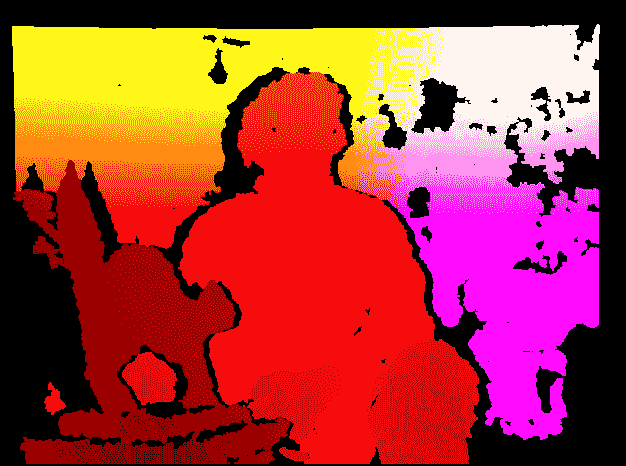
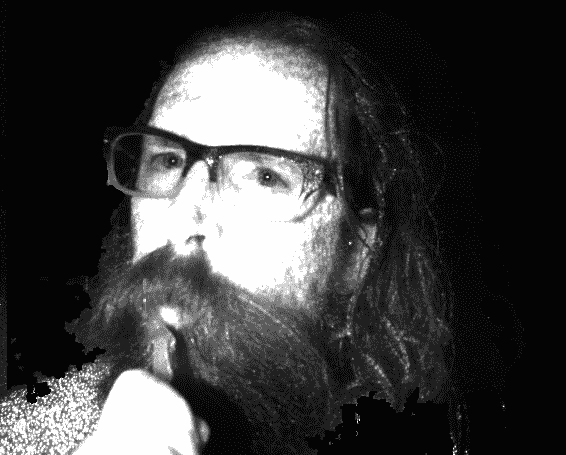
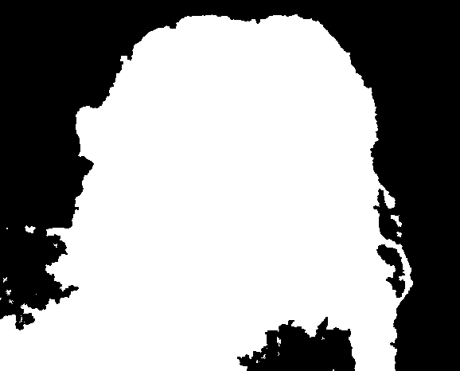
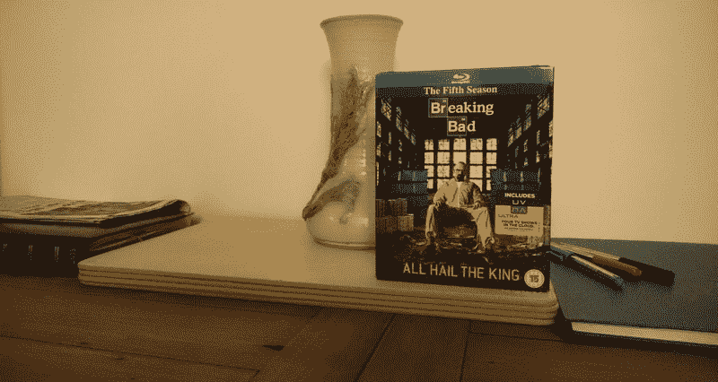
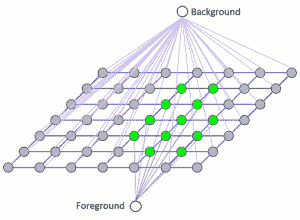
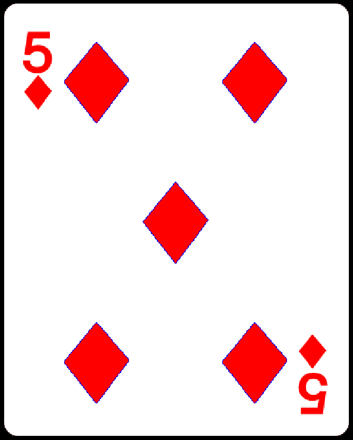

# 深度估计和分割

本章首先向您展示如何使用深度相机中的数据来识别前景和背景区域，以便我们可以将效果限制为仅前景或背景。

在讨论了深度相机之后，本章将继续进行深度估计的其他技术，即**立体成像**和**运动结构**（**SfM**）。 后一种技术不需要深度摄像头。 取而代之的是，它们依靠一个或多个普通相机从多个角度捕获对象的图像。

最后，本章介绍了分割技术，这些分割技术使我们能够从单个图像中提取前景对象。 在本章结束时，您将学习将图像分割为多个深度或多个对象的几种方法。 具体来说，我们将涵盖以下主题：

*   使用深度相机捕获深度图，点云图，视差图，基于可见光的图像和基于红外光的图像
*   将 10 位图像转换为 8 位图像
*   将视差图转换为可区分前景区域和背景区域的遮罩
*   使用立体成像或 SfM 创建视差图
*   使用 GrabCut 算法将图像分割为前景和背景区域
*   使用分水岭算法将图像分割成可能是不同对象的多个区域

# 技术要求

本章使用 Python，OpenCV 和 NumPy。 本章的某些部分使用深度相机（例如 Asus Xtion PRO）以及 OpenCV 对 OpenNI 2 的可选支持，以便从此类相机捕获图像。 请参考 第 1 章“设置 OpenCV”以获得安装说明。 本章还使用 Matplotlib 制作图表。 要安装 matplotlib，请运行`$ pip install matplotlib`（或`$ pip3 install matplotlib`，具体取决于您的环境）。

本章的完整代码可以在本书的 [GitHub 存储库的`chapter04`文件夹](https://github.com/PacktPublishing/Learning-OpenCV-4-Computer-Vision-with-Python-Third-Edition)中找到。 样本图像位于`images`文件夹中的存储库中。

# 创建模块

为了帮助我们构建深度相机的交互式演示，我们将重用在第 2 章，“处理文件，相机和GUI”和第 3 章“使用 OpenCV 处理图像”中开发的 Cameo 项目的大部分内容。 您会记得，我们将 Cameo 设计为支持各种输入，因此我们可以轻松地使其适应特定的深度相机。 我们将添加用于分析图像中的深度层的代码，以便找到主要区域，例如坐在相机前面的人的面部。 找到该区域后，我们将其他所有区域涂成黑色。 有时在聊天应用程序中使用这种效果来隐藏背景，以便用户拥有更多的隐私。

一些用于处理深度相机数据的代码可在`Cameo.py`外部重用，因此我们应将其分成一个新模块。 让我们在与`Cameo.py`相同的目录中创建一个`depth.py`文件。 我们需要`depth.py`中的以下`import`语句：

```py
import numpy
```

我们的应用程序将使用与深度有关的功能，因此让我们在`Cameo.py`中添加以下`import`语句：

```py
import depth
```

我们还将修改`CaptureManager.py`，但是我们不需要为其添加任何新的`import`语句。

现在，我们已经简要介绍了将要创建或修改的模块，让我们更深入地研究深度主题。

# 从深度相机捕获帧

回到第 2 章，“处理文件，相机和 GUI”，我们讨论了计算机可以具有多个视频捕获设备，每个设备可以具有多个通道的概念。 假设给定的设备是深度相机。 每个通道可能对应于不同的镜头和传感器。 而且，每个通道可能对应于不同种类的数据，例如正常彩色图像与深度图。 OpenCV 通过对 OpenNI 2 的可选支持，使我们可以从深度摄像头请求以下任何通道（尽管给定的摄像头可能仅支持其中一些通道​​）：

*   `cv2.CAP_OPENNI_DEPTH_MAP`：这是**深度图**-灰度图像，其中每个像素值是从相机到表面的估计距离。 具体地，每个像素值是表示以毫米为单位的深度测量值的 16 位无符号整数。
*   `cv2.CAP_OPENNI_POINT_CLOUD_MAP`：这是**点云图**-一种彩色图像，其中每种颜色对应于`x`，`y`或`z`空间尺寸。 具体来说，该通道会产生 BGR 图像，其中 B 为`x`（蓝色为右），G 为`y`（绿色为上），R 为`z`（红色代表很深），从相机的角度来看。 值以米为单位。
*   `cv2.CAP_OPENNI_DISPARITY_MAP`或`cv2.CAP_OPENNI_DISPARITY_MAP_32F`：这些是**视差图**-灰度图像，其中每个像素值是表面的立体视差。 为了概念化立体视差，我们假设我们叠加了一个场景的两个图像，这些图像是从不同的角度拍摄的。 结果将类似于看到两倍。 对于场景中任何一对孪生对象上的点，我们都可以以像素为单位测量距离。 该测量是立体声差异。 邻近的物体比远处的物体表现出更大的立体视差。 因此，附近的物体在视差图中显得更亮。 `cv2.CAP_OPENNI_DISPARITY_MAP`是具有 8 位无符号整数值的视差图，`cv2.CAP_OPENNI_DISPARITY_MAP_32F`是具有 32 位浮点值的视差图。
*   `cv2.CAP_OPENNI_VALID_DEPTH_MASK`：这是一个**有效深度掩码**，它显示给定像素处的深度信息是有效的（由非零值表示）还是无效的（由零值表示） 。 例如，如果深度相机依赖于红外照明器（红外闪光灯），则深度信息在被该光遮挡（阴影）的区域中无效。
*   `cv2.CAP_OPENNI_BGR_IMAGE`：这是来自摄像头的普通 BGR 图像，可捕获可见光。 每个像素的 B，G 和 R 值是无符号的 8 位整数。
*   `cv2.CAP_OPENNI_GRAY_IMAGE`：这是来自摄像机的普通单色图像，捕获可见光。 每个像素值是一个无符号的 8 位整数。
*   `cv2.CAP_OPENNI_IR_IMAGE`：这是来自摄像机的单色图像，用于捕获**红外**（**IR**）光，特别是**近红外**（**NIR**）的频谱。 每个像素值是一个无符号的 16 位整数。 通常，相机实际上不会使用整个 16 位范围，而只是使用其中的一部分，例如 10 位范围。 数据类型仍然是 16 位整数。 尽管近红外光是人眼看不到的，但它在物理上与红光非常相似。 因此，来自照相机的 NIR 图像对于人类不一定看起来很奇怪。 但是，典型的深度相机不仅可以捕获近红外光，而且可以投影出呈网格状的近红外光，以利于寻找深度算法。 因此，我们可能会在深度相机的 NIR 图像中看到可识别的面部，但是该面部可能会点缀着明亮的白光。

让我们考虑其中一些图像类型的样本。 以下屏幕快照显示了一个人坐在猫雕塑后面的点云图：



这是同一场景的视差图：


最后，这是现在熟悉的猫雕塑和人的有效深度遮罩：


接下来，让我们考虑如何在诸如 Cameo 之类的交互式应用程序中使用深度相机的某些通道。

# 将 10 位图像转换为 8 位

正如我们在上一节中提到的，深度摄像头的某些通道的数据使用大于 8 位的范围。 大范围往往对计算有用，但对显示却不方便，因为大多数计算机监视器每个通道只能使用 8 位范围[0，255]。

OpenCV 的`cv2.imshow`函数重新缩放并截断给定的输入数据，以便转换图像进行显示。 具体来说，如果输入图像的数据类型是 16 位无符号整数或 32 位有符号整数，则`cv2.imshow`将数据除以 256，然后将其截断为 8 位无符号整数范围[0，255]。 如果输入图像的数据类型为 32 位或 64 位浮点数，则`cv2.imshow`假定数据的范围为[0.0，1.0]，因此它将数据乘以 255 并将其截断为 8 位无符号 整数范围[0，255]。 通过重新缩放数据，`cv2.imshow`依靠其对原始比例的幼稚假设。 这些假设在某些情况下是错误的。 例如，如果图像的数据类型是 16 位无符号整数，但是实际数据范围是 10 位无符号整数[0，1023]，那么如果我们依靠`cv2.imshow`进行转换，则图像看起来会很暗。 。

考虑以下用 10 位灰度相机捕获的眼睛图像示例。 在左侧，我们看到了从 10 位标度到 8 位标度正确转换的结果。 在右侧，基于错误的假设，即图像使用 16 位缩放，我们看到转换错误的结果：


转换不正确的图像看起来全是黑色，因为我们对比例的假设偏离了很多：6 位或 64 倍。如果我们依靠`cv2.imshow`自动执行转换为 8 位比例，可能会出现这种错误 为我们。

当然，为了避免此类问题，我们可以进行自己的图像转换，然后将生成的 8 位图像传递给`cv2.imshow`。 让我们修改`managers.py`（Cameo 项目中现有的脚本之一），以便提供将 10 位图像转换为 8 位的选项。 我们将提供一个`shouldConvertBitDepth10To8`变量，开发人员可以将其设置为`True`或`False`。 以下代码块（在**粗体**中进行了更改）显示了如何初始化此变量：

```py
class CaptureManager(object):

    def __init__(self, capture, previewWindowManager = None,
                 shouldMirrorPreview = False,
 shouldConvertBitDepth10To8 = True):

        self.previewWindowManager = previewWindowManager
        self.shouldMirrorPreview = shouldMirrorPreview
 self.shouldConvertBitDepth10To8 = \
 shouldConvertBitDepth10To8

        # ... The rest of the method is unchanged ...
```

接下来，我们将修改`frame`属性的 getter 以支持转换。 如果`shouldConvertBitDepth10To8`为`True`，并且帧的数据类型为 16 位无符号整数，那么我们将假定帧实际上具有 10 位范围，并将其转换为 8 位。 作为转换的一部分，我们将应用右移操作`>> 2`，该操作将截断两个最低有效位。 这等效于整数除以 4。这是相关代码：

```py
    @property
    def frame(self):
        if self._enteredFrame and self._frame is None:
            _, self._frame = self._capture.retrieve(
                    self._frame, self.channel)
 if self.shouldConvertBitDepth10To8 and \
 self._frame is not None and \
 self._frame.dtype == numpy.uint16:
 self._frame = (self._frame >> 2).astype(
 numpy.uint8)
        return self._frame
```

通过这些修改，我们将能够更轻松地操纵和显示某些通道的帧，特别是`cv2.CAP_OPENNI_IR_IMAGE`。 不过，接下来，让我们看一下一个函数示例，该函数操纵`cv2.CAP_OPENNI_DISPARITY_MAP`和`cv2.CAP_OPENNI_VALID_DEPTH_MASK`通道中的帧，以创建一个可以遮挡用户面部等物体的遮罩。 之后，我们将考虑如何在 Cameo 中一起使用所有这些渠道。

# 从视差图创建遮罩

假设用户的脸部或其他感兴趣的对象占据了深度相机的大部分视场。 但是，图像还包含其他一些不感兴趣的内容。 通过分析视差图，我们可以知道矩形内的某些像素离群值-太近或太远，以至于不能真正成为人脸或其他感兴趣对象的一部分。 我们可以做一个遮罩以排除这些异常值。 但是，我们应该仅在数据有效的情况下应用此测试，如有效的深度掩码所示。

让我们编写一个函数来生成一个遮罩，该遮罩的值对于图像的拒绝区域为`0`，对于接受区域为`255`。 此函数应使用视差图，有效深度遮罩以及可选的矩形作为参数。 如果指定了矩形，我们将制作一个与指定区域大小相同的遮罩。 稍后在第 5 章“检测和识别人脸”中，这对我们很有用，我们将与人脸检测器一起使用，该检测器在人脸周围找到边界矩形。 让我们调用`createMedianMask`函数并在`depth.py`中实现它，如下所示：

```py
def createMedianMask(disparityMap, validDepthMask, rect = None):
    """Return a mask selecting the median layer, plus shadows."""
    if rect is not None:
        x, y, w, h = rect
        disparityMap = disparityMap[y:y+h, x:x+w]
        validDepthMask = validDepthMask[y:y+h, x:x+w]
    median = numpy.median(disparityMap)
    return numpy.where((validDepthMask == 0) | \
                       (abs(disparityMap - median) < 12),
                       255, 0).astype(numpy.uint8)
```

为了识别视差图中的离群值，我们首先使用`numpy.median`来找到中值，它以数组作为参数。 如果数组的长度为奇数，则`median`返回如果对数组进行排序将返回数组中间的值。 如果数组的长度为偶数，则`median`返回将最接近数组中间排序的两个值的平均值。

为了基于每个像素的布尔运算生成遮罩，我们将`numpy.where`与三个参数一起使用。 在第一个参数中，`where`接受一个数组，其元素的值是真或假。 返回相同尺寸的输出数组。 无论输入数组中的元素是`True`还是`where`函数的第二个参数都分配给输出数组中的相应元素。 相反，无论输入数组中的元素是`False`的位置如何，`where`函数的第三个参数都将分配给输出数组中的相应元素。

当像素的有效视差值与中位数视差值相差 12 或更多时，我们的实现会将像素视为离群值。 我们仅通过实验就选择了 12 的值。 以后根据您使用特定相机设置运行 Cameo 时遇到的结果，随时调整此值。

# 修改应用程序

让我们打开`Cameo.py`文件，其中包含我们在第 3 章“使用 OpenCV 处理图像”中最后修改的`Cameo`类。 此类实现了与常规相机配合使用的应用程序。 我们不一定要替换此类，而是希望创建该类的变体，该变体更改某些方法的实现以代替使用深度相机。 为此，我们将创建一个**子类**，该子类继承某些`Cameo`行为并覆盖其他行为。 我们称它为`CameoDepth`子类。 将以下行添加到`Cameo.py`（在`Cameo`类之后和`__main__`代码块之前），以便将`CameoDepth`声明为`Cameo`的子类：

```py
class CameoDepth(Cameo):
```

我们将覆盖或重新实现`CameoDepth`中的`__init__`方法。 Cameo 使用常规相机的设备索引实例化`CaptureManager`类，而`CameoDepth`需要使用深度相机的设备索引。 后者可以是`cv2.CAP_OPENNI2`（代表 Microsoft Kinect 的设备索引），也可以是`cv2.CAP_OPENNI2_ASUS`（代表 Asus Xtion PRO 或枕骨结构的设备索引）。 以下代码块显示了`CameoDepth`的`__init__`方法的示例实现（与**粗体**中的`Cameo`的`__init__`方法不同），但您可能需要将其修改为不加注释 适合您的设置的设备索引：

```py
    def __init__(self):
        self._windowManager = WindowManager('Cameo',
                                            self.onKeypress)
        #device = cv2.CAP_OPENNI2 # uncomment for Kinect
        device = cv2.CAP_OPENNI2_ASUS # uncomment for Xtion or Structure
        self._captureManager = CaptureManager(
            cv2.VideoCapture(device), self._windowManager, True)
        self._curveFilter = filters.BGRPortraCurveFilter()
```

同样，我们将覆盖`run`方法，以使用深度相机中的多个通道。 首先，我们将尝试检索视差图，然后检索有效的深度遮罩，最后检索 BGR 彩色图像。 如果无法检索到 BGR 图像，则可能意味着深度相机没有任何 BGR 传感器，因此，在这种情况下，我们将继续检索红外灰度图像。 以下代码段显示了`CameoDepth`的 run 方法的开始：

```py
    def run(self):
        """Run the main loop."""
        self._windowManager.createWindow()
        while self._windowManager.isWindowCreated:
            self._captureManager.enterFrame()
 self._captureManager.channel = cv2.CAP_OPENNI_DISPARITY_MAP
 disparityMap = self._captureManager.frame
 self._captureManager.channel = cv2.CAP_OPENNI_VALID_DEPTH_MASK
 validDepthMask = self._captureManager.frame
 self._captureManager.channel = cv2.CAP_OPENNI_BGR_IMAGE
 frame = self._captureManager.frame
 if frame is None:
 # Failed to capture a BGR frame.
 # Try to capture an infrared frame instead.
 self._captureManager.channel = cv2.CAP_OPENNI_IR_IMAGE
 frame = self._captureManager.frame
```

捕获视差图，有效的深度遮罩以及 BGR 图像或红外灰度图像后，`run`方法将继续调用上一节中实现的`depth.createMedianMask`函数，“从视差图创建遮罩”。 我们将视差图和有效深度遮罩传递给后一个函数，作为回报，我们收到的遮罩在深度接近中值深度的区域中为白色，而在其他区域中为黑色。 无论遮罩是黑色（`mask == 0`）的何处，我们都希望将 BGR 或红外图像绘制成黑色，以使图像中除主要对象之外的所有东西都模糊不清。 最后，对于 BGR 图像，我们想应用先前在第 3 章“使用 OpenCV 处理图像”中实现的艺术滤镜。 以下代码完成了`CameoDepth` `run`方法的实现：

```py
            if frame is not None:

 # Make everything except the median layer black.
 mask = depth.createMedianMask(disparityMap, validDepthMask)
 frame[mask == 0] = 0

 if self._captureManager.channel == \
 cv2.CAP_OPENNI_BGR_IMAGE:
 # A BGR frame was captured.
 # Apply filters to it.
 filters.strokeEdges(frame, frame)
 self._curveFilter.apply(frame, frame)

            self._captureManager.exitFrame()
            self._windowManager.processEvents()
```

`CameoDepth`不需要自己的任何其他方法实现； 它从其父类或`Cameo`超类继承适当的实现。

现在，我们只需要修改`Cameo.py`的`__main__`部分，即可运行`CameoDepth`类的实例而不是`Cameo`类。 以下是相关代码：

```py
if __name__=="__main__":
    #Cameo().run() # uncomment for ordinary camera
  CameoDepth().run() # uncomment for depth camera
```

插入深度摄像机，然后运行脚本。 靠近或远离相机移动，直到可以看到您的脸，但是背景变黑。 以下屏幕快照是使用`CameoDepth`和 Asus Xtion PRO 相机拍摄的。 我们可以看到作者之一的约瑟夫·豪斯（Joseph Howse）刷牙的红外图像。 该代码已成功使背景变黑，因此图像无法显示他是在房屋，火车还是帐篷中刷牙。 谜仍在继续：



这是考虑我们在上一节中实现的`createMedianMask`函数的输出的好机会。 如果我们将遮罩为 0 的区域可视化为黑色，而遮罩为 1 的区域可视化为白色，则约瑟夫·霍斯（Joseph Howse）刷牙的遮罩如下所示：



结果是好的，但不是完美的。 例如，在图像的右侧（从查看者的角度来看），遮罩错误地在头发后面包括阴影区域，并且错误地排除了肩膀。 可以通过微调在`createMedianMask`的实现中与`numpy.where`一起使用的标准来解决后一个问题。

如果您有幸拥有多台深度相机，请尝试使用所有深度相机，以了解它们在支持彩色图像方面的区别以及它们在区分远近层方面的有效性。 另外，尝试各种物体和照明条件，以查看它们如何影响（或不影响）红外图像。 当您对测试结果感到满意时，让我们继续进行其他技术进行深度估计。 （我们将在后续章节中再次介绍深度相机。）

# 普通相机的深度估计

深度相机是一种令人印象深刻的设备，但并非每个开发人员或用户都有一个，并且有一些限制。 值得注意的是，典型的深度相机在户外无法很好地工作，因为阳光的红外分量比摄像机自身的红外光源要亮得多。 摄像机被太阳遮住，无法看到通常用于估计深度的红外模式。

作为替代方案，我们可以使用一个或多个普通摄像机，并且可以从不同摄像机角度基于三角测量来估计到对象的相对距离。 如果我们同时使用两个摄像机，则此方法称为**立体视觉**。 如果我们使用一台摄像机，但是随着时间的推移移动它以获得不同的视角，则此方法称为运动结构。 广义上，立体视觉技术在 SfM 中也有帮助，但是在 SfM 中，如果我们要处理运动中的物体，我们将面临其他问题。 出于本章的目的，让我们假设我们正在处理一个固定的主题。

正如许多哲学家会同意的那样，几何学是我们对世界的理解的基础。 更重要的是，**对极几何**是立体视觉的基础。 对极几何如何工作？ 从概念上讲，它会跟踪从相机到图像中每个对象的假想线，然后在第二个图像上进行操作，并根据与同一对象相对应的线的交点计算到对象的距离。 这是此概念的表示：


让我们看看 OpenCV 如何应用对极几何来计算视差图。 这将使我们能够将图像分割为前景和背景的各个层。 作为输入，我们需要从不同角度拍摄同一主题的两幅图像。

与我们的许多脚本一样，此脚本从导入 NumPy 和 OpenCV 开始：

```py
import numpy as np
import cv2
```

我们为立体声算法的几个参数定义初始值，如以下代码所示：

```py
minDisparity = 16
numDisparities = 192 - minDisparity
blockSize = 5
uniquenessRatio = 1
speckleWindowSize = 3
speckleRange = 3
disp12MaxDiff = 200
P1 = 600
P2 = 2400
```

使用这些参数，我们创建 OpenCV 的`cv2.StereoSGBM`类的实例。 SGBM 代表**半全局块匹配**，这是一种用于计算视差图的算法。 这是初始化对象的代码：

```py
stereo = cv2.StereoSGBM_create(
    minDisparity = minDisparity,
    numDisparities = numDisparities,
    blockSize = blockSize,
    uniquenessRatio = uniquenessRatio,
    speckleRange = speckleRange,
    speckleWindowSize = speckleWindowSize,
    disp12MaxDiff = disp12MaxDiff,
    P1 = P1,
    P2 = P2
)
```

我们还从文件加载两个图像：

```py
imgL = cv2.imread('img/color1_small.jpg')
imgR = cv2.imread('img/color2_small.jpg')
```

我们希望提供几个滑块，以使用户能够交互式地调整计算视差图的算法的参数。 每当用户调整任何滑块时，我们都将通过设置`StereoSGBM`实例的属性来更新立体声算法的参数，并通过调用`StereoSGBM`实例的`compute`方法重新计算视差图。 让我们看一下`update`函数的实现，它是滑块的回调函数：

```py
def update(sliderValue = 0):

    stereo.setBlockSize(
        cv2.getTrackbarPos('blockSize', 'Disparity'))
    stereo.setUniquenessRatio(
        cv2.getTrackbarPos('uniquenessRatio', 'Disparity'))
    stereo.setSpeckleWindowSize(
        cv2.getTrackbarPos('speckleWindowSize', 'Disparity'))
    stereo.setSpeckleRange(
        cv2.getTrackbarPos('speckleRange', 'Disparity'))
    stereo.setDisp12MaxDiff(
        cv2.getTrackbarPos('disp12MaxDiff', 'Disparity'))

    disparity = stereo.compute(
        imgL, imgR).astype(np.float32) / 16.0

    cv2.imshow('Left', imgL)
    cv2.imshow('Right', imgR)
    cv2.imshow('Disparity',
               (disparity - minDisparity) / numDisparities)
```

现在，让我们看一下创建窗口和滑块的代码：

```py
cv2.namedWindow('Disparity')
cv2.createTrackbar('blockSize', 'Disparity', blockSize, 21,
                   update)
cv2.createTrackbar('uniquenessRatio', 'Disparity',
                   uniquenessRatio, 50, update)
cv2.createTrackbar('speckleWindowSize', 'Disparity',
                   speckleWindowSize, 200, update)
cv2.createTrackbar('speckleRange', 'Disparity',
                   speckleRange, 50, update)
cv2.createTrackbar('disp12MaxDiff', 'Disparity',
                   disp12MaxDiff, 250, update)
```

请注意，我们将`update`函数作为`cv2.createTrackbar`函数的参数提供，以便在调整滑块时都会调用`update`。 接下来，我们手动调用`update`来初始化视差图：

```py
# Initialize the disparity map. Show the disparity map and images.
update()
```

当用户按下任意键时，我们将关闭窗口：

```py
# Wait for the user to press any key.
# Meanwhile, update() will be called anytime the user moves a slider.
cv2.waitKey()
```

让我们回顾一下该示例的功能。 我们拍摄同一对象的两张图像，并计算出视差图，以较亮的色调显示图中更靠近相机的点。 黑色标记的区域代表差异。

这是我们在此示例中使用的第一张图片：


这是第二个：



用户可以看到原始图像，以及精美且易于理解的视差图：


我们使用了`StereoSGBM`支持的许多参数，但不是全部。 OpenCV 文档提供了所有参数的以下描述：

| **参数** | **OpenCV 文档中的描述** |
| `minDisparity` | 最小可能的视差值。 通常为零，但是有时校正算法可以移动图像，因此需要相应地调整此参数。 |
| `numDisparities` | 最大视差减去最小视差。 该值始终大于零。 在当前的实现中，此参数必须可被 16 整除。 |
| `blockSize` | 匹配的块大小。 它必须是> = 1 的奇数。 通常，它应该在 3-11 范围内。 |
| `P1` | 控制视差平滑度的第一个参数[请参见`P2`的说明]。 |
| `P2` | 控制视差平滑度的第二个参数。 值越大，视差越平滑。 `P1`是相邻像素之间视差变化加或减 1 的代价。 `P2`是相邻像素之间视差变化大于 1 的惩罚。 该算法需要`P2 > P1`。 请参见`stereo_match.cpp`示例，其中显示了一些相当不错的`P1`和`P2`值，例如分别为`8*number_of_image_channels*SADWindowSize*SADWindowSize`和`32*number_of_image_channels*SADWindowSize*SADWindowSize`。 |
| `disp12MaxDiff` | 左右视差检查中允许的最大差异（以整数像素为单位）。 将其设置为非正值可禁用检查。 |
| `preFilterCap` | 预过滤图像像素的截断值。 该算法首先在每个像素处计算`x`导数，然后按`[-preFilterCap, preFilterCap]`间隔裁剪其值。 结果值将传递到 Birchfield-Tomasi 像素成本函数。 |
| `uniquenessRatio` | 最佳（最小）计算成本函数值应赢得次优值以考虑找到的匹配正确的百分比边距。 通常，在 5 到 15 范围内的值就足够了。 |
| `speckleWindowSize` | 平滑视差区域的最大大小，以考虑其噪声斑点并使其无效。 将其设置为 0 以禁用斑点过滤。 否则，将其设置在 50-200 范围内。 |
| `speckleRange` | 每个连接组件内的最大视差变化。 如果执行斑点过滤，请将参数设置为正值；否则，将参数设置为正值。 它会隐式乘以 16。通常，1 或 2 就足够了。 |
| `mode` | 将其设置为`StereoSGBM::MODE_HH`，即可运行满量程，两遍动态编程算法。 它将占用`O(W`H`numDisparities)`字节，对于 640x480 立体声来说很大，而对于 HD 尺寸的图片来说很大。 默认情况下，它设置为 false。 |

使用前面的脚本，您将能够加载您选择的图像并使用参数，直到对`StereoSGBM`生成的视差图满意为止。

# 用 GrabCut 算法进行前景检测

计算视差图是分割图像前景和背景的有用方法，但是`StereoSGBM`并不是唯一可以实现此目的的算法，并且`StereoSGBM`实际上更多的是从二维图像中收集三维信息。 三维图片比什么都重要。 **GrabCut** 是用于前景/背景分割的理想工具。 GrabCut 算法包括以下步骤：

1.  定义了包括图片主题的矩形。
2.  矩形外部的区域会自动定义为背景。
3.  背景中包含的数据用作区分用户定义矩形内的背景区域和前景区域的参考。
4.  **高斯混合模型**（**GMM**）对前景和背景进行建模，并将未定义的像素标记为可能的背景和可能的前景。
5.  图像中的每个像素都通过虚拟边缘虚拟连接到周围的像素，并且根据边缘与周围像素的颜色相似程度，为每个边缘分配了成为前景或背景的概率。

6.  每个像素（或在算法中概念化的节点）都连接到前景或背景节点。 您可以将其可视化如下：



7.  将节点连接到任一终端（分别为背景或前景，也分别称为源或接收器）之后，属于不同终端的节点之间的边缘将被切除（因此，其名称为 GrabCut）。 因此，图像被分为两部分。 下图充分代表了该算法：


让我们来看一个例子。 我们从一个美丽的天使雕像开始：


我们想抓住我们的天使并抛弃背景。 为此，我们将创建一个相对较短的脚本，该脚本将使用 GrabCut 分割图像，然后将结果前景图像与原始图像并排显示。 我们将使用`matplotlib`这个流行的 Python 库，该函数使显示图表和图像成为一项微不足道的任务。

该代码实际上非常简单。 首先，加载要处理的图像，然后创建一个填充有零的掩码，其形状与加载的图像相同：

```py
import numpy as np
import cv2
from matplotlib import pyplot as plt

original = cv2.imread('img/statue_small.jpg')
img = original.copy()
mask = np.zeros(img.shape[:2], np.uint8)
```

然后，我们创建零填充的背景和前景模型：

```py
bgdModel = np.zeros((1, 65), np.float64)
fgdModel = np.zeros((1, 65), np.float64)
```

我们可以用数据填充这些模型，但是我们将使用一个矩形标识要隔离的对象来初始化 GrabCut 算法。 因此，将基于初始矩形之外的区域确定背景和前景模型。 该矩形在下一行中定义：

```py
rect = (100, 1, 421, 378)
```

现在到有趣的部分！ 我们运行 GrabCut 算法。 作为参数，我们指定用于初始化操作的空模型，掩码和矩形：

```py
cv2.grabCut(img, mask, rect, bgdModel, fgdModel, 5, cv2.GC_INIT_WITH_RECT)
```

注意`5`整数参数。 这是算法将在图像上运行的迭代次数。 您可以增加它，但是在某些时候，像素分类会收敛，因此有效地，您可能只是添加迭代而对结果没有任何进一步的改进。

此后，我们的遮罩将更改为包含 0 到 3 之间（包括 0 和 3）的值。 这些值具有以下含义：

*   `0`（也定义为`cv2.GC_BGD`）是明显的背景像素。
*   `1`（也定义为`cv2.GC_FGD`）是明显的前景像素。
*   `2`（也定义为`cv2.GC_PR_BGD`）是可能的背景像素。
*   `3`（也定义为`cv2.GC_PR_FGD`）是可能的前景像素。

为了使 GrabCut 的结果可视化，我们想将背景涂成黑色，而前景保持不变。 我们可以制作另一个面具来帮助我们做到这一点。 值`0`和`2`（明显和可能的背景）将转换为 0，而值`1`和`3`（明显且可能是前景）将转换为 1s。 结果将存储在`mask2`中。 我们将原始图像乘以`mask2`，以使背景变黑（乘以`0`），同时保持前景不变（乘以`1`）。 以下是相关代码：

```py
mask2 = np.where((mask==2) | (mask==0), 0, 1).astype('uint8')
img = img*mask2[:,:,np.newaxis]
```

脚本的最后部分并排显示图像：

```py
plt.subplot(121)
plt.imshow(cv2.cvtColor(img, cv2.COLOR_BGR2RGB))
plt.title("grabcut")
plt.xticks([])
plt.yticks([])

plt.subplot(122)
plt.imshow(cv2.cvtColor(original, cv2.COLOR_BGR2RGB))
plt.title("original")
plt.xticks([])
plt.yticks([])

plt.show()
```

结果如下：


这是一个令人满意的结果。 您会注意到在天使的手臂下留下了一个三角形的背景。 可以通过手动选择更多的背景区域并应用更多的迭代来完善 GrabCut 结果。 OpenCV 安装的`samples/python`文件夹中的`grabcut.py`文件中很好地说明了此技术。

# 利用分水岭算法进行图像分割

最后，让我们快速看一下分水岭算法。 该算法称为“分水岭”，因为其概念化涉及水。 将图像中密度低（几乎没有变化）的区域想象为谷，而密度高（变化很多）的区域则作为峰。 开始向山谷中注水，直到两个不同山谷中的水汇合为止。 为了防止来自不同山谷的水汇合，您需要建立屏障以使它们分开。 最终的障碍是图像分割。

例如，让我们分割一张扑克牌的图像。 我们想要将点（大的，可数的符号）与背景分开：

1.  再一次，我们通过导入`numpy`，`cv2`和`matplotlib`开始脚本。 然后，我们从文件加载纸牌图像：

```py
import numpy as np
import cv2
from matplotlib import pyplot as plt

img = cv2.imread('img/5_of_diamonds.png')
gray = cv2.cvtColor(img, cv2.COLOR_BGR2GRAY)
```

2.  将图像从彩色转换为灰度后，我们对其运行阈值。 通过将图像分为两个区域（黑色和白色），此操作将有所帮助：

```py
ret, thresh = cv2.threshold(gray, 0, 255,
                            cv2.THRESH_BINARY_INV | cv2.THRESH_OTSU)
```

3.  接下来，我们通过对其进行形态转换，从阈值图像中去除噪声。 **形态**由**扩张**（扩展）或**侵蚀**（收缩）图像的白色区域组成。 我们将应用形态学上的**打开**操作，该操作包括腐蚀步骤和扩张步骤。 打开操作使大的白色区域吞没了很少的黑色区域（噪声），而使大的黑色区域（真实物体）相对保持不变。 `cv2.morphologyEx`函数和`cv2.MORPH_OPEN`参数允许我们执行以下操作：

```py
# Remove noise.
kernel = np.ones((3,3), np.uint8)
opening = cv2.morphologyEx(thresh, cv2.MORPH_OPEN, kernel,
                           iterations = 2)
```

4.  通过扩大开放变换的结果，我们可以获得最确定的背景图像区域：

```py
# Find the sure background region.
sure_bg = cv2.dilate(opening, kernel, iterations=3)
```

相反，我们可以通过应用`distanceTransform`获得肯定的前景区域。 实际上，如果一个点与最接近的前景背景边缘相距甚远，我们可以最有把握地将其视为前景的一部分。

5.  一旦获得图像的`distanceTransform`表示形式，便可以应用阈值来选择最肯定是前景部分的区域：

```py
# Find the sure foreground region.
dist_transform = cv2.distanceTransform(opening,cv2.DIST_L2,5)
ret, sure_fg = cv2.threshold(
        dist_transform, 0.7*dist_transform.max(), 255, 0)
sure_fg = sure_fg.astype(np.uint8)
```

在此阶段，我们可以确定一些前景和背景区域。

6.  现在，中间的区域呢？ 我们可以通过从背景中减去确定的前景来找到这些不确定或未知的区域：

```py
# Find the unknown region.
unknown = cv2.subtract(sure_bg, sure_fg)
```

7.  现在我们有了这些区域，我们可以建立著名的*屏障*来阻止水合并。 这是通过`connectedComponents`功能完成的。 当我们分析 GrabCut 算法并将图像概念化为一组由边连接的节点时，我们对图论有所了解。 给定肯定的前景区域，这些节点中的一些将连接在一起，但有些则不会。 断开连接的节点属于不同的水谷，它们之间应该有一个障碍：

```py
# Label the foreground objects.
ret, markers = cv2.connectedComponents(sure_fg)
```

8.  接下来，我们在所有区域的标签上加 1，因为我们只希望未知数保持在`0`：

```py
# Add one to all labels so that sure background is not 0, but 1.
markers += 1

# Label the unknown region as 0.
markers[unknown==255] = 0
```

9.  最后，我们打开大门！ 让水流！ `cv2.watershed`功能将标签`-1`分配给组件之间边缘的像素。 我们在原始图像中将这些边缘涂成蓝色：

```py
markers = cv2.watershed(img, markers)
img[markers==-1] = [255,0,0]
```

让我们使用`matplotlib`显示结果：

```py
plt.imshow(cv2.cvtColor(img, cv2.COLOR_BGR2RGB))
plt.show()
```

该图应如下图所示：



这种类型的细分可以用作识别纸牌的系统的一部分。 类似地，分水岭算法可以帮助我们在纯背景上分割和计数任何种类的对象，例如一张纸上的硬币。

# 概要

在本章中，我们学习了如何分析图像中的简单空间关系，以便我们可以区分多个对象，或前景和背景。 我们的技术包括从二维输入（视频帧或图像）中提取三维信息。 首先，我们检查了深度相机，然后检查了极线几何和立体图像，因此我们现在能够计算视差图。 最后，我们用两种最受欢迎​​的方法研究了图像分割：GrabCut 和 Watershed。

随着本书的发展，我们将继续从图像中提取越来越复杂的信息。 接下来，我们准备探索 OpenCV 用于检测和识别面部和其他对象的功能。