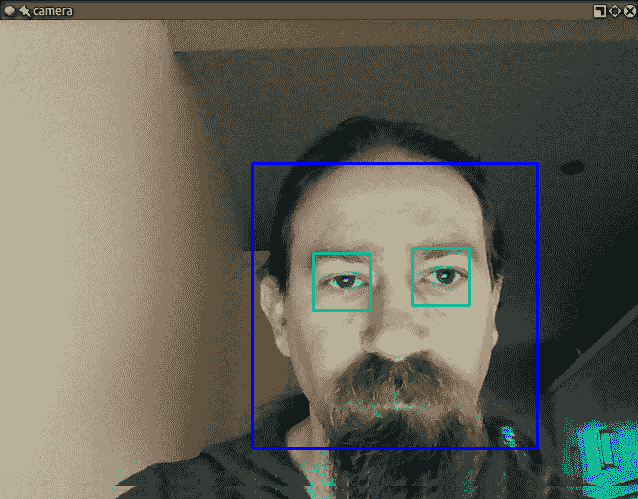
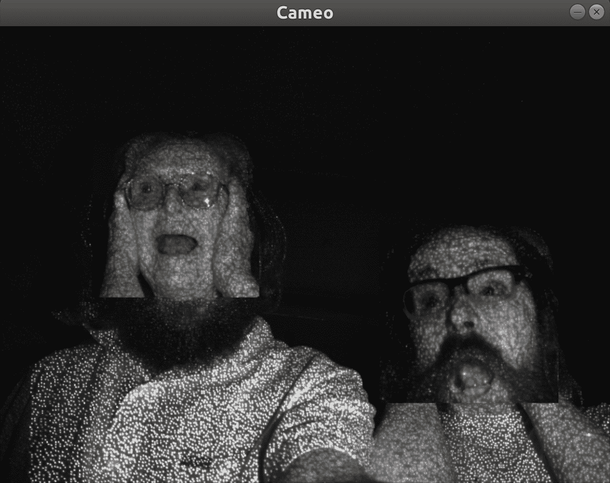

# 三、检测和识别人脸

计算机视觉使许多具有未来感的任务成为现实。 两个这样的任务是人脸检测（在图像中定位面部）和人脸识别（将人脸识别为特定人）。 OpenCV 实现了多种用于人脸检测和识别的算法。 它们在从安全性到娱乐性的各种现实环境中都有应用。

本章介绍 OpenCV 的一些人脸检测和识别功能，以及定义特定类型的可跟踪对象的数据文件。 具体来说，我们看一下 Haar 级联分类器，它可以分析相邻图像区域之间的对比度，以确定给定图像或子图像是否与已知类型匹配。 我们考虑如何在层次结构中组合多个 Haar 级联分类器，以便一个分类器标识父区域（就我们的目的而言，是人脸），而其他分类器标识子区域（例如眼睛）。

我们还绕过了谦虚但重要的矩形主题。 通过绘制，复制和调整矩形图像区域的大小，我们可以对正在跟踪的图像区域执行简单的操作。

总而言之，我们将涵盖以下主题：

*   了解 Haar 级联。
*   查找 OpenCV 附带的经过预先训练的 Haar 级联。 这些包括几个人脸检测器。
*   使用 Haar 级联来检测静止图像和视频中的面部。
*   收集图像来训练和测试人脸识别器。
*   使用几种不同的人脸识别算法：EigenFace，Fisherfaces 和**本地二进制模式直方图**（**LBPH**）。
*   使用或不使用遮罩，将矩形区域从一个图像复制到另一个图像。
*   使用深度相机基于深度来区分面部和背景。
*   在交互式应用中交换两个人的脸。

在本章结束时，我们将把面部跟踪和矩形操作集成到我们在前几章中开发的交互式应用`Cameo`中。 最后，我们将进行一些面对面的互动！

# 技术要求

本章使用 Python，OpenCV 和 NumPy。 作为 OpenCV 的一部分，它使用可选的`opencv_contrib`模块，其中包括用于人脸识别的功能。 本章的某些部分使用 OpenCV 对 OpenNI 2 的可选支持来捕获深度相机的图像。 请参考第 1 章，“设置 OpenCV”，以获取安装说明。

可以在本书的 [GitHub 存储库的`chapter05`文件夹](https://github.com/PacktPublishing/Learning-OpenCV-4-Computer-Vision-with-Python-Third-Edition)中找到本章的完整代码。 样本图像位于`images`文件夹中的存储库中。

# 概念化级联

当我们谈论对对象进行分类并跟踪它们的位置时，我们究竟要精确指出什么？ 什么构成对象的可识别部分？

即使来自网络摄像头的摄影图像也可能包含许多细节，以使我们（人类）观看愉悦。 然而，关于照明，视角，观看距离，相机抖动和数字噪声的变化，图像细节趋于不稳定。 而且，即使是物理细节上的实际差异也可能使我们对分类不感兴趣。 本书的作者之一约瑟夫·霍斯（Joseph Howse）在学校里被教过，在显微镜下没有两朵雪花看起来很像。 幸运的是，作为一个加拿大孩子，他已经学会了如何在没有显微镜的情况下识别雪花，因为它们之间的相似性更加明显。

因此，一些抽象图像细节的方法可用于产生稳定的分类和跟踪结果。 这些抽象称为**特征**，据说是从图像数据中提取的。 特征应该比像素少得多，尽管任何像素都可能影响多个特征。 一组特征被表示为一个向量，并且可以基于图像的相应特征向量之间距离的某种度量来评估两个图像之间的相似度。

类 Haar 的特征是通常应用于实时人脸检测的一种特征。 Paul Viola 和 Michael Jones 在《鲁棒的实时人脸检测》中首次将它们用于此目的。 可在[这个页面](http://www.vision.caltech.edu/html-files/EE148-2005-Spring/pprs/viola04ijcv.pdf)上获得本文的电子版本。 每个类似 Haar 的特征都描述了相邻图像区域之间的对比度模式。 例如，边，顶点和细线各自生成一种特征。 从某种意义上说，某些特征是有区别的，它们通常出现在特定类别的对象（例如面部）中，而不出现在其他对象中。 这些独特的特征可以组织为称为**级联**的层次结构，其中最高层包含具有最大独特性的特征，使分类器可以快速拒绝缺少这些特征的主题。

对于任何给定的对象，特征可能会根据图像的比例和评估对比度的邻域大小而有所不同。 后者称为**窗口大小**。 为了使 Haar 级联分类器**不变标度**，或者说要对缩放变化具有鲁棒性，窗口大小保持不变，但是图像会被多次缩放。 因此，在某种程度上进行缩放时，对象（例如面部）的大小可能与窗口大小匹配。 原始图像和重新缩放的图像一起被称为**图像金字塔**，并且此金字塔中的每个连续级别都是较小的重新缩放图像。 OpenCV 提供了一个尺度不变的分类器，该分类器可以从 XML 文件以特定格式加载 Haar 级联。 在内部，此分类器将任何给定图像转换为图像金字塔。

在 OpenCV 中实现的 Haar 级联对旋转或透视图的更改不可靠。 例如，上下颠倒的脸部不被视为与直立的脸部相似，并且轮廓上观看的脸部不被视为与从正面观看的脸部相似。 考虑到图像的多种转换以及多种窗口大小，更复杂，更耗费资源的实现可以提高 Haar 级联的旋转鲁棒性。 但是，我们将局限于 OpenCV 中的实现。

# 获取 HAAR 级联

OpenCV 4 源代码或您安装的 OpenCV 4 的预打包版本应包含一个名为`data/haarcascades`的子文件夹。 如果找不到它，请参考第 1 章，“设置 OpenCV”，以获取获取 OpenCV 4 源代码的说明。

`data/haarcascades`文件夹包含 XML 文件，可以通过名为`cv2.CascadeClassifier`的 OpenCV 类加载该文件。 此类的实例将给定的 XML 文件解释为 Haar 级联，Haar 级联提供了针对某种类型的对象（例如面部）的检测模型。 `cv2.CascadeClassifier`可以在任何图像中检测到此类物体。 像往常一样，我们可以从文件中获取静止图像，也可以从视频文件或摄像机中获取一系列帧。

找到`data/haarcascades`后，在项目的其他位置创建一个目录； 在此文件夹中，创建一个名为`cascades`的子文件夹，并将以下文件从`data/haarcascades`复制到`cascades`：

*   `haarcascade_frontalface_default.xml`
*   `haarcascade_frontalface_alt.xml`
*   `haarcascade_eye.xml`

顾名思义，这些级联用于跟踪面部和眼睛。 他们需要正面，正面查看主题。 稍后在构建人脸检测器时将使用它们。

如果您对如何生成这些级联文件感到好奇，可以在 Joseph Howse 的书《写给秘密特工的 OpenCV 4》 （Packt Publishing，2019 年）中找到更多信息，特别是在第 3 章，“训练智能警报以识别反派和他的猫”中。 有了足够的耐心和一台功能强大的计算机，您可以制作自己的层叠并为各种类型的物体训练它们。

# 使用 OpenCV 执行人脸检测

使用`cv2.CascadeClassifier`，无论是对静止图像还是视频源执行人脸检测，都没有什么区别。 后者只是前者的顺序版本：视频上的人脸检测只是应用于每个帧的人脸检测。 自然地，利用更先进的技术，可以跨多个帧连续跟踪检测到的面部，并确定每一帧中的面部是相同的。 但是，很高兴知道基本的顺序方法也可以工作。

让我们继续前进，发现一些面孔。

# 在静止图像上执行人脸检测

执行人脸检测的第一个也是最基本的方法是加载图像并检测其中的面部。 为了使结果在视觉上有意义，我们将在原始图像中的脸部周围绘制矩形。 记住脸部检测器是为直立的正面脸而设计的，我们将使用一排人的图像，特别是伐木机，肩并肩站立并面向观察者。

将 Haar 级联 XML 文件复制到我们的级联文件夹中后，我们继续创建以下基本脚本来执行人脸检测：

```py
import cv2

face_cascade = cv2.CascadeClassifier(
    './cascades/haarcascade_frontalface_default.xml')
img = cv2.imread('img/woodcutters.jpg')
gray = cv2.cvtColor(img, cv2.COLOR_BGR2GRAY)
faces = face_cascade.detectMultiScale(gray, 1.08, 5)
for (x, y, w, h) in faces:
    img = cv2.rectangle(img, (x, y), (x+w, y+h), (255, 0, 0), 2)

cv2.namedWindow('Woodcutters Detected!')
cv2.imshow('Woodcutters Detected!', img)
cv2.imwrite('./woodcutters_detected.jpg', img)
cv2.waitKey(0)
```

让我们逐步介绍一下前面的代码。 首先，我们使用在本书的每个脚本中都必须使用的`cv2`导入。 然后，我们声明一个`face_cascade`变量，这是一个`CascadeClassifier`对象，该对象加载用于人脸检测的级联：

```py
face_cascade = cv2.CascadeClassifier(
    './cascades/haarcascade_frontalface_default.xml')
```

然后，我们用`cv2.imread`加载图像文件并将其转换为灰度，因为`CascadeClassifier`需要灰度图像。 下一步`face_cascade.detectMultiScale`是我们执行实际人脸检测的位置：

```py
img = cv2.imread('img/woodcutters.jpg')
gray = cv2.cvtColor(img, cv2.COLOR_BGR2GRAY)
faces = face_cascade.detectMultiScale(gray, 1.08, 5)
```

`detectMultiScale`的参数包括`scaleFactor`和`minNeighbors`。 `scaleFactor`参数应大于 1.0，它确定在人脸检测过程的每次迭代时图像的缩小比例。 正如我们先前在“概念化 Haar 级联”部分中所讨论的那样，这种缩小旨在通过将各种面与窗口大小进行匹配来实现缩放不变性。 `minNeighbors`自变量是为了保留检测结果而需要的最小重叠检测数。 通常，我们希望可以在多个重叠的窗口中检测到人脸，并且大量的重叠检测使我们更加有信心检测到的人脸是真正的人脸。

从检测操作返回的值是代表脸部矩形的元组列表。 OpenCV 的`cv2.rectangle`函数允许我们在指定的坐标处绘制矩形。 `x`和`y`代表左坐标和顶部坐标，而`w`和`h`代表面部矩形的宽度和高度。 通过遍历`faces`变量，我们在找到的所有面孔周围绘制蓝​​色矩形，确保使用原始图像进行绘制，而不使用灰色版本：

```py
for (x, y, w, h) in faces:
    img = cv2.rectangle(img, (x, y), (x+w, y+h), (255, 0, 0), 2)
```

最后，我们调用`cv2.imshow`显示生成的处理后图像。 与往常一样，为防止图像窗口自动关闭，我们向`waitKey`插入了一个调用，当用户按下任意键时该调用返回：

```py
cv2.imshow('Woodcutters Detected!', img)
cv2.imwrite('./woodcutters_detected.jpg', img)
cv2.waitKey(0)
```

到了这里，在我们的图像中检测到整个伐木工，如以下屏幕截图所示：


本例中的照片是彩色摄影的先驱 Sergey Prokudin-Gorsky（1863-1944）的作品。 沙皇尼古拉斯二世赞助普罗库丁·戈尔斯基（Prokudin-Gorsky），拍摄整个俄罗斯帝国的人物和地点，这是一个庞大的纪录片项目。 普罗库丁·高斯基（Prokudin-Gorsky）于 1909 年在俄罗斯西北部的维尔河（Svir River）附近拍摄了这些伐木工的照片。

# 对视频执行人脸检测

现在，我们了解了如何在静止图像上执行人脸检测。 如前所述，我们可以在视频的每一帧（无论是摄像机供稿还是预先录制的视频文件）上重复进行人脸检测的过程。

下一个脚本将打开一个照相机供稿，读取一个框架，检查该框架中是否有面部，并扫描检测到的面部中的眼睛。 最后，它将在面部周围绘制蓝​​色矩形，在眼睛周围绘制绿色矩形。 这是完整的脚本：

```py
import cv2

face_cascade = cv2.CascadeClassifier(
    './cascades/haarcascade_frontalface_default.xml')
eye_cascade = cv2.CascadeClassifier(
    './cascades/haarcascade_eye.xml')

camera = cv2.VideoCapture(0)
while (cv2.waitKey(1) == -1):
    success, frame = camera.read()
    if success:
        gray = cv2.cvtColor(frame, cv2.COLOR_BGR2GRAY)
        faces = face_cascade.detectMultiScale(
            gray, 1.3, 5, minSize=(120, 120))
        for (x, y, w, h) in faces:
            cv2.rectangle(frame, (x, y), (x+w, y+h), (255, 0, 0), 2)
            roi_gray = gray[y:y+h, x:x+w]
            eyes = eye_cascade.detectMultiScale(
                roi_gray, 1.03, 5, minSize=(40, 40))
            for (ex, ey, ew, eh) in eyes:
                cv2.rectangle(frame, (x+ex, y+ey),
                              (x+ex+ew, y+ey+eh), (0, 255, 0), 2)
        cv2.imshow('Face Detection', frame)
```

让我们将前面的示例分解成较小的，可消化的块：

1.  和往常一样，我们导入`cv2`模块。 之后，我们初始化两个`CascadeClassifier`对象，一个用于面部，另一个用于眼睛：

```py
face_cascade = cv2.CascadeClassifier(
    './cascades/haarcascade_frontalface_default.xml')
eye_cascade = cv2.CascadeClassifier(
    './cascades/haarcascade_eye.xml')
```

2.  与大多数交互式脚本一样，我们打开相机供稿并开始遍历帧。 我们继续操作，直到用户按任意键。 每当我们成功捕获帧时，我们都会将其转换为灰度，这是处理它的第一步：

```py
camera = cv2.VideoCapture(0)
while (cv2.waitKey(1) == -1):
    success, frame = camera.read()
    if success:
        gray = cv2.cvtColor(frame, cv2.COLOR_BGR2GRAY)
```

3.  我们使用人脸检测器的`detectMultiScale`方法检测面部。 正如我们之前所做的，我们使用`scaleFactor`和`minNeighbors`参数。 我们还使用`minSize`参数指定人脸的最小尺寸，特别是`120x120`。 不会尝试检测小于此尺寸的脸部。 （假设我们的用户坐在相机旁边，可以肯定地说用户的脸将大于`120x120`像素。）这是`detectMultiScale`的调用：

```py
faces = face_cascade.detectMultiScale(
    gray, 1.3, 5, minSize=(120, 120))
```

4.  我们遍历检测到的面部的矩形。 我们在原始彩色图像的每个矩形周围绘制一个蓝色边框。 然后，在灰度图像的相同矩形区域内，执行眼睛检测：

```py
for (x, y, w, h) in faces:
    cv2.rectangle(frame, (x, y), (x+w, y+h), (255, 0, 0), 2)
    roi_gray = gray[y:y+h, x:x+w]
    eyes = eye_cascade.detectMultiScale(
        roi_gray, 1.1, 5, minSize=(40, 40))
```

眼睛检测器的准确性不如人脸检测器。 您可能会看到阴影，眼镜框的一部分或面部其他部分被错误地检测为眼睛。 为了改善效果，您可以尝试将`roi_gray`定义为面部的较小区域，因为我们可以很好地猜测眼睛在直立的面部中的位置。 您也可以尝试使用`maxSize`参数来避免过大而不会引起人注意的误报。 另外，您可以调整`minSize`和`maxSize`的尺寸，使其与检测到的脸部尺寸`w`和`h`成比例。 作为练习，可以随时尝试更改这些参数和其他参数。

5.  我们遍历生成的眼睛矩形，并在它们周围绘制绿色轮廓：

```py
for (ex, ey, ew, eh) in eyes:
    cv2.rectangle(frame, (x+ex, y+ey),
                  (x+ex+ew, y+ey+eh), (0, 255, 0), 2)
```

6.  最后，我们在窗口中显示结果帧：

```py
cv2.imshow('Face Detection', frame)
```

运行脚本。 如果我们的检测器产生准确的结果，并且在摄像头的视野内有任何人脸，您应该在该人脸周围看到一个蓝色矩形，在每只眼睛周围看到一个绿色矩形，如以下屏幕截图所示：



使用此脚本进行试验，以了解面部和眼睛检测器在各种条件下的性能。 尝试在更亮或更暗的房间里。 如果您戴眼镜，请尝试摘下它们。 尝试各种人的面孔和各种表情。 在脚本中调整检测参数，以查看它们如何影响结果。 当您感到满意时，让我们考虑一下我们还能在 OpenCV 中使用面孔做什么。

# 执行人脸识别

人脸检测是 OpenCV 的一项奇妙功能，它构成了更高级操作的基础：人脸识别。 什么是人脸识别？ 给定包含人脸的图像或视频源，程序可以识别该人。 实现此目的的一种方法（以及 OpenCV 所采用的方法）是通过向程序提供一组分类图片（面部数据库）来训练程序，并根据这些图片的特征进行识别。

OpenCV 的人脸识别模块的另一个重要功能是每个识别都有一个置信度分数，这使我们可以在现实应用中设置阈值以限制错误识别的发生率。

让我们从头开始。 要进行人脸识别，我们需要人脸识别。 我们可以通过两种方式做到这一点：自己提供图像或获得免费的人脸数据库。 可以在[这个页面](http://www.face-rec.org/databases/)上在线获取大量的人脸数据库。 以下是目录中的一些著名示例：

*   [耶鲁人脸数据库（Yalefaces）](http://vision.ucsd.edu/content/yale-face-database)
*   [扩展耶鲁人脸数据库 B](http://vision.ucsd.edu/content/extended-yale-face-database-b-b)
*   [人脸数据库（来自 AT＆T 剑桥实验室）](http://www.cl.cam.ac.uk/research/dtg/attarchive/facedatabase.html)

要在这些样本上执行人脸识别，我们将不得不在包含一个被采样人的脸部图像的图像上进行人脸识别。 这个过程可能具有教育意义，但可能不如提供我们自己的图像那样令人满意。 您可能有很多计算机视觉学习者都曾有过这样的想法：我想知道我是否可以编写一个程序来以某种程度的自信识别我的脸。

# 生成用于人脸识别的数据

让我们继续写一个脚本，它将为我们生成这些图像。 我们只需要几张包含不同表情的图像，但最好训练图像是正方形的且尺寸均相同。 我们的示例脚本使用`200x200`的大小，但是大多数免费提供的数据集的图像都小于此。

这是脚本本身：

```py
import cv2
import os

output_folder = '../data/at/jm'
if not os.path.exists(output_folder):
    os.makedirs(output_folder)

face_cascade = cv2.CascadeClassifier(
    './cascades/haarcascade_frontalface_default.xml')
eye_cascade = cv2.CascadeClassifier(
    './cascades/haarcascade_eye.xml')

camera = cv2.VideoCapture(0)
count = 0
while (cv2.waitKey(1) == -1):
    success, frame = camera.read()
    if success:
        gray = cv2.cvtColor(frame, cv2.COLOR_BGR2GRAY)
        faces = face_cascade.detectMultiScale(
            gray, 1.3, 5, minSize=(120, 120))
        for (x, y, w, h) in faces:
            cv2.rectangle(frame, (x, y), (x+w, y+h), (255, 0, 0), 2)
            face_img = cv2.resize(gray[y:y+h, x:x+w], (200, 200))
            face_filename = '%s/%d.pgm' % (output_folder, count)
            cv2.imwrite(face_filename, face_img)
            count += 1
        cv2.imshow('Capturing Faces...', frame)
```

在这里，我们基于对视频源中如何检测人脸的新知识来生成样本图像。 我们正在检测一张脸，裁剪经过灰度转换的帧的该区域，将其大小调整为`200x200`像素，并将其保存为 PGM 文件，并在特定文件夹中命名（在本例中为`jm`，这是作者的首字母缩写；您可以使用自己的首字母缩写）。 与我们的许多窗口应用一样，该应用将一直运行到用户按下任意键为止。

存在`count`变量是因为我们需要图像的渐进名称。 运行脚本几秒钟，更改面部表情几次，然后检查在脚本中指定的目标文件夹。 您会发现许多面部图像，这些图像变灰，调整大小并以`<count>.pgm`格式命名。

修改`output_folder`变量，使其与您的名字匹配。 例如，您可以选择`'../data/at/my_name'`。 运行脚本，等待它以多个帧（例如 20 个或更多）检测到您的脸，然后按任意键退出。 现在，再次修改`output_folder`变量，使其与您也想识别的朋友的名字匹配。 例如，您可以选择`'../data/at/name_of_my_friend'`。 不要更改文件夹的基本部分（在本例中为`'../data/at'`），因为稍后，在“加载用于人脸识别的训练数据”部分中，我们将编写代码以从此基本文件夹的子文件夹的所有位置加载训练图像。 让您的朋友坐在镜头前，再次运行脚本，让脚本在多个帧中检测到您朋友的脸，然后退出。 对您可能想要认识的其他任何人重复此过程。

现在，让我们继续尝试识别视频供稿中的用户面部。 这应该是有趣的！

# 识别人脸

OpenCV 4 实现了三种不同的算法来识别人脸：EigenFace，Fisherfaces 和**本地二进制模式直方图**（**LBPH**）。 EigenFace 和 Fisherfaces 是从称为**主成分分析**（**PCA**）的通用算法衍生而来的。 有关算法的详细说明，请参考以下链接：

*   **PCA**：Jonathon Shlens 的直观介绍可从[这个页面](http://arxiv.org/pdf/1404.1100v1.pdf)获得。 该算法由卡尔·皮尔森（Karl Pearson）于 1901 年发明，《最接近空间点系统的直线和平面》的原始论文可在[这个页面](http://pca.narod.ru/pearson1901.pdf)上找到。
*   **EigenFace**：Matthew Turk 和 Alex Pentland 撰写的论文《用于识别的 EigenFace》（1991），可从[这个页面](http://www.cs.ucsb.edu/~mturk/Papers/jcn.pdf)。
*   **Fisherfaces**：RA Fisher 撰写的开创性论文《在分类问题中使用多重度量》（1936），可从[这个页面](http://onlinelibrary.wiley.com/doi/10.1111/j.1469-1809.1936.tb02137.x/pdf)得到。
*   **局部二进制模式**：描述此算法的第一篇论文是《纹理度量的性能评估，基于基于分布的 Kullback 判别的分类》（1994），作者 T. Ojala，M. Pietikainen 和 D. 哈伍德。 可在[这个页面](https://ieeexplore.ieee.org/document/576366)上获得。

出于本书的目的，我们仅对算法进行高级概述。 首先，它们都遵循相似的过程。 他们进行一系列分类观察（我们的面部数据库，每个人包含许多样本），基于该模型训练模型，对面部图像（可能是我们在图像或视频中检测到的面部区域）进行分析，并确定两件事：受试者的身份，以及对这种识别正确性的信心度量。 后者通常称为**置信度分数**。

Eigenfaces 执行 PCA，该 PCA 识别一组特定观察值（同样是您的面部数据库）的主要成分，计算当前观察值（在图像或帧中检测到的面部）与数据集的差异，并产生一个值。 值越小，面部数据库与检测到的面部之间的差异越小； 因此，值 0 是完全匹配。

Fisherfaces 也源自 PCA，并应用更复杂的逻辑对概念进行了改进。 尽管计算量更大，但与 Eigenfaces 相比，它倾向于产生更准确的结果。

LBPH 相反将检测到的脸部分成小单元，并针对每个单元建立直方图，该直方图描述了在给定方向上比较相邻像素时图像的亮度是否正在增加。 可以将该单元格的直方图与模型中相应单元格的直方图进行比较，以衡量相似度。 在 OpenCV 中的人脸识别器中，LBPH 的实现是唯一一种允许模型样本人脸和检测到的人脸具有不同形状和大小的实现。 因此，这是一个方便的选择，这本书的作者发现它的准确性优于其他两个选择。

# 加载训练数据以进行人脸识别

无论选择哪种人脸识别算法，我们都可以以相同的方式加载训练图像。 之前，在“生成用于人脸识别的数据”部分中，我们生成了训练图像并将其保存在根据人们的姓名或名字缩写组织的文件夹中。 例如，以下文件夹结构可能包含本书作者 Joseph Howse（J. H.）和 Joe Minichino（J. M.）的样本面部图像：

```py
../
  data/
    at/
      jh/
      jm/
```

让我们编写一个脚本来加载这些图像并以 OpenCV 的人脸识别器可以理解的方式对其进行标记。 为了处理文件系统和数据，我们将使用 Python 标准库的`os`模块以及`cv2`和`numpy`模块。 让我们创建一个以以下`import`语句开头的脚本：

```py
import os

import cv2
import numpy
```

让我们添加以下`read_images`函数，该函数遍历目录的子目录，加载图像，将其调整为指定的大小，然后将调整后的图像放入列表中。 同时，它还建立了另外两个列表：第一，一个人名或首字母的列表（基于子文件夹的名称），第二，一个与加载的图像相关联的标签或数字 ID 的列表。 例如，`jh`可以是名称，`0`可以是从`jh`子文件夹加载的所有图像的标签。 最后，该函数将图像和标签的列表转换为 NumPy 数组，并返回三个变量：名称列表，图像的 NumPy 数组和标签的 NumPy 数组。 这是函数的实现：

```py
def read_images(path, image_size):
    names = []
    training_images, training_labels = [], []
    label = 0
    for dirname, subdirnames, filenames in os.walk(path):
        for subdirname in subdirnames:
            names.append(subdirname)
            subject_path = os.path.join(dirname, subdirname)
            for filename in os.listdir(subject_path):
                img = cv2.imread(os.path.join(subject_path, filename),
                                 cv2.IMREAD_GRAYSCALE)
                if img is None:
                    # The file cannot be loaded as an image.
                    # Skip it.
                    continue
                img = cv2.resize(img, image_size)
                training_images.append(img)
                training_labels.append(label)
            label += 1
    training_images = numpy.asarray(training_images, numpy.uint8)
    training_labels = numpy.asarray(training_labels, numpy.int32)
    return names, training_images, training_labels
```

让我们通过添加如下代码来调用`read_images`函数：

```py
path_to_training_images = '../data/at'
training_image_size = (200, 200)
names, training_images, training_labels = read_images(
    path_to_training_images, training_image_size)
```

在前面的代码块中编辑`path_to_training_images`变量，以确保它与您先前在“生成用于人脸识别数据”的代码部分中定义的`output_folder`变量的基本文件夹匹配。

到目前为止，我们已经以有用的格式获得了训练数据，但是我们还没有创建人脸识别器或进行任何训练。 我们将在下一节中继续执行相同的脚本。

# 用 EigenFace 执行人脸识别

现在我们有了一个训练图像数组和它们的标签数组，我们可以仅用两行代码来创建和训练人脸识别器：

```py
model = cv2.face.EigenFaceRecognizer_create()
model.train(training_images, training_labels)
```

我们在这里做了什么？ 我们使用 OpenCV 的`cv2.EigenFaceRecognizer_create`函数创建了 Eigenfaces 人脸识别器，并通过传递图像和标签（数字 ID）数组来训练识别器。 （可选）我们可以将两个参数传递给`cv2.EigenFaceRecognizer_create`：

*   `num_components`：这是 PCA 保留的组件数。
*   `threshold`：这是一个指定置信度阈值的浮点值。 置信度得分低于阈值的面孔将被丢弃。 默认情况下，阈值为最大浮点值，因此不会丢弃任何面。

为了测试此识别器，让我们使用人脸检测器和来自摄像机的视频。 正如我们在先前脚本中所做的那样，我们可以使用以下代码行初始化人脸检测器：

```py
face_cascade = cv2.CascadeClassifier(
    './cascades/haarcascade_frontalface_default.xml')
```

以下代码初始化摄像头馈送，遍历帧（直到用户按任意键），并在每个帧上执行人脸检测和识别：

```py
camera = cv2.VideoCapture(0)
while (cv2.waitKey(1) == -1):
    success, frame = camera.read()
    if success:
        faces = face_cascade.detectMultiScale(frame, 1.3, 5)
        for (x, y, w, h) in faces:
            cv2.rectangle(frame, (x, y), (x+w, y+h), (255, 0, 0), 2)
            gray = cv2.cvtColor(frame, cv2.COLOR_BGR2GRAY)
            roi_gray = gray[x:x+w, y:y+h]
            if roi_gray.size == 0:
                # The ROI is empty. Maybe the face is at the image edge.
                # Skip it.
                continue
            roi_gray = cv2.resize(roi_gray, training_image_size)
            label, confidence = model.predict(roi_gray)
            text = '%s, confidence=%.2f' % (names[label], confidence)
            cv2.putText(frame, text, (x, y - 20),
                        cv2.FONT_HERSHEY_SIMPLEX, 1, (255, 0, 0), 2)
        cv2.imshow('Face Recognition', frame)
```

让我们来看一下前面的代码块中最重要的功能。 对于每个检测到的脸部，我们都会对其进行转换并调整其大小，以便获得与预期大小相匹配的灰度版本（在这种情况下，如上一节“人脸识别”中的`training_image_size`变量所定义，为`200x200`像素）。 然后，将经过调整大小的灰度面部传递给人脸识别器的`predict`函数。 这将返回标签和置信度分数。 我们查找与该面孔的数字标签相对应的人名。 （请记住，我们在上一节“加载用于人脸识别的训练数据”中加载了`names`数组。）我们在识别出的面部上方用蓝色文本绘制名称和置信度得分。 遍历所有检测到的面部之后，我们显示带注释的图像。

我们采用了一种简单的人脸检测和识别方法，其目的是使您能够运行基本应用并了解 OpenCV 4 中的人脸识别过程。 采取其他步骤，例如正确对齐和旋转检测到的面部，以使识别的准确性最大化。

运行脚本时，应该看到类似于以下屏幕截图的内容：


接下来，让我们考虑如何调整这些脚本，以用另一种人脸识别算法替换 Eigenfaces。

# 用 Fisherfaces 执行人脸识别

那 Fisherfaces 呢？ 该过程变化不大； 我们只需要实例化其他算法即可。 使用默认参数，我们的`model`变量的声明如下所示：

```py
model = cv2.face.FisherFaceRecognizer_create() 
```

`cv2.face.FisherFaceRecognizer_create`与`cv2.createEigenFaceRecognizer_create`带有两个相同的可选参数：要保留的主要成分数和置信度阈值。

# 用 LBPH 执行人脸识别

最后，让我们快速看一下 LBPH 算法。 同样，该过程是相似的。 但是，算法工厂采用以下可选参数（按顺序）：

*   `radius`：用于计算像元直方图的相邻像素之间的像素距离（默认为 1）
*   `neighbors`：用于计算单元格直方图的邻居数（默认为 8）
*   `grid_x`：将脸部水平划分为的像元数（默认为 8 个）
*   `grid_y`：脸部垂直划分的像元数（默认为 8）
*   `confidence`：置信度阈值（默认情况下，为最大可能的浮点值，因此不会丢弃任何结果）

使用默认参数，模型声明将如下所示：

```py
  model = cv2.face.LBPHFaceRecognizer_create() 
```

请注意，使用 LBPH，我们无需调整图像大小，因为将其划分为网格可以比较每个单元格中识别出的模式。

# 根据置信度分数丢弃结果

`predict`方法返回一个元组，其中第一个元素是识别的个人的标签，第二个元素是置信度得分。 所有算法都带有设置置信度得分阈值的选项，该阈值可测量识别出的人脸与原始模型的距离，因此，得分 0 表示完全匹配。

在某些情况下，您宁愿保留所有识别然后进行进一步处理，因此可以提出自己的算法来估计识别的置信度得分。 例如，如果您试图识别视频中的人物，则可能需要分析后续帧中的置信度得分，以确定识别是否成功。 在这种情况下，您可以检查算法获得的置信度得分并得出自己的结论。

置信度分数的典型范围取决于算法。 EigenFace 和 Fisherfaces 产生的值（大约）在 0 到 20,000 之间，任何低于 4,000-5,000 的分数都是很自信的认可。 对于 LBPH，良好识别的参考值低于 50，任何高于 80 的值都被认为是较差的置信度得分。

通常的自定义方法是推迟在已识别的面部周围绘制矩形，直到我们获得多个具有令人满意的任意置信度得分的帧为止，但是您完全可以使用 OpenCV 的人脸识别模块来根据需要定制应用。

# 在红外线中交换人脸

人脸检测和识别不限于可见光谱。 使用**近红外**（**NIR**）相机和 NIR 光源，即使场景在人眼看来完全黑暗的情况下，也可以进行人脸检测和识别。 此功能在安全和监视应用中非常有用。

在第 4 章，“深度估计和分割”中，我们研究了 NIR 深度相机（如 Asus Xtion PRO）的基本用法。 我们扩展了交互式应用`Cameo`的面向对象代码。 我们从深度相机捕获了帧。 基于深度，我们将每个帧分为一个主要层（例如用户的面部）和其他层。 我们将其他图层涂成黑色。 这样就达到了隐藏背景的效果，从而只有主层（用户的脸部）才出现在交互式视频源中的屏幕上。

现在，让我们修改`Cameo`，以执行我们以前在深度分割方面的技能和我们在人脸检测方面的新技能。 让我们检测一下脸，然后，当我们在一帧中检测到至少两个脸时，让我们交换这些脸，以使一个人的头部出现在另一个人的身体上方。 除了复制在检测到的面部矩形中的所有像素外，我们将仅复制该矩形的主要深度层中的像素。 这应该获得交换面孔的效果，但不能交换面孔周围的背景像素。

更改完成后，`Cameo`将能够产生输出，例如以下屏幕截图：



在这里，我们看到约瑟夫·豪斯（Joseph Howse）的脸与母亲珍妮特·霍斯（Janet Howse）的脸互换了。 尽管`Cameo`从矩形区域复制像素（并且在交换区域的底部清晰可见，在前景中很明显），但是某些背景像素没有交换，因此我们在各处都看不到矩形边缘。

您可以在[这个页面](https://github.com/PacktPublishing/Learning-OpenCV-4-Computer-Vision-with-Python-Third-Edition)的本书存储库中找到对`Cameo`源代码的所有相关更改。 ]，特别是在`chapter05/cameo`文件夹中。 为简洁起见，我们不会在本书中讨论所有更改，但将在接下来的两个小节中介绍一些重点，“修改应用的循环”和“屏蔽复制操作”。

# 修改应用的循环

为了支持人脸交换，`Cameo`项目有两个名为`rects`和`trackers`的新模块。 `rects`模块包含用于复制和交换矩形的功能，以及一个可选的掩码，用于将复制或交换操作限制为特定的像素。 `trackers`模块包含一个名为`FaceTracker`的类，该类使 OpenCV 的人脸检测功能适应于面向对象的编程风格。

由于我们在本章前面已经介绍了 OpenCV 的人脸检测功能，并且在前面的章节中已经展示了一种面向对象的编程风格，因此在此不再介绍`FaceTracker`实现。 相反，您可以在本书的资料库中查看它。

让我们打开`cameo.py`，以便我们逐步了解应用的整体变化：

1.  在文件顶部附近，我们需要导入新模块，如以下代码块中的**粗体**所示：

```py
import cv2
import depth
import filters
from managers import WindowManager, CaptureManager
import rects
from trackers import FaceTracker
```

2.  现在，我们将注意力转移到`CameoDepth`类的`__init__`方法中。 我们更新的应用使用`FaceTracker`的实例。 作为其功能的一部分，`FaceTracker`可以在检测到的面部周围绘制矩形。 让我们为`Cameo`的用户提供启用或禁用面部矩形绘制的选项。 我们将通过布尔变量跟踪当前选择的选项。 以下代码块（以**粗体**）显示了初始化`FaceTracker`对象和布尔变量所需的更改：

```py
class CameoDepth(Cameo):

    def __init__(self):
        self._windowManager = WindowManager('Cameo',
                                            self.onKeypress)
        #device = cv2.CAP_OPENNI2 # uncomment for Kinect
        device = cv2.CAP_OPENNI2_ASUS # uncomment for Xtion 
        self._captureManager = CaptureManager(
            cv2.VideoCapture(device), self._windowManager, True)
 self._faceTracker = FaceTracker()
 self._shouldDrawDebugRects = False
        self._curveFilter = filters.BGRPortraCurveFilter()
```

我们在`CameoDepth`的`run`方法中使用`FaceTracker`对象，该方法包含捕获和处理帧的应用主循环。 每次成功捕获帧时，我们都会调用`FaceTracker`方法来更新人脸检测结果并获取最新检测到的面部。 然后，针对每张脸，我们根据深度相机的视差图创建一个遮罩。 （以前，在第 4 章，“深度估计和分段”中，我们为整个图像创建了这样一个遮罩，而不是为每个脸部矩形创建了遮罩。）然后，我们调用一个函数， `rects.swapRects`，以执行遮罩矩形的遮罩交换。 （稍后，我们将在“屏蔽复制操作”部分中查看`swapRects`的实现。）

3.  根据当前选择的选项，我们可能会告诉`FaceTracker`在面周围绘制矩形。 所有相关更改在以下代码块的**粗体**中显示：

```py
    def run(self):
        """Run the main loop."""
        self._windowManager.createWindow()
        while self._windowManager.isWindowCreated:
            # ... The logic for capturing a frame is unchanged ...

            if frame is not None:
 self._faceTracker.update(frame)
 faces = self._faceTracker.faces
 masks = [
 depth.createMedianMask(
 disparityMap, validDepthMask, 
                        face.faceRect) \
 for face in faces
 ]
 rects.swapRects(frame, frame,
 [face.faceRect for face in faces], 
                                masks)

                if self._captureManager.channel == cv2.CAP_OPENNI_BGR_IMAGE:
                    # A BGR frame was captured.
                    # Apply filters to it.
                    filters.strokeEdges(frame, frame)
                    self._curveFilter.apply(frame, frame)

 if self._shouldDrawDebugRects:
 self._faceTracker.drawDebugRects(frame)

            self._captureManager.exitFrame()
            self._windowManager.processEvents()
```

4.  最后，让我们修改`onKeypress`方法，以便用户可以按`X`键开始或停止在检测到的脸部周围显示矩形。 同样，相关更改在以下代码块中以**粗体**显示：

```py
    def onKeypress(self, keycode):
        """Handle a keypress.

        space -> Take a screenshot.
        tab -> Start/stop recording a screencast.
 x -> Start/stop drawing debug rectangles around faces.
        escape -> Quit.

        """
        if keycode == 32: # space
            self._captureManager.writeImage('screenshot.png')
        elif keycode == 9: # tab
            if not self._captureManager.isWritingVideo:
                self._captureManager.startWritingVideo(
                    'screencast.avi')
            else:
                self._captureManager.stopWritingVideo()
 elif keycode == 120: # x
 self._shouldDrawDebugRects = \
 not self._shouldDrawDebugRects
        elif keycode == 27: # escape
            self._windowManager.destroyWindow()
```

接下来，让我们看一下我们在本节前面导入的`rects`模块的实现。

# 遮罩复制操作

`rects`模块在`rects.py`中实现。 在上一节中，我们已经看到了对`rects.swapRects`函数的调用。 但是，在考虑实现`swapRects`之前，我们首先需要一个更基本的`copyRect`函数。

早在第 2 章，“处理文件，照相机和 GUI”时，我们就学习了如何从一个矩形**兴趣区域**（**ROI**）复制数据，使用 NumPy 的切片语法。 在 ROI 之外，源图像和目标图像不受影响。 现在，我们想对该复制操作应用更多限制。 我们要使用与源矩形具有相同尺寸的给定遮罩。

我们将仅复制源矩形中掩码值不为零的那些像素。 其他像素应保留目标图像中的旧值。 具有条件数组和两个可能的输出值数组的逻辑可以使用`numpy.where`函数简明表示。

考虑到这种方法，让我们考虑一下`copyRect`函数。 作为参数，它需要一个源和目标图像，一个源和目标矩形以及一个遮罩。 后者可能是`None`，在这种情况下，我们只需调整源矩形的内容大小以匹配目标矩形，然后将生成的调整大小的内容分配给目标矩形。 否则，我们接下来要确保遮罩和图像具有相同数量的通道。 我们假设遮罩具有一个通道，但是图像可能具有三个通道（BGR）。 我们可以使用`numpy.array`的`repeat`和`reshape`方法添加重复通道以进行遮罩。 最后，我们使用`numpy.where`执行复制操作。 完整的实现如下：

```py
def copyRect(src, dst, srcRect, dstRect, mask = None,
             interpolation = cv2.INTER_LINEAR):
    """Copy part of the source to part of the destination."""

    x0, y0, w0, h0 = srcRect
    x1, y1, w1, h1 = dstRect

    # Resize the contents of the source sub-rectangle.
    # Put the result in the destination sub-rectangle.
    if mask is None:
        dst[y1:y1+h1, x1:x1+w1] = \
            cv2.resize(src[y0:y0+h0, x0:x0+w0], (w1, h1),
                       interpolation = interpolation)
    else:
        if not utils.isGray(src):
            # Convert the mask to 3 channels, like the image.
            mask = mask.repeat(3).reshape(h0, w0, 3)
        # Perform the copy, with the mask applied.
        dst[y1:y1+h1, x1:x1+w1] = \
            numpy.where(cv2.resize(mask, (w1, h1),
                                   interpolation = \
                                   cv2.INTER_NEAREST),
                        cv2.resize(src[y0:y0+h0, x0:x0+w0], (w1, h1),
                                   interpolation = interpolation),
                        dst[y1:y1+h1, x1:x1+w1])
```

我们还需要定义一个`swapRects`函数，该函数使用`copyRect`执行矩形区域列表的循环交换。 `swapRects`有一个`masks`参数，这是一组掩码的列表，其元素传递到相应的`copyRect`调用。 如果`masks`参数的值为`None`，则将`None`传递给每个`copyRect`调用。 以下代码显示`swapRects`的完整实现：

```py
def swapRects(src, dst, rects, masks = None,
              interpolation = cv2.INTER_LINEAR):
    """Copy the source with two or more sub-rectangles swapped."""

    if dst is not src:
        dst[:] = src

    numRects = len(rects)
    if numRects < 2:
        return

    if masks is None:
        masks = [None] * numRects

    # Copy the contents of the last rectangle into temporary storage.
    x, y, w, h = rects[numRects - 1]
    temp = src[y:y+h, x:x+w].copy()

    # Copy the contents of each rectangle into the next.
    i = numRects - 2
    while i >= 0:
        copyRect(src, dst, rects[i], rects[i+1], masks[i],
                 interpolation)
        i -= 1

    # Copy the temporarily stored content into the first rectangle.
    copyRect(temp, dst, (0, 0, w, h), rects[0], masks[numRects - 1],
             interpolation)
```

请注意，`copyRect`中的`mask`参数和`swapRects`中的`masks`参数都具有默认值`None`。 如果未指定掩码，则这些函数将复制或交换矩形的全部内容。

# 总结

到目前为止，您应该已经对人脸检测和人脸识别如何工作以及如何在 Python 和 OpenCV 4 中实现它们有了很好的了解。

脸部检测和脸部识别是计算机视觉不断发展的分支，算法也在不断发展，随着对机器人技术和**物联网**（**IoT**）。

目前，检测和识别算法的准确性在很大程度上取决于训练数据的质量，因此请确保为您的应用提供涵盖各种表情，姿势和光照条件的大量训练图像。

作为人类，我们可能倾向于认为人的脸特别容易辨认。 我们甚至可能对自己的人脸识别能力过于自信。 但是，在计算机视觉中，人脸没有什么特别之处，我们可以很容易地使用算法来查找和识别其他事物。 接下来，我们将在第 6 章，“检索图像并使用图像描述符进行搜索”中。