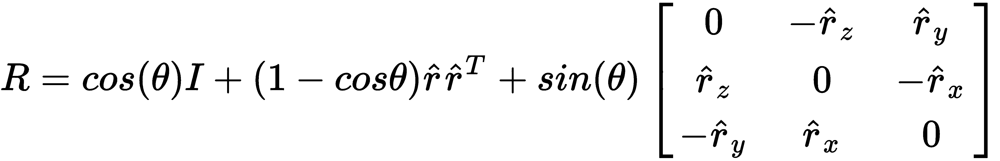
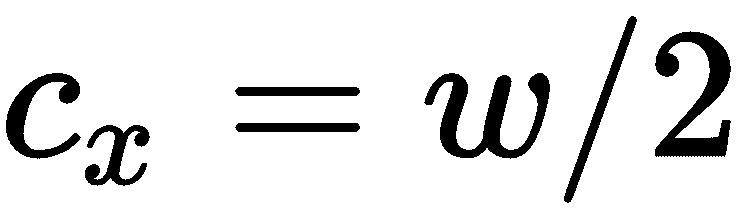
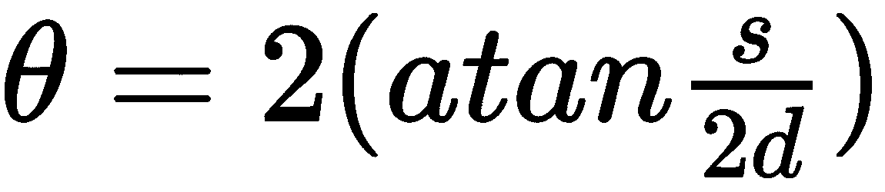
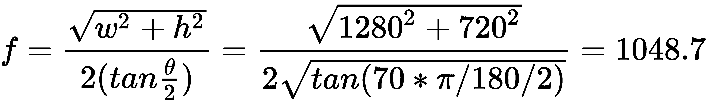
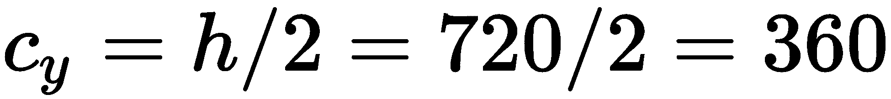
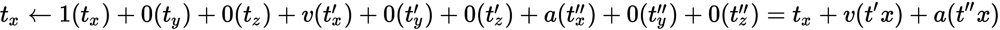
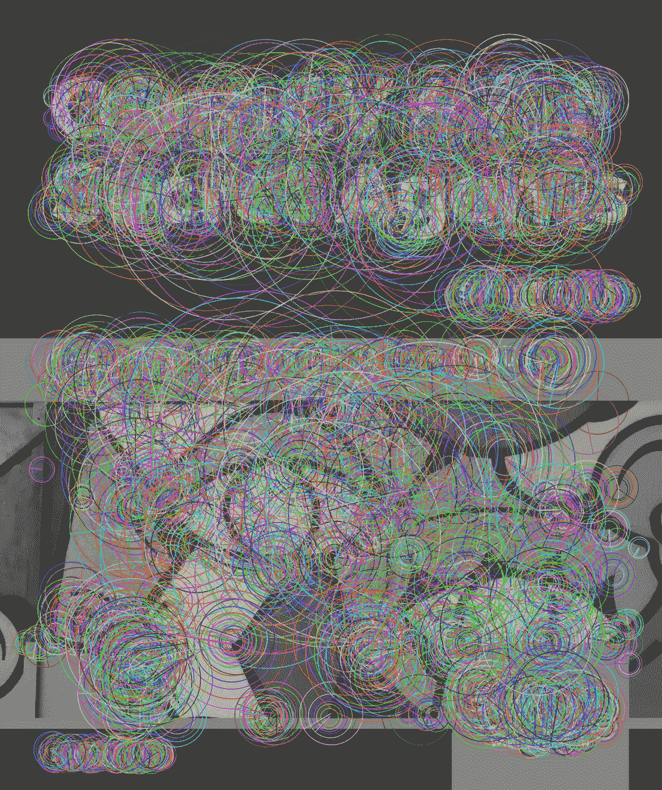

# 相机模型和增强现实

如果您喜欢几何图形，摄影或 3D 图形，那么本章的主题尤其适合您。 我们将学习 3D 空间和 2D 投影之间的关系。 我们将根据相机和镜头的基本光学参数对这种关系进行建模。 最后，我们将相同的关系应用于在精确的透视投影中绘制 3D 形状的任务。 在所有这些过程中，我们将整合我们之前在图像匹配和对象跟踪方面的知识，以便跟踪其真实世界对象的 3D 运动，该对象的 2D 投影由相机实时捕获。

在实践上，我们将构建一个增强现实应用程序，该应用程序使用有关相机，对象和运动的信息，以便将 3D 图形实时叠加在被跟踪对象的顶部。 为此，我们将克服以下技术挑战：

*   建模相机和镜头的参数
*   使用 2D 和 3D 关键点建模 3D 对象
*   通过匹配关键点检测对象
*   使用`cv2.solvePnPRansac`功能查找对象的 3D 姿势
*   使用卡尔曼滤镜平滑 3D 姿势
*   在对象上方绘制图形

在本章的过程中，如果您继续构建自己的增强现实引擎或任何其他依赖 3D 跟踪的系统（例如机器人导航系统），则将获得对您有用的技能。

# 技术要求

本章使用 Python，OpenCV 和 NumPy。 请返回第 1 章 *，设置 OpenCV，* 了解安装说明。

[本章的完整代码和示例视频可以在本书的 GitHub 存储库中找到](https://github.com/PacktPublishing/Learning-OpenCV-4-Computer-Vision-with-Python-Third-Edition)，位于`chapter09`文件夹中。

本章代码包含摘自 Joseph Howse（本书作者之一）称为*的可视化不可见*开源演示项目的摘录。 要了解有关此项目的更多信息，请访问[这个页面](https://github.com/JoeHowse/VisualizingTheInvisible/)中的资源库。

# 了解 3D 图像跟踪和增强现实

我们已经在第 6 章，*中检索图像并使用图像描述符搜索*解决了图像匹配问题。 此外，我们在第 8 章，“跟踪对象”中解决了涉及连续跟踪的问题。 因此，尽管我们尚未解决任何 3D 跟踪问题，但我们熟悉图像跟踪系统的许多组件。

那么， **3D 跟踪**到底是什么？ 嗯，这是一个不断更新 3D 空间中对象姿态估计值的过程，通常使用六个变量：三个变量来表示对象的 3D **平移**（即位置），以及 其他三个变量代表其 3D 旋转。

3D 跟踪的一个更专业的术语是 **6DOF 跟踪** –也就是说，使用**跟踪 6 个自由度**，即我们刚才提到的 6 个变量。

有 3 种方式将 3D 旋转表示为三个变量。 在其他地方，您可能会遇到各种各样的欧拉角表示形式，它们以围绕 *x* ， *y* 和 *z* 的三个单独的 2D 旋转来描述 3D 旋转。 ]轴按特定顺序排列。 OpenCV 不使用欧拉角来表示 3D 旋转。 相反，它使用称为 **Rodrigues 旋转向量**的表示形式。 具体来说，OpenCV 使用以下六个变量来表示 6DOF 姿态：

1.  ***t <sub>x</sub>***：这是对象沿 *x* 轴的平移。
2.  ***t <sub>y</sub>***：这是对象沿 *y* 轴的平移。
3.  ***t <sub>z</sub>***：这是对象沿 *z* 轴的平移。
4.  ***r <sub>x</sub>***：这是对象 Rodrigues 旋转矢量的第一个元素。
5.  ***r <sub>y</sub>***：这是对象 Rodrigues 旋转矢量的第二个元素。
6.  ***r <sub>z</sub>***：这是对象 Rodrigues 旋转矢量的第三个元素。

不幸的是，在 Rodrigues 表示中，没有简单的方法来解释 *r <sub>x</sub>* ， *r <sub>y</sub>* 和 *r [ <sub>z</sub>* 彼此分开。 总之，它们作为矢量 *r* 编码旋转轴和围绕该轴的旋转角。 具体来说，以下公式定义了 *r* 向量之间的关系； 角度*θ;* 归一化的轴矢量， *r̂* ； 和 3 x 3 旋转矩阵 *R* ：




作为 OpenCV 程序员，我们没有义务直接计算或解释任何这些变量。 OpenCV 提供了将 Rodrigues 旋转向量作为返回值的函数，我们可以将此旋转向量作为参数传递给其他 OpenCV 函数-无需自己操纵其内容。

出于我们的目的（实际上，对于计算机视觉中的许多问题），相机是 3D 坐标系的原点。 因此，在任何给定的帧中，摄像机的当前 *t <sub>x</sub>* ， *t <sub>y</sub>* ， *t <sub>z</sub>* ， *r <sub>x</sub>* ， *r <sub>y</sub>* 和 *r <sub>z</sub>* 值均定义为 0。我们将努力跟踪相对于相机当前姿势的其他对象。

当然，为了便于讲授，我们将可视化 3D 跟踪结果。 这将我们带入**增强现实**（**AR**）的领域。 广义上讲，AR 是一种持续跟踪现实世界对象之间的关系并将这些关系应用于虚拟对象的过程，以这种方式，用户可以将虚拟对象视为固定在现实世界中的某物上。 通常，视觉 AR 基于 3D 空间和透视投影的关系。 确实，我们的情况很典型。 我们希望通过在框架中跟踪的对象上方绘制一些 3D 图形的投影来可视化 3D 跟踪结果。

稍后，我们将回到透视投影的概念。 同时，让我们概述一下 3D 图像跟踪和可视 AR 的一组典型步骤：

1.  定义相机和镜头的参数。 我们将在本章中介绍该主题。
2.  初始化我们将用于稳定 6DOF 跟踪结果的卡尔曼滤波器。 有关卡尔曼滤波的更多信息，请参考第 8 章，“跟踪对象”。
3.  选择一个参考图像，代表我们要跟踪的对象的表面。 对于我们的演示，对象将是一个平面，例如一张打印图像的纸。
4.  创建一个 3D 点列表，代表对象的顶点。 坐标可以是任何单位，例如米，毫米或任意单位。 例如，您可以任意定义 1 个单位以等于对象的高度。
5.  从参考图像中提取特征描述符。 对于 3D 跟踪应用程序，ORB 是描述符的一种流行选择，因为它甚至可以在智能手机等适度的硬件上实时进行计算。 我们的演示将使用 ORB。 有关 ORB 的更多信息，请参考第 6 章，*检索图像并使用图像描述符搜索*。
6.  使用与*步骤 4* 中相同的映射，将特征描述符从像素坐标转换为 3D 坐标。
7.  开始从相机捕获帧。 对于每个帧，执行以下步骤：
    1.  提取特征描述符，并尝试在参考图像和框架之间找到良好的匹配。 我们的演示将使用基于 FLANN 的匹配和比率测试。 有关这些用于匹配描述符的方法的更多信息，请参考第 6 章，*检索图像并使用图像描述符*进行搜索。
    2.  如果找到的匹配次数不足，请继续下一帧。 否则，请继续执行其余步骤。

在继续演示代码之前，让我们进一步讨论此概述的两个方面：第一，相机和镜头的参数；第二，相机和镜头的参数。 第二，神秘功能`cv2.solvePnPRansac`的作用。

# 了解相机和镜头参数

通常，当我们捕获图像时，至少涉及三个对象：

*   **主题**是我们要在图像中捕获的东西。 通常，它是一个反射光的对象，我们希望该对象在图像中聚焦（清晰）。
*   **透镜**透射光，并将所有来自**焦平面**的反射光聚焦到**像平面**上。 焦平面是包括主体（如先前定义）的圆形空间切片。 图像平面是一个圆形的空间切片，其中包含图像传感器（稍后定义）。 通常，这些平面垂直于镜头的主轴（长度方向）。 镜头具有**光学中心**，这是来自焦平面的入射光在聚光回像平面之前会聚的点。 **焦距**（即，光学中心与焦平面之间的距离）根据光学中心与像平面之间的距离而变化。 如果我们将光学中心移近图像平面，则焦距会增加； 相反，如果我们将光学中心移离图像平面更远，则焦距会减小（通常，在相机系统中，通过简单地前后移动镜头的机制来调整焦点）。 **焦距**定义为当焦距为无穷远时光学中心与像平面之间的距离。
*   **图像传感器**是一种感光表面，可在模拟介质（例如胶片）或数字介质中接收光并将其记录为图像。 通常，图像传感器是矩形的。 因此，它不会覆盖圆形图像平面的角。 图像的对角线**视场**（**FOV**：要成像的 3D 空间的角度范围）与焦距，图像传感器的宽度和图像传感器的高度具有三角关系 。 我们将尽快探讨这种关系。

这是说明上述定义的图：


对于计算机视觉，我们通常使用固定焦距的镜头，这对于给定的应用程序是最佳的。 但是，镜头可以具有可变的焦距。 这种镜头称为**变焦镜头**。 **放大**意味着增加焦距，而**缩小**意味着减少焦距。 在机械上，变焦镜头通过移动镜头内部的光学元件来实现此目的。

让我们使用变量 *f* 表示焦距，然后使用变量（ *c <sub>x</sub>* ， *c <sub>y</sub>* ）代表图像传感器在图像平面内的中心点。 OpenCV 使用以下矩阵，称为**摄像机矩阵**，表示摄像机和镜头的基本参数：

| *f* | 0 | *c <sub>x</sub>* |
| 0 | *f* | *c <sub>y</sub>* |
| 0 | 0 | 1 |

假设图像传感器在图像平面中居中（通常应该如此），我们可以计算出 *c <sub>x</sub>* 和 *c <sub>y</sub>* ，具体取决于图像传感器的宽度 *w* 和高度 *h* ，如下所示：




如果我们知道对角 FOV *θ*，则可以使用以下三角公式来计算焦距：


或者，如果我们不知道对角 FOV，但是我们知道水平 FOV *ɸ*和垂直 FOV *ψ*，则可以如下计算焦距：


您可能想知道我们如何获取这些变量中任何一个的值作为起点。 有时，相机或镜头的制造商会在产品的规格表中提供有关传感器尺寸，焦距或 FOV 的数据。 例如，规格表可能以毫米为单位列出传感器尺寸和焦距，以度为单位列出 FOV。 但是，如果规格表的信息不足，我们还有其他方法来获取必要的数据。 重要的是，传感器的大小和焦距无需以实际单位（例如毫米）表示。 我们可以用任意单位表示它们，例如**像素等效单位**。

您可能会问，什么是像素等效单位？ 好吧，当我们从相机捕获一帧时，图像中的每个像素对应于图像传感器的某个区域，并且该区域具有真实世界的宽度（和真实世界的高度，通常与宽度相同） ）。 因此，如果我们要捕获分辨率为 1280 x 720 的帧，则可以说图像传感器的宽度 *w* 为 1280 个像素当量单位，高度为 *h* ， 是 720 像素等效单位。 这些单元无法在不同的实际传感器尺寸或分辨率下进行比较。 但是，对于给定的摄像机和分辨率，它们使我们能够进行内部一致的测量，而无需知道这些测量的实际规模。

这个技巧使我们能够为任何图像传感器定义 *w* 和 *h* （因为我们始终可以检查捕获帧的像素尺寸）。 现在，为了能够计算焦距，我们只需要另一种数据类型：FOV。 我们可以使用一个简单的实验来测量。 拿一张纸并将其粘贴到墙壁（或另一个垂直表面）上。 放置相机和镜头，使其直接面对纸张，并且纸张对角填充框架。 （如果纸张的纵横比与框架的纵横比不匹配，请裁切纸张以使其匹配。）测量从纸张的一个角到对角线对角的对角线大小 *s* 。 此外，测量从纸张到镜头镜筒下半点的距离 *d* 。 然后，通过三角法计算对角 FOV *θ*：



假设通过该实验，我们确定给定的相机和镜头的对角 FOV 为 70 度。 如果我们知道以 1280 x 720 的分辨率捕获帧，则可以按像素等效单位计算焦距，如下所示：



除此之外，我们还可以计算图像传感器的中心坐标：




因此，我们有以下相机矩阵：

| 1048.7 | 0 | 640 |
| 0 | 1048.7 | 360 |
| 0 | 0 | 1 |

前面的参数对于 3D​​跟踪是必需的，它们正确地代表了理想的相机和镜头。 但是，实际设备可能会明显偏离此理想状态，并且仅相机矩阵无法代表所有可能的偏差类型。 **失真系数**是一组附加参数，可以表示与理想模型的以下几种偏差：

*   **径向畸变**：这意味着镜头无法平等地放大图像的所有部分； 因此，它会使直边显得弯曲或波浪状。 对于径向失真系数，使用诸如 *k* <sub>n</sub> 等变量名（例如 *k <sub>1</sub>* ， *k <sub>2 通常使用</sub>* ， *k <sub>3</sub>* 等。 如果 *k <sub>1</sub> < 0* ，则通常表示镜头遭受**镜筒变形**的影响，这意味着直边似乎朝着镜框的边界向外弯曲。 图片。 相反， *k <sub>1</sub> > 0* 通常表示镜头遭受**枕形畸变**，这意味着直边似乎向内向图像中心弯曲。 。 如果符号在整个系列中交替出现（例如 *k <sub>1</sub> > 0* ， *k <sub>2</sub> < 0* 和 *k <sub>3</sub> > 0* ），这可能意味着镜头遭受了**胡子变形**的困扰，这意味着笔直的边缘显得波浪状。
*   **切向失真**：这意味着镜头的主轴（长度方向）不垂直于图像传感器； 因此，透视图是倾斜的，直线边缘之间的角度似乎不同于正常透视图投影中的角度。 对于切向失真系数，使用变量名称，例如 *p <sub>n</sub>* （例如， *p <sub>1</sub>* ， *p <sub>2 通常使用</sub>* 等。 系数的符号取决于镜头相对于图像传感器的倾斜方向。

下图说明了某些类型的径向变形：


OpenCV 提供的功能可处理多达五个失真系数： *k <sub>1</sub>* ， *k <sub>2</sub>* ， *p <sub>1</sub>* ， *p <sub>2</sub>* 和 *k <sub>3</sub>* 。 （OpenCV 期望它们以此顺序作为数组的元素。）很少地，您可能能够从相机或镜头供应商那里获得有关畸变系数的官方数据。 另外，您可以使用 OpenCV 的棋盘校准过程来估计失真系数以及相机矩阵。 这涉及从各种位置和角度捕获一系列印刷棋盘图案的图像。 有关更多详细信息，请参考[上的官方教程 https://docs.opencv.org/master/dc/dbb/tutorial_py_calibration.html](https://docs.opencv.org/master/dc/dbb/tutorial_py_calibration.html) 。

出于演示目的，我们将简单假设所有失真系数均为 0，这意味着没有失真。 当然，我们并不真正相信我们的网络摄像头是光学工程中的无畸变杰作。 我们只是认为失真还不足以明显影响我们的 3D 跟踪和 AR 演示。 如果我们试图构建一个精确的测量设备而不是视觉演示，那么我们将更加关注失真的影响。

与棋盘校准过程相比，我们在本节中概述的公式和假设产生了更为受限或理想的模型。 但是，我们的方法具有更简单，更容易重现的优点。 棋盘校准过程比较费力，每个用户可能会以不同的方式执行它，从而产生不同的（有时是错误的）结果。

吸收了有关相机和镜头参数的背景信息之后，现在让我们检查一个 OpenCV 函数，该函数使用这些参数作为 6DOF 跟踪问题解决方案的一部分。

# 了解 cv2.solvePnPRansac

`cv2.solvePnPRansac`函数为所谓的 **Perspective- *n* -Point**（**PnP**）问题实现了求解器。 给定 3D 和 2D 点之间的一组 *n* 唯一匹配，以及生成此 3D 点 2D 投影的相机和镜头的参数，求解器将尝试估算 3D 对象的 6DOF 姿态 相对于相机。 这个问题有点类似于寻找一组 2D 到 2D 关键点匹配的单应性，就像我们在第 6 章和*检索图像并使用图像描述符*搜索中所做的那样。 但是，在 PnP 问题中，我们有足够的其他信息来估计更具体的空间关系（自由度姿势），而不是单应性，后者只是告诉我们一种投影关系。

那么`cv2.solvePnPRansac`如何工作？ 顾名思义，该函数实现了 Ransac 算法，这是一种通用的迭代方法，旨在处理可能包含异常值（在我们的情况下为不匹配）的一组输入。 每次 Ransac 迭代都会找到一个潜在的解决方案，该解决方案可最大程度地减少对输入的平均误差的度量。 然后，在下一次迭代之前，将具有不可接受的大误差的所有输入标记为离群值并丢弃。 此过程一直持续到解收敛为止，这意味着没有发现新的异常值，并且平均误差也可以接受。

对于 PnP 问题，误差是根据**重投影误差**来衡量的，这意味着根据相机和镜头参数观察到的 2D 点的位置与预测位置之间的距离以及我们得出的 6DOF 姿态 目前正在考虑作为潜在的解决方案。 在过程的最后，我们希望获得与大多数 3D 到 2D 关键点匹配一致的 6DOF 姿势。 此外，我们想知道该解决方案的匹配项是哪些。

让我们考虑`cv2.solvePnPRansac`的功能签名：

```py
retval, rvec, tvec, inliers = cv.solvePnPRansac(
    objectPoints,
    imagePoints,
    cameraMatrix,
    distCoeffs,
    rvec=None,
    tvec=None,
    useExtrinsicGuess=False
    iterationsCount=100,
    reprojectionError=8.0,
    confidence=0.98,
    inliers=None,
    flags=cv2.SOLVEPNP_ITERATIVE)
```

如我们所见，该函数具有四个返回值：

*   `retval`：如果求解器收敛于一个解，则为`True`； 否则为`False`。
*   `rvec`：此数组包含 *r <sub>x</sub>* ， *r <sub>y</sub>* 和 *r <sub>z</sub>* – 6DOF 姿态中的三个旋转自由度。
*   `tvec`：此数组包含 *t <sub>x</sub>* ， *t* *<sub>y</sub>* 和 *t <sub>z</sub>* – 6DOF 姿态中的三个平移（位置）自由度。
*   `inliers`：如果求解器收敛于一个解，则此向量包含与该解一致的输入点的索引（在`objectPoints`和`imagePoints`中）。

该函数还具有 12 个参数：

*   `objectPoints`：这是 3D 点的数组，表示没有平移和旋转时（换句话说，当 6DOF 姿态变量都为 0 时）对象的关键点。
*   `imagePoints`：这是 2D 点的数组，代表图像中对象的关键点匹配。 具体而言，认为`imagePoints[i]`与`objectPoints[i]`匹配。
*   `cameraMatrix`：此 2D 数组是相机矩阵，我们可以按照前面的*了解相机和镜头参数*部分中介绍的方式导出。
*   `distCoeffs`：这是失真系数的数组。 如果我们不知道它们，可以（为简单起见）假定它们全为 0，如上一节所述。
*   `rvec`：如果求解器收敛于一个解，它将把解的 *r <sub>x</sub>* ， *r <sub>y</sub>* 和 *r <sub>z</sub>* 此数组中的值。
*   `tvec`：如果求解器收敛于一个解，它将把解的 *t <sub>x</sub>* ， *t* *<sub>y</sub>* 和 *t <sub>z</sub>* 值在此数组中。
*   `useExtrinsicGuess`：如果这是`True`，则求解器会将`rvec`和`tvec`参数中的值视为初始猜测，然后尝试找到与这些近似的解决方案。 否则，求解器将在搜索解决方案时采取不偏不倚的方法。
*   `iterationsCount`：这是求解器应尝试的最大迭代次数。 如果经过此迭代次数后仍未收敛于解决方案，则放弃。
*   `reprojectionError`：这是求解器将接受的最大重投影误差； 如果某个点的重投影误差大于此误差，则求解器会将其视为异常值。
*   `confidence`：求解器尝试收敛于置信度得分大于或等于此值的解决方案。
*   `inliers`：如果求解器收敛于一个解，则它将解的内点的索引放入此数组中。
*   `flags`：这些标志指定求解器的算法。 默认值`cv2.SOLVEPNP_ITERATIVE`是使重投影误差最小并且没有特殊限制的方法，因此通常是最佳选择。 一个有用的替代方法是`cv2.SOLVEPNP_IPPE`（**IPPE** ，是 **Infinitesimal 基于平面的姿势估计**的缩写），但它仅限于平面对象。

尽管此函数涉及很多变量，但我们会发现它的使用是对第 6 章，*检索图像和使用图像描述符*搜索的关键点匹配问题的自然扩展。 ，以及本章要介绍的 3D 和投影问题。 考虑到这一点，让我们开始探索本章的示例代码。

# 实施演示应用程序

我们将在单个脚本`ImageTrackingDemo.py`中实现我们的演示，该脚本将包含以下组件：

1.  导入语句
2.  用于自定义灰度转换的辅助功能
3.  辅助功能可将关键点从 2D 空间转换为 3D 空间
4.  应用程序类`ImageTrackingDemo`，它将封装相机和镜头的模型，参考图像的模型，卡尔曼滤镜，6DOF 跟踪结果，以及将跟踪图像并绘制简单的 AR 可视化效果的应用程序循环
5.  `main`函数启动应用程序

该脚本将依赖于另一个文件`reference_image.png`，它将代表我们要跟踪的图像。

事不宜迟，让我们深入研究脚本的实现。

# 导入模块

在 Python 标准库中，我们将使用`math`模块进行三角计算，并使用`timeit`模块进行精确的时间测量（这将使我们能够更有效地使用卡尔曼滤波器）。 和往常一样，我们还将使用 NumPy 和 OpenCV。 因此，我们对`ImageTrackingDemo.py`的实现始于以下`import`语句：

```py
import math
import timeit

import cv2
import numpy
```

现在，让我们继续执行辅助函数。

# 执行灰度转换

在本书中，我们使用以下代码执行了灰度转换：

```py
gray_img = cv2.cvtColor(bgr_img, cv2.COLOR_BGR2GRAY)
```

也许早就应该提出一个问题：此函数如何将 BGR 值准确映射到灰度值？ 答案是每个输出像素的灰度值都是相应输入像素的 B，G 和 R 值的加权平均值，如下所示：

```py
gray = (0.114 * blue) + (0.587 * green) + (0.299 * red)
```

这些砝码被广泛使用。 它们来自于 1982 年发布的称为 CCIR 601 的电信行业标准。 当我们看到明亮的场景时，我们的眼睛对黄绿色光线最为敏感。 此外，这些配重应该在带有淡黄色灯光和带蓝色阴影的场景（例如晴天的室外场景）中产生高对比度。 这些是我们使用 CCIR 601 砝码的充分理由吗？ 不，他们不是; 没有科学证据表明 CCIR 601 转换权重可为计算机视觉中的任何特定目的提供最佳的灰度输入。

实际上，出于图像跟踪的目的，有证据支持其他灰度转换算法。 SamuelMacêdo，GivânioMelo 和 Judith Kelner 在他们的论文中谈到了这个主题，*对应用于 SIFT 描述符*的灰度转换技术的比较研究（SBC 交互式系统杂志，第 6 卷，第 2 期，2015 年） 。 他们测试各种转换算法，包括以下类型：

*   加权平均转换`gray = (0.07 * blue) + (0.71 * green) + (0.21 * red)`，与 CCIR 601 有点相似
*   非加权平均转换`gray = (blue + green + red) / 3`
*   仅基于单个颜色通道的转换，例如`gray = green`
*   经过伽玛校正的转换，例如`gray = 255 * (green / 255) ^ (1/2.2)`，其中，灰度值随输入呈指数（非线性）变化

根据该论文，加权平均转换产生的结果相对不稳定-有利于找到某些图像的匹配和单应性，而对于其他图像则不好。 非加权平均转换和单通道转换产生更一致的结果。 对于某些图像，经伽玛校正的转换可产生最佳结果，但这些转换在计算上更加昂贵。

为了演示的目的，我们将通过获取每个像素的 B，G 和 R 值的简单（未加权）平均值来执行灰度转换。 这种方法在计算上很便宜（在实时跟踪中很理想），并且我们期望它比 OpenCV 中的默认加权平均转换带来更一致的跟踪结果。 这是我们用于执行自定义转换的辅助函数的实现：

```py
def convert_to_gray(src, dst=None):
    weight = 1.0 / 3.0
    m = numpy.array([[weight, weight, weight]], numpy.float32)
    return cv2.transform(src, m, dst)
```

注意`cv2.transform`功能的使用。 这是 OpenCV 提供的经过优化的通用矩阵转换函数。 我们可以使用它来执行以下操作：像素输出通道的值是输入通道值的线性组合。 在我们的 BGR 到灰度转换的情况下，我们有一个输出通道和三个输入通道，因此我们的转换矩阵`m`有一行三列。

编写了用于灰度转换的辅助函数后，让我们继续考虑用于从 2D 到 3D 空间转换的辅助函数。

# 执行 2D 到 3D 空间转换

请记住，我们有一个参考图像`reference_image.png`，并且我们希望 AR 应用程序跟踪该图像的打印副本。 出于 3D 跟踪的目的，我们可以将此打印图像表示为 3D 空间中的平面。 让我们定义局部坐标系的方式是，通常（当 6DOF 姿势的元素全部为 0 时），此平面对象像悬挂在墙上的图片一样竖立； 它的正面是上面有图像的一侧，其原点是图像的中心。

现在，让我们假设我们想将参考图像中的给定像素映射到此 3D 平面上。 给定 2D 像素坐标，图像的像素尺寸以及将像素转换为我们要在 3D 空间中使用的度量单位的比例因子，我们可以使用以下辅助函数将像素映射到平面上：

```py
def map_point_onto_plane(point_2D, image_size, image_scale):
    x, y = point_2D
    w, h = image_size
    return (image_scale * (x - 0.5 * w),
            image_scale * (y - 0.5 * h),
            0.0)
```

比例因子取决于打印图像的实际大小和我们选择的单位。 例如，我们可能知道我们的打印图像高 20 厘米–或我们可能不在乎绝对比例，在这种情况下，我们可以定义一个任意单位，以使打印图像高一个单位。 无论如何，只要以任何单位（绝对或相对）给出 2D 像素坐标，参考图像的尺寸以及参考图像的实际高度的列表，我们就可以使用以下帮助器函数在列表上获取相应 3D 坐标的列表。 飞机：

```py
def map_points_to_plane(points_2D, image_size, image_real_height):

    w, h = image_size
    image_scale = image_real_height / h

    points_3D = [map_point_onto_plane(
                     point_2D, image_size, image_scale)
                 for point_2D in points_2D]
    return numpy.array(points_3D, numpy.float32)
```

请注意，我们为多个点`map_points_to_plane`提供了一个辅助函数，并且为每个点`map_point_to_plane`都调用了一个辅助函数。

稍后，在*初始化跟踪器*部分中，我们将为参考图像生成 ORB 关键点描述符，并且我们将使用我们的`map_points_to_plane`辅助函数将关键点坐标从 2D 转换为 3D。 我们还将转换图像的四个 2D 顶点（即其左上角，右上角，右下角和左下角），以获得平面的四个 3D 顶点。 在执行 AR 绘制时，我们将使用这些顶点-特别是在*绘制跟踪结果*部分中。 与绘图相关的功能（在 OpenCV 和许多其他框架中）期望为 3D 形状的每个面按顺时针顺序（从正面角度）指定顶点。 为了满足此要求，让我们实现另一个专用于映射顶点的辅助函数。 这里是：

```py
def map_vertices_to_plane(image_size, image_real_height):

    w, h = image_size

    vertices_2D = [(0, 0), (w, 0), (w, h), (0, h)]
    vertex_indices_by_face = [[0, 1, 2, 3]]

    vertices_3D = map_points_to_plane(
        vertices_2D, image_size, image_real_height)
    return vertices_3D, vertex_indices_by_face
```

请注意，我们的顶点映射帮助函数`map_vertices_to_plane`调用了`map_points_to_plane`帮助函数，该函数又调用了`map_point_to_plane`。 因此，我们所有的映射功能都有一个共同的核心。

当然，除了平面外，2D 到 3D 关键点映射和顶点映射也可以应用于其他 3D 形状。 若要了解我们的方法如何扩展到 3D 长方体和 3D 圆柱体，请参阅 Joseph Howse 的 *Visualization the Invisible* demo 项目，该项目可在[这个页面](https://github.com/JoeHowse/VisualizingTheInvisible/)。

我们已经完成了辅助功能的实现。 现在，让我们继续进行代码的面向对象部分。

# 实施应用程序类

我们将在名为`ImageTrackingDemo`的类中实现我们的应用程序，该类将具有以下方法：

*   `__init__(self, capture, diagonal_fov_degrees, target_fps, reference_image_path, reference_image_real_height)`：初始化程序将为参考图像设置捕获设备，相机矩阵，卡尔曼滤波器以及 2D 和 3D 关键点。
*   `run(self)`：此方法将运行应用程序的主循环，该循环捕获，处理和显示帧，直到用户通过按 *Esc* 键退出。 在其他方法的帮助下执行每个帧的处理，这些方法将在此列表中接下来提到。
*   `_track_object(self)`：此方法将执行 6DOF 跟踪并绘制跟踪结果的 AR 可视化图像。
*   `_init_kalman_transition_matrix(self, fps)`：此方法将配置卡尔曼滤波器，以确保针对指定的帧速率正确模拟加速度和速度。
*   `_apply_kalman(self)`：此方法将通过应用卡尔曼滤波器来稳定 6DOF 跟踪结果。

让我们从`__init__`开始一步一步地介绍方法的实现。

# 初始化追踪器

`__init__`方法涉及许多步骤来初始化相机矩阵，ORB 描述符提取器，卡尔曼滤波器，参考图像的 2D 和 3D 关键点以及与我们的跟踪算法相关的其他变量：

1.  首先，让我们看一下`__init__`接受的参数。 其中包括一个称为`capture`的`cv2.VideoCapture`对象（相机）； 摄像机的对角 FOV，以度为单位； 每秒**帧**（**FPS**）中的预期帧速率； 包含参考图像的文件的路径； 以及参考图像实际高度的度量（以任何单位）：

```py
class ImageTrackingDemo():

    def __init__(self, capture, diagonal_fov_degrees=70.0,
                 target_fps=25.0,
                 reference_image_path='reference_image.png',
                 reference_image_real_height=1.0):
```

2.  我们尝试从相机捕获一帧以确定其像素尺寸。 否则，我们将从相机的属性中获取尺寸：

```py
        self._capture = capture
        success, trial_image = capture.read()
        if success:
            # Use the actual image dimensions.
            h, w = trial_image.shape[:2]
        else:
            # Use the nominal image dimensions.
            w = capture.get(cv2.CAP_PROP_FRAME_WIDTH)
            h = capture.get(cv2.CAP_PROP_FRAME_HEIGHT)
        self._image_size = (w, h)
```

3.  现在，给定帧的尺寸（以像素为单位）以及相机和镜头的 FOV，我们可以使用三角函数以像素等效单位计算焦距。 （该公式是我们在本章前面的*了解相机和镜头参数*部分中得出的公式。）此外，利用焦距和镜框的中心点，我们可以构建相机矩阵。 以下是相关代码：

```py
        diagonal_image_size = (w ** 2.0 + h ** 2.0) ** 0.5
        diagonal_fov_radians = \
            diagonal_fov_degrees * math.pi / 180.0
        focal_length = 0.5 * diagonal_image_size / math.tan(
            0.5 * diagonal_fov_radians)
        self._camera_matrix = numpy.array(
            [[focal_length, 0.0, 0.5 * w],
             [0.0, focal_length, 0.5 * h],
             [0.0, 0.0, 1.0]], numpy.float32)
```

4.  为了简单起见，我们假定镜头不会遭受任何扭曲：

```py
        self._distortion_coefficients = None
```

5.  最初，我们不跟踪对象，因此我们无法估计其旋转和位置。 我们只将相关变量定义为`None`：

```py
        self._rotation_vector = None
        self._translation_vector = None
```

6.  现在，让我们设置一个卡尔曼滤波器：

```py
        self._kalman = cv2.KalmanFilter(18, 6)

        self._kalman.processNoiseCov = numpy.identity(
            18, numpy.float32) * 1e-5
        self._kalman.measurementNoiseCov = numpy.identity(
            6, numpy.float32) * 1e-2
        self._kalman.errorCovPost = numpy.identity(
            18, numpy.float32)

        self._kalman.measurementMatrix = numpy.array(
            [[1.0, 0.0, 0.0, 0.0, 0.0, 0.0, 0.0, 0.0, 0.0,
              0.0, 0.0, 0.0, 0.0, 0.0, 0.0, 0.0, 0.0, 0.0],
             [0.0, 1.0, 0.0, 0.0, 0.0, 0.0, 0.0, 0.0, 0.0,
              0.0, 0.0, 0.0, 0.0, 0.0, 0.0, 0.0, 0.0, 0.0],
             [0.0, 0.0, 1.0, 0.0, 0.0, 0.0, 0.0, 0.0, 0.0,
              0.0, 0.0, 0.0, 0.0, 0.0, 0.0, 0.0, 0.0, 0.0],
             [0.0, 0.0, 0.0, 0.0, 0.0, 0.0, 0.0, 0.0, 0.0,
              1.0, 0.0, 0.0, 0.0, 0.0, 0.0, 0.0, 0.0, 0.0],
             [0.0, 0.0, 0.0, 0.0, 0.0, 0.0, 0.0, 0.0, 0.0,
              0.0, 1.0, 0.0, 0.0, 0.0, 0.0, 0.0, 0.0, 0.0],
             [0.0, 0.0, 0.0, 0.0, 0.0, 0.0, 0.0, 0.0, 0.0,
              0.0, 0.0, 1.0, 0.0, 0.0, 0.0, 0.0, 0.0, 0.0]],
            numpy.float32)

        self._init_kalman_transition_matrix(target_fps)
```

如前面的代码`cv2.KalmanFilter(18, 6)`所示，该卡尔曼滤波器将基于 6 个输入变量（或测量值）跟踪 18 个输出变量（或预测）。 具体来说，输入变量是 6DOF 跟踪结果的元素： *t <sub>x</sub>* ， *t <sub>y</sub>* ， *t <sub>z</sub>* ， *r <sub>x</sub>* ， *r <sub>y</sub>* 和 *r <sub>z</sub>* 。 输出变量是稳定的 6DOF 跟踪结果的元素，以及它们的一阶导数（速度）和二阶导数（加速度），其顺序如下： *t <sub>x</sub>* ， *t <sub>y</sub>* ， *t <sub>z</sub>* ， *t <sub>x</sub> '*， *t <sub>y</sub> '*， *t <sub>z</sub> '*， *t <sub>x</sub> '*， *t <sub>y</sub> '*， *t <sub>z</sub> '*， *r <sub>x</sub>* ， *r <sub>y</sub>* ， *r <sub>z</sub>* ， *r <sub>x</sub> '*， *r <sub>y</sub> '*， *r <sub>z</sub> '*， *r <sub>x</sub> '*， *r <sub>y</sub> '*和 *r <sub>z</sub> '*。 卡尔曼滤波器的测量矩阵有 18 列（代表输出变量）和 6 行（代表输入变量）。 在每一行中，我们在与匹配的输出变量相对应的索引中放入 1.0； 在其他地方，我们放 0.0。 我们还初始化了一个转换矩阵，该矩阵定义了输出变量之间随时间的关系。 初始化的这一部分由辅助方法`_init_kalman_transition_matrix(target_fps)`处理，我们将在稍后的*初始化和应用卡尔曼滤波器*部分中进行检查。

并非我们的`__init__`方法都会初始化所有的卡尔曼滤波器矩阵。 由于实际帧速率（以及时间步长）可能会发生变化，因此在跟踪过程中每帧更新过渡矩阵。 每次我们开始跟踪对象时，都会初始化状态矩阵。 我们将在适当的时候在*初始化和应用 Kalman 滤波器*部分中介绍 Kalman 滤波器使用的这些方面。

7.  我们需要一个布尔变量（最初是`False`）来指示我们是否成功跟踪了前一帧中的对象：

```py
        self._was_tracking = False
```

8.  我们需要定义一些 3D 图形的顶点，作为 AR 可视化的一部分，我们将绘制每一帧。 具体而言，图形将是代表对象的 *X* ， *Y* 和 *Z* 轴的一组箭头。 这些图形的比例将与实际对象的比例有关，即我们要跟踪的打印图像。 请记住，作为其参数之一，`__init__`方法采用图像的比例尺-特别是其高度-并且此度量单位可以是任何单位。 让我们将 3D 轴箭头的长度定义为打印图像高度的一半：

```py
        self._reference_image_real_height = \
            reference_image_real_height
        reference_axis_length = 0.5 * reference_image_real_height
```

9.  使用我们刚刚定义的长度，让我们定义相对于打印图像中心`[0.0, 0.0, 0.0]`的轴箭头的顶点：

```py
        self._reference_axis_points_3D = numpy.array(
            [[0.0, 0.0, 0.0],
             [-reference_axis_length, 0.0, 0.0],
             [0.0, -reference_axis_length, 0.0],
             [0.0, 0.0, -reference_axis_length]], numpy.float32)
```

请注意，OpenCV 的坐标系具有非标准轴方向，如下所示：

*   + *X* （正 X 方向）是对象的左手方向，或者是在对象正视图中查看者的右手方向。
*   + *Y* 断开。
*   + *Z* 是对象的后向方向，即在对象的正面视图中观察者的向前方向。

为了获得以下标准右手坐标系，我们必须取反所有上述方向，就像在许多 3D 图形框架（例如 OpenGL）中使用的那样：

*   + *X* 是对象正面的方向，即观看者的左手方向。
*   + *是*已打开。
*   + *Z* 是对象的正面方向，或者是查看者在对象的正面视图中的向后方向。

出于本书的目的，我们使用 OpenCV 绘制 3D 图形，因此即使在绘制可视化效果时，我们也可以简单地遵循 OpenCV 的非标准轴方向。 但是，如果将来要进行进一步的 AR 工作，则可能需要使用右手坐标系将计算机视觉代码与 OpenGL 和其他 3D 图形框架集成在一起。 为了更好地为您做好准备，我们将在以 OpenCV 为中心的演示中转换轴方向。

10.  我们将使用三个数组来保存三种图像：BGR 视频帧（将在其中进行 AR 绘制），帧的灰度版本（将用于关键点匹配）和蒙版（在其中进行绘制） 被跟踪对象的轮廓）。 最初，这些数组都是`None`：

```py
        self._bgr_image = None
        self._gray_image = None
        self._mask = None
```

11.  我们将使用`cv2.ORB`对象来检测关键点，并为参考图像以及随后的相机帧计算描述符。 我们按以下方式初始化`cv2.ORB`对象：

```py
        # Create and configure the feature detector.
        patchSize = 31
        self._feature_detector = cv2.ORB_create(
            nfeatures=250, scaleFactor=1.2, nlevels=16,
            edgeThreshold=patchSize, patchSize=patchSize)
```

有关 ORB 算法及其在 OpenCV 中的用法的更新，请参考第 6 章，*检索图像并使用图像描述符*进行搜索，特别是*将 ORB 与 FAST 功能一起使用 和简要描述符*部分。

在这里，我们为`cv2.ORB`的构造函数指定了几个可选参数。 描述符覆盖的直径为 31 个像素，我们的图像金字塔有 16 个级别，连续级别之间的缩放系数为 1.2，并且每次检测尝试最多需要 250 个关键点和描述符。

12.  现在，我们从文件中加载参考图像，调整其大小，将其转换为灰度，并为其创建一个空的蒙版：

```py
        bgr_reference_image = cv2.imread(
            reference_image_path, cv2.IMREAD_COLOR)
        reference_image_h, reference_image_w = \
            bgr_reference_image.shape[:2]
        reference_image_resize_factor = \
            (2.0 * h) / reference_image_h
        bgr_reference_image = cv2.resize(
            bgr_reference_image, (0, 0), None,
            reference_image_resize_factor,
            reference_image_resize_factor, cv2.INTER_CUBIC)
        gray_reference_image = convert_to_gray(bgr_reference_image)
        reference_mask = numpy.empty_like(gray_reference_image)
```

调整参考图像的大小时，我们选择使其比相机框高两倍。 确切的数字是任意的； 但是，我们的想法是我们要使用覆盖了有用放大倍率的图像金字塔来执行关键点检测和描述。 金字塔的底面（即调整大小后的参考图像）应大于摄像头框架，以便即使目标对象离摄像头非常近，以致无法完全适合框架，我们也可以以适当的比例匹配关键点 。 相反，金字塔的顶层应该小于摄影机框架，这样即使目标物体距离无法填满整个框架，我们也可以以适当的比例匹配关键点。

让我们考虑一个例子。 假设我们的原始参考图像为 4000 x 3000 像素，而我们的相机框架为 1280 x 720 像素。 我们将参考图像的尺寸调整为 1920 x 1440 像素（帧高度的两倍，并且纵横比与原始参考图像相同）。 因此，我们的图像金字塔的底面也是 1920 x 1440 像素。 由于我们的`cv2.ORB`对象配置为使用 16 个金字塔等级且比例因子为 1.2，因此图像金字塔的顶部宽度为 1920 /（1.2 <sup>16-1</sup> ）= 124 像素，高度为 1440 /（1.2 <sup>16-1</sup> ）= 93 像素； 换句话说，它是 124 x 93 像素。 因此，即使物体相距太远，以至于它仅占框架宽度或高度的 10％，我们也可以匹配关键点并跟踪该物体。 实际上，要在此级别上执行有用的关键点匹配，我们需要一个好的镜头，该物体需要聚焦，并且照明也必须很好。

13.  在此阶段，我们有一个大小适当的 BGR 颜色和灰度参考图像，并且对此图像有一个空遮罩。 我们将图像划分为 36 个大小相等的感兴趣区域（在 6 x 6 网格中），并且对于每个区域，我们将尝试生成多达 250 个关键点和描述符（因为已配置`cv2.ORB`对象 使用最大数量的关键点和描述符）。 这种分区方案有助于确保我们在每个区域中都有一些关键点和描述符，因此即使对象的大多数部分在给定帧中不可见，我们也可以潜在地匹配关键点并跟踪对象。 以下代码块显示了我们如何在感兴趣的区域上进行迭代，并为每个区域创建掩码，执行关键点检测和描述符提取，以及将关键点和描述符附加到主列表中：

```py
        # Find keypoints and descriptors for multiple segments of
        # the reference image.
        reference_keypoints = []
        self._reference_descriptors = numpy.empty(
            (0, 32), numpy.uint8)
        num_segments_y = 6
        num_segments_x = 6
        for segment_y, segment_x in numpy.ndindex(
                (num_segments_y, num_segments_x)):
            y0 = reference_image_h * \
                segment_y // num_segments_y - patchSize
            x0 = reference_image_w * \
                segment_x // num_segments_x - patchSize
            y1 = reference_image_h * \
                (segment_y + 1) // num_segments_y + patchSize
            x1 = reference_image_w * \
                (segment_x + 1) // num_segments_x + patchSize
            reference_mask.fill(0)
            cv2.rectangle(
                reference_mask, (x0, y0), (x1, y1), 255, cv2.FILLED)
            more_reference_keypoints, more_reference_descriptors = \
                self._feature_detector.detectAndCompute(
                    gray_reference_image, reference_mask)
            if more_reference_descriptors is None:
                # No keypoints were found for this segment.
                continue
            reference_keypoints += more_reference_keypoints
            self._reference_descriptors = numpy.vstack(
                (self._reference_descriptors,
                 more_reference_descriptors))
```

14.  现在，我们在灰度参考图像上方绘制关键点的可视化效果：

```py
        cv2.drawKeypoints(
            gray_reference_image, reference_keypoints,
            bgr_reference_image,
            flags=cv2.DRAW_MATCHES_FLAGS_DRAW_RICH_KEYPOINTS)
```

15.  接下来，我们将可视化文件保存到名称后附加`_keypoints`的文件中。 例如，如果参考图像的文件名是`reference_image.png`，则将可视化文件另存为`reference_image_keypoints.png`。 以下是相关代码：

```py
        ext_i = reference_image_path.rfind('.')
        reference_image_keypoints_path = \
            reference_image_path[:ext_i] + '_keypoints' + \
            reference_image_path[ext_i:]
        cv2.imwrite(
            reference_image_keypoints_path, bgr_reference_image)
```

16.  我们继续使用自定义参数初始化基于 FLANN 的匹配器：

```py
        FLANN_INDEX_LSH = 6
        index_params = dict(algorithm=FLANN_INDEX_LSH,
                            table_number=6, key_size=12,
                            multi_probe_level=1)
        search_params = dict()
        self._descriptor_matcher = cv2.FlannBasedMatcher(
            index_params, search_params)
```

这些参数指定我们正在使用具有 6 个哈希表，12 位哈希键大小和 1 个多探针级别的多探针 LSH（位置敏感哈希）索引算法。

有关多探针 LSH 算法的说明，请参阅论文*多探针 LSH：高维相似性搜索的有效索引*（VLDB，2007 年），由 Qin Lv，William Josephson，Zhe Wang， 摩西·查里卡尔（Moses Charikar）和李凯（Kai Li）。 可在[这个页面](https://www.cs.princeton.edu/cass/papers/mplsh_vldb07.pdf)获得电子版本。

17.  我们通过向其提供参考描述符来训练匹配器：

```py
        self._descriptor_matcher.add([self._reference_descriptors])
```

18.  我们获取关键点的 2D 坐标，并将它们馈送到`map_points_to_plane`辅助函数中，以便在对象平面的表面上获得等效的 3D 坐标：

```py
        reference_points_2D = [keypoint.pt
                               for keypoint in reference_keypoints]
        self._reference_points_3D = map_points_to_plane(
            reference_points_2D, gray_reference_image.shape[::-1],
            reference_image_real_height)
```

19.  类似地，我们调用`map_vertices_to_plane`函数以获得平面的 3D 顶点和 3D 面：

```py
        (self._reference_vertices_3D,
         self._reference_vertex_indices_by_face) = \
            map_vertices_to_plane(
                    gray_reference_image.shape[::-1],
                    reference_image_real_height)
```

到此结束`__init__`方法的实现。 接下来，让我们看一下`run`方法，它表示应用程序的主循环。

# 实施主循环

像往常一样，我们的主循环的主要作用是捕获和处理帧，直到用户按下 *Esc* 键。 每个帧的处理（包括 3D 跟踪和 AR 绘制）都委托给称为`_track_object`的辅助方法，稍后将在*以 3D 跟踪图像*部分中进行探讨。 主循环还具有辅助作用：即通过测量帧速率并相应地更新卡尔曼滤波器的转换矩阵来执行计时。 此更新委托给另一种辅助方法`_init_kalman_transition_matrix`，我们将在*初始化和应用卡尔曼滤波器*部分中进行研究。 考虑到这些角色，我们可以在`run`方法中实现`main`循环，如下所示：

```py
    def run(self):

        num_images_captured = 0
        start_time = timeit.default_timer()

        while cv2.waitKey(1) != 27:  # Escape
            success, self._bgr_image = self._capture.read(
                self._bgr_image)
            if success:
                num_images_captured += 1
                self._track_object()
                cv2.imshow('Image Tracking', self._bgr_image)
            delta_time = timeit.default_timer() - start_time
            if delta_time > 0.0:
                fps = num_images_captured / delta_time
                self._init_kalman_transition_matrix(fps)
```

请注意 Python 标准库中`timeit.default_timer`函数的使用。 此功能提供了以秒为单位的当前系统时间的精确测量值（作为浮点数，因此可以表示秒的分数）。 就像名称`timeit`所暗示的那样，此模块包含有用的功能，适用于以下情况：您具有时间敏感的代码，并且想要*为其计时*。

让我们继续进行`_track_object`的实现，因为此助手代表`run`执行了应用程序工作的最大部分。

# 以 3D 追踪图像

`_track_object`方法直接负责关键点匹配，关键点可视化和解决 PnP 问题。 此外，它调用其他方法来处理卡尔曼滤波，AR 绘制和掩盖被跟踪的对象：

1.  为了开始`_track_object`的实现，我们调用`convert_to_gray` helper 函数将帧转换为灰度：

```py
    def _track_object(self):

        self._gray_image = convert_to_gray(
            self._bgr_image, self._gray_image)
```

2.  现在，我们使用`cv2.ORB`对象检测灰度图像的蒙版区域中的关键点并计算描述符：

```py
        if self._mask is None:
            self._mask = numpy.full_like(self._gray_image, 255)

        keypoints, descriptors = \
            self._feature_detector.detectAndCompute(
                self._gray_image, self._mask)
```

如果我们已经在前一帧中跟踪了对象，则遮罩将覆盖我们先前找到该对象的区域。 否则，遮罩会覆盖整个框架，因为我们不知道对象可能在哪里。 稍后，我们将在*绘制跟踪结果并屏蔽被跟踪的对象*部分中了解如何创建蒙版。

3.  接下来，我们使用 FLANN 匹配器查找参考图像的关键点与帧的关键点之间的匹配项，并根据比率测试过滤这些匹配项：

```py
        # Find the 2 best matches for each descriptor.
        matches = self._descriptor_matcher.knnMatch(descriptors, 2)

        # Filter the matches based on the distance ratio test.
        good_matches = [
            match[0] for match in matches
            if len(match) > 1 and \
            match[0].distance < 0.6 * match[1].distance
        ]
```

有关 FLANN 匹配和比率测试的详细信息，请参考第 6 章，*检索图像并使用图像描述符*进行搜索。

4.  在此阶段，我们列出了通过比率测试的良好匹配项。 让我们选择与这些良好匹配相对应的框架关键点的子集，然后在框架上绘制红色圆圈以可视化这些关键点：

```py
        # Select the good keypoints and draw them in red.
        good_keypoints = [keypoints[match.queryIdx]
                          for match in good_matches]
        cv2.drawKeypoints(self._gray_image, good_keypoints,
                          self._bgr_image, (0, 0, 255))
```

5.  找到了不错的比赛之后，我们显然知道其中有多少人。 如果计数很小，那么总的来说，这组匹配项可能会令人怀疑且不足以进行跟踪。 我们为良好匹配的最小数量定义了两个不同的阈值：较高的阈值（如果我们只是开始跟踪（即，我们没有在前一帧中跟踪对象））和较低的阈值（如果我们正在继续跟踪） 跟踪前一帧中的对象）：

```py
        min_good_matches_to_start_tracking = 8
        min_good_matches_to_continue_tracking = 6
        num_good_matches = len(good_matches)
```

5.  如果我们甚至没有达到下限阈值，那么我们会注意到我们没有在该帧中跟踪对象，因此我们将遮罩重置为覆盖整个帧：

```py
        if num_good_matches < min_good_matches_to_continue_tracking:
            self._was_tracking = False
            self._mask.fill(255)
```

6.  另一方面，如果我们有足够的匹配项来满足适用的阈值，那么我们将继续尝试跟踪对象。 第一步是在框架中选择良好匹配的 2D 坐标，并在`reference`对象的模型中选择其 3D 坐标：

```py
        elif num_good_matches >= \
                min_good_matches_to_start_tracking or \
                    self._was_tracking:

            # Select the 2D coordinates of the good matches.
            # They must be in an array of shape (N, 1, 2).
            good_points_2D = numpy.array(
                [[keypoint.pt] for keypoint in good_keypoints],
                numpy.float32)

            # Select the 3D coordinates of the good matches.
            # They must be in an array of shape (N, 1, 3).
            good_points_3D = numpy.array(
                [[self._reference_points_3D[match.trainIdx]]
                 for match in good_matches],
                numpy.float32)
```

7.  现在，我们准备使用本章开头在*了解`cv2.solvePnPRansac`* 部分中介绍的各种参数来调用`cv2.solvePnPRansac`。 值得注意的是，我们仅从良好匹配中使用 3D 参考关键点和 2D 场景关键点：

```py
            # Solve for the pose and find the inlier indices.
            (success, self._rotation_vector,
             self._translation_vector, inlier_indices) = \
                cv2.solvePnPRansac(good_points_3D, good_points_2D,
                                   self._camera_matrix,
                                   self._distortion_coefficients,
                                   self._rotation_vector,
                                   self._translation_vector,
                                   useExtrinsicGuess=False,
                                   iterationsCount=100,
                                   reprojectionError=8.0,
                                   confidence=0.99,
                                   flags=cv2.SOLVEPNP_ITERATIVE)
```

8.  解算器可能收敛或未收敛于 PnP 问题的解决方案。 如果没有收敛，则此方法将不再做任何事情。 如果收敛，则下一步是检查是否已在上一帧中跟踪对象。 如果我们尚未跟踪它（换句话说，如果我们开始在此帧中重新跟踪对象），则可以通过调用辅助方法`_init_kalman_state_matrices`重新初始化卡尔曼滤波器：

```py
            if success:

                if not self._was_tracking:
                    self._init_kalman_state_matrices()
```

9.  现在，无论如何，我们都在该帧中跟踪对象，因此我们可以通过调用另一个辅助方法`_apply_kalman`来应用卡尔曼滤波器：

```py
                self._was_tracking = True

                self._apply_kalman()
```

10.  在这一阶段，我们有一个经过卡尔曼滤波的 6DOF 姿态。 我们还列出了`cv2.solvePnPRansac`中的内部关键点。 为了帮助用户可视化结果，让我们以绿色绘制内部关键点：

```py
                # Select the inlier keypoints.
                inlier_keypoints = [good_keypoints[i]
                                    for i in inlier_indices.flat]

                # Draw the inlier keypoints in green.
                cv2.drawKeypoints(self._bgr_image, inlier_keypoints,
                                  self._bgr_image, (0, 255, 0))
```

请记住，在此方法的前面，我们用红色绘制了所有关键点。 现在，我们以绿色绘制了内部关键点，只有外部关键点仍然是红色。

11.  最后，我们再调用两个辅助方法：`self._draw_object`轴绘制被跟踪对象的 3D 轴，`self._make_and_draw_object_mask`绘制并绘制包含对象的区域的蒙版：

```py
                # Draw the axes of the tracked object.
                self._draw_object_axes()

                # Make and draw a mask around the tracked object.
                self._make_and_draw_object_mask()
```

结束我们的`_track_object`方法的实现。 到目前为止，我们已经大致了解了跟踪算法的实现，但是我们仍然需要实现与卡尔曼滤波器有关的辅助方法（在下一节*中初始化和应用卡尔曼滤波器*）以及屏蔽 和 AR 绘制（在其后的部分中，*绘制跟踪结果并遮盖跟踪的对象*）。

# 初始化和应用卡尔曼滤波器

我们在*初始化跟踪器*部分中介绍了卡尔曼滤波器初始化的某些方面。 但是，在该部分中，我们注意到，随着应用程序运行在各种帧以及跟踪或不跟踪的各种状态下，卡尔曼滤波器的某些矩阵需要多次初始化或重新初始化。 具体来说，以下矩阵将发生变化：

*   **转换矩阵**：此矩阵表示所有输出变量之间的时间关系。 例如，该矩阵可以模拟加速度对速度的影响以及速度对位置的影响。 我们将每帧重新初始化转换矩阵，因为帧速率（以及帧之间的时间步长）是可变的。 有效地，这是缩放先前的加速度和速度预测以匹配新时间步长的一种方法。
*   **校正前和校正后状态矩阵**：这些矩阵包含输出变量的预测。 预校正矩阵中的预测仅考虑先前状态和转换矩阵。 校正后矩阵中的预测还考虑了新的输入和卡尔曼滤波器的其他矩阵。 每当我们从非跟踪状态变为跟踪状态时，换句话说，当我们无法在前一帧中跟踪对象但现在我们成功地在当前帧中跟踪对象时，我们将重新初始化状态矩阵。 实际上，这是一种清除过时的预测并从新的测量重新开始的方法。

让我们先看一下转换矩阵。 其初始化方法将使用一个参数`fps`，即每秒帧数。 我们可以通过三个步骤来实现该方法：

1.  我们首先验证`fps`参数。 如果不是正数，我们将立即返回而不会更新过渡矩阵：

```py
    def _init_kalman_transition_matrix(self, fps):

        if fps <= 0.0:
            return
```

2.  确定`fps`为正后，我们继续计算速度和加速度的过渡速率。 我们希望速度转换速率与时间步长（即每帧的时间）成比例。 因为`fps`（每秒帧数）是时间步长的倒数（即每帧秒数），所以速度转换率与`fps`成反比。 加速度变化率与速度变化率的平方成正比（因此，加速度变化率与`fps`的平方成反比）。 选择 1.0 作为速度转换率的基本比例，选择 0.5 作为加速度转换率的基本比例，我们可以在代码中进行如下计算：

```py
        # Velocity transition rate
        vel = 1.0 / fps

        # Acceleration transition rate
        acc = 0.5 * (vel ** 2.0)
```

3.  接下来，我们填充转换矩阵。 由于我们有 18 个输出变量，因此转换矩阵具有 18 行和 18 列。 首先，让我们看一下矩阵的内容，然后，我们将考虑如何解释它：

```py
        self._kalman.transitionMatrix = numpy.array(
            [[1.0, 0.0, 0.0, vel, 0.0, 0.0, acc, 0.0, 0.0,
              0.0, 0.0, 0.0, 0.0, 0.0, 0.0, 0.0, 0.0, 0.0],
             [0.0, 1.0, 0.0, 0.0, vel, 0.0, 0.0, acc, 0.0,
              0.0, 0.0, 0.0, 0.0, 0.0, 0.0, 0.0, 0.0, 0.0],
             [0.0, 0.0, 1.0, 0.0, 0.0, vel, 0.0, 0.0, acc,
              0.0, 0.0, 0.0, 0.0, 0.0, 0.0, 0.0, 0.0, 0.0],
             [0.0, 0.0, 0.0, 1.0, 0.0, 0.0, vel, 0.0, 0.0,
              0.0, 0.0, 0.0, 0.0, 0.0, 0.0, 0.0, 0.0, 0.0],
             [0.0, 0.0, 0.0, 0.0, 1.0, 0.0, 0.0, vel, 0.0,
              0.0, 0.0, 0.0, 0.0, 0.0, 0.0, 0.0, 0.0, 0.0],
             [0.0, 0.0, 0.0, 0.0, 0.0, 1.0, 0.0, 0.0, vel,
              0.0, 0.0, 0.0, 0.0, 0.0, 0.0, 0.0, 0.0, 0.0],
             [0.0, 0.0, 0.0, 0.0, 0.0, 0.0, 1.0, 0.0, 0.0,
              0.0, 0.0, 0.0, 0.0, 0.0, 0.0, 0.0, 0.0, 0.0],
             [0.0, 0.0, 0.0, 0.0, 0.0, 0.0, 0.0, 1.0, 0.0,
              0.0, 0.0, 0.0, 0.0, 0.0, 0.0, 0.0, 0.0, 0.0],
             [0.0, 0.0, 0.0, 0.0, 0.0, 0.0, 0.0, 0.0, 1.0,
              0.0, 0.0, 0.0, 0.0, 0.0, 0.0, 0.0, 0.0, 0.0],
             [0.0, 0.0, 0.0, 0.0, 0.0, 0.0, 0.0, 0.0, 0.0,
              1.0, 0.0, 0.0, vel, 0.0, 0.0, acc, 0.0, 0.0],
             [0.0, 0.0, 0.0, 0.0, 0.0, 0.0, 0.0, 0.0, 0.0,
              0.0, 1.0, 0.0, 0.0, vel, 0.0, 0.0, acc, 0.0],
             [0.0, 0.0, 0.0, 0.0, 0.0, 0.0, 0.0, 0.0, 0.0,
              0.0, 0.0, 1.0, 0.0, 0.0, vel, 0.0, 0.0, acc],
             [0.0, 0.0, 0.0, 0.0, 0.0, 0.0, 0.0, 0.0, 0.0,
              0.0, 0.0, 0.0, 1.0, 0.0, 0.0, vel, 0.0, 0.0],
             [0.0, 0.0, 0.0, 0.0, 0.0, 0.0, 0.0, 0.0, 0.0,
              0.0, 0.0, 0.0, 0.0, 1.0, 0.0, 0.0, vel, 0.0],
             [0.0, 0.0, 0.0, 0.0, 0.0, 0.0, 0.0, 0.0, 0.0,
              0.0, 0.0, 0.0, 0.0, 0.0, 1.0, 0.0, 0.0, vel],
             [0.0, 0.0, 0.0, 0.0, 0.0, 0.0, 0.0, 0.0, 0.0,
              0.0, 0.0, 0.0, 0.0, 0.0, 0.0, 1.0, 0.0, 0.0],
             [0.0, 0.0, 0.0, 0.0, 0.0, 0.0, 0.0, 0.0, 0.0,
              0.0, 0.0, 0.0, 0.0, 0.0, 0.0, 0.0, 1.0, 0.0],
             [0.0, 0.0, 0.0, 0.0, 0.0, 0.0, 0.0, 0.0, 0.0,
              0.0, 0.0, 0.0, 0.0, 0.0, 0.0, 0.0, 0.0, 1.0]],
            numpy.float32)
```

每行表示一个公式，用于根据前一帧的输出值来计算新的输出值。 让我们以第一行为例。 我们可以将其解释如下：



新的 *t <sub>x</sub>* 值取决于旧的 *t <sub>x</sub>* ， *t <sub>x</sub> '*和 *t <sub>x</sub> '*值，以及速度转换率 *v* 和加速度转换率 *a* 。 正如我们之前在此功能中看到的那样，这些过渡速率可能会有所变化，因为时间步长可能会有所不同。

到此结束了用于初始化或更新转换矩阵的辅助方法的实现。 请记住，由于帧速率（以及时间步长）可能已更改，因此我们每帧都调用此函数。

我们还需要一个辅助函数来初始化状态矩阵。 请记住，每当我们从非跟踪状态过渡到跟踪状态时，我们都会调用此方法。 此过渡是清除以前所有预测的适当时间； 相反，我们重新开始时就相信对象的 6DOF 姿势正是 PnP 求解器所说的。 此外，我们假设物体是静止的，速度为零，加速度为零。 这是辅助方法的实现：

```py
    def _init_kalman_state_matrices(self):

        t_x, t_y, t_z = self._translation_vector.flat
        r_x, r_y, r_z = self._rotation_vector.flat

        self._kalman.statePre = numpy.array(
            [[t_x], [t_y], [t_z],
             [0.0], [0.0], [0.0],
             [0.0], [0.0], [0.0],
             [r_x], [r_y], [r_z],
             [0.0], [0.0], [0.0],
             [0.0], [0.0], [0.0]], numpy.float32)
        self._kalman.statePost = numpy.array(
            [[t_x], [t_y], [t_z],
             [0.0], [0.0], [0.0],
             [0.0], [0.0], [0.0],
             [r_x], [r_y], [r_z],
             [0.0], [0.0], [0.0],
             [0.0], [0.0], [0.0]], numpy.float32)
```

注意，由于我们有 18 个输出变量，因此状态矩阵有 1 行和 18 列。

现在我们已经介绍了初始化和重新初始化卡尔曼滤波器的矩阵的过程，让我们看一下如何应用滤波器。 正如我们之前在第 8 章和“跟踪对象”中所看到的，我们可以要求 Kalman 滤波器估计对象的新姿态（输出变量的校正前状态），然后我们 可以告诉它考虑最新的不稳定跟踪结果（输入变量）以调整其估计值（从而产生校正后的状态），最后，我们可以从调整后的估计值中提取变量以用作稳定后的结果 跟踪结果。 与我们以前的工作相比，这次的唯一区别是我们有更多的输入和输出变量。 以下代码显示了我们如何实现在 6DOF 跟踪器的上下文中应用卡尔曼滤波器的方法：

```py
    def _apply_kalman(self):

        self._kalman.predict()

        t_x, t_y, t_z = self._translation_vector.flat
        r_x, r_y, r_z = self._rotation_vector.flat

        estimate = self._kalman.correct(numpy.array(
            [[t_x], [t_y], [t_z],
             [r_x], [r_y], [r_z]], numpy.float32))

        self._translation_vector = estimate[0:3]
        self._rotation_vector = estimate[9:12]
```

这里，请注意，`estimate[0:3]`对应于 *t <sub>x</sub>* ， *t <sub>y</sub>* 和 *t <sub>z</sub>* ，而`estimate[9:12]`对应于 *r <sub>x</sub>* ， *r <sub>y</sub>* 和 *r <sub>z</sub>* 。 `estimate`数组的其余部分对应于一阶导数（速度）和二阶导数（加速度）。

至此，我们几乎完全探索了 3D 跟踪算法的实现，包括使用卡尔曼滤波器来稳定 6DOF 姿态以及速度和加速度。 现在，让我们将注意力转向`ImageTrackingDemo`类的两个最终实现细节：AR 绘制方法和基于跟踪结果创建蒙版。

# 绘制跟踪结果并遮盖被跟踪对象

我们将实现一个辅助方法`_draw_object_axes`，以绘制跟踪对象的 *X* ， *Y* 和 *Z* 轴的可视化图像。 我们还将实现另一种辅助方法`_make_and_draw_object_mask`，以将对象的顶点从 3D 投影到 2D，基于对象的轮廓创建遮罩，并将该遮罩的区域染成黄色以显示。

让我们从`_draw_object_axes`的实现开始。 我们可以分三个阶段来考虑：

1.  首先，我们要获取一组沿轴放置的 3D 点，并将这些点投影到 2D 图像空间。 请记住，我们在*初始化跟踪器*部分的`__init__`方法中定义了 3D 轴点。 它们将仅用作我们将绘制的轴箭头的端点。 使用`cv2.projectPoints`功能，6DOF 跟踪结果和相机矩阵，我们可以找到 2D 投影点，如下所示：

```py
    def _draw_object_axes(self):

        points_2D, jacobian = cv2.projectPoints(
            self._reference_axis_points_3D, self._rotation_vector,
            self._translation_vector, self._camera_matrix,
            self._distortion_coefficients)
```

除了返回投影的 2D 点之外，`cv2.projectPoints`还返回**雅可比矩阵**，该矩阵表示用于计算 2D 点的函数的偏导数（相对于输入参数）。 此信息可能对相机校准很有用，但在本示例中不使用它。

2.  投影点采用浮点格式，但是我们需要整数才能传递给 OpenCV 的绘图函数。 因此，我们将以下转换为整数格式：

```py
        origin = (int(points_2D[0, 0, 0]), int(points_2D[0, 0, 1]))
        right = (int(points_2D[1, 0, 0]), int(points_2D[1, 0, 1]))
        up = (int(points_2D[2, 0, 0]), int(points_2D[2, 0, 1]))
        forward = (int(points_2D[3, 0, 0]), int(points_2D[3, 0, 1]))
```

3.  在计算了端点之后，我们现在可以绘制三个箭头线来表示 X，Y 和 Z 轴：

```py
        # Draw the X axis in red.
        cv2.arrowedLine(self._bgr_image, origin, right, (0, 0, 255))

        # Draw the Y axis in green.
        cv2.arrowedLine(self._bgr_image, origin, up, (0, 255, 0))

        # Draw the Z axis in blue.
        cv2.arrowedLine(
            self._bgr_image, origin, forward, (255, 0, 0))
```

我们已经完成了`_draw_object_axes`的实现。 现在，让我们将注意力转移到`_make_and_draw_object_mask`上，我们也可以从三个步骤来考虑：

1.  像以前的功能一样，该功能从将点从 3D 投影到 2D 开始。 这次，我们在*初始化跟踪器*部分的`__init__`方法中定义了参考对象的顶点。 这是投影代码：

```py
    def _make_and_draw_object_mask(self):

        # Project the object's vertices into the scene.
        vertices_2D, jacobian = cv2.projectPoints(
            self._reference_vertices_3D, self._rotation_vector,
            self._translation_vector, self._camera_matrix,
            self._distortion_coefficients)
```

2.  同样，我们将投影点从浮点格式转换为整数格式（因为 OpenCV 的绘图函数需要整数）：

```py
        vertices_2D = vertices_2D.astype(numpy.int32)
```

3.  投影的顶点形成凸多边形。 我们可以将蒙版涂成黑色（作为背景），然后以白色绘制此凸多边形：

```py
        # Make a mask based on the projected vertices.
        self._mask.fill(0)
        for vertex_indices in \
                self._reference_vertex_indices_by_face:
            cv2.fillConvexPoly(
                self._mask, vertices_2D[vertex_indices], 255)
```

请记住，我们的`_track_object`方法在处理下一帧时将使用此掩码。 具体来说，`_track_object`将仅在遮罩区域中查找关键点。 因此，它将尝试在我们最近找到它的区域中找到该对象。

潜在地，我们可以通过应用形态学扩张操作来扩展遮罩区域来改进此技术。 这样，我们不仅可以在最近找到它的区域中搜索对象，而且可以在周围区域中搜索。

4.  现在，在 BGR 框架中，让我们以黄色突出显示被遮罩的区域，以可视化被跟踪对象的形状。 为了使区域更黄，我们可以从蓝色通道中减去一个值。 `cv2.subtract`函数适合我们的目的，因为它接受可选的 mask 参数。 这是我们的用法：

```py
        # Draw the mask in semi-transparent yellow.
        cv2.subtract(
            self._bgr_image, 48, self._bgr_image, self._mask)
```

当我们告诉`cv2.subtract`从图像中减去单个标量值（例如 48）时，它仅从图像的第一个通道（在这种情况下（大多数情况下）是 BGR 图像的蓝色通道）中减去该值。 可以说这是一个错误，但可以方便地将其着色为黄色！

那是`ImageTrackingDemo`类中的最后一个方法。 现在，让我们通过实例化该类并调用其`run`方法来使演示栩栩如生！

# 运行和测试应用程序

为了完成`ImageTrackingDemo.py`的实现，让我们编写一个`main`函数，该函数以指定的捕获设备，FOV 和目标帧速率启动应用程序：

```py
def main():

    capture = cv2.VideoCapture(0)
    capture.set(cv2.CAP_PROP_FRAME_WIDTH, 1280)
    capture.set(cv2.CAP_PROP_FRAME_HEIGHT, 720)
    diagonal_fov_degrees = 70.0
    target_fps = 25.0

    demo = ImageTrackingDemo(
        capture, diagonal_fov_degrees, target_fps)
    demo.run()

if __name__ == '__main__':
    main()
```

在这里，我们使用的捕获分辨率为 1280 x 720，对角 FOV 为 70 度，目标帧速率为 25 FPS。 您应该选择适合您的相机和镜头以及系统速度的参数。

假设我们运行该应用程序，并从`reference_image.png`加载以下图像：


当然，这是约瑟夫·霍斯（Joseph Howse）所著的 *OpenCV 4 for Secret Agents* （Packt Publishing，2019）的封面。 它不仅是秘密知识的库，而且还是图像跟踪的良好目标。 您应该购买印刷本！

在初始化期间，应用程序将参考关键点的以下可视化保存到名为`reference_image_keypoints.png`的新文件中：



在第 6 章，*检索图像和使用图像描述符*进行搜索之前，我们已经看到了这种类型的可视化。 大圆圈表示可以在小范围内匹配的关键点（例如，当我们从远距离或使用低分辨率相机查看打印的图像时）。 小圆圈代表可以大规模匹配的关键点（例如，当我们近距离观看打印的图像或使用高分辨率相机时）。 最好的关键点是许多同心圆标记的，因为它们可以在不同的比例下匹配。 在每个圆圈内，径向线表示关键点的法线方向。

通过研究此可视化，我们可以推断出该图像的最佳关键点集中在图像顶部的高对比度文本（白色对深灰色）中。 在许多区域中还可以找到其他有用的关键点，包括图像底部的高对比度线（黑与饱和色）。

接下来，我们看到一个相机供稿。 将参考图像打印在相机前面时，我们会看到跟踪结果的 AR 可视化效果：


当然，前面的屏幕快照显示了书封面的近正面视图。 轴方向按预期绘制。 X 轴（红色）指向书套的右侧（查看者的左侧）。 Y 轴（绿色）指向上方。 Z 轴（蓝色）从书的封面指向前方（朝着查看者）。 作为增强现实效果，在跟踪的书的封面（包括由 Joseph Howse 的食指和中指覆盖的部分）上叠加了半透明的黄色高光。 绿色和红色小点的位置表明，在此帧中，良好的关键点匹配集中在书名的区域中，而这些良好的匹配中的大多数都是`cv2.solvePnPRansac`的整数。

如果您正在阅读本书的印刷版，则屏幕截图将以灰度复制。 为了使 X，Y 和 Z 轴在灰度打印中更容易区分，已将文本标签手动添加到屏幕截图中。 这些文本标签不属于程序输出的一部分。

因为我们努力在整个图像的多个区域中找到良好的关键点，所以即使被跟踪图像的很大一部分处于阴影，被遮盖或在框架外时，跟踪也可以成功。 例如，在下面的屏幕截图中，即使大部分书的封面（包括几乎所有具有最佳关键点的书名）都在框架之外，轴方向和突出显示的区域也是正确的：


继续并使用各种参考图像，照相机和观看条件进行自己的实验。 为参考图像和相机尝试各种分辨率。 切记要测量相机的 FOV 并相应地调整 FOV 参数。 研究关键点的可视化效果和跟踪结果。 在我们的演示中，哪种输入产生良好（或不良）的跟踪结果？

如果您发现使用打印的图像进行跟踪不方便，则可以将相机对准要显示要跟踪的图像的屏幕（例如智能手机屏幕）。 由于屏幕是背光的（也可能是光滑的），因此它可能无法忠实地表示打印图像在任何给定场景中的外观，但通常可以很好地用于跟踪器的目的。

对心脏的内容进行实验后，让我们考虑一些 3D 跟踪器可以改进的方法。

# 改进 3D 跟踪算法

本质上，我们的 3D 跟踪算法结合了三种方法：

1.  使用 PnP 求解器查找 6DOF 姿势，该姿势的输入取决于基于 FLANN 的 ORB 描述符匹配。
2.  使用卡尔曼滤波器来稳定 6DOF 跟踪结果。
3.  如果在前一帧中跟踪到对象，请使用遮罩将搜索限制到现在最有可能找到该对象的区域。

3D 跟踪的商业解决方案通常涉及其他方法。 我们依靠成功地为每个帧使用描述符匹配器和 PnP 解算器。 但是，更复杂的算法可能会提供一些替代方案，如后备或交叉检查机制。 这是因为描述符匹配器和 PnP 求解器在某些帧中错过了对象，或者它们在计算上过于昂贵而无法用于每个帧。 广泛使用以下替代方法：

*   根据光流更新先前的关键点匹配，并根据关键点的旧位置和新位置之间的单应性更新前一个 6DOF 姿势（根据光流）。
*   根据陀螺仪和磁力计（罗盘）更新 6DOF 姿势的旋转分量。 通常，即使在消费类设备中，这些传感器也可以成功地测量旋转的大小变化。
*   根据气压计和 GPS 更新 6DOF 姿态的位置分量。 通常，在消费类设备中，气压计可以以大约 10 cm 的精度测量高度变化，而 GPS 可以以大约 10 m 的精度测量经度和纬度的变化。 根据使用情况，这些精度可能是有用的，也可能不是。 如果我们试图在大而远的景观特征上进行增强现实（例如），如果我们想绘制一条栖息在真实山顶上的虚拟巨龙，那么 10 m 的精度可能会更好。 对于详细的工作（例如，如果我们想在真实的手指上画一个虚拟的戒指），则无法使用 10 厘米的精度。
*   根据加速度计更新卡尔曼滤波器的位置加速度分量。 通常，在消费类设备中，加速度计会产生漂移（误差会在一个方向或另一个方向上显示失控的趋势），因此应谨慎使用此选项。

这些替代技术不在本书的讨论范围之内，实际上，其中一些不是计算机视觉技术，因此我们将其留给您进行独立研究。

**最后一个词**：有时，通过更改预处理算法而不是跟踪算法本身，可以显着改善跟踪结果。 在本章前面的*执行灰度转换*部分中，我们提到了 Macêdo，Melo 和 Kelner 关于灰度转换算法和 SIFT 描述符的论文。 您可能希望阅读该论文并进行自己的实验，以确定在使用 ORB 描述符或其他类型的描述符时，灰度转换算法的选择如何影响跟踪内线的数量。

# 概要

本章介绍了 AR，以及一组针对 3D 空间中图像跟踪问题的可靠方法。

我们首先学习了 6DOF 跟踪的概念。 我们认识到，熟悉的工具（例如 ORB 描述符，基于 FLANN 的匹配和卡尔曼滤波）在这种跟踪中很有用，但是我们还需要使用相机和镜头参数来解决 PnP 问题。

接下来，我们讨论了如何以灰度图像，一组 2D 关键点和一组 3D 关键点的形式最好地表示参考对象（例如书的封面或照片）的实际考虑。

我们着手实现了一个类，该类封装了 3D 空间中的图像跟踪演示，并以 3D 高亮效果作为 AR 的基本形式。 我们的实现涉及实时考虑，例如需要根据帧速率的波动来更新卡尔曼滤波器的转换矩阵。

最后，我们考虑了使用其他计算机视觉技术或其他基于传感器的技术来潜在改善 3D 跟踪算法的方法。

现在，我们正在接近本书的最后一章，该章对到目前为止我们已经解决的许多问题提供了不同的观点。 我们可以暂时搁置相机和几何学的思想，而开始以统计学家的身份思考，因为我们将通过研究**人工神经网络**（**人工神经网络**）。