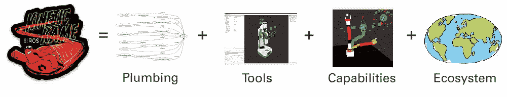
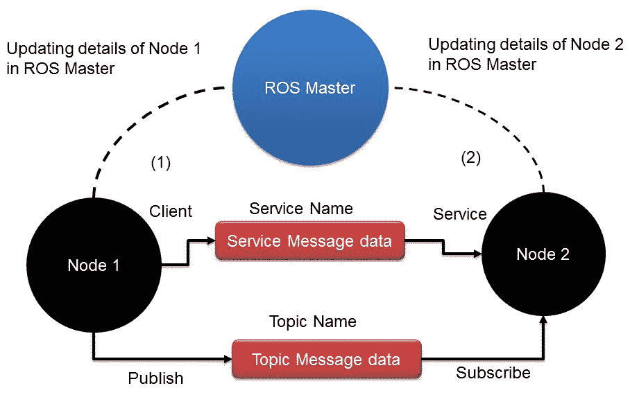
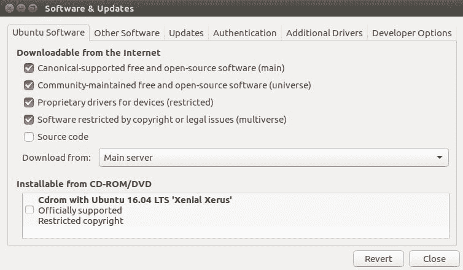
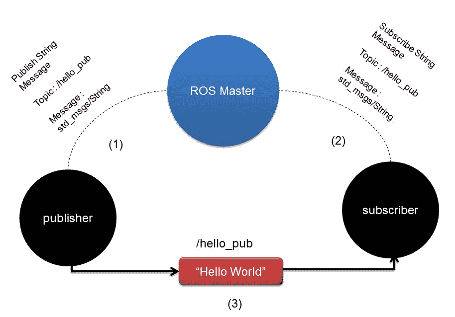

# 机器人操作系统入门

本书的主要目的是教您如何从头开始构建自动移动机器人。 机器人将使用 ROS 进行编程，其操作将使用名为 Gazebo 的模拟器进行模拟。 在接下来的章节中，您还将看到使用 ROS 的机器人的机械设计，电路设计，嵌入式编程和高级软件编程。

在本章中，我们将从 ROS 的基础知识，如何安装 ROS，如何使用 ROS 和 Python 编写基本应用程序以及 Gazebo 的基础知识开始。 本章将成为您自主机器人项目的基础。 如果您已经了解 ROS 的基础知识，并且已经在系统上安装了 ROS，则可以跳过本章。 但是，您仍然可以在后面的章节中浏览有关 ROS 基础的内容。

本章将涵盖以下主题：

*   ROS 介绍
*   在 Ubuntu 16.04.3 上安装 ROS Kinetic
*   Gazebo 的介绍，安装和测试

让我们开始使用 Python 和机器人操作系统（ROS）对机器人进行编程。

# 技术要求

[要获取本章中提到的完整代码，可以克隆以下链接](https://github.com/qboticslabs/learning_robotics_2nd_ed)。

# ROS 介绍

**ROS** 是用于创建机器人应用程序的软件框架。 ROS 框架的主要目的是提供可用于创建功能强大的机器人应用程序的功能，这些功能可重复用于其他机器人。 ROS 拥有软件工具，库和软件包的集合，这使得机器人软件开发变得容易。

ROS 是根据 [BSD](https://opensource.org/licenses/BSD-3-Clause) 许可许可的完整开源项目。 我们可以将其用于研究和商业应用。 即使 ROS 代表机器人操作系统，它也不是真正的操作系统。 相反，它是一个元操作系统，提供了真实操作系统的功能。 ROS 提供的主要功能如下：

*   **消息传递接口**：这是 ROS 的核心功能，它使进程间通信成为可能。 使用此消息传递功能，ROS 程序可以与其链接的系统进行通信并交换数据。 在接下来的章节中，我们将学习有关 ROS 程序/节点之间的数据交换的更多技术术语。
*   **硬件抽象**：ROS 具有一定程度的抽象，使开发人员可以创建与机器人无关的应用程序。 这些类型的应用程序可用于任何机器人。 开发人员只需要担心底层机器人硬件。
*   **程序包管理**：ROS 节点被组织在称为 ROS 程序包的程序包中。 ROS 软件包包括源代码，配置文件，构建文件等。 我们创建软件包，构建软件包并安装该软件包。 ROS 中有一个构建系统，可以帮助构建这些软件包。 ROS 中的软件包管理使 ROS 开发更加系统和有组织。
*   **第三方库集成**：ROS 框架与许多第三方库集成，例如 OpenCV，PCL，OpenNI 等。 这有助于开发人员在 ROS 中创建各种应用程序。
*   **低级设备控制**：使用机器人时，我们可能需要使用低级设备，例如控制 I/O 引脚，通过串行端口发送数据的设备等。 这也可以使用 ROS 完成。
*   **分布式计算**：处理来自机器人传感器的数据所需的计算量非常大。 使用 ROS，我们可以轻松地将计算分配到计算节点的群集中。 这样可以分配计算能力，并使您可以比使用单台计算机更快地处理数据。
*   **代码重用**：ROS 的主要目标是代码重用。 代码重用使世界各地良好的研发社区得以发展。 ROS 可执行文件称为节点。 这些可执行文件可以分组为一个称为 ROS 包的实体。 一组程序包称为元程序包，程序包和元程序包都可以共享和分发。
*   **语言独立性**：可以使用流行的语言（例如 Python，C++ 和 Lisp）对 ROS 框架进行编程。 节点可以用任何语言编写，并且可以通过 ROS 进行通信而没有任何问题。
*   **易于测试**：ROS 有一个内置的单元/集成测试框架，称为 rostest，用于测试 ROS 软件包。
*   **缩放比例**：可以缩放 ROS，以在机器人中执行复杂的计算。
*   **免费和开源**：ROS 的源代码是开放的，并且绝对免费。 ROS 的核心部分已获得 BSD 许可，并可以在商业和封闭源产品中重复使用。

ROS 是管道（消息传递），工具，功能和生态系统的组合。 ROS 中有强大的工具可以调试和可视化机器人数据。 ROS 中具有内置的机器人功能，例如机器人导航，本地化，地图绘制，操纵等。 它们有助于创建功能强大的机器人应用程序。

下图显示了 ROS 方程：



ROS 方程

有关 ROS 的更多信息，请参见[这个页面](http://wiki.ros.org/ROS/Introduction)。

# ROS 概念

ROS 中有三个主要的组织级别：

*   ROS 文件系统
*   ROS 计算图
*   ROS 社区

# ROS 文件系统

ROS 文件系统主要介绍如何在磁盘上组织 ROS 文件。 以下是使用 ROS 文件系统时必须了解的主要术语：

*   **软件包**：ROS 软件包是 ROS 软件框架的独立单元。 ROS 软件包可能包含源代码，第三方库，配置文件等。 ROS 包可以重复使用和共享。
*   **软件包清单**：清单（`package.xml`）文件将包含软件包的所有详细信息，包括名称，描述，许可证，以及更重要的是软件包的依赖性。
*   **消息（`msg`）类型**：消息描述存储在程序包的`msg`文件夹中。 ROS 消息是用于通过 ROS 的消息传递系统发送数据的数据结构。 消息定义存储在扩展名为`.msg`的文件中。
*   **服务（`srv`）类型**：服务描述以`.srv`扩展名存储在`srv`文件夹中。 `srv`文件在 ROS 中定义了服务的请求和响应数据结构。

# ROS 计算图

ROS 计算图是处理数据的 ROS 系统的对等网络。 ROS 计算图的基本功能是节点，ROS 主节点，参数服务器，消息和服务：

*   **节点**：ROS 节点是使用 ROS 功能来处理数据的过程。 节点基本上进行计算。 例如，节点可以处理激光扫描仪数据以检查是否存在任何冲突。 这将在后续部分“在 ROS 客户端库的帮助下编写 ROS 节点”（例如`roscpp`和`rospy`）中进行讨论。
*   **ROS 主机**：ROS 节点可以使用称为 ROS 主机的程序相互连接。 这将为其余的计算图提供名称，注册和查找。 如果不启动主服务器，节点将不会彼此发现并发送消息。
*   **参数服务器**：ROS 参数是静态值，存储在称为参数服务器的全局位置中。 从参数服务器，所有节点都可以访问这些值。 我们甚至可以将参数服务器的范围设置为私有或公共，以便它可以访问一个节点或访问所有节点。
*   **ROS 主题**：ROS 节点使用名为 ROS 主题的命名总线相互通信。 数据以消息的形式流经主题。 通过主题发送消息称为发布，通过主题接收数据称为订阅。
*   **消息**：ROS 消息是一种数据类型，可以由原始数据类型组成，例如整数，浮点数和布尔值。 ROS 消息流经 ROS 主题。 主题一次只能发送/接收一种类型的消息。 我们可以创建自己的消息定义并通过主题发送它。
*   **服务**：我们已经看到使用 ROS 主题的发布/订阅模型是一种非常简单的通信方式。 这种通信方法是一对多的通信方式，这意味着可以由任意数量的节点订阅主题。 在某些情况下，我们可能还需要一种请求/答复类型的交互，通常在分布式系统中使用。 可以使用 ROS 服务来完成这种交互。 ROS 服务与 ROS 主题的工作方式类似，因为它们具有消息类型定义。 使用该消息定义，我们可以将服务请求发送到另一个提供服务的节点。 服务结果将作为答复发送。 该节点必须等待，直到从另一个节点接收到结果。
*   **袋子**：这些是保存和播放 ROS 主题的格式。 ROS 袋子是记录传感器数据和处理后数据的重要工具。 这些包可以稍后用于离线测试我们的算法。

下图显示了主题和服务如何在节点与主服务器之间工作：



ROS 节点与 ROS 主机之间的通信

在上图中，您可以看到两个 ROS 节点以及它们之间的 ROS 主机。 我们必须记住的一件事是，在启动 ROS 中的任何节点之前，您应该启动 ROS 主机。 ROS 主机就像节点之间的中介程序一样，用于交换有关其他 ROS 节点的信息以建立通信。 假设节点 1 要发布消息类型为`abc`的名为`/xyz`的主题。 它将首先接近 ROS 主机，并说`I am going to publish a topic called /xyz with message type abc and share its details`。 当另一个节点（例如节点 2）想要订阅消息类型为`abc`的同一主题`/xyz`时，主节点将共享有关节点 1 的信息，并分配一个端口以直接开始这两个节点之间的通信 与 ROS 主机交流。

ROS 服务以相同的方式工作。 ROS 主机是一种 DNS 服务器，当第二个节点向第一个节点请求主题或服务时，可以共享节点详细信息。 ROS 使用的通信协议是 [TCPROS](http://wiki.ros.org/ROS/TCPROS)，它基本上使用 TCP/IP 套接字进行通信。

# ROS 社区级别

ROS 社区由 ROS 开发人员和研究人员组成，他们可以创建和维护程序包并交换与现有程序包，新发布的程序包以及与 ROS 框架相关的其他新闻的新信息。 ROS 社区提供以下服务：

*   **发行版**：ROS 发行版具有一组特定版本的软件包。 本书中使用的发行版是 ROS Kinetic。 还有其他可用的版本，例如 ROS Lunar 和 Indigo，它们具有可以安装的特定版本。 在每个发行版中维护软件包都比较容易。 在大多数情况下，发行版中的软件包将相对稳定。
*   **存储库**：在线存储库是我们保存软件包的位置。 通常，开发人员会在存储库中保留一组称为元包的类似包。 我们还可以将单个程序包保存在单个存储库中。 我们可以简单地克隆这些存储库并构建或重用这些软件包。
*   **ROS Wiki**：几乎所有 ROS 文档都可以在 ROS Wiki 上找到。 您可以使用 [ROS Wiki](http://wiki.ros.org) 了解 ROS，从最基本的概念到最高级的编程。
*   **邮件列表**：如果要获取有关 ROS 的更新，可以订阅 [ROS 邮件列表](http://lists.ros.org/mailman/listinfo/ros-users) 您还可以从 [ROS Discourse](https://discourse.ros.org) 获取最新的 ROS 新闻。
*   **ROS 回答**：这与 Stack Overflow 网站非常相似。 您可以在[此门户网站](https://answers.ros.org/questions/)中提出与 ROS 相关的问题，并且可能会得到来自世界各地的开发人员的支持。

ROS 中还有许多其他功能。 您可以访问 ROS 官方网站 www.ros.org 以获得更多信息。 现在，我们将继续进行 ROS 的安装过程。

# 在 Ubuntu 上安装 ROS

根据前面的讨论，我们知道 ROS 是安装在主机系统上的元操作系统。 在 Ubuntu/Linux 上以及在 Windows 和 OS X 的试验阶段，都完全支持 ROS。一些最新的 ROS 发行版如下：

| 分配 | 发布日期 |
| ROS Melodic Morenia | 2018 年 5 月 23 日 |
| ROS 月球头 | 2017 年 5 月 23 日 |
| ROS Kinetic Kame | 2016 年 5 月 23 日 |
| ROS 靛蓝冰屋 | 2014 年 7 月 22 日 |

现在，我们将研究 Ubuntu 16.04.3 LTS 上称为 Kinetic 的 ROS 的稳定，长期支持（LTS）发行版的安装过程。 ROS Kinetic Kame 将主要针对 Ubuntu 16.04 LTS。 在查看以下说明后，您还可以在 Ubuntu 18.04 LTS 的最新 LTS Melodic Morenia 中找到设置 ROS 的说明。 如果您是 Windows 或 OS X 用户，则可以先在 VirtualBox 应用程序中安装 Ubuntu，然后再在其上安装 ROS。 下载 VirtualBox 的链接是[这里](https://www.virtualbox.org/wiki/Downloads)。

您可以在[这个页面](http://wiki.ros.org/kinetic/Installation/Ubuntu)找到完整的说明。

步骤如下：

1.  配置您的 Ubuntu 存储库，以允许受限制的，Universe 和多版本的可下载文件。 我们可以使用 Ubuntu 的软件和更新工具对其进行配置。 我们可以通过简单地在 Ubuntu Unity 搜索菜单上进行搜索并勾选以下屏幕快照中的显示来获得此工具：



Ubuntu 的软件和更新工具

2.  设置系统以接受`packages.ros.org`中的 ROS 软件包。 仅 Ubuntu 15.10 和 16.04 支持 ROS Kinetic。 以下命令将`packages.ros.org`存储在 Ubuntu 的`apt`存储库列表中：

```py
    $ sudo sh -c 'echo "deb http://packages.ros.org/ros/ubuntu $(lsb_release -sc) main" > /etc/apt/sources.list.d/ros-latest.list'
```

3.  接下来，我们必须添加`apt-key`。 `apt-key`用于管理 APT 用来验证软件包的密钥列表。 使用这些密钥进行身份验证的软件包将被视为受信任的软件包。 以下命令将为 ROS 软件包添加`apt-key`：

```py
    sudo apt-key adv --keyserver hkp://ha.pool.sks-keyservers.net:80 --recv-key 421C365BD9FF1F717815A3895523BAEEB01FA116  
```

4.  添加`apt-key`后，我们必须更新 Ubuntu 软件包列表。 以下命令将添加和更新 ROS 软件包以及 Ubuntu 软件包：

```py
    $ sudo apt-get update
```

5.  更新 ROS 软件包后，我们可以安装这些软件包。 以下命令将安装所有必需的 ROS 软件包，工具和库：

```py
 $ sudo apt-get install ros-kinetic-desktop-full 
```

6.  即使在桌面完全安装后，我们也可能需要安装其他软件包。 每个附加安装将在相应的部分中提到。 桌面完整安装将需要一些时间。 安装 ROS 之后，您几乎可以完成。 下一步是初始化`rosdep`，这使您可以轻松安装 ROS 源软件包的系统依赖关系：

```py
$ sudo rosdep init 
$ rosdep update 
```

7.  要在当前 bash shell 上访问 ROS 的工具和命令，我们可以将 ROS 环境变量添加到`.bashrc`文件中。 这将在每个 bash 会话开始时执行。 以下是将 ROS 变量添加到`.bashrc`的命令：

```py
    echo "source /opt/ros/kinetic/setup.bash" >> ~/.bashrc   
```

以下命令将在当前 shell 上执行`.bashrc`脚本，以在当前 shell 中生成更改：

```py
    source ~/.bashrc  
```

8.  `rosinstall`是安装软件包依赖项的有用工具。 该工具必须单独安装。 它使您能够通过一个命令轻松下载 ROS 软件包的许多源代码树：

```py
    $ sudo apt-get install python-rosinstall python-rosinstall-generator python-wstool build-essential  
```

最新的 LTS Melodic 的安装与前面的说明类似。 您可以将 Melodic 与 Ubuntu 18.04 LTS 一起安装。 您可以在[这个页面](http://wiki.ros.org/melodic/Installation/Ubuntu)中找到完整的说明。

安装 ROS 之后，我们将讨论如何在 ROS 中创建示例包。 在创建包之前，我们必须创建一个 ROS 工作区。 这些包是在 ROS 工作区中创建的。 我们将使用 catkin 构建系统，该系统是用于在 ROS 中构建软件包的一组工具。 catkin 构建系统从源代码生成可执行文件或共享库。 ROS Kinetic 使用 catkin 构建系统来构建软件包。 让我们看看什么是柳絮。

# 柳絮介绍

**Catkin** 是 ROS 的官方构建系统。 在发布 catkin 之前，ROS 使用 **rosbuild** 系统来构建软件包。 它的替代品是最新 ROS 版本上的柳絮。 Catkin 结合了 CMake 宏和 Python 脚本，以提供与 CMake 相同的正常工作流程。 与 rosbuild 系统相比，Catkin 可提供更好的软件包分发，更好的交叉编译和更好的可移植性。 有关更多信息，请参阅 wiki.ros.org/catkin。

Catkin 工作区是一个文件夹，您可以在其中修改，构建和安装 catkin 软件包。

让我们检查一下如何创建 ROS catkin 工作区。

以下命令将创建一个名为`catkin_ws`的父目录和一个名为`src`的子文件夹：

```py
    $ mkdir -p ~/catkin_ws/src  
```

使用以下命令将目录切换到`src`文件夹。 我们将在`src`文件夹中创建包：

```py
    $ cd ~/catkin_ws/src  
```

使用以下命令初始化 catkin 工作区：

```py
    $ catkin_init_workspace  
```

初始化 catkin 工作区之后，您可以使用以下命令简单地构建包（即使没有源文件）：

```py
    $ cd ~/catkin_ws/
    $ catkin_make  
```

`catkin_make`命令用于在`src`目录中构建软件包。 构建软件包后，我们将在`catkin_ws`中看到`build`和`devel`文件夹。可执行文件存储在`build`文件夹中。 在`devel`文件夹中，有一些外壳脚本文件可将工作空间添加到 ROS 环境中。

# 创建一个 ROS 包

在本节中，我们将研究如何创建一个包含两个 Python 节点的示例包。 其中一个节点用于在名为`/hello_pub`的主题上发布`Hello World`字符串消息，而另一个节点将订阅该主题。

可以使用 ROS 中的`catkin_create_pkg`命令来创建 catkin ROS 程序包。

程序包是在创建工作区期间创建的`src`文件夹中创建的。 在创建软件包之前，使用以下命令切换到`src`文件夹：

```py
    $ cd ~/catkin_ws/src  
```

以下命令将创建具有`std_msgs`依赖项的`hello_world`程序包，其中包含标准消息定义。 `rospy`是 ROS 的 Python 客户端库：

```py
    $ catkin_create_pkg hello_world std_msgs rospy  
```

这是我们成功创建时得到的信息：

```py
    Created file hello_world/package.xml 
    Created file hello_world/CMakeLists.txt 
    Created folder hello_world/src 
    Successfully created files in /home/lentin/catkin_ws/src/hello_world. 
 Please adjust the values in package.xml.  
```

成功创建`hello_world`程序包后，我们需要添加两个 Python 节点或脚本来演示主题的订阅和发布。

首先，使用以下命令在`hello_world`包中创建一个名为`scripts`的文件夹：

```py
    $ mkdir scripts  
```

切换到`scripts`文件夹，创建一个名为`hello_world_publisher.py`的脚本和另一个名为`hello_world_subscriber.py`的脚本，以发布和订阅`hello world`消息。 以下部分介绍了这些脚本或节点的代码和功能：

# Hello_world_publisher.py

`hello_world_publisher.py`节点基本上将名为`hello world`的问候消息发布到名为`/hello_pub`的主题。 问候消息以 10Hz 的速率发布到主题。

这是显示两个 ROS 节点之间的相互作用如何工作的图：



发布者和订阅者节点之间的通信

本书的完整代码可在[这个页面](https://github.com/qboticslabs/learning_robotics_2nd_ed)获得。

有关此代码如何工作的分步说明如下：

1.  如果要编写 ROS Python 节点，则需要导入`rospy`。 它包含与 ROS 主题，服务等交互的 Python API。
2.  要发送`Hello World`消息，我们必须从`std_msgs`包中导入`String`消息数据类型。 `std_msgs`程序包具有标准数据类型的消息定义。 我们可以使用以下代码行导入：

```py
    #!/usr/bin/env python 
    import rospy 
    from std_msgs.msg import String 
```

3.  下面的代码行创建名为`hello_pub`的主题的发布者对象。 消息类型为`String`，`queue_size`值为`10`。 如果订阅者的速度不足以接收数据，我们可以使用`queue_size`选项对其进行缓冲：

```py
    def talker():
        pub = rospy.Publisher('hello_pub', String, queue_size=10)   
```

4.  下面的代码行初始化 ROS 节点。 还将为该节点分配名称。 如果两个节点以相同的节点名称运行，则一个节点将关闭。 如果我们要同时运行两者，请使用匿名`=True`标志，如以下代码所示：

```py
    rospy.init_node('hello_world_publisher', anonymous=True)  
```

5.  下一行创建一个名为`r`的费率对象。 使用`Rate`对象中的`sleep()`方法，我们可以以所需的速率更新循环。 在这里，我们给比率为`10`的值：

```py
    r = rospy.Rate(10) # 10hz   
```

6.  以下循环将检查`rospy`是否构造了`rospy.is_shutdown()`标志。 然后，它执行循环。 如果单击`Ctrl + C`，则此循环将退出。

在循环内部，终端世界上将打印一个`hello world`消息，并以 10Hz 的速率发布在`hello_pub`主题上：

```py
    while not rospy.is_shutdown():  
        str = "hello world %s"%rospy.get_time()  
        rospy.loginfo(str)  
        pub.publish(str)  
        r.sleep() 
```

7.  以下代码具有 Python `__main__`检查并调用`talker()`函数。 该代码将继续执行`talker()`，并在按`Ctrl + C`时关闭该节点：

```py
if __name__ == '__main__':  
    try:  
        talker()  
    except rospy.ROSInterruptException: pass 
```

发布主题后，我们将了解如何订阅它。 下一节介绍了订阅`hello_pub`主题所需的代码。

# Hello_world_subscriber.py

订户代码如下：

```py
#!/usr/bin/env python 
import rospy 
from std_msgs.msg import String 
```

以下代码是当消息到达`hello_pub`主题时执行的回调函数。 `data`变量包含来自主题的消息，它将使用`rospy.loginfo()`打印：

```py
def callback(data): 
    rospy.loginfo(rospy.get_caller_id()+"I heard %s",data.data) 

```

以下步骤将以`hello_world_subscriber`名称启动节点并开始订阅`/hello_pub`主题：

1.  消息的数据类型为`String`，当消息到达此主题时，将调用一种称为回调的方法：

```py
    def listener(): 
       rospy.init_node('hello_world_subscriber', 
          anonymous=True) 
       rospy.Subscriber("hello_pub", String, callback) 
```

2.  以下代码将阻止您的节点退出，直到该节点关闭：

```py
       rospy.spin() 
```

3.  以下是 Python 代码的主要部分。 主要部分将调用`listener()`方法，该方法将订阅`/hello_pub`主题：

```py
if __name__ == '__main__': 
    listener() 
```

4.  保存两个 Python 节点后，您需要使用`chmod`命令将权限更改为可执行文件：

```py
    chmod +x hello_world_publisher.py
    chmod +x hello_world_subscriber.py
```

5.  更改文件许可权后，使用`catkin_make`命令构建软件包：

```py
    cd ~/catkin_ws
    catkin_make
```

6.  以下命令将当前 ROS 工作空间路径添加到所有终端中，以便我们可以访问此工作空间内的 ROS 软件包：

```py
    echo "source ~/catkin_ws/devel/setup.bash" >> ~/.bashrc
    source ~/.bashrc  
```

以下是订阅服务器和发布服务器节点的输出：


你好世界节点的输出

1.  首先，我们需要在启动节点之前运行`roscore`。 需要`roscore`命令或 ROS 主节点才能在节点之间进行通信。 因此，第一个命令如下：

```py
    $ roscore
```

2.  执行`roscore`之后，使用以下命令运行每个节点：

```py
    $ rosrun hello_world hello_world_publisher.py  
```

```py
    $ rosrun hello_world hello_world_subscriber.py  
```

我们已经介绍了 ROS 的一些基础知识。 现在，我们将了解什么是 Gazebo，以及如何使用 ROS 与 Gazebo 一起工作。

# Gazebo 介绍

**Gazebo**是一个免费的开源机器人模拟器，我们可以在其中测试自己的算法，设计机器人并在不同的模拟环境中测试机器人。 Gazebo 可以在室内和室外环境中准确，高效地模拟复杂的机器人。 Gazebo 是使用物理引擎构建的，通过它我们可以创建高质量的图形和渲染。

Gazebo 的功能如下：

*   **动态仿真**：Gazebo 可以使用诸如[**开放式动力学引擎**（**ODE**）](http://opende.sourceforge.net/)，[Bullet](http://bulletphysics.org/wordpress/)，[Simbody](https://simtk.org/home/simbody/) 和 [DART](http://dartsim.github.io/) 之类的物理引擎来模拟机器人的动力学。。
*   **高级 3D 图形**：Gazebo 使用 [OGRE 框架](http://www.ogre3d.org/)提供了高质量的渲染，照明，阴影和纹理。
*   **传感器支持**：Gazebo 支持多种传感器，包括激光测距仪，Kinect 型传感器，2D/3D 摄像机等。 我们还可以使用它来模拟噪声以测试音频传感器。
*   **插件**：我们可以为机器人，传感器和环境控件开发自定义插件。 插件可以访问 Gazebo 的 API。
*   **机器人模型**：Gazebo 为流行的机器人提供模型，例如 PR2，Pioneer 2 DX，iRobot Create 和 TurtleBot。 我们还可以构建机器人的自定义模型。
*   **TCP/IP 传输**：我们可以通过基于套接字的消息传递服务在远程计算机和 Gazebo 接口上运行模拟。
*   **云模拟**：我们可以使用 [CloudSim 框架](http://cloudsim.io/)在云服务器上运行模拟。
*   **命令行工具**：广泛的命令行工具用于检查和记录模拟。

# 安装 Gazebo

Gazebo 可以与 ROS 一起安装为独立应用程序或集成应用程序。 在本章中，我们将结合使用 Gazebo 和 ROS 来模拟机器人的行为并使用 ROS 框架来测试我们编写的代码。

如果您想亲自尝试最新的 Gazebo 模拟器，则可以按照[这个页面](http://gazebosim.org/download)中给出的步骤进行操作。

要使用 Gazebo 和 ROS，我们不需要单独安装它们，因为 Gazebo 随附了 ROS 桌面完整安装。

将 Gazebo 与 ROS 集成在一起的 ROS 软件包称为`gazebo_ros_pkgs`。 独立的 Gazebo 周围有包装纸。 该软件包提供了使用 ROS 消息服务在 Gazebo 中模拟机器人的必要接口。

可以使用以下命令将完整的`gazebo_ros_pkgs`安装在 ROS Indigo 中：

```py
    $ sudo apt-get install ros-kinetic-gazebo-ros-pkgs ros-kinetic-
   ros-control  
```

# 使用 ROS 接口测试 Gazebo

假设 ROS 环境已正确设置，我们可以在启动 Gazebo 之前使用以下命令启动`roscore`：

```py
    $ roscore  
```

以下命令将使用 ROS 运行 Gazebo：

```py
    $ rosrun gazebo_ros gazebo  
```

Gazebo 运行两个可执行文件-Gazebo 服务器和 Gazebo 客户端。 Gazebo 服务器将执行模拟过程，而 Gazebo 客户端可以是 Gazebo GUI。 使用前面的命令，Gazebo 客户端和服务器将并行运行。

Gazebo GUI 显示在以下屏幕截图中：


Gazebo 模拟器

启动 Gazebo 之后，将生成以下主题：

```py
$ rostopic list  
/gazebo/link_states  
/gazebo/model_states  
/gazebo/parameter_descriptions  
/gazebo/parameter_updates  
/gazebo/set_link_state  
/gazebo/set_model_state  
```

我们可以使用以下命令分别运行服务器和客户端：

*   使用以下命令运行 Gazebo 服务器：

```py
    $ rosrun gazebo_ros gzserver  
```

*   使用以下命令运行 Gazebo 客户端：

```py
    $ rosrun gazebo_ros gzclient  
```

# 概括

本章是对机器人操作系统的介绍。 本章的主要目的是概述 ROS，ROS 的功能，如何安装，ROS 的基本概念以及如何使用 Python 对其进行编程。 同时，我们研究了一种名为 Gazebo 的机器人模拟器，该模拟器可以与 ROS 一起使用。 我们已经看到了如何安装和运行 Gazebo。 在下一章中，我们将介绍差动驱动机器人的基本概念。

# 问题

1.  ROS 的重要特征是什么？
2.  ROS 中概念的不同层次是什么？
3.  什么是 ROS catkin 构建系统？
4.  什么是 ROS 主题和消息？
5.  ROS 计算图有哪些不同的概念？
6.  ROS 主机的主要功能是什么？
7.  Gazebo 的重要特征是什么？