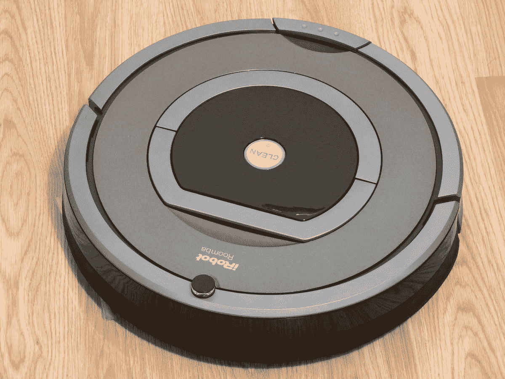
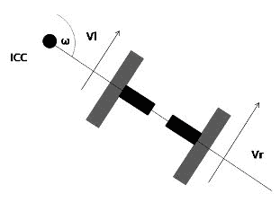
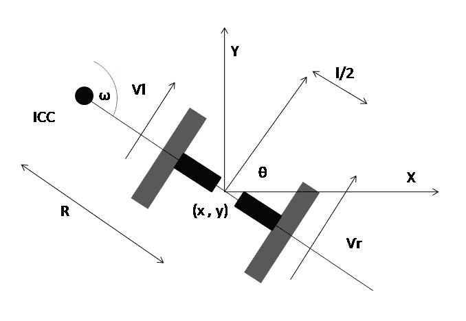
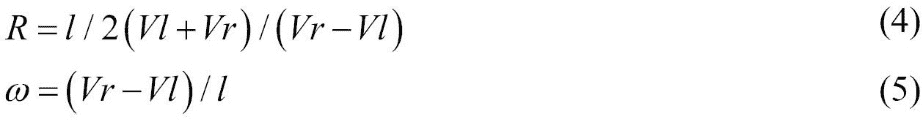
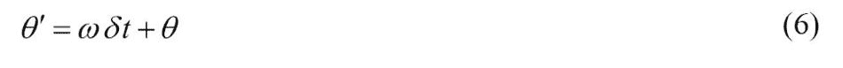
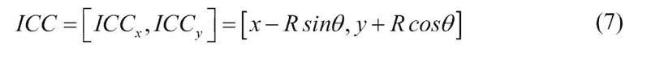
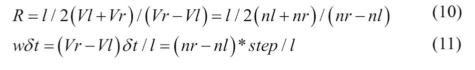
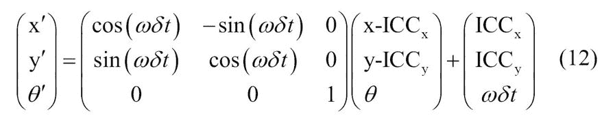
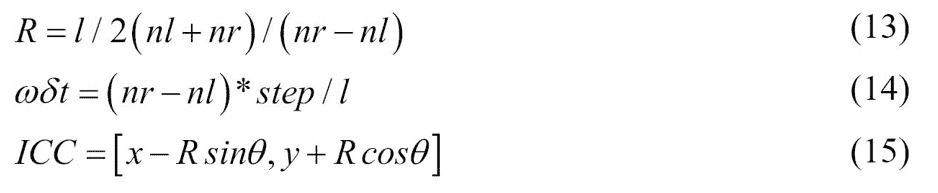

# 了解差动机器人的基础

在上一章中，我们讨论了 ROS 的基础知识，如何安装它以及 Gazebo 机器人模拟器的基础知识。 正如我们已经提到的，我们将从头开始创建一个自动轮式机器人。 我们将要设计的机器人是差动驱动机器人，该机器人涉及在机器人底盘的相对两侧具有两个轮子，从而可以通过更改两个轮子中每个轮子的速度来调整机器人的方向。

在对机器人进行编程之前，最好先了解差动轮机器人背后的基本思想和术语。 本章将为您提供有关如何数学分析机器人以及如何求解机器人运动学方程的想法。 运动方程可帮助您根据传感器数据预测机器人的位置。

在本章中，我们将介绍以下主题：

*   差动驱动机器人的数学建模
*   差动驱动机器人的正向运动学
*   差动驱动机器人的逆运动学

# 机器人的数学建模

移动机器人的重要组成部分是其转向系统。 这将帮助机器人导航其环境。 差速驱动系统是最简单，最具成本效益的转向系统之一。 差动驱动机器人由两个安装在同一轴上的主轴组成，并由单独的电动机控制。 差动驱动系统/转向系统是非完整系统，这意味着它对改变机器人的姿势有限制。

汽车是非完整系统的一个例子，因为它不能不改变姿势就不能改变位置。 让我们看看这种类型的机器人是如何工作的，以及如何根据其数学模型对它进行建模。

# 差动驱动系统和机器人运动学简介

**机器人运动学**是对运动数学的研究，没有考虑影响运动的力。 它主要处理控制系统的几何关系。 **机器人动力学**是对机器人运动的研究，其中模拟了机器人运动中涉及的所有力。

移动机器人或车辆具有六个**自由度**（**DOF**），这些自由度由姿势（x，y，z，侧倾，俯仰和偏航）表示。 这些自由度包括位置（x，y，z）和姿态（侧倾，俯仰和偏航）。 **横滚**表示横向旋转，**俯仰**表示向前和向后旋转，**偏航**（称为航向或方向）表示机器人移动的方向 在 xy 平面上。 差动驱动机器人在水平面上从 x 移到 y，因此 2D 姿态主要包含 x，y 和θ，其中θ是指向机器人向前方向的机器人航向。 此信息足以描述差分机器人姿态：

全局坐标系中机器人在 x，y 和θ中的姿态

在差动驱动机器人中，可以通过调节左侧和右侧的两个独立控制的电动机（分别称为 V-left 和 V-right）的速度来控制运动。 下图显示了市场上几个流行的差动驱动机器人：

机器人 [Roomba](https://en.wikipedia.org/wiki/IRobot)

Roomba 系列自动吸尘器是 iRobot 最受欢迎的差动机器人。

[先锋 3-DX](http://robots.ros.org/pioneer-3-dx/)

Pioneer 3-DX 是欧姆龙 Adept 移动机器人公司流行的差速驱动研究平台。

# 差动机器人的正向运动学

具有差动驱动系统的机器人的正向运动学方程用于解决以下问题：

如果机器人在时间 *t* 站立在 *x* ， *y* ，*θ*的位置，请确定姿势（ *给定控制参数 *V-左*和*，在 *t +δt*处 x'*， *y'*，*θ'*） V 右*。

该技术可以由机器人计算以遵循特定的轨迹。

# 正向运动学方程的解释

我们可以从制定正向运动学解决方案开始。 下图是机器人的一个轮子的图示：

机器人的单个轮子沿局部 y 轴旋转

围绕 **y 轴**的运动称为滚动； 其他的一切都称为单据。 假设在这种情况下不会发生打滑。 车轮完成一整圈时，它的距离为*2πr* ，其中 *r* 是车轮的半径。 我们将假设运动是二维的。 这意味着表面平坦且平坦。

当机器人要执行转弯运动时，机器人必须绕着沿其共同的左右车轮轴的点旋转。 机器人旋转的点称为 **ICC** **-瞬时曲率中心**。 ICC 位于机器人外部。 下图显示了差动驱动机器人相对于其 ICC 的车轮配置：

差动驱动机器人的车轮配置

运动方程的推导的中心概念是机器人的*ω*角速度。 机器人上的每个车轮都沿一个圆的圆周围绕 ICC 旋转，车轮半径为 *r* 。

车轮速度为 *v = 2πr / T，*，其中 *T* 是完成 ICC 整圈的时间。 *ω*角速度定义为 *2π/ T* ，通常具有每秒的弧度（或度）单位。 结合 *v* 和 *w* 的等式，得出*ω= 2π/ T* ，我们可以得出以下结论：

线速度方程

下图显示了差动驱动系统的详细模型：

差动驱动系统的详细图

如果将前面的方程式应用到两个车轮，结果将是相同的，即*ω*：

差动驱动轮方程

在此， *R* 是 ICC 与轮轴中点之间的距离， *l* 是轮轴长度。 在求解*ω*和 *R* 之后，我们得到以下结果：

用于找到从 ICC 到机器人中心的距离以及机器人角速度的方程式

前面的等式对于解决正向运动学问题很有用。 假设机器人以*ω*的角速度移动*δt*秒。 这将导致机器人的方向或航向更改为以下内容：

寻找方向变化的方程式

在这里，ICC 旋转的中心由基本三角函数给出，如下所示：

找到 ICC 的方程式

围绕 ICC 旋转机器人ωδt 度

给定起始位置（ *x* ， *y* ），可以使用 2D 计算新位置（ *x'*， *y'*）。 旋转矩阵。 以*δt*秒的角速度*ω*围绕 ICC 旋转在 *t +δt*时产生以下位置：

用于计算机器人新位置的方程式

给定*ω，可以根据公式（6）和（8）计算新姿势（ *x'*， *y'*和*θ'*）。* ，*δt*和 *R* 。

*ω*可以根据式（5）算出。 *Vr* 和 *V1* 通常更难准确测量。 代替测量速度，可以使用称为**车轮编码器**的传感器来测量每个车轮的旋转。 来自车轮编码器的数据是机器人的**里程表**值。 这些传感器安装在车轮轴上，并针对车轮旋转的每个角度（每个角度约为 0.1 毫米）传递二进制信号。 在*第 6 章，执行器和传感器与机器人控制器*的接口连接中，我们将详细介绍车轮编码器的工作原理。 这些信号被馈送到计数器，使得*vδt 为*从时间 *t* 到 *t +δt*的距离。 我们可以编写以下内容：

*n *步长=vδt*

由此，我们可以计算出 *v* ：

根据编码器数据计算线速度的方程式

如果将方程式（9）插入方程式（3）和（4），我们将得到以下结果：

根据编码器值计算 R 的公式

在此，***nl*** 和 ***nr*** 是左轮和右轮的编码器计数。 ***Vl*** 和 ***Vr*** 分别是左轮和右轮的速度。 因此，机器人站立姿势（ *x* ， *y* ，*θ*）并移动 ***nl*** 和 ***nr*** 在*δt*的时间范围内计数； 新姿势（ *x'*， *y'*，*θ'*）通过以下公式得出：

根据编码器值计算机器人位置的方程式

在哪里，

根据编码器值计算 ICC 和其他参数的公式

得出的运动方程主要取决于机器人的设计和几何形状。 不同的设计可能导致不同的方程式。

# 逆运动学

前向运动学方程在给定的车轮速度下提供了更新的姿态。 现在我们可以考虑反问题了。

在时间 *t* 站立姿势（ *x* ， *y* ，*θ*）并确定 *V-left* 和 *V 右*控制参数，以使 *t +δt*时的姿态为（ *x'*， *y'*和*θ '*）。

在差动驱动系统中，这个问题可能并不总是可以解决的，因为仅通过设置车轮速度就无法将这种机器人移动到任何姿势。 这是由于非完整机器人的限制。

在非完整机器人中，如果我们允许一系列不同的运动（ *V-向左*， *V-向右*）运动，则有一些方法可以增加约束运动性。 如果插入方程（12）和（15）中的值，我们可以确定一些可以编程的特殊运动：

*   如果 *V-右= V-左* = > *nr = nl* = > *R =∞*，*ωδT= 0* = >，则表示机器人沿直线运动，*θ*保持不变
*   如果 *V-右= -V-左* = > *nr = -nl* = > *R = 0* ，*ωδt= 2nl * step / l* 和 = > *x'= x* ， *y'= y* ，*θ'=θ+ωδt* = >，这意味着机器人会绕着 ICC 旋转，即*θ*均可到达，而[ *x* ， *y* ）保持不变

结合这些操作，可以使用以下步骤从起始姿势达到任何目标姿势：

1.  旋转直到机器人的方向与从起始位置到目标位置的直线重合 *V-right = -V-left = V-rot* 。
2.  直行直到机器人的位置与目标位置一致 *V-右= V-左= V 向前*。
3.  旋转直到机器人的方向与目标方向一致 *V-right = -V-left = V-rot* 。 在此，可以任意选择 *V-rot* 和 *V-ahead* 。

在接下来的章节中，我们将看到如何使用 ROS 来实现机器人的运动学方程。

# 概括

本章介绍了差动驱动机器人的基本概念，并探讨了如何推导此类机器人的运动学方程。 在本章的开头，我们了解了差动驱动机器人的基础知识，然后讨论了在这些机器人中使用的正向运动学方程。 这些方程式用图表解释。 在查看了正向运动学方程后，我们研究了差动驱动机器人的逆向运动学方程。 我们还研究了逆运动学方程的基础。

在下一章中，我们将看到如何使用 ROS 和 Gazebo 创建自动移动机器人的仿真。

# 问题

1.  什么是完整和非完整配置？
2.  什么是机器人运动学和动力学？
3.  差动驱动机器人的 ICC 是多少？
4.  差分机器人中的正向运动方程是什么？
5.  差分机器人中的逆运动学方程是什么？

# 更多信息

有关运动学方程式的更多信息，请参见[这个页面](http://www8.cs.umu.se/~thomash/reports/KinematicsEquationsForDifferentialDriveAndArticulatedSteeringUMINF-11.19.pdf)。