# 使用 ROS 模拟差动机器人

在上一章中，我们研究了如何建模 Chefbot。 在本章中，我们将学习如何使用 ROS 中的 Gazebo 模拟器来模拟机器人。 我们将学习如何创建 Chefbot 的仿真模型，并在 Gazebo 中创建类似于酒店的环境来测试我们的应用，该应用被编程为自动向客户交付食物。 我们将查看每个步骤的详细说明，以测试我们的应用。 以下是我们将在本章中介绍的重要主题：

*   Gazebo 模拟器入门
*   使用 TurtleBot 2 模拟
*   模拟 Chefbot
*   用于仿真的 URDF 标签和插件
*   同步定位和映射入门
*   在 Gazebo 环境中实现 SLAM
*   使用 SLAM 创建地图
*   自适应蒙特卡洛定位入门
*   在 Gazebo 环境中实现 AMCL
*   使用 Gazebo 在酒店内自动导航 Chefbot

# 技术要求

要测试本章中的应用和代码，您需要安装了 ROS Kinetic 的 Ubuntu 16.04 LTS PC /笔记本电脑。

# Gazebo 模拟器入门

在第一章中，我们研究了 Gazebo 仿真器的基本概念及其安装过程。 在本章中，我们将了解有关 Gazebo 的用法以及如何在 Gazebo 模拟器中模拟差动机器人的更多信息。 第一步是了解 GUI 界面及其各种控件。 正如我们在第一章中所讨论的，Gazebo 有两个主要部分。 第一个是 Gazebo 服务器，第二个是 Gazebo 客户端。 仿真是在充当后端的 Gazebo 服务器上完成的。 GUI 是前端，它充当 Gazebo 客户端。 我们还将介绍 Rviz（ROS 可视化工具），它是 ROS 中的 GUI 工具，用于可视化来自机器人硬件或模拟器（如 Gazebo）的各种机器人传感器数据。

我们可以使用 Gazebo 作为独立的模拟器来模拟机器人，也可以使用具有 ROS 和 Python 的接口，这些接口可用于在 Gazebo 模拟器中对机器人进行编程。 如果我们将 Gazebo 用作独立模拟器，则模拟机器人的默认选项是编写[基于 C++ 的插件](http://gazebosim.org/tutorials/?tut=plugins_hello_world)。 我们可以编写 C++ 插件来模拟机器人的行为，创建新的传感器，创建新的世界，等等。 默认情况下，使用 [SDF](http://sdformat.org/) 文件完成对 Gazebo 中机器人和环境的建模。 如果我们为 Gazebo 使用 ROS 接口，则必须创建一个 URDF 文件，其中包含机器人的所有参数，并具有特定于 Gazebo 的标签来提及机器人的仿真属性。 当我们使用 URDF 启动仿真时，它将使用某些工具转换为 SDF 文件，并在 Gazebo 中显示机器人。 Gazebo 的 ROS 接口称为 gazebo-ros-pkgs。 它是一组包装程序和插件，它们能够在 Gazebo 中对传感器，机器人控制器和其他模拟进行建模并通过 ROS 主题进行通信。 在本章中，我们将主要关注用于模拟 Chefbot 的 ROS-Gazebo 接口。 ROS-Gazebo 接口的优点是我们可以通过使用 ROS 框架对机器人进行编程。 我们可以使用 ROS 等常用的编程语言（例如 C++ 和 Python）对机器人进行编程。

如果您对使用 ROS 不感兴趣，并且想使用 Python 编程机器人，则应签出一个名为 [pygazebo 的接口](https://github.com/jpieper/pygazebo)。 它是 Gazebo 的 Python 绑定。 在下一节中，我们将看到 Gazebo 的 GUI 及其一些重要控件。

# Gazebo 的图形用户界面

我们可以通过几种方式启动 Gazebo。 您已经在第 1 章，“机器人操作系统入门”中看到了这一点。 在本章中，我们使用以下命令启动一个空白世界，这意味着没有机器人，也没有环境：

```py
$ roslaunch gazebo_ros empty_world.launch 
```

前面的命令将启动 Gazebo 服务器和客户端，并将一个空白世界加载到 Gazebo 中。 这是 Gazebo 里空虚的世界的景象：


Gazebo 用户界面

Gazebo 用户界面可分为三个部分：**场景**，**左面板**和**右面板**。

# 场景

场景是模拟机器人的地方。 我们可以向场景中添加各种对象，并且可以使用鼠标和键盘与场景中的机器人进行交互。

# 左面板

当我们启动 Gazebo 时，您会看到左侧面板。 左面板中有三个主要选项卡：

*   **世界**：**世界**选项卡包含当前 Gazebo 场景中的模型列表。 在这里，我们可以修改模型参数（例如姿势），也可以更改相机的姿势。
*   **插入**：**插入**选项卡允许您向场景添加新的仿真模型。 这些模型在本地系统和远程服务器中均可用。 `/home/<user_name>/.gazebo/model`文件夹会将本地模型文件和模型保存在[这个页面](http://gazebosim.org/models)中的远程服务器中，如以下屏幕快照所示：

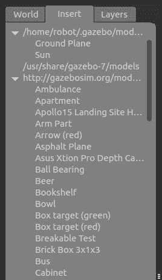

Gazebo 左侧面板中的“插入”标签

您可以在前面的屏幕快照中显示的**插入**标签中看到本地文件和远程文件。

首次启动 Gazebo 时，或者从远程服务器启动具有模型的世界时，您可能会在 Gazebo 上看到黑屏或在终端上看到警告。 这是因为正在下载远程服务器中的模型，并且 Gazebo 必须等待一段时间。 等待时间会根据您的互联网连接速度而变化。 下载模型后，它将保存在本地模型文件夹中，因此下次不会有任何延迟。

*   **图层**：大多数时候，我们不会使用此选项卡。 此选项卡用于组织模拟中可用的不同可视化。 我们可以通过切换各层来隐藏/取消隐藏仿真中的模型。 在仿真中，大多数时候此选项卡将为空。

# 右面板

默认情况下，“右侧”面板是隐藏的。 我们必须拖动它才能查看它。 该面板使我们能够与模型的移动部分进行交互。 如果在场景中选择模型，则可以看到模型的关节。

# Gazebo 工具栏

Gazebo 有两个工具栏。 一个在场景之上，另一个在场景之下。

# 顶部工具栏

顶部工具栏对于与 Gazebo 场景进行交互非常有用。 该工具栏主要用于操纵 Gazebo 场景。 它具有选择模型，缩放，平移和旋转以及向场景添加新形状的功能：


Gazebo 上层工具栏

以下列表为您显示了每个选项的详细说明：

*   **选择模式**：如果处于“选择模式”，则可以在场景中选择模型并设置其属性，以及在场景内导航。
*   **平移模式**：在平移模式中，我们可以选择模型并通过单击向左按钮来平移​​模型。
*   **旋转模式**：在旋转模式下，我们可以选择模型并更改其方向。
*   **缩放模式**：在“缩放模式”中，我们可以选择模型并进行缩放。
*   **撤消/重做**：这使我们能够撤消或重做场景中的动作。
*   **简单形状**：使用此选项，我们可以将原始形状插入场景，例如圆柱体，立方体或球体。
*   **灯光**：“灯光”选项使我们能够将不同种类的光源添加到场景中。
*   **复制/粘贴**：“复制和粘贴”选项使我们能够复制和粘贴场景的不同模型和部分。
*   **对齐**：这使我们能够彼此对齐模型。
*   **捕捉**：捕捉一个模型并将其移入场景。
*   **更改视图**：这将更改场景的视图。 它主要使用透视图和正交视图。
*   **屏幕截图**：这是当前场景的屏幕截图。
*   **记录日志**：这将保存 Gazebo 的日志。

# 底部工具栏

底部的工具栏主要为我们提供了有关模拟的想法。 它显示“仿真时间”，它是指仿真器中经过的时间。 模拟会加快或减慢速度。 这取决于当前仿真所需的计算。

实时显示是指模拟器运行时在现实生活中经过的实际时间。 **实时因子**（**RTF**）是模拟时间与实时速度之间的比率。 如果 RTF 为 1，则表示仿真以与实际时间相同的速率进行。

Gazebo 的世界状态可以随着每次迭代而改变。 每次迭代都可以在 Gazebo 中进行固定时间的更改。 该固定时间称为步长。 默认情况下，步长为 1 毫秒。 步长和迭代显示在工具栏中，如以下屏幕截图所示：


Gazebo 的下部工具栏

我们可以暂停仿真，并使用**步骤**按钮查看每个步骤。

您可以从[这个页面](http://gazebosim.org/tutorials?cat=guided_b&tut=guided_b2)获取有关 Gazebo GUI 的更多信息。

在进入下一部分之前，您可以使用 Gazebo，并详细了解其工作方式。

# 使用 TurtleBot 2 模拟

与 Gazebo 合作之后，现在该在其上进行仿真并与一些机器人一起工作了。 可用于教育和研究的最受欢迎的机器人之一是 TurtleBot。 TurtleBot 软件是在 ROS 框架内开发的，并且在 Gazebo 中可以很好地模拟其操作。 TurtleBot 的流行版本是 TurtleBot 2 和 3。我们将在本节中学习 TurtleBot 2，因为我们 Chefchebot 的开发受到其设计的启发。

在 Ubuntu 16.04 中安装 TurtleBot 2 仿真包非常简单。 您可以使用以下命令为 Gazebo 安装 TurtleBot 2 仿真包：

```py
    $ sudo apt-get install ros-kinetic-turtlebot-gazebo  
```

安装包后，我们可以开始运行仿真。 `turtlebot_gazebo`包中有几个启动文件，它们具有不同的世界文件。 Gazebo 世界文件（`*.world`）是一个 SDF 文件，由环境中模型的属性组成。 当世界文件更改时，Gazebo 将在其他环境中加载。

以下命令将启动一个具有一组特定组件的世界：

```py
    $ roslaunch turtlebot_gazebo turtlebot_world.launch  
```

加载模拟将花费一些时间，并且在加载时，您会在 Gazebo 场景中看到以下模型：


Gazebo 中的 TurtleBot 2 模拟

当我们在 Gazebo 中加载仿真时，它还将加载必要的插件以与 ROS 交互。 TurtleBot 2 具有以下重要组件：

*   带有差动驱动器的移动底座
*   用于创建地图的深度传感器
*   可检测碰撞的保险杠开关

当模拟加载时，它将加载 ROS-Gazebo 插件以模拟差动驱动器移动基座，深度传感器（Kinect 或 Astra）以及保险杠开关的插件。 因此，在加载模拟后，如果我们在终端中输入`$ rostopic list`命令，则会出现一个主题选择，如以下屏幕截图所示。

如前所述，我们可以从差动驱动器插件，深度传感器和保险杠开关中看到主题。 除此之外，我们还可以从 ROS-Gazebo 插件中看到主题，这些主题主要包含机器人的当前状态以及仿真中的其他模型。

Kinect/Astra 传感器可以提供 RGB 图像和深度图像。 差分驱动器插件可以在`/odom`（`nav_msgs/Odometry`）主题中发送机器人的里程表数据，并可以在`/tf`（`tf2_msgs/TFMessage`）主题中发布机器人的变换，如以下屏幕快照所示：


TurtleBot 2 模拟中的 ROS 主题

我们可以在 Rviz 中可视化机器人模型和传感器数据。 有一个专门用于可视化的 TurtleBot 包。 您可以安装以下包以可视化机器人数据：

```py
    $ sudo apt-get install ros-kinetic-turtlebot-rviz-launchers  
```

安装此包后，我们可以使用以下启动文件来可视化机器人及其传感器数据：

```py
    $ roslaunch turtlebot-rviz-launchers view_robot.launch  
```

我们将获得以下 Rviz 窗口，其中显示了机器人模型。 然后，我们可以使传感器显示器可视化此特定数据，如以下屏幕截图所示：

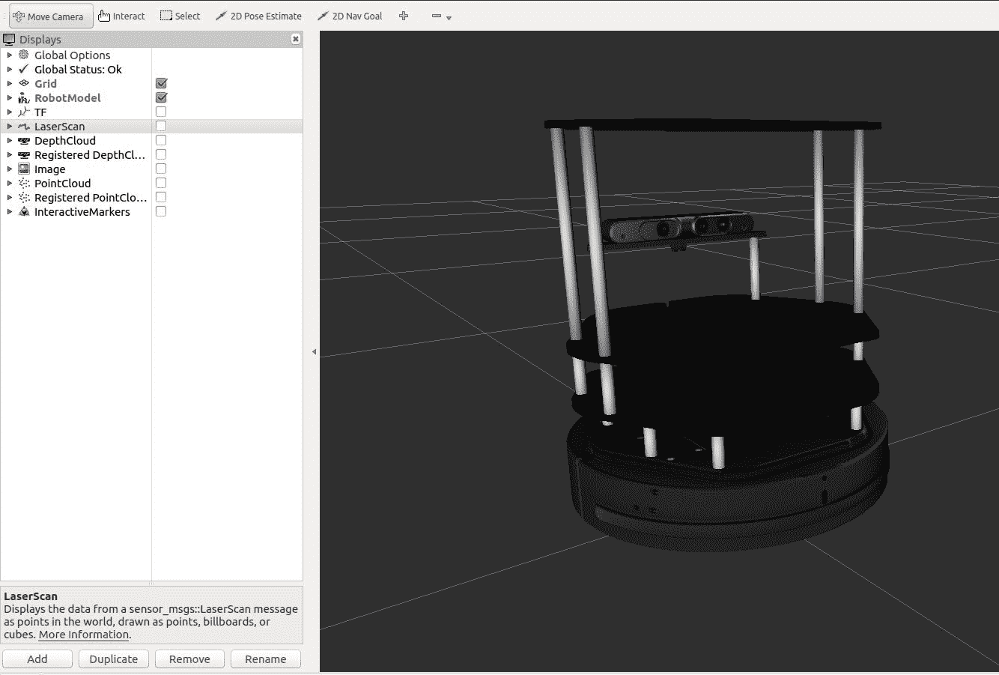

Rviz 中的 TurtleBot 2 可视化

在下一节中，我们将学习如何移动该机器人。

# 移动机器人

机器人的差分驱动器插件能够接收 ROS 扭曲消息（`geometry_msgs/Twist`），该消息包括机器人当前的线速度和角速度。 机器人的遥控意味着通过操纵杆或键盘使用 ROS Twist 消息手动移动机器人。 现在，我们将研究如何使用键盘遥控操作移动 Turtlebot 2 机器人。

我们必须安装一个包才能遥控 TurtleBot 2 机器人。 以下命令将安装 TurtleBot 远程操作包：

```py
    $ sudo apt-get install ros-kinetic-turtlebot-teleop  
```

要启动远程操作，我们必须先启动 Gazebo 仿真器，然后使用以下命令启动远程操作节点：

```py
    $ roslaunch turtlebot_teleop keyboard_teleop.launch 

```

在终端中，我们可以看到用于移动机器人的按键组合。 您可以使用这些键移动它，然后您将看到机器人在 Gazebo 和 Rviz 中移动，如以下屏幕截图所示：


TurtleBot 2 键盘遥控

当我们按下键盘上的按钮时，它将向扭转驱动器控制器发送 Twist 消息，并且该控制器将在模拟中移动机器人。 Teleop 节点发送一个名为`/cmd_vel_mux/input/teleop`（`geometry_msgs/Twist`）的主题，如下图所示：

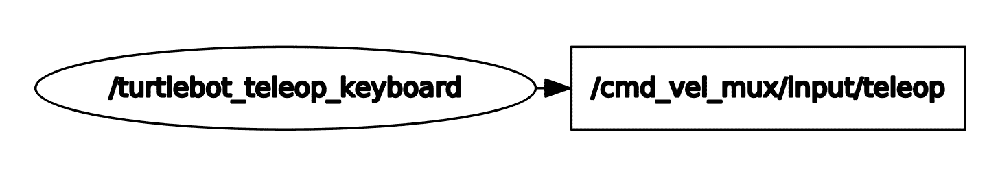

TurtleBot 键盘遥操作节点

# 模拟 Chefbot

我们已经看到了乌龟机器人模拟的工作方式。 在本节中，我们将研究如何使用 Gazebo 创建我们自己的机器人仿真。

在我们开始讨论这个主题之前，您应该将`chefbot_gazebo`包复制到您的 catkin 工作区，然后输入`catkin_make`来构建该包。 确保工作区中有两个包，一个称为`chefbot_description`，另一个称为`chefbot_gazebo`。 `chefbot_gazebo`包包含与仿真相关的启动文件和参数，`chefbot_description`包含机器人的 URDF 模型及其仿真参数，以及用于在 Rviz 和 Gazebo 中查看机器人的启动文件。

让我们开始在 Gazebo 中创建 Chefbot 模型，以便您熟悉该过程。 之后，我们将深入研究 xacro 文件并查看模拟参数。

以下启动文件将显示一个空白世界的 Gazebo 机器人模型，并启动该机器人的所有 Gazebo 插件：

```py
    $ roslaunch chefbot_description view_robot_gazebo.launch  
```

下图显示了 Gazebo 内 Chefbot 的屏幕截图：

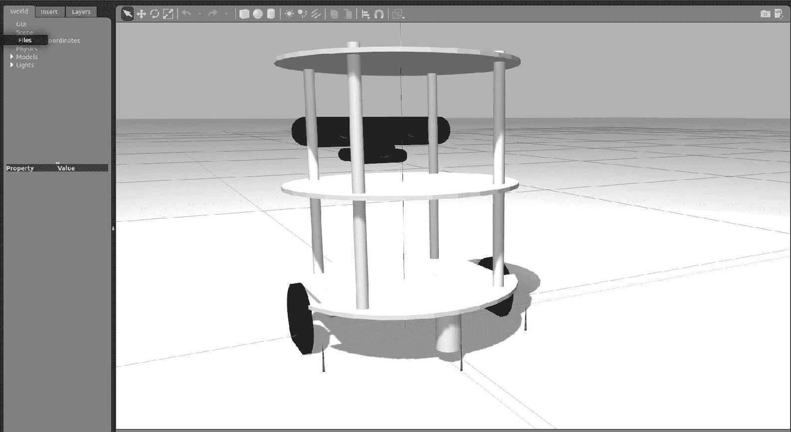

Gazebo 的厨师机器人

让我们看看如何在 Gazebo 中添加 URDF 机器人模型。 您可以在`chefbot_description/launch/view_robot_gazebo.launch`找到 URDF 机械手模型的定义。

代码的第一部分调用`upload_model.launch`文件以创​​建`robot_description`参数。 如果成功，那么它将在 Gazebo 开始一个空的世界：

```py
<launch> 
  <include file="$(find chefbot_description)/launch/upload_model.launch" /> 

  <include file="$(find gazebo_ros)/launch/empty_world.launch"> 
    <arg name="paused" value="false"/> 
    <arg name="use_sim_time" value="true"/> 
    <arg name="gui" value="true"/> 
    <arg name="recording" value="false"/> 
    <arg name="debug" value="false"/> 
  </include> 
```

那么`robot_description`参数中的机器人模型如何在 Gazebo 中显示？ 启动文件中的以下代码片段完成了该工作：

```py
  <node name="spawn_urdf" pkg="gazebo_ros" type="spawn_model" args="-param robot_description -urdf -z 0.1 -model chefbot" /> 
```

`gazebo_ros`包中名为`spawn_model`的节点将读取`robot_description`并在 Gazebo 中生成模型。 `-z 0.1`参数指示要放置在 Gazebo 中的模型的高度。 如果高度为 0.1，则将以 0.1 的高度生成模型。 如果启用了重力，则模型将跌落至地面。 我们可以根据需要更改此参数。 `-model`参数是 Gazebo 中机器人模型的名称。 该节点将解析`robot_description`中的所有 Gazebo 参数，并在 Gazebo 中开始仿真。

生成模型后，我们可以使用以下代码行发布机器人变换（TF）：

```py
  <node pkg="robot_state_publisher" type="robot_state_publisher" name="robot_state_publisher"> 
    <param name="publish_frequency" type="double" value="30.0" /> 
  </node> 
```

我们正在发布 30Hz 的 ROS TF。

# 深度图像到激光扫描的转换

机器人上的深度传感器可提供环境的 3D 坐标。 为了实现自主导航，我们可以使用这些数据来创建 3D 地图。 有多种创建环境图的技术。 我们用于此机器人的一种算法称为 [gmapping](http://wiki.ros.org/gmapping)。 映射算法主要使用激光扫描来创建地图，但在本例中，我们从传感器获得了整个 3D 点云。 我们可以通过切片深度数据来转换激光扫描的 3D 深度数据。 此启动文件中的以下 [nodelet](http://wiki.ros.org/nodelet) 能够接收深度数据并将其转换为激光扫描数据：

```py
  <node pkg="nodelet" type="nodelet" name="laserscan_nodelet_manager" args="manager"/> 
  <node pkg="nodelet" type="nodelet" name="depthimage_to_laserscan" 
        args="load depthimage_to_laserscan/DepthImageToLaserScanNodelet laserscan_nodelet_manager"> 
    <param name="scan_height" value="10"/> 
    <param name="output_frame_id" value="/camera_depth_frame"/> 
    <param name="range_min" value="0.45"/> 
    <remap from="image" to="/camera/depth/image_raw"/> 
    <remap from="scan" to="/scan"/> 
  </node> 
</launch> 
```

Nodelet 是一种特殊的 ROS 节点，具有称为零拷贝传输的属性，这意味着它不需要网络带宽即可订阅主题。 这将使从深度图像（`sensor_msgs/Image`）到激光扫描（`sensor_msgs/LaserScan`）的转换更快，更有效。 Nodelet 的其他属性之一是它可以作为插件动态加载。 我们可以设置此 Nodelet 的各种属性，例如`range_min`，图像主题的名称和输出激光主题。

# Gazebo 模拟的 URDF 标签和插件

我们已经在 Gazebo 看到了模拟机器人。 现在，我们将更详细地介绍 URDF 中与仿真相关的标签以及 URDF 模型中包含的各种插件。

Gazebo 的大多数特定标签位于`chefbot_description/gazebo/chefbot.gazebo.xacro`文件中。 此外，`chefbot_description/urdf/chefbot.xacro`中的某些标签也用于仿真中。 在`Chefbot.xacro`中定义`<collision>`和`<inertial>`标签对于我们的仿真非常重要。 URDF 中的`<collision>`标签定义了机器人链接周围的边界，该边界主要用于检测该特定链接的碰撞，而`<inertial>`标签则包含了链接的质量和惯性矩。 这是`<inertial>`标签定义的示例：

```py
      <inertial> 
        <mass value="0.564" /> 
        <origin xyz="0 0 0" /> 
        <inertia ixx="0.003881243" ixy="0.0" ixz="0.0" 
                 iyy="0.000498940" iyz="0.0" 
                 izz="0.003879257" /> 
      </inertial> 
```

这些参数是机器人动力学的一部分，因此在仿真中，这些值将对机器人模型产生影响。 同样，在仿真中，它将处理所有链接和接头及其属性。

接下来，我们将查看`gazebo/chefbot.gazebo.xacro`文件中的标签。 我们正在使用的重要的特定于 Gazebo 的标签是`<gazebo>`，用于定义机器人中元素的仿真属性。 我们可以定义一个适用于所有链接的属性，也可以定义一个特定于链接的属性。 这是 xacro 文件中的代码片段，用于定义链接的摩擦系数：

```py
     <gazebo reference="chefbot_wheel_left_link"> 
       <mu1>1.0</mu1> 
       <mu2>1.0</mu2> 
       <kp>1000000.0</kp> 
       <kd>100.0</kd> 
       <minDepth>0.001</minDepth> 
       <maxVel>1.0</maxVel> 

     </gazebo>  
```

`reference`属性用于指定机械手中的链接。 因此，前述属性仅适用于`chefbot_wheel_left_link`。

以下代码段显示了如何设置机械手链接的颜色。 我们可以创建自定义颜色，定义自定义颜色或使用 Gazebo 中的默认颜色。 您可以看到，对于`base_link`，我们使用的是 Gazebo 默认属性中的`Gazebo/White`颜色：

```py
   <material name="blue"> 
       <color rgba="0 0 0.8 1"/> 
   </material> 

   <gazebo reference="base_link"> 
     <material>Gazebo/White</material> 
   </gazebo> 
```

请参阅[这个页面](http://gazebosim.org/tutorials/?tut=ros_urdf)以查看模拟中使用的所有标签。

涵盖了模拟的主要标签。 现在，我们将看一下在此模拟中使用的 Gazebo-ROS 插件。

# 悬崖传感器插件

悬崖传感器是一组检测悬崖的红外传感器，有助于避免踩踏并防止机器人跌落。 这是 Turtlebot 2 移动基地中的一种传感器，称为 [Kobuki](http://kobuki.yujinrobot.com/)。 我们在 Turtlebot 2 仿真中使用了这个插件。

我们可以设置传感器的参数，例如红外光束的最小和最大角度，分辨率以及每秒的采样数。 我们还可以限制传感器的检测范围。 我们的仿真模型中有三个悬崖传感器，如以下代码所示：

```py
     <gazebo reference="cliff_sensor_front_link"> 
       <sensor type="ray" name="cliff_sensor_front"> 
         <always_on>true</always_on> 
         <update_rate>50</update_rate> 
         <visualize>true</visualize> 
         <ray> 
           <scan> 
             <horizontal> 
               <samples>50</samples> 
               <resolution>1.0</resolution> 
               <min_angle>-0.0436</min_angle>  <!-- -2.5 degree --> 
               <max_angle>0.0436</max_angle> <!-- 2.5 degree --> 
             </horizontal> 

           </scan> 
           <range> 
             <min>0.01</min> 
             <max>0.15</max> 
             <resolution>1.0</resolution> 
           </range> 
         </ray> 
       </sensor> 
     </gazebo> 
```

# 接触式传感器插件

这是我们机器人上的接触式传感器的代码段。 如果机器人的底部与任何对象碰撞，则此插件将触发。 它通常附着在机器人的`base_link`上，因此，只要保险杠碰到任何物体，就会触发该传感器：

```py
     <gazebo reference="base_link"> 
       <mu1>0.3</mu1> 
       <mu2>0.3</mu2> 
       <sensor type="contact" name="bumpers"> 
         <always_on>1</always_on> 
         <update_rate>50.0</update_rate> 
         <visualize>true</visualize> 
         <contact> 
           <collision>base_footprint_collision_base_link</collision> 
         </contact> 
       </sensor> 
     </gazebo> 
```

# 陀螺仪插件

陀螺仪插件用于测量机器人的角速度。 使用角速度，我们可以计算机器人的方向。 机器人的方向在机器人驱动控制器中用于计算机器人的姿势，如以下代码所示：

```py
     <gazebo reference="gyro_link"> 
      <sensor type="imu" name="imu"> 
        <always_on>true</always_on> 
        <update_rate>50</update_rate> 
        <visualize>false</visualize> 
        <imu> 
          <noise> 
            <type>gaussian</type> 
             <rate> 
               <mean>0.0</mean> 
               <stddev>${0.0014*0.0014}</stddev> <!-- 0.25 x 0.25 (deg/s) --> 
               <bias_mean>0.0</bias_mean> 
               <bias_stddev>0.0</bias_stddev> 
             </rate> 
                  <accel> <!-- not used in the plugin and real robot, hence using tutorial values --> 
                         <mean>0.0</mean> 
                         <stddev>1.7e-2</stddev> 
                         <bias_mean>0.1</bias_mean> 
                         <bias_stddev>0.001</bias_stddev> 
                  </accel> 
          </noise> 
         </imu> 
                 </sensor> 
     </gazebo> 
```

# 差分驱动器插件

差分驱动器插件是仿真中最重要的插件。 该插件可模拟机器人中的差分驱动器行为。 当它以 ROS Twist 消息（`geometry_msgs/Twist`）的形式接收命令速度（线速度和角速度）时，它将移动机器人模型。 该插件还计算机器人的里程表，从而给出机器人的本地位置，如以下代码所示：

```py
  <gazebo> 
       <plugin name="kobuki_controller" filename="libgazebo_ros_kobuki.so"> 
         <publish_tf>1</publish_tf> 

         <left_wheel_joint_name>wheel_left_joint</left_wheel_joint_name> 
         <right_wheel_joint_name>wheel_right_joint</right_wheel_joint_name> 
         <wheel_separation>.30</wheel_separation> 
         <wheel_diameter>0.09</wheel_diameter> 
         <torque>18.0</torque> 
         <velocity_command_timeout>0.6</velocity_command_timeout> 
         <cliff_detection_threshold>0.04</cliff_detection_threshold> 
         <cliff_sensor_left_name>cliff_sensor_left</cliff_sensor_left_name> 
         <cliff_sensor_center_name>cliff_sensor_front</cliff_sensor_center_name> 
         <cliff_sensor_right_name>cliff_sensor_right</cliff_sensor_right_name> 
         <cliff_detection_threshold>0.04</cliff_detection_threshold> 
         <bumper_name>bumpers</bumper_name> 

          <imu_name>imu</imu_name> 
       </plugin> 
     </gazebo> 
```

要计算机器人的里程表，我们必须提供机器人的参数，例如车轮之间的距离，车轮直径和电动机的扭矩。 根据我们的设计，车轮间距为 30cm，车轮直径为 9cm，扭矩为 18N。如果要发布机器人的变形，可以将`publish_tf`设置为 1。 插件是相应插件的参数。 如您所见，它接收来自接触传感器，IMU 和悬崖传感器的所有输入。

`libgazebo_ros_kobuki.so`插件与 Turtlebot 2 仿真包一起安装。 我们在机器人中使用了相同的插件。 在运行此仿真之前，我们必须确保在您的系统上安装了 Turtlebot 2 仿真。

# 深度相机插件

深度相机插件可模拟深度相机的特征，例如 Kinect 或 Astra。 插件名称为`libgazebo_ros_openni_kinect.so`，它可以帮助我们模拟具有不同特征的各种深度传感器。 插件显示在以下代码中：

```py
     <plugin name="kinect_camera_controller" filename="libgazebo_ros_openni_kinect.so"> 
          <cameraName>camera</cameraName> 
          <alwaysOn>true</alwaysOn> 
          <updateRate>10</updateRate> 
          <imageTopicName>rgb/image_raw</imageTopicName> 
          <depthImageTopicName>depth/image_raw</depthImageTopicName> 
          <pointCloudTopicName>depth/points</pointCloudTopicName> 
          <cameraInfoTopicName>rgb/camera_info</cameraInfoTopicName> 
          <depthImageCameraInfoTopicName>depth/camera_info</depthImageCameraInfoTopicName> 
          <frameName>camera_depth_optical_frame</frameName> 
          <baseline>0.1</baseline> 
          <distortion_k1>0.0</distortion_k1> 
          <distortion_k2>0.0</distortion_k2> 
          <distortion_k3>0.0</distortion_k3> 
          <distortion_t1>0.0</distortion_t1> 
          <distortion_t2>0.0</distortion_t2> 
          <pointCloudCutoff>0.4</pointCloudCutoff> 
        </plugin> 
```

插件的发布者，RGB 图像，深度图像和点云数据。 我们可以在插件中设置相机矩阵，以及自定义其他参数。

您可以参考[这个页面](http://gazebosim.org/tutorials?tut=ros_depth_camera&cat=connect_ros)，以了解有关 Gazebo 中深度相机插件的更多信息。

# 可视化机器人传感器数据

在本节中，我们将学习如何可视化来自模拟机器人的传感器数据。 在`chefbot_gazebo`包中，有启动文件，用于在空旷的环境或类似酒店的环境中启动机器人。 可以使用 Gazebo 本身构建自定义环境。 只需使用原始网格物体创建环境并保存为`*. world`文件即可，该文件可以作为启动文件中`gazebo_ros`节点的输入。 要在 Gazebo 中启动酒店环境，可以使用以下命令：

```py
    $ roslaunch chefbot_gazebo chefbot_hotel_world.launch      
```

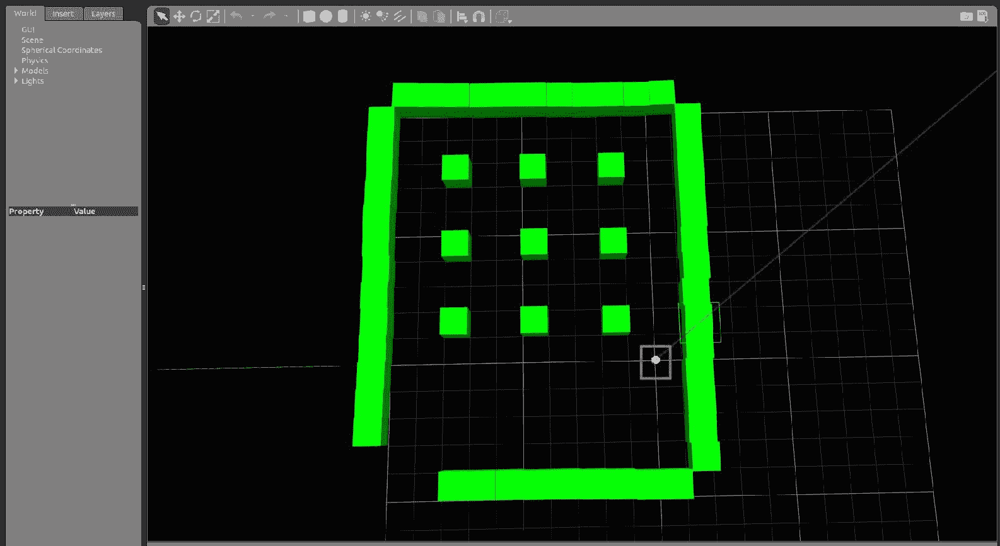

酒店环境中 Gazebo 的 Chefbot

空间中的九个多维数据集代表九个表。 机器人可以导航到任何桌子以运送食物。 我们将学习如何执行此操作，但是在此之前，我们将学习如何从机器人模型中可视化各种传感器数据。

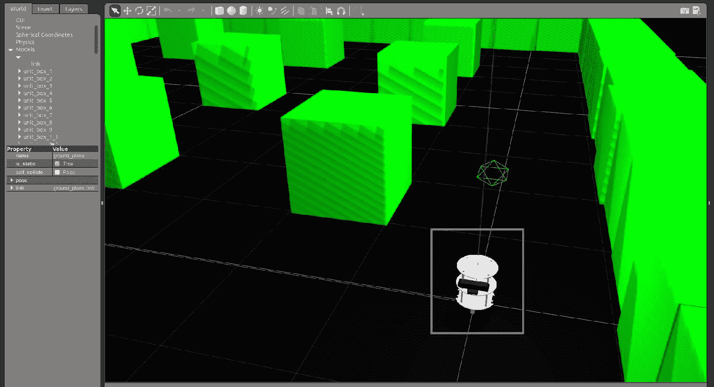

酒店环境中 Gazebo 的 Chefbot

以下命令将启动 Rviz，该 Rviz 显示来自机器人的传感器数据：

```py
    $ roslaunch chefbot_description view_robot.launch  
```

这将生成传感器数据的可视化效果，如以下屏幕截图所示：

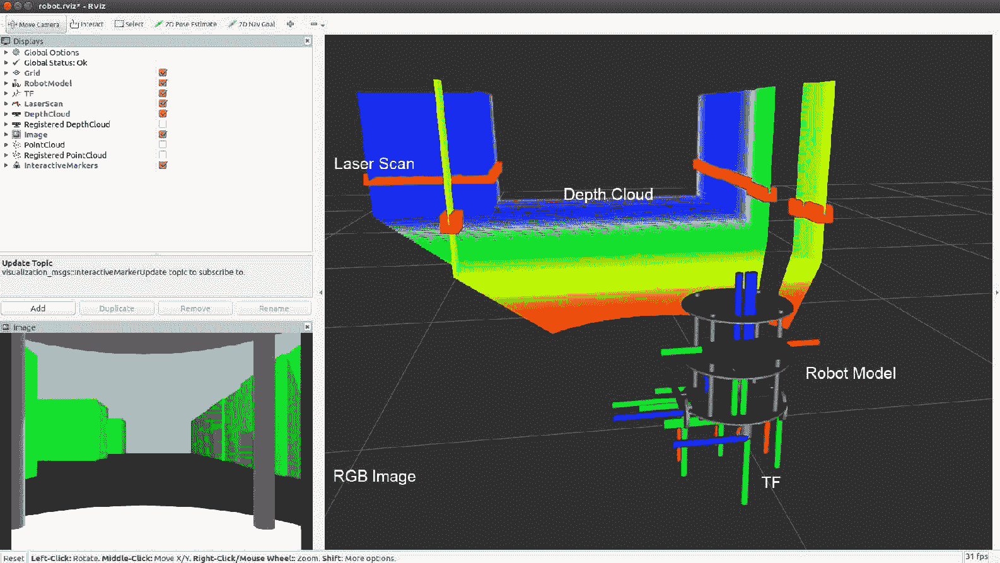

Rviz 中的 Chefbot 的传感器可视化

我们可以启用 Rviz 显示类型来查看不同类型的传感器数据。 在上图中，您可以看到深度云，激光扫描，TF，机器人模型和 RGB 摄像机图像。

# 同步定位和映射入门

Chefbot 的要求之一是，它应该能够自动导航环境并运送食物。 为了达到这个要求，我们必须使用几种算法，例如 SLAM（同时定位和映射）和 AMCL（自适应蒙特卡洛定位）。 解决自治导航问题有多种方法。 在本书中，我们主要坚持使用这些算法。 SLAM 算法用于在将机器人定位在同一张地图上的同时映射环境。 这似乎是个鸡与蛋的问题，但是现在有不同的算法可以解决它。 AMCL 算法用于在现有地图中定位机器人。 我们在本书中使用的算法称为 [Gmapping](http://www.openslam.org/gmapping.html)，该算法实现了 [Fast SLAM 2.0](http://robots.stanford.edu/papers/Montemerlo03a.html)。 标准映射库包装在称为 ROS [Gmapping](http://wiki.ros.org/gmapping) 的 ROS 包中，可在我们的应用中使用。

SLAM 节点的想法是，当我们在环境中移动机器人时，它将使用激光扫描数据和里程计数据创建环境地图。

有关更多详细信息，请参见[这个页面](http://wiki.ros.org/gmapping)上的 ROS Gmapping Wiki 页面。

# 在 Gazebo 环境中实现 SLAM

在本节中，我们将学习如何实现 SLAM 并将其应用于我们构建的仿真。 您可以在`chefbot_gazebo/launch/gmapping_demo.launch`和`launch/includes/ gmapping.launch.xml`检查代码。 基本上，我们使用来自 Gmapping 包的节点，并使用适当的参数对其进行配置。 `gmapping.launch.xml`代码片段具有此节点的完整定义。 以下是此节点的代码片段：

```py
<launch>  
 <arg name="scan_topic" default="scan" /> 

  <node pkg="gmapping" type="slam_gmapping" name="slam_gmapping" output="screen"> 
    <param name="base_frame" value="base_footprint"/> 
    <param name="odom_frame" value="odom"/> 
    <param name="map_update_interval" value="5.0"/> 
    <param name="maxUrange" value="6.0"/> 
    <param name="maxRange" value="8.0"/> 
```

我们正在使用的节点的名称为`slam_gmapping`，而包的名称为`gmapping`。 我们必须为此节点提供一些参数，可以在 Gmapping Wiki 页面中找到。

# 使用 SLAM 创建地图

在本节中，我们将学习如何使用 SLAM 创建环境地图。 但是，首先，我们必须使用几个命令来开始映射。 您应该在每个 Linux 终端中执行每个命令。

首先，我们必须使用以下命令开始仿真：

```py
    $ roslaunch chefbot_gazebo chefbot_hotel_world.launch  
```

接下来，我们必须在新终端中启动键盘遥操作节点。 这将帮助我们使用键盘手动移动机器人：

```py
    $ roslaunch chefbot_gazebo keyboard_teleop.launch  
```

下一条命令在新终端中启动 SLAM：

```py
    $ roslaunch chefbot_gazebo gmapping_demo.launch  
```

现在将开始映射。 为了可视化映射过程，我们可以在**导航**设置的帮助下启动 Rviz：

```py
    $ roslaunch chefbot_description view_navigation.launch  
```

现在，我们可以看到在 Rviz 中创建的地图，如以下屏幕截图所示：

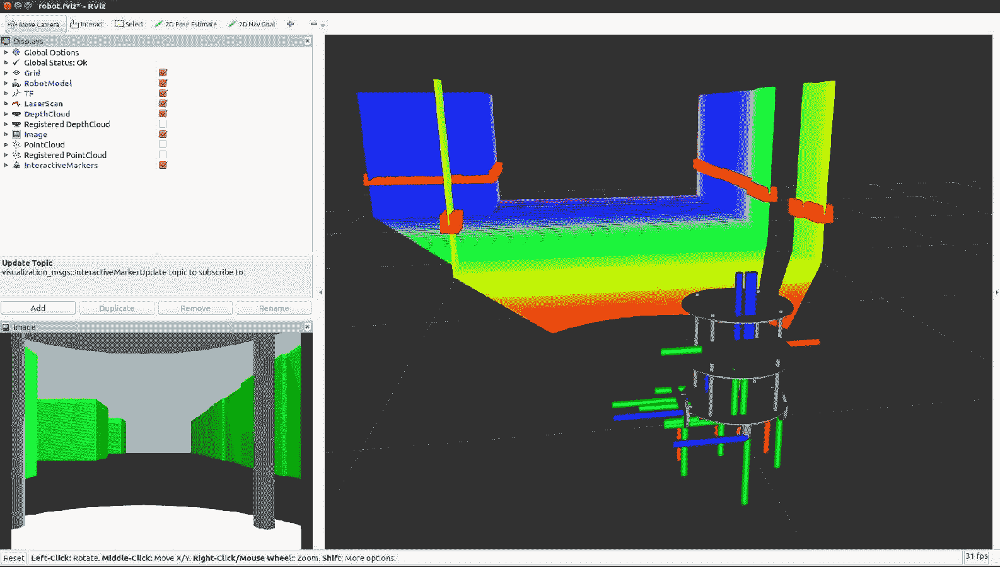

使用 Gmapping 在 Rviz 中创建地图。

现在我们可以使用 Teleop 节点移动机器人，您可以看到在 Rviz 中正在创建地图。 为了创建良好的环境图，您必须缓慢移动机器人，并且经常必须旋转机器人。 当我们在环境中移动机器人并构建地图时，可以使用以下命令保存当前地图：

```py
    $ rosrun map_server map_saver -f ~/Desktop/hotel  
```

该地图将另存为`*.pgm`和`*.yaml`，其中`pgm`文件是地图，`yaml`文件是地图的配置。 您可以在桌面上查看已保存的地图。

在环境中移动机器人之后，您可能会得到一张完整的地图，例如以下屏幕快照所示：


使用映射的最终地图。

可以随时保存地图，但是请确保机器人覆盖了环境的整个区域并绘制了其所有空间，如前面的屏幕快照所示。 一旦确定地图已完全构建，请再次输入`map_saver`命令并关闭端子。 如果您无法映射环境，则可以从`chefbot_gazebo/maps/hotel`检查现有的地图。

# 自适应蒙特卡洛定位入门

我们已经成功建立了环境地图。 现在，我们必须从当前机器人位置自主导航到目标位置。 开始自主导航之前的第一步是在当前地图中定位机器人。 我们用于在地图上定位的算法称为 AMCL。 AMCL 使用粒子过滤器来跟踪机器人相对于地图的位置。 我们正在使用 ROS 包在[我们的机器人](http://wiki.ros.org/amcl)中实现 AMCL。 与 Gmapping 相似，`amcl`包内部有许多要为`amcl`节点配置的参数。 您可以在 ROS Wiki 页面本身上找到 AMCL 的所有参数。

那么如何为机器人启动 AMCL？ 为此，有一个启动文件，该文件位于`chefbot_gazebo/amcl_demo.launch`和`chefbot_gazebo/includes/amcl.launch.xml`中。

我们可以看到`amcl_demo.launch`的定义。 以下代码显示了此启动文件的定义：

```py
<launch> 
  <!-- Map server --> 
  <arg name="map_file" default="$(find chefbot_gazebo)/maps/hotel.yaml"/> 

  <node name="map_server" pkg="map_server" type="map_server" args="$(arg map_file)" /> 
```

此启动文件中的第一个节点从`map_server`包中启动`map_server`。 `map_server`节点加载我们已经保存的静态地图，并将其发布到名为`map`（`nav_msgs/OccupancyGrid`）的主题中。 我们可以将映射文件作为`amcl_demo.launch`文件的参数提及，如果有映射文件，则`map_server`节点将加载该文件。 否则，它将加载位于`chefbot_gazeob/maps/hotel.yaml`文件中的默认地图。

加载地图后，我们启动`amcl`节点并移动基础节点。 AMCL 节点有助于将机器人定位在 ROS 导航栈内的当前`map`和`move_base`节点上，这有助于将机器人从起点导航到目标位置。 在接下来的章节中，我们将详细了解`move_base`节点。 `move_base`节点也需要配置参数。 参数文件保存在`chefbot_gazebo/param`文件夹中，如以下代码所示：

```py
  <!-- Localization --> 
  <arg name="initial_pose_x" default="0.0"/> 
  <arg name="initial_pose_y" default="0.0"/> 
  <arg name="initial_pose_a" default="0.0"/> 
  <include file="$(find chefbot_gazebo)/launch/includes/amcl.launch.xml"> 
    <arg name="initial_pose_x" value="$(arg initial_pose_x)"/> 
    <arg name="initial_pose_y" value="$(arg initial_pose_y)"/> 
    <arg name="initial_pose_a" value="$(arg initial_pose_a)"/> 
  </include> 

  <!-- Move base --> 
  <include file="$(find chefbot_gazebo)/launch/includes/move_base.launch.xml"/> 
</launch> 

```

您可以通过[以下链接](http://wiki.ros.org/navigation/Tutorials/RobotSetup)进一步了解 ROS 导航栈。

# 在 Gazebo 环境中实现 AMCL

在本节中，我们将学习如何在 Chefbot 中实现 AMCL。 我们将使用以下过程将 AMCL 合并到模拟中。 每个命令应在每个终端中执行。

第一个命令启动 Gazebo 模拟器：

```py
    $ roslaunch chefbot_gazebo chefbot_hotel_world.launch  
```

现在，无论是否带有映射文件，我们都可以启动 AMCL 启动文件。 如果要使用已构建的自定义映射，请使用以下命令：

```py
    $ roslaunch chefbot_gazebo amcl_demo.launch map_file:=/home/<your_user_name>/Desktop/hotel  
```

如果要使用默认地图，则可以使用以下命令：

```py
    $ roslaunch chefbot_gazebo amcl_demo.launch  
```

启动 AMCL 之后，我们可以启动 Rviz 以可视化地图和机器人。 我们将在 Rviz 中看到一个视图，如以下屏幕快照所示。 您可以看到地图和被绿色粒子包围的机器人。 绿色粒子称为`amcl`粒子。 它们指示机器人位置的不确定性。 如果机器人周围有更多的粒子，则意味着机器人位置的不确定性更高。 当它开始移动时，粒子数将减少并且其位置将更加确定。 如果机器人无法定位地图的位置，则可以使用 Rviz 中的 **2D 姿态估计**按钮（在工具栏上）来手动设置机器人在地图上的初始位置。 您可以在以下屏幕截图中看到该按钮：

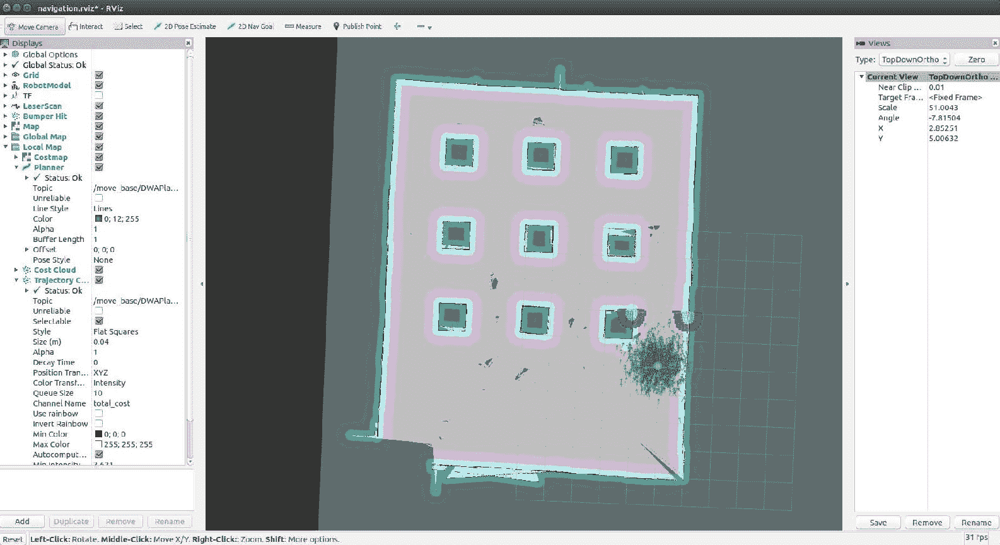

在酒店地图上启动 AMCL。

如果放大到 Rviz 中机器人的位置，则可以看到粒子，如前面的屏幕快照所示。 我们还可以通过不同的颜色看到机器人周围的障碍物：

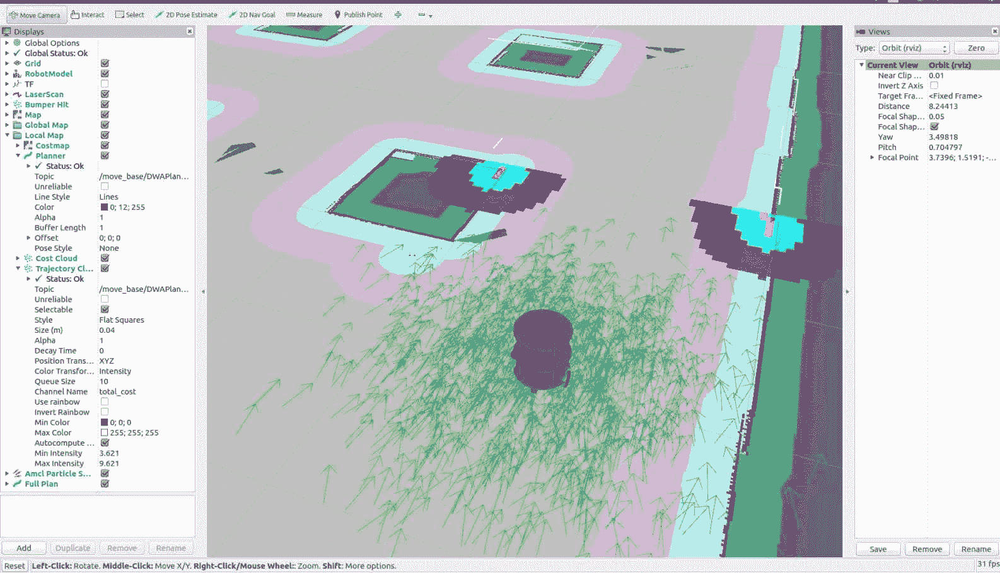

机器人周围的 AMCL 云。

在下一部分中，我们将学习如何对 Chefbot 进行编程以自动导航该地图。 您无需关闭当前端子； 我们可以在 Rviz 本身中自主导航机器人。

# 使用 Gazebo 在酒店内自动驾驶 Chefbot

要开始机器人的自主导航，我们只需要在地图上命令机器人的目标位置即可。 Rviz 中有一个名为 2D Nav Goal 的按钮。 我们可以单击该按钮，然后单击地图上的一个点。 现在，您可以看到一个指示机器人位置的箭头。 在地图上指定目标位置时，可以看到机器人正在规划从其当前位置到目标位置的路径。 它将从当前位置缓慢移动到目标位置，避开所有障碍物。 以下屏幕快照显示了机器人的路径规划和导航到目标位置。 机器人周围的彩色网格显示了机器人的本地成本图，本地计划程序路径以及机器人周围的障碍物：

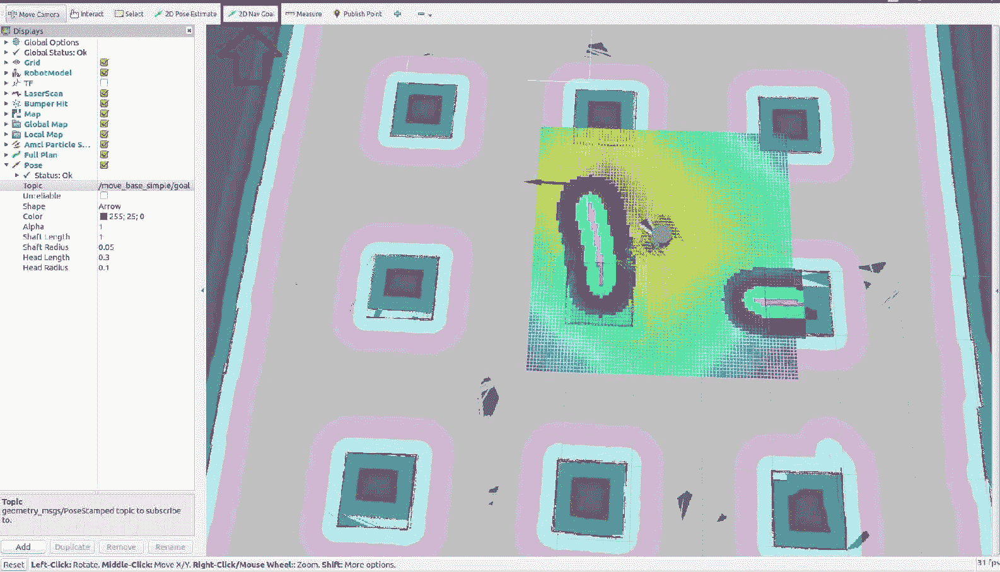

机器人的自主导航。

这样，如果我们在地图内命令一个位置更靠近桌子，则机器人可以转到该桌子并提供食物，然后返回其原始位置。 不用从 Rviz 命令它，我们可以编写一个 ROS 节点来做同样的事情。 这将在本书的最后几章中进行解释。

# 总结

在本章中，我们学习了如何模拟自己的名为 Chefbot 的机器人。 我们在上一章中介绍了 Chefbot 的设计。 我们通过学习 Gazebo 仿真器及其不同的特性和功能来开始本章。 之后，我们研究了如何使用 ROS 框架和 Gazebo 仿真器执行机器人仿真。 我们安装了 TurtleBot 2 包，并在 Gazebo 中测试了 Turtlebot 2 仿真。 之后，我们创建了 Chefbot 仿真，并在酒店环境中使用了 Gmapping，AMCL 和自主导航。 我们了解到模拟的准确性取决于地图，并且如果生成的地图是完美的，则机器人将在模拟中更好地工作。

在下一章中，我们将学习如何设计机器人的硬件和电路。

# 问题

1.  我们如何在 Gazebo 中为传感器建模？
2.  ROS 如何与 Gazebo 连接？
3.  用于仿真的重要 URDF 标签是什么？
4.  什么是映射，我们如何在 ROS 中实现它？
5.  ROS 中`move_base`节点的功能是什么？
6.  什么是 AMCL，我们如何在 ROS 中实现它？

# 进一步阅读

要了解有关 URDF，Xacro 和 Gazebo 的更多信息，请参阅[《精通 ROS 机器人编程第二版》](https://www.packtpub.com/hardware-and-creative/mastering-ros-robotics-programming-second-edition)。