# 将执行器和传感器连接到机器人控制器

在上一章中，我们讨论了构建机器人所需的硬件组件的选择。 机器人中的重要组件是执行器和传感器。 致动器为机器人提供移动性，而传感器则提供有关机器人环境的信息。 在本章中，我们将集中讨论我们将在该机器人中使用的不同类型的执行器和传感器，以及如何将它们与 Tiva C LaunchPad 进行接口，Tiva C LaunchPad 是德州仪器（TI）的 32 位 ARM 微控制器板，在 80MHz。 我们将从讨论执行器开始。 我们首先要讨论的执行器是带有编码器的直流齿轮电动机。 直流齿轮电动机使用直流电工作，并通过齿轮减速来降低轴速并增加最终轴的扭矩。 这类电机非常经济，可以满足我们的机器人设计要求。 我们将在机器人原型中使用该电机。

在本章的第一部分中，我们将讨论机器人驱动系统的设计。 我们的机器人的**驱动系统**是差速驱动器，由两个带编码器的直流减速电机和一个电机驱动器组成。 电机驱动器由 Tiva C LaunchPad 控制。 我们将研究电动机驱动器和正交编码器与 Tiva C Launchpad 的接口。 之后，我们将介绍一些最新的执行器，这些执行器可以用编码器代替现有的直流减速电机。 如果所需的机器人需要更多的负载和精度，我们必须切换到此类执行器。 最后，我们将介绍一些通常用于机器人的不同传感器。

在本章中，我们将介绍：

*   将直流齿轮电动机与 Tiva C LaunchPad 连接
*   正交编码器与 Tiva C LaunchPad 的接口
*   接口代码的说明
*   连接 Dynamixel 执行器
*   连接超声波传感器和红外接近传感器
*   接口惯性测量单元（IMU）

# 技术要求

您将需要在 Ubuntu 16.04 LTS 中设置必要的机器人硬件组件和 Energia IDE。

# 直流减速电机与 Tiva C LaunchPad 的接口

在上一章中，我们选择了直流减速电动机，该电动机带有 Pololu 的编码器和德州仪器（TI）的嵌入式板，称为 Tiva C LaunchPad。 我们需要以下组件将电动机与 LaunchPad 连接：

*   两台 Pololu 金属齿轮电动机，尺寸为 37Dx73Lmm，每转编码器计数为 64
*   Pololu 车轮，90x10mm 和一个匹配的轮毂
*   Pololu VNH2SP30 双电机驱动器支架，MD03A
*   12V 密封铅酸/锂离子电池
*   3.3V 至 5V 的逻辑电平转换器； 请访问[这个页面](https://www.sparkfun.com/products/11978)。
*   Tiva C LaunchPad 及其兼容的接口线

下图显示了使用 Pololu H 桥的两个电机的接口电路：


电机接口电路

要与 Launchpad 交互，我们必须在这两个电机之间连接一个电平转换器板。 电机驱动器的工作电压为 5V，而 Launchpad 的工作电压为 3.3V，因此我们必须连接一个电平转换器，如下图所示：


电平转换器电路

两个齿轮直流电动机分别连接到电动机驱动器的 **OUT1A**，**OUT1B** 和 **OUT2A**，**OUT2B**。 **VIN(+)** 和 **GND(-)** 是电动机的电源电压。 这些直流电动机可以在 12V 电源下工作，因此我们提供 12V 作为输入电压。 电机驱动器将支持 5.5V 至 16V 的输入电压。

电机驱动器的控制信号/输入引脚在驱动器的左侧。 第一个引脚是 **1DIAG/EN**； 在大多数情况下，我们将该引脚断开。 这些引脚在驱动板上本身被外部拉高。 该引脚的主要用途是启用或禁用 H 桥芯片。 它还用于监视 H 桥 IC 的故障状态。 引脚 **1INA** 和 **1INB** 用来控制电动机的旋转方向。 **1PWM** 引脚会将电动机切换为 ON 和 OFF 状态。 我们使用 **PWM** 引脚实现速度控制。 **CS** 引脚将感测输出电流。 每安培输出电流将输出 0.13V。 **VIN** 和 **GND** 引脚提供与我们为电机提供的输入电压相同的输入电压。 我们不在这里使用这些引脚。 **+5V(IN)** 和 **GND** 引脚是电机驱动器 IC 的电源。 电机驱动器和电机的电源不同。

下表显示了输入和输出组合的真值表：

| INA | INB | DIAGA/ENA | DIAGB/ENB | OUTA | 输出 | CS | 操作模式 |
| --- | --- | --- | --- | --- | --- | --- | --- |
| 1 | 1 | 1 | 1 | H | H | 高 Imp | 到 VCC 的断路器 |
| 1 | 0 | 1 | 1 | H | L | `Isense = Iout / K` | 顺时针（CW） |
| 0 | 1 | 1 | 1 | L | H | `Isense = Iout / K` | 逆时针（CCW） |
| 0 | 0 | 1 | 1 | L | L | 高 Imp | 到 GND 的断路器 |

值 **DIAG/EN** 引脚始终为高电平，因为这些引脚在驱动器板本身中被外部拉高。 使用上述信号组合，我们可以在任何方向上移动机器人，并且通过调节 PWM 信号，我们也可以调节电动机的速度。 这是使用 H 桥电路控制 DC 电动机的基本逻辑。

在将电机连接到 Launchpad 时，我们可能需要一个电平转换器。 这是因为启动板的输出引脚只能提供 3.3V 电压，而电机驱动器需要 5V 才能触发； 因此，我们必须将 3.3V 连接到 5V 逻辑电平转换器才能开始工作。

这两个电动机以差动驱动机构工作。 下一节讨论差速驱动器及其操作。

# 差动轮式机器人

我们设计的机器人是差速轮/驱动机器人。 在差动轮式机器人中，运动基于放置在机器人身体两侧的两个独立驱动的轮。 它可以通过改变车轮的相对旋转速度来改变方向，因此不需要额外的转向运动。 为了平衡机器人，可以添加自由转动的车轮或脚轮。 下图显示了差动驱动器的典型表示：


差动轮式机器人

如果两个电机的方向相同，则机器人将向前或向后移动。 如果一台电动机的速度高于另一台电动机，则机器人会转向较慢的电动机侧；否则，机器人会转向较慢的电动机侧。 因此，要向左转，请停止左电动机并移动右电动机。 下图显示了如何连接机器人中的两个电机。 两个电机安装在基板的相对侧，我们在机器人的前后分别放置了两个脚轮以平衡：

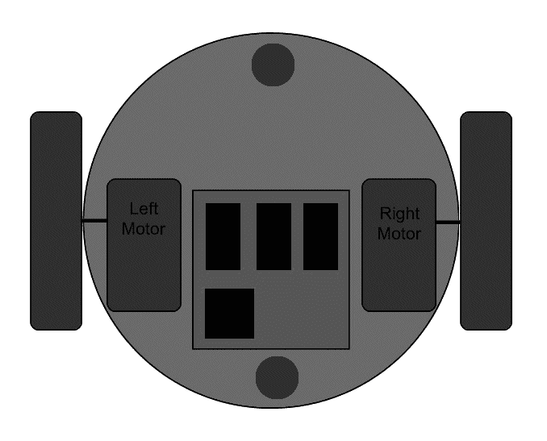

机器人底座的顶视图

接下来，我们可以根据真值表数据使用启动板对电机控制器进行编程。 编程使用称为 [**Energia**](http://energia.nu/) 的 IDE 完成。 我们正在使用 C++ 语言对 Launchpad 进行编程，与 [Arduino 开发板](http://energia.nu/Reference_Index.html)非常相似。

# 安装 Energy IDE

[我们可以从以下链接下载最新版本的 Energia](http://energia.nu/download/)。

我们将主要在 64 位 Ubuntu 16.04 LTS 上讨论安装过程。 我们将使用的 Energia 版本是 0101E0018：

1.  从前面的链接下载适用于 Linux 的 64 位 Energia。
2.  将 Energia 压缩文件解压缩到用户的 Home 文件夹中。
3.  [以下链接给出了设置 Tiva C Launchpad 板的说明](http://energia.nu/guide/guide_linux/)
4.  [您必须从以下链接下载`71-ti-permissions.rules`文件](http://energia.nu/files/71-ti-permissions.rules)
5.  规则文件将授予用户读取和写入启动板的权限。 您必须将文件另存为`71-ti-permissions.rules`并从当前路径执行以下命令，以将规则文件复制到系统文件夹中以获得许可：

```py
$ sudo mv 71-ti-permissions.rules /etc/udev/rules.d/
```

6.  复制文件后，执行以下命令激活规则：

```py
$ sudo service udev restart
```

7.  您现在可以将 Tiva C Launchpad 插入 PC 并在 Linux 终端中执行`dmesg`命令以查看 Linux 内核日志。 如果已创建，则在消息末尾将显示一个串行端口设备，如以下屏幕快照所示：

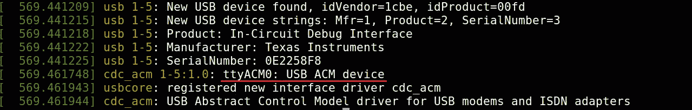

机器人底座的顶视图

8.  如果可以看到串行端口设备，请使用文件夹中的以下命令启动 Energia：

```py
    $./energia  
```

以下屏幕截图显示了 Energia IDE：


能源 IDE

现在，我们必须在 IDE 中选择板 tm4c123 来编译特定于该板的代码。 为此，我们必须安装此板的软件包。 您可以选择选项“工具 | 板子 | 板子管理器”安装软件包。

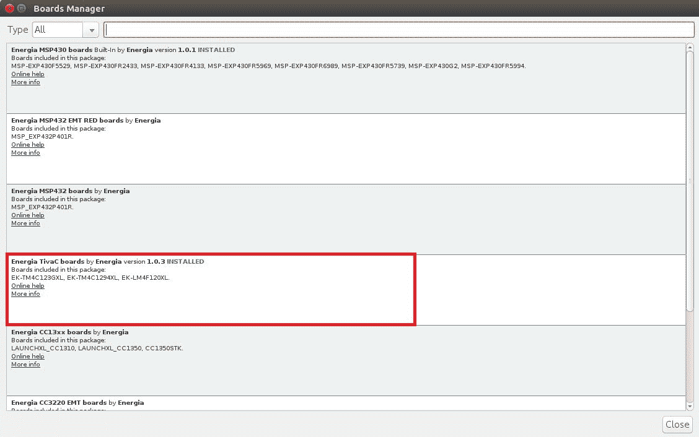

能源董事会经理

9.  安装软件包后，可以通过导航到“工具 | tm4c123（80MHz）的启动板（Tiva C）”来选择板子，如以下屏幕截图所示：

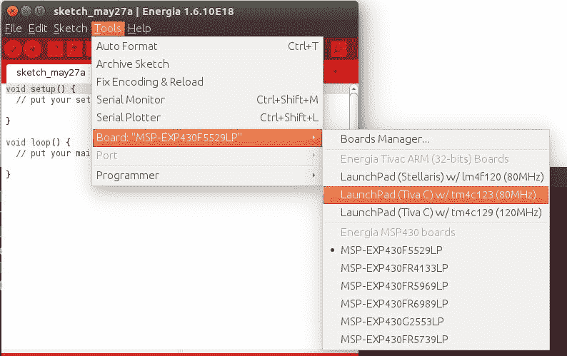

能量板选择

0.  然后，通过导航到“工具 | 串口`/dev/ttyACM0`”来选择串行端口，如以下屏幕截图所示：

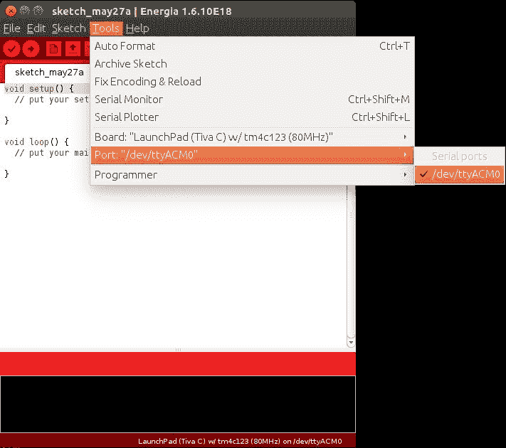

Energia 串口选择

1.  使用“上载”按钮编译并上载代码。 上载按钮将完成这两个过程。 以下屏幕截图说明了成功的上传：


Energia 串口选择

访问以下链接以在 Linux，macOS X 和 Windows 上安装 Energia：

*   对于 Linux 请参考[这个页面](http://energia.nu/guide/guide_linux/)
*   对于 macOS X，请参考[这个页面](http://energia.nu/Guide_MacOSX.html)
*   对于 Windows 请参考[这个页面](http://energia.nu/Guide_Windows.html)

# 电机接口代码

Energia 中的以下代码可用于测试差动驱动配置中的两个电动机。 此代码可使机器人向前移动 5 秒钟，向后移动 5 秒钟。 然后，它将机器人向左移动 5 秒钟，向右移动 5 秒钟。 每次移动后，机器人将停止 1 秒钟。

在代码的开头，我们为两个电机的 INA，INB 和 PWM 定义了引脚，如下所示：

```py
///Left Motor  Pins 
#define INA_1 12 
#define INB_1 13 
#define PWM_1 PC_6 

///Right Motor Pins 
#define INA_2 5 
#define INB_2 6 
#define PWM_2 PC_5 
```

有关启动板的引脚，请参见[这个页面](http://energia.nu/pin-maps/guide_tm4c123launchpad/)。

以下代码显示了使机器人向前，向后，向左和向右移动的五个功能。 第五个功能是停止机器人。 我们将使用`digitalWrite()`功能将数字值写入引脚。 `digitalWrite()`的第一个参数是引脚号，第二个参数是要写入引脚的值。 该值可以是`HIGH`或`LOW`。 我们将使用`analogWrite()`功能将 PWM 值写入引脚。 该函数的第一个参数是引脚号，第二个参数是 PWM 值。 此值的范围是 0-255。 在高 PWM 下，电机驱动器将快速切换并具有更高的速度。 在低 PWM 下，电机驱动器内部的开关将变慢，因此电机也将变慢。 目前，我们正在全速运行：

```py
void move_forward() 
{ 
    //Setting CW rotation to and Left Motor  and CCW to Right Motor  
    //Left Motor  
    digitalWrite(INA_1,HIGH); 
    digitalWrite(INB_1,LOW); 
    analogWrite(PWM_1,255); 
    //Right Motor  
    digitalWrite(INA_2,LOW); 
    digitalWrite(INB_2,HIGH); 
    analogWrite(PWM_2,255);   
} 

/////////////////////////////////////////////////////// 

void move_left() 
{ 
    //Left Motor  
    digitalWrite(INA_1,HIGH); 
    digitalWrite(INB_1,HIGH); 
    analogWrite(PWM_1,0); 
    //Right Motor  
    digitalWrite(INA_2,LOW); 
    digitalWrite(INB_2,HIGH); 
    analogWrite(PWM_2,255);   
} 

////////////////////////////////////////////////////// 

void move_right() 
{ 
      //Left Motor  
      digitalWrite(INA_1,HIGH); 
      digitalWrite(INB_1,LOW); 
      analogWrite(PWM_1,255); 
      //Right Motor  
      digitalWrite(INA_2,HIGH); 
      digitalWrite(INB_2,HIGH); 
      analogWrite(PWM_2,0);   
} 

//////////////////////////////////////////////////////// 

void stop() 
{ 
    //Left Motor  
    digitalWrite(INA_1,HIGH); 
    digitalWrite(INB_1,HIGH); 
    analogWrite(PWM_1,0); 
    //Right Motor  
    digitalWrite(INA_2,HIGH); 
    digitalWrite(INB_2,HIGH); 
    analogWrite(PWM_2,0);   
} 

///////////////////////////////////////////////// 

void move_backward() 

{ 
    //Left Motor  
    digitalWrite(INA_1,LOW); 
    digitalWrite(INB_1,HIGH); 
    analogWrite(PWM_1,255); 
    //Right Motor  
    digitalWrite(INA_2,HIGH); 
    digitalWrite(INB_2,LOW); 
    analogWrite(PWM_2,255);   
} 
```

我们首先将两个电机的`INA`和`INB`引脚设置为`OUTPUT`模式，以便我们可以将`HIGH`或`LOW`值写入这些引脚。 `pinMode()`功能用于设置 I/O 引脚的模式。 `pinMode()`的第一个参数是引脚号，第二个参数是模式。 我们可以将引脚设置为输入或输出。 要将引脚设置为输出，请给`OUTPUT`自变量作为第二个自变量。 要将其设置为输入，请给`INPUT`作为第二个参数，如以下代码所示。 无需将 PWM 引脚设置为输出，因为`analogWrite()`无需设置`pinMode()`就写入 PWM 信号：

```py
void setup() 
{ 
   //Setting Left Motor pin as OUTPUT 
    pinMode(INA_1,OUTPUT);  
    pinMode(INB_1,OUTPUT); 
    pinMode(PWM_1,OUTPUT); 

   //Setting Right Motor pin as OUTPUT 
    pinMode(INA_2,OUTPUT); 
    pinMode(INB_2,OUTPUT); 
    pinMode(PWM_2,OUTPUT);   
} 
```

以下代码段是代码的主要循环。 它将在`5`秒内调用每个函数，例如`move forward()`，`move_backward()`，`move_left()`和`move_right(),`。 调用每个功能后，机器人会在`1`秒内停止：

```py
void loop() 
{ 
  //Move forward for 5 sec 
move_forward(); 
delay(5000); 
  //Stop for 1 sec 
stop(); 
delay(1000); 

  //Move backward for 5 sec 
move_backward(); 
delay(5000); 
  //Stop for 1 sec 
stop(); 
delay(1000); 

  //Move left for 5 sec 
move_left(); 
delay(5000); 
  //Stop for 1 sec 
stop(); 
delay(1000); 

  //Move right for 5 sec 
move_right(); 
delay(5000);   
  //Stop for 1 sec 
stop(); 
delay(1000); 
} 
```

# 正交编码器与 Tiva C Launchpad 的接口

车轮编码器是连接到电动机的传感器，用于感应车轮的旋转数。 如果我们知道转数，就可以计算出车轮的速度和位移。

对于该机器人，我们选择了带有内置编码器的电机。 该编码器是正交类型，可以同时感测电动机的方向和速度。 编码器使用不同类型的传感器（例如光学传感器和霍尔传感器）来检测这些参数。 该编码器使用霍尔效应来感应旋转。 正交编码器具有两个通道，即**通道 A** 和**通道 B**。 每个通道将生成具有 90 度相移的数字信号。 下图显示了典型正交编码器的波形：

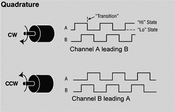

正交编码器波形

如果电动机沿顺时针方向旋转，则**通道 A** 将领先**通道 B**；如果电动机逆时针旋转，则**通道 B** 将领先**通道 A**。 该读数对于检测电动机的旋转方向很有用。 下一节讨论如何将编码器输出转换为有用的测量值，例如位移和速度。

# 处理编码器数据

编码器数据是两相脉冲，相位相差 90 度。 使用此数据，我们可以找到旋转方向以及电动机旋转了多少圈，从而找到了位移和速度。

指定编码器分辨率的一些术语是**每转脉冲**（**PPR**）或**每转线**（**LPR**）和**每转计数**（**CPR**）。 PPR 指定在电动机最终轴旋转一圈期间将有多少个电脉冲（0 到 1 过渡）。 一些制造商使用名称 CPR 而不是 PPR，因为每个脉冲将包含两个边沿（上升和下降），并且存在两个具有 90 度相移的脉冲通道（A 和 B）。 边的总数将是 PPR 数的四倍。 大多数正交接收器使用所谓的 4X 解码来计数来自编码器 A 和 B 通道的所有边沿，与原始 PPR 值相比，产生 4X 分辨率。

在我们的电动机中，Pololu 指定电动机轴的 CPR 为 64，这对应于变速箱输出轴的 8,400 CPR。 实际上，当电动机的最终轴完成一圈旋转时，我们将从变速箱输出轴上获得 8400 个计数。 下图显示了如何从编码器脉冲中计算计数：

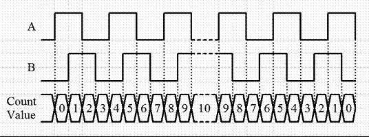

带计数值的编码器脉冲

在此编码器规范中，给出了每转计数。 它是由编码器通道边缘过渡计算的。 编码器通道的一个脉冲对应四个计数。 因此，要在我们的电机中获得 8,400 个计数，PPR 将为`8,400 / 4 = 2,100`。 根据上图，我们将能够计算出一转的计数数量，但是我们还需要感知运动的方向。 这是因为不管机器人向前还是向后移动，我们得到的计数都是相同的； 因此，感测方向对于解码信号很重要。 下图显示了如何解码编码器脉冲：

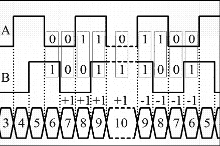

通过编码器脉冲检测电机方向

如果观察代码模式，我们可以理解它遵循 2 位格雷代码。 格雷码是数字的编码，因此相邻数字的一位数字相差 1。[格雷码](http://en.wikipedia.org/wiki/Gray_code)通常在旋转编码器中用于高效编码。

我们可以通过状态转换来预测电动机的旋转方向。 状态转换表如下：

| 状态 | 顺时针转换 | 逆时针转换 |
| --- | --- | --- |
| `0,0` | `0,1`至`0,0` | `1,0`至`0,0` |
| `1,0` | `0,0`至`1,0` | `1,1`至`1,0` |
| `1,1` | `1,0`至`1,1` | `0,1`至`1,1` |
| `0,1` | `1,1`至`0,1` | `0,0`至`0,1` |

如果在状态转换图中表示它，将更加方便：

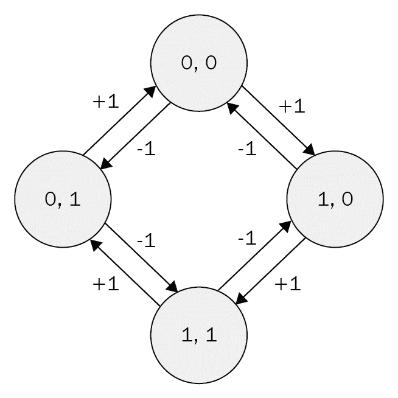

编码器状态转换图

收到此格雷码后，我们可以使用微控制器处理脉冲。 电机的通道引脚必须连接到微控制器的中断引脚。 因此，当通道具有边沿跳变时，它将在引脚上产生中断或触发，并且如果该引脚上有任何中断到达，则将在微控制器程序内执行中断服务程序或简单的功能。 它可以读取两个引脚的当前状态。 根据引脚的当前状态和先前的值，我们可以确定旋转方向，并可以决定是否要增加或减少计数。 这是编码器处理的基本逻辑。

获得计数后，我们可以使用`角度 = (计数值 / CPR) * 360`来计算旋转角度（以度为单位）。 在这里，如果用 8400 代替 CPR，则等式变为`角度 = 0.04285 * 计数值`； 也就是说，要旋转 1 度，必须接收 24 个计数，或者必须产生 6 个编码的通道脉冲。

下图显示了一个电机编码器与 Tiva C LaunchPad 的接口电路：


将编码器连接到启动板

在上图中，您可以找到电动机引脚 CH A 和 CH B，它们是电动机编码器的输出。 这些引脚连接到 Tiva C Launchpad 的 PB2 和 PB7 引脚。 ENC VCC 和 ENC GND 引脚是编码器的电源引脚，因此我们必须为这些引脚提供 +5V 和 GND。 下一组引脚用于为电动机供电。 MOTOR VCC 和 MOTOR GND 分别标记为 OUTA 和 OUTB，它们直接进入电机驱动器以控制电机速度。

编码器输出脉冲的最大电压电平在 0V 至 5V 之间。 在这种情况下，我们可以将编码器直接与 Launchpad 相连，因为它可以接收高达 5V 的输入，或者我们可以使用 3.3V 至 5V 的电平转换器，就像我们之前用于电机驱动器接口的一样。

在下一部分中，我们将在 Energia 中上载代码以测试正交编码器信号。 我们需要检查是否从编码器获得了正确的计数。

# 正交编码器接口代码

该代码将通过串行端口打印左右电机编码器的计数。 这两个编码器采用 2X 解码方案，因此我们将获得 4,200 CPR。 在代码的第一部分中，我们定义了两个编码器的两个通道输出的引脚，并声明了两个编码器的计数变量。 编码器变量在变量数据类型之前使用`volatile`关键字。 `volatile`的主要用途是带有`volatile`关键字的变量将存储在 RAM 存储器中，而普通变量位于 CPU 寄存器中。 编码器的值将很快变化，因此使用普通变量将不准确。 为了获得准确性，我们将`volatile`用于编码器变量，如下所示：

```py
//Encoder pins definition 

// Left encoder 

#define Left_Encoder_PinA 31 
#define Left_Encoder_PinB 32 

volatile long Left_Encoder_Ticks = 0; 

//Variable to read current state of left encoder pin 
volatile bool LeftEncoderBSet; 

//Right Encoder 

#define Right_Encoder_PinA 33 
#define Right_Encoder_PinB 34 
volatile long Right_Encoder_Ticks = 0; 
//Variable to read current state of right encoder pin 
volatile bool RightEncoderBSet; 
```

以下代码段是`setup()`函数的定义。 在 Energia 中，`setup()`是一个内置函数，用于初始化以及一次性执行变量和函数。 在`setup()`内部，我们以`115200`的波特率初始化串行数据通信，并调用用户定义的`SetupEncoders()`函数来初始化编码器的引脚。 串行数据通信主要用于通过串行端子检查编码器计数：

```py
void setup() 
{ 
    //Init Serial port with 115200 buad rate 
  Serial.begin(115200);   
  SetupEncoders(); 
} 
```

`SetupEncoders()`的定义在下面的代码中给出。 要接收编码器脉冲，我们需要在启动板中使用两个引脚作为输入。 将编码器引脚配置为 Launchpad 作为输入，并激活其上拉电阻。 `attachInterrupt ()`功能会将编码器引脚之一配置为中断。 `attachInterrupt ()`函数具有三个参数。 第一个参数是引脚号，第二个参数是**中断服务程序**（**ISR**），第三个参数是中断条件，即必须触发 ISR 的中断条件。 在此代码中，我们将左右编码器引脚的`PinA`配置为中断； 当脉冲上升时，它将调用 ISR：

```py
void SetupEncoders() 
{ 
  // Quadrature encoders 
  // Left encoder 
  pinMode(Left_Encoder_PinA, INPUT_PULLUP); 
  // sets pin A as input   
  pinMode(Left_Encoder_PinB, INPUT_PULLUP); 
  // sets pin B as input 
  attachInterrupt(Left_Encoder_PinA, do_Left_Encoder, RISING); 

  // Right encoder 
  pinMode(Right_Encoder_PinA, INPUT_PULLUP); 
  // sets pin A as input 
  pinMode(Right_Encoder_PinB, INPUT_PULLUP); 
  // sets pin B as input 

  attachInterrupt(Right_Encoder_PinA, do_Right_Encoder, RISING); 
} 
```

以下代码是 Energia 中内置的`loop()`函数。 `loop()`函数是一个无限循环，我们在其中放入了主代码。 在此代码中，我们调用`Update_Encoders()`函数通过串行终端连续打印编码器值：

```py
void loop() 
{ 
  Update_Encoders();                        
} 
```

以下代码是`Update_Encoders()`功能的功能定义。 它在一行中以起始字符`e`打印两个编码器值，并且这些值由制表符空格分隔。 `Serial.print()`函数是一个内置函数，它将打印作为参数给出的字符/字符串：

```py
void Update_Encoders() 
{ 
  Serial.print("e"); 
  Serial.print("t"); 
  Serial.print(Left_Encoder_Ticks); 
  Serial.print("t"); 
  Serial.print(Right_Encoder_Ticks); 
  Serial.print("n"); 
 } 
```

以下代码是左右编码器的 ISR 定义。 当在每个引脚上检测到上升沿时，将调用一个 ISR。 当前中断引脚是每个编码器的`PinA`。 收到中断后，我们可以假设上升的`PinA`具有较高的值状态，因此无需读取该引脚。 读取两个编码器的`PinB`并将引脚状态存储到`LeftEncoderBSet`或`RightEncoderBSet`。 将当前状态与`PinB`的先前状态进行比较，并可以根据状态转换表检测方向，并确定计数是必须增加还是减少：

```py
void do_Left_Encoder() 
{ 
  LeftEncoderBSet = digitalRead(Left_Encoder_PinB); 
  // read the input pin 
  Left_Encoder_Ticks -= LeftEncoderBSet ? -1 : +1; 
} 

void do_Right_Encoder() 
{ 
  RightEncoderBSet = digitalRead(Right_Encoder_PinB); 
  // read the input pin 
  Right_Encoder_Ticks += RightEncoderBSet ? -1 : +1; 
} 
```

上载草图并使用 Energia 中的串行监视器查看输出。 导航到工具| 串行监视器。 手动移动两个电机，您会看到计数发生变化。 在串行监视器中设置波特率，该波特率与代码中初始化的波特率相同； 在这种情况下，它是`115200`。 输出将如下所示：


将编码器连接到启动板

如果要将机器人升级到高精度和有效载荷，则必须考虑使用高质量的执行器，例如 Dynamixel。 Dynamixel 伺服器是智能执行器，具有内置的 PID 控制和监视伺服器和编码器参数（例如扭矩，位置等）的功能。 在此机器人中，我们不使用 Dynamixel。

# 使用 Dynamixel 执行器

**Dynamixel** 是韩国制造商 ROBOTIS 开发的一种用于机器人的网络执行器。 它具有通用的扩展功能，功率反馈功能，位置，速度，内部温度，输入电压等，因此被公司，大学和业余爱好者广泛使用。

Dynamixel 伺服器可以菊花链形式连接； 它是一种以串行方式连接设备，通过连接的设备将一个设备连接到另一个设备的方法，并且可以从一个控制器控制所有连接的伺服器。 Dynamixel 伺服器通过 RS485 或 TTL 进行通信。 可用的 Dynamixel 伺服器列表在[这个页面](http://www.robotis.com/xe/dynamixel_en)中给出。

Dynamixel 的接口非常简单。 Dynamixel 带有一个称为 USB2Dyanmixel 的控制器，该控制器会将 USB 转换为 Dynamixel 兼容的 TTL/RS485 电平。 下图显示了 Dynamixel 的接口图：


Dynamixel 执行器与 PC 的接口

ROBOTIS 提供了 Dynamixel SDK，用于访问电机寄存器； 我们可以将值读取和写入 Dynamixel 寄存器，并检索数据，例如位置，温度，电压等。

设置 USB2Dynamixel 和 Dynamixel SDK 的说明在[这个页面](http://support.robotis.com/en/)中给出。

Dynamixel 可以使用 Python 库进行编程。 用于处理 Dynamixel 伺服器的 Python 库之一是 **Pydynamixel**。 该软件包可用于 Windows 和 Linux。 Pydynamixel 将支持 RX，MX 和 EX 系列伺服器。

我们可以从[这个页面](https://pypi.python.org/pypi/dynamixel/)下载 Pydynamixel Python 软件包。

下载包并将其解压缩到`home`文件夹。 打开终端或 DOS 提示符，然后执行以下命令：

```py
    sudo python setup.py install   
```

安装软件包后，我们可以尝试下面的 Python 示例，该示例将检测连接到 USB2Dynamixel 的伺服器并向该伺服器写入一些随机位置。 此示例适用于 RX 和 MX 伺服器：

```py
#!/usr/bin/env python 
```

以下代码将导入此示例所需的必要 Python 模块。 这也包括 Dynamixel Python 模块：

```py
import os 
import dynamixel 
import time 
import random 
```

以下代码定义了 Dynamixel 通信参数所需的主要参数。 `nServos`变量表示连接到总线的 Dynamixel 伺服器的数量。 `portName`变量指示 Dynamixel 伺服器连接到的 USB2Dynamixel 的串行端口。 `baudRate`变量是 USB2Dynamixel 和 Dynamixel 的通信速度：

```py
# The number of Dynamixels on our bus. 
nServos = 1 

# Set your serial port accordingly. 
if os.name == "posix": 
    portName = "/dev/ttyUSB0" 
else: 
    portName = "COM6" 

# Default baud rate of the USB2Dynamixel device. 
baudRate = 1000000 
```

以下代码是连接到 Dynamixel 伺服器的 Dynamixel Python 函数。 如果已连接，程序将打印它并扫描通信总线以查找从 ID `1`到`255`开始的伺服数。 伺服 ID 是每个伺服的标识。 我们将`nServos`设置为`1`，因此它将在总线上获得一个伺服后停止扫描：

```py
# Connect to the serial port 
print "Connecting to serial port", portName, '...', 
serial = dynamixel.serial_stream.SerialStream( port=portName, baudrate=baudRate, timeout=1) 
print "Connected!" 
net = dynamixel.dynamixel_network.DynamixelNetwork( serial ) 
net.scan( 1, nServos ) 
```

以下代码会将 Dynamixel ID 和伺服对象附加到`myActutors`列表中。 我们可以使用伺服 ID 和伺服对象将伺服值写入每个伺服。 我们可以使用`myActutors`列表进行进一步处理：

```py
# A list to hold the dynamixels 
myActuators = list() 
print myActuators 

This will create a list for storing  dynamixel actuators details. 

print "Scanning for Dynamixels...", 
for dyn in net.get_dynamixels(): 
    print dyn.id, 
    myActuators.append(net[dyn.id]) 
print "...Done" 
```

以下代码将向总线上可用的每个 Dynamixel 执行器写入 450 至 600 的随机位置。 Dynamixel 中的位置范围是 0 到 1,023。 这将设置伺服参数，例如`speed`，`torque,torque_limt`，`max_torque`等：

```py
# Set the default speed and torque 
for actuator in myActuators: 
    actuator.moving_speed = 50 
    actuator.synchronized = True 
    actuator.torque_enable = True 
    actuator.torque_limit = 800 
    actuator.max_torque = 800 
```

以下代码将打印当前执行器的当前位置：

```py
# Move the servos randomly and print out their current positions 
while True: 
    for actuator in myActuators: 
        actuator.goal_position = random.randrange(450, 600) 
    net.synchronize() 
```

以下代码将从执行器读取所有数据：

```py
    for actuator in myActuators: 
        actuator.read_all() 
        time.sleep(0.01) 

    for actuator in myActuators: 
        print actuator.cache[dynamixel.defs.REGISTER['Id']], actuator.cache[dynamixel.defs.REGISTER['CurrentPosition']] 

    time.sleep(2) 
```

# 使用超声波距离传感器

导航机器人是移动机器人的重要功能之一。 理想的导航意味着机器人可以规划其从当前位置到目的地的路径，并且可以毫无障碍地移动。 我们在该机器人中使用了超声波距离传感器，以检测使用 Kinect 传感器无法检测到的附近物体。 Kinect 和超声波传感器的组合为该机器人提供了理想的避免碰撞的方法。

超声波距离传感器的工作方式如下。 发射器将发送人耳听不到的超声波。 发送超声波后，它将等待发射波的回波。 如果没有回声，则表示机器人前方没有障碍物。 如果接收传感器接收到任何回波，则会在接收器上生成一个脉冲，并且可以计算出波传播到物体并返回到接收器传感器所需的总时间。 如果得到这个时间，则可以使用以下公式计算到障碍物的距离：

```cpp
声速经过的时间/ 2 = 距物体的距离
```

在这里，声速可以取为 340m/s。

大多数超声波测距传感器的距离范围为 2 厘米至 400 厘米。 在此机器人中，我们使用了称为 HC-SR04 的传感器模块。 我们将研究如何将 HC-SR04 与 Tiva C LaunchPad 进行接口以获得障碍物的距离。

# HC-SR04 与 Tiva C LaunchPad 的接口

下图说明了 HC-SR04 超声波传感器与 Tiva C LaunchPad 的接口电路：

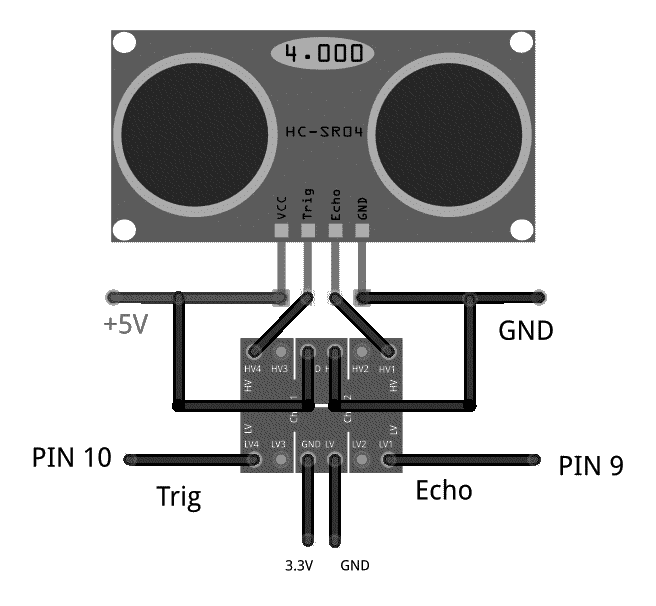

将超声波传感器连接到 Launchpad

超声波传感器的工作电压为 5V，该传感器的输入/输出也为 5V，因此我们需要 **Trig** 和 **Echo** 引脚上的电平转换器，以便与 **3.3V** 级启动板。 如上图所示，在电平转换器中，我们需要施加 5V 的高电压和 3.3V 的低电压，以从一个电平切换到另一电平。 **Trig** 和 **Echo** 引脚连接在电平转换器的高压侧，低压侧引脚连接到 Launchpad。 **Trig** 引脚和 **Echo** 连接到启动板的第 10 和第 9 引脚。 连接传感器后，我们可以看到如何对两个 I/O 引脚进行编程。

# HC-SR04 的工作

下图显示了每个引脚上的波形时序。 我们需要在触发输入端施加一个 10µs 的短脉冲以开始测距，然后该模块将以 40KHz 的频率发送一个八周期的超声波脉冲并提高其回声。 回波是距离对象，它是脉冲宽度和比例范围。 您可以使用以下公式计算发送触发信号和接收回波信号之间的时间间隔范围：

```cpp
范围 = 回波引脚输出的高电平时间 * 速度（340M/S）/ 2
```

最好在每次触发之前使用 60 毫秒的延迟，以避免触发和回波之间重叠：


超声波传感器的输入输出波形

# Tiva C Launchpad 的接口代码

以下用于 Launchpad 的 Energia 代码从超声传感器读取值，并通过串行端口监视值。

以下代码定义了 Launchpad 中用于处理超声回波和触发引脚的引脚，还定义了脉冲持续时间和距离（以厘米为单位）的变量：

```py
const int echo = 9, Trig = 10; 
long duration, cm; 
```

以下代码段是`setup()`功能。 程序启动时将调用`setup()`功能。 使用它来初始化变量，引脚模式，开始使用库等。 每次启动或重置启动板后，设置功能将只运行一次。 在`setup()`中，我们以 115200 的波特率初始化串行通信，并通过调用`SetupUltrasonic();function:`设置超声处理引脚的模式

```py
void setup() 
{ 

  //Init Serial port with 115200 baud rate 
  Serial.begin(115200);   
  SetupUltrasonic();   
} 
```

以下是超声波传感器的设置功能； 它将`Trigger`引脚配置为`OUTPUT`，将`Echo`引脚配置为`INPUT`。 `pinMode()`功能用于将引脚设置为`INPUT`或`OUTPUT`：

```py
void SetupUltrasonic() 
{ 
 pinMode(Trig, OUTPUT); 
 pinMode(echo, INPUT);  

} 
```

创建用于初始化和设置初始值的`setup()`函数后，`loop()`函数将按照其名称的含义正确执行并连续循环，以允许您的程序进行更改和响应。 使用它来主动控制启动板。

下面的代码是其主要循环。 该函数是一个无限循环，并调用`Update_Ultra_Sonic()`函数通过串行端口更新和打印超声读数：

```py
void loop() 
{ 
    Update_Ultra_Sonic(); 
    delay(200); 
} 
```

以下代码是`Update_Ultra_Sonic()`函数的定义。 此功能将执行以下操作。 首先，它将触发引脚置于`2`微秒的`LOW`状态，并使`10`微秒的`HIGH`状态。 在`10`微秒后，它将再次将引脚恢复为`LOW`状态。 这是根据时序图。 我们已经看到触发脉冲宽度为 10µs。

触发 10µs 后，我们必须从 Echo 引脚读取持续时间。 持续时间是声音从传感器传播到物体以及从物体传播到传感器接收器所花费的时间。 我们可以使用`pulseIn()`功能读取脉冲持续时间。 得到持续时间后，我们可以使用`microsecondsToCentimeters()`函数将时间转换为厘米，如以下代码所示：

```py
void Update_Ultra_Sonic() 
{ 
  digitalWrite(Trig, LOW); 
  delayMicroseconds(2); 
  digitalWrite(Trig, HIGH); 
  delayMicroseconds(10); 
  digitalWrite(Trig, LOW); 

  duration = pulseIn(echo, HIGH); 
  // convert the time into a distance 
  cm = microsecondsToCentimeters(duration); 

  //Sending through serial port 
  Serial.print("distance="); 
  Serial.print("t"); 
  Serial.print(cm); 
  Serial.print("n"); 

} 
```

以下代码是从微秒到厘米的距离的转换函数。 声速为 340m/s，即每厘米 29 微秒。 因此，我们通过将总微秒除以 29/2 来获得总距离：

```py
long microsecondsToCentimeters(long microseconds) 
{ 
return microseconds / 29 / 2; 
} 
```

上载代码后，从“工具 | 工具”下的“Energia”菜单打开串行监视器。 串行监视器，并将波特率更改为 115200。超声波传感器的值显示在以下屏幕截图中：

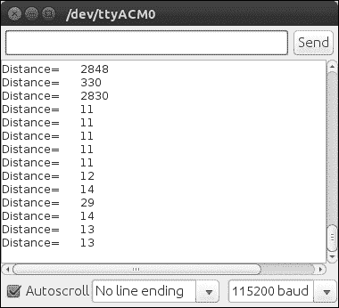

Energia 串行监视器中的超声波距离传感器的输出

# Tiva C LaunchPad 与 Python 的接口

在本节中，我们将研究如何将 Tiva C LaunchPad 与 Python 连接以从 PC 中的 Launchpad 接收数据。

**PySerial** 模块可用于将 Launchpad 与 Python 接口。 有关 PySerial 的详细文档及其在 Windows，Linux 和 OS X 上的安装过程，请参见[这个页面](http://pyserial.sourceforge.net/pyserial.html)。

PySerial 在 Ubuntu 软件包管理器中可用，可以在终端中使用以下命令将其轻松安装在 Ubuntu 中：

```py
    $ sudo apt-get install python-serial  
```

安装`python-serial`软件包后，我们可以编写 Python 代码以连接 Launchpad。 接口代码在下一节中给出。

以下代码导入 Python 的`serial`模块和`sys`模块。 `serial`模块处理 Launchpad 的串行端口并执行诸如读取，写入等操作。 `sys`模块提供对解释器使用或维护的某些变量以及与解释器强烈交互的功能的访问。 它始终可用：

```py
#!/usr/bin/env python 
import serial 
import sys 
```

当我们将 Launchpad 插入计算机时，设备在 OS 上注册为虚拟串行端口。 在 Ubuntu 中，设备名称类似于`/dev/ttyACMx`。 这里，`x`可以是数字； 如果只有一台设备，则可能为 0。要与 Launchpad 交互，我们仅需要处理此设备文件。

以下代码将尝试以`115200`的波特率打开 Launchpad 的串行端口`/dev/ttyACM0`。 如果失败，将显示`Unable to open serial port`：

```py
try: 
    ser = serial.Serial('/dev/ttyACM0',115200) 
except: 
    print "Unable to open serial port" 
```

以下代码将读取串行数据，直到串行字符换行（`'n'`）并将其打印在终端上为止。 如果我们按键盘上的`Ctrl + C`组合键以退出程序，它将通过调用`sys.exit(0)`退出：

```py
while True: 
    try: 
        line = ser.readline() 
        print line 
    except: 
        print "Unable to read from device" 
        sys.exit(0) 
```

保存文件后，使用以下命令将文件的权限更改为可执行文件：

```py
    $ sudo chmod +X script_name
    $ ./ script_name  
```

脚本的输出将如下所示：


Energia 串行监视器中的超声波距离传感器的输出

# 使用红外接近传感器

红外传感器是查找障碍物和距机器人的距离的另一种方法。 红外距离传感器的原理基于撞击障碍物时从表面反射的红外光。 红外接收器将捕获反射光，并根据接收到的光量测量电压。

夏普 GP2D12 是最受欢迎的红外范围传感器之一。 [产品链接可以在这里找到](http://www.robotshop.com/en/sharp-gp2y0a21yk0f-ir-range-sensor.html)。

下图显示了 Sharp GP2D12 传感器：


传感器发出一束红外光，并使用三角测量法测量距离。 GP2D12 的检测范围在 10 厘米至 80 厘米之间。 光束是 6 厘米宽，相距 80 厘米。 下图说明了红外光传感器的透射和反射：


使用红外光传感器进行障碍物感应

传感器的左侧是一个红外发射器，它连续发送红外辐射。 撞到某些物体后，红外光将反射并被红外接收器接收。 红外传感器的接口电路如下所示：


夏普红外传感器的引脚排列

模拟输出引脚 **Vo** 可以连接到 Launchpad 的 ADC 引脚。 本节将进一步讨论 Sharp 距离传感器与 Tiva C Launchpad 的接口代码。 在此代码中，我们选择 Launchpad 的第 18 引脚并将其设置为 ADC 模式，并从 Sharp 距离传感器读取电压电平。 GP2D12 红外传感器的距离公式如下：

```cpp
范围 = (6,787 / (Volt - 3)) - 4
```

此处，*电压*是来自电压引脚的 ADC 的模拟电压值。

在代码的第一部分中，我们将 Tiva C LaunchPad 的第 18 引脚设置为输入引脚，并以 115200 的波特率启动串行通信：

```py
int IR_SENSOR = 18; // Sensor is connected to the analog A3 
int intSensorResult = 0; //Sensor result 
float fltSensorCalc = 0; //Calculated value 

void setup() 
{ 
Serial.begin(115200); // Setup communication with computer 
   to present results serial monitor 
} 
```

在下面的代码部分中，控制器不断读取模拟引脚并将其转换为以厘米为单位的距离值：

```py
void loop() 
{ 

// read the value from the ir sensor 
intSensorResult = analogRead(IR_SENSOR); //Get sensor value 

//Calculate distance in cm according to the range equation 
fltSensorCalc = (6787.0 / (intSensorResult - 3.0)) - 4.0;  

Serial.print(fltSensorCalc); //Send distance to computer 
Serial.println(" cm"); //Add cm to result 
delay(200); //Wait 
} 
```

这是连接锋利距离传感器的基本代码。 红外传感器有一些缺点。 其中一些如下：

*   我们不能在直射或间接阳光下使用它们，因此很难在室外机器人中使用它们
*   如果物体不反射，它们可能不起作用
*   范围方程式仅在范围内起作用

在下一部分中，我们将讨论 IMU 及其与 Tiva C LaunchPad 的接口。 IMU 可以提供里程计数据，并且可以用作导航算法的输入。

# 与惯性测量单元一起使用

**惯性测量单元**（**IMU**）是一种电子设备，可以结合使用加速度计，陀螺仪和磁力计来测量速度，方向和重力。 IMU 在机器人技术中有很多应用。 一些应用被用于平衡**无人机**（**无人机**）和机器人导航。

在本节中，我们将讨论 IMU 在移动机器人导航中的作用，以及市场上一些最新的 IMU 及其与 Launchpad 的接口。

# 惯性导航

IMU 提供相对于惯性空间的加速度和方向。 如果知道初始位置，速度和方向，则可以通过积分感应到的加速度来计算速度，第二次积分给出位置。 为了获得正确的机器人方向，需要确定机器人的方向。 这可以通过积分来自陀螺仪的感测角速度来获得。

下图说明了惯性导航系统，该系统会将 IMU 值转换为里程表数据：


IMU 框图

我们使用导航方程将从 IMU 中获得的值转换为导航信息，并将其输入到估计过滤器（例如卡尔曼过滤器）中。 [**卡尔曼**过滤器是一种根据测量数据估算系统状态的算法](http://en.wikipedia.org/wiki/Kalman_filter)。 由于加速度计和陀螺仪的误差，**惯性导航系统**（**INS**）的数据会有些漂移。 为了限制漂移，通常通过直接提供积分量测量的其他传感器辅助 INS。 基于测量和传感器误差模型，卡尔曼过滤器估算导航方程式中的误差以及所有有色传感器的误差。 下图说明了使用卡尔曼过滤器的辅助惯性导航系统：

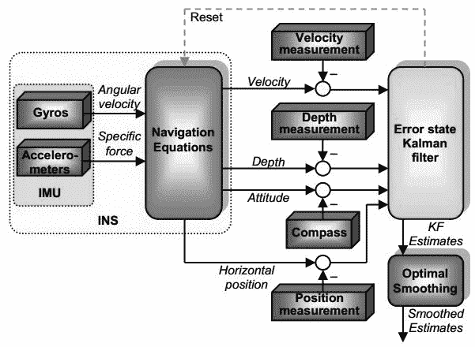

具有惯性导航系统的 IMU

与电机编码器一起，来自 IMU 的值可以用作里程表的值，并且可以用于**航位推算**，这是通过使用先前确定的位置来查找运动对象的当前位置的过程 。

在下一节中，我们将介绍 InvenSense 最受欢迎的一种 IMU，称为 **MPU 6050**。

# 将 MPU 6050 与 Tiva C LaunchPad 连接

MPU-6000/MPU-6050 系列零件是全球首个也是唯一的六轴运动跟踪设备，旨在满足智能手机，平板电脑，可穿戴传感器和机器人的低功耗，低成本和高性能要求。

MPU-6000/6050 器件在硅芯片上结合了三轴陀螺仪和三轴加速度计以及能够处理复杂的九轴运动融合算法的板载数字运动处理器。 下图显示了 MPU 6050 和 MPU 6050 的系统框图：


MPU 6050 的框图

MPU 6050 的分支板如下图所示，[可以从此处购买](http://a.co/7C3yL96)：

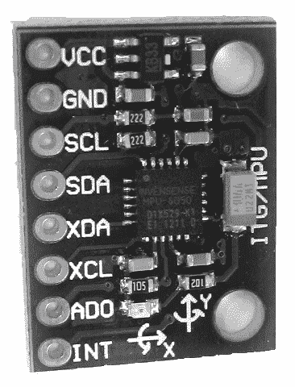

MPU 6050 转接板

下表列出了从 Launchpad 到 MPU 6050 的连接。 其余引脚可以断开连接：

| Launchpad 引脚 | MPU6050 引脚 |
| --- | --- |
| +3.3V | VCC/VDD |
| GND | GND |
| PD0 | SCL |
| PD1 | SDA |

下图显示了 MPU 6050 和 Tiva C Launchpad 的接口：

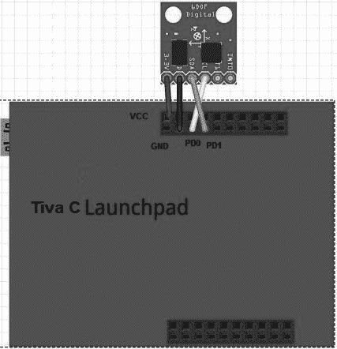

将 MPU 6050 转接板连接到 Launchpad

MPU 6050 和 Launchpad 使用 I2C 协议进行通信。 电源电压为 3.3V，取自启动板。

# 在 Energia 中设置 MPU 6050 库

本节讨论 Energia 的接口代码。 接口代码使用[这个](https://github.com/jrowberg/i2cdevlib/zipball/master)库连接 MPU 6050。

从前面的链接下载 ZIP 文件，然后从“文件 | 文件”导航到“Energia 偏好”，如以下屏幕截图所示：


将 MPU 6050 转接板连接到 Launchpad

如上一个屏幕快照所示，转到“首选项”下的 Sketchbook 位置，并创建一个名为`libraries`的文件夹。 将 ZIP 文件中 Arduino 文件夹中的文件提取到`sketchbook/libraries`位置。 该存储库中的 Arduino 软件包也与 Launchpad 兼容。 提取的文件包含 MPU 6050 传感器接口所需的`I2Cdev`，`Wire`和`MPU6050`软件包。 `libraries`文件夹中还有其他传感器包，但我们现在不使用它们。

前面的过程在 Ubuntu 中完成，但对于 Windows 和 macOS X 则相同。

# 能源接口代码

此代码用于将 MPU 6050 的原始值读取到 Launchpad。 它使用了与 Energia IDE 兼容的 MPU 6050 第三方库。 以下是每个代码块的说明。

在代码的第一部分中，我们包括用于将 MPU 6050 与 Launchpad 连接的必要标头，例如`12C`，`Wire`和`MPU6050`库，并创建名称为`accelgyro`的`MPU6050`对象。 `MPU6050.h`库包含一个名为`MPU6050`的类，用于向传感器发送数据和从传感器接收数据：

```py
#include "Wire.h" 

#include "I2Cdev.h" 
#include "MPU6050.h" 

MPU6050 accelgyro; 
```

在下一节中，我们将启动 I2C 和串行通信以与 MPU 6050 进行通信，并通过串行端口打印传感器值。 串行通信波特率是`115200`，`Setup_MPU6050()`是用于初始化 MPU 6050 通信的自定义功能：

```py
void setup() 
{ 

  //Init Serial port with 115200 buad rate 
  Serial.begin(115200);   
  Setup_MPU6050(); 
} 
```

以下部分是`Setup_MPU6050()`功能的定义。 `Wire`库允许您与 I2C 设备进行通信。 MPU 6050 可以使用 I2C 进行通信。 `Wire.begin()`功能将启动 MPU 6050 和 Launchpad 之间的 I2C 通信； 同样，它将使用`MPU6050`类中定义的`initialize()`方法初始化 MPU 6050 设备。 如果一切成功，它将打印连接成功； 否则，它将打印连接失败：

```py
void Setup_MPU6050() 
{ 
   Wire.begin(); 

      // initialize device 
    Serial.println("Initializing I2C devices..."); 
    accelgyro.initialize(); 

    // verify connection 
    Serial.println("Testing device connections..."); 
    Serial.println(accelgyro.testConnection() ? "MPU6050 connection successful" : "MPU6050 connection failed"); 
} 
```

以下代码是`loop()`函数，该函数连续读取传感器值并通过串行端口打印其值：`Update_MPU6050()`自定义函数负责从 MPU 6050 打印更新的值：

```py
void loop() 
{ 

   //Update MPU 6050 
    Update_MPU6050(); 

} 
```

`Update_MPU6050()`的定义如下。 它声明了六个变量来处理三轴加速度计和陀螺仪的值。 MPU 6050 类中的`getMotion6()`功能负责从传感器读取新值。 阅读它们后，它将通过串行端口进行打印：

```py
void Update_MPU6050() 
{ 

   int16_t ax, ay, az; 
  int16_t gx, gy, gz; 

      // read raw accel/gyro measurements from device 
    accelgyro.getMotion6(&ax, &ay, &az, &gx, &gy, &gz); 

    // display tab-separated accel/gyro x/y/z values 
    Serial.print("i");Serial.print("t"); 
    Serial.print(ax); Serial.print("t"); 
    Serial.print(ay); Serial.print("t"); 
    Serial.print(az); Serial.print("t"); 
    Serial.print(gx); Serial.print("t"); 
    Serial.print(gy); Serial.print("t"); 
    Serial.println(gz); 
    Serial.print("n"); 
} 
```

串行监视器的输出如下所示：

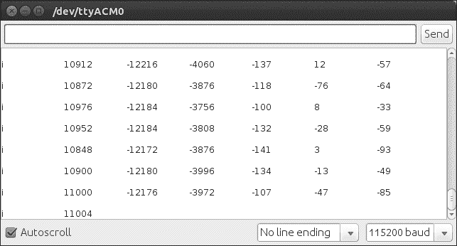

MPU 6050 在串行监视器中的输出

我们可以使用用于超声波的 Python 代码读取这些值。 以下是我们运行 Python 脚本时终端的屏幕截图：


Linux 终端中 MPU 6050 的输出

# 总结

在本章中，我们讨论了在机器人中使用的电机接口。 我们已经研究了电机和编码器与名为 Tiva C Launchpad 的控制器板的接口。 我们已经讨论了用于连接电机和编码器的控制器代码。 将来，如果机器人需要高精度和高扭矩，我们将研究可以替代当前直流电动机的 Dynamixel 伺服器。 我们还研究了可以在我们的机器人中使用的机器人传感器。 我们讨论的传感器是超声波距离传感器，IR 接近传感器和 IMU。 这三个传感器有助于机器人的导航。 我们还讨论了将这些传感器连接到 Tiva C LaunchPad 的基本代码。 在下一章中，我们将进一步讨论该机器人中使用的视觉传感器。

# 问题

1.  什么是 H 桥电路？
2.  什么是正交编码器？
3.  什么是 4X 编码方案？
4.  我们如何从编码器数据计算位移？
5.  Dynamixel 执行器有什么特点？
6.  什么是超声波传感器，它们如何工作？
7.  您如何计算距超声波传感器的距离？
8.  什么是红外接近传感器，它如何工作？

# 进一步阅读

[通过以下链接阅读有关 Energia 编程的更多信息](http://energia.nu/guide/)。