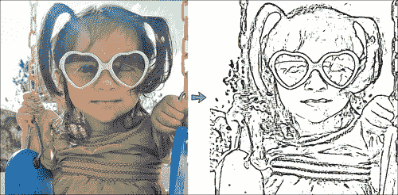
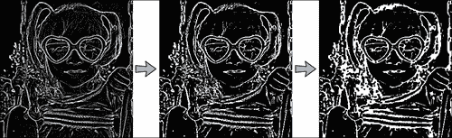
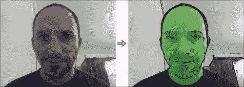

# 第 1 章。Android 的卡通化器和换肤器

本章将向您展示如何为 Android 智能手机和平板电脑编写一些图像处理滤镜，该滤镜首先针对台式机（使用 C/C++）编写，然后移植到 Android（使用相同的 C/C++ 代码，但使用 Java GUI）， 这是为移动设备开发时的推荐方案。 本章将涵盖：

*   如何将真实图像转换为草图
*   如何转换为绘画并叠加草图以生成卡通
*   一种可怕的“邪恶”模式，用于创建坏角色而不是好角色
*   基本的皮肤检测器和皮肤颜色更改器，可为某人提供绿色的“异形”皮肤
*   如何将项目从桌面应用程序转换为移动应用程序

以下屏幕快照显示了在 Android 平板电脑上运行的最终 Cartoonifier 应用程序：


我们想要使真实世界的相机框架看起来像真的是动画片。 基本思想是用一些颜色填充扁平零件，然后在坚固的边缘上绘制粗线。 换句话说，平坦区域应该变得更加平坦，边缘应该变得更加清晰。 我们将检测边缘并平滑平坦的区域，然后在顶部绘制增强的边缘以产生卡通或漫画效果。

开发移动计算机视觉应用程序时，最好先构建一个完全正常运行的桌面版本，然后再将其移植到移动设备上，因为开发和调试桌面程序比移动应用程序容易得多！ 因此，本章将以完整的 Cartoonifier 桌面程序开始，您可以使用自己喜欢的 IDE 创建该程序（例如 Visual Studio，XCode ， Eclipse， QtCreator 等）。 在桌面上正常运行后，最后一部分将说明如何使用 Eclipse 将其移植到 Android（或可能的 iOS）。 由于我们将创建两个不同的项目，这些项目大多使用不同的图形用户界面共享相同的源代码，因此您可以创建一个由两个项目链接的库，但为简单起见，我们将桌面和 Android 项目彼此相邻并设置 Android 项目以访问`Desktop`文件夹中的某些文件（`cartoon.cpp`和`cartoon.h` ，其中包含所有图像处理代码）。 例如：

*   `C:\Cartoonifier_Desktop\cartoon.cpp`
*   `C:\Cartoonifier_Desktop\cartoon.h`
*   `C:\Cartoonifier_Desktop\main_desktop.cpp`
*   `C:\Cartoonifier_Android\...`

桌面应用程序使用 OpenCV GUI 窗口，初始化摄像头，并通过每个摄像头框架调用`cartoonifyImage()`函数，该函数包含本章中的大部分代码。 然后，它将在 GUI 窗口上显示处理后的图像。 同样，Android 应用程序使用 Android GUI 窗口，使用 Java 初始化摄像头，并且每个摄像头框架都调用与前面提到的完全相同的 C++ `cartoonifyImage()`函数，但是具有 Android 菜单和手指触摸输入。 本章将解释如何从头开始创建桌面应用程序，以及如何从一个 OpenCV Android 示例项目中创建 Android 应用程序。 因此，首先您应该在自己喜欢的 IDE 中创建一个桌面程序，并使用`main_desktop.cpp`文件来保存以下各节中提供的 GUI 代码，例如主循环，网络摄像头功能和键盘输入，然后创建在项目之间共享的`cartoon.cpp`文件。 您应该将本章的大部分代码作为称为`cartoonifyImage()`的函数放入`cartoon.cpp`中。

# 访问网络摄像头

要访问计算机的网络摄像头或摄像头设备，只需在`cv::VideoCapture`对象（OpenCV 访问摄像头设备的方法）上调用`open()`，然后将`0`作为默认摄像头 ID 号。 某些计算机连接了多个摄像机，或者它们不作为默认摄像机`0`起作用； 因此，通常的做法是允许用户在希望尝试使用 1 号，2 号或 -1 号摄像机的情况下，将所需的摄像机号作为命令行参数传递。 我们还将尝试使用`cv::VideoCapture::set()` 将摄像机分辨率设置为`640 x 480`，以便在高分辨率摄像机上更快地运行。

### 注意

根据您的相机模型，驱动程序或系统，OpenCV 可能不会更改相机的属性。 对于这个项目而言，这并不重要，所以请放心，如果它不适用于您的相机。

您可以将此代码放入`main_desktop.cpp`的`main()`函数中：

```cpp
int cameraNumber = 0;
if (argc > 1)
  cameraNumber = atoi(argv[1]);

// Get access to the camera.
cv::VideoCapture camera;
camera.open(cameraNumber);
if (!camera.isOpened()) {
  std::cerr << "ERROR: Could not access the camera or video!" <<
  std::endl;
  exit(1);
}

// Try to set the camera resolution.
camera.set(cv::CV_CAP_PROP_FRAME_WIDTH, 640);
camera.set(cv::CV_CAP_PROP_FRAME_HEIGHT, 480);
```

初始化网络摄像头后，您可以将当前的摄像机图像作为`cv::Mat`对象（OpenCV 的图像容器）获取。 您可以使用 C++ 流运算符从`cv::VideoCapture`对象捕获到`cv::Mat`对象中，从而抓住每个摄像机帧，就像从控制台获取输入一样。

### 注意

OpenCV 使加载视频文件（例如 AVI 或 MPG 文件）并使用它代替网络摄像头非常容易。 与您的代码唯一的不同是，您应该使用视频文件名（例如`camera.open("my_video.avi")`）而不是摄像机编号（例如`camera.open(0)`）创建`cv::VideoCapture`对象。 两种方法均会创建可以以相同方式使用的`cv::VideoCapture`对象。

# 桌面应用程序的主摄像头处理循环

如果要使用 OpenCV 在屏幕上显示 GUI 窗口，请为每个图像调用`cv::imshow()` ，但还必须每帧调用一次`cv::waitKey()` ， 否则，您的 Windows 将根本不会更新！ 调用`cv::waitKey(0)`会无限期地等待，直到用户敲击窗口中的某个键为止，但是正数（例如`waitKey(20)`或更高版本）将至少等待那么多毫秒。

将此主循环放在`main_desktop.cpp`中，作为您的实时摄像头应用程序的基础：

```cpp
while (true) {
  // Grab the next camera frame.
  cv::Mat cameraFrame;
 camera >> cameraFrame;
  if (cameraFrame.empty()) {
    std::cerr << "ERROR: Couldn't grab a camera frame." <<
    std::endl;
    exit(1);
  }
  // Create a blank output image, that we will draw onto.
  cv::Mat displayedFrame(cameraFrame.size(), cv::CV_8UC3);

  // Run the cartoonifier filter on the camera frame.
 cartoonifyImage(cameraFrame, displayedFrame);

  // Display the processed image onto the screen.
  imshow("Cartoonifier", displayedFrame);

  // IMPORTANT: Wait for at least 20 milliseconds,
  // so that the image can be displayed on the screen!
  // Also checks if a key was pressed in the GUI window.
  // Note that it should be a "char" to support Linux.
 char keypress = cv::waitKey(20);  // Need this to see anything!
  if (keypress == 27) {   // Escape Key
  // Quit the program!
  break;
  }
}//end while
```

# 生成黑白草图

要获得相机框架的草图（黑白图），我们将使用边缘检测滤镜； 而要获得彩色绘画，我们将使用边缘保留滤镜（双边滤镜）进一步平滑平坦区域，同时保持边缘完整。 通过将素描图覆盖在彩色绘画的顶部，我们获得了卡通效果，如最终应用程序的屏幕截图中所示。

有许多不同的边缘检测滤镜，例如 Sobel， Scharr，拉普拉斯滤镜或 Canny 边缘检测器。 我们将使用 Laplacian 边缘过滤器，因为它产生的边缘与索贝尔或 Scharr 相比看起来与手绘草图最为相似，并且与 Canny 边缘检测器相比非常一致，后者产生的线条非常清晰，但受到随机噪声的影响更大。 因此，相机镜架中的“线条”和“线条图”通常会在镜架之间发生巨大变化。

尽管如此，在使用拉普拉斯边缘过滤器之前，我们仍然需要减少图像中的噪声。 我们将使用中值滤镜，因为它可以在消除噪声的同时保持边缘清晰； 而且，它不如双边过滤器慢。 由于拉普拉斯滤镜使用灰度图像，因此我们必须将 OpenCV 的默认 BGR 格式转换为灰度。 在空文件`cartoon.cpp`中，将此代码放在顶部，这样您就可以访问 OpenCV 和标准 C++ 模板，而无需在任何地方键入`cv::`和`std::`：

```cpp
// Include OpenCV's C++ Interface
#include "opencv2/opencv.hpp"

using namespace cv;
using namespace std;
```

将此代码和所有其余代码放入`cartoon.cpp`文件的`cartoonifyImage()`函数中：

```cpp
Mat gray;
cvtColor(srcColor, gray, CV_BGR2GRAY);
const int MEDIAN_BLUR_FILTER_SIZE = 7;
medianBlur(gray, gray, MEDIAN_BLUR_FILTER_SIZE);
Mat edges;
const int LAPLACIAN_FILTER_SIZE = 5;
Laplacian(gray, edges, CV_8U, LAPLACIAN_FILTER_SIZE);

```

拉普拉斯滤镜产生的边缘具有变化的亮度，因此为了使边缘看起来更像草图，我们应用二进制阈值使边缘为白色或黑色：

```cpp
Mat mask;
const int EDGES_THRESHOLD = 80;
threshold(edges, mask, EDGES_THRESHOLD, 255, THRESH_BINARY_INV);

```

在下图中，您可以看到原始图像（左侧）和生成的边缘遮罩（右侧），看起来与草图相似。 生成彩色绘画（稍后说明）后，我们可以将此边缘遮罩放在黑色线条画的顶部：



# 生成彩色绘画和卡通

强大的双边过滤器使边缘平滑的同时保持边缘清晰，因此非常适合作为自动卡通化器或绘画过滤器，但它非常慢（即以秒甚至数分钟而不是毫秒为单位！ ）。 因此，我们将使用一些技巧来获得仍然可以以可接受的速度运行的漂亮的卡通化器。 我们可以使用的最重要的技巧是以较低的分辨率执行双边过滤。 它具有与全分辨率相似的效果，但运行速度更快。 让我们将像素总数减少四倍（例如，一半宽度和一半高度）：

```cpp
Size size = srcColor.size();
Size smallSize;
smallSize.width = size.width/2;
smallSize.height = size.height/2;
Mat smallImg = Mat(smallSize, CV_8UC3);
resize(srcColor, smallImg, smallSize, 0,0, INTER_LINEAR);

```

与其应用大型双边过滤器，不如应用许多小型双边过滤器，以在更短的时间内产生强烈的卡通效果。 我们将截断滤镜（请参见下图），以便代替执行整个滤镜（例如，当钟形曲线为 21 像素宽时，滤镜的尺寸为`21 x 21`），而仅使用滤镜所需的最小滤镜尺寸。 令人信服的结果（例如，即使钟形曲线的宽度为 21 像素，滤镜大小也仅为`9 x 9`）。 该截断的滤镜将应用滤镜的主要部分（灰色区域），而不会浪费时间在滤镜的次要部分（曲线下方的白色区域）上，因此它将运行几倍：


我们有四个参数来控制双边过滤器：颜色强度，位置强度，大小和重复计数。 我们需要一个临时`Mat`，因为`bilateralFilter()` 无法覆盖其输入（称为“就地处理”），但是我们可以应用一个存储临时`Mat`的过滤器，另一个存储返回到输入的过滤器：

```cpp
Mat tmp = Mat(smallSize, CV_8UC3);
int repetitions = 7;  // Repetitions for strong cartoon effect.
for (int i=0; i<repetitions; i++) {
  int ksize = 9;     // Filter size. Has a large effect on speed.
  double sigmaColor = 9;    // Filter color strength.
  double sigmaSpace = 7;    // Spatial strength. Affects speed.
 bilateralFilter(smallImg, tmp, ksize, sigmaColor, sigmaSpace);
 bilateralFilter(tmp, smallImg, ksize, sigmaColor, sigmaSpace);
}
```

记住这是应用于缩小的图像，因此我们需要将图像扩展回原始大小。 然后，我们可以覆盖之前发现的边缘遮罩。 要将边缘遮罩“素描”覆盖到双边滤镜“绘画”（下图的左侧），我们可以从黑色背景开始，复制“素描”中不是边缘的“绘画”像素：

```cpp
Mat bigImg;
resize(smallImg, bigImg, size, 0,0, INTER_LINEAR);
dst.setTo(0);
bigImg.copyTo(dst, mask);

```

结果是原始照片的卡通版本，如右图所示，其中“素描”遮罩覆盖在“绘画”上：


# 使用边缘过滤器生成“邪恶”模式

卡通和漫画总是有好有坏的角色。 使用边缘滤镜的正确组合，最无辜的人可能会生成可怕的图像！ 诀窍是使用小边缘滤镜，它将在整个图像中找到许多边缘，然后使用小中值滤镜合并边缘。

我们将在具有一定降噪效果的灰度图像上执行此操作，因此应再次使用前面的代码将原始图像转换为灰度并应用`7 x 7`中值滤镜（下图中的第一幅图像显示了灰度的输出） 中值模糊）。 如果我们沿 x 和 y 应用`3 x 3` Scharr 梯度滤镜（图中的第二个图像），然后应用具有非常高的二值阈值，则不用拉普拉斯过滤器和二进制阈值跟随它，就可以得到更恐怖的外观。 低截止（图中的第三幅图像）和`7 x 7`中值模糊，从而产生最终的“邪恶”遮罩（图中的第四幅图像）：

```cpp
Mat gray;
cvtColor(srcColor, gray, CV_BGR2GRAY);
const int MEDIAN_BLUR_FILTER_SIZE = 7;
medianBlur(gray, gray, MEDIAN_BLUR_FILTER_SIZE);
Mat edges, edges2;
Scharr(srcGray, edges, CV_8U, 1, 0);
Scharr(srcGray, edges2, CV_8U, 1, 0, -1);
edges += edges2;     // Combine the x & y edges together.
const int EVIL_EDGE_THRESHOLD = 12;
threshold(edges, mask, EVIL_EDGE_THRESHOLD, 255, THRESH_BINARY_INV);
medianBlur(mask, mask, 3);

```


现在，我们有了一个“邪恶”遮罩，可以像使用常规“素描”边缘遮罩那样，将该遮罩叠加到卡通化的“绘画”图像上。 最终结果显示在下图的右侧：


# 使用皮肤检测生成“异物”模式

现在我们具有素描模式，卡通模式（绘画+素描遮罩）和邪恶模式（绘画+邪恶遮罩），为了好玩，让我们尝试更复杂的东西：“异形”模式， 检测脸部的皮肤区域，然后将皮肤颜色更改为绿色。

## 皮肤检测算法

从使用 **RGB**（**红绿蓝**）或 **HSV**（**色相饱和度值**）的简单颜色阈值，或颜色直方图的计算和重新投影，到需要在 CIELab 颜色空间中进行摄像机校准，和进行离线培训的混合模型的复杂机器学习算法中，有许多用于检测皮肤区域的技术。  但是，即使是复杂的方法也不一定能在各种相机，照明条件和皮肤类型下正常运行。 由于我们希望皮肤检测无需任何校准或培训就可以在移动设备上运行，并且我们仅将“有趣”的图像过滤器用于皮肤检测，因此我们只需使用简单的皮肤- 检测方法。 但是，来自移动设备中微小的摄像头传感器的颜色响应往往会发生很大变化，并且我们希望支持任何肤色的人的皮肤检测，而无需任何校准，因此我们需要比简单的颜色阈值更强大的功能。

例如，如果一个简单的 HSV 皮肤检测器的色相相当红色，饱和度相当高但不是很高，并且其亮度不是太暗或太亮，则可以将任何像素视为皮肤。 但是移动相机的白平衡通常很差，因此一个人的皮肤看起来可能略带蓝色，而不是红色，依此类推，这对于简单的 HSV 阈值来说将是一个主要问题。

一种更强大的解决方案是使用 Haar 或 LBP 级联分类器执行人脸检测（如第 8 章，“使用 EigenFace 进行人脸识别”所示），然后查看检测到的面部中间像素的颜色，因为您知道这些像素应该是实际人物的皮肤像素。 然后，您可以扫描整个图像或附近区域中与脸部中心颜色相似的像素。 这具有的优点是，无论他们的肤色是什么，或者即使他们的皮肤在相机图像中显得有些蓝色或红色，也很有可能找到任何被检测到的人的至少某些真实皮肤区域。

不幸的是，在当前的移动设备上，使用级联分类器进行人脸检测的速度相当慢，因此该方法对于某些实时移动应用可能不太理想。 另一方面，我们可以利用以下事实：对于移动应用程序，可以假设用户将相机从近处直接朝向人脸握持，并且由于用户握住了相机可以轻松移动，因此要求用户将脸部放置在特定的位置和距离，而不是尝试检测脸部的位置和大小是很合理的。 这是许多移动电话应用程序的基础，其中该应用程序要求用户将其脸部放置在某个位置，或者手动在屏幕上拖动点以显示其脸角在照片中的位置。 因此，我们只需在屏幕中央绘制一个脸部轮廓，然后让用户将其脸部移动到所示位置和大小即可。

## 向用户显示放置脸部的位置

首次启动外星人模式时，我们将在相机框的顶部绘制脸部轮廓，以便用户知道将脸部放置在何处。 我们将绘制一个大椭圆，覆盖图像高度的 70%，并且纵横比固定为 0.72，以便根据相机的纵横比，面部不会变得太瘦或太胖：

```cpp
// Draw the color face onto a black background.
Mat faceOutline = Mat::zeros(size, CV_8UC3);
Scalar color = CV_RGB(255,255,0);    // Yellow.
int thickness = 4;
// Use 70% of the screen height as the face height.
int sw = size.width;
int sh = size.height;
int faceH = sh/2 * 70/100;  // "faceH" is the radius of the ellipse.
// Scale the width to be the same shape for any screen width. int faceW = faceH * 72/100;
// Draw the face outline.
ellipse(faceOutline, Point(sw/2, sh/2), Size(faceW, faceH),
 0, 0, 360, color, thickness, CV_AA);

```

为了更清楚地表明它是一张脸，让我们绘制两个眼睛轮廓。 与其将眼睛绘制为椭圆，不如通过将截断的椭圆绘制为眼睛的顶部，并将截断的椭圆绘制为底部的椭圆来使其更加逼真（请参见下图） 眼睛，因为我们可以在使用`ellipse()`绘制时指定起始和终止角度：

```cpp
// Draw the eye outlines, as 2 arcs per eye.
int eyeW = faceW * 23/100;
int eyeH = faceH * 11/100;
int eyeX = faceW * 48/100;
int eyeY = faceH * 13/100;
Size eyeSize = Size(eyeW, eyeH);
// Set the angle and shift for the eye half ellipses.
int eyeA = 15; // angle in degrees.
int eyeYshift = 11;
// Draw the top of the right eye.
ellipse(faceOutline, Point(sw/2 - eyeX, sh/2 – eyeY),
 eyeSize, 0, 180+eyeA, 360-eyeA, color, thickness, CV_AA);
// Draw the bottom of the right eye.
ellipse(faceOutline, Point(sw/2 - eyeX, sh/2 - eyeY – eyeYshift),
 eyeSize, 0, 0+eyeA, 180-eyeA, color, thickness, CV_AA);
// Draw the top of the left eye.
ellipse(faceOutline, Point(sw/2 + eyeX, sh/2 - eyeY),
 eyeSize, 0, 180+eyeA, 360-eyeA, color, thickness, CV_AA);
// Draw the bottom of the left eye.
ellipse(faceOutline, Point(sw/2 + eyeX, sh/2 - eyeY – eyeYshift),
 eyeSize, 0, 0+eyeA, 180-eyeA, color, thickness, CV_AA);

```

我们可以使用相同的方法绘制嘴的下唇：

```cpp
// Draw the bottom lip of the mouth.
int mouthY = faceH * 48/100;
int mouthW = faceW * 45/100;
int mouthH = faceH * 6/100;
ellipse(faceOutline, Point(sw/2, sh/2 + mouthY), Size(mouthW,
 mouthH), 0, 0, 180, color, thickness, CV_AA);

```

为了使用户将脸部放在显示的位置更加明显，让我们在屏幕上写一条消息！

```cpp
// Draw anti-aliased text.
int fontFace = FONT_HERSHEY_COMPLEX;
float fontScale = 1.0f;
int fontThickness = 2;
char *szMsg = "Put your face here";
putText(faceOutline, szMsg, Point(sw * 23/100, sh * 10/100),
 fontFace, fontScale, color, fontThickness, CV_AA);

```

现在我们已经绘制了人脸轮廓，我们可以通过使用 alpha 混合将卡通化的图像与此绘制的轮廓相结合，将其叠加到显示的图像上：

```cpp
addWeighted(dst, 1.0, faceOutline, 0.7, 0, dst, CV_8UC3);
```

它导致下图的轮廓，向用户显示了将脸放在哪里，因此我们无需检测脸部位置：


## 肤色转换器的实现

我们可以使用 OpenCV 的`floodFill()`而不是先检测肤色，然后再检测具有该肤色的区域，这与许多图像编辑程序中的存储桶填充工具类似。 我们知道屏幕中间的区域应该是皮肤像素（因为我们要求用户将其脸部放在中间），因此要将整个脸部更改为绿色皮肤，我们只需在屏幕上应用绿色填充中心像素即可，它将始终将脸部的至少某些部分着色为绿色。 实际上，脸部的不同部分的颜色，饱和度和亮度可能会有所不同，因此，除非阈值太低以至于也覆盖了脸部之外的多余像素，否则泛色填充将很少覆盖脸部的所有皮肤像素。 面对。 因此，与其在图像的中心应用单个泛洪填充，不如在脸部周围六个不同的点（应该是皮肤像素）上应用泛洪填充。

OpenCV 的`floodFill()`函数的一个不错的功能是它可以将泛洪填充绘制到外部图像中，而不用修改输入图像。 因此，此功能可以为我们提供用于调整皮肤像素颜色的遮罩图像，而不必更改亮度或饱和度，从而比所有皮肤像素都变成相同的绿色像素（因此会丢失大量面部细节）时产生更逼真的图像。

肤色更改在 RGB 颜色空间中效果不佳。 这是因为您要允许脸部的亮度变化，但不允许肤色的变化很大，并且 RGB 不能将亮度与颜色分开。 一种解决方案是使用色相-饱和度-亮度（HSV） 色空间，因为它可以将亮度与颜色（色相）和彩色（饱和度）分开。 不幸的是，HSV 将色调值包裹在红色周围，并且由于皮肤主要是红色，这意味着您需要同时使用小于 10% 的色调和大于 90% 的色调，因为它们都是红色。 因此，我们将改用 Y'CrCb 颜色空间（YUV 的变体，在 OpenCV 中），因为它可以将亮度与颜色分开，并且对于典型的皮肤颜色只有一个值范围，而不是两个。 请注意，大多数相机，图像和视频在转换为 RGB 之前实际上使用某种类型的 YUV 作为其色彩空间，因此在许多情况下，您无需手动转换就可以获取 YUV 图像。

由于我们希望外星人模式看起来像卡通漫画，因此我们将在图像已被卡通化后应用外星人滤镜； 换句话说，我们可以访问由双边过滤器生成的缩小的彩色图像，以及完整尺寸的边缘遮罩。 皮肤检测通常在低分辨率下效果更好，因为它等效于分析每个高分辨率像素的邻居（或低频信号而不是高频噪声信号）的平均值。 因此，让我们以与双边过滤器相同的缩小比例（一半宽度和一半高度）工作。 让我们将绘画图像转换为 YUV：

```cpp
Mat yuv = Mat(smallSize, CV_8UC3);
cvtColor(smallImg, yuv, CV_BGR2YCrCb);

```

我们还需要缩小边缘遮罩，使其与绘画图像的比例相同。 当存储到单独的遮罩图像时，OpenCV 的`floodFill()`函数有一个复杂之处，因为遮罩在整个图像周围应具有 1 个像素的边框，因此如果输入图像为`W x H`像素，单独的遮罩图像应为`(W + 2) x (H + 2)`像素。 但是`floodFill()`还允许我们使用填充算法可以确保其不会交叉的边缘来初始化遮罩。 让我们使用此功能，希望它有助于防止洪水填充扩展到工作面之外。 因此，我们需要提供两个遮罩图像：尺寸为`W x H`的边缘遮罩，以及相同的边缘遮罩，但尺寸为`(W + 2) x (H + 2)`的大小，因为它应该在图像周围包括边框。 可能有多个`cv::Mat`对象（或标头）引用相同的数据，甚至可能有一个`cv::Mat` 对象引用另一个`cv::Mat`图像的子区域。 因此，与其分配两个单独的图像并复制边缘遮罩像素，不如分配一个包含边框的单个遮罩图像，并创建一个`W x H`的额外`cv::Mat`标头（它只是引用了洪水填充遮罩中没有边界的兴趣区域）。 换句话说，只有一个像素数组`(W + 2) x (H + 2)`，但是有两个`cv::Mat`对象，其中一个是引用整个像素`(W + 2) x (H + 2)`图像，另一张图像则参考了图片的`W x H`区域：

```cpp
int sw = smallSize.width;
int sh = smallSize.height;
Mat mask, maskPlusBorder;
maskPlusBorder = Mat::zeros(sh+2, sw+2, CV_8UC1);
mask = maskPlusBorder(Rect(1,1,sw,sh)); // mask is in maskPlusBorder.
resize(edge, mask, smallSize);         // Put edges in both of them.
```

边缘遮罩 （如下图的左侧所示）充满了强边缘和弱边缘。 但我们只需要强边缘，因此我们将应用二进制阈值（导致下图的中间图像）。 为了连接边缘之间的一些间隙，我们将形态运算符`dilate()` 和`erode()`结合起来以去除一些间隙（也称为“闭合”运算符），在图的右侧 ：

```cpp
const int EDGES_THRESHOLD = 80;
threshold(mask, mask, EDGES_THRESHOLD, 255, THRESH_BINARY);
dilate(mask, mask, Mat());
erode(mask, mask, Mat());
```



如前所述，我们希望在脸部周围的多个点上应用泛洪填充，以确保我们包括整个脸部的各种颜色和阴影。 让我们在鼻子，脸颊和前额周围选择六个点，如下图的左侧所示。 请注意，这些值取决于之前绘制的面部轮廓：

```cpp
int const NUM_SKIN_POINTS = 6;
Point skinPts[NUM_SKIN_POINTS];
skinPts[0] = Point(sw/2,          sh/2 - sh/6);
skinPts[1] = Point(sw/2 - sw/11,  sh/2 - sh/6);
skinPts[2] = Point(sw/2 + sw/11,  sh/2 - sh/6);
skinPts[3] = Point(sw/2,          sh/2 + sh/16);
skinPts[4] = Point(sw/2 - sw/9,   sh/2 + sh/16);
skinPts[5] = Point(sw/2 + sw/9,   sh/2 + sh/16);
```

现在我们只需要找到一些合适的上下限即可。 请记住，这是在 Y'CrCb 颜色空间中执行的，因此我们基本上决定了亮度，红色分量和蓝色分量可以变化多少。 我们希望允许亮度变化很大，包括阴影，高光和反射，但我们不希望颜色变化太多：

```cpp
const int LOWER_Y = 60;
const int UPPER_Y = 80;
const int LOWER_Cr = 25;
const int UPPER_Cr = 15;
const int LOWER_Cb = 20;
const int UPPER_Cb = 15;
Scalar lowerDiff = Scalar(LOWER_Y, LOWER_Cr, LOWER_Cb);
Scalar upperDiff = Scalar(UPPER_Y, UPPER_Cr, UPPER_Cb);
```

我们将使用`floodFill()`及其默认标志，但我们要存储到外部掩码，因此我们必须指定`FLOODFILL_MASK_ONLY`：

```cpp
const int CONNECTED_COMPONENTS = 4;  // To fill diagonally, use 8\. const int flags = CONNECTED_COMPONENTS | FLOODFILL_FIXED_RANGE \
     | FLOODFILL_MASK_ONLY;
Mat edgeMask = mask.clone();    // Keep a copy of the edge mask.
// "maskPlusBorder" is initialized with edges to block floodFill().
for (int i=0; i< NUM_SKIN_POINTS; i++) {
 floodFill(yuv, maskPlusBorder, skinPts[i], Scalar(), NULL,
 lowerDiff, upperDiff, flags);
}
```

在下图中，左侧显示了六个填充区域（显示为蓝色圆圈），图右侧显示了所生成的外部遮罩，其中蒙皮显示为灰色，边缘显示为白色。 请注意，为该书修改了右侧图像，以使皮肤像素（值 1）清晰可见：


`mask`图像（显示在上图的右侧）现在包含：

*   边缘像素的值 255 的像素
*   皮肤区域的值为 1 的像素
*   其余值为 0 的像素

同时，仅`edgeMask` 包含边缘像素（值为 255）。 因此，仅获取皮肤像素，我们可以从中删除边缘：

```cpp
mask -= edgeMask;

```

`mask`图像现在仅包含 1 表示皮肤像素，0 表示非皮肤像素。 要更改原始图像的皮肤颜色和亮度，我们可以将`cv::add()`与皮肤遮罩一起使用，以增加原始 BGR 图像中的绿色分量：

```cpp
int Red = 0;
int Green = 70;
int Blue = 0;
add(smallImgBGR, CV_RGB(Red, Green, Blue), smallImgBGR, mask);

```

下图在左侧显示了原始图像，在右侧显示了最终的外星卡通图像，现在，脸部的至少六个部分将变为绿色！



请注意，我们不仅使皮肤看起来绿色，而且更亮（看起来像是在黑暗中发光的外星人）。 如果您只想改变肤色而不使其变亮，则可以使用其他颜色改变方法，例如在绿色上增加 70，而在红色和蓝色之间减去 70，或者使用`cvtColor(src, dst, "CV_BGR2HSV_FULL")`转换为 HSV 颜色空间，然后调整色相和饱和度。

就这样！ 在准备好将其移植到手机上之前，请以不同的模式运行该应用程序。

# 从台式机移植到 Android

现在，程序可在桌面上运行，我们可以从中制作一个 Android 或 iOS 应用。 此处提供的详细信息特定于 Android，但在为 Apple iPhone 和 iPad 或类似设备移植到 iOS 时也适用。 在开发 Android 应用程序时，可以直接从 Java 使用 OpenCV，但是结果不太可能像本机 C/C++ 代码一样高效，并且不允许在桌面上运行与移动设备相同的代码。 因此，建议在大多数 OpenCV + Android 应用程序开发中使用 C/C++（想要纯粹用 Java 编写 OpenCV 应用程序的读者可以使用 Samuel Audet 的 JavaCV 库，可从[这个页面](http://code.google.com/p/javacv/)，以便在我们在 Android 上运行的桌面上运行相同的代码）。

### 注意

这个 Android 专案使用摄影机进行即时输入，因此无法在 Android 模拟器上运作。 它需要一个带相机的真实 Android 2.2（Froyo）或更高版本的设备。

Android 应用程序的用户界面应使用 Java 编写，但对于图像处理，我们将使用与桌面相同的`cartoon.cpp` C++ 文件。 要在 Android 应用中使用 C/C++ 代码，我们必须使用基于 **JNI**（**Java 本机接口**）的 **NDK**（**本机开发套件**）。 我们将为`cartoonifyImage()`函数创建一个 JNI 包装器，以便可以在具有 Java 的 Android 中使用它。

## 设置一个使用 OpenCV 的 Android 项目

Android OpenCV 的端口每年都会发生很大变化，Android 的摄像头访问方法也是如此，因此，本书并不是描述如何设置的最佳地方。 因此，读者可以按照[这个页面](http://opencv.org/platforms/android.html)上的最新说明，使用 OpenCV 设置和构建本机（NDK）Android 应用。 OpenCV 带有一个名为 Sample3Native 的 Android 示例项目，该示例项目使用 OpenCV 访问相机并在屏幕上显示修改后的图像。 该示例项目可用作本章中开发的 Android 应用程序的基础，因此读者应熟悉此示例应用程序（当前可在[这个页面](http://docs.opencv.org/doc/tutorials/introduction/android_binary_package/android_binary_package_using_with_NDK.html)）。 然后，我们将修改一个 Android OpenCV 基础项目，以便它可以对摄像机的视频帧进行卡通化处理，并在屏幕上显示结果帧。

如果您坚持使用 Android 的 OpenCV 开发，例如，如果遇到编译错误，或者相机始终显示空白帧，请尝试在以下网站上搜索解决方案：

1.  前面提到的针对 OpenCV 的 Android Binary Package NDK 教程。
2.  [官方的 Android-OpenCV Google 组](https://groups.google.com/forum/?fromgroups#!forum/android-opencv)。
3.  [OpenCV 的问答网站](http://answers.opencv.org)。
4.  [StackOverflow 问答网站](http://stackoverflow.com/questions/tagged/opencv+android)。
5.  网络（例如 [Google](http://www.google.com)）。
6.  如果尝试了所有这些方法后仍然无法解决问题，则应在 Android-OpenCV Google 组中发布问题，并提供错误消息的详细信息，等等。

### 用于 Android 上图像处理的颜色格式

在为桌面开发时，我们只需要处理 BGR 像素格​​式，因为输入（来自相机，图像或视频文件）的输入是 BGR 格式，输出（HighGUI 窗口，图像或视频文件）。 但是，为手机开发时，通常必须自己转换本机颜色格式。

### 从相机输入色彩格式

查看`jni\jni_part.cpp`中的示例代码，`myuv`变量是 Android 默认相机格式`"NV21" YUV420sp`的彩色图像。 阵列的第一部分是灰度像素阵列，其后是在 U 和 V 颜色通道之间交替的半尺寸像素阵列。 因此，如果我们只想访问灰度图像，则可以直接从`YUV420sp`半平面图像的第一部分获取它，而无需进行任何转换。 但是，如果需要彩色图像（例如 BGR 或 BGRA 彩色格式），则必须使用`cvtColor()`转换颜色格式。

### 输出显示的颜色格式

查看来自 OpenCV 的 Sample3Native 代码， `mbgra`变量是要在 Android 设备上以 BGRA 格式显示的彩色图像。 OpenCV 的默认格式是 BGR（与 RGB 相反的字节顺序），而 BGRA 只是在每个像素的末尾添加了一个未使用的字节，因此每个像素都存储为“蓝-绿-红-未使用”。 您可以使用 OpenCV 的默认 BGR 格式进行所有处理，然后在屏幕上显示之前将最终输出从 BGR 转换为 BGRA，或者可以确保图像处理代码可以处理 BGRA 格式，而不是 BGR 格式。 在 OpenCV 中通常很容易做到这一点，因为许多 OpenCV 函数都接受 BGRA，但是您必须确保通过查看图像中的`Mat::channels()` 值是否是与输入相同的通道数来创建图像 3 或 4。此外，如果您直接访问代码中的像素，则需要单独的代码来处理 3 通道 BGR 和 4 通道 BGRA 图像。

### 注意

某些 CV 操作使用 BGRA 像素运行更快（因为它对齐到 32 位），而某些使用 BGR 像素运行（更快，因为它需要更少的内存来读写），因此为了获得最大的效率，您应该同时支持 BGR 和 BGRA，然后找到哪种颜色格式在您的应用中总体上运行最快。

让我们从简单的事情开始：在 OpenCV 中访问摄像机帧，但不对其进行处理，而是将其显示在屏幕上。 使用 Java 代码可以很容易地做到这一点，但是了解如何使用 OpenCV 做到这一点也很重要。 如前所述，摄像机图像以`YUV420sp`格式到达我们的 C++ 代码，并应以 BGRA 格式保留。 因此，如果我们准备好`cv::Mat`用于输入和输出，则只需使用`cvtColor`从`YUV420sp`转换为 BGRA。 要为 Android Java 应用程序编写 C/C++ 代码，我们需要使用特殊的 JNI 函数名称，该名称与将使用该 JNI 函数的 Java 类和程序包名称相匹配，格式为：

```cpp
JNIEXPORT <Return> JNICALL Java_<Package>_<Class>_<Function>(JNIEnv* env, jobject, <Args>)

```

因此，让我们创建一个`ShowPreview()` C/C++ 函数，该函数在`Cartoonifier` Java 包中的`CartoonifierView` Java 类中使用。 将此`ShowPreview()` C/C++ 函数添加到`jni\jni_part.cpp`中：

```cpp
// Just show the plain camera image without modifying it.
JNIEXPORT void JNICALL Java_com_Cartoonifier_CartoonifierView_ShowPreview(
  JNIEnv* env, jobject,
  jint width, jint height, jbyteArray yuv, jintArray bgra)
{
  jbyte* _yuv  = env->GetByteArrayElements(yuv, 0);
  jint*  _bgra = env->GetIntArrayElements(bgra, 0);

  Mat myuv = Mat(height + height/2, width, CV_8UC1, (uchar *)_yuv);
  Mat mbgra = Mat(height, width, CV_8UC4, (uchar *)_bgra);

  // Convert the color format from the camera's
  // NV21 "YUV420sp" format to an Android BGRA color image.
 cvtColor(myuv, mbgra, CV_YUV420sp2BGRA);

  // OpenCV can now access/modify the BGRA image "mbgra" ...

  env->ReleaseIntArrayElements(bgra, _bgra, 0);
  env->ReleaseByteArrayElements(yuv, _yuv, 0);
}
```

虽然这段代码乍看之下很复杂，但该函数的前两行仅使我们能够对给定的 Java 数组进行本机访问，而后两行则围绕给定的像素缓冲区构造`cv::Mat`对象（也就是说，它们不分配新的图像，它们使`myuv`访问`_yuv`数组中的像素，依此类推，等等），该函数的最后两行释放了我们在 Java 数组上放置的本机锁。 我们在函数中所做的唯一实际工作是将 YUV 转换为 BGRA 格式，因此该函数是我们可以用于新函数的基础。 现在，我们将其扩展为在显示之前分析和修改 BGRA `cv::Mat`。

### 注意

OpenCV v2.4.2 中的`jni\jni_part.cpp`示例代码使用以下代码：

```cpp
cvtColor(myuv, mbgra, CV_YUV420sp2BGR, 4);
```

看起来它转换为 3 通道 BGR 格式（OpenCV 的默认格式），但是由于使用[`4"`参数，它实际上转换为 4 通道 BGRA（Android 的默认输出格式）！因此，它与此代码相同， 不太混乱：

```cpp
cvtColor(myuv, mbgra, CV_YUV420sp2BGRA);
```

由于我们现在有了 BGRA 图像作为输入和输出，而不是 OpenCV 的默认 BGR，因此为我们提供了两种处理方式：

*   在执行图像处理之前，先从 BGRA 转换为 BGR，然后在 BGR 中进行处理，然后将输出转换为 BGRA，以便 Android 可以显示
*   修改我们所有的代码以处理 BGRA 格式，以补充 BGR 格式（或代替 BGR 格式），因此我们无需在 BGRA 和 BGR 之间执行慢速转换

为简单起见，我们将仅应用从 BGRA 到 BGR 的色彩转换，而不支持 BGR 和 BGRA 格式。 如果您正在编写实时应用程序，则应考虑在代码中添加 4 通道 BGRA 支持以潜在地提高性能。 我们将做一个简单的更改，以使操作更快一些：我们将输入从`YUV420sp`转换为 BGRA，然后从 BGRA 转换为 BGR，所以我们也可能直接从`YUV420sp`转换为 BGR！

在设备上使用`ShowPreview()`函数（如前所示）进行构建和运行是一个好主意，因此，如果以后对 C/C++ 代码有疑问，可以参考一下。 要从 Java 调用它，我们在`CartoonifyView.java`底部附近的`CartoonifyImage()`的 Java 声明旁边添加 Java 声明：

```cpp
public native void ShowPreview(int width, int height,
byte[] yuv, int[] rgba);
```

然后，我们可以像称为`FindFeatures()`的 OpenCV 示例代码一样来调用它。 将其放在`CartoonifierView.java`的`processFrame()`函数的中间：

```cpp
ShowPreview(getFrameWidth(), getFrameHeight(), data, rgba);
```

您现在应该在设备上构建并运行它，以查看实时摄像机预览。

## 将卡通化代码添加到 Android NDK 应用

我们需要添加用于桌面应用程序的`cartoon.cpp`文件。 文件`jni\Android.mk`为您的项目设置 C/C++/Assembly 源文件，标头搜索路径，本机库和 GCC 编译器设置：

1.  在`LOCAL_SRC_FILES`中添加`cartoon.cpp`（如果想更方便地调试，请添加`ImageUtils_0.7.cpp`），但请记住，它们位于桌面文件夹中，而不是默认的`jni`文件夹中。 因此，请在以下位置添加：`LOCAL_SRC_FILES := jni_part.cpp`：

    ```cpp
    LOCAL_SRC_FILES += ../../Cartoonifier_Desktop/cartoon.cpp
    LOCAL_SRC_FILES += ../../Cartoonifier_Desktop/ImageUtils_0.7.cpp
    ```

2.  添加头文件搜索路径，以便它可以在公共父文件夹中找到`cartoon.h`：

    ```cpp
    LOCAL_C_INCLUDES += $(LOCAL_PATH)/../../Cartoonifier_Desktop
    ```

3.  在文件`jni\jni_part.cpp`中，将其插入顶部而不是`#include <vector>`：

    ```cpp
    #include "cartoon.h"    // Cartoonifier.
    #include "ImageUtils.h"    // (Optional) OpenCV debugging // functions.
    ```

4.  向该文件添加一个 JNI 函数`CartoonifyImage()` ； 这将使图像卡通化。 我们可以从复制我们先前创建的`ShowPreview()`功能开始，该功能仅显示摄像机预览而无需对其进行修改。 请注意，由于我们不想处理 BGRA 图像，因此我们直接从`YUV420sp`转换为 BGR：

    ```cpp
    // Modify the camera image using the Cartoonifier filter.
    JNIEXPORT void JNICALL Java_com_Cartoonifier_CartoonifierView_CartoonifyImage(
        JNIEnv* env, jobject,
       jint width, jint height, jbyteArray yuv, jintArray bgra)
       {
        // Get native access to the given Java arrays.
        jbyte* _yuv  = env->GetByteArrayElements(yuv, 0);
        jint* _bgra = env->GetIntArrayElements(bgra, 0);

        // Create OpenCV wrappers around the input & output data.
        Mat myuv(height + height/2, width, CV_8UC1, (uchar *)_yuv);
        Mat mbgra(height, width, CV_8UC4, (uchar *)_bgra);

        // Convert the color format from the camera's YUV420sp // semi-planar
        // format to OpenCV's default BGR color image.
        Mat mbgr(height, width, CV_8UC3);  // Allocate a new image buffer.
        cvtColor(myuv, mbgr, CV_YUV420sp2BGR);

        // OpenCV can now access/modify the BGR image "mbgr", and should
        // store the output as the BGR image "displayedFrame".
        Mat displayedFrame(mbgr.size(), CV_8UC3);

        // TEMPORARY: Just show the camera image without modifying it.
        displayedFrame = mbgr;

          // Convert the output from OpenCV's BGR to Android's BGRA //format.
     cvtColor(displayedFrame, mbgra, CV_BGR2BGRA);

      // Release the native lock we placed on the Java arrays.
      env->ReleaseIntArrayElements(bgra, _bgra, 0);
      env->ReleaseByteArrayElements(yuv, _yuv, 0);
    }
    ```

5.  先前的代码不会修改图像，但是我们想使用本章前面开发的卡通化器来处理图像。 现在，让我们插入对我们在`cartoon.cpp`中为桌面应用创建的现有`cartoonifyImage()`函数的调用。 将临时代码行`displayedFrame = mbgr`替换为：

    ```cpp
    cartoonifyImage(mbgr, displayedFrame);

    ```

6.  而已！ 生成代码（Eclipse 应该使用`ndk-build`为您编译 C/C++ 代码）并在设备上运行它。 您应该有一个可以正常工作的卡通化器 Android 应用程序（在本章开始的地方，有一个示例屏幕快照显示了您的期望）！ 如果它没有生成或运行，请返回步骤并解决问题（如果需要，请查看本书随附的代码）。 工作正常后，继续下一步。

### 审核 Android 应用

您会很快注意到设备上正在运行的应用程序存在四个问题：

*   它非常慢； 每帧很多秒！ 因此，我们应该只显示摄像机预览，并且仅在用户触摸屏幕以说它是一张好照片时才将摄像机帧卡通化。
*   它需要处理用户输入，例如在草图，绘画，邪恶或异物模式之间更改模式。 我们将它们添加到 Android 菜单栏中。
*   如果我们可以将卡通化的结果保存到图像文件中，并与他人共享，那将是很好的。 每当用户触摸屏幕以获取卡通化图像时，我们都会将结果另存为图像文件到用户的 SD 卡中，并将其显示在 Android Gallery 中。
*   草图边缘检测器中存在很多随机噪声。 我们将创建一个特殊的“胡椒”降噪过滤器以在以后处理。

### 当用户点击屏幕时将图像卡通化

要显示摄像机预览（直到用户要对选定的摄像机帧进行卡通化），我们可以调用我们先前编写的`ShowPreview()` JNI 函数。 在将摄像机图像卡通化之前，我们还将等待用户的触摸事件。 我们只想在用户触摸屏幕时对一幅图像进行卡通化； 因此，我们设置了一个标志，说应该将下一个摄像机帧卡通化，然后重置该标志，以便再次进行摄像机预览。 但这意味着动画片化后的图像仅显示一秒钟，然后会再次显示下一个摄像机预览。 因此，我们将使用第二个标志来表示当前图像应在摄像机帧覆盖它之前在屏幕上冻结几秒钟，以便用户有时间查看它：

1.  在`src\com\Cartoonifier`文件夹中`CartoonifierApp.java`文件顶部附近添加以下标头导入：

    ```cpp
    import android.view.View;
    import android.view.View.OnTouchListener;
    import android.view.MotionEvent;
    ```

2.  修改`CartoonifierApp.java`顶部附近的类定义：

    ```cpp
    public class CartoonifierApp
    extends Activity implements OnTouchListener {
    ```

3.  将此代码插入`onCreate()`函数的底部：

    ```cpp
    // Call our "onTouch()" callback function whenever the user // touches the screen.
    mView.setOnTouchListener(this);
    ```

4.  添加功能`onTouch()` 以处理触摸事件：

    ```cpp
    public boolean onTouch(View v, MotionEvent m) {
        // Ignore finger movement event, we just care about when the 
        // finger first touches the screen.
        if (m.getAction() != MotionEvent.ACTION_DOWN) {
            return false; // We didn't use this touch movement event.
        }
        Log.i(TAG, "onTouch down event");
        // Signal that we should cartoonify the next camera frame and save 
        // it, instead of just showing the preview.
        mView.nextFrameShouldBeSaved(getBaseContext());
        return true;
    }
    ```

5.  现在我们需要将`nextFrameShouldBeSaved()`函数添加到`CartoonifierView.java`中：

    ```cpp
    // Cartoonify the next camera frame & save it instead of preview.
    protected void nextFrameShouldBeSaved(Context context) {
        bSaveThisFrame = true;
    }
    ```

6.  在`CartoonifierView`类的顶部附近添加以下变量：

    ```cpp
    private boolean bSaveThisFrame = false;
    private boolean bFreezeOutput = false;
    private static final int FREEZE_OUTPUT_MSECS = 3000;
    ```

7.  `CartoonifierView`的`processFrame()`功能现在可以在卡通和预览之间切换，但是还应确保仅在不尝试显示冻结卡通图像几秒钟的情况下才显示某些内容。 因此，将`processFrame()`替换为：

    ```cpp
    @Override
    protected Bitmap processFrame(byte[] data) {
        // Store the output image to the RGBA member variable.
        int[] rgba = mRGBA;
        // Only process the camera or update the screen if we aren't 
        // supposed to just show the cartoon image.
        if (bFreezeOutputbFreezeOutput) {
            // Only needs to be triggered here once.
            bFreezeOutput = false;
            // Wait for several seconds, doing nothing!
            try {
                wait(FREEZE_OUTPUT_MSECS);
            } catch (InterruptedException e) {
                e.printStackTrace();
            }
            return null;
        }
        if (!bSaveThisFrame) {
            ShowPreview(getFrameWidth(), getFrameHeight(), data, rgba);
        }
        else {
            // Just do it once, then go back to preview mode.
            bSaveThisFrame = false;
            // Don't update the screen for a while, so the user can // see the cartoonifier output.
    bFreezeOutput = true;

    CartoonifyImage(getFrameWidth(), getFrameHeight(), data,
            rgba, m_sketchMode, m_alienMode, m_evilMode,
            m_debugMode);
    }

    // Put the processed image into the Bitmap object that will be // returned for display on the screen.
    Bitmap bmp = mBitmap;
    bmp.setPixels(rgba, 0, getFrameWidth(), 0, 0, getFrameWidth(),
            getFrameHeight());

    return bmp;
    }
    ```

8.  您应该可以生成并运行它，以验证该应用程序现在是否可以正常运行。

### 将图像保存到文件和 Android 图片库

我们将输出保存为 PNG 文件并显示在 Android 图片库中。 Android Gallery 专为 JPEG 文件设计，但是 JPEG 对于具有纯色和边缘的卡通图像不利，因此我们将使用繁琐的方法将 PNG 图像添加到图库中。 我们将创建一个 Java 函数`savePNGImageToGallery()`来为我们执行此操作。 在前面看到的`processFrame()`函数的底部，我们看到使用输出数据创建了一个 Android `Bitmap`对象； 因此，我们需要一种将`Bitmap`对象保存到 PNG 文件的方法。 OpenCV 的`imwrite()` Java 函数可用于保存到 PNG 文件，但这将需要链接到 OpenCV 的 Java API 和 OpenCV 的 C/C++ API（就像 OpenCV4Android 示例项目“tutorial-4-mixed”一样） ）。 由于我们不需要 OpenCV Java API，因此以下代码将仅显示如何使用 Android API 而非 OpenCV Java API 保存 PNG 文件：

1.  Android 的`Bitmap`类可以将文件保存为 PNG 格式，因此让我们使用它。 另外，我们需要为图像选择文件名。 让我们使用当前的日期和时间，以允许保存许多文件，并使用户可以记住拍摄时间。 将其插入`processFrame()`的`return bmp`语句之前：

    ```cpp
    if (bFreezeOutput) {
    // Get the current date & time
    SimpleDateFormat s = new SimpleDateFormat("yyyy-MM-dd,HH-mm-ss");
    String timestamp = s.format(new Date());
    String baseFilename = "Cartoon" + timestamp + ".png";

    // Save the processed image as a PNG file on the SD card and show // it in the Android Gallery.
    savePNGImageToGallery(bmp, mContext, baseFilename);
    }
    ```

2.  将其添加到`CartoonifierView.java`的顶部：

    ```cpp
    // For saving Bitmaps to file and the Android picture gallery.
    import android.graphics.Bitmap.CompressFormat;
    import android.net.Uri;
    import android.os.Environment;
    import android.provider.MediaStore;
    import android.provider.MediaStore.Images;
    import android.text.format.DateFormat;
    import android.util.Log;
    import java.io.BufferedOutputStream;
    import java.io.File;
    import java.io.FileOutputStream;
    import java.io.IOException;
    import java.io.OutputStream;
    import java.text.SimpleDateFormat;
    import java.util.Date;
    ```

3.  将它插入`CartoonifierView`类的顶部：

    ```cpp
    private static final String TAG = "CartoonifierView";
    private Context mContext;  // So we can access the Android // Gallery.
    ```

4.  将此添加到`CartoonifierView`中的`nextFrameShouldBeSaved()`函数中：

    ```cpp
    mContext = context;  // Save the Android context, for GUI // access.
    ```

5.  将`savePNGImageToGallery()`功能添加到`CartoonifierView`：

    ```cpp
    // Save the processed image as a PNG file on the SD card
    // and shown in the Android Gallery.  
    protected void savePNGImageToGallery(Bitmap bmp, Context context,
            String baseFilename)
    {
        try {
        // Get the file path to the SD card.
        String baseFolder = \
        Environment.getExternalStoragePublicDirectory( \
        Environment.DIRECTORY_PICTURES).getAbsolutePath() \
        + "/";
        File file = new File(baseFolder + baseFilename);
        Log.i(TAG, "Saving the processed image to file [" + \
        file.getAbsolutePath() + "]");

        // Open the file.
        OutputStream out = new BufferedOutputStream(
        new FileOutputStream(file));
        // Save the image file as PNG.
        bmp.compress(CompressFormat.PNG, 100, out);
        // Make sure it is saved to file soon, because we are about
        // to add it to the Gallery.
        out.flush();
        out.close();

        // Add the PNG file to the Android Gallery.
        ContentValues image = new ContentValues();
        image.put(Images.Media.TITLE, baseFilename);
        image.put(Images.Media.DISPLAY_NAME, baseFilename);
        image.put(Images.Media.DESCRIPTION,
        "Processed by the Cartoonifier App");
        image.put(Images.Media.DATE_TAKEN,
        System.currentTimeMillis()); // msecs since 1970 UTC.
        image.put(Images.Media.MIME_TYPE, "img/png");
        image.put(Images.Media.ORIENTATION, 0);
        image.put(Images.Media.DATA, file.getAbsolutePath());
        Uri result = context.getContentResolver().insert(
        MediaStore.Images.Media.EXTERNAL_CONTENT_URI,image);
        }
    catch (Exception e) {
        e.printStackTrace();
        }
    }
    ```

6.  如果 Android 应用程序需要在设备上存储文件，则需要在安装过程中获得用户的许可。 因此，请将此行插入`AndroidManifest.xml`中，请求请求摄像机访问权限的类似行旁边：

    ```cpp
    <uses-permission android:name="android.permission.WRITE_EXTERNAL_STORAGE"/>
    ```

7.  生成并运行该应用程序！ 当您触摸屏幕以保存照片时，您最终应该看到屏幕上显示的卡通化图像（也许经过 5 或 10 秒的处理后）。 一旦它显示在屏幕上，这意味着它应该被保存到您的 SD 卡和您的相册。 退出 Cartoonifier 应用程序，打开 Android Gallery 应用程序，然后查看图片相册。 您应该在屏幕的全分辨率下将卡通图像视为 PNG 图像。

## 显示有关已保存图像的 Android 通知消息

如果要在每次将新图像保存到 SD 卡和 Android Gallery 中时显示通知消息，请按照以下步骤操作： 否则，请跳过此部分：

1.  将以下内容添加到`CartoonifierView.java`的顶部：

    ```cpp
    // For showing a Notification message when saving a file.
    import android.app.Notification;
    import android.app.NotificationManager;
    import android.app.PendingIntent;
    import android.content.ContentValues;
    import android.content.Intent;
    ```

2.  将其添加到`CartoonifierView`的顶部附近：

    ```cpp
    private int mNotificationID = 0;
    // To show just 1 notification.
    ```

3.  将其插入到`processFrame()`中对`savePNGImageToGallery()`的调用下面的`if`语句内：

    ```cpp
    showNotificationMessage(mContext, baseFilename);
    ```

4.  将`showNotificationMessage()`功能添加到`CartoonifierView`：

    ```cpp
    // Show a notification message, saying we've saved another image.
    protected void showNotificationMessage(Context context,
        String filename)
    {
    // Popup a notification message in the Android status   
    // bar. To make sure a notification is shown for each 
    // image but only 1 is kept in the status bar at a time, // use a different ID each time
    // but delete previous messages before creating it.
    final NotificationManager mgr = (NotificationManager) \
    context.getSystemService(Context.NOTIFICATION_SERVICE);

    // Close the previous popup message, so we only have 1 //at a time, but it still shows a popup message for each //one.
    if (mNotificationID > 0)
      mgr.cancel(mNotificationID);
    mNotificationID++;

    Notification notification = new Notification(R.drawable.icon,
    "Saving to gallery (image " + mNotificationID + ") ...",
    System.currentTimeMillis());
    Intent intent = new Intent(context, CartoonifierView.class);
    // Close it if the user clicks on it.
    notification.flags |= Notification.FLAG_AUTO_CANCEL;
    PendingIntent pendingIntent = PendingIntent.getActivity(context,
    0, intent, 0);
    notification.setLatestEventInfo(context, "Cartoonifier saved " +
    mNotificationID + " images to Gallery", "Saved as '" +
    filename + "'", pendingIntent);
    mgr.notify(mNotificationID, notification);
    }
    ```

5.  再次构建并运行该应用程序！ 每当您触摸屏幕上另一张保存的图像时，您应该会看到一条通知消息弹出。 如果要在长时间的图像处理之前而不是之后弹出通知消息，请将调用移至`showNotificationMessage()` ，然后移至`cartoonifyImage()`，然后将用于生成日期和时间的代码移至时间字符串，以便为通知消息提供相同的字符串，并保存实际文件。

### 通过 Android 菜单栏更改卡通模式

让我们允许用户通过菜单更改模式：

1.  在文件`src\com\Cartoonifier\CartoonifierApp.java`顶部附近添加以下标头：

    ```cpp
    import android.view.Menu;
    import android.view.MenuItem;
    ```

2.  在`CartoonifierApp`类中插入以下成员变量：

    ```cpp
    // Items for the Android menu bar.
    private MenuItem mMenuAlien;
    private MenuItem mMenuEvil;
    private MenuItem mMenuSketch;
    private MenuItem mMenuDebug;
    ```

3.  将以下功能添加到`CartoonifierApp`：

    ```cpp
    /** Called when the menu bar is being created by Android. */
    public boolean onCreateOptionsMenu(Menu menu) {
    Log.i(TAG, "onCreateOptionsMenu");
    mMenuSketch = menu.add("Sketch or Painting");
    mMenuAlien = menu.add("Alien or Human");
    mMenuEvil = menu.add("Evil or Good");
    mMenuDebug = menu.add("[Debug mode]");
    return true;
    }

    /** Called whenever the user pressed a menu item in the menu bar. */
    public boolean onOptionsItemSelected(MenuItem item) {
    Log.i(TAG, "Menu Item selected: " + item);
    if (item == mMenuSketch)
    mView.toggleSketchMode();
    else if (item == mMenuAlien)
    mView.toggleAlienMode();
    else if (item == mMenuEvil)
    mView.toggleEvilMode();
    else if (item == mMenuDebug)
    mView.toggleDebugMode();
    return true;
    }
    ```

4.  在`CartoonifierView`类中插入以下成员变量：

    ```cpp
    private boolean m_sketchMode = false;
    private boolean m_alienMode = false;
    private boolean m_evilMode = false;
    private boolean m_debugMode = false;
    ```

5.  在`CartoonifierView`中添加以下功能：

    ```cpp
    protected void toggleSketchMode() {
    m_sketchMode = !m_sketchMode;
    }
    protected void toggleAlienMode() {
    m_alienMode = !m_alienMode;
    }
    protected void toggleEvilMode() {
    m_evilMode = !m_evilMode;
    }
    protected void toggleDebugMode() {
    m_debugMode = !m_debugMode;
    }
    ```

6.  我们需要将模式值传递给`cartoonifyImage()` JNI 代码，因此让我们将它们作为参数发送。 修改`CartoonifierView`中`CartoonifyImage()`的 Java 声明：

    ```cpp
    public native void CartoonifyImage(int width, int height,byte[] yuv,
    int[] rgba, boolean sketchMode, boolean alienMode,
    boolean evilMode, boolean debugMode);
    ```

7.  现在修改 Java 代码，以便我们在`processFrame()`中传递当前的模式值：

    ```cpp
    CartoonifyImage(getFrameWidth(), getFrameHeight(), data,rgba,
    m_sketchMode, m_alienMode, m_evilMode, m_debugMode);
    ```

8.  `jni\jni_part.cpp`中`CartoonifyImage()`的 JNI 声明现在应为：

    ```cpp
    JNIEXPORT void JNICALL Java_com_Cartoonifier_CartoonifierView_CartoonifyImage(
      JNIEnv* env, jobject, jint width, jint height,
      jbyteArray yuv, jintArray bgra, jboolean sketchMode,
      jboolean alienMode, jboolean evilMode, jboolean debugMode)
    ```

9.  然后，我们需要从`jni\jni_part.cpp`中的 JNI 函数将模式传递给`cartoon.cpp`中的 C/C++ 代码。 在为 Android 开发时，一次只能显示一个 GUI 窗口，但是在桌面上，在调试时显示额外的窗口很方便。 因此，我们不要为`debugMode`设置布尔值标志，而是为非调试传递一个数字`0`，为移动设备传递 1 的数字（在 OpenCV 中创建 GUI 窗口会导致崩溃！），为 2 传递一个数字。 在桌面上进行调试（我们可以在其中创建任意数量的额外窗口）：

    ```cpp
    int debugType = 0;
    if (debugMode)
      debugType = 1;

    cartoonifyImage(mbgr, displayedFrame, sketchMode, alienMode, evilMode, debugType);
    ```

10.  更新`cartoon.cpp`中的实际 C/C++ 实现：

    ```cpp
    void cartoonifyImage(Mat srcColor, Mat dst, bool sketchMode,
    bool alienMode, bool evilMode, int debugType)
    {
    ```

11.  并更新`cartoon.h`中的 C/C++ 声明：

    ```cpp
    void cartoonifyImage(Mat srcColor, Mat dst, bool sketchMode,
    bool alienMode, bool evilMode, int debugType);
    ```

12.  编译并运行它 ； 然后尝试按窗口底部的小选项菜单按钮。 您应该发现草图模式是实时的，而绘画模式由于双边过滤器而具有较大的延迟。

## 从素描图像中减少辣椒的随机噪声

当前智能手​​机和平板电脑中的大多数相机都具有明显的图像噪点。 这通常是可以接受的，但是对我们的`5 x 5`拉普拉斯边缘滤镜有很大的影响。 边缘遮罩（显示为草图模式）通常会具有成千上万个称为“胡椒粉”噪声的黑色小斑点，由白色背景中彼此相邻的几个黑色像素组成。 我们已经在使用中值过滤器，该过滤器通常强度足以消除胡椒噪声，但在我们的情况下可能不够强。 我们的边缘遮罩大部分是纯白色背景（值为 255），带有一些黑色边缘（值为 0）和噪声点（也值为 0）。 我们可以使用标准的闭合形态运算符，但是它将去除很多边缘。 因此，相反，我们将应用自定义滤镜，以删除完全被白色像素包围的小的黑色区域。 这将消除大量噪声，而对实际边缘几乎没有影响。

我们将扫描图像中的黑色像素，并在每个黑色像素处检查其周围`5 x 5`正方形的边框，以查看所有`5 x 5`边框像素是否均为白色。 如果它们都是白色，我们知道我们有一个黑色的小岛，因此我们用白色像素填充整个块，以消除黑色岛。 为了简单起见，在我们的`5 x 5`滤镜中，我们将忽略图像周围的两个边框像素，并保持原样。

下图左侧显示了 Android 平板电脑的原始图像，中间是草图模式（显示胡椒粉的小黑点），右侧显示了去除胡椒粉噪声的结果，其中皮肤看起来更干净：


可以将以下代码命名为功能`removePepperNoise()`。 为了简单起见，此功能将在适当位置编辑图像：

```cpp
void removePepperNoise(Mat &mask)
{
for (int y=2; y<mask.rows-2; y++) {
  // Get access to each of the 5 rows near this pixel.
  uchar *pUp2 = mask.ptr(y-2);
  uchar *pUp1 = mask.ptr(y-1);
  uchar *pThis = mask.ptr(y);
  uchar *pDown1 = mask.ptr(y+1);
  uchar *pDown2 = mask.ptr(y+2);

  // Skip the first (and last) 2 pixels on each row.
  pThis += 2;
  pUp1 += 2;
  pUp2 += 2;
  pDown1 += 2;
  pDown2 += 2;
  for (int x=2; x<mask.cols-2; x++) {
    uchar value = *pThis;  // Get this pixel value (0 or 255).
    // Check if this is a black pixel that is surrounded by
    // white pixels (ie: whether it is an "island" of black).
 if (value == 0) {
    bool above, left, below, right, surroundings;
    above = *(pUp2 - 2) && *(pUp2 - 1) && *(pUp2) &&
    *(pUp2 + 1) && *(pUp2 + 2);
    left = *(pUp1 - 2) && *(pThis - 2) && *(pDown1 - 2);
    below = *(pDown2 - 2) && *(pDown2 - 1) && *(pDown2) &&
    *(pDown2 + 1) && *(pDown2 + 2);
    right = *(pUp1 + 2) && *(pThis + 2) && *(pDown1 + 2);
    surroundings = above && left && below && right;
 if (surroundings == true) {
      // Fill the whole 5x5 block as white. Since we know
      // the 5x5 borders are already white, we just need to
      // fill the 3x3 inner region.
      *(pUp1 - 1) = 255;
      *(pUp1 + 0) = 255;
      *(pUp1 + 1) = 255;
      *(pThis - 1) = 255;
      *(pThis + 0) = 255;
      *(pThis + 1) = 255;
      *(pDown1 - 1) = 255;
      *(pDown1 + 0) = 255;
      *(pDown1 + 1) = 255;
      // Since we just covered the whole 5x5 block with
      // white, we know the next 2 pixels won't be black,
     // so skip the next 2 pixels on the right.
      pThis += 2;
      pUp1 += 2;
      pUp2 += 2;
      pDown1 += 2;
      pDown2 += 2;
      }
    }
    // Move to the next pixel on the right.
    pThis++;
    pUp1++;
    pUp2++;
    pDown1++;
    pDown2++;
    }
  }
}
```

### 显示应用的 FPS

如果您想在屏幕上显示每秒帧（**FPS**）的速度（对于像这样的慢速应用程序来说不太重要，但仍然有用），请执行以下步骤 ：

1.  将文件`src\org\opencv\samples\imagemanipulations\FpsMeter.java`从 OpenCV 中的`imagemanipulations`示例文件夹（例如`C:\OpenCV-2.4.1\samples\android\image-manipulations`）复制到`src\com\Cartoonifier`文件夹。
2.  将`FpsMeter.java`顶部的软件包名称替换为`com.Cartoonifier`。
3.  在`CartoonifierViewBase.java`文件中，在`private byte[] mBuffer;`之后声明您的`FpsMeter`成员变量：

    ```cpp
    private FpsMeter  mFps;
    ```

4.  在`mHolder.addCallback(this);`之后，在`CartoonifierViewBase()`构造函数中初始化`FpsMeter`对象：

    ```cpp
    mFps = new FpsMeter();
    mFps.init();
    ```

5.  在`try/catch`块之后测量`run()`中每个帧的 FPS：

    ```cpp
    mFps.measure();
    ```

6.  在`canvas.drawBitmap()`功能后的`run()`中，将 FPS 绘制到每一帧的屏幕上：

    ```cpp
    mFps.draw(canvas, (canvas.getWidth() - bmp.getWidth()) /2, 0);
    ```

### 使用其他相机分辨率

如果您希望自己的应用运行得更快，并且会影响质量，那么您绝对应该考虑从硬件中请求较小的相机图像，或者在获得图像后缩小图像。 卡通化器所基于的示例代码使用最接近屏幕高度的相机预览分辨率。 因此，如果您的设备具有 5 百万像素的摄像头，并且屏幕仅为`640 x 480`，则它可能会使用`720 x 480`的摄像头分辨率，依此类推。 如果要控制选择哪种摄像机分辨率，可以在`CartoonifierViewBase.java`中的`surfaceChanged()`功能中将参数修改为`setupCamera()` 。 例如：

```cpp
public void surfaceChanged(SurfaceHolder _holder, int format,
  int width, int height) {
  Log.i(TAG, "Screen size: " + width + "x" + height);
  // Use a camera resolution of roughly half the screen height.
 setupCamera(width/2, height/2);
}
```

从摄像机获得最高预览分辨率的一种简单方法是传递一个较大的尺寸，例如`10,000 x 10,000`，它将选择可用的最大分辨率（请注意，它只会给出最大的预览分辨率，即摄像机的视频分辨率，因此通常比相机的静止图像分辨率要小得多）。 或者，如果您希望它运行得非常快，则传递`1 x 1`，它将为您找到最低的相机预览分辨率（例如`160 x 120`）。

### 自定义应用

现在，您已经创建了整个 Android 卡通化器应用程序，您应该了解它的工作原理以及哪些部分可以完成操作； 您应该自定义它！ 更改 GUI，应用程序行为和工作流程，卡通化器过滤器常量，外观检测器算法，或用您自己的想法替换卡通化器代码。

您可以通过多种方式来改进皮肤检测算法，例如，使用更复杂的皮肤检测算法（例如，使用[这个页面](http://www.cvpapers.com)上许多最近的 CVPR 或 ICCV 会议论文的训练过的高斯模型）或通过添加面部检测（请参见第 8 章“使用 EigenFace 进行面部识别”的“面部检测”部分） 检测器，以便它检测用户的脸部位置，而不是要求用户将其脸部放在屏幕中央。 请注意，在某些设备或高分辨率相机上人脸检测可能需要花费几秒钟的时间，因此该方法可能会受到处理速度相对较慢的限制，但是智能手机和平板电脑每年的速度都在显着提高，因此这将不再是一个问题。

加快移动计算机视觉应用程序速度的最重要方法是尽可能降低相机分辨率（例如，从 0.5 兆像素而不是 5 兆像素），尽可能少地分配和释放图像以及尽可能少地进行图像转换（例如，通过在整个代码中支持 BGRA 图像）。 您还可以从设备的 CPU 供应商（例如 NVIDIA Tegra，Texas Instruments OMAP，Samsung Exynos，Apple Ax 或 QualComm Snapdragon）中寻找优化的图像处理或数学库。 系列（例如，ARM Cortex-A9）。 请记住，您的设备可能存在 OpenCV 的优化版本。

为了使自定义 NDK 和桌面图像处理代码更容易，本书附带了文件`ImageUtils.cpp`和`ImageUtils.h`以帮助您进行实验。 它包含`printMatInfo()`之类的功能，该功能可打印有关`cv::Mat`对象的许多信息，从而使 OpenCV 的调试更加容易。 还有一些计时宏，可以轻松地将详细的计时统计信息添加到 C/C++ 代码中。 例如：

```cpp
DECLARE_TIMING(myFilter);

void myImageFunction(Mat img) {
  printMatInfo(img, "input");

  START_TIMING(myFilter);
  bilateralFilter(img, …);
  STOP_TIMING(myFilter);
  SHOW_TIMING(myFilter, "My Filter");
}
```

然后，您会在控制台上看到类似以下内容的内容：

```cpp
input: 800w600h 3ch 8bpp, range[19,255][17,243][47,251]
My Filter: time:  213ms   (ave=215ms min=197ms max=312ms, across 57 runs).

```

当您的 OpenCV 代码未按预期工作时，此功能非常有用。 特别是对于使用 IDE 调试器通常非常困难的移动开发，`printf()`语句通常在 Android NDK 中不起作用。 但是，`ImageUtils`中的功能在 Android 和台式机上均可使用。

# 摘要

本章介绍了几种可用于生成各种卡通效果的图像处理滤镜：一种看起来像铅笔素描的普通素描模式，一个看起来像彩色绘画的绘画模式以及一个覆盖在绘画模式之上的草图模式，使图像看起来像卡通。 它还显示可以获得其他有趣的效果，例如可以大大增强噪点边缘的邪恶模式以及将脸部皮肤更改为亮绿色的外星人模式。

有许多商用智能手机应用程序在用户的脸上执行类似的有趣效果，例如卡通滤镜和换色器。 还有一些使用类似概念的专业工具，例如，使视频平滑的视频后处理工具，旨在通过平滑皮肤同时保持边缘和非皮肤区域的锐化来美化女人的脸，以使自己的脸看起来更年轻。

本章介绍了如何按照建议的准则将应用程序从桌面应用程序移植到 Android 移动应用程序，首先开发可工作的桌面版本，将其移植到移动应用程序，并创建适合该移动应用程序的用户界面 。 图像处理代码在两个项目之间共享，以便读者可以修改桌面应用程序的卡通滤镜，并且通过重建 Android 应用程序，它也应自动在 Android 应用程序中显示其修改内容。

使用 OpenCV4Android 所需的步骤会定期更改，并且 Android 开发本身不是静态的； 因此，本章将介绍如何通过向 OpenCV 示例项目之一添加功能来构建 Android 应用。 预计读者可以在以后的 OpenCV4Android 版本中将相同功能添加到等效项目中。

本书包括桌面项目和 Android 项目的源代码。