# 六、非刚性人脸跟踪

非刚性人脸跟踪是视频流每一帧中一组准密集的人脸特征的估计，这是一个难题，现代方法从许多相关领域借鉴了思想，包括计算机视觉，计算几何 ，机器学习和图像处理。 这里的非刚性指的是以下事实：人脸特征之间的相对距离在面部表情和整个人群之间变化，并且不同于人脸检测和跟踪，后者仅旨在在每个帧中查找面部的位置，而不是配置人脸特征。 非刚性人脸跟踪是一个流行的研究主题，已经有二十多年的历史了，但是直到最近，各种方法才变得足够鲁棒，处理器也足够快，这使得构建商业应用成为可能。

尽管商业级的面部跟踪可能非常复杂，甚至对有经验的计算机视觉科学家来说都是一个挑战，但在本章中，我们将看到可以使用适度的数学工具和 OpenCV 来设计在受限设置下表现良好的面部跟踪器。 线性代数，图像处理和可视化方面的重要功能。 当提前知道要跟踪的人并且可以使用图像和地标形式的训练数据时，尤其如此。 此后描述的技术将作为有用的起点和指南，用于进一步追求更精细的面部跟踪系统。

本章概述如下：

*   **概述**：本节介绍面部跟踪的简要历史。
*   **工具**：本节概述了本章中使用的通用结构和约定。 它包括面向对象的设计，数据存储和表示，以及用于数据收集和标注的工具。
*   **几何约束**：本节描述如何从训练数据中学习面部几何及其变化，并在跟踪过程中利用面部几何约束其解决方案。 这包括将人脸建模为线性形状模型，以及如何将全局转换集成到其表示中。
*   **人脸特征检测器**：本节介绍如何学习人脸特征的外观，以便在要跟踪面部的图像中检测人脸特征。
*   **人脸检测和初始化**：本节介绍如何使用人脸检测初始化跟踪过程。
*   **人脸跟踪**：本节通过图像对齐过程将前面描述的所有组件组合到跟踪系统中。 还讨论了可以期望系统最佳工作的设置。

以下框图说明了系统各个组件之间的关系：

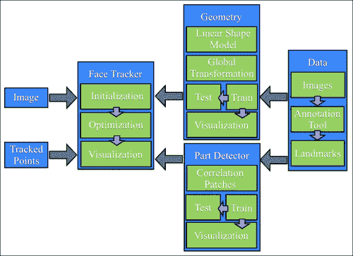

### 注意

请注意，本章中使用的所有方法都遵循数据驱动的范式，在该模型中，所使用的所有模型都是从数据中学习的，而不是在基于规则的设置中手动设计的。 因此，系统的每个组件都将包含两个组件：训练和测试。 训练从数据中构建模型，测试将这些模型应用于新的看不见的数据。

# 概述

随着 Cootes 和 Taylor 的**活动形状模型**（**ASM**）的出现，非刚性人脸追踪首次在 90 年代中期普及。 从那时起，大量的研究致力于解决通用人脸跟踪的难题，并且对 ASM 提出的原始方法进行了许多改进。 第一个里程碑是 2001 年，同样是 Cootes 和 Taylor，将 ASM 扩展到了**活动外观模型**（**AAM**）。 后来，贝克和各大学在 2000 年代中期通过对图像扭曲的原则性处理，使这种方法正式化。 沿着这些思路开展的另一项工作是 Blanz 和 Vetter 的 **3D 可变形模型**（**3DMM**），它与 AAM 一样，不仅为图像纹理建模，而且像 ASM 中一样沿对象边界进行轮廓剖析，但是通过使用从面部激光扫描中学到的高度密集的 3D 数据来表示模型，又向前迈了一步。 从 2000 年代中期到后期，人脸跟踪的研究重点从如何对人脸进行参数化转向如何设定和优化跟踪算法的目标。 应用了机器学习社区的各种技术，并获得了不同程度的成功。 自世纪之交以来，焦点再次转移，这一次是为了保证全局解决方案的联合参数和客观设计策略。

尽管对面部跟踪进行了持续的深入研究，但是使用面部跟踪的商业应用相对较少。 尽管有许多免费的源代码包可用于许多常用方法，但爱好者和爱好者的吸收也滞后。 但是，在过去的两年中，由于可能会使用面部跟踪，因此人们对公共领域重新产生了兴趣，并且商业级产品也开始出现。

# 工具

在深入了解复杂的面部跟踪之前，必须先引入所有面部跟踪方法共有的许多簿记任务和约定。 本节的其余部分将处理这些问题。 有兴趣的读者可能希望在初读时跳过本部分，直接进入有关几何约束的部分。

## 面向对象设计

与人脸检测和识别一样，人脸跟踪在程序上也包含两个部分：数据和算法。 该算法通常通过参考预存储（即离线）的数据作为指导，对传入（即在线）的数据执行某种操作。 这样，将算法与算法所依赖的数据相结合的面向对象设计是一种方便的设计选择。

在 OpenCV v2.x 中，引入了一种方便的 XML/YAML 文件存储类，该类大大简化了组织脱机数据以供算法使用的任务。 为了利用此功能，本章中描述的所有类都将实现读和写序列化功能。 虚类`foo`的示例如下所示：

```cpp
#include <opencv2/opencv.hpp>
using namespace cv;
class foo{
    public:
        Mat a;
        type_b b;
        void write(FileStorage &fs) const{
              assert(fs.isOpened());
              fs << "{" << "a"  << a << "b"  << b << "}";
        }
        void read(const FileNode& node){
            assert(node.type() == FileNode::MAP);
              node["a"] >> a; node["b"] >> b;
        }
};
```

在这里，`Mat`是 OpenCV 的矩阵类，`type_b`是（虚构的）用户定义的类，还定义了序列化功能。 I/O 函数`read`和`write`实现序列化。 `FileStorage`类支持两种可以序列化的数据结构。 为简单起见，在本章中，所有类都将仅使用映射，其中每个存储的变量都创建一个类型为`FileNode::MAP`的`FileNode`对象。 这要求将唯一的键分配给每个元素。 尽管此键的选择是任意的，但出于一致性的原因，我们将使用变量名作为标签。 如前面的代码片段所示，`read`和`write`函数采用特别简单的形式，从而使用流运算符（`<<`和`>>`）将数据插入和提取到`FileStorage`对象中 。 大多数 OpenCV 类都具有`read`和`write`函数的实现，从而可以轻松地存储它们包含的数据。

除了定义序列化功能之外，还必须定义两个附加函数，以使`FileStorage`类中的序列化起作用，如下所示：

```cpp
void write(FileStorage& fs, const string&, const foo& x){
  x.write(fs);
}
void read(const FileNode& node, foo& x,const foo& default){
  if(node.empty())x = d; else x.read(node);
}
```

由于这两个函数的功能对于我们在本节中描述的所有类均保持不变，因此它们是在本章相关源代码中的`ft.hpp`头文件中进行模板化和定义的。 最后，为了轻松保存和加载利用序列化功能的用户定义的类，还可以在头文件中实现针对这些类的模板化函数，如下所示：

```cpp
template <class T>
T load_ft(const char* fname){
  T x; FileStorage f(fname,FileStorage::READ);
  f["ft object"] >> x; f.release(); return x;
}
template<class T>
void save_ft(const char* fname,const T& x){
  FileStorage f(fname,FileStorage::WRITE);
  f << "ft object" << x; f.release();
}
```

请注意，与对象关联的标签始终相同（即`ft object`）。 定义了这些功能后，保存和加载对象数据将轻松完成。 在以下示例的帮助下显示了此内容：

```cpp
#include "opencv_hotshots/ft/ft.hpp"
#include "foo.hpp"
int main(){
  ...
  foo A; save_ft<foo>("foo.xml",A);
  ...
  foo B = load_ft<foo>("foo.xml");
  ...
}
```

请注意，`.xml`扩展名生成 XML 格式的数据文件。 对于其他任何扩展名，它默认为（更易理解的）YAML 格式。

## 数据收集：图像和视频标注

现代人脸跟踪技术几乎完全由数据驱动，也就是说，用于检测图像中人脸特征位置的算法依赖于一组示例中人脸特征的外观模型及其相对位置之间的几何相关性。 实例集越大，算法就越表现出鲁棒性，因为它们越来越了解面孔可能表现出的变化范围。 因此，构建面部跟踪算法的第一步是创建图像/视频标注工具，用户可以在其中指定每个示例图像中所需人脸特征的位置。

### 训练数据类型

用于训练面部跟踪算法的数据通常包含四个组件：

*   **图像**：该组件是包含整个面部的图像（静止图像或视频帧）的集合。 为了获得最佳结果，此集合应专门针对随后部署跟踪器的条件类型（即身份，照明，与摄像机的距离，捕获设备等）。 同样重要的是，集合中的面孔必须具有预期应用期望的各种头部姿势和面部表情。
*   **标注**：该组件在每个图像中按顺序排列了手工标记的位置，这些位置与要跟踪的每个人脸特征相对应。 更多的人脸特征通常会导致跟踪器更强大，因为跟踪算法可以使用它们的测量值来相互增强。 常见跟踪算法的计算成本通常与人脸特征的数量成线性比例。
*   **对称性索引**：该组件具有每个人脸特征点的索引，这些索引定义了其双边对称特征。 这可以用来镜像训练图像，有效地使训练集大小加倍，并使数据沿 y 轴对称。
*   **连接性索引**：该组件具有一组标注的索引对，这些标注对定义了人脸特征的语义解释。 这些连接对于可视化跟踪结果很有用。

下图显示了这四个组件的可视化，其中从左到右分别是原始图像，人脸特征标注，颜色编码的双边对称点，镜像图像以及标注和人脸特征连通性。

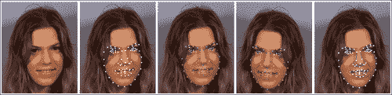

为了方便地管理此类数据，实现存储和访问功能的类是一个有用的组件。 OpenCV 的`ml`模块中的`CvMLData`类具有处理通常在机器学习问题中使用的常规数据的功能。 但是，它缺少面部跟踪数据所需的功能。 因此，在本章中，我们将使用在`ft_data.hpp`头文件中声明的`ft_data`类，该类是专门为面部跟踪数据而设计的。 所有数据元素都定义为类的公共成员，如下所示：

```cpp
class ft_data{
public:
  vector<int> symmetry;
  vector<Vec2i> connections;
  vector<string> imnames;
  vector<vector<Point2f> > points;
  …
}
```

`Vec2i`和`Point2f`类型分别是两个整数和 2D 浮点坐标的向量的 OpenCV 类。 `symmetry`向量具有与面部上的特征点一样多的成分（由用户定义）。 `connections`中的每一个都定义了一个连接人脸特征的从零开始的索引对。 由于训练集可能非常大，而不是直接存储图像，因此该类将每个图像的文件名存储在`imnames`成员变量中（请注意，这要求图像必须位于文件名的相同相对路径中，来保持有效）。 最后，对于每个训练图像，将人脸特征位置的集合作为浮点坐标的向量存储在`points`成员变量中。

`ft_data`类实现了许多用于访问数据的便捷方法。 要访问数据集中的图像，`get_image`函数将图像加载到指定索引`idx`，并可选地围绕 y 轴进行镜像，如下所示：

```cpp
Mat
ft_data::get_image(
const int idx,   //index of image to load from file
const int flag){ //0=gray,1=gray+flip,2=rgb,3=rgb+flip
  if((idx < 0) || (idx >= (int)imnames.size()))return Mat();
  Mat img,im;
  if(flag < 2)img = imread(imnames[idx],0);
  else        img = imread(imnames[idx],1);
  if(flag % 2 != 0)flip(img,im,1); else im = img;
  return im;
}
```

传递给 OpenCV 的`imread`函数的（`0`和`1`）标志指定将图像加载为 3 通道彩色图像还是单通道灰度图像。 传递给 OpenCV 的`flip`函数的标志指定围绕 y 轴的镜像。

要访问与特定索引处的图像对应的点集，`get_points`函数返回浮点坐标的向量，并可以选择镜像其索引的方式，如下所示：

```cpp
vector<Point2f>
ft_data::get_points(
const int idx,       //index of image corresponding to pointsconst bool flipped){ //is the image flipped around the y-axis?
  if((idx < 0) || (idx >= (int)imnames.size()))
    return vector<Point2f>();
  vector<Point2f> p = points[idx];
  if(flipped){
    Mat im = this->get_image(idx,0); int n = p.size();
    vector<Point2f> q(n);
    for(int i = 0; i < n; i++){      
      q[i].x = im.cols-1-p[symmetry[i]].x;
      q[i].y = p[symmetry[i]].y;
    }return q;
  }else return p;
}
```

请注意，指定了镜像标志后，此函数将调用`get_image`函数。 这是确定图像的宽度所必需的，以便正确地反映人脸特征坐标。 通过简单地将图像宽度作为变量传递，可以设计出一种更有效的方法。 最后，此函数说明了`symmetry`成员变量的工具。 特定索引的镜像特征位置只是`symmetry`变量中指定的索引的特征位置，其 x 坐标被翻转和偏置。

如果指定的索引超出数据集的索引，则`get_image`和`get_points`函数都将返回空结构。 也可能不是所有的图像都带有标注。 可以将面部跟踪算法设计为处理丢失的数据，但是，这些实现通常涉及面很广，并且超出了本章的范围。 `ft_data`类实现了一个用于从其集合中删除没有相应标注的样本的功能，如下所示：

```cpp
void
ft_data::rm_incomplete_samples(){
  int n = points[0].size(),N = points.size();
  for(int i = 1; i < N; i++)n = max(n,int(points[i].size()));
  for(int i = 0; i < int(points.size()); i++){
    if(int(points[i].size()) != n){
      points.erase(points.begin()+i);
       imnames.erase(imnames.begin()+i); i--;
    }else{
      int j = 0;
      for(; j < n; j++){
       if((points[i][j].x <= 0) ||
        (points[i][j].y <= 0))break;
      }
      if(j < n){
      points.erase(points.begin()+i);
      imnames.erase(imnames.begin()+i); i--;
      }
    }
  }
}
```

具有最多标注的样本实例被假定为规范样本。 使用向量的`erase`函数从集合中删除所有点集少于点数的数据实例。 还要注意，坐标`(x, y)`小于 1 的点被认为在其对应的图像中丢失（可能是由于遮挡，可见性差或模糊不清）。

`ft_data`类实现了序列化函数`read`和`write`，因此可以轻松存储和加载。 例如，保存数据集可以很简单地完成：

```cpp
ft_data D;                        //instantiate data structure
…                                 //populate data
save_ft<ft_data>("mydata.xml",D); //save data
```

为了可视化数据集，`ft_data`实现了许多绘图函数。 在`visualize_annotations.cpp`文件中说明了它们的用法。 这个简单的程序加载存储在命令行指定文件中的标注数据，删除不完整的样本，并显示训练图像及其相应的标注，对称性和连接。 这里展示了 OpenCV 的`highgui`模块的一些显着功能。 尽管 OpenCV 的`highgui`模块非常简陋且不适合复杂的用户界面，但它的功能对于在计算机视觉应用中加载和可视化数据和算法输出非常有用。 与其他计算机视觉库相比，这也许是 OpenCV 的与众不同之处。

### 标注工具

为了帮助生成供本章代码使用的标注，可以在`annotate.cpp`文件中找到基本的标注工具。 该工具将来自文件或摄像机的视频流作为输入。 以下四个步骤列出了使用该工具的过程：

1.  **捕获图像**：在第一步中，图像流显示在屏幕上，并且用户可以通过按`S`键选择要标注的图像。 最好的标注功能集是最大程度地扩展了面部跟踪系统将要跟踪的面部行为范围的那些功能。
2.  **标注第一张图像**：在此第二步中，向用户呈现在上一阶段中选择的第一张图像。 然后，用户继续在与需要跟踪的人脸特征有关的位置上单击图像。
3.  **标注连接**：在此第三步中，为了更好地可视化形状，需要定义点的连接结构。 在此，向用户显示与上一阶段相同的图像，其中现在的任务是依次单击一组点对，以建立人脸模型的连接结构。
4.  **标注对称性**：在此步骤中，仍然使用相同的图像，用户选择显示双边对称性的点对。
5.  **标注剩余图像**：在此最后一步中，此处的过程与步骤 2 相似，不同之处在于用户可以浏览图像集并异步标注它们。

有兴趣的读者可能希望通过改善其可用性来改进此工具，甚至可能集成增量学习过程，从而在对每个附加图像添加标注后更新跟踪模型，然后将其用于初始化点以减轻标注负担。

尽管可以使用一些公开可用的数据集来与本章中开发的代码一起使用（例如，参见下一节中的描述），但是标注工具可以用于构建特定于人的面部跟踪模型，其效果通常要好于通用的，独立于人的，对应的东西。

### 预标注的数据（MUCT 数据集）

开发面部跟踪系统的阻碍因素之一是人工标注大量图像的繁琐且容易出错的过程，每个图像都有很多点。 为了简化此过程，以遵循本章中的工作，可以从以下位置下载公开可用的 [MUCT 数据集](http://www.milbo.org/muct)。

该数据集包含 3755 张带有 76 点地标的面部图像。 数据集中的对象年龄和种族不同，并且在许多不同的光照条件和头部姿势下被捕获。

要将 MUCT 数据集与本章中的代码一起使用，请执行以下步骤：

1.  **下载图像集**：在此步骤中，可以通过将文件`muct-a-jpg-v1.tar.gz`下载到`muct-e-jpg-v1.tar.gz`并解压缩来获取数据集中的所有图像。 这将生成一个新文件夹，其中将存储所有图像。
2.  **下载标注**：在此步骤中，下载包含标注`muct-landmarks-v1.tar.gz`的文件。 将该文件保存并解压缩到与下载图像相同的文件夹中。
3.  **使用标注工具**定义连接和对称性：在此步骤中，从命令行发出命令`./annotate -m $mdir -d $odir`，其中`$mdir`表示保存 MUCT 数据集的文件夹，`$odir`表示将`annotations.yaml`文件（包含作为`ft_data`对象存储的数据）写入到的文件夹。

### 提示

鼓励使用 MUCT 数据集来快速介绍本章中描述的面部跟踪代码的功能。

# 几何约束

在面部跟踪中，几何形状是指一组预定义的点的空间配置，这些点对应于人脸在物理上一致的位置（例如眼角，鼻尖和眉毛边缘）。 这些点的特定选择取决于应用，其中一些应用需要超过 100 个点的密集集合，而其他应用只需要稀疏选择。 但是，人脸跟踪算法的鲁棒性通常会随着点数的增加而提高，因为它们的单独测量可以通过其相对的空间依赖性相互增强。 例如，知道眼角的位置很好地表明了鼻子的位置。 但是，通过增加点数获得的鲁棒性改进存在局限性，在这种情况下，表现通常会在大约 100 点之后停滞。 此外，增加用于描述人脸的点集会使计算复杂度线性增加。 因此，对计算负载有严格限制的应用可以用更少的点实现更好的表现。

在这种情况下，更快的跟踪通常会导致在线设置中的跟踪更加准确。 这是因为，当丢下帧时，帧之间的感知运动会增加，并且用于在每个帧中查找人脸的配置的优化算法必须搜索较大的特征点可能配置空间； 当帧之间的位移变得太大时，该过程通常会失败。 总而言之，尽管有关于如何最佳设计人脸特征点选择以获取最佳表现的通用指南，但该选择应专门针对应用领域。

面部几何形状通常被参数化为两个元素的组合：整体（刚性）变形和局部（非刚性）变形。 全局变换说明了脸部在图像中的整体位置，通常可以无限制地进行更改（即，脸部可以出现在图像中的任何位置）。 这包括图像中人脸的`(x, y)`位置，平面内头部旋转以及图像中人脸的大小。 另一方面，局部变形可解决不同身份的面部形状之间以及表情之间的差异。 与全局转换相反，这些局部变形通常在很大程度上由于人脸特征的高度结构化配置而受到更大的限制。 全局变换是 2D 坐标的通用函数，适用于任何类型的对象，而局部变形是特定于对象的，必须从训练数据集中学习。

在本节中，我们将描述面部结构的几何模型的构建，在此称为形状模型。 根据应用的不同，它可以捕获单个人的表情变化，整个人群的面部形状之间的差异或两者的组合。 该模型在`shape_model.hpp`和`shape_model.cpp`文件中找到的`shape_model`类中实现。 以下代码段是`shape_model`类标头的一部分，突出了其主要功能：

```cpp
class shape_model{ //2d linear shape model
public:
  Mat p; //parameter vector (kx1) CV_32F
  Mat V; //linear subspace (2nxk) CV_32F
  Mat e; //parameter variance (kx1) CV_32F
  Mat C; //connectivity (cx2) CV_32S
  ...
  void calc_params(
  const vector<Point2f> &pts,  //points to compute parameters
  const Mat &weight = Mat(),    //weight/point (nx1) CV_32F
  const float c_factor = 3.0); //clamping factor
  ...
  vector<Point2f>              //shape described by parameters
  calc_shape();
  ...
  void train(
  const vector<vector<Point2f> > &p, //N-example shapes
  const vector<Vec2i> &con = vector<Vec2i>(),//connectivity
  const float frac = 0.95, //fraction of variation to retain
  const int kmax = 10);   //maximum number of modes to retain
  ...
}
```

代表面部形状变化的模型被编码在子空间矩阵`V`和方差向量`e`中。 参数向量`p`存储关于模型的形状的编码。 连接矩阵`C`也存储在此类中，因为它仅与可视化脸部形状的实例有关。 此类中最受关注的三个功能是`calc_params`，`calc_shape`和`train`。 `calc_params`函数可将一组点投影到可能的脸部形状空间上。 可选地，它为要投影的每个点提供单独的置信度权重。 `calc_shape`函数通过使用面部模型（由`V`和`e`编码）对参数向量`p`进行解码来生成一组点。 `train`函数从面部形状的数据集中学习编码模型，每个面部形状由相同数量的点组成。 参数`frac`和`kmax`是训练过程的参数，可以专门用于手头的数据。

在以下各节中将详细介绍此类的功能，在此首先描述**普氏分析法**，这是一种用于刚性注册点集的方法，其后是用于表示局部变形的线性模型。 `train_shape_model.cpp`和`visualize_shape_model.cpp`文件中的程序分别训练和可视化形状模型。 它们的用法将在本节末尾概述。

## 普氏分析

为了建立面部形状的变形模型，我们必须首先处理原始的带标注的数据，以删除与整体刚性运动有关的分量。 在 2D 模型中对几何图形建模时，刚性运动通常表示为相似度转换。 这包括比例尺，平面内旋转和平移。 下图说明了相似变换下的一组允许的运动类型。 从点集合中删除整体刚体的过程称为 Procrustes 分析。

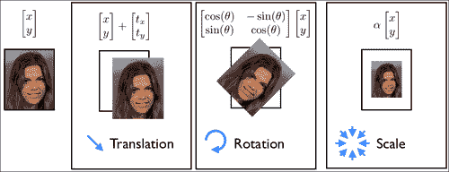

在数学上，Procrustes 分析的目的是同时找到一个规范的形状，并对每个数据实例进行相似性转换，使它们与规范的形状对齐。 此处，对齐方式是作为每个变形形状与规范形状之间的最小二乘距离测量的。 在`shape_model`类中，实现此目标的迭代过程如下：

```cpp
#define fl at<float>
Mat shape_model::procrustes(
const Mat &X,       //interleaved raw shape data as columns
const int itol,     //maximum number of iterations to try
const float ftol)   //convergence tolerance
{
  int N = X.cols,n = X.rows/2; Mat Co,P = X.clone();//copy
  for(int i = 0; i < N; i++){
    Mat p = P.col(i);            //i'th shape
    float mx = 0,my = 0;         //compute centre of mass...
    for(int j = 0; j < n; j++){  //for x and y separately
      mx += p.fl(2*j); my += p.fl(2*j+1);
    }
    mx /= n; my /= n;
    for(int j = 0; j < n; j++){ //remove center of mass
      p.fl(2*j) -= mx; p.fl(2*j+1) -= my;
    }
  }
  for(int iter = 0; iter < itol; iter++){    
    Mat C = P*Mat::ones(N,1,CV_32F)/N; //compute normalized...
 normalize(C,C);                    //canonical shape
    if(iter > 0){if(norm(C,Co) < ftol)break;} //converged?
    Co = C.clone();               //remember current estimate
    for(int i = 0; i < N; i++){
 Mat R = this->rot_scale_align(P.col(i),C);
      for(int j = 0; j < n; j++){ //apply similarity transform
       float x = P.fl(2*j,i),y = P.fl(2*j+1,i);
       P.fl(2*j  ,i) = R.fl(0,0)*x + R.fl(0,1)*y;
       P.fl(2*j+1,i) = R.fl(1,0)*x + R.fl(1,1)*y;
      }
    }
  }return P; //returned procrustes aligned shapes
}
```

该算法首先减去每个形状实例的质心，然后执行迭代过程，该迭代过程在计算规范形状（作为所有形状的归一化平均值）与旋转和缩放每个形状以最佳匹配规范形状之间交替进行。 估计规范形状的规范化步骤对于固定问题的规模并防止其将所有形状缩小为零是必需的。 锚定标度的选择是任意的，这里我们选择将规范形状向量`C`的长度强制为 1.0，这也是 OpenCV `normalize`函数的默认行为。 通过`rot_scale_align`函数，可以计算出最佳地将每个形状的实例与规范形状的当前估计对齐的平面内旋转和缩放，方法如下：

```cpp
Mat shape_model::rot_scale_align(
const Mat &src, //[x1;y1;...;xn;yn] vector of source shape
const Mat &dst) //destination shape
{
  //construct linear system
  int n = src.rows/2; float a=0,b=0,d=0;
  for(int i = 0; i < n; i++){
    d+= src.fl(2*i)*src.fl(2*i  )+src.fl(2*i+1)*src.fl(2*i+1);
    a+= src.fl(2*i)*dst.fl(2*i  )+src.fl(2*i+1)*dst.fl(2*i+1);
    b+= src.fl(2*i)*dst.fl(2*i+1)-src.fl(2*i+1)*dst.fl(2*i  );
  }
  a /= d; b /= d;//solve linear system
  return (Mat_<float>(2,2) << a,-b,b,a);
}
```

此功能可最大程度地减小旋转后的形状和标准形状之间的最小二乘方差。 从数学上讲，可以这样写：

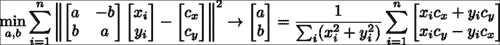

在这里，最小二乘问题的解决方案采用下式右侧等式中所示的封闭形式的解决方案。 请注意，我们求解变量`(a, b)`而不是求解在缩放的 2D 旋转矩阵中非线性相关的缩放和平面内旋转。 这些变量与比例尺和旋转矩阵有关，如下所示：


下图说明了 Procrustes 分析对原始带标注的形状数据的影响的可视化。 每个人脸特征都以独特的颜色显示。 平移规范化后，人脸结构变得明显，其中人脸特征的位置围绕其平均位置聚集。 经过迭代缩放和旋转归一化过程后，特征聚类变得更紧凑，并且它们的分布变得更能代表由面部变形引起的变化。 最后一点很重要，因为我们将在以下部分中尝试对这些变形进行建模。 因此，可以将 Procrustes 分析的作用视为对原始数据的预处理操作，从而可以更好地了解面的局部变形模型。


## 线性形状模型

脸部变形建模的目的是找到一个紧凑的参数表示形式，以表示脸部的形状在不同身份之间以及表情之间如何变化。 有多种方法可以实现此目标，并且具有不同的复杂度。 其中最简单的方法是使用面部几何图形的线性表示。 尽管简单，但已显示它可以精确捕获面部变形的空间，特别是当数据集中的面部主要处于正面姿势时。 与它的非线性对应物相比，其优点还在于，推断其表示的参数是极其简单且廉价的操作。 在部署它以限制跟踪过程中的搜索过程时，这起着重要作用。

下图显示了线性建模面部形状的主要思想。 在此，将由`N`人脸特征组成的脸部形状建模为`2N`维空间中的单个点。 线性建模的目的是找到一个嵌入到所有脸部形状点（即图像中的绿色点）的`2N`维空间内的低维超平面。 由于此超平面仅跨越整个`2N`维空间的子集，因此通常称为子空间。 子空间的维数越低，人脸的表示越紧凑，并且它对跟踪过程施加的约束越强。 这通常会导致更强大的跟踪。 但是，在选择子空间的尺寸时应格外小心，以使其具有足够的能力来覆盖所有脸部的空间，但不要太大，以至于非脸部形状位于其范围内（即图像中的红点）。 应该注意的是，当对来自单个人的数据进行建模时，捕获面部变异性的子空间通常比对多个身份进行建模的子空间更为紧凑。 这就是特定于人的跟踪器的表现要比通用跟踪器好得多的原因之一。


查找跨数据集的最佳低维子空间的过程称为**主成分分析**（**PCA**）。 OpenCV 实现了用于计算 PCA 的类，但是，它需要预先指定保留的子空间维数。 由于这通常很难确定先验，因此一种常见的启发式方法是根据其占变异总量的比例来选择它。 在`shape_model::train`函数中，PCA 的实现如下：

```cpp
SVD svd(dY*dY.t());
int m = min(min(kmax,N-1),n-1);
float vsum = 0; for(int i = 0; i < m; i++)vsum += svd.w.fl(i);
float v = 0; int k = 0;
for(k = 0; k < m; k++){
 v += svd.w.fl(k); if(v/vsum >= frac){k++; break;}
}
if(k > m)k = m;
Mat D = svd.u(Rect(0,0,k,2*n));

```

在此，`dY`变量的每一列表示均值减去 Procrustes 对齐的形状。 因此，将**奇异值分解**（**SVD**）有效地应用于形状数据（即，`dY.t()*dY`）的协方差矩阵。 OpenCV 的`SVD`类的`w`成员存储数据变异性主要方向上的变异，从最大到最小顺序排列。 选择子空间维数的一种常见方法是选择最小的方向集，该方向集保留数据总能量的一部分`frac`，这由`svd.w`的条目表示。 由于这些条目是按从大到小的顺序排列的，因此可以通过贪婪地评估顶部`k`个可变方向上的能量来枚举子空间选择。 方向本身存储在`SVD`类的`u`成员中。 `svd.w`和`svd.u`组件通常分别称为特征谱和特征向量。 下图显示了这两个组件的可视化：

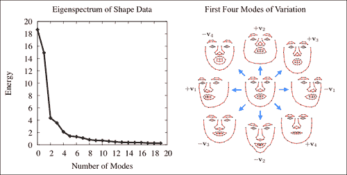

### 注意

注意，本征谱迅速减小，这表明可以用低维子空间对数据中包含的大多数变化进行建模。

## 组合的局部-全局表示

图像帧中的形状是由局部变形和整体变形的组合产生的。 从数学上讲，此参数化可能会出现问题，因为这些变换的组合会导致非线性函数不接受封闭形式的解决方案。 解决此问题的常用方法是将全局变换建模为线性子空间，并将其附加到变形子空间。 对于固定形状，可以使用以下子空间对相似性变换进行建模：

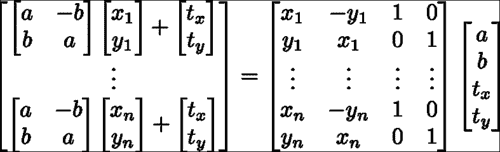

在`shape_model`类中，此子空间是使用`calc_rigid_basis`函数生成的。 从中生成子空间的形状（即前面方程中的`x`和`y`分量）是 Procustes 对齐的形状（即规范形状）的平均形状。 除了以上述形式构造子空间外，矩阵的每一列都被标准化为单位长度。 在`shape_model::train`函数中，上一节中描述的变量`dY`通过投影与刚性运动有关的数据分量来计算，如下所示：

```cpp
Mat R = this->calc_rigid_basis(Y); //compute rigid subspace
Mat P = R.t()*Y; Mat dY = Y – R*P; //project-out rigidity
```

请注意，此投影被实现为简单的矩阵乘法。 这是可能的，因为刚性子空间的列已进行长度标准化。 这不会改变模型所跨越的空间，仅意味着`R.t()*R`等于单位矩阵。

由于在学习变形模型之前已将源自刚性变换的可变性方向从数据中删除，因此所得的变形子空间将与刚性变换子空间正交。 因此，连接两个子空间会导致组合的局部局部全局线性表示的脸部形状，这也是正交的。 通过在 OpenCV 的`Mat`类中实现的 ROI 提取机制，将两个子空间矩阵分配给组合子空间矩阵的子矩阵，可以执行以下连接操作：

```cpp
V.create(2*n,4+k,CV_32F);                  //combined subspace
Mat Vr = V(Rect(0,0,4,2*n)); R.copyTo(Vr); //rigid subspace
Mat Vd = V(Rect(4,0,k,2*n)); D.copyTo(Vd); //nonrigid subspace
```

结果模型的正交性意味着可以很容易地计算出描述形状的参数，就像`shape_model::calc_params`函数中所做的那样：

```cpp
p = V.t()*s;
```

这里`s`是向量化的脸部形状，`p`将坐标存储在代表它的脸部子空间中。

关于对面部形状进行线性建模的最后一点要注意的是如何约束子空间坐标，以使使用该子空间坐标生成的形状保持有效。 在下面的图像中，显示了子空间内的面部形状实例，这些坐标用于在可变方向之一上以四个标准差的增量递增坐标。 请注意，对于较小的值，生成的形状将保持类似面的形状，但随着这些值变得太大而恶化。


防止这种变形的一种简单方法是将子空间坐标值钳位在根据数据集确定的允许区域内。 对此的常见选择是在数据的±3 标准差内的框约束，占数据变化的 99.7%。 找到子空间后，将在`shape_model::train`函数中计算这些钳位值，如下所示：

```cpp
Mat Q = V.t()*X;            //project raw data onto subspace
for(int i = 0; i < N; i++){ //normalize coordinates w.r.t scale
 float v = Q.fl(0,i); Mat q = Q.col(i); q /= v;
}
e.create(4+k,1,CV_32F); multiply(Q,Q,Q);
for(int i = 0; i < 4+k; i++){
 if(i < 4)e.fl(i) = -1; //no clamping for rigid coefficients
  else e.fl(i) = Q.row(i).dot(Mat::ones(1,N,CV_32F))/(N-1);
}
```

注意，在相对于第一维（即比例尺）的坐标进行归一化之后，在子空间坐标`Q`上计算了方差。 这样可以防止规模较大的数据样本主导估计。 另外，请注意，为刚性子空间（即`V`的前四列）的坐标的方差分配了负值。 夹紧函数`shape_model::clamp`检查特定方向的方差是否为负，并且仅在否时才应用夹紧，如下所示：

```cpp
void shape_model::clamp(
const float c){ //clamping as fraction of standard deviation
  double scale = p.fl(0);        //extract scale
  for(int i = 0; i < e.rows; i++){
 if(e.fl(i) < 0)continue;     //ignore rigid components
    float v = c*sqrt(e.fl(i));   //c*standard deviations box
    if(fabs(p.fl(i)/scale) > v){ //preserve sign of coordinate
 if(p.fl(i) > 0)p.fl(i) =  v*scale; //positive threshold
 else p.fl(i) = -v*scale; //negative threshold
    }
  }
}
```

这是因为训练数据通常是在人为设置的设置下捕获的，在该设置下，人脸直立并以特定比例在图像中居中。 夹紧形状模型的刚性组件以使其与训练集中的配置保持一致将过于严格。 最后，由于在比例尺归一化的框架中计算了每个可变形坐标的方差，因此在夹紧期间必须对坐标应用相同的比例尺。

## 训练和可视化

在`train_shape_model.cpp`中可以找到用于从标注数据中训练形状模型的示例程序。 在命令行参数`argv[1]`包含标注数据的路径的情况下，训练首先将数据加载到内存中并删除不完整的样本，如下所示：

```cpp
ft_data data = load_ft<ft_data>(argv[1]);
data.rm_incomplete_samples();
```

然后，将每个示例的标注以及可选的镜像对应标注存储在向量中，然后将它们传递给训练函数，如下所示：

```cpp
vector<vector<Point2f> > points;
for(int i = 0; i < int(data.points.size()); i++){
  points.push_back(data.get_points(i,false));
  if(mirror)points.push_back(data.get_points(i,true));
}
```

然后通过对`shape_model::train`的单个功能调用来训练形状模型，如下所示：

```cpp
shape_model smodel; smodel.train(points,data.connections,frac,kmax);
```

尽管默认设置为 0.95 和 20，但是`frac`（即要保留的变化比例）和`kmax`（即要保留的特征向量的最大数量）也可以选择设置。 分别在大多数情况下往往效果很好。 最后，在命令行参数`argv[2]`包含将经过训练的形状模型保存到的路径的情况下，可以通过单个函数调用执行保存，如下所示：

```cpp
save_ft(argv[2],smodel);
```

通过为`shape_model`类定义`read`和`write`序列化函数，可以简化此步骤。

为了可视化训练后的形状模型，`visualize_shape_model.cpp`程序依次对每个方向上学习到的非刚性变形进行动画处理。 首先将形状模型加载到内存中，如下所示：

```cpp
shape_model smodel = load_ft<shape_model>(argv[1]);
```

将模型放置在显示窗口中心的刚性参数计算如下：

```cpp
int n = smodel.V.rows/2;
float scale = calc_scale(smodel.V.col(0),200);
float tranx =
n*150.0/smodel.V.col(2).dot(Mat::ones(2*n,1,CV_32F));
float trany =
n*150.0/smodel.V.col(3).dot(Mat::ones(2*n,1,CV_32F));
```

在这里，`calc_scale`函数查找将生成宽度为 200 像素的面部形状的缩放系数。 通过查找产生 150 个像素的平移的系数来计算平移分量（也就是说，模型以均心为中心，显示窗口的大小为`300 x 300`像素）。

### 注意

请注意，`shape_model::V`的第一列分别对应于比例，第三列和第四列分别对应于 x 和 y 平移。

然后生成参数值的轨迹，该轨迹从零开始，移至正极值，移至负极值，然后返回零，如下所示：

```cpp
vector<float> val;
for(int i = 0; i < 50; i++)val.push_back(float(i)/50);
for(int i = 0; i < 50; i++)val.push_back(float(50-i)/50);
for(int i = 0; i < 50; i++)val.push_back(-float(i)/50);
for(int i = 0; i < 50; i++)val.push_back(-float(50-i)/50);
```

在此，动画的每个阶段都由五十个增量组成。 然后使用该轨迹为人脸模型制作动画，并在显示窗口中呈现结果，如下所示：

```cpp
  Mat img(300,300,CV_8UC3); namedWindow("shape model");
  while(1){
    for(int k = 4; k < smodel.V.cols; k++){
      for(int j = 0; j < int(val.size()); j++){
 Mat p = Mat::zeros(smodel.V.cols,1,CV_32F);
 p.at<float>(0) = scale;
 p.at<float>(2) = tranx;
 p.at<float>(3) = trany;
 p.at<float>(k) = scale*val[j]`3.0`
 sqrt(smodel.e.at<float>(k)); 
        p.copyTo(smodel.p); img = Scalar::all(255);
        vector<Point2f> q = smodel.calc_shape();
        draw_shape(img,q,smodel.C);
        imshow("shape model",img);
        if(waitKey(10) == 'q')return 0;
      }
    }
  }
```

### 注意

注意，刚性系数（即与`shape_model::V`的前四列相对应的刚性系数）始终设置为先前计算的值，以将面部放置在显示窗口的中央。

# 人脸特征检测器

检测图像中的人脸特征与一般物体检测非常相似。 OpenCV 具有一组用于构建通用对象检测器的复杂功能，其中最著名的是用于实现著名的 Viola-Jones 人脸检测器的基于 Haar 的特征检测器的级联。 但是，有一些独特的因素使人脸特征检测变得独特。 这些如下：

*   **精确度与鲁棒性**：在一般物体检测中，目的是找到图像中物体的粗略位置。 人脸特征检测器需要对特征位置进行高度精确的估计。 几个像素的误差在对象检测中被认为是无关紧要的，但这可能意味着通过特征检测在面部表情估计中的微笑和皱眉之间的差异。
*   **有限的支持空间带来的歧义**：通常假设通用对象检测中的关注对象具有足够的图像结构，因此可以可靠地将其与不包含该对象的图像区域区分开。 对于通常具有有限空间支持的人脸特征通常不是这种情况。 这是因为不包含对象的图像区域通常会显示出与人脸特征非常相似的结构。 例如，从以特征为中心的小边界框看，脸部外围的特征可以很容易地与其他任何包含穿过其中心的强边缘的图像块混淆。
*   **计算复杂度**：通用对象检测旨在查找图像中对象的所有实例。 另一方面，脸部追踪需要所有脸部特征的位置，通常范围从 20 到 100 个左右。 因此，有效地评估每个特征检测器的能力对于构建可以实时运行的面部跟踪器至关重要。

由于这些差异，在面部跟踪中使用的人脸特征检测器通常是出于这一目的而专门设计的。 当然，在面部跟踪中，存在许多将通用对象检测技术应用于人脸特征检测器的实例。 但是，对于哪种代表最适合该问题，社区似乎尚未达成共识。

在本节中，我们将使用一种表示可能是最简单的模型：线性图像斑块来构建人脸特征检测器。 尽管它很简单，但在设计学习程序时要格外小心，我们将看到，这种表示实际上可以给出用于面部跟踪算法的人脸特征位置的合理估计。 此外，它们的简单性使得能够进行极其快速的评估，从而可以进行实时面部跟踪。 由于其表示为图像补丁，因此人脸特征检测器被称为补丁模型。 该模型在`patch_model.hpp`和`patch_model.cpp`文件中找到的`patch_model`类中实现。 以下代码段是`patch_model`类的标题，突出显示了其主要功能：

```cpp
class patch_model{
public:
  Mat P; //normalized patch
  ...
  Mat                          //response map
  calc_response(
  const Mat &im,               //image patch of search region
  const bool sum2one = false); //normalize to sum-to-one?
  ...
  void
  train(const vector<Mat> &images, //training image patches
  const Size psize,                //patch size
  const float var = 1.0,           //ideal response variance
  const float lambda = 1e-6,       //regularization weight
  const float mu_init = 1e-3,      //initial step size
  const int nsamples = 1000,       //number of samples
  const bool visi = false);        //visualize process?
  ...
};
```

用于检测人脸特征的补丁模型存储在矩阵`P`中。 此类中最受关注的两个功能是`calc_response`和`train`。 `calc_response`函数在搜索区域`im`上的每个整数位移处评估补丁模型的响应。 `train`函数学习大小为`psize`的补丁模型`P`，平均而言，它会在训练集上产生尽可能接近理想响应图的响应图。 参数`var`，`lambda`，`mu_init`和`nsamples`是训练过程的参数，可以对其进行调整以优化手头数据的表现。

在本节中将详细介绍此类的功能。 我们首先讨论相关补丁及其训练过程，这将用于学习补丁模型。 接下来，将描述`patch_models`类，该类是每个人脸特征的补丁模型的集合，并且具有说明全局转换的功能。 `train_patch_model.cpp`和`visualize_patch_model.cpp`中的程序分别训练和可视化补丁模型，其用法将在本部分末尾的人脸特征检测器上概述。

## 基于相关性的补丁模型

在学习检测器中，有两个主要的竞争范例：生成式和判别式。 生成方法学习图像补丁的基本表示形式，该形式可以最佳地以所有表现形式生成对象外观。 另一方面，区分性方法学习一种表示，该表示可以最好地将对象的实例与模型在部署时可能会遇到的其他对象区分开。 生成方法的优势在于，生成的模型对特定于对象的属性进行编码，从而可以从视觉上检查对象的新实例。 属于生成方法范式的一种流行方法是著名的 Eigenfaces 方法。 判别方法的优点是模型的全部功能直接针对当前的问题； 将对象的实例与所有其他实例区分开。 在所有判别方法中，最著名的也许就是支持向量机。 尽管这两种范例都可以在许多情况下很好地工作，但是我们将看到，将人脸特征建模为图像块时，判别范例要优越得多。

### 注意

请注意，EigenFace 和支持向量机方法最初是为分类而不是检测或图像对齐而开发的。 但是，它们的基本数学概念已显示适用于面部跟踪领域。

### 学习判别式补丁模型

给定带标注的数据集，可以彼此独立地学习特征检测器。 判别补丁模型的学习目标是构造一个图像补丁，当该补丁与包含人脸特征的图像区域互相关时，在特征位置产生强烈的响应，而在其他位置产生较弱的响应。 从数学上讲，这可以表示为：

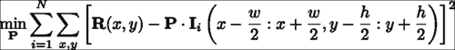

在这里，`P`表示补丁模型，`I`表示第`i`个训练图像，`I(a:b, c:d)`表示其左上和右下的矩形区域，角分别位于`(a, c)`和`(b, d)`。 周期符号表示内部乘积运算，`R`表示理想响应图。 该方程式的解决方案是一个补丁模型，该模型生成的响应图平均而言最接近使用最小二乘法标准测量的理想响应图。 理想响应图的一个显而易见的选择是`R`，除了中心处，其他任何地方都为零（假设训练图像块位于感兴趣的人脸特征的中心）。 实际上，由于图像是手工标记的，因此始终会出现标注错误。 为了解决这个问题，通常将`R`描述为距中心距离的衰减函数。 一个很好的选择是 2D-Gaussian 分布，它等效于假设标注错误是 Gaussian 分布。 下图显示了该设置的可视化，用于左外眼角：

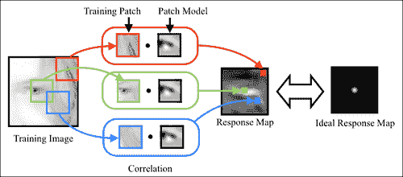

如先前所写的学习目标是以通常被称为线性最小二乘法的形式。 这样，它提供了封闭形式的解决方案。 但是，此问题的自由度（即变量可以改变以解决问题的方式的数量）等于补丁中的像素数量。 因此，即使对于中等大小的补丁或示例，`40 x 40`补丁模型也具有 1600 个自由度，但求解最佳补丁模型的计算成本和内存需求可能会令人望而却步。

解决学习问题的有效方法是线性方程组，它是一种称为随机梯度下降的方法。 通过将学习目标可视化为补丁模型自由度上的错误地形，随机梯度下降迭代地估计了地形的梯度方向，并在相反方向上走了一小步。 对于我们的问题，可以通过仅考虑针对训练集中的单个随机选择图像的学习目标的梯度来计算梯度的近似值：


在`patch_model`类中，此学习过程是在`train`函数中实现的：

```cpp
void
patch_model::train(
const vector<Mat> &images, //featured centered training images
const Size psize,          //desired patch model size
const float var,           //variance of annotation error
const float lambda,        //regularization parameter
const float mu_init,       //initial step size
const int nsamples,        //number of stochastic samples
const bool visi){          //visualise training process
  int N = images.size(),n = psize.width*psize.height;
  int dx = wsize.width-psize.width;   //center of response map
  int dy = wsize.height-psize.height; //...
 Mat F(dy,dx,CV_32F); //ideal response map
 for(int y = 0; y < dy; y++){  float vy = (dy-1)/2 - y;
 for(int x = 0; x < dx; x++){float vx = (dx-1)/2 - x;
 F.fl(y,x) = exp(-0.5*(vx*vx+vy*vy)/var); //Gaussian
 }
 }
 normalize(F,F,0,1,NORM_MINMAX); //normalize to [0:1] range

  //allocate memory
  Mat I(wsize.height,wsize.width,CV_32F);
  Mat dP(psize.height,psize.width,CV_32F);
  Mat O = Mat::ones(psize.height,psize.width,CV_32F)/n;
  P = Mat::zeros(psize.height,psize.width,CV_32F);

  //optimise using stochastic gradient descent
  RNG rn(getTickCount()); //random number generator
 double mu=mu_init,step=pow(1e-8/mu_init,1.0/nsamples);
  for(int sample = 0; sample < nsamples; sample++){
    int i = rn.uniform(0,N); //randomly sample image index
 I = this->convert_image(images[i]); dP = 0.0;
 for(int y = 0; y < dy; y++){ //compute stochastic gradient
 for(int x = 0; x < dx; x++){
 Mat Wi=I(Rect(x,y,psize.width,psize.height)).clone();
 Wi -= Wi.dot(O); normalize(Wi,Wi); //normalize
 dP += (F.fl(y,x) – P.dot(Wi))*Wi;
 }
 } 
 P += mu*(dP - lambda*P); //take a small step
    mu *= step;              //reduce step size
    ...
  }return;
}
```

前面代码中的第一个突出显示的代码段是计算理想响应图的位置。 由于图像集中在感兴趣的人脸特征上，因此所有样本的响应图均相同。 在第二个突出显示的代码段中，确定步长的衰减率`step`，以便在`nsamples`迭代之后，步长将衰减到接近零的值。 第三个突出显示的代码段是计算随机梯度方向并用于更新补丁模型的位置。 这里有两件事要注意。 首先，将训练中使用的图像传递到`patch_model::convert_image`函数，该函数将图像转换为单通道图像（如果是彩色图像），并将自然对数应用于图像像素强度：

```cpp
I += 1.0; log(I,I);
```

由于未定义零的对数，因此在应用对数之前，将偏置值 1 添加到每个像素。 在训练图像上执行此预处理的原因是，对数比例图像对对比度差异和照明条件的变化更鲁棒。 下图显示了面部区域中对比度不同的两个面部的图像。 在对数刻度图像中，图像之间的差异不如在原始图像中明显。


关于更新方程式要注意的第二点是从更新方向减去`lambda*P`。 这有效地使解决方案变得不会太大。 一种通常在机器学习算法中应用的过程，用于促进对看不见的数据进行泛化。 比例因子`lambda`是用户定义的，通常取决于问题。 但是，较小的值通常对于学习用于人脸特征检测的补丁模型非常有效。

### 生成式与判别式补丁模型

尽管如前所述可以轻松学习判别性补丁模型，但是值得考虑的是，生成性补丁模型及其相应的训练方式是否足够简单以实现相似的结果。 相关补丁模型的生成对应物是平均补丁。 该模型的学习目标是构建一个单个图像斑块，该图像块应尽可能接近通过最小二乘标准测量的人脸特征的所有示例：

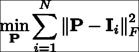

该问题的解决方案正是所有以功能为中心的训练图像补丁的平均值。 因此，以某种方式，该目标提供的解决方案要简单得多。

在下图中，显示了对响应图的比较，该响应图是通过将平均和相关补丁模型与示例图像互相关而获得的。 还示出了各自的平均值和相关补丁模型，其中像素值的范围被标准化以用于可视化目的。 尽管这两种补丁程序模型类型显示出一些相似之处，但是它们生成的响应图却大不相同。 尽管相关补丁模型生成的响应图在特征位置周围高度峰化，但平均补丁模型生成的响应图过于平滑，无法将特征位置与附近的特征区分开。 在检查补丁模型的外观时，相关补丁模型主要是灰色的，对应于未归一化像素范围内的零，在策略上围绕人脸特征的突出区域放置了强正负值。 因此，它仅保留了训练补丁的组件，可用于将其与未对齐的配置区分开来，从而导致响应出现高度峰值。 相反，平均补丁模型不编码未对齐数据的知识。 结果，它不太适合人脸特征定位的任务，在该任务中，将对齐的图像块与自身的本地移位版本区分开。


## 解释整体几何变换

到目前为止，我们已经假设训练图像以人脸特征为中心，并相对于全局比例和旋转进行了标准化。 实际上，在跟踪过程中，脸部可以在图像中以任意比例出现并旋转。 因此，必须设计一种机制来解决训练和测试条件之间的这种差异。 一种方法是在训练过程中期望遇到的范围内，以比例和旋转方式合成训练图像。 然而，作为相关性补丁模型的简单形式的检测器通常缺乏为这类数据生成有用的响应图的能力。 另一方面，相关补丁模型确实表现出一定程度的鲁棒性，可以抵抗规模和旋转方面的小扰动。 由于视频序列中连续帧之间的运动相对较小，因此可以利用前一帧中人脸的估计全局变换来针对缩放和旋转标准化当前图像。 启用此过程所需要做的只是选择一个参考框架，在该参考框架中学习相关补丁模型。

`patch_models`类存储每个人脸特征的相关补丁模型以及在其中训练它们的参考框架。 面部跟踪器代码直接与`patch_models`类（而不是`patch_model`类）联系以获取特征检测。 此类声明的以下代码片段突出了其主要功能：

```cpp
class patch_models{
public:
  Mat reference;      //reference shape [x1;y1;...;xn;yn]
  vector<patch_model> patches; //patch model/facial feature
  ...
  void
  train(ft_data &data,        //annotated image and shape data
  const vector<Point2f> &ref, //reference shape
  const Size psize,           //desired patch size
  const Size ssize,           //training search window size
  const bool mirror = false,  //use mirrored training data
  const float var = 1.0,      //variance of annotation error
  const float lambda = 1e-6,  //regularisation weight
  const float mu_init = 1e-3, //initial step size
  const int nsamples = 1000,  //number of samples
  const bool visi = false);   //visualise training procedure?
  ...
  vector<Point2f>//location of peak responses/feature in image
  calc_peaks(
  const Mat &im,    //image to detect features in
  const vector<Point2f> &points, //current estimate of shape
  const Size ssize = Size(21,21)); //search window size
  ...
};
```

`reference`形状存储为`(x, y)`坐标的交错集，用于标准化训练图像的比例和旋转，以及随后在部署测试图像时对其进行标准化。 在`patch_models::train`函数中，这首先通过使用`patch_models::calc_simil`函数计算给定图像的`reference`形状和带标注的形状之间的相似度变换来解决，这解决了与`shape_model::procrustes`函数相似的问题 ，尽管只有一对形状。 由于旋转和缩放在所有人脸特征上都是通用的，因此图像标准化过程仅需要调整此相似度变换，以解决图像中每个特征的中心和标准化图像补丁的中心。 在`patch_models::train`中，实现方式如下：

```cpp
Mat S = this->calc_simil(pt),A(2,3,CV_32F);
A.fl(0,0) = S.fl(0,0); A.fl(0,1) = S.fl(0,1);
A.fl(1,0) = S.fl(1,0); A.fl(1,1) = S.fl(1,1);
A.fl(0,2) = pt.fl(2*i  ) - (A.fl(0,0)*(wsize.width -1)/2 +
                            A.fl(0,1)*(wsize.height-1)/2);
A.fl(1,2) = pt.fl(2*i+1) – (A.fl(1,0)*(wsize.width -1)/2 +
                            A.fl(1,1)*(wsize.height-1)/2);
Mat I; warpAffine(im,I,A,wsize,INTER_LINEAR+WARP_INVERSE_MAP);
```

此处，`wsize`是归一化训练图像的总大小，是补丁大小和搜索区域大小的总和。 如前所述，从参考形状到带标注的形状`pt`的相似度变换的左上（`2 x 2`）块与变换的比例和旋转分量相对应，保留在传递的仿射变换中 OpenCV 的`warpAffine`函数。 仿射变换`A`的最后一列是一种调整，它将在翘曲（即归一化平移）后呈现第`i`个人脸特征位置在归一化图像中居中的位置。 最后，`cv::warpAffine`函数具有从图像到参考帧变形的默认设置。 由于计算了相似度转换以将`reference`形状转换为图像空间标注`pt`，因此需要设置`WARP_INVERSE_MAP`标志以确保函数在所需方向上应用扭曲。 在`patch_models::calc_peaks`函数中执行完全相同的过程，另外的步骤是重新使用参考帧和图像帧中当前形状之间的计算相似度变换来对检测到的人脸特征进行非标准化处理，并将其适当放置在图片中。

```cpp
vector<Point2f>
patch_models::calc_peaks(const Mat &im,
  const vector<Point2f> &points,const Size ssize){
  int n = points.size(); assert(n == int(patches.size()));
  Mat pt = Mat(points).reshape(1,2*n);
 Mat S = this->calc_simil(pt);
 Mat Si = this->inv_simil(S);
 vector<Point2f> pts = this->apply_simil(Si,points);
  for(int i = 0; i < n; i++){
    Size wsize = ssize + patches[i].patch_size();
    Mat A(2,3,CV_32F),I;     
    A.fl(0,0) = S.fl(0,0); A.fl(0,1) = S.fl(0,1);
    A.fl(1,0) = S.fl(1,0); A.fl(1,1) = S.fl(1,1);
    A.fl(0,2) = pt.fl(2*i  ) - (A.fl(0,0)*(wsize.width -1)/2 +
                                A.fl(0,1)*(wsize.height-1)/2);
    A.fl(1,2) = pt.fl(2*i+1) – (A.fl(1,0)*(wsize.width -1)/2 +
                                A.fl(1,1)*(wsize.height-1)/2);
    warpAffine(im,I,A,wsize,INTER_LINEAR+WARP_INVERSE_MAP);
    Mat R = patches[i].calc_response(I,false);
    Point maxLoc; minMaxLoc(R,0,0,0,&maxLoc);
 pts[i] = Point2f(pts[i].x + maxLoc.x - 0.5*ssize.width,
 pts[i].y + maxLoc.y - 0.5*ssize.height);
 }return this->apply_simil(S,pts);

```

在先前代码中的第一个突出显示的代码片段中，正向和逆向相似度转换都被计算。 这里需要逆变换的原因是，使得可以根据当前形状估计的归一化位置来调整每个特征的响应图的峰值。 必须先执行此操作，然后再重新应用相似度变换，以使用`patch_models::apply_simil`函数将人脸特征位置的新估计值重新放回图像帧中。

## 训练和可视化

在`train_patch_model.cpp`中可以找到用于从标注数据中训练补丁模型的示例程序。 在命令行参数`argv[1]`包含标注数据的路径的情况下，训练首先将数据加载到内存中并删除不完整的样本：

```cpp
ft_data data = load_ft<ft_data>(argv[1]);
data.rm_incomplete_samples();
```

对于`patch_models`类中的参考形状，最简单的选择是训练集的平均形状，缩放到所需的大小。 假设先前已为此数据集训练了形状模型，则通过首先按如下方式加载存储在`argv[2]`中的形状模型来计算参考形状：

```cpp
shape_model smodel = load_ft<shape_model>(argv[2]);
```

接下来是缩放的居中平均形状的计算：

```cpp
smodel.p = Scalar::all(0.0);
smodel.p.fl(0) = calc_scale(smodel.V.col(0),width);
vector<Point2f> r = smodel.calc_shape();
```

`calc_scale`函数计算比例因子，以将平均形状（即`shape_model::V`的第一列）转换为宽度为`width`的形状。 定义参考形状`r` 后，可以通过单个函数调用来训练补丁模型集：

```cpp
patch_models pmodel; pmodel.train(data,r,Size(psize,psize),Size(ssize,ssize));
```

参数`width`，`psize`和`ssize`的最佳选择取决于应用； 但是，通常分别使用默认值 100、11 和 11 可以得出合理的结果。

尽管训练过程非常简单，但仍需要一些时间才能完成。 根据人脸特征的数量，贴片的大小以及优化算法中随机样本的数量，训练过程可能需要几分钟到一个小时以上的时间。 但是，由于每个补丁的训练都可以独立于所有其他补丁执行，因此可以通过跨多个处理器核心或机器并行进行训练过程来大大加快此过程。

训练完成后，可以使用`visualize_patch_model.cpp`中的程序可视化生成的补丁模型。 与`visualize_shape_model.cpp`程序一样，此处的目的是目视检查结果，以验证在训练过程中是否出现任何问题。 该程序将生成所有补丁模型`patch_model::P`的合成图像，每个模型均以参考形状`patch_models::reference`中它们各自的特征位置为中心，并在当前索引处于活动状态的补丁周围显示一个边界矩形。 `cv::waitKey`函数用于获取用户输入，以选择有效的补丁索引并终止程序。 下图显示了为具有不同空间支持的补丁模型学习的复合补丁图像的三个示例。 尽管使用了相同的训练数据，但修改补丁模型的空间支持似乎会实质上改变补丁模型的结构。 以这种方式直观地检查结果可以直观地了解如何修改训练过程甚至训练过程本身的参数，以便针对特定应用优化结果。

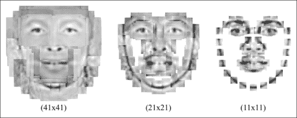

# 人脸检测和初始化

到目前为止描述的用于面部跟踪的方法已经假设图像中的人脸特征位于与当前估计合理合理的范围内。 尽管此假设在跟踪过程中是合理的，帧之间的面部运动通常很小，但我们仍然面临着如何在序列的第一帧中初始化模型的难题。 一个明显的选择是使用 OpenCV 的内置级联检测器来找到人脸。 但是，模型在检测到的边界框中的放置将取决于对要跟踪的人脸特征所做的选择。 为了与本章到目前为止我们遵循的数据驱动范例保持一致，一个简单的解决方案是学习人脸检测的边界框和人脸特征之间的几何关系。

`face_detector`类完全实现了此解决方案。 声明其功能的摘录如下：

```cpp
class face_detector{ //face detector for initialisation
public:
  string detector_fname; //file containing cascade classifier
  Vec3f detector_offset; //offset from center of detection
  Mat reference;         //reference shape
  CascadeClassifier detector; //face detector

  vector<Point2f>  //points describing detected face in image
  detect(const Mat &im,          //image containing face
   const float scaleFactor = 1.1,//scale increment
   const int minNeighbours = 2,  //minimum neighborhood size
   const Size minSize = Size(30,30));//minimum window size

  void
  train(ft_data &data,               //training data
  const string fname,                //cascade detector
  const Mat &ref,                    //reference shape
  const bool mirror = false,         //mirror data?
  const bool visi = false,           //visualize training?
  const float frac = 0.8, //fraction of points in detection
  const float scaleFactor = 1.1, //scale increment
  const int minNeighbours = 2,   //minimum neighbourhood size
  const Size minSize = Size(30,30)); //minimum window size
  ...
};
```

该类具有四个公共成员变量：称为`detector_fname`的`cv::CascadeClassifier`类型的对象的路径，从检测边界框到图像中人脸的位置和比例的一组偏移量`detector_offset`，放置在边界框`reference`和人脸检测器`detector`中的参考形状。 面部跟踪系统使用的主要功能是`face_detector::detect`，它以图像作为输入以及`cv::CascadeClassifier`类的标准选项，并返回图像中人脸特征位置的粗略估计。 其实现如下：

```cpp
Mat gray; //convert image to grayscale and histogram equalize
if(im.channels() == 1)gray = im;
else cvtColor(im,gray,CV_RGB2GRAY);
Mat eqIm; equalizeHist(gray,eqIm);
vector<Rect> faces; //detect largest face in image
 detector.detectMultiScale(eqIm,faces,scaleFactor,
                           minNeighbours,0
                         |CV_HAAR_FIND_BIGGEST_OBJECT
                         |CV_HAAR_SCALE_IMAGE,minSize);
if(faces.size() < 1){return vector<Point2f>();}

Rect R = faces[0]; Vec3f scale = detector_offset*R.width;
int n = reference.rows/2; vector<Point2f> p(n);
for(int i = 0; i < n; i++){ //predict face placement
 p[i].x = scale[2]*reference.fl(2*i  ) +
 R.x + 0.5 * R.width  + scale[0];
 p[i].y = scale[2]*reference.fl(2*i+1) +
 R.y + 0.5 * R.height + scale[1];
}return p;

```

除了将`CV_HAAR_FIND_BIGGEST_OBJECT`标志设置为可以跟踪图像中最突出的脸部以外，按照通常的方式检测图像中的脸部。 高亮显示的代码是根据检测到的面部边界框将参考形状放置在图像中的位置。 `detector_offset`成员变量包含三个成分：面部中心相对于检测边界框中心的`(x, y)`偏移量，以及缩放比例因子，该比例因子调整参考形状的大小以最适合图像中的面部 。 所有这三个分量都是边界框宽度的线性函数。

边界框的宽度和`detector_offset`变量之间的线性关系是从`face_detector::train`函数中带标注的数据集中学习的。 通过将训练数据加载到内存中并分配参考形状来开始学习过程：

```cpp
detector.load(fname.c_str()); detector_fname = fname; reference = ref.clone();
```

与`patch_models`类中的参考形状一样，参考形状的方便选择是数据集中的标准化平均脸部形状。 然后，将`cv::CascadeClassifier`应用于数据集中的每个图像（以及可选的镜像副本），并检查结果以确保足够的带标注的点位于检测到的边界框中（请参见本节末尾的图） 防止因误检而学习：

```cpp
if(this->enough_bounded_points(pt,faces[0],frac)){
  Point2f center = this->center_of_mass(pt);
  float w = faces[0].width;
  xoffset.push_back((center.x -
                    (faces[0].x+0.5*faces[0].width ))/w);
  yoffset.push_back((center.y -
                     (faces[0].y+0.5*faces[0].height))/w);
  zoffset.push_back(this->calc_scale(pt)/w);
}
```

如果有`frac`个标注点的一部分位于边界框内，则其宽度与该图像的偏移参数之间的线性关系将作为新条目添加到 STL `vector`类对象中。 在此，`face_detector::center_of_mass`函数计算该图像的带标注点集的质心，`face_detector::calc_scale`函数计算将参考形状转换为带中心标注形状的比例因子。 处理完所有图像后，将`detector_offset`变量设置为所有特定于图像的偏移量的中值：

```cpp
Mat X = Mat(xoffset),Xsort,Y = Mat(yoffset),Ysort,Z = Mat(zoffset),Zsort;
cv::sort(X,Xsort,CV_SORT_EVERY_COLUMN|CV_SORT_ASCENDING);
int nx = Xsort.rows;
cv::sort(Y,Ysort,CV_SORT_EVERY_COLUMN|CV_SORT_ASCENDING);
int ny = Ysort.rows;
cv::sort(Z,Zsort,CV_SORT_EVERY_COLUMN|CV_SORT_ASCENDING);
int nz = Zsort.rows;
detector_offset =
    Vec3f(Xsort.fl(nx/2),Ysort.fl(ny/2),Zsort.fl(nz/2));
```

与形状和补丁模型一样，`train_face_detector.cpp`中的简单程序是如何构建和保存`face_detector`对象以供以后在跟踪器中使用的示例。 它首先加载标注数据和形状模型，然后将参考形状设置为训练数据的均心平均值（即`shape_model`类的标识形状）：

```cpp
ft_data data = load_ft<ft_data>(argv[2]);
shape_model smodel = load_ft<shape_model>(argv[3]);
smodel.set_identity_params();
vector<Point2f> r = smodel.calc_shape();
Mat ref = Mat(r).reshape(1,2*r.size());
```

然后，训练和保存人脸检测器包含两个函数调用：

```cpp
face_detector detector;
detector.train(data,argv[1],ref,mirror,true,frac);
save_ft<face_detector>(argv[4],detector);
```

为了测试所产生的形状放置程序的表现，`visualize_face_detector.cpp`中的程序为视频或摄像机输入流中的每个图像调用`face_detector::detect`函数，并将结果绘制在屏幕上。 下图显示了使用这种方法的结果示例。尽管放置的形状与图像中的个体不匹配，但是其放置位置足够接近，因此可以使用下一节中描述的方法进行面部跟踪：


# 人脸追踪

面部跟踪的问题可能是由于找到了一种有效且鲁棒的方式来组合各种人脸特征的独立检测与它们所表现出的几何相关性，以便在序列的每个图像中获得准确的人脸特征位置估计而存在的问题 。 考虑到这一点，也许值得考虑是否完全需要几何相关性。 在下图中，显示了在有和没有几何约束的情况下检测人脸特征的结果。 这些结果清楚地突出了捕获人脸特征之间的空间相互依赖性的好处。 这两种方法的相对表现是典型的，因此严格依赖检测会导致解决方案过于嘈杂。 这是因为不能期望每个人脸特征的响应图总是在正确的位置达到峰值。 无论是由于图像噪声，光线变化还是表情变化，克服人脸特征检测器局限性的唯一方法就是利用它们彼此共享的几何关系。


将面部几何图形合并到跟踪过程中的一种特别简单但出人意料的有效方法是将特征检测的输出投影到线性形状模型的子空间上。 这等于是最小化了原始点与其在子空间上最接近的合理形状之间的距离。 因此，当特征检测中的空间噪声接近于高斯分布时，投影会产生最大可能的解。 在实践中，有时检测错误的分布不遵循高斯分布，因此需要引入其他机制来解决这个问题。

## 人脸追踪器的实现

可以在`face_tracker`类中找到人脸跟踪算法的实现（请参见`face_tracker.cpp`和`face_tracker.hpp`）。 以下代码是其标题的摘要，突出了其主要功能：

```cpp
class face_tracker{
public:
  bool tracking;          //are we in tracking mode?
  fps_timer timer;        //frames/second timer
  vector<Point2f> points; //current tracked points
  face_detector detector; //detector for initialisation
  shape_model smodel;     //shape model
  patch_models pmodel;    //feature detectors

  face_tracker(){tracking = false;}

  int                             //0 = failure
  track(const Mat &im,            //image containing face
  const face_tracker_params &p =  //fitting parameters
  face_tracker_params());     //default tracking parameters

  void
  reset(){                            //reset tracker
    tracking = false; timer.reset();
  }
  ...
protected:
  ...
  vector<Point2f>   //points for fitted face in image
  fit(const Mat &image,//image containing face
      const vector<Point2f> &init,   //initial point estimates
      const Size ssize = Size(21,21),//search region size
      const bool robust = false,     //use robust fitting?
      const int itol = 10,    //maximum number of iterations
      const float ftol = 1e-3);      //convergence tolerance
};
```

该类具有`shape_model`，`patch_models`和`face_detector`类的公共成员实例。 它使用这三个类的功能来实现跟踪。 `timer`变量是`fps_timer`类的实例，可跟踪调用`face_tracker::track`函数的帧速率，可用于分析效果补丁和形状模型配置对算法的计算复杂性 。 `tracking`成员变量是一个标志，用于指示跟踪过程的当前状态。 当此标志设置为`false`时，就像在构造器和`face_tracker::reset`函数中一样，跟踪器将进入检测模式，其中`face_detector::detect`函数将应用于下一个传入图像以初始化模型。 在跟踪模式下，用于推断下一个传入图像中的人脸特征位置的初始估计值只是它们在上一帧中的位置。 完整的跟踪算法的实现简单如下：

```cpp
int face_tracker::
track(const Mat &im,const face_tracker_params &p){
  Mat gray; //convert image to grayscale
  if(im.channels()==1)gray=im;
  else cvtColor(im,gray,CV_RGB2GRAY);
  if(!tracking) //initialize
    points = detector.detect(gray,p.scaleFactor,
                             p.minNeighbours,p.minSize);
  if((int)points.size() != smodel.npts())return 0;
 for(int level = 0; level < int(p.ssize.size()); level++)
 points = this->fit(gray,points,p.ssize[level],
 p.robust,p.itol,p.ftol);
  tracking = true; timer.increment();  return 1;
}
```

除了簿记操作（例如设置适当的`tracking`状态并增加跟踪时间）外，跟踪算法的核心是多级拟合过程，该过程在前面的代码片段中突出显示。 在`face_tracker::fit`函数中实现的拟合算法，以`face_tracker_params::ssize`中存储的不同搜索窗口大小多次应用，其中前一级的输出用作下一级的输入。 在最简单的设置下，`face_tracker_params::ssize`函数在图像中当前估计的形状周围执行人脸特征检测：

```cpp
smodel.calc_params(init);
vector<Point2f> pts = smodel.calc_shape();
vector<Point2f> peaks = pmodel.calc_peaks(image,pts,ssize);
```

还将结果投影到人脸形状的子空间上：

```cpp
smodel.calc_params(peaks);        
pts = smodel.calc_shape();
```

为了解决人脸特征检测位置中的总体异常值，可以通过将`robust`标志设置为`true`来使用鲁棒模型的拟合过程，而不是简单的投影。 但是，实际上，当使用递减的搜索窗口大小（即`face_tracker_params::ssize`中的设置）时，这通常是不必要的，因为总体异常值通常在投影形状中距离其对应点很远，并且很可能位于拟合过程的下一级搜索区域之外。 因此，减小搜索区域大小的速率充当增量离群值拒绝方案。

## 训练和可视化

与本章中详细介绍的其他类不同，训练`face_tracker`对象不涉及任何学习过程。 它在`train_face_tracker.cpp`中的实现方式很简单：

```cpp
face_tracker tracker;
tracker.smodel = load_ft<shape_model>(argv[1]);
tracker.pmodel = load_ft<patch_models>(argv[2]);
tracker.detector = load_ft<face_detector>(argv[3]);
save_ft<face_tracker>(argv[4],tracker);
```

这里`arg[1]`至`argv[4]`分别包含指向`shape_model`，`patch_model`，`face_detector`和`face_tracker`对象的路径。 `visualize_face_tracker.cpp`中的面部跟踪器的可视化同样简单。 通过`cv::VideoCapture`类从摄像机或视频文件获取其输入图像流，该程序仅循环播放，直到流结束，或者直到用户按下`Q`键，在每一帧进来时跟踪它。 用户还可以通过随时按`D`键来重置跟踪器。

## 通用模型与个人模型

可以对训练和跟踪过程中的许多变量进行调整，以优化给定应用的表现。 但是，跟踪质量的主要决定因素之一是跟踪器必须建模的形状和外观变化范围。 作为一个适当的案例，请考虑一般案例与个人案例。 使用来自多个标识，表达式，光照条件和其他可变性来源的带标注数据训练通用模型。 相反，针对特定人的模型专门针对单个人进行训练。 因此，它需要考虑的可变性要小得多。 结果，特定于人的跟踪通常比其通用对应部分准确得多。

下图显示了对此的说明。 在这里，通用模型是使用 MUCT 数据集进行训练的。 特定于人的模型是从使用本章前面介绍的标注工具生成的数据中学习的。 结果清楚地表明，特定于人的模型提供了更好的跟踪功能，能够捕获复杂的表情和头部姿势的变化，而通用模型甚至对于某些简单的表情似乎也很挣扎：

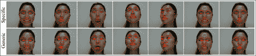

应该注意的是，本章中描述的面部跟踪方法是一种准系统方法，用于突出显示大多数非刚性面部跟踪算法中使用的各种组件。 解决该方法某些缺点的多种方法超出了本书的范围，并且需要 OpenCV 功能尚不支持的专用数学工具。 可用的商业级面部跟踪包相对较少，这证明了在一般情况下此问题的难度。 但是，本章中描述的简单方法在受约束的环境中仍可以很好地工作。

# 总结

在本章中，我们构建了一个简单的面部跟踪器，仅使用适度的数学工具以及 OpenCV 用于基本图像处理和线性代数运算的实质功能，即可在受限设置中合理地工作。 可以通过在跟踪器的三个组件（形状模型，特征检测器和拟合算法）的每个组件中采用更复杂的技术来改进此简单的跟踪器。 本节中描述的跟踪器的模块化设计应允许修改这三个组件，而不会实质性破坏其他组件的功能。

# 参考

+   `Procrustes Problems, Gower, John C. and Dijksterhuis, Garmt B, Oxford University Press, 2004.`