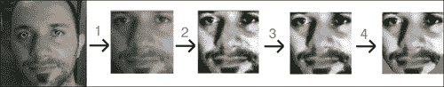
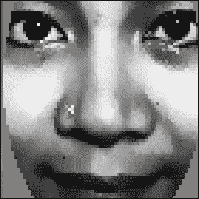
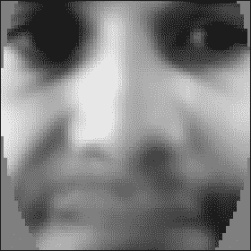
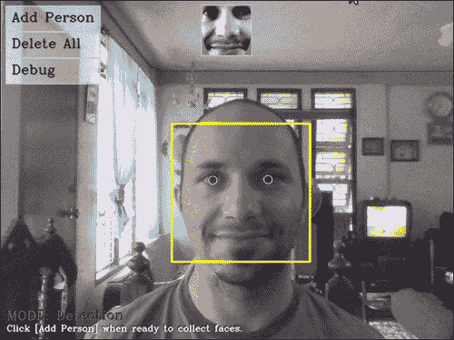
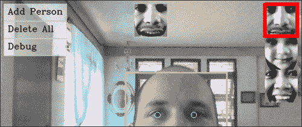
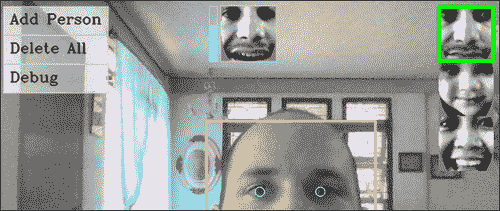

# 第 8 章。使用 EigenFace 或 Fisherfaces 的人脸识别

本章将介绍人脸检测和人脸识别的概念，并提供一个项目来检测面部并在再次看到它们时对其进行识别。 人脸识别既是一个热门话题，也是一个困难的话题，许多研究人员致力于人脸识别领域。 因此，本章将介绍人脸识别的简单方法，如果读者想探索更复杂的方法，则可以为他们提供一个良好的开端。

在本章中，我们涵盖以下内容：

*   人脸检测
*   人脸预处理
*   从收集的面孔中训练机器学习算法
*   人脸识别
*   画龙点睛

# 人脸识别和人脸检测简介

人脸识别是将标签粘贴到已知人脸的过程。 就像人类学会通过看他们的脸来认出家人，朋友和名人一样，计算机也有很多技术可以学会认出一张已知的脸。 这些通常包括四个主要步骤：

1.  **人脸检测**：这是在图像中定位人脸区域的过程（以下屏幕快照中心附近的大矩形）。 此步骤并不关心人是谁，只关心它是人脸。
2.  **脸部预处理**：这是调整脸部图像以使其看起来更清晰和与其他脸部相似的过程（以下屏幕快照顶部中心的小灰度脸部）。
3.  **收集和学习面部**：保存许多预处理过的面部（对于每个应该识别的人），然后学习如何识别它们的过程。
4.  **人脸识别**: 该过程将检查哪些被收集人员与相机中的脸部最相似（以下屏幕截图右上角的小矩形）。

    ### 注意

    请注意，“脸部识别”一词通常被公众用来查找脸部位置（即，如步骤 1 中所述的脸部检测），但是本书将使用脸部识别的正式定义，参考步骤 4，和脸部检测的正式定义，请参阅步骤 1。

以下屏幕快照显示了最终的 WebcamFaceRec 项目，其中包括位于右上角的一个小矩形，突出显示了所识别的人。 还要注意位于预处理过的脸（矩形的顶部中心的小脸）旁边的置信度条，在这种情况下，这大约表明已识别出正确的人的置信度为 70%。


当前的人脸检测技术在现实环境中非常可靠，而当在现实环境中使用时，当前的人脸识别技术则可靠性低得多。 例如，很容易找到显示人脸识别准确率超过 95% 的研究论文，但是当您自己测试这些算法时，您可能经常会发现准确率低于 50%。 这源于以下事实：当前的人脸识别技术对图像中的确切条件非常敏感，例如照明的类型，照明和阴影的方向，面部的确切方向，面部表情以及当前的情绪。 人。 如果在训练（收集图像）和测试（从摄像机图像）时它们都保持恒定，则人脸识别应该可以正常工作，但是如果该人站在房间左侧的灯光下， 训练，然后在用相机进行测试时站在右侧，这可能会产生非常差的结果。 因此，用于训练的数据集非常重要。

脸部预处理（步骤 2）旨在减少这些问题，例如通过确保脸部始终看起来具有相似的亮度和对比度，并可能确保脸部特征始终处于相同位置（例如对齐眼睛） 和/或鼻子到某些位置）。 一个好的人脸预处理阶段将有助于提高整个人脸识别系统的可靠性，因此本章将重点介绍人脸预处理方法。

尽管在媒体安全方面对人脸识别提出了很高的要求，但仅当前的人脸识别方法不可能对任何真正的安全系统都具有足够的可靠性，但是它们可用于不需要高可靠性的目的，例如播放个性化的音乐，适合不同人进入房间或​​看到您时会说出您名字的机器人。 人脸识别也有各种实用的扩展，例如性别识别，年龄识别和情感识别。

## 步骤 1：人脸检测

直到 2000 年，人们使用了许多不同的技术来查找人脸，但是它们要么都很慢，要么很不可靠，要么两者都很慢。 一个重大的变化发生在 2001 年，Viola 和 Jones 发明了基于 Haar 的级联分类器进行对象检测；而 2002 年，Lienhart 和 Maydt 对其进行了改进。 结果是既快速（可以在具有 VGA 网络摄像头的典型台式机上实时检测人脸）又可靠（可以正确检测到大约 95% 的正面）的物体检测器。 该对象检测器彻底改变了人脸识别领域（以及机器人技术和计算机视觉领域），因为它最终实现了实时人脸检测和人脸识别，尤其是 Lienhart 使用 OpenCV 自己编写了免费的对象检测器！ 它不仅适用于正面，而且适用于侧面（称为侧面），眼睛，嘴巴，鼻子，公司徽标和许多其他对象。

该对象检测器在 OpenCV v2.0 中进行了扩展，还基于 Ahonen，Hadid 和 Pietikäinen 在 2006 年的工作，还使用 LBP 功能进行检测，因为基于 LBP 的检测器可能比基于 Haar 的检测器快几倍，并且没有许多 Haar 探测器都有的许可问题。

基于 Haar 的脸部检测器的基本思想是，如果您看大多数正面，则眼睛区域应比额头和脸颊暗，而嘴部区域应比脸颊暗，依此类推。 它通常执行大约 20 个这样的比较阶段，以决定是否是一张脸，但是必须在图像中的每个可能位置以及脸的每个可能大小上执行此操作，因此实际上它经常要检查每个图片数千次。 基于 LBP 的人脸检测器的基本思想类似于基于 Haar 的人脸检测器，但它使用像素强度比较的直方图，例如边缘，角点和平坦区域。

基于 Haar 和 LBP 的人脸检测器都可以自动训练以从大量图像中查找人脸，并将信息存储为 XML 文件，以供以后使用，而不必由人来决定哪个比较最能定义人脸。 这些级联分类器检测器通常使用至少 1,000 个唯一的面部图像和 10,000 个非面部图像（例如，树木，汽车和文本的照片）进行训练，并且即使在多核台式机上，训练过程也可能花费很长时间。 （LBP 通常需要几个小时，而 Haar 则需要一个星期！）。 幸运的是，OpenCV 随附了一些经过培训的 Haar 和 LBP 检测器供您使用！ 实际上，只需将不同的层叠分类器 XML 文件加载到对象检测器，然后根据选择的 XML 文件在 Haar 或 LBP 检测器之间进行选择，就可以检测正面，侧面（侧面），眼睛或鼻子。

### 使用 OpenCV 实现人脸检测

如前所述，OpenCV v2.4 附带了各种预训练的 XML 检测器，您可以将它们用于不同的目的。 下表列出了一些最受欢迎的 XML 文件：

<colgroup><col style="text-align: left"> <col style="text-align: left"></colgroup> 
| 

级联分类器的类型

 | 

XML 文件名

 |
| --- | --- |
| 人脸检测器（默认） | `haarcascade_frontalface_default.xml` |
| 人脸检测仪 | `haarcascade_frontalface_alt2.xml` |
| 人脸检测器（快速 LBP） | `lbpcascade_frontalface.xml` |
| 侧面（侧面）人脸检测器 | `haarcascade_profileface.xml` |
| 眼图检测器（左右分离） | `haarcascade_lefteye_2splits.xml` |
| 嘴部检测器 | `haarcascade_mcs_mouth.xml` |
| 鼻子探测器 | `haarcascade_mcs_nose.xml` |
| 全人探测器 | `haarcascade_fullbody.xml` |

基于 Haar 的检测器存储在文件夹`data\haarcascades`中，基于 LBP 的检测器存储在 OpenCV 根文件夹的文件夹`data\lbpcascades`中，例如`C:\opencv\data\lbpcascades\`。

对于我们的人脸识别项目，我们要检测正面人脸，所以让我们使用 LBP 人脸检测器，因为它是最快的并且没有专利许可问题。 请注意，OpenCV v2.x 附带的这种经过预训练的 LBP 人脸检测器并未像经过预训练的 Haar 人脸检测器那样进行调整，因此，如果您想要更可靠的人脸检测，则可能需要训练自己的 LBP 人脸检测器或使用 Haar 面部探测器。

### 加载用于物体或人脸检测的 Haar 或 LBP 检测器

要执行对象或人脸检测，首先必须使用 OpenCV 的`CascadeClassifier`类加载经过预先​​训练的 XML 文件，如下所示：

```cpp
CascadeClassifier faceDetector;
faceDetector.load(faceCascadeFilename);
```

仅提供不同的文件名即可加载 Haar 或 LBP 检测器。 使用此错误时，一个非常常见的错误是提供了错误的文件夹或文件名，但根据您的构建环境，`load()`方法将返回`false`或生成 C++ 异常（并以断言错误退出程序）。 因此，最好用`try/catch`块围住`load()`方法，如果出现问题，最好向用户显示错误消息。 许多初学者会跳过检查错误的步骤，但是在某些内容未正确加载时向用户显示帮助消息至关重要，否则，您可能会花很长时间调试代码的其他部分，最后才意识到某些内容未加载。 一条简单的错误消息可以显示如下：

```cpp
CascadeClassifier faceDetector;
try {
 faceDetector.load(faceCascadeFilename);
} catch (cv::Exception e) {}
if ( faceDetector.empty() ) {
    cerr << "ERROR: Couldn't load Face Detector (";
    cerr << faceCascadeFilename << ")!" << endl;
    exit(1);
}
```

### 访问网络摄像头

要从计算机的网络摄像机甚至从视频文件中抓取帧，您只需使用摄像机编号或视频文件名调用`VideoCapture::open()`函数，然后使用 C++ 流运算符抓取帧，如第 1 章，“卡通化器和适用于 Android 的换肤器”中的“网络摄像头”部分中所述。

### 使用 Haar 或 LBP 分类器检测物体

现在，我们已经加载了分类器（初始化期间仅一次），我们可以使用它来检测每个新相机帧中的人脸。 但是首先，我们应该执行以下步骤，对照相机图像进行一些初始处理，以仅用于人脸检测：

1.  **灰度颜色转换**：人脸检测仅适用于灰度图像。 因此，我们应该将彩色相机的框架转换为灰度。
2.  **缩小相机图像**：人脸检测的速度取决于输入图像的大小（对于大图像来说非常慢，而对于小图像来说很快），但是即使在低分辨率下，检测仍然相当可靠 。 因此，我们应将相机图像缩小到更合理的尺寸（或在检测器中为`minFeatureSize`使用较大的值，如稍后所述）。
3.  **直方图均衡**：在弱光条件下人脸检测不那么可靠。 因此，我们应该执行直方图均衡化以提高对比度和亮度。

#### 灰度颜色转换

我们可以使用`cvtColor()`功能将 RGB 彩色图像轻松转换为灰度。 但是，只有在知道有彩色图像（即不是灰度相机）的情况下，才应该这样做，并且必须指定输入图像的格式（通常是台式机上的 3 通道 BGR 或台式机上的 4 通道 BGRA 移动）。 因此，我们应该允许三种不同的输入颜色格式，如以下代码所示：

```cpp
Mat gray;
if (img.channels() == 3) {
 cvtColor(img, gray, CV_BGR2GRAY);
}
else if (img.channels() == 4) {
 cvtColor(img, gray, CV_BGRA2GRAY);
}
else {
    // Access the grayscale input image directly.
    gray = img;
}
```

#### 缩小相机图像

我们可以使用`resize()`功能将图像缩小到一定的尺寸或比例因子。 人脸检测通常适用于任何大于`240 x 240`像素的图像（除非您需要检测距离相机较远的人脸），因为它会查找比`minFeatureSize`大的人脸（通常为`20 x 20`像素）。 因此，让我们将相机图像缩小到 320 像素宽； 输入是 VGA 网络摄像头还是 5 兆像素高清摄像头都没有关系。 记住并放大检测结果也很重要，因为如果您检测到缩小图像中的脸部，那么结果也会缩小。 请注意，您可以在检测器中使用较大的`minFeatureSize`值，而不是缩小输入图像。 我们还必须确保图像不会变胖或变薄。 例如，缩小到`240 x 240`的`240 x 240`宽屏图像会使人看起来很瘦。 因此，我们必须保持输出的长宽比（宽高比）与输入相同。 让我们计算缩小图像宽度多少，然后对高度也应用相同的比例因子，如下所示：

```cpp
const int DETECTION_WIDTH = 320;
// Possibly shrink the image, to run much faster.
Mat smallImg;
float scale = img.cols / (float) DETECTION_WIDTH;
if (img.cols > DETECTION_WIDTH) {
    // Shrink the image while keeping the same aspect ratio.
    int scaledHeight = cvRound(img.rows / scale);
 resize(img, smallImg, Size(DETECTION_WIDTH, scaledHeight));
}
else {
    // Access the input directly since it is already small.
    smallImg = img;
}
```

#### 直方图均衡

我们可以使用`equalizeHist()`功能轻松进行直方图均衡化，以提高图像的对比度和亮度（如《学习 OpenCV：使用 OpenCV 库的计算机视觉》中所述）。 有时这会使图像看起来很奇怪，但通常它应该提高亮度和对比度，并有助于人脸检测。 `equalizeHist()`功能的用法如下：

```cpp
// Standardize the brightness & contrast, such as
// to improve dark images.
Mat equalizedImg;
equalizeHist(inputImg, equalizedImg);

```

## 检测脸部

现在，我们已经将图像转换为灰度，缩小图像并均衡了直方图，我们准备使用`CascadeClassifier::detectMultiScale()`特征检测面部！ 我们将许多参数传递给此函数：

*   `minFeatureSize`：此参数确定我们关注的最小脸部尺寸，通常为`20 x 20`或`20 x 20`像素，但这取决于您的使用情况和图像尺寸。 如果要在网络摄像头或智能手机上执行人脸检测，而面部总是非常靠近相机，则可以将其放大到`20 x 20`以更快地进行检测，或者要检测较远的面部，例如和朋友一起去海滩，然后将其保留为`20 x 20`。
*   `searchScaleFactor`：该参数确定要查找多少个不同大小的面孔； 通常，`1.1`不能很好地检测到脸部，或者`1.2`可以更快地检测到脸部。
*   `minNeighbors`：此参数确定检测器应如何确定其已检测到人脸，通常为`3`值，但是即使您希望检测到更多人脸，也可以将其设置得更高，即使未检测到很多人脸 。
*   `flags`：此参数允许您指定是查找所有面孔（默认）还是仅查找最大的面孔（`CASCADE_FIND_BIGGEST_OBJECT`）。 如果只寻找最大的脸，它应该运行得更快。 您可以添加其他几个参数来使检测速度提高大约 1% 或 2%，例如`CASCADE_DO_ROUGH_SEARCH`或`CASCADE_SCALE_IMAGE`。

`detectMultiScale()`函数的输出将是`cv::Rect`类型对象的`std::vector`。 例如，如果检测到两个脸部，则它将在输出中存储两个矩形的数组。 `detectMultiScale()`功能的用法如下：

```cpp
int flags = CASCADE_SCALE_IMAGE; // Search for many faces.
Size minFeatureSize(20, 20);     // Smallest face size.
float searchScaleFactor = 1.1f;  // How many sizes to search.
int minNeighbors = 4;            // Reliability vs many faces.

// Detect objects in the small grayscale image.
std::vector<Rect> faces;
faceDetector.detectMultiScale(img, faces, searchScaleFactor, 
 minNeighbors, flags, minFeatureSize);

```

通过查看存储在矩形向量中的元素数量（即使用`objects.size()`函数），我们可以查看是否检测到任何面部。

如前所述，如果将缩小的图像提供给人脸检测器，结果也会缩小，因此如果我们想知道原始图像的面部区域，则需要将其放大。 我们还需要确保图像边框上的脸完全位于图像内，因为如果发生这种情况，OpenCV 现在将引发异常，如以下代码所示：

```cpp
// Enlarge the results if the image was temporarily shrunk.
if (img.cols > scaledWidth) {
    for (int i = 0; i < (int)objects.size(); i++ ) {
        objects[i].x = cvRound(objects[i].x * scale);
        objects[i].y = cvRound(objects[i].y * scale);
        objects[i].width = cvRound(objects[i].width * scale);
        objects[i].height = cvRound(objects[i].height * scale);
    }
}
// If the object is on a border, keep it in the image.
for (int i = 0; i < (int)objects.size(); i++ ) {
    if (objects[i].x < 0)
        objects[i].x = 0;
    if (objects[i].y < 0)
        objects[i].y = 0;
    if (objects[i].x + objects[i].width > img.cols)
        objects[i].x = img.cols - objects[i].width;
    if (objects[i].y + objects[i].height > img.rows)
        objects[i].y = img.rows - objects[i].height;
}
```

请注意，前面的代码将查找图像中的所有面孔，但是如果您只关心一个面孔，则可以如下更改`flag`变量：

```cpp
int flags = CASCADE_FIND_BIGGEST_OBJECT | 
                CASCADE_DO_ROUGH_SEARCH;
```

WebcamFaceRec 项目包括 OpenCV 的 Haar 或 LBP 检测器周围的包装器，以便更轻松地在图像中查找人脸或眼睛。 例如：

```cpp
Rect faceRect;    // Stores the result of the detection, or -1.
int scaledWidth = 320;	// Shrink the image before detection.
detectLargestObject(cameraImg, faceDetector, faceRect,
 scaledWidth);
if (faceRect.width > 0)
    cout << "We detected a face!" << endl;
```

现在我们有了一个面部矩形，我们可以通过多种方式使用它，例如从原始图像中提取或裁剪面部图像。 以下代码允许我们访问面部：

```cpp
// Access just the face within the camera image.
Mat faceImg = cameraImg(faceRect);
```

下图显示了人脸检测器给出的典型矩形区域：


## 步骤 2：人脸预处理

如前所述，人脸识别极易受到光照条件，人脸方向，人脸表情等变化的影响，因此，尽可能减少这些差异非常重要。 否则，人脸识别算法通常会认为在相同条件下两个不同人的面孔之间的相似度要比同一人的两个面孔之间的相似度高。

人脸预处理的最简单形式就是使用`equalizeHist()`函数应用直方图均衡化，就像我们对人脸检测所做的那样。 对于某些照明和位置条件变化不大的项目，这可能就足够了。 但是，为了在现实环境中保持可靠性，我们需要许多复杂的技术，包括人脸特征检测（例如，检测眼睛，鼻子，嘴巴和眉毛）。 为了简单起见，本章将仅使用眼睛检测，而忽略其他不太有用的人脸特征，例如嘴和鼻子。 下图显示了使用本节介绍的技术处理的典型预处理面的放大视图：


### 眼睛检测

眼睛检测对于面部预处理非常有用，因为对于正面的面部，尽管面部表情有所变化，但您始终可以假设一个人的眼睛应该是水平的并且在面部的相对位置，并且在面部中应该具有相当标准的位置和大小， 光照条件，相机属性，到相机的距离等等。 当人脸检测器说已检测到面部并且实际上是其他事物时，丢弃误报也很有用。 脸部检测器和两个眼睛检测器都被同时欺骗是非常罕见的，因此，如果仅处理带有检测到的脸部和两只检测到的眼睛的图像，那么它不会有很多假正例（但也会产生更少的人脸） 处理，因为眼睛检测器不会像人脸检测器那样频繁工作。

OpenCV v2.4 随附的一些经过预训练的眼睛检测器可以检测到眼睛是张开还是闭合，而其中一些只能检测到张开的眼睛。

探测睁眼或闭眼的眼部探测器如下：

*   `haarcascade_mcs_lefteye.xml`（和`haarcascade_mcs_righteye.xml`）
*   `haarcascade_lefteye_2splits.xml`（和`haarcascade_righteye_2splits.xml`）

仅检测睁开眼睛的眼睛探测器如下：

*   `haarcascade_eye.xml`
*   `haarcascade_eye_tree_eyeglasses.xml`

### 注意

当睁眼或闭眼探测器指定要训练哪只眼睛时，您需要为左眼和右眼使用不同的探测器，而仅睁眼的探测器可以对左眼或右眼使用同一探测器。

如果人戴着眼镜，检测器`haarcascade_eye_tree_eyeglasses.xml`可以检测到眼睛，但是如果不戴眼镜，检测器`haarcascade_eye_tree_eyeglasses.xml`不可靠。

如果 XML 文件名显示“左眼”，则表示人的实际左眼，因此在相机​​图像中，它通常会出现在脸部的右侧，而不是左侧！

提到的四个眼睛探测器的列表按从最可靠到最不可靠的大致顺序排列，因此如果您不需要找戴眼镜的人，那么第一个探测器可能是最佳选择。

### 眼睛搜索区域

对于眼睛检测，重要的是裁剪输入图像以仅显示大致的眼睛区域，就像进行人脸检测，然后裁剪为左眼应该位于的小矩形（如果您使用的是左眼检测器）一样， 右眼检测器的右矩形相同。 如果只对整个脸部或整个照片进行眼睛检测，则速度会慢得多，可靠性也会降低。 不同的眼睛检测器更适合面部的不同区域，例如，`haarcascade_eye.xml`检测器仅在实际眼睛周围非常狭窄的区域中搜索时效果最佳，而`haarcascade_mcs_lefteye.xml`和`haarcascade_lefteye_2splits.xml`检测器在眼睛周围有一个很大的区域时效果最佳。

下表使用检测到的面部矩形内的相对坐标，列出了针对不同眼睛检测器（使用 LBP 人脸检测器时）的面部的一些良好搜索区域：

<colgroup><col style="text-align: left"> <col style="text-align: left"> <col style="text-align: left"> <col style="text-align: left"> <col style="text-align: left"></colgroup> 
| 

级联分类器

 | 

EYE_SX

 | 

EYE_SY

 | 

EYE_SW

 | 

EYE_SH

 |
| --- | --- | --- | --- | --- |
| `haarcascade_eye.xml` | 0.16 | 0.26 | 0.30 | 0.28 |
| `haarcascade_mcs_lefteye.xml` | 0.10 | 0.19 | 0.40 | 0.36 |
| `haarcascade_lefteye_2splits.xml` | 0.12 | 0.17 | 0.37 | 0.36 |

以下是从检测到的脸部提取左眼和右眼区域的源代码：

```cpp
int leftX = cvRound(face.cols * EYE_SX);
int topY = cvRound(face.rows * EYE_SY);
int widthX = cvRound(face.cols * EYE_SW);
int heightY = cvRound(face.rows * EYE_SH);
int rightX = cvRound(face.cols * (1.0-EYE_SX-EYE_SW));

Mat topLeftOfFace = faceImg(Rect(leftX, topY, widthX,
                heightY));
Mat topRightOfFace = faceImg(Rect(rightX, topY, widthX, 
                heightY));
```

下图显示了适用于不同眼图检测器的理想搜索区域，其中`haarcascade_eye.xml`和`haarcascade_eye_tree_eyeglasses.xml`对于较小的搜索区域是最佳的，而`haarcascade_mcs_*eye.xml`和`haarcascade_*eye_2splits.xml`对于较大的搜索区域是最佳的。 请注意，还显示了检测到的面部矩形，以了解将眼睛搜索区域与检测到的面部矩形相比有多大：


当使用上表中给出的眼睛搜索区域时，以下是不同眼睛检测器的近似检测属性：

<colgroup><col style="text-align: left"> <col style="text-align: left"> <col style="text-align: left"> <col style="text-align: left"> <col style="text-align: left"></colgroup> 
| 

级联分类器

 | 

可靠性*

 | 

速度**

 | 

发现眼睛

 | 

眼镜

 |
| --- | --- | --- | --- | --- |
| `haarcascade_mcs_lefteye.xml` | 80% | 18 毫秒 | 打开或关闭 | 没有 |
| `haarcascade_lefteye_2splits.xml` | 60% | 7 毫秒 | 打开或关闭 | 没有 |
| `haarcascade_eye.xml` | 40% | 5 毫秒 | 只开放 | 没有 |
| `haarcascade_eye_tree_eyeglasses.xml` | 15% | 10 毫秒 | 只开放 | 是 |

*可靠性值显示了在没有佩戴眼镜且睁开双眼的情况下，在 LBP 正面检测后双眼检测的频率。 如果眼睛闭合，则可靠性可能会下降，或者如果戴眼镜，则可靠性和速度都会下降。

在 Intel Core i7 2.2 GHz 上，图像缩放到`320 x 240`像素大小时的速度值（以毫秒为单位）（在 1000 张照片中平均）。 当发现眼睛时，速度通常要比没有发现眼睛时快得多，因为它必须扫描整个图像，但是`haarcascade_mcs_lefteye.xml`仍然比其他眼睛检测器慢得多。

例如，如果将照片缩小到`320 x 240`像素，对其进行直方图均衡化，请使用 LBP 正面人脸检测器获取人脸，然后使用以下方法从人脸中提取左眼区域和右眼区域`haarcascade_mcs_lefteye.xml`值，然后对每个眼睛区域执行直方图均衡。 然后，如果您用左眼的`haarcascade_mcs_lefteye.xml`检测器（实际上位于图像的右上角）并用右眼的`haarcascade_mcs_righteye.xml`检测器（图像的左上角）， 探测器应能在 90% 带有 LBP 检测到的正面的照片中工作。 因此，如果您希望两只眼睛都被检测到，那么它应该可以在 80% 具有 LBP 检测到的前脸的照片中工作。

请注意，虽然建议在检测到脸部之前先缩小相机图像，但您应该以完整的相机分辨率来检测眼睛，因为眼睛显然会比脸部小很多，因此需要尽可能多的分辨率。

### 注意

根据表，似乎在选择要使用的眼睛检测器时，应该决定是要检测闭合的眼睛还是仅检测睁开的眼睛。 请记住，您甚至可以使用一只眼睛检测器，如果它无法检测到眼睛，则可以尝试使用另一只。

对于许多任务，检测眼睛是否睁开是很有用的，因此，如果速度不是很关键，最好先使用`mcs_*eye`检测器进行搜索，如果失败，则使用`eye_2splits`检测器进行搜索。

但是对于人脸识别，如果人闭着眼睛会出现很大的不同，因此最好先使用普通的`haarcascade_eye`检测器进行搜索，如果失败，则使用`haarcascade_eye_tree_eyeglasses`检测器进行搜索。

我们可以使用与人脸检测相同的`detectLargestObject()`函数来搜索眼睛，但是我们无需指定在眼睛检测之前缩小图像的大小，而是指定整个眼睛区域的宽度以获得更好的眼睛检测。 使用一个检测器搜索左眼很容易，如果检测失败，则尝试使用另一个检测器（与右眼相同）。 眼睛检测如下：

```cpp
CascadeClassifier eyeDetector1("haarcascade_eye.xml");
CascadeClassifier 
         eyeDetector2("haarcascade_eye_tree_eyeglasses.xml");
...
Rect leftEyeRect;    // Stores the detected eye.
// Search the left region using the 1st eye detector.
detectLargestObject(topLeftOfFace, eyeDetector1, leftEyeRect,
 topLeftOfFace.cols);
// If it failed, search the left region using the 2nd eye 
// detector.
if (leftEyeRect.width <= 0)
 detectLargestObject(topLeftOfFace, eyeDetector2, 
 leftEyeRect, topLeftOfFace.cols);
// Get the left eye center if one of the eye detectors worked.
Point leftEye = Point(-1,-1);
if (leftEyeRect.width <= 0) {
    leftEye.x = leftEyeRect.x + leftEyeRect.width/2 + leftX;
    leftEye.y = leftEyeRect.y + leftEyeRect.height/2 + topY;
}

// Do the same for the right-eye
...

// Check if both eyes were detected.
if (leftEye.x >= 0 && rightEye.x >= 0) {
    ...
}
```

在检测到面部和双眼的情况下，我们将通过组合以下步骤进行面部预处理：

*   **几何变换和裁剪**：此过程将包括缩放，旋转和平移图像，以使眼睛对齐，然后从脸部去除前额，下巴，耳朵和背景图片。
*   **左侧和右侧的单独直方图均衡**：此过程可标准化脸部左侧和右侧的亮度和对比度。
*   **平滑**：此过程使用双边过滤器减少图像噪声。
*   **椭圆遮罩**：椭圆遮罩从面部图像上去除了一些残留的头发和背景。

下图显示了应用于检测到的脸部的脸部预处理步骤 1 至 4。 请注意，最终图像在脸部两边如何具有良好的亮度和对比度，而原始图像却没有：



#### 几何变换

将面部全部对齐在一起非常重要，否则人脸识别算法可能会将鼻子的一部分与眼睛的一部分进行比较，依此类推。 刚刚看到的人脸检测输出将在某种程度上给出对齐的面部，但是它不是很准确（也就是说，面部矩形将不会总是从前额的同一点开始）。

为了更好地对齐，我们将使用眼睛检测来对齐面部，以便检测到的两只眼睛的位置在所需位置完美对齐。 我们将使用`warpAffine()`函数进行几何变换，这是一个单一的操作，它将完成四件事：

*   旋转脸部，使两只眼睛保持水平。
*   缩放脸部，使两只眼睛之间的距离始终相同。
*   平移脸部，使眼睛始终水平居中并处于所需高度。
*   修剪脸部的外部，因为我们要修剪掉图像的背景，头发，额头，耳朵和下巴。

仿射扭曲使用仿射矩阵，将两个检测到的眼睛位置转换为两个所需的眼睛位置，然后裁剪为所需的大小和位置。 要生成此仿射矩阵，我们将获取两眼之间的中心，计算出两只被检测到的眼睛出现的角度，并如下看它们的距离：

```cpp
// Get the center between the 2 eyes.
Point2f eyesCenter;
eyesCenter.x = (leftEye.x + rightEye.x) * 0.5f;
eyesCenter.y = (leftEye.y + rightEye.y) * 0.5f;

// Get the angle between the 2 eyes.
double dy = (rightEye.y - leftEye.y);
double dx = (rightEye.x - leftEye.x);
double len = sqrt(dx*dx + dy*dy);
// Convert Radians to Degrees.
double angle = atan2(dy, dx) * 180.0/CV_PI;

// Hand measurements shown that the left eye center should 
// ideally be roughly at (0.16, 0.14) of a scaled face image.
const double DESIRED_LEFT_EYE_X = 0.16;
const double DESIRED_RIGHT_EYE_X = (1.0f – 0.16);
// Get the amount we need to scale the image to be the desired
// fixed size we want.
const int DESIRED_FACE_WIDTH = 70;
const int DESIRED_FACE_HEIGHT = 70;
double desiredLen = (DESIRED_RIGHT_EYE_X – 0.16);
double scale = desiredLen * DESIRED_FACE_WIDTH / len;

```

现在，我们可以对脸部进行变形（旋转，缩放和平移），以使两只检测到的眼睛处于理想脸部中所需的眼睛位置，如下所示：

```cpp
// Get the transformation matrix for the desired angle & size.
Mat rot_mat = getRotationMatrix2D(eyesCenter, angle, scale);
// Shift the center of the eyes to be the desired center.
double ex = DESIRED_FACE_WIDTH * 0.5f - eyesCenter.x;
double ey = DESIRED_FACE_HEIGHT * DESIRED_LEFT_EYE_Y – 
                    eyesCenter.y;
rot_mat.at<double>(0, 2) += ex;
rot_mat.at<double>(1, 2) += ey;
// Transform the face image to the desired angle & size & 
// position! Also clear the transformed image background to a 
// default grey.
Mat warped = Mat(DESIRED_FACE_HEIGHT, DESIRED_FACE_WIDTH,
                    CV_8U, Scalar(128));
warpAffine(gray, warped, rot_mat, warped.size());

```

#### 左侧和右侧的单独直方图均衡

在现实环境中，通常在脸的一半上有强光，而在另一半上有弱光。 这对人脸识别算法有巨大的影响，因为同一张脸的左右两侧看起来就像是完全不同的人。 因此，我们将在脸部的左右两边分别进行直方图均衡化，以使脸部的每一侧具有标准化的亮度和对比度。

如果我们仅在左半部分然后再在右半部分上应用直方图均衡化，则由于中间的平均亮度可能会有所不同，因此我们会在中间看到一个非常明显的边缘，因此删除该边缘 ，我们将从左侧或右侧向中心逐渐应用两个直方图均衡化，然后将其与整个面部直方图均衡化混合，以便最左侧使用左侧直方图均衡化，最右侧 -手侧将使用右侧直方图均衡化，而中心将使用左侧或右侧值与整个面部均衡值的平滑混合。

下图显示了左平衡，整体平衡和右平衡图像如何融合在一起：


为此，我们需要均衡整个脸部的副本以及均衡的左半部分和右半部分，方法如下：

```cpp
int w = faceImg.cols;
int h = faceImg.rows;
Mat wholeFace;
equalizeHist(faceImg, wholeFace);
int midX = w/2;
Mat leftSide = faceImg(Rect(0,0, midX,h));
Mat rightSide = faceImg(Rect(midX,0, w-midX,h));
equalizeHist(leftSide, leftSide);
equalizeHist(rightSide, rightSide);

```

现在，我们将三个图像组合在一起。 由于图像较小，因此即使速度较慢，我们也可以使用`image.at<uchar>(y,x)`功能轻松直接访问像素。 因此，让我们通过直接访问三个输入图像和输出图像中的像素来合并三个图像，如下所示：

```cpp
for (int y=0; y<h; y++) {
    for (int x=0; x<w; x++) {
        int v;
        if (x < w/4) {
            // Left 25%: just use the left face.
 v = leftSide.at<uchar>(y,x);
        }
        else if (x < w*2/4) {
            // Mid-left 25%: blend the left face & whole face.
            int lv = leftSide.at<uchar>(y,x);
            int wv = wholeFace.at<uchar>(y,x);
            // Blend more of the whole face as it moves
            // further right along the face.
            float f = (x - w*1/4) / (float)(w/4);
 v = cvRound((1.0f - f) * lv + (f) * wv);
        }
        else if (x < w*3/4) {
            // Mid-right 25%: blend right face & whole face.
            int rv = rightSide.at<uchar>(y,x-midX);
            int wv = wholeFace.at<uchar>(y,x);
            // Blend more of the right-side face as it moves
            // further right along the face.
            float f = (x - w*2/4) / (float)(w/4);
 v = cvRound((1.0f - f) * wv + (f) * rv);
        }
        else {
            // Right 25%: just use the right face.
 v = rightSide.at<uchar>(y,x-midX);
        }
        faceImg.at<uchar>(y,x) = v;
    }// end x loop
}//end y loop
```

这种分离的直方图均衡化应显着帮助减少脸部左右两侧的不同照明效果，但我们必须了解，由于脸部是单侧照明，因此无法完全消除单侧照明的效果。 具有许多阴影的复杂 3D 形状。

#### 平滑

为了减少像素噪声的影响，我们将在脸上使用双向过滤器，因为双向过滤器非常擅长平滑大部分图像，同时保持边缘清晰。 直方图均衡化会显着增加像素噪声，因此我们将使过滤器强度`20`覆盖较重的像素噪声，但由于我们要严重平滑微小的像素噪声而不是较大的图像区域，因此仅使用两个像素的邻域， 如下：

```cpp
Mat filtered = Mat(warped.size(), CV_8U);
bilateralFilter(warped, filtered, 0, 20.0, 2.0);

```

#### 椭圆形遮罩

尽管在进行几何变换时我们已经去除了大部分图像背景，额头和头发，但是我们可以应用椭圆遮罩去除一些角落区域（例如脖子），该区域可能在脸部阴影中，尤其是在脸部无法完全对准相机时。 要创建遮罩，我们将在白色图像上绘制黑色填充的椭圆。 执行此操作的一个椭圆的水平半径为 0.5（即，它完美地覆盖了脸部宽度），垂直半径为 0.8（因为脸部通常比其宽高），并且以坐标 0.5、0.4 为中心。 如下图所示，其中椭圆遮罩已去除了面部的一些不需要的角：


我们可以在调用`cv::setTo()`函数时应用遮罩，该函数通常会将整个图像设置为某个像素值，但是由于我们将给出一个遮罩图像，因此它只会将某些部分设置为给定的像素值。 我们将用灰色填充图像，以使其与脸部其余部分的对比度降低：

```cpp
// Draw a black-filled ellipse in the middle of the image.
// First we initialize the mask image to white (255).
Mat mask = Mat(warped.size(), CV_8UC1, Scalar(255));
double dw = DESIRED_FACE_WIDTH;
double dh = DESIRED_FACE_HEIGHT;
Point faceCenter = Point( cvRound(dw * 0.5),
                     cvRound(dh * 0.4) );
Size size = Size( cvRound(dw * 0.5), cvRound(dh * 0.8) );
ellipse(mask, faceCenter, size, 0, 0, 360, Scalar(0), 
 CV_FILLED);

// Apply the elliptical mask on the face, to remove corners.
// Sets corners to gray, without touching the inner face.
filtered.setTo(Scalar(128), mask);

```

以下放大图像显示了所有面部预处理阶段的样本结果。 请注意，在不同的亮度，面部旋转，与相机的角度，背景，灯光位置等方面，人脸识别更加一致。 在收集要训练的脸部以及尝试识别输入脸部时，都将使用此经过预处理的脸部作为脸部识别阶段的输入：



## 步骤 3：收集人脸并从中学习

收集人脸就像将每个新预处理过的人脸放入相机中经过预处理的人脸数组，以及将标签放入数组中（指定要从哪个人那里获取人脸）一样简单。 例如，您可以使用第一个人的 10 张预处理过的面孔和第二个人的 10 张预处理过的面孔，因此人脸识别算法的输入将是 20 个预处理过的面孔和 20 个整数的数组（其中前 10 个数字为 0，接下来的 10 个数字为 1）。

然后，人脸识别算法将学习如何区分不同人的面部。 这被称为训练阶段，并且所收集的面部被称为训练集。 人脸识别算法完成训练后，您可以将生成的知识保存到文件或内存中，以后再使用它来识别在相机前面看到了哪个人。 这称为测试阶段。 如果直接从摄像机输入中使用它，则预处理的面部将被称为测试图像，并且如果您对许多图像（例如，来自图像文件的文件夹）进行了测试，则其将被称为测试集。

重要的是，您必须提供一个良好的培训集，以涵盖您期望在测试集中发生的变化类型。 例如，如果您仅测试正面朝前的脸部（例如证件照片），则仅需提供正面朝上的脸部训练图像。 但是，如果该人可能是向左看或向左看，则应确保训练集也包括执行此操作的那个人的脸部，否则脸部识别算法将很难识别他们，因为他们的脸部看起来会大不相同。 这也适用于其他因素，例如面部表情（例如，如果该人始终在训练集中微笑着而不在测试集中微笑着）或照明方向（例如，强光指向左侧） 训练集（但位于测试集的右侧），则人脸识别算法将很难识别它们。 我们刚刚看到的人脸预处理步骤将有助于减少这些问题，但是它肯定不会消除这些因素，特别是不会影响人脸的外观方向，因为它会对人脸中所有元素的位置产生很大影响。

### 注意

获得涵盖多种不同现实条件的良好训练集的一种方法是，每个人从左向左旋转，向上，向右，向下旋转然后直接直视。 然后，该人侧向倾斜头部，然后向上和向下倾斜，同时还改变了面部表情，例如在微笑，生气和中性之间交替。 如果每个人在收集面部表情时都遵循这样的常规，那么在现实世界中识别每个人的机会就更大。

为了获得更好的效果，应该在一个或两个以上的位置或方向上再次执行此操作，例如通过将摄像机旋转 180 度并沿与摄像机相反的方向行走，然后重复整个例程，以便训练集可以包括许多不同的照明条件。

因此，总的来说，与每个人只有 10 个训练脸相比，每个人拥有 100 个训练脸可能会产生更好的结果，但是如果所有 100 个脸看起来几乎相同，那么它仍然会表现不佳，因为训练集具有足够的多样性来覆盖测试集更重要，而不仅仅是拥有大量的面孔。 因此，为确保训练集中的人脸不太相似，我们应该在每个收集到的人脸之间添加明显的延迟。 例如，如果摄像头以每秒 30 帧的速度运行，那么当人没有时间走动时，它可能会在短短几秒钟内收集 100 张脸，因此最好每秒拍摄一幅脸，同时人们移动他们的脸。 改善训练集变化的另一种简单方法是仅在面部与先前收集的面部明显不同的情况下收集面部。

### 收集经过预处理的人脸来训练

为了确保收集新面孔之间至少有一秒钟的间隔，我们需要测量已花费了多少时间。 这样做如下：

```cpp
// Check how long since the previous face was added.
double current_time = (double)getTickCount();
double timeDiff_seconds = (current_time –
                old_time) / getTickFrequency();
```

为了逐像素比较两个图像的相似性，您可以找到相对的 L2 误差，它只涉及从另一幅图像中减去一张图像，将其平方值相加，然后求出其平方根。 因此，如果该人根本没有移动，则将当前人脸与前一个人脸相减应在每个像素处给出一个很小的数字，但是如果他们只是在任何方向上略微移动，则减去像素将给出一个较大的数字，因此 L2 错误会很高。 由于将所有像素的结果相加，因此该值将取决于图像分辨率。 因此，要获得平均误差，我们应将此值除以图像中的像素总数。 让我们将其放在方便的函数`getSimilarity()`中，如下所示：

```cpp
double getSimilarity(const Mat A, const Mat B) {
    // Calculate the L2 relative error between the 2 images.
 double errorL2 = norm(A, B, CV_L2);
    // Scale the value since L2 is summed across all pixels.
    double similarity = errorL2 / (double)(A.rows * A.cols);
    return similarity;
}

...

// Check if this face looks different from the previous face.
double imageDiff = MAX_DBL;
if (old_prepreprocessedFaceprepreprocessedFace.data) {
    imageDiff = getSimilarity(preprocessedFace,
                           old_prepreprocessedFace);
}
```

如果图像移动不多，相似度通常小于 0.2；如果图像移动不动，则相似度大于 0.4，因此让我们使用 0.3 作为收集新面孔的阈值。

我们可以通过许多技巧来获取更多训练数据，例如使用镜像的面部，添加随机噪声，将面部移动几个像素，按比例缩放面部或将面部旋转几度（即使我们专门尝试在预处理面部时消除这些效果！ 在训练过程中向左或向右移动，但不进行测试。 这样做如下：

```cpp
// Only process the face if it's noticeably different from the
// previous frame and there has been a noticeable time gap.
if ((imageDiff > 0.3) && (timeDiff_seconds > 1.0)) {
    // Also add the mirror image to the training set.
    Mat mirroredFace;
    flip(preprocessedFace, mirroredFace, 1);

    // Add the face & mirrored face to the detected face lists.
    preprocessedFaces.push_back(preprocessedFace);
    preprocessedFaces.push_back(mirroredFace);
    faceLabels.push_back(m_selectedPerson);
    faceLabels.push_back(m_selectedPerson);

    // Keep a copy of the processed face,
    // to compare on next iteration.
    old_prepreprocessedFace = preprocessedFace;
    old_time = current_time;
}
```

这将收集经过预处理的人脸的`std::vector`数组`preprocessedFaces`和`faceLabels`以及该人的标签或 ID 号（假设它在整数`m_selectedPerson`变量中）。

为了使用户更清楚地知道我们已经将其当前面孔添加到了集合中，您可以通过以下方式提供视觉通知：在整个图像上显示一个大的白色矩形，或者仅将他们的脸栈式一秒钟，因此他们意识到拍了张照片。 使用 OpenCV 的 C++ 接口，您可以使用`+`重载的`cv::Mat`运算符向图像中的每个像素添加一个值，并将其裁剪为 255（使用`saturate_cast`，这样它不会从白色溢出到黑色 ！）假设`displayedFrame`是应该显示的彩色相机框架的副本，请将其插入到前面的面部收集代码之后：

```cpp
// Get access to the face region-of-interest.
Mat displayedFaceRegion = displayedFrame(faceRect);
// Add some brightness to each pixel of the face region.
displayedFaceRegion += CV_RGB(90,90,90);
```

### 从收集到的人脸中训练人脸识别系统

收集到足以让每个人识别的面孔后，您必须使用适合面孔识别的机器学习算法训练系统以学习数据。 文献中有许多不同的人脸识别算法，其中最简单的是 EigenFace 和人工神经网络。 EigenFace 倾向于比人工神经网络更好地工作，尽管它很简单，但它却几乎可以与许多更复杂的脸部识别算法一起工作，因此，它作为初学者和新算法的基础人脸识别算法已经非常流行。 相比。

建议任何希望进一步研究人脸识别的读者阅读其背后的理论：

*   EigenFace（也称为**主成分分析**（**PCA**））
*   Fisherfaces（也称为**线性判别分析**（**LDA**））
*   其他经典的人脸识别算法（[这个页面](http://www.face-rec.org/algorithms/)中提供了许多算法）
*   最近的计算机视觉研究论文（例如[这个页面](http://www.cvpapers.com/)上的 CVPR 和 ICCV）中更新的人脸识别算法，因为每年都会发布数百篇人脸识别论文

但是，您无需了解这些算法的原理即可使用本书中所示的这些算法。 感谢 OpenCV 团队和 Philipp Wagner 的`libfacerec`贡献，OpenCV v2.4.1 提供了`cv::Algo` `rithm`作为使用几种不同算法（甚至在运行时可以选择）中的一种来执行人脸识别的简单通用方法。 必须了解它们是如何实现的。 您可以使用`Algorithm::getList()`函数在您的 OpenCV 版本中找到可用的算法，例如以下代码：

```cpp
vector<string> algorithms;
Algorithm::getList(algorithms);
cout << "Algorithms: " << algorithms.size() << endl;
for (int i=0; i<algorithms.size(); i++) {
    cout << algorithms[i] << endl;
}
```

以下是 OpenCV v2.4.1 中提供的三种人脸识别算法：

*   `FaceRecognizer.Eigenfaces`：EigenFace，也称为 PCA，在 1991 年由 Turk 和 Pentland 首次使用。
*   `FaceRecognizer.Fisherfaces`：Fisherfaces，也称为 LDA，由 Belhumeur，Hespanha 和 Kriegman 于 1997 年发明。
*   `FaceRecognizer.LBPH`：Ahonen，Hadid 和 Pietikäinen 于 2004 年发明的局部二值模式直方图。

### 注意

可以在 [Philipp Wagner 的网站](http://bytefish.de/blog)和[这个页面](http://bytefish.de/dev/libfacerec/)上找到有关这些人脸识别算法实现的更多信息，并附带文档，示例和 Python 等效项。

这些人脸识别算法可通过 OpenCV 的`contrib`模块中的`FaceRecognizer`类获得。 由于动态链接，您的程序可能已链接到`contrib`模块，但实际上并未在运行时加载（如果认为不是必需的话）。 因此，建议在尝试访问`FaceRecognizer`算法之前先调用`cv::initModule_contrib()`函数。 该功能仅在 OpenCV v2.4.1 中可用，因此它还确保至少在编译时对人脸识别算法可用：

```cpp
// Load the "contrib" module is dynamically at runtime.
bool haveContribModule = initModule_contrib();
if (!haveContribModule) {
    cerr << "ERROR: The 'contrib' module is needed for ";
    cerr << "FaceRecognizer but hasn't been loaded to OpenCV!";
    cerr << endl;
    exit(1);
}
```

要使用一种人脸识别算法，我们必须使用`cv::Algorithm::create<FaceRecognizer>()`函数创建一个`FaceRecognizer`对象。 我们将要使用的人脸识别算法的名称作为字符串传递给此`create`函数。 如果该算法在 OpenCV 版本中可用，则将使我们能够使用该算法。 因此，它可以用作运行时错误检查，以确保用户具有 OpenCV v2.4.1 或更高版本。 例如：

```cpp
string facerecAlgorithm = "FaceRecognizer.Fisherfaces";
Ptr<FaceRecognizer> model;
// Use OpenCV's new FaceRecognizer in the "contrib" module:
model = Algorithm::create<FaceRecognizer>(facerecAlgorithm);
if (model.empty()) {
    cerr << "ERROR: The FaceRecognizer [" << facerecAlgorithm;
    cerr << "] is not available in your version of OpenCV. ";
    cerr << "Please update to OpenCV v2.4.1 or newer." << endl;
    exit(1);
}
```

加载`FaceRecognizer`算法后，我们只需使用收集到的面部数据调用`FaceRecognizer::train()`函数，如下所示：

```cpp
// Do the actual training from the collected faces.
model->train(preprocessedFaces, faceLabels);

```

这段代码将运行您选择的整个人脸识别训练算法（例如，Eigenfaces，Fisherfaces 或其他可能的算法）。 如果只有几个人的面孔少于 20 个，则此训练应该很快返回，但是如果您有很多人的面孔却很多，`train()`功能可能需要几秒钟甚至几分钟来处理所有数据。

### 查看所学知识

虽然没有必要，但是在学习训练数据时查看人脸识别算法生成的内部数据结构非常有用，特别是如果您了解所选算法背后的理论并想验证其是否有效或找出其原因的话，不能如您所愿。 对于不同的算法，内部数据结构可能有所不同，但是幸运的是，对于 Eigenfaces 和 Fisherfaces，它们的内部数据结构是相同的，因此让我们仅看一下这两个。 它们都基于一维特征向量矩阵，当以 2D 图像查看时，它们看起来有点像人脸，因此在使用 EigenFace 算法时通常将特征向量称为 EigenFace，在使用 Fisherface 算法时通常将其称为 fisherfaces。

简单来说，EigenFace 的基本原理是它将计算出一组特殊图像（EigenFace）和混合比率（特征值），当以不同方式组合时，它们可以生成训练集中的每个图像，但也可以用于区分训练集中的许多人脸图像。 例如，如果训练集中的某些脸部有胡须，而有些脸部没有胡须，那么至少会有一个 EigenFace 出现胡须，因此带有胡须的训练面将具有较高的混合比例。 表示它有胡须，而没有胡须的脸对于该特征向量的混合比率较低。 如果训练集有 5 个人，每个人有 20 张脸，那么将有 100 个 EigenFace 和特征值来区分训练集中的 100 张总脸，实际上，这些将被排序，因此前几个 EigenFace 和特征值将是最关键的区分器，最后几个特征面和特征值只是随机的像素噪声，实际上并不能帮助区分数据。 因此，通常的做法是丢弃一些最后的特征面，而只保留前 50 个左右的特征面。

相比之下，Fisherfaces 的基本原理是，与其为训练集中的每个图像计算一个特殊的特征向量和特征值，不如为每个人计算一个特殊的特征向量和特征值。 因此，在前面的示例中有 5 个人，每个人有 20 张脸，EigenFace 算法将使用 100 个 EigenFace 和特征值，而 Fisherfaces 算法将仅使用 5 个渔夫脸和特征值。

要访问 Eigenfaces 和 Fisherfaces 算法的内部数据结构，我们必须使用`cv::Algorithm::get()` 函数在运行时获取它们，因为在编译时无法访问它们。 数据结构在内部用作数学计算的一部分，而不是用于图像处理，因此通常将它们存储为浮点数，通常在 0.0 到 1.0 之间，而不是在 0 到 255 之间的 8 位`uchar`像素，类似于常规图像中的像素。 同样，它们通常是一维行或列矩阵，或者它们构成较大矩阵的许多一维行或列之一。 因此，在显示许多内部数据结构之前，必须将它们重新整形为正确的矩形形状，并将它们转换为 0 到 255 之间的 8 位`uchar`像素。因为矩阵数据的范围可能是 0.0 到 1.0 或 -1.0 到 1.0 或其他值，您可以将`cv::normalize()`函数与`cv::NORM_MINMAX`选项一起使用，以确保无论输入范围是多少，它都输出 0 到 255 之间的数据。 让我们创建一个函数来执行此整形为矩形并为我们转换为 8 位像素，如下所示：

```cpp
// Convert the matrix row or column (float matrix) to a
// rectangular 8-bit image that can be displayed or saved.
// Scales the values to be between 0 to 255.
Mat getImageFrom1DFloatMat(const Mat matrixRow, int height)
{
    // Make a rectangular shaped image instead of a single row.
 Mat rectangularMat = matrixRow.reshape(1, height);
    // Scale the values to be between 0 to 255 and store them 
    // as a regular 8-bit uchar image.
    Mat dst;
 normalize(rectangularMat, dst, 0, 255, NORM_MINMAX, 
 CV_8UC1);
    return dst;
}
```

为了更轻松地调试 OpenCV 代码，甚至在内部调试`cv::Algorithm`数据结构时，我们可以使用`ImageUtils.cpp`和`ImageUtils.h`文件轻松显示有关`cv::Mat`结构的信息，如下所示：

```cpp
Mat img = ...;
printMatInfo(img, "My Image");
```

您将在控制台上看到类似于以下内容的内容：

```cpp
My Image: 640w480h 3ch 8bpp, range[79,253][20,58][18,87]
```

这告诉您，它的宽度为 640 个元素，高度为 480 个（即`640 x 480`图像或`640 x 480`矩阵，具体取决于您查看的方式），每个像素具有三个通道，每个通道为 8 位（即 ，是常规的 BGR 图像），并显示每个颜色通道在图像中的最小值和最大值。

### 注意

通过使用`printMat()`功能代替`printMatInfo()`功能，也可以打印图像或矩阵的实际内容。 这对于查看矩阵和多通道浮点矩阵非常方便，因为对于初学者而言，查看起来非常棘手。

ImageUtils 代码主要用于 OpenCV 的 C 接口，但是随着时间的推移，它逐渐包含了更多的 C++ 接口。 可以在[这个页面](http://shervinemami.info/openCV.html)中找到最新版本。

### 平均人脸

Eigenfaces 和 Fisherfaces 算法都首先计算平均脸部，即所有训练图像的数学平均值，因此它们可以从每个脸部图像中减去平均图像，以获得更好的脸部识别结果。 因此，让我们从训练集中查看平均面孔。 在 Eigenfaces 和 Fisherfaces 实现中，平均人脸名为`mean`，如下所示：

```cpp
Mat averageFace = model->get<Mat>("mean");
printMatInfo(averageFace, "averageFace (row)");
// Convert a 1D float row matrix to a regular 8-bit image.
averageFace = getImageFrom1DFloatMat(averageFace, faceHeight);
printMatInfo(averageFace, "averageFace");
imshow("averageFace", averageFace);
```

现在，您应该在屏幕上看到平均的人脸图像，类似于下面的（放大的）男人，女人和婴儿的图像。 您还应该在控制台上看到类似的文本：

```cpp
averageFace (row): 4900w1h 1ch 64bpp, range[5.21,251.47]

averageFace: 70w70h 1ch 8bpp, range[0,255]
```

该图像将显示为以下屏幕快照所示：



请注意， `averageFace (row)`是 64 位浮点数的单行矩阵，而`averageFace`是具有 8 位像素的矩形图像，覆盖了从 0 到 255 的整个范围。

### 特征值，EigenFace 和 Fisherfaces

让我们查看特征值中的实际组件值（作为文本）：

```cpp
Mat eigenvalues = model->get<Mat>("eigenvalues");
printMat(eigenvalues, "eigenvalues");
```

对于 EigenFace，每个脸都有一个特征值，因此如果我们有三个人，每个人有四个脸，我们将获得一个列向量，该列向量具有 12 个特征值，从最佳到最差按如下顺序排序：

```cpp
eigenvalues: 1w18h 1ch 64bpp, range[4.52e+04,2.02836e+06]
2.03e+06
1.09e+06
5.23e+05
4.04e+05
2.66e+05
2.31e+05
1.85e+05
1.23e+05
9.18e+04
7.61e+04
6.91e+04
4.52e+04
```

对于 Fisherfaces，每个额外的人只有一个特征值，因此，如果有三个人，每个人有四个脸，我们将得到一个具有两个特征值的行向量，如下所示：

```cpp
eigenvalues: 2w1h 1ch 64bpp, range[152.4,316.6]
317, 152
```

要查看特征向量（作为 EigenFace 或 Fisherface 图像），我们必须从大特征向量矩阵中将它们提取为列。 由于 OpenCV 和 C/C++ 中的数据通常使用行优先顺序存储在矩阵中，这意味着要提取列，我们应该使用`Mat::clone()`函数来确保数据将是连续的，否则我们将无法重塑数据为一个矩形。 一旦有了连续的列`Mat`，就可以使用`getImageFrom1DFloatMat()`函数显示特征向量，就像我们对普通人脸所做的一样：

```cpp
// Get the eigenvectors
Mat eigenvectors = model->get<Mat>("eigenvectors");
printMatInfo(eigenvectors, "eigenvectors");

// Show the best 20 eigenfaces
for (int i = 0; i < min(20, eigenvectors.cols); i++) {
    // Create a continuous column vector from eigenvector #i.
 Mat eigenvector = eigenvectors.col(i).clone();

    Mat eigenface = getImageFrom1DFloatMat(eigenvector,
                                faceHeight);
    imshow(format("Eigenface%d", i), eigenface);
}
```

下图将特征向量显示为图像。 您可以看到，对于具有四个脸的三个人，有 12 个本征脸（图的左侧）或两个 Fisherface（脸部）。


请注意，EigenFace 和 Fisherfaces 似乎都具有某些人脸特征的相似之处，但它们看起来并不像面孔。 这仅仅是因为从它们中减去了平均脸，所以它们只是显示出每个 EigenFace 与平均脸的差异。 编号会显示它是哪个 EigenFace，因为它们总是从最重要的 EigenFace 到最不重要的 EigenFace 排列，并且如果您有 50 个或更多的 EigenFace，则后面的 EigenFace 通常只会显示随机图像噪声，因此应将其丢弃。

## 步骤 4：人脸识别

现在，我们已经使用我们的一组训练图像和面部标签训练了 EigenFace 或 Fisherfaces 机器学习算法，我们终于准备好从面部图像中找出一个人是谁！ 最后一步称为人脸识别或人脸识别。

### 人脸识别：从人脸识别人

多亏了 OpenCV 的`FaceRecognizer`类，我们可以通过在面部图像上调用`FaceRecognizer::predict()`函数来简单地识别照片中的人，如下所示：

```cpp
int identity = model->predict(preprocessedFace);
```

该`identity`值将是我们在收集用于训练的脸部时最初使用的标签号。 例如，第一个人为 0，第二个人为 1，依此类推。

这种识别的问题在于，即使输入的照片是不知名的人或汽车，它也总是可以预测给定的人之一。 它仍然会告诉您该照片中哪个人是最有可能的人，因此很难相信结果！ 解决方案是获取置信度度量，以便我们可以判断结果的可靠性，如果置信度似乎过低，则可以假定它是未知身份的人。

### 脸部验证：确认它是声称的人

为了确认预测结果是否可靠，或者是否应将其视为陌生人，我们进行了人脸验证（也称为人脸验证），以获取置信度指标，它显示单个人脸图像是否与声称的人相似（相对于我们刚刚进行的人脸识别，即将单张人脸图像与许多人进行比较）。

当您调用`predict()`函数时，OpenCV 的`FaceRecognizer`类可以返回置信度量度，但是不幸的是，该置信度度仅基于本征子空间中的距离，因此不是很可靠。 我们将使用的方法是使用特征向量和特征值重建面部图像，并将此重建图像与输入图像进行比较。 如果该人的训练集中包含许多面部，则重构应从学习的特征向量和特征值中很好地进行，但是如果该人在训练集中没有任何面部（或没有相似的面部） 照明和面部表情作为测试图像），则重建后的面部看起来与输入面部非常不同，表明它可能是未知的面部。

记得我们之前说过，EigenFace 和 Fisher 脸算法是基于这样的概念，即图像可以粗略地表示为一组特征向量（特殊面部图像）和特征值（混合比）。 因此，如果我们将所有特征向量与训练集中其中一张脸的特征值结合在一起，则应该获得该原始训练图像的相当接近的副本。 对于与训练集相似的其他图像也是如此—如果将训练后的特征向量与相似测试图像中的特征值结合起来，我们应该能够重建出与测试图像有些相似的图像。

通过使用`subspaceProject()`函数投影到本征空间，并使用`subspaceReconstruct()`函数从特征空间投影到图像空间。 诀窍是我们需要将其从浮点行矩阵转换为矩形的 8 位图像（就像我们在显示平均人脸和 EigenFace 时一样），但是我们不想对数据进行归一化，因为它已经处于理想的比例，可以与原始图像进行比较。 如果我们对数据进行归一化，它将具有与输入图像不同的亮度和对比度，并且仅通过使用 L2 相对误差来比较图像相似度将变得困难。 这样做如下：

```cpp
// Get some required data from the FaceRecognizer model.
Mat eigenvectors = model->get<Mat>("eigenvectors");
Mat averageFaceRow = model->get<Mat>("mean");

// Project the input image onto the eigenspace.
Mat projection = subspaceProject(eigenvectors, averageFaceRow,
 preprocessedFace.reshape(1,1));

// Generate the reconstructed face back from the eigenspace.
Mat reconstructionRow = subspaceReconstruct(eigenvectors,
 averageFaceRow, projection);

// Make it a rectangular shaped image instead of a single row.
Mat reconstructionMat = reconstructionRow.reshape(1, 
                    faceHeight);
// Convert the floating-point pixels to regular 8-bit uchar.
Mat reconstructedFace = Mat(reconstructionMat.size(), CV_8U);
reconstructionMat.convertTo(reconstructedFace, CV_8U, 1, 0);
```

下图显示了两个典型的重构面。 左侧的脸很好地重建，因为它来自一个已知的人，而右侧的脸则严重地重建，因为它来自一个未知的人或一个已知的人，但光照条件/面部表情未知 /面方向。


现在，我们可以使用先前创建的用于比较两个图像的相同`getSimilarity()`函数，来计算此重构脸与输入脸的相似程度，其中小于 0.3 的值表示这两个图像非常相似。 对于 EigenFace，每个脸部都有一个特征向量，因此重建往往会很好地工作，因此我们通常可以将阈值设为 0.5，但是 Fisherfaces 对于每个人只有一个特征向量，因此重建将无法正常工作，因此需要较高的阈值，例如 0.7。 这样做如下：

```cpp
similarity = getSimilarity(preprocessedFace, 
                         reconstructedFace);
if (similarity > UNKNOWN_PERSON_THRESHOLD) {
    identity = -1;    // Unknown person.
}
```

现在，您可以将身份打印到控制台，或者将其用于您想像不到的任何地方！ 请记住，这种脸部识别方法和脸部验证方法仅在您为其训练的某些条件下才是可靠的。 因此，要获得良好的识别准确度，您需要确保每个人的训练集都涵盖了要测试的所有照明条件，面部表情和角度。 面部预处理阶段有助于减少与光照条件和平面内旋转（如果人将头向左或右肩膀倾斜）之间的某些差异，而对于其他差异（例如面外旋转（如果人旋转头）） 朝向左侧或右侧），则只有在训练集中正确覆盖它的情况下它才起作用。

## 修饰：保存和加载文件

您可能会添加基于命令行的方法，该方法可处理输入文件并将其保存到磁盘，甚至可以执行脸部检测，脸部预处理和/或脸部识别作为 Web 服务，等等。 对于这些类型的项目，使用`FaceRecognizer`类的`save`和`load`函数添加所需的功能非常容易。 您可能还需要保存经过训练的数据，然后将其加载到程序的启动程序中。

将训练后的模型保存到 XML 或 YML 文件非常容易：

```cpp
model->save("trainedModel.yml");

```

如果以后要向训练集中添加更多数据，则可能还需要保存预处理过的面部和标签的数组。

例如，以下是一些示例代码，用于从文件中加载经过训练的模型。 请注意，您必须指定最初用于创建训练模型的人脸识别算法（例如`FaceRecognizer.Eigenfaces`或`FaceRecognizer.Fisherfaces`）：

```cpp
string facerecAlgorithm = "FaceRecognizer.Fisherfaces";
model = Algorithm::create<FaceRecognizer>(facerecAlgorithm);
Mat labels;
try {
 model->load("trainedModel.yml");
    labels = model->get<Mat>("labels");
} catch (cv::Exception &e) {}
if (labels.rows <= 0) {
    cerr << "ERROR: Couldn't load trained data from "
            "[trainedModel.yml]!" << endl;
    exit(1);
}
```

## 画龙点睛：制作漂亮的交互式 GUI

尽管本章到目前为止给出的代码对于整个人脸识别系统已经足够了，但仍然需要一种将数据放入系统中以及使用它的方法。 许多用于研究的人脸识别系统会选择理想的输入作为文本文件，列出静态图像文件在计算机上的存储位置，以及其他重要数据，例如人的真实姓名或身份以及区域的真实像素坐标。 面部表情（例如面部和眼睛中心实际位置的地面真相）。 这可以由另一个人脸识别系统手动收集。

理想的输出将是一个文本文件，将识别结果与基本事实进行比较，以便获得统计信息以将人脸识别系统与其他人脸识别系统进行比较。

但是，由于本章中的人脸识别系统是为学习和实际娱乐目的而设计的，而不是与最新的研究方法竞争，因此拥有一个易于使用的 GUI 来进行人脸收集，培训和测试的界面很有用 ，通过网络摄像头实时进行交互。 因此，本节将提供提供这些功能的交互式 GUI。 希望读者使用本书随附的提供的 GUI，或者出于自己的目的修改 GUI，或者忽略此 GUI 并设计自己的 GUI 以执行到目前为止讨论的人脸识别技术。

由于我们需要 GUI 来执行多个任务，因此让我们创建 GUI 所具有的一组模式或状态，并通过按钮或鼠标单击来让用户更改模式：

*   **启动**：此状态加载并初始化数据和网络摄像头。
*   **检测**：此状态检测面部并进行预处理，直到用户单击**添加人员**按钮。
*   **收集**：此状态收集当前人的脸部，直到用户单击窗口中的任何位置。 这也显示了每个人的最新面孔。 用户单击现有人员之一或单击**添加人员**按钮，以收集不同人员的面孔。
*   **培训**：在这种状态下，借助所有被收集人员的所有被收集面孔对系统进行培训。
*   **识别**：这包括突出显示已识别的人并显示置信度表。 用户单击人员之一或单击**添加人员**按钮，以返回到模式 2（收藏夹）。

要退出，用户可以随时单击窗口中的`Esc`。 我们还添加一个**删除全部**模式以重新启动一个新的人脸识别系统，以及一个`Debug`按钮，以切换其他调试信息的显示。 我们可以创建一个枚举的`mode`变量来显示当前模式。

### 绘制 GUI 元素

要在屏幕上显示当前模式，让我们创建一个轻松绘制文本的功能。 OpenCV 带有带有多个字体和抗锯齿的`cv::putText()`函数，但是将文本放置在所需的正确位置可能很棘手。 幸运的是，还有一个`cv::getTextSize()`函数可以计算文本周围的边框，因此我们可以创建一个包装器函数，以使其更容易放置文本。 我们希望能够将文本沿窗口的任何边缘放置，并确保其完全可见，并且还允许将多行文本或多个单词彼此相邻放置而不会相互覆盖。 因此，这里有一个包装函数，可让您指定左对齐或右对齐，以及指定上对齐或下对齐，并返回边界框，因此我们可以轻松地在窗口的角落或边缘上绘制多行文本：

```cpp
// Draw text into an image. Defaults to top-left-justified 
// text, so give negative x coords for right-justified text,
// and/or negative y coords for bottom-justified text.
// Returns the bounding rect around the drawn text.
Rect drawString(Mat img, string text, Point coord, Scalar 
            color, float fontScale = 0.6f, int thickness = 1,
            int fontFace = FONT_HERSHEY_COMPLEX);
```

现在，要在 GUI 上显示当前模式，因为窗口的背景将是摄像机的提要，所以很可能如果我们仅在摄像机的提要上绘制文本，则其颜色可能与摄像机的背景颜色相同！ 因此，让我们绘制一个黑色阴影，与要绘制的前景文本仅相距 1 像素。 让我们还在其下方绘制一条有用的文本行，以便用户知道要执行的步骤。 这是一个使用`drawString()`功能绘制一些文本的示例：

```cpp
string msg = "Click [Add Person] when ready to collect faces.";
// Draw it as black shadow & again as white text.
float txtSize = 0.4;
int BORDER = 10;
drawString(displayedFrame, msg, Point(BORDER, -BORDER-2),
            CV_RGB(0,0,0), txtSize);
Rect rcHelp = drawString(displayedFrame, msg, Point(BORDER+1,
            -BORDER-1), CV_RGB(255,255,255), txtSize);
```

以下部分屏幕截图显示了 GUI 窗口底部的模式和信息，该模式和信息覆盖在摄像机图像的顶部：


我们提到需要一些 GUI 按钮，因此让我们创建一个函数来轻松绘制 GUI 按钮，如下所示：

```cpp
// Draw a GUI button into the image, using drawString().
// Can give a minWidth to have several buttons of same width.
// Returns the bounding rect around the drawn button.
Rect drawButton(Mat img, string text, Point coord,
                int minWidth = 0)
{
    const int B = 10;
    Point textCoord = Point(coord.x + B, coord.y + B);
    // Get the bounding box around the text.
 Rect rcText = drawString(img, text, textCoord, 
 CV_RGB(0,0,0));
    // Draw a filled rectangle around the text.
    Rect rcButton = Rect(rcText.x - B, rcText.y – B,
                    rcText.width + 2*B, rcText.height + 2*B);
    // Set a minimum button width.
    if (rcButton.width < minWidth)
        rcButton.width = minWidth;
    // Make a semi-transparent white rectangle.
    Mat matButton = img(rcButton);
    matButton += CV_RGB(90, 90, 90);
    // Draw a non-transparent white border.
 rectangle(img, rcButton, CV_RGB(200,200,200), 1, CV_AA);

    // Draw the actual text that will be displayed.
 drawString(img, text, textCoord, CV_RGB(10,55,20));

    return rcButton;
}
```

现在，我们使用`drawButton()`函数创建几个可单击的 GUI 按钮，这些按钮将始终显示在 GUI 的左上方，如以下部分屏幕截图所示：


正如我们所提到的，GUI 程序具有一些模式（从有限模式机开始），它们从启动模式开始切换。 我们将当前模式存储为`m_mode`变量。

#### 启动模式

在启动模式下，我们只需要加载 XML 检测器文件以检测人脸和眼睛并初始化网络摄像头（我们已经介绍过）。 让我们还创建一个带有鼠标回调函数的 GUI 主窗口，只要用户在窗口中移动或单击其鼠标，OpenCV 就会调用该窗口。 如果相机支持，则可能需要将相机分辨率设置为合理的值，例如`640 x 480`。 这样做如下：

```cpp
// Create a GUI window for display on the screen.
namedWindow(windowName);
// Call "onMouse()" when the user clicks in the window.
setMouseCallback(windowName, onMouse, 0);

// Set the camera resolution. Only works for some systems.
videoCapture.set(CV_CAP_PROP_FRAME_WIDTH, 640);
videoCapture.set(CV_CAP_PROP_FRAME_HEIGHT, 480);

// We're already initialized, so let's start in Detection mode.
m_mode = MODE_DETECTION;
```

#### 检测模式

在“检测”模式下，我们要连续检测面部和眼睛，在它们周围绘制矩形或圆形以显示检测结果，并显示当前经过预处理的面部。 实际上，无论我们处于哪种模式，我们都希望它们显示。检测模式的唯一特殊之处在于，当用户单击**添加人员**按钮。

如果您还记得本章前面的检测步骤，那么检测阶段的输出将是：

*   `Mat preprocessedFace`：预处理过的脸部（如果检测到脸部和眼睛）
*   `Rect faceRect`：检测到的面部区域坐标
*   `Point leftEye`，`rightEye`：检测到的左右眼中心坐标

因此，我们应该检查是否返回了经过预处理的面部，如果检测到它们，请在面部和眼睛周围绘制一个矩形和圆形，如下所示：

```cpp
bool gotFaceAndEyes = false;
if (preprocessedFace.data)
    gotFaceAndEyes = true;

if (faceRect.width > 0) {
    // Draw an anti-aliased rectangle around the detected face.
 rectangle(displayedFrame, faceRect, CV_RGB(255, 255, 0), 2,
 CV_AA);

    // Draw light-blue anti-aliased circles for the 2 eyes.
    Scalar eyeColor = CV_RGB(0,255,255);
    if (leftEye.x >= 0) {   // Check if the eye was detected
 circle(displayedFrame, Point(faceRect.x + leftEye.x,
 faceRect.y + leftEye.y), 6, eyeColor, 1, 
 CV_AA);
    }
    if (rightEye.x >= 0) {   // Check if the eye was detected
 circle(displayedFrame, Point(faceRect.x + rightEye.x,
 faceRect.y + rightEye.y), 6, eyeColor, 1, 
 CV_AA);
    }
}
```

我们将在窗口的顶部中心覆盖当前的预处理面部，如下所示：

```cpp
int cx = (displayedFrame.cols - faceWidth) / 2;
if (preprocessedFace.data) {
    // Get a BGR version of the face, since the output is BGR.
    Mat srcBGR = Mat(preprocessedFace.size(), CV_8UC3);
    cvtColor(preprocessedFace, srcBGR, CV_GRAY2BGR);

    // Get the destination ROI.
    Rect dstRC = Rect(cx, BORDER, faceWidth, faceHeight);
    Mat dstROI = displayedFrame(dstRC);

    // Copy the pixels from src to dst.
 srcBGR.copyTo(dstROI);
}
// Draw an anti-aliased border around the face.
rectangle(displayedFrame, Rect(cx-1, BORDER-1, faceWidth+2,
               faceHeight+2), CV_RGB(200,200,200), 1, CV_AA);
```

以下屏幕截图显示了在“检测”模式下显示的 GUI。 预处理的脸部显示在顶部中心，并且检测到的脸部和眼睛被标记为：



#### 收集模式

当用户单击**添加人员**按钮以表示他们要开始收集新人的面孔时，我们进入收集模式。 如前所述，我们将人脸收集限制为每秒一张人脸，然后才将其与以前收集的人脸相比发生了显着变化。 记住，我们决定不仅要收集经过预处理的脸部，还要收集经过预处理的脸部的镜像。

在“收集”模式下，我们要显示每个已知人物的最新面孔，并让用户单击其中一个人以向他们添加更多面孔，或单击**添加人员**按钮向集合中添加新人员。 用户必须单击窗口中间的某个位置才能继续到下一个（训练）模式。

因此，首先我们需要参考为每个人收集的最新面孔。 我们将通过更新大整数`preprocessedFaces`数组（即所有人的所有面孔的集合）中的`m_latestFaces`整数数组来完成此操作，该整数数组仅存储每个人的数组索引。 由于我们还将镜像的面存储在该数组中，因此我们要引用倒数第二个面，而不是最后一个面。 该代码应附加到代码上，该代码为`preprocessedFaces`数组添加新的面孔（和镜像的面孔），如下所示：

```cpp
// Keep a reference to the latest face of each person.
m_latestFaces[m_selectedPerson] = preprocessedFaces.size() - 2;
```

我们只需要记住，无论何时添加或删除新人员（例如，由于用户单击**添加人员**按钮），都必须始终增大或缩小`m_latestFaces`数组。 现在，让我们在窗口的右侧（分别处于收集模式和稍后的识别模式）显示每个被收集人员的最新面孔，如下所示：

```cpp
m_gui_faces_left = displayedFrame.cols - BORDER - faceWidth;
m_gui_faces_top = BORDER;
for (int i=0; i<m_numPersons; i++) {
    int index = m_latestFaces[i];
    if (index >= 0 && index < (int)preprocessedFaces.size()) {
        Mat srcGray = preprocessedFaces[index];
        if (srcGray.data) {
            // Get a BGR face, since the output is BGR.
            Mat srcBGR = Mat(srcGray.size(), CV_8UC3);
            cvtColor(srcGray, srcBGR, CV_GRAY2BGR);

            // Get the destination ROI
            int y = min(m_gui_faces_top + i * faceHeight,
                        displayedFrame.rows - faceHeight);
            Rect dstRC = Rect(m_gui_faces_left, y, faceWidth,
                        faceHeight);
            Mat dstROI = displayedFrame(dstRC);

            // Copy the pixels from src to dst.
 srcBGR.copyTo(dstROI);
        }
    }
}
```

我们还想使用脸部周围的红色粗框突出显示当前正在收集的人。 这样做如下：

```cpp
if (m_mode == MODE_COLLECT_FACES) {
    if (m_selectedPerson >= 0 &&
                  m_selectedPerson < m_numPersons) {
        int y = min(m_gui_faces_top + m_selectedPerson * 
                    faceHeight, displayedFrame.rows – 
                    faceHeight);
        Rect rc = Rect(m_gui_faces_left, y, faceWidth, 
                    faceHeight);
 rectangle(displayedFrame, rc, CV_RGB(255,0,0), 3, 
 CV_AA);
    }
}
```

以下部分屏幕截图显示了收集到多个人的面孔后的典型显示。 用户可以单击右上角的任何人，以收集该人的更多面孔。



#### 训练模式

当用户最终在窗口中间单击时，人脸识别算法将开始对所有收集的面部进行训练。 但重要的是要确保收集到足够的面孔或人，否则程序可能会崩溃。 通常，这仅需要确保训练集中至少有一张脸（这意味着至少有一个人）。 但是 Fisherfaces 算法会寻找人与人之间的比较，因此，如果训练集中的人数少于两个，它也会崩溃。 因此，我们必须检查所选的人脸识别算法是否为 Fisherfaces。 如果是这样，那么我们至少需要两个人的脸，否则，我们至少需要一个人的脸。 如果没有足够的数据，则程序将返回“收集”模式，以便用户可以在训练之前添加更多的面孔。

要检查是否至少有两个人有收集的面孔，我们可以确保当用户单击**添加人员**按钮时，仅当没有空人时才添加新人（ 是被添加但尚未收集到任何面孔的人）。 然后，我们还可以确保如果只有两个人并且正在使用 Fisherfaces 算法，则必须确保在收集模式期间为最后一个人设置了`m_latestFaces`引用。 当尚未向该人添加任何面孔时，`m_latestFaces[i]`初始化为-1，然后在添加该人的面孔后将其变为`0`或更高。 这样做如下：

```cpp
// Check if there is enough data to train from.
bool haveEnoughData = true;
if (!strcmp(facerecAlgorithm, "FaceRecognizer.Fisherfaces")) {
 if ((m_numPersons < 2) ||
 (m_numPersons == 2 && m_latestFaces[1] < 0) ) {
        cout << "Fisherfaces needs >= 2 people!" << endl;
        haveEnoughData = false;
    }
}
if (m_numPersons < 1 || preprocessedFaces.size() <= 0 ||
            preprocessedFaces.size() != faceLabels.size()) {
    cout << "Need data before it can be learnt!" << endl;
    haveEnoughData = false;
}

if (haveEnoughData) {
    // Train collected faces using Eigenfaces or Fisherfaces.
 model = learnCollectedFaces(preprocessedFaces, faceLabels,
 facerecAlgorithm);

    // Now that training is over, we can start recognizing!
    m_mode = MODE_RECOGNITION;
}
else {
    // Not enough training data, go back to Collection mode!
    m_mode = MODE_COLLECT_FACES;
}
```

训练可能需要几分之一秒，也可能需要几秒钟甚至几分钟，这取决于收集了多少数据。 一旦完成对收集到的面部的训练，人脸识别系统将自动进入识别模式。

#### 识别模式

在识别模式下，在经过预处理的人脸旁边会显示一个置信度计，因此用户知道识别的可靠性。 如果置信度高于未知阈值，它将在识别的人周围绘制一个绿色矩形，以轻松显示结果。 如果用户单击**添加人员**按钮或现有人员之一，则可以添加更多面部以进行进一步的培训，这会使程序返回到“收集”模式。

现在，我们已经获得了与先前提到的重建脸部的识别身份和相似性。 要显示置信度表，我们知道 L2 相似度值通常对于高置信度在 0 到 0.5 之间，对于低置信度在 0.5 到 1.0 之间，因此我们可以从 1.0 中减去它来获得 0.0 到 1.0 之间的置信度。 然后，我们仅使用置信度水平作为如下所示的比率绘制一个填充的矩形：

```cpp
int cx = (displayedFrame.cols - faceWidth) / 2;
Point ptBottomRight = Point(cx - 5, BORDER + faceHeight);
Point ptTopLeft = Point(cx - 15, BORDER);

// Draw a gray line showing the threshold for "unknown" people.
Point ptThreshold = Point(ptTopLeft.x, ptBottomRight.y -
                (1.0 - UNKNOWN_PERSON_THRESHOLD) * faceHeight);
rectangle(displayedFrame, ptThreshold, Point(ptBottomRight.x,
                ptThreshold.y), CV_RGB(200,200,200), 1, CV_AA);

// Crop the confidence rating between 0 to 1 to fit in the bar.
double confidenceRatio = 1.0 - min(max(similarity, 0.0), 1.0);
Point ptConfidence = Point(ptTopLeft.x, ptBottomRight.y -
                confidenceRatio * faceHeight);

// Show the light-blue confidence bar.
rectangle(displayedFrame, ptConfidence, ptBottomRight,
 CV_RGB(0,255,255), CV_FILLED, CV_AA);
// Show the gray border of the bar.
rectangle(displayedFrame, ptTopLeft, ptBottomRight,
                CV_RGB(200,200,200), 1, CV_AA);
```

为了突出显示已识别的人，我们在他们的脸周围绘制了一个绿色矩形，如下所示：

```cpp
if (identity >= 0 && identity < 1000) {
    int y = min(m_gui_faces_top + identity * faceHeight,
                    displayedFrame.rows - faceHeight);
    Rect rc = Rect(m_gui_faces_left, y, faceWidth, faceHeight);
 rectangle(displayedFrame, rc, CV_RGB(0,255,0), 3, CV_AA);
}
```

以下部分屏幕截图显示了在“识别”模式下运行时的典型显示，在顶部中间位置的预处理过的面孔旁边显示了置信度计，并在右上角突出显示了被识别的人。



### 检查和处理鼠标单击

现在我们已经绘制了所有 GUI 元素，我们只需要处理鼠标事件。 初始化显示窗口时，我们告诉 OpenCV 我们想要鼠标事件回调到`onMouse`函数。 我们不在乎鼠标的移动，仅关心鼠标的单击，因此首先我们跳过不是鼠标左键单击所不涉及的鼠标事件，如下所示：

```cpp
void onMouse(int event, int x, int y, int, void*)
{
    if (event != CV_EVENT_LBUTTONDOWN)
        return;

    Point pt = Point(x,y);

    ... (handle mouse clicks) ...

}
```

在绘制按钮时获得绘制的矩形边界时，我们只需调用 OpenCV 的`inside()`函数来检查鼠标单击位置是否在我们的任何按钮区域中。 现在我们可以检查我们创建的每个按钮。

当用户单击**添加人员**按钮时，我们只需向`m_numPersons`变量添加 1，在`m_latestFaces`变量中分配更多空间，选择要收集的新人员，然后开始收集模式（不管我们以前处于哪种模式）。

但是有一个并发症。 为确保训练时每个人至少有一张脸，我们只会在新人没有面孔的情况下为新人分配空间。 这将确保我们始终可以检查`m_latestFaces[m_numPersons-1]`的值，以查看是否已为每个人收集了一张脸。 这样做如下：

```cpp
if (pt.inside(m_btnAddPerson)) {
    // Ensure there isn't a person without collected faces.
    if ((m_numPersons==0) ||
               (m_latestFaces[m_numPersons-1] >= 0)) {
        // Add a new person.
 m_numPersons++;
        m_latestFaces.push_back(-1);
    }
    m_selectedPerson = m_numPersons - 1;
 m_mode = MODE_COLLECT_FACES;
}
```

此方法可用于测试其他按钮的单击情况，例如如下切换调试标志：

```cpp
else if (pt.inside(m_btnDebug)) {
    m_debug = !m_debug;
}
```

要处理**删除全部**按钮，我们需要清空主循环本地的各种数据结构（即，无法从鼠标事件回调函数访问），因此我们将其更改为**删除全部**模式，然后我们可以从主循环中删除所有内容。 我们还必须处理用户单击主窗口（即不是按钮）的问题。 如果他们单击右侧的某个人，则我们要选择该人并切换到“收集”模式。 或者，如果他们在“收集”模式下在主窗口中单击，则我们想更改为“训练”模式。 这样做如下：

```cpp
else {
    // Check if the user clicked on a face from the list.
    int clickedPerson = -1;
    for (int i=0; i<m_numPersons; i++) {
        if (m_gui_faces_top >= 0) {
            Rect rcFace = Rect(m_gui_faces_left, 
                         m_gui_faces_top + i * faceHeight, 
                         faceWidth, faceHeight);
            if (pt.inside(rcFace)) {
                clickedPerson = i;
                break;
            }
        }
    }
    // Change the selected person, if the user clicked a face.
    if (clickedPerson >= 0) {
        // Change the current person & collect more photos.
 m_selectedPerson = clickedPerson;
 m_mode = MODE_COLLECT_FACES;
    }
    // Otherwise they clicked in the center.
    else {
        // Change to training mode if it was collecting faces.
        if (m_mode == MODE_COLLECT_FACES) {
 m_mode = MODE_TRAINING;
        }
    }
}
```

# 总结

本章介绍了创建实时人脸识别应用程序所需的所有步骤，并进行了充分的预处理，仅使用基本算法即可对训练设置条件和测试设置条件进行一些区别。 我们使用人脸检测来找到人脸在相机图像中的位置，然后进行多种形式的人脸预处理，以减少不同光照条件，相机和人脸方向以及人脸表情的影响。 然后，我们使用收集到的经过预处理的面部训练了 Eigenfaces 或 Fisherfaces 机器学习系统，最后，我们进行了人脸识别，以了解该人是谁，并通过面部验证提供了一个可信度度量（如果该人是未知人）。

我们没有提供以离线方式处理图像文件的命令行工具，而是将前面的所有步骤组合为一个独立的实时 GUI 程序，以允许立即使用人脸识别系统。 您应该能够根据自己的目的修改系统的行为，例如允许自动登录计算机，或者如果您对提高识别可靠性感兴趣，那么您可以阅读有关人脸识别最新进展的会议论文以，来改进程序的每个步骤，直到它足以满足您的特定需求为止。 例如，您可以根据[这个页面](http://www.face-rec.org/algorithms/)和[这个页面](http://www.cvpapers.com)中的方法，改善面部预处理阶段，或使用更高级的机器学习算法，甚至使用更好的面部验证算法。

# 参考

```cpp
Rapid Object Detection using a Boosted Cascade of Simple Features, P. Viola and M.J. Jones, Proceedings of the IEEE Transactions on CVPR 2001, Vol. 1, pp. 511-518

An Extended Set of Haar-like Features for Rapid Object Detection, R. Lienhart and J. Maydt, Proceedings of the IEEE Transactions on ICIP 2002, Vol. 1, pp. 900-903

Face Description with Local Binary Patterns: Application to Face Recognition, T. Ahonen, A. Hadid and M. Pietikäinen, Proceedings of the IEEE Transactions on PAMI 2006, Vol. 28, Issue 12, pp. 2037-2041

Learning OpenCV: Computer Vision with the OpenCV Library, G. Bradski and A. Kaehler, pp. 186-190, O'Reilly Media.

Eigenfaces for recognition, M. Turk and A. Pentland, Journal of Cognitive Neuroscience 3, pp. 71-86

Eigenfaces vs. Fisherfaces: Recognition using class specific linear projection, P.N. Belhumeur, J. Hespanha and D. Kriegman, Proceedings of the IEEE Transactions on PAMI 1997, Vol. 19, Issue 7, pp. 711–720

Face Recognition with Local Binary Patterns, T. Ahonen, A. Hadid and M. Pietikäinen, Computer Vision - ECCV 2004, pp. 469–48
```