# 设置 OpenCV

使用 Python 精通 OpenCV 4 将为您提供有关构建涉及**开源计算机视觉库**（**OpenCV**）和 Python 的项目的知识。 将介绍这两种*技术*（第一种是编程语言，第二种是计算机视觉和机器学习库）。 另外，您还将了解为什么将 OpenCV 和 Python 结合使用具有构建各种计算机应用程序的潜力。 最后，将介绍与本书内容有关的主要概念。

在本章中，将逐步指导您安装开始使用 Python 和 OpenCV 进行编程所需的一切。 第一章很长，但是不用担心，因为它被分为容易理解的部分，从一般的术语和概念开始，假定读者是新手。 在本章的最后，您将能够构建第一个涉及 Python 和 OpenCV 的项目。

本章将涵盖以下主题：

*   OpenCV 库的理论介绍
*   安装 Python OpenCV 和其他软件包
*   运行样本，文档，帮助和更新
*   Python 和 OpenCV 项目结构
*   第一个 Python 和 OpenCV 项目

# 技术要求

本章及后续各章重点讨论与计算机视觉，机器学习和深度学习技术（以及其他技术）相关的 Python（一种编程语言）和 OpenCV（一个计算机视觉库）概念。 因此，应该在计算机上安装 [Python](https://www.python.org/) 和 [OpenCV](https://opencv.org/)。 此外，还应该安装一些与科学计算和数据科学有关的 Python 软件包（例如 [NumPy](http://www.numpy.org/) 或 [Matplotlib](https://matplotlib.org/)。

此外，建议您安装**集成开发环境**（**IDE**）软件包，因为它有助于计算机程序员进行软件开发。 从这个意义上讲，建议使用 Python 特定的 IDE。 *实际上是* Python IDE 是 PyCharm，可以从[这里](https://www.jetbrains.com/pycharm/)下载。

最后，为了促进 GitHub 活动（例如，克隆存储库），您应该安装 Git 客户端。 从这个意义上讲，GitHub 提供了包括最常见的存储库操作的桌面客户端。 有关 Git 命令的介绍，请查看[这里](https://education.github.com/git-cheat-sheet-education.pdf)，其中总结了常用的 Git 命令行说明。 此外，还包括在操作系统上安装 Git 客户端的说明。

可从[这里](https://github.com/PacktPublishing/Mastering-OpenCV-4-with-Python)访问本书的 GitHub 存储库，其中包含从本书第一章到最后一章所需的所有支持项目文件。

最后，应该注意的是，使用 Python 精通 OpenCV 的 GitHub 存储库的 README 文件包括以下内容，出于完整性考虑，此文件也附在此处：

*   代码测试规范
*   硬件规格
*   相关书籍和产品

# 代码测试规范

使用 Python 精通 OpenCV 4 需要一些已安装的软件包，您可以在这里查看：

*   第 1 章，“设置 OpenCV”：`opencv-contrib-python`
*   第 2 章，“OpenCV 中的图像基础”：`opencv-contrib-python`和`matplotlib`
*   第 3 章，“处理文件和图像”：`opencv-contrib-python`和`matplotlib`
*   第 4 章，“在 OpenCV 中构建基本形状”：`opencv-contrib-python`和`matplotlib`
*   第 5 章，“图像处理技术”：`opencv-contrib-python`和`matplotlib`
*   第 6 章，*直方图的构建和构建*：`opencv-contrib-python`和`matplotlib`
*   第 7 章，“阈值处理技术”：`opencv-contrib-python`，`matplotlib`，`scikit-image`和`scipy`
*   第 8 章，*轮廓检测，过滤和绘制*：`opencv-contrib-python`和`matplotlib`
*   第 9 章，“增强现实”：`opencv-contrib-python`和`matplotlib`
*   第 10 章，“使用 OpenCV 的机器学习”：`opencv-contrib-python`和`matplotlib`
*   第 11 章，“人脸检测，跟踪和识别”：`opencv-contrib-python`，`matplotlib`，`dlib`，`face-recognition`，`cvlib`，`requests`，`progressbar` ，`keras`和`tensorflow`
*   第 12 章，“深度学习简介”：`opencv-contrib-python`，`matplotlib`，`tensorflow`和`keras`
*   第 13 章，“使用 Python 和 OpenCV 的移动和 Web 计算机视觉”：`opencv-contrib-python`，`matplotlib`，`flask`，`tensorflow`，`keras`，`requests`和 `pillow`

确保已安装软件包的版本号等于或大于此处指定的版本，以确保代码示例正确运行。

如果要安装本书经过测试的确切版本，请从`pip`安装时包括该版本，如下所示。

运行以下命令以安装主要模块和贡献模块：

*   安装`opencv-contrib-python`：

```py
pip install opencv-contrib-python==4.0.0.21
```

应该注意的是，OpenCV 需要`numpy`。 安装`opencv-contrib-python==4.0.0.21`时已安装`numpy-1.16.1`。

运行以下命令以安装 Matplotlib 库：

*   安装`matplotlib`：

```py
pip install matplotlib==3.0.2
```

应当注意，`matplotlib`需要`kiwisolver`，`pyparsing`，`six`，`cycler`和`python-dateutil`。

安装`matplotlib==3.0.2`时，已经安装了`cycler-0.10.0`，`kiwisolver-1.0.1`，`pyparsing-2.3.1`，`python-dateutil-2.8.0`和`six-1.12.0`。

运行以下命令以安装库，该库包含用于图像处理的算法的集合：

*   安装`scikit-image`：

```py
pip install scikit-image==0.14.2
```

应当注意，`scikit-image`需要`cloudpickle`，`decorator`，`networkx`，`numpy`，`toolz`，`dask`，`pillow`，`PyWavelets`和`six`。

安装`scikit-image==0.14.2`时，已安装`PyWavelets-1.0.1`，`cloudpickle-0.8.0`，`dask-1.1.1`，`decorator-4.3.2`，`networkx-2.2`，`numpy-1.16.1`，`pillow-5.4.1`，`six-1.12.0`和`toolz-0.9.0`。

如果需要 SciPy，可以使用以下命令进行安装：

*   安装`scipy`：

```py
pip install scipy==1.2.1 
```

应当注意，`scipy`需要`numpy`。

安装`scipy==1.2.1`时已安装`numpy-1.16.1`。

运行以下命令以安装`dlib`库：

*   安装`dlib`：

```py
pip install dlib==19.8.1
```

要安装面部识别库，请运行以下命令：

*   安装`face-recognition`：

```py
pip install face-recognition==1.2.3
```

应当注意，`face-recognition`需要`dlib`，`Click`，`numpy`，`face-recognition-models`和`pillow`。

安装`face-recognition==1.2.3`时，已经安装了`dlib-19.8.1`，`Click-7.0`，`face-recognition-models-0.3.0`和`pillow-5.4.1`。

运行以下命令以安装开源计算机视觉库：

*   安装`cvlib`：

```py
pip install cvlib==0.1.8
```

要安装请求库，请运行以下命令：

*   安装`requests`：

```py
pip install requests==2.21.0
```

应当注意，`requests`需要`urllib3`，`chardet`，`certifi`和`idna`。

安装`requests==2.21.0`时，已经安装了`urllib3-1.24.1`，`chardet-3.0.4`，`certifi-2018.11.29`和`idna-2.8`。

运行以下命令以安装文本进度栏库：

*   安装`progressbar`：

```py
pip install progressbar==2.5 
```

运行以下命令以安装 Keras 库以进行深度学习：

*   安装`keras`：

```py
pip install keras==2.2.4
```

应当注意，`keras`需要`numpy`，`six`，`h5py`，`keras-applications`，`scipy`，`keras-preprocessing`和`pyyaml`。

安装`keras==2.2.4`时，已经安装了`h5py-2.9.0`，`keras-applications-1.0.7`，`keras-preprocessing-1.0.9`，`numpy-1.16.1 pyyaml-3.13`和`scipy-1.2.1 six-1.12.0`。

运行以下命令以安装 TensorFlow 库：

*   安装`tensorflow`：

```py
pip install tensorflow==1.12.0 
```

应该注意的是 TensorFlow 需要`termcolor`，`numpy`，`wheel`，`gast`，`six`，`setuptools`，`protobuf`，`markdown`，`grpcio`，`werkzeug`，`tensorboard` ，`absl-py`，`h5py`，`keras-applications`，`keras-preprocessing`和`astor`。

`termcolor-1.1.0`，`numpy-1.16.1`，`wheel-0.33.1`，`gast-0.2.2`，`six-1.12.0, setuptools-40.8.0`，`protobuf-3.6.1`，`markdown-3.0.1`，`grpcio-1.18.0`，`werkzeug-0.14.1`，`tensorboard-1.12.2`，`absl-py-0.7.0`，`h5py-2.9.0`，`keras-applications-1.0.7`，`keras-preprocessing-1.0.9`和`astor-0.7.1`已在安装`tensorflow==1.12.0`时安装。

运行以下命令以安装 Flask 库：

*   安装`flask`：

```py
pip install flask==1.0.2
```

应当注意，`flask`需要`Werkzeug`，`click`，`itsdangerous`和`MarkupSafe Jinja2`。

安装`flask==1.0.2`时，已经安装了`Jinja2-2.10`，`MarkupSafe-1.1.1`，`Werkzeug-0.14.1`，`click-7.0`和`itsdangerous-1.1.0`。

# 硬件规格

硬件规格如下：

*   32 位或 64 位体系结构
*   2+ GHz CPU
*   4 GB 内存
*   至少 10 GB 的可用硬盘空间

# 了解 Python

Python 是具有动态类型系统和自动内存管理的一种解释型高级通用编程语言。 Python 编程语言的官方主页是[这里](https://www.python.org/)。 在过去的十年中，Python 的普及率稳步上升。 这是因为 Python 是当今一些最令人兴奋和最具挑战性的技术中非常重要的编程语言。 **人工智能**（**AI**），机器学习，神经网络，深度学习，**物联网**（**IoT**）和机器人技术（在其中 其他）依靠 Python。

这是 Python 的一些优点：

*   Python 被认为是科学计算的理想语言，主要有以下四个原因：
    *   这很容易理解。
    *   它具有（通过软件包）科学计算的支持。
    *   它消除了其他编程语言所具有的许多复杂性。
    *   它具有简单且一致的语法。
*   Python 可以促进快速原型设计，因为它有助于轻松编写和执行代码。 的确，与其他编程语言相比，Python 可以用最少五分之一的代码来实现相同的逻辑。
*   Python 有许多预建的库（NumPy，SciPy，scikit-learn）可满足您 AI 项目的各种需求。 Python 受益于丰富的科学计算库生态系统。
*   它是一个独立的平台，使开发人员可以节省在不同平台上进行测试的时间。
*   Python 提供了一些工具，例如 Jupyter Notebook，可用于以轻松舒适的方式共享脚本。 这在科学计算中是完美的，因为它可以激发交互式计算环境中的协作。

# 介绍 OpenCV

OpenCV 是具有实时功能的 C ++编程库。 由于它是用优化的 C / C ++编写的，因此该库可以从多核处理中受益。 下一节将对 OpenCV 库进行理论上的介绍。

与 OpenCV 库有关，以下是其受欢迎的一些原因：

*   开源计算机视觉库
*   OpenCV（[BSD 许可证](https://en.wikipedia.org/wiki/BSD_licenses)）是免费的
*   特定的图像处理库
*   它拥有 2500 多种优化算法，包括最新的计算机视觉算法
*   机器学习和深度学习支持
*   该库针对性能进行了优化
*   有大量的开发人员使用和支持 OpenCV
*   它具有 C ++，Python，Java 和 MATLAB 接口
*   该库支持 Windows，Linux，Android 和 macOS
*   快速定期更新（现在每六个月发布一次正式发布）

# 使读者语境化

为了使读者具有上下文关系，有必要建立和设置与本书主题相关的主要概念的基础。 最近几年，人们对 AI 和机器学习产生了浓厚的兴趣，特别是在深度学习领域。 这些术语可以互换使用，并且经常相互混淆。 为了完整和清楚起见，下面将简要描述这些术语。

人工智能是指使机器（计算机或机器人系统）能够以与人类相同的方式处理信息的一组技术。

术语“ AI”通常用作机器技术的保护伞，以提供涵盖多种方法和算法的智能。 **机器学习**是对计算机进行编程以从历史数据中学习以对新数据进行预测的过程。 机器学习是 AI 的子学科，是指机器根据学习到的相互关系使用的统计技术。 根据收集或收集的数据，计算机可以独立学习算法。 这些算法和方法包括支持向量机，决策树，随机森林，逻辑回归，贝叶斯网络和神经网络。

**神经网络**是用于机器学习的计算机模型，该模型基于生物大脑的结构和功能。 人工神经元处理多个输入信号，然后，当输入信号的总和超过某个阈值时，将向其他相邻神经元发送信号。 **深度学习**是机器学习的子集，它对大量非结构化数据（例如人类语音，文本和图像）进行操作。 深度学习模型是一种人工神经网络，其中包括对数据进行的多层数学计算，其中一层的结果作为输入输入到下一层，以对输入数据进行分类和/或进行预测。

因此，这些概念在层次结构上是相互依存的，AI 是最广义的术语，而深度学习是最具体的术语。 下图可以看到这种结构：

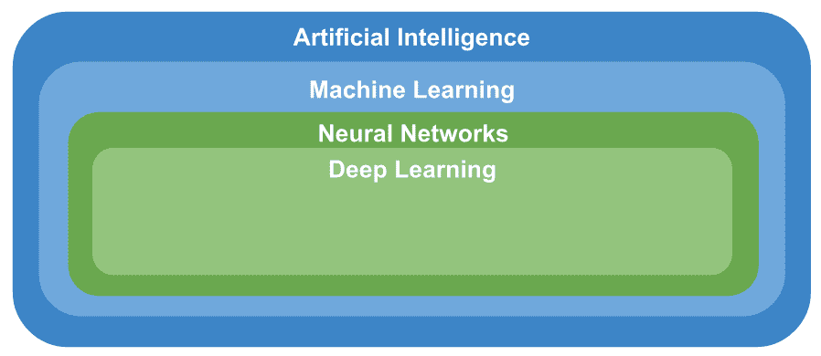

**计算机视觉**是**人工智能**的一个跨学科领域，旨在使具有计算能力的计算机和其他设备从数字图像和视频中获得高层次的理解，包括获取，处理的功能 ，并分析数字图像。 这就是为什么计算机视觉在某种程度上是**人工智能**的另一个子领域的原因，该领域严重依赖于机器学习和深度学习算法来构建计算机视觉应用程序。 此外，**计算机视觉**由多种技术共同作用-**计算机图形学**，**图像处理**，**信号处理**，**传感器技术** ，**数学**甚至是**物理**。

因此，可以完成前面的图来介绍计算机视觉学科：

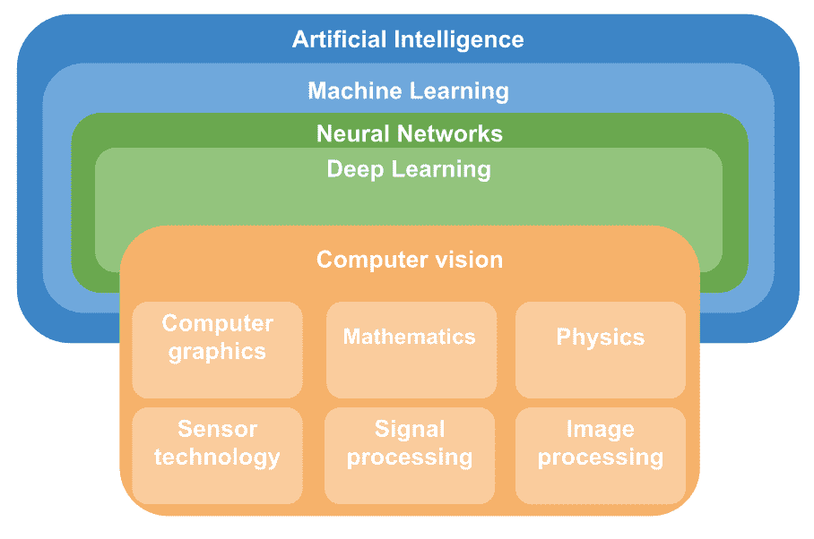

# OpenCV 库的理论介绍

**OpenCV** 是一个具有实时计算机视觉功能的编程库，它对于学术和商业用途都是免费的（BSD 许可证）。 在本节中，将介绍有关 OpenCV 库的信息，包括其主要模块以及与该库有关的其他有用信息。

# OpenCV 模块

**OpenCV**（从版本 2 开始）分为几个模块，每个模块通常可以理解为专用于一组计算机视觉问题。 在下图中可以看到这种划分，其中显示了主要模块：

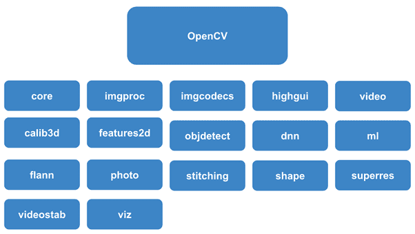

**OpenCV** 模块在此处简短描述：

*   **核心**：核心功能。 核心功能是一个定义基本数据结构的模块，也是库中所有其他模块使用的基本功能。
*   **imgproc** ：图像处理。 图像处理模块，包括图像过滤，几何图像转换，色彩空间转换和直方图。
*   **imgcodecs** ：图像编解码器。 图像文件读写。
*   **videoio** ：视频 I / O。 视频捕获和视频编解码器的接口。
*   **highgui** ：高级 GUI。 UI 功能的接口。 它提供了一个界面，可以轻松地执行以下操作：
    *   创建和操作可显示/显示图像的窗口
    *   将跟踪栏添加到窗口，键盘命令并处理鼠标事件
*   **视频**：视频分析。 一个视频分析模块，包括背景扣除，运动估计和对象跟踪算法。
*   **calib3d** ：相机校准和 3D 重建。 相机校准和 3D 重建涵盖基本的多视图几何算法，立体对应算法，对象姿态估计，单相机和立体相机校准以及 3D 重建。
*   **features2d** ：2D 功能框架。 该模块包括特征检测器，描述符和描述符匹配器。
*   **objdetect** ：对象检测。 检测对象和预定义类的实例（例如，面部，眼睛，人和汽车）。
*   **dnn** ：**深度神经网络**（**DNN**）模块。 该模块包含以下内容：
    *   用于创建新图层的 API
    *   一组有用的图层
    *   从层构建和修改神经网络的 API
    *   从不同的深度学习框架加载序列化网络模型的功能
*   **ml** ：机器学习。 **机器学习库**（**MLL**）是可用于分类，回归和聚类目的的一组类和方法。
*   **flann** ：在多维空间中进行聚类和搜索。 用于近似最近邻居的**快速库**（**FLANN**）是非常适合于快速最近邻居搜索的算法集合。
*   **照片**：计算摄影。 该模块提供了一些用于计算摄影的功能。
*   **拼接**：图像拼接。 该模块实现了执行自动全景图像拼接的拼接管线。
*   **形状**：形状距离和匹配。 形状距离和匹配模块，可用于形状匹配，检索或比较。
*   **替代**：超分辨率。 此模块包含一组可用于增强分辨率的类和方法。
*   **videostab** ：视频稳定。 此模块包含一组用于视频稳定的类和方法。
*   **，即**：3D 可视化器。 此模块用于显示小部件，这些小部件提供了几种与场景和小部件进行交互的方法。

# OpenCV 用户

无论您是专业的软件开发人员还是新手程序员，OpenCV 库都将对图像处理和计算机视觉领域的研究生，研究人员和计算机程序员很感兴趣。 该库已在科学家和学者中广受欢迎，因为该库提供了许多最新的计算机视觉算法。

此外，它通常用作计算机视觉和机器学习的教学工具。 应该考虑到 OpenCV 足够强大以支持实际应用程序。 因此，OpenCV 可以用于非商业和商业产品。 例如，它被 Google，Microsoft，Intel，IBM，Sony 和 Honda 等公司使用。 MIT，CMU 或 Stanford 等一流大学的研究所为图书馆提供支持。 OpenCV 已被世界各地采用。 它的下载量超过 1400 万，社区中的人口超过 47,000。

# OpenCV 应用程序

OpenCV 正在广泛的应用中使用：

*   2D 和 3D 功能工具包
*   街景图像拼接
*   自我估计
*   面部识别系统
*   手势识别
*   人机交互
*   移动机器人
*   运动理解
*   对象识别
*   自动化检查和监视
*   细分与识别
*   立体视立体视觉–两台摄像机的深度感知
*   医学图像分析
*   运动结构
*   运动追踪
*   增强现实
*   视频/图像搜索和检索
*   机器人和无人驾驶汽车的导航和控制
*   驾驶员嗜睡和注意力分散检测

# 为什么在您的研究工作中引用 OpenCV

如果您在研究中使用 OpenCV，建议您引用 OpenCV 库。 这样，其他研究人员可以更好地理解您提出的算法并重现您的结果，从而获得更好的信誉。 此外，OpenCV 将增加反响，从而产生更好的计算机视觉库。 以下代码显示了引用 OpenCV 的 BibTex 条目：

```py
@article{opencv_library,
 author = {Bradski, G.},
 citeulike-article-id = {2236121},
 journal = {Dr. Dobb's Journal of Software Tools},
 keywords = {bibtex-import},
 posted-at = {2008-01-15 19:21:54},
 priority = {4},
 title = {{The OpenCV Library}},
 year = {2000}
}
```

# 安装 OpenCV，Python 和其他软件包

OpenCV，Python 和 AI 相关的软件包可以安装在大多数操作系统上。 我们将看到如何通过不同的方法来安装这些软件包。

在选择最适合您需要的安装选项之前，请确保检查出不同的安装选项。

另外，由于这些文档的普及，在本章的最后对 Jupyter Notebook 进行了介绍，可以运行 Jupyter Notebook 进行数据分析。

# 全局安装 Python，OpenCV 和其他软件包

在本节中，您将看到如何全局安装 Python，OpenCV 和任何其他软件包。 给出了针对 Linux 和 Windows 操作系统的特定说明。

# 安装 Python

我们将看到如何在 Linux 和 Windows 操作系统上全局安装 Python。

# 在 Linux 上安装 Python

在 Debian 衍生产品（例如 Ubuntu）上，使用 APT 安装 Python。 之后，建议升级 pip 版本。 [PIP](https://pip.pypa.io/en/stable/) 是 [PyPA](https://packaging.python.org/guides/tool-recommendations/) 推荐的安装 Python 软件包的工具：

```py
$ sudo apt-get install python3.7 $ sudo pip install --upgrade pip
```

要验证 Python 是否已正确安装，请打开命令提示符或 shell 并运行以下命令：

```py
$ python3 --version
 Python 3.7.0
```

# 在 Windows 上安装 Python

转到[这里](https://www.python.org/downloads/)。 Python Windows 的默认安装程序是 32 位。 启动安装程序。 选择自定义安装：


在下一个屏幕上，应检查所有可选功能：

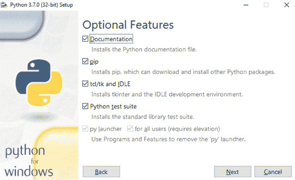

最后，在下一个屏幕上，确保选中将 Python 添加到环境变量和预编译标准库。 （可选）您可以自定义安装位置，例如`C:\Python37`：

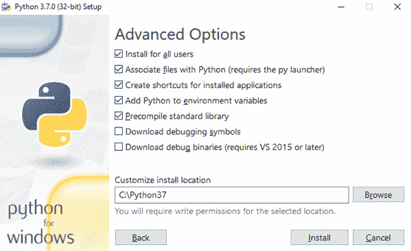

按下“安装”按钮，几分钟后，安装就准备就绪。 在安装程序的最后一页，您还应该按禁用路径长度限制：


要检查 Python 是否已正确安装，请按住 *Shift* 键，然后在桌面上的鼠标右键单击。 在此处选择“打开命令窗口”。 或者，在 Windows 10 上，使用左下方的搜索框搜索`cmd`。 现在，在命令窗口中写入`python`，然后按*输入*键。 您应该会看到以下内容：

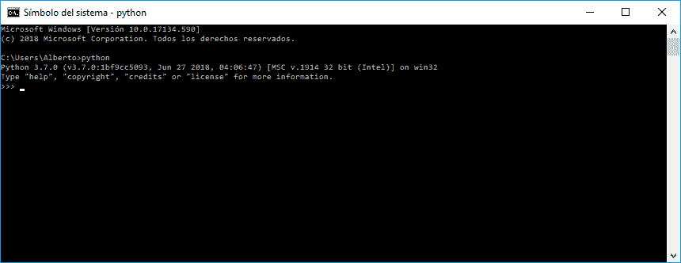

您还应该升级点子：

```py

 $ python -m pip install --upgrade pip
```

# 安装 OpenCV

现在，我们将在 Linux 和 Windows 操作系统上安装 OpenCV。 首先，我们将了解如何在 Linux 上安装 OpenCV，然后如何在 Windows 上安装 OpenCV。

# 在 Linux 上安装 OpenCV

确保已安装 NumPy。 要安装 NumPy，请输入以下内容：

```py
$ pip3 install numpy
```

然后安装 OpenCV：

```py
$ pip3 install opencv-contrib-python
```

此外，我们可以安装 Matplotlib，这是一个生成高质量图形的 Python 图形库：

```py
$ pip3 install matplotlib
```

# 在 Windows 上安装 OpenCV

确保已安装 NumPy。 要安装 NumPy，请输入以下内容：

```py
 $ pip install numpy
```

然后安装 OpenCV：

```py
$ pip install opencv-contrib-python
```

此外，我们可以安装 Matplotlib：

```py
$ pip install matplotlib
```

# 测试安装

一种测试安装的方法是执行 OpenCV Python 脚本。 为此，在特定的文件夹中应该有两个文件`logo.png`和`test_opencv_installation.py`：


打开一个 cmd 并转到这两个文件所在的路径。 接下来，我们可以通过键入以下内容来检查安装：

```py
python test_opencv_installation.py
```

您应该同时看到 OpenCV RGB 徽标和 OpenCV 灰度徽标：


在这种情况下，安装成功。

# 使用 virtualenv 安装 Python，OpenCV 和其他软件包

[`virtualenv`](https://pypi.org/project/virtualenv/)是一种非常流行的工具，可为 Python 库创建隔离的 Python 环境。 `virtualenv`允许多个具有不同（有时是相互冲突）要求的 Python 项目。 从技术上讲，`virtualenv`通过在目录下安装一些文件来工作（例如`env/`）。

另外，`virtualenv`修改 PATH 环境变量以在其前面添加自定义 bin 目录（例如`env/bin/`）。 此外，Python 或 Python3 二进制文件的精确副本位于此目录中。 激活此虚拟环境后，您可以使用 pip 在虚拟环境中安装软件包。 PyPA 也推荐[`virtualenv`](https://packaging.python.org/guides/tool-recommendations/)。 因此，我们将看到如何使用虚拟环境安装 OpenCV 或任何其他软件包。

通常，pip 和`virtualenv`是仅需要全局安装的两个软件包。 这是因为，一旦安装了两个软件包，就可以在虚拟环境中完成所有工作。 实际上，`virtualenv`实际上就是您所需要的，因为此软件包提供了 pip 的副本，该副本被复制到您创建的每个新环境中。

现在，我们将看到如何安装，激活，使用和停用虚拟环境。 现在为 Linux 和 Windows 操作系统提供了特定的命令。 我们不会为每个操作系统添加一个特定的部分，因为每个过程都非常相似。 让我们开始安装`virtualenv`：

```py
$ pip install virtualenv
```

在此目录（`env`）中，创建了一些文件和文件夹，其中包含运行 python 应用程序所需的全部内容。 例如，新的 python 可执行文件将位于`/env/scripts/python.exe`。 下一步是创建一个新的虚拟环境。 首先，将目录更改为项目目录的根目录。 第二步是使用`virtualenv`命令行工具创建环境：

```py
$ virtualenv env
```

在这里，`env`是您要在其中创建虚拟环境的目录的名称。 通常的惯例是在`env`中调用要创建虚拟环境的目录，并将其放入项目目录中。 这样，如果将代码保留在`~/code/myproject/`，则环境将在`~/code/myproject/env/`。

下一步是使用命令行工具激活刚刚创建的`env`环境，以执行`activate`脚本，该脚本位于以下位置：

*   `~/code/myprojectname/env/bin/activate`（Linux）
*   `~/code/myprojectname/env/Scripts/activate`（Windows）

例如，在 Windows 下，您应该键入以下内容：

```py
$ ~/code/myprojectname/env/Scripts/activate
 (env) $
```

现在，您只能为此激活的环境安装所需的软件包。 例如，如果要安装使用 Python 编写的 Django（这是一个免费的开放源 Web 框架），则应输入以下内容：

```py
(env)$ pip install Django
```

请记住，此软件包仅会为`myprojectname`项目安装。

您还可以通过执行以下操作来停用环境：

```py
$ deactivate $
```

您应该看到已经返回到正常提示，表明您不再处于任何`virtualenv`中。 最后，如果要删除环境，只需键入以下内容：

```py
$ rmvirtualenv test
```

# Python IDE 使用 virtualenv 创建虚拟环境

在下一节中，我们将使用 PyCharm（一个 Python IDE）创建虚拟环境。 但是在此之前，我们将讨论 IDE。 IDE 是一种软件应用程序，可帮助计算机程序员进行软件开发。 IDE 提供了一个程序，可以完成所有开发。 与 Python IDE 结合，可以找到两种方法：

*   具有 Python 支持的常规编辑器和 IDE
*   特定于 Python 的编辑器和 IDE

在第一类（通用 IDE）中，应突出一些示例：

*   Eclipse + PyDev
*   Visual Studio +适用于 Visual Studio 的 Python 工具
*   Atom + Python 扩展

在第二类中，这是一些特定于 Python 的 IDE：

*   **PyCharm** ：Python 最好的全功能，专用 IDE 之一。 PyCharm 可在 Windows，macOS 和 Linux 平台上快速轻松地安装。 它是*实际上是* Python IDE 环境。
*   **Spyder** ：Anaconda 软件包管理器发行版附带的 Spyder 是一种开源 Python IDE，非常适合数据科学工作流程。
*   **Thonny** ：Thonny 旨在成为初学者的 IDE。 它适用于所有主要平台（Windows，macOS，Linux），并在网站上提供了安装说明。

在这种情况下，我们将安装 PyCharm（*实际上是* Python IDE 环境）社区版。 之后，我们将看到如何使用此 IDE 创建虚拟环境。 可以从[这里](https://www.jetbrains.com/pycharm/)下载 PyCharm。 PyCharm 可以安装在 Windows，macOS 和 Linux 上：

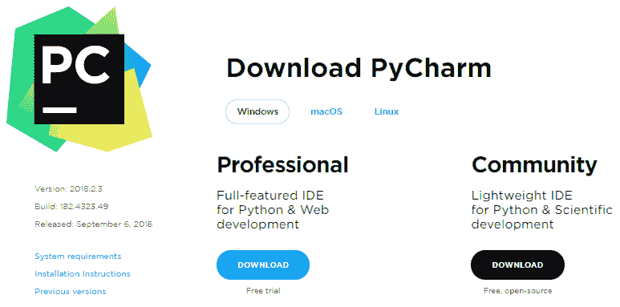

安装 PyCharm 之后，我们就可以使用它了。 使用 PyCharm，我们可以以非常简单直观的方式创建虚拟环境。

通过 PyCharm，可以使用`virtualenv`工具创建特定于项目的隔离虚拟环境。 此外，`virtualenv`工具与 PyCharm 捆绑在一起，因此用户不需要安装它。

打开 Pycharm 后，您可以单击“创建新项目”。 如果要创建新环境，则应单击 Project Interpreter：New Virtualenv 环境。 然后单击使用 Virtualenv 的新环境。 在下一个屏幕截图中可以看到：

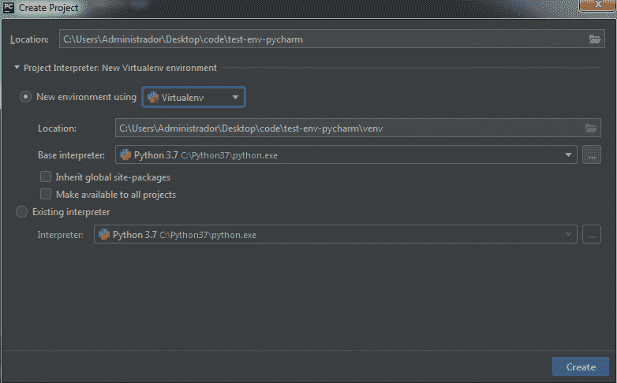

您应注意，虚拟环境的名称（默认为 PyCharm）为`venv`，位于项目文件夹下。 在这种情况下，项目名为`test-env-pycharm`，虚拟环境`venv`位于`test-env-pycharm/venv`。 此外，您可以看到`venv`名称可以根据您的喜好进行更改。

当您单击创建按钮时，PyCharm 会加载项目并创建虚拟环境。 您应该会看到以下内容：


创建项目后，只需单击几下就可以安装软件包。 单击文件，然后单击设置...（ *Ctrl* + *Alt* + *S* ）。 将出现一个新窗口，显示如下内容：

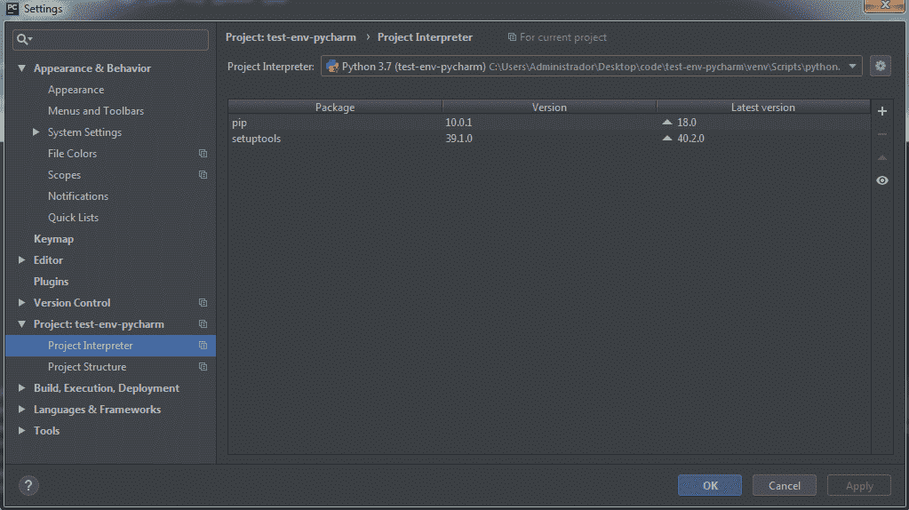

现在，单击 Project ：，然后选择 Project Interpreter。 在此屏幕的右侧，显示已安装的软件包以及所选的**项目解释器**。 您可以在此屏幕顶部进行更改。 选择适当的解释器（以及项目的环境）后，您可以安装新的软件包。 为此，您可以在左上角的输入框中搜索。 在下一个屏幕截图中，您可以看到一个搜索`numpy`包的示例：


您可以通过单击“安装软件包”来安装软件包（默认为最新版本）。 您还可以指定一个具体版本，如上一个屏幕截图所示：

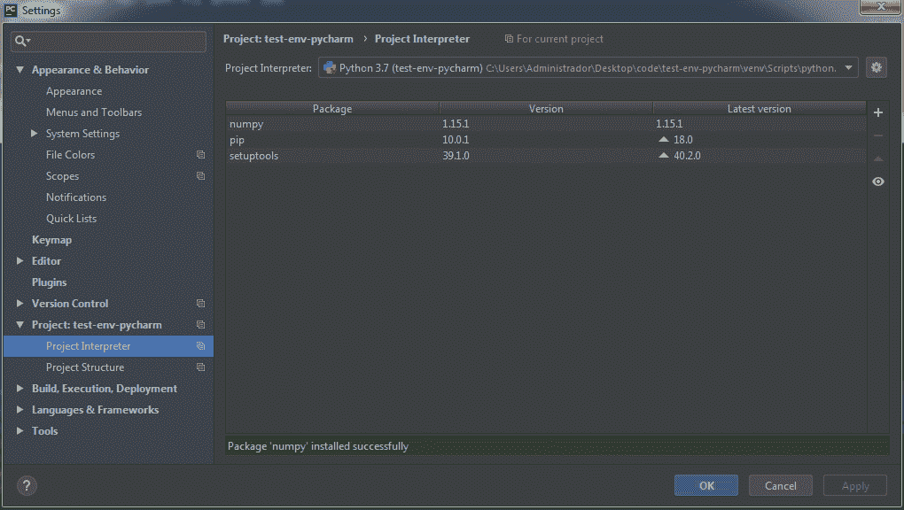

安装该软件包之后，我们可以看到我们现在在虚拟环境中已经安装了三个软件包。 此外，在环境之间进行更改非常容易。 您应该转到**运行/调试配置**，然后单击 Python 解释器以在环境之间进行切换。 下一个屏幕截图中可以看到此功能：


最后，您可能已经注意到，在第一步中，使用 PyCharm 创建虚拟环境时，可以使用`virtualenv`以外的其他选项。 PyCharm 使您能够使用 Virtualenv，Pipenv 和 Conda 创建虚拟环境：

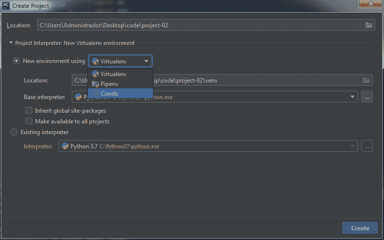

先前我们介绍了 Virtualenv，以及如何使用此工具为 Python 库创建隔离的 Python 环境。

[Pyenv](https://github.com/pyenv/pyenv) 用于隔离 Python 版本。 例如，您可能想针对 Python 2.6、2.7、3.3、3.4 和 3.5 测试代码，因此您将需要一种在它们之间切换的方法。

[Conda](https://conda.io/docs/) 是在 Windows，macOS 和 Linux 上运行的开源软件包管理和环境管理系统（提供虚拟环境功能）。 Conda 包含在 Anaconda 和 Miniconda 的所有版本中。

由于读者可能会对与 Anaconda / Miniconda 和 Conda 的合作感兴趣，因此在下一节中将进行快速介绍，但是不必运行本书中包含的代码示例。

# Anaconda / Miniconda 发行版和 conda 包以及环境管理系统

[Conda](https://conda.io/docs/) 是一个开源的软件包管理和环境管理系统（提供虚拟环境功能），可在许多操作系统（例如 Windows，macOS）上运行 和 Linux）。 Conda 安装，运行和更新软件包及其依赖项。 Conda 可以创建，保存，加载和在环境之间切换。

由于 conda 包含在 Anaconda 和 Miniconda 的所有版本中，因此您应该已经安装了 Anaconda 或 Miniconda。

Anaconda 是可下载，免费，开源的高性能 Python 和 R 发行版。 Anaconda 随附 conda，conda 构建，Python 和 100 多个开源科学软件包及其依赖项。 使用 conda install 命令，您可以轻松地从 Anaconda 存储库安装用于数据科学的流行开源软件包。 Miniconda 是 Anaconda 的小型版本，仅包含 conda，Python，它们依赖的软件包以及少量其他有用的软件包。

安装 Anaconda 或 Miniconda 很容易。 为了简单起见，我们将重点放在 Anaconda 上。 要安装 Anaconda，请检查操作系统的 [Acadonda 安装程序](https://www.anaconda.com/download/)。 Anaconda 5.2 可以在 Windows，macOS 和 Linux 上的 Python 3.6 和 Python 2.7 版本中安装：


完成安装后，为了测试安装，请在 Terminal 或 Anaconda Prompt 中运行以下命令：

```py
$ conda list
```

为了成功安装，将显示已安装软件包的列表。 如前所述，Anaconda（和 Miniconda）附带了 conda，它是一个简单的软件包管理器，类似于 Linux 上的`apt-get`。 这样，我们可以使用以下命令在 Terminal 中安装新软件包：

```py
$ conda install packagename
```

在这里，`packagename`是我们要安装的软件包的实际名称。 可以使用以下命令更新现有软件包：

```py
$ conda update packagename
```

我们还可以使用以下命令搜索软件包：

```py
$ anaconda search –t conda packagename
```

这将显示单个用户可以使用的软件包的完整列表。
然后可以如下安装来自名为 username 的用户的名为`packagename`的软件包：

```py
$ conda install -c username packagename
```

此外，conda 可用于创建和管理虚拟环境。 例如，创建`test`环境并安装 NumPy 1.7 版就像输入下一个命令一样简单：

```py
$ conda create --name test numpy=1.7
```

与使用`virtualenv`的方式类似，可以激活和停用环境。 要在 macOS 和 Linux 上执行此操作，只需运行以下命令：

```py
$ source activate test
 $ python
 ...
 $ source deactivate
```

在 Windows 上，运行以下命令：

```py
$ activate test
 $ python
 ...
 $ deactivate
```

有关使用 conda 的最重要信息的单页摘要，[请参见 conda 备忘单 PDF（1 MB）](https://conda.io/docs/_downloads/conda-cheatsheet.pdf)。

最后，应该指出的是，我们可以在 PyCharm IDE 下使用 conda，就像`virtualenv`一样创建和管理虚拟环境，因为 PyCharm 可以同时使用这两种工具。

# 科学计算，数据科学，机器学习，深度学习和计算机视觉的软件包

到目前为止，我们已经了解了如何从头开始安装 Python，OpenCV 和其他一些软件包（`numpy`和`matplotlib`），或使用 Anaconda 发行版，其中包括许多流行的数据科学软件包。 这样，有关科学计算，数据科学，机器学习和计算机视觉的主要软件包的一些知识是关键点，因为它们提供了强大的计算工具。 在本书中，将使用许多 Python 软件包。 并非本节中所有引用的软件包都将提供，但是为了完整起见，提供了一个完整的列表，以显示 Python 在与本书内容相关的主题中的潜力：

*   [**NumPy**](http://www.numpy.org/) 支持大型多维数组。 NumPy 是计算机视觉中的关键库，因为图像可以表示为多维数组。 将图像表示为 NumPy 数组具有许多优点。
*   [**OpenCV**](https://opencv.org/) 是一个开源计算机视觉库。
*   [**Scikit-Imnage**](https://scikit-image.org/) 是图像处理算法的集合。 scikit-image 操纵的图像只是 NumPy 数组。
*   [**Python 图像库**（**PIL**）](http://www.pythonware.com/products/pil/)是一种图像处理库，它提供了强大的功能 图像处理和图形功能。
*   [**Pillow**](https://pillow.readthedocs.io/) 是 Alex Clark 及其贡献者友好的 PIL 叉子。 PIL 为您的 Python 解释器添加了图像处理功能。
*   [**SimpleCV**](http://simplecv.org/) 是计算机视觉的框架，提供了用于处理图像处理的关键功能。
*   [**Mahotas**](https://mahotas.readthedocs.io/) 是 Python 中用于图像处理和计算机视觉的一组功能。 它最初是为生物图像信息学设计的。 但是，它在其他领域也很有用。 它完全基于 numpy 数组作为其数据类型。
*   [**Ilastik**](http://ilastik.org/) 是一种用于交互式图像分割，分类和分析的用户友好型简单工具。
*   [**Scikit-learn**](http://scikit-learn.org/)）是一种机器学习库，具有各种分类，回归和聚类算法。
*   [**SciPy**](https://www.scipy.org/) 是一个用于科学和技术计算的库。
*   [**NLTK**](https://www.nltk.org/) 是一组用于处理人类语言数据的库和程序。
*   [**spaCy**](https://spacy.io/) 是一个用于在 Python 中进行高级自然语言处理的开源软件库。
*   [**LibROSA**](https://librosa.github.io/librosa/) 是一个用于音乐和音频处理的库。
*   [**Pandas**](https://pandas.pydata.org/) 是一个库（基于 NumPy 构建），提供了高级数据计算工具和易于使用的数据 结构。
*   [**Matplotlib**](https://matplotlib.org/) 是一个绘图库，可产生多种格式的具有出版物质量的图形。
*   [**Seaborn**](https://seaborn.pydata.org/) 是基于 Matplotlib 构建的图形库。
*   [**Orange**](https://orange.biolab.si/) 是面向新手和专家的开源机器学习和数据可视化工具包。
*   [**PyBrain**](http://pybrain.org/)是一种机器学习库，提供了易于使用的最新机器学习算法。
*   [**Milk**](http://luispedro.org/software/milk/) 是一种机器学习工具包，专注于带有多个分类器的监督分类。
*   [**TensorFlow**](https://www.tensorflow.org/) 是一个开源机器学习和深度学习库。
*   [**PyTorch**](https://pytorch.org/) 是一个开放源代码的机器学习和深度学习库。
*   [**Theano**](http://deeplearning.net/software/theano/) 是一个用于快速数学表达式，求值和计算的库，已编译为可在 CPU 和 CPU 上运行。 GPU 架构（深度学习的关键点）。
*   [**Keras**](https://keras.io/) 是一个高级深度学习库，可以在 TensorFlow，CNTK，Theano 或 Microsoft 认知工具包之上运行。
*   [**Django**](https://www.djangoproject.com/) 是基于 Python 的免费和开源 Web 框架，鼓励快速开发和简洁实用的设计。
*   [**Flask**](http://flask.pocoo.org/) 是一个基于 Werkzeug 和 Jinja 2 用 Python 编写的微型 Web 框架。

所有这些软件包都可以根据其主要目的进行组织：

*   **处理图像**：NumPy，OpenCV，scikit 图像，PIL 枕头，SimpleCV，Mahotas，ilastik
*   **处理文本**：NLTK，spaCy，NumPy，scikit-learn，PyTorch
*   **要在音频中工作**：LibROSA
*   **解决机器学习问题**：熊猫，scikit 学习，Orange，PyBrain，牛奶
*   **要清楚地查看数据**：Matplotlib，Seaborn，scikit-learn，Orange
*   **要使用深度学习**：TensorFlow，Pytorch，Theano，Keras
*   **做科学计算**：SciPy
*   **集成 Web 应用程序**：Django，Flask

可以在[这个页面](https://python.libhunt.com/packages/artificial-intelligence)上找到用于 AI 和机器学习的其他 Python 库和软件包。

# Jupyter 笔记本

Jupyter Notebook 是一个开源 Web 应用程序，允许您通过 Web 浏览器编辑和运行文档。 这些文档称为笔记本文档（或笔记本），包含代码（支持 40 多种编程语言，包括 Python）和富文本元素（段落，方程式，图形）。 Jupyter Notebook 可以在本地计算机上执行，也可以安装在远程服务器上。 您可以从笔记本开始，在线尝试它们，也可以安装 Jupyter Notebook。

# 在线尝试 Jupiter Notebook

首先，转到[这里](https://jupyter.org/try)。 您将看到如下内容：


要在线尝试使用 Python 的 Jupyter，请单击 Python 选项，或将此 URL 粘贴到 Web 浏览器中：`https://mybinder.org/v2/gh/ipython/ipython-in-depth/master?filepath=binder/Index.ipynb`。 页面加载后，即可开始编码/加载笔记本。

# 安装 Jupyter 笔记本

要安装 Jupyter，您可以按照[这个页面](http://jupyter.org/install.html)上的主要步骤进行操作。 Jupyter Notebook 的安装也可以使用 Anaconda 或使用 Python 的软件包管理器 pip 完成。

# 使用 Anaconda 安装 Jupyter

强烈建议您使用 Anaconda 发行版安装 Python 和 Jupyter，该发行版包括 Python，Jupyter Notebook 和其他用于科学计算和数据科学的常用软件包。 要使用 Anaconda 安装 Jupyter，请下载 [Anaconda](https://www.anaconda.com/distribution/) 并进行安装。 这样，您已经安装了 Jupyter Notebook。 要运行笔记本，请在命令提示符（Windows）或终端（macOS / Linux）中运行以下命令：

```py
$ jupyter notebook
```

# 使用 pip 安装 Jupyter

您还可以通过运行以下命令，使用 Python 的软件包管理器 pip 安装 Jupyter：

```py
$ python -m pip install --upgrade pip
$ python -m pip install jupyter
```

此时，您可以通过运行以下命令来启动笔记本服务器：

```py
$ jupyter notebook
```

上一个命令将向您显示与笔记本服务器有关的一些关键信息，包括 Web 应用程序的 URL（默认为`http://localhost:8888`）。 然后它将打开您的默认 Web 浏览器到该 URL。 要启动特定的笔记本，应使用以下命令：

```py
$ jupyter notebook notebook.ipynb
```

这是笔记本的快速介绍。 在下一章中，我们将创建一些笔记本，因此您将有机会使用它们，并充分了解此有用的工具。

# OpenCV 和 Python 项目结构

**项目结构**是组织文件夹中所有文件的方式，以使项目最好地实现目标。 我们将从一个`.py`脚本（`sampleproject.py`）开始，该脚本应与其他文件一起使用，以完成有关此脚本的信息-依赖关系，许可证，如何安装或如何对其进行测试。 构建此基本项目的常用方法如下：

```py
sampleproject/
│
├── .gitignore
├── sampleproject.py
├── LICENSE
├── README.rst
├── requirements.txt
├── setup.py
└── tests.py
```

`sampleproject.py`-如果您的项目只是一个 Python 源文件，则将其放入目录中并为其命名与您的项目相关的名称。

`README`（`.rst`或`.md`扩展名）用于注册项目的主要属性，至少应包括以下内容：

*   您的项目做什么
*   如何安装
*   用法示例
*   如何建立开发环境
*   如何运送零钱
*   变更记录
*   许可证和作者信息

[可以从以下 GitHub 存储库下载可以使用的模板](https://github.com/dbader/readme-template)。 有关更多信息，请参见[这里](https://dbader.org/blog/write-a-great-readme-for-your-github-project)。

`LICENSE.md`文档包含适用的许可证。 除了源代码本身之外，这可以说是存储库中最重要的部分。 完整的许可证文本和版权声明应存在于此文件中。 如果您要分发代码，最好有一个。 通常， [**GNU 通用公共许可证**（**GPL**）](http://www.gnu.org/licenses/gpl.html)或 [MIT 许可证](https://opensource.org/licenses/MIT)在开源项目中使用。 如果您不确定应将哪个许可证应用于您的项目，可以访问[这里](http://choosealicense.com/)。

应将`requirements.txt` [pip 要求文件](https://pip.pypa.io/en/stable/user_guide/#requirements-files)放在存储库的根目录中，该目录用于指定 对项目作出贡献所需的依赖关系。 可以使用以下方法生成`requirements.txt`文件：

```py
$ pip freeze > requirements.txt
```

要安装这些要求，可以使用以下命令：

```py
$ pip install -r requirements.txt
```

`setup.py`文件使您可以创建可以重新分发的软件包。 该脚本旨在将软件包安装在最终用户的系统上，而不是像`pip install -r < requirements.txt`那样准备开发环境。 这是一个关键文件，因为它定义了软件包的信息（例如版本，软件包要求和项目描述）。

`tests.py`脚本包含测试。

`.gitignore`文件告诉 Git 忽略什么类型的文件，例如 IDE 混乱或本地配置文件。 您可以在[这个页面](https://github.com/github/gitignore)上找到 Python 项目的示例`.gitignore`文件。

# 我们的第一个 Python 和 OpenCV 项目

基于上一节中显示的最小项目结构，我们将创建我们的第一个 Python 和 OpenCV 项目。 该项目具有以下结构：

```py
helloopencv/
│
├── images/
│
├── .gitignore
├── helloopencv.py
├── LICENSE
├── README.rst
├── requirements.txt
├── setup.py
└── helloopencvtests.py
```

`README.rst`（`.rst`扩展名）遵循基本结构，如上一节所示。 Python 和 **ReStructuredText**（**RST**）紧密相连-RST 是 docutils 和狮身人面像的格式（*实际上是*用于记录 python 代码的标准）。 RST 既用于通过文档字符串来记录对象，又用于编写其他文档。 [如果您访问 Python 的官方文档](https://docs.python.org/3/library/stdtypes.html)，则可以查看每个页面的 [RST 源](https://raw.githubusercontent.com/python/cpython/3.6/Doc/library/stdtypes.rst)。 对`README.rst`使用 RST 使其与整个文档设置直接兼容。 实际上，`README.rst`通常是项目文档的封面。

有一些 RST 编辑器可用来帮助您编写`README.rst`。 您也可以使用一些在线编辑器。 例如，[在线 Sphinx 编辑器是一个不错的选择](https://livesphinx.herokuapp.com/)。

[`.gitignore`文件指定 Git 应该忽略的故意未跟踪的文件](https://git-scm.com/docs/gitignore)。 `.gitignore`告诉`git` Git 应该忽略哪些文件（或模式）。 通常用于避免从您的工作目录中提交对其他协作者无用的临时文件，例如 IDE 创建的编译产品和临时文件。 打开[这个页面](https://github.com/github/gitignore/blob/master/Python.gitignore)以查看可以包含在 Python 项目中的`.gitignore`文件。

`setup.py`（有关详细说明，请参见上一节），它是 Python 文件，通常随库或程序一起提供，也使用 Python 编写。 其目的是正确安装软件。 可以在[这个页面](https://github.com/pypa/sampleproject/blob/master/setup.py)上看到此文件的非常完整的示例，其中包含许多注释，可帮助您了解如何适应它 满足您的需求。 此文件由 [**Python 包装规范**（**PyPa**）](https://www.pypa.io/en/latest/)提出。 一个关键点是与*软件包的*选项相关，正如我们可以在上述`setup.py`文件中看到的那样。

如果您的项目很简单，则可以在此处手动指定软件包目录。 或者，您可以使用`find_packages()`。 另外，如果您只想分发一个 Python 文件，请改为使用`py_modules`参数，如下所示，这将期望存在一个名为`my_module.py`的文件
`py_modules=["my_module"]`。

因此，在我们的情况下，使用`py_modules =["helloopencv"]`。

此外，`setup.py`允许您轻松安装 Python 软件包。 通常，编写以下内容就足够了：

```py
$ python setup.py install
```

因此，如果要安装此简单软件包，可以在`helloopencv`文件夹中编写上一个命令`python setup.py install`。 例如，在 Windows 中，运行以下命令：

```py
C:\...\helloopencv>python setup.py install
```

您应该会看到以下内容：

```py
 running install
 ...
 ...
 Installed c:\python37\lib\site-packages\helloopencv-0.1-py3.7.egg
 Processing dependencies for helloopencv==0.1
 ...
 ...
 Finished processing dependencies for helloopencv==0.1
```

完成后，`helloopencv`已安装在我们的系统中（与其他任何 Python 软件包一样）。 您还可以在`helloopencv`文件夹内安装`helloopencv`和[pip] `pip install .`。 例如，在 Windows 中，运行以下命令：

```py
C:\...\helloopencv>pip install .
```

您应该会看到以下内容：

```py
 Processing c:\...\helloopencv
 ...
 ...
 Successfully installed helloopencv-0.1
```

这表示`helloopencv`已成功安装。 要使用此软件包，我们可以编写一个 Python 文件并导入`helloopencv`软件包。 另外，我们可以通过直接从 Python 解释器导入来快速使用此包。 按照第二种方法，您可以打开命令提示符，导入包并使用它。 首先，打开命令提示符，然后键入`python`以运行解释器：

```py
C:\...\helloopencv>python
Python 3.7.0 (v3.7.0:1bf9cc5093, Jun 27 2018, 04:06:47) [MSC v.1914 32 bit (Intel)] on win32
Type "help", "copyright", "credits" or "license" for more information.
>>>
```

加载解释器后，我们可以导入软件包：

```py
>>> import helloopencv
helloopencv.py is being imported into another module
>>> 
```

`helloopencv.py is being imported into another module`输出是来自`helloopencv`包（特别是来自`helloopencv.py`文件）的消息，指示已导入此文件。 因此，此消息表明模块已成功导入。 导入后，我们就可以使用它。 例如，我们可以调用`show_message`方法：

```py
>>> helloopencv.show_message()
'this function returns a message'
>>>
```

我们可以看到，调用此方法的结果是一条消息显示在屏幕上。 此方法是一种简单的方法，它知道所有内容均已正确安装，因为它涉及到安装，导入和使用软件包中的功能。 此外，我们可以调用`helloopencv`包中包含的更有用的方法。 例如，您可以调用`load_image`方法从磁盘加载映像，然后，可以使用`show_image`方法显示它：

```py
>>> image = helloopencv.load_image("C:/.img/logo.png")
>>> helloopencv.show_image(image)
```

此处，`load_image`功能的参数是计算机图像的路径。 在这种情况下，将加载`logo.png`图像。 调用`show_image`方法后，应显示图像。 要关闭窗口，必须按下一个键。 然后，您应该能够再次在解释器中编写。 要查看`helloopencv`包中可用的所有方法，可以使用喜欢的编辑器或 IDE 打开`helloopencv.py`文件并进行查看。 在此 Python 文件中，您可以看到一些符合我们第一个 Python 项目的方法：

*   `show_message()`：此功能打印`this function returns a message`消息。
*   `load_image()`：此功能从其路径加载图像。
*   `show_image()`：加载图像后，此功能会显示图像。
*   `convert_to_grayscale()`：此功能在加载图像后将其转换为灰度。
*   `write_image_to_disk()`：此功能将图像保存在磁盘上。

所有这些方法都执行简单且基本的操作。 它们中的大多数都使用 OpenCV 库，该库在此文件（`import cv2`）的开头导入。 不必担心此文件中包含的 Python 代码，因为仅执行基本操作和对 OpenCV 库的调用。

您无需安装软件包即可执行`helloopencv.py`脚本。 要执行此文件，应在打开命令提示符后运行`python helloopencv.py`命令：

```py
 C:\...\helloopencv>python helloopencv.py
 helloopencv.py is being run directly
```

执行完该文件后，将显示`helloopencv.py is being run directly`消息，这意味着该文件将直接执行，而不是从其他模块或包（或 Python 解释器）导入。 您还可以看到已加载并显示图像。 您可以按任意键继续执行。 再次显示徽标的灰度版本，应再次按下任何键以结束执行。 将灰度图像保存到磁盘后，执行结束。

最后，`helloopencvtests.py`文件可用于单元测试。 测试应用程序已成为任何合格开发人员的标准技能。 Python 社区支持测试，Python 标准库具有良好的内置工具来支持测试（ [https://docs.python.org/3/library/unittest.html](https://docs.python.org/3/library/unittest.html) ）。

在 Python 生态系统中，有很多测试工具。 用于测试的两个最常见的软件包是`nose`（ [https://pypi.org/project/nose/](https://pypi.org/project/nose/) ）和`pytest`（ [https://pypi.org/project/ pytest /](https://pypi.org/project/pytest/) ）。 在第一个 Python 项目中，我们将使用`pytest`进行单元测试。

要执行测试，请在打开命令提示符后运行`py.test -s -v helloopencvtests.py`命令：

```py
C:\...\helloopencv>py.test -s -v helloopencvtests.py
============================= test session starts =============================
 platform win32 -- Python 3.7.0, pytest-3.8.0, py-1.6.0, pluggy-0.7.1 -- c:\python37\python.exe
 cachedir: .pytest_cache
 collected 4 items
 helloopencvtests.py::test_show_message testing show_message
 PASSED
 helloopencvtests.py::test_load_image testing load_image
 PASSED
 helloopencvtests.py::test_write_image_to_disk testing
 write_image_to_disk
 PASSED
 helloopencvtests.py::test_convert_to_grayscale testing    test_convert_to_grayscale
 PASSED
========================== 4 passed in 0.57 seconds      ===========================
```

执行测试后，您可以看到执行了四个测试。 `PASSED`消息表示测试已成功执行。 这是 Python 单元测试的快速介绍。 不过，完整的`pytest`文档可在 [https://docs.pytest.org/en/latest/contents.html#toc](https://docs.pytest.org/en/latest/contents.html#toc) 中找到。

# 概要

在第一章中，我们介绍了设置 OpenCV 和 Python 以构建您的计算机视觉项目的主要步骤。 在本章开始时，我们快速浏览了本书的主要概念-人工智能，机器学习，神经网络和深度学习。 然后，我们探索了 OpenCV 库，包括该库的历史及其主要模块。 由于 OpenCV 和其他软件包可以在许多操作系统中以不同的方式安装，因此我们介绍了主要方法。

具体来说，我们看到了如何在全局或虚拟环境中安装 Python，OpenCV 和其他软件包。 在安装软件包时，我们介绍了 Anaconda / Miniconda 和 Conda，因为我们还可以创建和管理虚拟环境。 此外，Anaconda / Miniconda 附带了许多开源科学软件包，包括 SciPy 和 NumPy。

我们探索了用于科学计算，数据科学，机器学习和计算机视觉的主要软件包，因为它们提供了强大的计算工具。 然后，我们讨论了 Python 特定的 IDE，包括 PyCharm（*实际上是* Python IDE 环境）。 PyCharm（和其他 IDE）可以帮助我们以非常直观的方式创建虚拟环境。 我们还研究了 Jupyter 笔记本，因为它可能是本书读者的一个很好的工具。 在下一章中，将创建更多的 Jupyter Notebooks，以使您更好地了解此有用的工具。 最后，我们探索了 OpenCV 和 Python 项目结构，涵盖了应包含的主要文件。 然后，我们构建了第一个 Python 和 OpenCV 示例项目，在其中我们看到了构建，运行和测试该项目的命令。

在下一章中，您将开始熟悉 OpenCV 库，从而开始编写第一个脚本。 您将看到开始对计算机视觉项目进行编码的一些基本概念（例如，了解主要图像概念，OpenCV 中的坐标系以及 OpenCV 中的访问和操纵像素）。

# 问题

1.  什么是虚拟环境？
2.  pip，virtualenv，pipenv，Anaconda 和 conda 之间有什么联系？
3.  什么是 Jupyter 笔记本？
4.  在 Python 中使用计算机视觉的主要软件包是什么？
5.  `pip install -r requirements.txt`有什么作用？
6.  什么是 IDE？为什么在开发项目时使用 IDE？
7.  OpenCV 以什么许可发布？

# 进一步阅读

以下参考资料将帮助您更深入地了解本章中介绍的概念：

*   Python 机器学习：
    *   *Python 机器学习*，作者：塞巴斯蒂安·拉施卡（Sebastian Raschka）： [https://www.packtpub.com/big-data-and-business-intelligence/python-machine-learning](https://www.packtpub.com/big-data-and-business-intelligence/python-machine-learning)

*   Python 深度学习：
    *   *Python 深度学习项目*，作者：Rahul Kumar，Matthew Lamons： [https://www.packtpub.com/big-data-and-business-intelligence/python-deep-learning-projects](https://www.packtpub.com/big-data-and-business-intelligence/python-deep-learning-projects)

查看这些参考资料（主要是书籍），以获取有关概念的更多信息，这些概念将在本书的后续章节中介绍。 保持此清单方便； 这将非常有帮助：

*   *使用 Python 的 OpenCV 计算机视觉*（ [https://www.packtpub.com/application-development/opencv-computer-vision-python](https://www.packtpub.com/application-development/opencv-computer-vision-python) ）
*   *OpenCV：使用 Python* 的计算机视觉项目（ [https://www.packtpub.com/application-development/opencv-computer-vision-projects-python](https://www.packtpub.com/application-development/opencv-computer-vision-projects-python) ）
*   *用于开发人员的增强现实*（ [https://www.packtpub.com/web-development/augmented-reality-developers](https://www.packtpub.com/web-development/augmented-reality-developers) ）
*   *使用 Python 和 OpenCV 进行深度学习*（ [https://www.packtpub.com/big-data-and-business-intelligence/deep-learning-python-and-opencv](https://www.packtpub.com/big-data-and-business-intelligence/deep-learning-python-and-opencv) ）
*   *使用 Keras 进行深度学习*（ [https://www.packtpub.com/big-data-and-business-intelligence/deep-learning-keras](https://www.packtpub.com/big-data-and-business-intelligence/deep-learning-keras) ）
*   *TensorFlow* 入门（ [https://www.packtpub.com/big-data-and-business-intelligence/getting-started-tensorflow](https://www.packtpub.com/big-data-and-business-intelligence/getting-started-tensorflow) ）
*   *Mastering Flask Web 开发-第二版*（ [https://www.packtpub.com/web-development/mastering-flask-web-development-second-edition](https://www.packtpub.com/web-development/mastering-flask-web-development-second-edition) ）