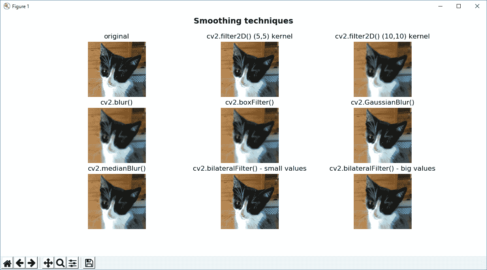
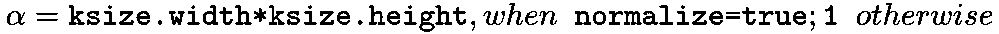
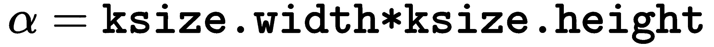
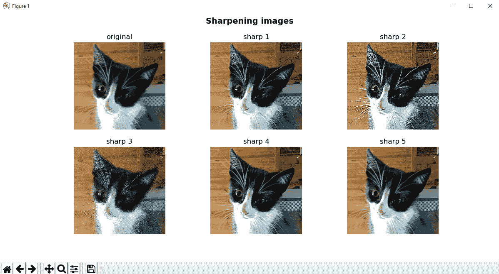
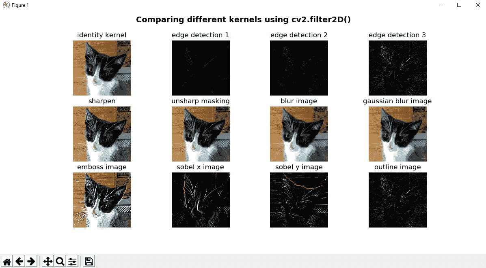
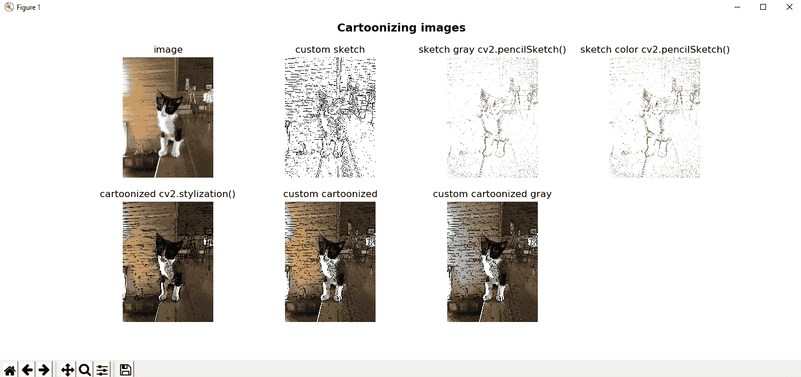
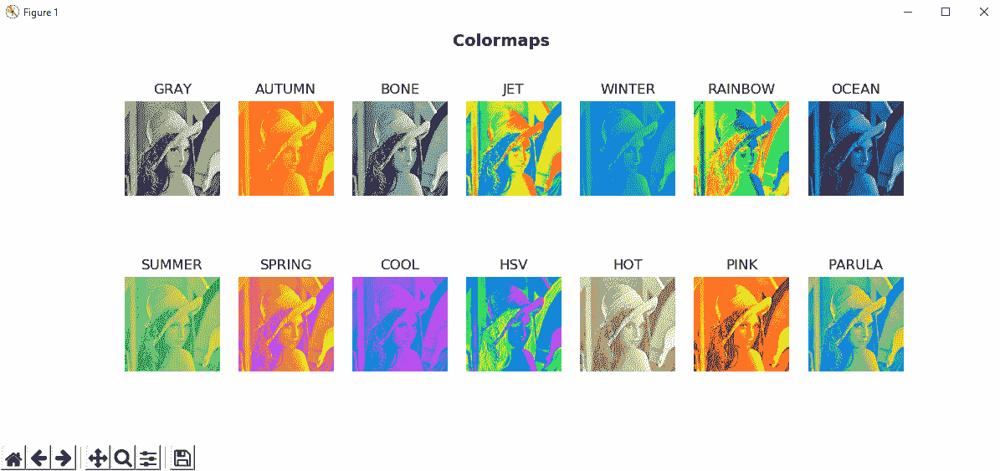
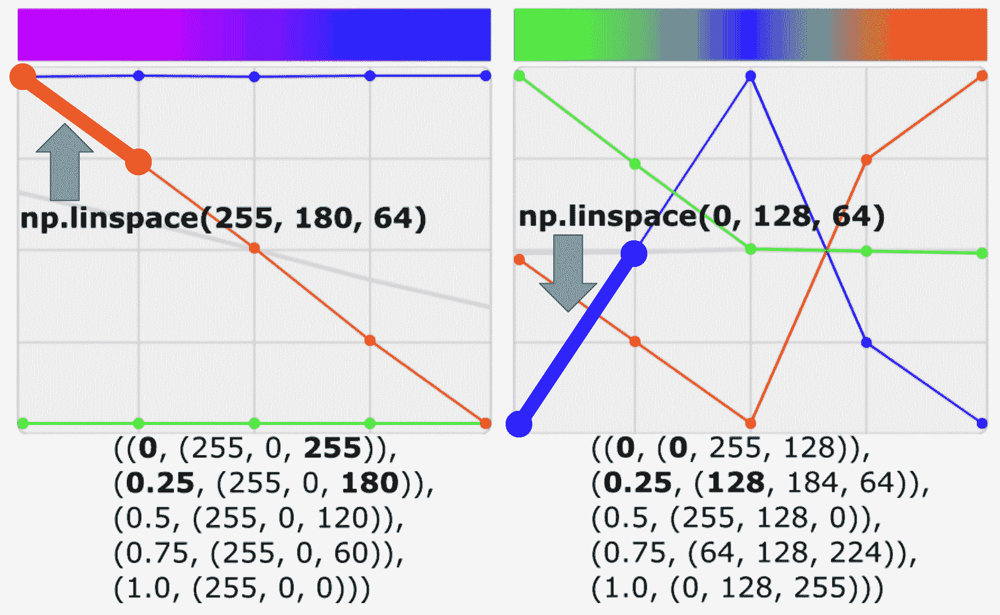
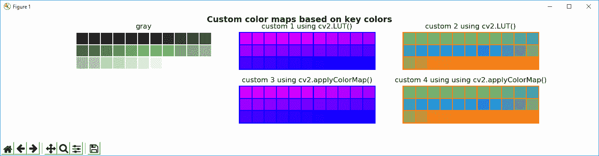

# 图像处理技术

图像处理技术是计算机视觉项目的核心。 它们可以看作是有用的关键工具，可用于完成各种任务。 换句话说，图像处理技术就像构造块，在处理图像时应牢记。 因此，如果要使用计算机视觉项目，则需要对图像处理有基本的了解。

在本章中，您将学习所需的大多数常见图像处理技术。 这些将由本书的后三章介绍的其他图像处理技术（直方图，阈值技术，轮廓检测和滤波）进行补充。

本章将讨论以下主题：

*   拆分和合并渠道
*   图像的几何变换-平移，旋转，缩放，仿射变换，透视变换和裁剪
*   使用图像进行算术运算—按位运算（AND，OR，XOR 和 NOT）和掩码
*   平滑和锐化技术
*   形态运算
*   色彩空间
*   彩色图

# 技术要求

本章的技术要求如下：

*   Python 和 OpenCV
*   特定于 Python 的 IDE
*   NumPy 和 Matplotlib 软件包
*   一个 Git 客户

有关如何安装这些要求的更多详细信息，请参见第 1 章，“设置 OpenCV”。 GitHub 存储库*用 Python* 掌握了 OpenCV 4，其中包含从第一章到最后一章学习本书所需的所有支持项目文件，[可以在以下网址访问](https://github.com/PacktPublishing/Mastering-OpenCV-4-with-Python)。

# 在 OpenCV 中拆分和合并通道

有时，您必须使用多通道图像上的特定通道。 为此，您必须将多通道图像拆分为几个单通道图像。 此外，一旦处理完成，您可能想从不同的单通道图像创建一个多通道图像。 为了同时分割和合并通道，可以分别使用`cv2.split()`和`cv2.merge()`功能。 `cv2.split()`功能将源多通道图像分割为几个单通道图像。 `cv2.merge()`功能将几个单通道图像合并为一个多通道图像。

在下一个示例`splitting_and_merging.py`中，您将学习如何使用上述两个功能。 使用`cv2.split()`功能，如果要从已加载的 BGR 图像中获取三个通道，则应使用以下代码：

```py
 (b, g, r) = cv2.split(image)
```

使用`cv2.merge()`功能，如果要从其三个通道再次构建 BGR 图像，则应使用以下代码：

```py
image_copy = cv2.merge((b, g, r))
```

您应该记住`cv2.split()`是一项耗时的操作，因此仅在绝对必要时才应使用它。 否则，您可以使用 NumPy 功能处理特定的频道。 例如，如果要获取图像的蓝色通道，可以执行以下操作：

```py
b = image[:, :, 0]
```

另外，您可以消除（设置为`0`）多通道图像的某些通道。 生成的图像将具有相同数量的通道，但在相应通道中具有`0`值； 例如，如果要消除 BGR 图像的蓝色通道，可以使用以下代码：

```py
image_without_blue = image.copy()
image_without_blue[:, :, 0] = 0
```

如果执行`splitting_and_merging.py`脚本，则会看到以下屏幕截图：


为了理解此屏幕截图，您应该记住 RGB 颜色空间的累加属性。 例如，使用不带 B 的 **BGR** 子图，您可以看到它大部分是黄色的。 这是因为绿色和红色值产生黄色。 您可以看到的另一个关键功能是与我们设置为`0`的特定通道相对应的黑色子图。

# 图像的几何变换

在本节的第一部分中，将介绍图像的主要几何变换。 我们将看一些缩放，平移，旋转，仿射变换，透视变换和图像裁剪的示例。 执行这些几何变换的两个关键功能是`cv2.warpAffine()`和`cv2.warpPerspective()`。 `cv2.warpAffine()`函数通过使用以下`2 x 3`的`M`变换矩阵来变换源图像：


`cv2.warpPerspective()`函数使用以下`3 x 3`转换矩阵对源图像进行转换：


在接下来的小节中，我们将学习最常见的几何变换技术，当我们查看`geometric_image_transformations.py`脚本时，将学习更多有关几何变换的技术。

# 缩放图像

缩放图像时，可以调用特定大小的`cv2.resize()`，并且缩放因子（`fx`和`fy`）将根据提供的大小进行计算，如以下代码所示：

```py
resized_image = cv2.resize(image, (width * 2, height * 2), interpolation=cv2.INTER_LINEAR)
```

另一方面，您可以同时提供`fx`和`fy`值。 例如，如果要将图像缩小`2`倍，则可以使用以下代码：

```py
dst_image = cv2.resize(image, None, fx=0.5, fy=0.5, interpolation=cv2.INTER_AREA)
```

如果要放大图像，最好的方法是使用`cv2.INTER_CUBIC`插值方法（一种费时的插值方法）或`cv2.INTER_LINEAR`。 如果要缩小图像，通常的方法是使用`cv2.INTER_LINEAR`。

OpenCV 提供的五种插值方法是`cv2.INTER_NEAREST`（最近邻插值），`cv2.INTER_LINEAR`（双线性插值），`cv2.INTER_AREA`（使用像素面积关系重采样），`cv2.INTER_CUBIC`（双曲线插值）和`cv2.INTER_LANCZOS4`（正弦形） 插值）。

# 翻译影像

为了转换对象，您需要使用带有浮点值的 NumPy 数组来创建`2 x 3`转换矩阵，以提供`x`和`y`方向（以像素为单位），如以下代码所示：

```py
M = np.float32([[1, 0, x], [0, 1, y]])
```

这给出了以下`M`转换矩阵：


创建此矩阵后，将调用`cv2.warpAffine()`函数，如以下代码所示：

```py
dst_image = cv2.warpAffine(image, M, (width, height))
```

`cv2.warpAffine()`函数使用提供的`M`矩阵变换源图像。 第三个`(width, height)`参数确定输出图像的大小。

请记住，`image.shape`返回`(width, height)`。

例如，如果要转换`x`方向为`200`像素，`y`方向为`30`像素的图像，请使用以下内容：

```py
height, width = image.shape[:2]
M = np.float32([[1, 0, 200], [0, 1, 30]])
dst_image = cv2.warpAffine(image, M, (width, height))
```

请注意，转换也可以是负数，如以下代码所示：

```py
M = np.float32([[1, 0, -200], [0, 1, -30]])
dst_image = cv2.warpAffine(image, M, (width, height))
```

# 旋转影像

为了旋转图像，我们利用`cv.getRotationMatrix2D()`函数来构建`2 x 3`变换矩阵。 该矩阵以所需角度（以度为单位）旋转图像，其中正值表示逆时针旋转。 旋转`center`和`scale`因子也都可以调整。 在我们的示例中使用这些元素，将计算以下转换矩阵：


该表达式具有以下值：


下面的示例构建`M`变换矩阵，以`1`的比例因子（不缩放）相对于图像中心旋转`180`度。 然后，将此`M`矩阵应用于图像，如下所示：

```py
height, width = image.shape[:2]
M = cv2.getRotationMatrix2D((width / 2.0, height / 2.0), 180, 1)
dst_image = cv2.warpAffine(image, M, (width, height))
```

# 图像的仿射变换

在仿射变换中，我们首先使用`cv2.getAffineTransform()`函数来构建`2 x 3`变换矩阵，该矩阵将从输入图像和变换图像中的相应坐标获得。 最后，将该`M`矩阵传递给`cv2.warpAffine()`，如下所示：

```py
pts_1 = np.float32([[135, 45], [385, 45], [135, 230]])
pts_2 = np.float32([[135, 45], [385, 45], [150, 230]])
M = cv2.getAffineTransform(pts_1, pts_2)
dst_image = cv2.warpAffine(image_points, M, (width, height))
```

**仿射变换**是保留点，直线和平面的变换。 另外，在此变换之后，平行线将保持平行。 但是，仿射变换不能同时保留点之间的距离和角度。

# 图像的透视变换

为了校正透视图（也称为**透视变换**），您将需要使用`cv2.getPerspectiveTransform()`函数创建变换矩阵，其中`3 x 3`矩阵 被建造。 此函数需要四对点（源图像和输出图像中的四边形的坐标），并从这些点计算透视变换矩阵。 然后，将`M`矩阵传递到`cv2.warpPerspective()`，在其中通过应用具有指定大小的指定矩阵来变换源图像，如以下代码所示：

```py
pts_1 = np.float32([[450, 65], [517, 65], [431, 164], [552, 164]])
pts_2 = np.float32([[0, 0], [300, 0], [0, 300], [300, 300]])
M = cv2.getPerspectiveTransform(pts_1, pts_2)
dst_image = cv2.warpPerspective(image, M, (300, 300))
```

# 裁剪图像

要裁剪图像，我们将使用 NumPy 切片，如以下代码所示：

```py
dst_image = image[80:200, 230:330]
```

如前所述，这些几何变换的代码对应于`geometric_image_transformations.py`脚本。

# 图像过滤

在本节中，我们将解决如何通过应用几个滤镜和定制内核来模糊和锐化图像。 此外，我们将研究一些常见的内核，这些内核可用于执行其他图像处理功能。

# 应用任意内核

OpenCV 提供`cv2.filter2D()`函数，以便将任意内核应用于映像，从而将映像与提供的内核进行卷积。 为了了解此功能的工作原理，我们应该先构建内核，稍后再使用。 在这种情况下，将使用`5 x 5`内核，如以下代码所示：

```py
kernel_averaging_5_5 = np.array([[0.04, 0.04, 0.04, 0.04, 0.04], [0.04, 0.04, 0.04, 0.04, 0.04], [0.04, 0.04, 0.04, 0.04, 0.04],[0.04, 0.04, 0.04, 0.04, 0.04], [0.04, 0.04, 0.04, 0.04, 0.04]])
```

这对应于`5 x 5`平均内核。 另外，您还可以像这样创建内核：

```py
kernel_averaging_5_5 = np.ones((5, 5), np.float32) / 25
```

然后，通过应用上述功能，将内核应用于源图像，如以下代码所示：

```py
smooth_image_f2D = cv2.filter2D(image, -1, kernel_averaging_5_5)
```

现在我们已经看到了将任意内核应用于图像的方法。 在前面的示例中，创建了一个平均内核来平滑图像。 还有其他无需创建内核即可执行图像平滑的方法（也称为**图像模糊**）。 相反，可以将其他一些参数提供给相应的 OpenCV 函数。 在`smoothing_techniques.py`脚本中，您可以看到此先前示例和下一小节的完整代码。

# 平滑图像

如前所述，在`smoothing_techniques.py`脚本中，您将看到其他常用的滤波技术来执行平滑操作。 平滑技术通常用于减少噪声，此外，这些技术还可应用于减少低分辨率图像中的像素化效果。 这些技术评论如下。

您可以在以下屏幕截图中看到此脚本的输出：



在前面的屏幕截图中，您可以看到在图像处理中应用通用内核的效果。

# 平均滤波器

您可以同时使用`cv2.blur()`和`cv2.boxFilter()`通过将图像与内核进行卷积来执行平均，在`cv2.boxFilter()`情况下，该内核可以不规范化。 它们仅获取内核区域下所有像素的平均值，然后用该平均值替换中心元素。 您可以控制内核大小和锚定内核（默认为`(-1,-1)`，这意味着锚定位于内核中心）。 当`cv2.boxFilter()`的`normalize`参数（默认为`True`）等于`True`时，两个功能执行相同的操作。 这样，两个函数都使用内核对图像进行平滑处理，如以下表达式所示：


对于`cv2.boxFilter()`功能：



对于`cv2.blur()`功能：



换句话说，`cv2.blur()`始终使用标准化的框式过滤器，如以下代码所示：

```py
smooth_image_b = cv2.blur(image, (10, 10))
smooth_image_bfi = cv2.boxFilter(image, -1, (10, 10), normalize=True)
```

在前面的代码中，两行代码是等效的。

# 高斯滤波

OpenCV 提供`cv2.GaussianBlur()`功能，该功能使用高斯内核模糊图像。 可以使用以下参数控制该内核：`ksize`（内核大小），`sigmaX`（`x`-高斯内核方向的标准偏差）和`sigmaY`（`y`-高斯核的方向）。 为了知道已经应用了哪个内核，可以使用`cv2.getGaussianKernel()`函数。

例如，在下面的代码行中，`cv2.GaussianBlur()`使用大小为`(9, 9)`的高斯核模糊图像：

```py
smooth_image_gb = cv2.GaussianBlur(image, (9, 9), 0)
```

# 中值过滤

OpenCV 提供`cv2.medianBlur()`函数，该函数使用中值内核模糊图像，如以下代码所示：

```py
smooth_image_mb = cv2.medianBlur(image, 9)
```

可以应用此滤波器来减少图像的椒盐噪声。

# 双边过滤

可以将`cv2.bilateralFilter()`功能应用于输入图像，以便应用双边滤镜。 此功能可用于减少噪声，同时保持边缘清晰，如以下代码所示：

```py
smooth_image_bf = cv2.bilateralFilter(image, 5, 10, 10)
```

应当注意，所有先前的滤镜都倾向于使包括边缘在内的所有图像平滑。

# 锐化影像

与最后一个功能结合使用，您可以尝试一些选项以锐化图像的边缘。 一种简单的方法是执行所谓的**锐化遮罩**，其中从原始图像中减去图像的锐化或平滑版本。 在以下示例中，首先应用了高斯平滑滤波器，然后从原始图像中减去了所得图像：

```py
 smoothed = cv2.GaussianBlur(img, (9, 9), 10)
 unsharped = cv2.addWeighted(img, 1.5, smoothed, -0.5, 0)
```

另一种选择是使用特定的内核锐化边缘，然后应用`cv2.filter2D()`功能。 在`sharpening_techniques.py`脚本中，有一些定义的内核可用于此目的。 以下屏幕快照显示了此脚本的输出：



在前面的屏幕截图中，您可以看到应用不同的锐化内核的效果，可以在`sharpening_techniques.py`脚本中看到。

# 图像处理中的常见内核

我们已经看到内核对生成的图像有很大的影响。 在`filter_2D_kernels.py`脚本中，有一些定义的通用内核可用于不同目的-边缘检测，平滑，锐化或压花等。 提醒一下，为了应用特定的内核，应使用`cv2.filter2D()`函数。 以下屏幕快照显示了此脚本的输出：



您可以使用`cv2.filter2D()`函数查看应用不同内核的效果，该函数可用于应用特定内核。

# 创建卡通化图像

如前所述，可以使用`cv2.bilateralFilter()`来减少噪声，同时保留尖锐的边缘。 但是，此滤镜可以在滤波后的图像中同时产生强度平稳（阶梯效应）和假边缘（渐变反转）。 尽管可以在过滤后的图像中考虑到这一点（对处理这些伪像的双边过滤器进行了一些改进），但是创建卡通化图像可能非常酷。 完整的代码可以在`cartoonizing.py`中看到，但是在本节中，我们将进行简要描述。

将图像卡通化的过程非常简单，可以在`cartonize_image()`中执行。 功能。 首先，基于图像的边缘构造图像的草图（请参见`sketch_image()`功能）。 还有其他边缘检测器可以使用，但是在这种情况下，使用拉普拉斯算子。 在调用`cv2.Laplacian()`函数之前，我们通过`cv2.medianBlur()`中值滤波器对图像进行平滑处理来降低噪声。 一旦获得边缘，则通过应用`cv2.threshold()`对所得图像进行阈值处理。 我们将在下一章中介绍阈值技术，但是在本示例中，此函数从给定的灰度图像中为我们提供了一个与`sketch_image()`函数的输出相对应的二进制图像。 您可以使用阈值（在这种情况下固定为`70`）进行操作，以查看该值如何控制结果图像中出现的黑色像素（对应于检测到的边缘）数量。 如果此值较小（例如`10`），则会出现许多黑色边框像素。 如果该值较大（例如`200`），则几乎不会输出黑色边框像素。 为了获得卡通效果，我们将`cv2.bilateralFilter()`函数称为具有较大值的函数（例如`cv2.bilateralFilter(img, 10, 250, 250)`）。 最后一步是使用草图图像作为遮罩，使用`cv2.bitwise_and()`将草图图像和双边滤波器的输出放在一起，以便将这些值设置为输出。 如果需要，输出也可以转换为灰度。 注意`cv2.bitwise_and()`函数是按位操作，我们将在下一部分中看到。

为了完整起见，OpenCV 提供了类似的功能，并且也在此脚本中进行了测试。 它可以使用以下过滤器工作：

*   `cv2.pencilSketch()`：此过滤器生成铅笔素描线图（类似于我们的`sketch_image()`功能）。
*   `cv2.stylization()`：此滤镜可用于产生各种非真实感效果。 在这种情况下，我们应用`cv2.stylization()`以获得卡通效果（类似于我们的`cartonize_image()`函数）。

以下屏幕快照显示了与`cartoonizing.py`脚本对应的输出：



如您所见，`cartonize_image()`功能还可以输出调用`cv2.cvtColor()`的灰度图像，以将图像从 BGR 转换为灰度。

# 图像算术

在本节中，我们将学习一些可以在图像上执行的常见算术运算，例如按位运算，加法和减法。 与这些操作有关，要考虑的一个关键点是饱和算法的概念，以下小节对此进行了说明。

# 饱和算法

饱和算术是一种算术运算，其中通过限制运算可以采用的最大值和最小值将运算限制在固定范围内。 例如，对图像的某些操作（例如，色彩空间转换，插值技术等）可能会产生超出可用范围的值。 为了解决这个问题，使用了饱和算法。

例如，要存储`r`（这可能是对 8 位图像（值范围从`0`到`255`的值）执行特定操作的结果），请应用以下公式：


可以在以下`saturation_arithmetic.py`脚本中看到此概念：

```py
x = np.uint8([250])
y = np.uint8([50])
# 250+50 = 300 => 255:
result_opencv = cv2.add(x, y)
print("cv2.add(x:'{}' , y:'{}') = '{}'".format(x, y, result_opencv))
# 250+50 = 300 % 256 = 44
result_numpy = x + y
print("x:'{}' + y:'{}' = '{}'".format(x, y, result_numpy))
```

在 OpenCV 中，对值进行裁剪以确保它们永远不会超出`[0, 255]`范围。 这称为**饱和操作**。 在 NumPy 中，值被包裹起来。 这也称为**取模操作**。

# 图像加减

可以分别通过`cv2.add()`和`cv2.subtract()`功能执行图像加和减。 这些函数对两个数组的每个元素进行求和/减法。 这些函数还可以用于对数组和标量求和/相减。 例如，如果要向图像的所有像素添加`60`，我们首先必须使用以下代码构建要添加到原始图像的图像：

```py
M = np.ones(image.shape, dtype="uint8") * 60
```

然后，我们使用以下代码执行添加：

```py
added_image = cv2.add(image, M)
```

另一种可能性是创建标量并将其添加到原始图像。 例如，如果要将`110`添加到图像的所有像素，则首先必须使用以下代码构建标量：

```py
scalar = np.ones((1, 3), dtype="float") * 110
```

然后，我们使用以下代码执行加法：

```py
added_image_2 = cv2.add(image, scalar)
```

在减法的情况下，过程相同，但是我们调用了`cv2.subtract()`函数。 可以在`arithmetic.py`中看到此脚本的完整代码。 在以下屏幕截图中可以看到此脚本的输出：


在前面的屏幕截图中，您可以清楚地看到添加和减去预定义值的效果（以两种不同的方式计算，但显示的结果相同）。 当我们添加一个值时，图像将更亮，而当我们减去一个值时，图像将更暗。

# 图像融合

图像融合也是**图像添加**，但是对图像赋予不同的权重，给人以透明感。 为此，将使用`cv2.addWeighted()`功能。 此函数通常用于从`Sobel`运算符获取输出。

`Sobel`运算符用于边缘检测，在其中创建强调边缘的图像。 `Sobel`运算符使用两个 3×3 内核，它们与原始图像卷积在一起，以便计算导数的近似值，同时捕获水平和垂直变化，如以下代码所示：

```py
# Gradient x is calculated:
# the depth of the output is set to CV_16S to avoid overflow
# CV_16S = one channel of 2-byte signed integers (16-bit signed integers)
gradient_x = cv2.Sobel(gray_image, cv2.CV_16S, 1, 0, 3)
gradient_y = cv2.Sobel(gray_image, cv2.CV_16S, 0, 1, 3)
```

因此，在计算出水平和垂直变化之后，可以使用上述功能将它们混合成图像，如下所示：

```py
# Conversion to an unsigned 8-bit type:
abs_gradient_x = cv2.convertScaleAbs(gradient_x)
abs_gradient_y = cv2.convertScaleAbs(gradient_y)

# Combine the two images using the same weight:
sobel_image = cv2.addWeighted(abs_gradient_x, 0.5, abs_gradient_y, 0.5, 0)
```

可以在`arithmetic_sobel.py`脚本中看到。 在以下屏幕截图中可以看到此脚本的输出：


在前面的屏幕截图中，显示了`Sobel`运算符的输出，包括水平和垂直更改。

# 按位运算

可以使用按位运算符在位级别执行某些操作，这些操作可用于操纵值以进行比较和计算。 这些按位运算很简单，并且计算很快。 这意味着它们是处理图像时的有用工具。

按位运算包括`AND`，`OR`，`NOT`和`XOR`。

*   **按位与**：`bitwise_and = cv2.bitwise_and(img_1, img_2)`
*   **按位或**：`bitwise_xor = cv2.bitwise_xor(img_1, img_2)`
*   **按位异或**：`bitwise_xor = cv2.bitwise_xor(img_1, img_2)`
*   **按位非**：`bitwise_not_1 = cv2.bitwise_not(img_1)`

为了解释这些操作的工作方式，请在以下屏幕截图中查看`bitwise_operations.py`脚本的输出：


为了进一步处理按位运算，您可以查看下面的`bitwise_operations_images.py`脚本，其中加载了两个图像并执行了一些按位运算（AND 和 OR）。 应当注意，图像应具有相同的形状：

```py
# Load the original image (250x250):
image = cv2.imread('lenna_250.png')

# Load the binary image (but as a GBR color image - with 3 channels) (250x250):
binary_image = cv2.imread('opencv_binary_logo_250.png')

# Bitwise AND
bitwise_and = cv2.bitwise_and(image, binary_image)

# Bitwise OR
bitwise_or = cv2.bitwise_or(image, binary_image)
```

在以下屏幕截图中可以看到输出：


在上一个屏幕截图中，您可以在执行按位运算（AND，OR）时看到生成的图像。

# 形态转换

**形态变换**是通常在二进制图像上并且基于图像形状执行的操作。 确切的操作由内核结构元素确定，该元素决定了操作的性质。 膨胀和侵蚀是形态转换领域中的两个基本运算符。 另外，打开和关闭是两个重要的操作，它们是从上述两个操作（膨胀和腐蚀）派生而来的。 最后，还有其他三个基于这些先前操作之间的差异的操作。

所有这些形态转换将在以下小节中介绍，`morphological_operations.py`脚本显示了将这些转换应用于某些测试图像时的输出。 关键点也将被评论。

# 扩张术

对二值图像进行膨胀操作的主要效果是逐渐扩展前景对象的边界区域。 这意味着在这些区域内的孔缩小时，前景对象的区域将变大。 以下代码显示了操作的详细信息：

```py
dilation = cv2.dilate(image, kernel, iterations=1)
```

# 侵蚀操作

对二进制图像进行腐蚀操作的主要效果是逐渐侵蚀掉前景对象的边界区域。 这意味着前景对象的区域将变小，并且这些区域内的孔洞将变大。 您可以在以下代码中查看此操作的详细信息：

```py
erosion = cv2.erode(image, kernel, iterations=1)
```

# 开门操作

对于两个操作，打开操作都执行侵蚀，然后使用相同的结构元素（或内核）进行膨胀。 这样，可以施加腐蚀来消除一小组不希望的像素（例如，盐和胡椒噪声）。

侵蚀将不加选择地影响图像的所有区域。 通过在腐蚀之后执行膨胀操作，我们将减少其中一些影响。 您可以在以下代码中查看此操作的详细信息：

```py
opening = cv2.morphologyEx(image, cv2.MORPH_OPEN, kernel)
```

# 合闸操作

与其相反，结束算子可以从腐蚀和膨胀运算中得出。 在这种情况下，操作会先进行扩张，然后进行腐蚀。 膨胀操作通常用于填充图像中的小孔。 但是，膨胀操作也会使不希望出现的像素的较小组变大。 通过在膨胀后对图像进行腐蚀操作，可以减少这种影响。 您可以在以下代码中查看此操作的详细信息：

```py
closing = cv2.morphologyEx(image, cv2.MORPH_CLOSE, kernel)
```

# 形态梯度运算

形态学梯度运算定义为输入图像的膨胀和腐蚀之间的差：

```py
morph_gradient = cv2.morphologyEx(image, cv2.MORPH_GRADIENT, kernel)
```

# 高顶礼帽操作

高礼帽操作定义为输入图像和图像打开之间的差异。 您可以在以下代码中查看此操作的详细信息：

```py
top_hat = cv2.morphologyEx(image, cv2.MORPH_TOPHAT, kernel)
```

# 黑帽行动

黑帽操作定义为输入图像和输入图像关闭之间的差异。 您可以在以下代码中查看此操作的详细信息：

```py
black_hat = cv2.morphologyEx(image, cv2.MORPH_BLACKHAT, kernel)
```

# 结构元素

与结构元素一起，OpenCV 提供了`cv2.getStructuringElement()`功能。

此函数输出所需的内核（类型为`uint8`的 NumPy 数组）。 应该向该函数传递两个参数-内核的形状和大小。 OpenCV 提供以下三种形状：

*   **矩形核**：`cv2.MORPH_RECT`
*   **椭圆核**：`cv2.MORPH_ELLIPSE`
*   **十字形核**：`cv2.MORPH_CROSS`

# 将形态学变换应用于图像

在`morphological_operations.py`脚本中，我们使用不同的内核大小和形状，形态转换和图像。 我们将在本节中描述此脚本的一些关键点。

首先，`build_kernel()`函数根据内核类型和大小返回用于形态转换的特定内核。 其次，`morphological_operations`词典包含所有已实现的形态学运算。 如果我们打印字典，输出将如下所示：

```py
index: '0', key: 'erode', value: '<function erode at 0x0C1F8228>'
index: '1', key: 'dilate', value: '<function dilate at 0x0C1F8390>'
index: '2', key: 'closing', value: '<function closing at 0x0C1F83D8>'
index: '3', key: 'opening', value: '<function opening at 0x0C1F8420>'
index: '4', key: 'gradient', value: '<function morphological_gradient at 0x0C1F8468>'
index: '5', key: 'closing|opening', value: '<function closing_and_opening at 0x0C1F8348>'
index: '6', key: 'opening|closing', value: '<function opening_and_closing at 0x0C1F84B0>'
```

换句话说，字典的键标识要使用的形态操作，并且值是使用相应键时要调用的函数。 例如，如果要调用`erode`操作，则必须执行以下操作：

```py
result = morphological_operations[‘erode’](image, kernel_type, kernel_size)
```

在前面的代码`image`，`kernel_type`和`kernel_size`是`erode`函数的参数（实际上，它们是字典中所有函数的参数）。

`apply_morphological_operation()`函数将字典中定义的所有形态运算应用于图像阵列。 最后，调用`show_images()`函数，在其中绘制阵列中包含的所有图像。 具体的实现细节可以在`morphological_operations.py`脚本的源代码中找到，该脚本包含大量注释。

该脚本绘制了四个图形，其中测试了不同的内核类型和大小。 例如，在以下屏幕截图中，当使用`(3, 3)`的内核大小和矩形内核（`cv2.MORPH_RECT`）时，您可以看到输出：


如您在前面的屏幕快照中所见，在对图像进行预处理时，形态学运算是一种有用的技术，因为您可以消除一些噪声，这些噪声会干扰图像的正确处理。 另外，形态学操作也可以用于处理图像结构中的缺陷。

# 色彩空间

在本节中，将介绍流行的色彩空间的基础知识。 这些颜色空间是-RGB，CIELab，HSL 和 HSV 以及 YCbCr。

OpenCV 提供了 150 多种颜色空间转换方法来执行用户所需的转换。 在以下示例中，从加载到 RGB（OpenCV 中的 BGR）的图像到其他颜色空间（例如，HSV，HLS 或 YCbCr）执行转换。

# 显示色彩空间

**RGB** 颜色空间是加法颜色空间，其中特定颜色由红色，绿色和蓝色值表示。 人类视觉的工作方式相似，因此此色彩空间是显示计算机图形的合适方式。

**CIELAB** 颜色空间（也称为 **CIELab** 或简称为 *LAB*）代表一种特定的颜色，作为三个数值，其中`L`表示 亮度，`a`代表绿色-红色分量，`b`代表蓝黄色分量。 在某些图像处理算法中也使用此色彩空间。

**色相，饱和度，亮度**（**HSL**）和**色相，饱和度，值**（**HSV**）是两个色彩空间，其中只有一个通道 （H）用于描述颜色，使其非常直观地指定颜色。 在这些颜色模型中，当应用图像处理技术时，亮度分量的分离具有一些优势。

**YCbCr** 是在视频和数字摄影系统中使用的一系列色彩空间，以色度分量（Y）和两个色度分量/色度（Cb 和 Cr）表示颜色。 基于从 YCbCr 图像派生的颜色模型，此颜色空间在图像分割中非常受欢迎。

在`color_spaces.py`脚本中，图像被加载到 BGR 颜色空间中并转换为上述颜色空间。 在此脚本中，关键功能是`cv2.cvtColor()`，它可以将一种颜色空间的输入图像转换为另一种颜色空间。

在与 RGB 颜色空间之间进行转换的情况下，应明确指定通道的顺序（BGR 或 RGB）。 例如：

```py
image = cv2.imread('color_spaces.png')
```

该图像被加载到 BGR 颜色空间中。 因此，如果我们要将其转换为 HSV 颜色空间，则必须执行以下操作：

```py
hsv_image = cv2.cvtColor(image, cv2.COLOR_BGR2HSV)
```

注意，我们使用了`cv2.COLOR_BGR2HSV`而不是`cv2.COLOR_RGB2HSV`。

该脚本的完整代码可以在`color_space.py`中看到。 在以下屏幕截图中可以看到输出：


如前面的屏幕快照所示，BGR 图像被转换为​​HSV，HLS，YCrCb 和 Lab 颜色空间。 还显示了每个颜色空间的所有组件（通道）。

# 不同颜色空间中的皮肤分割

前述色彩空间可用于不同的图像处理任务和技术。 例如，`skin_segmentation.py`脚本实现了不同的算法，以在不同的颜色空间（YCrCb，HSV 和 RGB）中执行皮肤分割工作。 该脚本还加载了一些测试图像，以查看这些算法如何工作。

该脚本中的关键功能是`cv2.cvtColor()`（我们已经提到过）和`cv2.inRange()`，它检查一个数组中包含的元素是否位于其他两个数组的元素之间（下边界数组和上边界数组） ）。

因此，我们使用`cv2.inRange()`功能分割与皮肤对应的颜色。 如您所见，为这两个数组（上下边界）定义的值在分割算法的性能中起着至关重要的作用。 以此方式，已经进行了广泛的调查以正确设置它们。 在此示例中，这些值是从以下研究论文中获得的：

```cpp
RGB-H-CbCr Skin Color Model for Human Face Detection by Nusirwan Anwar, Abdul Rahman, K. C. Wei, and John See

Skin segmentation algorithm based on the YCrCb color space by Shruti D Patravali, Jyoti Waykule, and Apurva Katre

Face Segmentation Using Skin-Color Map in Videophone Applications by D. Chai and K.N. Ngan
```

`skin_detectors`词典已构建为将所有皮肤分割算法应用于测试图像。 如果我们打印它，输出将如下所示：

```py
index: '0', key: 'ycrcb', value: '<function skin_detector_ycrcb at 0x07B8C030>'
index: '1', key: 'hsv', value: '<function skin_detector_hsv at 0x07B8C0C0>'
index: '2', key: 'hsv_2', value: '<function skin_detector_hsv_2 at 0x07B8C108>'
index: '3', key: 'bgr', value: '<function skin_detector_bgr at 0x07B8C1E0>'
```

您可以看到定义了四个皮肤检测器。 为了调用皮肤分割检测器（例如`skin_detector_ycrcb`），必须执行以下操作：

```py
detected_skin = skin_detectors['ycrcb'](image)
```

脚本的输出可以在以下屏幕截图中看到：


您可以通过使用多个测试图像来查看应用不同的皮肤分割算法的效果，以了解这些算法在不同条件下的工作方式。

# 彩色图

在许多计算机视觉应用程序中，算法的输出是灰度图像。 但是，人眼不善于观察灰度图像的变化。 当意识到彩色图像的变化时，它们更加敏感，因此一种常见的方法是将灰度图像转换（重新着色）为伪彩色等效图像。

# OpenCV 中的颜色图

为了执行此转换，OpenCV 具有多个颜色图以增强可视化。 `cv2.applyColorMap()`功能在给定图像上应用颜色图。 `color_map_example.py`脚本加载灰度图像并应用`cv2.COLORMAP_HSV`色彩映射，如以下代码所示：

```py
img_COLORMAP_HSV = cv2.applyColorMap(gray_img, cv2.COLORMAP_HSV)
```

最后，我们将所有颜色图应用于同一灰度图像，并在同一图中绘制它们。 可以在`color_map_all.py`脚本中看到。 OpenCV 定义的颜色图如下所示：

*   `COLORMAP_AUTUMN = 0`
*   `COLORMAP_BONE = 1`
*   `COLORMAP_JET = 2`
*   `COLORMAP_WINTER = 3`
*   `COLORMAP_RAINBOW = 4`
*   `COLORMAP_OCEAN = 5`
*   `COLORMAP_SUMMER = 6`
*   `COLORMAP_SPRING = 7`
*   `COLORMAP_COOL = 8`
*   `COLORMAP_HSV = 9`
*   `COLORMAP_HOT = 11`
*   `COLORMAP_PINK = 10`
*   `COLORMAP_PARULA = 12`

`color_map_all.py`脚本将所有这些颜色映射应用于灰度图像。 在以下屏幕截图中可以看到此脚本的输出：



在上一个屏幕截图中，您可以看到将所有预定义的颜色图应用于灰度图像以增强可视化效果的效果。

# 自定义颜色图

您还可以将自定义颜色映射应用于图像。 此功能可以通过几种方式实现。

第一种方法是定义一个将`0`到`255`灰度值映射到 256 种颜色的颜色图。 这可以通过创建大小为`256 x 1`的 8 位彩色图像来完成，以存储所有创建的颜色。 之后，您可以通过查找表将图像的灰度强度映射为定义的颜色。 为此，您可以执行以下操作之一：

*   利用`cv2.LUT()`功能
*   将图像的灰度强度映射为定义的颜色，以便可以使用`cv2.applyColorMap()`

一个关键点是在创建大小为`256 x 1`的 8 位彩色图像时存储所创建的颜色。 如果要使用`cv2.LUT()`，则应按以下方式创建图像：

```py
lut = np.zeros((256, 3), dtype=np.uint8)
```

如果要使用`cv2.cv2.applyColorMap()`，则应如下所示：

```py
lut = np.zeros((256, 1, 3), dtype=np.uint8)
```

完整的代码可以在`color_map_custom_values.py`中看到。 在以下屏幕截图中可以看到此脚本的输出：


定义颜色图的第二种方法是只提供一些关键色，然后*内插*这些值，以便获得所有必要的颜色来建立查找表。 `color_map_custom_key_colors.py`脚本显示了如何实现此目的。

`build_lut()`函数基于这些关键色构建查找表。 基于五个色点，此函数调用`np.linespace()`以获取在该间隔内计算出的所有 64 种均匀分布的颜色，每种颜色由两个色点定义。 为了更好地理解这一点，请看以下屏幕截图：



在此屏幕截图中，您可以查看例如如何计算两个线段的所有`64`等距颜色（请参见绿色和蓝色突出显示的线段）。

最后，为了构建以下五个关键色点（`(0, (0, 255, 128))`，`(0.25, (128, 184, 64))`，`(0.5, (255, 128, 0))`，`(0.75, (64, 128, 224))`和`(1.0, (0, 128, 255))`）的查找表，对`np.linespace()`进行了以下调用：

```py
blue : np.linspace('0', '128', '64' - '0' = '64')
green : np.linspace('255', '184', '64' - '0' = '64')
red : np.linspace('128', '64', '64' - '0' = '64')
blue : np.linspace('128', '255', '128' - '64' = '64')
green : np.linspace('184', '128', '128' - '64' = '64')
red : np.linspace('64', '0', '128' - '64' = '64')
blue : np.linspace('255', '64', '192' - '128' = '64')
green : np.linspace('128', '128', '192' - '128' = '64')
red : np.linspace('0', '224', '192' - '128' = '64')
blue : np.linspace('64', '0', '256' - '192' = '64')
green : np.linspace('128', '128', '256' - '192' = '64')
red : np.linspace('224', '255', '256' - '192' = '64')
```

下一个屏幕截图中可以看到`color_map_custom_key_colors.py`脚本的输出：



在上一个屏幕截图中，您可以看到将两个自定义颜色图应用于灰度图像的效果。

# 显示自定义颜色图的图例

最后，一种有趣的功能是在显示自定义颜色图时提供图例。 这可以通过`color_map_custom_legend.py`脚本来实现。

为了构建图例图像，`build_lut_image()`功能执行此功能。 我们首先调用`build_lut()`函数以获得查询表。 然后，我们调用`np.repeat()`，以便多次复制此查找表（此操作重复`height`次）。 请注意，查询表的形状为（256，3）。 我们希望输出图像的形状为`height`，256 和 3，因此可以将`np.repeat()`与`np.newaxis()`结合使用，如下所示：

```py
image = np.repeat(lut[np.newaxis, ...], height, axis=0)
```

在以下屏幕截图中可以看到此脚本的输出：


在前面的屏幕截图中，您可以看到将两个自定义颜色图应用于灰度图像并显示每个颜色图的图例的效果。

# 总结

在本章中，我们回顾了计算机视觉项目中所需的大多数常见图像处理技术。 在接下来的三章中（第 6 章，“构造和构建直方图”，第 7 章，“阈值处理技术”，和第 8 章，“轮廓检测，滤波和绘图”），将对最常见的图像处理技术进行回顾。

在第 6 章，“构造和构建直方图”中，您将学习如何创建和理解直方图，这是一种强大的技术，可用于更好地理解图像内容。

# 问题

1.  哪个功能可将多通道分割成几个单通道图像？
2.  哪个功能可以将几个单通道图像合并为一个多通道图像？
3.  在`x`方向上平移图像 150 像素，在`y`方向上平移图像 300。
4.  以`1`的比例因子将名为`img`的图像相对于图像中心旋转`30`度。
5.  构建`5 x 5`平均内核，然后使用`cv2.filter2D()`将其应用于图像。
6.  将`40`添加到灰度图像中的所有像素。
7.  将`COLORMAP_JET`颜色图应用于灰度图像。

# 进一步阅读

以下参考将帮助您更深入地了解 OpenCV 中的图像处理技术：

*   [《通过 OpenCV 学习图像处理》，作者：Gloria BuenoGarcía 等](https://www.packtpub.com/application-development/learning-image-processing-opencv)