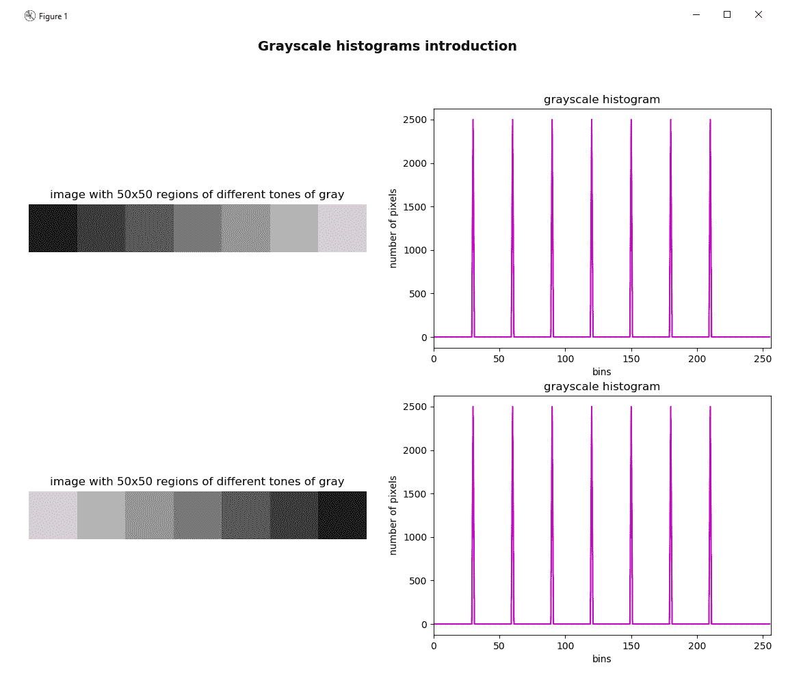
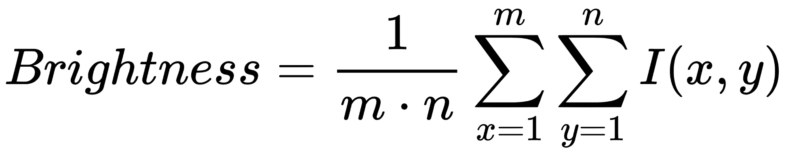
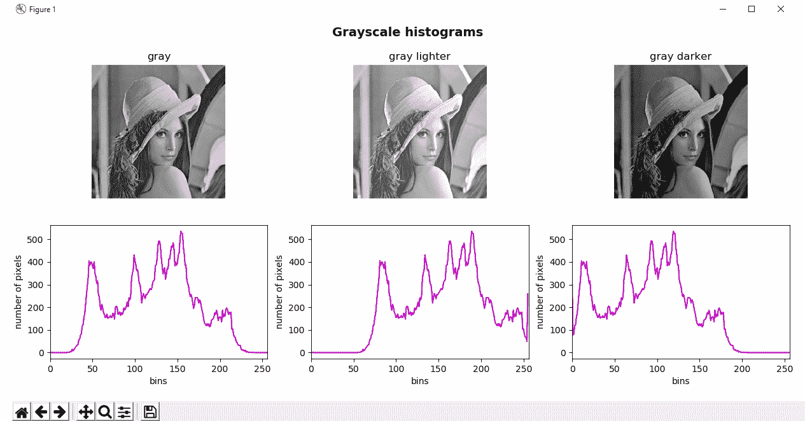
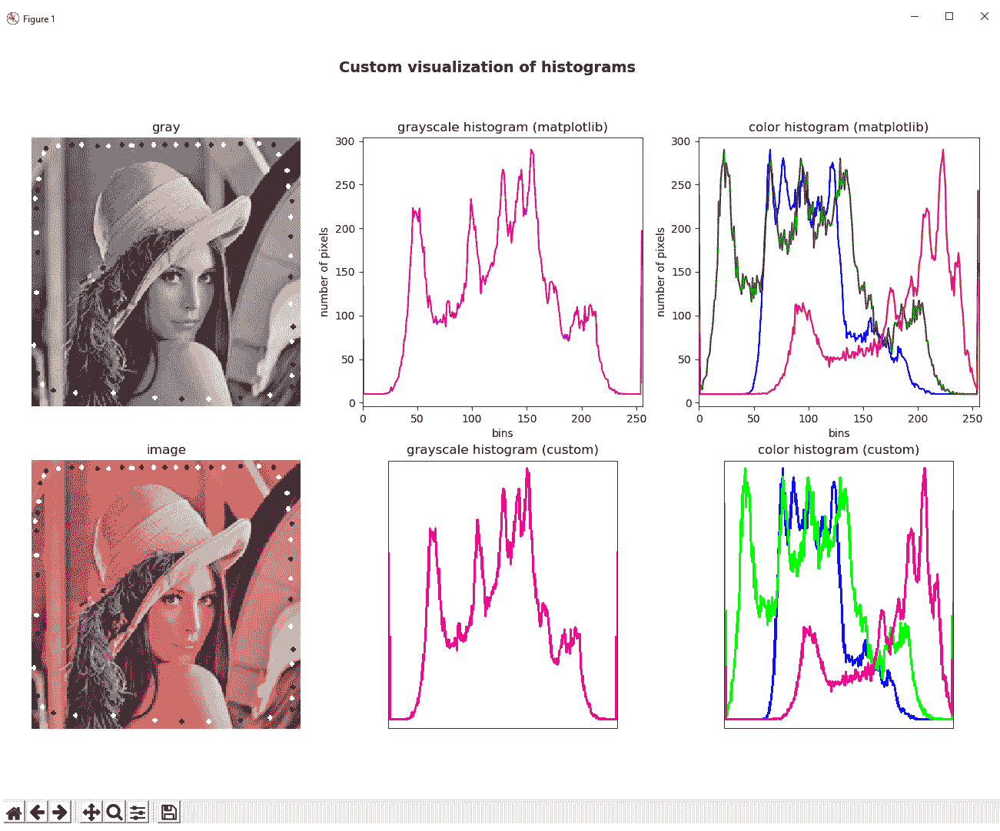
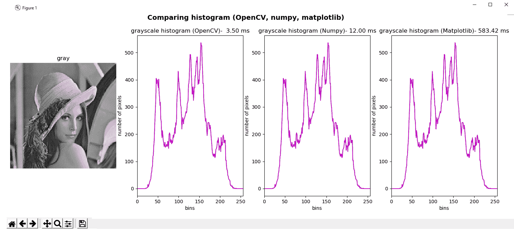
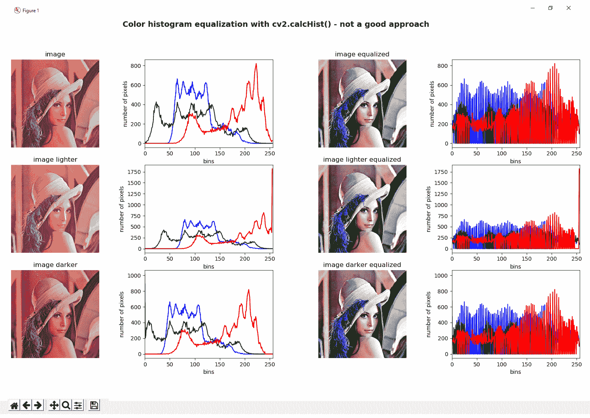

# 构造和建立直方图

**直方图**是一种强大的技术，可用于更好地理解图像内容。 例如，许多摄像机实时显示正在捕获的场景的直方图，以便调整摄像机采集的某些参数（例如，曝光时间，亮度或对比度），目的是捕获合适的图像并帮助检测图像获取问题。

在本章中，您将看到如何创建和理解直方图。

本章将讨论有关直方图的主要概念，并将涵盖以下主题：

*   直方图的理论介绍
*   灰度直方图
*   颜色直方图
*   直方图的自定义可视化
*   比较 OpenCV，NumPy 和 Matplotlib 直方图
*   直方图均衡
*   自适应直方图均衡
*   比较 CLAHE 和直方图均衡
*   直方图比较

# 技术要求

技术要求如下：

*   Python 和 OpenCV
*   特定于 Python 的 IDE
*   NumPy 和 Matplotlib 包
*   Git 客户端

有关如何安装这些要求的更多详细信息，请参见第 1 章，“设置 OpenCV”。 可以通过以下 URL 访问《精通 Python OpenCV 4》的 GitHub 存储库，其中包含从本书第一章到最后一章的所有必要的支持项目文件。 

# 直方图的理论介绍

图像直方图是一种直方图，可反映图像的色调分布，并绘制每个色调值的像素数。 每个色调值的像素数也称为**频率**。 因此，强度值在`[0, K-1]`范围内的灰度图像的直方图将准确包含`K`条目。 例如，在 8 位灰度图像的情况下，`K = 256`（`2^8 = 256`），因此，强度值在`[0, 255]`的范围内。 直方图的每个条目定义如下：


例如， `h(80)`为强度为 80 的像素数。

在下一个屏幕截图中，您可以看到图像（左）具有`7`不同的灰度级。 灰度等级为：`30`，`60`，`90`，`120`，`150`，`180`和`210`。 直方图（右）显示每个色调值出现在图像中的次数（频率）。 在这种情况下，由于每个区域的大小为`50 x 50`像素（2,500 像素），因此上述灰度值的频率将为 2,500，否则为`0`：



请注意，直方图仅显示统计信息，而不显示像素的位置。 这就是两个图像的直方图完全相同的原因。

`histogram_introduction.py`脚本如前所示绘制图形。 在此脚本中，`build_sample_image()`函数使用 NumPy 操作构建第一张图像（上），`build_sample_image_2()`函数构建第二张图像（下）。 接下来提供`build_sample_image()`的代码：

```py
def build_sample_image():
    """Builds a sample image with 50x50 regions of different tones of gray"""

    # Define the different tones. In this case: 60, 90, 120, ..., 210
    # The end of interval (240) is not included
    tones = np.arange(start=60, stop=240, step=30)

    # Initialize result withe the first 50x50 region with 30-intensity level
    result = np.ones((50, 50, 3), dtype="uint8") * 30

    # Build the image concatenating horizontally the regions:
    for tone in tones:
        img = np.ones((50, 50, 3), dtype="uint8") * tone
        result = np.concatenate((result, img), axis=1)

    return result

```

在这里，请注意`build_sample_image2()`的代码：

```py
def build_sample_image_2():
    """Builds a sample image with 50x50 regions of different tones of gray
    flipping the output of build_sample_image()
    """

    # Flip the image in the left/right direction:
    img = np.fliplr(build_sample_image())
    return img
```

下面简要描述了用于构建这些图像（`np.ones()`，`np.arange()`，`np.concatenate()`和`np.fliplr()`）的 NumPy 操作：

*   `np.ones()`：返回给定形状和类型的数组，并填充`1`的值。 在这种情况下，形状为`(50, 50, 3)`和`dtype="uint8"`。
*   `np.arange()`：考虑到提供的步骤，返回给定间隔内的均匀间隔的值。 不包括间隔的结尾（在这种情况下为`240`）。
*   `np.concatenate()`：沿着现有轴连接一系列数组； 在这种情况下，`axis=1`可以水平连接图像。
*   `np.fliplr()`：沿左右方向翻转阵列。

下一节将介绍计算和显示直方图的功能。

# 直方图术语

在深入了解直方图以及如何通过使用与直方图相关的 OpenCV（以及 NumPy 和 Matplotlib）功能构建和可视化直方图之前，我们需要了解一些与直方图有关的术语：

*   `bins`：上一个屏幕截图中的直方图显示了每个色调值的像素数（频率），范围从`0`到`255`。 这些`256`值的每个在直方图术语中称为**箱子**。 可以根据需要选择`bins`的数量。 常用值为`8`，`16`，`32`，`64`，`128`和`256`。 OpenCV 使用`histSize`来引用`bins`。
*   `range`：这是我们要测量的强度值的范围。 通常，它是`[0,255]`，对应于所有色调值（`0`对应于黑色，`255`对应于白色）。

# 灰度直方图

OpenCV 提供`cv2.calcHist()`函数以便计算一个或多个数组的直方图。 因此，该功能可以应用于单通道图像（例如灰度图像）和多通道图像（例如 BGR 图像）。

在本节中，我们将看到如何计算灰度图像的直方图。 该函数的签名如下：

```py
cv2.calcHist(images, channels, mask, histSize, ranges[, hist[, accumulate]])
```

为此，适用以下条件：

*   `images`：它表示作为列表提供的`uint8`或`float32`类型的源图像（例如`[gray_img]`）。
*   `channels`：它代表我们计算其列表的直方图的通道索引（例如，对于灰度图像，`[0]`；对于多通道图像，`[0]`，`[1]`，`[2]` 分别计算第一，第二或第三通道的直方图）。
*   `mask`：它代表一个遮罩图像，用于计算由遮罩定义的图像特定区域的直方图。 如果此参数等于`None`，则将在没有遮罩的情况下计算直方图，并且将使用完整图像。
*   `histSize`：表示作为列表提供的`bins`的数量（例如`[256]`）。
*   `ranges`：它表示我们要测量的强度值的范围（例如`[0,256]`）。

# 没有遮罩的灰度直方图

因此，用于计算完整灰度图像（不带遮罩）的直方图的代码如下：

```py
image = cv2.imread('lenna.png')
gray_image = cv2.cvtColor(image, cv2.COLOR_BGR2GRAY)
hist = cv2.calcHist([gray_image], [0], None, [256], [0, 256])
```

在这种情况下，`hist`是一个`(256, 1)`阵列。 阵列的每个值（仓）对应于具有相应色调值的像素数（频率）。

要使用 Matplotlib 绘制直方图，可以使用`plt.plot()`，提供直方图和颜色以显示直方图（例如`color='m'`）。 支持以下颜色缩写-`'b'`-蓝色，`'g'`-绿色，`‘r’`-红色，`'c'`-青色，`'m'`-品红色，`'y'`-黄色，`'k'`-黑色和 `'w'`-白色。 该示例的完整代码可以在`grayscale_histogram.py`脚本中看到。

我们在引言中评论了直方图可用于揭示或检测图像采集问题。 以下示例将向您展示如何检测图像亮度问题。 灰度图像的亮度可以定义为以下公式给出的图像所有像素的平均强度：



在此，`I(x, y)`是图像特定像素的色调值。

因此，如果图像的平均色调较高（例如`220`），则意味着图像的大多数像素将非常接近白色。 相反，如果图像上的平均色调较低（例如`30`），则意味着图像的大多数像素将非常接近黑色。

在上述脚本`grayscale_histogram.py`中，我们将看到如何更改图像的亮度以及直方图如何更改。

在此脚本中（为了介绍如何计算灰度图像的直方图并进行显示）已经引入了该脚本，我们还对加载灰度图像进行了一些基本数学运算。 具体来说，我们已经执行了图像加法和减法运算，以便向图像的每个像素的灰度级强度中添加特定的量或从中减去特定的量。 这可以通过`cv2.add()`和`cv2.subtract()`功能执行。

在第 5 章，“图像处理技术”中，我们介绍了如何对图像执行算术运算。 因此，如果您对此有任何疑问，可以阅读上一章。

这样，可以改变图像的平均亮度水平。 可以在下一个屏幕截图中看到，与脚本的输出相对应：



在此特定情况下，我们在原始图像的每个像素中添加/减去了`35`，然后计算了所得图像的直方图：

```py
# Add 35 to every pixel on the grayscale image (the result will look lighter) and calculate histogram
M = np.ones(gray_image.shape, dtype="uint8") * 35
added_image = cv2.add(gray_image, M)
hist_added_image = cv2.calcHist([added_image], [0], None, [256], [0, 256])

# Subtract 35 from every pixel (the result will look darker) and calculate histogram
subtracted_image = cv2.subtract(gray_image, M)
hist_subtracted_image = cv2.calcHist([subtracted_image], [0], None, [256], [0, 256])
```

如您所见，中央灰度图像对应于将`35`添加到原始图像的每个像素的图像，从而使图像更亮。 在此图像中，在没有强度在`[0-35]`范围内的像素的意义上，直方图似乎向右移动。 相反，右侧的灰度图像与从原始图像的每个像素中减去`35`的图像相对应，从而产生较暗的图像。 在没有强度在`[220-255]`范围内的像素的意义上，直方图似乎向左移动。

# 带遮罩的灰度直方图

要了解如何应用遮罩，请参见`grayscale_histogram_mask.py`脚本，其中会创建一个遮罩，并使用先前创建的遮罩来计算直方图。 为了创建遮罩，以下行是必需的：

```py
mask = np.zeros(gray_image.shape[:2], np.uint8)
mask[30:190, 30:190] = 255
```

因此，遮罩由尺寸与加载的图像相同的黑色图像组成，而白色的图像对应于我们要计算直方图的区域。

然后，通过创建的掩码调用`cv2.calcHist()`函数：

```py
hist_mask = cv2.calcHist([gray_image], [0], mask, [256], [0, 256])
```

在以下屏幕截图中可以看到此脚本的输出：


如您所见，我们已经修改了图像，以分别添加一些具有`0`和`255`灰度强度的黑色和白色小圆圈（换句话说，黑色和白色圆圈）。 这可以在第一个直方图中看到，它在`bins` = `0`和`255`中有两个选择。 但是，这些选择不会出现在遮罩图像的最终直方图中，因为在计算直方图时并未考虑它们，因为已应用了遮罩。

# 颜色直方图

在本节中，我们将看到如何计算颜色直方图。 执行此功能的脚本为`color_histogram.py`。 在多通道图像（例如，BGR 图像）的情况下，计算颜色直方图的过程包括计算每个通道中的直方图。 在这种情况下，我们创建了一个从三通道图像计算直方图的函数：

```py
def hist_color_img(img):
    """Calculates the histogram from a three-channel image"""

    histr = []
    histr.append(cv2.calcHist([img], [0], None, [256], [0, 256]))
    histr.append(cv2.calcHist([img], [1], None, [256], [0, 256]))
    histr.append(cv2.calcHist([img], [2], None, [256], [0, 256]))
    return histr
```

应当注意，我们可能已经创建了`for`循环或类似的方法，以便三次调用`cv2.calcHist()`函数。 但是，为简单起见，我们执行了三个呼叫，分别明确指示了不同的通道。 在这种情况下，当我们加载 BGR 图片时，调用如下：

*   **计算蓝色通道**的直方图：`cv2.calcHist([img], [0], None, [256], [0, 256])`
*   **计算绿色通道**的直方图：`cv2.calcHist([img], [1], None, [256], [0, 256])`
*   **计算红色通道**的直方图：`cv2.calcHist([img], [1], None, [256], [0, 256])`

因此，为了计算图像的颜色直方图，请注意以下几点：

```py
image = cv2.imread('lenna.png')
hist_color = hist_color_img(image)
```

在此脚本中，我们还使用了`cv2.add()`和`cv2.subtract()`来修改加载的 BGR 图像的亮度，并观察直方图的变化。 在这种情况下，`15`已添加/减去到原始 BGR 图像的每个像素。 在与`color_histogram.py`脚本输出相对应的下一个屏幕截图中可以看到：


# 直方图的自定义可视化

为了可视化直方图，我们使用了`plt.plot()`函数。 如果我们只想使用 OpenCV 功能来可视化直方图，则没有 OpenCV 函数可以绘制直方图。 在这种情况下，我们必须利用 OpenCV 原语（例如`cv2.polylines()`和`cv2.rectangle()`等）来创建一些（基本）绘制直方图的功能。 在`histogram_custom_visualization.py`脚本中，我们创建了`plot_hist()`函数，该函数执行此功能。 此功能创建 BGR 彩色图像，并在其中绘制直方图。 该函数的代码如下：

```py
def plot_hist(hist_items, color):
    """Plots the histogram of a image"""

    # For visualization purposes we add some offset:
    offset_down = 10
    offset_up = 10

    # This will be used for creating the points to visualize (x-coordinates):
    x_values = np.arange(256).reshape(256, 1)

    canvas = np.ones((300, 256, 3), dtype="uint8") * 255
    for hist_item, col in zip(hist_items, color):
        # Normalize in the range for proper visualization:
        cv2.normalize(hist_item, hist_item, 0 + offset_down, 300 - offset_up, cv2.NORM_MINMAX)
        # Round the normalized values of the histogram:
        around = np.around(hist_item)
        # Cast the values to int:
        hist = np.int32(around)
        # Create the points using the histogram and the x-coordinates:
        pts = np.column_stack((x_values, hist))
        # Draw the points:
        cv2.polylines(canvas, [pts], False, col, 2)
        # Draw a rectangle:
        cv2.rectangle(canvas, (0, 0), (255, 298), (0, 0, 0), 1)

    # Flip the image in the up/down direction:
    res = np.flipud(canvas)

    return res
```

此函数接收直方图，并为直方图的每个元素建立`(x, y)`点，`pts`点，其中``y``值表示`x`元素的频率。 直方图的这些点`pts`是使用`cv2.polylines()`函数绘制的，我们已经在第 4 章，“在 OpenCV 中构造基本形状”。 此函数基于`pts`阵列绘制多边形曲线。 最后，由于`y`值上下颠倒，因此图像垂直翻转。 在下一个屏幕截图中，我们可以使用`plt.plot()`和我们的自定义功能比较可视化效果：



# 比较 OpenCV，NumPy 和 Matplotlib 直方图

我们已经看到 OpenCV 提供了`cv2.calcHist()`函数来计算直方图。 此外，NumPy 和 Matplotlib 为创建直方图提供了类似的功能。 在`comparing_opencv_numpy_mpl_hist.py`脚本中，我们出于性能目的比较这些功能。 从这个意义上讲，我们将看到如何使用 OpenCV，NumPy 和 Matplotlib 创建直方图，然后测量每个图形的执行时间并将结果绘制在图中。

为了测量执行时间，我们使用`timeit.default_timer`，因为它会自动在您的平台和 Python 版本上提供最佳时钟。 这样，我们将其导入脚本的开头：

```py
from timeit import default_timer as timer
```

这里总结了我们使用计时器的方式：

```py
start = timer()
# ...
end = timer()
execution_time = start - end
```

应当考虑到`default_timer()`测量可能会受到同一台计算机上同时运行的其他程序的影响。 因此，执行准确计时的最佳方法是重复几次并花费最佳时间。

为了计算直方图，我们将使用以下功能：

*   `cv2.calcHist()`由 OpenCV 提供
*   `np.histogram()`由 NumPy 提供
*   Matplotlib 提供的`plt.hist()`

因此，用于计算上述每个功能执行的代码如下：

```py
start = timer()
# Calculate the histogram calling cv2.calcHist()
hist = cv2.calcHist([gray_image], [0], None, [256], [0, 256])
end = timer()
exec_time_calc_hist = (end - start) * 1000

start = timer()
# Calculate the histogram calling np.histogram():
hist_np, bins_np = np.histogram(gray_image.ravel(), 256, [0, 256])
end = timer()
exec_time_np_hist = (end - start) * 1000

start = timer()
# Calculate the histogram calling plt.hist():
(n, bins, patches) = plt.hist(gray_image.ravel(), 256, [0, 256])
end = timer()
exec_time_plt_hist = (end - start) * 1000
```

我们将值乘以得到毫秒（而不是秒）。 在以下屏幕截图中可以看到`comparing_opencv_numpy_mpl_hist.py`脚本的输出：



可以看出，`cv2.calcHist()`比`np.histogram()`和`plt.hist()`都快。 因此，出于性能目的，您可以使用 OpenCV 函数。

# 直方图均衡

在本节中，我们将看到如何使用 OpenCV 函数`cv2.equalizeHist()`执行直方图均衡，以及如何将其应用于灰度图像和彩色图像。 `cv2.equalizeHist()`功能可标准化亮度，并增加图像的对比度。 因此，在应用此功能后会修改图像的直方图。 在接下来的小节中，我们将探索原始直方图和修改后的直方图，以查看其变化方式。

# 灰度直方图均衡

使用`cv2.equalizeHist()`功能以均衡给定灰度图像的对比度非常容易：

```py
image = cv2.imread('lenna.png')
gray_image = cv2.cvtColor(image, cv2.COLOR_BGR2GRAY)
gray_image_eq = cv2.equalizeHist(gray_image)
```

在`grayscale_histogram_equalization.py`脚本中，我们将直方图均衡化应用于三个图像。 第一个是原始灰度图像。 第二个是原始图像，但是在我们已经向图像的每个像素添加`35`的意义上进行了修改。 第三个是原始图像，但是在我们已经从图像的每个像素中减去`35`的意义上进行了修改。 我们还计算了直方图均衡之前和之后的直方图。 最后，绘制所有这些图像。 在以下屏幕截图中可以看到此脚本的输出：


在上一个屏幕截图中，我们可以看到三个均衡图像确实非常相似，并且这一事实也可以反映在均衡直方图中，其中所有三个图像也非常相似。 这是因为直方图均衡化趋向于标准化图像的亮度（并增加对比度）。

# 颜色直方图均衡

按照相同的方法，我们可以在彩色图像中执行直方图均衡化。 我们必须说这不是彩色图像中直方图均衡的最佳方法，我们将看到如何正确执行它。 因此，此第一个（以及不正确的）版本将直方图均衡化应用于 BGR 图像的每个通道。 在以下代码中可以看到这种方法：

```py
def equalize_hist_color(img):
    """Equalize the image splitting the image applying cv2.equalizeHist() to each channel and merging the results"""

    channels = cv2.split(img)
    eq_channels = []
    for ch in channels:
    eq_channels.append(cv2.equalizeHist(ch))

    eq_image = cv2.merge(eq_channels)
    return eq_image
```

我们创建了`equalize_hist_color()`函数，该函数通过使用`cv2.split()`分割 BGR 图像并将`cv2.equalizeHist()`函数应用于每个通道。 最后，我们使用`cv2.merge()`合并所有结果通道。 我们已将此功能应用于三个不同的图像。 第一个是原始的 BGR 图片。 第二个是原始图像，但在某种意义上进行了修改，即我们已经向图像的每个像素添加了`15`。 第三个是原始图像，但在某种意义上进行了修改，即我们已经从图像的每个像素中减去了`15`。 我们还计算了直方图均衡之前和之后的直方图。

最后，绘制所有这些图像。 在以下屏幕截图中可以看到`color_histogram_equalization.py`脚本的输出：



我们评论说，均衡三个通道不是一个好方法，因为色调会发生巨大变化。 这是由于 BGR 颜色空间的累加特性。 由于我们分别更改三个通道的亮度和对比度，因此在合并均衡的通道时，这可能导致图像中出现新的阴影。 在上一个屏幕截图中可以看到此问题。

更好的方法是将 BGR 图像转换为包含亮度/强度通道（Yuv，Lab，HSV 和 HSL）的色彩空间。 然后，我们仅在亮度通道上应用直方图均衡化，最后执行逆变换，也就是说，我们合并通道并将它们转换回 BGR 颜色空间。

在`color_histogram_equalization_hsv.py`脚本中可以看到这种方法，其中`equalize_hist_color_hsv()`函数将执行以下功能：

```py
def equalize_hist_color_hsv(img):
    """Equalize the image splitting the image after HSV conversion and applying cv2.equalizeHist()
    to the V channel, merging the channels and convert back to the BGR color space
    """

    H, S, V = cv2.split(cv2.cvtColor(img, cv2.COLOR_BGR2HSV))
    eq_V = cv2.equalizeHist(V)
    eq_image = cv2.cvtColor(cv2.merge([H, S, eq_V]), cv2.COLOR_HSV2BGR)
    return eq_image
```

在以下屏幕截图中可以看到输出：


可以看出，仅对 HSV 图像的 V 通道进行均衡后获得的结果要比对 BGR 图像的所有通道进行均衡好得多。 正如我们所评论的，这种方法对于包含亮度/强度通道（Yuv，Lab，HSV 和 HSL）的色彩空间也是有效的。 这将在下一部分中看到。

# 对比度受限的自适应直方图均衡

在本节中，我们将了解如何应用**对比度受限的自适应直方图均衡**（**CLAHE**）来均衡图像，这是**自适应直方图均衡**的一种形式 （**AHE**），其中对比度放大受到限制。 图像的相对均匀区域中的噪声被 AHE 过度放大，而 CLAHE 通过限制对比度放大来解决此问题。 该算法可用于改善图像的对比度。 该算法通过创建原始图像的多个直方图来工作，并使用所有这些直方图重新分配图像的亮度。

在`clahe_histogram_equalization.py`脚本中，我们将 CLAHE 应用于灰度和彩色图像。 应用 CLAHE 时，有两个参数需要调整。 第一个是`clipLimit`，它设置对比度限制的阈值。 默认值为`40`。 第二个是`tileGridSize`，它设置行和列中*瓦片*的数量。 当应用 CLAHE 时，图像被分成称为**瓦片**的小块（默认为`8 x 8`）以执行其计算。

要将 CLAHE 应用于灰度图像，我们必须执行以下操作：

```py
clahe = cv2.createCLAHE(clipLimit=2.0)
gray_image_clahe = clahe.apply(gray_image)
```

此外，我们还可以将 CLAHE 应用于彩色图像，这与上一节中介绍的彩色图像对比度均衡方法非常相似，其中仅均衡 HSV 图像的亮度通道后的结果要比均衡所有通道的结果好得多。 BGR 图片。

在本节中，我们将创建四个函数，以通过仅在不同颜色空间的亮度通道上使用 CLAHE 来均衡彩色图像：

```py
def equalize_clahe_color_hsv(img):
    """Equalize the image splitting after conversion to HSV and applying CLAHE
    to the V channel and merging the channels and convert back to BGR
    """

    cla = cv2.createCLAHE(clipLimit=4.0)
    H, S, V = cv2.split(cv2.cvtColor(img, cv2.COLOR_BGR2HSV))
    eq_V = cla.apply(V)
    eq_image = cv2.cvtColor(cv2.merge([H, S, eq_V]), cv2.COLOR_HSV2BGR)
    return eq_image

def equalize_clahe_color_lab(img):
    """Equalize the image splitting after conversion to LAB and applying CLAHE
    to the L channel and merging the channels and convert back to BGR
    """

    cla = cv2.createCLAHE(clipLimit=4.0)
    L, a, b = cv2.split(cv2.cvtColor(img, cv2.COLOR_BGR2Lab))
    eq_L = cla.apply(L)
    eq_image = cv2.cvtColor(cv2.merge([eq_L, a, b]), cv2.COLOR_Lab2BGR)
    return eq_image

def equalize_clahe_color_yuv(img):
    """Equalize the image splitting after conversion to YUV and applying CLAHE
    to the Y channel and merging the channels and convert back to BGR
    """

    cla = cv2.createCLAHE(clipLimit=4.0)
    Y, U, V = cv2.split(cv2.cvtColor(img, cv2.COLOR_BGR2YUV))
    eq_Y = cla.apply(Y)
    eq_image = cv2.cvtColor(cv2.merge([eq_Y, U, V]), cv2.COLOR_YUV2BGR)
    return eq_image

def equalize_clahe_color(img):
    """Equalize the image splitting the image applying CLAHE to each channel and merging the results"""

    cla = cv2.createCLAHE(clipLimit=4.0)
    channels = cv2.split(img)
    eq_channels = []
    for ch in channels:
        eq_channels.append(cla.apply(ch))

    eq_image = cv2.merge(eq_channels)
    return eq_image
```

下一个屏幕截图中可以看到此脚本的输出，在将所有这些功能应用于测试图像后，我们在其中比较了结果：


在上一个屏幕截图中，我们可以通过更改`clipLimit`参数在测试图像上应用 CLAHE 后看到结果。 此外，在不同颜色空间（LAB，HSV 和 YUV）的亮度通道上应用 CLAHE 之后，我们可以看到不同的结果。 最后，我们会看到在 BGR 图像的三个通道上应用 CLAHE 的错误方法。

# 比较 CLAHE 和直方图均衡

为了完整起见，在`comparing_hist_equalization_clahe.py`脚本中，您可以看到 CLAHE 和直方图均衡化（`cv2.equalizeHist()`）如何在同一图像上工作，同时可视化结果图像和结果直方图。

在以下屏幕截图中可以看到：


可以肯定地说，与在许多情况下应用直方图均衡化相比，CLAHE 提供了更好的结果和性能。 从这个意义上讲，CLAHE 通常在许多计算机视觉应用程序（例如，面部处理等）中用作第一步。

# 直方图比较

OpenCV 提供的与直方图相关的一种有趣功能是`cv2.compareHist()`函数，该函数可用于获取一个数值参数，该数值参数表示两个直方图相互匹配的程度。 从这个意义上讲，由于直方图反映了图像中像素值的强度分布，因此该功能可用于比较图像。 如前所述，直方图仅显示统计信息，而不显示像素的位置。 因此，图像比较的常用方法是将图像划分为一定数量的区域（通常具有相同的大小），计算每个区域的直方图，最后将所有直方图连接起来以创建图像的特征表示 。 在此示例中，为简单起见，我们不会将图像划分为一定数量的区域，因此将仅使用一个区域（完整图像）。

`cv2.compareHist()`功能的签名如下：

```py
cv2.compareHist(H1, H2, method)
```

这里，`H1`和`H2`是要比较的直方图，`method`建立了比较方法。

OpenCV 提供了四种不同的度量标准（方法）来计算匹配项：

*   `cv2.HISTCMP_CORREL`：此度量标准计算两个直方图之间的相关性。 此指标返回`[-1, 1]`范围内的值，其中`1`表示完美匹配，而`-1`完全不匹配。
*   `cv2.HISTCMP_CHISQR`：此度量标准计算两个直方图之间的卡方距离。 此指标返回`[0, unbounded]`范围内的值，其中`0`表示完美匹配，而不匹配则不受限制。
*   `cv2.HISTCMP_INTERSECT`：此度量标准计算两个直方图之间的交集。 如果直方图已归一化，则此度量标准将返回`[0,1]`范围内的值，其中`1`表示完美匹配，而`0`则完全不匹配。
*   `cv2.HISTCMP_BHATTACHARYYA`：此度量标准计算两个直方图之间的 Bhattacharyya 距离。 此指标返回`[0,1]`范围内的值，其中`0`是完美匹配，而`1`完全不匹配。

在`compare_histograms.py`脚本中，我们首先加载四个图像，然后使用先前注释的所有度量标准来计算所有这些图像与测试图像之间的相似度。

我们使用的四个图像如下：

*   `gray_image.png`：此图像对应于灰度图像。
*   `gray_added_image.png`：此图像对应于原始图像，但在某种意义上进行了修改，即我们已经向图像的每个像素添加了`35`。
*   `gray_subtracted_image.png`：此图像对应于原始图像，但在某种意义上进行了修改，因为我们已经对图像的每个像素减去了`35`。
*   `gray_blurred.png`：此图像对应于原始图像，但已使用模糊过滤器（`cv2.blur(gray_image, (10, 10)`）进行了修改。

测试（或查询）图像也是`gray_image.png`。 在下一个屏幕截图中可以看到该示例的输出：


如您所见，由于`img 1`是同一张图片，因此可提供最佳结果（在所有度量标准中均完美匹配）。 此外，`img 2`还提供了非常好的性能指标。 这是有道理的，因为`img 2`是查询图像的平滑版本。 最后，`img 3`和`img 4`的性能指标不佳，因为直方图已移动。

# 总结

在本章中，已经回顾了与直方图有关的所有主要概念。 从这个意义上讲，我们已经了解了直方图的含义以及如何使用 OpenCV，NumPy 和 Matplotlib 函数计算直方图。 此外，我们已经看到了灰度直方图和颜色直方图之间的差异，展示了如何计算和显示这两种类型。 直方图均衡也是处理直方图时的重要因素，我们已经了解了如何对灰度图像和彩色图像执行直方图均衡。 最后，直方图比较对于执行图像比较也可能非常有帮助。 我们已经看到 OpenCV 提供的四个度量来度量两个直方图之间的相似性。

与下一章相关，将介绍与计算机视觉应用程序中作为图像分割的关键部分所需内容相关的主要阈值处理技术（简单阈值处理，自适应阈值处理和大津的阈值处理等）。

# 问题

1.  什么是图像直方图？
2.  使用`64`箱计算灰度图像的直方图。
3.  将`50`添加到灰度图像上的每个像素（结果看起来更亮）并计算直方图。
4.  计算没有遮罩的 BGR 图像的红色通道直方图。
5.  OpenCV，NumPy 和 Matplotlib 提供哪些函数来计算直方图？
6.  修改`grayscale_histogram.py`脚本以计算这三个图像（`gray_image`，`added_image`和`subtracted_image`）的亮度。 将脚本重命名为`grayscale_histogram_brightness.py`。
7.  修改`comparing_hist_equalization_clahe.py`脚本以显示`cv2.equalizeHist()`和 CLAHE 的执行时间。 将其重命名为`comparing_hist_equalization_clahe_time.py`。

# 进一步阅读

此处列出的参考将帮助您更深入地研究 OpenCV 中的图像处理技术：

*   [《通过 OpenCV 学习图像处理》，作者：Gloria BuenoGarcía 等](https://www.packtpub.com/application-development/learning-image-processing-opencv)