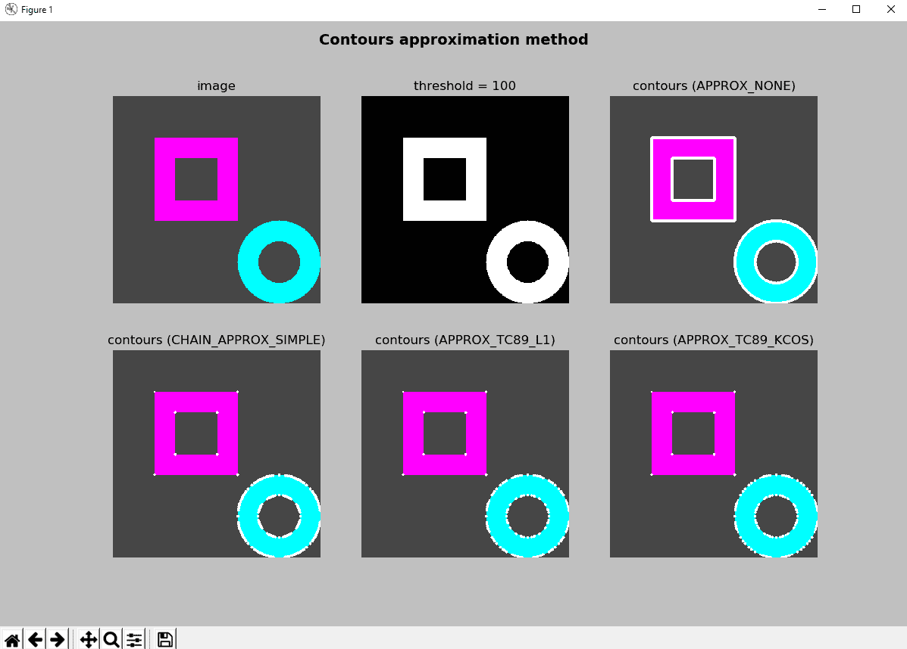
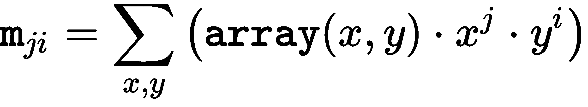
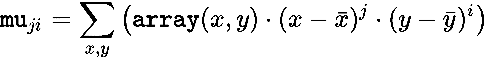
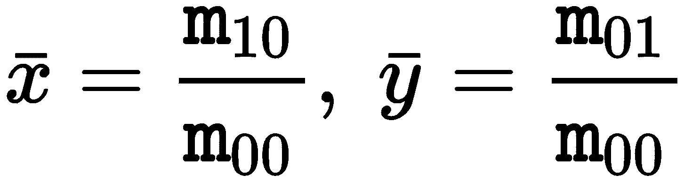
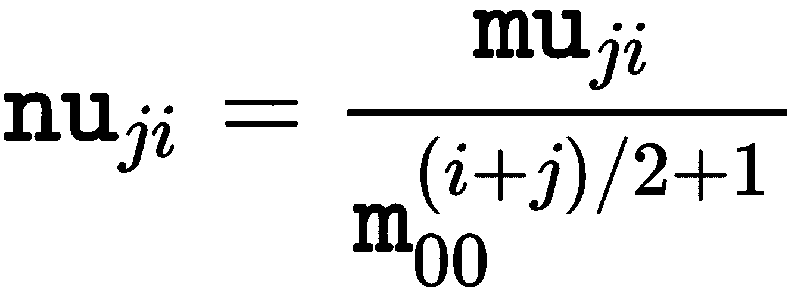
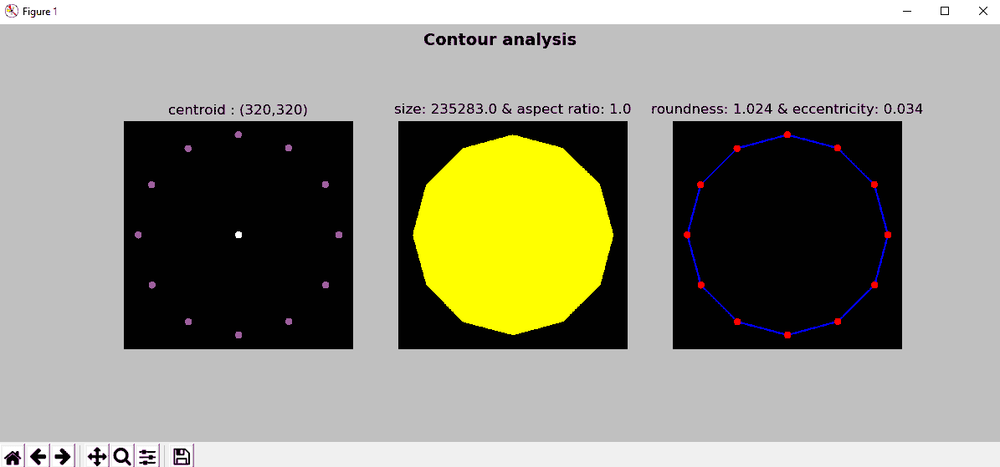
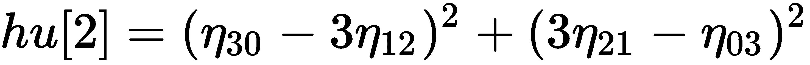
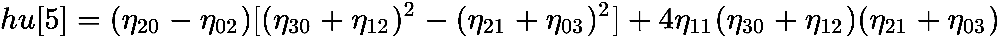
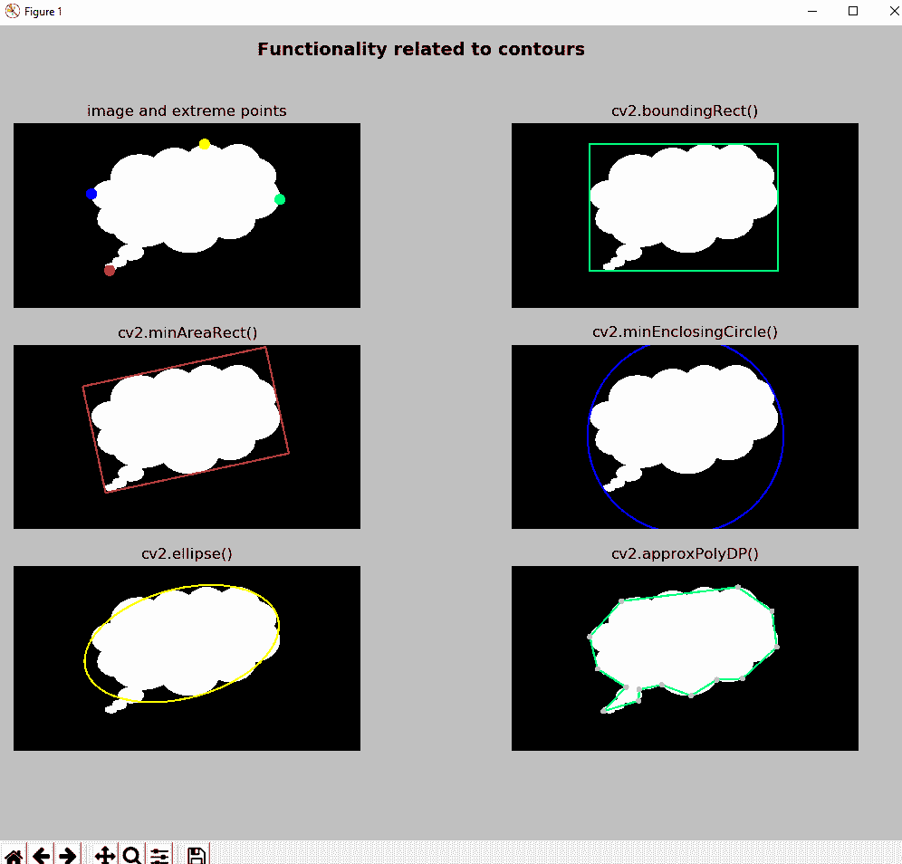
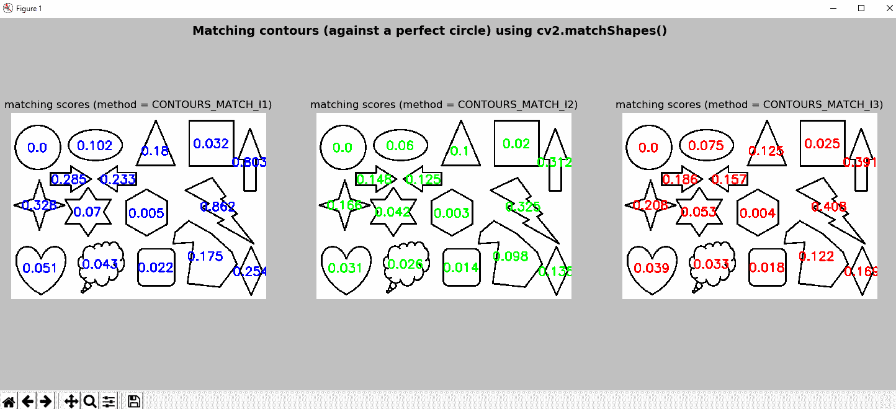

# 轮廓检测，过滤和绘图

轮廓可以定义为定义图像中对象边界的点序列。 因此，轮廓线传达有关对象边界的关键信息，并对有关对象形状的主要信息进行编码。 该信息用作图像描述符（例如 SIFT，傅立叶描述符或形状上下文等）的基础，并且可用于形状分析以及对象检测和识别。

在本章中，您将看到如何处理轮廓，轮廓用于形状分析以及对象检测和识别。

在本章中，与轮廓相关的关键点将在以下主题中解决：

*   轮廓介绍
*   压缩轮廓
*   图像的矩
*   与轮廓有关的更多函数
*   过滤轮廓
*   识别轮廓
*   匹配轮廓

# 技术要求

技术要求如下：

*   Python 和 OpenCV
*   特定于 Python 的 IDE
*   NumPy 和 Matplotlib 包
*   Git 客户端

有关如何安装这些要求的更多详细信息，请参见第 1 章，“设置 OpenCV”。 “精通 Python OpenCV 4”的 GitHub 存储库，其中包含所有支持的项目文件，这是从第一章到最后一章学习本书所必需的，[可以在下一个 URL 中访问](https://github.com/PacktPublishing/Mastering-OpenCV-4-with-Python/)。

# 轮廓介绍

**轮廓**可以看作是一条曲线，它沿着特定形状的边界连接所有点。 当它们定义形状的边界时，对这些点的分析可以揭示用于形状分析以及对象检测和识别的关键信息。 OpenCV 提供了许多功能来正确检测和处理轮廓。 但是，在深入探讨这些功能之前，我们将了解样本轮廓的结构。 例如，以下函数模拟检测假设图像中的轮廓：

```py
def get_one_contour():
 """Returns a 'fixed' contour"""

 cnts = [np.array(
 [[[600, 320]], [[563, 460]], [[460, 562]], [[320, 600]], [[180, 563]], [[78, 460]], [[40, 320]], [[77, 180]], [[179, 78]], [[319, 40]], [[459, 77]], [[562, 179]]], dtype=np.int32)]
 return cnts
```

如您所见，轮廓是由`np.int32`类型的许多点组成的数组（整数在`[-2147483648, 2147483647]`范围内）。 现在，我们可以调用此函数来获取轮廓数组。 在这种情况下，此数组只有一个`detected`轮廓：

```py
contours = get_one_contour()
print("'detected' contours: '{}' ".format(len(contours)))
print("contour shape: '{}'".format(contours[0].shape))
```

此时，我们可以应用 OpenCV 提供的所有功能来播放轮廓。 请注意，定义`get_one_contour()`功能很有趣，因为它为您提供了一种简单的方法来准备使用轮廓，以便调试和测试与轮廓相关的其他功能。 在许多情况下，实际图像中检测到的轮廓具有数百个点，因此很难调试代码。 因此，请随时使用此功能。

为了完成对轮廓的介绍，OpenCV 提供了`cv2.drawContours()`，它可以在图像中绘制轮廓轮廓。 因此，我们可以调用该函数来查看轮廓。 此外，我们还对`draw_contour_points()`函数进行了编码，该函数在图像中绘制轮廓点。 同样，我们已经使用`np.squeeze()`函数来摆脱一维数组，例如使用`[1,2,3]`而不是`[[[1,2,3]]]`。 例如，如果打印上一个函数中定义的轮廓，则将得到以下内容：

```py
[[[600 320]]
[[563 460]]
[[460 562]]
[[320 600]]
[[180 563]]
[[ 78 460]]
[[ 40 320]]
[[ 77 180]]
[[179 78]]
[[319 40]]
[[459 77]]
[[562 179]]]
```

执行以下代码行之后：

```py
squeeze = np.squeeze(cnt)
```

如果打印`squeeze`，将得到以下输出：

```py
[[600 320]
 [563 460]
 [460 562]
 [320 600]
 [180 563]
 [ 78 460]
 [ 40 320]
 [ 77 180]
 [179 78]
 [319 40]
 [459 77]
 [562 179]]
```

此时，我们可以遍历此数组的所有点。

因此，`draw_contour_points()`函数的代码如下：

```py
def draw_contour_points(img, cnts, color):
    """Draw all points from a list of contours"""

    for cnt in cnts:
        squeeze = np.squeeze(cnt)

        for p in squeeze:
            p = array_to_tuple(p)
            cv2.circle(img, p, 10, color, -1)

    return img
```

另一个考虑因素是，在先前的函数中，我们使用了`array_to_tuple()`函数，该函数将数组转换为元组：

```py
def array_to_tuple(arr):
    """Converts array to tuple"""

    return tuple(arr.reshape(1, -1)[0])
```

这样，轮廓的第一个点`[600 320]`转换为`(600, 320)`，可以在`cv2.circle()`内部将其用作中心。 可以在`contours_introduction.py`中看到有关轮廓的先前介绍的完整代码。 下一个屏幕截图中可以看到此脚本的输出：


为了完成对轮廓的介绍，我们还编写了脚本`contours_introduction_2.py`。 在这里，我们已经编码了功能`build_sample_image()`和`build_sample_image_2()`。 这些函数在图像中绘制基本形状，其目的是提供一些可预测（或预定义）的形状。

这两个函数与上一个脚本中定义的`get_one_contour()`函数具有相同的目的，即，它们有助于我们理解与轮廓有关的关键概念。 `build_sample_image()`功能的代码如下：

```py
def build_sample_image():
    """Builds a sample image with basic shapes"""

    # Create a 500x500 gray image (70 intensity) with a rectangle and a circle inside:
    img = np.ones((500, 500, 3), dtype="uint8") * 70
    cv2.rectangle(img, (100, 100), (300, 300), (255, 0, 255), -1)
    cv2.circle(img, (400, 400), 100, (255, 255, 0), -1)

    return img
```

如您所见，此函数绘制两个填充的形状（一个矩形和一个圆形）。 因此，此功能创建具有两个（外部）轮廓的图像。 `build_sample_image_2()`功能的代码如下：

```py
def build_sample_image_2():
    """Builds a sample image with basic shapes"""

    # Create a 500x500 gray image (70 intensity) with a rectangle and a circle inside (with internal contours):
    img = np.ones((500, 500, 3), dtype="uint8") * 70
    cv2.rectangle(img, (100, 100), (300, 300), (255, 0, 255), -1) 
    cv2.rectangle(img, (150, 150), (250, 250), (70, 70, 70), -1)
    cv2.circle(img, (400, 400), 100, (255, 255, 0), -1)
    cv2.circle(img, (400, 400), 50, (70, 70, 70), -1)
```

此函数绘制两个填充的矩形（一个在另一个内部）和两个填充的圆（一个在另一个内部）。 此功能创建具有两个外部轮廓和两个内部轮廓的图像。

在`contours_introduction_2.py`中，在将图像*加载*之后，我们将其转换为灰度并设置了阈值以获得二进制图像。 此二进制图像稍后将用于使用`cv2.findContours()`功能查找轮廓。 如前所述，创建的图像仅具有圆形和正方形。 因此，调用`cv2.findContours()`将找到所有这些创建的轮廓。 `cv2.findContours()`方法的签名如下：

```py
cv2.findContours(image, mode, method[, contours[, hierarchy[, offset]]]) -> image, contours, hierarchy
```

OpenCV 提供`cv2.findContours()`，可用于检测二进制图像（例如，阈值运算后生成的图像）​​中的轮廓。 该函数实现了中通过边界进行数字化二进制图像的拓扑结构分析中定义的算法。 应当注意，在 OpenCV 3.2 之前，源图像将已被修改，并且自 OpenCV 3.2 起，在调用此函数后将不再修改源图像。 源图像被视为二进制图像，其中非零像素被视为 1。 该函数返回检测到的轮廓，每个轮廓包含所有检索到的定义边界的点。

检索到的轮廓可以以不同的模式输出-`cv2.RETR_EXTERNAL`（仅在轮廓外部输出），`cv2.RETR_LIST`（不带任何层次关系输出所有轮廓）和`cv2.RETR_TREE`（通过建立层次关系输出所有轮廓） 。 输出向量`hierarchy`包含有关此层次关系的信息，为每个检测到的轮廓提供一个条目。 对于每个第`i`个轮廓`contours[i]`，`hierarchy[i][j]`和`j`在`[0,3]`范围内的轮廓包含以下内容：

*   `hierarchy[i][0]`：同一层级上的下一个轮廓的索引
*   `hierarchy[i][1]`：在相同层次级别上的先前轮廓的索引
*   `hierarchy[i][2]`：第一个子轮廓的索引
*   `hierarchy[i][3]`：父轮廓的索引

`hierarchy[i][j]`中的负值表示没有下一个轮廓`j=0`，没有上一个轮廓`j=1`，没有子轮廓`j=2`或没有父轮廓`j=3`。 最后，`method`参数设置检索与每个检测到的轮廓有关的点时使用的近似方法。 下一部分将进一步说明此参数。

如果执行`contours_introduction_2.py`脚本，则可以看到以下屏幕：


在此屏幕截图中，通过调用`cv2.findContours()`来计算外部（`cv2.RETR_EXTERNAL`）和外部和内部（`cv2.RETR_LIST`）。

# 压缩轮廓

检测到的轮廓可以压缩以减少点数。 从这个意义上讲，OpenCV 提供了几种减少点数的方法。 可以使用参数`method`进行设置。 另外，可以通过将标志设置为`cv2.CHAIN_APPROX_NONE`（所有边界点都存储在其中）来禁用此压缩； 因此，不执行压缩。

`cv2.CHAIN_APPROX_SIMPLE`方法可用于压缩检测到的轮廓，因为它压缩轮廓的水平，垂直和对角线部分，仅保留端点。 例如，如果我们使用`cv2.CHAIN_APPROX_SIMPLE`压缩矩形的轮廓，则它将仅由四个点组成。

最后，OpenCV 提供了另外两个基于 Teh-Chin 算法的轮廓压缩标志，这是一种非参数方法。 该算法的第一步是根据每个点的局部属性确定其**支持区域**（**ROS**）。

接下来，该算法计算每个点的相对重要性的度量。 最后，通过非极大值抑制过程来检测优势点。 他们使用三种不同的有效度量，分别对应于离散曲率度量的不同精确度：

*   余弦度量
*   K 曲率度量
*   一种曲率度量（`2`的`k = 1`）

因此，结合离散曲率量度，OpenCV 提供了两个标记-`cv2.CHAIN_APPROX_TC89_L1`和`cv2.CHAIN_APPROX_TC89_KCOS`。 有关此算法的更详细说明，请参见出版物《关于检测数字曲线上的优势点》（1989）。 只是为了澄清起见，`_CT89_`对该名称的作者（Teh 和 Chin）的首字母以及出版年份（1989）进行了编码。

在`contours_approximation_method.py`中，用于`method`参数的上述四个标记（`cv2.CHAIN_APPROX_NONE`，`cv2.CHAIN_APPROX_SIMPLE`，`cv2.CHAIN_APPROX_TC89_L1`和`cv2.CHAIN_APPROX_TC89_KCOS`）用于编码图像中的两个检测到的轮廓。 下一个屏幕截图中可以看到此脚本的输出：



可以看出，定义轮廓的点以白色显示，显示了四种方法（`cv2.CHAIN_APPROX_NONE`，`cv2.CHAIN_APPROX_SIMPLE`，`cv2.CHAIN_APPROX_TC89_L1`和`cv2.CHAIN_APPROX_TC89_KCOS`）如何压缩两个提供形状的检测轮廓。

# 图像的矩

在数学中，矩可以看作是函数形状的特定定量度量。 图像矩可以看作是图像像素强度的加权平均值，或者是此类矩的函数，可以对某些有趣的属性进行编码。 从这个意义上讲，图像矩可用于描述检测到的轮廓的某些属性（例如，对象的质心或对象的面积等）。

`cv2.moments()`可用于计算直到向量形状或栅格化形状的三阶的所有矩。

此方法的签名如下：

```py
retval = cv.moments(array[, binaryImage])
```

因此，为了计算检测到的轮廓（例如，第一个检测到的轮廓）的矩，请执行以下操作：

```py
M = cv2.moments(contours[0])
```

如果我们打印`M`，则会得到以下信息：

```py
{'m00': 235283.0, 'm10': 75282991.16666666, 'm01': 75279680.83333333, 'm20': 28496148988.333332, 'm11': 24089788592.25, 'm02': 28492341886.0, 'm30': 11939291123446.25, 'm21': 9118893653727.8, 'm12': 9117775940692.967, 'm03': 11936167227424.852, 'mu20': 4408013598.184406, 'mu11': 2712402.277420044, 'mu02': 4406324849.628765, 'mu30': 595042037.7265625, 'mu21': -292162222.4824219, 'mu12': -592577546.1586914, 'mu03': 294852334.5449219, 'nu20': 0.07962727021646843, 'nu11': 4.8997396280458296e-05, 'nu02': 0.07959676431294238, 'nu30': 2.2160077537124397e-05, 'nu21': -1.0880470778779139e-05, 'nu12': -2.2068296922023203e-05, 'nu03': 1.0980653771087236e-05}
```

如您所见，存在三种不同类型的矩`(m[ji], mu[ji], nu[ji])`。

如下计算空间矩`m[ji]`：



中心矩`mu[ji]`的计算如下：



在此适用以下条件：



前面的等式对应于质心。

根据定义，**中心矩**对于翻译而言是不变的。 因此，中心矩适合描述物体的形式。 然而，空间和中心矩的缺点是它们依赖于物体的大小。 它们不是尺度不变的。

归一化中心矩`nu[ji]`的计算如下：



**归一化的中心矩**从定义上来说是平移和尺度不变的。

接下来的矩值计算如下：

```cpp
mu[00] = m[00], nu[00] = 1, nu[10] = mu[10] = mu[01] = mu[10] = 0
```

因此，这些矩不被存储。

通常根据矩的顺序对矩进行分类，矩的阶数是基于矩`m[ji]`的索引`j, i`的总和（`j + i`）来计算的。 

在接下来的小节中，将提供有关图像矩的更多信息。 更具体地，将基于矩来计算一些物体特征（例如，中心，偏心率或轮廓的面积等）。 此外，还将看到胡矩不变式。 最后，还介绍了 Zernike 矩。

# 一些基于矩的物体特征

如前所述，矩是根据轮廓计算的特征，允许对对象进行几何重构。 尽管没有直接可理解的几何含义，但是可以基于矩来计算一些有趣的几何属性和参数。

在`contours_analysis.py`中，我们将首先计算检测到的轮廓的矩，然后，将计算一些物体特征：

```py
M = cv2.moments(contours[0])
print("Contour area: '{}'".format(cv2.contourArea(contours[0])))
print("Contour area: '{}'".format(M['m00']))
```

如您所见，矩`m00`给出轮廓的面积，该面积等于函数`cv2.contourArea()`。 为了计算轮廓的质心，必须执行以下操作：

```py
print("center X : '{}'".format(round(M['m10'] / M['m00'])))
print("center Y : '{}'".format(round(M['m01'] / M['m00'])))
```

**圆度** `κ`是轮廓接近完美圆轮廓的量度。 轮廓的圆度可以根据以下公式计算：


`P`是轮廓的周长，`A`是相应的面积。 在正圆的情况下，结果为`1`； 获得的值越高，则圆形越小。

可以使用`roundness()`函数来计算：

```py
def roundness(contour, moments):
    """Calculates the roundness of a contour"""

    length = cv2.arcLength(contour, True)
    k = (length * length) / (moments['m00'] * 4 * np.pi)
    return k
```

**偏心率**（也称为**伸长率**）是轮廓可以伸长的量度。 偏心率`ε`可以直接根据对象的半长轴和半短轴`a`和`b`得出，其公式如下：


因此，一种计算轮廓的偏心率的方法是计算适合轮廓的椭圆，然后从所计算的椭圆中导出`a`和`b`。 最后，根据上式计算`ε`。

下一个代码执行此操作：

```py
def eccentricity_from_ellipse(contour):
    """Calculates the eccentricity fitting an ellipse from a contour"""

    (x, y), (MA, ma), angle = cv2.fitEllipse(contour)

    a = ma / 2
    b = MA / 2

    ecc = np.sqrt(a ** 2 - b ** 2) / a
    return ecc
```

另一种方法是通过下一个公式使用轮廓矩来计算偏心率：


这可以通过`eccentricity_from_moments()`执行：

```py
def eccentricity_from_moments(moments):
    """Calculates the eccentricity from the moments of the contour"""

    a1 = (moments['mu20'] + moments['mu02']) / 2
    a2 = np.sqrt(4 * moments['mu11'] ** 2 + (moments['mu20'] - moments['mu02']) ** 2) / 2
    ecc = np.sqrt(1 - (a1 - a2) / (a1 + a2))
    return ecc
```

为了完成可用于描述轮廓的特征，可以计算其他属性。 例如，可以基于最小边界矩形的尺寸（使用`cv2.boundingRect()`计算）轻松计算出宽高比。 长宽比是轮廓的边界矩形的宽度与高度之比：

```py
def aspect_ratio(contour):
    """Returns the aspect ratio of the contour based on the dimensions of the bounding rect"""

    x, y, w, h = cv2.boundingRect(contour)
    res = float(w) / h
    return res
```

如前所述，所有这些属性都是在`contours_analysis.py`脚本中计算的。 下一个屏幕截图中可以看到此脚本的输出：



在上一个屏幕截图中，通过打印脚本中计算出的所有属性来显示轮廓分析。

在前面的示例中，仅使用直到第二阶的矩来计算简单的对象特征。 为了更精确地描述复杂的对象，应使用高阶矩或更复杂的矩（例如 Zernike，Legendre）。 从这个意义上说，对象越复杂，应该计算出矩的阶次越高，以最小化从矩重构对象的误差。 有关更多信息，请参见《通过矩的简单图像分析》。

为了完成本节，还对脚本`contours_ellipses.py`进行了编码。 在此脚本中，我们首先构建要使用的图像。 在这种情况下，图像中会绘制不同的椭圆。 这是通过`build_image_ellipses()`执行的。 在这种情况下，使用 OpenCV 函数`cv2.ellipse()`绘制了六个椭圆。 之后，在阈值图像中检测绘制的椭圆的轮廓，并计算一些特征。 更具体地，计算圆度和偏心度。 在结果图像中，仅显示了偏心率。

在下一个屏幕截图中，可以看到此脚本的输出。 如您所见，偏心率值绘制在每个轮廓的质心的中心。 此功能通过功能`get_position_to_draw()`执行：

```py
def get_position_to_draw(text, point, font_face, font_scale, thickness):
    """Gives the coordinates to draw centered"""

    text_size = cv2.getTextSize(text, font_face, font_scale, thickness)[0]
    text_x = point[0] - text_size[0] / 2
    text_y = point[1] + text_size[1] / 2
    return round(text_x), round(text_y)
```

此函数返回`x`，`y`坐标以绘制`point`为中心的位置`text`，并绘制`text`的特定特征，这些特征对于计算[ `text` size-字体由参数`font_face`设置，字体比例由参数`font_scale`设置，粗细由参数`thickness`设置。

下一个屏幕截图中可以看到此脚本的输出：


可以看出，显示了使用上述函数`eccentricity_from_moments()`计算的偏心率。 应该注意的是，我们已经使用两个提供的公式计算了偏心率，获得了非常相似的结果。

# 胡矩不变量

**胡矩不变量**相对于平移，缩放和旋转是不变的，并且所有矩（第七个矩除外）对于反射都是不变的。 在第七种情况下，符号已通过反射进行了更改，从而使其能够区分镜像。 OpenCV 提供`cv2.HuMoments()`来计算七个胡矩不变量。

此方法的签名如下：

```py
cv2.HuMoments(m[, hu]) → hu
```

在此，`m`对应于使用`cv2.moments()`计算的矩。 输出`hu`对应于七个胡矩不变量。

七个胡矩不变量定义如下：








`η[ji]`代表`nu[ji]`。

在`contours_hu_moments.py`脚本中，计算了七个胡矩不变量。 如前所述，我们必须首先使用`cv2.moments()`计算矩。 为了计算矩，该参数可以既是向量形状又是图像。 此外，如果`binaryImage`参数为`true`（仅用于图像），则输入图像中的所有非零像素将被视为 1。 在此脚本中，我们同时使用向量形状和图像来计算弯矩。 最后，利用计算出的矩，我们将计算出胡矩不变性。

接下来说明键码。 我们首先加载图像，将其转换为灰度，然后应用`cv2.threshold()`获得二进制图像：

```py
# Load the image and convert it to grayscale:
image = cv2.imread("shape_features.png")
gray_image = cv2.cvtColor(image, cv2.COLOR_BGR2GRAY)

# Apply cv2.threshold() to get a binary image
ret, thresh = cv2.threshold(gray_image, 70, 255, cv2.THRESH_BINARY)
```

在这一点上，我们通过使用阈值图像来计算矩。 之后，计算质心，最后计算出胡矩不变量：

```py
# Compute moments:
M = cv2.moments(thresh, True)
print("moments: '{}'".format(M))

# Calculate the centroid of the contour based on moments:
x, y = centroid(M)

# Compute Hu moments:
HuM = cv2.HuMoments(M)
print("Hu moments: '{}'".format(HuM))
```

现在，我们重复该过程，但是在这种情况下，将传递轮廓而不是二进制图像。 因此，我们首先计算二进制图像中轮廓的坐标：

```py
# Find contours
contours, hierarchy = cv2.findContours(thresh, cv2.RETR_EXTERNAL, cv2.CHAIN_APPROX_NONE)

# Compute moments:
M2 = cv2.moments(contours[0])
print("moments: '{}'".format(M2))

# Calculate the centroid of the contour based on moments:
x2, y2 = centroid(M2)

# Compute Hu moments:
HuM2 = cv2.HuMoments(M2)
print("Hu moments: '{}'".format(HuM2))
```

最后，质心显示如下：

```py
print("('x','y'): ('{}','{}')".format(x, y))
print("('x2','y2'): ('{}','{}')".format(x2, y2))
```

如您所见，计算出的矩，胡矩不变性和质心非常相似，但并不相同。 例如，获得的质心如下：

```py
('x','y'): ('613','271')
('x2','y2'): ('613','270')
```

如您所见，`y`坐标相差一个像素。 这样做的原因是光栅分辨率有限。 为轮廓估计的矩与为相同栅格化轮廓计算的矩略有不同。 在下一个屏幕截图中可以看到此脚本的输出，其中显示了两个质心，以突出显示`y`坐标中的这一小差异：


在`contours_hu_moments_properties.py`中，我们加载了三个图像。 第一个是原始的。 第二个与原件相对应，但旋转了 180 度。 第三个对应于原件的垂直反射。 这可以在脚本的输出中看到。 此外，我们打印从上述三个图像得出的计算得出的胡矩不变量。

该脚本的第一步是使用`cv2.imread()`加载图像，并使用`cv2.cvtColor()`将其转换为灰度。 第二步是应用`cv2.threshold()`获得二进制图像。 最后，使用`cv2.HuMoments()`计算胡矩：

```py
# Load the images (cv2.imread()) and convert them to grayscale (cv2.cvtColor()):
image_1 = cv2.imread("shape_features.png")
image_2 = cv2.imread("shape_features_rotation.png")
image_3 = cv2.imread("shape_features_reflection.png")
gray_image_1 = cv2.cvtColor(image_1, cv2.COLOR_BGR2GRAY)
gray_image_2 = cv2.cvtColor(image_2, cv2.COLOR_BGR2GRAY)
gray_image_3 = cv2.cvtColor(image_3, cv2.COLOR_BGR2GRAY)

# Apply cv2.threshold() to get a binary image:
ret_1, thresh_1 = cv2.threshold(gray_image_1, 70, 255, cv2.THRESH_BINARY)
ret_2, thresh_2 = cv2.threshold(gray_image_2, 70, 255, cv2.THRESH_BINARY)
ret_2, thresh_3 = cv2.threshold(gray_image_3, 70, 255, cv2.THRESH_BINARY)

# Compute Hu moments cv2.HuMoments():
HuM_1 = cv2.HuMoments(cv2.moments(thresh_1, True)).flatten()
HuM_2 = cv2.HuMoments(cv2.moments(thresh_2, True)).flatten()
HuM_3 = cv2.HuMoments(cv2.moments(thresh_3, True)).flatten()

# Show calculated Hu moments for the three images:
print("Hu moments (original): '{}'".format(HuM_1))
print("Hu moments (rotation): '{}'".format(HuM_2))
print("Hu moments (reflection): '{}'".format(HuM_3))

# Plot the images:
show_img_with_matplotlib(image_1, "original", 1)
show_img_with_matplotlib(image_2, "rotation", 2)
show_img_with_matplotlib(image_3, "reflection", 3)

# Show the Figure:
plt.show()
```

计算出的色相矩不变性如下：

```py
Hu moments (original): '[ 1.92801772e-01 1.01173781e-02 5.70258405e-05 1.96536742e-06 2.46949980e-12 -1.88337981e-07 2.06595472e-11]'
 Hu moments (rotation): '[ 1.92801772e-01 1.01173781e-02 5.70258405e-05 1.96536742e-06 2.46949980e-12 -1.88337981e-07 2.06595472e-11]'
 Hu moments (reflection): '[ 1.92801772e-01 1.01173781e-02 5.70258405e-05 1.96536742e-06 2.46949980e-12 -1.88337981e-07 -2.06595472e-11]'
```

您可以看到，除了第七种情况外，三种情况下计算出的胡矩不变性都相同。 在之前显示的输出中，此差异以粗体突出显示。 如您所见，符号已更改。

以下屏幕截图显示了用于计算胡矩不变性的三个图像：


# Zernike 矩

自从引入胡矩以来，矩就已用于图像处理以及对象分类和识别。 从该出版物开始，已经开发了与矩有关的更强大的矩技术。

一个典型的例子是 **Zernike 矩**。 蒂格基于正交 Zernike 多项式的基础集提出了 Zernike 矩。 OpenCV 不提供计算 Zernike 矩的函数。 但是，其他 Python 包也可以用于此目的。

从这个意义上讲，`mahotas`包提供了`zernike_moments()`函数，该函数可用于计算 Zernike 矩。 `zernike_moments()`的签名如下：

```py
mahotas.features.zernike_moments(im, radius, degree=8, cm={center_of_mass(im)})
```

此函数计算以`cm`为中心（如果不使用`cm`则为图像质心）的`radius`圆上的 Zernike 矩。 使用的最大程度由`degree`设置（默认为`8`）。

例如，如果使用默认值，则可以如下计算 Zernike 矩：

```py
moments = mahotas.features.zernike_moments(image, 21)
```

在这种情况下，使用`21`的半径。 Zernike 矩特征向量具有 25 维。

# 与轮廓有关的更多函数

到目前为止，我们已经看到了一些来自图像矩的轮廓属性（例如，质心，面积，圆度或偏心距等）。 此外，OpenCV 提供了一些与轮廓有关的有趣功能，这些功能也可以用于进一步描述轮廓。

在`contours_functionality.py`中，我们主要使用五个与轮廓相关的 OpenCV 函数和一个计算给定轮廓的极值的函数。

在描述每个函数的计算结果之前，最好先显示此脚本的输出，因为生成的图像可以帮助我们理解上述每个函数：



`cv2.boundingRect()`返回包含轮廓的所有点的最小边界矩形：

```py
x, y, w, h = cv2.boundingRect(contours[0])
```

`cv2.minAreaRect()`返回包含轮廓的所有点的最小旋转（如果需要）的矩形：

```py
rotated_rect = cv2.minAreaRect(contours[0])
```

为了提取旋转矩形的四个点，可以使用`cv2.boxPoints()`函数，该函数返回旋转矩形的四个顶点：

```py
box = cv2.boxPoints(rotated_rect)
```

`cv2.minEnclosingCircle()`返回包含轮廓的所有点的最小圆（它返回中心和半径）：

```py
(x, y), radius = cv2.minEnclosingCircle(contours[0])
```

`cv2.fitEllipse()`返回符合（具有最小的最小平方误差）轮廓的所有点的椭圆：

```py
ellipse = cv2.fitEllipse(contours[0])
```

`cv2.approxPolyDP()`根据给定的精度返回给定轮廓的轮廓近似值。 此函数使用 Douglas-Peucker 算法。

`epsilon`参数确定精度，确定原始曲线与其近似之间的最大距离。 因此，所得轮廓是与给定轮廓相似的抽取轮廓，其点更少：

```py
approx = cv2.approxPolyDP(contours[0], epsilon, True)
```

`extreme_points()`计算定义给定轮廓的四个极限点：

```py
def extreme_points(contour):
    """Returns extreme points of the contour"""

    index_min_x = contour[:, :, 0].argmin()
    index_min_y = contour[:, :, 1].argmin()
    index_max_x = contour[:, :, 0].argmax()
    index_max_y = contour[:, :, 1].argmax()

    extreme_left = tuple(contour[index_min_x][0])
    extreme_right = tuple(contour[index_max_x][0])
    extreme_top = tuple(contour[index_min_y][0])
    extreme_bottom = tuple(contour[index_max_y][0])

    return extreme_left, extreme_right, extreme_top, extreme_bottom
```

`np.argmin()`返回沿轴的最小值的索引。 在多次出现最小值的情况下，返回与第一次出现相对应的索引。 `np.argmax()`返回最大值的索引。 一旦计算出索引（例如`index`），我们将获得数组的相应组件（例如`contour[index]`-`[[ 40 320]]`），然后访问第一个组件（例如`contour[index][0]`-`[ 40 320]`）。 最后，我们将其转换为元组（例如`tuple(contour[index][0])`-`(40,320)`）。

如您所见，您可以以更紧凑的方式执行这些计算：

```py
index_min_x = contour[:, :, 0].argmin()
extreme_left = tuple(contour[index_min_x][0])
```

该代码可以重写如下：

```py
extreme_left = tuple(contour[contour[:, :, 0].argmin()][0])
```

# 过滤轮廓

在前面的部分中，我们已经看到了如何计算检测到的轮廓的大小。 可以根据图像矩或使用 OpenCV 函数`cv2.contourArea()`计算检测到的轮廓的大小。 在此示例中，我们将基于每个轮廓的计算大小对检测到的轮廓进行排序。

因此，`sort_contours_size()`功能是关键：

```py
def sort_contours_size(cnts):
    """ Sort contours based on the size"""

    cnts_sizes = [cv2.contourArea(contour) for contour in cnts]
    (cnts_sizes, cnts) = zip(*sorted(zip(cnts_sizes, cnts)))
    return cnts_sizes, cnts
```

在解释该功能的代码之前，我们将介绍一些关键点。 `*`运算符可以与`zip()`结合使用以解压缩列表：

```py
coordinate = ['x', 'y', 'z']
value = [5, 4, 3]
result = zip(coordinate, value)
print(list(result))
c, v =  zip(*zip(coordinate, value))
print('c =', c)
print('v =', v)
```

输出如下：

```py
[('x', 5), ('y', 4), ('z', 3)]
c = ('x', 'y', 'z')
v = (5, 4, 3)
```

让我们合并`sorted`函数：

```py
coordinate = ['x', 'y', 'z']
value = [5, 4, 3]
print(sorted(zip(value, coordinate)))
c, v = zip(*sorted(zip(value, coordinate)))
print('c =', c)
print('v =', v)
```

输出如下：

```py
[(3, 'z'), (4, 'y'), (5, 'x')]
c = (3, 4, 5)
v = ('z', 'y', 'x')
```

因此，`sort_contours_size()`功能根据尺寸对轮廓进行分类。 同样，脚本在轮廓的中心输出订购号。 `contours_sort_size.py`的输出可以在下一个屏幕截图中看到：


如您所见，在屏幕截图的上部显示了原始图像，而在屏幕截图的下部显示了原始图像，以在每个轮廓的中心包括订购号。

# 识别轮廓

我们先前已经介绍了`cv2.approxPolyDP()`，使用道格拉斯-皮克算法（Douglas-Peucker algorithm）可以用较少的点将一个轮廓与另一个轮廓近似。 此功能的关键参数是`epsilon`，它设置近似精度。 在`contours_shape_recognition.py`中，我们将使用`cv2.approxPolyDP()`来基于抽取的轮廓中检测到的顶点数量（例如三角形，正方形，矩形，五边形或六边形等）识别轮廓。 `cv2.approxPolyDP()`的输出）。 为了减少给定轮廓的点数，我们首先计算轮廓的周长。 基于周长，将建立`epsilon`参数。 这样，抽取的轮廓就不会缩放。 `ε`参数的计算如下：

```py
epsilon = 0.03 * perimeter
```

常数`0.03`经过多次测试后建立。 例如，如果该常数较大（例如`0.1`），则`ε`参数也将较大，因此近似精度将降低。

这导致轮廓具有更少的点，并且获得了丢失的顶点。 因此，轮廓识别不正确，因为它基于检测到的顶点数。 另一方面，如果该常数较小（例如`0.001`），则`ε`参数也将较小，因此近似精度将增加，从而导致具有更多点的近似轮廓。 在这种情况下，轮廓的识别也被错误地执行，因为获得了错误的顶点。

下一个屏幕截图中可以看到`contours_shape_recognition.py`脚本的输出：


在上一个屏幕截图中，显示了关键步骤（阈值，轮廓近似和**轮廓识别**）。

# 匹配轮廓

胡矩不变量可用于对象匹配和识别。 在本节中，我们将了解如何基于胡矩不变性来匹配轮廓。 OpenCV 提供`cv2.matchShapes()`，可以使用三种比较方法来比较两个轮廓。 所有这些方法都使用胡矩不变式。 三种实现的方法是`cv2.CONTOURS_MATCH_I1`，`cv2.CONTOURS_MATCH_I2`和`cv2.CONTOURS_MATCH_I3`。

如果`A`表示第一个对象，`B`表示第二个对象，则以下条件适用：


分别是`A`和`B`的胡矩。

最后，请参阅以下内容：

*   `cv2.CONTOURS_MATCH_I1`：


*   `cv2.CONTOURS_MATCH_I2`：


*   `cv2.CONTOURS_MATCH_I3`：


在`contours_matching.py`中，我们利用`cv2.matchShapes()`将几个轮廓与一个完美的圆轮廓匹配。

首先，我们使用 OpenCV 函数`cv2.circle()`在图像中绘制一个完美的圆。 这将是参考图像。 为了构建此图像，调用`build_circle_image()`。 然后，我们加载图像`match_shapes.png`，其中绘制了许多不同的形状。 一旦准备好两个图像，下一步就是在上述两个图像的每一个中找到轮廓：

1.  使用`cv2.cvtColor()`将其转换为灰度
2.  使用`cv2.threshold()`将其二值化
3.  使用`cv2.findContours()`查找轮廓

此时，我们准备将从`match_shapes.png`提取的所有轮廓与从使用`build_circle_image()`函数构建的图像中提取的轮廓进行比较：

```py
for contour in contours:
    # Compute the moment of contour:
    M = cv2.moments(contour)

    # The center or centroid can be calculated as follows:
    cX = int(M['m10'] / M['m00'])
    cY = int(M['m01'] / M['m00'])

    # We match each contour against the circle contour using the three matching modes:
    ret_1 = cv2.matchShapes(contours_circle[0], contour, cv2.CONTOURS_MATCH_I1, 0.0)
    ret_2 = cv2.matchShapes(contours_circle[0], contour, cv2.CONTOURS_MATCH_I2, 0.0)
    ret_3 = cv2.matchShapes(contours_circle[0], contour, cv2.CONTOURS_MATCH_I3, 0.0)

    # Get the positions to draw:
    (x_1, y_1) = get_position_to_draw(str(round(ret_1, 3)), (cX, cY), cv2.FONT_HERSHEY_SIMPLEX, 1.2, 3)
    (x_2, y_2) = get_position_to_draw(str(round(ret_2, 3)), (cX, cY), cv2.FONT_HERSHEY_SIMPLEX, 1.2, 3)
    (x_3, y_3) = get_position_to_draw(str(round(ret_3, 3)), (cX, cY), cv2.FONT_HERSHEY_SIMPLEX, 1.2, 3)

    # Write the obtainted scores in the result images:
    cv2.putText(result_1, str(round(ret_1, 3)), (x_1, y_1), cv2.FONT_HERSHEY_SIMPLEX, 1.2, (255, 0, 0), 3)
    cv2.putText(result_2, str(round(ret_2, 3)), (x_2, y_2), cv2.FONT_HERSHEY_SIMPLEX, 1.2, (0, 255, 0), 3)
    cv2.putText(result_3, str(round(ret_3, 3)), (x_3, y_3), cv2.FONT_HERSHEY_SIMPLEX, 1.2, (0, 0, 255), 3)
```

在以下屏幕截图中可以看到`contours_matching.py`脚本的输出：



可以看出，图像`result_1`使用匹配模式`cv2.CONTOURS_MATCH_I1`显示匹配分数，图像`result_2`使用匹配模式`cv2.CONTOURS_MATCH_I2`显示匹配分数，最后`result_3`使用匹配模式`result_3`显示匹配分数`result_1` `cv2.CONTOURS_MATCH_I3`。

# 总结

在本章中，我们回顾了 OpenCV 提供的与轮廓相关的主要功能。 此外，在比较和描述轮廓时，我们还编写了一些有用的功能。 此外，我们还提供了一些有趣的功能，这些功能在调试代码时很有用。 从这个意义上讲，提供了用于创建缩小轮廓和创建具有简单形状的图像的功能。 在本章中，我们完成了与图像处理技术有关的四章-第 5 章，“图像处理技术”，回顾了图像处理的关键点； 第 6 章，“构造和构建直方图”，介绍了直方图； 第 7 章，“阈值技术”涵盖了阈值技术； 最后，在本章中，我们解释了如何处理轮廓。

在下一章中，我们将提供对增强现实的介绍，这是当前最热门的趋势之一，可以定义为增强的现实版本，通过叠加计算机生成的元素可以增强对现实世界的看法。

# 问题

1.  如果要检测二进制图像中的轮廓，应该使用什么功能？
2.  OpenCV 提供哪些四个标志来压缩轮廓？
3.  OpenCV 提供什么功能来计算图像矩？
4.  什么矩提供轮廓的大小？
5.  OpenCV 提供什么功能来计算七个胡矩不变量？
6.  如果要获得给定轮廓的轮廓近似值，应该使用什么功能？
7.  如本章所述，可以以更紧凑的方式重写`contour_functionality.py`脚本中定义的`extreme_points()`功能。 因此，请相应地重写它。
8.  如果要使用胡矩不变量作为特征来匹配轮廓，应该使用什么功能？

# 进一步阅读

以下参考资料将帮助您更深入地研究轮廓和其他图像处理技术：

*   [《用于计算机视觉的 Python 3.x》，作者 Saurabh Kapur（2017）](https://www.packtpub.com/application-development/python-3x-computer-vision-video-0)
*   [《OpenCV：Python 计算机视觉项目》（2016）](https://www.packtpub.com/application-development/opencv-computer-vision-projects-python)