# 增强现实

**增强现实**是目前最热门的趋势之一。 增强现实的概念可以定义为现实的改进版本，其中通过叠加的计算机生成元素（例如，图像，视频或 3D 模型等）增强对现实世界的看法。 为了覆盖和集成数字信息（增强现实），可以使用不同类型的技术，主要是基于位置的方法和基于识别的方法。

在本章中，我们将介绍与增强现实相关的主要概念，还将对一些有趣的应用进行编码，以了解该技术的潜力。 在本章中，您将学习如何构建第一个增强现实应用。 在本章的最后，您将掌握使用 OpenCV 创建增强现实应用的知识。

本章的主要部分如下：

*   增强现实简介
*   基于无标记的增强现实
*   基于标记的增强现实
*   基于 Snapchat 的增强现实
*   QR 码检测

# 技术要求

技术要求在这里列出：

*   Python 和 OpenCV
*   特定于 Python 的 IDE
*   NumPy 和 Matplotlib 包
*   Git 客户端

有关如何安装这些要求的更多详细信息，请参见第 1 章，“设置 OpenCV”。

《精通 Python  OpenCV 4》的 GitHub 存储库，包含从第一章到最后一章的所有本书所需的支持项目文件，[可以在下一个 URL 中访问](https://github.com/PacktPublishing/Mastering-OpenCV-4-with-Python/)。

# 增强现实简介

基于位置和基于识别的增强现实是增强现实的两种主要类型。 两种类型都尝试得出用户正在寻找的位置。 该信息是增强现实过程中的关键，并且依赖于正确计算相机姿态估计。 为了完成此任务，以下简要描述了两种类型：

*   **基于位置的增强现实**依赖于通过从多个传感器中读取数据来检测用户的位置和方向，这些传感器在智能手机设备中非常常见（例如 GPS，数字罗盘和加速度计），以得出正在搜索的用户的位置。 此信息用于在屏幕上叠加计算机生成的元素。
*   另一方面，**基于识别的增强现实**使用图像处理技术来推导用户正在看的地方。 从图像获得照相机姿势需要找到环境中的已知点与其对应的照相机投影之间的对应关系。 为了找到这些对应关系，可以在文献中找到两种主要方法：
    *   **基于标记的姿势估计**：此方法依赖于使用平面标记（基于方形标记的标记已经获得普及，尤其是在增强现实领域），从四个角计算相机姿势。 使用正方形标记的一个主要缺点是与相机姿态的计算有关，这取决于对标记的四个角的精确确定。 在阻塞的情况下，该任务可能非常困难。 但是，一些基于标记检测的方法也可以很好地处理遮挡。 ArUco 就是这种情况。
    *   **基于无标记的姿势估计**：当无法使用标记来准备场景以导出姿势估计时，可以将图像中自然存在的对象用于姿势估计。 一旦计算出一组`n`个 2D 点及其对应的 3D 坐标，就可以通过求解**透视 N 点**（**PnP**）问题。 由于这些方法依赖于点匹配技术，因此很少会排除输入数据的异常值。 这就是为什么可以在姿态估计过程中使用针对异常值的强大技术（例如 RANSAC）的原因。

在下一个屏幕截图中，结合图像处理技术显示了上述两种方法（基于标记的和基于无标记的增强现实）：


在前面的屏幕快照的左侧，您可以看到一个基于标记的方法的示例，该标记用于从四个角计算摄像机的姿势。 此外，在右侧，您可以看到基于无标记方法的示例，其中 50 欧元的钞票用于计算相机姿态。 以下各节将说明这两种方法。

# 基于无标记的增强现实

如前所述，可以从图像中得出相机姿态估计值，以找到环境中已知点与其相机投影之间的对应关系。 在本节中，我们将看到如何从图像中提取特征以导出相机姿势。 基于这些特征及其匹配，我们将看到如何最终得出相机姿态估计，然后将其用于覆盖和整合数字信息。

# 特征检测

可以将特征描述为图像中​​的一个小块，这对于图像缩放，旋转和照明是不变的（尽可能多）。 这样，可以从具有不同视角的同一场景的不同图像中检测到同一特征。 因此，一个好的特征应该是：

*   可重复且精确（应从同一对象的不同图像中提取相同特征）
*   区别于图像（具有不同结构的图像将不具有此特征）

OpenCV 提供了许多算法和技术来检测图像中的特征。 其中包括：

*   **哈里斯角点检测**
*   **Shi-Tomasi 角点检测**
*   **尺度不变特征变换**（**SIFT**）
*   **加速鲁棒特征**（**SURF**）
*   **来自加速段测试的特征**（**FAST**）
*   **二进制鲁棒独立基本特征**（**BRIEF**）
*   **定向的 FAST 和旋转的 BRIEF**（**ORB**）

在`feature_detection.py`脚本中，我们将使用 ORB 进行图像中的特征检测和描述。 该算法来自 OpenCV Labs，在出版物《ORB：SIFT 或 SURF 的有效替代品》（2011）中进行了描述。 ORB 基本上是 FAST 关键点检测器和 BRIEF 描述符的组合，并进行了关键修改以增强表现。 第一步是检测`keypoints`。

ORB 使用修改后的`FAST-9`（带有`radius = 9`像素的圆圈，并存储检测到的`keypoints`的方向）来检测`keypoints`（默认情况下为`500`）。 一旦检测到`keypoints`，下一步就是计算描述符，以获得与每个检测到的关键点相关的信息。 ORB 使用修改的`BRIEF-32`描述符获取每个检测到的关键点的描述。 例如，检测到的`keypoints`的描述符如下所示：

```py
[103 4 111 192 86 239 107 66 141 117 255 138 81 92 62 101 123 148 91 62 3 177 61 205 31 12 129 68 165 203 116 116]
```

因此，第一点是创建 ORB 检测器：

```py
orb = cv2.ORB_create()
```

下一步是检测已加载图像中的`keypoints`：

```py
keypoints = orb.detect(image, None)
```

一旦检测到`keypoints`，下一步就是计算检测到的`keypoints`的描述符：

```py
keypoints, descriptors = orb.compute(image, keypoints)
```

注意，您还可以执行`orb.detectAndCompute(image, None)`来检测`keypoints`并计算检测到的`keypoints`的描述符。 最后，我们可以使用`cv2.drawKeypoints()`函数绘制检测到的`keypoints`：

```py
image_keypoints = cv2.drawKeypoints(image, keypoints, None, color=(255, 0, 255), flags=0)
```

下一个屏幕截图中可以看到此脚本的输出：

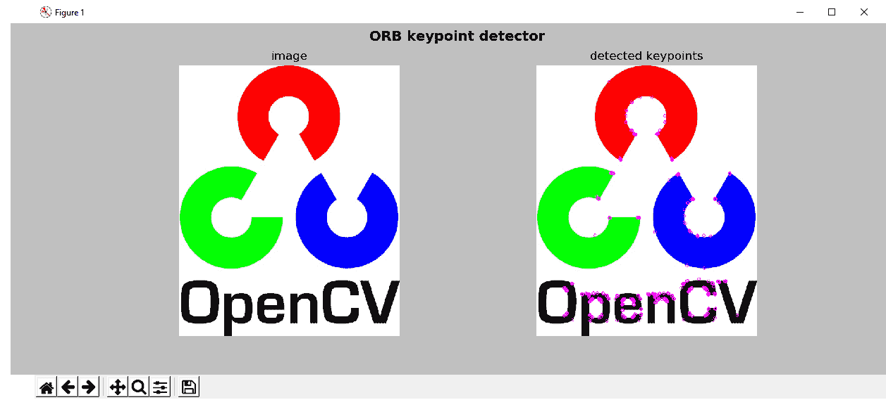

可以看出，右边的结果显示了 ORB 关键点检测器已检测到的 ORB 检测关键点。

# 特征匹配

在下一个示例中，我们将看到如何匹配检测到的特征。 OpenCV 提供了两个匹配器，如下所示：

*   **暴力**（**BF**）**匹配器**：此匹配器采用为第一个集合中每个检测到的特征计算的每个描述符，以及第二组中的所有其他描述符，并对其进行匹配。 最后，它返回距离最近的匹配项。
*   **近似最近邻的快速库**（**FLANN**）**匹配器**：对于大型数据集，此匹配器比 BF 匹配器工作更快。 它包含用于最近邻搜索的优化算法。

在`feature_matching.py`脚本中，我们将使用 BF 匹配器来查看如何匹配检测到的特征。 因此，第一步是要检测`keypoints`并计算描述符：

```py
orb = cv2.ORB_create()
keypoints_1, descriptors_1 = orb.detectAndCompute(image_query, None)
keypoints_2, descriptors_2 = orb.detectAndCompute(image_scene, None)
```

下一步是使用`cv2.BFMatcher()`创建 BF 匹配器对象：

```py
bf_matcher = cv2.BFMatcher(cv2.NORM_HAMMING, crossCheck=True)
```

第一个参数`normType`将距离测量默认设置为使用`cv2.NORM_L2`。 在使用 ORB 描述符（或其他基于二进制的描述符，例如 Br​​ief 或 BRISK）的情况下，要使用的距离度量为`cv2.NORM_HAMMING`。 可以将第二个参数`crossCheck`（默认情况下为`False`）设置为`True`，以便在匹配过程中仅返回一致的对（两组中的两个特征应相互匹配）。 创建完成后，下一步就是使用`BFMatcher.match()`方法匹配检测到的描述符：

```py
bf_matches = bf_matcher.match(descriptors_1, descriptors_2)
```

`descriptors_1`和`descriptors_2`是应该预先计算的描述符； 这样，我们可以在两张图像中获得最佳匹配。 此时，我们可以按距离的升序对匹配项进行排序：

```py
bf_matches = sorted(bf_matches, key=lambda x: x.distance)
```

最后，我们可以使用`cv2.drawMatches()`函数绘制匹配项。 在这种情况下，仅显示前`20`个匹配项（出于可见性考虑）：

```py
result = cv2.drawMatches(image_query, keypoints_1, image_scene, keypoints_2, bf_matches[:20], None, matchColor=(255, 255, 0), singlePointColor=(255, 0, 255), flags=0)
```

`cv2.drawMatches()`函数水平连接两个图像，并从显示匹配的第一张图像到第二张图像绘制线条。

下一个屏幕截图中可以看到`feature_matching.py`脚本的输出：


如您在上一个屏幕截图中所见，绘制了两个图像（`image_query`，`image_scene`）之间的匹配。

# 用于查找对象的特征匹配和单应性计算

为了完成本节，我们将看到查找对象的最后一步。 一旦特征匹配，下一步就是使用`cv2.findHomography()`函数在两个图像中匹配的`keypoints`的位置之间找到透视变换。

OpenCV 提供了几种计算单应性矩阵的方法-`RANSAC`，最低中位数（`LMEDS`）和 PROSAC（`RHO`）。 在此示例中，我们使用`RANSAC`，如下所示：

```py
M, mask = cv2.findHomography(pts_src, pts_dst, cv2.RANSAC, 5.0)
```

这里，`pts_src`是源图像中匹配的关键点的位置，`pts_dst`是查询图像中匹配的`keypoints`的位置。

第四个参数`ransacReprojThreshold`设置最大重投影误差，以将一个点对视为一个惯常值。 在这种情况下，如果重投影误差大于`5.0`，则将相应的点对视为异常值。 此函数计算并返回由`keypoints`位置定义的源平面和目标平面之间的透视变换矩阵`M`。

最后，基于透视变换矩阵`M`，我们将计算查询图像中对象的四个角。 为此，我们将基于原始图像的形状计算其四个角，然后使用`cv2.perspectiveTransform()`函数将其转换为目标角：

```py
pts_corners_dst = cv2.perspectiveTransform(pts_corners_src, M)
```

这里，`pts_corners_src`包含原始图像的四个角，`M`是透视变换矩阵； `pts_corners_dst`输出包含查询图像中对象的四个角。 我们可以使用`cv2.polyline()`函数绘制检测到的物体的轮廓：

```py
img_obj = cv2.polylines(image_scene, [np.int32(pts_corners_dst)], True, (0, 255, 255), 10)
```

最后，我们还可以使用`cv2.drawMatches()`函数绘制匹配，如下所示：

```py
img_matching = cv2.drawMatches(image_query, keypoints_1, img_obj, keypoints_2, best_matches, None, matchColor=(255, 255, 0), singlePointColor=(255, 0, 255), flags=0)
```

下一个屏幕截图中可以看到`feature_matching_object_recognition.py`脚本的输出：

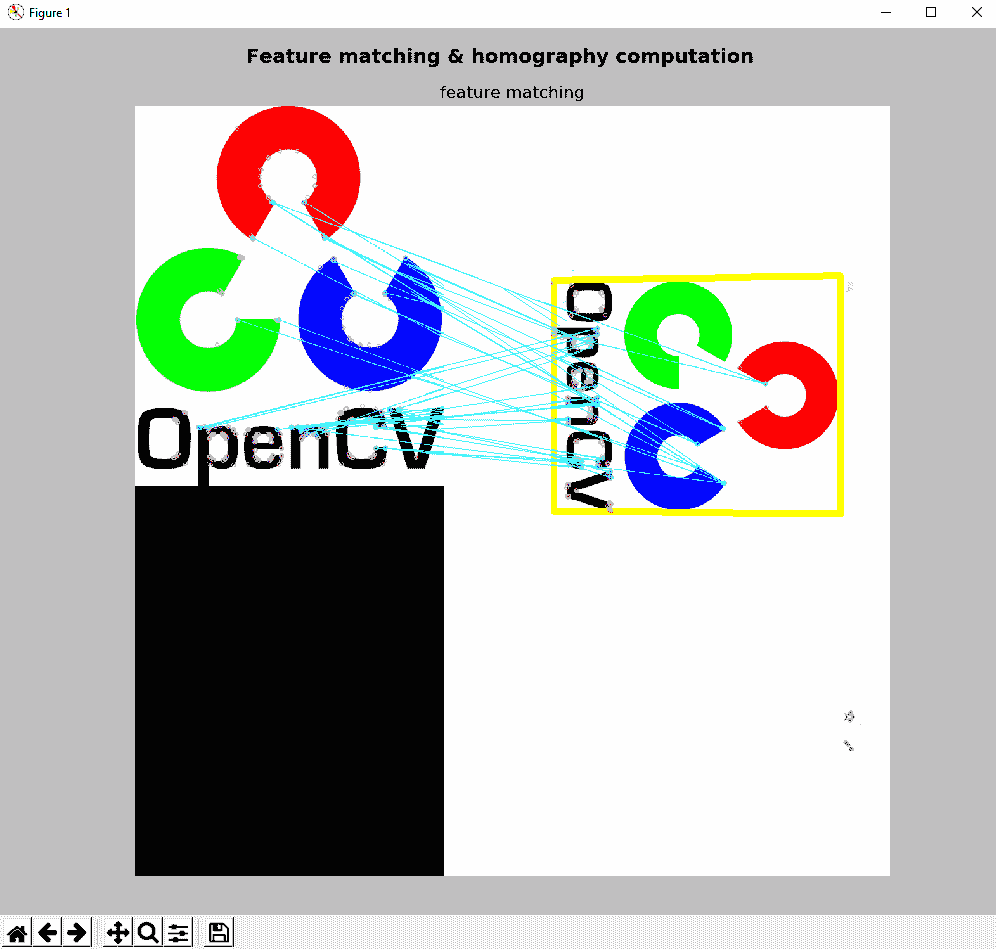

在前面的屏幕截图中，您可以看到特征匹配和单应性计算，这是对象识别的两个关键步骤。

# 基于标记的增强现实

在本节中，我们将了解基于标记的增强现实的工作原理。 您可以使用许多库，算法或包来生成和检测标记。 从这个意义上说，提供最先进的检测标记表现的是 ArUco。

ArUco 自动检测标记并纠正可能的错误。 此外，ArUco 通过将多个标记与通过颜色分割计算的遮挡遮罩相结合，提出了一种遮挡问题的解决方案。

如前所述，姿势估计是增强现实应用中的关键过程。 可以基于标记执行姿势估计。 使用标记的主要好处是可以在可以精确得出标记的四个角的图像中高效且鲁棒地检测到它们。 最后，可以从先前计算出的标记的四个角获得相机姿态。 因此，在接下来的小节中，我们将从创建标记和字典开始，了解如何创建基于标记的增强现实应用。

# 创建标记和字典

使用 ArUco 的第一步是创建标记和字典。 首先， **ArUco 标记**是由外部和内部单元（也称为**位**）组成的正方形标记。 外部单元设置为黑色，从而可以快速，可靠地检测到外部边界。 其余的单元（内部单元）用于编码标记。 还可以创建具有不同大小的 ArUco 标记。 标记的大小指示与内部矩阵相关的内部单元数。 例如，`5 x 5`（`n=5`）的标记大小由 25 个内部单元组成。 此外，您还可以设置标记边界中的位数。

其次，标记字典是被认为在特定应用中使用的标记集。 虽然以前的库仅考虑固定字典，但 ArUco 提出了一种自动方法，用于生成具有所需数量和位数的标记。 从这个意义上讲，ArUco 包括一些预定义的词典，涵盖了与标记数量和标记大小有关的许多配置。

创建基于标记的增强现实应用时要考虑的第一步是打印要使用的标记。

在`aruco_create_markers.py`脚本中，我们正在创建一些准备打印的标记。 第一步是创建字典对象。 ArUco 具有一些预定义的字典：`DICT_4X4_50 = 0`，`DICT_4X4_100 = 1`，`DICT_4X4_250 = 2`，`DICT_4X4_1000 = 3`，`DICT_5X5_50 = 4`，`DICT_5X5_100 = 5`，`DICT_5X5_250 = 6`，`DICT_5X5_1000 = 7`，`DICT_6X6_50 = 8`，`DICT_6X6_100 = 9`，`DICT_6X6_250 = 10`， `DICT_6X6_1000 = 11`，`DICT_7X7_50 = 12`，`DICT_7X7_100 = 13`，`DICT_7X7_250 = 14`和`DICT_7X7_1000 = 15`。

在这种情况下，我们将使用由`250`标记组成的`cv2.aruco.Dictionary_get()`函数创建字典。 每个标记的大小为`7 x 7`（`n=7`）：

```py
aruco_dictionary = cv2.aruco.Dictionary_get(cv2.aruco.DICT_7X7_250)
```

此时，可以使用`cv2.aruco.drawMarker()`函数绘制标记，该函数返回准备打印的标记。 `cv2.aruco.drawMarker()`的第一个参数是`dictionary`对象。 第二个参数是标记`id`，其范围在`0`和`249`之间，因为我们的词典中包含`250`标记。 第三个参数`sidePixels`是创建的标记图像的大小（以像素为单位）。 第四个参数（可选，默认为`1`）为`borderBits`，它设置标记边界中的位数。

因此，在此示例中，我们将创建三个标记，这些标记会改变标记边界中的位数：

```py
aruco_marker_1 = cv2.aruco.drawMarker(dictionary=aruco_dictionary, id=2, sidePixels=600, borderBits=1)
aruco_marker_2 = cv2.aruco.drawMarker(dictionary=aruco_dictionary, id=2, sidePixels=600, borderBits=2)
aruco_marker_3 = cv2.aruco.drawMarker(dictionary=aruco_dictionary, id=2, sidePixels=600, borderBits=3)
```

这些标记图像可以保存在磁盘上（使用`cv2.imwrite()`）：

```py
cv2.imwrite("marker_DICT_7X7_250_600_1.png", aruco_marker_1)
cv2.imwrite("marker_DICT_7X7_250_600_2.png", aruco_marker_2)
cv2.imwrite("marker_DICT_7X7_250_600_3.png", aruco_marker_3)
```

在`aruco_create_markers.py`脚本中，我们还显示了创建的标记。 输出可以在下一个屏幕截图中看到：

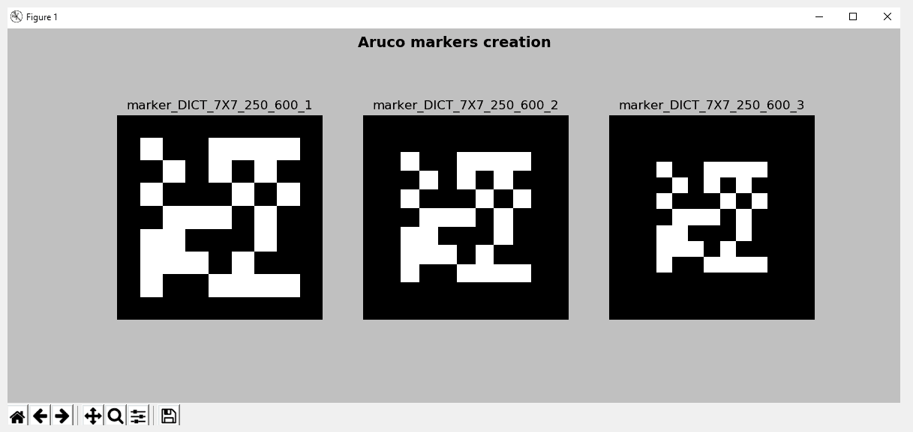

在前面的屏幕截图中，显示了三个创建的标记。

# 检测标记

您可以使用`cv2.aruco.detectMarkers()`函数来检测图像中的标记：

```py
corners, ids, rejected_corners = cv2.aruco.detectMarkers(gray_frame, aruco_dictionary, parameters=parameters)
```

`cv2.aruco.detectMarkers()`的第一个参数是要在其中检测标记的灰度图像。 第二个参数是字典对象，它应该先前已经创建。 第三个参数建立了在检测过程中可以自定义的所有参数。 此函数返回以下信息：

*   返回检测到的标记的角列表。 对于每个标记，将返回其四个角（左上，右上，右下和左下）。
*   返回检测到的标记的标识符列表。
*   返回被拒绝的候选者列表，该列表由找到的所有正方形组成，但是它们没有正确的编码。 此拒绝候选者列表对于调试目的很有用。 每个被拒绝的候选人都由其四个角组成。

`aruco_detect_markers.py`脚本从网络摄像头检测标记。 首先，使用上述`cv2.aruco.detectMarkers()`函数检测标记，然后，使用`cv2.aruco.drawDetectedMarkers()`函数绘制检测到的标记和拒绝的候选者，如下所示：

```py
# Draw detected markers:
frame = cv2.aruco.drawDetectedMarkers(image=frame, corners=corners, ids=ids, borderColor=(0, 255, 0))
# Draw rejected markers:
frame = cv2.aruco.drawDetectedMarkers(image=frame, corners=rejected_corners, borderColor=(0, 0, 255))
```

如果执行`aruco_detect_markers.py`脚本，检测到的标记将以绿色边框绘制，而被拒绝的候选者将以红色边框绘制，如以下屏幕截图所示：

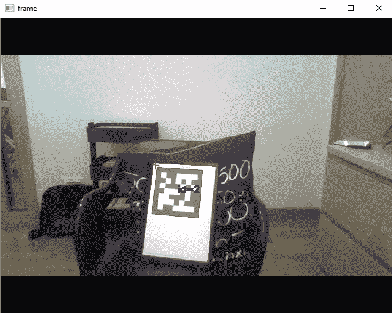

在前面的屏幕截图中，您可以看到检测到一个标记（带有`id=2`），该标记以绿色边框绘制。 此外，您还可以看到两个带有红色边框的被拒绝候选人。

# 相机校准

在使用检测到的标记获取相机姿态之前，有必要了解相机的校准参数。 从这个意义上讲，ArUco 提供了执行此任务所需的校准程序。 请注意，校准过程仅执行一次，因为未更改相机光学器件。 校准过程中使用的主要函数是`cv2.aruco.calibrateCameraCharuco()`。

前述函数使用从板上提取的几个视图中的一组角来校准摄像机。 校准过程完成后，此函数返回相机矩阵（`3 x 3`浮点相机矩阵）和包含失真系数的向量。 更具体地说，`3 x 3`矩阵对焦距和相机中心坐标（也称为**固有参数**）进行编码。 失真系数模拟了相机产生的失真。

该函数的签名如下：

```py
calibrateCameraCharuco(charucoCorners, charucoIds, board, imageSize, cameraMatrix, distCoeffs[, rvecs[, tvecs[, flags[, criteria]]]]) -> retval, cameraMatrix, distCoeffs, rvecs, tvecs
```

此处，`charucoCorners`是包含检测到的 charuco 角的向量，`charucoIds`是标识符的列表，`board`代表电路板布局，`imageSize`是输入图像尺寸。 输出向量`rvecs`包含为每个板视图估计的旋转向量的向量，`tvecs`是为每个图案视图估计的平移向量的向量。 如前所述，相机矩阵`cameraMatrix`和失真系数`distCoeffs`也将返回。

该板是使用`cv2.aruco.CharucoBoard_create()`函数创建的：

签名如下：

```py
CharucoBoard_create(squaresX, squaresY, squareLength, markerLength, dictionary) -> retval
```

此处，`squareX`是在`x`方向上的平方数，`squaresY`是在`y`方向上的平方数，`squareLength`是棋盘方边的长度（通常 `markerLength`是标记的边长（与`squareLength`相同的单位），`dictionary`设置字典中要使用的第一个标记，以便在板上创建标记。 例如，为了创建一个木板，我们可以使用以下代码行：

```py
dictionary = cv2.aruco.Dictionary_get(cv2.aruco.DICT_7X7_250)
board = cv2.aruco.CharucoBoard_create(3, 3, .025, .0125, dictionary)
img = board.draw((200 * 3, 200 * 3))
```

在下一个屏幕截图中可以看到创建的木板：

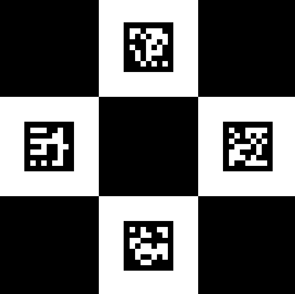

稍后，`cv2.aruco.calibrateCameraCharuco()`函数将在校准过程中使用此板：

```py
cal = cv2.aruco.calibrateCameraCharuco(all_corners, all_ids, board, image_size, None, None)
```

校准过程完成后，我们会将相机矩阵和失真系数都保存到磁盘中。 为此，我们使用 Pickle，它可以用于对 Python 对象结构进行序列化和反序列化。

校准过程完成后，我们现在可以执行相机姿态估计。

`aruco_camera_calibration.py`脚本执行校准过程。 请注意，通过使用先前创建和印刷的电路板，此脚本可用于创建电路板和执行校准过程。

# 相机姿态估计

为了估计摄像机姿态，可以使用`cv2.aruco.estimatePoseSingleMarkers()`函数，该函数可以估计单个标记的姿态。 姿势由旋转和平移向量组成。 签名如下：

```py
cv.aruco.estimatePoseSingleMarkers( corners, markerLength, cameraMatrix, distCoeffs[, rvecs[, tvecs[, _objPoints]]] ) ->  rvecs, tvecs, _objPoints
```

这里，`cameraMatrix`和`distCoeffs`分别是相机矩阵和失真系数； 应向他们提供在校准过程之后获得的值。 `corners`参数是一个向量，其中包含每个检测到的标记的四个角。 `markerLength`参数是标记边的长度。 请注意，返回的翻译向量将以相同的单位表示。 此函数为每个检测到的标记返回`rvecs`（旋转向量），`tvecs`（平移向量）和`_objPoints`（所有检测到的标记角的对象点数组）。

标记坐标系以标记的中心为中心。 因此，标记的四个角的坐标（在其自己的坐标系中）如下：

*   `(-markerLength/2, markerLength/2, 0)`
*   `(markerLength/2, markerLength/2, 0)`
*   `(markerLength/2, -markerLength/2, 0)`
*   `(-markerLength/2, -markerLength/2, 0)`

最后，ArUco 还提供`cv.aruco.drawAxis()`函数，该函数可用于绘制每个检测到的标记的系统轴。

签名如下：

```py
cv.aruco.drawAxis( image, cameraMatrix, distCoeffs, rvec, tvec, length ) -> image
```

除`length`参数以外，所有参数先前都已在以前的函数中引入，该参数设置绘制轴的长度（与`tvec`相同的单位）。 下一个屏幕截图显示了脚本`aruco_detect_markers_pose.py`的输出：


在上一个屏幕截图中，您可以看到仅检测到一个标记，并且已绘制了该标记的系统轴。

# 相机姿态估计和基本增强

此时，我们可以叠加一些图像，形状或 3D 模型，以查看完整的增强现实应用。 在第一个示例中，我们将使用标记的大小覆盖一个矩形。 执行此功能的代码如下：

```py
if ids is not None:
    # rvecs and tvecs are the rotation and translation vectors respectively
    rvecs, tvecs, _ = cv2.aruco.estimatePoseSingleMarkers(corners, 1, cameraMatrix, distCoeffs)

    for rvec, tvec in zip(rvecs, tvecs):
        # Define the points where you want the image to be overlaid (remember: marker coordinate system):
        desired_points = np.float32(
            [[-1 / 2, 1 / 2, 0], [1 / 2, 1 / 2, 0], [1 / 2, -1 / 2, 0], [-1 / 2, -1 / 2, 0]])

        # Project the points:
        projected_desired_points, jac = cv2.projectPoints(desired_points, rvecs, tvecs, cameraMatrix, distCoeffs)        

        # Draw the projected points:
        draw_points(frame, projected_desired_points)
```

第一步是定义要覆盖图像或模型的点。 由于我们希望将矩形覆盖在检测到的标记上，因此这些坐标为`[[-1 / 2, 1 / 2, 0], [1 / 2, 1 / 2, 0], [1 / 2, -1 / 2, 0], [-1 / 2, -1 / 2, 0]]`。

请记住，我们必须在标记坐标系中定义这些坐标。 下一步是使用`cv2.projectPoints()`函数投影这些点：

```py
projected_desired_points, jac = cv2.projectPoints(desired_points, rvecs, tvecs, cameraMatrix, distCoeffs)
```

最后，我们使用`draw_points()`函数绘制这些点：

```py
def draw_points(img, pts):
    """ Draw the points in the image"""

    pts = np.int32(pts).reshape(-1, 2)
    img = cv2.drawContours(img, [pts], -1, (255, 255, 0), -3)
    for p in pts:
        cv2.circle(img, (p[0], p[1]), 5, (255, 0, 255), -1)

    return img
```

下一个屏幕截图中可以看到`aruco_detect_markers_draw_square.py`脚本的输出：


在前面的屏幕截图中，您可以看到一个青色矩形已覆盖在检测到的标记上。 此外，您还可以看到以洋红色绘制的矩形的四个角。

# 相机姿态估计和高级增强

可以轻松修改`aruco_detect_markers_draw_square.py`脚本，以覆盖更高级的增强功能。

在这种情况下，我们将覆盖一棵树的图像，可以在下一个屏幕截图中看到：

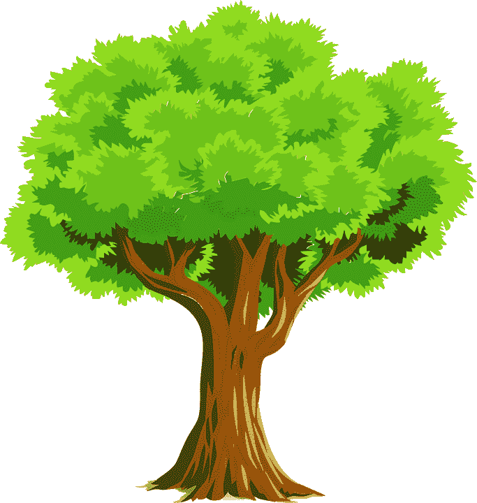

为了执行此扩充，我们对`draw_augmented_overlay()`函数进行了编码，如下所示：

```py
def draw_augmented_overlay(pts_1, overlay_image, image):
    """Overlay the image 'overlay_image' onto the image 'image'"""

    # Define the squares of the overlay_image image to be drawn:
    pts_2 = np.float32([[0, 0], [overlay_image.shape[1], 0], [overlay_image.shape[1], overlay_image.shape[0]], [0, overlay_image.shape[0]]])

    # Draw border to see the limits of the image:
    cv2.rectangle(overlay_image, (0, 0), (overlay_image.shape[1], overlay_image.shape[0]), (255, 255, 0), 10)

    # Create the transformation matrix:
    M = cv2.getPerspectiveTransform(pts_2, pts_1)

    # Transform the overlay_image image using the transformation matrix M:
    dst_image = cv2.warpPerspective(overlay_image, M, (image.shape[1], image.shape[0]))
    # cv2.imshow("dst_image", dst_image)

    # Create the mask:
    dst_image_gray = cv2.cvtColor(dst_image, cv2.COLOR_BGR2GRAY)
    ret, mask = cv2.threshold(dst_image_gray, 0, 255, cv2.THRESH_BINARY_INV)

    # Compute bitwise conjunction using the calculated mask:
    image_masked = cv2.bitwise_and(image, image, mask=mask)
    # cv2.imshow("image_masked", image_masked)

    # Add the two images to create the resulting image:
    result = cv2.add(dst_image, image_masked)
    return result
```

`draw_augmented_overlay()`函数首先定义叠加图像的正方形。 然后，计算变换矩阵，该变换矩阵用于变换覆盖图像以获得`dst_image`图像。 接下来，我们创建`mask`并使用先前创建的`mask`计算按位运算以获得`image_masked`图像。 最后一步是在`dst_image`和`image_masked`之间执行加法以获得`result`图像，最后将其返回。

下一个屏幕截图中可以看到`aruco_detect_markers_augmented_reality.py`脚本的输出：

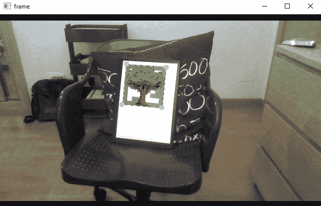

为了覆盖更复杂和高级的 3D 模型，可以使用 OpenGL。 **开放图形库**（**OpenGL**）是用于渲染 2D 和 3D 模型的跨平台 API。

从这个意义上讲，[PyOpenGL](http://pyopengl.sourceforge.net/) 是最常见且标准的跨平台 Python 绑定到 OpenGL。

# 基于 Snapchat 的增强现实

在本节中，我们将了解如何创建一些有趣的基于 Snapchat 的过滤器。 在这种情况下，我们将创建两个过滤器。 第一个在检测到的脸上的鼻子和嘴之间覆盖了一个大胡子。 第二个在检测到的面部上覆盖一副眼镜。

在以下小节中，您将看到如何实现此功能。

# 基于 Snapchat 的增强现实 OpenCV 胡须覆盖

在`snapchat_augmeted_reality_moustache.py`脚本中，我们在检测到的面部上覆盖了胡须。 从网络摄像头连续捕获图像。 我们还提供了使用测试图像代替从网络摄像头捕获的图像的可能性。 这对于调试算法很有用。 在解释此脚本的关键步骤之前，我们将看下一个屏幕截图，它是使用测试图像时算法的输出：


第一步是检测图像中的所有面部。 如您所见，青色矩形表示图像中检测到的脸部的位置和大小。 该算法的下一步是遍历图像中所有检测到的面部，在其区域内搜索鼻子。 洋红色矩形表示图像中检测到的鼻子。 一旦检测到鼻子，下一步就是调整要覆盖小胡子的区域，该区域是根据之前计算出的鼻子的位置和大小计算得出的。 在这种情况下，蓝色矩形表示将要覆盖胡须的位置。 您还可以看到图像中检测到两个鼻子，并且只有一个胡须覆盖。 这是因为执行基本检查是为了知道所检测到的鼻子是否有效。 一旦我们检测到有效的鼻子，小胡子就会被覆盖，如果离开我们会继续在检测到的面部上进行迭代，否则将分析另一帧。

因此，在此脚本中，面部和鼻子都被检测到。 为了检测这些对象，创建了两个分类器，一个用于检测人脸，另一个用于检测鼻子。 要创建这些分类器，以下代码是必需的：

```py
face_cascade = cv2.CascadeClassifier("haarcascade_frontalface_default.xml")
nose_cascade = cv2.CascadeClassifier("haarcascade_mcs_nose.xml")
```

创建分类器后，下一步就是检测图像中的这些对象。 在这种情况下，将使用`cv2.detectMultiScale()`函数。 此函数检测输入灰度图像中大小不同的对象，并将检测到的对象作为矩形列表返回。 例如，为了检测面部，可以使用以下代码：

```py
faces = face_cascade.detectMultiScale(gray, 1.3, 5)
```

在这一点上，我们遍历检测到的面部，尝试检测鼻子：

```py
# Iterate over each detected face:
for (x, y, w, h) in faces:
    # Draw a rectangle to see the detected face (debugging purposes):
    # cv2.rectangle(frame, (x, y), (x + w, y + h), (255, 255, 0), 2)

    # Create the ROIS based on the size of the detected face:
    roi_gray = gray[y:y + h, x:x + w]
    roi_color = frame[y:y + h, x:x + w]

    # Detects a nose inside the detected face:
    noses = nose_cascade.detectMultiScale(roi_gray)
```

一旦检测到鼻子，我们将在所有检测到的鼻子上进行迭代，并计算出胡须覆盖的区域。 执行基本检查以滤除假鼻子位置。 如果成功，则胡子将基于先前计算的区域覆盖在图像上：

```py
for (nx, ny, nw, nh) in noses:
    # Draw a rectangle to see the detected nose (debugging purposes):
    # cv2.rectangle(roi_color, (nx, ny), (nx + nw, ny + nh), (255, 0, 255), 2)

    # Calculate the coordinates where the moustache will be placed:
    x1 = int(nx - nw / 2)
    x2 = int(nx + nw / 2 + nw)
    y1 = int(ny + nh / 2 + nh / 8)
    y2 = int(ny + nh + nh / 4 + nh / 6)

    if x1 < 0 or x2 < 0 or x2 > w or y2 > h:
        continue

    # Draw a rectangle to see where the moustache will be placed (debugging purposes):
    # cv2.rectangle(roi_color, (x1, y1), (x2, y2), (255, 0, 0), 2)

    # Calculate the width and height of the image with the moustache:
    img_moustache_res_width = int(x2 - x1)
    img_moustache_res_height = int(y2 - y1)

    # Resize the mask to be equal to the region were the glasses will be placed:
    mask = cv2.resize(img_moustache_mask, (img_moustache_res_width, img_moustache_res_height))
    mask_inv = cv2.bitwise_not(mask)
    img = cv2.resize(img_moustache, (img_moustache_res_width, img_moustache_res_height))

    # Take ROI from the BGR image:
    roi = roi_color[y1:y2, x1:x2]

    # Create ROI background and ROI foreground:
    roi_bakground = cv2.bitwise_and(roi, roi, mask=mask_inv)
    roi_foreground = cv2.bitwise_and(img, img, mask=mask)

    # Show both roi_bakground and roi_foreground (debugging purposes):
    # cv2.imshow('roi_bakground', roi_bakground)
    # cv2.imshow('roi_foreground', roi_foreground)

    # Add roi_bakground and roi_foreground to create the result:
    res = cv2.add(roi_bakground, roi_foreground)

    # Set res into the color ROI:
    roi_color[y1:y2, x1:x2] = res

    break
```

关键是`img_moustache_mask`图像。 使用要叠加的图像的 Alpha 通道创建此图像。

这样，将仅在图像中绘制覆盖图像的前景。 在以下屏幕截图中，您可以看到基于覆盖图像的 Alpha 通道创建的胡须遮罩：

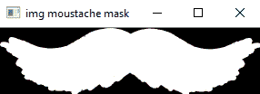

要创建此掩码，我们执行以下操作：

```py
img_moustache = cv2.imread('moustache.png', -1)
img_moustache_mask = img_moustache[:, :, 3]
```

下一个屏幕截图中可以看到`snapchat_augmeted_reality_moustache.py`脚本的输出：

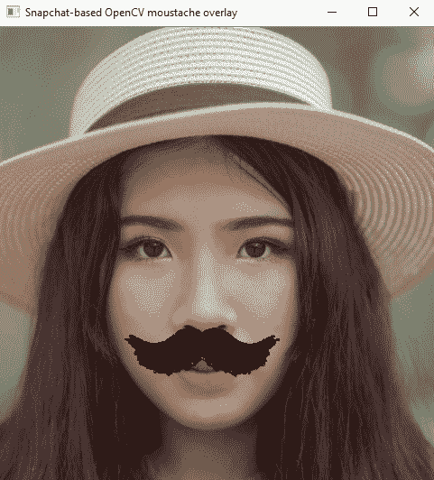

以下屏幕快照中包含的所有胡须都可以在您的增强现实应用中使用：


实际上，我们还创建了`moustaches.svg`文件，其中包含了这六个不同的胡须。

# 基于 Snapchat 的增强现实 OpenCV 眼镜覆盖

以类似的方式，我们还对`snapchat_agumeted_reality_glasses.py`脚本进行了编码，以在检测到的面部的眼睛区域上覆盖一副眼镜。 在这种情况下，为了检测图像中的眼睛，使用了眼睛对检测器。

因此，应该相应地创建分类器：

```py
eyepair_cascade = cv2.CascadeClassifier("haarcascade_mcs_eyepair_big.xml")
```

在下一个屏幕截图中，可以看到使用测试图像时算法的输出：

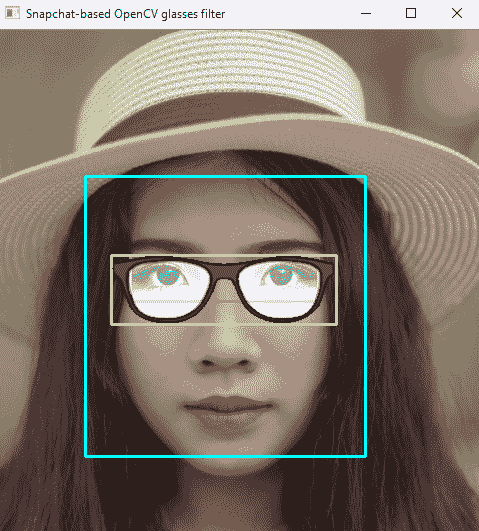

青色矩形表示图像中检测到的脸部的位置和大小。 洋红色矩形表示图像中检测到的眼睛对。 黄色矩形表示将要覆盖眼镜的位置，该位置是根据眼睛对区域的位置和大小计算得出的。 如您所见，已将某些透明度添加到眼镜覆盖的图像中，以使其更加逼真。

这也可以在眼镜图像遮罩中看到，该图像在下一个屏幕截图中显示：


下一个屏幕截图中可以看到`snapchat_augmeted_reality_glasses.py`脚本的输出：


所有这些眼镜可以在以下屏幕截图中看到：


最后，我们还创建了`glasses.svg`文件，其中包含六种不同的眼镜。 因此，您可以在增强现实应用中播放和使用所有这些眼镜。

# QR 码检测

为了完成本章，我们将学习如何检测图像中的 QR 码。 这样，QR 码也可以用作我们的增强现实应用的标记。 `cv2.detectAndDecode()`函数可检测并解码包含 QR 码的图像中的 QR 码。 图像可以是灰度或彩色（BGR）。

该函数返回以下内容：

*   返回找到的 QR 码的顶点数组。 如果未找到 QR 码，则此数组可以为空。
*   已校正并二值化的 QR 码被返回。
*   返回与此 QR 码关联的数据。

在`qr_code_scanner.py`脚本中，我们利用上述函数来检测和解码 QR 码。 接下来重点说明要点。

首先，加载图像，如下所示：

```py
image = cv2.imread("qrcode_rotate_45_image.png")
```

接下来，我们使用以下代码创建 QR 码检测器：

```py
qr_code_detector = cv2.QRCodeDetector()
```

然后，我们应用`cv2.detectAndDecode()`函数，如下所示：

```py
data, bbox, rectified_qr_code = qr_code_detector.detectAndDecode(image)
```

我们在解码数据之前检查是否找到 QR 码，并使用`show_qr_detection()`函数显示检测到的代码：

```py
if len(data) > 0:

    print("Decoded Data : {}".format(data))
    show_qr_detection(image, bbox)
```

`show_qr_detection()`函数绘制检测到的 QR 码的线条和角点：

```py
def show_qr_detection(img, pts):
    """Draws both the lines and corners based on the array of vertices of the found QR code"""

    pts = np.int32(pts).reshape(-1, 2)

    for j in range(pts.shape[0]):
        cv2.line(img, tuple(pts[j]), tuple(pts[(j + 1) % pts.shape[0]]), (255, 0, 0), 5)

    for j in range(pts.shape[0]):
        cv2.circle(img, tuple(pts[j]), 10, (255, 0, 255), -1)
```

下一个屏幕截图中可以看到`qr_code_scanner.py`脚本的输出：

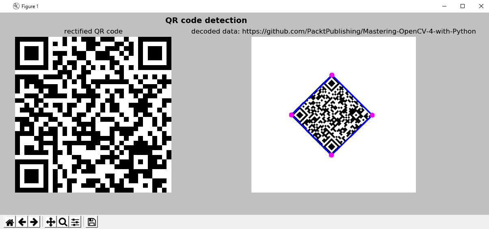

在前面的屏幕截图中，您可以看到经过校正和二值化的 QR 码（左）和检测到的标记（右），带有蓝色边框，洋红色正方形点突出显示检测结果。

# 总结

在本章中，我们介绍了增强现实技术的介绍。 我们编写了一些示例，以了解如何构建标记和无标记增强现实应用。 此外，我们看到了如何叠加简单的模型（形状或图像等）。

如前所述，要覆盖更复杂的模型，可以使用 PyOpenGL（Python 的标准 OpenGL 绑定）。 在本章中，为简化起见，未解决该库。

我们还看到了如何创建一些有趣的基于 Snapchat 的过滤器。 应当注意，在第 11 章，“人脸检测，跟踪和识别”中，将介绍用于人脸检测，跟踪和人脸标志定位的更高级算法。 因此，可以轻松修改本章中编码的基于 Snapchat 的过滤器，以包括更健壮的管道，以得出眼镜和胡须应重叠的位置。 最后，我们已经了解了如何检测 QR 码，可以将其用作增强现实应用中的标记。

在第 10 章，“使用 OpenCV 的机器学习”中，将向您介绍机器学习的世界，并且您将了解如何在计算机视觉项目中使用机器学习。

# 问题

1.  初始化 ORB 检测器，找到`keypoints`，并使用 ORB 在加载的图像`image`中计算描述符
2.  画出先前检测到的`keypoints`
3.  创建`BFMatcher`对象，并匹配先前计算出的`descriptors_1`和`descriptors_2`
4.  对之前计算出的匹配进行排序，并绘制第一个`20`匹配
5.  使用 ArUco 在`gray_frame`图像中检测标记
6.  使用 ArUco 绘制检测到的标记
7.  使用 ArUco 绘制拒绝的标记
8.  检测并解码图像`image`中包含的 QR 码

# 进一步阅读

以下参考将帮助您更深入地了解增强现实：

*   [《面向开发人员的增强现实》（2017）](https://www.packtpub.com/web-development/augmented-reality-developers)