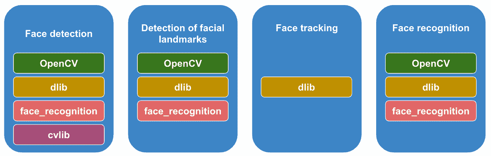
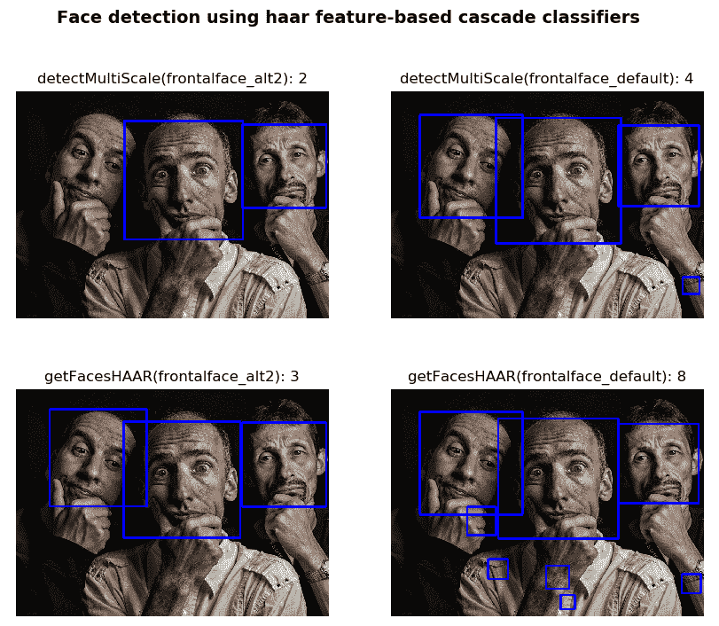
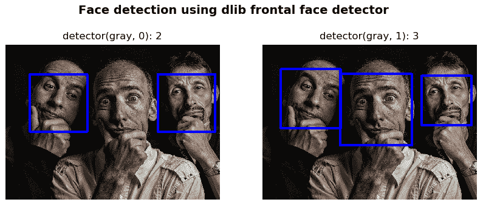
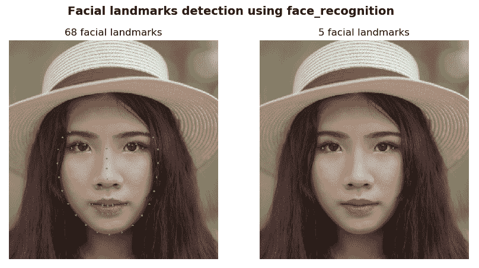
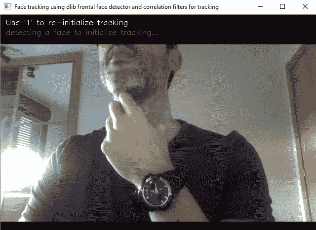
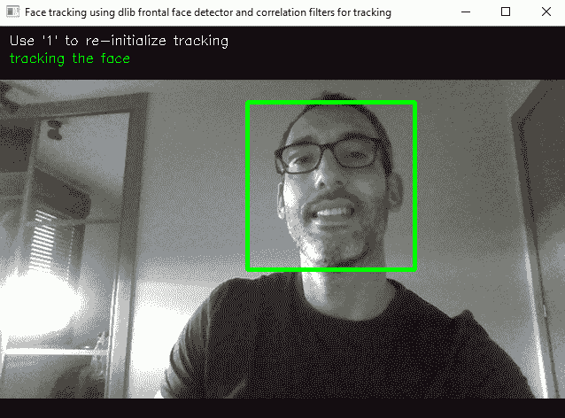
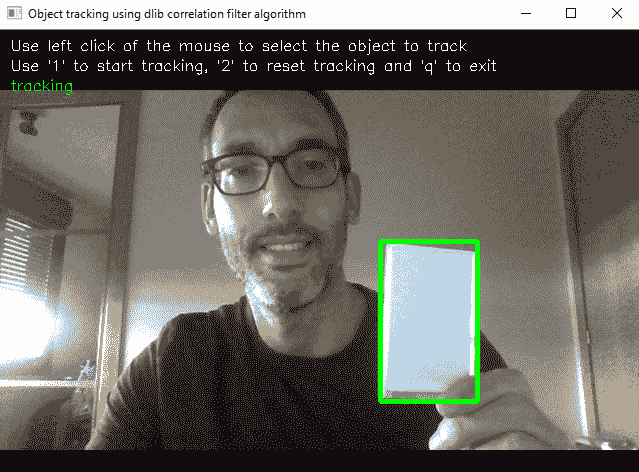
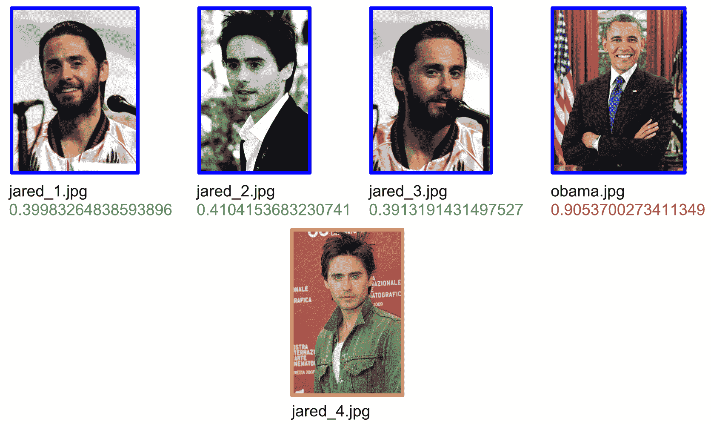

# 人脸检测，跟踪和识别

**人脸处理**是人工智能领域的热门话题，因为可以使用计算机视觉算法从面部自动提取很多信息。 面部在视觉交流中起着重要作用，因为可以从人脸中提取大量非语言信息，例如身份，意图和情感。 对于计算机视觉学习者来说，面部处理是一个非常有趣的主题，因为它涉及到不同的专业领域，例如对象检测，图像处理，标志检测或对象跟踪。

在本章中，将向您介绍与使用最新算法和技术进行面部处理有关的主要主题，以达到令人印象深刻的效果。

我们将涵盖以下主题：

*   人脸处理简介
*   人脸检测
*   检测人脸标志
*   人脸追踪
*   人脸识别

在本章中，您将学习如何使用与人脸检测，跟踪和识别相关的最新算法来创建人脸处理项目。 在第 12 章，“深度学习简介”中，将向您介绍使用 OpenCV 进行深度学习的领域以及一些深度学习 Python 库（TensorFlow 和 Keras）。

# 技术要求

技术要求如下：

*   Python 和 OpenCV
*   特定于 Python 的 IDE
*   NumPy 和 Matplotlib 包
*   Git 客户端
*   Dlib 包
*   `face_processing`封装

有关如何安装这些要求的更多详细信息，请参见第 1 章，“设置 OpenCV”。 《精通 Python OpenCV 4》的 GitHub 存储库，其中包含贯穿本书的所有必要的支持项目文件，从第一章到最后一章，都可以在[这里](https://github.com/PacktPublishing/Mastering-OpenCV-4-with-Python)访问。

# 安装 Dlib

[Dlib](http://dlib.net/python/index.html) 是一个 C++ 软件库，包含计算机视觉，机器学习和深度学习算法。 Dlib 也可以在您的 Python 应用程序中使用。 [为了使用 Python 界面](https://pypi.org/project/dlib/)安装`dlib`，请使用以下命令：

```py
$ pip install dlib
```

另外，如果您想自己编译`dlib`，请进入`dlib`根文件夹并运行以下命令：

```py
$ python setup.py install
```

该命令运行完毕后，就可以使用 Python 的`dlib`。

请注意，您需要同时安装 CMake 和 C++ 编译器才能正常工作。 还要注意，各种可选功能（例如 GUI 支持（例如`dlib.image_window`）和 CUDA 加速）将根据计算机上的可用状态启用或禁用。

安装`dlib`的第三个选项是访问[这里](http://pypi.fcio.net/simple/dlib/)并安装所需的`dlib`车轮包装。 就我而言，我已经下载了`dlib-19.8.1-cp36-cp36m-win_amd64.whl`文件并使用以下命令进行了安装：

```py
$ pip install dlib-19.8.1-cp36-cp36m-win_amd64.whl
```

车轮文件名是`{distribution}-{version}(-{build tag})?-{python tag}-{abi tag}-{platform tag}.whl`。 例如，`distribution-1.0-1-py27-none-any.whl`是名为`distribution`的包的第一个版本，它在任何 CPU 架构上都与 Python 2.7（任何 Python 2.7 实现）兼容，而没有 ABI（纯 Python）。 请参阅[这里](https://www.python.org/dev/peps/pep-0427/)了解有关 Wheel 二进制包格式的更多详细信息。

要确认安装是否正确执行，只需打开 Python shell 并尝试导入`dlib`库：

```py
python
import dlib
```

请记住，建议的方法是在虚拟环境中安装包。 有关如何创建和管理虚拟环境的信息，请参见第 1 章，“设置 OpenCV”。

例如，在这种情况下，我们将使用 Anaconda 提示符在虚拟环境中安装`dlib`：

1.  创建一个虚拟环境：

```py
(base) $ conda create -n dlib-env python=3.6
```

2.  激活环境：

```py
(base) $ activate dlib-env
```

查看`(dlib-env)`在此命令后的提示前的显示方式。 这表明虚拟环境已被激活。

3.  使用以下命令安装`dlib`：

```py
(dlib-env) $ pip install dlib
```

# 安装`face_recognition`包

[为了安装`face_recognition`包](https://pypi.org/project/face_recognition/) ，请执行以下命令：

```py
$ pip install face_recognition
```

要检查安装是否正确执行，只需打开 Python shell 并尝试导入`face_recognition`库：

```py
python
import face_recognition
```

# 安装`cvlib`包

[要安装`cvlib`包](https://pypi.org/project/cvlib/)，请先安装所需的包（`numpy`，`opencv-python`，`requests`，`progressbar`， `pillow`，`tensorflow`，`keras`），使用以下命令：

```py
$ pip install -r requirements.txt
```

然后，安装`cvlib`包：

```py
$ pip install cvlib
```

要升级到最新版本，请输入以下命令：

```py
pip install --upgrade cvlib
```

请注意，如果您使用的是 GPU，则可以编辑`requirements.txt`文件以包括`tensorflow-gpu`而不是`tensorflow`。

要检查安装是否正确执行，只需打开 Python shell 并尝试导入`face_recognition`库：

```py
python
import cvlib
```

# 人脸处理简介

在本章中，我们将介绍与面部处理有关的主要主题。 为此，我们将使用 **OpenCV** 库，也将使用[`dlib`主页](http://dlib.net/python/index.html)和 [PyPI `dlib`主页](https://pypi.org/project/dlib/)，[Github `dlib`主页](https://github.com/davisking/dlib)，[PyPI `face_recognition`主页](https://pypi.org/project/face_recognition/)，[Github `face_recognition`主页](https://github.com/ageitgey/face_recognition)和[PyPI `cvlib`主页](https://pypi.org/project/cvlib/)，[Github `cvlib`主页](https://github.com/arunponnusamy/cvlib)，[`cvlib`主页](https://www.cvlib.net/) Python 程序包。 在上一节中，您了解了如何安装这些包。

为了介绍本章，我们将在所有部分中使用不同的方法来了解您解决具体的面部处理任务时可能会遇到的不同可能性，并且对所有这些都有一个较高的概述可能会有所帮助。 备择方案。

该图试图捕获前面提到的主题的概念：



如您所见，这里要解决四个要点：

*   **人脸检测**是对象检测的一种特殊情况，其任务是查找图像中所有人脸的位置和大小。
*   **人脸标志检测**是标志检测的一种特殊情况，其任务是在面部定位主要标志。
*   **人脸跟踪**是对象跟踪的一种特殊情况，其中的任务是通过考虑可在连续帧的帧中提取的额外信息来查找视频中所有移动脸的位置和大小。 视频。
*   **人脸识别**是对象识别的一种特殊情况，其中使用从人脸提取的信息从图像或视频中识别或验证人：
    *   **人脸识别**（**1:N**）：任务是在已知人脸的集合中查找与未知人物最接近的匹配项。
    *   **面部验证**（**1:1**）：该任务是检查该人是否是他们所声称的那个人。

如上图所示，本章将使用 **OpenCV**，`dlib`，`face_recognition`和`cvlib`。

# 人脸检测

人脸检测可以定义为确定数字图像中人脸的位置和大小的任务，通常是构建人脸处理应用程序（例如，人脸表情识别，嗜睡检测，性别分类，人脸识别， 头姿势估计或人机交互）。 这是因为上述应用需要将所检测到的面部的位置和大小作为输入。 因此，自动面部检测起着至关重要的作用，并且是人工智能界研究最多的主题之一。

面部检测对于人类来说似乎是一项轻松的任务，但对计算机而言却是一项非常具有挑战性的任务，因为通常涉及许多问题/挑战（例如，外观变化，比例，旋转，面部表情，遮挡或光照条件）。 在 [Viola 和 Jones](https://docs.opencv.org/4.0.1/d7/d8b/tutorial_py_face_detection.html) 提出的工作之后，人脸检测取得了令人瞩目的进展。 在本节中，我们将看到 OpenCV 库以及`dlib`和`face_processing`包提供的一些最流行的面部检测技术，包括上述的 Viola 和 Jones 算法以及其他机器学习和深度学习方法。

# 使用 OpenCV 的人脸检测

OpenCV 提供了两种面部检测方法：

*   基于 Haar 级联的面部检测器
*   基于深度学习的面部检测器

Viola 和 Jones 提出的框架（请参见《使用简单特征的增强级联进行快速对象检测》（2001））是一种有效的对象检测方法。 该框架非常受欢迎，因为 OpenCV 提供了基于该框架的面部检测算法。 另外，该框架还可以用于检测其他物体而不是面部（例如，全身检测器，车牌号检测器，上身检测器或猫脸检测器）。 在本节中，我们将看到如何使用此框架检测人脸。

`face_detection_opencv_haar.py`脚本使用基于 Haar 特征的级联分类器执行面部检测。 从这个意义上说，OpenCV 提供了四个用于（正面）人脸检测的级联分类器：

*   `haarcascade_frontalface_alt.xml`（**FA1**）：22 个阶段，`20 x 20` Haar 特征
*   `haarcascade_frontalface_alt2.xml`（**FA2**）：20 个阶段，`20 x 20` Haar 特征
*   `haarcascade_frontalface_alt_tree.xml`（**FAT**）：47 个阶段，`20 x 20` Haar 特征
*   `haarcascade_frontalface_default.xml`（**FD**）：25 个阶段，`24 x 24` Haar 特征

在一些可用的出版物中，作者使用不同的标准和数据集评估了这些级联分类器的性能。 总体而言，可以得出结论，这些分类器达到了相似的准确性。 这就是为什么在此脚本中，我们将使用其中两个（以简化内容）。 更具体地说，在此脚本中，加载了两个层叠分类器（先前引入的`FA2`和`FD`）：

```py
# Load cascade classifiers:
cas_alt2 = cv2.CascadeClassifier("haarcascade_frontalface_alt2.xml")
cas_default = cv2.CascadeClassifier("haarcascade_frontalface_default.xml")
```

`cv2.CascadeClassifier()`功能用于从文件加载分类器。 [您可以从 OpenCV 信息库下载以下级联分类器文件](https://github.com/opencv/opencv/tree/master/data/haarcascades)。 此外，我们在 GitHub 存储库中包含了两个已加载的层叠分类器文件（`haarcascade_frontalface_alt2.xml`和`haarcascade_frontalface_default.xml`）。

下一步是执行检测：

```py
faces_alt2 = cas_alt2.detectMultiScale(gray)
faces_default = cas_default.detectMultiScale(gray)
```

`cv2.CascadeClassifier.detectMultiScale()`函数检测对象并将其作为矩形列表返回。 最后一步是使用`show_detection()`函数关联结果：

```py
img_faces_alt2 = show_detection(img.copy(), faces_alt2)
img_faces_default = show_detection(img.copy(), faces_default)
```

`show_detection()`函数在每个检测到的面部上绘制一个矩形：

```py
def show_detection(image, faces):
    """Draws a rectangle over each detected face"""

    for (x, y, w, h) in faces:
        cv2.rectangle(image, (x, y), (x + w, y + h), (255, 0, 0), 5)
    return image
```

OpenCV 还提供`cv2.face.getFacesHAAR()`功能来检测面部：

```py
retval, faces_haar_alt2 = cv2.face.getFacesHAAR(img, "haarcascade_frontalface_alt2.xml")
retval, faces_haar_default = cv2.face.getFacesHAAR(img, "haarcascade_frontalface_default.xml")
```

应当注意，`cv2.CascadeClassifier.detectMultiScale()`需要灰度图像，而`cv2.face.getFacesHAAR()`需要 BGR 图像作为输入。 此外，`cv2.CascadeClassifier.detectMultiScale()`将检测到的脸部输出为矩形列表。 例如，两个检测到的面部的输出将如下所示：

```py
[[332 93 364 364] [695 104 256 256]]
```

`cv2.face.getFacesHAAR()`函数以相似的格式返回人脸：

```py
[[[298 524 61 61]] [[88 72 315 315]]
```

要摆脱无用的一维数组，请调用`np.squeeze()`：

```py
faces_haar_alt2 = np.squeeze(faces_haar_alt2)
faces_haar_default = np.squeeze(faces_haar_default)
```

用于检测和绘制已加载图像中的面部的完整代码如下：

```py
# Load image and convert to grayscale:
img = cv2.imread("test_face_detection.jpg")
gray = cv2.cvtColor(img, cv2.COLOR_BGR2GRAY)

# Load cascade classifiers:
cas_alt2 = cv2.CascadeClassifier("haarcascade_frontalface_alt2.xml")
cas_default = cv2.CascadeClassifier("haarcascade_frontalface_default.xml")

# Detect faces:
faces_alt2 = cas_alt2.detectMultiScale(gray)
faces_default = cas_default.detectMultiScale(gray)
retval, faces_haar_alt2 = cv2.face.getFacesHAAR(img, "haarcascade_frontalface_alt2.xml")
faces_haar_alt2 = np.squeeze(faces_haar_alt2)
retval, faces_haar_default = cv2.face.getFacesHAAR(img, "haarcascade_frontalface_default.xml")
faces_haar_default = np.squeeze(faces_haar_default)

# Draw face detections:
img_faces_alt2 = show_detection(img.copy(), faces_alt2)
img_faces_default = show_detection(img.copy(), faces_default)
img_faces_haar_alt2 = show_detection(img.copy(), faces_haar_alt2)
img_faces_haar_default = show_detection(img.copy(), faces_haar_default)
```

最后一步是使用 OpenCV 或 Matplotlib 在这种情况下显示四个创建的图像。 完整的代码可以在`face_detection_opencv_haar.py`脚本中看到。 在以下屏幕截图中可以看到此脚本的输出：



如您所见，通过使用基于 Haar 特征的叶栅分类器，使用上述四个近似值，检测到的面部会发生变化。 最后，还应该指出，`cv2.CascadeClassifier.detectMultiScale()`函数具有`minSize`和`maxSize`参数，以便确定最小大小（不会检测到小于`minSize`的对象）和最大大小（不会检测到大于`maxSize`的对象）。 相反，`cv2.face.getFacesHAAR()`功能不提供这种可能性。

基于 Haar 特征的级联分类器可用于检测人脸以外的对象。 OpenCV 库还提供了两个用于猫脸检测的级联文件。

为了完整起见，`cat_face_detection_opencv_haar.py`脚本加载了两个层叠文件，这些文件经过训练可以检测图像中的正面猫脸。 该脚本与`face_detection_opencv_haar.py`脚本非常相似。 确实，关键的修改是已加载的两个层叠文件。 在这种情况下，这是两个已加载的层叠文件：

*   `haarcascade_frontalcatface.xml`：一种正面猫脸检测器，使用具有 20 个阶段的基本 Haar 特征集和`24 x 24` Haar 特征
*   `haarcascade_frontalcatface_extended.xml`：正面猫脸检测器，使用全套 20 个阶段的 Haar 特征和`24 x 24` Haar 特征

有关这些级联文件的更多信息，请参阅 Joseph Howse 的《面向秘密特工的 OpenCV》。 [您可以从 OpenCV 信息库下载以下级联分类器文件](https://github.com/opencv/opencv/tree/master/data/haarcascades)。 此外，我们已经在 GitHub 存储库中包含了这两个层叠分类器文件。

在以下屏幕截图中可以看到此脚本的输出：


此外，[OpenCV 提供了基于深度学习的面部检测器](https://github.com/opencv/opencv/tree/master/samples/dnn/face_detector)。 更具体地说，OpenCV **深度神经网络**（**DNN**）面部检测器基于**单发多盒检测器**（**SSD**）框架， ResNet-10 网络。

从 OpenCV 3.1 开始，提供了 DNN 模块，该模块使用流行的深度学习框架（例如 Caffe，TensorFlow，Torch 和 Darknet）使用经过预训练的深度网络来实现前向传递（推理）。 在 OpenCV 3.3 中，[该模块已从`opencv_contrib`存储库升级到主存储库](https://github.com/opencv/opencv/tree/master/modules/dnn)，并得到了显着加速。 这意味着我们可以使用经过预训练的网络来执行完整的前向传递，并利用输出在我们的应用程序中进行预测，而不必花费数小时来训练网络。 在第 12 章，“深度学习简介”中，我们将进一步探索 DNN 模块； 在本章中，我们将重点介绍深度学习人脸检测器。

在本节中，我们将使用库中包含的预训练深度学习人脸检测器模型执行人脸检测。

OpenCV 为此面部检测器提供了两种模型：

*   **人脸检测器**（**FP16**）：原始 Caffe 实现的浮点 16 版本（5.1 MB）
*   **人脸检测器**（**UINT8**）：使用 TensorFlow 的 8 位量化版本（2.6 MB）

在每种情况下，您都需要两套文件：模型文件和配置文件。 对于 Caffe 模型，这些文件如下：

*   `res10_300x300_ssd_iter_140000_fp16.caffemodel`：此文件包含实际图层的权重。 可以从[这里](https://github.com/opencv/opencv_3rdparty/raw/19512576c112aa2c7b6328cb0e8d589a4a90a26d/res10_300x300_ssd_iter_140000_fp16.caffemodel)下载，它也包含在 GitHub 仓库中。
*   `deploy.prototxt`：此文件定义模型架构。 可以从[这里](https://github.com/opencv/opencv/blob/master/samples/dnn/face_detector/deploy.prototxt)下载，并包含在该书的 GitHub 存储库中。

如果您使用 TensorFlow 模型，则需要以下文件：

*   `opencv_face_detector_uint8.pb`：此文件包含实际图层的权重。 可以从[这里](https://github.com/opencv/opencv_3rdparty/raw/8033c2bc31b3256f0d461c919ecc01c2428ca03b/opencv_face_detector_uint8.pb)下载该文件，该文件包含在本书的 GitHub 存储库中。
*   `opencv_face_detector.pbtxt`：此文件定义模型架构。 可以从[这里](https://github.com/opencv/opencv_extra/blob/master/testdata/dnn/opencv_face_detector.pbtxt)下载，并包含在该书的 GitHub 存储库中。

`face_detection_opencv_dnn.py`脚本向您展示如何通过使用面部检测和预训练的深度学习面部检测器模型来检测面部。 第一步是加载预训练的模型：

```py
# Load pre-trained model:
net = cv2.dnn.readNetFromCaffe("deploy.prototxt", "res10_300x300_ssd_iter_140000_fp16.caffemodel")
# net = cv2.dnn.readNetFromTensorflow("opencv_face_detector_uint8.pb", "opencv_face_detector.pbtxt")
```

如您所见，在此示例中，原始 Caffe 实现的浮点 16 版本已加载。 为了获得最佳精度，我们必须在大小分别为`300 x 300`的 BGR 图像上运行模型，方法是分别对蓝色，绿色和红色通道应用`(104, 177, 123)`值的均值减法。 此预处理是使用`cv2.dnn.blobFromImage()` OpenCV 函数执行的：

```py
blob = cv2.dnn.blobFromImage(image, 1.0, (300, 300), [104., 117., 123.], False, False)
```

在第 12 章，“深度学习简介”中，我们将更深入地研究此功能。

下一步是将 BLOB 设置为输入以获取结果，并对整个网络执行前向传递以计算输出：

```py
# Set the blob as input and obtain the detections:
net.setInput(blob)
detections = net.forward()
```

最后一步是遍历所有检测并得出结果，仅当相应的置信度大于固定的最小阈值时才考虑检测：

```py
# Iterate over all detections:
for i in range(0, detections.shape[2]):
    # Get the confidence (probability) of the current detection:
    confidence = detections[0, 0, i, 2]

    # Only consider detections if confidence is greater than a fixed minimum confidence:
    if confidence > 0.7:
        # Increment the number of detected faces:
        detected_faces += 1
        # Get the coordinates of the current detection:
        box = detections[0, 0, i, 3:7] * np.array([w, h, w, h])
        (startX, startY, endX, endY) = box.astype("int")

        # Draw the detection and the confidence:
        text = "{:.3f}%".format(confidence * 100)
        y = startY - 10 if startY - 10 > 10 else startY + 10
        cv2.rectangle(image, (startX, startY), (endX, endY), (255, 0, 0), 3)
        cv2.putText(image, text, (startX, y), cv2.FONT_HERSHEY_SIMPLEX, 0.9, (0, 0, 255), 2)
```

下一个屏幕截图中可以看到`face_detection_opencv_dnn.py`脚本的输出：


可以看出，以高置信度检测到这三个脸。

# 使用 Dlib 的人脸检测

您可以使用`dlib.get_frontal_face_detector()`创建正面检测器，该检测器基于**定向梯度直方图**（**HOG**）功能和滑动窗口检测方法中的线性分类器。 特别是，HOG 训练器使用基于结构 SVM 的培训算法，该培训算法使训练器可以在每个培训图像中的所有子窗口中进行培训。 此人脸检测器已使用来自[带标签的野外](http://vis-www.cs.umass.edu/lfw/)数据集中的 3,000 张图像进行了训练。 应当注意的是，该检测器也可以用于发现脸部以外的物体。 您可以查看[`dlib`库](http://dlib.net/train_object_detector.py.html)中包含的`train_object_detector.py`脚本，以了解如何轻松训练自己的对象检测器仅使用一些训练图像。 例如，您可以仅使用八个停车标志图像来训练一个出色的停车标志检测器。

`face_detection_dlib_hog.py`脚本使用上述`dlib`正面面部检测器检测面部。 第一步是从`dlib`加载正面检测器：

```py
detector = dlib.get_frontal_face_detector()
```

下一步是执行检测：

```py
rects_1 = detector(gray, 0)
rects_2 = detector(gray, 1)
```

第二个参数表示在执行检测过程之前对图像进行了`1`上采样，因为图像较大，因此检测器可以检测更多的人脸。 相反，执行时间将增加。 因此，出于性能考虑，应将其考虑在内。

在以下屏幕截图中可以看到此脚本的输出：



如您所见，如果我们使用原始灰度图像（`rects_1 = detector(gray, 0)`）检测到面部，则只会发现两个面部。 但是，如果我们使用`1`时间（`rects_2 = detector(gray, 1)`）上采样的灰度图像检测到人脸，则可以正确检测到这三个人脸。

Dlib 库还提供了 CNN 人脸检测器。 您可以使用`dlib.cnn_face_detection_model_v1()`创建 CNN 人脸检测器。 构造器从文件中加载人脸检测模型。 您可以从[这里](http://dlib.net/files/mmod_human_face_detector.dat.bz2)下载预训练的模型（712 KB）。 创建 CNN 人脸检测器时，应将相应的预训练模型传递给此方法：

```py
cnn_face_detector = dlib.cnn_face_detection_model_v1("mmod_human_face_detector.dat")
```

至此，我们准备使用此检测器识别人脸：

```py
rects = cnn_face_detector(img, 0)
```

该检测器发现了`mmod_rectangles`对象，该对象是`mmod_rectangle`对象的列表，并且`mmod_rectangle`对象具有两个成员变量-`dlib.rectangle`对象和`confidence`分数。 因此，为了显示检测结果，对`show_detection()`功能进行了编码：

```py
def show_detection(image, faces):
    """Draws a rectangle over each detected face"""

    # faces contains a list of mmod_rectangle objects
    # The mmod_rectangle object has two member variables, a dlib.rectangle object, and a confidence score
    # Therefore, we iterate over the detected mmod_rectangle objects accessing dlib.rect to draw the rectangle

    for face in faces:
        cv2.rectangle(image, (face.rect.left(), face.rect.top()), (face.rect.right(), face.rect.bottom()), (255, 0, 0), 10)
    return image
```

`show_detection()`函数应按以下方式调用：

```py
img_faces = show_detection(img.copy(), rects)
```

完整代码在`face_detection_dlib_cnn.py`脚本中。 下一个屏幕截图中可以看到此脚本的输出：


`dlib` CNN 面部检测器比`dlib` HOG 面部检测器更加精确，但是运行起来需要更多的计算能力。 例如，对于`600 x 400`图像，HOG 面部检测器大约需要`0.25`秒，而 CNN 面部检测器大约需要`5`秒。 实际上，CNN 面部检测器旨在在 GPU 上执行以获得合理的速度。

如果您具有 GPU，则可以启用 CUDA，这将加快执行速度。 为此，您需要从源代码编译`dlib`。

# 使用`face_recognition`进行人脸检测

为了使用`face_recognition`检测人脸，应调用`face_locations()`功能：

```py
rects_1 = face_recognition.face_locations(rgb, 0, "hog")
rects_2 = face_recognition.face_locations(rgb, 1, "hog")
```

第一个参数是输入（RGB）图像。 第二个参数设置在执行检测过程之前对输入图像进行上采样的次数。 第三个参数确定将使用哪种面部检测模型。

在这种情况下，将使用`hog`检测模型。 该示例的完整代码可以在`face_detection_fr_hog.py`脚本中看到。

另外，可以将`face_processing`配置为使用`cnn`面部检测器检测面部：

```py
rects_1 = face_recognition.face_locations(rgb, 0, "cnn")
rects_2 = face_recognition.face_locations(rgb, 1, "cnn")
```

您可以看到`face_detection_fr_hog.py`和`face_detection_fr_cnn.py`脚本，如果需要更多详细信息，它们分别使用`hog`和`cnn`面部检测器执行面部识别。

请记住，`face_processing`库内部使用 HOG 和 CNN `dlib`人脸检测器。

# 使用`cvlib`的人脸检测

为了完整起见，我们在本节中介绍`cvlib`包，因为它还提供了面部检测算法。 该库是一个简单，[高级且易于使用的 Python 开源计算机视觉库](https://github.com/arunponnusamy/cvlib)。 为了使用`cvlib`检测人脸，可以使用`detect_face()`函数，该函数将为所有检测到的人脸返回边界框和相应的置信度：

```py
import cvlib as cv
faces, confidences = cv.detect_face(image)
```

在后台，[此功能将 OpenCV DNN 面部检测器与经过预训练的 Caffe 模型一起使用](https://github.com/arunponnusamy/cvlib/blob/master/cvlib/face_detection.py)。

有关更多详细信息，请参见`face_detection_cvlib_dnn.py`脚本。

# 检测人脸标志

在计算机视觉中，基准面部关键点（也称为**人脸标志**）的定位通常是许多面部分析方法和算法中的关键步骤。 面部表情识别，头部姿势估计算法和嗜睡检测系统仅是几个示例，它们严重依赖于通过检测地标而提供的面部形状信息。

人脸标志检测算法旨在自动识别图像或视频中人脸标志点的位置。 更具体地，那些关键点或者是描述面部成分的唯一位置的优势点（例如，嘴角或眼睛的角），或者是连接这些围绕面部成分和面部轮廓的优势点的内插点。 形式上，给定表示为`I`的面部图像，标志检测算法将检测`D`标志`x = {x1, y1, x2, y2, ..., xD, yD}`，其中`x`和`y`代表人脸标志的图像坐标。 在本节中，我们将看到如何使用 OpenCV 和 Dlib 来检测人脸标志。

# 使用 OpenCV 检测人脸标志

OpenCV 人脸标志性 API 称为 [**Facemark**](https://docs.opencv.org/4.0.1/db/dd8/classcv_1_1face_1_1Facemark.html)。 它基于三篇不同的论文，提供了三种不同的地标检测实现：

*   **FacemarkLBF**
*   **FacemarkKamezi**
*   **FacemarkAAM**

以下示例显示了如何使用这些算法检测人脸标志：

```py
# Import required packages:
import cv2
import numpy as np

# Load image: 
image = cv2.imread("my_image.png",0)

# Find faces:
cas = cv2.CascadeClassifier("haarcascade_frontalface_alt2.xml")
faces = cas.detectMultiScale(image , 1.5, 5)
print("faces", faces)

# At this point, we create landmark detectors and test them:
print("testing LBF")
facemark = cv2.face.createFacemarkLBF()
facemark .loadModel("lbfmodel.yaml")
ok, landmarks = facemark.fit(image , faces)
print ("landmarks LBF", ok, landmarks)

print("testing AAM")
facemark = cv2.face.createFacemarkAAM()
facemark .loadModel("aam.xml")
ok, landmarks = facemark.fit(image , faces)
print ("landmarks AAM", ok, landmarks)

print("testing Kazemi")
facemark = cv2.face.createFacemarkKazemi()
facemark .loadModel("face_landmark_model.dat")
ok, landmarks = facemark.fit(image , faces)
print ("landmarks Kazemi", ok, landmarks)
```

此示例应使用 OpenCV 提供的三种不同算法来检测人脸标志。 但是，为`fit()`函数生成的 Python 包装是不正确的。 因此，在编写本文并使用`OpenCV 4.0`时，此脚本在 Python 中不起作用。

要解决此问题，我们需要修改`fit()`函数的 C++ 代码并从源代码安装 OpenCV。 例如，以下是`FacemarkLBFImpl::fit()`方法的实际代码：

```py
// C++ code

bool FacemarkLBFImpl::fit( InputArray image, InputArray roi, OutputArrayOfArrays _landmarks )
{
    // FIXIT
    std::vector<Rect> & faces = *(std::vector<Rect> *)roi.getObj();
    if (faces.empty()) return false;

    std::vector<std::vector<Point2f> > & landmarks =
        *(std::vector<std::vector<Point2f> >*) _landmarks.getObj();

    landmarks.resize(faces.size());

    for(unsigned i=0; i<faces.size();i++){
        params.detectROI = faces[i];
        fitImpl(image.getMat(), landmarks[i]);
    }

    return true;
}
```

应该使用以下代码对其进行修改：

```py
// C++ code

bool FacemarkLBFImpl::fit( InputArray image, InputArray roi, OutputArrayOfArrays _landmarks )
{
 Mat roimat = roi.getMat();
 std::vector<Rect> faces = roimat.reshape(4,roimat.rows);
    if (faces.empty()) return false;

    std::vector<std::vector<Point2f> > landmarks(faces.size());

    for (unsigned i=0; i<faces.size();i++){
        params.detectROI = faces[i];
        fitImpl(image.getMat(), landmarks[i]);
    }

 if (_landmarks.isMatVector()) { // python
 std::vector<Mat> &v = *(std::vector<Mat>*) _landmarks.getObj();
 for (size_t i=0; i<faces.size(); i++)
 v.push_back(Mat(landmarks[i]));
 } else { // c++, java
 std::vector<std::vector<Point2f> > &v = *(std::vector<std::vector<Point2f> >*) _landmarks.getObj();
 v = landmarks;
 }
 return true;
}
```

这样，为`fit()`函数生成的 Python 包装器应该是正确的。 *应该注意的是，使用这三种算法提供的用于检测人脸标志的 Python 代码是正确的，只有 Python 包装器无法生成正确的代码*。 有关此问题的更多信息，请参见以下两个链接：

*   [`Using Facemark API (Python), Version 4.0.0 - pre : bad alloc error`](https://github.com/opencv/opencv_contrib/issues/1661)
*   [**使用 Facemark API Python**](http://answers.opencv.org/question/206275/using-the-facemark-api-python/)

# 使用 Dlib 检测人脸标志

另一种选择是使用`dlib`库来检测人脸标志。 在`landmarks_detection_dlib.py`脚本中，我们使用`dlib`检测了人脸标志。 更具体地说，我们使用从网络摄像头拍摄的图像使用`dlib`正面人脸检测进行人脸检测。 我们还提供从测试图像中获取图像的可能性。 下一步是使用形状预测器获得形状：

```py
p = "shape_predictor_68_face_landmarks.dat"
predictor = dlib.shape_predictor(p)
shape = predictor(gray, rect)
```

下一步是将`shape`转换为`numpy`数组。 从这个意义上讲，`shape`是 Dlib `full_object_detection`对象，它表示图像中对象的位置以及所有部分的位置。 `shape_to_np()`函数执行以下转换：

```py
def shape_to_np(dlib_shape, dtype="int"):
    """Converts dlib shape object to numpy array"""

    # Initialize the list of (x,y) coordinates
    coordinates = np.zeros((dlib_shape.num_parts, 2), dtype=dtype)

    # Loop over all facial landmarks and convert them to a tuple with (x,y) coordinates:
    for i in range(0, dlib_shape.num_parts):
        coordinates[i] = (dlib_shape.part(i).x, dlib_shape.part(i).y)

    # Return the list of (x,y) coordinates:
    return coordinates
```

最后，我们在图像中绘制了 68 个人脸标志。 为了在图像中绘制标志，我们已经编码了几个函数，这些函数提供了一种灵活的方式来以所需格式绘制所需的标志。 下一个屏幕截图显示了绘制检测到的人脸标志时的不同可能性：


为了从左到右绘制每个图像中的地标，我们执行了以下操作：

*   **第一张图片**：`draw_shape_lines_all(shape, frame)`
*   **第二张图片**：`draw_shape_lines_range(shape, frame, JAWLINE_POINTS)`
*   **第三张图片**：`draw_shape_points_pos(shape, frame)`
*   **第四张图片**：`draw_shape_points_pos_range(shape, frame, LEFT_EYE_POINTS + RIGHT_EYE_POINTS + NOSE_BRIDGE_POINTS)`

应当注意，`dlib`还提供了检测与两只眼睛和鼻尖位置相对应的`5`人脸标志的可能性。 因此，如果要使用此形状预测器，则应相应地加载它：

```py
p = "shape_predictor_5_face_landmarks.dat"
```

# 使用`face_recognition`检测人脸标志

`landmarks_detection_fr.py`脚本显示了如何使用`face_recognition`包检测和绘制人脸标志。

为了检测标志，调用`face_recognition.face_landmarks()`函数，如下所示：

```py
# Detect 68 landmarks:
face_landmarks_list_68 = face_recognition.face_landmarks(rgb)
```

此函数为图像中的每个脸部返回人脸标志（例如，眼睛和鼻子）的字典。 例如，如果我们打印检测到的地标，则输出如下：

```py
[{'chin': [(113, 251), (111, 283), (115, 315), (122, 346), (136, 376), (154, 402), (177, 425), (203, 442), (231, 447), (260, 442), (285, 426), (306, 403), (323, 377), (334, 347), (340, 315), (343, 282), (343, 251)], 'left_eyebrow': [(123, 223), (140, 211), (163, 208), (185, 211), (206, 220)], 'right_eyebrow': [(240, 221), (263, 212), (288, 209), (312, 211), (332, 223)], 'nose_bridge': [(225, 249), (225, 272), (225, 295), (226, 319)], 'nose_tip': [(201, 337), (213, 340), (226, 343), (239, 339), (252, 336)], 'left_eye': [(144, 248), (158, 239), (175, 240), (188, 254), (173, 255), (156, 254)], 'right_eye': [(262, 254), (276, 240), (293, 239), (308, 248), (295, 254), (278, 255)], 'top_lip': [(185, 377), (200, 370), (216, 364), (226, 367), (238, 364), (255, 370), (274, 377), (267, 378), (238, 378), (227, 380), (215, 379), (192, 378)], 'bottom_lip': [(274, 377), (257, 391), (240, 399), (228, 400), (215, 398), (200, 391), (185, 377), (192, 378), (215, 381), (227, 382), (239, 380), (267, 378)]}]
```

最后一步是绘制检测到的地标：

```py
# Draw all detected landmarks:
for face_landmarks in face_landmarks_list_68:
    for facial_feature in face_landmarks.keys():
        for p in face_landmarks[facial_feature]:
            cv2.circle(image_68, p, 2, (0, 255, 0), -1)
```

需要说明的是，`face_recognition.face_landmarks()`方法的签名如下：

```py
face_landmarks(face_image, face_locations=None, model="large")
```

因此，默认情况下会检测到 68 个特征点。 如果`model="small"`，将仅检测到 5 个特征点：

```py
# Detect 5 landmarks:
face_landmarks_list_5 = face_recognition.face_landmarks(rgb, None, "small")
```

如果打印`face_landmarks_list_5`，则会得到以下输出：

```py
[{'nose_tip': [(227, 343)], 'left_eye': [(145, 248), (191, 253)], 'right_eye': [(307, 248), (262, 252)]}]
```

在这种情况下，词典仅包含双眼和鼻尖的面部特征位置。

在以下屏幕截图中可以看到`landmarks_detection_fr.py`脚本的输出：



在上面的屏幕截图中，您可以看到使用`face_recognition`包绘制检测到的 68 个和 5 个人脸标志的结果。

# 人脸追踪

在仅知道目标的初始位置的情况下，对象跟踪会尝试估算整个视频序列中目标的轨迹。 由于多种因素，例如外观变化，遮挡，快速运动，运动模糊和比例变化，此任务确实具有挑战性。

在这种意义上，基于**判别相关过滤器**（**DCF**）的视觉跟踪器可提供最新的性能。 此外，这些跟踪器的计算效率很高，这在实时应用程序中至关重要。 实际上，可以在**视觉对象跟踪**（**VOT**）2014 挑战赛的结果中看到基于 DCF 的跟踪器的最新性能。 在 VOT2014 挑战赛中，排名前三的跟踪器均基于相关性过滤器。 [VOT2014 评估了 38 个跟踪器（来自 VOT2014 委员会的 33 个跟踪器和 5 个基线](http://www.votchallenge.net/vot2014/download/vot_2014_presentation.pdf)。 因此，DCF 跟踪器是当前基于边界框的跟踪的一种非常流行的选择方法。

Dlib 库实现了基于 DCF 的跟踪器，该跟踪器易于用于对象跟踪。 在本节中，我们将看到如何将此跟踪器用于面部跟踪和跟踪用户选择的任意对象。 在文献中，此方法也称为**判别尺度空间跟踪器**（**DSST**）。 唯一需要的输入（原始视频除外）是第一帧（目标的初始位置）上的边界框，然后，跟踪器会自动预测目标的轨迹。

# 使用基于 Dlib DCF 的跟踪器的人脸跟踪

在`face_tracking_correlation_filters.py`脚本中，我们使用 Dlib 正面人脸检测器进行初始化，并使用基于`dlib` DCF 的跟踪器 DSST 进行人脸跟踪。 为了初始化相关跟踪器，我们执行以下命令：

```py
tracker = dlib.correlation_tracker()
```

这将使用默认值（`filter_size = 6`，`num_scale_levels = 5`，`scale_window_size = 23`，`regularizer_space = 0.001`，`nu_space = 0.025`，`regularizer_scale = 0.001`，`nu_scale = 0.025`和`scale_pyramid_alpha = 1.020`）初始化跟踪器。 较高的`filter_size`和`num_scale_levels`值可以提高跟踪精度，但是它需要更多的计算能力，从而增加了 CPU 处理量。 `filter_size`的推荐值为`5`，`6`和`7`，推荐的值为`num_scale_levels`，`4`，`5`和`6`。

要开始跟踪该方法，请使用`tracker.start_track()`。 在这种情况下，我们执行面部检测。 如果成功，我们将脸部位置传递给此方法，如下所示：

```py
if tracking_face is False:
    gray = cv2.cvtColor(frame, cv2.COLOR_BGR2GRAY)
    # Try to detect a face to initialize the tracker:
    rects = detector(gray, 0)
    # Check if we can start tracking (if we detected a face):
    if len(rects) > 0:
        # Start tracking:
        tracker.start_track(frame, rects[0])
        tracking_face = True
```

这样，对象跟踪器将开始跟踪边界框内的内容，在这种情况下，边界框是检测到的脸部。

另外，为了更新被跟踪对象的位置，调用`tracker.update()`方法：

```py
tracker.update(frame)
```

此方法更新跟踪器并返回峰-旁瓣比，该比值是衡量跟踪器置信度的指标。 此度量标准的较大值表示高置信度。 此度量标准可用于通过正面人脸检测重新初始化跟踪器。

要获取被跟踪对象的位置，请调用`tracker.get_position()`方法：

```py
pos = tracker.get_position()
```

此方法返回被跟踪对象的位置。 最后，我们可以绘制脸部的预测位置：

```py
cv2.rectangle(frame, (int(pos.left()), int(pos.top())), (int(pos.right()), int(pos.bottom())), (0, 255, 0), 3)
```

在此脚本中，我们编码了如果按下数字`1`重新初始化跟踪器的选项。 如果按下此数字，我们将重新初始化跟踪器以尝试检测正面。 为了阐明此脚本的工作方式，包括以下两个屏幕截图。

在第一个屏幕截图中，跟踪算法正在等待，直到执行正面人脸检测以初始化跟踪为止：



在第二个屏幕截图中，跟踪算法当前正在跟踪先前检测到的面部：



在上一个屏幕截图中，您可以看到该算法当前正在跟踪检测到的面部。 您还可以看到您还可以按数字`1`来重新初始化跟踪。

# 使用基于 Dlib DCF 的跟踪器的对象跟踪

可以修改`face_tracking_correlation_filters.py`脚本以跟踪任意对象。 在这种情况下，我们将使用鼠标选择要跟踪的对象。 如果按`1`，该算法将开始跟踪预定义边界框内的对象。 另外，如果我们按`2`，则预定义的边界框将被清空，跟踪算法将停止，从而允许用户选择另一个边界框。

为了阐明`face_tracking_correlation_filters.py`脚本的工作方式，我们提供了以下两个屏幕截图。 在第一个中，我们可以看到我们需要选择一个边界框来开始跟踪：


在第二篇文章中，我们可以看到算法跟踪对象时任意帧的输出：



如您在上一个屏幕截图中所见，该算法正在跟踪边界框内的对象。

# 人脸识别

随着计算机视觉，机器学习和深度学习的发展，人脸识别已成为热门话题。 人脸识别可广泛应用于各种用途，包括预防犯罪，监视，法医应用，生物识别，以及最近在社交网络中的使用。 自动人脸识别面临各种挑战，例如遮挡，外观变化，表情，老化和比例变化。 在对象识别方面取得成功之后，CNN 已被广泛用于面部识别。

在本章中，我们将看到 OpenCV 提供的与面部识别相关的功能，还将探索一些深度学习方法，这些方法可以轻松地集成到您的计算机视觉项目中，以执行最新的面部识别结果。

# 使用 OpenCV 的人脸识别

[OpenCV 提供了执行面部识别的支持](https://docs.opencv.org/4.0.1/dd/d65/classcv_1_1face_1_1FaceRecognizer.html)。 实际上，OpenCV 提供了三种不同的实现方式：

*   **Eigenfaces**
*   **Fisherfaces**
*   **本地二进制模式直方图**（**LBPH**）

这些实现以不同的方式执行识别。 但是，您可以通过仅更改识别器的创建方式来使用它们中的任何一个。 更具体地说，要创建这些识别器，需要以下代码：

```py
face_recognizer = cv2.face.LBPHFaceRecognizer_create()
face_recognizer = cv2.face.EigenFaceRecognizer_create()
face_recognizer = cv2.face.FisherFaceRecognizer_create()
```

一旦创建，并且与特定的内部算法无关，OpenCV 将用于执行人脸识别，应使用`train()`和`predict()`这两个关键方法来进行人脸识别系统的训练和测试 ，并且应注意，我们使用这些方法的方式与创建的识别器无关。

因此，尝试使用三个识别器并为特定任务选择性能最佳的识别器非常容易。 话虽如此，当在通常涉及不同环境和光照条件的野外中识别图像时，LBPH 应该比其他两种方法提供更好的结果。 此外，LBPH 人脸识别器支持`update()`方法，您可以在其中给定新数据来更新人脸识别器。 对于 Eigenfaces 和 Fisherfaces 方法，此功能是不可能的。

为了训练识别器，应调用`train()`方法：

```py

face_recognizer.train(faces, labels)
```

`cv2.face_FaceRecognizer.train(src, labels)`方法训练特定的面部识别器，其中`src`对应于图像（面部）的训练集，而参数标签为训练集中的每个图像设置相应的标签。

要识别新人脸，应调用`predict()`方法：

```py
label, confidence = face_recognizer.predict(face)
```

`cv2.face_FaceRecognizer.predict(src)`方法通过输出预测的标签和关联的置信度来输出（预测）新`src`图像的识别。

最后，OpenCV 还提供`write()`和`read()`方法来分别保存创建的模型和加载先前创建的模型。 对于这两种方法，`filename`参数都设置要保存或加载的模型的名称：

```py
cv2.face_FaceRecognizer.write(filename)
cv2.face_FaceRecognizer.read(filename)
```

如前所述，可以使用`update()`方法更新 LBPH 人脸识别器：

```py
cv2.face_FaceRecognizer.update(src, labels)
```

在这里，`src`和`labels`设置了新的训练示例，这些示例将用于更新 LBPH 识别器。

# 使用 Dlib 的人脸识别

Dlib 提供了基于深度学习的高质量人脸识别算法。 Dlib 实现了面部识别算法，可提供最先进的准确性。 更具体地说，该模型在野生数据库中带有标签的人脸上的准确性为 99.38%。

该算法的实现基于《用于图像识别的深度残差学习》（2016）中提出的 ResNet-34 网络，该网络使用 300 万张人脸进行了训练。 可以从[这里](https://github.com/davisking/dlib-models/blob/master/dlib_face_recognition_resnet_model_v1.dat.bz2)下载创建的模型（21.4 MB）。

该网络以生成用于量化面部的 128 维（128D）描述符的方式进行训练。 使用*三元组*执行训练步骤。 一个*三元组*训练示例由三个图像组成。 其中两个对应于同一个人。 网络为每个图像生成 128D 描述符，略微修改神经网络权重，以使与同一个人相对应的两个向量更近，而与另一个人相对应的特征向量更远。 三元组损失函数将其形式化，并尝试将同一个人的两个图像的 128D 描述符推近，而将不同人的两个图像的 128D 描述符推向更远。

对于成千上万的人的数百万个图像，此过程将重复数百万次，最后，它可以为每个人生成 128D 描述符。 因此，由于以下原因，最终的 128D 描述符是良好的编码：

*   相同人的两个图像的生成的 128D 描述符彼此非常相似。
*   不同人的两个图像生成的 128D 描述符非常不同。

因此，利用`dlib`功能，我们可以使用预先训练的模型将人脸映射到 128D 描述符中。 之后，我们可以使用这些特征向量来进行面部识别。

`encode_face_dlib.py`脚本显示了如何计算用于量化人脸的 128D 描述符。 该过程非常简单，如以下代码所示：

```py
# Load image:
image = cv2.imread("jared_1.jpg")

# Convert image from BGR (OpenCV format) to RGB (dlib format):
rgb = image[:, :, ::-1]

# Calculate the encodings for every face of the image:
encodings = face_encodings(rgb)

# Show the first encoding:
print(encodings[0])
```

您可以猜到，`face_encodings()`函数为图像中的每个面部返回 128D 描述符：

```py
pose_predictor_5_point = dlib.shape_predictor("shape_predictor_5_face_landmarks.dat")
face_encoder = dlib.face_recognition_model_v1("dlib_face_recognition_resnet_model_v1.dat")
detector = dlib.get_frontal_face_detector()

def face_encodings(face_image, number_of_times_to_upsample=1, num_jitters=1):
    """Returns the 128D descriptor for each face in the image"""

    # Detect faces:
    face_locations = detector(face_image, number_of_times_to_upsample)
    # Detected landmarks:
    raw_landmarks = [pose_predictor_5_point(face_image, face_location) for face_location in face_locations]
    # Calculate the face encoding for every detected face using the detected landmarks for each one:
    return [np.array(face_encoder.compute_face_descriptor(face_image, raw_landmark_set, num_jitters)) for
            raw_landmark_set in raw_landmarks]
```

如您所见，关键是使用检测到的每个标志来计算每个检测到的脸部的脸部编码，并调用`dlib`和`face_encoder.compute_face_descriptor()`函数。

`num_jitters`参数设置每个面部随机抖动的次数，并返回每次计算的平均 128D 描述符。 在这种情况下，输出（编码 128D 描述符）如下：

```py
[-0.08550473 0.14213498 0.01144615 -0.05947386 -0.05831585 0.01127038 -0.05497809 -0.03466939 0.14322688 -0.1001832 0.17384697 0.02444006 -0.25994921 0.13708787 -0.08945534 0.11796272 -0.25426617 -0.0829383 -0.05489913 -0.10409787 0.07074109 0.05810066 -0.03349853 0.07649824 -0.07817822 -0.29932317 -0.15986916 -0.087205 0.10356752 -0.12659372 0.01795856 -0.01736169 -0.17094864 -0.01318233 -0.00201829 0.0104903 -0.02453734 -0.11754096 0.2014133 0.12671679 -0.0271306 -0.02350519 0.08327188 0.36815098 0.12599576 0.04692561 0.03585262 -0.03999642 0.23675609 -0.28394884 0.11896492 0.11870296 0.20243752 0.2106981 0.03092775 -0.14315812 0.07708532 0.16536239 -0.19648902 0.22793224 0.06825032 -0.00117573 0.00304667 -0.01902146 0.2539638 0.09768397 -0.13558105 -0.15079053 0.11357955 -0.14893037 -0.09028706 0.03625216 -0.13004847 -0.16567475 -0.21958281 0.08687183 0.35941613 0.16637127 -0.08334676 0.02806632 -0.09188357 -0.10760318 0.02889947 0.08376379 -0.11524356 -0.00998984 -0.05582509 0.09372396 0.30287758 -0.01063644 -0.07903813 0.30418509 -0.01998731 0.0752025 -0.00424637 0.07463965 -0.12972119 -0.04034984 -0.08435905 -0.01642537 0.00847361 -0.09549874 -0.07568903 0.06476583 -0.19202243 0.16904426 -0.01247451 0.03941975 -0.01960869 0.02145611 -0.25607404 -0.03039071 0.20248309 -0.25835767 0.21397503 0.19302645 0.07284702 0.07879912 0.06171442 0.02366752 0.06781606 -0.06446165 -0.14713687 -0.0714087 0.11978403 -0.01525984 -0.04687868 0.00167655]
```

面部被编码后，下一步就是执行识别。

使用使用 128D 描述符计算的某种距离度量可以轻松地计算出识别率。 实际上，如果两个面部描述符向量之间的欧式距离小于`0.6`，则可以认为它们属于同一个人。 否则，他们来自不同的人。

欧几里德距离可以使用`numpy.linalg.norm()`来计算。

在`compare_faces_dlib.py`脚本中，我们将四个图像与另一个图像进行比较。 为了比较人脸，我们编写了两个函数：`compare_faces()`和`compare_faces_ordered()`。 `compare_faces()`函数将面部编码列表与候选者进行比较时返回距离以进行检查：

```py
def compare_faces(face_encodings, encoding_to_check):
    """Returns the distances when comparing a list of face encodings against a candidate to check"""

    return list(np.linalg.norm(face_encodings - encoding_to_check, axis=1))
```

`compare_faces_ordered()`函数在将人脸编码列表与候选者进行比较以进行检查时，返回排序的距离和相应的名称：

```py
def compare_faces_ordered(face_encodings, face_names, encoding_to_check):
    """Returns the ordered distances and names when comparing a list of face encodings against a candidate to check"""

    distances = list(np.linalg.norm(face_encodings - encoding_to_check, axis=1))
    return zip(*sorted(zip(distances, face_names)))
```

因此，将四个图像与另一个图像进行比较的第一步是加载所有图像并转换为 RGB（`dlib format`）：

```py
# Load images:
known_image_1 = cv2.imread("jared_1.jpg")
known_image_2 = cv2.imread("jared_2.jpg")
known_image_3 = cv2.imread("jared_3.jpg")
known_image_4 = cv2.imread("obama.jpg")
unknown_image = cv2.imread("jared_4.jpg")

# Convert image from BGR (OpenCV format) to RGB (dlib format):
known_image_1 = known_image_1[:, :, ::-1]
known_image_2 = known_image_2[:, :, ::-1]
known_image_3 = known_image_3[:, :, ::-1]
known_image_4 = known_image_4[:, :, ::-1]
unknown_image = unknown_image[:, :, ::-1]

# Crate names for each loaded image:
names = ["jared_1.jpg", "jared_2.jpg", "jared_3.jpg", "obama.jpg"]
```

下一步是计算每个图像的编码：

```py
# Create the encodings:
known_image_1_encoding = face_encodings(known_image_1)[0]
known_image_2_encoding = face_encodings(known_image_2)[0]
known_image_3_encoding = face_encodings(known_image_3)[0]
known_image_4_encoding = face_encodings(known_image_4)[0]
known_encodings = [known_image_1_encoding, known_image_2_encoding, known_image_3_encoding, known_image_4_encoding]
unknown_encoding = face_encodings(unknown_image)[0]
```

最后，您可以使用以前的功能比较人脸。 例如，让我们使用`compare_faces_ordered()`函数：

```py
computed_distances_ordered, ordered_names = compare_faces_ordered(known_encodings, names, unknown_encoding)
print(computed_distances_ordered)
print(ordered_names)
```

这样做将为我们带来以下好处：

```py
(0.3913191431497527, 0.39983264838593896, 0.4104153683230741, 0.9053700273411349)
('jared_3.jpg', 'jared_1.jpg', 'jared_2.jpg', 'obama.jpg')
```

前三个值（`0.3913191431497527`，`0.39983264838593896`，`0.4104153683230741`）小于`0.6`。 这意味着可以从与要检查的图像（`'jared_4.jpg'`）相同的人处考虑前三个图像（`'jared_3.jpg'`，`'jared_1.jpg'`，`'jared_2.jpg'`）。 获得的第四值（`0.9053700273411349`）表示第四张图像（`'obama.jpg'`）与要检查的图像不是同一个人。

在下一个屏幕截图中可以看到：



在上一个屏幕截图中，您可以看到可以从同一个人考虑前三张图像（获取的值小于 0.6），而可以从另一个人考虑第四张图像（获取的值大于 0.6）。

# 使用`face_recognition`进行人脸识别

`face_recognition`的人脸识别使用`dlib`功能对人脸进行编码并计算编码人脸的距离。 因此，您无需编码`face_encodings()`和`compare_faces()`功能，而只需使用它们。

`encode_face_fr.py`脚本显示了如何创建使用`face_recognition.face_encodings()`函数的 128D 描述符：

```py
# Load image:
image = cv2.imread("jared_1.jpg")

# Convert image from BGR (OpenCV format) to RGB (face_recognition format):
image = image[:, :, ::-1]

# Calculate the encodings for every face of the image:
encodings = face_recognition.face_encodings(image)

# Show the first encoding:
print(encodings[0])
```

要查看如何使用`face_recognition`比较人脸，已对`compare_faces_fr.py`脚本进行了编码。 代码如下：

```py
# Load known images (remember that these images are loaded in RGB order):
known_image_1 = face_recognition.load_image_file("jared_1.jpg")
known_image_2 = face_recognition.load_image_file("jared_2.jpg")
known_image_3 = face_recognition.load_image_file("jared_3.jpg")
known_image_4 = face_recognition.load_image_file("obama.jpg")

# Crate names for each loaded image:
names = ["jared_1.jpg", "jared_2.jpg", "jared_3.jpg", "obama.jpg"]

# Load unknown image (this image is going to be compared against all the previous loaded images):
unknown_image = face_recognition.load_image_file("jared_4.jpg")

# Calculate the encodings for every of the images:
known_image_1_encoding = face_recognition.face_encodings(known_image_1)[0]
known_image_2_encoding = face_recognition.face_encodings(known_image_2)[0]
known_image_3_encoding = face_recognition.face_encodings(known_image_3)[0]
known_image_4_encoding = face_recognition.face_encodings(known_image_4)[0]
known_encodings = [known_image_1_encoding, known_image_2_encoding, known_image_3_encoding, known_image_4_encoding]
unknown_encoding = face_recognition.face_encodings(unknown_image)[0]

# Compare the faces:
results = face_recognition.compare_faces(known_encodings, unknown_encoding)

# Print the results:
print(results)
```

获得的结果为`[True, True, True, False]`。 因此，前三个加载的图像（`"jared_1.jpg"`，`"jared_2.jpg"`和`"jared_3.jpg"`）被视为与未知图像（`"jared_4.jpg"`）是同一个人，而第四个加载的图像（`"obama.jpg"`）被视为一个不同的人。

# 总结

在本章中，我们介绍了用于面部检测，检测人脸标志，面部跟踪和面部识别的最新算法和技术。 我们回顾了主要的 Python 库和包提供的面部处理方法。 更具体地说，在面部处理的上下文中引入了 OpenCV，`dlib`，`face_processing`和`cvlib`。 其中一些经过审查的方法是基于深度学习技术的。

在下一章中，我们将深入探讨深度学习。

# 问题

1.  在本章中，有关面部处理的包和库有哪些评论？
2.  人脸识别和人脸验证之间的主要区别是什么？
3.  `cv2.face.getFacesHAAR()` OpenCV 功能做什么？
4.  `cv2.dnn.blobFromImage()`功能有什么作用？
5.  `cvlib`程序包提供什么功能来检测人脸？
6.  `face_recognition`提供什么功能来检测人脸标志？
7.  `dlib`提供什么功能来初始化相关跟踪器？
8.  `dlib`提供什么功能来启动相关跟踪器？
9.  `dlib`提供什么功能来获取被跟踪对象的位置？
10.  计算 128D 描述符，以`dlib`对`image` BGR 图像进行人脸识别。

# 进一步阅读

以下资源将帮助您更深入地使用 Python 进行面部处理：

*   [《Python 人工智能》，作者 Prateek Joshi（2017）](https://subscription.packtpub.com/book/big_data_and_business_intelligence/9781786464392)