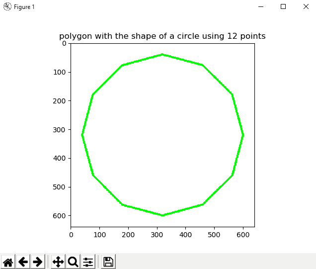

# 答案

# 第一章

1.  Python 虚拟环境的主要目的是为 Python 项目创建一个隔离的环境。 这意味着每个项目都可以具有自己的依赖关系，而不管每个其他项目都具有什么依赖关系。 换句话说，它是 Python 的一个隔离工作副本，使您可以在特定项目上工作而不必担心影响其他项目。
2.  `pip`，`virtualenv`，`pipenv`，Anaconda 和`conda`之间的连接如下：

*   `pip`：Python 包管理器：
    *   PyPA 推荐的用于安装 Python 包的工具
    *   您可以使用 PyPI 查找和发布 Python 包：[Python 包
        索引](https://pypi.python.org/pypi)
*   `pyenv`：Python 版本管理器：
    *   pyenv 让您轻松在多个版本的 Python 之间切换
    *   如果您需要使用其他版本的 Python，`pyenv`可让您轻松管理
*   `virtualenv`：Python 环境管理器：
    *   `virtualenv`是用于创建隔离的 Python 环境的工具
    *   要创建`virtualenv`，只需调用`virtualenv ENV`，其中`ENV`是用于放置新虚拟环境的目录
    *   要初始化`virtualenv`，您需要获取`ENV/bin/activate`
    *   要停止使用`virtualenv`，只需致电`deactivate`
    *   激活`virtualenv`后，您可以通过运行``pip install -r requirements.txt`` 安装工作区的所有包要求。
*   `anaconda`：包管理器，环境管理器和其他科学库：
    *   Anaconda 包括易于安装的 Python，并更新了 100 多个经过预先构建和测试的科学和分析 Python 包，其中包括 NumPy，Pandas，SciPy，Matplotlib 和 IPython，还可以通过简单的`conda install <packagename>`提供 620 多个包。
    *   `conda`是 Anaconda 发行版中包含的开源包管理系统和环境
        管理系统（提供虚拟环境功能）。 因此，您可以使用`conda`创建虚拟环境。
    *   尽管`conda`允许您安装包，但是这些包与 PyPI 包是分开的，因此根据您需要安装的包的类型，您可能仍需要额外使用`pip`。

3.  笔记本文档是 Jupyter 笔记本应用生成的文档，其中包含计算机代码和富文本元素。 由于代码和文本元素的这种混合，笔记本是将分析描述及其结果结合在一起的理想场所。 此外，可以执行它们以实时执行数据分析。 Jupyter 笔记本 App 是一个服务器客户端应用，它允许通过 Web 浏览器编辑和运行笔记本文档。 Jupyter 是一个缩写，代表它设计的三种语言（Julia，Python 和 R）。它属于 Anaconda 发行版。

4.  要使用图像，需要的主要包如下：Numpy，opencv，scikit-image，PIL，Pillow，SimpleCV，Mahotas 和 ilastik。 此外，要解决机器学习问题，您还可以使用 Pandas，Scikit-learn，Orange，PyBrain 或 Milk。 最后，如果您的计算机视觉项目涉及深度学习技术，则还可以使用 TensorFlow，Pytorch，Theano 或 Keras。

5.  要根据本地目录中的`requirements.txt`文件使用`pip`安装包，我们应执行`pip install -r requirements.txt`安装此文件中包含的所有包。 您还可以先创建一个虚拟环境，然后安装所有必需的包：

*   `cd`到`requirements.txt`所在的目录
*   激活您的`virtualenv`
*   运行`pip install -r requirements.txt`

6.  **集成开发环境**（**IDE**）是一种软件应用，为计算机程序员提供用于软件开发的全面功能。 IDE 通常包括源代码编辑器，构建自动化工具和调试器。 大多数现代 IDE 具有智能的代码完成功能。 Python IDE 是开始使用 Python 编程的第一件事。 您可以在基本的文本编辑器（如记事本）中开始使用 Python 编程，但是最好使用完整且功能丰富的 Python IDE。

PyCharm 是专业的 Python IDE，有两种形式：

*   **专业**：用于 Python 和 Web 开发的全功能 IDE（免费试用）
*   **社区**：用于 Python 和科学开发的轻量级 IDE（免费，开源）

它的大多数功能都以社区形式提供，包括智能代码完成，直观的项目导航，即时错误检查和修复，带有 PEP8 检查和智能重构的代码质量，图形调试器和测试运行程序。 它还与 IPython 笔记本集成，并支持 Anaconda 以及其他科学包，例如 Matplotlib 和 NumPy。

7.  OpenCV 是在 BSD 许可下发布的。 因此，[它对于商业和学术用途都是免费的](https://www.opencv.org/license.html)。 BSD 许可证可以分为三种类型：

*   两条款 BSD 许可证
*   三条款 BSD 许可证
*   四条款 BSD 许可证

OpenCV 使用三节 BSD 许可证。 所有这些子句列出如下：

```py
Redistribution and use in source and binary forms, with or without modification, are permitted provided that the following conditions are met:
```

```py

(1) Redistributions of source code must retain the above copyright notice, this list of conditions and the following disclaimer.
```

```py
(2) Redistributions in binary form must reproduce the above copyright notice, this list of conditions and the following disclaimer in the documentation and/or other materials
provided with the distribution.
```

```py
(3) Neither the name of the [organization] nor the names of its contributors may be used to endorse or promote products derived from this software without specific prior written permission.
```

```py
(4) All advertising materials mentioning features or use of this software must display the following acknowledgement: This product includes software developed by the [organization].
```

# 第二章

1.  共有三个图像处理步骤：

    1.  获取必要的信息以供使用（例如，图像或视频文件等）
    2.  通过应用图像处理技术处理图像
    3.  以所需的方式显示结果（例如，将图像保存到磁盘，显示图像等等）
2.  处理步骤可以分为三个处理级别：

    1.  低级处理
    2.  中级处理
    3.  高级处理

3.  灰度图像包含图像的每个像素的值，该值与图像的亮度或灰度级成正比。 此值也称为强度或灰度级。 该值是属于`[0, L-1]`，其中`L = 256`（对于 8 位图像）。

另一方面，黑白图像为图像的每个像素包含一个只能取两个值的值。 通常，这些值为 0（黑色）和 255（白色）。 在许多情况下，黑白图像是某些图像处理步骤和技术的结果（例如，阈值运算的结果）。

4.  数字图像是 2D 图像表示形式的有限数字值集，称为像素。 像素是数字图像中可编程颜色的基本单位。

图像分辨率可以看作是图像的细节。 分辨率为`800×1200`的图像是具有 800 列和 1200 行的网格，包含`800×1200 = 960,000`像素。

5.  OpenCV 执行以下操作：

*   加载（读取）图像：`cv2.imread()`：
    *   `img = cv2.imread('logo.png')`
    *   `gray_img = cv2.imread('logo.png', cv2.IMREAD_GRAYSCALE)`
*   显示图像：`cv2.imshow()`：
    *   `cv2.imshow('bgr image', img )`
*   等待按键：`cv2.waitKey()`：
    *   `cv2.waitKey(0)`
*   拆分通道：`cv2.split()`：
    *   `b, g, r = cv2.split(img)`
*   合并通道：`cv2.merge()`：
    *   `img = cv2.merge([r, g, b])`

6.  `$ jupyter notebook`。

7.  将获得以下颜色：

*   （`B = 0, G = 255, R = 255`）：黄色
*   （`B = 255, G = 255, R = 0`）：青色
*   （`B = 255, G = 0, R = 255`）：洋红色
*   （`B = 255, G = 255, R = 255`）：白色

您可以在[这个页面](https://www.rapidtables.com/web/color/RGB_Color.html)上进一步使用 RGB 颜色图表。

8.  图像是彩色还是灰度均可通过其尺寸（`img.shape`）确定。 如本章所述，如果加载了彩色图像，则`img.shape`的长度将为`3`。 另一方面，如果加载的图像是灰度图像，则`img.shape`的长度将为`2`。 该代码如下所示：

```py
# load OpenCV logo image:
img = cv2.imread('logo.png')

# Get the shape of the image:
dimensions = img.shape

# Check the length of dimensions
if len(dimensions) < 3:
 print("grayscale image!")
if len(dimensions) == 3:
 print("color image!")

# Load the same image but in grayscale:
gray_img = cv2.imread('logo.png', cv2.IMREAD_GRAYSCALE)

# Get again the img.shape properties:
dimensions = gray_img.shape

# Check the length of dimensions
if len(dimensions) < 3:
print("grayscale image!")
if len(dimensions) == 3:
print("color image!")
```

# 第三章

1.  列表的第二个元素是脚本的第一个参数，即`sys.argv[1]`。
2.  代码如下：

```py
parser = argparse.ArgumentParser()
parser.add_argument("first_number", help="first number to be added", type=int)
```

3.  保存图像的代码如下：

```py
cv2.imwrite("image.png", img)
```

4.  `capture`对象的创建如下：

```py
capture = cv2.VideoCapture(0)
```

5.  `capture`对象的创建如下：

```py
capture = cv2.VideoCapture(0)
print("CV_CAP_PROP_FRAME_WIDTH: '{}'".format(capture.get(cv2.CAP_PROP_FRAME_WIDTH)))
```

6.  读取图像的代码如下：

```py
image = cv2.imread("logo.png")
cv2.imwrite("logo_copy.png", gray_image)
```

7.  脚本编写如下：

```py
"""
Example to introduce how to read a video file backwards and save it
"""

# Import the required packages
import cv2
import argparse

def decode_fourcc(fourcc):
"""Decodes the fourcc value to get the four chars identifying it

"""
fourcc_int = int(fourcc)

# We print the int value of fourcc
print("int value of fourcc: '{}'".format(fourcc_int))

# We can also perform this in one line:
# return "".join([chr((fourcc_int >> 8 * i) & 0xFF) for i in range(4)])

fourcc_decode = ""
for i in range(4):
int_value = fourcc_int >> 8 * i & 0xFF
print("int_value: '{}'".format(int_value))
fourcc_decode += chr(int_value)
return fourcc_decode

# We first create the ArgumentParser object
# The created object 'parser' will have the necessary information
# to parse the command-line arguments into data types.
parser = argparse.ArgumentParser()

# We add 'video_path' argument using add_argument() including a help.
parser.add_argument("video_path", help="path to the video file")

# We add 'output_video_path' argument using add_argument() including a help.
parser.add_argument("output_video_path", help="path to the video file to write")

args = parser.parse_args()

# Create a VideoCapture object and read from input file
# If the input is the camera, pass 0 instead of the video file name
capture = cv2.VideoCapture(args.video_path)

# Get some properties of VideoCapture (frame width, frame height and frames per second (fps)):
frame_width = capture.get(cv2.CAP_PROP_FRAME_WIDTH)
frame_height = capture.get(cv2.CAP_PROP_FRAME_HEIGHT)
fps = capture.get(cv2.CAP_PROP_FPS)
codec = decode_fourcc(capture.get(cv2.CAP_PROP_FOURCC))

print("codec: '{}'".format(codec))

# FourCC is a 4-byte code used to specify the video codec and it is platform dependent!
fourcc = cv2.VideoWriter_fourcc(*codec)

# Create VideoWriter object. We use the same properties as the input camera.
# Last argument is False to write the video in grayscale. True otherwise (write the video in color)
out = cv2.VideoWriter(args.output_video_path, fourcc, int(fps), (int(frame_width), int(frame_height)), True)

# Check if camera opened successfully
if capture.isOpened()is False:
print("Error opening video stream or file")

# We get the index of the last frame of the video file
frame_index = capture.get(cv2.CAP_PROP_FRAME_COUNT) - 1
# print("starting in frame: '{}'".format(frame_index))

# Read until video is completed
while capture.isOpened() and frame_index >= 0:

# We set the current frame position
capture.set(cv2.CAP_PROP_POS_FRAMES, frame_index)

# Capture frame-by-frame from the video file:
ret, frame = capture.read()

if ret is True:

# Print current frame number per iteration
# print("CAP_PROP_POS_FRAMES : '{}'".format(capture.get(cv2.CAP_PROP_POS_FRAMES)))

# Get the timestamp of the current frame in milliseconds
# print("CAP_PROP_POS_MSEC : '{}'".format(capture.get(cv2.CAP_PROP_POS_MSEC)))

# Display the resulting frame
cv2.imshow('Original frame', frame)

# Write the frame to the video
out.write(frame)

# Convert the frame to grayscale:
gray_frame = cv2.cvtColor(frame, cv2.COLOR_BGR2GRAY)

# Display the grayscale frame
cv2.imshow('Grayscale frame', gray_frame)

frame_index = frame_index - 1
# print("next index to read: '{}'".format(frame_index))

# Press q on keyboard to exit the program:
if cv2.waitKey(25) & 0xFF == ord('q'):
break
# Break the loop
else:
break

# Release everything:
capture.release()
out.release()
cv2.destroyAllWindows()
```

# 第四章

1.  参数厚度可以取正值和负值。 如果该值为正，则表示轮廓的粗细。 负值（例如`-1`）表示将绘制填充形状。 例如，要绘制填充的椭圆，请注意以下几点：

```py
cv2.ellipse(image, (80, 80), (60, 40), 0, 0, 360, colors['red'], -1)
```

您也可以使用`cv2.FILLED`：

```py
cv2.ellipse(image, (80, 80), (60, 40), 0, 0, 360, colors['red'], cv2.FILLED)
```

2.  `lineType`参数可以采用三个值（`cv2.LINE_4 == 4`，`cv2.LINE_AA == 16`和`cv2.LINE_8 == 8`）。 要绘制抗锯齿线，必须使用`cv2.LINE_AA`：

```py
cv2.line(image, (0, 0), (20, 20), colors['red'], 1, cv2.LINE_AA)
```

3.  对角线是在以下代码的帮助下创建的：

```py
cv2.line(image, (0, 0), (512, 512), colors['green'], 3)
```

4.  文本展示如下：

```py
cv2.putText(image, 'Hello OpenCV', (10, 30), cv2.FONT_HERSHEY_SIMPLEX, 0.9, colors['red'], 2, cv2.LINE_4)
```

5.  此练习的代码对应于`circle_polygon.py`脚本。 要获取坐标，可以使用圆的参数方程式（请参见`analog_clock_values.py`）。 下图显示了此多边形：



`circle_polygon.py`文件的代码如下：

```py
"""
Example to show how to draw a circle polygon
"""

# Import required packages:
import cv2
import numpy as np
import matplotlib.pyplot as plt

def show_with_matplotlib(img, title):
    """Shows an image using matplotlib capabilities

    """
    # Convert BGR image to RGB
    img_RGB = img[:, :, ::-1]

    # Show the image using matplotlib:
    plt.imshow(img_RGB)
    plt.title(title)
    plt.show()

# Dictionary containing some colors
colors = {'blue': (255, 0, 0), 'green': (0, 255, 0), 'red': (0, 0, 255), 'yellow': (0, 255, 255),
          'magenta': (255, 0, 255), 'cyan': (255, 255, 0), 'white': (255, 255, 255), 'black': (0, 0, 0),
          'gray': (125, 125, 125), 'rand': np.random.randint(0, high=256, size=(3,)).tolist(),
          'dark_gray': (50, 50, 50), 'light_gray': (220, 220, 220)}

# We create the canvas to draw: 640 x 640 pixels, 3 channels, uint8 (8-bit unsigned integers)
# We set background to black using np.zeros()
image = np.zeros((640, 640, 3), dtype="uint8")

# If you want another background color you can do the following:
# image[:] = colors['light_gray']
image.fill(255)

pts = np.array(
    [(600, 320), (563, 460), (460, 562), (320, 600), (180, 563), (78, 460), (40, 320), (77, 180), (179, 78), (319, 40),
     (459, 77), (562, 179)])

# Reshape to shape (number_vertex, 1, 2)
pts = pts.reshape((-1, 1, 2))

# Call cv2.polylines() to build the polygon:
cv2.polylines(image, [pts], True, colors['green'], 5)

# Show image:
show_with_matplotlib(image, 'polygon with the shape of a circle using 12 points')
```

6.  该代码对应于`matplotlib_mouse_events_rect.py`脚本。

关键是如何捕获双击鼠标左键：

*   双击：`event.dblclick`
*   左键点击：`event.button == 1`

`matplotlib_mouse_events_rect.py`文件的代码如下：

```py
"""
Example to show how to capture a double left click with matplotlib events to draw a rectangle
"""

# Import required packages:
import cv2
import numpy as np
import matplotlib as mpl
import matplotlib.pyplot as plt

# Dictionary containing some colors
colors = {'blue': (255, 0, 0), 'green': (0, 255, 0), 'red': (0, 0, 255), 'yellow': (0, 255, 255),
          'magenta': (255, 0, 255), 'cyan': (255, 255, 0), 'white': (255, 255, 255), 'black': (0, 0, 0),
          'gray': (125, 125, 125), 'rand': np.random.randint(0, high=256, size=(3,)).tolist(),
          'dark_gray': (50, 50, 50), 'light_gray': (220, 220, 220)}

# We create the canvas to draw: 400 x 400 pixels, 3 channels, uint8 (8-bit unsigned integers)
# We set the background to black using np.zeros()
image = np.zeros((400, 400, 3), dtype="uint8")

# If you want another background color you can do the following:
image[:] = colors['light_gray']

def update_img_with_matplotlib():
    """Updates an image using matplotlib capabilities

    """
    # Convert BGR to RGB image format
    img_RGB = image[:, :, ::-1]

    # Display the image:
    plt.imshow(img_RGB)

    # Redraw the Figure because the image has been updated:
    figure.canvas.draw()

# We define the event listener for the 'button_press_event':
def click_mouse_event(event):
    # Check if a double left click is performed:
    if event.dblclick and event.button == 1:
        # (event.xdata, event.ydata) contains the float coordinates of the mouse click event:
        cv2.rectangle(image, (int(round(event.xdata)), int(round(event.ydata))),
                      (int(round(event.xdata)) + 100, int(round(event.ydata)) + 50), colors['blue'], cv2.FILLED)
    # Call 'update_image()' method to update the Figure:
    update_img_with_matplotlib()

# We create the Figure:
figure = plt.figure()
figure.add_subplot(111)

# To show the image until a click is performed:
update_img_with_matplotlib()

# 'button_press_event' is a MouseEvent where a mouse botton is click (pressed)
# When this event happens the function 'click_mouse_event' is called:
figure.canvas.mpl_connect('button_press_event', click_mouse_event)

# Display the figure:
plt.show()
```

7.  该代码对应于`meme_generator_opencv_python.py`脚本。 这是一个简单的脚本，在其中加载图像，然后渲染一些文本：

```py
"""
Example to show how to draw basic memes with OpenCV
"""

# Import required packages:
import cv2
import numpy as np
import matplotlib.pyplot as plt

def show_with_matplotlib(img, title):
    """Shows an image using matplotlib capabilities

    """
    # Convert BGR image to RGB
    img_RGB = img[:, :, ::-1]

    # Show the image using matplotlib:
    plt.imshow(img_RGB)
    plt.title(title)
    plt.show()

# Dictionary containing some colors
colors = {'blue': (255, 0, 0), 'green': (0, 255, 0), 'red': (0, 0, 255), 'yellow': (0, 255, 255),
          'magenta': (255, 0, 255), 'cyan': (255, 255, 0), 'white': (255, 255, 255), 'black': (0, 0, 0),
          'gray': (125, 125, 125), 'rand': np.random.randint(0, high=256, size=(3,)).tolist(),
          'dark_gray': (50, 50, 50), 'light_gray': (220, 220, 220)}

# We load the image 'lenna.png':
image = cv2.imread("lenna.png")

# Write some text (up)
cv2.putText(image, 'Hello World', (10, 30), cv2.FONT_HERSHEY_TRIPLEX, 0.8, colors['green'], 1, cv2.LINE_AA)

# Write some text (down)
cv2.putText(image, 'Goodbye World', (10, 200), cv2.FONT_HERSHEY_TRIPLEX, 0.8, colors['red'], 1, cv2.LINE_AA)

# Show image:
show_with_matplotlib(image, 'very basic meme generator')
```

# 第五章

1.  `cv2.split()`函数将源多通道图像分割为几个单通道图像
    `(b, g, r) = cv2.split(image)`。
2.  `cv2.merge()`函数将几个单通道图像合并为一个多通道图像`image = cv2.merge((b, g, r))`。
3.  图像可以平移如下：

```py
height, width = image.shape[:2]
M = np.float32([[1, 0, 150], [0, 1, 300]])
dst_image = cv2.warpAffine(image, M, (width, height))
```

4.  可以按以下方式旋转图像：

```py
height, width = image.shape[:2]
M = cv2.getRotationMatrix2D((width / 2.0, height / 2.0), 30, 1)
dst_image = cv2.warpAffine(image, M, (width, height))
```

5.  该图像可以如下构建：

```py
kernel = np.ones((5, 5), np.float32) / 25
smooth_image = cv2.filter2D(image, -1, kernel)
```

6.  灰度图像如下：

```py
M = np.ones(image.shape, dtype="uint8") * 40
added_image = cv2.add(image, M)
```

7.  `COLORMAP_JET`可以如下应用：`img_COLORMAP_JET = cv2.applyColorMap(gray_img, cv2.COLORMAP_JET)`

# 第六章

1.  图像直方图是一种反映图像色调分布的直方图。 它绘制每个色调值的频率（像素数）（通常在[`0-255`]范围内）。
2.  在 OpenCV 中，我们使用`cv2.calcHist()`函数来计算图像的直方图。 要使用`64`位计算灰度图像的直方图，代码如下：

```py
 hist = cv2.calcHist([gray_image], [0], None, [64], [0, 256])
```

3.  我们首先构建具有与灰度图像`gray_image`相同形状的图像`M`，然后为该图像的每个像素设置`50`值。 然后，我们使用`cv2.add()`添加两个图像。 最后，使用`cv2.calcHist()`计算直方图：

```py
M = np.ones(gray_image.shape, dtype="uint8") * 50
 added_image = cv2.add(gray_image, M)
 hist_added_image = cv2.calcHist([added_image], [0], None, [256], [0, 256])
```

4.  在 BGR 图像中，红色通道是第三通道（`index 2`）：

```py
cv2.calcHist([img], [2], None, [256], [0, 256])
```

5.  OpenCV 提供`cv2.calcHist()`，numpy 提供`np.histogram()`，而 matplotlib 提供`plt.hist()`。 如本章所述，`cv2.calcHist()`比`np.histogram()`和`plt.hist()`都快。
6.  我们定义了一个函数`get_brightness()`，该函数计算给定灰度图像的亮度。 此函数使用 numpy 函数`np.mean()`，该函数返回数组元素的平均值。 因此，此函数的代码如下：

```py
def get_brightness(img):
 """Calculates the brightness of the image"""

 brightness = np.mean(img)
 return brightness
```

我们已经计算了三个图像的亮度：

```py
brightness_1 = get_brightness(gray_image)
brightness_2 = get_brightness(added_image)
brightness_3 = get_brightness(subtracted_image)
```

该示例的完整代码可以在`grayscale_histogram_brightness.py`脚本中看到。

7.  首先，我们必须导入`default_timer`：

```py
from timeit import default_timer as timer
```

然后，我们必须测量两个函数的执行时间：

```py
start = timer()
gray_image_eq = cv2.equalizeHist(gray_image)
end = timer()
exec_time_equalizeHist = (end - start) * 1000

start = timer()
gray_image_clahe = clahe.apply(gray_image)
end = timer()
exec_time_CLAHE = (end - start) * 1000
```

该示例的完整代码可以在`comparing_hist_equalization_clahe_time.py.`脚本中看到。

# 第七章

1.  `ret, thresh = cv2.threshold(gray_image, 100, 255, cv2.THRESH_BINARY)`
2.  `thresh = cv2.adaptiveThreshold(gray_image, 255, cv2.ADAPTIVE_THRESH_GAUSSIAN_C, cv2.THRESH_BINARY, 9, 2)`
3.  `ret, th = cv2.threshold(gray_image, 0, 255, cv2.THRESH_BINARY + cv2.THRESH_OTSU)`
4.  `ret, th = cv2.threshold(gray_image, 0, 255, cv2.THRESH_BINARY + cv2.THRESH_TRIANGLE)`
5.  使用 scikit-image 的大津阈值可应用如下：

```py
thresh = threshold_otsu(gray_image)
binary = gray_image > thresh
binary = img_as_ubyte(binary)
```

请记住，`threshold_otsu(gray_image)`函数基于大津的二值化算法返回阈值。 然后，使用此值构造二进制图像（`dtype= bool`），应将其转换为 8 位无符号整数格式（`dtype= uint8`）以进行适当的可视化。 `img_as_ubyte()`函数用于此目的。

6.  可以使用 scikit-image 进行三角形阈值处理：

```py
thresh_triangle = threshold_triangle(gray_image)
binary_triangle = gray_image > thresh_triangle
binary_triangle = img_as_ubyte(binary_triangle)
```

7.  Niblack 使用 scikit-image 的阈值可按以下方式应用：

```py
thresh_niblack = threshold_niblack(gray_image, window_size=25, k=0.8)
binary_niblack = gray_image > thresh_niblack
binary_niblack = img_as_ubyte(binary_niblack)
```

该算法最初是为文本识别而设计的。 有关更多详细信息，请参见出版物《数字图像处理入门》（1986）。

8.  使用 Scikit-image 和`25`窗口大小的 Sauvola 阈值可按以下方式应用：

```py
thresh_sauvola = threshold_sauvola(gray_image, window_size=25)
binary_sauvola = gray_image > thresh_sauvola
binary_sauvola = img_as_ubyte(binary_sauvola)
```

值得注意两个要点：

*   Sauvola 是 Niblack 技术的改良版
*   该算法最初是为文本识别而设计的

有关更多详细信息，请参见出版物《自适应文档图像二值化》（2000）。

9.  为了获得带有阈值图像的值的数组，我们使用`np.arange()`。 由于我们需要一个带有`10`步骤的`[60-130]`范围内的值的数组，因此以下行对此功能进行了编码：

```py
threshold_values = np.arange(start=60, stop=140, step=10)
```

之后，我们反复应用`cv2.threshold()`函数和`threshold_values`中定义的相应阈值：

```py
thresholded_images = []
for threshold in threshold_values:
    ret, thresh = cv2.threshold(gray_image, threshold, 255, cv2.THRESH_BINARY)
    thresholded_images.append(thresh)
```

最后，我们显示`thresholded_images`数组中包含的阈值图像。 完整的代码可以在`thresholding_example_arange.py`脚本中看到。

# 第八章

1.  `cv2.findContours()`函数在二进制图像（例如，阈值运算后得到的图像）中找到轮廓。
2.  OpenCV 提供的用于压缩轮廓的四个标志如下：

*   `cv2.CHAIN_APPROX_NONE`
*   `cv2.CHAIN_APPROX_SIMPLE`
*   `cv2.CHAIN_APPROX_TC89_KCOS`
*   ``cv2.CHAIN_APPROX_TC89_L1``

3.  `cv2.moments()`函数计算直到多边形或栅格化形状的三阶的所有矩。
4.  矩`m00`给出轮廓的面积。
5.  OpenCV 提供`cv2.HuMoments()`函数来计算七个胡矩不变量。
6.  `cv2.approxPolyDP()`函数根据给定的精度返回给定轮廓的轮廓近似值。 此函数使用 Douglas-Peucker 算法。 `epsilon`参数指定用于在原始曲线与其近似之间建立最大距离的精度。
7.  可以以更紧凑的方式覆盖`contour_functionality.py`脚本中定义的`extreme_points()`函数，如下所示：

```py
 def extreme_points_2(contour):
    """Returns extreme points of the contour"""

    extreme_left = tuple(contour[contour[:, :, 0].argmin()][0])
    extreme_right = tuple(contour[contour[:, :, 0].argmax()][0])
    extreme_top = tuple(contour[contour[:, :, 1].argmin()][0])
    extreme_bottom = tuple(contour[contour[:, :, 1].argmax()][0])

    return extreme_left, extreme_right, extreme_top, extreme_bottom
```

8.  OpenCV 提供`cv2.matchShapes()`函数，可使用三种比较方法来比较两个轮廓。 所有这些方法都使用胡矩不变量。 三种实现的方法是`cv2.CONTOURS_MATCH_I1`，`cv2.CONTOURS_MATCH_I2`和`cv.CONTOURS_MATCH_I3`。

# 第九章

1.  带有 ORB 的已加载图像`image`中的关键点和计算描述符如下：

```py
orb = cv2.ORB()
keypoints = orb.detect(image, None)
keypoints, descriptors = orb.compute(image, keypoints)
```

2.  先前检测到的关键点`keypoints`如下：

```py
image_keypoints = cv2.drawKeypoints(image, keypoints, None, color=(255, 0, 255), flags=0)
```

要绘制检测到的关键点，请使用`cv2.drawKeypoints()`函数。

3.  `BFMatcher`对象和先前已计算的描述符，描述符`_1`和描述符`_2`的匹配如下创建：

```py
bf_matcher = cv2.BFMatcher(cv2.NORM_HAMMING, crossCheck=True)
bf_matches = bf_matcher.match(descriptors_1, descriptors_2)
```

4.  之前已进行匹配的前 20 个匹配如下：

```py
bf_matches = sorted(bf_matches, key=lambda x: x.distance)
result = cv2.drawMatches(image_query, keypoints_1, image_scene, keypoints_2, bf_matches[:20], None, matchColor=(255, 255, 0), singlePointColor=(255, 0, 255), flags=0)
```

要绘制计算出的匹配项，请使用`cv2.drawMatches()`。

5.  在图像`gray_frame`中使用 ArUco 进行标记的检测如下：

```py
corners, ids, rejected_corners = cv2.aruco.detectMarkers(gray_frame, aruco_dictionary, parameters=parameters)
```

要检测标记，请使用`cv2.aruco.detectMarkers()`函数。

6.  使用 ArUco 时检测到的标记如下：

```py
frame = cv2.aruco.drawDetectedMarkers(image=frame, corners=corners, ids=ids, borderColor=(0, 255, 0))
```

要绘制标记，请使用`cv2.aruco.drawDetectedMarkers()`函数。

7.  使用 Aruco 时被拒绝的标记如下：

```py

frame = cv2.aruco.drawDetectedMarkers(image=frame, corners=rejected_corners, borderColor=(0, 0, 255))
```

要绘制标记，还可以使用`cv2.aruco.drawDetectedMarkers()`函数。

8.  使用以下代码检测并解码图像中包含的 QR 代码：

```py
 data, bbox, rectified_qr_code = qr_code_detector.detectAndDecode(image)
```

# 第十章

1.  在机器学习的上下文中，主要有三种方法和技术：有监督，无监督和半监督机器学习。
2.  监督学习问题可以进一步分为回归和分类问题。 当输出变量为类别时，将发生分类问题；而当输出变量为实值时，将出现回归问题。 例如，如果我们预测某些地区会下雨的可能性，并分配两个标签（降雨/不下雨），这就是分类问题。 另一方面，如果我们模型的输出是与降雨相关的概率，则这是一个回归问题。
3.  OpenCV 提供`cv2.kmeans()`函数，实现了 K 均值聚类算法，该算法查找聚类的中心并对聚类周围的输入样本进行分组。 K 均值是可用于无监督学习的最重要的聚类算法之一。
4.  `cv2.ml.KNearest_create()`方法创建一个空的 KNN 分类器，应使用`train()`方法对其进行训练，同时提供数据和标签。
5.  `cv2.findNearest()`方法用于查找邻居。
6.  要创建空模型，请使用`cv2.ml.SVM_create()`函数。
7.  通常，RBF 内核是合理的首选。 RBF 内核将样本非线性地映射到更高维度的空间中，因此，与线性核不同，RBF 内核可以处理类标签和属性之间的关系为非线性的情况。 有关更多详细信息，请参见《支持向量分类的实用指南》（2003）。

# 第十一章

1.  我们已经看到了四个库和包：OpenCV 库，还有[`dlib`主页](http://dlib.net/python/index.html)和 [PyPI `dlib`主页](https://pypi.org/project/dlib/)，[Github `dlib`主页](https://github.com/davisking/dlib)，[PyPI `face_recognition`主页](https://pypi.org/project/face_recognition/)，[Github `face_recognition`主页](https://github.com/ageitgey/face_recognition)和[PyPI `cvlib`主页](https://pypi.org/project/cvlib/)，[Github `cvlib`主页](https://github.com/arunponnusamy/cvlib)，[`cvlib`主页](https://www.cvlib.net/) Python 包。
2.  人脸识别是对象识别的一种特殊情况，其中可以使用从人脸提取的信息从图像或视频中识别或验证人的身份，可以分解为人脸识别和人脸验证：

*   **人脸验证**是一个 1:1 匹配的问题，试图回答以下问题：“这是所要求的人吗？” 例如，使用面部解锁手机就是面部验证的一个示例。
*   **人脸识别**是一个 1:N 匹配问题，试图回答以下问题：“这个人是谁？” 例如，可以在办公大楼中安装面部识别系统，以识别所有雇员进入办公室时的身份。

3.  `cv2.face.getFacesHAAR()`函数可用于检测图像中的人脸：

```py
retval, faces = cv2.face.getFacesHAAR(img, "haarcascade_frontalface_alt2.xml")
```

此处，`img`是 BGR 图像，`"haarcascade_frontalface_alt2.xml"`是 Haar 级联文件的字符串变量。

4.  `cv2.dnn.blobFromImage()`函数用于根据输入图像创建一个四维 BLOB。 可选地，此功能执行预处理，这是将 BLOB 输入网络以获得正确结果所必需的。 下一章将更深入地介绍此功能。
5.  `cv.detect_face()`函数可用于使用`cvlib`检测面部：

```py
import cvlib as cv
faces, confidences = cv.detect_face(image)
```

在后台，[此功能将 OpenCV DNN 面部检测器与经过预训练的 Caffe 模型一起使用](https://github.com/arunponnusamy/cvlib/blob/master/cvlib/face_detection.py)。 有关更多详细信息，请参见`face_detection_cvlib_dnn.py`脚本。

6.  要检测地标，应调用`face_recognition.face_landmarks()`函数：

```py
face_landmarks_list_68 = face_recognition.face_landmarks(rgb)
```

此函数为图像中的每个脸部返回人脸标志（例如，眼睛，鼻子等）的字典。 应当注意，`face_recognition`包适用于 RGB 图像。

7.  要初始化相关跟踪器，应调用`dlib.correlation_tracker()`函数：

```py
tracker = dlib.correlation_tracker()
```

这将使用默认值初始化跟踪器。

8.  要开始跟踪，请使用`tracker.start_track()`方法，并且需要包含要跟踪的对象的边界框：

```py
tracker.start_track(image, rect)
```

在此，`rect`是要跟踪的对象的边界框。

9.  要获取被跟踪对象的位置，请调用`tracker.get_position()`方法：

```py
pos = tracker.get_position()
```

此方法返回被跟踪对象的位置。

10.  使用 Dlib 执行 BGR 图像`image`的人脸识别的 128D 描述符的计算如下：

```py
# Convert image from BGR (OpenCV format) to RGB (dlib format):
rgb = image[:, :, ::-1]
# Calculate the encodings for every face of the image:
encodings = face_encodings(rgb)
# Show the first encoding:
print(encodings[0])
```

# 第十二章

1.  机器学习和深度学习之间的三个主要区别如下：

*   深度学习算法需要具有高端基础架构才能正确训练。 深度学习技术严重依赖高端机器，这与可以在低端机器上运行的传统机器学习技术相反。
*   当对功能自省和工程都缺乏领域的了解时，深度学习技术会胜过其他技术，因为您不必担心功能工程。
*   机器学习和深度学习都能够处理海量数据集，但是在处理小型数据集时，机器学习方法更有意义。 经验法则是，如果数据量很大，则深度学习要胜过其他技术，而当数据集较小时，传统的机器学习算法更可取。

2.  关于计算机视觉，Alex Krizhevsky，Ilya Sutskever 和 Geoff Hinton 发表了《使用深度卷积神经网络的 ImageNet 分类》（2012）。 该出版物也称为 **AlexNet** ，这是作者设计的卷积神经网络的名称，被认为是计算机视觉中最具影响力的论文之一。 因此，2012 年被认为是深度学习的爆炸式增长。
3.  此函数从图像创建一个四维 BLOB，这意味着我们要在调整大小为`300x300`的`BGR`图像上运行模型，并对每个蓝色，绿色和红色通道应用均值`(104, 117, 123)`的均值减法 ， 分别。
4.  第一行将输入的 BLOB 馈送到网络，而第二行执行推理，当推理完成时，我们得到了预测。
5.  占位符只是一个变量，稍后我们将为其分配数据。 在训练/测试算法时，通常使用占位符将训练/测试数据输入到计算图中。

6.  保存最终模型（例如`saver.save(sess, './linear_regression')`）时，将创建四个文件：

*   `.meta`文件：包含 TensorFlow 图
*   `.data`文件：包含权重，偏差，渐变以及所有其他已保存变量的值
*   `.index`文件：确定检查点
*   `checkpoint`文件：记录保存的最新检查点文件

7.  **单热编码**意味着标签已从单个数字转换为长度等于可能的类数的向量。 这样，除`i`元素（其值将为 1）之外，向量的所有元素都将设置为零，对应于类别`i`。
8.  使用 Keras 时，最简单的模型类型是顺序模型，可以将其视为线性的层堆叠，并在本示例中用于创建模型。 此外，对于更复杂的架构，可以使用 Keras 功能 API，该 API 允许您构建任意的层图。
9.  此方法可用于训练模型以获取固定数量的纪元（数据集上的迭代）。

# 第十三章

1.  Web 框架可以分为全栈和非全栈框架。 [Django](https://www.djangoproject.com/) 是用于 Python 的全栈 Web 框架，而 [Flask](http://flask.pocoo.org/) 是 Python 的非全栈框架。
2.  在 Flask 中，您可以使用`route()`装饰器将功能绑定到 URL。 换句话说，`route()`装饰器用于向 Flask 指示应触发特定功能的 URL。
3.  为了使服务器可以公开，在运行服务器应用时应添加`host=0.0.0.0`参数：

```py
if __name__ == "__main__":
    # Add parameter host='0.0.0.0' to run on your machines IP address:
    app.run(host='0.0.0.0')
```

4.  `jsonify()`函数用于创建具有`application/json` mimetype 的给定参数的 JSON 表示形式。 JSON 被认为是信息交换的事实上的标准，因此，将 JSON 数据返回给客户端是一个好主意。
5.  我们可以通过用`errorhandler()`装饰函数来注册错误处理程序。 例如，请注意以下几点：

```py
@app.errorhandler(500)
def not_found(e):
    # return also the code error
    return jsonify({"status": "internal error", "message": "internal error occurred in server"}), 500

```

如果服务器中发生内部错误，将为客户端提供`500`错误代码。

6.  [Keras 应用](https://keras.io/applications/) 是 Keras 深度学习库的应用模块，它为许多流行的架构（例如 VGG16，ResNet50，Xception 和 MobileNet 等），可用于预测，特征提取和微调。 这些深度学习架构在 [ImageNet 数据集](http://image-net.org/)上进行了培训和验证，用于将图像分类为`1000`类别或类别之一。
7.  [PythonAnywhere](http://www.pythonanywhere.com) 是 Python 在线集成开发环境（IDE）和 Web 托管环境，可轻松在云中创建和运行 Python 程序。