# 将几何变换应用于图像

在本章中，我们将学习如何将冷酷的几何效果应用于图像。 在开始之前，我们需要安装 OpenCV-Python。 我们将解释如何编译和安装必要的库，以遵循本书中的每个示例。

在本章结束时，您将了解：

*   如何安装 OpenCV-Python
*   如何阅读，显示和保存图像
*   如何转换为多个色彩空间
*   如何应用几何变换，例如平移，旋转，
    和缩放
*   如何使用仿射和投影变换将有趣的几何效果应用于照片

# 安装 OpenCV-Python

在本节中，我们说明如何在多个平台上使用 Python 2.7 安装 OpenCV3.X。 如果需要，OpenCV 3.X 还支持使用 Python 3.X，它将与本书中的示例完全兼容。 建议使用 Linux，因为本书中的示例已在该 OS 上进行了测试。

# 视窗

为了启动并运行 OpenCV-Python，我们需要执行以下步骤：

1.  **安装 Python** ：确保您的计算机上安装了 Python2.7.x。 如果没有它，[则可以从以下位置进行安装](https://www.python.org/downloads/windows/)。
2.  **安装 NumPy** ：NumPy 是使用 Python 进行数值计算的出色软件包。 它非常强大，并具有多种功能。 OpenCV-Python 与 NumPy 配合良好，在本书中我们将大量使用此软件包。 [您可以从以下位置安装最新版本](http://sourceforge.net/projects/numpy/files/NumPy/)。

我们需要将所有这些软件包安装在它们的默认位置。 安装 Python 和 NumPy 之后，我们需要确保它们能正常工作。 打开 Python shell 并输入以下内容：

```py
 >>> import numpy 
```

如果安装顺利，则不会出现任何错误。 确认后，[您可以继续从以下位置下载最新的 OpenCV 版本](http://opencv.org/downloads.html)。

下载完成后，双击以安装它。 我们需要进行一些更改，如下所示：

1.  导航到`opencv/build/python/2.7/`。
2.  您将看到一个名为`cv2.pyd`的文件。 将此文件复制到`C:/Python27/lib/site-packages`。

你们都准备好了！ 让我们确保 OpenCV 正常运行。 打开 Python shell 并输入以下内容：

```py
 >>> import cv2
```

如果您没有看到任何错误，那就很好了！ 现在您可以使用 OpenCV-Python 了。

# macOS X

要安装 OpenCV-Python，我们将使用 Homebrew。 Homebrew 是 macOS X 的出色软件包管理器，当您在 macOS X 上安装各种库和实用程序时，它会派上用场。如果没有 Homebrew，则可以通过在终端中运行以下命令来安装它：

```py
$ ruby -e "$(curl -fsSL
https://raw.githubusercontent.com/Homebrew/install/master/install)"

```

即使 OS X 带有内置的 Python，我们也需要使用 Homebrew 安装 Python 以使我们的生活更轻松。 这个版本称为 Brewed Python。 安装 Homebrew 之后，下一步就是安装酿造的 Python。 打开终端，然后键入以下内容：

```py
$ brew install python
```

这也将自动安装。 Pip 是一个软件包管理工具，用于在 Python 中安装软件包，我们将使用它来安装其他软件包。 让我们确保酿造的 Python 正常工作。 转到终端并输入以下内容：

```py
$ which python 
```

您应该会在终端上看到`/usr/local/bin/python`。 这意味着我们正在使用酿造的 Python，而不是内置的系统 Python。 现在，我们已经安装了酝酿的 Python，我们可以继续添加存储库`homebrew/science`，它是 OpenCV 所在的位置。 打开终端并运行以下命令：

```py
$ brew tap homebrew/science 
```

确保已安装 NumPy 软件包。 如果没有，请在终端中运行以下命令：

```py
$ pip install numpy

```

现在，我们准备安装 OpenCV。 继续并从终端运行以下命令：

```py
$ brew install opencv --with-tbb --with-opengl

```

现在已在您的计算机上安装了 OpenCV，您可以在`/usr/local/Cellar/opencv/3.1.0/` *上找到它。* 您暂时无法使用它。 我们需要告诉 Python 在哪里可以找到我们的 OpenCV 软件包。 让我们通过符号链接 OpenCV 文件来做到这一点。 从终端运行以下命令（请仔细检查您实际上使用的是正确版本，因为它们可能略有不同）：

```py
$ cd /Library/Python/2.7/site-packages/
$ ln -s /usr/local/Cellar/opencv/3.1.0/lib/python2.7/site-packages/cv.py
cv.py
$ ln -s /usr/local/Cellar/opencv/3.1.0/lib/python2.7/site-packages/cv2.so
cv2.so

```

你们都准备好了！ 让我们看看它是否正确安装。 打开 Python shell 并输入以下内容：

```py
 > import cv2 
```

如果安装顺利，您将看不到任何错误消息。 现在您可以在 Python 中使用 OpenCV 了。

如果要在虚拟环境中使用 OpenCV，可以遵循*虚拟环境*部分中的说明，对 macOS X 的每个命令进行少量更改。

# Linux（对于 Ubuntu）

首先，我们需要安装操作系统要求：

```py
[compiler] $ sudo apt-get install build-essential
[required] $ sudo apt-get install cmake git libgtk2.0-dev pkg-config 
 libavcodec-dev libavformat-dev libswscale-dev git 
 libgstreamer0.10-dev libv4l-dev
[optional] $ sudo apt-get install python-dev python-numpy libtbb2 
 libtbb-dev libjpeg-dev libpng-dev libtiff-dev libjasper-dev 
 libdc1394-22-dev

```

安装完操作系统要求后，我们需要下载并编译最新版本的 OpenCV 以及几个受支持的标志，以使我们能够实现以下代码示例。 在这里，我们将安装版本 3.3.0：

```py
$ mkdir ~/opencv
$ git clone -b 3.3.0 https://github.com/opencv/opencv.git opencv
$ cd opencv
$ git clone https://github.com/opencv/opencv_contrib.git opencv_contrib
$ mkdir release
$ cd release
$ cmake -D CMAKE_BUILD_TYPE=RELEASE -D CMAKE_INSTALL_PREFIX=/usr/local  -D INSTALL_PYTHON_EXAMPLES=ON   -D INSTALL_C_EXAMPLES=OFF -D OPENCV_EXTRA_MODULES_PATH=~/opencv/opencv_contrib/modules -D BUILD_PYTHON_SUPPORT=ON -D WITH_XINE=ON -D WITH_OPENGL=ON -D WITH_TBB=ON -D WITH_EIGEN=ON -D BUILD_EXAMPLES=ON -D BUILD_NEW_PYTHON_SUPPORT=ON -D WITH_V4L=ON -D BUILD_EXAMPLES=ON ../
$ make -j4 ; echo 'Running in 4 jobs'
$ sudo make install
```

如果您使用的是 Python 3，则将`-D` +标志放在一起，如以下命令所示：

```py
cmake -DCMAKE_BUILD_TYPE=RELEASE....
```

# 虚拟环境

如果您使用虚拟环境使测试环境与操作系统的其余部分完全分开，[则可以按照以下教程安装名为 **virtualenvwrapper** 的工具](https://virtualenvwrapper.readthedocs.io/en/latest/)。

要使 OpenCV 在此 **virtualenv** 上运行，我们需要安装 NumPy 软件包：

```py
$(virtual_env) pip install numpy
```

按照前面的所有步骤，只需在`cmake`的编译中添加以下三个标志（请注意，正在重新定义标志`CMAKE_INSTALL_PREFIX`）：

```py
$(<env_name>) > cmake ...
-D CMAKE_INSTALL_PREFIX=~/.virtualenvs/<env_name> \ 
-D PYTHON_EXECUTABLE=~/.virtualenvs/<env_name>/bin/python 
-D PYTHON_PACKAGES_PATH=~/.virtualenvs/<env_name>/lib/python<version>/site-packages ...
```

确保安装正确。 打开 Python shell 并输入以下内容：

```py
> import cv2
```

如果没有看到任何错误，那就很好了。

# 故障排除

如果找不到`cv2`库，请标识该库的编译位置。 它应该位于`/usr/local/lib/python2.7/site-packages/cv2.so`处。 如果是这种情况，请确保您的 Python 版本与已存储的一个软件包匹配，否则只需将其移至 Python 的`site-packages`文件夹中，包括 virtualenvs 的文件夹即可。

在执行`cmake`命令期间，尝试加入`-DMAKE` ...和其余`-D`行。 此外，如果在编译过程中执行失败，则操作系统初始要求中可能缺少某些库。 确保已全部安装。

[您可以在以下网站上找到有关如何在 Linux 上安装最新版本的 OpenCV 的官方教程](http://docs.opencv.org/trunk/d7/d9f/tutorial_linux_install.html)。

如果您尝试使用 Python 3 进行编译，并且未安装`cv2.so`，请确保已安装操作系统依赖性 Python 3 和 NumPy。

# OpenCV 文档

OpenCV 的官方文档位于[这个页面](http://docs.opencv.org/)。 共有三个文档类别：Doxygen，Sphinx 和 Javadoc。

为了更好地理解如何使用本书中使用的每个功能，我们建议您打开其中一个文档页面，并研究示例中使用的每种 OpenCV 库方法的不同用法。 作为建议，Doxygen 文档提供了有关 OpenCV 使用的更准确和扩展的信息。

# 读取，显示和保存图像

让我们看看如何在 OpenCV-Python 中加载图像。 创建一个名为`first_program.py`的文件，然后在您喜欢的代码编辑器中将其打开。 在当前文件夹中创建一个名为`images`的文件夹，并确保该文件夹中有一个名为`input.jpg`的图像。

完成后，将以下行添加到该 Python 文件中：

```py
import cv2
img = cv2.imread(img/input.jpg')
```

```py
cv2.imshow('Input image', img)
cv2.waitKey()
```

如果运行上述程序，则会在新窗口中显示图像。

# 刚刚发生了什么？

让我们逐行地理解前面的代码。 在第一行中，我们将导入 OpenCV 库。 对于代码中将要使用的所有功能，我们都需要此功能。 在第二行中，我们正在读取图像并将其存储在变量中。 OpenCV 使用 NumPy 数据结构存储图像。 您可以通过`http://www.numpy.org`了解有关 NumPy 的更多信息。

因此，如果打开 Python shell 并键入以下内容，您将在终端上看到打印的数据类型：

```py
> import cv2
> img = cv2.imread(img/input.jpg')
> type(img)
<type 'numpy.ndarray'> 
```

在下一行中，我们在新窗口中显示图像。 `cv2.imshow`中的第一个参数是窗口的名称。 第二个参数是您要显示的图像。

您一定想知道为什么我们在这里有最后一行。 函数`cv2.waitKey()`在 OpenCV 中用于键盘绑定。 它以数字作为参数，该数字表示时间（以毫秒为单位）。 基本上，我们使用此功能等待指定的持续时间，直到遇到键盘事件为止。 该程序此时停止，并等待您按任意键继续。 如果我们不传递任何参数，或者我们将其作为参数传递，则此函数将无限期地等待键盘事件。

最后一条语句`cv2.waitKey(n)`执行之前步骤中加载的图像的渲染。 它需要一个数字来表示渲染时间（以毫秒为单位）。 基本上，我们使用此功能等待指定的时间，直到遇到键盘事件。 该程序此时停止，并等待您按任意键继续。 如果我们不传递任何参数，或者如果传递 0 作为参数，则此函数将无限期地等待键盘事件。

# 加载和保存图像

OpenCV 提供了多种加载图像的方法。 假设我们要以灰度模式加载彩色图像，可以使用以下代码来实现：

```py
import cv2
gray_img = cv2.imread('images/input.jpg', cv2.IMREAD_GRAYSCALE)
cv2.imshow('Grayscale', gray_img)
cv2.waitKey()
```

在这里，我们将 ImreadFlag 用作`cv2.IMREAD_GRAYSCALE`，并以灰度模式加载图像，尽管您可以在官方文档中找到更多读取模式。

您可以在新窗口中看到显示的图像。 这是输入图像：


以下是相应的灰度图像：

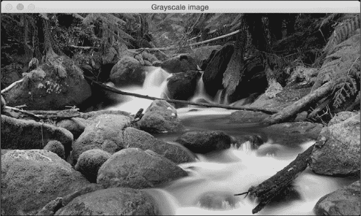

我们也可以将该图像另存为文件：

```py
cv2.imwrite('images/output.jpg', gray_img)
```

这会将灰度图像保存为名为`output.jpg`的输出文件。 确保您对在 OpenCV 中阅读，显示和保存图像感到满意，因为在本书学习过程中我们将做很多事情。

# 更改图像格式

我们也可以将此图像另存为文件，并将原始图像格式更改为 PNG：

```py
import cv2
img = cv2.imread('images/input.jpg')
cv2.imwrite('images/output.png', img, [cv2.IMWRITE_PNG_COMPRESSION])
```

`imwrite()`方法会将灰度图像保存为名为`output.png`的输出文件。 这是在 *ImwriteFlag* 和`cv2.IMWRITE_PNG_COMPRESSION`的帮助下使用 PNG 压缩完成的。 *ImwriteFlag* 允许输出图像更改格式，甚至图像质量。

# 图像色彩空间

在计算机视觉和图像处理中，色彩空间是指组织色彩的特定方式。 颜色空间实际上是颜色模型和映射函数两件事的组合。 我们需要颜色模型的原因是因为它有助于我们使用元组表示像素值。 映射功能将颜色模型映射到可以表示的所有可能颜色的集合。

有许多有用的不同颜色空间。 一些较流行的颜色空间是 RGB，YUV，HSV，Lab 等。 不同的色彩空间提供不同的优势。 我们只需要选择适合给定问题的色彩空间即可。 我们来看几个色彩空间，看看它们提供了什么信息：

*   **RGB** ：可能是最受欢迎的色彩空间。 它代表红色，绿色和蓝色。 在此颜色空间中，每种颜色都表示为红色，绿色和蓝色的加权组合。 因此，每个像素值都表示为三个数字的元组，分别对应于红色，绿色和蓝色。 每个值的范围是 0 到 255。
*   **YUV** ：尽管 RGB 在许多方面都有好处，但对于许多现实生活中的应用而言，RGB 往往非常有限。 人们开始考虑将强度信息与颜色信息分开的不同方法。 因此，他们提出了 YUV 颜色空间。 Y 表示亮度或强度，U / V 通道表示颜色信息。 这在许多应用中效果很好，因为人类视觉系统感知到的强度信息与颜色信息大不相同。
*   **HSV** ：事实证明，即使 YUV 对于某些应用程序仍然不够好。 因此人们开始思考人类如何看待色彩，然后他们想到了 HSV 色彩空间。 HSV 代表色相，饱和度和价值。 这是一个圆柱系统，其中我们将颜色的三个最主要的属性分开，并使用不同的通道表示它们。 这与人类视觉系统如何理解颜色密切相关。 这使我们在处理图像方面具有很大的灵活性。

# 转换色彩空间

考虑到所有颜色空间，OpenCV 中提供了大约 190 个转换选项。 如果要查看所有可用标志的列表，请转到 Python shell 并键入以下内容：

```py
import cv2
print([x for x in dir(cv2) if x.startswith('COLOR_')])
```

您将看到 OpenCV 中可用于从一种颜色空间转换为另一种颜色空间的选项列表。 我们几乎可以将任何颜色空间转换为任何其他颜色空间。 让我们看看如何将彩色图像转换为灰度图像：

```py
import cv2
img = cv2.imread(img/input.jpg', cv2.IMREAD_COLOR)
gray_img = cv2.cvtColor(img, cv2.COLOR_RGB2GRAY)
cv2.imshow('Grayscale image', gray_img)
cv2.waitKey()
```

# 刚刚发生了什么？

我们使用`cvtColor`函数转换色彩空间。 第一个参数是输入图像，第二个参数指定颜色空间转换。

# 分割图像通道

您可以使用以下标志转换为 YUV：

```py
yuv_img = cv2.cvtColor(img, cv2.COLOR_BGR2YUV)
```

该图像将类似于以下内容：


这可能看起来像原始图像的降级版本，但事实并非如此。 让我们分离出三个渠道：

```py
# Alternative 1
y,u,v = cv2.split(yuv_img)
cv2.imshow('Y channel', y)
cv2.imshow('U channel', u)
cv2.imshow('V channel', v)
cv2.waitKey()
```

```py
# Alternative 2 (Faster)
cv2.imshow('Y channel', yuv_img[:, :, 0])
cv2.imshow('U channel', yuv_img[:, :, 1])
cv2.imshow('V channel', yuv_img[:, :, 2])
cv2.waitKey()
```

由于`yuv_img`是 NumPy（提供维选择运算符），因此我们可以通过切片将其分离出来。 如果看`yuv_img.shape`，您会看到它是一个 3D 阵列。 因此，运行前面的代码后，您将看到三个不同的图像。 以下是 Y 频道：


通道基本上是灰度图像。 接下来是 U 频道：


最后，V 频道：

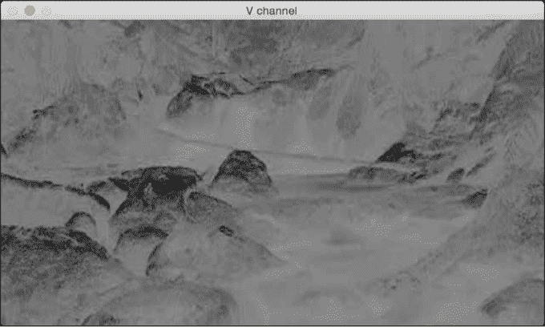

正如我们在这里看到的，通道与灰度图像相同。 它代表强度值，通道代表颜色信息。

# 合并图像通道

现在，我们将读取图像，将其分成单独的通道，然后合并它们，以了解如何从不同的组合中获得不同的效果：

```py
img = cv2.imread(img/input.jpg', cv2.IMREAD_COLOR)
g,b,r = cv2.split(img)
gbr_img = cv2.merge((g,b,r))
rbr_img = cv2.merge((r,b,r))
cv2.imshow('Original', img)
cv2.imshow('GRB', gbr_img)
cv2.imshow('RBR', rbr_img)
cv2.waitKey()
```

在这里，我们可以看到如何重组通道以获得不同的颜色强度：


在此示例中，红色通道使用了两次，因此红色更加强烈：

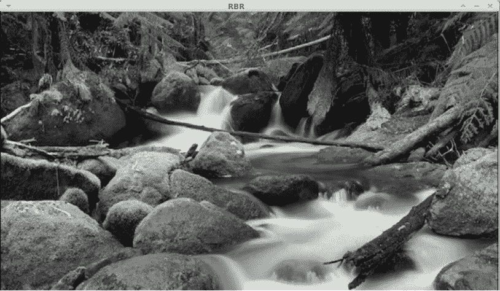

这应该为您提供有关如何在色彩空间之间进行转换的基本概念。 您可以在更多的色彩空间中玩耍，以查看图像的外观。 在随后的章节中，我们将讨论相关的色彩空间以及它们何时出现。

# 图片翻译

在本节中，我们将讨论图像移位。 假设我们要在参照系内移动图像。 在计算机视觉术语中，这称为翻译。 让我们继续前进，看看我们如何做到这一点：

```py
import cv2
import numpy as np
img = cv2.imread('images/input.jpg')
num_rows, num_cols = img.shape[:2]
translation_matrix = np.float32([ [1,0,70], [0,1,110] ])
img_translation = cv2.warpAffine(img, translation_matrix, (num_cols, num_rows), cv2.INTER_LINEAR)
cv2.imshow('Translation', img_translation)
cv2.waitKey()
```

如果运行前面的代码，您将看到类似以下内容：

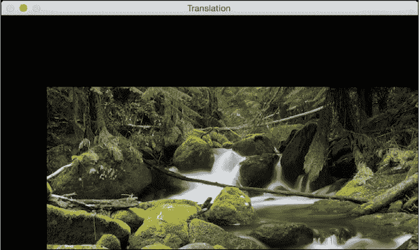

# 刚刚发生了什么？

要了解前面的代码，我们需要了解扭曲的工作原理。 平移基本上意味着我们通过添加/减去`x`和`y`坐标来移动图像。 为此，我们需要创建一个转换矩阵，如下所示：


在此， *t <sub>x</sub>* 和 *t <sub>y</sub>* 值是`x`和`y`翻译价值； 也就是说，图像将向右移动`x`个单位，向下移动`y`个单位。 因此，一旦创建了这样的矩阵，就可以使用函数`warpAffine`将其应用于图像。 `warpAffine`中的第三个参数指的是结果图像中的行数和列数。 如下所示，它通过了`InterpolationFlags`，它定义了插值方法的组合。

由于行数和列数与原始图像相同，因此最终图像将被裁剪。 原因是当我们应用转换矩阵时，输出中没有足够的空间。 为了避免裁剪，我们可以执行以下操作：

```py
img_translation = cv2.warpAffine(img, translation_matrix,
 (num_cols + 70, num_rows + 110))
```

如果将程序中的相应行替换为前一行，则会看到下图：


假设您要将图像移到更大图像帧的中间； 我们可以通过执行以下操作来做到这一点：

```py
import cv2
import numpy as np
img = cv2.imread('images/input.jpg')
num_rows, num_cols = img.shape[:2]
translation_matrix = np.float32([ [1,0,70], [0,1,110] ])
img_translation = cv2.warpAffine(img, translation_matrix, (num_cols + 70, num_rows + 110))
translation_matrix = np.float32([ [1,0,-30], [0,1,-50] ])
img_translation = cv2.warpAffine(img_translation, translation_matrix, (num_cols + 70 + 30, num_rows + 110 + 50))
cv2.imshow('Translation', img_translation)
cv2.waitKey()
```

如果运行前面的代码，您将看到类似以下的图像：

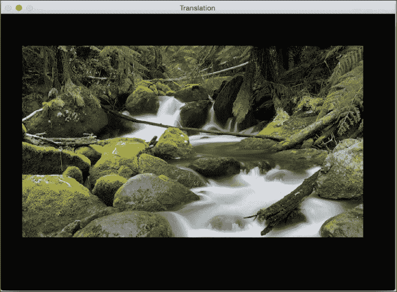

此外，还有另外两个参数`borderMode`和`borderValue`，这些参数使您可以使用像素外推法填充平移的空白边界：

```py
import cv2
import numpy as np
img = cv2.imread(img/input.jpg')
num_rows, num_cols = img.shape[:2]
translation_matrix = np.float32([ [1,0,70], [0,1,110] ])
img_translation = cv2.warpAffine(img, translation_matrix, (num_cols, num_rows), cv2.INTER_LINEAR, cv2.BORDER_WRAP, 1)
cv2.imshow('Translation', img_translation)
cv2.waitKey()
```

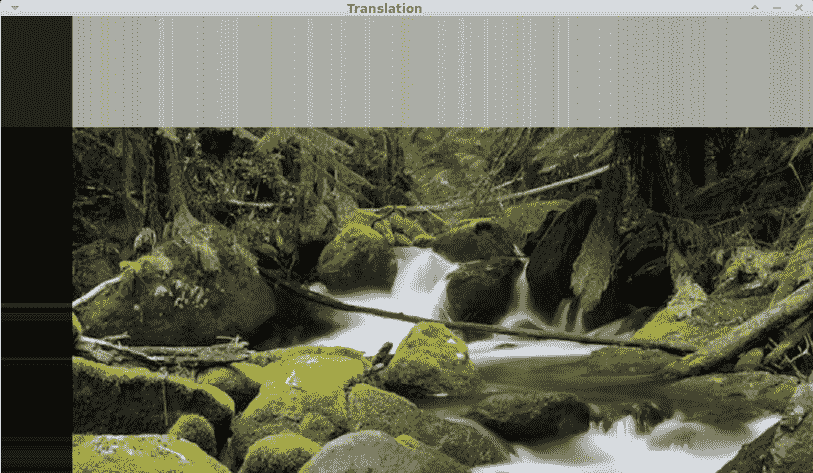

# 影像旋转

在本节中，我们将看到如何将给定图像旋转一定角度。 我们可以使用以下代码来做到这一点：

```py
import cv2
import numpy as np
img = cv2.imread('images/input.jpg')num_rows, num_cols = img.shape[:2]
rotation_matrix = cv2.getRotationMatrix2D((num_cols/2, num_rows/2), 30, 0.7)
img_rotation = cv2.warpAffine(img, rotation_matrix, (num_cols, num_rows))
cv2.imshow('Rotation', img_rotation)
cv2.waitKey()
```

如果运行前面的代码，您将看到如下图像：


# 刚刚发生了什么？

使用`getRotationMatrix2D`，我们可以将图像围绕其旋转的中心点指定为第一个参数，然后指定旋转角度（以度为单位），最后指定图像的缩放比例。 我们使用 0.7 将图像缩小 30％，使其适合框架。

为了理解这一点，让我们看看我们如何数学地处理旋转。 旋转也是一种变换形式，我们可以使用以下变换矩阵来实现：


在此，θ是逆时针方向的旋转角度。 OpenCV 通过`getRotationMatrix2D`功能可以更好地控制此矩阵的创建。 我们可以指定围绕图像旋转的点，旋转角度（以度为单位）和图像的缩放因子。 一旦有了转换矩阵，就可以使用 warpAffine 函数将此矩阵应用于任何图像。

从上图中可以看到，图像内容超出范围并被裁剪。 为了防止这种情况，我们需要在输出图像中提供足够的空间。

让我们继续使用前面讨论的翻译功能：

```py
import cv2
import numpy as np

img = cv2.imread('images/input.jpg')
num_rows, num_cols = img.shape[:2]

translation_matrix = np.float32([ [1,0,int(0.5*num_cols)], [0,1,int(0.5*num_rows)] ])
rotation_matrix = cv2.getRotationMatrix2D((num_cols, num_rows), 30, 1)

img_translation = cv2.warpAffine(img, translation_matrix, (2*num_cols, 2*num_rows))
img_rotation = cv2.warpAffine(img_translation, rotation_matrix, (num_cols*2, num_rows*2))

cv2.imshow('Rotation', img_rotation)
cv2.waitKey()
```

如果运行前面的代码，我们将看到类似以下内容：

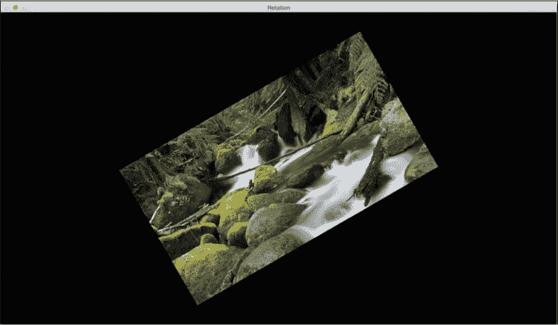

# 图像缩放

在本节中，我们将讨论调整图像的大小。 这是计算机视觉中最常见的操作之一。 我们可以使用缩放因子来调整图像的大小，也可以将其调整为特定的大小。 让我们看看如何做到这一点：

```py
import cv2
img = cv2.imread('images/input.jpg')
img_scaled = cv2.resize(img,None,fx=1.2, fy=1.2, interpolation = cv2.INTER_LINEAR)
cv2.imshow('Scaling - Linear Interpolation', img_scaled)
img_scaled = cv2.resize(img,None,fx=1.2, fy=1.2, interpolation = cv2.INTER_CUBIC)
cv2.imshow('Scaling - Cubic Interpolation', img_scaled)
img_scaled = cv2.resize(img,(450, 400), interpolation = cv2.INTER_AREA)
cv2.imshow('Scaling - Skewed Size', img_scaled)
cv2.waitKey()
```

# 刚刚发生了什么？

每当我们调整图像大小时，都有多种方法可以填充像素值。 放大图像时，需要在像素位置之间填充像素值。 在缩小图像时，我们需要获得最佳的代表价值。 当我们按非整数值缩放时，我们需要适当地插值，以便保持图像的质量。 有多种插值方法。 如果要放大图像，则最好使用线性或三次插值。 如果要缩小图像，则最好使用基于区域的插值。 三次插值在计算上更复杂，因此比线性插值要慢。 但是，最终图像的质量会更高。

OpenCV 提供了一个称为调整大小的功能来实现图像缩放。 如果未指定大小（通过使用`None`），则它将期望`x`和`y`缩放因子。 在我们的示例中，图像将放大 1.2 倍。 如果使用三次插值进行相同的放大，则可以看到质量有所提高，如下图所示。 以下屏幕截图显示了线性插值的形式：

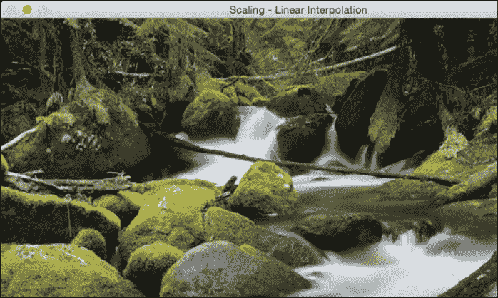

这是对应的三次插值：


如果我们想将其调整为特定大小，可以使用最后一个调整大小实例中显示的格式。 我们基本上可以倾斜图像并将其调整为所需的大小。 输出将类似于以下内容：


# 仿射变换

在本节中，我们将讨论 2D 图像的各种广义几何变换。 在最后两节中，我们已经大量使用了`warpAffine`函数，现在是时候了解下面发生的事情了。

在讨论仿射变换之前，让我们了解什么是欧几里得变换。 欧几里德变换是保留长度和角度量度的一种几何变换。 如果我们采用几何形状并对其进行欧几里德变换，则该形状将保持不变。 它看起来可能旋转，移位等等，但是基本结构不会改变。 因此，从技术上讲，线将保留为线，平面将保留为平面，正方形将保留为正方形，圆形将保留为圆形。

回到仿射变换，可以说它们是欧几里得变换的概括。 在仿射变换的范围内，线将保留为线，但正方形可能会变成矩形或平行四边形。 基本上，仿射变换不会保留长度和角度。

为了构建通用仿射变换矩阵，我们需要定义控制点。 一旦有了这些控制点，就需要确定我们希望将它们映射到何处。 在这种特殊情况下，我们需要的是源图像中的三个点，以及输出图像中的三个点。 让我们看看如何将图像转换为类似平行四边形的图像：

```py
import cv2
import numpy as np
img = cv2.imread('images/input.jpg')
rows, cols = img.shape[:2]
src_points = np.float32([[0,0], [cols-1,0], [0,rows-1]])
dst_points = np.float32([[0,0], [int(0.6*(cols-1)),0], [int(0.4*(cols-1)),rows-1]])
affine_matrix = cv2.getAffineTransform(src_points, dst_points)
img_output = cv2.warpAffine(img, affine_matrix, (cols,rows))
cv2.imshow('Input', img)
cv2.imshow('Output', img_output)
cv2.waitKey()
```

# 刚刚发生了什么？

如前所述，我们正在定义控制点。 我们只需要三个点就可以得到仿射变换矩阵。 我们希望将`src_points`中的三个点映射到`dst_points`中的相应点。 我们正在映射点，如下图所示：

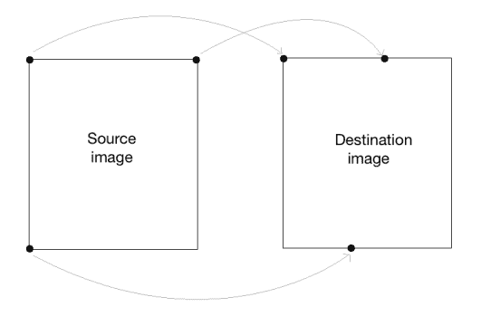

为了获得转换矩阵，我们在 OpenCV 中有一个函数。 有了仿射变换矩阵后，就可以使用该函数将该矩阵应用于输入图像。

以下是输入图像：


如果运行前面的代码，则输出将类似于以下内容：

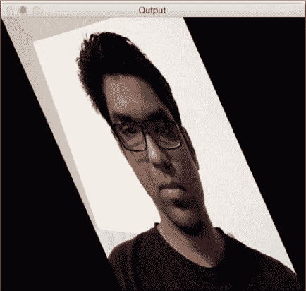

我们还可以获取输入图像的镜像。 我们只需要通过以下方式更改控制点：

```py
src_points = np.float32([[0,0], [cols-1,0], [0,rows-1]])
dst_points = np.float32([[cols-1,0], [0,0], [cols-1,rows-1]])
```

在这里，映射看起来像这样：


如果用这两行替换仿射变换代码中的相应行，则会得到以下结果：


# 投影变换

仿射转换很不错，但是有一定的限制。 另一方面，投射性的转换给了我们更多的自由。 为了理解投影变换，我们需要了解投影几何如何工作。 我们基本上描述了当视角改变时图像会发生什么。 例如，如果您正站在一张纸上画有正方形的前面，它将看起来像一个正方形。

现在，如果您开始倾斜那张纸，则正方形将开始越来越像梯形。 投影变换使我们能够以一种很好的数学方式捕获这种动态。 这些变换既不保留大小也不保留角度，但确实保留了入射和交叉比率。

您可以在[这个页面](http://en.wikipedia.org/wiki/Incidence_(geometry))和[这个页面](http://en.wikipedia.org/wiki/Cross-ratio)上了解更多有关发生率和交叉比率的信息。

现在我们知道了投影变换是什么，让我们看看是否可以在此处提取更多信息。 可以说，给定平面上的任何两个图像都是由单应性相关的。 只要它们在同一平面上，我们就可以将任何东西转换成其他东西。 这具有许多实际应用，例如增强现实，图像校正，图像配准或两个图像之间的相机运动计算。 一旦从估计的单应性矩阵中提取了摄像机的旋转和平移，此信息即可用于导航，或将 3D 对象的模型插入图像或视频。 这样，它们将以正确的透视图进行渲染，看起来它们就像是原始场景的一部分。

让我们继续前进，看看如何做到这一点：

```py
import cv2
import numpy as np
img = cv2.imread('images/input.jpg')
rows, cols = img.shape[:2]
src_points = np.float32([[0,0], [cols-1,0], [0,rows-1], [cols-1,rows-1]])
dst_points = np.float32([[0,0], [cols-1,0], [int(0.33*cols),rows-1], [int(0.66*cols),rows-1]])
projective_matrix = cv2.getPerspectiveTransform(src_points, dst_points)
img_output = cv2.warpPerspective(img, projective_matrix, (cols,rows))
cv2.imshow('Input', img)
cv2.imshow('Output', img_output)
cv2.waitKey()
```

如果运行前面的代码，您将看到有趣的输出，例如以下屏幕截图：

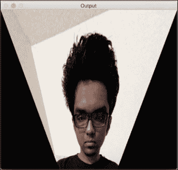

# 刚刚发生了什么？

我们可以在源图像中选择四个控制点，并将它们映射到目标图像。 转换后，平行线将不会保持平行线。 我们使用一个名为`getPerspectiveTransform`的函数来获取变换矩阵。

让我们使用投影变换应用几个有趣的效果，然后看它们的外观。 我们需要做的就是更改控制点以获得不同的效果。

这是一个例子：

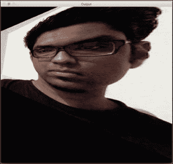

控制点如下：

```py
src_points = np.float32([[0,0], [0,rows-1], [cols/2,0],[cols/2,rows-1]])
dst_points = np.float32([[0,100], [0,rows-101], [cols/2,0],[cols/2,rows-1]])
```

作为练习，您应该在平面上映射前面的点，并查看如何映射这些点（就像我们前面讨论仿射变换时所做的一样）。 您将对映射系统有一个很好的了解，并且可以创建自己的控制点。 如果要在`y`轴上获得相同的效果，可以应用以前的变换。

# 图像变形

让我们对图像有更多的乐趣，看看还能实现什么。 投影变换非常灵活，但是它们仍然对我们如何变换点施加了一些限制。 如果我们想做完全随机的事情怎么办？ 我们需要更多的控制权，对不对？ 碰巧我们也可以做到这一点。 我们只需要创建自己的映射即可，这并不困难。 以下是通过图像变形可以实现的一些效果：


这是创建这些效果的代码：

```py
import cv2 
import numpy as np 
import math 

img = cv2.imread('images/input.jpg', cv2.IMREAD_GRAYSCALE) 
rows, cols = img.shape 

##################### 
# Vertical wave 

img_output = np.zeros(img.shape, dtype=img.dtype) 

for i in range(rows): 
    for j in range(cols): 
        offset_x = int(25.0 * math.sin(2 * 3.14 * i / 180)) 
        offset_y = 0 
        if j+offset_x < rows: 
            img_output[i,j] = img[i,(j+offset_x)%cols] 
        else: 
            img_output[i,j] = 0 

cv2.imshow('Input', img) 
cv2.imshow('Vertical wave', img_output) 

##################### 
# Horizontal wave 

img_output = np.zeros(img.shape, dtype=img.dtype) 

for i in range(rows): 
    for j in range(cols): 
        offset_x = 0 
        offset_y = int(16.0 * math.sin(2 * 3.14 * j / 150)) 
        if i+offset_y < rows: 
            img_output[i,j] = img[(i+offset_y)%rows,j] 
        else: 
            img_output[i,j] = 0 

cv2.imshow('Horizontal wave', img_output) 

##################### 
# Both horizontal and vertical  

img_output = np.zeros(img.shape, dtype=img.dtype) 

for i in range(rows): 
    for j in range(cols): 
        offset_x = int(20.0 * math.sin(2 * 3.14 * i / 150)) 
        offset_y = int(20.0 * math.cos(2 * 3.14 * j / 150)) 
        if i+offset_y < rows and j+offset_x < cols: 
            img_output[i,j] = img[(i+offset_y)%rows,(j+offset_x)%cols] 
        else: 
            img_output[i,j] = 0 

cv2.imshow('Multidirectional wave', img_output) 

##################### 
# Concave effect 

img_output = np.zeros(img.shape, dtype=img.dtype) 

for i in range(rows): 
    for j in range(cols): 
        offset_x = int(128.0 * math.sin(2 * 3.14 * i / (2*cols))) 
        offset_y = 0 
        if j+offset_x < cols: 
            img_output[i,j] = img[i,(j+offset_x)%cols] 
        else: 
            img_output[i,j] = 0 

cv2.imshow('Concave', img_output) 

cv2.waitKey() 
```

# 概要

在本章中，我们学习了如何在各种平台上安装 OpenCV-Python。 我们讨论了如何读取，显示和保存图像。 我们讨论了各种颜色空间的重要性，以及如何将其转换为多个颜色空间，拆分和合并它们。 我们学习了如何将几何变换应用于图像，并了解了如何使用这些变换来实现炫酷的几何效果。 我们讨论了转换矩阵的基本表示形式，以及如何根据需要制定不同类型的转换。 我们学习了如何根据所需的几何变换选择控制点。 我们讨论了投影变换，并学习了如何使用图像变形来实现任何给定的几何效果。

在下一章中，我们将讨论边缘检测和图像过滤。 我们可以使用图像滤镜来应用许多视觉效果，并且底层结构为我们提供了许多以创造性方式操纵图像的自由。