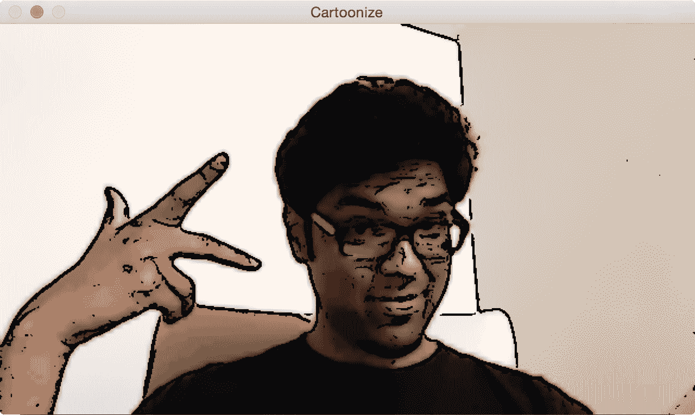
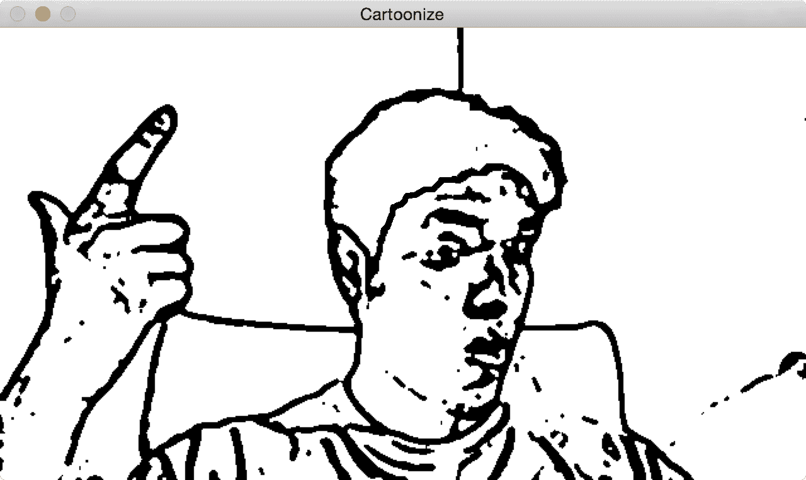
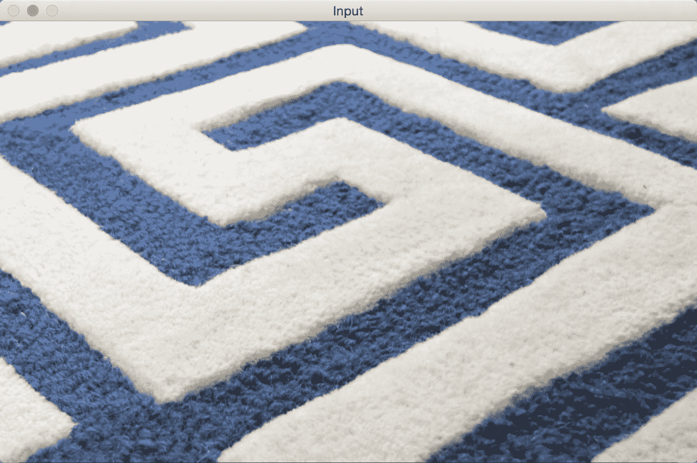
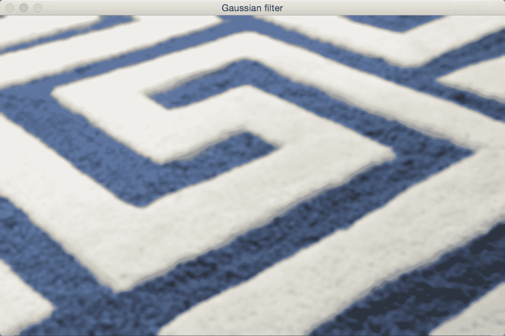
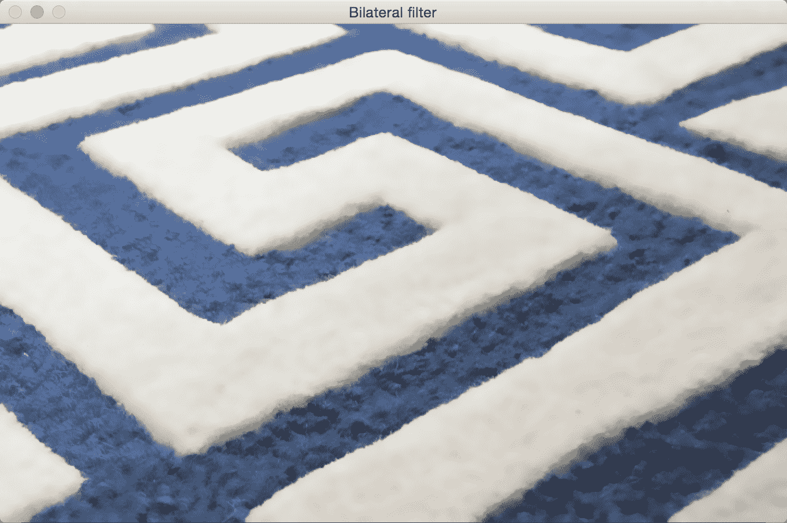

# 卡通化图像

在本章中，我们将学习如何将图像转换为卡通图像。 我们将学习如何在实时视频流中访问网络摄像头并进行键盘/鼠标输入。 我们还将学习一些高级图像过滤器，并了解如何使用它们来对输入视频进行卡通化。

在本章结束时，您将了解：

*   如何访问网络摄像头
*   如何在实时视频流中进行键盘和鼠标输入
*   如何创建一个交互式应用程序
*   如何使用高级图像滤镜
*   如何将图像卡通化

# 访问网络摄像头

我们可以使用网络摄像头的实时视频流构建非常有趣的应用程序。 OpenCV 提供了一个视频捕获对象，该对象可以处理与网络摄像头的打开和关闭有关的所有事情。 我们需要做的就是创建该对象并保持从中读取帧。

以下代码将打开网络摄像机，捕获帧，将它们按比例缩小 2 倍，然后在窗口中显示它们。 您可以按`Esc`键退出：

```py
import cv2 

cap = cv2.VideoCapture(0)

# Check if the webcam is opened correctly 
if not cap.isOpened(): 
    raise IOError("Cannot open webcam") 

while True: 
    ret, frame = cap.read() 
    frame = cv2.resize(frame, None, fx=0.5, fy=0.5, interpolation=cv2.INTER_AREA) 
    cv2.imshow('Input', frame) 

    c = cv2.waitKey(1) 
    if c == 27: 
        break 

cap.release() 
cv2.destroyAllWindows() 
```

# 引擎盖下

如我们在前面的代码中看到的，我们使用 OpenCV 的`VideoCapture`函数创建视频捕获对象上限。 创建完毕后，我们将开始无限循环并不断从网络摄像头读取帧，直到遇到键盘中断为止。

在`while`循环的第一行中，我们有以下行：

```py
ret, frame = cap.read() 
```

此处，`ret`是由`read`函数返回的布尔值，它指示是否成功捕获了帧。 如果正确捕获了帧，则将其存储在变量`frame`中。 该循环将一直运行，直到我们按`Esc`键。 因此，我们继续在以下行中检查键盘中断：

```py
if c == 27: 
```

众所周知，`Esc`的 ASCII 值为 27。一旦遇到它，我们就会中断循环并释放视频捕获对象。 `cap.release()`行很重要，因为它可以正常释放网络摄像头资源，以便其他应用程序可以使用它。

# 扩展捕获选项

在前面讨论的代码中，`cv2.VideoCapture(0)`使用自动检测到的读取器实现定义了默认连接的网络摄像头的使用，但是有多个选项涉及如何从网络摄像头读取图像。

在撰写本书时，版本 **OpenCV 3.3.0** 没有正确的方法列出可用的网络摄像头，因此在运行此代码时连接多个网络摄像头的情况下， 必须增加`VideoCapture` 的索引值，直到使用所需的索引值为止。

如果有多个可用阅读器实现，例如`cv2.CAP_FFMPEG`和`cv2.CAP_IMAGES`，或以`cv2.CAP_*`开头的所有东西，也可以强制实施特定的阅读器。 例如，您可以在网络摄像头索引 1 上使用`QuickTime`阅读器：

```py
cap = cv2.VideoCapture(1 + cv2.CAP_QT) // Webcam index 1 + reader implementation QuickTime
```

# 键盘输入

现在我们知道了如何从网络摄像头捕获实时视频流，让我们看看如何使用键盘与显示视频流的窗口进行交互：

```py
import cv2 

def print_howto(): 
    print("""
        Change color space of the
        input video stream using keyboard controls. The control keys are: 
            1\. Grayscale - press 'g'
            2\. YUV - press 'y'
            3\. HSV - press 'h'
    """)

if __name__=='__main__': 
    print_howto() 
    cap = cv2.VideoCapture(0) 

    # Check if the webcam is opened correctly 
    if not cap.isOpened(): 
        raise IOError("Cannot open webcam") 

    cur_mode = None
    while True: 
        # Read the current frame from webcam 
        ret, frame = cap.read() 

        # Resize the captured image 
        frame = cv2.resize(frame, None, fx=0.5, fy=0.5, interpolation=cv2.INTER_AREA) 

        c = cv2.waitKey(1)
        if c == 27: 
            break 
        # Update cur_mode only in case it is different and key was pressed
        # In case a key was not pressed during the iteration result is -1 or 255, depending
        # on library versions
        if c != -1 and c != 255 and c != cur_mode:
            cur_mode = c 

        if cur_mode == ord('g'): 
            output = cv2.cvtColor(frame, cv2.COLOR_BGR2GRAY) 
        elif cur_mode == ord('y'): 
            output = cv2.cvtColor(frame, cv2.COLOR_BGR2YUV) 
        elif cur_mode == ord('h'): 
            output = cv2.cvtColor(frame, cv2.COLOR_BGR2HSV) 
        else: 
            output = frame 
        cv2.imshow('Webcam', output) 

    cap.release() 
    cv2.destroyAllWindows() 
```

# 与应用程序交互

该程序将显示输入视频流，并等待键盘输入更改色彩空间。 如果运行先前的程序，则将看到一个窗口，显示来自网络摄像头的输入视频流。 如果按`G`，您将看到输入流的色彩空间已转换为灰度。 如果按`Y`，则输入流将转换为 YUV 色彩空间。 同样，如果按`H`，您将看到图像正在转换为 HSV 色彩空间。

众所周知，我们使用功能`waitKey()`来监听键盘事件。 当我们遇到不同的按键时，我们将采取适当的措施。 我们使用功能`ord()`的原因是因为`waitKey()`返回键盘输入的 ASCII 值。 因此，我们需要在检查字符值之前将其转换为 ASCII 形式。

# 鼠标输入

在本节中，我们将看到如何使用鼠标与显示窗口进行交互。 让我们从简单的事情开始。 我们将编写一个程序，该程序将检测检测到鼠标单击的象限。 一旦检测到它，我们将突出显示该象限：

```py
import cv2 
import numpy as np 

def detect_quadrant(event, x, y, flags, param): 
    if event == cv2.EVENT_LBUTTONDOWN: 
        if x > width/2: 
            if y > height/2: 
                point_top_left = (int(width/2), int(height/2)) 
                point_bottom_right = (width-1, height-1) 
            else: 
                point_top_left = (int(width/2), 0) 
                point_bottom_right = (width-1, int(height/2)) 

        else: 
            if y > height/2: 
                point_top_left = (0, int(height/2)) 
                point_bottom_right = (int(width/2), height-1) 
            else: 
                point_top_left = (0, 0) 
                point_bottom_right = (int(width/2), int(height/2)) 

        img = param["img"]
        # Repaint all in white again
        cv2.rectangle(img, (0,0), (width-1,height-1), (255,255,255), -1)
        # Paint green quadrant 
        cv2.rectangle(img, point_top_left, point_bottom_right, (0,100,0), -1) 

if __name__=='__main__': 
    width, height = 640, 480 
    img = 255 * np.ones((height, width, 3), dtype=np.uint8) 
    cv2.namedWindow('Input window') 
    cv2.setMouseCallback('Input window', detect_quadrant, {"img": img}) 

    while True: 
        cv2.imshow('Input window', img) 
        c = cv2.waitKey(1) 
        if c == 27: 
            break 

    cv2.destroyAllWindows()
```

输出将如下图所示：


# 到底发生了什么？

让我们从该程序的主要功能开始。 我们创建一个白色图像，我们将使用鼠标在其上单击。 然后，我们创建一个命名窗口并将`MouseCallback`函数绑定到该窗口。 `MouseCallback`函数基本上是检测到鼠标事件时将调用的函数。 鼠标事件有很多种，例如单击，双击，拖动等等。 在我们的例子中，我们只想检测鼠标单击。 在`detect_quadrant`函数中，我们检查第一个输入参数事件以查看执行了什么操作。 OpenCV 提供了一组预定义的事件，我们可以使用特定的关键字来调用它们。 如果要查看所有鼠标事件的列表，可以转到 Python shell 并键入以下内容：

```py
>>> import cv2 
>>> print([x for x in dir(cv2) if x.startswith('EVENT')])
```

`detect_quadrant`函数中的第二个和第三个参数提供了鼠标单击事件的`X`和`Y`坐标。 一旦知道了这些坐标，就可以很容易地确定其所在的象限。使用此信息，我们就可以继续使用`cv2.rectangle()`绘制具有指定颜色的矩形。 这是一个非常方便的功能，它使用左上角和右下角在具有指定颜色的图像上绘制矩形。

# 与实时视频流互动

让我们看看如何使用鼠标与网络摄像头中的实时视频流进行交互。 我们可以使用鼠标选择一个区域，然后对该区域应用负片效果，如下图所示：


在以下程序中，我们将从网络摄像头捕获视频流，用鼠标选择一个兴趣区域，然后应用此效果：

```py
import cv2 
import numpy as np 

def update_pts(params, x, y):
    global x_init, y_init
    params["top_left_pt"] = (min(x_init, x), min(y_init, y))
    params["bottom_right_pt"] = (max(x_init, x), max(y_init, y))
    img[y_init:y, x_init:x] = 255 - img[y_init:y, x_init:x]

def draw_rectangle(event, x, y, flags, params): 
    global x_init, y_init, drawing
    # First click initialize the init rectangle point 
    if event == cv2.EVENT_LBUTTONDOWN:
        drawing = True 
        x_init, y_init = x, y 
    # Meanwhile mouse button is pressed, update diagonal rectangle point 
    elif event == cv2.EVENT_MOUSEMOVE and drawing:
        update_pts(params, x, y) 
    # Once mouse botton is release
    elif event == cv2.EVENT_LBUTTONUP: 
        drawing = False 
        update_pts(params, x, y) 

if __name__=='__main__': 
    drawing = False 
    event_params = {"top_left_pt": (-1, -1), "bottom_right_pt": (-1, -1)}

    cap = cv2.VideoCapture(0) 

    # Check if the webcam is opened correctly 
    if not cap.isOpened(): 
        raise IOError("Cannot open webcam") 

    cv2.namedWindow('Webcam')
    # Bind draw_rectangle function to every mouse event
    cv2.setMouseCallback('Webcam', draw_rectangle, event_params) 

    while True: 
        ret, frame = cap.read() 
        img = cv2.resize(frame, None, fx=0.5, fy=0.5, interpolation=cv2.INTER_AREA) 
        (x0,y0), (x1,y1) = event_params["top_left_pt"], event_params["bottom_right_pt"]
        img[y0:y1, x0:x1] = 255 - img[y0:y1, x0:x1] 
        cv2.imshow('Webcam', img) 

        c = cv2.waitKey(1) 
        if c == 27: 
            break 

    cap.release() 
    cv2.destroyAllWindows() 
```

如果运行上述程序，则会看到一个显示视频流的窗口。 您可以使用鼠标在窗口上绘制一个矩形，然后您会看到该区域被转换为负片。

# 我们是怎么做的？

正如我们在程序的主要功能中看到的那样，我们初始化了一个视频捕获对象。 然后，在下面的行中将函数`draw_rectangle`与`MouseCallback`函数绑定：

```py
cv2.setMouseCallback('Webcam', draw_rectangle, event_params) 
```

然后，我们开始无限循环并开始捕获视频流。 让我们看看函数`draw_rectangle`中发生了什么； 每当我们使用鼠标绘制矩形时，我们基本上必须检测三种类型的鼠标事件：鼠标单击，鼠标移动和鼠标按钮释放。 这正是我们在此功能中所做的。 每当我们检测到鼠标单击事件时，我们都会初始化矩形的左上角。 当我们移动鼠标时，我们通过将当前位置保持为矩形的右下角来选择兴趣区域，并在通过引用传递的对象作为第三个参数（`event_params`）处对其进行更新。

一旦有了兴趣区域，我们只需反转像素即可应用负片效果。 我们从 255 中减去当前像素值，这给了我们想要的效果。 当鼠标移动停止并且检测到按下按钮事件时，我们将停止更新矩形的右下位置。 我们只是一直显示该图像，直到检测到另一个鼠标单击事件为止。

# 卡通化图像

现在，我们知道了如何处理网络摄像头和键盘/鼠标输入，让我们继续前进，看看如何将图片转换为卡通图像。 我们可以将图像转换为草图或彩色卡通图像。

以下是草图的示例：


如果将卡通化效果应用于彩色图像，它将看起来像下一个图像：



让我们看看如何实现这一目标：

```py
import cv2 
import numpy as np 

def print_howto(): 
    print("""
        Change cartoonizing mode of image:
            1\. Cartoonize without Color - press 's'
            2\. Cartoonize with Color - press 'c'
    """)

def cartoonize_image(img, ksize=5, sketch_mode=False):
    num_repetitions, sigma_color, sigma_space, ds_factor = 10, 5, 7, 4 
    # Convert image to grayscale 
    img_gray = cv2.cvtColor(img, cv2.COLOR_BGR2GRAY) 

    # Apply median filter to the grayscale image 
    img_gray = cv2.medianBlur(img_gray, 7) 

    # Detect edges in the image and threshold it 
    edges = cv2.Laplacian(img_gray, cv2.CV_8U, ksize=ksize) 
    ret, mask = cv2.threshold(edges, 100, 255, cv2.THRESH_BINARY_INV) 

    # 'mask' is the sketch of the image 
    if sketch_mode: 
        return cv2.cvtColor(mask, cv2.COLOR_GRAY2BGR) 

    # Resize the image to a smaller size for faster computation 
    img_small = cv2.resize(img, None, fx=1.0/ds_factor, fy=1.0/ds_factor, interpolation=cv2.INTER_AREA)

    # Apply bilateral filter the image multiple times 
    for i in range(num_repetitions): 
        img_small = cv2.bilateralFilter(img_small, ksize, sigma_color, sigma_space) 

    img_output = cv2.resize(img_small, None, fx=ds_factor, fy=ds_factor, interpolation=cv2.INTER_LINEAR) 

    dst = np.zeros(img_gray.shape) 

    # Add the thick boundary lines to the image using 'AND' operator 
    dst = cv2.bitwise_and(img_output, img_output, mask=mask) 
    return dst 

if __name__=='__main__': 
    print_howto()
    cap = cv2.VideoCapture(0) 

    cur_mode = None
    while True: 
        ret, frame = cap.read() 
        frame = cv2.resize(frame, None, fx=0.5, fy=0.5, interpolation=cv2.INTER_AREA) 

        c = cv2.waitKey(1) 
        if c == 27: 
            break 

        if c != -1 and c != 255 and c != cur_mode: 
            cur_mode = c 

        if cur_mode == ord('s'): 
            cv2.imshow('Cartoonize', cartoonize_image(frame, ksize=5, sketch_mode=True)) 
        elif cur_mode == ord('c'): 
            cv2.imshow('Cartoonize', cartoonize_image(frame, ksize=5, sketch_mode=False)) 
        else: 
            cv2.imshow('Cartoonize', frame) 

    cap.release() 
    cv2.destroyAllWindows()
```

# 解构代码

当您运行上述程序时，您将看到一个窗口，其中包含来自网络摄像头的视频流。 如果按`S`，视频流将变为草图模式，并且您将看到其铅笔状的轮廓。 如果按`C`，您将看到输入流的彩色卡通版。 如果按任何其他键，它将返回到正常模式。

让我们看一下`cartoonize_image`函数，看看我们是如何做到的。 首先，我们将图像转换为灰度图像，然后通过中值滤镜进行处理。 中值过滤器非常擅长去除盐和胡椒粉的噪音。 当您在图像中看到孤立的黑色或白色像素时，就是这种噪声。 它在网络摄像头和移动相机中很常见，因此我们需要将其过滤掉，然后再继续进行。 举个例子，看下面的图片：


正如我们在输入图像中看到的，有很多孤立的绿色像素。 它们降低了图像的质量，我们需要摆脱它们。 这是中值过滤器派上用场的地方。 我们仅查看每个像素周围的`NxN`邻域，然后选择这些数字的中值。 由于在这种情况下，孤立的像素具有较高的值，因此取中间值将摆脱这些值，并使图像平滑。 正如您在输出图像中看到的那样，中值过滤器消除了所有这些孤立的像素，并且图像看起来很干净。 以下是此代码：

```py
import cv2 
import numpy as np 

img = cv2.imread('images/input.jpg') 
output = cv2.medianBlur(img, ksize=7) 
cv2.imshow('Input', img) 
cv2.imshow('Median filter', output) 
cv2.waitKey() 
```

该代码非常简单。 我们仅使用`medianBlur`函数将中值过滤器应用于输入图像。 此函数中的第二个参数指定我们正在使用的内核的大小。 内核的大小与我们需要考虑的邻域大小有关。 您可以试用此参数，并查看它如何影响输出。 请记住，可能的值只是奇数：1、3、5、7，依此类推。

回到`cartoonize_image`，我们继续检测灰度图像上的边缘。 我们需要知道边缘在哪里，以便创建铅笔线效果。 一旦检测到边缘，就对它们进行阈值处理，以使事物在字面上和隐喻上都变成黑白！

在下一步中，我们检查草图模式是否已启用。 如果是这样，那么我们只需将其转换为彩色图像并返回即可。 如果我们希望线变粗怎么办？ 假设我们想看到类似下图的内容：



如您所见，线条比以前更粗。 为此，将`if`代码块替换为以下代码：

```py
if sketch_mode: 
    img_sketch = cv2.cvtColor(mask, cv2.COLOR_GRAY2BGR) 
    kernel = np.ones((3,3), np.uint8) 
    img_eroded = cv2.erode(img_sketch, kernel, iterations=1) 
    return cv2.medianBlur(img_eroded, ksize=5) 
```

我们在这里将`erode`函数与`3x3`内核一起使用。 之所以要使用此选项，是因为它使我们有机会使用线图的粗细。 现在，您可能会问：如果我们要增加某些物体的厚度，我们是否应该使用膨胀？ 好吧，这种推理是正确的，但是这里有一个小小的转折。 请注意，前景为黑色，背景为白色。 侵蚀和膨胀将白色像素视为前景，将黑色像素视为背景。 因此，如果要增加黑色前景的厚度，则需要使用腐蚀。 施加腐蚀后，我们仅使用中值过滤器清除噪声并获得最终输出。

在下一步中，我们将使用双边过滤来平滑图像。 双边滤波是一个有趣的概念，它的性能比高斯过滤器好得多。 关于双边过滤的好处是它可以保留边缘，而高斯过滤器则可以使所有内容均等地平滑。 为了进行比较和对比，让我们看下面的输入图像：



让我们将高斯过滤器应用于上一张图片：



现在，让我们将双边过滤器应用于输入图像：



如您所见，如果使用双边过滤器，质量会更好。 图像看起来很平滑，边缘看起来也很清晰！ 实现此目的的代码如下：

```py
import cv2 
import numpy as np 

img = cv2.imread('images/input.jpg') 

img_gaussian = cv2.GaussianBlur(img, (13,13), 0) # Gaussian Kernel Size 13x13
img_bilateral = cv2.bilateralFilter(img, 13, 70, 50) 

cv2.imshow('Input', img) 
cv2.imshow('Gaussian filter', img_gaussian) 
cv2.imshow('Bilateral filter', img_bilateral) 
cv2.waitKey()
```

如果仔细观察两个输出，可以看到高斯滤波图像的边缘看起来模糊。 通常，我们只想平滑图像中的粗糙区域并保持边缘完整。 这是双边过滤器派上用场的地方。 高斯过滤器仅查看紧邻区域，并使用由`GaussianBlur`方法应用的高斯核对像素值求平均。 双边过滤器通过仅对强度彼此相似的那些像素求平均，将这一概念提升到了一个新的水平。 它还使用颜色邻域度量标准来查看它是否可以替换强度相似的当前像素。 如果您看一下函数调用：

```py
img_small = cv2.bilateralFilter(img_small, size, sigma_color, 
 sigma_space) 
```

这里的最后两个参数指定颜色和空间邻域。 这就是在双边过滤器的输出中边缘看起来清晰的原因。 我们在图像上多次运行此滤镜以使其平滑化，使其看起来像卡通漫画。 然后，我们将铅笔状的遮罩叠加在此彩色图像的顶部，以创建类似卡通的效果。

# 总结

在本章中，我们学习了如何访问网络摄像头。 我们讨论了在实时视频流中如何获取键盘和鼠标输入。 我们使用此知识来创建交互式应用程序。 我们讨论了中值和双边过滤器，并讨论了双边过滤器相对于高斯过滤器的优势。 我们使用所有这些原理将输入图像转换为素描图像，然后将其卡通化。

在下一章中，我们将学习如何在静态图像以及实时视频中检测不同的身体部位。