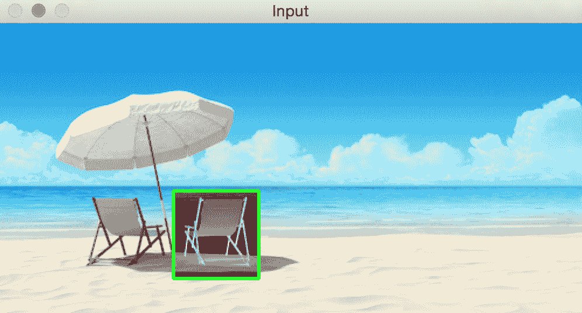
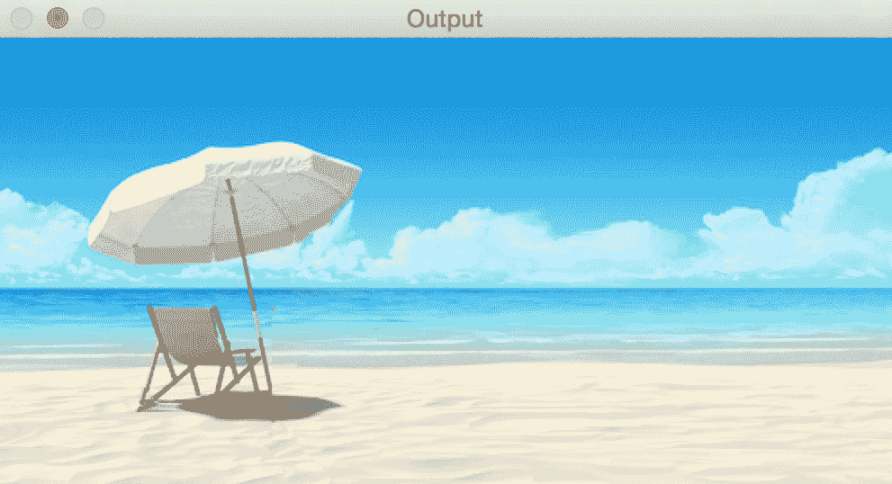

# 接缝雕刻

在本章中，我们将学习有关内容感知的图像大小调整，这也称为**接缝雕刻**。 我们将讨论如何检测图像中*有趣的*部分，以及如何使用该信息调整给定图像的大小而不会降低这些有趣元素的质量。

在本章结束时，您将了解：

*   什么是内容意识
*   如何量化和识别图像中有趣的部分
*   如何使用动态编程进行图像内容分析
*   如何在保持高度不变的情况下增加和减小图像的宽度而又不使感兴趣的区域恶化
*   如何使物体从图像中消失

# 我们为什么要关心接缝雕刻？

在开始有关接缝雕刻的讨论之前，我们需要首先了解为什么需要接缝雕刻。 我们为什么要关心图像内容？ 为什么我们不能只是调整给定的图像大小并继续生活呢？ 好吧，要回答这些问题，让我们考虑下图：


现在，假设我们要减小图像的宽度，同时保持高度不变。 如果我们这样做，它将看起来像这样：


如您所见，图像中的鸭子看起来偏斜，并且图像的整体质量下降。 直观地说，可以说鸭子是图像中有趣的部分。 因此，当我们调整大小时，我们希望鸭子是完整的。 这是缝制雕刻出现的地方。 使用接缝雕刻，我们可以检测到这些有趣的区域，并确保它们不会退化。

# 它是如何工作的？

我们一直在讨论图像调整大小以及调整图像大小时应如何考虑图像的内容。 那么为什么在地球上将其称为接缝雕刻呢？ 它应该只是称为内容感知图像调整大小，对吗？ 嗯，有许多不同的术语可用来描述此过程，例如图像重新定向，液体缩放，接缝雕刻等。 由于我们调整图像大小的方式，因此将其称为“缝缝雕刻”。 该算法由 Shai Avidan 和 Ariel Shamir 提出。 您可以在 [http://dl.acm.org/citation.cfm?id=1276390](http://dl.acm.org/citation.cfm?id=1276390) 上参考原始论文。

我们知道目标是调整给定图像的大小并保持完整有趣的内容。 因此，我们通过找到图像中最不重要的路径来做到这一点。 这些路径称为接缝。 找到这些接缝后，便从图像中删除或拉伸它们以获得重新缩放的图像。 移除，拉伸或雕刻的过程最终将导致图像调整大小。 这就是我们称其为接缝雕刻的原因。 考虑下图：


在上图中，我们可以看到如何将图像大致分为有趣和不有趣的部分。 我们需要确保我们的算法能够检测到这些无关紧要的部分并对其进行处理。 让我们考虑一下鸭子的形象和我们必须处理的约束。 我们要保持高度恒定并减小宽度。 这意味着我们需要在图像中找到垂直接缝并将其删除。 这些接缝从顶部开始，在底部结束（反之亦然）。 如果我们要处理垂直大小调整，则接缝将从左侧开始，到右侧结束。 垂直接缝只是从图像的第一行开始到最后一行结束的一连串相连像素。

# 我们如何定义有趣？

在开始计算接缝之前，我们需要找出用于计算接缝的度量标准。 我们需要一种将*重要性*分配给每个像素的方法，以便我们可以识别出最不重要的路径。 用计算机视觉术语来说，我们需要为每个像素分配一个*能量*值，以便我们找到最小能量的路径。 提出一种分配能量值的好方法非常重要，因为这会影响输出的质量。

我们可以使用的指标之一是每个点的导数值。 这是该社区活动水平的良好指标。 如果有活动，则像素值将快速变化，因此该点的导数值将很高。 另一方面，如果区域平淡无趣，那么像素值将不会迅速变化，因此灰度图像中该点的导数值将很低。

对于每个像素位置，我们通过累加该点的 x 和 y 导数来计算能量。 我们通过获取当前像素与其相邻像素之间的差来计算导数。 回想一下，在使用[第 2 章](../Text/07.html)和*检测边缘并应用图像滤镜*中的 **sobel 滤波器**进行边缘检测时，我们做了类似的操作。 一旦计算出这些值，便将它们存储在称为能量矩阵的矩阵中，该矩阵将用于定义接缝。

# 我们如何计算接缝？

现在我们有了能量矩阵，可以开始计算接缝了。 我们需要找到能量最少的图像路径。 计算所有可能的路径非常昂贵，因此我们需要找到一种更智能的方法来执行此操作。 这是动态编程出现的地方。 实际上，接缝雕刻是动态编程的直接应用。

我们需要从第一行中的每个像素开始，然后找到到达最后一行的方式。 为了找到能量最少的路径，我们计算并存储了到表中每个像素的最佳路径。 一旦我们构建了该表，就可以通过在该表中的行上回溯找到特定像素的路径。

对于当前行中的每个像素，我们计算下一行可以移动到的三个像素位置的能量； 即左下，右下和右下。 我们不断重复此过程，直到到达最低点。 一旦到达最低点，我们就会选择累积值最小的那根，然后回溯到最高点。 这将为我们提供最少的能量。 每次删除接缝时，图像的宽度都会减少一个像素。 因此，我们需要不断移除这些接缝，直到达到所需的图像尺寸为止。

首先，我们将提供一组函数来计算图像中的能量，定位其接缝并绘制它们。 这些功能将与前面的每个代码示例一起使用，并且可以作为库包含在您的任何自定义项中：

```py
# Draw vertical seam on top of the image 
def overlay_vertical_seam(img, seam): 
    img_seam_overlay = np.copy(img)

    # Extract the list of points from the seam 
    x_coords, y_coords = np.transpose([(i,int(j)) for i,j in enumerate(seam)]) 

    # Draw a green line on the image using the list of points 
    img_seam_overlay[x_coords, y_coords] = (0,255,0) 
    return img_seam_overlay

# Compute the energy matrix from the input image 
def compute_energy_matrix(img): 
    gray = cv2.cvtColor(img, cv2.COLOR_BGR2GRAY) 

    # Compute X derivative of the image 
    sobel_x = cv2.Sobel(gray,cv2.CV_64F, 1, 0, ksize=3) 

    # Compute Y derivative of the image 
    sobel_y = cv2.Sobel(gray,cv2.CV_64F, 0, 1, ksize=3) 

    abs_sobel_x = cv2.convertScaleAbs(sobel_x) 
    abs_sobel_y = cv2.convertScaleAbs(sobel_y) 

    # Return weighted summation of the two images i.e. 0.5*X + 0.5*Y 
    return cv2.addWeighted(abs_sobel_x, 0.5, abs_sobel_y, 0.5, 0) 

# Find vertical seam in the input image 
def find_vertical_seam(img, energy): 
    rows, cols = img.shape[:2] 

    # Initialize the seam vector with 0 for each element 
    seam = np.zeros(img.shape[0]) 

    # Initialize distance and edge matrices 
    dist_to = np.zeros(img.shape[:2]) + float('inf')
    dist_to[0,:] = np.zeros(img.shape[1]) 
    edge_to = np.zeros(img.shape[:2]) 

    # Dynamic programming; iterate using double loop and compute the paths efficiently 
    for row in range(rows-1): 
        for col in range(cols): 
            if col != 0 and dist_to[row+1, col-1] > dist_to[row, col] + energy[row+1, col-1]: 
                dist_to[row+1, col-1] = dist_to[row, col] + energy[row+1, col-1]
                edge_to[row+1, col-1] = 1 

            if dist_to[row+1, col] > dist_to[row, col] + energy[row+1, col]: 
                dist_to[row+1, col] = dist_to[row, col] + energy[row+1, col] 
                edge_to[row+1, col] = 0 

            if col != cols-1 and \ 
                dist_to[row+1, col+1] > dist_to[row, col] + energy[row+1, col+1]: 
                    dist_to[row+1, col+1] = dist_to[row, col] + energy[row+1, col+1] 
                    edge_to[row+1, col+1] = -1 

    # Retracing the path 
    # Returns the indices of the minimum values along X axis.
    seam[rows-1] = np.argmin(dist_to[rows-1, :]) 
    for i in (x for x in reversed(range(rows)) if x > 0): 
        seam[i-1] = seam[i] + edge_to[i, int(seam[i])] 

    return seam
```

让我们再次考虑我们的鸭子形象。 如果我们计算前 30 个接缝，它将看起来像这样：


这些绿线表示最不重要的路径。 正如我们在这里看到的那样，它们会小心翼翼地绕过鸭子，以确保不会触碰到有趣的区域。 在图像的上半部分，接缝围绕着树枝缠绕，从而保持了质量。 从技术上讲，树枝也很有趣。 如果我们继续删除前 100 个接缝，它将看起来像这样：


现在，将其与简单调整大小的图像进行比较。 看起来不是更好吗？ 鸭子在这个版本中看起来更好。

让我们看一下代码，看看如何做：

```py
import sys 
import cv2 
import numpy as np 

# Remove the input vertical seam from the image 
def remove_vertical_seam(img, seam): 
    rows, cols = img.shape[:2] 

    # To delete a point, move every point after it one step towards the left 
    for row in range(rows): 
        for col in range(int(seam[row]), cols-1): 
            img[row, col] = img[row, col+1] 

    # Discard the last column to create the final output image 
    img = img[:, 0:cols-1] 
    return img 

if __name__=='__main__': 
    # Make sure the size of the input image is reasonable. 
    # Large images take a lot of time to be processed. 
    # Recommended size is 640x480\. 
    img_input = cv2.imread(sys.argv[1]) 

    # Use a small number to get started. Once you get an 
    # idea of the processing time, you can use a bigger number. 
    # To get started, you can set it to 20\. 
    num_seams = int(sys.argv[2]) 

    img = np.copy(img_input) 
    img_overlay_seam = np.copy(img_input) 
    energy = compute_energy_matrix(img) 

    for i in range(num_seams): 
        seam = find_vertical_seam(img, energy) 
        img_overlay_seam = overlay_vertical_seam(img_overlay_seam, seam) 
        img = remove_vertical_seam(img, seam) 
        energy = compute_energy_matrix(img) 
        print('Number of seams removed = ', i+1) 

    cv2.imshow('Input', img_input) 
    cv2.imshow('Seams', img_overlay_seam) 
    cv2.imshow('Output', img) 
    cv2.waitKey()

```

我们使用`remove_vertical_seam`从原始图像中去除垂直接缝，从而减小了图像的宽度，但保留了有趣的部分。

# 我们可以扩大图像吗？

我们知道，我们可以使用接缝雕刻来减小图像的宽度，而不会降低有趣的区域。 因此，自然地，我们需要问自己是否可以扩展图像而不会破坏有趣的区域。 事实证明，我们可以使用相同的逻辑来做到这一点。 在计算接缝时，我们只需要添加一列而不是删除一列。

如果我们天真地扩大鸭子的形象，它将看起来像这样：


如果我们以更聪明的方式（即通过使用接缝雕刻）来进行操作，它将看起来像这样：


如您所见，图像的宽度增加了，鸭子看起来没有拉长。 以下是执行此操作的代码：

```py
import sys 
import cv2 
import numpy as np 

# Add a vertical seam to the image 
def add_vertical_seam(img, seam, num_iter): 
    seam = seam + num_iter 
    rows, cols = img.shape[:2] 
    zero_col_mat = np.zeros((rows,1,3), dtype=np.uint8) 
    img_extended = np.hstack((img, zero_col_mat)) 

    for row in range(rows): 
        for col in range(cols, int(seam[row]), -1): 
            img_extended[row, col] = img[row, col-1] 

        # To insert a value between two columns, take the average 
        # value of the neighbors. It looks smooth this way and we 
        # can avoid unwanted artifacts. 
        for i in range(3): 
            v1 = img_extended[row, int(seam[row])-1, i] 
            v2 = img_extended[row, int(seam[row])+1, i] 
            img_extended[row, int(seam[row]), i] = (int(v1)+int(v2))/2 

    return img_extended 

if __name__=='__main__': 
    img_input = cv2.imread(sys.argv[1]) 
    num_seams = int(sys.argv[2]) 

    img = np.copy(img_input) 
    img_output = np.copy(img_input) 
    img_overlay_seam = np.copy(img_input) 
    energy = compute_energy_matrix(img) # Same than previous code sample

    for i in range(num_seams): 
        seam = find_vertical_seam(img, energy) # Same than previous code sample
        img_overlay_seam = overlay_vertical_seam(img_overlay_seam, seam)
        img = remove_vertical_seam(img, seam) # Same than previous code sample
        img_output = add_vertical_seam(img_output, seam, i) 
        energy = compute_energy_matrix(img) 
        print('Number of seams added =', i+1)

    cv2.imshow('Input', img_input) 
    cv2.imshow('Seams', img_overlay_seam)
    cv2.imshow('Output', img_output) 
    cv2.waitKey()
```

在这种情况下，我们在代码中添加了一个额外的功能`add_vertical_seam`。 我们使用它来添加垂直接缝，以使图像看起来自然，在不改变*有趣*区域原始比例的情况下，向图像添加接缝以增加其宽度。

# 我们可以完全去除物体吗？

这也许是接缝雕刻最有趣的应用。 我们可以使物体从图像中完全消失。 让我们考虑下图：


封闭要使用鼠标删除的区域：



卸下右侧的椅子后，它将看起来像这样：



好像椅子根本不存在！ 在查看代码之前，重要的是要知道这需要一段时间才能运行。 因此，只需等待几分钟即可了解处理时间。 您可以相应地调整输入图像的尺寸！ 让我们看一下代码：

```py
import sys
import cv2 
import numpy as np 

# Draw rectangle on top of the input image 
def draw_rectangle(event, x, y, flags, params): 
    global x_init, y_init, drawing, top_left_pt, bottom_right_pt, img_orig 

    # Detecting a mouse click 
    if event == cv2.EVENT_LBUTTONDOWN: 
        drawing = True 
        x_init, y_init = x, y 

    # Detecting mouse movement 
    elif event == cv2.EVENT_MOUSEMOVE: 
        if drawing: 
            top_left_pt, bottom_right_pt = (x_init,y_init), (x,y) 
            img[y_init:y, x_init:x] = 255 - img_orig[y_init:y, x_init:x] 
            cv2.rectangle(img, top_left_pt, bottom_right_pt, (0,255,0), 2) 

    # Detecting the mouse button up event 
    elif event == cv2.EVENT_LBUTTONUP: 
        drawing = False 
        top_left_pt, bottom_right_pt = (x_init,y_init), (x,y) 

        # Create the "negative" film effect for the selected 
         # region 
        img[y_init:y, x_init:x] = 255 - img[y_init:y, x_init:x] 

        # Draw rectangle around the selected region 
        cv2.rectangle(img, top_left_pt, bottom_right_pt, (0,255,0), 2) 
        rect_final = (x_init, y_init, x-x_init, y-y_init) 

        # Remove the object in the selected region 
        remove_object(img_orig, rect_final) 

# Computing the energy matrix using modified algorithm 
def compute_energy_matrix_modified(img, rect_roi):
    # Compute weighted summation i.e. 0.5*X + 0.5*Y 
    energy_matrix = compute_energy_matrix(img)
    x,y,w,h = rect_roi 

    # We want the seams to pass through this region, so make sure the energy values in this region are set to 0 
    energy_matrix[y:y+h, x:x+w] = 0 

    return energy_matrix 

# Remove the object from the input region of interest 
def remove_object(img, rect_roi): 
    num_seams = rect_roi[2] + 10 
    energy = compute_energy_matrix_modified(img, rect_roi) 

    # Start a loop and rsemove one seam at a time 
    for i in range(num_seams): 
        # Find the vertical seam that can be removed 
        seam = find_vertical_seam(img, energy) 

        # Remove that vertical seam 
        img = remove_vertical_seam(img, seam) 
        x,y,w,h = rect_roi 

        # Compute energy matrix after removing the seam 
        energy = compute_energy_matrix_modified(img, (x,y,w-i,h)) 
        print('Number of seams removed =', i+1)

    img_output = np.copy(img) 

    # Fill up the region with surrounding values so that the size 
    # of the image remains unchanged 
    for i in range(num_seams): 
        seam = find_vertical_seam(img, energy) 
        img = remove_vertical_seam(img, seam)
        img_output = add_vertical_seam(img_output, seam, i)
        energy = compute_energy_matrix(img) 
        print('Number of seams added =', i+1) 

    cv2.imshow('Input', img_input) 
    cv2.imshow('Output', img_output) 
    cv2.waitKey() 

if __name__=='__main__': 
    img_input = cv2.imread(sys.argv[1])
    drawing = False 
    img = np.copy(img_input) 
    img_orig = np.copy(img_input) 

    cv2.namedWindow('Input') 
    cv2.setMouseCallback('Input', draw_rectangle)
    print('Draw a rectangle with the mouse over the object to be removed')
    while True:
        cv2.imshow('Input', img) 
        c = cv2.waitKey(10) 
        if c == 27: 
            break 

    cv2.destroyAllWindows()
```

# 我们是怎么做的？

这里的基本逻辑保持不变。 我们正在使用接缝雕刻来移除对象。 一旦选择了感兴趣的区域，我们就使所有接缝都穿过该区域。 我们通过在每次迭代后操纵能量矩阵来做到这一点。 我们添加了一个名为`compute_energy_matrix_modified`的新功能来实现此目的。 一旦我们计算了能量矩阵，便将零值分配给该感兴趣区域。 这样，我们强制所有接缝穿过该区域。 删除与该区域相关的所有接缝后，我们将继续添加接缝，直到将图像扩展到其原始宽度为止。

# 概要

在本章中，我们了解了内容感知图像的大小调整。 我们讨论了如何量化图像中有趣和无趣的区域。 我们学习了如何计算图像中的接缝，以及如何使用动态编程有效地进行处理。 我们讨论了如何使用接缝雕刻来减小图像的宽度，以及如何使用相同的逻辑来扩展图像。 我们还学习了如何从图像中完全删除对象。

在下一章中，我们将讨论如何进行形状分析和图像分割。 我们将看到如何使用这些原理来找到图像中感兴趣对象的确切边界。