# 增强现实

在本章中，您将学习增强现实以及如何使用它来构建出色的应用程序。 我们将讨论姿势估计和平面跟踪。 您将学习如何将坐标从 3D 映射到 2D，以及如何在实时视频的顶部叠加图形。

在本章结束时，您将了解：

*   增强现实的前提
*   什么是姿势估计
*   如何追踪平面物体
*   如何将坐标从 3D 映射到 2D
*   如何在视频上实时叠加图形

# 增强现实的前提是什么？

在介绍所有有趣的东西之前，让我们了解增强现实的含义。 您可能已经看到了增强现实一词在各种环境中使用。 因此，在开始讨论实现细节之前，我们应该了解增强现实的前提。 增强现实是指将计算机生成的输入（例如图像，声音，图形和文本）叠加在现实世界之上。

增强现实试图通过无缝地合并信息并增强我们所看到和感觉到的东西来模糊真实的东西和计算机生成的东西之间的界限。 实际上，它与称为中介现实的概念密切相关，在中介中，计算机可以修改我们对现实的看法。 结果，该技术通过增强我们当前对现实的感知而起作用。 现在，这里的挑战是使它对用户看起来无缝。 只需在输入视频的顶部覆盖一些内容即可，但是我们需要使其看起来像是视频的一部分。 用户应该感觉到计算机生成的输入紧密反映了现实世界。 这是我们构建增强现实系统时想要实现的目标。

在这种情况下，计算机视觉研究探索了如何将计算机生成的图像应用于实时视频流，以便我们可以增强对现实世界的感知。 增强现实技术具有广泛的应用，包括但不限于头戴式显示器，汽车，数据可视化，游戏，建筑等。 现在，我们拥有功能强大的智能手机和更智能的机器，我们可以轻松构建高端增强现实应用程序。

# 增强现实系统是什么样的？

让我们考虑下图：


正如我们在此处看到的那样，摄像机会捕获现实世界的视频以获取参考点。 图形系统生成需要覆盖在视频顶部的虚拟对象。 现在，视频合并块是所有魔术发生的地方。 该块应该足够聪明，以了解如何以最佳方式将虚拟对象叠加在现实世界的顶部。

# 增强现实的几何变换

增强现实的结果是惊人的，但是在下面却发生了许多数学事情。 增强现实利用了大量的几何变换和相关的数学函数来确保一切看起来都平滑。 在谈论增强现实的实时视频时，我们需要在现实世界的顶部精确地注册虚拟对象。 为了更好地理解这一点，让我们将其视为两个摄像机的对准：通过它可以看到世界的真实摄像机，以及投射计算机生成的图形对象的虚拟摄像机。

为了构建增强现实系统，需要建立以下几何变换：

*   **对象到场景**：此转换是指转换虚拟对象的 3D 坐标，并在我们真实世界场景的坐标框中表达它们。 这样可以确保我们将虚拟对象放置在正确的位置。
*   **场景到摄像机**：此转换是指现实世界中摄像机的姿势。 通过*姿势*，我们表示摄像机的方向和位置。 我们需要估计摄像机的视点，以便我们知道如何覆盖虚拟对象。
*   **摄像机到图像**：这是指摄像机的校准参数。 这定义了我们如何将 3D 对象投影到 2D 图像平面上。 这是我们最终将实际看到的图像。

考虑下图：


正如我们在这里看到的那样，这辆车正试图适应场景，但看起来非常虚假。 如果我们没有以正确的方式转换坐标，汽车将看起来不自然。 这就是我们所说的对象到场景转换！ 将虚拟对象的 3D 坐标转换为现实世界的坐标框架后，我们需要估算相机的姿态：


我们需要了解相机的位置和旋转，因为这是用户会看到的。 一旦估计了相机的姿势，就可以将 3D 场景放置在 2D 图像上了：


一旦进行了这些转换，就可以构建完整的系统。

# 什么是姿势估计？

在继续之前，我们需要了解如何估算相机的姿势。 这是增强现实系统中非常关键的一步，如果我们想要无缝的体验，我们需要正确处理。 在增强现实世界中，我们实时将图形叠加在对象之上。 为此，我们需要知道相机的位置和方向，并且需要快速进行操作。 这是姿势估计变得非常重要的地方。 如果未正确跟踪姿势，则叠加的图形将看起来不自然。

考虑下图：

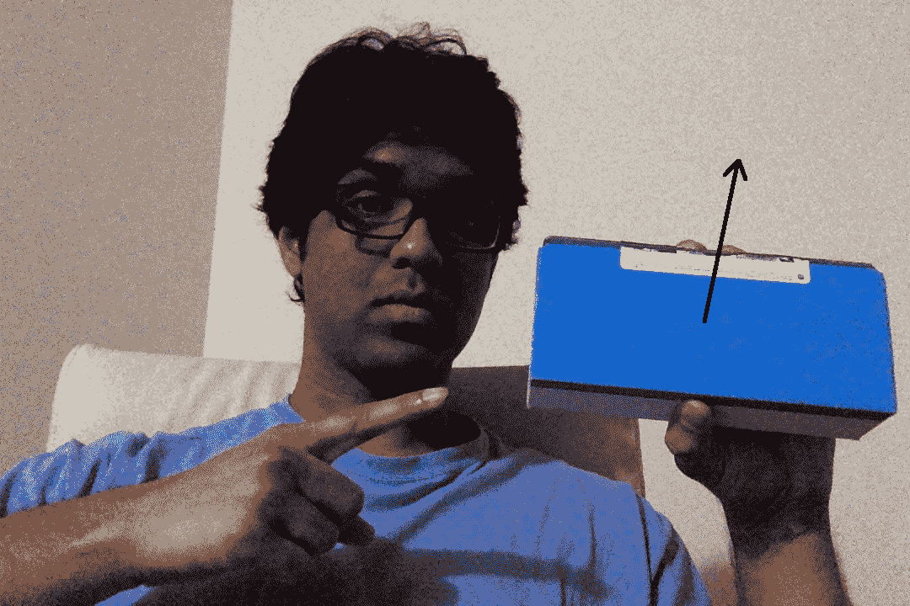

箭头表示表面是法线。 假设对象改变了方向：

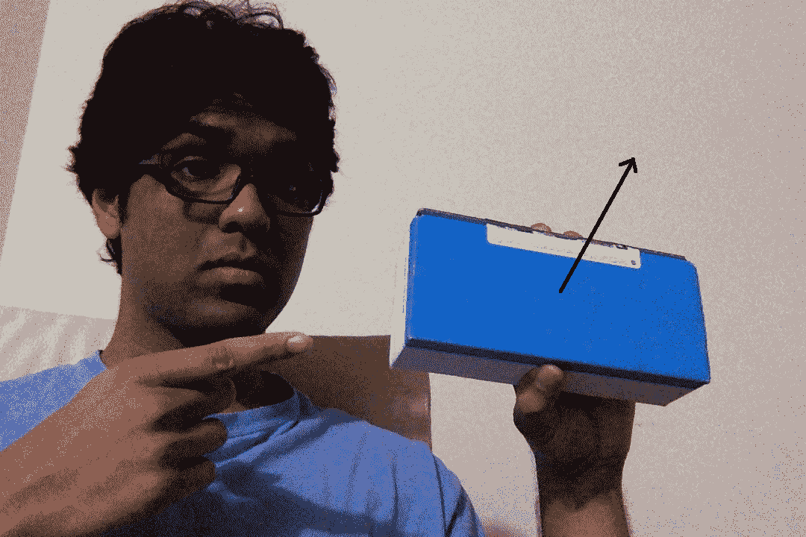

现在，即使位置相同，方向也已更改。 我们需要掌握这些信息，以便叠加的图形看起来自然。 我们需要确保图形与此方向和位置对齐。

# 如何追踪平面物体

既然您已经了解了什么是姿态估计，那么让我们看看如何使用它来跟踪平面对象。 让我们考虑以下平面对象：

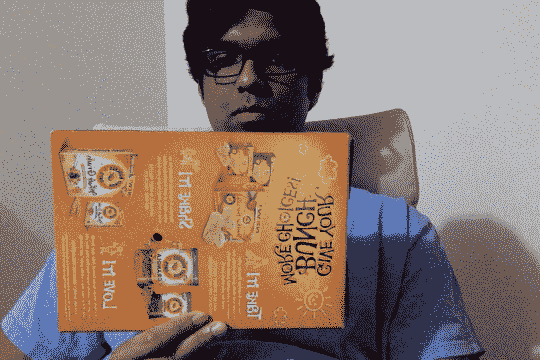

现在，如果我们从这张图片中提取特征点，我们将看到如下内容：

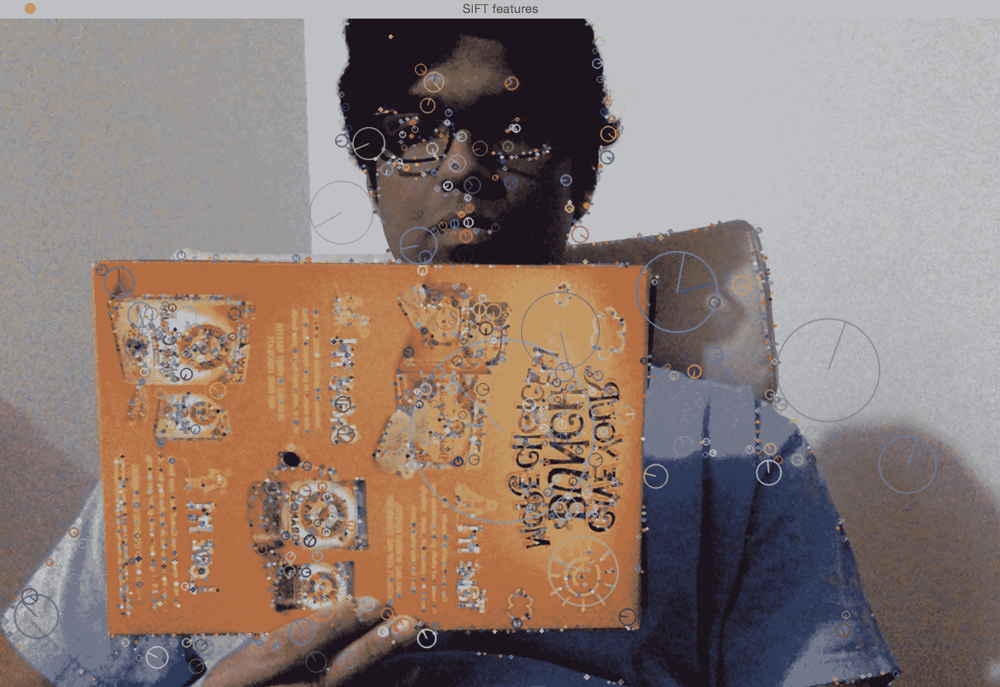

让我们倾斜纸箱：


如我们所见，纸板箱在此图像中倾斜。 现在，如果要确保我们的虚拟对象覆盖在该表面的顶部，则需要收集此平面倾斜信息。 一种方法是使用特征点的相对位置。 如果我们从前面的图像中提取特征点，它将看起来像这样：

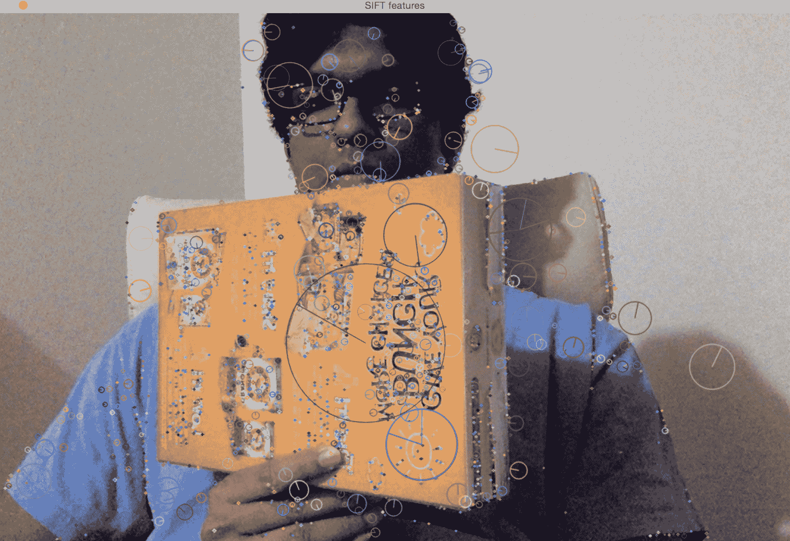

如您所见，特征点在平面的远端与近端的特征点在水平方向上更加接近：

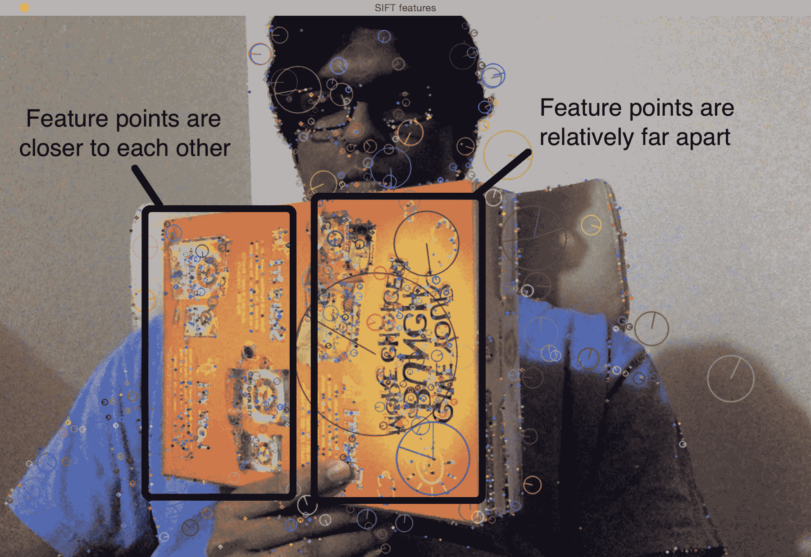

因此，我们可以利用此信息从图像中提取方向信息。 如果您还记得的话，我们在讨论几何变换和全景成像时会详细讨论透视变换。 我们需要做的就是使用这两组点并提取单应性矩阵。 该单应性矩阵将告诉我们纸板箱如何旋转。

考虑下图：


首先，我们将使用`ROISelector`类选择感兴趣的区域，然后，将这些坐标传递给`PoseEstimator`：

```py
class ROISelector(object): 
    def __init__(self, win_name, init_frame, callback_func): 
        self.callback_func = callback_func 
        self.selected_rect = None 
        self.drag_start = None 
        self.tracking_state = 0
        event_params = {"frame": init_frame}
        cv2.namedWindow(win_name)
        cv2.setMouseCallback(win_name, self.mouse_event, event_params)

    def mouse_event(self, event, x, y, flags, param):
        x, y = np.int16([x, y]) 

        # Detecting the mouse button down event 
        if event == cv2.EVENT_LBUTTONDOWN: 
            self.drag_start = (x, y) 
            self.tracking_state = 0 

        if self.drag_start:
            if event == cv2.EVENT_MOUSEMOVE:
                h, w = param["frame"].shape[:2] 
                xo, yo = self.drag_start 
                x0, y0 = np.maximum(0, np.minimum([xo, yo], [x, y])) 
                x1, y1 = np.minimum([w, h], np.maximum([xo, yo], [x, y])) 
                self.selected_rect = None 

                if x1-x0 > 0 and y1-y0 > 0:
                    self.selected_rect = (x0, y0, x1, y1) 

            elif event == cv2.EVENT_LBUTTONUP:
                self.drag_start = None 
                if self.selected_rect is not None: 
                    self.callback_func(self.selected_rect)
                    self.selected_rect = None
                    self.tracking_state = 1

    def draw_rect(self, img, rect): 
        if not rect: return False 
        x_start, y_start, x_end, y_end = rect
        cv2.rectangle(img, (x_start, y_start), (x_end, y_end), (0, 255, 0), 2) 
        return True  
```

在下图中，感兴趣的区域为绿色矩形：


然后，我们从该感兴趣区域提取特征点。 由于我们跟踪的是平面物体，因此该算法假定此关注区域为平面。 这是显而易见的，但是最好明确声明！ 因此，选择此感兴趣区域时，请确保手中有一个纸板箱。 另外，如果纸板箱上有一堆图案和独特点会更好，这样可以很容易地检测和跟踪其特征点。

`PoseEstimator`类将从其方法`add_target()` *和*中获得感兴趣的区域，并从它们中提取这些特征点，这将使我们能够跟踪物体的运动：

```py
class PoseEstimator(object): 
    def __init__(self): 
        # Use locality sensitive hashing algorithm 
        flann_params = dict(algorithm = 6, table_number = 6, key_size = 12, multi_probe_level = 1) 

        self.min_matches = 10 
        self.cur_target = namedtuple('Current', 'image, rect, keypoints, descriptors, data')
        self.tracked_target = namedtuple('Tracked', 'target, points_prev, points_cur, H, quad') 

        self.feature_detector = cv2.ORB_create()
        self.feature_detector.setMaxFeatures(1000)
        self.feature_matcher = cv2.FlannBasedMatcher(flann_params, {}) 
        self.tracking_targets = [] 

    # Function to add a new target for tracking 
    def add_target(self, image, rect, data=None): 
        x_start, y_start, x_end, y_end = rect 
        keypoints, descriptors = [], [] 
        for keypoint, descriptor in zip(*self.detect_features(image)): 
            x, y = keypoint.pt 
            if x_start <= x <= x_end and y_start <= y <= y_end: 
                keypoints.append(keypoint) 
                descriptors.append(descriptor) 

        descriptors = np.array(descriptors, dtype='uint8') 
        self.feature_matcher.add([descriptors]) 
        target = self.cur_target(image=image, rect=rect, keypoints=keypoints, descriptors=descriptors, data=None) 
        self.tracking_targets.append(target) 

    # To get a list of detected objects 
    def track_target(self, frame): 
        self.cur_keypoints, self.cur_descriptors = self.detect_features(frame) 

        if len(self.cur_keypoints) < self.min_matches: return []
        try: matches = self.feature_matcher.knnMatch(self.cur_descriptors, k=2)
        except Exception as e:
            print('Invalid target, please select another with features to extract')
            return []
        matches = [match[0] for match in matches if len(match) == 2 and match[0].distance < match[1].distance * 0.75] 
        if len(matches) < self.min_matches: return [] 

        matches_using_index = [[] for _ in range(len(self.tracking_targets))] 
        for match in matches: 
            matches_using_index[match.imgIdx].append(match) 

        tracked = [] 
        for image_index, matches in enumerate(matches_using_index): 
            if len(matches) < self.min_matches: continue 

            target = self.tracking_targets[image_index] 
            points_prev = [target.keypoints[m.trainIdx].pt for m in matches]
            points_cur = [self.cur_keypoints[m.queryIdx].pt for m in matches]
            points_prev, points_cur = np.float32((points_prev, points_cur))
            H, status = cv2.findHomography(points_prev, points_cur, cv2.RANSAC, 3.0) 
            status = status.ravel() != 0

            if status.sum() < self.min_matches: continue 

            points_prev, points_cur = points_prev[status], points_cur[status] 

            x_start, y_start, x_end, y_end = target.rect 
            quad = np.float32([[x_start, y_start], [x_end, y_start], [x_end, y_end], [x_start, y_end]])
            quad = cv2.perspectiveTransform(quad.reshape(1, -1, 2), H).reshape(-1, 2)
            track = self.tracked_target(target=target, points_prev=points_prev, points_cur=points_cur, H=H, quad=quad) 
            tracked.append(track) 

        tracked.sort(key = lambda x: len(x.points_prev), reverse=True) 
        return tracked 

    # Detect features in the selected ROIs and return the keypoints and descriptors 
    def detect_features(self, frame): 
        keypoints, descriptors = self.feature_detector.detectAndCompute(frame, None) 
        if descriptors is None: descriptors = [] 
        return keypoints, descriptors 

    # Function to clear all the existing targets 
    def clear_targets(self): 
        self.feature_matcher.clear() 
        self.tracking_targets = [] 
```

让跟踪开始！ 我们将移动纸箱看看会发生什么：


如您所见，特征点正在关注区域内跟踪。 让我们将其倾斜一下，看看会发生什么：

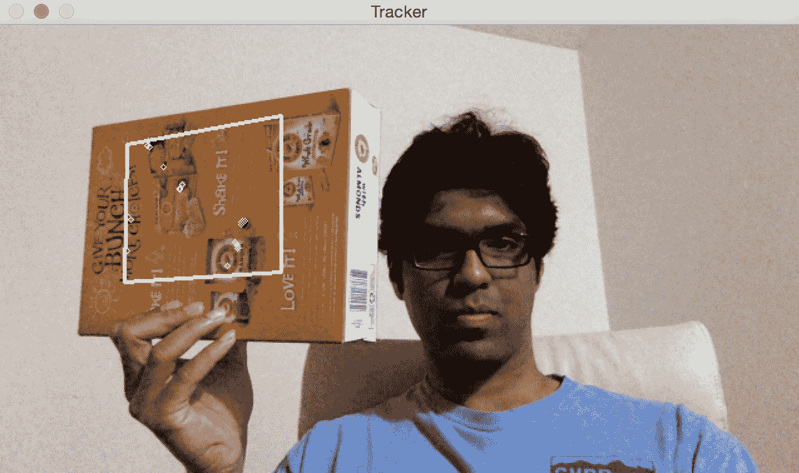

似乎正在正确跟踪特征点。 我们可以看到，覆盖的矩形根据纸板箱的表面改变其方向。

这是执行此操作的代码：

```py
import sys 
from collections import namedtuple 

import cv2 
import numpy as np

class VideoHandler(object): 
    def __init__(self, capId, scaling_factor, win_name): 
        self.cap = cv2.VideoCapture(capId)
        self.pose_tracker = PoseEstimator() 
        self.win_name = win_name
        self.scaling_factor = scaling_factor

        ret, frame = self.cap.read()
        self.rect = None
        self.frame = cv2.resize(frame, None, fx=scaling_factor, fy=scaling_factor, interpolation=cv2.INTER_AREA)
        self.roi_selector = ROISelector(win_name, self.frame, self.set_rect) 

    def set_rect(self, rect): 
        self.rect = rect
        self.pose_tracker.add_target(self.frame, rect) 

    def start(self):
        paused = False
        while True:
            if not paused or self.frame is None: 
                ret, frame = self.cap.read()
                scaling_factor = self.scaling_factor
                frame = cv2.resize(frame, None, fx=scaling_factor, fy=scaling_factor, interpolation=cv2.INTER_AREA) 
                if not ret: break 
                self.frame = frame.copy() 

            img = self.frame.copy() 
            if not paused and self.rect is not None: 
                tracked = self.pose_tracker.track_target(self.frame) 
                for item in tracked: 
                    cv2.polylines(img, [np.int32(item.quad)], True, (255, 255, 255), 2) 
                    for (x, y) in np.int32(item.points_cur): 
                        cv2.circle(img, (x, y), 2, (255, 255, 255)) 

            self.roi_selector.draw_rect(img, self.rect) 
            cv2.imshow(self.win_name, img) 
            ch = cv2.waitKey(1) 
            if ch == ord(' '): paused = not paused 
            if ch == ord('c'): self.pose_tracker.clear_targets() 
            if ch == 27: break

if __name__ == '__main__': 
    VideoHandler(0, 0.8, 'Tracker').start()
```

# 代码内部发生了什么？

首先，我们有一个`PoseEstimator`类，在这里进行所有繁重的工作。 我们需要一些东西来检测图像中的特征，并需要一些东西来匹配连续图像之间的特征。 因此，我们使用 ORB 特征检测器和 Flann 特征匹配器在提取的特征中进行快速最近邻居搜索。 如您所见，我们在构造函数中使用这些参数初始化类。

每当我们选择感兴趣的区域时，我们都会调用`add_target`方法将其添加到我们的跟踪目标列表中。 此方法只是从感兴趣的区域提取特征并将其存储在一个类变量中。 现在我们有了目标，我们已经准备好追踪它！

`track_target`方法处理所有跟踪。 我们采用当前框架并提取所有关键点。 但是，我们对视频当前帧中的所有关键点并不真正感兴趣。 我们只想要属于我们目标对象的关键点。 因此，现在我们的工作是在当前帧中找到最接近的关键点。

现在，我们在当前帧中有一组关键点，而在上一帧中还有来自目标对象的另一组关键点。 下一步是从这些匹配点中提取单应性矩阵。 这个单应性矩阵告诉我们如何变换覆盖的矩形，使其与纸板箱的表面对齐。 我们只需要获取此单应性矩阵并将其应用于覆盖的矩形即可获得所有纸板箱点的新位置。

# 如何增强我们的现实

现在我们知道了如何跟踪平面对象，让我们看看如何将 3D 对象叠加在现实世界的顶部。 对象是 3D，但屏幕上的视频是 2D。 因此，这里的第一步是了解如何将那些 3D 对象映射到 2D 曲面，以使它们看起来逼真。 我们只需要将这些 3D 点投影到平面上即可。

# 将坐标从 3D 映射到 2D

估计姿势后，我们会将点从 3D 投影到 2D。 考虑下图：

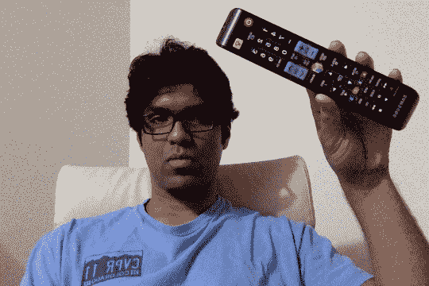

正如我们在此处看到的那样，电视遥控器是 3D 对象，但我们在 2D 平面上看到它。 现在，如果我们四处移动，它将看起来像这样：

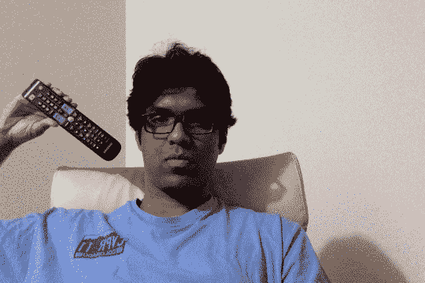

该 3D 对象仍在 2D 平面上。 对象已移动到其他位置，并且距相机的距离也已更改。 我们如何计算这些坐标？ 我们需要一种将该 3D 对象映射到 2D 曲面的机制。 这是 3D 到 2D 投影真正重要的地方。

我们只需要估计摄像机的初始姿势即可。 现在，假设摄像机的固有参数是已知的。 因此，我们可以仅使用 OpenCV 中的`solvePnP`功能来估计摄像机的姿势。 此函数用于使用一组点来估计对象的姿势，如以下代码所示。 您可以在[这个页面](http://docs.opencv.org/modules/calib3d/doc/camera_calibration_and_3d_reconstruction.html#bool)上阅读有关的更多信息：

```py
solvePnP(InputArray objectPoints, InputArray imagePoints, InputArray cameraMatrix, InputArray distCoeffs, OutputArray rvec, OutputArray tvec, bool useExtrinsicGuess, int flags) 
```

完成此操作后，我们需要将这些点投影到 2D 平面上。 我们使用 OpenCV `projectPoints`函数来执行此操作。 此函数计算这些 3D 点在 2D 平面上的投影。

# 如何在视频上叠加 3D 对象

现在我们有了所有不同的模块，我们已经准备好构建最终系统。 假设我们要在纸板箱顶部覆盖一个金字塔，如下所示：

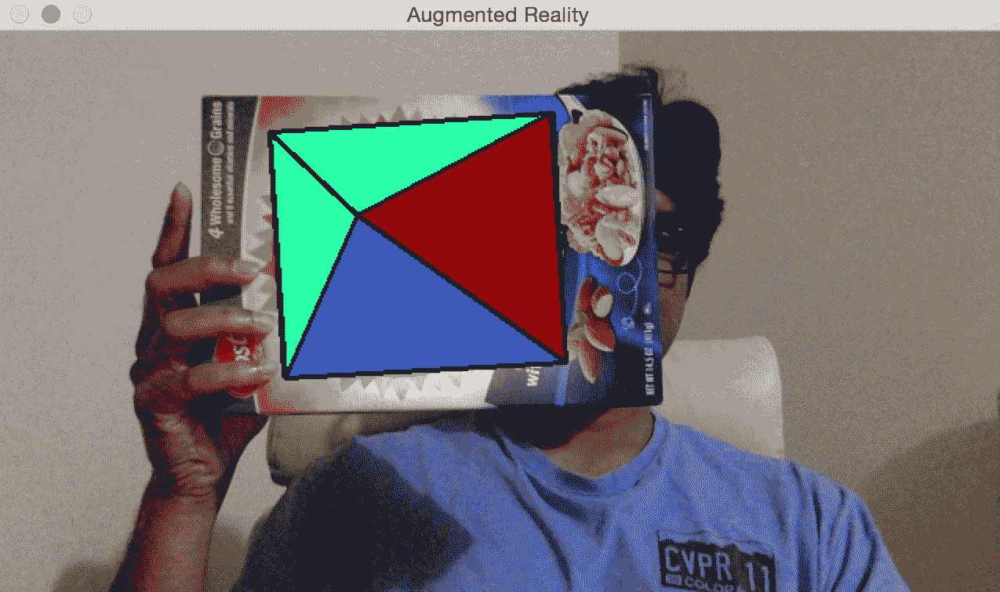

让我们倾斜纸箱看看会发生什么：


看起来像金字塔在跟随表面。 让我们添加第二个目标：

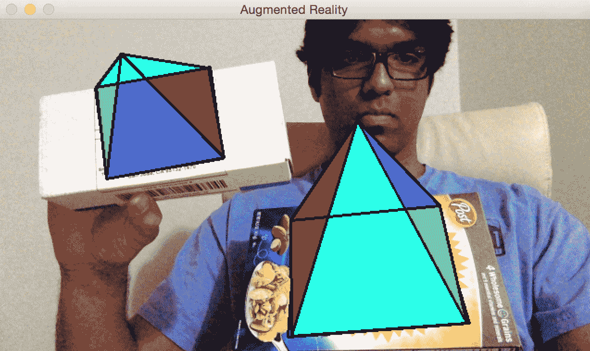

您可以继续添加更多目标，所有这些金字塔都会得到很好的跟踪。 让我们看看如何使用 OpenCV Python 做到这一点。 确保将以前的文件另存为`pose_estimation.py`，因为我们将从那里导入几个类：

```py
import cv2 
import numpy as np 

from pose_estimation import PoseEstimator, ROISelector 

class Tracker(object): 
    def __init__(self, capId, scaling_factor, win_name): 
        self.cap = cv2.VideoCapture(capId) 
        self.rect = None
        self.win_name = win_name
        self.scaling_factor = scaling_factor
        self.tracker = PoseEstimator() 

        ret, frame = self.cap.read()
        self.rect = None
        self.frame = cv2.resize(frame, None, fx=scaling_factor, fy=scaling_factor, interpolation=cv2.INTER_AREA)

        self.roi_selector = ROISelector(win_name, self.frame, self.set_rect)
        self.overlay_vertices = np.float32([[0, 0, 0], [0, 1, 0], [1, 1, 0], [1, 0, 0], [0.5, 0.5, 4]]) 
        self.overlay_edges = [(0, 1), (1, 2), (2, 3), (3, 0), (0,4), (1,4), (2,4), (3,4)] 
        self.color_base = (0, 255, 0) 
        self.color_lines = (0, 0, 0) 

    def set_rect(self, rect): 
        self.rect = rect
        self.tracker.add_target(self.frame, rect) 

    def start(self): 
        paused = False
        while True:
            if not paused or self.frame is None: 
                ret, frame = self.cap.read() 
                scaling_factor = self.scaling_factor
                frame = cv2.resize(frame, None, fx=scaling_factor, fy=scaling_factor,\
                    interpolation=cv2.INTER_AREA) 
                if not ret: break 

                self.frame = frame.copy() 

            img = self.frame.copy() 
            if not paused: 
                tracked = self.tracker.track_target(self.frame) 
                for item in tracked: 
                    cv2.polylines(img, [np.int32(item.quad)], 
                     True, self.color_lines, 2) 
                    for (x, y) in np.int32(item.points_cur): 
                        cv2.circle(img, (x, y), 2, 
                         self.color_lines) 

                    self.overlay_graphics(img, item) 

            self.roi_selector.draw_rect(img, self.rect) 
            cv2.imshow(self.win_name, img) 
            ch = cv2.waitKey(1) 
            if ch == ord(' '): self.paused = not self.paused 
            if ch == ord('c'): self.tracker.clear_targets() 
            if ch == 27: break 

    def overlay_graphics(self, img, tracked):
        x_start, y_start, x_end, y_end = tracked.target.rect 
        quad_3d = np.float32([[x_start, y_start, 0], [x_end, 
         y_start, 0], 
                    [x_end, y_end, 0], [x_start, y_end, 0]]) 
        h, w = img.shape[:2] 
        K = np.float64([[w, 0, 0.5*(w-1)], 
                        [0, w, 0.5*(h-1)], 
                        [0, 0, 1.0]]) 
        dist_coef = np.zeros(4) 
        ret, rvec, tvec = cv2.solvePnP(objectPoints=quad_3d, imagePoints=tracked.quad,
                                       cameraMatrix=K, distCoeffs=dist_coef)
        verts = self.overlay_vertices * \
            [(x_end-x_start), (y_end-y_start), -(x_end-x_start)*0.3] + (x_start, y_start, 0) 
        verts = cv2.projectPoints(verts, rvec, tvec, cameraMatrix=K, distCoeffs=dist_coef)[0].reshape(-1, 2)

        verts_floor = np.int32(verts).reshape(-1,2) 
        cv2.drawContours(img, contours=[verts_floor[:4]], contourIdx=-1, color=self.color_base, thickness=-3)
        cv2.drawContours(img, contours=[np.vstack((verts_floor[:2], verts_floor[4:5]))], contourIdx=-1, color=(0,255,0), thickness=-3)
        cv2.drawContours(img, contours=[np.vstack((verts_floor[1:3], verts_floor[4:5]))], contourIdx=-1, color=(255,0,0), thickness=-3)
        cv2.drawContours(img, contours=[np.vstack((verts_floor[2:4], verts_floor[4:5]))], contourIdx=-1, color=(0,0,150), thickness=-3)
        cv2.drawContours(img, contours=[np.vstack((verts_floor[3:4], verts_floor[0:1], verts_floor[4:5]))], contourIdx=-1, color=(255,255,0), thickness=-3)

        for i, j in self.overlay_edges: 
            (x_start, y_start), (x_end, y_end) = verts[i], verts[j]
            cv2.line(img, (int(x_start), int(y_start)), (int(x_end), int(y_end)), self.color_lines, 2) 

if __name__ == '__main__': 
    Tracker(0, 0.8, 'Augmented Reality').start() 
```

# 让我们看一下代码

`Tracker`类用于执行此处的所有计算。 我们使用通过边和顶点定义的金字塔结构初始化该类。 我们用来跟踪表面的逻辑与我们之前讨论的相同，因为我们使用的是同一类。 我们只需要使用`solvePnP`和`projectPoints`将 3D 金字塔映射到 2D 曲面即可。

# 让我们添加一些动作

现在我们知道如何添加虚拟金字塔，让我们看看是否可以添加一些移动。 让我们看看如何动态更改金字塔的高度。 当您开始时，金字塔将如下所示：


如果您等待一段时间，金字塔会更高，看起来像这样：


让我们看看如何在 OpenCV Python 中做到这一点。 在我们刚刚讨论的增强现实代码中，在`Tracker`类的`__init__`方法的末尾添加以下代码段：

```py
self.overlay_vertices = np.float32([[0, 0, 0], [0, 1, 0], [1, 1, 0], [1, 0, 0], [0.5, 0.5, 4]]) 
self.overlay_edges = [(0, 1), (1, 2), (2, 3), (3, 0), 
            (0,4), (1,4), (2,4), (3,4)] 
self.color_base = (0, 255, 0) 
self.color_lines = (0, 0, 0) 

self.graphics_counter = 0 
self.time_counter = 0 
```

现在我们有了结构，我们需要添加代码以动态更改高度。 用以下方法替换`overlay_graphics()`方法：

```py
    def overlay_graphics(self, img, tracked):
        x_start, y_start, x_end, y_end = tracked.target.rect 
        quad_3d = np.float32([[x_start, y_start, 0], [x_end, 
         y_start, 0], 
                    [x_end, y_end, 0], [x_start, y_end, 0]]) 
        h, w = img.shape[:2] 
        K = np.float64([[w, 0, 0.5*(w-1)], 
                        [0, w, 0.5*(h-1)], 
                        [0, 0, 1.0]]) 
        dist_coef = np.zeros(4) 
        ret, rvec, tvec = cv2.solvePnP(objectPoints=quad_3d, imagePoints=tracked.quad,
                                       cameraMatrix=K, distCoeffs=dist_coef)
        verts = self.overlay_vertices * \
            [(x_end-x_start), (y_end-y_start), -(x_end-x_start)*0.3] + (x_start, y_start, 0) 
        verts = cv2.projectPoints(verts, rvec, tvec, cameraMatrix=K,
                                  distCoeffs=dist_coef)[0].reshape(-1, 2)

        verts_floor = np.int32(verts).reshape(-1,2) 
        cv2.drawContours(img, contours=[verts_floor[:4]],
             contourIdx=-1, color=self.color_base, thickness=-3)
        cv2.drawContours(img, contours=[np.vstack((verts_floor[:2],
            verts_floor[4:5]))], contourIdx=-1, color=(0,255,0), thickness=-3)
        cv2.drawContours(img, contours=[np.vstack((verts_floor[1:3],
            verts_floor[4:5]))], contourIdx=-1, color=(255,0,0), thickness=-3)
        cv2.drawContours(img, contours=[np.vstack((verts_floor[2:4],
            verts_floor[4:5]))], contourIdx=-1, color=(0,0,150), thickness=-3)
        cv2.drawContours(img, contours=[np.vstack((verts_floor[3:4],
            verts_floor[0:1], verts_floor[4:5]))], contourIdx=-1, color=(255,255,0),thickness=-3)

        for i, j in self.overlay_edges: 
            (x_start, y_start), (x_end, y_end) = verts[i], verts[j]
            cv2.line(img, (int(x_start), int(y_start)), (int(x_end), int(y_end)),     
                self.color_lines, 2)
```

现在我们知道了如何改变高度，让我们继续为我们做金字塔舞。 我们可以使金字塔的尖端周期性地振荡。 因此，当您开始时，它将如下所示：


如果您等待一段时间，它将如下所示：

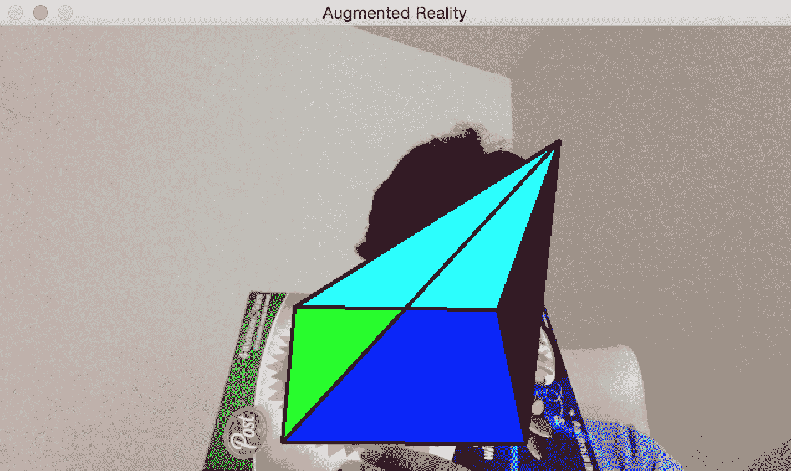

您可以在`augmented_reality_motion.py`中查看实现的详细信息。

在下一个实验中，我们将使整个金字塔在感兴趣的区域内移动。 我们可以使它以我们想要的任何方式移动。 让我们开始添加围绕选定兴趣区域的线性对角线运动。 当您开始时，它将如下所示：


一段时间后，它将如下所示：


请参阅`augmented_reality_dancing.py`以了解如何更改`overlay_graphics()`方法使其跳舞。 让我们看看是否可以使金字塔绕我们感兴趣的区域旋转。 当您开始时，它将如下所示：

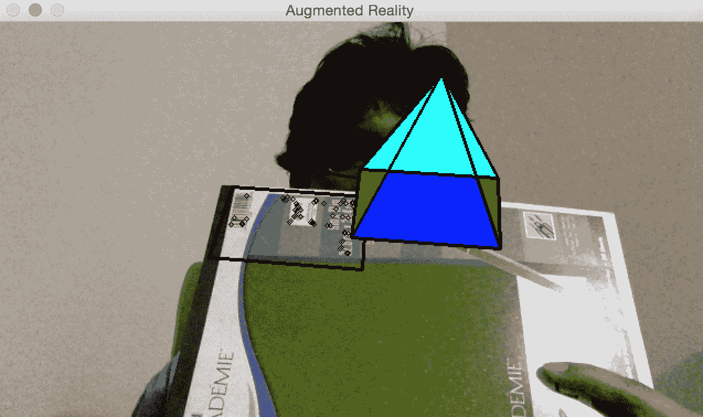

一段时间后，它将移至新位置：


您可以参考`augmented_reality_circular_motion.py`来了解如何实现。 您可以使其做任何您想做的事情。 您只需要提出正确的数学公式，金字塔就会如您所愿地跳动！ 您还可以尝试其他虚拟对象，以了解如何使用它。 您可以使用许多不同的对象执行很多操作。 这些示例提供了很好的参考点，您可以在这些参考点上构建许多有趣的增强现实应用程序。

# 总结

在本章中，您了解了增强现实的前提，并了解了增强现实系统的外观。 我们讨论了增强现实所需的几何变换。 您还学习了如何使用这些转换来估计相机的姿势，并学习了如何跟踪平面对象。 我们讨论了如何在现实世界的顶部添加虚拟对象。 您学习了如何以不同方式修改虚拟对象以添加炫酷效果。

在下一章中，我们将学习如何将机器学习技术与人工神经网络一起应用，这将有助于我们增强第 9 章，“对象识别”中已经获得的知识。