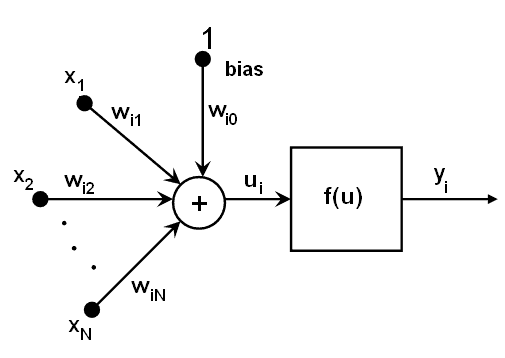
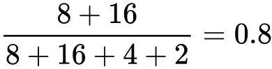

# 通过人工神经网络进行机器学习

在本章中，您将学习如何构建 ANN 并对其进行训练以执行图像分类和对象识别。 人工神经网络是机器学习的子集之一，我们将特别讨论 MLP 网络，它是模式识别范围内最常见的神经网络类型。

在本章的最后，我们将介绍以下内容：

*   **机器学习**（**ML**）和**人工神经网络**（**ANN**）之间的区别
*   **多层感知器**（**MLP**）网络
*   如何定义和实施 MLP 网络
*   评估和改善我们的人工神经网络
*   如何使用经过训练的 ANN 识别图像中的对象

# 机器学习（ML）与人工神经网络（ANN）

如前所述，ANN 是 ML 的子集。 人工神经网络的灵感来自人类的理解； 它们像大脑一样工作，由不同的相互连接的神经元层组成，每个神经元从上一层接收信息，对其进行处理，然后将其发送到下一层，直到接收到最终输出。 在监督学习的情况下，此输出可以来自标记的输出，在监督学习的情况下，此输出可以来自某些匹配的条件。

人工神经网络的特点是什么？ 机器学习被定义为计算机科学领域，专注于尝试在数据集中查找模式，而 ANN 则更侧重于模拟人脑如何连接以完成这项工作，将模式检测划分为多个层（称为节点） 神经元。

同时，其他的机器学习算法，例如**支持向量机**（**SVM**），在对象模式识别和分类上也越来越流行。 SVM 具有机器学习算法中最好的准确性之一。 ANN 具有更多的应用程序集，能够检测大多数类型的数据结构上的模式（SVM 主要与特征向量一起使用），并且可以进行更多参数化以在同一实现中实现不同的目标。

此外，与其他 ML 策略（例如 SVM）相比，ANN 的另一个优势是 ANN 是一种概率分类器，允许进行多类分类。 这意味着它可以检测图像中的多个物体。 另一方面，SVM 是一种非概率二进制分类器。

ANN 什么时候有用？ 想象一下，我们已经实现了一个对象识别器，该对象识别器经过训练可以识别背包和鞋子，然后得到以下图像：


我们在其上运行特征检测器，并获得如下结果：


从上一张图像可以看到，我们的特征检测器算法从女孩的*背包*和*鞋类*中获得了特征向量。 因此，如果我们在此图像上运行第 9 章，“对象识别”的 SVM 分类器，由于采用了线性分类器，它宁愿只检测*背包* 即使图像中也包含鞋类。

SVM 还可以使用称为**内核技巧**的东西执行非线性分类，并将输入隐式映射到高维特征空间。

# ANN 如何工作？

在本节中，我们将看到哪些元素参与了 ANN-MLP。 首先，我们将代表一个常规的 ANN-MLP 形状，每层的输入，输出和隐藏以及信息如何在它们之间流动：


MLP 网络至少由三层组成：

*   **输入层**：每个 MLP 始终具有这些层之一。 它是一个被动层，这意味着它不会修改数据。 它从外界接收信息，并将其发送到网络。 该层中节点（神经元）的数量将取决于我们要从图像中提取的特征或描述性信息的数量。 例如，在使用特征向量的情况下，向量中的每一列将有一个节点。
*   **隐藏层**：所有基础工作都在此层进行。 它将输入转换为输出层或另一个隐藏层可以使用的东西（可以有多个）。 该层充当黑匣子，在接收到的输入中检测模式并评估每个输入的权重。 其行为将由其激活函数提供的方程式定义。
*   **输出层**：此层也将始终存在，但是在这种情况下，节点数将由所选的神经网络定义。 该层可能具有三个神经元。 输出层可以由单个节点构建（线性回归），也就是说，我们想知道图像是否带有背包。 但是在进行多类分类的情况下，该层将包含几个可以识别的节点，每个对象一个。 默认情况下，每个节点都会产生一个值，该值的范围为[-1,1]，该值定义对象是否存在的可能性，并允许在单个输入图像上进行多类检测。

假设我们要构建一个三层神经网络，每个神经网络之一：输入，隐藏和输出。 输入层中的节点数将由我们数据的维数决定。 输出层中的节点数将由我们拥有的模型数来定义。 关于隐藏层，节点或什至层的数量将取决于问题的复杂性和我们要添加到网络中的准确性。 高维数将提高结果的准确性，但也会增加计算成本。 对于隐藏层要采取的另一个决定是使用激活函数，该函数使我们能够拟合非线性假设并根据所提供的数据获得更好的模式检测。 激活功能的常见选择是`Sigmoid`功能，默认情况下使用该功能，其中会根据概率评估输出，但还有其他选择，例如 **tanh** 或 **ReLUs [** 。

更深入地研究具有隐藏层的每个神经元，我们可以说它们所有的行为都类似。 从上一层（输入节点）中检索值，并与某些权重（每个神经元各自）加偏差项相加。 使用激活函数`f`转换总和，该函数对于不同的神经元也可能有所不同，如下图所示：



# 如何定义多层感知器（MLP）

MLP 是 ANN 的一个分支，由于其能够在嘈杂或意外环境中识别模式，因此广泛用于模式识别。 MLP 可用于实施有监督和无监督的学习（在第 9 章[，“对象识别”中都对它们进行了讨论）。 除此之外，MLP 还可以用于实施另一种学习，例如受行为心理学启发的强化学习，其中使用奖励/惩罚行为来调整网络学习。](../Text/09.html)

定义 ANN-MLP 包括确定组成我们的网络的层的结构以及每个层中有多少个节点。 首先，我们需要确定我们网络的目标是什么。 例如，我们可以实现一个对象识别器，在这种情况下，属于输出层的节点数量将与我们要识别的不同对象的数量相同。 模拟第 9 章中的示例，对象识别，在识别手袋，鞋类和衣服的情况下，输出层将具有三个节点，其值将映射为概率元组而不是固定的元组 值，例如 *[1,0,0]，[0,1,0]，*和 *[0,0,1]* 。 因此，有可能在同一幅图像中识别一个以上的班级，例如，一个背包穿拖鞋的女孩。

一旦确定了网络的结果，就应该定义可以将每个物体要识别的有意义的信息插入到我们的网络中，从而能够将物体识别为未知图像。 有几种方法作为图像的特征描述符。 我们可以使用**东方直方图**（**HOG**）来统计图像局部区域中梯度方向的出现，或使用*彩色直方图*来表示分布 图像中的颜色，或者我们也可以使用具有 SIFT 或 SURF 算法的密集特征检测器提取图像特征。 由于插入输入层的每个图像的描述符数量必须相同，因此我们将使用*词袋*策略，将所有描述符集收集到单个视觉词直方图中，就像我们在 第 9 章，“对象识别”，供使用 SVM 识别器。 直方图如下所示，其中每个条形值都将链接到输入层中的一个节点：


最后，我们进入隐藏层。 该层没有严格定义的结构，因此将是一个复杂的决定。 关于如何确定隐藏层的数量以及其中的节点数量，不同的研究人员之间进行了大量讨论。 它们全都依靠问题的复杂性来解决，并在性能和准确性之间找到平衡—更多的节点/层将具有更高的准确性，但性能却很差。 同样，可能会导致大量节点，并且网络过度安装不仅会导致性能降低，而且还会导致精度降低。 对于只有三个模型的简单对象识别器，它不需要一个以上的隐藏层，对于其中的节点数，[我们可以采用 Heaton 研究](http://www.heatonresearch.com/2017/06/01/hidden-layers.html)，它设置了以下规则：

*   隐藏神经元的数量应在输入层的大小和输出层的大小之间
*   隐藏神经元的数量应为输入层大小的三分之二加上输出层大小的三分之二
*   隐藏神经元的数量应小于输入层大小的两倍

# 如何实现 ANN-MLP 分类器？

在对如何实现人工神经网络进行了所有理论解释之后，我们将自己实现。 为此，就像我们在 SVM 分类器中所做的一样，我们将从相同的源下载培训图像。 。 我们将从几个可以轻松扩展到其他项目的项目开始，创建一个文件夹`images`，为我们要分类的每个类别创建一个子文件夹：`dresses`，`footwear`和`bagpack`。 我们将为它们分别拍摄一堆图像； 大约 20 到 25 张图像应该足以进行训练，最重要的是，我们将包括另一组样本图像，我们将使用它们来评估训练后网络的准确性。

如前所述，我们需要使用**单词袋**（**BOW**）对齐每个图像的描述符数量。 为此，我们将首先使用密集特征检测器为每个图像馈送的关键点提取每个图像的特征向量，然后将向量转发到 K 均值聚类以提取质心，这将帮助我们最终获得 BOW 。


从上一张图像可以看出，这与我们在 SVM 分类器中实施的过程相同。 为了节省时间和代码，我们将利用先前创建的`create_features.py`文件来提取所有将用作 MLP 网络输入的特征描述符。

通过运行以下命令，我们将获得下一步所需的每个映射文件：

```py
$ python create_features.py --samples bag images/bagpack/ --samples dress images/dress/ --samples footwear images/footwear/ --codebook-file models/codebook.pkl --feature-map-file models/feature_map.pkl
```

在`feature_map.pkl`文件中，我们拥有训练期间将参与的每个图像的特征向量。 首先，我们将为 ANN 分类器创建一个类，在其中设置网络层的大小：

```py
from sklearn import preprocessing
import numpy as np
import cv2
import random

class ClassifierANN(object):
    def __init__(self, feature_vector_size, label_words):
        self.ann = cv2.ml.ANN_MLP_create()
        self.label_words = label_words
        # Number of centroids used to build the feature vectors
        input_size = feature_vector_size
        # Number of models to recongnize
        output_size = len(label_words)
        # Applying Heaton rules
        hidden_size = (input_size * (2/3)) + output_size 
        nn_config = np.array([input_size, hidden_size, output_size], dtype=np.uint8)
        self.ann.setLayerSizes(np.array(nn_config))
        # Symmetrical Sigmoid as activation function
        self.ann.setActivationFunction(cv2.ml.ANN_MLP_SIGMOID_SYM, 2, 1)
        # Map models as tuples of probabilities
        self.le = preprocessing.LabelBinarizer() 
        self.le.fit(label_words) # Label words are ['dress', 'footwear', 'backpack']
```

作为输出，我们决定用二进制数[0,0,1]，[0,1,0]，[1,0,0]实现一个概率元组，目的是通过这种方式获得多类检测。 作为激活函数对称 Sigmoid（`NN_MLP_SIGMOID_SYM`），这是 MLP 的默认选择，其中输出将在[-1,1]范围内。 这样，我们的网络生成的输出将定义概率而不是分类结果，从而能够识别同一样本图像中的两个或三个对象。

在培训过程中，我们将数据集分为两个不同的集：培训和测试。 我们将为其定义一个比率（通常，大多数示例建议使用 75％作为训练集，但可以对其进行调整，直到获得最佳准确性为止），并随机选择项目以防止偏差。 这是如何运作的？

```py
class ClassifierANN(object):
...
    def train(self, training_set):
        label_words = [ item['label'] for item in training_set]
        dim_size = training_set[0]['feature_vector'].shape[1]
        train_samples = np.asarray(
            [np.reshape(x['feature_vector'], (dim_size,)) for x in training_set]
        )
        # Convert item labels into encoded binary tuples
        train_response = np.array(self.le.transform(label_words), dtype=np.float32)
        self.ann.train(np.array(train_samples, 
            dtype=np.float32),cv2.ml.ROW_SAMPLE,
            np.array(train_response, dtype=np.float32)
        )
```

在这种情况下，我们对输入层的每个节点使用了相同的权重（默认行为），但是我们可以指定它们为特征向量中的列提供更多权重，并提供更多重要信息。

# 评估训练有素的网络

为了评估我们训练有素的 MLP 网络的鲁棒性和准确性，我们将计算混淆矩阵（也称为误差矩阵）。 该矩阵将描述我们分类模型的性能。 混淆矩阵的每一行代表预测类中的实例，而每一列代表实际类中的实例（反之亦然）。 为了填充矩阵，我们将使用测试集对其进行评估：

```py
from collections import OrderedDict

def init_confusion_matrix(self, label_words):
    confusion_matrix = OrderedDict()
    for label in label_words:
        confusion_matrix[label] = OrderedDict()
        for label2 in label_words: confusion_matrix[label][label2] = 0
    return confusion_matrix

# Chooses the class with the greatest value, only one, in the tuple(encoded_word)
def classify(self, encoded_word, threshold=0.5):
    models = self.le.inverse_transform(np.asarray([encoded_word]), threshold)
    return models[0]

# Calculate the confusion matrix from given testing data set
def get_confusion_matrix(self, testing_set):
    label_words = [item['label'] for item in testing_set]
    dim_size = testing_set[0]['feature_vector'].shape[1]
    test_samples = np.asarray(
        [np.reshape(x['feature_vector'], (dim_size,)) for x in testing_set]
    )
    expected_outputs = np.array(self.le.transform(label_words), dtype=np.float32)
    confusion_matrix = self._init_confusion_matrix(label_words)
    retval, test_outputs = self.ann.predict(test_samples)
    for expected_output, test_output in zip(expected_outputs, test_outputs):
        expected_model = self.classify(expected_output)
        predicted_model = self.classify(test_output)
        confusion_matrix[expected_model][predicted_model] += 1
    return confusion_matrix
```

作为样本混淆矩阵，并考虑一个包含 30 个元素的测试集，我们可能获得以下结果：

|  | **鞋类** | **背包** | **连衣裙** |
| **鞋类** | 8 | 2 | 0 |
| **背包** | 2 | 7 | 1 |
| **连衣裙** | 2 | 2 | 6 |

考虑到先前的矩阵，我们可以通过以下公式计算训练网络的准确性：


在此公式中，我们表示**真阳性**（**TP**），**真阴性**（TN），**假正例**（**FP**）和**假负例**（**FN**）。 就鞋类而言，我们可以说其准确性为 80％。



上式的实现代码如下：

```py
def calculate_accuracy(confusion_matrix):
    acc_models = OrderedDict()
    for model in confusion_matrix.keys():
        acc_models[model] = {'TP':0, 'TN':0, 'FP':0, 'FN': 0}
    for expected_model, predicted_models in confusion_matrix.items():
        for predicted_model, value in predicted_models.items():
            if predicted_model == expected_model:
                acc_models[expected_model]['TP'] += value
                acc_models[predicted_model]['TN'] += value
            else:
                acc_models[expected_model]['FN'] += value
                acc_models[predicted_model]['FP'] += value

    for model, rep in acc_models.items():
        acc = (rep['TP']+rep['TN'])/(rep['TP']+rep['TN']+rep['FN']+rep['FP'])
        print('%s \t %f' % (model,acc))
```

收集本节中的每个代码块，我们已经实现了`ClassifierANN`类以供使用：

```py
###############
# training.py
###############

import pickle

def build_arg_parser():
    parser = argparse.ArgumentParser(description='Creates features for given images')
    parser.add_argument("--feature-map-file", dest="feature_map_file", required=True,
        help="Input pickle file containing the feature map")
    parser.add_argument("--training-set", dest="training_set", required=True,
        help="Percentage taken for training. ie 0.75")
    parser.add_argument("--ann-file", dest="ann_file", required=False,
        help="Output file where ANN will be stored")
    parser.add_argument("--le-file", dest="le_file", required=False,
                        help="Output file where LabelEncoder class will be stored")

if __name__ == '__main__':
    args = build_arg_parser().parse_args()

    # Load the Feature Map
    with open(args.feature_map_file, 'rb') as f:
        feature_map = pickle.load(f)

    training_set, testing_set = split_feature_map(feature_map, float(args.training_set))
    label_words = np.unique([item['label'] for item in training_set])
    cnn = ClassifierANN(len(feature_map[0]['feature_vector'][0]), label_words)
    cnn.train(training_set)
    print("===== Confusion Matrix =====")
    confusion_matrix = cnn.get_confusion_matrix(testing_set)
    print(confusion_matrix)
    print("===== ANN Accuracy =====")
    print_accuracy(confusion_matrix)

    if 'ann_file' in args and 'le_file' in args:
        print("===== Saving ANN =====")
        with open(args.ann_file, 'wb') as f:
            cnn.ann.save(args.ann_file)
        with open(args.le_file, 'wb') as f:
            pickle.dump(cnn.le, f)
        print('Saved in: ', args.ann_file)
```

您可能已经注意到，我们已经将 ANN 保存到两个单独的文件中，因为`ANN_MLP`类具有自己的保存和加载方法。 我们需要保存用于训练网络的`label_words`。 Pickle 为我们提供了对对象结构进行序列化和反序列化以及从磁盘保存和加载它们的功能，除了`ann`这样的结构有自己的实现。

运行以下命令以获取模型文件。 混淆矩阵和准确性概率将与其一起显示：

```py
$ python training.py --feature-map-file models/feature_map.pkl --training-set 0.8 --ann-file models/ann.yaml --le-file models/le.pkl
```

为了获得训练有素的网络，我们可以根据需要重复执行多次，直到获得良好的精度结果为止。 发生这种情况是因为训练和测试集是随机抽取的，因此我们应该保留结果更好的那个。

# 图片分类

要实现我们的 ANN 分类器，我们将需要重用第 9 章，“对象识别”中`create_feature.py`文件中 FeatureExtractor 类的方法，这将使我们能够计算特征 我们要评估的图像中的向量：

```py
class FeatureExtractor(object):
   def get_feature_vector(self, img, kmeans, centroids):
        return Quantizer().get_feature_vector(img, kmeans, centroids)
```

考虑将`create_feature`文件包含在同一文件夹中。 现在，我们准备实现分类器：

```py
###############
# classify_data.py
###############

import argparse 
import _pickle as pickle 

import cv2 
import numpy as np 

import create_features as cf

# Classifying an image 
class ImageClassifier(object): 
    def __init__(self, ann_file, le_file, codebook_file):
        with open(ann_file, 'rb') as f:
            self.ann = cv2.ml.ANN_MLP_load(ann_file)
        with open(le_file, 'rb') as f:
            self.le = pickle.load(f)

        # Load the codebook 
        with open(codebook_file, 'rb') as f: 
            self.kmeans, self.centroids = pickle.load(f)

    def classify(self, encoded_word, threshold=None):
        models = self.le.inverse_transform(np.asarray(encoded_word), threshold)
        return models[0]

    # Method to get the output image tag 
    def getImageTag(self, img): 
        # Resize the input image 
        img = cf.resize_to_size(img) 
        # Extract the feature vector
        feature_vector = cf.FeatureExtractor().get_feature_vector(img, self.kmeans, self.centroids) 
        # Classify the feature vector and get the output tag
        retval, image_tag = self.ann.predict(feature_vector)
        return self.classify(image_tag)

def build_arg_parser(): 
    parser = argparse.ArgumentParser(
        description='Extracts features from each line and classifies the data') 
    parser.add_argument("--input-image", dest="input_image", required=True,
        help="Input image to be classified")
    parser.add_argument("--codebook-file", dest="codebook_file", required=True,
        help="File containing the codebook")
    parser.add_argument("--ann-file", dest="ann_file", required=True,
        help="File containing trained ANN")
    parser.add_argument("--le-file", dest="le_file", required=True,
        help="File containing LabelEncoder class")
    return parser 

if __name__=='__main__': 
    args = build_arg_parser().parse_args() 
    codebook_file = args.codebook_file
    input_image = cv2.imread(args.input_image) 

    tag = ImageClassifier(args.ann_file, args.le_file, codebook_file).getImageTag(input_image)
    print("Output class:", tag)
```

运行以下命令对图像进行分类：

```py
$ python classify_data.py --codebook-file models/codebook.pkl --ann-file models/ann.yaml --le-file models/le.pkl --input-imageimg/test.png
```

# 总结

在本章中，您学习了 ANN 的概念。 您还了解到，它在对象识别领域的用途之一是 MLP 的实现，包括 MLP 相对于其他机器学习策略（例如 SVM）的优缺点。 关于 ANN-MLP，您了解了哪些层形成其结构，以及如何定义和实现它们以构建图像分类器，然后学习了如何评估 MLP，训练其鲁棒性和准确性。 在上一节中，我们实现了一个 MLP 的示例来检测未知图像中的物体。

请记住，计算机视觉世界充满了无限的可能性！ 本书旨在教您入门各种项目所需的技能。 现在，由您和您的想象力来使用您在这里获得的技能来构建一些独特而有趣的东西。