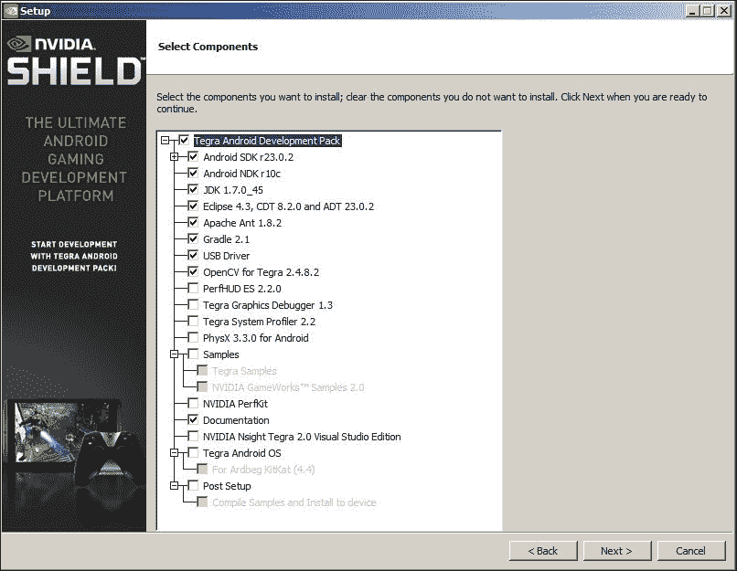
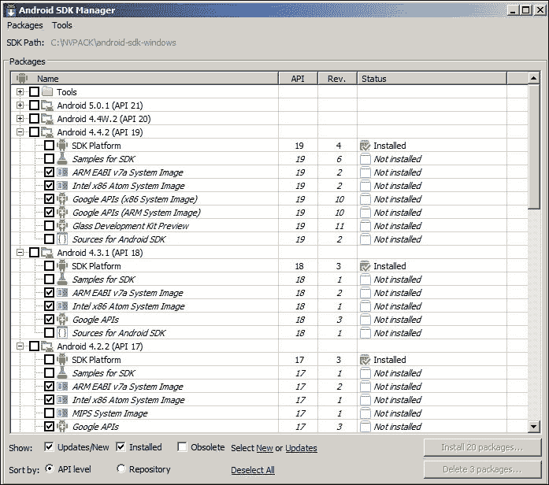
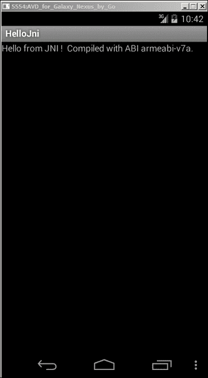
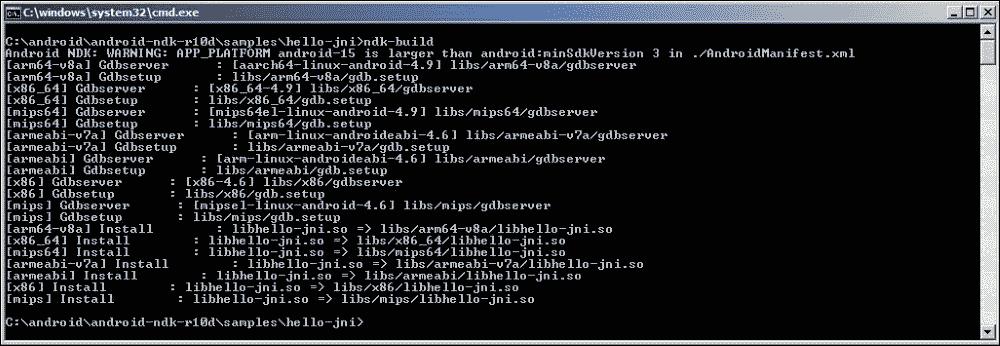
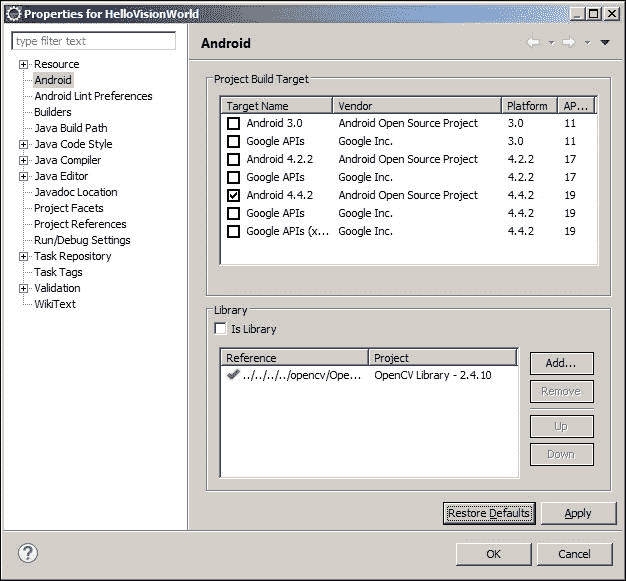

# 第 1 章。准备就绪

在本章中，我将逐步介绍如何开始使用 **OpenCV** 开发具有视觉感知的 Android 应用程序。

**开放** **源计算机视觉**（ **OpenCV** ）软件库具有 2500 多种优化算法； 该库包括一整套经典和最先进的计算机视觉和机器学习算法。 它已经存在了十年，并根据 **Berkeley 软件** **发行版**（ **BSD** ）许可证发布，使用户易于使用和修改 码。

OpenCV 被下载了超过 700 万次，并被 Google，Yahoo，Microsoft，Intel，IBM，Sony 和 Honda 等知名公司使用。 此外，OpenCV 支持多种桌面和移动操作系统，包括 Windows，Linux，Mac OS X，Android 和 iOS。

在本书中，我们将使用适用于 Android 的 OpenCV，它是可在 Android 操作系统上运行的 OpenCV 的一部分。

我将介绍两种安装和准备方案。 首先，如果您要开始全新安装 Android，建议您从 **Tegra Android 开发包**（ **TADP** ）开始。 另一种情况是手动安装运行 OpenCV 的 Android 所需的每个组件。 如果您先前已经安装了 Android 开发环境，则可能会选择此选项。 我们将涵盖以下主题：

*   安装 Tegra Android 开发包
*   手动安装 OpenCV 和 Android 开发环境
*   了解**本机开发套件**（ **NDK** ）的工作方式
*   使用 OpenCV 构建您的第一个 Android 项目

# 安装 Tegra Android 开发包

NVIDIA 发布了 TADP ，以使 Android 开发环境的准备工作变得无缝。

NVIDIA 已发布 TADP 3.0r4 版本，以支持 Android SDK（23.0.2），NDK（r10c）和 OpenCV for Tegra 2.4.8.2，这是一个常规的 OpenCV4Android SDK，已通过 Tegra 特定的优化进行了扩展。

## 下载并安装 TADP

要获取 TADP，请访问[这个页面](https://developer.nvidia.com/tegra-android-development-pack)并按照步骤成为注册开发者； 它是免费会员。

激活成员身份后，登录并下载与您的操作系统相对应的版本。 NVIDIA 支持以下操作系统：

*   Windows 64 位
*   Mac OS X
*   Ubuntu Linux（32/64 位）

就我而言，我的计算机上装有 Windows 7 64 位，因此从现在开始，所有后续步骤都经过了测试，并且在此操作系统上运行良好。 但是，如果您使用其他操作系统，我预计不会有任何重大变化。

### 注意

对于 Ubuntu 安装，TADP 将需要您具有 root 特权，因此请确保您具有。

下载完 TADP 安装程序后，启动它并执行以下步骤：

1.  阅读并接受许可协议后，请按照屏幕上的说明进行操作。
2.  You will need to choose the type of installation. Select a **Custom** installation and click on the **Next** button:

    

3.  Select the components to be installed as depicted and click on the **Next** button:

    

4.  You need to name the installation and download the directory.

    ### 注意

    请注意，如果您以前安装过，则会收到一条警告消息，提示您需要卸载以前的安装。 要卸载先前的安装，请转到先前的安装目录并运行`tadp_uninstall.exe`。

    有时，卸载程序无法清除所有内容。 在这种情况下，您需要手动删除先前安装目录的内容。

5.  现在，您可以安装选定的组件了。 单击**下一个**按钮。
6.  如果您在代理后面，则可以输入代理详细信息； 否则，单击 **Next** 按钮。
7.  安装程序将开始下载所有选定的组件。 这可能需要一段时间，具体取决于您的 Internet 连接。
8.  After the download has finished, click **Next** to start installing the selected components.

    ### 注意

    有时，安装程​​序窗口将不响应。 没关系 几分钟后，安装将以正常方式继续。

9.  选择所需的安装后操作，然后单击**完成**按钮。

## TADP 安装后配置

是的，TADP 将为您下载并安装所有内容； 但是，您仍然需要进行一些安装后配置，以确保一切正常。

### 安装仿真器系统映像

如果您想以该 SDK 平台为目标运行仿真器，则需要为安装的每个 Android SDK 平台安装一个系统映像。

为此，只需遵循以下简单步骤：

1.  转到在安装 TADP 时选择的安装目录。
2.  打开 SDK 文件夹； 在这种情况下，它是`android-sdk-windows`。
3.  运行 **SDK Manager** 。
4.  For every installed Android *X.X*, select a system image for the emulator, such as **ARM EABI V7a System Image**:

    

5.  单击**安装软件包**。
6.  阅读并接受所选组件的许可协议。
7.  单击 **安装**。

现在，您可以在任何已安装目标的仿真器上测试应用程序。

### 配置 Eclipse 以与 NDK 一起使用

您还需要配置 Eclipse 以使其与 NDK 一起运行，以便您可以直接从 Eclipse 构建本机应用程序：

1.  从先前指定的安装目录启动 Eclipse。
2.  打开**窗口** | **首选项**。
3.  在左侧窗格中，打开 **Android 树**。
4.  选择标记为 **NDK** 的树节点。
5.  在右窗格中，单击**浏览**并选择 **NDK** 目录； 您将在安装目录下找到它。
6.  单击**，然后单击**。

### NDK 验证

由于 OpenCV 库是用 C / C ++编写的，因此，验证您的环境是否正常运行的第一步是确保您能够运行使用本机代码的 Android 应用程序：

1.  启动 Eclipse。
2.  从 **NDK** 安装目录（在我的情况下为`C:\NVPACK\android-ndk-r10c\`），从`samples`文件夹中导入`hello-jni`示例项目，就像要导入任何其他 Android 项目一样。
3.  右键单击`HelloJni`项目。
4.  在上下文菜单中，选择 **Android 工具** | **添加本机支持**。
5.  确保将库名称设置为`hello-jni`； 默认情况下，应将其命名为此。
6.  用您选择的目标启动仿真器。
7.  右键单击项目浏览器中的`hello-jni`项目。 在上下文菜单中，选择**以**身份运行| **Android 应用程序**。

在控制台输出中，应该有`.so`文件的列表； 这些是 NDK 使用**应用程序二进制接口**（ **ABI** ）构建的本机共享库，该库确切定义了机器代码的外观。

Android NDK 支持不同的架构。 默认情况下，如果在`application.mk`文件中指定了`.so`，则除了 MIPS 和 x86 之外，还将为 ARM EABI 生成`.so`。 我们将在本章后面讨论这个主题。

如果一切运行顺利，则您的模拟器应具有一个运行如下的应用程序：



该应用程序非常简单，是一个很好的检查点，它可以验证您是否可以从 Android 应用程序调用本机代码。

基本上，您在模拟器屏幕上看到的是从本机代码返回并由 Android 框架在文本视图中显示的字符串。

# 手动安装 OpenCV 和 Android 开发环境

要选择手动安装 OpenCV 和 Android 开发环境，您的计算机上可能已安装了以下组件：

*   Java SE 开发套件 6
*   Android Studio
*   Android SDK
*   Eclipse IDE
*   Eclipse 的 ADT 和 CDT 插件
*   Android NDK
*   OpenCV4Android SDK

您可以按照手动安装步骤进行操作，以确保已准备好并正确配置了所有需要的组件，以便开始使用 OpenCV 开发 Android 应用程序。

## Java SE 开发套件 6

您可以从[这个页面](http://www.oracle.com/technetwork/java/javase/downloads/index.html)下载适用于您的 OS 的 JDK 安装程序。

## Android Studio

另一个非常好的选项是 Android Studio。 您可以从[这个页面](http://developer.android.com/sdk/index.html)下载 Android Studio。 请注意，Android Studio 与 Android SDK 捆绑在一起，因此如果使用此选项，则无需安装它。 此外，您可以跳过 Eclipse 和 ADT 的安装，并注意从 Android Studio 1.3 开始； 您还将找到对 NDK 的内置支持。

## Android SDK

要下载并安装 Android SDK，请按照以下步骤操作：

1.  访问[这个页面](http://developer.android.com/sdk/index.html)。
2.  向下滚动至 **SDK Tools Only** 部分，然后单击 Windows 安装程序链接的`.exe`文件。
3.  阅读并接受条款和条件后，请单击下载按钮。
4.  将安装程序保存在磁盘上，然后单击`.exe`文件以启动安装程序，然后按照屏幕上的说明进行操作。
5.  记下 SDK 目录，以便以后从命令行引用它。
6.  安装完成后， **Android SDK Manager** 将启动。
7.  选择安装 **Android SDK 工具**，版本 20 或更高版本。
8.  对于 Android 的 SDK 平台，请选择 **Android 3.0（API 11）**或更高版本。 就我而言，我使用了 **API 15** ，建议您这样做。
9.  阅读并接受许可协议，然后单击**安装**。

## Eclipse IDE

对于 OpenCV 2.4。 *x* ，建议使用 Eclipse 3.7（Indigo）或 Eclipse 4.2（Juno）； 您可以从 Eclipse 的[官方网站](http://www.eclipse.org/downloads/)下载您选择的版本。

## 用于 Eclipse 的 ADT 和 CDT 插件

假设您已经下载了 Eclipse，则可以按照以下步骤下载 **Android 开发人员工具**（ **ADT** ）和 **C / C ++开发工具**（ **CDT** ）插件：

1.  启动 Eclipse，然后导航至**帮助** | **安装新软件**。
2.  单击右上角的**添加**按钮。
3.  在**添加存储库**对话框中，在**名称**字段中写入`ADT Plug-in`，[然后复制并粘贴此 URL](https://dl-ssl.google.com/android/eclipse/)，在**位置**字段中。
4.  单击**，然后单击**。
5.  选中**开发人员工具**复选框。
6.  单击**，然后单击**。
7.  下一个窗口将显示要下载的工具列表。 只要确保它包含本机支持工具（CDT），然后单击**，然后单击**。
8.  阅读并接受许可协议，然后单击**完成**。
9.  安装完成后，您将需要重新启动 Eclipse。

## Android NDK

按照的要求为 C ++开发 Android，您需要安装 Android NDK。

### 注意

并非要在所有情况下都使用 Android NDK。 作为开发人员，您需要在使用本机 API 带来的性能提升与引入的复杂性之间取得平衡。

在我们的情况下，由于`OpenCV`库是用 C / C ++编写的，因此我们可能必须使用 NDK。 但是，不应仅仅因为程序员更喜欢用 C / C ++编写代码而使用 NDK 。

### 下载 Android NDK

您可以按照以下步骤下载 Android NDK：

1.  [转到 **Android NDK** 主页](http://developer.android.com/tools/sdk/ndk/index.html)。
2.  在**下载** 部分中，选择与您的操作系统相对应的版本。 就我而言，它是 **Windows 64 位**。
3.  阅读并同意条款和条件。
4.  单击**下载**按钮。

### 安装和配置 Android NDK

下载完成后，您需要按照以下步骤配置 NDK：

1.  导航至 **NDK** 下载文件夹的。
2.  双击下载的文件将其解压缩。
3.  重命名并移动提取的文件夹； 我将`ndk`文件夹称为`<ndk_home>`。 现在，您可以使用 NDK 来构建项目了。
4.  如果您希望从命令行进行构建，则需要将`<ndk_home>`文件夹（在我的情况下为`C:/android/android-ndk-r10d`）添加到 **PATH** 环境变量中。 对于 Windows，请打开 CMD。 输入以下命令，并将`ndk`目录替换为您的目录：

    ```java
    set PATH=%PATH%;c:/android/android-ndk-r10d

    ```

5.  要检查 NDK 的配置是否正确，请转到包含项目的目录。 为简单起见，您可以在`hello-jni`示例项目上进行测试。 您可以在`<ndk_home>/samples/`下找到它。
6.  通过执行命令`cd <your_project_directory>/`更改目录。 运行以下命令：

    ```java
    ndk-build

    ```

7.  As depicted in the console output, the files with the `.so` extension are the compiled version of the C/C++ source code used in this project:

    

### 使用 Eclipse 构建本机代码

如果您更喜欢从 Eclipse 构建，这更方便，则需要告诉 Eclipse 在哪里可以找到 NDK，以便可以构建应用程序：

1.  启动 Eclipse 并打开**窗口** | **首选项**。
2.  在左侧窗格中，打开 **Android** 树。
3.  选择 **NDK** 树节点，然后在右侧窗格中单击**浏览**，然后选择`<ndk_home>`目录。
4.  单击**，然后单击**。
5.  从`<ndk_home>/samples/`导入`hello-jni`示例项目作为 Android 项目。
6.  打开项目资源管理器，然后右键单击`hello-jni`项目。
7.  在上下文菜单中，导航到 **Android 工具** | **添加本机支持**将此项目转换为 C ++项目。
8.  接受默认的库名称，然后单击**完成**。
9.  生成应用程序。

在控制台中，您将看到`.so`文件的列表，这些文件是此项目的已编译 C ++部分。 不过，如果您从导入的项目中打开任何 C / C ++文件，您将看到许多突出显示的错误。 您只需要执行一些与 CDT 插件相关的步骤：

1.  导航到**项目** | **属性**。 在左侧窗格中，展开 **C / C ++ General** 节点。
2.  选择**路径和符号**。
3.  在右侧窗格中，选择**包括**选项卡。
4.  单击**添加**，然后单击**文件系统**添加以下路径：
    *   If you installed NDK r8 or prior:

        `<ndk_home>/platforms/android-9/arch-arm/usr/include<ndk_home>/sources/cxx-stl/gnu-libstdc++/include<ndk_home>/sources/cxx-stl/gnu-libstdc++/libs/armeabi-v7a/include`

    *   If you installed NDK r8b or later:

        `<ndk_home> /platforms/android-9/arch-arm/usr/include`

        `<ndk_home>/sources/cxx-stl/gnu-libstdc++/4.6/include`

        `<ndk_home> /sources/cxx-stl/gnu-libstdc++/4.6/libs/armeabi-v7a/include`

5.  单击**，然后单击**。 Eclipse 将重建项目，并且应从 Eclipse 中清除所有语法错误。
6.  现在，您可以构建项目以将 Java 代码和本机代码打包在一个 APK 中。 要将应用程序安装在您选择的仿真器上，请使用菜单项**运行** | **运行方式为** | **Android 应用程序**。

## OpenCV4Android SDK

为了能够在您的 Android 设备上使用本机（C / C ++）库的 OpenCV 集合，您需要安装 OpenCV4Android SDK，它是 OpenCV 的一部分，可以在 Android 操作系统上运行。

1.  首先，[转到 OpenCV 下载页面](http://sourceforge.net/projects/opencvlibrary/files/opencv-android/)。
2.  下载最新可用版本，在撰写本书时为 **2.4.10** 。
3.  Extract the compressed file to a convenient path, for example, `C:\opencv\`.

    ### 注意

    强烈建议使用无空格的路径，以避免`ndk-build`出现任何问题。

# 了解 NDK 的工作方式

无论您是使用 TADP 进行全新安装，还是按照手动设置步骤进行操作，在此阶段，您都应该具有开发视觉感知的 Android 应用程序所需的所有组件。

在继续我们的第一个示例之前，让我们先详细说明 NDK 的工作方式。 熟悉 Android NDK 的基础知识并习惯使用它始终是一个好主意，因为它将成为我们使用 OpenCV 开发 Android 应用程序的基石。

## NDK 概述

如果您决定使用命令提示符编译 Android 应用程序的本机部分，则必须使用`ndk-build`工具。 `ndk-build`工具实际上是一个脚本，它将启动负责以下内容的不同构建脚本：

*   它会自动搜索您的项目，以决定要构建什么
*   搜索完成后，脚本开始生成二进制文件并管理依赖项
*   它将生成的二进制文件复制到您的项目路径

除了`ndk-build`工具之外，您还应该熟悉其他一些主要组件，其中包括：

*   **Java and native calls**: Android applications are written in Java, and once the source code is compiled, it is transformed to bytecode so that the Android OS runs under the **Dalvik** or **Android Runtime** (**ART**) virtual machine.

    ### 注意

    请注意，仅在 Dalvik 虚拟机上对执行本机代码的应用程序进行测试。

    使用本机代码中实现的方法时，应使用`native`关键字。

    例如，您可以声明一个将两个数字相乘的函数，并指示编译器它是本机库：

    ```java
    public native double mul(double x, double y);
    ```

*   **本机共享库**：NDK 使用扩展名`.so`构建这些库。 顾名思义，这些库在运行时是共享和链接的。
*   **本机静态库**：NDK 也以扩展名`.a`来构建这些库； 这类库实际上是在编译时链接的。
*   **Java 本机接口**（ **JNI** ）：在用 Java 编写 Android 应用程序时，您需要一种方式将调用引导到用 C / C ++编写的本机库中， JNI 派上用场了。
*   **应用程序二进制接口（ABI）**：该接口定义了应用程序计算机代码的外观，因为您可以在不同的计算机体系结构上运行应用程序。 默认情况下，NDK 为 ARM EABI 构建代码。 但是，您也可以选择要为 MIPS 或 x86 构建的。
*   **Android.mk** ：将此文件视为 Maven 生成脚本或更好的 make 文件，该文件指示`ndk-build`脚本有关模块的定义及其名称，所需的源文件 编译，以及您需要链接的库。 了解如何使用此文件非常重要，我们稍后将返回至更多信息。
*   **Application.mk** ：创建此文件是可选的，用于列出您的应用程序所需的模块。 该信息可以包括用于为特定目标体系结构，工具链和标准库生成机器代码的 ABI。

考虑到这些组件，您可以总结出为 Android 开发本机应用程序的一般流程，如下所示：

1.  确定哪些部分将用 Java 编写，哪些部分将用本机 C / C ++编写。
2.  在 Eclipse 中创建一个 Android 应用程序。
3.  创建一个`Android.mk`文件来定义您的模块，列出要编译的本机源代码文件，并枚举链接的库。
4.  创建`Application.mk`； 这是可选的。
5.  将您的`Anrdoid.mk`文件复制到项目路径中的`jni`文件夹下。
6.  使用 Eclipse 构建项目。 当我们将 Eclipse 链接到已安装的 NDK 时，`ndk-build`工具将编译`.so`和`.a`库，您的 Java 代码将被编译为`.dex`文件，所有内容都将打包在一个 APK 文件中， 准备安装。

### NDK 的简单示例

当您开发具有本机支持的 Android 应用程序时，您需要熟悉使用 NDK 的典型 Android 应用程序的一般结构。

通常，您的 Android 应用程序具有以下文件夹结构。 项目`root`文件夹具有以下子目录：

*   `jni/`
*   `libs/`
*   `res/`
*   `src/`
*   `AndroidManifest.xml`
*   `project.properties`

这里，与 NDK 相关的文件夹如下：

*   `jni`文件夹将包含应用程序的本机部分。 换句话说，这是带有 NDK 构建脚本（例如`Android.mk`和`Application.mk`）的 C / C ++源代码，它们是构建本机库所需的。
*   The `libs` folder will contain the native libraries after a successful build.

    ### 注意

    NDK 构建系统需要`AndroidManifest.xml`和`project.properties`文件来编译应用程序的本机部分。 因此，如果缺少这些文件中的任何一个，则需要先编译 Java 代码，然后再编译 C / C ++代码。

#### Android.mk

在本节中，我将描述构建文件的语法。 如前所述，`Android.mk`实际上是 GNU makefile 片段，构建系统会对其进行解析以了解在项目中构建什么。 该文件的语法允许您定义模块。 模块是以下之一：

*   静态库
*   共享库
*   独立的可执行文件

您已经使用`ndk-build`来构建`hello-jni`项目，因此让我们看一下该项目`Android.mk`文件的内容：

```java
LOCAL_PATH := $(call my-dir)
include $(CLEAR_VARS)

LOCAL_MODULE    := hello-jni
LOCAL_SRC_FILES := hello-jni.c

include $(BUILD_SHARED_LIBRARY)
```

现在，让我们一一介绍这些行：

*   `LOCAL_PATH := $(call my-dir)`：这里，脚本定义了一个名为`LOCAL_PATH`的变量，并通过调用`my-dir`函数设置其值，该函数返回当前工作目录。
*   `include $(CLEAR_VARS)`：在此行中，脚本包含另一个名为`CLEAR_VARS`的 GNU makefile，用于清除所有局部变量-以`Local_XXX`开头的变量，但`LOCAL_PATH`除外。 这是必需的，因为构建文件是在单执行执行上下文中解析的，其中所有变量都声明为全局变量。
*   `LOCAL_MODULE := hello-jni`: Here, the script defines a module called `hello-jni`. The `LOCAL_MODULE` variable must be defined and unique to identify each module in `Android.mk`.

    ### 注意

    构建系统将在您定义的模块中添加`lib`前缀和`.so`后缀。 在示例情况下，生成的库将被命名为`libhello-jni.so`。

*   `LOCAL_SRC_FILES := hello-jni.c`: As the name suggests, you will list all the source files that you need be built and assembled in one module.

    ### 注意

    您仅列出源文件，而不列出头文件； 构建系统负责为您计算依赖关系。

*   `include $(BUILD_SHARED_LIBRARY)`：这里包括另一个 GNU makefile，它将收集您在最后一个`include` 命令之后定义的所有信息，并确定要构建的内容以及如何构建模块。

# 使用 OpenCV 构建您的第一个 Android 项目

在开发环境启动并运行并且具有适当的 NDK 背景的情况下，我可以开始组装如何在 Android 应用程序中使用 OpenCV 库的全景图。

适用于 Android 的 OpenCV 支持通过其本地 API 和 Java 包装 API 访问其功能。 对于本机 API，您将使用 Android NDK 定义本机库，并包含您正在使用的 OpenCV 库。 然后，您将使用 **Java 本机接口**（ **JNI** ）从 Java 代码调用本机库。

另一个选择是使用常规的 Java 导入直接在 Java 代码中使用 OpenCV Java 包装器。 将会发生的是，Java 包装器将使用 JNI 将您的调用引导至本机 OpenCV 库。

当然，取决于您选择哪种样式。 但是，您应该理解，使用本机调用可以减少 JNI 开销，但需要更多的编程工作。 另一方面，使用 Java 包装器可能会导致较少的编程工作而导致更多的 JNI 开销。

### 注意

考虑这种情况：您正在处理视频帧或静止图像，并且在您的算法中，您将调用几个 OpenCV 函数。 在这种情况下，最好编写一个调用所有这些函数的本机库。 在您的 Android 应用程序中，您只能使用一个 JNI 调用来访问此本机库。

## HelloVisionWorld Android 应用程序

我们将构建我们的第一个 Android 应用程序，以从相机实时获取预览帧，并使用 OpenCV 的 Java 相机 API 在全屏上显示预览。

### 在 Eclipse 中创建项目

之后是在 Eclipse 中创建项目的步骤：

1.  启动 Eclipse 并创建一个新的工作区。
2.  创建一个新的 Android 项目，并将您的应用程序命名为 **HelloVisionWorld** 。
3.  设置**最低 SDK** 版本。 要使用 OpenCV4Android SDK 进行构建，最低 SDK 版本为 11； 但是，强烈建议使用 **API 15** 或更高版本。 就我而言，我使用了 **API 15** 。
4.  选择**目标 SDK** 。 就我而言，我将其设置为 **API 19** 。 单击**，然后单击**。
5.  允许 Eclipse 创建**新的空白活动**，并使用名为`activity_hello_vision`的布局将其命名为`HelloVisionActivity`。
6.  将`OpenCV`库项目导入到您的工作区中。 导航到**文件** | **导入** | **现有的 Android 代码到工作区**中。
7.  Select the `root` directory of OpenCV4Android SDK. **Deselect All** the sample projects and select only `OpenCV Library` and click `Finish`:

    

8.  Reference the OpenCV library from your **Android** project. Click **Project** | **Properties**. Select the **Android** tree node from the left-hand side pane and in the right-hand side pane, click **Add** in the **Library** section and then **OK**:

    

### 在 Android Studio 中创建项目

之后是在 Android Studio 中创建项目的步骤：

1.  启动 **Android Studio** 。
2.  创建一个新的 **Android Studio** 项目，并将其命名为`HelloVisionWorld`，并将**公司域**设置为`app0.com`。
3.  选择**最小 SDK** 。 要使用 OpenCV4Android SDK 进行构建，**最低 SDK** 版本为 **11** 。
4.  创建一个空白活动并将其命名为`HelloVisionActivity`。
5.  要将`OpenCV`作为依赖项添加到您的项目，请导航至**文件** | **新增** | **导入模块**和 **< OpenCV4Android_Directoy > \ sdk \ java** 。 然后，单击 **OK** 。 此时，取决于从 Android SDK 安装的组件，您可能会遇到一些问题。 Android Studio 将提出快速修复链接来解决此类错误，这应该是一个简单的修复方法。
6.  在项目视图中右键单击新创建的应用程序，然后选择**打开模块设置**或按 *F4* 。
7.  在**依赖项**选项卡中，按 **+** 按钮，然后选择**模块依赖项**。
8.  选择 OpenCV 库，然后按**添加**。 现在，您应该能够将 OpenCV 类导入到您的项目中了。

继续前进，无论选择哪种 IDE，您都应该能够按照以下步骤操作：

1.  Open the `layout` file and edit it to match the following code. We added the OpenCV namespace and defined a Java camera view layout:

    ```java
    <RelativeLayout xmlns:android="http://schemas.android.com/apk/res/android"
        xmlns:tools="http://schemas.android.com/tools"
        xmlns:opencv="http://schemas.android.com/apk/res-auto"
        android:layout_width="match_parent"
        android:layout_height="match_parent"
        android:paddingBottom="@dimen/activity_vertical_margin"
        android:paddingLeft="@dimen/activity_horizontal_margin"
        android:paddingRight="@dimen/activity_horizontal_margin"
        android:paddingTop="@dimen/activity_vertical_margin"
        tools:context="com.example.hellovisionworld.HelloVisionActivity" >
        <org.opencv.android.JavaCameraView
            android:layout_width="fill_parent"
            android:layout_height="fill_parent"
            android:visibility="gone"
            android:id="@+id/HelloVisionView"
            opencv:show_fps="true"
            opencv:camera_id="any" />
    </RelativeLayout>
    ```

    ### 注意

    **下载示例代码**

    您可以从[这个页面](http://www.packtpub.com)下载从帐户购买的所有 Packt 书籍的示例代码文件。 如果您在其他地方购买了此书，则可以访问[这个页面](http://www.packtpub.com/support)并进行注册，以便将文件直接通过电子邮件发送给您。

2.  由于我们将使用设备相机进行，因此我们需要在`AndroidManifest`文件中设置一些权限：

    ```java
    </application>

    <uses-permission android:name="android.permission.CAMERA"/>

    <uses-feature android:name="android.hardware.camera" android:required="false"/>
    <uses-feature android:name="android.hardware.camera.autofocus" android:required="false"/>
    <uses-feature android:name="android.hardware.camera.front" android:required="false"/>
    <uses-feature android:name="android.hardware.camera.front.autofocus" android:required="false"/>
    ```

3.  在`AndroidManifest`文件中隐藏标题和系统按钮：

    ```java
    <application
        android:icon="@drawable/icon"
        android:label="@string/app_name"
        android:theme="@android:style/Theme.NoTitleBar.Fullscreen" >
    ```

4.  We need to initialize the OpenCV library in the created activity. To do so, we use asynchronous initialization using the OpenCV Manager service to access the OpenCV libraries externally installed in the target system. First, we need to install the OpenCV Manager on the emulator that we will use. To do so, use the `adb install` command in the command prompt:

    ```java
    adb install <OpenCV4Android SDK_Home>\apk\OpenCV_2.4.X_Manager_2.X_<platform>.apk

    ```

    用您的 OpenCV 安装文件夹替换`<OpenCV4Android SDK_Home>`，用`apk`文件夹中的可用版本替换`apk`名称中的`X`。

    对于`<platform>`，请使用下表根据仿真器上安装的系统映像选择要安装的平台：

    <colgroup><col> <col></colgroup> 
    | 

    硬件平台

     | 

    包裹名字

     |
    | --- | --- |
    | armeabi-v7a（ARMv7-A +霓虹灯） | OpenCV_2.4.X_Manager_2.X_armv7a-neon.apk |
    | armeabi（ARMv5，ARMv6） | OpenCV_2.4.X_Manager_2.X_armeabi.apk |
    | 英特尔 x86 | OpenCV_2.4.X_Manager_2.X_x86.apk |
    | MIPS | OpenCV_2.4.X_Manager_2.X_mips.apk |

    ### 注意

    在真实设备上测试应用程序时，将显示一条消息，要求您从 Google Play 下载 OpenCV 管理器，因此请单击**是**并检查其支持的 OpenCV 版本，以便您可以加载它 通过异步初始化。

5.  在`Activity`中，定义以下内容并相应地修复导入：

    ```java
    //A Tag to filter the log messages
    private static final String  TAG = "Example::HelloVisionWorld::Activity";

    //A class used to implement the interaction between OpenCV and the //device camera.
    private CameraBridgeViewBase mOpenCvCameraView;

    //This is the callback object used when we initialize the OpenCV //library asynchronously
    private BaseLoaderCallback mLoaderCallback = new BaseLoaderCallback(this) {

        @Override
           //This is the callback method called once the OpenCV //manager is connected
        public void onManagerConnected(int status) {
          switch (status) {
      //Once the OpenCV manager is successfully connected we can enable the camera interaction with the defined OpenCV camera view
          case LoaderCallbackInterface.SUCCESS:
            {
              Log.i(TAG, "OpenCV loaded successfully");
              mOpenCvCameraView.enableView();
            } break;
              default:
                {
                  super.onManagerConnected(status);
                } break;
           }
        }
    };
    ```

6.  更新 `onResume`活动回调方法以加载 OpenCV 库并相应地修复导入：

    ```java
    @Override
    public void onResume(){

      super.onResume();

    //Call the async initialization and pass the callback object we //created later, and chose which version of OpenCV library to //load. Just make sure that the OpenCV manager you installed //supports the version you are trying to load.
      OpenCVLoader.initAsync(OpenCVLoader.OPENCV_VERSION_2_4_10, this, mLoaderCallback);
    }
    ```

7.  您的活动需要实现`CvCameraViewListener2`，才能从 OpenCV 摄像机视图接收摄像机帧：

    ```java
    public class HelloVisionActivity extends Activity implements CvCameraViewListener2
    ```

8.  相应地修复导入错误，并在您的活动中插入未实现的方法。
9.  在`onCreate`活动回调方法中，我们需要将 OpenCV 摄像机视图设置为可见，并且将您的活动注册为将处理摄像机帧的回调对象：

    ```java
    @Override
    protected void onCreate(Bundle savedInstanceState) {
      Log.i(TAG, "called onCreate");

      super.onCreate(savedInstanceState);
        getWindow().addFlags(WindowManager.LayoutParams.FLAG_KEEP_SCREEN_ON);
      setContentView(R.layout.activity_hello_vision);

      mOpenCvCameraView = (CameraBridgeViewBase) findViewById(R.id.HelloVisionView);

      //Set the view as visible
      mOpenCvCameraView.setVisibility(SurfaceView.VISIBLE);

      //Register your activity as the callback object to handle //camera frames
      mOpenCvCameraView.setCvCameraViewListener(this);
    }
    ```

10.  最后一步是接收摄像机帧。 为此，请更改`onCameraFrame`回调方法的实现：

    ```java
    public Mat onCameraFrame(CvCameraViewFrame inputFrame) {

      //We're returning the colored frame as is to be rendered on //thescreen.
      return inputFrame.rgba();
    }
    ```

11.  现在，您可以在模拟器或真实设备上构建和安装应用程序了。
12.  This is the application running on an emulated camera:

    

# 摘要

到目前为止，您应该已经开发并测试了您的第一个可感知视觉的 Android 应用程序。 在本章中，您学习了如何使用 TADP 通过 OpenCV 设置 Android 开发环境，或者通过手动方案更新现有环境。

此外，您已经了解了 NDK 的基础知识及其工作方式。 最后，您已经了解了如何使用 OpenCV 摄像机视图捕获摄像机帧并将其显示在设备屏幕上。 此示例将成为我们实施更多有趣构想的基础。