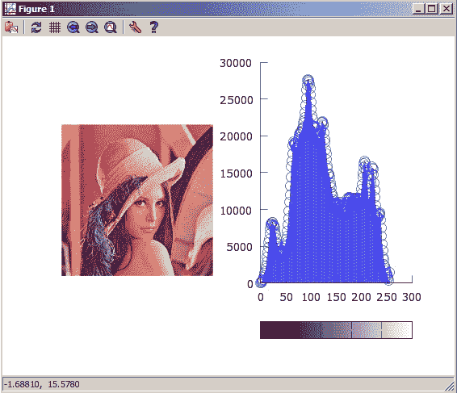
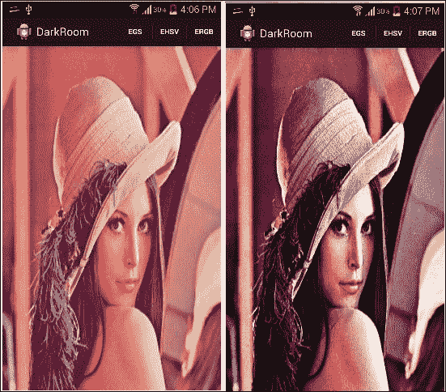
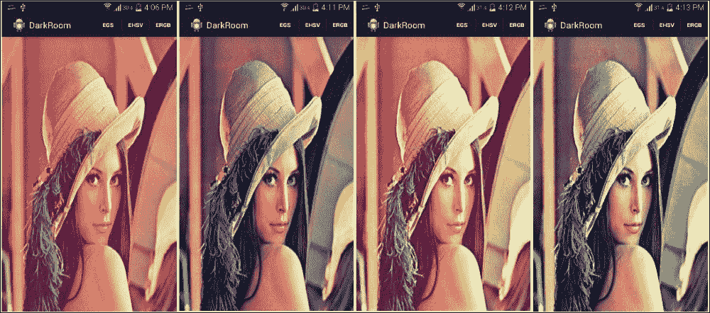

# 第 2 章。应用 1-建立自己的暗室

在本章中，您将学习如何在 OpenCV 中存储和表示图像，以及如何利用这种表示来实现有趣的算法，这些算法将增强图像的外观。

我们将首先解释数字图像表示和不同的色彩空间，以探索 OpenCV 中重要的`Mat`类。

然后，我们将逐步执行从手机图库加载图像并将其显示在设备屏幕上的操作，而不管图像分辨率如何。

最后，您将了解图像直方图，以及如何计算和使用它们来增强图像（无论是黑白图像还是彩色图像）。

我们将在本章介绍以下主题：

*   数码图像
*   处理手机中存储的图像
*   计算图像直方图
*   增强图像对比度

# 数码图像

无论我们在哪里，都可以在我们周围找到图片； 因此，如果我们想自动理解，处理和分析这些图像，那么了解图像的表示方式以及图像的颜色映射是非常重要的。

## 色彩空间

我们生活在一个连续的世界中，因此要在离散的数字传感器中捕获场景，就必须进行离散的空间（布局）和强度（颜色信息）映射，以便将真实世界的数据存储在数字图像中 。

二维数字图像`D(i, j)`从左上开始代表在由行号`i`和列号`j`表示的像素处的传感器响应值，角为`i = j = 0`。

为了表示颜色，数字图像通常包含一个或多个通道来存储每个像素的强度值（颜色）。 使用最广泛的颜色表示法是单通道图像，也称为灰度图像，其中根据像素的强度值为每个像素分配灰色阴影：零是黑色，最大强度是白色。

如果使用从 0 到`2^8 - 1`的值的无符号字符表示色深信息，则每个像素可以存储从 0（黑色）到 255（白色）的强度值。

除了灰度颜色映射外，还有真彩色映射，其中颜色由三个通道而不是一个通道表示，并且像素值变为三个元素（红色，绿色和蓝色）的元组。 在这种情况下，颜色表示为三个通道值的线性组合，并且图像被视为三个二维平面。

### 注意

有时，添加了名为 **Alpha** 的第四个通道，用于表示颜色透明度。 在这种情况下，图像将被视为四个二维平面。

与 RGB 表示相比，要考虑的色彩空间与人类对颜色的理解和感知更相关。 它是**色相，饱和度和值**（**HSV**）色彩空间。

每个颜色尺寸可以理解如下：

*   **色相**（`H`）：它是颜色本身，红色，蓝色或绿色。
*   **饱和度**（`S`）：它测量颜色的纯度； 例如，它是暗红色还是暗红色？ 可以想象一下，多少白色遮住了颜色。
*   **值**（`V`）：它是颜色的亮度，也称为亮度。

最后要考虑的图像类型是二进制图像。 它是像素的二维阵列。 但是，每个像素只能存储零或一的值。 这种类型或表示形式对于解决视觉问题（例如边缘检测）很重要。

具有像素的二维数组或三个二维平面来表示图像，其中每个单元或像素在 RGB 颜色空间的情况下包含颜色的强度值，在情况下包含色相，饱和度和值 HSV 色彩空间的大小，将图像缩小为数值矩阵。 由于 OpenCV 的主要重点是处理和操纵图像，因此您需要了解的第一件事是 OpenCV 如何存储和处理图像。

## `Mat`类

在使用 OpenCV 开发视觉感知应用程序时，将使用的最重要的基本数据结构是`Mat`类。

`Mat`类表示`n`维密集数字单通道或多通道数组。 基本上，如果您使用`Mat`类表示灰度图像，则`Mat`对象将是存储像素强度值的二维数组（具有一个通道）。 如果使用`Mat`类存储全彩色图像，则`Mat`对象将是具有三个通道的二维数组（一个通道用于红色强度，一个通道用于绿色，一个通道用于蓝色），并且同样适用 HSV 颜色空间。

与任何 Java 类一样，`Mat`类具有构造函数列表，并且在大多数情况下，默认构造函数就足够了。 但是，在某些其他情况下，您可能希望使用特定的大小，类型和通道数来初始化`Mat`对象。

在这种情况下，可以使用以下构造函数：

```java
int numRow=5;
int numCol=5;
int type=org.opencv.core.CvType.CV_8UC1;
Mat myMatrix=newMat(numRow,numCol,type);
```

该构造函数采用三个整数参数：

*   `int Rows`：新矩阵行的数量
*   `int Cols`：新矩阵列的数量
*   `int type`：新矩阵类型

### 注意

为了指定`Mat`类存储的类型以及有多少个通道，OpenCV 为您提供了`CvType`类和`static int`字段，并具有以下命名约定：

```java
CV_[数据类型大小，8 | 16 | 32 | 64][有符号，无符号整数或浮点数，S | U | F][通道数，C1 | C2 | C3 | C4]
```

例如，您将类型参数指定为`org.opencv.core.CvType.CV_8UC1`； 这意味着矩阵将通过一个通道保存 8 位无符号字符的颜色强度。 换句话说，此矩阵将存储强度为 0（黑色）到 255（白色）的灰度图像。

### 基本`Mat`操作

除了了解数字图像在 OpenCV 库中的表示方式之外，您还需要熟悉可以在`Mat`对象上执行的一些基本操作。

您可以执行的最基本操作是像素级访问，以检索像素值，无论您的色彩空间是灰度级还是全 RGB。 假设您具有第 1 章，“就绪”的应用程序，并且已启动并运行，您可以回想起在`onCameraFrame()`回调方法中，我们正在使用`inputFrame.rgba()`方法检索全彩色相机帧。

使用相机帧，我们可以使用以下代码访问像素值：

```java
@Override
  public Mat onCameraFrame(CvCameraViewFrameinputFrame) {
    Mat cameraFram=inputFrame.rgba();
    double [] pixelValue=cameraFram.get(0, 0);
    double redChannelValue=pixelValue[0];
    double greenChannelValue=pixelValue[1];
    double blueChannelValue=pixelValue[2];
    Log.i(TAG, "red channel value: "+redChannelValue);
    Log.i(TAG, "green channel value: "+greenChannelValue);
    Log.i(TAG, "blue channel value: "+blueChannelValue);
    return inputFrame.rgba();
  }
```

让我们浏览重要的几行，其余的实际上很简单：

```java
double [] pixelValue=cameraFram.get(0, 0);
```

在这一行中，我们调用`get(0,0)`函数并将其传递给行和列索引； 在这种情况下，它是左上方的像素。

请注意，`get()`方法返回一个双精度数组，因为`Mat`对象最多可以容纳四个通道。

在我们的示例中，它是全彩色图像，因此除了一个透明度通道 Alpha（`a`）外，每个像素的红色（`r`），绿色（`g`）和蓝色（`b`）颜色通道的强度都将不同，因此该方法的名称为`rgba()`。

您可以使用数组索引运算符`[]`独立访问每个通道强度，因此对于红色，绿色和蓝色强度，分别使用`0`，`1`和`2`：

```java
double redChannelValue=pixelValue[0];
double greenChannelValue=pixelValue[1];
double blueChannelValue=pixelValue[2];
```

下表列出了您需要熟悉的基本`Mat`类操作：

| 功能 | 代码样例 |
| --- | --- |
| 检索通道数 | `Mat myImage; //declared and initialized` |
| | `int numberOfChannels=myImage.channels();` |
| 制作包括矩阵数据在内的`Mat`对象的深层副本 | `Mat newMat=existingMat.clone();` |
| 检索矩阵列数 | **第一种方法**：`Mat myImage; //declared and initialized` | 
| | `int colsNum=myImage.cols();` |
| | **第二种方法**：`int colsNum=myImage.width();` |
| | **第三种方法**：`//And yes, it is a public instance variable.` | 
| | `int colsNum=myImage.size().width;` |
| 检索矩阵行数 | **第一种方法**：`Mat myImage; //declared and initialized` | 
| | `int rowsNum=myImage.rows();` |
| | **第二种方法**：`int rowsNum=myImage.height();` |
| | **第三种方法**：`//And yes, it is a public instance variable.` |
| | `int rowsNum=myImage.size().height;` |
| 要检索矩阵元素深度（每个通道的类型）： | `Mat myImage; //declared and initialized` | 
| | `int depth=myImage.depth()` |
| | `CV_8U`：8 位无符号整数（0 到 255） |
| | `CV_8S`：8 位有符号整数（-128 至 127） |
| | `CV_16U`：16 位无符号整数（0 到 65,535） |
| | `CV_16S`：16 位有符号整数（-32,768 至 32,767） |
| | `CV_32S`：32 位有符号整数（-2,147,483,648 至 2,147,483,647） |
| | `CV_32F`：32 位浮点数 |
| | `CV_64F`：64 位浮点数 |
| 检索矩阵元素的总数（图像中的像素数） | `Mat myImage; //declared and initialized` |
| | `long numberOfPixels=myImage.total()` |

# 处理手机中存储的图像

在本部分中，您将学习如何从手机上加载图像并对其应用一些有趣的图像处理算法，例如对比度增强，平滑（消除图像中的噪声）以及应用一些过滤器。

## 将图像加载到`Mat`对象

首先创建一个新的 Android 项目，让我们开始。 正如您在上一章中看到的一样，为了开始使用 OpenCV 算法，您需要将 OpenCV 库添加到您的项目中：

1.  启动 **Eclipse**。
2.  创建一个新的 Android 项目应用程序； 我们命名为`DarkRoom`。
3.  选择包名称。 在此示例中，我将其选择为`com.example.chapter2.darkroom`。
4.  将所需的最低 SDK 设置为 **API 11**（Android 3.0）以上。 就我而言，强烈建议将其选择为 **API 16**（Android 4.1）。 对于目标 SDK，应该选择 **API 19**，因为如果使用的目标 SDK 高于 19，则在加载 OpenCV 库时会出现问题。
5.  单击`Next`。
6.  让 Eclipse 为您创建一个空白活动并将其命名为`IODarkRoom`。
7.  完成创建项目。
8.  将 OpenCV 库项目导入到您的工作区文件中，**菜单 | 导入 | 现有的 Android 代码到工作区**。
9.  单击**浏览**并转到您的 OpenCV 安装主目录。
10.  选择 OpenCV 主目录，然后单击`Next`。
11.  取消选择所有项目，然后仅选择 OpenCV 库项目。
12.  点击**完成**。
13.  现在，您需要将新创建的 Android 项目与刚刚导入的 OpenCV 库链接，因此，在新项目上，右键单击**属性**。
14.  在左窗格中，选择`Android`树节点，然后在右窗格中，单击**添加**。
15.  选择 OpenCV 库，然后单击`Next`。

### UI 定义

在此项目中，您将加载手机中存储的图像，将其转换为位图图像，并在图像视图中显示。

让我们从设置应用程序活动的布局开始：

```java
<LinearLayoutxmlns:android="http://schemas.android.com/apk/res/android"
android:layout_width="fill_parent"
android:layout_height="fill_parent"
android:orientation="horizontal">
  <ImageView
  android:id="@+id/IODarkRoomImageView"
  android:layout_width="fill_parent"
  android:layout_height="fill_parent"
  android:src="@drawable/ic_launcher"
  android:layout_marginLeft="0dp"
  android:layout_marginTop="0dp"
  android:scaleType="fitXY"/>
</LinearLayout>
```

这是带有图像视图的简单线性布局。 下一步是设置一些所需的权限。 万一您要从 SD 卡加载图像，则需要设置相应的权限，以便 Android 允许您的应用程序从外部存储设备进行读取和写入。

在清单文件中，添加以下行：

```java
<uses-permissionandroid:name="android.permission.WRITE_EXTERNAL_STORAGE"/>
```

这是写权限； 但是，您的应用程序也被隐式授予读取权限，因为它的限制较少。

现在，让我们继续进行应用程序和活动的定义：

```java
<application
android:allowBackup="true"
android:icon="@drawable/ic_launcher"
android:label="@string/app_name"
android:theme="@style/AppTheme">
  <activity
  android:name=".IODarkRoom"
  android:label="@string/app_name"
  android:screenOrientation="portrait">
    <intent-filter>
      <actionandroid:name="android.intent.action.MAIN"/>

      <categoryandroid:name="android.intent.category.LAUNCHER"/>
    </intent-filter>
  </activity>
</application>
```

这是一个非常简单的定义； 但是，在不失一般性的前提下，我将活动的方向限制为纵向，这意味着您的活动将不支持横向模式。 这将把重点放在图像处理上，而不是处理不同的活动模式。 但是，我建议您在精读本章内容之后，将该应用程序扩展为也支持横向定位，因为它将为您带来良好的动手经验。

对于应用程序中将支持的每个操作，我们将需要一个菜单​​项。 我们的第一个动作是在手机上打开图库，以选择特定的图像，为此，您需要在文件中添加以下菜单项：

```java
res/menu/iodark_room.xml
<item
android:id="@+id/action_openGallary"
android:orderInCategory="100"
android:showAsAction="never"
android:title="@string/action_OpenGallary"/>
```

将相应的字符串定义添加到`res/values/strings.xml`：

```java
<stringname="action_OpenGallary">Open Gallary</string>
```

我们已经完成了针对应用程序这一部分的 UI 定义，因此让我们继续其后的代码。

### 使用 OpenCV 读取图像

第一步是使用 OpenCV 管理器服务来异步加载 OpenCV 库，以减少应用程序的内存占用。 为此，在将要使用 OpenCV 算法的每个活动中都需要具有以下样板代码：

```java
private BaseLoaderCallback mLoaderCallback = newBaseLoaderCallback(this) {
  @Override
  public void onManagerConnected(int status) {
    switch (status) {
      case LoaderCallbackInterface.SUCCESS:
      {
        Log.i(TAG, "OpenCV loaded successfully");
      } break;
      default:
      {
        super.onManagerConnected(status);
      } break;
    }
  }
};

@Override
  public void onResume()
  {
    super.onResume();
    OpenCVLoader.initAsync(OpenCVLoader.OPENCV_VERSION_2_4_8, this, mLoaderCallback);
  }
```

下一步是处理用户对我们之前定义的菜单项的单击：

```java
private static final int SELECT_PICTURE = 1;
private String selectedImagePath;
@Override
  public boolean onOptionsItemSelected(MenuItem item) {
    // Handle action bar item clicks here. The action bar will
    // automatically handle clicks on the Home/Up button, so long
    // as you specify a parent activity in AndroidManifest.xml.
    int id = item.getItemId();
    if (id == R.id.action_openGallary) {
      Intent intent = newIntent();
      intent.setType("img/*");
      intent.setAction(Intent.ACTION_GET_CONTENT);
      startActivityForResult(Intent.createChooser(intent,"Select Picture"), SELECT_PICTURE);
      return true;
    }
    return super.onOptionsItemSelected(item);
  }
```

用户选择要从图库中加载的图像后，我们将执行加载并将其显示在活动结果回调方法中：

```java
public void onActivityResult(int requestCode, int resultCode, Intent data) {
  if (resultCode == RESULT_OK) {
    if (requestCode == SELECT_PICTURE) {
      Uri selectedImageUri = data.getData();
 selectedImagePath = getPath(selectedImageUri);
      Log.i(TAG, "selectedImagePath: " + selectedImagePath);
 loadImage(selectedImagePath);
 displayImage(sampledImage);
    }
  }
}
```

在确保打开的活动返回了所需的结果（在本例中为图像 URI）之后，我们调用帮助程序方法`getPath()`来检索加载路径所需的格式的图像路径。 使用 OpenCV 的图像：

```java
private String getPath(Uri uri) {
  // just some safety built in 
  if(uri == null ) {
    return null;
  }
  // try to retrieve the image from the media store first
  // this will only work for images selected from gallery
  String[] projection = { MediaStore.Images.Media.DATA };
  Cursor cursor = getContentResolver().query(uri, projection, null, null, null);
  if(cursor != null ){
    int column_index = cursor.getColumnIndexOrThrow(MediaStore.Images.Media.DATA);
    cursor.moveToFirst();
    return cursor.getString(column_index);
  }
  return uri.getPath();
}
```

准备好路径后，我们将调用`loadImage()`方法：

```java
private void loadImage(String path)
{
 originalImage = Highgui.imread(path);
  Mat rgbImage=new Mat();

 Imgproc.cvtColor(originalImage, rgbImage, Imgproc.COLOR_BGR2RGB);

  Display display = getWindowManager().getDefaultDisplay();
  //This is "android graphics Point" class
  Point size = new Point();
  display.getSize(size);

  int width = size.x;
  int height = size.y;
  sampledImage=new Mat();

 double downSampleRatio= calculateSubSampleSize(rgbImage,width,height);

 Imgproc.resize(rgbImage, sampledImage, new Size(),downSampleRatio,downSampleRatio,Imgproc.INTER_AREA);

  try {
    ExifInterface exif = new ExifInterface(selectedImagePath);
    int orientation = exif.getAttributeInt(ExifInterface.TAG_ORIENTATION, 1);

    switch (orientation)
    {
      case ExifInterface.ORIENTATION_ROTATE_90:
        //get the mirrored image
 sampledImage=sampledImage.t();
        //flip on the y-axis
 Core.flip(sampledImage, sampledImage, 1);
        break;
      case ExifInterface.ORIENTATION_ROTATE_270:
        //get up side down image
 sampledImage=sampledImage.t();
        //Flip on the x-axis
 Core.flip(sampledImage, sampledImage, 0);
        break;
    }
  } catch (IOException e) {
    e.printStackTrace();
  }
}
```

让我们逐步看一下代码：

```java
originalImage = Highgui.imread(path);

```

此方法从给定路径读取图像并返回它。 它是`Highgui`类中的静态成员。

### 注意

如果要加载彩色图像，了解彩色通道的顺序非常重要。 在`imread()`的情况下，解码的图像将具有按 B，G，R 顺序存储的通道。

现在，让我们看看以下代码片段：

```java
Mat rgbImage=new Mat();

Imgproc.cvtColor(originalImage, rgbImage, Imgproc.COLOR_BGR2RGB);

```

为了将图像加载为 RGB 位图，我们首先需要将解码后的图像从颜色空间 B，G，R 转换为颜色空间 R，G，B。

首先，我们实例化一个空的`Mat`对象`rgbImage`，然后使用`Imgproc.cvtColor()`方法执行色彩空间映射。 该方法采用三个参数：源图像，目标图像和映射代码。 幸运的是，OpenCV 支持 150 多种映射，在我们的情况下，我们需要 BGR 到 RGB 映射。 现在，让我们看看以下代码片段：

```java
Display display = getWindowManager().getDefaultDisplay();
Point size = new Point();
display.getSize(size);

int width = size.x;
int height = size.y;
double downSampleRatio= calculateSubSampleSize(rgbImage,width,height);

```

由于内存限制，以原始分辨率显示图像会非常浪费，有时甚至是不可能的。

例如，如果您使用手机的 8 百万像素相机拍摄了图像，则假设 1 字节的色深，彩色图像的存储成本为`8 x 3(RGB) = 24 MB`。

为解决此问题，建议将图像调整大小（缩小采样）至手机的显示分辨率。 为此，我们首先获取手机的显示分辨率，然后使用`calculateSubSampleSize()`辅助方法计算下采样比率：

```java
private static double calculateSubSampleSize(Mat srcImage, int reqWidth, int reqHeight) {
  // Raw height and width of image
  final int height = srcImage.height();
  final int width = srcImage.width();
  double inSampleSize = 1;

  if (height > reqHeight || width > reqWidth) {

    // Calculate ratios of requested height and width to the raw
    //height and width
    final double heightRatio = (double) reqHeight / (double) height;
    final double widthRatio = (double) reqWidth / (double) width;

    // Choose the smallest ratio as inSampleSize value, this will 
    //guarantee final image with both dimensions larger than or 
    //equal to the requested height and width.
    inSampleSize = heightRatio<widthRatio ? heightRatio :widthRatio;
  }
  return inSampleSize;
}
```

`calculateSubSampleSize()`方法采用三个参数：源图像，所需的宽度和所需的高度，然后计算下采样率。 现在，让我们看看以下代码片段：

```java
sampledImage=new Mat();
Imgproc.resize(rgbImage, sampledImage, new Size(),downSampleRatio,downSampleRatio,Imgproc.INTER_AREA);

```

现在，我们准备调整加载的图像的大小以适合设备屏幕。 首先，我们创建一个空的`Mat`对象`sampledImage`，以保存调整大小后的图像。 然后，我们将其传递给`Imgproc.resize()`：

*   源`Mat`对象，我们需要调整其大小
*   目标`Mat`对象
*   新图像的大小； 在我们的例子中，一个新的空`Size`对象，因为我们将发送降采样率
*   X 方向上的下采样率的两倍（宽度）
*   Y 方向下采样率的两倍（高度）
*   插值方法的整数； 默认值为`INTER_LINEAR`，它对应于线性插值

这里需要插值，因为我们将更改图像的大小（放大或缩小），并且我们希望从源图像到目标图像的映射尽可能平滑。

如果我们缩小尺寸，插值将决定目标图像像素的值在源图像的两个像素之间时是什么。 如果我们正在扩大尺寸，它还将计算目标图像中新像素的值，而源图像中没有相应像素。

在这两种情况下，OpenCV 都有多个选项来计算此类像素的值。 默认的`INTER_LINEAR`方法通过根据源像素与目标像素的接近程度对`2 x 2`周围源像素的值进行线性加权，来计算目标像素值。 或者，`INTER_NEAREST`从源图像中最接近的像素获取目标像素的值。 `INTER_AREA`选项实际上将目标像素放在源像素上，然后平均覆盖的像素值。 最后，我们可以选择在源图像的`4×4`周围像素之间拟合三次样条，然后从拟合的样条中读取相应的目标值； 这是选择`INTER_CUBIC`内插方法的结果。

### 注意

要缩小图像，通常在`INTER_AREA`插值下看起来最好，而要放大图像，通常在`INTER_CUBIC`（慢）或`INTER_LINEAR`（更快，但仍然看起来不错）时看起来最好。

```java
try {
  ExifInterface exif = new ExifInterface(selectedImagePath);
  int orientation = exif.getAttributeInt(ExifInterface.TAG_ORIENTATION, 1);

  switch (orientation)
  {
    case ExifInterface.ORIENTATION_ROTATE_90:
      //get the mirrored image
      sampledImage=sampledImage.t();
      //flip on the y-axis
      Core.flip(sampledImage, sampledImage, 1);
      break;
    case ExifInterface.ORIENTATION_ROTATE_270:
      //get upside down image
      sampledImage=sampledImage.t();
      //Flip on the x-axis
      Core.flip(sampledImage, sampledImage, 0);
      break;
  }
} catch (IOException e) {
  e.printStackTrace();
}
```

现在，我们需要来处理图像方向，并且由于该活动仅在纵向模式下有效，因此我们将以 90 或 270 度的旋转度处理图像。

在旋转 90 度的情况下，这意味着您将手机置于纵向时拍摄了图像； 我们通过调用`t()`方法将图像逆时针旋转 90 度，以转置`Mat`对象。

转置的结果是原始图像的镜像版本，因此我们需要执行另一步骤以通过调用`Core.flip()`并将其传递到源图像和目标图像并调用翻转代码来指定如何沿垂直轴翻转图像； `0`表示围绕 x 轴翻转，正值（例如`1`）表示围绕 y 轴翻转，负值（例如`-1`）表示围绕两个轴翻转。

对于 270 度旋转情况，这意味着您将手机倒置地拍照。 我们遵循相同的算法，对图像进行转置然后翻转。 但是，在对图像进行转置后，它将是围绕水平方向的镜像版本，因此我们将`0`与`0`翻转代码一起调用。

现在，我们准备使用图像视图组件显示图像：

```java
private void displayImage(Mat image)
{
  // create a bitMap
  Bitmap bitMap = Bitmap.createBitmap(image.cols(), image.rows(),Bitmap.Config.RGB_565);
  // convert to bitmap:
  Utils.matToBitmap(image, bitMap);

  // find the imageview and draw it!
  ImageView iv = (ImageView) findViewById(R.id.IODarkRoomImageView);
  iv.setImageBitmap(bitMap);
}
```

首先，我们创建一个位图对象，其颜色通道的顺序与加载的图像颜色通道的顺序 RGB 相匹配。 然后，我们使用`Utils.matToBitmap()`将`Mat`对象转换为位图对象。 最后，我们使用新创建的位图对象设置图像视图位图。

# 计算图像直方图

我们离了解图像内容只有一步，而基本的图像分析技术之一就是计算图像直方图。

## 什么是直方图？

直方图是用于给定图像强度值分布的整体图。 如前所述，在 x 轴上，绘图将具有`0`至`255`范围内的值，具体取决于图像深度，而 y 轴将代表相应强度值的出现次数。

一旦计算并显示图像的直方图，您就可以轻松获得有关图像对比度，强度分布等的一些见解。 实际上，如果将直方图归一化，使其总和为 1，则可以将直方图视为概率密度函数，并回答诸如给定强度值出现在图像上的概率是多少的问题，答案就是 y 以该强度值读取轴。 在下图中，您可以看到强度为 50 的像素出现在图像的左侧 5,000 次：



### 了解直方图的组成部分

在我们开始学习并开始计算直方图之前，我们需要了解一些组件和术语以计算直方图：

*   **直方图的箱子**：如前所述，直方图的 x 轴表示每个像素可以存储的强度值。

    例如，如果要显示强度从 0 到 255 的直方图，则将需要 256 个箱子来保存每个强度值的出现次数。 但是，通常情况并非如此，因为这被认为是非常精细的直方图，并且结果可能不会提供很多信息。

    要解决此问题，您可以将直方图划分为箱子，每个箱子都具有一定范围的强度。

    对于我们的示例，从 0 到 255，我们可以有 25 个箱子，每个箱子将容纳 10 个连续的强度值的值，从 0 到 9，从 10 到 19，依此类推。 但是，如果直方图仍然不是很具有代表性，则可以减少箱的数量，以增加每个箱中强度值的范围。

*   **直方图尺寸**：在我们的示例中，尺寸数量为 1，因为在灰度图像的情况下，对于一个通道，我们将只考虑每个像素的强度值；在灰度图像的情况下，将考虑单个色彩通道。 全彩色图像。
*   **直方图范围**：这是要测量的值的极限。 在我们的示例中，强度的范围是 0 到 255，因此我们要测量的值的范围将是`(0, 255)`，即所有强度。

现在，我们准备好来展示如何使用 OpenCV 库计算图像的直方图。

#### UI 定义

我们将继续在上一节中开始的同一应用程序上构建。 所做的更改是在菜单文件中添加了另一个菜单项，以触发直方图计算。

转到`res/menu/iodark_room.xml`文件并打开它以包含以下菜单项：

```java
<item
android:id="@+id/action_Hist"
android:orderInCategory="101"
android:showAsAction="never"
android:title="@string/action_Hist">
</item>
```

就 UI 更改而言就是这样。

#### 计算图像直方图

在`IODarkRoom` 活动中，我们需要按显示直方图菜单项来处理用户。

如下编辑`onOptionesItemSelected()`方法：

```java
@Override
public boolean onOptionsItemSelected(MenuItem item) {
  // Handle action bar item clicks here. The action bar will
  // automatically handle clicks on the Home/Up button, so long
  // as you specify a parent activity in AndroidManifest.xml.
  int id = item.getItemId();
  if (id == R.id.action_openGallary) {
    Intent intent = newIntent();
    intent.setType("img/*");
    intent.setAction(Intent.ACTION_GET_CONTENT);
    startActivityForResult(Intent.createChooser(intent,"Select Picture"), SELECT_PICTURE);
    return true;
  }
 else if (id == R.id.action_Hist) {
 if(sampledImage==null)
 {
 Context context = getApplicationContext();
 CharSequence text = "You need to load an image first!";
 int duration = Toast.LENGTH_SHORT;

 Toast toast = Toast.makeText(context, text, duration);
 toast.show();
 return true;
 }
 Mat histImage=new Mat();
 sampledImage.copyTo(histImage);
 calcHist(histImage);
 displayImage(histImage);
 return true;
  }
  return super.onOptionsItemSelected(item);
}
```

请注意，如果按下了显示直方图菜单项，我们首先检查用户是否已加载图像，如果用户未加载，则显示一条友好消息，然后将其返回。

现在是直方图部分，如下所示：

```java
Mat histImage=new Mat();
sampledImage.copyTo(histImage);

calcHist(histImage);

displayImage(histImage);
return true;
```

我们首先制作用户加载的缩小图像的副本。 这是必需的，因为我们将更改图像以显示直方图，因此我们需要获得原始副本。 获得副本后，我们将调用`calcHist()`并将其传递给新图像：

```java
private void calcHist(Mat image)
{
  int mHistSizeNum = 25;
  MatOfInt mHistSize = new MatOfInt(mHistSizeNum);
  Mat hist = new Mat();
  float []mBuff = new float[mHistSizeNum];
  MatOfFloat histogramRanges = new MatOfFloat(0f, 256f);
  Scalar mColorsRGB[] = new Scalar[] { new Scalar(200, 0, 0, 255), new Scalar(0, 200, 0, 255), new Scalar(0, 0, 200, 255) };
  org.opencv.core.PointmP1 = new org.opencv.core.Point();
  org.opencv.core.PointmP2 = new org.opencv.core.Point();

  int thikness = (int) (image.width() / (mHistSizeNum+10)/3);
  if(thikness> 3) thikness = 3;
  MatOfInt mChannels[] = new MatOfInt[] { new MatOfInt(0), new MatOfInt(1), new MatOfInt(2) };
  Size sizeRgba = image.size();
  int offset = (int) ((sizeRgba.width - (3*mHistSizeNum+30)*thikness));
  // RGB
  for(int c=0; c<3; c++) {
 Imgproc.calcHist(Arrays.asList(image), mChannels[c], new Mat(), hist, mHistSize, histogramRanges);
 Core.normalize(hist, hist, sizeRgba.height/2, 0, Core.NORM_INF);
    hist.get(0, 0, mBuff);
    for(int h=0; h<mHistSizeNum; h++) {
      mP1.x = mP2.x = offset + (c * (mHistSizeNum + 10) + h) * thikness;
      mP1.y = sizeRgba.height-1;
      mP2.y = mP1.y - (int)mBuff[h];
 Core.line(image, mP1, mP2, mColorsRGB[c], thikness);
    }
  }
}
```

`calcHist()`方法分为两部分。

第一部分与配置直方图的外观和定义直方图组件有关：

```java
int mHistSizeNum = 25;
MatOfInt mHistSize = new MatOfInt(mHistSizeNum);
```

首先，我们定义直方图箱的个数。 在这种情况下，我们的直方图将有 25 个箱子。 然后，我们初始化一个`MatOfInt()`对象，该对象是`Mat`类的子类，但仅存储带有直方图箱数的整数。 初始化的结果是尺寸为`1 x 1 x 1 (row x col x channel)`的`MatOfInt`对象，其中保留数字`25`。

### 注意

我们需要初始化这样的对象，因为根据规范，OpenCV 计算直方图方法采用一个`Mat`对象，该对象保存了直方图箱的数量。

然后，我们使用以下命令初始化一个新的`Mat`对象以保存直方图值：

```java
Mat hist = newMat();
```

这次，`Mat`对象的尺寸为`1 x 1 x nbins`：

```java
float []mBuff = new float[mHistSizeNum];
```

回想一下在本章开始的中，我们访问了图像中的各个像素。 在这里，我们将使用相同的技术来访问直方图箱子的值，并将它们存储在`float`类型的数组中。 在这里，我们定义了另一个直方图组件，即直方图范围：

```java
MatOfFloat histogramRanges = new MatOfFloat(0f, 256f);
```

我们使用`MatOfFloat()`类； 它是`Mat`类的子类，顾名思义，它仅包含浮点数。

初始化的结果将是尺寸为`2 x 1 x 1`的`Mat`对象，其值分别为`0`和`256`：

```java
Scalar mColorsRGB[] = new Scalar[] { new Scalar(200, 0, 0, 255), new Scalar(0, 200, 0, 255), new Scalar(0, 0, 200, 255) };
```

在创建每个通道的直方图时，我们将通过绘制具有相应通道颜色的线条来区分每个通道的直方图。 我们初始化一个由三个`Scalar`对象组成的数组，该对象只是一个长度最多为 4 的双精度数组，代表三种颜色：红色，绿色和蓝色。 初始化两个点以为每个直方图箱子画一条线：

```java
org.opencv.core.PointmP1 = new org.opencv.core.Point();
org.opencv.core.PointmP2 = new org.opencv.core.Point();
```

对于我们为直方图箱子绘制的每条线，我们需要指定线的粗细：

```java
int thikness = (int) (image.width() / (mHistSizeNum+10)/3);
if(thikness> 3) thikness = 3;
```

使用值`0`，`1`和`2`初始化三个`MatOfInt`对象，以独立索引每个图像通道：

```java
MatOfInt mChannels[] = new MatOfInt[] { new MatOfInt(0), new MatOfInt(1), new MatOfInt(2) };
```

计算开始绘制直方图的偏移量：

```java
Size sizeRgba = image.size();
int offset = (int) ((sizeRgba.width - (3*mHistSizeNum+30)*thikness));
```

让我们继续进行第二部分，在其中计算和绘制直方图：

```java
// RGB
for(int c=0; c<3; c++) {
  Imgproc.calcHist(Arrays.asList(image), mChannels[c], new Mat(), hist, mHistSize, histogramRanges);

  Core.normalize(hist, hist, sizeRgba.height/2, 0, Core.NORM_INF);

  hist.get(0, 0, mBuff);

  for(int h=0; h<mHistSizeNum; h++) {
    mP1.x = mP2.x = offset + (c * (mHistSizeNum + 10) + h) * thikness;
    mP1.y = sizeRgba.height-1;
    mP2.y = mP1.y - (int)mBuff[h];
    Core.line(image, mP1, mP2, mColorsRGB[c], thikness);
  }
}
```

注意的第一件事是我们一次只能计算一个通道的直方图。 这就是为什么我们为三个通道运行一个`for`循环的原因。 至于循环的主体，第一步是调用`Imgproc.calcHist()`，将其传递给以下参数后执行所有繁重的工作：

*   `Mat`对象的列表。 `Imgproc.calcHist()`计算图像列表的直方图，在我们的示例中，我们正在传递仅包含一个图像的`Mat`对象列表。
*   通道索引的`MatOfInt`对象。
*   如果要计算图像特定区域的直方图，则将`Mat`对象用作遮罩。 但是，在本例中，我们需要计算整个图像的直方图，这就是为什么我们发送一个空的`Mat`对象的原因。
*   一个`Mat`对象，用于存储直方图值。
*   一个`MatOfInt`对象，用于保存箱数。
*   一个`MatOfFloat`对象，用于保存直方图范围。

现在我们已经计算出直方图，有必要对其值进行归一化，以便可以在设备屏幕上显示它们。 `Core.normalize()`可以以几种不同的方式使用：

```java
Core.normalize(hist, hist, sizeRgba.height/2, 0, Core.NORM_INF);
```

此处使用的一种方法是使用输入数组的范数进行归一化，这是本例中的直方图值，并传递以下参数：

*   作为要归一化的值的`Mat`对象。
*   作为归一化后的目标的`Mat`对象。
*   双 Alpha。 在范数归一化的情况下，alpha 将用作范数值。 对于另一种情况（范围归一化），alpha 将是范围的最小值。
*   双重测试版。 该参数仅在范围归一化的情况下用作最大范围值。 在我们的例子中，我们通过了`0`，因为它没有被使用。
*   整数范数类型。 此参数指定要使用的规范化。 在我们的例子中，我们传递了`Core.NORM_INF`，它告诉 OpenCV 使用无穷范数进行归一化，将输入数组的最大值设置为等于 alpha 参数（在本例中为图像高度的一半）。 您可以使用其他规范，例如 L2 规范或 L1 规范，这分别相当于传递`Core.NORM_L2`或`Core.NORM_L1`。 另外，您可以通过传递`Core.MINMAX`来使用范围归一化，这会将源的值归一化为 alpha 和 beta 参数之间。

标准化后，我们在`float`数组中检索直方图箱子值：

```java
hist.get(0, 0, mBuff);
```

最后，我们使用`Core.line()`为直方图中的每个箱子绘制一条线：

```java
for(int h=0; h<mHistSizeNum; h++) {
  //calculate the starting x position related to channel C plus 10 //pixels spacing multiplied by the thickness
  mP1.x = mP2.x = offset + (c * (mHistSizeNum + 10) + h) * thikness;
  mP1.y = sizeRgba.height-1;
  mP2.y = mP1.y - (int)mBuff[h];
  Core.line(image, mP1, mP2, mColorsRGB[c], thikness);
}
```

向`Core.line()`传递以下参数：

*   要在其上绘制的`Mat`对象
*   表示行起点的`Point`对象
*   表示行终点的`Point`对象
*   表示线条颜色的`Scalar`对象
*   代表线宽的整数

最终输出将是加载的图像，其中包含每个颜色通道的直方图：


# 增强图像对比度

现在，您了解了直方图以及如何计算直方图，是时候来看一下最广泛使用的图像增强技术之一：直方图均衡化了。 直方图均衡技术用于增强图像对比度，即最小和最大强度值之间的差异，以便增强可以冲洗掉的图像细节。

## 了解直方图均衡

从抽象的角度来看，直方图均衡化的作用是找到一个函数，该函数获取图像的原始直方图并将其转换为具有图像强度值均匀分布的拉伸直方图，从而增强图像对比度。

实际上，直方图均衡不会产生完全均衡的输出直方图。 但是，它可以很好地近似所需的变换，从而可以在图像的定义的均衡范围内更均匀地分布强度值：


### 增强灰度图像

自从本书开始以来，我们并没有真正区分将应用的算法集应用于灰度或全彩色图像。 但是，将直方图均衡化应用于灰度图像与将其应用于全彩色图像具有不同的效果。

我们将首先从将直方图均衡应用于灰度图像。

#### UI 定义

我们将在前面开发的项目的基础上，添加更多菜单项以触发图像增强功能。

打开菜单文件`res/menu/iodark_room.xml`，然后添加新的子菜单：

```java
<item android:id="@+id/enhance_gs"android:title="@string/enhance_gs"android:enabled="true"android:visible="true"android:showAsAction="always"android:titleCondensed="@string/enhance_gs_small">
  <menu>
  <item android:id="@+id/action_togs"android:title="@string/action_ctgs"/>
  <item android:id="@+id/action_egs"android:title="@string/action_eqgsistring"/>
  </menu>
</item>
```

在新的子菜单中，我们添加了两个新项目：一项将图像转换为灰度，第二项触发直方图均衡化。

#### 将图像转换为灰度

OpenCV 支持多种颜色空间转换，因此将全彩色图像转换为灰度级所需的工作量非常小。

我们需要在活动中更新`onOptionsItemSelected(MenuItem item)`方法以处理按下新菜单项的操作，以便转换为灰度：

```java
else if (id == R.id.action_togs) {
  if(sampledImage==null)
  {
    Context context = getApplicationContext();
    CharSequence text = "You need to load an image first!";
    int duration = Toast.LENGTH_SHORT;

    Toast toast = Toast.makeText(context, text, duration);
    toast.show();
    return true;
  }
  greyImage=new Mat();
 Imgproc.cvtColor(sampledImage, greyImage, Imgproc.COLOR_RGB2GRAY);
  displayImage(greyImage);
  return true;
}
```

我们进行检查以查看采样图像是否已加载，然后调用`Imgproc.cvtColor()`并将以下参数传递给它：

*   作为我们的源图像的`Mat`对象。
*   作为目标图像的`Mat`对象。
*   表示要从哪个色彩空间转换以及要从哪个色彩空间转换的整数。 在本例中，我们选择了从 RGB 转换为灰度。

最后，我们显示灰度图像。

#### 均衡灰度图像的直方图

我们更改了`onOptionsItemSelected(MenuItem item)`方法以处理直方图均衡菜单项：

```java
else if (id == R.id.action_egs) {
  if(greyImage==null)
  {
    Context context = getApplicationContext();
    CharSequence text = "You need to convert the image to greyscale first!";
    int duration = Toast.LENGTH_SHORT;

    Toast toast = Toast.makeText(context, text, duration);
    toast.show();
    return true;
  }
  Mat eqGS=new Mat();
 Imgproc.equalizeHist(greyImage, eqGS);
  displayImage(eqGS);
  return true;  
}
```

我们将再次检查用户是否已经将图像转换为灰度图像。 否则，直方图均衡方法将失败。 然后，我们调用`Imgproc.equalizeHist()`并传入两个参数：

*   作为源图像的`Mat`对象
*   作为目标图像的`Mat`对象

最后，我们调用`displayImage()`以显示增强后的图像：


### 增强 HSV 图像

要使用直方图均衡来增强完整的彩色图像并获得相同的效果，即增强图像对比度，我们需要将图像从 RGB 空间转换为 HSV，然后将相同的算法应用于饱和（S）和值（V）通道。

#### UI 定义

所做的更改与添加新菜单项以触发 HSV 增强有关：

```java
<item android:id="@+id/action_HSV"android:titleCondensed="@string/action_enhanceHSV"android:title="@string/action_enhanceHSV"android:enabled="true"android:showAsAction="ifRoom"android:visible="true"/>
```

#### 均衡 HSV 图像的直方图

您需要掌握的主要技能是在各个基础上使用图像通道：

```java
else if (id == R.id.action_HSV) {
  if(sampledImage==null)
  {
    Context context = getApplicationContext();
    CharSequence text = "You need to load an image first!";
    int duration = Toast.LENGTH_SHORT;

    Toast toast = Toast.makeText(context, text, duration);
    toast.show();
    return true;
  }
```

首先，更新`onOptionsItemSelected(MenuItem item)`以处理新的菜单项：

```java
Mat V=new Mat(sampledImage.rows(),sampledImage.cols(),CvType.CV_8UC1);
Mat S=new Mat(sampledImage.rows(),sampledImage.cols(),CvType.CV_8UC1);
```

初始化两个新的`Mat`对象以保存图像值和饱和度通道：

```java
Mat HSV=new Mat();
Imgproc.cvtColor(sampledImage, HSV, Imgproc.COLOR_RGB2HSV);

```

现在，我们将 RGB 图像转换为 HSV 颜色空间：

```java
byte [] Vs=new byte[3];
byte [] vsout=new byte[1];
byte [] ssout=new byte[1];

for(int i=0;i<HSV.rows();i++){
  for(int j=0;j<HSV.cols();j++)
  {
    HSV.get(i, j,Vs);
    V.put(i,j,new byte[]{Vs[2]});
    S.put(i,j,new byte[]{Vs[1]});
  }
}
```

然后，我们逐像素访问图像以复制饱和度和值通道：

```java
Imgproc.equalizeHist(V, V);
Imgproc.equalizeHist(S, S);

```

调用`Imgproc.equalizeHist()`以增强值和饱和度通道：

```java
for(int i=0;i<HSV.rows();i++){
  for(int j=0;j<HSV.cols();j++)
  {
    V.get(i, j,vsout);
    S.get(i, j,ssout);
    HSV.get(i, j,Vs);
    Vs[2]=vsout[0];
    Vs[1]=ssout[0];
    HSV.put(i, j,Vs);
  }
}
```

现在，我们将增强的饱和度和值复制回原始图像：

```java
Mat enhancedImage=new Mat();
Imgproc.cvtColor(HSV,enhancedImage,Imgproc.COLOR_HSV2RGB);
displayImage(enhancedImage);
return true;
```

最后，我们将 HSV 颜色空间转换为 RGB 并显示增强的图像：



### 增强 RGB 图像

在红色，绿色和蓝色通道上执行直方图均衡将给您带来不同的效果，就好像您正在调整色相一样。

#### UI 定义

我们将添加一个新的菜单项，以在单个通道或一组通道上执行 RGB 增强：

```java
<item android:id="@+id/action_RGB"android:title="@string/action_RGB"android:titleCondensed="@string/action_enhanceRGB_small"android:enabled="true"android:showAsAction="ifRoom"android:visible="true">
  <menu>
    <item android:id="@+id/action_ER"android:titleCondensed="@string/action_enhance_red_small"android:title="@string/action_enhance_red"android:showAsAction="ifRoom"android:visible="true"android:enabled="true"android:orderInCategory="1"/>
    <item android:id="@+id/action_EG" android:showAsAction="ifRoom"android:visible="true"android:enabled="true"android:titleCondensed="@string/action_enhance_green_small"android:title="@string/action_enhance_green"android:orderInCategory="2"/>
    <item android:id="@+id/action_ERG" android:showAsAction="ifRoom"android:visible="true"android:enabled="true"android:titleCondensed="@string/action_enhance_red_green_small"android:title="@string/action_enhance_red_green"android:orderInCategory="3"/>
  </menu>
</item>
```

#### 均衡图像颜色通道的直方图

您可能注意到逐像素访问图像的速度很慢，尤其是在图像分辨率较高的情况下。 在本节中，我们将探索另一种使用图像通道的技术，该技术更快，如下所示：

```java
else if(id==R.id.action_ER)
{
  if(sampledImage==null)
  {
    Context context = getApplicationContext();
    CharSequence text = "You need to load an image first!";
    int duration = Toast.LENGTH_SHORT;

    Toast toast = Toast.makeText(context, text, duration);
    toast.show();
    return true;
  }
  Mat redEnhanced=new Mat();
  sampledImage.copyTo(redEnhanced);
 Mat redMask=new Mat(sampledImage.rows(),sampledImage.cols(),sampledImage.type(),new Scalar(1,0,0,0));

```

此处重要的一行是初始化`redMask`（这是一个`Mat`对象），所有通道均设置为`0`，第一个通道除外，第一个通道是 RGB 图像中的红色通道。

然后，我们调用`enhanceChannel()`方法，并传入我们创建的已加载图像和通道掩码的副本：

```java
enhanceChannel(redEnhanced,redMask);
```

在`enhanceChannel()`方法中，我们首先将加载的图像复制到另一个`Mat`对象：

```java
private void enhanceChannel(Mat imageToEnhance,Mat mask)
{
  Mat channel=new  Mat(sampledImage.rows(),sampledImage.cols(),CvType.CV_8UC1);
 sampledImage.copyTo(channel,mask);

 Imgproc.cvtColor(channel, channel, Imgproc.COLOR_RGB2GRAY,1);
 Imgproc.equalizeHist(channel, channel);
 Imgproc.cvtColor(channel, channel, Imgproc.COLOR_GRAY2RGB,3);
 channel.copyTo(imageToEnhance,mask);
}
```

但是，这次我们将遮罩传递给复制方法，以仅提取图像的指定通道。

然后，我们将复制的通道转换为灰度颜色空间，以使深度为 8 位，并且`equalizeHist()`不会失败。

最后，我们将其转换为 RGB `Mat`对象，将增强的通道复制到红色，绿色和蓝色，然后使用相同的遮罩将增强的通道复制到传递的参数。

您可以轻松地制作自己制作的遮罩，以增强不同的通道或通道的组合。



# 总结

到目前为止，您应该已经了解了如何在 OpenCV 中表示和存储图像。 您还开发了自己的暗室应用程序，从图库中加载图像，计算并显示其直方图，并在不同的颜色空间上执行直方图均衡化，以增强图像的外观。

在下一章中，我们将开发一个新的应用程序，以利用更多的 OpenCV 图像处理和计算机视觉算法。 我们将使用算法来平滑图像并检测年龄，线条和圆圈。