# 第 3 章。应用 2-软件扫描程序

在本章中，我们将开始实现下一个应用程序，即软件扫描程序。 它使人们可以为一张收据拍照，并进行一些转换以使其看起来像被扫描一样。

该应用程序将分为两章。 在本章中，我们将介绍两个重要的主题，这些主题将帮助我们实现最终目标。

第一个主题是关于空间滤波及其定义和应用。 您将学习如何减少图像噪声，也称为图像平滑。 此外，您还将了解使用 OpenCV 中实现的具有高度抽象性的不同算法检测图像边缘（对象边界）的过程。

第二个主题将涉及另一种著名的形状分析技术，称为霍夫变换。 您将了解该技术背后的基本思想，该思想使其变得非常流行和广泛使用，并且我们将使用 OpenCV 实现来开始将直线和圆拟合到一组边缘像素。

# 空间过滤

在第 2 章和“应用 1-建立自己的暗室”中，我们讨论了如何使用直方图均衡化等技术增强给定图像，以使图像更令人愉悦。 增强不同色彩空间中的图像对比度。 在本节中，我们将讨论另一种增强技术，通常用作许多计算机视觉算法的预处理步骤，即空间滤波。

在开始概念之前，让我们首先创建一个新的 Android 应用程序。 我们将按照与上一章相同的步骤进行操作； 但是，我们将列出与应用程序命名相关的不同步骤，依此类推：

1.  创建一个新的 Android 项目并将其命名为`SoftScanner`。
2.  选择包装名称； 在我们的示例中，我们使用了`com.app2.softscanner`。
3.  创建空白活动时，只需将其命名为`SoftScanner`即可。
4.  继续执行将 OpenCV 库与新应用程序链接的步骤。
5.  对于 UI 定义和权限，请遵循与上一章完全相同的步骤。
6.  要异步加载 OpenCV 库并从设备中读取图像，请遵循第 2 章和*中使用 OpenCV* 部分读取*中完全相同的步骤。 App 1-建立自己的暗房*。

### 注意

在继续之前，请确保您能够加载 OpenCV 库并读取和显示存储在手机上的图像。

## 了解卷积和线性滤波

增强图像的主要目的是使图像更具吸引力并在视觉上可以接受，而您通常需要做的是强调边缘，减少噪点并有时引入模糊效果。

这些增强操作以及许多其他增强操作可以通过空间滤波来实现。 我们在这里使用术语空间来强调滤波过程发生在实际的图像像素上，并将其与其他滤波器（例如频域滤波器）区分开。 在前进的过程中，我们将不再讨论频域滤波器，因此从现在开始，我们将空间滤波器称为滤波器。

无论要使用哪种滤镜，通常遵循的将滤镜应用于图像的过程几乎都是标准的。 简而言之，对于线性滤波器，我们考虑原始图像的每个像素（通常将其称为目标像素），并将其值替换为其周围指定邻域的加权和。 之所以称为线性滤波器，是因为目标像素的新值是其附近像素的线性组合（加权和）的结果。

加权总和中的权重由滤波器内核（掩码）确定； 这只是我们要考虑的邻域大小的子图像。 计算新目标像素值的方法是定位内核，使中心权重的位置与目标像素重合。 然后我们结合加权后的邻域像素（包括目标像素及其对应的权重）来获得目标像素的新值。 最后，我们继续对目标图像中的每个像素重复此过程。

应用离散形式的线性滤波器的机制也称为卷积，有时将滤波器内核描述为卷积内核。


最后，我们可以总结线性卷积过程，如下所示：

1.  定义卷积核（即，指定邻域像素的权重）。
2.  将内核放置在目标图像上，以使目标像素与内核的中心重合。
3.  将内核下方的像素与内核中的相应权重相乘，然后用结果替换目标像素。
4.  对目标图像中的每个像素重复步骤 2 和 3。

## 消除噪音

过滤的第一个应用使图像模糊，也称为平滑。 该过程的结果是具有较少噪声的目标图像。 我们将介绍三种不同的模糊技术：平均，高斯和中值。

### 平均滤波器

通过设计卷积内核，将目标像素的值替换为内核下邻域的平均值，可以得到平均滤波器。

大小为`3 x 3`的典型卷积核`k`如下所示：


按照前面提到的过程，每个目标像素将被其`3 x 3`邻域的平均值替换，更改内核的大小将使使图像更加模糊，因为您在该邻域中包含了越来越多的像素 。

### 高斯滤波器

平均滤波器平均对待邻居中的每个像素，以便邻居中的每个像素将具有相同的权重，即对新目标像素值的影响相同。

但是，在实际情况下，并非如此。 通常，当我们远离目标像素的位置时，邻域的影响变得越来越弱； 因此，距离目标像素越远，效果应越小，即权重越小。

使用高斯滤波器可以实现这种关系。 顾名思义，此过滤器使用高斯函数通过一维公式确定给定邻域的权重分布：


这将产生一个钟形曲线，其中`a`是曲线峰的高度，`b`是峰中心或均值的位置，`c`是标准偏差或 sigma，它指示峰宽。 钟形曲线是。 具有参数的钟形曲线的示例如下：`a = 1, b = 0, c = 1`。

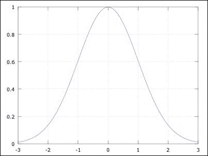

要使用高斯函数进行滤波，我们应该将其扩展到二维空间，但又不失一般性，相同的概念适用于此处绘制的一维版本。

现在，将 x 轴视为内核中的权重索引（其中 0 是中心权重），将 y 轴视为权重值。 因此，如果我们移动内核使其中心（在 *x = 0* 处的曲线中心）与目标像素重合，则将最高权重（曲线的峰值）分配给 目标像素，然后远离内核中心移动，权重会继续减小，因此，对远离目标像素的像素分配的重要性较低。

### 中值过滤器

在该滤波器中，邻域中的像素根据其强度值进行排序，目标像素被排序后的邻域的中位数代替。 中值滤波器对于消除称为**椒盐**噪声的一种噪声非常有效，如下所示：


### UI 定义

对于每种过滤器类型，我们将在应用程序中添加不同的菜单项。 转到`res/menu/soft_scanner.xml`文件并打开它以包含以下菜单项：

```java
<item
  android:id="@+id/img_blurr"
  android:enabled="true"
  android:orderInCategory="4"
  android:showAsAction="ifRoom"
  android:title="@string/list_blurr"
  android:titleCondensed="@string/list_blurr_small"
  android:visible="true">
  <menu>
    <item
      android:id="@+id/action_average"
      android:title="@string/action_average"/>
    <item
      android:id="@+id/action_gaussian"
      android:title="@string/action_gaussian"/>
    <item
      android:id="@+id/action_median"
      android:title="@string/action_median"/>
   </menu>
</item>
```

### 应用滤镜以减少图像噪点

OpenCV 为我们在此讨论的每个过滤器提供了一种的即用型实现。 我们需要做的就是指定一些特定于过滤器的参数，然后我们就可以开始了。

在`SoftScanner`活动中，我们需要编辑`onOptionesItemSelected()`方法并添加以下情况：

```java
else if(id==R.id.action_average)
{
  if(sampledImage==null)
  {
    Context context = getApplicationContext();
    CharSequence text = "You need to load an image first!";
    int duration = Toast.LENGTH_SHORT;

    Toast toast = Toast.makeText(context, text, duration);
    toast.show();
    return true;
  }
  Mat blurredImage=new Mat();
  Size size=new Size(7,7);
 Imgproc.blur(sampledImage, blurredImage, size);

  displayImage(blurredImage);
  return true;  
}
else if(id==R.id.action_gaussian)
{
  /* code to handle the user not loading an image**/

  /**/
  Mat blurredImage=new Mat();
  Size size=new Size(7,7);
 Imgproc.GaussianBlur(sampledImage, blurredImage, size, 0,0);

  displayImage(blurredImage);
  return true;
}
else if(id==R.id.action_median)
{
  /* code to handle the user not loading an image**/

  /**/
  Mat blurredImage=new Mat();
  int kernelDim=7;
 Imgproc.medianBlur(sampledImage,blurredImage , kernelDim);

  displayImage(blurredImage);
  return true;
}
```

对于每个选定的过滤器，我们遵循相同的过程：

1.  如果用户未从图库中选择或加载图片，我们将处理以下情况：

    ```java
    if(sampledImage==null)
    {
      Context context = getApplicationContext();
      CharSequence text = "You need to load an image first!";
      int duration = Toast.LENGTH_SHORT;

      Toast toast = Toast.makeText(context, text, duration);
      toast.show();
      return true;
    }
    ```

2.  对于平均滤波器，我们调用`Imgproc.blur()`方法，并传入以下参数：
    *   输入图像的 Mat 对象； 它可以具有任意数量的通道，这些通道是独立处理的。
    *   应用滤镜后，输出图像的 Mat 对象。
    *   指示要使用的内核（邻居）大小的 Size 对象。 在我们的例子中，内核的大小为`7 x 7`。

        ```java
        Mat blurredImage=new Mat();
        Size size=new Size(7,7);
        Imgproc.blur(sampledImage, blurredImage, size);
        displayImage(blurredImage);
        return true;
        ```

3.  要应用高斯滤波器，我们使用以下参数调用`Imgproc.GaussianBlur()`方法：
    *   输入图像的 Mat 对象。
    *   输出图像的 Mat 对象。
    *   指示内核大小的 Size 对象。 您可以使用不同高度和宽度的内核。 但是，两者都应为奇数和正数。
    *   代表 x 方向上标准偏差的双精度型。 在我们的例子中，我们将其设置为`0`，以便 OpenCV 根据内核宽度为我们计算该值。
    *   代表 y 方向标准偏差的双精度型，我们也将其设置为`0`，以便 OpenCV 根据内核高度计算值：

        ```java
        Mat blurredImage=new Mat();
        Size size=new Size(7,7);
        Imgproc.GaussianBlur(sampledImage, blurredImage, size, 0,0);
        displayImage(blurredImage);
        return true;
        ```

4.  最后，要使用中值滤波器，我们使用以下参数调用`Imgproc.medianBlur()`：
    *   输入图像的 Mat 对象。
    *   输出图像的 Mat 对象。
    *   一个代表内核大小的整数，我们使用一个值，因为中值过滤器是盒式过滤器（即内核宽度等于其高度）。 但是，内核维的值应为正数和奇数。

        ```java
        Mat blurredImage=new Mat();
        int kernelDim=7;
        Imgproc.medianBlur(sampledImage,blurredImage , kernelDim);
        displayImage(blurredImage);
        return true;
        ```

下图显示了三个使用不同内核大小的平均滤波器的示例（左：`11`，中心：`25`和右：`35`）。 您会看到，随着内核大小的增加，详细信息开始被淘汰：

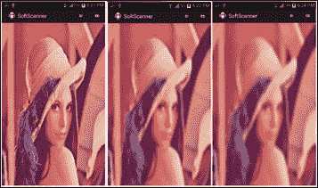

下图是示例，该示例显示了中值滤波器在消除椒盐噪声中的效果：


## 寻找边缘

空间滤波的另一个应用是在图像中找到边缘（对象边界）。 边缘检测的过程取决于计算像素强度变化的速率。 凭直觉，当变化率高时，在该区域中更有可能存在边缘。

为了计算变化率，我们使用离散域中的导数的概念，因为对于大小为`n x n`的图像，我们只有行号`1, 2, ..., n`和列号`1, 2, ..., n`，而我们没有行号`1.1, 1.2, ...`。

让我们考虑图像 *I（x，y）*，其中`x`是列号，`y`是行号。 由于它是两个变量的函数，因此我们将根据`x`的离散导数逼近公式，使用独立地为每个变量计算偏导数：


这是图像相对于`x`的一阶导数，并且为了计算图像相对于`y`的一阶导数，我们使用以下公式：

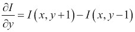

因此，对于`x`取图像的导数非常简单。 我们取 *x + 1* 的像素值，并从 *x-1* 的像素中减去它，这称为中心差，*也是如此 y* 。

最后，由于图像具有二维（行和列），因此对于每个像素（一个用于 x 方向，一个用于 y 方向），我们得到一个梯度矢量`[∂I/∂x; ∂I/∂y]`，并且由于它是矢量，所以它 可以告诉我们两件事：

*   代表该像素边缘强度的梯度量级
*   代表边缘方向的渐变方向

展望未来，我们可以设计一个简单的内核来计算平均中心差，以找到图像在 x 和 y 方向上的导数，如下所示：

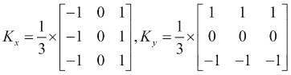

现在，我们可以按照以下步骤总结一阶导数边缘检测过程：

1.  我们使用平滑滤波器对图像进行平滑处理（以消除噪点）。
2.  计算 x 方向的导数； 输出将是被内核过滤为`K[x]`的图像。
3.  计算 y 方向的导数； 输出将是另一个以`K[y]`内核过滤的图像。
4.  计算每个像素的梯度大小。
5.  阈值梯度量，即，如果像素的梯度量大于某个阈值，则为边缘。 否则，事实并非如此。

下图是一个示例，它针对原始图像（左）在 x 方向上计算一阶导数以检测垂直边缘（中心），对于 y 方向来计算水平边缘（右）：


### Sobel 边缘检测器

OpenCV 为提供了不同的边缘检测器。 我们将开始使用的设备命名为 **Sobel 边缘检测器**。 这里的主要思想是卷积内核的设计：

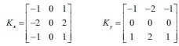

内核更加强调`K[x]`的中心行和`K[y]`的中心列。

### 坎尼边缘检测器

另一个非常好的边缘检测器（也称为最佳检测器）是 **Canny 边缘检测器**。

在 Canny 边缘检测器中，我们通过以下步骤确定边缘像素：

1.  我们使用高斯滤波器对图像进行平滑处理。
2.  使用例如 Sobel 滤波器为每个像素计算梯度矢量。
3.  通过将每个像素的梯度大小与其在梯度方向上的邻域进行比较，来抑制非最大像素。 我们确定它是边缘的一部分，因此，如果其梯度幅度最大，则将其保留。
4.  最后，Canny 对称为滞后的过程使用两个阈值（低和高）来确定保留的像素：
    *   如果像素的梯度幅度大于高阈值，则该像素被接受为边缘像素。
    *   如果像素的梯度幅度小于低阈值，则立即拒绝像素。
    *   如果像素梯度幅度在高阈值和低阈值之间，并且它连接到梯度幅度高于高阈值的像素，则该像素将被视为边缘像素。

### UI 定义

我们将在我们的应用程序中添加一些菜单项，以触发我们将使用的不同边缘检测器。 转到`res/menu/soft_scanner.xml`文件并打开它以包含以下菜单项：

```java
<item
  android:id="@+id/img_edge_detection"
  android:enabled="true"
  android:orderInCategory="5"
  android:showAsAction="ifRoom"
  android:title="@string/list_ed"
  android:titleCondensed="@string/list_ed_small"
  android:visible="true">
  <menu>
    <item
      android:id="@+id/action_sobel"
      android:title="@string/action_sobel"/>
    <item
      android:id="@+id/action_canny"
      android:title="@string/action_canny"/>
  </menu>
</item>
```

### 应用 Sobel 滤波器查找边缘

在本节中，我们将同时使用 Sobel 和 Canny 边缘检测器来查找图像中的边缘。 我们将从 Sobel 边缘过滤器开始。

在`SoftScanner`活动中，我们需要编辑`onOptionesItemSelected()`方法并添加以下情况：

```java
else if(id==R.id.action_sobel)
{
  if(sampledImage==null)
  {
    Context context = getApplicationContext();
    CharSequence text = "You need to load an image first!";
    int duration = Toast.LENGTH_SHORT;

    Toast toast = Toast.makeText(context, text, duration);
    toast.show();
    return true;
  }
  Mat blurredImage=new Mat();
  Size size=new Size(7,7);
 Imgproc.GaussianBlur(sampledImage, blurredImage, size, 0,0);

  Mat gray = new Mat();
 Imgproc.cvtColor(blurredImage, gray, Imgproc.COLOR_RGB2GRAY);

  Mat xFirstDervative =new Mat(),yFirstDervative =new Mat();
  int ddepth=CvType.CV_16S;

 Imgproc.Sobel(gray, xFirstDervative,ddepth , 1,0);
 Imgproc.Sobel(gray, yFirstDervative,ddepth , 0,1);

  Mat absXD=new Mat(),absYD=new Mat();

 Core.convertScaleAbs(xFirstDervative, absXD);
 Core.convertScaleAbs(yFirstDervative, absYD);

  Mat edgeImage=new Mat();
 Core.addWeighted(absXD, 0.5, absYD, 0.5, 0, edgeImage);

  displayImage(edgeImage);
  return true;
}
```

由于 Sobel 是一阶导数边缘检测器，因此我们将遵循前面概述的过程：

1.  我们使用您之前了解的模糊滤波器之一来平滑图像，以减少我们计算边缘像素时的噪声响应。 就我们而言，在大多数情况下，我们使用大小为`7 x 7`的高斯滤波器：

    ```java
    Mat blurredImage=new Mat();
    Size size=new Size(7,7);
    Imgproc.GaussianBlur(sampledImage, blurredImage, size, 0,0);

    ```

2.  将平滑图像转换为灰度图像：

    ```java
    Mat gray = new Mat();
    Imgproc.cvtColor(blurredImage, gray, Imgproc.COLOR_RGB2GRAY);

    ```

3.  使用`Imgproc.Sobel()`并传入以下参数，计算灰度图像的 x 和 y 一阶导数：
    *   Mat 对象作为源图像。
    *   Mat 对象作为输出图像。
    *   一个整数深度，用于指示输出图像的深度。 在大多数情况下，输入和输出图像的深度相同。 但是，当我们在某些情况下计算导数时，该值为负（即，从白色（`255`）变为黑色（`0`，`derivative = -255 - 0 = -255`）。 因此，如果我们使用的 Mat 对象的深度为无符号 8 位（灰色图像仅保留 0 到 255 之间的值），则负导数的值将溢出并设置为`0`，即 想念这个优势。 要变通解决此问题，我们使用带符号的 16 位深度输出图像来存储负导数。
    *   我们要计算的 x 阶的整数。 我们将其设置为`1`以计算 x 的一阶导数。
    *   我们要计算的y阶的整数。 我们将其设置为1以计算y的一阶导数。

        ### 注意

        注意，要计算 x 方向上的梯度，我们使用 *x-order = 1* 和 *y-order = 0* 。 我们对 y 方向类似地做。

        以下是代码：

        ```java
        Mat xFirstDervative =new Mat(),yFirstDervative =new Mat();
        int ddepth=CvType.CV_16S;

        Imgproc.Sobel(gray, xFirstDervative,ddepth , 1,0);
        Imgproc.Sobel(gray, yFirstDervative,ddepth , 0,1);

        ```

4.  我们调用`Core.convertScaleAbs()`在输入Mat对象上依次执行三个操作：
    *   缩放输入 Mat 对象的值； 但是，由于我们没有传递任何缩放因子，因此跳过了缩放步骤。
    *   取输入 Mat 对象中每个元素的绝对值。 我们需要此步骤，因为我们存储了 x 和 y 一阶导数的负值，但实际上我们关心导数的绝对值，并且我们希望能够将这些值存储在无符号的 8 位 Mat 对象中（存储值 从 0 到 255）。
    *   转换为无符号的 8 位深度 Mat 对象。

    `Core.convertScaleAbs()`的参数是输入和输出 Mat 对象：

    ```java
    Mat absXD=new Mat(),absYD=new Mat();
    Core.convertScaleAbs(xFirstDervative, absXD);
    Core.convertScaleAbs(yFirstDervative, absYD);

    ```

5.  We try to approximate the gradient magnitude to display the edge image using `Core.addWeighted()`, which calculates the weighted sum of the two images. We achieve this by passing the following parameters:
    *   第一张图片的 Mat 对象。 我们在 x 方向传递了绝对一阶导数。
    *   第一张图片的重量的两倍； 在我们的例子中，两个图像均为`0.5`。
    *   第二个图像的 Mat 对象。 我们沿 y 方向传递了绝对一阶导数。
    *   第二张图像的重量的两倍。
    *   每个总和加一个双精度值。 我们不需要添加任何内容，因此我们发送`0`。
    *   一个 Mat 对象，用于存储输出图像。

    ### 注意

    这是梯度量的近似值。 就本示例而言，这是好的。 但是，如果需要计算实际的梯度幅度，则必须使用此公式`gradient magnitude = √(f[x]² + f[y]²)`，其中`f[x], f[y]`分别是 x 和 y 方向上的一阶导数的值。

    以下是代码：

    ```java
    Mat edgeImage=new Mat();
    Core.addWeighted(absXD, 0.5, absYD, 0.5, 0, edgeImage);

    ```

6.  Finally, we display `edgeImage`:

    ```java
    displayImage(edgeImage);
    ```

    

    应用 Sobel 滤波器检测边缘的示例

### 使用 Canny 边缘检测器

应用 Canny 边缘检测器更为简单； 我们实际上只需要在 OpenCV 中执行一个功能，Canny 边缘检测器的所有步骤都将为我们执行。 通过这种抽象水平，我们只需要指定一些算法参数即可。

在`SoftScanner`活动中，我们需要编辑`onOptionesItemSelected()`方法并添加以下情况：

```java
else if(id==R.id.action_canny)
{
  if(sampledImage==null)
  {
    Context context = getApplicationContext();
    CharSequence text = "You need to load an image first!";
    int duration = Toast.LENGTH_SHORT;

    Toast toast = Toast.makeText(context, text, duration);
    toast.show();
    return true;
  }
  Mat gray = new Mat();
 Imgproc.cvtColor(sampledImage, gray, Imgproc.COLOR_RGB2GRAY);

  Mat edgeImage=new Mat();
 Imgproc.Canny(gray, edgeImage, 100, 200);

  displayImage(edgeImage);
  return true;  
}
```

您可以看到这些步骤更加简单：

1.  我们将输入图像转换为灰度，因为 Canny 仅适用于灰度图像：

    ```java
    Mat gray = new Mat();
    Imgproc.cvtColor(sampledImage, gray, Imgproc.COLOR_RGB2GRAY);

    ```

2.  We call `Imgproc.Canny()` and pass the following parameters:
    *   Mat 对象作为输入灰度图像
    *   输出边缘图像的 Mat 对象
    *   迟滞步骤中下限阈值的两倍
    *   迟滞步骤中上限的两倍

    ### 注意

    Canny 建议将上限阈值和下限阈值的比率设置为 2：1 到 3：1。

    以下是代码：

    ```java
    Mat edgeImage=new Mat();
    Imgproc.Canny(gray, edgeImage, 100, 200);

    ```

3.  Finally, we display `edgeImage`:

    ```java
    displayImage(edgeImage);
    ```

    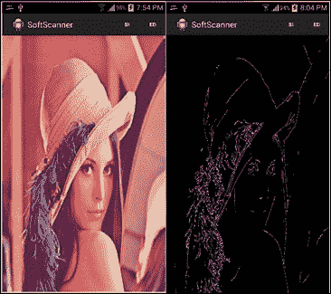

    应用 Canny 边缘检测器的示例

# 检测形状

因此，我们已经看到如何检测边缘； 但是，此过程是逐个像素的过程，回答了该像素是否为边缘的问题。 展望未来，在形状分析中，我们不仅需要边缘测试，还需要更多具体的信息。 我们将需要更好的代表。

例如，如果我们有一个盒子的图片，并且进行了边缘检测，那么最终将得到成千上万的边缘像素。 但是，如果我们尝试使一条线适合这些边缘像素，则会得到一个矩形，这是一种更具符号性和实用性的表示形式。

## 了解霍夫线变换

有许多方法可以使一条线穿过多个点，并且**霍夫变换**被认为是一种约束不足的方法，其中我们仅使用一个点来查找所有可以通过该点的线 点，我们使用另一个点来查找所有可以通过它的线，并且我们继续对所有点进行此操作。

我们最终得到一个投票系统，其中每个点都为一条线投票，并且同一条线上的点越多，对该行的投票就越高。 简而言之，霍夫变换可以描述为将`x, y`空间中的点映射到感兴趣形状的参数空间。

利用`x`和 y 空间中的直线方程`y = ax + b`，将其变换为斜率`(a)`的空间并截取空间（b），并给出此变换，得出 x 和 y 中的点 空间实际上是斜率与截距空间中的一条线，其方程式为`b = -ax + y`：

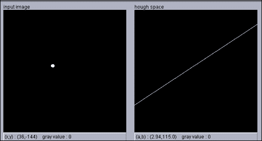

在下图中，我们在 x 和 y 空间中有五个点（左）。 当转换为斜率和截距空间时，我们得到五行（右）：

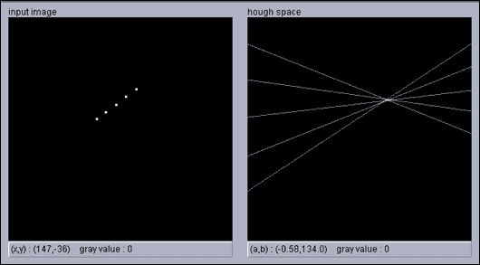

现在，x 和 y 空间中的每个点都将投票给一个斜率，并在该斜率和截距空间中进行拦截，因此我们要做的就是在参数空间中找到最大值，这就是 适合我们的观点：

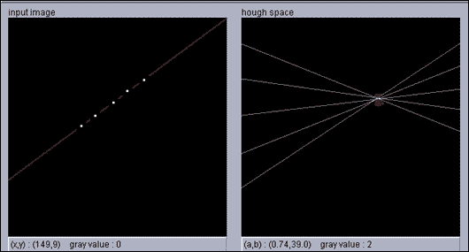

在上一幅图像的右图中，您可以基于左图中的点的投票找到最大值，在左图中，您可以看到最大值是拟合这些点的直线的斜率和截距。

对于垂直线，斜率是无穷大，这就是为什么使用线的极坐标方程代替斜率和截距形式更实际的原因。 在这种情况下，我们要处理的方程是`r = x cosθ + y sinθ`，我们又有两个参数`r(ρ)`和`θ`，我们将遵循相同的思想，只是现在的空间为`r`和`θ`而不是斜率和截距。


我们再次遵循投票系统，找到代表我们的点的直线的`r`和`θ`最大值。 但是，这一次`x`和`y`空间中的点将是正弦曲线，如果两个或多个正弦曲线在同一`r`和`θ`处相交，则意味着它们属于同一行：

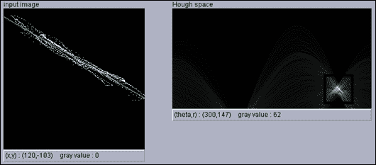

### 注意

您可以在[这个页面](http://www.rob.cs.tu-bs.de/teaching/interactive/)上使用小程序查看 Hough 变换的运行情况。

## 使用霍夫变换检测线

在 OpenCV 中，我们具有霍夫线变换的两种实现：

1.  **标准霍夫变换**：该过程与先前说明的过程非常相似； 但是，由于算法必须检查给定图像中的所有边缘点，因此被认为是较慢的选择。
2.  **概率霍夫线变换**：此选项是我们将在示例中使用的选项。 在概率版本中，该算法尝试通过利用检测线条所需的投票分数差异来最小化检测线条所需的计算量。 直观地，对于强行或长线，在决定累加器仓位是否达到非偶然计数之前，我们只需要支持点的一小部分就可以投票。 但是，对于较短的行，需要确定更高的部分。 总之，该算法试图使确定拟合线所需的边缘点数量最少。

### UI 定义

我们将添加一个新的菜单项以启动霍夫变换算法。 转到`res/menu/soft_scanner.xml`文件并打开它以包含以下菜单项：

```java
<item android:id="@+id/action_HTL"
  android:enabled="true"
  android:visible="true"
  android:title="@string/action_HL">
</item>
```

### 检测和绘制线条

使用霍夫线变换的过程分为四个步骤：

1.  加载感兴趣的图像。
2.  使用 Canny 检测图像边缘； 输出将是二进制图像。
3.  在二进制图像上调用标准或概率霍夫线变换。
4.  画出检测到的线。

在`SoftScanner`活动中，我们需要编辑`onOptionesItemSelected()`方法并添加以下情况：

```java
else if(id==R.id.action_HTL)
{
  if(sampledImage==null)
  {
    Context context = getApplicationContext();
    CharSequence text = "You need to load an image first!";
    int duration = Toast.LENGTH_SHORT;

    Toast toast = Toast.makeText(context, text, duration);
    toast.show();
    return true;
  }
  Mat binaryImage=new Mat();
  Imgproc.cvtColor(sampledImage, binaryImage, Imgproc.COLOR_RGB2GRAY);

 Imgproc.Canny(binaryImage, binaryImage, 80, 100);

  Mat lines = new Mat();
  int threshold = 50;

 Imgproc.HoughLinesP(binaryImage, lines, 1, Math.PI/180, threshold);

  Imgproc.cvtColor(binaryImage, binaryImage, Imgproc.COLOR_GRAY2RGB);
  for (int i = 0; i < lines.cols(); i++) 
  {
    double[] line = lines.get(0, i);
    double xStart = line[0], 
    yStart = line[1],
    xEnd = line[2],
    yEnd = line[3];
    org.opencv.core.Point lineStart = new org.opencv.core.Point(xStart, yStart);
    org.opencv.core.Point lineEnd = new org.opencv.core.Point(xEnd, yEnd);

    Core.line(binaryImage, lineStart, lineEnd, new Scalar(0,0,255), 3);
  }
  displayImage(binaryImage);

  return true;
}
```

该代码实际上非常简单，以下步骤用于检测和绘制线条：

1.  我们首先处理，如果用户单击菜单项但未加载图像：

    ```java
    if(sampledImage==null)
    {
      Context context = getApplicationContext();
      CharSequence text = "You need to load an image first!";
      int duration = Toast.LENGTH_SHORT;

      Toast toast = Toast.makeText(context, text, duration);
      toast.show();
      return true;
    }
    ```

2.  然后，我们初始化一个新的 Mat 对象，并将加载的图像从全彩色空间转换为灰度空间。 最后，我们调用`Imgproc.Canny()`将灰度图像转换为仅显示边缘的二进制图像：

    ```java
    Mat binaryImage=new Mat();
    Imgproc.cvtColor(sampledImage, binaryImage, Imgproc.COLOR_RGB2GRAY);
    Imgproc.Canny(binaryImage, binaryImage, 80, 100);

    ```

3.  The next step is to call `Imgproc.HoughLinesP()`, which is the probabilistic version of the original Hough transform method, passing in the following parameters:
    *   一个 Mat 对象，代表加载图像的二进制图像版本
    *   一个 Mat 对象，用于将检测到的线保留为参数`x_start, y_start, x_end, y_end`
    *   参数`ρ`的分辨率（以像素为单位）的倍数； 在我们的例子中，我们将其设置为一个像素
    *   参数`θ`的弧度分辨率的双精度； 在我们的情况下，我们将其设置为 1 度`(pi / 180)`
    *   累加器阈值的整数，仅返回具有足够投票的行

    ### 注意

    通常，当使用霍夫变换的概率版本时，您将使用较小的阈值，因为该算法用于最小化用于投票的点数。 但是，在标准的 Hough 变换中，应使用更大的阈值。

    以下是代码：

    ```java
    Mat lines = new Mat();
    int threshold = 50;
    Imgproc.HoughLinesP(binaryImage, lines, 1, Math.PI/180, threshold);

    ```

4.  Finally, we convert the binary image to a full color space in order to display the detected lines, then we loop on the detected lines and draw them one by one using the parameters, 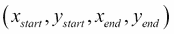:

    ```java
    Imgproc.cvtColor(binaryImage, binaryImage, Imgproc.COLOR_GRAY2RGB);
    for (int i = 0; i < lines.cols(); i++) 
    {
      double[] line = lines.get(0, i);
      double xStart = line[0], 
      yStart = line[1],
      xEnd = line[2],
      yEnd = line[3];
      org.opencv.core.Point lineStart = new org.opencv.core.Point(xStart, yStart);
      org.opencv.core.Point lineEnd = new org.opencv.core.Point(xEnd, yEnd);

      Core.line(binaryImage, lineStart, lineEnd, new Scalar(0,0,255), 3);
    }  
    displayImage(binaryImage);
    ```

    您可以在以下输入图像中在网格中记录检测到的霍夫线：

    

    从边缘图像检测到的粗线（蓝色）

## 使用霍夫变换检测圆

OpenCV 为提供了 Hough 变换的另一种实现，但是这次，我们没有检测线，而是按照将`x, y`空间转换为参数空间的相同思想来检测圆。

对于圆的方程`r² = (x - a)² + (y - b)²`，我们有三个参数`r, a, b`，其中`a`和`b`分别是圆在 x 和 y 方向上的中心 ，`r`是半径。

现在，参数空间是三维的，属于该圆的每个边缘点都将在此三维空间中投票，然后我们在参数空间中搜索最大值以检测圆的中心和半径。

此过程非常，占用大量内存和计算量，并且三维空间将非常稀疏。 好消息是，OpenCV 使用称为 **Hough 梯度法**的方法实现了圆形 Hough 变换。

霍夫梯度法的工作方式如下：对于第一步，我们应用边缘检测器，例如 Canny 边缘检测器。 在第二步中，我们为每个边缘像素沿梯度方向递增累加器单元（二维空间）。 直观地，如果我们遇到一个圆，则具有较高投票权的累加单元实际上是该圆的中心。 现在我们已经建立了一个潜在中心的列表，我们需要找到圆的半径。 因此，对于每个中心，我们通过根据边缘像素到中心的距离对边缘像素进行排序来考虑边缘像素，并保持最大边缘像素数量支持（投票）的单个半径：

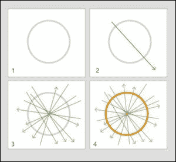

### UI 定义

为了触发圆形霍夫变换，我们将一个菜单项添加到现有菜单中。 转到`res/menu/soft_scanner.xml`文件并打开它以包含以下菜单项：

```java
<item android:id="@+id/action_CHT"
  android:enabled="true"
  android:visible="true"
  android:title="@string/action_CHT">
</item>
```

### 检测和绘制圆

检测圆的过程与检测线的过程非常相似：

1.  加载感兴趣的图像。
2.  将其从全彩色空间转换为灰度空间。
3.  在灰度图像上调用圆形 Hough 变换方法。
4.  画出检测到的圆圈。

我们编辑`onOptionsItemSelected()`以处理圆霍夫变换的情况：

```java
else if(id==R.id.action_CHT)
{
  if(sampledImage==null)
  {
    Context context = getApplicationContext();
    CharSequence text = "You need to load an image first!";
    int duration = Toast.LENGTH_SHORT;

    Toast toast = Toast.makeText(context, text, duration);
    toast.show();
    return true;
  }
  Mat grayImage=new Mat();
  Imgproc.cvtColor(sampledImage, grayImage, Imgproc.COLOR_RGB2GRAY);

  double minDist=20;
  int thickness=5;
  double cannyHighThreshold=150;
  double accumlatorThreshold=50;
  Mat circles = new Mat();
 Imgproc.HoughCircles(grayImage, circles, Imgproc.CV_HOUGH_GRADIENT, 1, minDist,cannyHighThreshold,accumlatorThreshold,0,0);

  Imgproc.cvtColor(grayImage, grayImage, Imgproc.COLOR_GRAY2RGB);
  for (int i = 0; i < circles.cols(); i++) 
  {
    double[] circle = circles.get(0, i);
    double centerX = circle[0], 
      centerY = circle[1],
      radius = circle[2];
    org.opencv.core.Point center = new org.opencv.core.Point(centerX, centerY);
 Core.circle(grayImage, center, (int) radius, new Scalar(0,0,255),thickness);
  }
  displayImage(grayImage);
  return true;
}
```

圆 Hough 变换的代码与一样，用于检测线，以下部分除外：

```java
double minDist=20;
int thickness=5;
double cannyHighThreshold=150;
double accumlatorThreshold=50;

Mat circles = new Mat();
Imgproc.HoughCircles(grayImage, circles, Imgproc.CV_HOUGH_GRADIENT, 1, minDist,cannyHighThreshold,accumlatorThreshold,0,0);

Imgproc.cvtColor(grayImage, grayImage, Imgproc.COLOR_GRAY2RGB);
for (int i = 0; i < circles.cols(); i++) 
{
  double[] circle = circles.get(0, i);
  double centerX = circle[0], 
    centerY = circle[1],
    radius = circle[2];
  org.opencv.core.Point center = new org.opencv.core.Point(centerX, centerY);
 Core.circle(grayImage, center, (int) radius, new Scalar(0,0,255),thickness);
}
```

我们通过调用`Imgproc.HoughCircles()`并将以下参数传递给它来检测圆：

*   一个 Mat 对象，表示 8 位单通道灰度输入图像。
*   一个 Mat 对象，将保存检测到的圆。 矩阵的每一列将包含一个由这些参数`x, y, r`表示的圆。
*   检测方法的整数。 当前，OpenCV 仅实现霍夫梯度算法。
*   用于的双精度数设置累加器和输入图像大小之间的比率。 例如，如果我们传递`1`，则累加器将具有与输入图像相同的大小（宽度和高度）。 如果我们通过`3`，则累加器大小将为输入图像的三分之一。
*   检测到的圆心之间的最小距离的两倍值。 请注意，距离越大，您将错过的真实圆圈越多； 距离越短，您将检测到的假圆圈越多。
*   用于内部 Canny 边缘检测器上限阈值的 double 值； 下限阈值将是上限阈值的一半。
*   累加器阈值的两倍，表示每个检测到的中心的票数。
*   我们正在寻找的最小半径的整数； 如果您不知道，则可以通过`0`。
*   要检测的最大半径的整数； 如果未知，则通过`0`。

最后，我们循环检测到的圆并使用`Core.circle()`逐一绘制。

# 摘要

在本章中，我们介绍了空间滤波的概念，并展示了从降噪到边缘检测在卷积核中的不同应用。 我们已经看到了如何使用 OpenCV 通过平均，高斯和中值滤波器来平滑图像。 我们还将 OpenCV 实现用于 Sobel 和 Canny 边缘检测器。 除了图像平滑和边缘检测之外，我们还介绍了一种称为 Hough 变换的著名形状分析技术，以使线条和圆适合边缘像素。

在下一章中，我们将继续开发该应用程序，以便使用这些概念来检测边缘和拟合线以找到适当的变换并进行一些透视校正，从而使我们使用设备的摄像头捕获的文档看起来像是 被扫描。