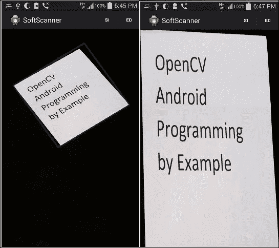
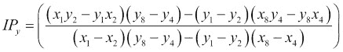

# 第 4 章。应用 2-应用透视校正

在本章中，我们将继续在第 3 章， “App 2：软件扫描程序”中启动的应用程序为基础。

我们将使用已经讨论过的概念（即边缘检测和霍夫线变换）对四边形对象进行透视校正。 将透视变换应用于对象将改变我们观察对象的方式。 当您为文档，收据等拍照时，如果您想更好地查看捕获的图像或类似扫描的副本，此想法将派上用场。

我们将看到如何使用三种不同的方式来实现这个想法：

*   刚性透视校正
*   灵活的透视校正
*   手动透视校正

# 图像变换和透视校正

图像可以经过一系列转换。 最简单的列出在这里。

## 翻译

基本上，在图像坐标平移中，我们要做的是将每个像素移位`p = [x, y]`，其量为`t = [t[x], t[y]]`。 例如，我们可以将像素`p`的转换写为`p' = p + t`。

## 旋转和平移

在此转换中，我们将旋转应用于每个像素，然后进行平移。 由于保留了欧几里得距离，因此该变换也称为二维欧几里得变换。

我们可以将此变换写为`p' = Rp + t`，其中`R`是 2×2 矩阵，等于`R = [cosθ, -sinθ; sinθ, cosθ]`，`θ`是旋转角度。

## 缩放旋转

这也称为，称为相似性变换，在此变换中，我们添加了比例因子`s`，以便可以将变换表示为`p' = sRp + t`。 此变换将保留线之间的角度。

## 仿射

在仿射转换中，平行线保持平行，并且可以表示为`p' = Ap*`，其中`p* = [x, y, 1]`和`A = [a, b, c; d, e, f]`。

## 透视变换

这也称为，称为投影变换，在此变换中，我们使用 3×3 矩阵而不是 2×3 矩阵来更改像素的视点。 仿射变换和透视变换之间的主要区别是后者不保留平行线，而仅保留其直线性。


有人可以说，透视校正的主要思想是找到一个透视变换矩阵，该矩阵可以应用于图像以获得对感兴趣对象的更好观察。

要找到此矩阵，我们首先需要使用我们在第 3 章， “App 2：软件扫描程序”中讨论的想法来检测感兴趣的对象，选择一组兴趣点，然后 然后指定这些兴趣点的位置，以便更好地查看对象。

这一组点的一个示例可能是对象角，如果我们找到一个透视变换矩阵来将这些角的坐标更改为与设备屏幕的角相对应的，我们将获得类似扫描的视图 。

根据前面的示例，我们将讨论透视校正的三种方式，并演示找到这些角的不同方法，以建立所需的对应关系以找到合适的透视变换矩阵。

# 刚性透视校正

我们进行透视校正的第一个试验将是一成不变的尝试。 我们将按照以下步骤操作：

1.  将输入图像转换为灰度。
2.  使用 Canny 边缘检测器获取边缘图像。
3.  使用概率霍夫变换检测边缘图像中的线条。
4.  找到感兴趣对象的边界线。
5.  估计感兴趣对象的边界矩形； 因此，之所以称为刚性是因为对象不需要具有平行的相对边，但是我们将通过对四边形对象使用矩形估计来强制执行此操作。
6.  建立一个矩形的四个角的列表。
7.  在矩形角和屏幕角之间施加对应关系。
8.  使用对应关系获得透视变换矩阵。
9.  将变换矩阵应用于输入图像，以获取感兴趣对象的校正透视图。

## UI 定义

我们将添加附加菜单项以开始透视校正过程。 转到`res/menu/soft_scanner.xml`文件并打开它以包含以下菜单项：

```java
<item
  android:id="@+id/action_rigidscan"
  android:enabled="true"
  android:orderInCategory="6"
  android:title="@string/action_rigidscan"
  android:visible="true">
</item>
```

## 使用对象边界框估计透视变换

在活动中，我们需要编辑`onOptionesItemSelected()`方法并通过选择刚性扫描选项来添加新的案例来处理用户。

1.  第一步是确保用户已经加载了图像：

    ```java
    else if(id==R.id.action_rigidscan)
    {
      if(sampledImage==null)
      {
        Context context = getApplicationContext();
        CharSequence text = "You need to load an image first!";
        int duration = Toast.LENGTH_SHORT;

        Toast toast = Toast.makeText(context, text, duration);
        toast.show();
        return true;

      }
    ```

2.  将输入图像转换为灰度图像：

    ```java
    Mat gray = new Mat();
    Imgproc.cvtColor(sampledImage, gray, Imgproc.COLOR_RGB2GRAY);
    ```

3.  使用 Canny 边缘检测器构建边缘图像：

    ```java
    Mat edgeImage=new Mat();
    Imgproc.Canny(gray, edgeImage, 100, 200);
    ```

4.  构建边缘图像后，我们需要检测线，因此我们使用概率霍夫线变换：

    ```java
    Mat lines = new Mat();
    int threshold = 50;
    Imgproc.HoughLinesP(edgeImage, lines, 1, Math.PI/180, threshold,60,10);
    ```

5.  声明并初始化所需的变量，以找到感兴趣的对象的最多四条边界线，并丢弃在对象本身上检测到的所有线，以便更好地估计边界矩形：

    ```java
    boolean [] include=new boolean[lines.cols()];
    double maxTop=edgeImage.rows();
    double maxBottom=0;
    double maxRight=0;
    double maxLeft=edgeImage.cols();
    int leftLine=0;
    int rightLine=0;
    int topLine=0;
    int bottomLine=0;
    ArrayList<org.opencv.core.Point> points=new ArrayList<org.opencv.core.Point>();
    ```

6.  在下面的`for`循环中，我们测试每一行以找到感兴趣对象的最左侧边界线。 找到后，我们将其对应的 include 数组元素设置为 true，以避免在搜索其他边界线时再次选择同一条线：

    ```java
    for (int i = 0; i < lines.cols(); i++) 
    {
      double[] line = lines.get(0, i);
      double xStart = line[0], xEnd = line[2];
      if(xStart<maxLeft && !include[i])
      {  
        maxLeft=xStart;
        leftLine=i;

      }
      if(xEnd<maxLeft && !include[i])
      {
        maxLeft=xEnd;
        leftLine=i;

      }
    }
    include[leftLine]=true;
    ```

7.  找到线后，我们将其两个点添加到`points`数组列表中。 稍后我们估计边界矩形时，将使用此数组列表：

    ```java
    double[] line = lines.get(0, leftLine);
    double xStartleftLine = line[0], 
        yStartleftLine = line[1],
        xEndleftLine = line[2],
        yEndleftLine = line[3];

    org.opencv.core.Point lineStartleftLine = new org.opencv.core.Point(xStartleftLine, yStartleftLine);
    org.opencv.core.Point lineEndleftLine = new org.opencv.core.Point(xEndleftLine, yEndleftLine);

    points.add(lineStartleftLine);
    points.add(lineEndleftLine);
    ```

8.  我们执行相同的操作以找到最右边的边界线：

    ```java
    for (int i = 0; i < lines.cols(); i++) 
    {
      line = lines.get(0, i);
      double xStart = line[0], xEnd = line[2];

      if(xStart>maxRight && !include[i])
      {
        maxRight=xStart;
        rightLine=i;

      }
      if(xEnd>maxRight && !include[i])
      {
        maxRight=xEnd;
        rightLine=i;

      }
    }
    include[rightLine]=true;
    ```

9.  将属于最右边边界线的点添加到`points`数组列表中：

    ```java
    line = lines.get(0, rightLine);
    double xStartRightLine = line[0], 
        yStartRightLine = line[1],
        xEndRightLine = line[2],
        yEndRightLine = line[3];

    org.opencv.core.Point lineStartRightLine = new org.opencv.core.Point(xStartRightLine, yStartRightLine);
    org.opencv.core.Point lineEndRightLine = new org.opencv.core.Point(xEndRightLine, yEndRightLine);

    points.add(lineStartRightLine);
    points.add(lineEndRightLine);
    ```

10.  找到顶部边界线：

    ```java
    for (int i = 0; i < lines.cols(); i++) 
    {
      line = lines.get(0, i);
      double yStart = line[1],yEnd = line[3];

      if(yStart<maxTop && !include[i])
      {
        maxTop=yStart;
        topLine=i;
      }
      if(yEnd<maxTop && !include[i])
      {
        maxTop=yEnd;
        topLine=i;

      }
    }
    include[topLine]=true;
    ```

11.  将属于顶部边界线的点添加到`points`数组列表中：

    ```java
    line = lines.get(0, topLine);
    double xStartTopLine = line[0], 
        yStartTopLine = line[1],
        xEndTopLine = line[2],
        yEndTopLine = line[3];

    org.opencv.core.Point lineStartTopLine = new org.opencv.core.Point(xStartTopLine, yStartTopLine);

    org.opencv.core.Point lineEndTopLine = new org.opencv.core.Point(xEndTopLine, yEndTopLine);

    points.add(lineStartTopLine);
    points.add(lineEndTopLine);
    ```

12.  找到底边框：

    ```java
    for (int i = 0; i < lines.cols(); i++) 
    {
      line = lines.get(0, i);
      double yStart = line[1],yEnd = line[3];
      if(yStart>maxBottom && !include[i])
      {
        maxBottom=yStart;
        bottomLine=i;

      }
      if(yEnd>maxBottom && !include[i])
      {
        maxBottom=yEnd;
        bottomLine=i;
      }
    }
    include[bottomLine]=true;
    ```

13.  将底线点添加到`points`数组列表中：

    ```java
    line = lines.get(0, bottomLine);
    double xStartBottomLine = line[0], 
        yStartBottomLine = line[1],
        xEndBottomLine = line[2],
        yEndBottomLine = line[3];

    org.opencv.core.Point lineStartBottomLine = new org.opencv.core.Point(xStartBottomLine, yStartBottomLine);

    org.opencv.core.Point lineEndBottomLine = new org.opencv.core.Point(xEndBottomLine, yEndBottomLine);

    points.add(lineStartBottomLine);
    points.add(lineEndBottomLine);
    ```

14.  我们使用从检测到的边界线中选择的点列表来初始化点矩阵`MatOfPoint2f`对象：

    ```java
    MatOfPoint2f mat=new MatOfPoint2f();
    mat.fromList(points);
    ```

15.  我们通过调用`Imgproc.minAreaRect()`并传入我们先前初始化的点的矩阵来找到边界矩形。 该函数尝试找到适合一组点并具有所有可能矩形的最小面积的矩形。 当我们使用感兴趣对象的边界线上的点时，我们将获得该对象的边界矩形：

    ```java
    RotatedRect rect= Imgproc.minAreaRect(mat);

    ```

16.  现在，我们将估计矩形的四个角点提取到点数组中：

    ```java
    org.opencv.core.Point rect_points[]=new org.opencv.core.Point [4];
    rect.points(rect_points);
    ```

17.  进行透视校正后，初始化将用于显示感兴趣对象的新图像。 我们还将使用该图像的四个角找到变换，以最小化这些角与相应的感兴趣对象的角之间的距离。 因此，基本上，我们试图做的是找到一个转换（缩放，旋转或平移），该转换将使感兴趣对象的四个角尽可能接近新初始化图像的四个角。

    ```java
    Mat correctedImage=new Mat(sampledImage.rows(),sampledImage.cols(),sampledImage.type());
    ```

18.  现在，我们初始化两个`Mat`对象，一个用于存储感兴趣对象的四个角，另一个用于存储图像的相应角，在透视校正后我们将在其中显示感兴趣的对象：

    ```java
    Mat srcPoints=Converters.vector_Point2f_to_Mat(Arrays.asList(rect_points));
    Mat destPoints=Converters.vector_Point2f_to_Mat(Arrays.asList(new org.opencv.core.Point[]{
      new org.opencv.core.Point(0, correctedImage.rows()),
        new org.opencv.core.Point(0, 0),
        new org.opencv.core.Point(correctedImage.cols(),0),
      new org.opencv.core.Point(correctedImage.cols(), correctedImage.rows())
    }));
    ```

19.  我们通过调用`Imgproc.getPerspectiveTransform()`并将其传递到源和目标角点来计算所需的转换矩阵：

    ```java
    Mat transformation=Imgproc.getPerspectiveTransform(srcPoints, destPoints);

    ```

20.  最后，我们应用通过`Imgproc.warpPerspective()`方法并传递以下参数计算出的变换：
    *   源图像的 Mat 对象； 在这种情况下，就是包含感兴趣对象的图像
    *   输出图像的 Mat 对象
    *   我们要应用的转换的 Mat 对象
    *   一个 Size 对象，用于保存输出图像的大小

        ```java
        Imgproc.warpPerspective(sampledImage, correctedImage, transformation, correctedImage.size());

        ```

21.  最后一步是在应用适当的转换后显示我们感兴趣的对象：

    ```java
    displayImage(correctedImage);
    ```

    

    转换之前（左）和之后（右）

# 灵活的透视校正

现在，我们已经执行了刚性校正，我们希望获得更好的结果。 如前所述，使用透视校正的主要原因是找到感兴趣对象的四个角点。 在“刚性透视校正”部分中，我们使用估计的边界矩形找到感兴趣对象的角； 但是，如您所知，矩形的每个相对侧都是平行的，这可能会降低透视校正的结果，因为现实世界中的平行线在投影时必须在称为**消失点**的地方相交 到图片平面。

因此，使用平行线估算角点不是我们的最佳选择，我们可以通过将投影线（从 Hough 变换中找到的投影线）保持在图片中并使用简单的几何图形找到它们之间的交点来做得更好 为了找到四个角落。

我们将执行的步骤如下：

1.  使用高斯滤镜将输入图像转换为灰度和平滑。
2.  使用 Canny 边缘检测器找到边缘图像。
3.  使用概率性霍夫线变换来找到感兴趣对象的边缘线。
4.  通过计算所有检测到的线之间的交点，找到边缘图像中的每个角。
5.  使用上一步中找到的角（顶点）来近似另一个多边形。 必须执行此步骤以最大程度减少顶点数量，从而消除无用的角。 但是，我们仍然保持与原始多边形相同的结构。
6.  现在我们有了代表感兴趣对象的最小角集，我们需要对它们进行排序，以使左上角首先出现，然后是右上角，右下角，最后是左下角。
7.  在排序的角和屏幕角之间强加一个对应关系。
8.  使用对应关系获得透视变换矩阵。
9.  将变换矩阵应用于输入图像以获取感兴趣对象的校正透视图。

## UI 定义

我们将使用一个菜单来启动灵活的透视校正过程。 转到`res/menu/soft_scanner.xml`文件并打开它以包含以下菜单项：

```java
<item
  android:id="@+id/action_flexscan"
  android:enabled="true"
  android:orderInCategory="7"
  android:title="@string/action_flexscan"
  android:visible="true">
</item>
```

## 应用灵活的透视校正

在`SoftScanner` 活动中，我们需要编辑`onOptionesItemSelected()`方法并为灵活扫描添加新的大小写：

1.  第一步是确保用户加载了图像：

    ```java
    else if(id==R.id.action_flexscan)
    {
      if(sampledImage==null)
      {
        Context context = getApplicationContext();
        CharSequence text = "You need to load an image first!";
        int duration = Toast.LENGTH_SHORT;

        Toast toast = Toast.makeText(context, text, duration);
        toast.show();
        return true;
      }
    ```

2.  我们遵循与“刚性透视校正”分相同的步骤来获取边线：

    ```java
    Mat gray = new Mat();
    Imgproc.cvtColor(sampledImage, gray, Imgproc.COLOR_RGB2GRAY);
    Imgproc.GaussianBlur(gray, gray, new Size(7,7), 0);

    Mat edgeImage=new Mat();
    Imgproc.Canny(gray, edgeImage, 100, 300);

    Mat lines = new Mat();
    int threshold = 100;
    Imgproc.HoughLinesP(edgeImage, lines, 1, Math.PI/180, threshold,60,10);
    ```

3.  我们使用公式：

    
    
    和：
    
    

    ```java
    ArrayList<org.opencv.core.Point> corners=new ArrayList<org.opencv.core.Point>();
    for (int i = 0; i < lines.cols(); i++) 
    {
      for (int j = i+1; j < lines.cols(); j++) 
      {
        org.opencv.core.Point intersectionPoint = getLinesIntersection(lines.get(0, i), lines.get(0, j));
        if(intersectionPoint!=null)
        {
          corners.add(intersectionPoint);
        }
      }
    }
    ```

4.  现在我们有了交点，我们需要找到另一个与检测到的多边形具有相同结构但顶点更少的多边形。 为此，我们使用`Imgproc.approxPolyDP()`方法，并将以下参数传递给它：
    *   一个 Mat 对象，用于存储我们找到的角列表。
    *   一个 Mat 对象，它将存储近似多边形的新顶点。
    *   代表原始多边形和近似多边形之间最大距离的双精度数。 在这种情况下，我们使用`Imgproc.arcLength()`方法计算原始多边形的周长，然后将其乘以一个小因子`0.02`，然后使用结果设置两个形状之间的最大距离。
    *   一个布尔值，指示形状是否闭合，在我们的示例中为：

        ```java
        MatOfPoint2f cornersMat=new MatOfPoint2f();
        cornersMat.fromList(corners);

        MatOfPoint2f approxConrers=new MatOfPoint2f();
        Imgproc.approxPolyDP(cornersMat, approxConrers, Imgproc.arcLength(cornersMat, true)*0.02, true);

        ```

5.  在此步骤中，我们只需确保近似的多边形至少具有四个角：

    ```java
    if(approxConrers.rows()<4)
    {
      Context context = getApplicationContext();
      CharSequence text = "Couldn't detect an object with four corners!";
      int duration = Toast.LENGTH_LONG;

      Toast toast = Toast.makeText(context, text, duration);
      toast.show();
      return true;
    }
    ```

6.  我们将近似角复制到角列表中，然后使用此列表查找多边形质心，将用于对近似角点进行排序。 良好的质心近似值是所有近似角点的平均值。

    ```java
    corners.clear();
    Converters.Mat_to_vector_Point2f(approxConrers,corners);
    org.opencv.core.Point centroid=new org.opencv.core.Point(0,0);
    for(org.opencv.core.Point point:corners)
    {
      centroid.x+=point.x;
      centroid.y+=point.y;
    }
    centroid.x/=corners.size();
    centroid.y/=corners.size();
    ```

7.  现在，我们开始根据多边形质心对角点进行排序。 我们首先将它们分成两个列表，一个列表将保留 Y 坐标小于质心的顶角，第二个列表将 Y 坐标大于质心的底角。 然后，我们根据上角列表中的 X 坐标对左上角和右上角进行排序，并对底部列表进行相同操作：

    ```java
    ArrayList<org.opencv.core.Point> top=new ArrayList<org.opencv.core.Point>();
    ArrayList<org.opencv.core.Point> bottom=new ArrayList<org.opencv.core.Point>();

    for (int i = 0; i < corners.size(); i++)
    {
      if (corners.get(i).y < center.y)
        top.add(corners.get(i));
      else
        bottom.add(corners.get(i));
    }

    org.opencv.core.Point topLeft = top.get(0).x > top.get(1).x ? top.get(1) : top.get(0);

    org.opencv.core.Point topRight = top.get(0).x > top.get(1).x ? top.get(0) : top.get(1);

    org.opencv.core.Point bottomLeft = bottom.get(0).x > bottom.get(1).x ? bottom.get(1) :bottom.get(0);

    org.opencv.core.Point bottomRight = bottom.get(0).x > bottom.get(1).x ? bottom.get(0) : bottom.get(1);

    corners.clear();
    corners.add(topLeft);
    corners.add(topRight);
    corners.add(bottomRight);
    corners.add(bottomLeft);
    ```

8.  然后，像在“刚性透视校正”部分中所做的那样，我们建立排序的角和图像角之间的对应关系：

    ```java
    Mat correctedImage=new Mat(sampledImage.rows(),sampledImage.cols(),sampledImage.type());
    Mat srcPoints=Converters.vector_Point2f_to_Mat(corners);

    Mat destPoints=Converters.vector_Point2f_to_Mat(Arrays.asList(new org.opencv.core.Point[]{
      new org.opencv.core.Point(0, 0),
      new org.opencv.core.Point(correctedImage.cols(), 0),
      new org.opencv.core.Point(correctedImage.cols(),correctedImage.rows()),new org.opencv.core.Point(0,correctedImage.rows())}));
    ```

9.  我们通过调用`Imgproc.getPerspectiveTransform()`并将其传递到源和目标角点来计算所需的变换矩阵：

    ```java
    Mat transformation=Imgproc.getPerspectiveTransform(srcPoints, destPoints);

    ```

10.  我们应用通过`Imgproc.warpPerspective()`方法计算出的变换：

    ```java
    Imgproc.warpPerspective(sampledImage, correctedImage, transformation, correctedImage.size());

    ```

11.  最后，在应用适当的转换后，我们显示感兴趣的对象：

    ```java
    displayImage(correctedImage);
    ```

    

    转换之前（左）和之后（右）

# 手动透视校正

我们可以包括的另一个选择是利用设备的触摸屏，并使用户手动选择感兴趣对象的角。 如果背景噪声过多并且自动透视校正未提供所需的结果，则此选项可能会派上用场。

我们将遵循的步骤与“刚性透视校正”部分中所看到的非常相似：

1.  让用户选择感兴趣对象的四个角。
2.  找到对象质心。
3.  根据对象质心对选择的角进行排序。
4.  在排序的角和屏幕角之间强加一个对应关系。
5.  使用对应关系获得透视变换矩阵。
6.  将变换矩阵应用于输入图像，以获取感兴趣对象的校正透视图。

## UI 定义

用户选择四个角后，我们将再添加一个菜单项来触发手动过程。 转到`res/menu/soft_scanner.xml`文件并打开它以包含以下菜单项：

```java
<item
  android:id="@+id/action_manScan"
  android:enabled="true"
  android:orderInCategory="8"
  android:title="@string/action_manscan"
  android:visible="true">
</item>
```

## 手动选择角落

用户选择感兴趣的角点后，我们将遵循相同的过程。 但是，技巧是将设备屏幕上选择的坐标映射到感兴趣对象的坐标：

1.  在活动`onCreate()`方法中，我们将`onTouch()`事件处理程序附加到`ImageView`。 在事件处理程序中，我们首先使用用于显示加载图像的比例因子，将`ImageView`中所选角的坐标投影到加载图像。 在加载的图像上获得正确的坐标后，以下步骤将与之前相同：

    ```java
    final ImageView iv = (ImageView) findViewById(R.id.SSImageView);
    iv.setOnTouchListener(new OnTouchListener() {

      @Override
      public boolean onTouch(View view, MotionEvent event) {

        int projectedX = (int)((double)event.getX() * ((double)sampledImage.width()/(double)view.getWidth()));

        int projectedY = (int)((double)event.getY() * ((double)sampledImage.height()/(double)view.getHeight()));

        org.opencv.core.Point corner = new org.opencv.core.Point(projectedX, projectedY);

        corners.add(corner);

        Core.circle(sampledImage, corner, (int) 5, new Scalar(0,0,255),2);

        displayImage(sampledImage);
        return false;
      }
    }); 
    ```

2.  我们需要确保用户加载了图像并选择了四个角：

    ```java
    if(sampledImage==null)
    {
      Context context = getApplicationContext();
      CharSequence text = "You need to load an image first!";
      int duration = Toast.LENGTH_SHORT;

      Toast toast = Toast.makeText(context, text, duration);
      toast.show();
      return true;
    }
    if(corners.size()!=4)
    {
      Context context = getApplicationContext();
      CharSequence text = "You need to select four corners!";
      int duration = Toast.LENGTH_LONG;

      Toast toast = Toast.makeText(context, text, duration);
      toast.show();
      return true;
    }

    ```

3.  计算对象质心并相应地对四个角进行排序：

    ```java
    org.opencv.core.Point centroid=new org.opencv.core.Point(0,0);
    for(org.opencv.core.Point point:corners)
    {
      centroid.x+=point.x;
      centroid.y+=point.y;
    }
    centroid.x/=corners.size();
    centroid.y/=corners.size();
    sortCorners(corners,centroid);
    ```

4.  然后，像在“刚性透视校正”部分：

    ```java
    Mat correctedImage=new Mat(sampledImage.rows(),sampledImage.cols(),sampledImage.type());
    Mat srcPoints=Converters.vector_Point2f_to_Mat(corners);

    Mat destPoints=Converters.vector_Point2f_to_Mat(Arrays.asList(new org.opencv.core.Point[]{
      new org.opencv.core.Point(0, 0),
      new org.opencv.core.Point(correctedImage.cols(), 0),
      new org.opencv.core.Point(correctedImage.cols(),correctedImage.rows()),
      new org.opencv.core.Point(0,correctedImage.rows())}));
    ```

    中所做的那样，构建排序后的角点与图像角点之间的对应关系。
5.  我们通过调用`Imgproc.getPerspectiveTransform()`并将其传递到源和目标角点来计算所需的变换矩阵：

    ```java
    Mat transformation=Imgproc.getPerspectiveTransform(srcPoints, destPoints);

    ```

6.  我们应用通过`Imgproc.warpPerspective()`方法计算出的变换：

    ```java
    Imgproc.warpPerspective(sampledImage, correctedImage, transformation, correctedImage.size());

    ```

7.  最后，我们在应用了适当的变换后显示了我们感兴趣的对象：

    ```java
    displayImage(correctedImage);
    ```

# 摘要

我们已经看到了如何使用透视变换来更改图像中对象的视图。 我们演示了关于四边形对象的想法，并讨论了进行透视校正的三种不同方法。

在下一章中，我们将探讨不同类型的图像特征，以及如何找到它们以及它们为何重要。