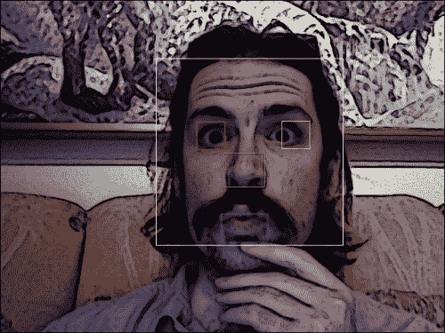

# 第 4 章。使用 Haar 级联跟踪人脸

本章介绍一些 OpenCV 的跟踪功能，以及定义特定类型的可跟踪对象的数据文件。 具体来说，我们看一下 Haar 级联分类器，它们可以分析相邻图像区域之间的对比度，以确定给定图像或子图像是否与已知类型匹配。 我们考虑如何在层次结构中组合多个 Haar 级联分类器，以使一个分类器标识父区域（出于我们的目的，是面部），而其他分类器标识子区域（眼睛，鼻子和嘴巴）。

我们还绕过了谦虚但重要的矩形主题。 通过绘制，复制和调整矩形图像区域的大小，我们可以对正在跟踪的图像区域执行简单的操作。

在本章的最后，我们将把面部跟踪和矩形操作集成到 Cameo 中。 最后，我们将进行一些面对面的互动！

### 注意

可以从我的网站下载本章的所有完成代码： [http://nummist.com/opencv/3923_04.zip](http://nummist.com/opencv/3923_04.zip) 。

# 概念化她的小瀑布

当我们谈论对对象进行分类并跟踪它们的位置时，我们究竟要精确指出什么？ 什么构成对象的可识别部分？

即使来自网络摄像头的摄影图像也可能包含许多细节，以使我们（人类）观看愉悦。 然而，关于照明，视角，观看距离，相机抖动和数字噪声的变化，图像细节趋于不稳定。 此外，就分类而言，即使是物理细节上的实际差异也可能使我们不感兴趣。 我在学校里被教过，在显微镜下没有两个雪花看起来像。 幸运的是，作为一个加拿大孩子，我已经学会了如何在没有显微镜的情况下识别雪花，因为相似之处在体积上更加明显。

因此，一些抽象图像细节的方法可用于产生稳定的分类和跟踪结果。 抽象被称为**特征**，据称是从图像数据中提取的。 特征应该比像素少得多，尽管任何像素都可能影响多个特征。 可以基于图像的相应特征之间的距离来评估两个图像之间的相似度。 例如，可以根据空间坐标或颜色坐标来定义距离。 类似 Haar 的特征是通常应用于实时面部跟踪的一种特征。 它们是 2001 年由 Paul Viola 和 Michael Jones 首次用于此目的的。每个类似 Haar 的特征都描述了相邻图像区域之间的对比度模式。 例如，边，顶点和细线均会产生鲜明的特征。 对于任何给定的图像，特征可以根据区域的大小而变化，这可以称为 **窗口大小**。 尽管窗口大小不同，但只有两个比例不同的两个图像应该能够产生相似的特征。 因此，生成多个窗口大小的特征很有用。 这样的特征集合称为 **级联**。 我们可以说 Haar 级联是尺度不变的，换句话说，它对尺度变化具有鲁棒性。 OpenCV 为规模不变的 Haar 级联提供了分类器和跟踪器，它期望采用特定的文件格式。 如在 OpenCV 中实现的 Haar 级联，对于旋转的变化并不稳健。 例如，上下颠倒的脸部不被视为与直立的脸部相似，并且轮廓上观看的脸部不被视为与从正面观看的脸部相似。 考虑到图像的多种转换以及多种窗口大小，更复杂，更耗费资源的实现可以提高 Haar 级联的旋转鲁棒性。 但是，我们将局限于 OpenCV 中的实现。

# 获取 Haar 级联数据

作为 OpenCV 设置的一部分，可能有一个名为`haarcascades`的目录。 它包含使用 OpenCV 随附的工具针对特定主题进行训练的级联。 目录的完整路径取决于您的系统和设置 OpenCV 的方法，如下所示：

*   **从源归档文件**构建：`<unzip_destination>/data/haarcascades`
*   **带有自解压 ZIP 的 Windows：`<unzip_destination>/data/haarcascades`**
*   **带有 MacPorts 的 Mac** ：`/opt/local/share/OpenCV/haarcascades`
*   **带有 Homebrew** 的 Mac：不包括`haarcascades`文件；请参见`haarcascades`文件。 要获取它，请下载源存档
*   **Ubuntu，带有 apt 或软件中心**：不包括`haarcascades`文件； 要获取它，请下载源归档文件

### 提示

如果找不到`haarcascades`，请从[下载源归档文件 http://sourceforge.net/projects/opencvlibrary/files/opencv-unix/2.4.3/OpenCV-2.4.3.tar.bz2/download](http://sourceforge.net/projects/opencvlibrary/files/opencv-unix/2.4.3/OpenCV-2.4.3.tar.bz2/download) （或来自 [http://sourceforge.net/projects/opencvlibrary/files/opencv-win/2.4.3/OpenCV-2.4.3.exe/download](http://sourceforge.net/projects/opencvlibrary/files/opencv-win/2.4.3/OpenCV-2.4.3.exe/download) 的 Windows 自解压 ZIP） ，将其解压缩，然后寻找`<unzip_destination>/data/haarcascades`。

找到`haarcascades`后，在与`cameo.py`相同的文件夹中创建一个名为`cascades`的目录，并将以下文件从`haarcascades`复制到`cascades`：

```py
haarcascade_frontalface_alt.xml
haarcascade_eye.xml
haarcascade_mcs_nose.xml
haarcascade_mcs_mouth.xml
```

顾名思义，这些级联用于跟踪脸部，眼睛，鼻子和嘴巴。 他们需要正面，正面查看主题。 稍后在构建高级跟踪器时将使用它们。 如果您对如何生成这些数据集感到好奇，请参阅[附录 B](apb.html "Appendix B. Generating Haar Cascades for Custom Targets") ，*为自定义目标生成[Haar 级联]* 。 有了足够的耐心和强大的计算机，您可以制作自己的瀑布，并针对各种类型的物体进行训练。

# 创建模块

我们应继续保持专用代码与可重用代码之间的良好分离。 让我们为跟踪类及其助手创建新的模块。

应该在与`cameo.py`相同的目录中（并且等效地在`cascades`的父目录中）创建一个名为`trackers.py`的文件。 让我们将以下 import 语句放在`trackers.py`的开头：

```py
import cv2
import rects
import utils
```

除了`trackers.py`和`cameo.py`之外，让我们制作另一个名为`rects.py`的文件，其中包含以下导入语句：

```py
import cv2
```

我们的面部跟踪器和一张面孔的定义将包含在`trackers.py`中，而各种帮助程序将包含在`rects.py`和我们先前存在的`utils.py`文件中。

# 将人脸定义为矩形层次结构

在开始实施高级跟踪器之前，我们应该定义我们想要获得的跟踪结果的类型。 对于许多应用程序而言，估计对象在真实 3D 空间中的摆放方式非常重要。 但是，我们的应用程序是关于图像处理的。 因此，我们更关心 2D 图像空间。 人脸的正立正面图应占据图像中的大致矩形区域。 在这样的区域内，眼睛，鼻子和嘴巴应该占据粗糙的矩形子区域。 让我们打开`trackers.py`并添加一个包含相关数据的类：

```py
class Face(object):
    """Data on facial features: face, eyes, nose, mouth."""

    def __init__(self):
        self.faceRect = None
        self.leftEyeRect = None
        self.rightEyeRect = None
        self.noseRect = None
        self.mouthRect = None
```

### 注意

每当我们的代码包含作为属性或函数参数的矩形时，我们将假定其格式为`(x, y, w, h)`，其中单位为像素，左上角为`(x, y)`，右下角为[ `(x+w, y+h)`。 OpenCV 有时使用兼容的表示形式，但并非总是如此。 因此，在向 OpenCV 发送矩形或从 OpenCV 接收矩形时，我们必须小心。 例如，有时 OpenCV 需要左上角和右下角作为坐标对。

# 跟踪，剪切和粘贴矩形

当我上小学时，我的手艺很差。 我经常不得不将未完成的手工艺品项目带回家，母亲自愿在那里为我完成这些项目，以便我可以花更多的时间在计算机 上。 如果不考虑那些日子，我将永远不会剪切并粘贴一张纸或一个字节数组。

与工艺一样，如果我们首先绘制轮廓，则更容易发现图形程序中的错误。 出于调试目的，Cameo 将包括一个选项，可在`Face`表示的任何矩形周围绘制线条。 OpenCV 提供了用于绘图的`rectangle()`功能。 但是，其参数表示的矩形不同于`Face`。 为了方便起见，让我们在`rects.py`中添加以下`rectangle()`包装器：

```py
def outlineRect(image, rect, color):
    if rect is None:
        return
    x, y, w, h = rect
    cv2.rectangle(image, (x, y), (x+w, y+h), color)
```

在此，`color`通常应为 BGR 三元组（值的范围为 0 到 255）或灰度值（范围为 0 到 255），具体取决于图像的格式。

接下来，Cameo 必须支持将一个矩形的内容复制到另一个矩形。 我们可以使用 Python 的切片符号在图像内读取或写入矩形。 记住图像的第一个索引是`y`坐标或行，我们可以将矩形指定为`image[y:y+h, x:x+w]`。 对于复制，如果矩形的源和目标的大小不同，则会出现复杂问题。 当然，我们希望两个面孔的大小不同，因此我们必须解决这种情况。 OpenCV 提供 `resize()`功能，使我们可以指定目标大小和插值方法。 结合切片和调整大小，我们可以将以下复制功能实现添加到`rects.py`中：

```py
def copyRect(src, dst, srcRect, dstRect,
             interpolation = cv2.INTER_LINEAR):
    """Copy part of the source to part of the destination."""

    x0, y0, w0, h0 = srcRect
    x1, y1, w1, h1 = dstRect

    # Resize the contents of the source sub-rectangle.
    # Put the result in the destination sub-rectangle.
    dst[y1:y1+h1, x1:x1+w1] = \
        cv2.resize(src[y0:y0+h0, x0:x0+w0], (w1, h1),
                   interpolation = interpolation)
```

OpenCV 支持以下插值选项：

*   `cv2.INTER_NEAREST`：这是最近邻插值，价格便宜，但会产生块状结果
*   `cv2.INTER_LINEAR`：这是双线性插值（默认值），在实时应用程序的成本和质量之间提供了很好的折衷
*   `cv2.INTER_AREA`：这是像素面积关系，在缩小时可能会在成本和质量之间提供更好的折衷，但在放大时会产生块状结果
*   `cv2.INTER_CUBIC`：这是在 4 x 4 像素邻域上的双三次插值，是一种高成本，高质量的方法
*   `cv2.INTER_LANCZOS4`：这是在 8 x 8 像素邻域上进行 Lanczos 插值的方法，是成本最高，质量最高的方法

如果我们要支持交换两个或更多矩形内容，则复制变得更加复杂。 考虑以下方法，这是错误的：

```py
copyRect(image, image, rect0, rect1) # overwrite rect1
copyRect(image, image, rect1, rect0) # copy from rect1
# Oops! rect1 was already overwritten by the time we copied from it!
```

相反，我们需要在覆盖任何内容之前将其中一个矩形复制到一个临时数组。 让我们编辑`rects.py`以添加以下函数，该函数交换单个源图像中两个或更多矩形的内容：

```py
def swapRects(src, dst, rects,
              interpolation = cv2.INTER_LINEAR):
    """Copy the source with two or more sub-rectangles swapped."""

    if dst is not src:
        dst[:] = src

    numRects = len(rects)
    if numRects < 2:
        return

    # Copy the contents of the last rectangle into temporary storage.
    x, y, w, h = rects[numRects - 1]
    temp = src[y:y+h, x:x+w].copy()

    # Copy the contents of each rectangle into the next.
    i = numRects - 2
    while i >= 0:
        copyRect(src, dst, rects[i], rects[i+1], interpolation)
        i -= 1

    # Copy the temporarily stored content into the first rectangle.
    copyRect(temp, dst, (0, 0, w, h), rects[0], interpolation)
```

交换是圆形的，因此它可以支持任意数量的矩形。 每个矩形的内容都以 下一个矩形为准，但最后一个矩形的内容以第一个矩形为准。

对于 Cameo，这种方法应该可以很好地为我们服务，但是仍然不是万无一失。 直觉可能告诉我们，以下代码应保持`image`不变：

```py
swapRects(image, image, rect0, rect1)
swapRects(image, image, rect1, rect0)
```

但是，如果`rect0`和`rect1`重叠，则我们的直觉可能不正确。 如果看到奇怪的结果，请研究交换重叠矩形的可能性。

# 添加更多实用程序功能

上一章，我们为一些辅助功能创建了一个名为`utils`的模块。 几个额外的帮助程序功能将使我们更容易编写跟踪器。

首先，了解图像是灰度还是彩色可能很有用。 我们可以根据图像的维数来判断。 彩色图像是 3D 阵列，而灰度图像的尺寸较小。 让我们在`utils.py`中添加以下功能以测试图像是否为灰度级：

```py
def isGray(image):
    """Return True if the image has one channel per pixel."""
    return image.ndim < 3
```

其次，了解图像的尺寸并将这些尺寸除以给定的因子可能会很有用。 图像（或其他阵列）的高度和宽度分别是其`shape`属性中的前两个条目。 让我们在`utils.py`中添加以下函数，以获取图像的尺寸除以一个值：

```py
def widthHeightDividedBy(image, divisor):
    """Return an image's dimensions, divided by a value."""
    h, w = image.shape[:2]
    return (w/divisor, h/divisor)
```

现在，让我们回到本章的主要主题跟踪上。

# 追踪脸

使用 OpenCV 的 Haar 级联分类器的挑战不仅在于获得跟踪结果，而且还在于获得跟踪结果。 它以高帧频获得一系列有意义的跟踪结果。 我们可以强制执行的一种常识是，某些被跟踪的对象应该具有层次关系，其中一个相对于另一个。 例如，鼻子应该在脸中间。 通过尝试跟踪整个面部和面部的一部分，我们可以使应用程序代码执行更详细的操作并检查给定的跟踪结果有多好。 有鼻子的脸比没有脸的脸更好。 同时，我们可以支持某些优化，例如仅在某些位置查找具有特定大小的脸孔和鼻子。

我们将在名为`FaceTracker`的类中实现优化的分层跟踪器，该类提供了简单的界面。 `FaceTracker`可以使用某些可选的配置参数来初始化，该参数与跟踪精度和性能之间的折衷有关。 在任何给定时间，`FaceTracker`的最新跟踪结果都存储在称为`faces`的属性中，该属性是`Face`实例的列表。 最初，此列表为空。 它通过`update()`方法刷新，该方法接受图像供跟踪器分析。 最后，出于调试目的，可以通过`drawDebugRects()`方法绘制`faces`的矩形，该方法接受图像作为绘制表面。 每帧，实时面部跟踪应用程序都会调用`update()`，读取`faces`，甚至可能调用`drawDebugRects()`。

在内部，`FaceTracker`使用一个名为`CascadeClassifier`的 OpenCV 类。 `CascadeClassifier`使用级联数据文件初始化，例如我们之前找到并复制的文件。 出于我们的目的，`CascadeClassifier`的重要方法是`detectMultiScale()`，它执行的跟踪可能对规模变化具有鲁棒性。 `detectMultiScale()`的可能参数为：

*   `image`：这是要分析的图像。 每个通道必须具有 8 位。
*   `scaleFactor`：此缩放因子将窗口大小分成两个连续的通道。 较高的值可提高性能，但会降低比例变化的鲁棒性。
*   `minNeighbors`：此值比比赛中所需的最小区域数小 1。 （一个匹配项可能会合并多个相邻区域。）
*   `flags`：有几个标志，但并非所有组合都有效。 有效的独立标志和有效组合包括：
    *   `cv2.cv.CV_HAAR_SCALE_IMAGE`：缩放每个窗口图像区域以匹配特征数据。 （默认方法是相反的：缩放要素数据以匹配窗口。）缩放图像可以对现代硬件进行某些优化。 该标志不得与其他标志结合使用。
    *   `cv2.cv.CV_HAAR_DO_CANNY_PRUNING`：急切拒绝包含太多或太少边缘以致无法匹配对象类型的区域。 此标志不应与`cv2.cv.CV_HAAR_FIND_BIGGEST_OBJECT`结合使用。
    *   `cv2.cv.CV_HAAR_FIND_BIGGEST_OBJECT`：最多接受一场比赛（最大一场）。
    *   `cv2.cv.CV_HAAR_FIND_BIGGEST_OBJECT` | `cv2.cv.HAAR_DO_ROUGH SEARCH`：最多最多接受一场比赛（最大一场比赛），并跳过一些细化（缩小）这场比赛区域的步骤。 `minNeighbors`参数应大于`0`。
*   `minSize`：代表要寻找的最小物体尺寸的一对像素尺寸。 较高的值可提高性能。
*   `maxSize`：一对像素尺寸，代表要寻找的最大物体尺寸。 较低的值可以提高性能。

`detectMultiScale()`的返回值是一个匹配项列表，每个匹配项均以`[x, y, w, h]`格式表示为矩形。

同样，`FaceTracker`的初始化程序接受`scaleFactor`，`minNeighbors`和`flags`作为参数。 给定的值将传递给`FaceTracker`内部进行的所有`detectMultiScale()`调用。 同样在初始化期间，`FaceTracker`使用脸部，眼睛，鼻子和嘴巴数据创建`CascadeClassifiers`。 让我们将初始化程序的以下实现和`faces`属性添加到`trackers.py`中：

```py
class FaceTracker(object):
    """A tracker for facial features: face, eyes, nose, mouth."""

    def __init__(self, scaleFactor = 1.2, minNeighbors = 2,
                 flags = cv2.cv.CV_HAAR_SCALE_IMAGE):

        self.scaleFactor = scaleFactor
        self.minNeighbors = minNeighbors
        self.flags = flags

        self._faces = []

        self._faceClassifier = cv2.CascadeClassifier(
            'cascades/haarcascade_frontalface_alt.xml')
        self._eyeClassifier = cv2.CascadeClassifier(
            'cascades/haarcascade_eye.xml')
        self._noseClassifier = cv2.CascadeClassifier(
            'cascades/haarcascade_mcs_nose.xml')
        self._mouthClassifier = cv2.CascadeClassifier(
            'cascades/haarcascade_mcs_mouth.xml')

    @property
    def faces(self):
        """The tracked facial features."""
        return self._faces
```

`FaceTracker`的`update()`方法首先创建给定图像的均等灰度变体。 如 OpenCV 的`equalizeHist()`函数中所实现的均衡，可以标准化图像的亮度并增加其对比度。 均衡作为预处理步骤，使我们的跟踪器对光照变化更加鲁棒，而转换为灰度可提高性能。 接下来，我们将预处理后的图像输入到面部分类器中。 对于每个匹配的矩形，我们在某些子区域中搜索左眼和右眼，鼻子和嘴巴。 最终，匹配的矩形和子矩形存储在`faces`中的`Face`实例中。 对于每种类型的跟踪，我们指定与图像大小成比例的最小对象大小。 我们对`FaceTracker`的实现应继续使用`update()`的以下代码：

```py
    def update(self, image):
        """Update the tracked facial features."""

        self._faces = []

        if utils.isGray(image):
            image = cv2.equalizeHist(image)
        else:
            image = cv2.cvtColor(image, cv2.cv.CV_BGR2GRAY)
            cv2.equalizeHist(image, image)

        minSize = utils.widthHeightDividedBy(image, 8)

        faceRects = self._faceClassifier.detectMultiScale(
            image, self.scaleFactor, self.minNeighbors, self.flags,
            minSize)

        if faceRects is not None:
            for faceRect in faceRects:

                face = Face()
                face.faceRect = faceRect

                x, y, w, h = faceRect

                # Seek an eye in the upper-left part of the face.
                searchRect = (x+w/7, y, w*2/7, h/2)
                face.leftEyeRect = self._detectOneObject(
                    self._eyeClassifier, image, searchRect, 64)

                # Seek an eye in the upper-right part of the face.
                searchRect = (x+w*4/7, y, w*2/7, h/2)
                face.rightEyeRect = self._detectOneObject(
                    self._eyeClassifier, image, searchRect, 64)

                # Seek a nose in the middle part of the face.
                searchRect = (x+w/4, y+h/4, w/2, h/2)
                face.noseRect = self._detectOneObject(
                    self._noseClassifier, image, searchRect, 32)

                # Seek a mouth in the lower-middle part of the face.
                searchRect = (x+w/6, y+h*2/3, w*2/3, h/3)
                face.mouthRect = self._detectOneObject(
                    self._mouthClassifier, image, searchRect, 16)

                self._faces.append(face)
```

注意，`update()`依赖于本章前面实现的`utils.isGray()`和`utils.widthHeightDividedBy()`。 此外，它还依赖于私有助手方法`_detectOneObject()`，该方法被多次调用，以处理跟踪面部多个子部分的重复工作。 作为参数，`_detectOneObject()`需要分类器，图像，矩形和最小对象大小。 矩形是给定分类器应搜索的图像子区域。 例如，鼻子分类器应搜索面部中间。 限制搜索范围可以提高性能，并有助于消除误报。 在内部，`_detectOneObject()`通过在图像的切片上运行分类器并返回第一个匹配项（如果没有匹配项，则返回`None`）来工作。 无论我们是否使用`cv2.cv.CV_HAAR_FIND_BIGGEST_OBJECT`标志，此方法都有效。 我们对`FaceTracker`的实现应继续使用`_detectOneObject()`的以下代码：

```py
    def _detectOneObject(self, classifier, image, rect,
                          imageSizeToMinSizeRatio):

        x, y, w, h = rect

        minSize = utils.widthHeightDividedBy(
            image, imageSizeToMinSizeRatio)

        subImage = image[y:y+h, x:x+w]

        subRects = classifier.detectMultiScale(
            subImage, self.scaleFactor, self.minNeighbors,
            self.flags, minSize)

        if len(subRects) == 0:
            return None

        subX, subY, subW, subH = subRects[0]
        return (x+subX, y+subY, subW, subH)
```

最后，`FaceTracker`应该提供基本的图形功能，以便可以显示其跟踪结果以进行调试。 以下方法实现使用我们的`rects.outlineRect()`函数简单地定义颜色，遍历`Face`实例并绘制每个`Face`的矩形到给定图像：

```py
def drawDebugRects(self, image):
        """Draw rectangles around the tracked facial features."""

        if utils.isGray(image):
            faceColor = 255
            leftEyeColor = 255
            rightEyeColor = 255
            noseColor = 255
            mouthColor = 255
        else:
            faceColor = (255, 255, 255) # white
            leftEyeColor = (0, 0, 255) # red
            rightEyeColor = (0, 255, 255) # yellow
            noseColor = (0, 255, 0) # green
            mouthColor = (255, 0, 0) # blue

        for face in self.faces:
            rects.outlineRect(image, face.faceRect, faceColor)
            rects.outlineRect(image, face.leftEyeRect, leftEyeColor)
            rects.outlineRect(image, face.rightEyeRect,
                              rightEyeColor)
            rects.outlineRect(image, face.noseRect, noseColor)
            rects.outlineRect(image, face.mouthRect, mouthColor)
```

现在，我们有了一个高级跟踪器，该跟踪器隐藏了 Haar 级联分类器的详细信息，同时允许应用程序代码提供新图像，获取有关跟踪结果的数据并要求进行调试绘图。

# 修改应用程序

让我们看一下将面部跟踪和交换集成到 Cameo 中的两种方法。 第一种方法使用单个相机提要，并交换在此相机提要中找到的脸部矩形。 第二种方法使用两个摄像头提要，并将面矩形从一个摄像头提要复制到另一个摄像头。

现在，我们将限制自己只处理整个面孔，而不要处理诸如眼睛之类的子元素。 但是，例如，您可以修改代码以仅交换眼睛。 如果尝试这样做，请小心检查脸部的相关子矩形是否不是`None`。

## 在一个相机源中交换脸

对于单相机版本，修改非常简单。 在初始化`Cameo`时，我们创建一个`FaceTracker`和一个布尔变量，指示是否应为`FaceTracker`绘制调试矩形。 响应 *X* 键，在`onKeypress()`中切换布尔值。 作为`run()`主循环的一部分，我们用当前帧更新`FaceTracker`。 然后，获取得到的`FaceFace`对象（在`faces`属性中），并使用`rects.swapRects()`交换它们的`faceRects`。 另外，根据布尔值，我们可能会绘制调试矩形，以反映任何交换之前面部元素的原始位置。

```py
import cv2
import filters
from managers import WindowManager, CaptureManager
import rects
from trackers import FaceTracker

class Cameo(object):

    def __init__(self):
        self._windowManager = WindowManager('Cameo',
                                            self.onKeypress)
        self._captureManager = CaptureManager(
            cv2.VideoCapture(0), self._windowManager, True)
 self._faceTracker = FaceTracker()
 self._shouldDrawDebugRects = False
        self._curveFilter = filters.BGRPortraCurveFilter()

    def run(self):
        """Run the main loop."""
        self._windowManager.createWindow()
        while self._windowManager.isWindowCreated:
            self._captureManager.enterFrame()
            frame = self._captureManager.frame

 self._faceTracker.update(frame)
 faces = self._faceTracker.faces
 rects.swapRects(frame, frame,
 [face.faceRect for face in faces])

            filters.strokeEdges(frame, frame)
            self._curveFilter.apply(frame, frame)

 if self._shouldDrawDebugRects:
 self._faceTracker.drawDebugRects(frame)

            self._captureManager.exitFrame()
            self._windowManager.processEvents()

    def onKeypress(self, keycode):
        """Handle a keypress.

        space  -> Take a screenshot.
        tab    -> Start/stop recording a screencast.
 x      -> Start/stop drawing debug rectangles around faces.
        escape -> Quit.

        """
        if keycode == 32: # space
            self._captureManager.writeImage('screenshot.png')
        elif keycode == 9: # tab
            if not self._captureManager.isWritingVideo:
                self._captureManager.startWritingVideo(
                    'screencast.avi')
            else:
                self._captureManager.stopWritingVideo()
 elif keycode == 120: # x
 self._shouldDrawDebugRects = \
 not self._shouldDrawDebugRects
        elif keycode == 27: # escape
            self._windowManager.destroyWindow()

if __name__=="__main__":
   Cameo().run()
```

以下屏幕截图是来自 Cameo 的。 用户按下 *X* 后，脸部区域将被勾勒出轮廓：



以下屏幕截图来自 Cameo。 美国商人比尔·阿克曼（Bill Ackman）接管了作者的脸孔：


## 在相机源之间复制人脸

对于两机版，让我们创建一个新类`CameoDouble`，它是`Cameo`的子类。 在初始化时，`CameoDouble`调用`Cameo`的构造函数，还创建第二个`CaptureManager`。 在`run()`的主循环中，`CameoDouble`从两个摄像机获取新帧，然后获取两个帧的面部跟踪结果。 使用`copyRect()`将脸部从一帧复制到另一帧。 然后，显示目标框架，可以选择在其上方绘制调试矩形。 我们可以在`cameo.py`中实现`CameoDouble`，如下所示：

### 注意

对于某些型号的 MacBook，插入外部网络摄像头后，OpenCV 在使用内置摄像头时会遇到问题。特别是，在等待内置摄像头提供框架时，应用程序可能会死锁。 如果遇到此问题，请使用两个外接摄像机，而不要使用内置摄像机。

```py
class CameoDouble(Cameo):

    def __init__(self):
 Cameo.__init__(self)
 self._hiddenCaptureManager = CaptureManager(
 cv2.VideoCapture(1))

    def run(self):
        """Run the main loop."""
        self._windowManager.createWindow()
        while self._windowManager.isWindowCreated:
            self._captureManager.enterFrame()
 self._hiddenCaptureManager.enterFrame()
            frame = self._captureManager.frame
 hiddenFrame = self._hiddenCaptureManager.frame

 self._faceTracker.update(hiddenFrame)
 hiddenFaces = self._faceTracker.faces
            self._faceTracker.update(frame)
            faces = self._faceTracker.faces

 i = 0
 while i < len(faces) and i < len(hiddenFaces):
 rects.copyRect(
 hiddenFrame, frame, hiddenFaces[i].faceRect,
 faces[i].faceRect)
 i += 1

            filters.strokeEdges(frame, frame)
            self._curveFilter.apply(frame, frame)

            if self._shouldDrawDebugRects:
                self._faceTracker.drawDebugRects(frame)

            self._captureManager.exitFrame()
 self._hiddenCaptureManager.exitFrame()
            self._windowManager.processEvents()
```

要运行`CameoDouble`而不是`Cameo`的，我们只需要修改`if __name__=="__main__"`块，如下所示：

```py
if __name__=="__main__":
 #Cameo().run() # uncomment for single camera
 CameoDouble().run() # uncomment for double camera

```

# 摘要

现在，我们有两个版本的 Cameo。 一个版本可在单个相机供稿中跟踪面部，找到面部后，可通过复制和调整大小来交换它们。 另一种版本则跟踪两个相机源中的人脸，如果在每个源中找到人脸，则从一个源中复制人脸并调整其大小以替换另一个人脸。 此外，在这两个版本中，一个摄影机的提要均可见，并对其应用了效果。

这些版本的 Cameo 演示了我们在两章之前提出的基本功能。 用户可以将他或她的脸部移动到另一个身体上，并且可以对结果进行样式化以使其更统一。 但是，移植的脸仍然只是矩形切口。 到目前为止，还没有做出任何努力去掉矩形的非面部部分或对齐重叠的和下面的组件（例如眼睛）。 下一章将探讨一些更复杂的面部融合技术，尤其是使用深度视觉技术。