# 第 1 章。检测边缘并应用图像滤镜

在本章中，我们将了解如何将酷炫的视觉效果应用于图像。 我们将学习如何使用基本的图像处理运算符。 我们将讨论边缘检测以及如何使用图像滤镜对照片应用各种效果。

在本章结束时，您将了解：

*   什么是 2D 卷积及其使用方法
*   如何模糊影像
*   如何检测图像边缘
*   如何将运动模糊应用于图像
*   如何锐化和浮雕图像
*   如何腐蚀和扩大图像
*   如何创建晕影滤镜
*   How to enhance image contrast

    ### 提示

    **下载示例代码**

    您可以从[这个页面](http://www.packtpub.com)上的帐户下载示例代码文件，以获取已购买的所有 Packt Publishing 图书。 如果您在其他地方购买了此书，则可以访问[这个页面](http://www.packtpub.com/support)并注册以将文件直接通过电子邮件发送给您。

# 2D 卷积

卷积是图像处理中的基本操作。 我们基本上将数学运算符应用于每个像素并以某种方式更改其值。 为了应用该数学运算符，我们使用另一个矩阵，称为**内核**。 内核的大小通常比输入图像小得多。 对于图像中的每个像素，我们将内核放在顶部，以使内核的中心与所考虑的像素重合。 然后，我们将内核矩阵中的每个值与图像中的相应值相乘，然后将其求和。 这是将在输出图像中此位置替换的新值。

在此，将该内核称为“图像过滤器”，并将该内核应用于给定图像的过程称为“图像过滤”。 将内核应用于图像后获得的输出称为滤波图像。 根据内核中的值，它执行不同的功能，例如模糊，检测边缘等。 下图应帮助您可视化图像过滤操作：

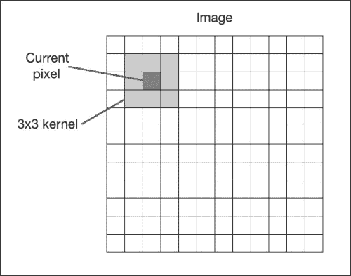

让我们从最简单的情况开始，即身份内核。 这个内核并没有真正改变输入图像。 如果我们考虑一个 3x3 身份内核，它看起来类似于以下内容：

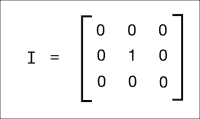

# 模糊

模糊是指对邻域内的像素值求平均。 这也称为**低通滤波器**。 低通滤波器是允许低频并阻止高频的滤波器。 现在，我们想到的下一个问题是：图像中的“频率”是什么意思？ 嗯，在这种情况下，频率是指像素值的变化率。 因此，可以说尖锐的边缘将是高频内容，因为像素值在该区域中快速变化。 按照这种逻辑，平原区域将是低频内容。 按照这个定义，低通滤波器将尝试平滑边缘。

构造低通滤波器的一种简单方法是均匀地平均像素附近的值。 我们可以根据要平滑图像的程度来选择内核的大小，并且相应地会有不同的效果。 如果您选择更大的尺寸，那么您将在更大的区域进行平均。 这趋于增加平滑效果。 让我们看一下 3x3 低通滤波器内核的样子：

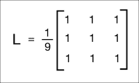

我们将矩阵除以 9 是因为我们希望这些值的总和为`1`。 这称为**归一化**，这一点很重要，因为我们不想人为地增加该像素位置的强度值。 因此，您应该在将内核应用于映像之前对其进行规范化。 规范化是一个非常重要的概念，它在多种情况下都可以使用，因此您应该在线阅读一些教程以很好地掌握它。

这是将低通滤波器应用于图像的代码：

```py
import cv2
import numpy as np

img = cv2.imread('input.jpg')
rows, cols = img.shape[:2]

kernel_identity = np.array([[0,0,0], [0,1,0], [0,0,0]])
kernel_3x3 = np.ones((3,3), np.float32) / 9.0
kernel_5x5 = np.ones((5,5), np.float32) / 25.0

cv2.imshow('Original', img)

output = cv2.filter2D(img, -1, kernel_identity)
cv2.imshow('Identity filter', output)

output = cv2.filter2D(img, -1, kernel_3x3)
cv2.imshow('3x3 filter', output)

output = cv2.filter2D(img, -1, kernel_5x5)
cv2.imshow('5x5 filter', output)

cv2.waitKey(0)
```

如果运行前面的代码，您将看到类似以下内容：


## 内核大小与模糊度

在前面的代码中，我们在代码中生成了`kernel_identity`，`kernel_3x3`和`kernel_5x5`不同的内核。 我们使用`filter2D`函数将这些内核应用于输入图像。 如果仔细查看图像，您会发现随着我们增加内核大小，它们会变得越来越模糊。 这样做的原因是因为当我们增加内核大小时，我们在更大的区域进行平均。 这倾向于具有较大的模糊效果。

另一种执行此操作的方法是使用 OpenCV 函数`blur`。 如果您不想自己生成内核，则可以直接使用此函数。 我们可以使用以下代码行来调用它：

```py
output = cv2.blur(img, (3,3))
```

这会将 3x3 内核应用于输入，并直接为您提供输出。

# 边缘检测

边缘检测的过程包括检测图像中的尖锐边缘并生成二进制图像作为输出。 通常，我们在黑色背景上绘制白线以指示这些边缘。 我们可以将边缘检测视为高通滤波操作。 高通滤波器允许高频内容通过并阻止低频内容。 如前所述，边缘是高频内容。 在边缘检测中，我们要保留这些边缘并丢弃其他所有内容。 因此，我们应该构建一个等效于高通滤波器的内核。

让我们从一个称为`Sobel`过滤器的简单边缘检测过滤器开始。 由于边缘会同时出现在水平和垂直方向，因此`Sobel`滤镜由以下两个内核组成：

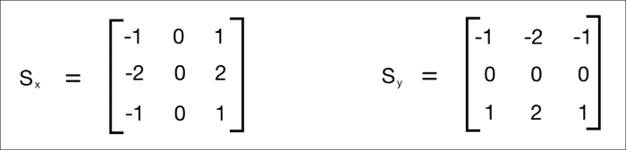

左侧的内核检测水平边缘，右侧的内核检测垂直边缘。 OpenCV 提供了直接将`Sobel`滤镜应用于给定图像的功能。 这是使用 Sobel 过滤器检测边缘的代码：

```py
import cv2
import numpy as np

img = cv2.imread('input_shapes.png', cv2.IMREAD_GRAYSCALE)
rows, cols = img.shape

sobel_horizontal = cv2.Sobel(img, cv2.CV_64F, 1, 0, ksize=5)
sobel_vertical = cv2.Sobel(img, cv2.CV_64F, 0, 1, ksize=5)

cv2.imshow('Original', img)
cv2.imshow('Sobel horizontal', sobel_horizontal)
cv2.imshow('Sobel vertical', sobel_vertical)

cv2.waitKey(0)
```

输出将类似于以下内容：

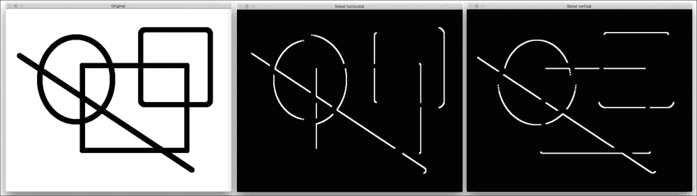

在上图中，中间的图像是水平边缘检测器的输出，而右边的图像是垂直边缘检测器。 正如我们在这里看到的，`Sobel`滤镜可以检测水平或垂直方向上的边缘，并且不能为我们提供所有边缘的整体视图。 为了克服这个问题，我们可以使用`Laplacian`过滤器。 使用此滤波器的的优势在于，它在两个方向上都使用了双导数。 您可以使用以下行来调用该函数：

```py
laplacian = cv2.Laplacian(img, cv2.CV_64F)
```

输出将类似于以下屏幕截图：


即使`Laplacian`内核在这种情况下也能很好地工作，但它并不总是能很好地工作。 如下面的屏幕快照所示，这会在输出中引起很多噪声。 这是`Canny edge`检测器派上用场的地方：


正如我们在中看到的上述图像所示，`Laplacian`内核产生了一个嘈杂的输出，这并不是完全有用的。 为了克服这个问题，我们使用了`Canny edge`检测器。 要使用`Canny edge`检测器，我们可以使用以下功能：

```py
canny = cv2.Canny(img, 50, 240)
```

如我们所见，Canny 边缘检测器的质量要好得多。 它使用两个数字作为参数来指示阈值。 第二个参数称为低阈值，第三个参数称为高阈值。 如果梯度值高于高阈值，则将其标记为强边缘。 Canny Edge Detector 从此点开始跟踪边缘，并继续进行处理，直到梯度值降至低阈值以下。 随着增加这些阈值，较弱的边缘将被忽略。 输出图像将更清晰，更稀疏。 您可以尝试使用阈值，并查看增加或减小它们的值时会发生什么。 总体配方很深。 您可以在[这个页面](http://www.intelligence.tuc.gr/~petrakis/courses/computervision/canny.pdf)上详细了解它。

# 运动模糊

当我们应用运动模糊效果时，看起来就像是您沿特定方向移动时捕获的图片。 例如，您可以使图像看起来像是从行驶中的汽车上捕获的。

输入和输出图像将类似于以下图像：


以下是实现这种运动模糊效果的代码：

```py
import cv2
import numpy as np

img = cv2.imread('input.jpg')
cv2.imshow('Original', img)

size = 15

# generating the kernel
kernel_motion_blur = np.zeros((size, size))
kernel_motion_blur[int((size-1)/2), :] = np.ones(size)
kernel_motion_blur = kernel_motion_blur / size

# applying the kernel to the input image
output = cv2.filter2D(img, -1, kernel_motion_blur)

cv2.imshow('Motion Blur', output)
cv2.waitKey(0)
```

## 引擎盖下

我们正在照常读取图像。 然后，我们正在构建运动`blur`内核。 运动模糊内核会在特定方向上平均像素值。 就像定向低通滤波器。 3x3 水平运动模糊内核看起来像这样：

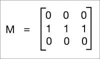

这将使图像在水平方向上模糊。 您可以选择任何方向，它将相应地起作用。 模糊程度将取决于内核的大小。 因此，如果要使图像模糊，只需为内核选择更大的尺寸即可。 为了看到全部效果，我们在前面的代码中采用了 15x15 内核。 然后，我们使用`filter2D`将此内核应用于输入图像，以获得运动模糊的输出。

# 锐化

应用`sharpening`滤镜将使图像中的边缘变清晰。 当我们要增强不清晰图像的边缘时，此滤镜非常有用。 以下是一些图像，可让您大致了解图像`sharpening`的过程：

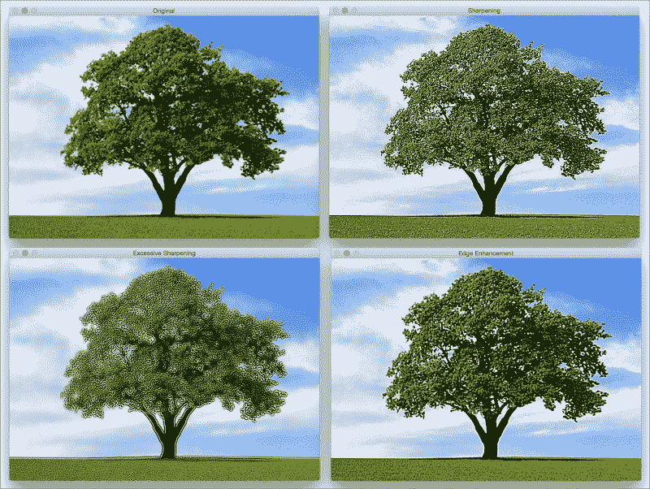

如上图所示，锐化程度取决于我们使用的内核类型。 我们在这里可以自由定制内核，每个内核都会给您一种不同的锐化方法。 要像在上一张图片的右上方图像中那样锐化图像，我们将使用如下内核：


如果要进行过度锐化，如左下图所示，我们将使用以下内核：

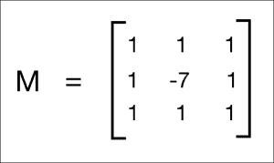

但是，这两个内核的问题在于输出图像看起来是人为增强的。 如果我们希望图像看起来更自然，可以使用`Edge Enhancement`滤镜。 基本概念保持不变，但是我们使用近似的高斯核来构建此滤波器。 当我们增强边缘时，它将帮助我们平滑图像，从而使图像看起来更自然。

这是实现上述屏幕快照中所应用效果的代码：

```py
import cv2
import numpy as np

img = cv2.imread('input.jpg')
cv2.imshow('Original', img)

# generating the kernels
kernel_sharpen_1 = np.array([[-1,-1,-1], [-1,9,-1], [-1,-1,-1]])
kernel_sharpen_2 = np.array([[1,1,1], [1,-7,1], [1,1,1]])
kernel_sharpen_3 = np.array([[-1,-1,-1,-1,-1],
                             [-1,2,2,2,-1],
                             [-1,2,8,2,-1],
                             [-1,2,2,2,-1],
                             [-1,-1,-1,-1,-1]]) / 8.0

# applying different kernels to the input image
output_1 = cv2.filter2D(img, -1, kernel_sharpen_1)
output_2 = cv2.filter2D(img, -1, kernel_sharpen_2)
output_3 = cv2.filter2D(img, -1, kernel_sharpen_3)

cv2.imshow('Sharpening', output_1)
cv2.imshow('Excessive Sharpening', output_2)
cv2.imshow('Edge Enhancement', output_3)
cv2.waitKey(0)
```

如果您注意到，在前面的代码中，我们没有将前两个内核除以归一化因子。 原因是因为内核中的值已总计为 1，所以我们将矩阵除以 1。

## 了解模式

您必须在图像过滤代码示例中注意到通用模式。 我们构建一个内核，然后使用`filter2D`获得所需的输出。 这也正是此代码示例中发生的事情！ 您可以使用内核中的值，看看是否可以获得不同的视觉效果。 确保在应用内核之前对内核进行了规范化，否则图像会显得太亮，因为您是人为地增加了图像中的像素值。

# 压花

浮雕滤镜将拍摄图像并将其转换为浮雕图像。 我们基本上将每个像素取为阴影或高光。 假设我们正在处理图像中相对较平坦的区域。 在这里，我们需要用纯灰色替换它，因为那里没有太多信息。 如果在特定区域有很多对比度，我们将根据浮雕的方向将其替换为白色像素（高光）或深色像素（阴影）。

它将是这样的：

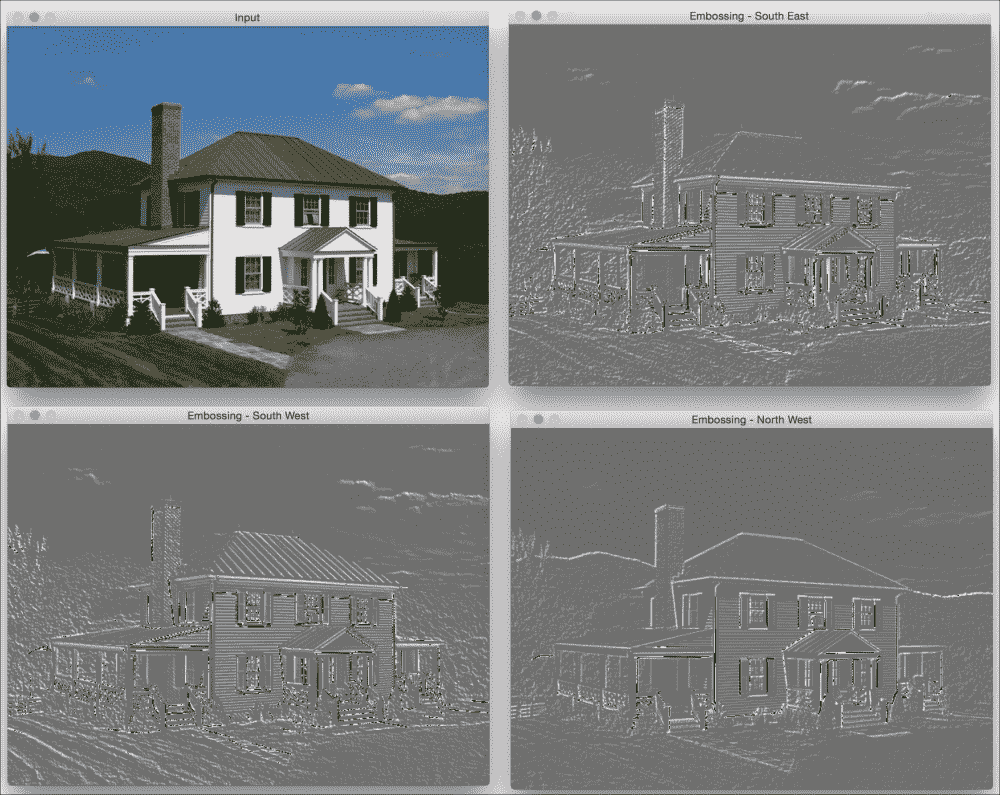

让我们来看看代码，看看如何做到这一点：

```py
import cv2
import numpy as np

img_emboss_input = cv2.imread('input.jpg')

# generating the kernels
kernel_emboss_1 = np.array([[0,-1,-1],
                            [1,0,-1],
                            [1,1,0]])
kernel_emboss_2 = np.array([[-1,-1,0],
                            [-1,0,1],
                            [0,1,1]])
kernel_emboss_3 = np.array([[1,0,0],
                            [0,0,0],
                            [0,0,-1]])

# converting the image to grayscale
gray_img = cv2.cvtColor(img_emboss_input,cv2.COLOR_BGR2GRAY)

# applying the kernels to the grayscale image and adding the offset
output_1 = cv2.filter2D(gray_img, -1, kernel_emboss_1) + 128
output_2 = cv2.filter2D(gray_img, -1, kernel_emboss_2) + 128
output_3 = cv2.filter2D(gray_img, -1, kernel_emboss_3) + 128

cv2.imshow('Input', img_emboss_input)
cv2.imshow('Embossing - South West', output_1)
cv2.imshow('Embossing - South East', output_2)
cv2.imshow('Embossing - North West', output_3)
cv2.waitKey(0)
```

如果运行前面的代码，您将看到输出图像被压印。 从上面的内核可以看到，我们只是将当前像素值替换为相邻像素值在特定方向上的差。 通过将图像中的所有像素值都偏移`128`来实现压纹效果。 此操作将高光/阴影效果添加到图片。

# 侵蚀和膨胀

**侵蚀**和**膨胀**是形态图像处理操作。 形态图像处理基本上涉及修改图像中的几何结构。 这些操作主要是为二进制图像定义的，但我们也可以在灰度图像上使用它们。 侵蚀基本上会剥去结构中最外层的像素，而膨胀会在结构上增加额外的像素层。

让我们看看这些操作是什么样的：

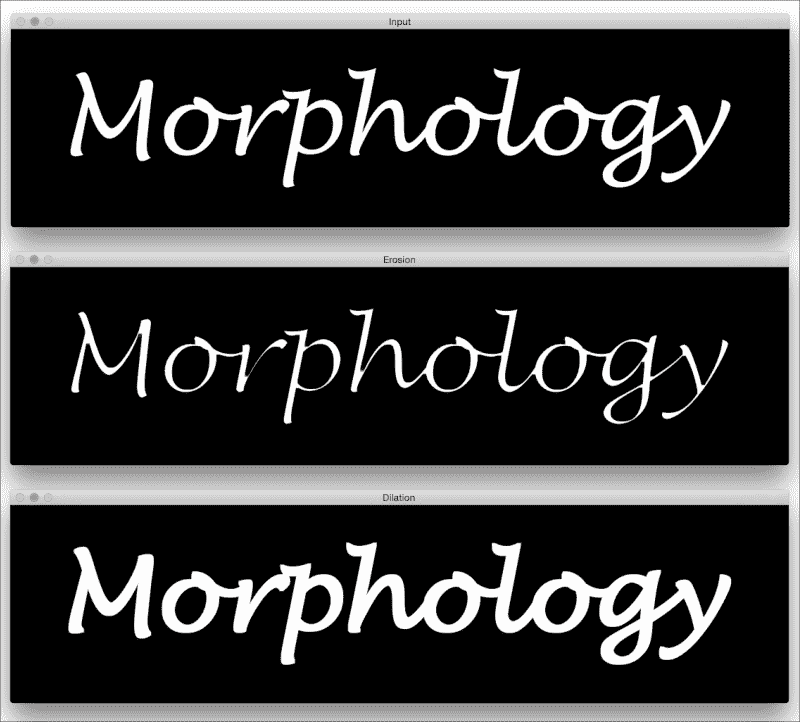

以下是的代码实现此目的：

```py
import cv2
import numpy as np

img = cv2.imread('input.png', 0)

kernel = np.ones((5,5), np.uint8)

img_erosion = cv2.erode(img, kernel, iterations=1)
img_dilation = cv2.dilate(img, kernel, iterations=1)

cv2.imshow('Input', img)
cv2.imshow('Erosion', img_erosion)
cv2.imshow('Dilation', img_dilation)

cv2.waitKey(0)
```

## 事后

OpenCV 提供直接腐蚀和扩大图像的功能。 它们分别称为腐蚀和膨胀。 需要注意的有趣的是这两个函数中的第三个参数。 迭代次数将确定您要腐蚀/扩大给定图像的数量。 它基本上将操作顺序地应用于所得图像。 您可以拍摄样本图像，并使用此参数来查看结果。

# 创建装饰图案过滤器

使用我们拥有的所有信息，让我们看看是否可以创建一个不错的`vignette`过滤器。 输出将类似于以下内容：

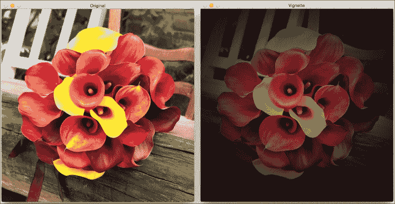

这是实现此效果的代码：

```py
import cv2
import numpy as np

img = cv2.imread('input.jpg')
rows, cols = img.shape[:2]

# generating vignette mask using Gaussian kernels
kernel_x = cv2.getGaussianKernel(cols,200)
kernel_y = cv2.getGaussianKernel(rows,200)
kernel = kernel_y * kernel_x.T
mask = 255 * kernel / np.linalg.norm(kernel)
output = np.copy(img)

# applying the mask to each channel in the input image
for i in range(3):
    output[:,:,i] = output[:,:,i] * mask

cv2.imshow('Original', img)
cv2.imshow('Vignette', output)
cv2.waitKey(0)
```

## 下面发生了什么？

`Vignette`滤镜基本上将亮度聚焦在图像的特定部分上，而其他部分则显得褪色。 为了实现这一点，我们需要使用高斯内核过滤掉图像中的每个通道。 OpenCV 提供了执行此操作的功能，称为`getGaussianKernel`。 我们需要构建一个 2D 内核，其大小与图像的大小匹配。 函数的第二个参数`getGaussianKernel`很有趣。 它是高斯的标准偏差，它控制明亮的中心区域的半径。 您可以试用此参数，并查看它如何影响输出。

构建 2D 内核后，需要通过标准化该内核并按比例放大来构建蒙版，如以下行所示：

```py
 mask = 255 * kernel / np.linalg.norm(kernel)
```

这是重要的一步，因为如果不按比例放大，图像将看起来很黑。 发生这种情况是因为在将蒙版叠加在输入图像上之后，所有像素值都将接近`0`。 此后，我们遍历所有颜色通道并将蒙版应用于每个通道。

## 我们如何转移焦点？

现在我们知道如何创建一个`vignette`滤镜，该滤镜聚焦于图像的中心。 假设我们要达到相同的`vignette`效果，但是我们要关注图像中的其他区域，如下图所示：


我们需要做的是建立一个更大的高斯核，并确保该峰与感兴趣的区域重合。 以下是实现此目的的代码：

```py
import cv2
import numpy as np

img = cv2.imread('input.jpg')
rows, cols = img.shape[:2]

# generating vignette mask using Gaussian kernels
kernel_x = cv2.getGaussianKernel(int(1.5*cols),200)
kernel_y = cv2.getGaussianKernel(int(1.5*rows),200)
kernel = kernel_y * kernel_x.T
mask = 255 * kernel / np.linalg.norm(kernel)
mask = mask[int(0.5*rows):, int(0.5*cols):]
output = np.copy(img)

# applying the mask to each channel in the input image
for i in range(3):
    output[:,:,i] = output[:,:,i] * mask

cv2.imshow('Input', img)
cv2.imshow('Vignette with shifted focus', output)

cv2.waitKey(0)
```

# 增强图像的对比度

每当我们在弱光条件下拍摄图像时，图像就会变暗。 当您在晚上或昏暗的房间中拍摄图像时，通常会发生这种情况。 您一定已经多次看到这种情况！ 发生这种情况的原因是，当我们在这种条件下捕获图像时，像素值趋于集中在 0 附近。 发生这种情况时，人眼无法清晰看到图像中的许多细节。 人眼喜欢对比度，因此我们需要调整对比度以使图像看起来既美观又令人愉悦。 许多相机和照片应用程序已经隐式地执行了此操作。 我们使用一个称为**直方图均衡化**的过程来实现这一目标。

举个例子，这是对比度增强前后的样子：

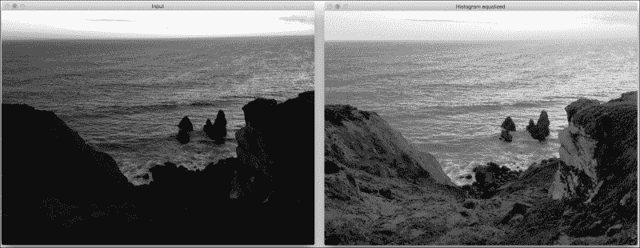

如我们在这里看到的，左侧的输入图像确实很暗。 为了解决这个问题，我们需要调整像素的值，以使它们分布在整个值范围内，即介于 0 和`255`之间。

以下是用于调整像素值的代码：

```py
import cv2
import numpy as np

img = cv2.imread('input.jpg', 0)

# equalize the histogram of the input image
histeq = cv2.equalizeHist(img)

cv2.imshow('Input', img)
cv2.imshow('Histogram equalized', histeq)
cv2.waitKey(0)
```

直方图均衡化适用于灰度图像。 OpenCV 提供了`equalizeHist`函数来实现此效果。 正如我们在这里看到的那样，代码非常简单，我们在其中读取图像并对其直方图进行均衡以调整图像的对比度。

## 我们如何处理彩色图像？

既然我们知道如何均衡灰度图像的直方图，您可能想知道如何处理彩色图像。 直方图均衡化是一个非线性过程。 因此，我们不能仅将 RGB 图像中的三个通道分离出来，分别对直方图进行均衡，然后再将它们合并以形成输出图像。 直方图均衡化的概念仅适用于图像中的强度值。 因此，我们必须确保在进行此操作时不要修改颜色信息。

为了处理彩色图像的直方图均衡化，我们需要将其转换为强度与颜色信息分开的颜色空间。 YUV 是这种色彩空间的一个很好的例子。 一旦将其转换为 YUV，我们只需要均衡 Y 通道并将其与其他两个通道组合即可获得输出图像。

以下是其外观的示例：

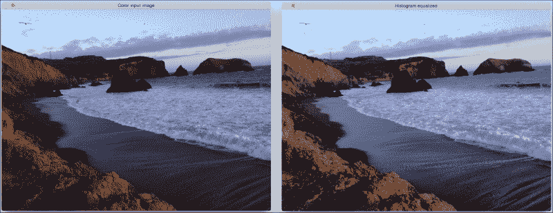

这是用于实现彩色图像的直方图均衡的代码：

```py
import cv2
import numpy as np

img = cv2.imread('input.jpg')

img_yuv = cv2.cvtColor(img, cv2.COLOR_BGR2YUV)

# equalize the histogram of the Y channel
img_yuv[:,:,0] = cv2.equalizeHist(img_yuv[:,:,0])

# convert the YUV image back to RGB format
img_output = cv2.cvtColor(img_yuv, cv2.COLOR_YUV2BGR)

cv2.imshow('Color input image', img)
cv2.imshow('Histogram equalized', img_output)

cv2.waitKey(0)
```

# 摘要

在本章中，我们学习了如何使用图像滤镜将酷炫的视觉效果应用于图像。 我们讨论了基本的图像处理运算符，以及如何使用它们来构建各种东西。 我们学习了如何使用各种方法检测边缘。 我们了解了 2D 卷积的重要性以及如何在不同的场景中使用它。 我们讨论了如何使图像平滑，运动模糊，锐化，浮雕，腐蚀和扩大图像。 我们学习了如何创建晕影滤镜，以及如何更改焦点区域。 我们讨论了对比度增强以及如何使用直方图均衡来实现它。 在下一章中，我们将讨论如何对给定图像进行卡通化。