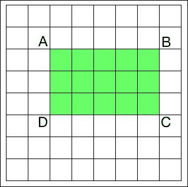
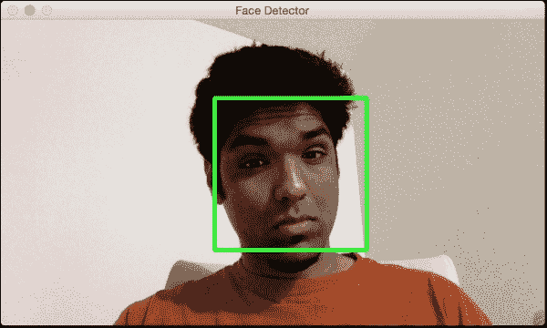
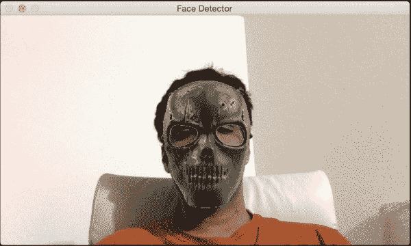
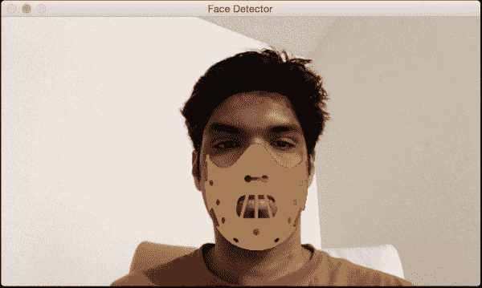
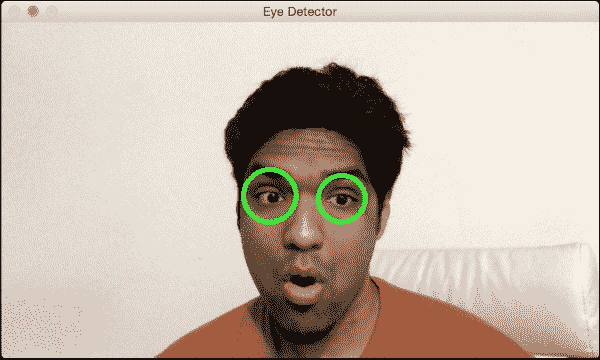
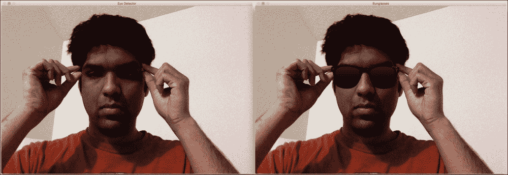
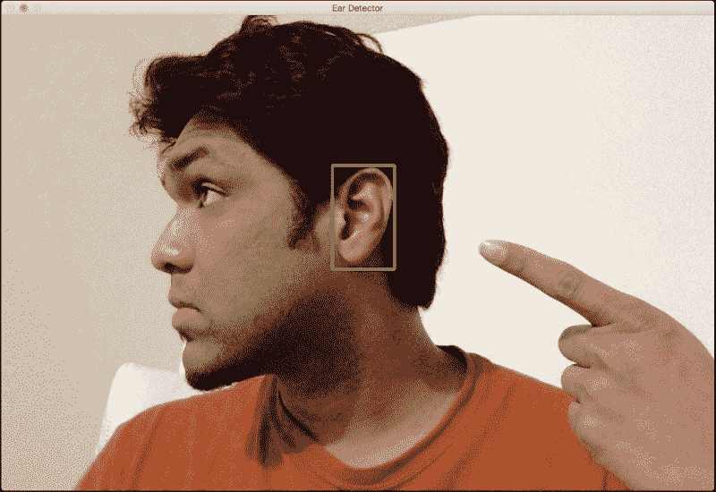
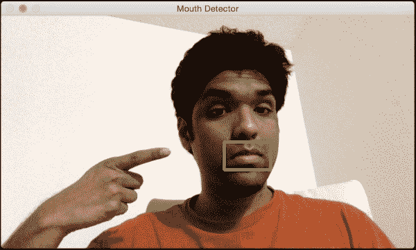

# 第 3 章。检测和跟踪不同的身体部位

在本章中，我们将学习如何在实时视频流中检测和跟踪不同的身体部位。 我们将首先讨论人脸检测管道以及它是如何从头开始构建的。 我们将学习如何使用此框架来检测和跟踪其他身体部位，例如眼睛，耳朵，嘴巴和鼻子。

在本章结束时，您将了解：

*   如何使用 Haar 级联
*   什么是完整图片
*   什么是自适应提升
*   如何在实时视频流中检测和跟踪面部
*   如何在实时视频流中检测和跟踪眼睛
*   如何将太阳镜自动覆盖在人的脸上
*   如何检测耳朵，鼻子和嘴巴
*   如何使用形状分析检测瞳孔

# 使用 Haar 级联检测事物

当我们说 Haar 级联时，实际上是在谈论基于 Haar 特征的级联分类器。 要了解这意味着什么，我们需要退后一步，并首先了解为什么需要这样做。 早在 2001 年，Paul Viola 和 Michael Jones 在他们的开创性论文中提出了一种非常有效的对象检测方法。 它已成为机器学习领域的主要标志之一。

在他们的论文中，他们描述了一种机器学习技术，其中使用了增强的简单分类器级联来获得性能非常好的整体分类器。 这样，我们就可以避免构建单个复杂分类器以实现高精度的过程。 之所以如此令人惊讶，是因为构建一个强大的单步分类器是一个计算量大的过程。 此外，我们需要大量的训练数据来建立这样的分类器。 该模型最终变得复杂，并且性能可能达不到要求。

假设我们要检测像菠萝这样的物体。 为了解决这个问题，我们需要构建一个机器学习系统，该系统将学习菠萝的外观。 它应该能够告诉我们未知图像是否包含菠萝。 为了实现这样的目标，我们需要训练我们的系统。 在机器学习领域，我们有很多方法可以训练系统。 这很像训练狗，只是它不会帮您拿到球！ 为了训练我们的系统，我们拍摄了很多菠萝和非菠萝图像，然后将它们输入到系统中。 在此，将菠萝图像称为正图像，将非菠萝图像称为负图像。

就培训而言，有很多可用的途径。 但是所有传统技术都是计算密集型的，并且会导致模型复杂。 我们不能使用这些模型来构建实时系统。 因此，我们需要保持分类器简单。 但是，如果我们保持分类器简单，那么它将是不准确的。 速度和准确性之间的权衡在机器学习中很常见。 通过构建一组简单的分类器，然后将它们级联在一起以形成一个鲁棒的统一分类器，我们克服了这个问题。 为了确保整体分类器运行良好，我们需要在层叠步骤中发挥创意。 这是 **Viola-Jones** 方法如此有效的主要原因之一。

谈到人脸检测这个话题，让我们看看如何训练一个系统来检测人脸。 如果要构建机器学习系统，则首先需要从所有图像中提取特征。 在我们的案例中，机器学习算法将使用这些功能来学习面孔。 我们使用 Haar 特征来构建特征向量。 Haar 特征是整个图像上补丁的简单求和和差异。 我们以多种图像尺寸执行此操作，以确保我们的系统缩放不变。

### 注意

如果您好奇，可以在[上详细了解，网址为 http://www.cs.ubc.ca/~lowe/425/slides/13-ViolaJones.pdf](http://www.cs.ubc.ca/~lowe/425/slides/13-ViolaJones.pdf)

提取这些特征后，我们将其传递给一系列的分类器。 我们只检查所有不同的矩形子区域，并继续丢弃其中没有面孔的区域。 这样，我们可以快速得出最终答案，以查看给定的矩形是否包含面。

# 什么是完整图像？

如果要计算 Haar 特征，则必须计算图像中许多不同矩形区域的总和。 如果我们想有效地构建功能集，则需要在多个尺度上计算这些总和。 这是一个非常昂贵的过程！ 如果我们要构建一个实时系统，我们就不能花费太多的时间来计算这些和。 因此，我们使用称为积分图像的东西。



要计算图像中任何矩形的总和，我们不需要遍历该矩形区域中的所有元素。 假设`AP`表示由左上角点和图像中的点`P`作为两个对角相对的角形成的矩形中所有元素的总和。 因此，现在，如果要计算矩形 ABCD 的面积，可以使用以下公式：

```py
矩形 ABCD 的面积 = AC – (AB + AD - AA)
```

为什么我们关心这个特定公式？ 如前所述，提取 Haar 特征包括以多个比例计算图像中大量矩形的面积。 这些计算中有很多是重复的，整个过程非常缓慢。 实际上，它是如此之慢，以至于我们无力实时运行任何东西。 这就是我们使用这种配方的原因！ 这种方法的好处是我们不必重新计算任何东西。 该方程式右侧面积的所有值均已可用。 因此，我们仅使用它们来计算任何给定矩形的面积并提取特征。

# 检测和跟踪脸部

OpenCV 提供了一个不错的检测框架。 我们只需要加载级联文件，然后就可以使用它来检测图像中的人脸。 让我们看看如何做到这一点：

```py
import cv2
import numpy as np

face_cascade = cv2.CascadeClassifier('./cascade_files/haarcascade_frontalface_alt.xml')

cap = cv2.VideoCapture(0)
scaling_factor = 0.5

while True:
    ret, frame = cap.read()
    frame = cv2.resize(frame, None, fx=scaling_factor, fy=scaling_factor, interpolation=cv2.INTER_AREA)
    gray = cv2.cvtColor(frame, cv2.COLOR_BGR2GRAY)

    face_rects = face_cascade.detectMultiScale(gray, 1.3, 5)
    for (x,y,w,h) in face_rects:
        cv2.rectangle(frame, (x,y), (x+w,y+h), (0,255,0), 3)

    cv2.imshow('Face Detector', frame)

    c = cv2.waitKey(1)
    if c == 27:
        break

cap.release()
cv2.destroyAllWindows()
```

如果运行上面的代码，它将类似于下图：



## 更好地了解它

我们需要一个分类器模型，该模型可用于检测图像中的人脸。 OpenCV 提供了一个 xml 文件，可用于此目的。 我们使用函数`CascadeClassifier`加载 xml 文件。 一旦开始从网络摄像头捕获输入帧，就将其转换为灰度并使用功能`detectMultiScale`获取当前图像中所有面部的边界框。 此函数中的第二个参数指定缩放因子的跳跃。 例如，如果找不到当前比例尺的图像，则在我们的情况下，要检查的下一个尺寸将是当前尺寸的 1.3 倍。 最后一个参数是一个阈值，用于指定保留当前矩形所需的相邻矩形的数量。 它可以用来增加面部检测器的鲁棒性。

# 面对面孔的乐趣

现在我们知道了如何检测和跟踪脸部，让我们来体验一下的乐趣。 当我们从摄像头捕获视频流时，我们可以在脸部上方覆盖有趣的遮罩。 它将类似于下一个图像：



如果您是汉尼拔的粉丝，可以尝试下一个：



让我们看一下代码，看看如何在输入视频流中的面部上方覆盖头骨遮罩：

```py
import cv2
import numpy as np

face_cascade = cv2.CascadeClassifier('./cascade_files/haarcascade_frontalface_alt.xml')

face_mask = cv2.imread('mask_hannibal.png')
h_mask, w_mask = face_mask.shape[:2]

if face_cascade.empty():
    raise IOError('Unable to load the face cascade classifier xml file')

cap = cv2.VideoCapture(0)
scaling_factor = 0.5

while True:
    ret, frame = cap.read()
    frame = cv2.resize(frame, None, fx=scaling_factor, fy=scaling_factor, interpolation=cv2.INTER_AREA)
    gray = cv2.cvtColor(frame, cv2.COLOR_BGR2GRAY)

    face_rects = face_cascade.detectMultiScale(gray, 1.3, 5)
    for (x,y,w,h) in face_rects:
        if h > 0 and w > 0:
            # Adjust the height and weight parameters depending on the sizes and the locations. You need to play around with these to make sure you get it right.
            h, w = int(1.4*h), int(1.0*w)
            y -= 0.1*h

            # Extract the region of interest from the image
            frame_roi = frame[y:y+h, x:x+w]
            face_mask_small = cv2.resize(face_mask, (w, h), interpolation=cv2.INTER_AREA)

            # Convert color image to grayscale and threshold it
            gray_mask = cv2.cvtColor(face_mask_small, cv2.COLOR_BGR2GRAY)
            ret, mask = cv2.threshold(gray_mask, 180, 255, cv2.THRESH_BINARY_INV)

            # Create an inverse mask
            mask_inv = cv2.bitwise_not(mask)

            # Use the mask to extract the face mask region of interest
            masked_face = cv2.bitwise_and(face_mask_small, face_mask_small, mask=mask)

            # Use the inverse mask to get the remaining part of the image
            masked_frame = cv2.bitwise_and(frame_roi, frame_roi, mask=mask_inv)

            # add the two images to get the final output
            frame[y:y+h, x:x+w] = cv2.add(masked_face, masked_frame)

    cv2.imshow('Face Detector', frame)

    c = cv2.waitKey(1)
    if c == 27:
        break

cap.release()
cv2.destroyAllWindows()
```

## 引擎盖下

与之前一样，我们首先加载面部级联分类器 xml 文件。 人脸检测步骤照常工作。 我们开始无限循环，并持续检测每一帧中的人脸。 一旦知道人脸在哪里，就需要稍微修改坐标以确保遮罩正确适合。 该操作过程是主观的，并且取决于所讨论的掩模。 不同的遮罩需要不同程度的调整，以使其看起来更自然。 我们在以下行中从输入帧中提取兴趣区域：

```py
frame_roi = frame[y:y+h, x:x+w]
```

现在我们有了所需的关注区域，我们需要在此之上覆盖遮罩。 因此，我们调整输入遮罩的大小以确保它适合此兴趣区域。 输入掩码具有白色背景。 因此，如果我们仅将其覆盖在兴趣区域的顶部，由于白色背景，它看起来将不自然。 我们只需要覆盖头骨遮罩像素，其余区域应该是透明的。

因此，在下一步中，我们通过对头骨图像进行阈值处理来创建遮罩。 由于背景是白色，因此我们对图像进行阈值处理，以使强度值大于 180 的任何像素变为 0，其他所有像素变为 255。就感兴趣的帧区域而言，我们需要将其中的所有区域涂黑 这个遮罩区域。 我们可以通过简单地使用刚创建的遮罩的逆来实现。 一旦我们获得了头骨图像的遮罩版本和感兴趣的输入区域，我们就将它们加起来以获得最终图像。

# 侦测眼睛

现在，我们了解了如何检测脸部，我们也可以将概念推广到检测其他身体部位。 理解 Viola-Jones 框架可以应用于任何对象非常重要。 准确性和鲁棒性将取决于对象的唯一性。 例如，人脸具有非常独特的特征，因此很容易将我们的系统训练成鲁棒的。 另一方面，像毛巾这样的物体太普通了，因此没有明显的区别。 因此，构建坚固的毛巾检测器更加困难。

让我们看看如何构建眼睛检测器：

```py
import cv2
import numpy as np

face_cascade = cv2.CascadeClassifier('./cascade_files/haarcascade_frontalface_alt.xml')
eye_cascade = cv2.CascadeClassifier('./cascade_files/haarcascade_eye.xml')
if face_cascade.empty():
  raise IOError('Unable to load the face cascade classifier xml file')

if eye_cascade.empty():
  raise IOError('Unable to load the eye cascade classifier xml file')

cap = cv2.VideoCapture(0)
ds_factor = 0.5

while True:
    ret, frame = cap.read()
    frame = cv2.resize(frame, None, fx=ds_factor, fy=ds_factor, interpolation=cv2.INTER_AREA)
    gray = cv2.cvtColor(frame, cv2.COLOR_BGR2GRAY)

    faces = face_cascade.detectMultiScale(gray, 1.3, 5)
    for (x,y,w,h) in faces:
        roi_gray = gray[y:y+h, x:x+w]
        roi_color = frame[y:y+h, x:x+w]
        eyes = eye_cascade.detectMultiScale(roi_gray)
        for (x_eye,y_eye,w_eye,h_eye) in eyes:
            center = (int(x_eye + 0.5*w_eye), int(y_eye + 0.5*h_eye))
            radius = int(0.3 * (w_eye + h_eye))
            color = (0, 255, 0)
            thickness = 3
            cv2.circle(roi_color, center, radius, color, thickness)

    cv2.imshow('Eye Detector', frame)

    c = cv2.waitKey(1)
    if c == 27:
        break

cap.release()
cv2.destroyAllWindows()
```

如果运行此程序，输出将类似于下图：



## 事后

如果您注意到，程序看起来与人脸检测程序非常相似。 除了加载人脸检测级联分类器外，我们还加载了眼睛检测级联分类器。 从技术上讲，我们不需要使用面部检测器。 但是我们知道眼睛总是在别人的脸上。 我们使用此信息并仅在感兴趣的相关区域（即脸部）中搜索眼睛。 我们首先检测人脸，然后在该子图像上运行眼睛检测器。 这样，它更快，更高效。

# 有趣的眼睛

现在我们知道了如何来检测图像中的眼睛，让我们看看我们是否可以对此做一些有趣的事情。 我们可以执行以下屏幕快照中所示的操作：



让我们看一下的代码，看看如何做这样的事情：

```py
import cv2
import numpy as np

face_cascade = cv2.CascadeClassifier('./cascade_files/haarcascade_frontalface_alt.xml')
eye_cascade = cv2.CascadeClassifier('./cascade_files/haarcascade_eye.xml')

if face_cascade.empty():
  raise IOError('Unable to load the face cascade classifier xml file')

if eye_cascade.empty():
  raise IOError('Unable to load the eye cascade classifier xml file')

img = cv2.imread('input.jpg')
sunglasses_img = cv2.imread('sunglasses.jpg')

gray = cv2.cvtColor(img, cv2.COLOR_BGR2GRAY)

centers = []
faces = face_cascade.detectMultiScale(gray, 1.3, 5)

for (x,y,w,h) in faces:
    roi_gray = gray[y:y+h, x:x+w]
    roi_color = img[y:y+h, x:x+w]
    eyes = eye_cascade.detectMultiScale(roi_gray)
    for (x_eye,y_eye,w_eye,h_eye) in eyes:
        centers.append((x + int(x_eye + 0.5*w_eye), y + int(y_eye + 0.5*h_eye)))

if len(centers) > 0:
    # Overlay sunglasses; the factor 2.12 is customizable depending on the size of the face
    sunglasses_width = 2.12 * abs(centers[1][0] - centers[0][0])
    overlay_img = np.ones(img.shape, np.uint8) * 255
    h, w = sunglasses_img.shape[:2]
    scaling_factor = sunglasses_width / w
    overlay_sunglasses = cv2.resize(sunglasses_img, None, fx=scaling_factor,
            fy=scaling_factor, interpolation=cv2.INTER_AREA)

    x = centers[0][0] if centers[0][0] < centers[1][0] else centers[1][0]

    # customizable X and Y locations; depends on the size of the face
    x -= 0.26*overlay_sunglasses.shape[1]
    y += 0.85*overlay_sunglasses.shape[0]

    h, w = overlay_sunglasses.shape[:2]
    overlay_img[y:y+h, x:x+w] = overlay_sunglasses

    # Create mask
    gray_sunglasses = cv2.cvtColor(overlay_img, cv2.COLOR_BGR2GRAY)
    ret, mask = cv2.threshold(gray_sunglasses, 110, 255, cv2.THRESH_BINARY)
    mask_inv = cv2.bitwise_not(mask)
    temp = cv2.bitwise_and(img, img, mask=mask)
    temp2 = cv2.bitwise_and(overlay_img, overlay_img, mask=mask_inv)
    final_img = cv2.add(temp, temp2)

    cv2.imshow('Eye Detector', img)
    cv2.imshow('Sunglasses', final_img)
    cv2.waitKey()
    cv2.destroyAllWindows()
```

## 放置太阳镜

就像我们之前所做的一样，我们加载图像并检测眼睛。 一旦检测到眼睛，便会调整太阳镜图像的大小以适合当前的关注区域。 为了创建兴趣区域，我们考虑了眼睛之间的距离。 我们相应地调整图像的大小，然后继续创建遮罩。 这类似于我们之前使用骷髅面罩所做的。 太阳镜在脸上的位置是主观的。 因此，如果您想使用另一副太阳镜，则必须调整重量。

# 侦测耳朵

既然我们知道管道是如何工作的，让我们跳入代码：

```py
import cv2
import numpy as np

left_ear_cascade = cv2.CascadeClassifier('./cascade_files/haarcascade_mcs_leftear.xml')
right_ear_cascade = cv2.CascadeClassifier('./cascade_files/haarcascade_mcs_rightear.xml')

if left_ear_cascade.empty():
  raise IOError('Unable to load the left ear cascade classifier xml file')

if right_ear_cascade.empty():
  raise IOError('Unable to load the right ear cascade classifier xml file')

img = cv2.imread('input.jpg')

gray = cv2.cvtColor(img, cv2.COLOR_BGR2GRAY)

left_ear = left_ear_cascade.detectMultiScale(gray, 1.3, 5)
right_ear = right_ear_cascade.detectMultiScale(gray, 1.3, 5)

for (x,y,w,h) in left_ear:
    cv2.rectangle(img, (x,y), (x+w,y+h), (0,255,0), 3)

for (x,y,w,h) in right_ear:
    cv2.rectangle(img, (x,y), (x+w,y+h), (255,0,0), 3)

cv2.imshow('Ear Detector', img)
cv2.waitKey()
cv2.destroyAllWindows()
```

如果在图像上运行上述代码，则应该看到类似以下屏幕截图的内容：



# 检测到嘴巴

以下是代码：

```py
import cv2
import numpy as np

mouth_cascade = cv2.CascadeClassifier('./cascade_files/haarcascade_mcs_mouth.xml')

if mouth_cascade.empty():
  raise IOError('Unable to load the mouth cascade classifier xml file')

cap = cv2.VideoCapture(0)
ds_factor = 0.5

while True:
    ret, frame = cap.read()
    frame = cv2.resize(frame, None, fx=ds_factor, fy=ds_factor, interpolation=cv2.INTER_AREA)
    gray = cv2.cvtColor(frame, cv2.COLOR_BGR2GRAY)

    mouth_rects = mouth_cascade.detectMultiScale(gray, 1.7, 11)
    for (x,y,w,h) in mouth_rects:
        y = int(y - 0.15*h)
        cv2.rectangle(frame, (x,y), (x+w,y+h), (0,255,0), 3)
        break

    cv2.imshow('Mouth Detector', frame)

    c = cv2.waitKey(1)
    if c == 27:
        break

cap.release()
cv2.destroyAllWindows()
```

以下是输出的内容：



# 现在是留胡子的时候了

让我们在顶部覆盖一个小胡子：

```py
import cv2
import numpy as np

mouth_cascade = cv2.CascadeClassifier('./cascade_files/haarcascade_mcs_mouth.xml')

moustache_mask = cv2.imread('img/moustache.png')
h_mask, w_mask = moustache_mask.shape[:2]

if mouth_cascade.empty():
  raise IOError('Unable to load the mouth cascade classifier xml file')

cap = cv2.VideoCapture(0)
scaling_factor = 0.5

while True:
    ret, frame = cap.read()
    frame = cv2.resize(frame, None, fx=scaling_factor, fy=scaling_factor, interpolation=cv2.INTER_AREA)
    gray = cv2.cvtColor(frame, cv2.COLOR_BGR2GRAY)

    mouth_rects = mouth_cascade.detectMultiScale(gray, 1.3, 5)
    if len(mouth_rects) > 0:
        (x,y,w,h) = mouth_rects[0]
        h, w = int(0.6*h), int(1.2*w)
        x -= 0.05*w
        y -= 0.55*h
        frame_roi = frame[y:y+h, x:x+w]
        moustache_mask_small = cv2.resize(moustache_mask, (w, h), interpolation=cv2.INTER_AREA)

        gray_mask = cv2.cvtColor(moustache_mask_small, cv2.COLOR_BGR2GRAY)
        ret, mask = cv2.threshold(gray_mask, 50, 255, cv2.THRESH_BINARY_INV)
        mask_inv = cv2.bitwise_not(mask)
        masked_mouth = cv2.bitwise_and(moustache_mask_small, moustache_mask_small, mask=mask)
        masked_frame = cv2.bitwise_and(frame_roi, frame_roi, mask=mask_inv)
        frame[y:y+h, x:x+w] = cv2.add(masked_mouth, masked_frame)

    cv2.imshow('Moustache', frame)

    c = cv2.waitKey(1)
    if c == 27:
        break

cap.release()
cv2.destroyAllWindows()
```

的外观如下：


# 检测鼻子

以下程序显示了如何检测鼻子：

```py
import cv2
import numpy as np

nose_cascade = cv2.CascadeClassifier('./cascade_files/haarcascade_mcs_nose.xml')

if nose_cascade.empty():
  raise IOError('Unable to load the nose cascade classifier xml file')

cap = cv2.VideoCapture(0)
ds_factor = 0.5

while True:
    ret, frame = cap.read()
    frame = cv2.resize(frame, None, fx=ds_factor, fy=ds_factor, interpolation=cv2.INTER_AREA)
    gray = cv2.cvtColor(frame, cv2.COLOR_BGR2GRAY)

    nose_rects = nose_cascade.detectMultiScale(gray, 1.3, 5)
    for (x,y,w,h) in nose_rects:
        cv2.rectangle(frame, (x,y), (x+w,y+h), (0,255,0), 3)
        break

    cv2.imshow('Nose Detector', frame)

    c = cv2.waitKey(1)
    if c == 27:
        break

cap.release()
cv2.destroyAllWindows()
```

输出看起来像，如下图所示：


# 检测学生

我们将在此处采用不同的方法。 学生太普通了，无法采用 Haar 级联方法。 我们还将了解如何根据事物的形状检测事物。 以下是输出结果：


让我们看看如何构建瞳孔检测器：

```py
import math

import cv2
import numpy as np

img = cv2.imread('input.jpg')
scaling_factor = 0.7

img = cv2.resize(img, None, fx=scaling_factor, fy=scaling_factor, interpolation=cv2.INTER_AREA)
cv2.imshow('Input', img)
gray = cv2.cvtColor(~img, cv2.COLOR_BGR2GRAY)

ret, thresh_gray = cv2.threshold(gray, 220, 255, cv2.THRESH_BINARY)
contours, hierarchy = cv2.findContours(thresh_gray, cv2.RETR_EXTERNAL, cv2.CHAIN_APPROX_NONE)

for contour in contours:
    area = cv2.contourArea(contour)
    rect = cv2.boundingRect(contour)
    x, y, width, height = rect
    radius = 0.25 * (width + height)

    area_condition = (100 <= area <= 200)
    symmetry_condition = (abs(1 - float(width)/float(height)) <= 0.2)
    fill_condition = (abs(1 - (area / (math.pi * math.pow(radius, 2.0)))) <= 0.3)

    if area_condition and symmetry_condition and fill_condition:
        cv2.circle(img, (int(x + radius), int(y + radius)), int(1.3*radius), (0,180,0), -1)

cv2.imshow('Pupil Detector', img)

c = cv2.waitKey()
cv2.destroyAllWindows()
```

如果运行此程序，将看到如前所示的输出。

## 解构代码

正如我们前面所讨论的，我们不会使用 Haar 级联来检测学生。 如果我们不能使用预先训练的分类器，那么我们将如何检测学生？ 好吧，我们可以使用形状分析来检测瞳孔。 我们知道瞳孔是圆形的，因此我们可以使用此信息在图像中检测到它们。 我们将输入图像反转，然后将其转换为灰度图像，如以下行所示：

```py
gray = cv2.cvtColor(~img, cv2.COLOR_BGR2GRAY)
```

正如我们在这里看到的，我们可以使用波浪号运算符反转图像。 在我们的情况下，将图像反转非常有用，因为瞳孔是黑色的，而黑色对应于较低的像素值。 然后，我们对图像进行阈值处理，以确保只有黑白像素。 现在，我们必须找出所有形状的边界。 OpenCV 提供了一个很好的功能来实现这一目标，即`findContours`。 我们将在接下来的章节中讨论更多有关此的内容。 但就目前而言，我们所需要知道的是，此函数返回图像中找到的所有形状的边界集。

下一步是识别瞳孔的形状，然后丢弃其余的瞳孔。 我们将使用圆的某些属性对此形状进行归零。 让我们考虑边界矩形的宽高比。 如果形状是圆形，则该比率将为 1。我们可以使用函数`boundingRect`获取边界矩形的坐标。 让我们考虑一下这种形状的面积。 如果我们粗略计算此形状的半径并使用公式计算圆的面积，则它应接近此轮廓的面积。 我们可以使用函数`contourArea`计算图像中任何轮廓的面积。 因此，我们可以使用这些条件并过滤掉形状。 完成此操作后，图像中剩下两个瞳孔。 我们可以通过将搜索区域限制在面部或眼睛来进一步完善它。 由于您知道如何检测面部和眼睛，因此可以尝试一下，看看是否可以将其用于实时视频流。

# 摘要

在本章中，我们讨论了 Haar 级联和积分图像。 我们了解了人脸检测管道的构建方式。 我们学习了如何在实时视频流中检测和跟踪面部。 我们讨论了如何使用面部检测管道来检测身体的各个部位，例如眼睛，耳朵，鼻子和嘴巴。 我们学习了如何使用身体部位检测的结果将遮罩覆盖在输入图像的顶部。 我们使用形状分析的原理来检测学生。

在下一章中，我们将讨论特征检测以及如何将其用于理解图像内容。