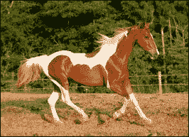
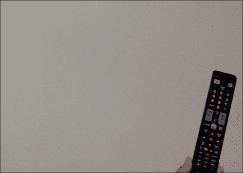
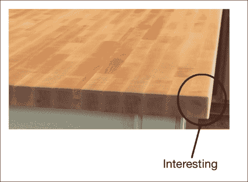
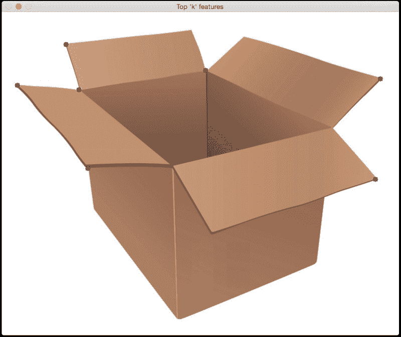
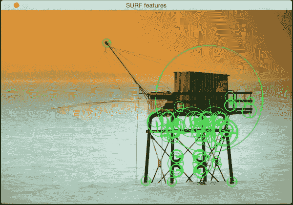
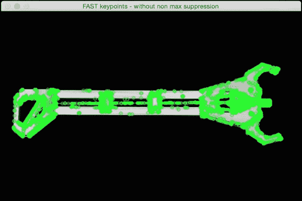
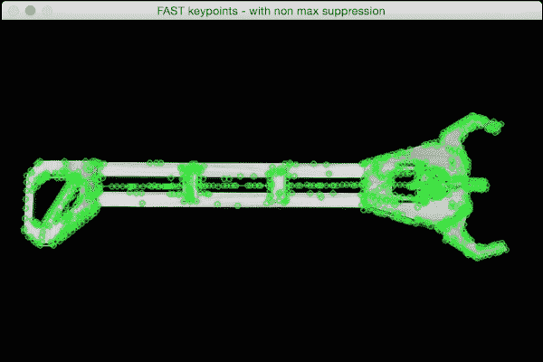
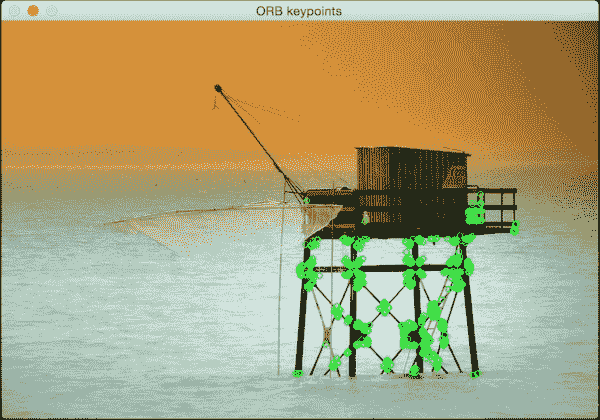

# 第 4 章。从图像中提取特征

在本章中，我们将学习如何检测图像中的显着点，也称为关键点。 我们将讨论为什么这些关键点很重要，以及我们如何使用它们来理解图像内容。 我们将讨论可用于检测这些关键点的不同技术，并了解如何从给定图像中提取特征。

在本章结束时，您将了解：

*   关键点是什么，我们为什么要关心它们
*   如何检测关键点
*   如何使用关键点进行图像内容分析
*   检测关键点的不同技术
*   如何构建特征提取器

# 为什么我们关心关键点？

图像内容分析是指理解图像内容的过程，以便我们可以据此采取一些措施。 让我们退后一步，谈谈人类是如何做到的。 我们的大脑是一个非常强大的机器，可以非常快速地完成复杂的事情。 当我们看东西时，我们的大脑会根据该图像的“有趣”方面自动创建足迹。 在本章中，我们将讨论有趣的方法。

目前，一个有趣的方面是该地区与众不同的地方。 如果我们将一个点称为有趣的点，那么在它的邻域中不应有另一个满足约束的点。 让我们考虑下图：


现在，闭上您的眼睛，并尝试使该图像可视化。 您看到特定的东西了吗？ 您可以回忆一下图像左半部分的内容吗？ 并不是的！ 这样做的原因是图像没有任何有趣的信息。 当我们的大脑看着这样的东西时，没有什么需要注意的。 因此它倾向于四处走动！ 让我们看一下下图：



现在，闭上你的眼睛，并尝试形象化这张图片。 您会看到回忆很生动，并且还记得有关此图像的许多细节。 原因是图像中有很多有趣的区域。 与低频内容相比，人眼对高频内容更敏感。 这就是为什么我们倾向于比第一幅图像更好地收集第二幅图像的原因。 为了进一步说明这一点，让我们看一下下图：



如果您注意到，即使的眼睛不在图像中心，您的眼也会立即移到电视遥控器上。 我们会自动趋向于图像中的有趣区域，因为这是所有信息所在的位置。 这是我们的大脑需要存储的内容，以便以后进行重新收集。

在构建对象识别系统时，我们需要检测这些“有趣的”区域以创建图像的签名。 这些有趣的区域以关键点为特征。 这就是为什么关键点检测在许多现代计算机视觉系统中至关重要的原因。

# 关键点是什么？

现在我们知道关键点是指图像中有趣的区域，让我们更深入地进行研究。 关键点是什么？ 这些要点在哪里？ 当我们说“有趣”时，表示该区域正在发生某些事情。 如果该区域是统一的，那就不是很有趣。 例如，角点很有趣，因为强度在两个不同方向上发生了急剧变化。 每个角都是两个边相交的唯一点。 如果查看前面的图像，您将看到有趣的区域不是完全由“有趣”的内容组成的。 如果仔细观察，我们仍然可以看到繁忙区域中的平原区域。 例如，考虑以下图像：


如果您查看前面的对象，则有趣区域的内部是“无趣的”。


因此，如果要表征该对象，则需要确保选择了有趣的点。 现在，我们如何定义“有趣的点”？ 我们可以说没有什么不有趣的事情可能是一个有趣的观点吗？ 让我们考虑以下示例：



现在，我们可以看到此图像中沿边缘有很多高频内容。 但是我们不能称整个边缘为“有趣的”。 重要的是要理解“有趣”不一定涉及颜色或强度值。 只要是不同的，它可以是任何东西。 我们需要隔离它们附近唯一的点。 沿边缘的点相对于它们的邻居不是唯一的。 那么，既然我们知道我们在寻找什么，我们如何挑选一个有趣的观点？

桌子的一角呢？ 那很有趣，对不对？ 就其邻居而言，它是独一无二的，我们附近没有类似的东西。 现在，可以选择这一点作为我们的关键点之一。 我们利用这些关键点来表征特定的图像。

在进行图像分析时，我们需要先将其转换为数字形式，然后才能得出结论。 这些关键点使用数字形式表示，然后使用这些关键点的组合来创建图像签名。 我们希望该图像签名以最好的方式表示给定的图像。

# 检测角落

因为我们知道角是“有趣的”，所以让我们看一下如何检测它们。 在计算机视觉中，有一种流行的角点检测技术，称为**哈里斯角点检测器**。 我们基本上基于灰度图像的偏导数构造一个`2x2`矩阵，然后分析特征值。 这实际上是对实际算法的过度简化，但涵盖了要点。 因此，如果您想了解基本的数学细节，可以在[这个页面](http://www.bmva.org/bmvc/1988/avc-88-023.pdf)。 角点是两个特征值均具有较大值的点。

让我们考虑下图：


如果在此图像上运行哈里斯角点检测器，您将看到类似以下内容：


如您所见，所有黑点均对应于图像中的角。 如果您注意到，则未检测到盒子底部的角。 原因是角点不够尖锐。 您可以在角点检测器中调整阈值以识别这些角点。 代码执行以下操作：

```py
import cv2
import numpy as np

img = cv2.imread('box.jpg')
gray = cv2.cvtColor(img,cv2.COLOR_BGR2GRAY)

gray = np.float32(gray)

dst = cv2.cornerHarris(gray, 4,5, 0.04)      # to detect only sharp corners
#dst = cv2.cornerHarris(gray, 14, 5, 0.04)    # to detect soft corners

# Result is dilated for marking the corners
dst = cv2.dilate(dst,None)

# Threshold for an optimal value, it may vary depending on the image.
img[dst > 0.01*dst.max()] = [0,0,0]

cv2.imshow('Harris Corners',img)
cv2.waitKey()
```

# 好的功能要跟踪

哈里斯角点检测器在很多情况下都表现良好，但在某些方面却漏了。 在哈里斯和 Stephens 撰写原始论文大约六年之后，Shi-Tomasi 提出了一个更好的角点检测器。 您可以在[这个页面](http://www.ai.mit.edu/courses/6.891/handouts/shi94good.pdf)阅读原始论文。 他们使用了不同的评分功能来提高整体质量。 使用这种方法，我们可以在给定图像中找到最强的“ N”个角。 当我们不想使用每个角来从图像中提取信息时，这非常有用。

如果将 Shi-Tomasi 角点检测器应用于前面显示的图像，您将看到类似以下内容：



之后是代码：

```py
import cv2
import numpy as np

img = cv2.imread('box.jpg')
gray = cv2.cvtColor(img,cv2.COLOR_BGR2GRAY)

corners = cv2.goodFeaturesToTrack(gray, 7, 0.05, 25)
corners = np.float32(corners)

for item in corners:
    x, y = item[0]
    cv2.circle(img, (x,y), 5, 255, -1)

cv2.imshow("Top 'k' features", img)
cv2.waitKey()
```

# 尺度不变特征变换（SIFT）

尽管角落功能“很有趣”，但它们不足以描述真正有趣的部分。 当我们谈论图像内容分析时，我们希望图像签名对于诸如比例尺，旋转度，照度等事物不变。 人类在这些事情上非常擅长。 即使我给您看的苹果颠倒的图像变暗，您仍然会识别它。 如果我向您展示该图像的放大版本，您仍会识别它。 我们希望我们的图像识别系统能够做到这一点。

让我们考虑角点特征。 如果放大图像，角点可能不再是角点，如下所示。


在第二种情况下，检测器将不会拾取该角。 并且，由于它是在原始图像中拾取的，因此第二张图像将与第一张图像不匹配。 它基本上是相同的图像，但是基于角点特征的方法将完全错过它。 这意味着角落检测器并非精确地缩放不变。 这就是为什么我们需要一种更好的方法来表征图像的原因。

SIFT 是所有计算机视觉中最受欢迎的算法之一。 您可以在[这个页面](http://www.cs.ubc.ca/~lowe/papers/ijcv04.pdf)上阅读 David Lowe 的原始论文。 我们可以使用该算法提取关键点并构建相应的特征描述符。 在线上有很多很好的文档，因此我们将简短地讨论。 为了确定潜在的关键点，SIFT 通过对图像进行下采样并获取高斯差来构建金字塔。 这意味着我们在每个级别上运行一个高斯过滤器，并利用差值在金字塔中构建连续的级别。 为了查看当前点是否为关键点，它会查看相邻点以及金字塔相邻级别中同一位置的像素。 如果是最大值，则将当前点作为关键点。 这样可以确保我们将关键点规模保持不变。

现在我们知道了它如何实现尺度不变性，让我们看一下它如何实现旋转不变性。 一旦我们确定了关键点，便为每个关键点分配了方向。 我们采用每个关键点附近的邻域，并计算梯度大小和方向。 这使我们对关键点的方向有所了解。 如果我们有此信息，即使旋转该关键点，也可以将其与另一个图像中的同一点进行匹配。 由于我们知道方向，因此我们可以在进行比较之前将这些关键点归一化。

一旦获得所有这些信息，我们如何量化它？ 我们需要将其转换为一组数字，以便可以对其进行某种匹配。 为此，我们只需要围绕每个关键点设置`16x16`邻域，并将其划分为 16 个大小为`16x16`的块。 对于每个块，我们使用 8 个箱子计算取向直方图。 因此，我们有一个与每个块关联的长度为 8 的向量，这意味着该邻域由大小为 128（8x16）的向量表示。 这是将要使用的最终关键点描述符。 如果我们从图像中提取`N`关键点，那么我们将有`N`个描述符，每个描述符的长度为 128。 `N`描述符的数组描述了给定的图像。

考虑下图：


如果使用 SIFT 提取关键点位置，则会看到类似以下的内容，其中圆圈的大小指示关键点的强度，圆圈内的线指示方向：


在我们研究代码之前，重要的是要知道 SIFT 已获得专利，并且不能免费用于商业用途。 以下是执行此操作的代码：

```py
import cv2
import numpy as np

input_image = cv2.imread('input.jpg')
gray_image = cv2.cvtColor(input_image, cv2.COLOR_BGR2GRAY)

sift = cv2.SIFT()
keypoints = sift.detect(gray_image, None)

input_image = cv2.drawKeypoints(input_image, keypoints, flags=cv2.DRAW_MATCHES_FLAGS_DRAW_RICH_KEYPOINTS)

cv2.imshow('SIFT features', input_image)
cv2.waitKey()
```

我们也可以计算描述符。 OpenCV 可以让我们单独进行操作，也可以使用以下步骤在同一步骤中组合检测和计算部分：

```py
keypoints, descriptors = sift.detectAndCompute(gray_image, None)
```

# 加快了鲁棒特征（SURF）

即使 SIFT 很好且很有用，但它的计算量很大。 这意味着它很慢，如果使用 SIFT，我们将很难实施实时系统。 我们需要一个快速且具有 SIFT 所有优点的系统。 如果您还记得，SIFT 使用高斯的差异来构建金字塔，并且此过程很慢。 因此，为克​​服此问题，SURF 使用简单的盒式过滤器来近似高斯。 好消息是，这确实很容易计算，而且速度相当快。 [SURF 上有很多文档，可在线下载](http://opencv-python-tutroals.readthedocs.org/en/latest/py_tutorials/py_feature2d/py_surf_intro/py_surf_intro.html?highlight=surf)。 因此，您可以遍历它以了解他们如何构造描述符。 您可以在[这个页面](http://www.vision.ee.ethz.ch/~surf/eccv06.pdf)上参考原始论文。 重要的是要知道 SURF 也已获得专利，并且不能免费用于商业用途。

如果在较早的图像上运行 SURF 关键点检测器，您将看到类似以下内容：



这是代码：

```py
import cv2
import numpy as np

img = cv2.imread('input.jpg')
gray= cv2.cvtColor(img, cv2.COLOR_BGR2GRAY)

surf = cv2.SURF()

# This threshold controls the number of keypoints
surf.hessianThreshold = 15000

kp, des = surf.detectAndCompute(gray, None)

img = cv2.drawKeypoints(img, kp, None, (0,255,0), 4)

cv2.imshow('SURF features', img)
cv2.waitKey()
```

# 加速分段测试（FAST）的功能

尽管 SURF 比 SIFT 快，但是对于实时系统而言，它还不够快，尤其是在存在资源限制的情况下。 当您在移动设备上构建实时应用程序时，您将无法享受使用 SURF 进行实时计算的奢华。 我们需要的是真正快速且计算便宜的东西。 因此，罗斯滕（Rosten）和德拉蒙德（Drummond）提出了 FAST。 顾名思义，它真的很快！

他们没有进行所有昂贵的计算，而是想出一个高速测试来快速确定当前点是否是潜在的关键点。 我们需要注意，FAST 仅用于关键点检测。 一旦检测到关键点，就需要使用 SIFT 或 SURF 来计算描述符。 考虑下图：


如果我们在此图像上运行 FAST 关键点检测器，您将看到类似以下内容：



如果我们清理它并抑制不重要的关键点，它将看起来像这样：



以下是代码：

```py
import cv2
import numpy as np

gray_image = cv2.imread('input.jpg', 0)

fast = cv2.FastFeatureDetector()

# Detect keypoints
keypoints = fast.detect(gray_image, None)
print "Number of keypoints with non max suppression:", len(keypoints)

# Draw keypoints on top of the input image
img_keypoints_with_nonmax = cv2.drawKeypoints(gray_image, keypoints, color=(0,255,0))
cv2.imshow('FAST keypoints - with non max suppression', img_keypoints_with_nonmax)

# Disable nonmaxSuppression
fast.setBool('nonmaxSuppression', False)

# Detect keypoints again
keypoints = fast.detect(gray_image, None)

print "Total Keypoints without nonmaxSuppression:", len(keypoints)

# Draw keypoints on top of the input image
img_keypoints_without_nonmax = cv2.drawKeypoints(gray_image, keypoints, color=(0,255,0))
cv2.imshow('FAST keypoints - without non max suppression', img_keypoints_without_nonmax)
cv2.waitKey()
```

# 二进制鲁棒的独立基本特征（BRIEF）

即使我们具有 FAST 来快速检测关键点，我们仍然必须使用 SIFT 或 SURF 来计算描述符。 我们还需要一种快速计算描述符的方法。 这就是 Brief 出现的地方。 摘要是一种提取特征描述符的方法。 它不能单独检测关键点，因此我们需要将其与关键点检测器结合使用。 Brief 的好处是它紧凑且快速。

考虑下图：


Brief 获取输入关键点的列表并输出更新的列表。 因此，如果在此图像上运行“摘要”，您将看到类似以下内容：


以下是代码：

```py
import cv2

import numpy as np

gray_image = cv2.imread('input.jpg', 0)

# Initiate FAST detector
fast = cv2.FastFeatureDetector()

# Initiate BRIEF extractor
brief = cv2.DescriptorExtractor_create("BRIEF")

# find the keypoints with STAR
keypoints = fast.detect(gray_image, None)

# compute the descriptors with BRIEF
keypoints, descriptors = brief.compute(gray_image, keypoints)

gray_keypoints = cv2.drawKeypoints(gray_image, keypoints, color=(0,255,0))
cv2.imshow('BRIEF keypoints', gray_keypoints)
cv2.waitKey()
```

# 定向的快速旋转式公文包（ORB）

因此，到目前为止，我们已经讨论了所有组合中的最佳组合。 该算法来自 OpenCV 实验室。 它是快速，强大且开源的！ SIFT 和 SURF 算法均已获得专利，您不能将其用于商业目的。 这就是为什么 ORB 在许多方面都很好的原因。

如果在前面显示的图像之一上运行 ORB 关键点提取器，您将看到类似以下内容：



这是代码：

```py
import cv2
import numpy as np

input_image = cv2.imread('input.jpg')
gray_image = cv2.cvtColor(input_image, cv2.COLOR_BGR2GRAY)

# Initiate ORB object
orb = cv2.ORB()

# find the keypoints with ORB
keypoints = orb.detect(gray_image, None)

# compute the descriptors with ORB
keypoints, descriptors = orb.compute(gray_image, keypoints)

# draw only the location of the keypoints without size or orientation
final_keypoints = cv2.drawKeypoints(input_image, keypoints, color=(0,255,0), flags=0)

cv2.imshow('ORB keypoints', final_keypoints)
cv2.waitKey()
```

# 摘要

在本章中，我们了解了关键点的重要性以及为什么需要它们。 我们讨论了各种检测关键点和计算特征描述符的算法。 我们将在各种不同的上下文中的所有后续章节中使用这些算法。 关键点概念对于计算机视觉至关重要，并且在许多现代系统中都扮演着重要角色。

在下一章中，我们将讨论如何将同一场景的多个图像拼接在一起以创建全景图像。