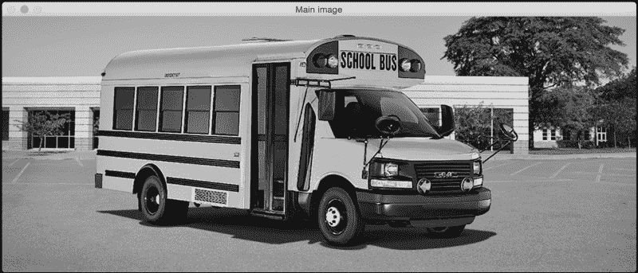
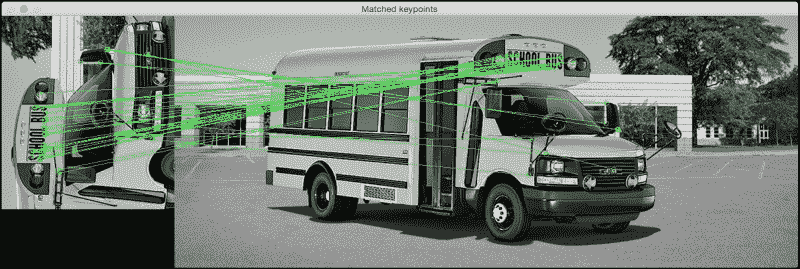
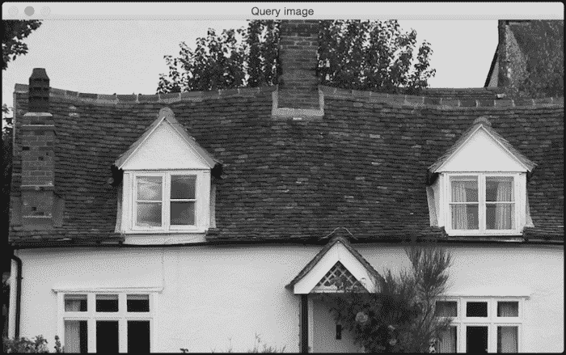
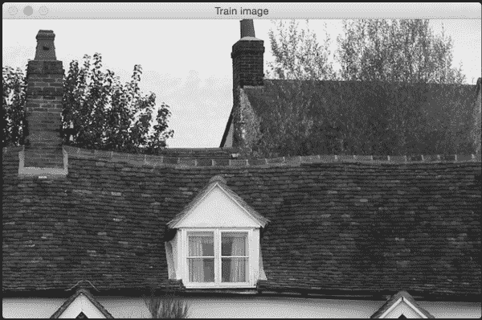
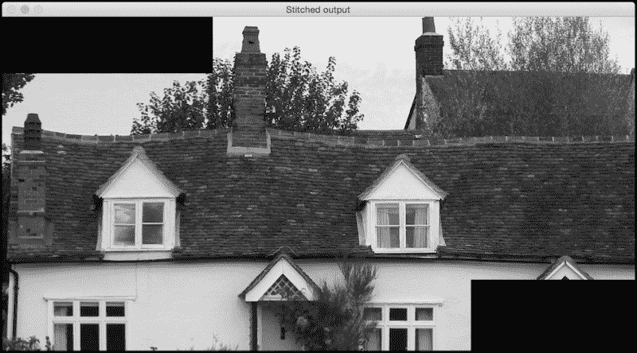
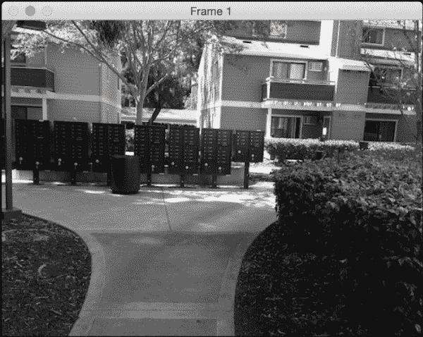
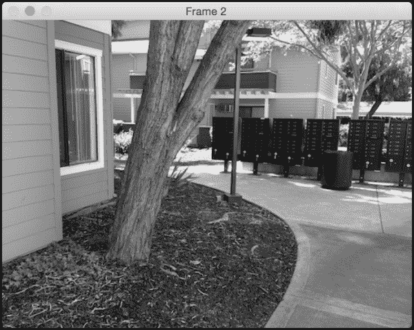
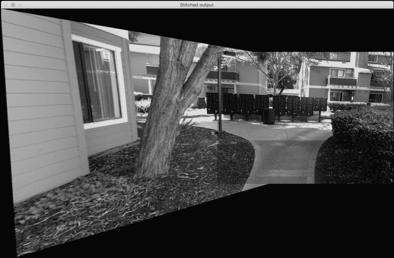

# 第 5 章。创建全景图像

在本章中，我们将学习如何将同一场景的多个图像拼接在一起以创建全景图像。

在本章结束时，您将了解：

*   如何在多个图像之间匹配关键点描述符
*   如何找到图像之间的重叠区域
*   如何基于匹配的关键点使图像变形
*   如何拼接多张图像以创建全景图像

# 匹配的关键点描述符

在上一章中，我们学习了如何使用各种方法来提取关键点。 之所以提取关键点，是因为我们可以将它们用于图像匹配。 让我们考虑下图：



如您所见，这是一辆校车的照片。 现在，让我们看一下下图：


前面的图像是校车图像的一部分，并且已逆时针旋转了 90 度。 我们很容易认识到这一点，因为我们的大脑对缩放和旋转保持不变。 我们的目标是在这两个图像之间找到匹配点。 如果这样做，它将看起来像这样：



以下是执行此操作的代码：

```py
import sys

import cv2
import numpy as np

def draw_matches(img1, keypoints1, img2, keypoints2, matches):
    rows1, cols1 = img1.shape[:2]
    rows2, cols2 = img2.shape[:2]

    # Create a new output image that concatenates the two images together
    output_img = np.zeros((max([rows1,rows2]), cols1+cols2, 3), dtype='uint8')
    output_img[:rows1, :cols1, :] = np.dstack([img1, img1, img1])
    output_img[:rows2, cols1:cols1+cols2, :] = np.dstack([img2, img2, img2])

    # Draw connecting lines between matching keypoints
    for match in matches:
        # Get the matching keypoints for each of the images
        img1_idx = match.queryIdx
        img2_idx = match.trainIdx

        (x1, y1) = keypoints1[img1_idx].pt
        (x2, y2) = keypoints2[img2_idx].pt

        # Draw a small circle at both co-ordinates and then draw a line
        radius = 4
        colour = (0,255,0)   # green
        thickness = 1
        cv2.circle(output_img, (int(x1),int(y1)), radius, colour, thickness)
        cv2.circle(output_img, (int(x2)+cols1,int(y2)), radius, colour, thickness)
        cv2.line(output_img, (int(x1),int(y1)), (int(x2)+cols1,int(y2)), colour, thickness)

    return output_img

if __name__=='__main__':
    img1 = cv2.imread(sys.argv[1], 0)   # query image (rotated subregion)
    img2 = cv2.imread(sys.argv[2], 0)   # train image (full image)

    # Initialize ORB detector
    orb = cv2.ORB()

    # Extract keypoints and descriptors
    keypoints1, descriptors1 = orb.detectAndCompute(img1, None)
    keypoints2, descriptors2 = orb.detectAndCompute(img2, None)

    # Create Brute Force matcher object
    bf = cv2.BFMatcher(cv2.NORM_HAMMING, crossCheck=True)

    # Match descriptors
    matches = bf.match(descriptors1, descriptors2)

    # Sort them in the order of their distance
    matches = sorted(matches, key = lambda x:x.distance)

    # Draw first 'n' matches
    img3 = draw_matches(img1, keypoints1, img2, keypoints2, matches[:30])

    cv2.imshow('Matched keypoints', img3)
    cv2.waitKey()
```

## 我们如何匹配关键点？

在前面的代码中，我们使用 ORB 检测器提取关键点。 提取关键点后，便使用了蛮力匹配器来匹配描述符。 蛮力匹配非常简单！ 对于第一张图片中的每个描述符，我们将其与第二张图片中的每个描述符进行匹配，并采用最接近的一个。 为了计算最接近的描述符，我们使用汉明距离作为度量标准，如以下行所示：

```py
bf = cv2.BFMatcher(cv2.NORM_HAMMING, crossCheck=True)
```

您可以在 [https://en.wikipedia.org/wiki/Hamming_distance](https://en.wikipedia.org/wiki/Hamming_distance) 上了解有关汉明距离的更多信息。 前一行的第二个参数是布尔变量。 如果为真，则匹配器仅返回在两个方向上彼此最接近的那些关键点。 这意味着如果获得（i，j）作为匹配项，则可以确保第一张图像中的第 i 个描述符具有第二张图像中的第 j 个描述符作为其最接近的匹配，反之亦然。 这增加了描述符匹配的一致性和鲁棒性。

## 了解匹配器对象

让我们再次考虑下面的行：

```py
matches = bf.match(descriptors1, descriptors2)
```

在这里，变量 match 是 DMatch 对象的列表。 您可以在 OpenCV 文档中阅读有关它的更多信息。 我们只需要快速理解它的含义，因为它在以后的章节中将变得越来越重要。 如果我们要遍历此 DMatch 对象列表，则每个项目将具有以下属性：

*   **item.distance** ：此属性为我们提供了描述符之间的距离。 距离越短表示匹配越好。
*   **item.trainIdx** ：此属性为我们提供了火车描述符列表中描述符的索引（在我们的情况下，它是完整图像中描述符的列表）。
*   **item.queryIdx** ：此属性为我们提供了查询描述符列表中描述符的索引（在我们的情况下，这是旋转子图像中的描述符列表）。
*   **item.imgIdx** ：此属性为我们提供火车图像的索引。

## 绘制匹配的关键点

现在我们知道如何访问匹配器对象的不同属性，让我们看看如何使用它们绘制匹配的关键点。 OpenCV 3.0 提供了直接功能来绘制匹配的关键点，但是我们不会使用它。 最好窥视一下内部，看看下面发生了什么。

我们需要创建一个大输出图像，使其可以同时适合两个图像。 因此，我们在以下行中执行此操作：

```py
output_img = np.zeros((max([rows1,rows2]), cols1+cols2, 3), dtype='uint8')
```

正如我们在这里看到的，行数设置为两个值中的较大者，列数只是两个值的总和。 对于匹配项列表中的每个项目，我们都提取匹配关键点的位置，如以下几行所示：

```py
(x1, y1) = keypoints1[img1_idx].pt
(x2, y2) = keypoints2[img2_idx].pt
```

完成此操作后，我们只需在这些点上绘制来指示其位置，然后绘制一条连接这两个点的线。

# 创建全景图像

现在我们知道了如何匹配关键点，让我们继续前进，看看如何将多个图像拼接在一起。 考虑下图：



假设我们要将下面的图像与前面的图像拼接在一起：



如果我们缝合这些图像，它将看起来类似于以下图像：



现在让我们说捕获了房子的另一部分，如下图所示：


如果我们用之前看到的拼接图像来拼接前面的图像，它将看起来像这样：


我们可以将图像拼接在一起，以创建漂亮的全景图像。 让我们看一下代码：

```py
import sys
import argparse

import cv2
import numpy as np

def argument_parser():
    parser = argparse.ArgumentParser(description='Stitch two images together')
    parser.add_argument("--query-image", dest="query_image", required=True,
            help="First image that needs to be stitched")
    parser.add_argument("--train-image", dest="train_image", required=True,
            help="Second image that needs to be stitched")
    parser.add_argument("--min-match-count", dest="min_match_count", type=int,
            required=False, default=10, help="Minimum number of matches required")
    return parser

# Warp img2 to img1 using the homography matrix H
def warpImages(img1, img2, H):
    rows1, cols1 = img1.shape[:2]
    rows2, cols2 = img2.shape[:2]

    list_of_points_1 = np.float32([[0,0], [0,rows1], [cols1,rows1], [cols1,0]]).reshape(-1,1,2)
    temp_points = np.float32([[0,0], [0,rows2], [cols2,rows2], [cols2,0]]).reshape(-1,1,2)
    list_of_points_2 = cv2.perspectiveTransform(temp_points, H)
    list_of_points = np.concatenate((list_of_points_1, list_of_points_2), axis=0)

    [x_min, y_min] = np.int32(list_of_points.min(axis=0).ravel() - 0.5)
    [x_max, y_max] = np.int32(list_of_points.max(axis=0).ravel() + 0.5)
    translation_dist = [-x_min,-y_min]
    H_translation = np.array([[1, 0, translation_dist[0]], [0, 1, translation_dist[1]], [0,0,1]])

    output_img = cv2.warpPerspective(img2, H_translation.dot(H), (x_max-x_min, y_max-y_min))
    output_img[translation_dist[1]:rows1+translation_dist[1], translation_dist[0]:cols1+translation_dist[0]] = img1

    return output_img

if __name__=='__main__':
    args = argument_parser().parse_args()
    img1 = cv2.imread(args.query_image, 0)
    img2 = cv2.imread(args.train_image, 0)
    min_match_count = args.min_match_count

    cv2.imshow('Query image', img1)
    cv2.imshow('Train image', img2)

    # Initialize the SIFT detector
    sift = cv2.SIFT()

    # Extract the keypoints and descriptors
    keypoints1, descriptors1 = sift.detectAndCompute(img1, None)
    keypoints2, descriptors2 = sift.detectAndCompute(img2, None)

    # Initialize parameters for Flann based matcher
    FLANN_INDEX_KDTREE = 0
    index_params = dict(algorithm = FLANN_INDEX_KDTREE, trees = 5)
    search_params = dict(checks = 50)

    # Initialize the Flann based matcher object
    flann = cv2.FlannBasedMatcher(index_params, search_params)

    # Compute the matches
    matches = flann.knnMatch(descriptors1, descriptors2, k=2)

    # Store all the good matches as per Lowe's ratio test
    good_matches = []
    for m1,m2 in matches:
        if m1.distance < 0.7*m2.distance:
            good_matches.append(m1)

    if len(good_matches) > min_match_count:
        src_pts = np.float32([ keypoints1[good_match.queryIdx].pt for good_match in good_matches ]).reshape(-1,1,2)
        dst_pts = np.float32([ keypoints2[good_match.trainIdx].pt for good_match in good_matches ]).reshape(-1,1,2)

        M, mask = cv2.findHomography(src_pts, dst_pts, cv2.RANSAC, 5.0)
        result = warpImages(img2, img1, M)
        cv2.imshow('Stitched output', result)

        cv2.waitKey()

    else:
        print "We don't have enough number of matches between the two images."
        print "Found only %d matches. We need at least %d matches." % (len(good_matches), min_match_count)
```

## 查找重叠区域

这里的目标是找到匹配的关键点，以便我们可以将图像拼接在一起。 因此，第一步是获取这些匹配的关键点。 如上一节所述，我们使用关键点检测器提取关键点，然后使用基于 Flann 的匹配器匹配关键点。

### 注意

您可以通过[了解有关 Flann 的更多信息，网址为 http://citeseerx.ist.psu.edu/viewdoc/download?doi=10.1.1.192.5378 & rep = rep1 & type = pdf](http://citeseerx.ist.psu.edu/viewdoc/download?doi=10.1.1.192.5378&rep=rep1&type=pdf) 。

基于 Flann 的匹配器比[蛮力]匹配要快，因为它不会将每个点与另一个列表中的每个点进行比较。 它仅考虑当前点的邻域来获取匹配的关键点，从而使其更有效。

一旦获得了匹配的关键点列表，就可以使用 Lowe 的比率测试来仅保留强匹配项。 David Lowe 提出了此比率测试，以提高 SIFT 的鲁棒性。

### 注意

您可以在 [http://www.cs.ubc.ca/~lowe/papers/ijcv04.pdf](http://www.cs.ubc.ca/~lowe/papers/ijcv04.pdf) 了解更多信息。

基本上，当我们匹配关键点时，我们拒绝匹配项，其中到最近邻居和第二个最近邻居的距离之比大于某个阈值。 这有助于我们丢弃不够清晰的点。 因此，我们在这里使用该概念仅保留良好的匹配项，而忽略其余的匹配项。 如果我们没有足够的比赛，我们不会继续进行。 在我们的例子中，默认值为 10。您可以使用此输入参数来了解它如何影响输出。

如果我们有足够数量的匹配项，那么我们将提取两个图像中的关键点列表，并提取单应性矩阵。 如果您还记得，我们已经在第一章中讨论了单应性。 因此，如果您忘记了它，则可能需要快速浏览一下。 我们基本上从这两个图像中获取一堆点，然后提取变换矩阵。

## 拼接图像

现在我们有了转换，我们可以继续拼接图像了。 我们将使用变换矩阵来变换第二个点列表。 我们将第一个图像作为参考框架，并创建一个足以容纳两个图像的输出图像。 我们需要提取有关第二张图像变换的信息。 我们需要将其移至该参考框架中，以确保其与第一张图像对齐。 因此，我们必须提取翻译信息，然后将其变形。 然后，我们将第一个图像添加到其中，并构建最终输出。 值得一提的是，这也适用于具有不同宽高比的图像。 因此，如果有机会，请尝试一下，看看输出结果如何。

# 如果图像彼此成角度怎么办？

直到现在，我们都在查看同一平面上的图像。 拼接这些图像非常简单，我们无需处理任何伪像。 在现实生活中，您无法在完全相同的平面上捕获多个图像。 当捕获同一场景的多个图像时，势必会倾斜相机并更改平面。 所以问题是，我们的算法在那种情况下会起作用吗？ 事实证明，它也可以处理这些情况。

让我们考虑下图：



现在，让我们考虑同一场景的另一幅图像。 它与第一个图像成一定角度，并且也部分重叠：



让我们以第一张图像作为参考。 如果我们使用算法拼接这些图像，它将看起来像这样：


如果我们将第二张图像作为参考，它将看起来像这样：



## 为什么看起来很拉伸？

如果您观察到，则输出图像的与查询图像相对应的部分看起来被拉伸了。 这是因为查询图像已经过转换和调整以适合我们的参考框架。 它看起来很冗长的原因是因为我们的代码中包含以下几行：

```py
M, mask = cv2.findHomography(src_pts, dst_pts, cv2.RANSAC, 5.0)
result = warpImages(img2, img1, M)
```

由于图像相对于彼此成一定角度，因此查询图像将必须进行透视变换，以适合参考框架。 因此，我们首先转换查询图像，然后将其缝合到我们的主图像中以形成全景图像。

# 摘要

在本章中，我们学习了如何在多个图像之间匹配关键点。 我们讨论了如何将多个图像拼接在一起以创建全景图像。 我们学习了如何处理不在同一平面上的图像。

在下一章中，我们将讨论如何通过检测图像中的“有趣”区域来进行内容感知的图像大小调整。