# 第 7 章。检测形状和分割图像

在本章中，我们将学习形状分析和图像分割。 我们将学习如何识别形状并估算确切边界。 我们将讨论如何使用各种方法将图像分割成其组成部分。 我们还将学习如何将前景与背景分开。

在本章结束时，您将了解：

*   什么是轮廓分析和形状匹配
*   如何搭配形状
*   什么是图像分割
*   如何将图像分割成其组成部分
*   如何将前景与背景分开
*   如何使用各种技术分割图像

# 轮廓分析和形状匹配

轮廓分析在计算机视觉领域是非常有用的工具。 我们在现实世界中处理的许多形状，轮廓分析有助于使用各种算法分析这些形状。 当我们将图像转换为灰度并对其进行阈值处理时，我们会留下一堆线条和轮廓。 一旦了解了不同形状的属性，便可以从图像中提取详细信息。

假设我们要在下图中标识回旋镖形状：


为了使能够做到这一点，我们首先需要知道常规回旋镖的外观：


现在以上面的图像为参考，我们是否可以识别原始图像中与回旋镖相对应的形状？ 如果您注意到，我们不能使用基于简单相关性的方法，因为形状都会变形。 这意味着我们寻找精确匹配的方法将行不通！ 我们需要了解此形状的属性，并匹配对应的属性，以识别回旋镖形状。 OpenCV 提供了一个很好的形状匹配器功能，我们可以用来实现此功能。 匹配基于 Hu 矩的概念，而矩又与图像矩有关。 [您可以参考以下论文以了解有关时刻的更多信息](http://zoi.utia.cas.cz/files/chapter_moments_color1.pdf)。 “图像矩”的概念基本上是指形状内像素的加权和乘幂求和。

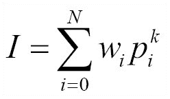

在上式中， **p** 表示轮廓内的像素， **w** 表示权重， **N** 表示轮廓内的点数， **k** 表示功率， **I** 表示力矩。 根据我们为 w 和 k 选择的值，我们可以从该轮廓提取不同的特征。

也许最简单的例子是计算轮廓的面积。 为此，我们需要计算该区域内的像素数。 因此，从数学上讲，在加权和乘幂加法求和形式中，我们只需要将 w 设置为 1，将 k 设置为 0。这将为我们提供轮廓区域。 根据我们如何计算这些力矩，它们将帮助我们理解这些不同的形状。 这也产生了一些有趣的属性，可以帮助我们确定形状相似性度量。

如果我们匹配形状，您将看到类似以下内容：

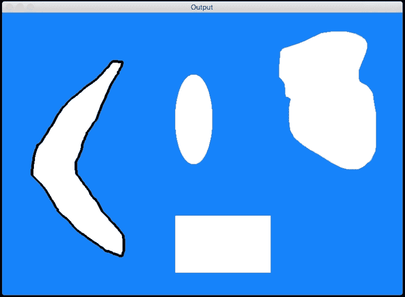

让我们来看来执行的代码：

```py
import sys

import cv2
import numpy as np

# Extract reference contour from the image
def get_ref_contour(img):
    ref_gray = cv2.cvtColor(img, cv2.COLOR_BGR2GRAY)
    ret, thresh = cv2.threshold(ref_gray, 127, 255, 0)

    # find all the contours in the thresholded image
    # The values for the second and third parameters is restricted to a certain number of possible values. You can learn more 'findContours' function here: http://docs.opencv.org/modules/imgproc/doc/structural_analysis_and_shape_descriptors.html
    contours, hierarchy = cv2.findContours(thresh, 1, 2)

    # Extract the relevant contour based on area ratio
    # We use the area ratio because sometimes the image boundary contour is extracted as well and we don't want that. This area ratio threshold will ensure that we only take the contour inside the image.
    for contour in contours:
        area = cv2.contourArea(contour)
        img_area = img.shape[0] * img.shape[1]
        if 0.05 < area/float(img_area) < 0.8:
            return contour

# Extract all the contours from the image
def get_all_contours(img):
    ref_gray = cv2.cvtColor(img, cv2.COLOR_BGR2GRAY)
    ret, thresh = cv2.threshold(ref_gray, 127, 255, 0)
    contours, hierarchy = cv2.findContours(thresh, 1, 2)
    return contours

if __name__=='__main__':
    # boomerang reference image
    img1 = cv2.imread(sys.argv[1])

    # input image containing all the different shapes
    img2 = cv2.imread(sys.argv[2])

    # Extract the reference contour
    ref_contour = get_ref_contour(img1)

    # Extract all the contours from the input image
    input_contours = get_all_contours(img2)

    closest_contour = input_contours[0]
    min_dist = sys.maxint

    # finding the closest contour
    for contour in input_contours:
        # Matching the shapes and taking the closest one
        ret = cv2.matchShapes(ref_contour, contour, 1, 0.0)
        if ret < min_dist:
            min_dist = ret
            closest_contour = contour

    cv2.drawContours(img2, [closest_contour], -1, (0,0,0), 3)
    cv2.imshow('Output', img2)
    cv2.waitKey()

```

# 逼近轮廓

现实生活中我们遇到的许多轮廓都很嘈杂。 这意味着轮廓看起来不平滑，因此我们的分析受到了打击。 那么我们如何处理呢？ 一种解决方法是获取轮廓上的所有点，然后使用平滑多边形对其进行近似。

让我们再次考虑飞旋镖的形象。 如果使用各种阈值近似轮廓，则会看到轮廓改变其形状。 让我们从 0.05 开始：

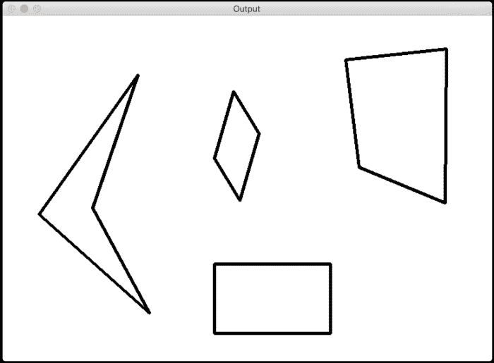

如果减小此因子，轮廓将变得更平滑。 让我们使其为 0.01：


如果您确实将其设为，例如说 0.00001，那么它将看起来像原始图像：


# 识别出已切片的披萨

标题可能有些误导，因为我们不会谈论披萨片。 但是，假设您所处的图像包含不同类型的不同形状的比萨饼。 现在，有人从其中一个比萨饼中切出一片。 我们如何自动识别这一点？

我们无法采用之前采用的方法，因为我们不知道形状是什么样。 因此，我们没有任何模板。 我们甚至不确定我们要寻找的形状，因此我们无法基于任何先验信息构建模板。 我们所知道的是从一个比萨饼上切下一片的事实。 让我们考虑下图：


这不完全是真实的图像，但是您可以理解。 你知道我们在谈论什么形状。 由于我们不知道要寻找什么，因此我们需要使用这些形状的某些属性来识别切成薄片的比萨饼。 如果您注意到，所有其他形状都很好地闭合了。 如图所示，您可以在这些形状中选取任意两个点，并在它们之间画一条线，并且该线将始终位于该形状内。 这些形状称为 **凸形**。

如果您查看切片的比萨饼形状，我们可以选择两个点，使它们之间的线超出形状，如下图所示：

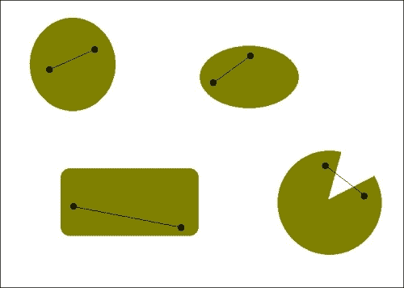

因此，我们要做的就是检测图像中的非凸形状，然后就可以完成。 让我们继续这样做：

```py
import sys

import cv2
import numpy as np

# Input is a color image
def get_contours(img):
    # Convert the image to grayscale
    img_gray = cv2.cvtColor(img, cv2.COLOR_BGR2GRAY)

    # Threshold the input image
    ret, thresh = cv2.threshold(img_gray, 127, 255, 0)

    # Find the contours in the above image
    contours, hierarchy = cv2.findContours(thresh, 2, 1)

    return contours

if __name__=='__main__':
    img = cv2.imread(sys.argv[1])

    # Iterate over the extracted contours
    for contour in get_contours(img):
        # Extract convex hull from the contour
        hull = cv2.convexHull(contour, returnPoints=False)

        # Extract convexity defects from the above hull
        defects = cv2.convexityDefects(contour, hull)

        if defects is None:
            continue

        # Draw lines and circles to show the defects
        for i in range(defects.shape[0]):
            start_defect, end_defect, far_defect, _ = defects[i,0]
            start = tuple(contour[start_defect][0])
            end = tuple(contour[end_defect][0])
            far = tuple(contour[far_defect][0])
            cv2.circle(img, far, 5, [128,0,0], -1)
            cv2.drawContours(img, [contour], -1, (0,0,0), 3)

    cv2.imshow('Convexity defects',img)
    cv2.waitKey(0)
    cv2.destroyAllWindows()
```

如果运行上面的代码，您将看到类似以下内容：

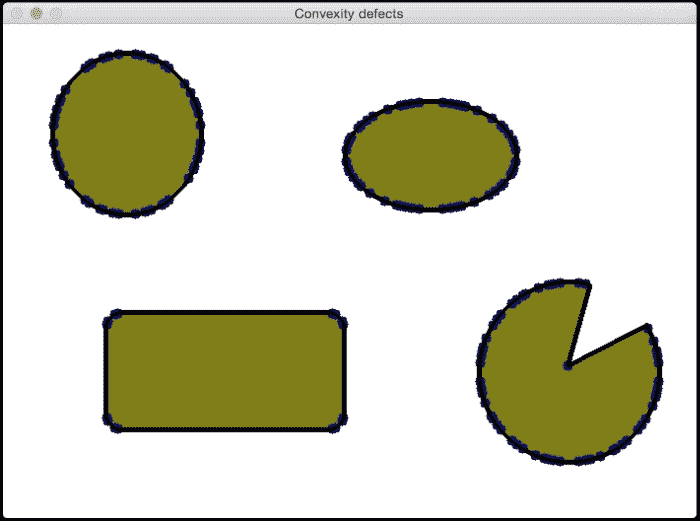

等一下，这里发生了什么？ 看起来很混乱。 我们做错了吗？ 事实证明，曲线并不是很平滑。 如果仔细观察，曲线上到处都有细小的山脊。 因此，如果仅运行凸度检测器，它将无法正常工作。 这是轮廓近似非常有用的地方。 一旦检测到轮廓，就需要对其进行平滑处理，以免脊不影响它们。 让我们继续这样做：

```py
import sys

import cv2
import numpy as np

# Input is a color image
def get_contours(img):
    img_gray = cv2.cvtColor(img, cv2.COLOR_BGR2GRAY)
    ret, thresh = cv2.threshold(img_gray, 127, 255, 0)
    contours, hierarchy = cv2.findContours(thresh, 2, 1)
    return contours

if __name__=='__main__':
    img = cv2.imread(sys.argv[1])

    # Iterate over the extracted contours
    for contour in get_contours(img):
        orig_contour = contour
        epsilon = 0.01 * cv2.arcLength(contour, True)
        contour = cv2.approxPolyDP(contour, epsilon, True)

        # Extract convex hull and the convexity defects
        hull = cv2.convexHull(contour, returnPoints=False)
        defects = cv2.convexityDefects(contour,hull)

        if defects is None:
            continue

        # Draw lines and circles to show the defects
        for i in range(defects.shape[0]):
            start_defect, end_defect, far_defect, _ = defects[i,0]
            start = tuple(contour[start_defect][0])
            end = tuple(contour[end_defect][0])
            far = tuple(contour[far_defect][0])
            cv2.circle(img, far, 7, [255,0,0], -1)
            cv2.drawContours(img, [orig_contour], -1, (0,0,0), 3)

    cv2.imshow('Convexity defects',img)
    cv2.waitKey(0)
    cv2.destroyAllWindows()
```

如果运行前面的代码，输出将如下所示：

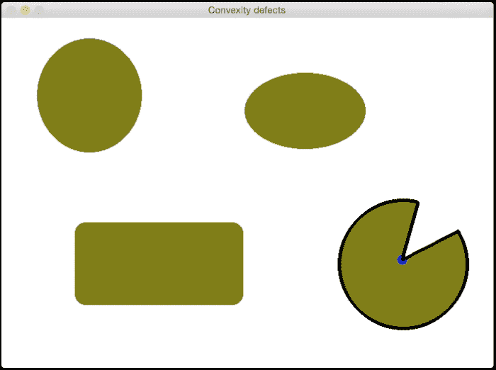

# 如何检查形状？

假设您正在处理图像，并且想屏蔽特定形状。 现在，您可能会说您将使用形状匹配来识别形状，然后将其屏蔽掉，对吗？ 但是这里的问题是我们没有可用的模板。 那么，我们如何去做呢？ 形状分析有多种形式，我们需要根据情况构建算法。 让我们考虑下图：

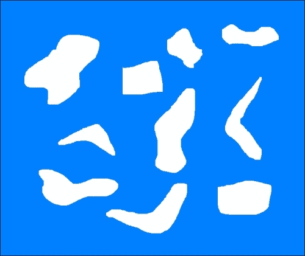

假设我们要识别所有回​​旋镖形状，然后不使用任何模板图像就将它们遮挡掉。 如您所见，该图像中还有其他各种怪异的形状，而飞旋镖形状并不是很平滑。 我们需要确定将飞旋镖形状与当前其他形状区分开的属性。 让我们考虑凸包。 如果采用每种形状的面积与凸包的面积之比，我们可以看到这可以作为区别指标。 在形状分析中，此度量标准称为**固体因子** 。 该度量标准对于回旋镖形状而言具有较低的值，因为将留出空白区域，如下图所示：

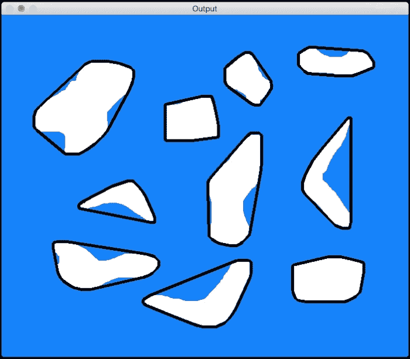

黑色边界表示凸包。 一旦为所有形状计算了这些值，如何将它们分开？ 我们可以仅使用固定的阈值来检测回旋镖形状吗？ 并不是的！ 我们无法使用固定的阈值，因为您永远不知道以后会遇到哪种形状。 因此，更好的方法是使用 **K-Means 聚类**。 K-Means 是一种无监督的学习技术，可用于将输入数据分离为 K 类。 在[这个页面](http://docs.opencv.org/master/de/d4d/tutorial_py_kmeans_understanding.html)继续进行之前，您可以快速熟悉 K-Means。

我们知道我们想将形状分为两组，即回旋镖形状和其他形状。 因此，我们知道 K-Means 中的 *K* 将是什么。 一旦使用该值并对值进行聚类，我们将选择具有最低实体因子的聚类，这将为我们提供回旋镖形状。 请记住，这种方法仅在特定情况下有效。 如果要处理其他类型的形状，则必须使用其他指标来确保形状检测有效。 正如我们前面所讨论的，这在很大程度上取决于情况。 如果检测到形状并将其屏蔽掉，它将看起来像这样：


以下是执行此操作的代码：

```py
import sys

import cv2
import numpy as np

def get_all_contours(img):
    ref_gray = cv2.cvtColor(img, cv2.COLOR_BGR2GRAY)
    ret, thresh = cv2.threshold(ref_gray, 127, 255, 0)
    contours, hierarchy = cv2.findContours(thresh, 1, 2)
    return contours

if __name__=='__main__':
    # Input image containing all the shapes
    img = cv2.imread(sys.argv[1])

    img_orig = np.copy(img)
    input_contours = get_all_contours(img)
    solidity_values = []

    # Compute solidity factors of all the contours
    for contour in input_contours:
        area_contour = cv2.contourArea(contour)
        convex_hull = cv2.convexHull(contour)
        area_hull = cv2.contourArea(convex_hull)
        solidity = float(area_contour)/area_hull
        solidity_values.append(solidity)

    # Clustering using KMeans
    criteria = (cv2.TERM_CRITERIA_EPS + cv2.TERM_CRITERIA_MAX_ITER, 10, 1.0)
    flags = cv2.KMEANS_RANDOM_CENTERS
    solidity_values = np.array(solidity_values).reshape((len(solidity_values),1)).astype('float32')
    compactness, labels, centers = cv2.kmeans(solidity_values, 2, criteria, 10, flags)

    closest_class = np.argmin(centers)
    output_contours = []
    for i in solidity_values[labels==closest_class]:
        index = np.where(solidity_values==i)[0][0]
        output_contours.append(input_contours[index])

    cv2.drawContours(img, output_contours, -1, (0,0,0), 3)
    cv2.imshow('Output', img)

    # Censoring
    for contour in output_contours:
        rect = cv2.minAreaRect(contour)
        box = cv2.cv.BoxPoints(rect)
        box = np.int0(box)
        cv2.drawContours(img_orig,[box],0,(0,0,0),-1)

    cv2.imshow('Censored', img_orig)
    cv2.waitKey()
```

# 什么是图像分割？

图像分割是将图像分为其组成部分的过程。 这是现实世界中许多计算机视觉应用程序中的重要一步。 分割图像有很多不同的方法。 分割图像时，我们会根据各种指标（例如颜色，纹理，位置等）将区域分开。 每个区域内的所有像素都有一些共同点，具体取决于我们使用的指标。 让我们看看这里的一些流行方法。

首先，我们将研究一种称为 **GrabCut** 的技术。 这是基于称为 **图切**的更通用方法的图像分割方法。 在图切方法中，我们将整个图像视为一个图，然后根据该图边缘的强度对图进行分段。 我们通过将每个像素视为一个节点来构造图，并在节点之间构造边缘，其中边缘权重是这两个节点的像素值的函数。 只要有边界，像素值就会更高。 因此，边缘权重也将更高。 然后通过最小化该图的吉布斯能量来对该图进行分段。 这类似于找到最大熵分割。 您可以在[这个页面](http://cvg.ethz.ch/teaching/cvl/2012/grabcut-siggraph04.pdf)上参考原始论文以了解更多信息。 让我们考虑下图：


让我们选择感兴趣的区域：

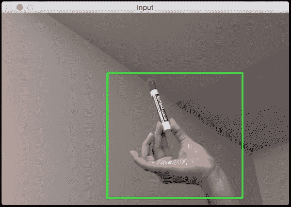

分割图像后，它将看起来像这样：


以下是执行此操作的代码：

```py
import cv2
import numpy as np

# Draw rectangle based on the input selection
def draw_rectangle(event, x, y, flags, params):
    global x_init, y_init, drawing, top_left_pt, bottom_right_pt, img_orig

    # Detecting mouse button down event
    if event == cv2.EVENT_LBUTTONDOWN:
        drawing = True
        x_init, y_init = x, y

    # Detecting mouse movement
    elif event == cv2.EVENT_MOUSEMOVE:
        if drawing:
            top_left_pt, bottom_right_pt = (x_init,y_init), (x,y)
            img[y_init:y, x_init:x] = 255 - img_orig[y_init:y, x_init:x]
            cv2.rectangle(img, top_left_pt, bottom_right_pt, (0,255,0), 2)

    # Detecting mouse button up event
    elif event == cv2.EVENT_LBUTTONUP:
        drawing = False
        top_left_pt, bottom_right_pt = (x_init,y_init), (x,y)
        img[y_init:y, x_init:x] = 255 - img[y_init:y, x_init:x]
        cv2.rectangle(img, top_left_pt, bottom_right_pt, (0,255,0), 2)
        rect_final = (x_init, y_init, x-x_init, y-y_init)

        # Run Grabcut on the region of interest
        run_grabcut(img_orig, rect_final)

# Grabcut algorithm
def run_grabcut(img_orig, rect_final):
    # Initialize the mask
    mask = np.zeros(img_orig.shape[:2],np.uint8)

    # Extract the rectangle and set the region of
    # interest in the above mask
    x,y,w,h = rect_final
    mask[y:y+h, x:x+w] = 1

    # Initialize background and foreground models
    bgdModel = np.zeros((1,65), np.float64)
    fgdModel = np.zeros((1,65), np.float64)

    # Run Grabcut algorithm
    cv2.grabCut(img_orig, mask, rect_final, bgdModel, fgdModel, 5, cv2.GC_INIT_WITH_RECT)

    # Extract new mask
    mask2 = np.where((mask==2)|(mask==0),0,1).astype('uint8')

    # Apply the above mask to the image
    img_orig = img_orig*mask2[:,:,np.newaxis]

    # Display the image
    cv2.imshow('Output', img_orig)

if __name__=='__main__':
    drawing = False
    top_left_pt, bottom_right_pt = (-1,-1), (-1,-1)

    # Read the input image
    img_orig = cv2.imread(sys.argv[1])
    img = img_orig.copy()

    cv2.namedWindow('Input')
    cv2.setMouseCallback('Input', draw_rectangle)

    while True:
        cv2.imshow('Input', img)
        c = cv2.waitKey(1)
        if c == 27:
            break

    cv2.destroyAllWindows()
```

## 它是如何工作的？

我们从用户指定的种子点开始。 这是我们有兴趣的对象的边界框。 该算法在表面之下估算对象和背景的颜色分布。 该算法将图像的颜色分布表示为 **高斯混合马尔可夫随机场**（**GMMRF**）。 您可以在[这个页面](http://research.microsoft.com/pubs/67898/eccv04-GMMRF.pdf)上参考详细论文以了解有关 GMMRF 的更多信息。 我们需要对象和背景的颜色分布，因为我们将使用此知识来分离对象。 通过将最小割算法应用于 Markov 随机字段，此信息可用于找到最大熵分割。 一旦有了这个，我们就可以使用图切割优化方法来推断标签。

# 分水岭算法

OpenCV 附带了分水岭算法的默认实现。 它非常有名，并且有很多实现。 您可以在[这个页面](http://docs.opencv.org/master/d3/db4/tutorial_py_watershed.html)中阅读有关的更多信息。 由于您已经可以访问 OpenCV 源代码，因此我们将不在此处查看代码。

我们将看到输出结果。 考虑下图：


让我们选择区域：

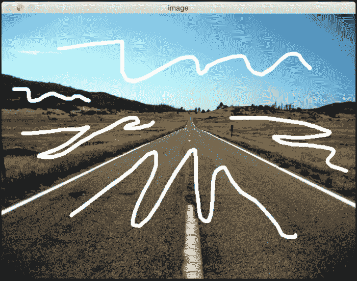

如果对此运行分水岭算法，则输出将类似于以下内容：

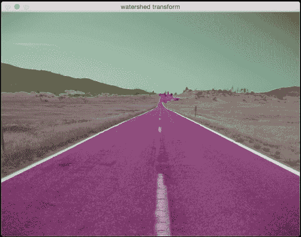

# 摘要

在本章中，我们学习了轮廓分析和图像分割。 我们学习了如何根据模板匹配形状。 我们了解了形状的各种不同属性，以及如何使用它们识别不同种类的形状。 我们讨论了图像分割以及如何使用基于图的方法对图像中的区域进行分割。 我们还简要讨论了分水岭的改造。

在下一章中，我们将讨论如何在实时视频中跟踪对象。