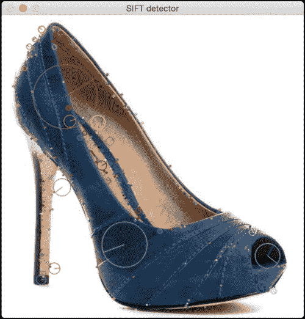
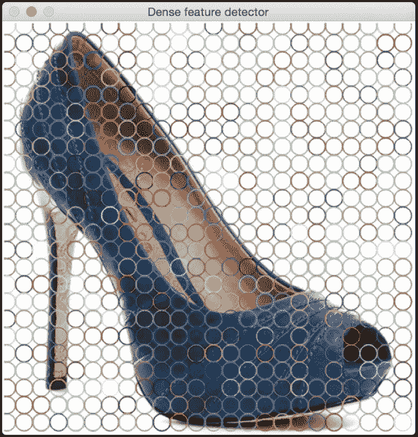
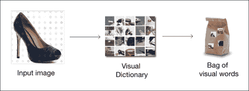
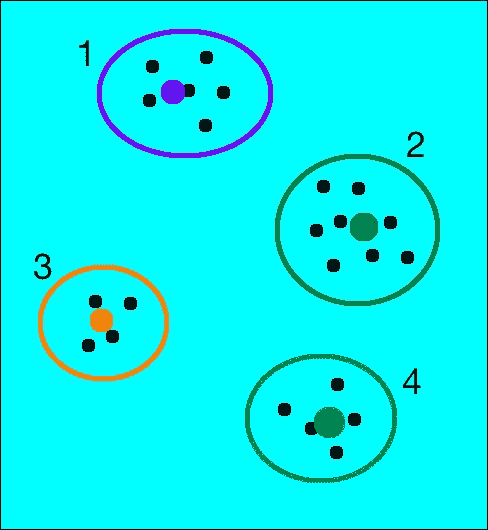
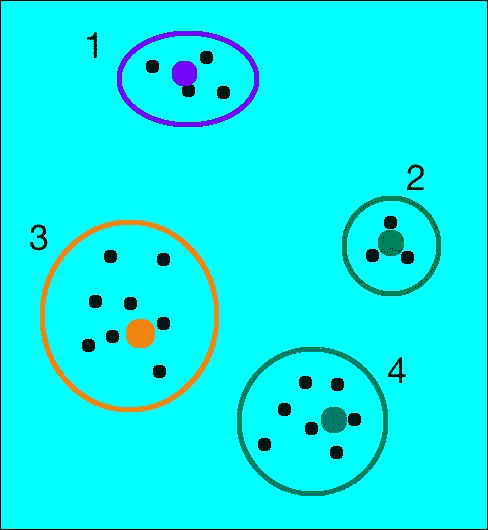
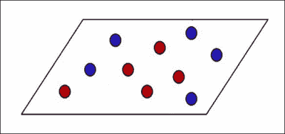
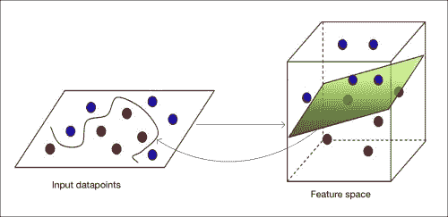
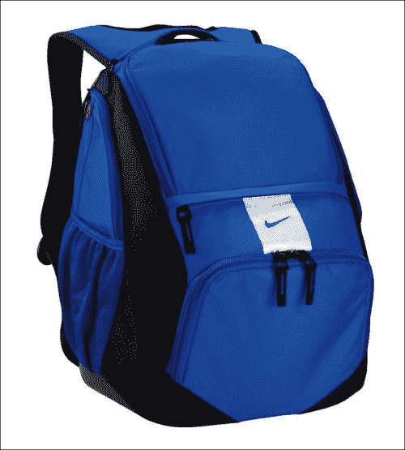

# 十四、对象识别

在本章中，我们将学习对象识别以及如何使用它来构建视觉搜索引擎。 我们将讨论特征检测，构建特征向量以及使用机器学习构建分类器。 我们将学习如何使用这些不同的块来构建对象识别系统。

在本章结束时，您将了解：

*   对象检测和对象识别有什么区别
*   什么是密集特征检测器
*   什么是视觉词典
*   如何建立特征向量
*   什么是监督和无监督学习
*   什么是支持向量机以及如何使用它们来构建分类器
*   如何识别未知图像中的对象

# 对象检测与对象识别

在继续之前，我们需要了解我们将在本章中讨论的。 您必须经常听到“对象检测”和“对象识别”这两个术语，并且它们常常被误认为是同一件事。 两者之间有非常明显的区别。

对象检测是指检测给定场景中特定对象的存在。 我们不知道对象可能是什么。 例如，我们在第 3 章，“检测和跟踪不同身体部位”中讨论了人脸检测。 在讨论过程中，我们仅检测到给定图像中是否存在面部。 我们不认识这个人！ 我们之所以不认识这个人，是因为我们在讨论中并不在意。 我们的目标是找到给定图像中人脸的位置。 商业人脸识别系统同时使用人脸检测和人脸识别来识别人。 首先，我们需要定位面部，然后在裁剪的面部上运行人脸识别器。

对象识别是在给定图像中识别对象的过程。 例如，对象识别系统可以告诉您给定的图像是否包含衣服或鞋子。 实际上，我们可以训练对象识别系统来识别许多不同的对象。 问题在于对象识别是一个非常难以解决的问题。 数十年来，它一直使计算机视觉研究人员望而却步，并且已成为计算机视觉的圣杯。 人类可以很容易地识别出各种各样的物体。 我们每天都会这样做，而且我们会毫不费力地做到这一点，但是计算机无法做到这种准确性。

让我们考虑拿铁杯的图像后的：


对象检测器将为您提供以下信息：


现在，考虑以下茶杯图像的：


如果通过对象检测器运行它，将看到以下结果：


如您所见，对象检测器检测到茶杯的存在，仅此而已。 如果您训练对象识别器，它将为您提供以下信息，如下图所示：


如果考虑第二张图像，它将为您提供以下信息：


如您所见，完美的对象识别器会为提供与该对象相关的所有信息。 如果对象识别器知道对象位于何处，则其功能将更加准确。 如果您的图像很大，而杯子只是其中的一小部分，则对象识别器可能无法识别它。 因此，第一步是检测对象并获得边界框。 一旦有了这些，就可以运行对象识别器来提取更多信息。

# 什么是密集特征检测器？

为了从图像中提取有意义的信息，我们需要确保特征提取器从给定图像的所有部分中提取特征。 考虑下图：


如果使用特征提取器提取特征，它将看起来像这样：



如果使用`Dense` 检测器，它将看起来像这样：



我们也可以控制密度。 让我们使其稀疏：


通过这样做，我们可以确保处理图像中的每个单个部分。 这是执行此操作的代码：

```py
import cv2
import numpy as np

class DenseDetector(object):
    def __init__(self, step_size=20, feature_scale=40, img_bound=20):
        # Create a dense feature detector
        self.detector = cv2.FeatureDetector_create("Dense")

        # Initialize it with all the required parameters
        self.detector.setInt("initXyStep", step_size)
        self.detector.setInt("initFeatureScale", feature_scale)
        self.detector.setInt("initImgBound", img_bound)

    def detect(self, img):
        # Run feature detector on the input image
        return self.detector.detect(img)

if __name__=='__main__':
    input_image = cv2.imread(sys.argv[1])
    input_image_sift = np.copy(input_image)

    # Convert to grayscale
    gray_image = cv2.cvtColor(input_image, cv2.COLOR_BGR2GRAY)

    keypoints = DenseDetector(20,20,5).detect(input_image)

    # Draw keypoints on top of the input image
    input_image = cv2.drawKeypoints(input_image, keypoints,
            flags=cv2.DRAW_MATCHES_FLAGS_DRAW_RICH_KEYPOINTS)

    # Display the output image
    cv2.imshow('Dense feature detector', input_image)

    # Initialize SIFT object
    sift = cv2.SIFT()

    # Detect keypoints using SIFT
    keypoints = sift.detect(gray_image, None)

    # Draw SIFT keypoints on the input image
    input_image_sift = cv2.drawKeypoints(input_image_sift,
            keypoints, flags=cv2.DRAW_MATCHES_FLAGS_DRAW_RICH_KEYPOINTS)

    # Display the output image
    cv2.imshow('SIFT detector', input_image_sift)

    # Wait until user presses a key
    cv2.waitKey()
```

这使我们能够紧密控制来提取的信息量。 当我们使用 SIFT 检测器时，图像的某些部分被忽略了。 当我们要处理突出特征时，这种方法效果很好，但是当我们构建对象识别器时，我们需要评估图像的所有部分。 因此，我们使用密集检测器，然后从那些关键点提取特征。

# 什么是视觉词典？

我们将使用，**词袋**模型来构建对象识别器。 每个图像表示为视觉单词的直方图。 这些视觉词基本上是使用从训练图像中提取的所有关键点构建的`N`重心。 管道如下图所示：



从每个训练图像中，我们检测一组关键点，并为每个关键点提取特征。 每个图像都会产生不同数量的关键点。 为了训练分类器，必须使用固定长度的特征向量来表示每个图像。 该特征向量不过是一个直方图，其中每个箱子对应一个视觉单词。

从训练图像中所有关键点提取所有特征时，我们将执行 K-Means 聚类并提取`N`个质心。 `N`是给定图像的特征向量的长度。 现在，每个图像将表示为一个直方图，其中每个箱子对应于`N`个质心之一。 为了简单起见，假设`N`设置为 4。现在，在给定图像中，我们提取`K`关键点。 在这`K`个关键点中，其中一些将最接近第一个质心，其中一些将最接近第二质心，依此类推。 因此，我们基于最接近每个关键点的质心构建直方图。 该直方图成为我们的特征向量。 该过程称为**向量量化**。

为了理解向量量化，让我们考虑一个例子。 假设我们有一幅图像，并且已经从中提取了一定数量的特征点。 现在我们的目标是以特征向量的形式表示该图像。 考虑下图：


如您所见，我们有 4 个质心。 请记住，图中显示的点代表特征空间，而不是图像中这些特征点的实际几何位置。 上图中以这种方式显示了它，因此很容易可视化。 图像中许多不同几何位置的点在特征空间中可以彼此靠近。 我们的目标是将该图像表示为直方图，其中每个箱子对应于这些质心之一。 这样，无论我们从图像中提取多少个特征点，都将始终将其转换为固定长度的特征向量。 因此，我们将每个特征点“四舍五入”到其最近的质心，如下图所示：



如果您为此图像构建直方图，它将看起来像这样：


现在，如果考虑具有不同特征点分布的不同图像，它将看起来像这样：


群集如下所示：



直方图如下所示：


如您所见，即使点似乎是随机分布的，两个图像的直方图也有很大不同。 这是一项非常强大的技术，已广泛用于计算机视觉和信号处理中。 有许多不同的方法可以做到这一点，而准确性取决于您希望它有多细。 如果增加质心的数量，将可以更好地表示图像，从而增加特征向量的唯一性。 话虽如此，重要的是要提到您不能仅仅无限期地增加质心的数量。 如果这样做，它将变得过于嘈杂并失去其功能。

# 什么是监督和无监督学习？

如果您熟悉机器学习的基础知识，那么您一定会知道什么是监督和无监督学习。 为了让大家早日复习，有监督的学习是指基于标记的样本构建功能。 例如，如果我们要构建一个将服装图像与鞋类图像分离的系统，那么我们首先需要建立一个数据库并对其进行标签。 我们需要告诉我们的算法，哪些图像对应于衣服，哪些图像对应于鞋。 基于这些数据，该算法将学习如何识别衣服和鞋子，以便当出现未知图像时，它可以识别该图像中的内容。

无监督学习与我们刚刚讨论的相反。 这里没有标签数据。 假设我们有一堆图像，我们只想将它们分成三组。 我们不知道标准是什么。 因此，无监督学习算法将尝试以最佳可能的方式将给定的数据集分为 3 组。 我们讨论此问题的原因是因为我们将结合使用有监督学习和无监督学习来构建目标识别系统。

# 什么是支持向量机？

**支持向量机**（**SVM**）是在机器学习领域中非常流行的监督学习模型。 SVM 确实擅长分析标记的数据和检测模式。 给定一堆数据点和相关的标签，SVM 将以最佳方式构建分离的超平面。

等一下，什么是“超飞机”？ 为了理解这一点，让我们考虑下图：


如您所见，这些点被与这些点等距的线边界分隔开。 这很容易在 2 维上可视化。 如果尺寸为 3 维，则分隔符为平面。 当我们为图像构建特征时，特征向量的长度通常在六位数范围内。 因此，当我们进入如此高的维度空间时，“线”的等效物将是超平面。 制定超平面后，我们将使用数学模型根据未知数据在地图上的位置进行分类。

## 如果我们不能用简单的直线分离数据怎么办？

我们在 SVM 中使用了一种称为**核技巧**的东西。 考虑下图：



如我们所见，我们不能画一条简单的直线将红色点和蓝色点分开。 提出一个可以满足所有要求的曲线优美的边界非常昂贵。 SVM 确实擅长绘制“直线”。 那么，我们在这里的答案是什么？ 关于 SVM 的好处是，它们可以在任意数量的维度上绘制这些“直线”。 因此，从技术上讲，如果将这些点投影到一个高维空间中，可以通过一个简单的超平面将它们分开，则 SVM 将提供精确的边界。 一旦有了该边界，就可以将其投影回原始空间。 该超平面在我们原始的较低维空间上的投影看起来是弯曲的，如下图所示：



SVM 的主题确实很深，我们将无法在此处进行详细讨论。 如果您真的有兴趣，可以在线找到大量材料。 您可以通过简单的教程来更好地理解它。

# 我们如何实际实现呢？

现在，我们到达了内核。 到目前为止的讨论是必要的，因为它为您提供了构建对象识别系统所需的背景。 现在，让我们构建一个对象识别器，该对象识别器可以识别给定的图像是否包含衣服，一双鞋子或一个包。 我们可以轻松扩展此系统以检测任意数量的项目。 我们从三个不同的项目开始，以便您以后可以开始进行试验。

在开始之前，我们需要确保我们具有一组训练图像。 在线有许多数据库，其中图像已经按组排列。 Caltech256 可能是最流行的对象识别数据库之一。 您可以从[这个页面](http://www.vision.caltech.edu/Image_Datasets/Caltech256)下载。 创建一个名为`images`的文件夹，并在其中创建三个子文件夹，即`dress`，`footwear`和`bag`。 在每个子文件夹中，添加与该项目相对应的 20 张图像。 您可以只从互联网下载这些图像，但要确保这些图像的背景干净。

例如，礼服图片将如下所示：


鞋类图片如下所示：


袋子图像如下所示：



现在我们有 60 张训练图像，我们准备开始。 附带说明一下，对象识别系统实际上需要成千上万张训练图像才能在现实世界中表现良好。 由于我们正在构建一个对象识别器来检测 3 种类型的对象，因此每个对象仅拍摄 20 张训练图像。 添加更多的训练图像将提高我们系统的准确性和鲁棒性。

这里的第一步是从所有训练图像中提取特征向量，并建立可视词典（也称为代码本）。 这是代码：

```py
import os
import sys
import argparse
import cPickle as pickle
import json

import cv2
import numpy as np
from sklearn.cluster import KMeans

def build_arg_parser():
    parser = argparse.ArgumentParser(description='Creates features for given images')
    parser.add_argument("--samples", dest="cls", nargs="+", action="append",
            required=True, help="Folders containing the training images. \
            The first element needs to be the class label.")
    parser.add_argument("--codebook-file", dest='codebook_file', required=True,
            help="Base file name to store the codebook")
    parser.add_argument("--feature-map-file", dest='feature_map_file', required=True,
            help="Base file name to store the feature map")

    return parser

# Loading the images from the input folder
def load_input_map(label, input_folder):
    combined_data = []

    if not os.path.isdir(input_folder):
        raise IOError("The folder " + input_folder + " doesn't exist")

    # Parse the input folder and assign the  labels
    for root, dirs, files in os.walk(input_folder):
        for filename in (x for x in files if x.endswith('.jpg')):
            combined_data.append({'label': label, 'image': os.path.join(root, filename)})

    return combined_data

class FeatureExtractor(object):
    def extract_image_features(self, img):
        # Dense feature detector
        kps = DenseDetector().detect(img)

        # SIFT feature extractor
        kps, fvs = SIFTExtractor().compute(img, kps)

        return fvs

    # Extract the centroids from the feature points
    def get_centroids(self, input_map, num_samples_to_fit=10):
        kps_all = []

        count = 0
        cur_label = ''
        for item in input_map:
            if count >= num_samples_to_fit:
                if cur_label != item['label']:
                    count = 0
                else:
                    continue

            count += 1

            if count == num_samples_to_fit:
                print "Built centroids for", item['label']

            cur_label = item['label']
            img = cv2.imread(item['image'])
            img = resize_to_size(img, 150)

            num_dims = 128
            fvs = self.extract_image_features(img)
            kps_all.extend(fvs)

        kmeans, centroids = Quantizer().quantize(kps_all)
        return kmeans, centroids

    def get_feature_vector(self, img, kmeans, centroids):
        return Quantizer().get_feature_vector(img, kmeans, centroids)

def extract_feature_map(input_map, kmeans, centroids):
    feature_map = []

    for item in input_map:
        temp_dict = {}
        temp_dict['label'] = item['label']

        print "Extracting features for", item['image']
        img = cv2.imread(item['image'])
        img = resize_to_size(img, 150)

        temp_dict['feature_vector'] = FeatureExtractor().get_feature_vector(
                    img, kmeans, centroids)

        if temp_dict['feature_vector'] is not None:
            feature_map.append(temp_dict)

    return feature_map

# Vector quantization
class Quantizer(object):
    def __init__(self, num_clusters=32):
        self.num_dims = 128
        self.extractor = SIFTExtractor()
        self.num_clusters = num_clusters
        self.num_retries = 10

    def quantize(self, datapoints):
        # Create KMeans object
        kmeans = KMeans(self.num_clusters,
                        n_init=max(self.num_retries, 1),
                        max_iter=10, tol=1.0)

        # Run KMeans on the datapoints
        res = kmeans.fit(datapoints)

        # Extract the centroids of those clusters
        centroids = res.cluster_centers_

        return kmeans, centroids

    def normalize(self, input_data):
        sum_input = np.sum(input_data)
        if sum_input > 0:
            return input_data / sum_input
        else:
            return input_data

    # Extract feature vector from the image
    def get_feature_vector(self, img, kmeans, centroids):
        kps = DenseDetector().detect(img)
        kps, fvs = self.extractor.compute(img, kps)
        labels = kmeans.predict(fvs)
        fv = np.zeros(self.num_clusters)

        for i, item in enumerate(fvs):
            fv[labels[i]] += 1

        fv_image = np.reshape(fv, ((1, fv.shape[0])))
        return self.normalize(fv_image)

class DenseDetector(object):
    def __init__(self, step_size=20, feature_scale=40, img_bound=20):
        self.detector = cv2.FeatureDetector_create("Dense")
        self.detector.setInt("initXyStep", step_size)
        self.detector.setInt("initFeatureScale", feature_scale)
        self.detector.setInt("initImgBound", img_bound)

    def detect(self, img):
        return self.detector.detect(img)

class SIFTExtractor(object):
    def compute(self, image, kps):
        if image is None:
            print "Not a valid image"
            raise TypeError

        gray_image = cv2.cvtColor(image, cv2.COLOR_BGR2GRAY)
        kps, des = cv2.SIFT().compute(gray_image, kps)
        return kps, des

# Resize the shorter dimension to 'new_size'
# while maintaining the aspect ratio
def resize_to_size(input_image, new_size=150):
    h, w = input_image.shape[0], input_image.shape[1]
    ds_factor = new_size / float(h)

    if w < h:
        ds_factor = new_size / float(w)

    new_size = (int(w * ds_factor), int(h * ds_factor))
    return cv2.resize(input_image, new_size)

if __name__=='__main__':
    args = build_arg_parser().parse_args()

    input_map = []
    for cls in args.cls:

        assert len(cls) >= 2, "Format for classes is `<label> file`"
        label = cls[0]
        input_map += load_input_map(label, cls[1])

    # Building the codebook
    print "===== Building codebook ====="
    kmeans, centroids = FeatureExtractor().get_centroids(input_map)
    if args.codebook_file:
        with open(args.codebook_file, 'w') as f:
            pickle.dump((kmeans, centroids), f)

    # Input data and labels
    print "===== Building feature map ====="
    feature_map = extract_feature_map(input_map, kmeans, centroids)
    if args.feature_map_file:
        with open(args.feature_map_file, 'w') as f:
            pickle.dump(feature_map, f)
```

## 代码内部发生了什么？

我们需要做的第一件事是提取质心。 这就是我们要建立视觉词典的方式。 `FeatureExtractor`类中的`get_centroids`方法旨在实现此目的。 我们会不断收集从关键点提取的图像特征，直到有足够数量的特征为止。 由于我们使用的是密集探测器，因此 10 张图像就足够了。 我们只拍摄 10 张图像的原因是因为它们会产生大量功能。 即使添加更多特征点，质心也不会改变太多。

提取质心后，就可以继续进行特征提取的下一步了。 形心集是我们的视觉词典。 函数`extract_feature_map`将从每个图像中提取特征向量，并将其与相应的标签关联。 这样做的原因是因为我们需要此映射来训练我们的分类器。 我们需要一组数据点，并且每个数据点都应与一个标签关联。 因此，我们从图像开始，提取特征向量，然后将其与相应的标签（例如包，衣服或鞋类）相关联。

`Quantizer`类旨在实现向量量化并构建特征向量。 对于从图像中提取的每个关键点，`get_feature_vector`方法会在我们的词典中找到最接近的视觉单词。 通过这样做，我们最终基于可视词典构建了直方图。 现在，将每个图像表示为一组视觉单词的组合。 因此，名称为**词袋**。

下一步是使用这些功能训练分类器。 这是代码：

```py
import os
import sys
import argparse

import cPickle as pickle
import numpy as np
from sklearn.multiclass import OneVsOneClassifier
from sklearn.svm import LinearSVC
from sklearn import preprocessing

def build_arg_parser():
    parser = argparse.ArgumentParser(description='Trains the classifier models')
    parser.add_argument("--feature-map-file", dest="feature_map_file", required=True,
            help="Input pickle file containing the feature map")
    parser.add_argument("--svm-file", dest="svm_file", required=False,
            help="Output file where the pickled SVM model will be stored")
    return parser

# To train the classifier
class ClassifierTrainer(object):
    def __init__(self, X, label_words):
        # Encoding the labels (words to numbers)
        self.le = preprocessing.LabelEncoder()

        # Initialize One vs One Classifier using a linear kernel
        self.clf = OneVsOneClassifier(LinearSVC(random_state=0))

        y = self._encodeLabels(label_words)
        X = np.asarray(X)
        self.clf.fit(X, y)

    # Predict the output class for the input datapoint
    def _fit(self, X):
        X = np.asarray(X)
        return self.clf.predict(X)

    # Encode the labels (convert words to numbers)
    def _encodeLabels(self, labels_words):
        self.le.fit(labels_words)
        return np.array(self.le.transform(labels_words), dtype=np.float32)

    # Classify the input datapoint
    def classify(self, X):
        labels_nums = self._fit(X)
        labels_words = self.le.inverse_transform([int(x) for x in labels_nums])
        return labels_words

if __name__=='__main__':
    args = build_arg_parser().parse_args()
    feature_map_file = args.feature_map_file
    svm_file = args.svm_file

    # Load the feature map
    with open(feature_map_file, 'r') as f:
        feature_map = pickle.load(f)

    # Extract feature vectors and the labels
    labels_words = [x['label'] for x in feature_map]

    # Here, 0 refers to the first element in the
    # feature_map, and 1 refers to the second
    # element in the shape vector of that element
    # (which gives us the size)
    dim_size = feature_map[0]['feature_vector'].shape[1]

    X = [np.reshape(x['feature_vector'], (dim_size,)) for x in feature_map]

    # Train the SVM
    svm = ClassifierTrainer(X, labels_words)
    if args.svm_file:
        with open(args.svm_file, 'w') as f:
            pickle.dump(svm, f)
```

## 我们如何构建训练器？

我们使用`scikit-learn`包来构建 SVM 模型。 您可以安装它，如下所示：

```py
$ pip install scikit-learn

```

我们从标记的数据开始，并将其提供给`OneVsOneClassifier`方法。 我们有一个`classify`方法，该方法可以对输入图像进行分类并为其关联标签。

让我们试一下吧？ 确保有一个名为`images`的文件夹，其中有这三个类的训练图像。 创建一个名为`models`的文件夹，该文件夹将存储学习模型。 在终端上运行以下命令以创建功能并训练分类器：

```py
$ python create_features.py --samples bag img/bag/ --samples dress img/dress/ --samples footwear img/footwear/ --codebook-file models/codebook.pkl --feature-map-file models/feature_map.pkl
$ python training.py --feature-map-file models/feature_map.pkl --svm-file models/svm.pkl

```

现在已经对分类器进行了训练，我们只需要一个模块即可对输入图像进行分类并检测其中的物体。 这是执行此操作的代码：

```py
import os
import sys
import argparse
import cPickle as pickle

import cv2
import numpy as np

import create_features as cf
from training import ClassifierTrainer

def build_arg_parser():
    parser = argparse.ArgumentParser(description='Extracts features \
            from each line and classifies the data')
    parser.add_argument("--input-image", dest="input_image", required=True,
            help="Input image to be classified")
    parser.add_argument("--svm-file", dest="svm_file", required=True,
            help="File containing the trained SVM model")
    parser.add_argument("--codebook-file", dest="codebook_file",
            required=True, help="File containing the codebook")
    return parser

# Classifying an image
class ImageClassifier(object):
    def __init__(self, svm_file, codebook_file):
        # Load the SVM classifier
        with open(svm_file, 'r') as f:
            self.svm = pickle.load(f)

        # Load the codebook
        with open(codebook_file, 'r') as f:
            self.kmeans, self.centroids = pickle.load(f)

    # Method to get the output image tag
    def getImageTag(self, img):
        # Resize the input image
        img = cf.resize_to_size(img)

        # Extract the feature vector
        feature_vector = cf.FeatureExtractor().get_feature_vector(img, self.kmeans, self.centroids)

        # Classify the feature vector and get the output tag
        image_tag = self.svm.classify(feature_vector)

        return image_tag

if __name__=='__main__':
    args = build_arg_parser().parse_args()
    svm_file = args.svm_file
    codebook_file = args.codebook_file
    input_image = cv2.imread(args.input_image)

    print "Output class:", ImageClassifier(svm_file, codebook_file).getImageTag(input_image)
```

我们都准备好了！ 我们只是从输入图像中提取`feature`向量，并将其用作分类器的输入参数。 让我们继续看看是否可行。 从互联网上下载随机的鞋类图片，并确保其背景干净。 通过用正确的文件名替换`new_image.jpg`，运行以下命令：

```py
$ python classify_data.py --input-image new_image.jpg --svm-file models/svm.pkl --codebook-file models/codebook.pkl

```

我们可以使用相同的技术来构建视觉搜索引擎。 视觉搜索引擎查看输入图像并显示一堆与其相似的图像。 我们可以重用对象识别框架来构建它。 从输入图像中提取特征向量，并将其与训练数据集中的所有特征向量进行比较。 选择最热门的比赛并显示结果。 这是一种简单的做事方式！

在现实世界中，我们必须处理数十亿张图像。 因此，在显示输出之前，您无力搜索每个图像。 有很多算法可用于确保在现实世界中高效而快速。 深度学习已在该领域广泛使用，并且在最近几年中显示出很大的希望。 它是机器学习的一个分支，专注于学习数据的最佳表示，因此机器可以更轻松地*学习*新任务。 您可以在[这个页面](http://deeplearning.net)上详细了解。

# 总结

在本章中，我们学习了如何构建对象识别系统。 详细讨论了对象检测和对象识别之间的区别。 我们了解了密集特征检测器，可视词典，向量量化，以及如何使用这些概念来构建特征向量。 讨论了有监督和无监督学习的概念。 我们讨论了支持向量机以及如何使用它们构建分类器。 我们学习了如何识别未知图像中的物体，以及如何扩展该概念以构建视觉搜索引擎。

在下一章中，我们将讨论立体成像和 3D 重建。 我们将讨论如何构建深度图并从给定场景中提取 3D 信息。